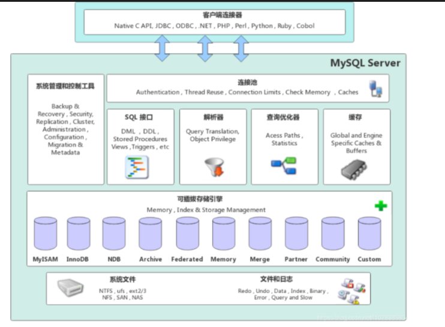
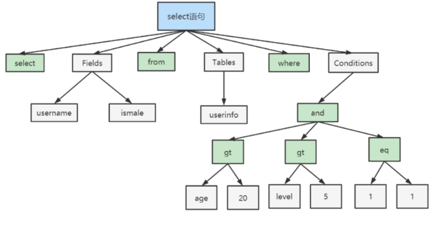
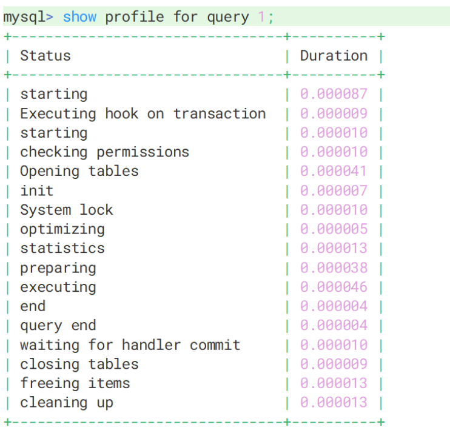
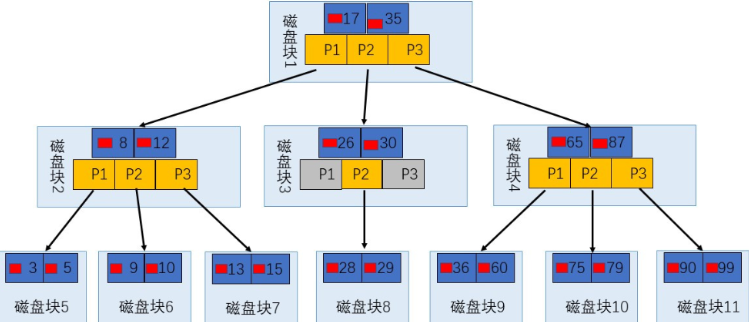
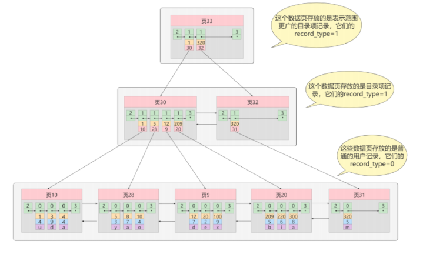
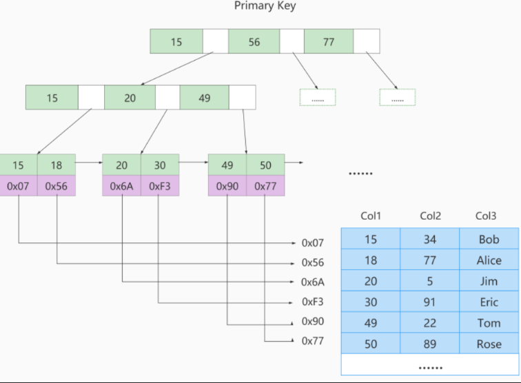
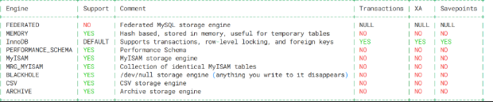
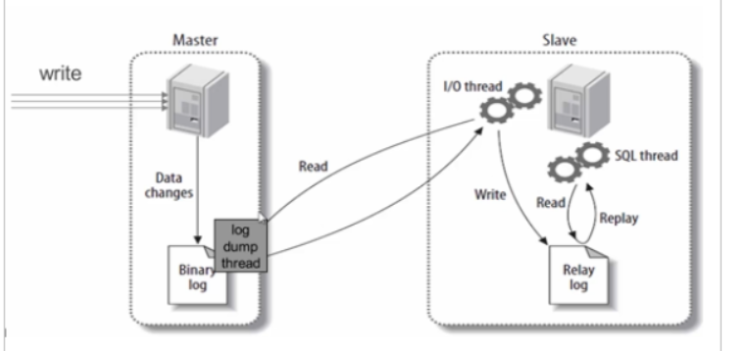

# MySQL 高级

> 参考文档：
> - [MySQL 8.0 Reference Manual](https://dev.mysql.com/doc/refman/8.0/en/)
> - [ShardingSphere 官方文档](https://shardingsphere.apache.org/document/current/cn/)

---

## 一、安装部署与环境配置

### 1.1 Docker 部署 MySQL 8.0

```bash
# 拉取镜像
docker pull mysql:8.0.30

# 或本地加载
docker load -i mysql-8.0.30.tar

# 启动容器
docker run -di \
  --name mysql \
  -p 3306:3306 \
  -v mysql_data:/var/lib/mysql \
  -v mysql_conf:/etc/mysql \
  -e MYSQL_ROOT_PASSWORD=your_password \
  mysql:8.0.30

# 进入容器（设置编码防止中文乱码）
docker exec -it -e LANG=C.UTF-8 mysql bash
```

### 1.2 字符集

MySQL 8.0 之前，默认字符集为 `latin1`（不支持中文）。**从 MySQL 8.0 开始，默认字符集改为 `utf8mb4`**，从根本上避免中文乱码。

```sql
-- 查看当前字符集配置
SHOW VARIABLES LIKE '%char%';
```

| 字符集 | 字节范围 | 说明 |
|--------|----------|------|
| `utf8mb3`（旧称 `utf8`） | 1～3 字节 | 阉割版，**无法存储 emoji 表情** |
| `utf8mb4` | 1～4 字节 | 正宗 UTF-8，支持所有 Unicode 字符 |

!!! warning "字符集陷阱"
    - MySQL 5.7 中的 `utf8` = `utf8mb3`
    - MySQL 8.0 中的 `utf8` = `utf8mb4`
    - 建库建表建议**显式指定 `utf8mb4`**，不依赖默认值

### 1.3 大小写敏感规则

| 操作系统 | 规则 |
|----------|------|
| **Windows** | 全部不区分大小写 |
| **Linux** | 数据库名、表名、表别名 **严格区分**；列名和列别名 **不区分**；关键字和函数名 **不区分** |

```sql
-- 设置大小写规则（需重启 MySQL，且需删除数据目录后重新初始化）
-- 在 /etc/my.cnf 的 [mysqld] 中添加：
lower_case_table_names=1
```

| 值 | 含义 |
|----|------|
| `0` | 按存储的大小写比较（Linux 默认） |
| `1` | 表名以小写存储，比较时不区分大小写 |
| `2` | 表名按原样存储，但比较时转为小写 |

!!! warning "注意"
    `lower_case_table_names` 在 MySQL 8.0+ **初始化后不可修改**，必须在首次初始化前设置。

### 1.4 sql_mode（SQL 严格模式）

从 **MySQL 5.7** 开始，`sql_mode` 默认设置为**严格模式**，拒绝不规范的数据插入。

```sql
-- 查看当前模式
SHOW VARIABLES LIKE 'sql_mode';                -- session 级别
SELECT @@session.sql_mode;                     -- 当前会话
SELECT @@global.sql_mode;                      -- 全局

-- 设置模式
SET SESSION sql_mode = 'STRICT_TRANS_TABLES,...';   -- 当前会话生效
SET GLOBAL sql_mode = 'STRICT_TRANS_TABLES,...';    -- 全局（需重连生效，重启失效）
```

永久配置（`/etc/my.cnf`）：

```ini
[mysqld]
sql-mode = "STRICT_TRANS_TABLES,NO_ZERO_IN_DATE,NO_ZERO_DATE,ERROR_FOR_DIVISION_BY_ZERO,NO_ENGINE_SUBSTITUTION"
```

| 模式 | 说明 |
|------|------|
| `ONLY_FULL_GROUP_BY` | `GROUP BY` 时，`SELECT` 只能包含聚合函数或 `GROUP BY` 中的字段 |
| `STRICT_TRANS_TABLES` | 事务表中插入非法值直接报错并回滚 |
| `NO_ZERO_IN_DATE` | 不允许日期/月份为零 |
| `NO_ZERO_DATE` | 不允许插入 `0000-00-00` |
| `ERROR_FOR_DIVISION_BY_ZERO` | 除零报错而非返回 `NULL` |
| `NO_ENGINE_SUBSTITUTION` | 需要的存储引擎不可用时**报错**而非自动替换 |

---

## 二、MySQL 逻辑架构

<p align='center'>

</p>

### 2.1 整体分层

MySQL 采用**插件式存储引擎**架构，从上到下分为四层：

```
┌──────────────────────────────────────────┐
│         Connectors（连接器）               │  ← 客户端（JDBC/Navicat/Python...）
├──────────────────────────────────────────┤
│          MySQL Server                     │
│  ┌────────────────────────────────────┐  │
│  │        连接层（Connection）          │  │  ← TCP 握手、认证、权限、线程池
│  ├────────────────────────────────────┤  │
│  │        服务层（Services）            │  │  ← 解析、优化、缓存、内置函数
│  │  SQL Interface / Parser / Optimizer│  │
│  │  Caches & Buffers / Built-in Funcs │  │
│  ├────────────────────────────────────┤  │
│  │       引擎层（Storage Engine）       │  │  ← InnoDB / MyISAM / Memory
│  └────────────────────────────────────┘  │
├──────────────────────────────────────────┤
│        存储层（File System）               │  ← 数据文件、索引文件、日志文件
└──────────────────────────────────────────┘
```

### 2.2 各层详解

#### 连接层

1. 客户端建立 **TCP 三次握手**连接
2. MySQL 进行**身份认证**（用户名 + 密码）
   - 认证失败 → `Access denied for user`
   - 认证成功 → 加载权限表，后续权限判断依赖此时读到的权限
3. 从**线程池**获取线程处理交互

#### 服务层

| 组件 | 作用 |
|------|------|
| **SQL Interface** | 接收 SQL 命令，返回结果。支持 DML、DDL、存储过程、视图、触发器等 |
| **Parser（解析器）** | 词法分析 → 语法分析 → 语义分析，生成语法树（AST） |
| **Optimizer（优化器）** | 生成执行计划，选择最优查询路径 |
| **Caches & Buffers** | 查询缓存（MySQL 8.0 已移除） |

解析器三步骤：

```
词法分析：将 SQL 拆分为 token（关键字、表名、列名等）
    ↓
语法分析：按 MySQL 语法规则生成解析树
    ↓
语义分析：检查表/列是否存在、用户是否有权限
```

<p align='center'>

</p>

!!! info "查询缓存已废弃"
    MySQL 8.0 **移除了 Query Cache**，因为表级别的任何写操作都会导致整个缓存失效，在高并发写入场景下弊大于利。

#### 引擎层

存储引擎负责**数据的存储和提取**，通过 API 与 Server 层通信。不同引擎有不同的存储结构和算法。

#### 存储层

所有数据、表定义、索引、日志都以**文件形式**存放在文件系统上。

### 2.3 SQL 执行流程分析

```sql
-- 开启 profiling
SET profiling = 1;

-- 执行你的 SQL
SELECT * FROM users WHERE age > 20;

-- 查看最近的 SQL 执行概况
SHOW PROFILES;

-- 查看具体某条 SQL 的详细执行过程
SHOW PROFILE FOR QUERY <query_id>;
```

<p align='center'>

</p>

### 2.4 存储引擎

```sql
-- 查看支持的引擎
SHOW ENGINES;

-- 查看默认引擎
SHOW VARIABLES LIKE 'default_storage_engine';
```

| 特性 | **InnoDB**（默认） | **MyISAM** | **Memory** |
|------|:---:|:---:|:---:|
| 事务 | ✅ 支持 | ❌ | ❌ |
| 行级锁 | ✅ | ❌（表锁） | ❌（表锁） |
| 外键 | ✅ | ❌ | ❌ |
| 崩溃恢复 | ✅ | ❌ | ❌ |
| 数据存储 | 磁盘 | 磁盘 | **内存** |
| 缓存 | 索引 + 数据 | 仅索引 | N/A |
| 适用场景 | 高并发、事务场景 | 读多写少、简单查询 | 临时数据、缓存 |

!!! tip "引擎选择"
    - 99% 场景直接用 **InnoDB**
    - 纯只读报表可考虑 MyISAM（节省资源）
    - 临时中间结果可用 Memory（注意重启丢数据）

```sql
-- 建表时指定引擎
CREATE TABLE users (id INT) ENGINE = InnoDB;

-- 修改已有表的引擎
ALTER TABLE users ENGINE = MyISAM;
```

---

## 三、索引底层原理

### 3.1 什么是索引

> MySQL 官方定义：**索引（Index）是帮助 MySQL 高效获取数据的数据结构。**

本质：将磁盘上的数据组织成**高效查找的数据结构**（B+ 树），减少 I/O 次数。

| 优点 | 缺点 |
|------|------|
| 提高数据检索效率，降低 I/O 成本 | 创建和维护索引耗费时间 |
| 保证数据唯一性（唯一索引/主键） | 占用额外磁盘空间 |
| 加速排序和分组 | 降低写操作性能（需同步维护索引） |

### 3.2 B 树（B-Tree）

B 树是一种**多路平衡查找树**。

<p align='center'>

</p>

**核心特点**：

- 所有节点（含非叶子节点）**都存储键值和数据指针**
- 数据可能在**任何一层**被找到
- 所有叶子节点在同一层

**为什么不适合做数据库索引**：

1. 范围查询效率低 —— 找到第一个值后需**重新从根遍历**
2. 非叶子节点存数据指针 → 每个磁盘块存储的键更少 → 树更高 → **I/O 更多**

### 3.3 B+ 树（MySQL InnoDB 的选择）

B+ 树是 B 树的改进版，是 **InnoDB 索引的标准实现**。

<p align='center'>

</p>

**核心特点**：

- 非叶子节点**只存索引键**，不存数据
- **所有数据都在叶子节点**
- 叶子节点通过**双向链表**相连

!!! tip "为什么 MySQL 选择 B+ 树"
    1. **范围查询高效**：叶子节点是有序链表，找到起点后可顺序遍历
    2. **I/O 更少**：非叶子节点只存键，单页可存更多键 → **树更矮** → 查询 I/O 更少
    3. **性能稳定**：所有查询都必须到叶子节点，路径长度一致

| 对比项 | B 树 | B+ 树 |
|--------|------|-------|
| 数据存储 | 所有节点都存 | **仅叶子节点**存 |
| 范围查询 | 低效（需重新遍历） | **高效**（链表顺序遍历） |
| 树高度 | 较高 | **更矮**（单页存更多键） |
| 查询稳定性 | 不稳定（可能中途找到） | **稳定**（必须到叶子） |

### 3.4 InnoDB 中的索引

#### 聚簇索引（主键索引）

- B+ 树叶子节点存储**完整的行数据**
- 一张表**只能有一个**聚簇索引
- 数据按主键顺序物理存储
- 无主键时：优先用唯一非空索引 → 都没有则创建隐藏的 6 字节 Row ID

#### 二级索引（非聚簇索引）

- 叶子节点存储 **索引键值 + 主键值**
- 一张表可以有**多个**二级索引
- 查询需要**回表**：二级索引找主键 → 聚簇索引找完整数据

<p align='center'>

</p>

| 特性 | 聚簇索引 | 二级索引 |
|------|----------|----------|
| 叶子节点内容 | **完整行数据** | 索引键 + 主键值 |
| 数量 | 每表 1 个 | 每表多个 |
| 查询步骤 | 一次查找 | 可能需要回表（二次查找） |

#### 联合索引与最左前缀原则

```sql
-- 创建联合索引
CREATE INDEX idx_abc ON users (a, b, c);
```

| 查询条件 | 索引使用情况 |
|----------|-------------|
| `WHERE a = 1` | ✅ 完全生效 |
| `WHERE a = 1 AND b = 2` | ✅ 完全生效 |
| `WHERE a = 1 AND b = 2 AND c = 3` | ✅ 完全生效 |
| `WHERE b = 2` | ❌ 失效（跳过最左列 a） |
| `WHERE a = 1 AND c = 3` | ⚠️ a 生效，c 失效 |
| `WHERE a = 1 AND b > 2 AND c = 3` | ⚠️ a、b 生效，c 失效（范围后失效） |

!!! tip "最左前缀口诀"
    联合索引就像电话号码，必须从**第一位开始拨**，跳着拨打不通。范围查询（`>`、`<`、`LIKE 'xx%'`）之后的列索引失效。

#### 覆盖索引

查询所需的所有列**都已包含在索引中**，无需回表。

```sql
-- idx_name_age 覆盖了 name 和 age
SELECT name, age FROM users WHERE name = '张三';  -- ✅ 覆盖索引，无需回表
```

#### MyISAM 索引结构（对比理解）

MyISAM 的索引是非聚簇的，叶子节点存储的是**数据记录的物理地址**（文件偏移量），而非主键值。

<p align='center'>

</p>

---

## 四、索引操作

### 4.1 创建索引

=== "随表创建"
    ```sql
    CREATE TABLE customer (
        id INT UNSIGNED AUTO_INCREMENT,
        customer_no VARCHAR(200),
        customer_name VARCHAR(200),

        PRIMARY KEY(id),                          -- 主键索引
        UNIQUE INDEX uk_no(customer_no),           -- 唯一索引
        INDEX idx_name(customer_name),             -- 普通索引
        INDEX idx_no_name(customer_no, customer_name) -- 联合索引
    );
    ```

=== "单独创建"
    ```sql
    -- 普通索引
    CREATE INDEX idx_name ON table_name(column_name);

    -- 唯一索引
    CREATE UNIQUE INDEX uk_email ON users(email);

    -- ALTER 方式
    ALTER TABLE table_name ADD INDEX idx_name(column_name);
    ```

### 4.2 查看 & 删除索引

```sql
-- 查看索引
SHOW INDEX FROM table_name;

-- 删除普通索引
DROP INDEX idx_name ON table_name;

-- 删除主键索引
ALTER TABLE table_name DROP PRIMARY KEY;
-- 若有 AUTO_INCREMENT，需先去掉自增：
-- ALTER TABLE table_name MODIFY id INT;
```

### 4.3 索引使用场景

!!! success "应该建索引"
    1. `WHERE`、`GROUP BY`、`ORDER BY` 频繁出现的字段
    2. 区分度（Cardinality）高的列
    3. 多表 JOIN 的连接字段（优先**被驱动表**）
    4. 联合索引中查询最频繁的列放最左

!!! danger "不应建索引"
    1. 查询中用不到的字段
    2. 数据量很小的表（全表扫描更快）
    3. 大量重复数据的列（如性别）
    4. 频繁增删改的列（索引维护成本高）
    5. 冗余索引（已有 `(a, b)`，再建 `(a)` 是多余的）

---

## 五、索引优化实战

### 5.1 EXPLAIN 性能分析

```sql
EXPLAIN SELECT * FROM users WHERE name = '张三';
```

EXPLAIN 输出的核心字段：

| 字段 | 说明 | 关注点 |
|------|------|--------|
| `id` | 查询编号，id 越大越先执行 | 查询趟数越少越好 |
| `table` | 当前行涉及的表 | — |
| `type` ⭐ | 访问类型，**最重要的性能指标** | 见下方排序 |
| `possible_keys` | 可能用到的索引 | — |
| `key` | 实际使用的索引 | 为 NULL 说明没用索引 |
| `key_len` | 索引使用的字节数 | 联合索引中越大越好 |
| `ref` | 与索引比较的列或常量 | — |
| `rows` | 预估扫描行数 | 越小越好 |
| `filtered` | 过滤效率（百分比） | 越高越好 |
| `Extra` ⭐ | 额外信息 | 见下方说明 |

#### type 性能等级（从优到劣）

```
system > const > eq_ref > ref > range > index > ALL
```

| type | 含义 | 示例 |
|------|------|------|
| `system` | 表仅一行（MyISAM） | — |
| `const` | 主键/唯一索引 = 常量 | `WHERE id = 1` |
| `eq_ref` | JOIN 时主键/唯一索引 = 另一列 | `JOIN ... ON a.id = b.a_id` |
| `ref` | 普通索引 = 常量 | `WHERE name = '张三'` |
| `range` | 索引范围扫描 | `WHERE age BETWEEN 20 AND 30` |
| `index` | 全索引扫描 | 覆盖索引但扫描全部 |
| `ALL` | 全表扫描 | **必须优化** |

#### Extra 常见值

| Extra | 含义 | 性能 |
|-------|------|------|
| `Using index` | **覆盖索引**，无需回表 | ✅ 优秀 |
| `Using index condition` | **索引下推**，引擎层提前过滤 | ✅ 良好 |
| `Using where` | Server 层过滤，未走索引 | ⚠️ 较差 |
| `Using filesort` | 无法用索引排序，文件排序 | ⚠️ 较差 |
| `Using temporary` | 使用了临时表 | ⚠️ 较差 |
| `Using join buffer` | JOIN 未有效用索引 | ⚠️ 需优化 |

### 5.2 索引下推（Index Condition Pushdown）

!!! tip "什么是索引下推"
    MySQL 5.6 引入的优化：在存储引擎层，利用联合索引的后续列提前过滤，**减少回表次数**。

**场景示例**：联合索引 `(name, age)`，查询：

```sql
SELECT * FROM users WHERE name LIKE '张%' AND age = 30;
```

```
无索引下推：
  name 索引 → 查出所有"张%"的 id → 全部回表 → Server 层按 age=30 过滤

有索引下推：
  name 索引 → 引擎层用 age=30 过滤 → 只回表符合条件的行 ← 减少回表
```

### 5.3 索引失效场景

!!! danger "以下情况会导致索引失效"

| 失效原因 | 示例 | 说明 |
|---------|------|------|
| 违反最左前缀 | `WHERE b = 2`（索引 `(a, b, c)`） | 跳过了最左列 |
| 索引列计算 | `WHERE age + 1 = 25` | 函数/运算导致无法使用索引 |
| 隐式类型转换 | `WHERE phone = 13800000000`（phone 是 VARCHAR） | 字符串字段用数字查 |
| 左模糊查询 | `WHERE name LIKE '%张'` | `LIKE` 前缀通配符 |
| 范围查询右侧 | `WHERE a = 1 AND b > 2 AND c = 3` | `b` 后面的 `c` 失效 |
| `OR` 连接 | `WHERE a = 1 OR b = 2` | 除非两边都有索引，否则全表扫 |
| `IS NULL / IS NOT NULL` | 视数据分布，优化器可能选择全表 | — |
| `!=` 或 `<>` | `WHERE age <> 20` | 通常不走索引 |

!!! tip "优化口诀"
    ```
    全值匹配我最爱，最左前缀要遵守；
    带头大哥不能死，中间兄弟不能断；
    索引列上少计算，范围之后全失效；
    like 百分写最右，覆盖索引不写 *；
    不等空值还有 or，索引失效要少用；
    var 引号不能丢，SQL 高级也不难。
    ```

### 5.4 关联查询优化

| 原则 | 说明 |
|------|------|
| 小表驱动大表 | 让数据量小的表做驱动表 |
| 被驱动表加索引 | 驱动表加索引效果有限 |
| 连接字段类型一致 | 类型/编码不一致会导致索引失效 |

!!! info "Inner Join 驱动表选择"
    MySQL 优化器会自动选择小表做驱动表（两张都有索引时），否则选没有索引的表。

### 5.5 排序 & 分组优化

| 场景 | 能否用索引 |
|------|-----------|
| `ORDER BY` + 无 `WHERE` / `LIMIT` | 可能走 `index` 扫描（覆盖索引场景） |
| `ORDER BY` + `WHERE` | `WHERE` 和 `ORDER BY` 都用上索引最佳 |
| 排序方向不同 | `ORDER BY a ASC, b DESC` → 索引失效 |

```sql
-- 无法用索引排序（type = ALL）
EXPLAIN SELECT * FROM emp ORDER BY name;

-- 可以走索引（覆盖索引，type = index）
EXPLAIN SELECT name FROM emp ORDER BY name;

-- LIMIT 也可作为"过滤"让索引生效
EXPLAIN SELECT * FROM emp ORDER BY name LIMIT 10;
```

### 5.6 单路排序 vs 双路排序

| | 双路排序（旧） | 单路排序（新） |
|--|-----------|-----------|
| 磁盘读取 | **两次**（先读排序字段 → 排序 → 再读其他字段） | **一次**（读取所有字段后排序） |
| 性能 | 慢 | 快 |
| 内存 | 少 | 多 |
| IO 类型 | 随机 IO | 顺序 IO |

```sql
-- 查看阈值（默认 4KB）
SHOW VARIABLES LIKE '%max_length_for_sort_data%';
SHOW VARIABLES LIKE '%sort_buffer_size%';
```

!!! tip "优化策略"
    - 行记录大 + 数据量小 → 增大 `max_length_for_sort_data`，强制单路
    - 行记录小 + 数据量大 → 减小 `max_length_for_sort_data`，强制双路
    - 最佳方案：**只 `SELECT` 需要的列**，减少行大小

### 5.7 覆盖索引优化

```sql
-- ❌ 不好：SELECT * 需要回表
SELECT * FROM users WHERE name = '张三';

-- ✅ 好：idx_name_age 已覆盖所需列
SELECT name, age FROM users WHERE name = '张三';
```

---

## 六、慢查询日志

### 6.1 开启与配置

```sql
-- 开启慢查询日志
SET GLOBAL slow_query_log = 1;

-- 查看配置和日志路径
SHOW VARIABLES LIKE '%slow_query_log%';

-- 设置阈值（默认 10 秒，大于此值才记录）
SHOW VARIABLES LIKE '%long_query_time%';
SET GLOBAL long_query_time = 0.1;  -- 测试用，实际按业务定
```

!!! warning "注意"
    - 设置后**需重新登录**才生效
    - 等于 `long_query_time` 不记录，只记录**严格大于**的值
    - 开启慢查询日志有轻微性能影响，生产环境按需开启

### 6.2 mysqldumpslow 分析工具

```bash
# 查看帮助
mysqldumpslow --help

# 返回记录最多的 10 条 SQL
mysqldumpslow -s r -t 10 /var/lib/mysql/slow.log

# 访问次数最多的 10 条 SQL
mysqldumpslow -s c -t 10 /var/lib/mysql/slow.log

# 按时间排序，含 left join 的前 10 条
mysqldumpslow -s t -t 10 -g "left join" /var/lib/mysql/slow.log | more
```

| 参数 | 说明 |
|------|------|
| `-s` | 排序方式：`c`（次数）、`t`（时间）、`r`（返回行数）、`l`（锁定时间） |
| `-t` | 返回前 N 条 |
| `-g` | 正则匹配 |
| `-a` | 不将数字/字符串抽象为 N/S |

---

## 七、视图（View）

视图是一张**虚拟表**，不存储实际数据，只是保存了 `SELECT` 查询的定义。

### 7.1 基本语法

```sql
-- 创建/替换视图
CREATE OR REPLACE VIEW v_emp_dept AS
SELECT e.name, e.salary, d.dept_name
FROM employees e
JOIN departments d ON e.dept_id = d.id
WHERE e.status = 'active';

-- 查询视图（与查表无异）
SELECT * FROM v_emp_dept WHERE salary > 5000;

-- 删除视图
DROP VIEW v_emp_dept;
```

### 7.2 优缺点

| 优点 | 缺点 |
|------|------|
| 简化复杂查询 | 每次查询都执行底层 SQL，可能很慢 |
| 隐藏敏感字段（权限控制） | **视图不能建索引**（无物理数据） |
| 逻辑独立性（底层改结构不影响上层） | 多层嵌套后执行计划难以分析 |
| — | 部分视图不可更新（含聚合、`GROUP BY` 等） |

---

## 八、MVCC（多版本并发控制）⭐

MVCC 是 InnoDB 实现 **Read Committed** 和 **Repeatable Read** 隔离级别的核心机制。

> 核心目标：解决**读-写冲突**，实现无锁并发 —— **读不阻塞写，写不阻塞读**。

### 8.1 隐式字段

InnoDB 每行数据都有三个隐藏列：

| 字段 | 大小 | 说明 |
|------|------|------|
| `DB_TRX_ID` | 6 字节 | 事务 ID，标识最后一次修改该行的事务 |
| `DB_ROLL_PTR` | 7 字节 | 回滚指针，指向 Undo Log 中的上一个版本 |
| `DB_ROW_ID` | 6 字节 | 无主键时自动生成，作为聚簇索引 |

### 8.2 Undo Log

Undo Log 记录数据修改前的**旧值**，两大用途：

1. **事务回滚**：`ROLLBACK` 时恢复旧值
2. **MVCC 快照读**：通过 Undo Log 构建历史版本，实现读不阻塞写

```sql
BEGIN;
UPDATE t_emp SET age = 30 WHERE id = 1;  -- age 原来是 25
-- Undo Log 记录了 age=25 的旧值
ROLLBACK;  -- 利用 Undo Log 恢复 age=25
```

### 8.3 版本链

多个事务修改同一行数据时，通过 `DB_ROLL_PTR` 将各版本串联成**链表**：

```
当前版本(trx_id=103) → Undo Log → 版本(trx_id=101) → Undo Log → 版本(trx_id=99) → ...
```

### 8.4 快照读 vs 当前读

| 类型 | 语句 | 特点 |
|------|------|------|
| **快照读** | 普通 `SELECT` | 通过 MVCC 读取历史快照，**不加锁** |
| **当前读** | `SELECT ... FOR UPDATE` | 读取最新版本，**加锁** |
| | `SELECT ... LOCK IN SHARE MODE` | 共享锁 |
| | `INSERT` / `UPDATE` / `DELETE` | 排他锁 |

### 8.5 Read View（读视图）

Read View 是事务执行时生成的**系统快照**，包含 4 个关键信息：

| 字段 | 含义 |
|------|------|
| `creator_trx_id` | 当前 Read View 创建者的事务 ID |
| `m_ids` | 创建时系统中**所有活跃事务**的 ID 列表 |
| `m_low_limit_id` | `m_ids` 中的**最小值**（下界） |
| `m_up_limit_id` | `m_ids` 中的**最大值 + 1**（上界） |

!!! tip "可见性判断规则"
    判断某行版本（`row_trx_id`）对当前事务是否可见：

    1. **小于下界**（`row_trx_id < m_low_limit_id`）→ ✅ 可见（已提交）
    2. **大于等于上界**（`row_trx_id >= m_up_limit_id`）→ ❌ 不可见（还未开始）
    3. **在区间内**：
       - 在 `m_ids` 中 → ❌ 不可见（活跃中）
       - 不在 `m_ids` 中 → ✅ 可见（已提交）

    > 一句话：**比最小活跃事务更早的已提交，比最大活跃事务更新的看不到，中间的看是否在活跃列表中。**

### 8.6 RC vs RR 级别下 MVCC 的差异

| 隔离级别 | Read View 创建时机 | 效果 |
|----------|-------------------|------|
| **Read Committed** | **每次 SELECT 都创建新 Read View** | 每次都能读到最新已提交数据（不可重复读） |
| **Repeatable Read** | **只在事务开始时创建一次**，后续复用 | 整个事务看到的数据一致（可重复读） |

<p align='center'>

</p>

---

## 九、MySQL 三大日志

### 9.1 Redo Log（重做日志）

| 特性 | 说明 |
|------|------|
| 层级 | **InnoDB 引擎层**日志 |
| 作用 | 保证**持久性**（D），崩溃恢复 |
| 原理 | 修改数据前先写 Redo Log（WAL：Write-Ahead Logging） |
| 格式 | 物理日志，记录"在某个数据页上做了什么修改" |
| 循环写 | 固定大小，循环使用 |

```
事务提交流程：
  修改数据页（内存）→ 写 Redo Log buffer → fsync 刷盘 → 提交
                                    ↑
                              即使数据页未刷盘，
                              Redo Log 已持久化即可恢复
```

### 9.2 Undo Log（回滚日志）

| 特性 | 说明 |
|------|------|
| 层级 | **InnoDB 引擎层**日志 |
| 作用 | 保证**原子性**（A），事务回滚 + MVCC |
| 格式 | 逻辑日志，记录"反操作"（如 INSERT → DELETE） |

### 9.3 Binlog（二进制日志）

| 特性 | 说明 |
|------|------|
| 层级 | **MySQL Server 层**日志（所有引擎都有） |
| 作用 | **主从复制** + **数据恢复**（时间点恢复） |
| 格式 | 追加写入，不会循环 |

#### Binlog 三种格式

=== "STATEMENT"

    记录**原始 SQL 语句**。

    - 日志量小，节省磁盘和网络
    - ❌ `NOW()`、`RAND()`、`UUID()` 等非确定性函数会导致**主从不一致**

=== "ROW（推荐）"

    记录**每行数据的实际变化**（Before/After Image）。

    - ✅ 数据一致性最高，主从严格一致
    - ❌ 日志体积大，尤其批量操作时

=== "MIXED"

    默认使用 STATEMENT 模式。

    - 检测到非确定性函数时**自动切换为 ROW**
    - STATEMENT 与 ROW 的折中方案


```sql
-- 查看/修改 binlog 格式
SHOW VARIABLES LIKE 'binlog_format';
SET GLOBAL binlog_format = 'ROW';
```

### 9.4 三大日志对比

| | Redo Log | Undo Log | Binlog |
|--|----------|----------|--------|
| 所属层 | 引擎层（InnoDB） | 引擎层（InnoDB） | Server 层 |
| 用途 | 崩溃恢复（持久性） | 回滚 + MVCC（原子性） | 主从复制 + 恢复 |
| 日志类型 | 物理日志 | 逻辑日志 | 逻辑 + 物理 |
| 写入方式 | 循环写 | 追加写 | 追加写 |
| 崩溃后 | 用于恢复未刷盘的数据 | 用于回滚未完成的事务 | 用于重放恢复 |

---

## 十、高可用架构

### 10.1 CAP 定理

分布式系统中，三者**只能选其二**：

| 特性 | 含义 |
|------|------|
| **C**onsistency（一致性） | 读操作返回最新写操作的结果 |
| **A**vailability（可用性） | 非故障节点在合理时间内返回响应 |
| **P**artition Tolerance（分区容错性） | 网络分区时系统仍能工作 |

> 实际分布式数据库通常选择 **CP** 或 **AP**。

### 10.2 读写分离架构

```
                ┌─────────────┐
                │   应用层     │
                └──────┬──────┘
                       │
              ┌────────┴────────┐
              │  中间件/代理层   │  ← ShardingSphere / MyCat
              └────────┬────────┘
                       │
            ┌──────────┼──────────┐
            ▼          ▼          ▼
         ┌──────┐  ┌──────┐  ┌──────┐
         │ Master│  │ Slave│  │ Slave│
         │ (写)  │  │ (读) │  │ (读) │
         └──────┘  └──────┘  └──────┘
```

| 原则 | 说明 |
|------|------|
| 主库 | 处理 `INSERT`、`UPDATE`、`DELETE` + 事务操作 |
| 从库 | 处理 `SELECT` 查询 |
| 一主多从 | 查询负载均匀分散 |
| 多主多从 | 提升吞吐 + 高可用 |

### 10.3 数据库分片

#### 垂直分片（纵向拆分）

- **按业务拆分**：不同库负责不同业务模块
- 核心理念：**专库专用**

```
用户库(user_db)     订单库(order_db)     商品库(product_db)
├── user           ├── order            ├── product
├── user_profile   ├── order_item       ├── category
└── address        └── payment          └── sku
```

#### 水平分片（横向拆分）

- **按规则拆分**：相同表结构分散到多个库/表
- 常见规则：`id % N`、范围分片、哈希分片

```
订单表水平拆分为 4 张：
order_ds_0.t_order_0  order_ds_0.t_order_1
order_ds_1.t_order_0  order_ds_1.t_order_1
```

> 阿里巴巴开发手册建议：**单表 > 500 万行或 > 2GB** 才考虑分库分表。

### 10.4 主从同步原理

<p align='center'>

</p>

```
Step 1: Master 将数据变更写入 Binlog
    ↓
Step 2: Slave 的 IO Thread 连接 Master，请求 Binlog
    ↓
Step 3: Master 的 Binlog Dump Thread 发送 Binlog（加锁→发送→解锁）
    ↓
Step 4: Slave 的 IO Thread 写入 Relay Log（中继日志）
    ↓
Step 5: Slave 的 SQL Thread 读取 Relay Log，重放操作
```

### 10.5 一主多从配置（Docker）

=== "Master 配置"
    ```bash
    docker run -d \
      -p 3307:3306 \
      -v /root/mysql/master/conf:/etc/mysql/conf.d \
      -v /root/mysql/master/data:/var/lib/mysql \
      -e MYSQL_ROOT_PASSWORD=your_password \
      --name mysql-master \
      mysql:8.0.30
    ```

    ```ini
    # /root/mysql/master/conf/my.cnf
    [mysqld]
    server-id=1
    binlog_format=ROW
    log-bin=binlog
    ```

    ```sql
    -- 创建从机用户
    CREATE USER 'slave'@'%';
    ALTER USER 'slave'@'%' IDENTIFIED WITH mysql_native_password BY 'slave_password';
    GRANT REPLICATION SLAVE ON *.* TO 'slave'@'%';
    FLUSH PRIVILEGES;

    -- 查看 Master 状态（记录 File 和 Position）
    SHOW MASTER STATUS;
    ```

=== "Slave 配置"
    ```bash
    docker run -d \
      -p 3308:3306 \
      -v /root/mysql/slave/conf:/etc/mysql/conf.d \
      -v /root/mysql/slave/data:/var/lib/mysql \
      -e MYSQL_ROOT_PASSWORD=your_password \
      --name mysql-slave \
      mysql:8.0.30
    ```

    ```ini
    # /root/mysql/slave/conf/my.cnf
    [mysqld]
    server-id=2
    relay-log=relay-bin
    ```

    ```sql
    -- 连接 Master
    CHANGE MASTER TO
      MASTER_HOST='192.168.1.100',
      MASTER_USER='slave',
      MASTER_PASSWORD='slave_password',
      MASTER_PORT=3307,
      MASTER_LOG_FILE='binlog.000004',
      MASTER_LOG_POS=445;

    -- 启动同步
    START SLAVE;

    -- 查看同步状态
    SHOW SLAVE STATUS\G
    ```

!!! warning "主从同步注意"
    - 密码插件需改为 `mysql_native_password`（`caching_sha2_password` 不支持非加密连接）
    - `SHOW MASTER STATUS` 的 `File` 和 `Position` 必须准确填写
    - 主从解绑：`STOP SLAVE` → `RESET SLAVE ALL`

---

## 十一、ShardingSphere-JDBC

> 官方文档：[ShardingSphere 文档](https://shardingsphere.apache.org/document/current/cn/)

### 11.1 快速集成

=== "Maven 依赖"
    ```xml
    <parent>
        <groupId>org.springframework.boot</groupId>
        <artifactId>spring-boot-starter-parent</artifactId>
        <version>3.0.5</version>
    </parent>

    <dependencies>
        <dependency>
            <groupId>org.apache.shardingsphere</groupId>
            <artifactId>shardingsphere-jdbc-core</artifactId>
            <version>5.4.0</version>
        </dependency>
        <dependency>
            <groupId>org.yaml</groupId>
            <artifactId>snakeyaml</artifactId>
            <version>1.33</version>
        </dependency>
    </dependencies>
    ```

=== "application.yml"
    ```yaml
    spring:
      datasource:
        driver-class-name: org.apache.shardingsphere.driver.ShardingSphereDriver
        url: jdbc:shardingsphere:classpath:shardingsphere.yaml
    ```

### 11.2 读写分离配置

**shardingsphere.yaml**：

```yaml
# 模式配置
mode:
  type: Standalone
  repository:
    type: JDBC

# 数据源配置
dataSources:
  write_ds:
    dataSourceClassName: com.zaxxer.hikari.HikariDataSource
    driverClassName: com.mysql.cj.jdbc.Driver
    jdbcUrl: jdbc:mysql://192.168.1.10:3306/db_user
    username: root
    password: your_password
  read_ds_0:
    dataSourceClassName: com.zaxxer.hikari.HikariDataSource
    driverClassName: com.mysql.cj.jdbc.Driver
    jdbcUrl: jdbc:mysql://192.168.1.10:3307/db_user
    username: root
    password: your_password
  read_ds_1:
    dataSourceClassName: com.zaxxer.hikari.HikariDataSource
    driverClassName: com.mysql.cj.jdbc.Driver
    jdbcUrl: jdbc:mysql://192.168.1.10:3308/db_user
    username: root
    password: your_password

# 读写分离规则
rules:
  - !READWRITE_SPLITTING
    dataSourceGroups:
      readwrite_ds:
        writeDataSourceName: write_ds
        readDataSourceNames:
          - read_ds_0
          - read_ds_1
        loadBalancerName: random

# 负载均衡算法
loadBalancers:
  random:
    type: RANDOM
  round_robin:
    type: ROUND_ROBIN

# 打印实际执行的 SQL
props:
  sql-show: true
```

### 11.3 水平分片配置

!!! warning "水平分片主键"
    水平分片后，不能使用 MySQL 自增主键（会导致 ID 重复）。应使用**雪花算法**或分布式 ID 生成器。

```yaml
rules:
  - !SHARDING
    tables:
      t_order:
        # 行表达式：2个库 × 2张表 = 4个物理节点
        actualDataNodes: order_ds_${0..1}.t_order_${0..1}

        # 分库策略
        databaseStrategy:
          standard:
            shardingColumn: user_id
            shardingAlgorithmName: db_inline

        # 分表策略
        tableStrategy:
          standard:
            shardingColumn: id
            shardingAlgorithmName: table_inline

    shardingAlgorithms:
      db_inline:
        type: INLINE
        props:
          algorithm-expression: order_ds_${user_id % 2}
      table_inline:
        type: INLINE
        props:
          algorithm-expression: t_order_${id % 2}
```

### 11.4 行表达式

使用 `${ expression }` 或 `$->{ expression }` 标识 Groovy 表达式：

| 语法 | 示例 | 展开结果 |
|------|------|----------|
| 范围 | `${0..2}` | `0, 1, 2` |
| 枚举 | `${[a, b, c]}` | `a, b, c` |
| 计算 | `$->{user_id % 2}` | `0` 或 `1` |
| 笛卡尔 | `ds_${0..1}.t_${[a,b]}` | `ds_0.t_a, ds_0.t_b, ds_1.t_a, ds_1.t_b` |

### 11.5 雪花算法（Snowflake）

雪花算法是 Twitter 开源的分布式 ID 生成方案，生成 64 位 long 类型 ID：

```
┌──────────────────┬────────────┬─────────┬──────────────┐
│  1 bit (符号)     │ 41 bit 时间戳 │ 10 bit 机器ID │ 12 bit 序列号  │
│    0 (正数)       │  ~69年      │ 1024台   │ 4096/毫秒    │
└──────────────────┴────────────┴─────────┴──────────────┘
```

| 优势 | 说明 |
|------|------|
| 全局唯一 | 不同机器生成的 ID 不同 |
| 趋势递增 | 按时间排序，有利于 B+ 树索引 |
| 高性能 | 本地生成，无网络开销 |
| 高可用 | 无中心化依赖 |

### 11.6 跨分片查询（核心痛点）

!!! danger "跨分片查询"
    当查询条件**未包含分片键**时，ShardingSphere 无法定位目标库/表，会执行**广播查询**（所有库所有表都查一遍），性能严重下降。

| 场景 | 行为 | 性能 |
|------|------|------|
| 无分库键 + 无分表键 | **全库全表扫描** | ❌ 最差 |
| 有分库键 + 无分表键 | 单库内所有表扫描 | ⚠️ 较差 |
| 无分库键 + 有分表键 | 所有库内精准表扫描 | ⚠️ 较差 |
| 有分库键 + 有分表键 | **单库单表精准路由** | ✅ 最优 |

!!! tip "解决方案"
    1. 查询务必带上分片键
    2. 非分片键字段查用 **ES / ClickHouse** 等搜索引擎
    3. 使用 **基因法**（在 ID 中嵌入分片信息）
    4. 定期归档冷数据到 OLAP 系统
