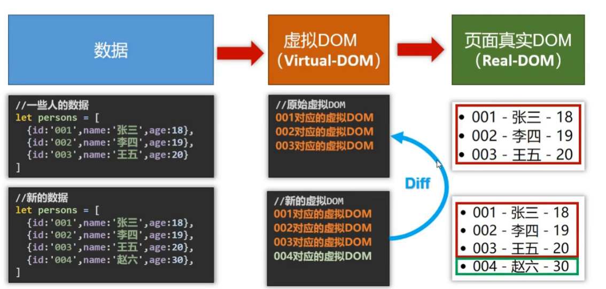
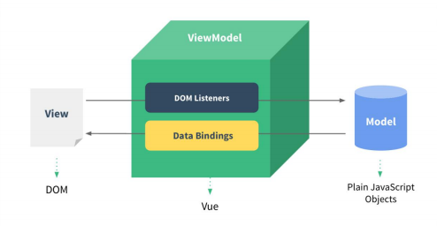
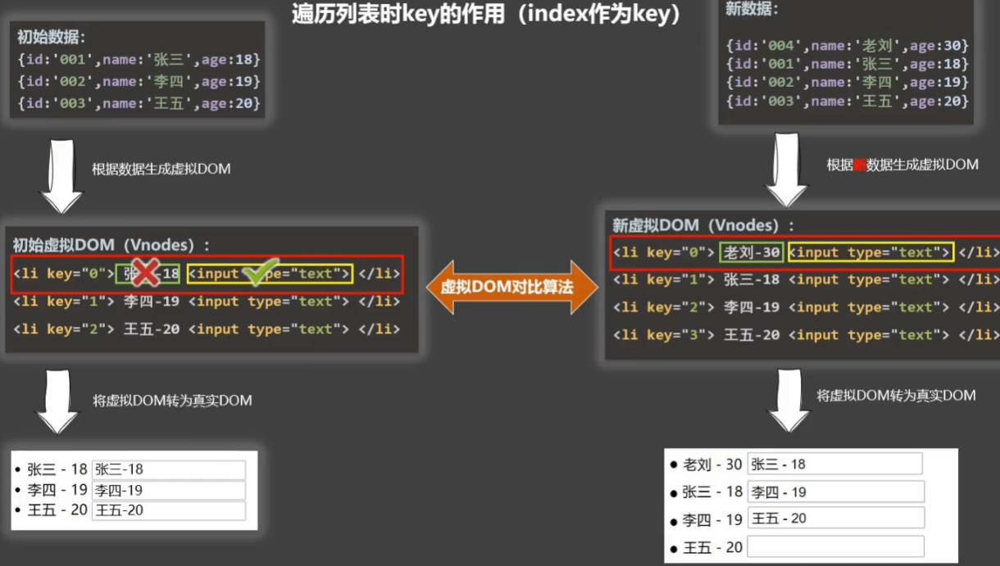
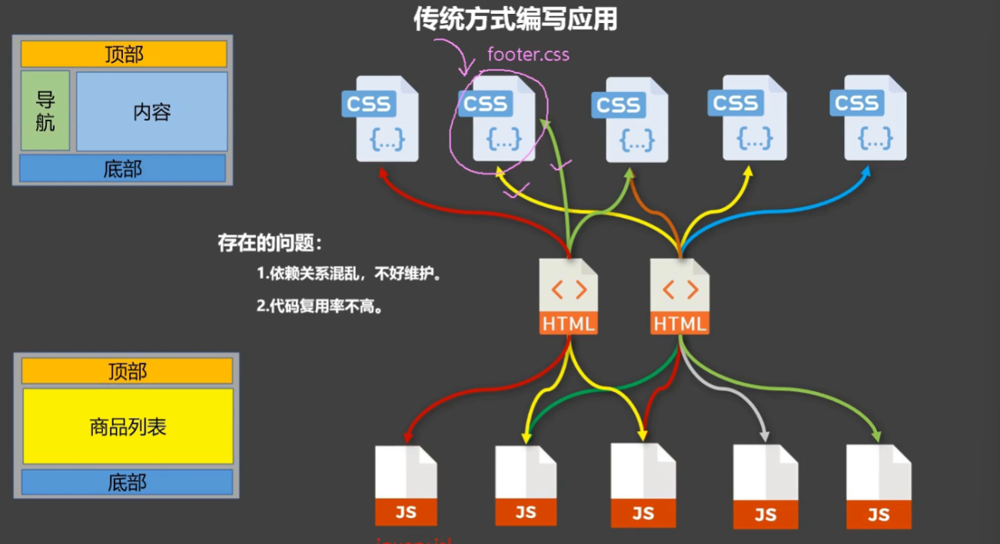
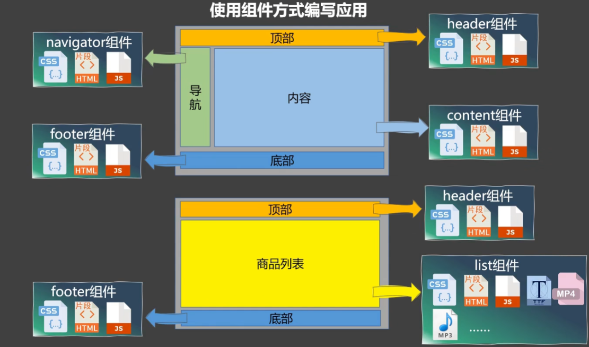
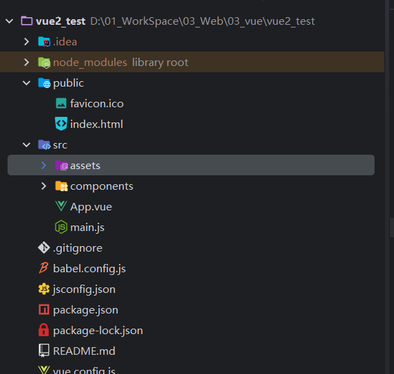
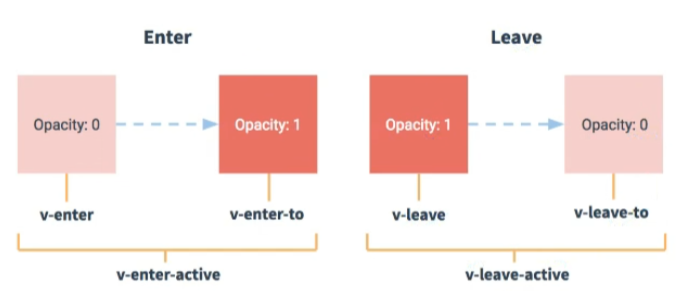
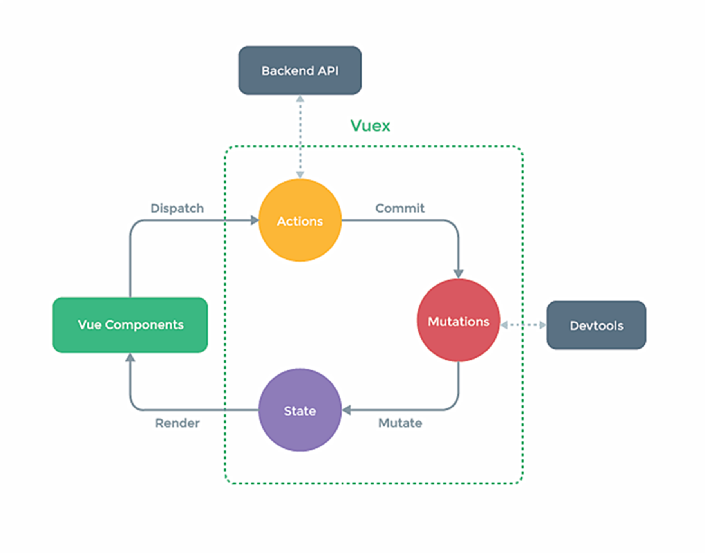

# vue2

🤡：其实我是拒绝学习 vue 2的，但是实习项目的前端是 vue 2，hhh...

完结 vue2，好了，我承认以前我就是🤡，不学 vue2，怎么学好 vue3，啊，我问问，我又不是没学过 vue3，我就问问我自己，学懂了吗？？？？知道组件配置 data为啥要有函数返回对象吗？知道吗？感谢尚硅谷！

## vue 2 基础

### vue2 介绍

好吧，你要问什么是 vue，它是一个 “渐近式” 的 js 框架，至于怎么渐近了，只可意会，不可言传啊。（**根据业务复杂度，一点点地把 Vue 的功能往项目里加**。这就是“渐进”。）

它的两个特性分别为声明式 + 响应式。

声明式：Vue.js 的核心是一个允许采用简洁的模板语法来声明式地将数据渲染进 DOM 的系统：

**响应式**：数据变化 -> 视图自动更新。

<p align='center'>
    
</p>

### vue2 快速开始

先导入 vue.js 依赖，之后便可以创建 vue 实例了。

```js
 Vue.config.productionTip = false
    vm = new Vue({
        el: '#root',
        data: {
            msg: 'hello world'
        }
    })
```

### vue2 MVVM 模型

Vue 并没有完全遵循标准的 MVVM，但受其启发。它通过 **ViewModel** 实现了数据与视图的“自动同步”。

<p align='center'>
    
</p>


- **Model (模型)**：后端传递的 JS 对象，即 `data` 函数返回的数据。

- **View (视图)**：用户看到的页面，即 `template` 转化为的 DOM。

- **ViewModel (视图模型)**：这是 Vue 的核心，它是连接 Model 和 View 的桥梁（Vue 实例）。

ViewModel 内部主要做了两件事：

**Data Bindings (数据绑定)**：当 Model 发生改变，ViewModel 监听到变化，自动更新 View。

**DOM Listeners (DOM 监听)**：当用户在 View 上操作（如输入文本），ViewModel 监听到事件，自动修改 Model。

### vue2 数据代理

#### object.defineProperty

这是实现数据劫持和代理的 API。就是 java 的反射，在运行时操作对象。

```js
let number = 18;
let person = { name: '张三' };

Object.defineProperty(person, 'age', {
  value: 18,         // 初始值
  enumerable: true,  // 控制属性是否可以枚举（遍历），默认 false
  writable: true,    // 控制属性是否可以被修改，默认 false
  configurable: true,// 控制属性是否可以被删除，默认 false

  // 【核心：高级读写控制】
  get() { 
    console.log('有人读取了 age 属性');
    return number; 
  },
  set(value) { 
    console.log('有人修改了 age 属性，值为：', value);
    number = value; 
  }
});
```

#### 何为数据代理

  通过一个对象代理对另一个对象（通常是隐藏的）中属性的操作（读/写）。下面是一个经典的数据代理对象，proxy 全权代理了 obj1 的 x, y 属性。

```js
   let obj1 = {
        "x":100,
        "y":200
    }
    let proxy = {}
    for (let key in obj1){
        Object.defineProperty(proxy, key, {
            get(){
                return obj1[key]
            },
            set(newValue){
                obj1[key] = newValue
            }
        })
    }

    console.log(proxy.x)
```

#### Vue 中的数据代理

   在 Vue 2 中，数据代理专门指：通过 vm 对象来代理 `data` 对象中属性的操作。

  当我们去初始化一个 Vue 实例的时候，Vue 做了两件事情：

- **加工数据**：把传进去的 `data` 存成 `vm._data`，并对其进行响应式处理（添加 getter/setter）。

- **实施代理**：遍历 `_data` 中的 key，通过 `Object.defineProperty` 把它们统统挂载到 `vm` 实例上。

```js
// 假设 vm 是 Vue 实例，data 是你配置的那个对象
function makeProxy(vm, data) {
    Object.keys(data).forEach(key => {
        Object.defineProperty(vm, key, {
            get() {
                return data[key]; // 访问 this.msg 实际返回 this._data.msg
            },
            set(newVal) {
                data[key] = newVal; // 修改 this.msg 实际修改的是 this._data.msg
            }
        });
    });
}
```

### vue2 监听属性的原理


**Observer (监听器)**：通过 `Object.defineProperty` 将数据对象的属性转换成 `getter/setter`。这是“劫持”数据的开始。

**Dep (Dependency，依赖)**：它是每个属性的“管家”。当 `getter` 被触发时，它负责把“谁用到了这个数据”记录下来（收集依赖）。

**Watcher (订阅者/观察者)**：它是连接数据和视图的桥梁。对于视图渲染，Vue 有一个专门的 **Render Watcher**。

Vue 2 的响应式本质是**数据驱动**。它通过 `Object.defineProperty` 将每个数据变成一个带有触发器的“钩子”，一旦数据被写入，这个钩子就会强行触发组件的重新渲染逻辑。

  所以，如果想在程序运行时动态的添加响应式数据，对于对象来说，可以用 `Vue.set(target, key, value) | vue.$set`，对于数组来说，一定要用那七个 vue 提供的方法（对数组原始方法的包裹）：push、pop、shift、unshift、splice... ，并且要注意，不能直接向 vm 示例或者是 vm 的根数据 _data 添加响应式数据。

### vue2 事件处理 

ue 2 的事件处理非常直观，核心在于 `v-on` 指令（简写为 `@`）。它不仅能绑定原生 DOM 事件，还能处理自定义组件事件。

#### 基础绑定

使用 `v-on:click="methodName"` 或 `@click="methodName"`。

⭐**默认传参**：如果不传参，默认第一个参数是原生 `event` 对象。

⭐**显式传参**：如 果需要传自定义参数，同时又需要 `event` 对象，使用 **`$event`** 占位符。

```
<button @click="showInfo">点我</button>

<button @click="showInfo(666, $event)">点我</button>
```

#### 常用事件

**鼠标/点击事件 (Mouse Events)**

**`@click`**：单击。最常用。

**`@dblclick`**：双击。

**`@contextmenu`**：右键菜单。配合 `.prevent` 可以自定义右键菜单。

**`@mousedown / @mouseup`**：鼠标按下/抬起。常用于实现拖拽功能。

**`@mouseenter / @mouseleave`**：鼠标移入/移出（不冒泡，比 `mouseover` 更稳定）。


**键盘事件 (Keyboard Events)**

**`@keyup`**：按键抬起（最常用，因为此时输入框内容已更新）。

**`@keydown`**：按键按下。（tab，ctrl这些比较特殊）

键盘事件修饰符：enter，esc，delete，tab（配合 down 使用），其他按键用它的名字，多干单词分割开来，用 - 连接，比如 caps-lock，或者直接 keyup.键码，或者自定义别名，但 这两种方式不被推荐。

```
@keyup.enter
@keyup.13
@keyup.ctrl.y
```


**表单/输入事件 (Form Events)**

**`@input`**：输入框内容**即时**变化（每打一个字都触发）。`v-model` 的本质就是 `@input`。

**`@change`**：失去焦点且内容发生变化时才触发。

**`@focus / @blur`**：获得焦点/失去焦点。常用于搜索框高亮或表单验证。

**`@submit`**：表单提交。必配 `.prevent` 阻止页面跳转。


**滚轮与滚动事件 (Scroll Events)**

**`@scroll`**：滚动条滚动。

**`@wheel`**：鼠标滚轮滚动（注意：即使滚动条到底了，滚轮依然可以触发）。

### vue2 事件修饰符

Vue 提供了一系列修饰符来处理常见的 DOM 事件逻辑，避免在函数内部写 `e.preventDefault()`。

**注意**：修饰符可以链式调用，例如 `@click.stop.prevent="handle"`。

| **修饰符**     | **作用**                             | **常用场景**                     |
| -------------- | ------------------------------------ | -------------------------------- |
| **`.stop`**    | 阻止事件冒泡                         | 嵌套点击，只触发子元素           |
| **`.prevent`** | 阻止默认行为                         | 提交表单不刷新页面、a 标签不跳转 |
| **`.once`**    | 事件只触发一次                       | 按钮提交、初始化逻辑             |
| **`.capture`** | 使用事件捕获模式                     | 先触发外层，后触发内层           |
| **`.self`**    | 只有 `event.target` 是当前元素才触发 | 忽略冒泡过来的事件               |
| **`.passive`** | 立即执行默认行为，不等待事件回调     | 优化移动端滚动性能               |


### vue2 计算属性

如果模板中写太多的逻辑（如 `{{ firstName + '-' + lastName }}`），会导致模板臃肿、难以维护。而此时我们可以用到**计算属性**：它依赖的属性发生变化时，才会重新计算。如果依赖没变，多次访问会立即返回之前的计算结果，而不执行函数。

当你只需要读取值，不需要修改它时：

```js
computed: {
  fullName() { 
    // 这里的 this 指向 vm 实例
    return this.firstName + '-' + this.lastName;
  }
}
```

如果你需要修改计算属性的值（例如点击按钮修改 `fullName`），则需要配置 `set`：

```js
computed: {
  fullName: {
    // 当有人读取 fullName 时调用或者所依赖数据发生改变时
    get() {
      return this.firsstName + '-' + this.lastName;
    },
    // 当有人修改 fullName 时调用
    set(value) {
      const names = value.split('-');
      this.firstName = names[0];
      this.lastName = names[1];
    }
  }
}
// 简写：
computed:{
    fullName(){
        return this.firstName + this.lastName
    }
}
```

### vue2 监视属性

侦听属性 `watch` 是 Vue 2 中用于响应数据变化的“观察者”。它的核心定位是：**当指定数据变化时，执行预定义的逻辑（通常是异步或开销较大的操作）。**

简写形式：

```js
watch: {
  // 监视 isHot 属性
  isHot(newValue, oldValue) {
    console.log('数据变了', newValue, oldValue);
  }
}
```

当你需要**深度监视**或**页面一加载就执行**时：

```
watch: {
  info: {
    immediate: true, // 初始化时立即执行一次 handler
    deep: true,      // 深度监视：对象内部属性改变也会触发
    handler(newValue, oldValue) {
      console.log('info 改变了');
    }
  }
}
```

或者动态的添加：

```js
vm.$watch('isHot', {
  handler(newValue, oldValue) { /* 逻辑 */ }
})

vm.$watch('ishot', function(n, o){/* 逻辑 */})
```

### vue2 计算属性和监视属性的区别

| **特性**   | **Computed (计算属性)**                | **Watch (侦听属性)**               |
| ---------- | -------------------------------------- | ---------------------------------- |
| **侧重点** | 得到一个**新结果**（重在结果）         | 执行**副作用逻辑**（重在过程）     |
| **缓存**   | **有缓存**，依赖不变不计算             | **无缓存**，变化就触发             |
| **异步**   | **不支持**异步（无法 return 异步结果） | **支持**异步（如发送请求、定时器） |
| **调用**   | 像属性一样使用，不加 `()`              | 监听已存在的属性                   |


### 绑定 class 样式

动态绑定 `class` 是 Vue 2 实现“响应式 UI”的直接手段。它允许根据数据状态，自动切换 CSS 类名，彻底告别频繁的 DOM 操作。

Vue 的 `:class` (即 `v-bind:class`) 支持三种主要写法，根据场景选择：

| **模式**       | **语法**                                          | **适用场景**                             |
| -------------- | ------------------------------------------------- | ---------------------------------------- |
| **字符串写法** | `:class = "temp"`                                 | 适用于类名完全由数据变量决定             |
| **对象语法**   | `:class="{ class1: false|true}"`                  | 适用于根据条件动态决定是否开启某一组样式 |
| **数组语法**   | `:class="classArr"`<br />`:class="['a','b','c']"` | 个数确定、类名确定，但用不用不确定       |
| **三元运算符** | `:class="isActive ? 'active' : ''"`               | 简单的二选一逻辑。                       |


### 绑定 style 样式

 绑定 `style` (内联样式) 主要用于处理**动态数值**（如拖拽坐标、进度条宽度、字体大小），这是 `class` 无法做到的。

`:style` (即 `v-bind:style`) 同样支持对象和数组，但写法更接近 JS 操作 DOM 的 `style` 属性。  

| **模式**     | **语法示例**                          | **适用场景**                        |
| ------------ | ------------------------------------- | ----------------------------------- |
| **对象语法** | `:style="{ fontSize: fSize + 'px' }"` | **最推荐**。动态修改特定 CSS 属性。 |
| **数组语法** | `:style="[baseStyle, overStyle]"`     | 合并多个样式对象。****              |

## vue2 核心指令

### 数据绑定

`v-model` 不是黑魔法，它其实是两个指令的组合：1）**`v-bind:value="xxx"`**：把数据绑定到视图。2）**`v-on:input="xxx = $event.target.value"`**：监听输入，实时更新数据。

（1）对于可以输入的表单项，v-model 默认收集的就是 value 值，没有问题。

（2）对于单选框、复选框这类不能输入的，必须手动写 value 属性，并且对于多选框，双向绑定的那个数据必须是一个数组，不然默认收集的就是 checked。当然，有些时候也会需要收集这个 checked。

（3）对于下拉框，`v-model` 绑定在 `<select>` 标签上，收集的是选中的 `<option>` 的 `value`。

**v-model 的修饰符**

**`.number`**：自动将用户的输入值转为 `Number` 类型（默认输入框收集的都是字符串）。

**`.trim`**：自动过滤用户输入的首尾空格。

**`.lazy`**：不实时更新，失去焦点 (blur) 时才更新。

### 条件渲染

#### v-show 

**机制**：**CSS 属性控制**（本质是 `display: none`）。

```html
<h2 v-show='true | false | 表达式 | 响应式数据'>
```

切换频率**较高**。由于不需要频繁操作 DOM，切换性能极佳，响应速度快。

#### v-if

**机制**：**DOM 节点的创建与销毁**。

```
<h2 v-if='true | false | 表达式 | 响应式数据'>
```

切换频率**较  低**。虽然初次渲染开销小，但切换时的 DOM 操作成本高。

**不要在 `v-if` 后面接乱七八糟的标签**：`v-else` 或 `v-else-if` 必须与 `v-if` **紧紧挨着**写，中间不能有任何其他元素干扰，否则 Vue 会报错找不到对应的 `v-if`。

### 列表渲染

#### 基础语法

`v-for` 是 Vue 2 处理列表数据的核心指令。它的本质就是“遍历”，但在处理 DOM 更新时，它的性能表现完全取决于你是否正确使用了 `key`。

```html
<li v-for="(item, index) in list" :key="index">
  {{ index }} - {{ item.name }}
</li>

<li v-for="(value, key, index) in obj">
  {{ index }} - {{ key }}: {{ value }}
</li>
```

#### Key 的作用 

`key` 是虚拟 DOM 对象的标识。当数据发生变化时，Vue 会根据【新数据】生成【新的虚拟 DOM】，随后对比【新虚拟 DOM】与【旧虚拟 DOM】。

对比规则：

**旧虚拟 DOM 中找到了与新虚拟 DOM 相同的 key**：

​	（1）若虚拟 DOM 中内容没变，直接使用之前的真实 DOM。

​	（2）若虚拟 DOM 中内容变了，则生成新的真实 DOM，随后替换掉页面中之前的真实 DOM。

**旧虚拟 DOM 中未找到与新虚拟 DOM 相同的 key**：

​	（1）创建新的真实 DOM，随后渲染到页面。

<p align='center'>
    
</p>

#### 用 index 作为 key 可能会引发的问题

**破坏顺序操作**：若对数据进行逆序添加、逆序删除等破坏顺序的操作，会产生没有必要的真实 DOM 更新，虽然界面效果没问题，但效率较低。

**输入类 DOM**：如果结构中还包含输入类的 DOM，会产生错误 DOM 更新，导致界面出现问题。

### 列表过滤

列表过滤通过计算属性可以轻松的实现，在这个基础上加排序等逻辑也很简单。

其核心思路是：**原数组不动，通过 `computed` 计算属性生成一个新的“过滤后数组”，模板中遍历这个新数组。**

```
    const vm = new Vue({
            data: {
                keyword:"",
                persons: [
                    {id: "1", name: "张三", age: 11},
                    {id: "2", name: "李四", age: 12},
                    {id: "3", name: "王五", age: 13}
                ],
            },
            computed:{
                filPersons(){
                    return this.persons.filter(p=>{
                        return p.name.indexOf(this.keyword) !== -1
                    })
                }
            }
        })
        vm.$mount("#app")
```

### 过滤器

过滤器 (Filters) 是 Vue 2 中用于**格式化文本**的专属工具。它们的核心作用是：**“不改变原始数据，只改变最终显示的样子。”**

过滤器通过管道符 `|` 将数据传输给处理函数。{{ message | filterA | filterB }}

局部过滤器：

```js
filters: {
  // val 是传入的数据，format 是参数
  myFilter(val, format = 'YYYY-MM-DD') {
    return dayjs(val).format(format); // 假设用了 dayjs 库
  }
}
```

全局过滤器：

```js
Vue.filter('myFilter', function(val) {
  return val.slice(0, 4) + '...';
});		
```

请注意：**Vue 3 已经移除了过滤器语法**。 官方建议在 Vue 3 中直接使用 **方法 (Methods)** 或 **计算属性 (Computed)** 来处理格式化逻辑，这样逻辑更清晰，也更易于维护。 

### vue 内置指令总结

1、v-bind：**数据单向绑定**。将 Vue 实例的数据绑定到 HTML 属性上（如 `src`, `href`, `class`, `style`）。，简写为 :=`js变量`

2、v-model：**数据双向绑定**。通常用于表单元素（`input`, `textarea`, `select`），实现视图与数据的同步更新。

3、v-on：**事件绑定**。监听 DOM 事件并触发对应的 JavaScript 逻辑。简写为：@事件名

4、v-if ` / `v-else-if ` / ` v-else：**条件渲染**（动态控制 DOM 的**存在与否**）。

5、v-show：无论条件真假，DOM 都会被渲染，只是通过 CSS 的 `display: none` 来控制可见性。适用于**频繁切换**的场景。

6、v-for：**列表渲染**。基于一个数组或对象来重复渲染元素。必须配合 **`:key`** 使用（通常绑定唯一 ID），以便 Vue 的 Diff 算法能高效更新虚拟 DOM。

7、v-text：更新元素的 `textContent`。

8、更新元素的 `innerHTML`。

9、v-once：**只渲染一次**。组件或元素在初次渲染后，即使数据变化，也不会再触发更新。可用于性能优化。

10、v-html：更新元素的 `innerHTML`。**慎用！** 容易引发 XSS 攻击。只在信任的内容上使用，绝对不要用在用户提交的内容上。

11、v-cloak：**防止闪烁**,这个标签属性只在 vue 没接管当前模板时候生效。配合 CSS `[v-cloak] { display: none; }` 使用。在 Vue 实例挂载完成前，保持元素隐藏，避免用户看到未编译的 `{{ message }}` 标签。

12、v-pre：跳过其所在节点的解析过程，也就是 vue 不去解析这些标签了，适合那些没有用到任何 vue 管理的成员或者vue指令的标签。

### vue 自定义指令

演示：自定义 v-big 指令，把属性值放大十倍

比较方便的写法就是直接写成一个函数，其实简写就是只写了 bind 和 update，而忽略了 insert

```js
directives:{
            // 调用时机：
            // 1. 指令与元素绑定成功时
            // 2. 指令所在的模板被重写解析时
            big(element, binding){ // element:当前真实dom元素, binding:绑定的参数
                console.log(element, binding.value)
                element.innerHTML = binding.value * 10
            }
        }
```

自定义 v-fbind 指令，让和它绑定的 input 标签自动获得焦点，这个就得写成一个对象了，然后这个对象下面有不同的函数，也就是在不同的时机执行不同的函数！

```js
fbind:{
    bind(element, binding){
        element.value = binding.value
    },
    inserted(element, binding){
        element.focus()
    },
    update(element, binding){
        element.value = binding.value
    }
}
```

总结：

1）自定义指令的名字不要出现大写字母，自定义指令如果有多个字母，用 - 分割，同时在 directives 里面用 '' 包裹

```js
// 自定义 v-big-number

directives:{
	'big-number'(){
		pass
	}
}
```

2）指令回调里面的 this 是什么：是 window，而不是 vue 示例。

3）我们在 directives 里面写的指令是局部指令，其他 vue 示例不能用。

## vue 2 配置选项总结

## vue2 标签属性

#### ref 

之前学的都是“数据驱动视图”（数据变，页面自动变），这很优雅。但现实开发中，总有些“刺头”场景，比如：手动让输入框聚焦、获取某个元素的宽高、或者直接调用第三方库（比如 ECharts 或高德地图）。这时候，Vue 的声明式渲染就“够不着”了，你需要 `ref` 来直接操作 DOM。

`ref` 被用来给元素或子组件注册引用信息。

**在 HTML 标签上**：获取的是**真实 DOM 元素**。

**在组件标签上**：获取的是**组件实例对象 (vc)**。


```
<h2 ref="title">Hello World</h2>
<School ref="sch"><  /School>

mounted() {
  // 获取真实 DOM
  console.log(this.$refs.title); 
  
  // 获取组件实例 (可以调用组件里的方法或访问数据)
  console.log(this.$refs.sch); 
}
```

#### scoped

CSS 本质上是**全局的**。你在一个组件里写的 `div { color: red; }`，会像病毒一样扩散到整个页面。`scoped` 属性就是 Vue 为了解决这个“CSS 污染”问题，给组件加的**最后一道防线**

其实原理就是：Vue 会给组件里所有的 DOM 元素（模板里的 `div`、`h2` 等）自动添加一个唯一的**自定义数据属性**（例如 `data-v-472cff63`）。然后它会把的 CSS 选择器自动加上这个属性限定。

```
.box { color: red; } -->  .box[data-v-472cff63] { color: red; }
```

## vue2 生命周期

[[Vue 实例 — Vue.js](https://v2.cn.vuejs.org/v2/guide/instance.html#创建一个-Vue-实例)](https://v2.cn.vuejs.org/v2/guide/instance.html#%E5%88%9B%E5%BB%BA%E4%B8%80%E4%B8%AA-Vue-%E5%AE%9E%E4%BE%8B)

一切一切的开始，都是 new Vue()

（1）最开始，要进行生命周期、事件的初始化，但数据代理还没开始！

​	beforeCreate()：无法拿到 vm 的数据和方法等。

（2）第二步，是数据监测，数据代理，换人话就是给对象的属性赋值。

​	created()：可以拿到 vm 的数据和方法

（3） 第三步，判断当前 vue 是否配置了 el 选项：

​	是：直接走下面的流程

​	否：等待 vm.$mount() 被调用才往下走

（4）看看当前 vue 示例配置 template 选项没

​	是：解析当前template

​	否：把当前 el's outerHTML 当作是 template，然后去解析

​	before_mount()：页面都是未经过 vue 编译的 dom 结构。此时虚拟 dom 已经生成，但还没有生成真实 dom 并放到页面上，所以在这个时候对所有dom元素的操作最终都不奏效。

（5）将内存中的虚拟 dom 转为 真实 dom 并插入页面（本质其实就是替换了当前 el 对于的那个元素下的 dom。

​	mounted()：页面呈现的都是经过 vue 编译的 dom 结构。至此，初始化过程结束了。

（6）当数据发生变化后，vue 就会调用 beforeUpdate()，此时数据是新的，但页面中的数据还是旧的，因为 vue 还没重新解析模板。

​	beforeUpdate()

（7） 根据新数据，生成新的虚拟 dom，随后与旧的虚拟 dom 进行比较，完成最终的页面更新。

​	updated()：数据和页面同步了。

（8）不想要了，直接调用 vm.$destroy，会触发钩子：beforeDestroy 和 destroyed，注意，在 beforeDestroy  里边操作修改数据，不会触发 vue 重新解析模板了。

| **阶段**   | **钩子 (Hook)** | **数据访问情况** | **DOM 情况**             |
| ---------- | --------------- | ---------------- | ------------------------ |
| **初始化** | `beforeCreate`  | 无数据/方法      | 无                       |
|            | `created`       | **有数据/方法**  | 无                       |
| **挂载**   | `beforeMount`   | 有数据           | 虚拟 DOM 已生成 (不可见) |
|            | `mounted`       | 有数据           | **真实 DOM 已渲染**      |
| **更新**   | `beforeUpdate`  | 数据新，DOM 旧   | 待更新                   |
|            | `updated`       | 数据新，DOM 新   | 已同步                   |
| **销毁**   | `beforeDestroy` | 可访问           | 可访问 (即将销毁)        |
|            | `destroyed`     | 不可访问         | 已销毁                   |


## vue 组件化编程

#### 什么是组件？   

组件就是实现应用中局部功能代码和资源的集合。（html，css，js）

#### 为什么要用组件式编程

**传统编程方式**

1、依赖关系混乱，不好维护。

2、代码复用率不高

<p align='center'>
    
</p>

**组件编程方式**

1、组件复用非常非常方便！！！

<p align='center'>
    
</p>


#### 非单文件组件

一个文件中包含 n 个组件：将组件的所有逻辑（HTML 模板、JavaScript 逻辑、CSS 样式）分散写在一个 HTML 文件里，或者通过全局 JS 变量注册。

```
<script>

    Vue.config.productionTip = false
    // 组件不能去配置 el 配置项，哪里需要方到哪里
    // 组件的 data 必须写出普通函数，在函数里返回对象，因为组件会被多个地方使用，不用函数的话会造成数据混乱

    // 1. 创建组件
    const school = Vue.extend({
        data(){
            return {
                name:"北京大学",
                address:"北京"
            }
        },
        template:`
        <div>
            <h2>{{name}}</h2>
            <h2>{{address}}</h2>
        </div>
        `
    })

    const student = Vue.extend({
        data(){
            return {
                name:"张三",
                age:18
            }
        },
        template:`
        <div>
            <h2>{{name}}</h2>
            <h2>{{age}}</h2>
        </div>
        `
    })

    // 2. 注册组件：局部注册
    const vm = new Vue({
        el:"#root",
        // 全新配置项
        components:{
            school,
            student
        }
    })
    

    // 3. 使用组件
    <div id="root">
        <student></student>
        <school></school>
    </div>
```

全局注册组件！！

```js
Vue.component("组件名",组件变量)
```

#### 单文件组件

这是 Vue 工程化的核心，也是目前 99% 的 Vue 项目采用的方式：将一个组件的所有内容封装在一个以 `.vue` 为后缀的文件中。

```js
<template>
</template>

<script>
    export default{ // 这里省略了 Vue.extend()，采用 js 默认导出

    }
</script>

<style>
</style>
```

#### 组件的注意事项

1、如果组件名是一个单词，那么可以纯小写，也可以首字母大写。

2、如果组件名是多个单词组成的，推荐写法：'my-school'，或者 MySchool。但要注意：这样必须在脚手架环境，不然它会找 myscholl，就会报错。

3、可以在定义组件的时候就去指定名字：name:"test"。开发者工具里就会变成这个名字，但注意，注册时候什么名字在使用的时候就要用什么标签。

4、使用组件时如果想用单标签，必须在脚手架环境。

5、在脚手架环境下，创建组件时可以直接：

```js
const c1 = {

}
```

#### vueComponent

 1、组件的本质就是一个构造函数。是通过 Vue.extend 生成的。

2、当我们写下 `<School/>` 标签时，Vue 的内部运行机制是这样的：它会执行 `new VueComponent(options)`，生成该组件的一个**实例对象**。

3、特别注意：每次调用 Vue.extend() 都会产生一个新的 vueComponent。

4、关于this的指向：

​	1）.组件配置中：data、method、watch、computed的this均是当前 VueComponent  实例对象。

​	2）.new Vue(options)配置中：data、method、watch、computed的this都是当前 Vue 实例，也就是 vm。

#### 一个重要的内置关系

在 JavaScript 中，当你创建一个对象（实例）时，你不需要把所有的方法和属性都塞进这个对象里（那样太占内存了）。相反，你只需要把这些共用的方法放在一个“藏宝阁”（即**原型对象**）里，然后让所有创建出来的对象都连上一条“线”，指向这个藏宝阁。

其实原型就是为了实现“内存复用”和“动态继承”设计的一个链式查找机制。

```
实例对象.__proto__ === 构造函数.prototype
```

而在 vue 中，一个重要的内置关系：

```
VueComponent.prototype.__proto__ === Vue.prototype
```

这是面试最爱考的点：**为什么组件实例能访问到 `this.$mount`、`this.$on` 等 Vue 的原型方法？** 

#### vue2 脚手架

1、 全局安装 @vue/cli：npm install @vue/cli

2、之后，直接 vue create xxxx 就能创建脚手架了

3、启动项目：npm run serve

vue/cli 脚手架创建的项目目录如下：

<p align='center'>
    
</p>


##### main.js

main.js：render: h => h()，非常重要！默认传的参数是一个函数：createElement，原因是在脚手架环境下，es6 模块化语法导入的 vue 是残缺版 vue，不包含模板解析器，而 template 标签的解析交给了："vue-template-compiler": "^2.6.14"。

1）vue.js 是完全版的 vue，包含核心功能 + 模板解析器

2）vue.runtime.xxx.js 是运行版 vue，只包含核心功能，没有模板解析器

```js
render(createElement){
	return createElement(App) // js变量
	return createElement('h1', 'hahahaha')
}
```

```js
import Vue from 'vue' // 这里引入的是一个残缺版的 vue
import App from './App.vue'

Vue.config.productionTip = false

new Vue({
  render: h => h(App), // 所以这里不能配置 template！！也不能通过 components 去注册组件 app 组件。
}).$mount('#app')
```

##### public/index.html

```html
<!DOCTYPE html>
<html lang="">
  <head>
    <meta charset="utf-8">
    <!--针对 ie 浏览器的特殊配置-->
    <meta http-equiv="X-UA-Compatible" content="IE=edge">
    <!-- 开始移动端的理想视口，其实就是适配页面-->
    <meta name="viewport" content="width=device-width,initial-scale=1.0">
    <!--<%= BASE_URL %>指的就是 public 路径-->
    <link rel="icon" href="<%= BASE_URL %>favicon.ico">
    <!--配置网页的标题-->
    <title><%= htmlWebpackPlugin.options.title %></title>
  </head>
  <body>
    <!--如果浏览器不支持 js,下面这个<noscript>中的元素就会被渲染-->
    <noscript>
      <strong>We're sorry but <%= htmlWebpackPlugin.options.title %> doesn't work properly without JavaScript enabled. Please enable it to continue.</strong>
    </noscript>
    <!--容器-->
    <div id="app"></div>
    <!-- built files will be auto injected -->
  </body>
</html>
```


##### vue insepct > output.js

该命令可以看 webpack 的默认配置。

##### vue.config.js

`vue.config.js` 是一个可选的配置文件，如果项目的 (和 `package.json` 同级的) 根目录中存在这个文件，那么它会被 `@vue/cli-service` 自动加载。你也可以使用 `package.json` 中的 `vue` 字段，但是注意这种写法需要你严格遵照 JSON 的格式来写。

```
const { defineConfig } = require('@vue/cli-service')
// 采用 commonjs 的模块化
module.exports = defineConfig({
  transpileDependencies: true,
  lintOnSave: false
})
```

## vue 可复用性

### vue mixin

在 Vue 2 中，Mixin 是一种分发组件中可复用功能的极致方式。它的核心思想很简单：**“把你定义好的一堆选项（data, methods, hooks），直接塞进组件里。”**

定义 mixin.js

```js
export const myMixin = {
  data() { return { x: 100 } },
  methods: {
    showName() { alert(this.name) }
  },
  mounted() {
    console.log('Mixin 的 mounted 被调用了');
  }
}
```

使用 mixin

```js
import { myMixin } from './mixin'
export default {
  mixins: [myMixin], // 注入！
  data() { return { name: '尚硅谷' } }
}
```

Mixin 最大的坑在于**“冲突解决”**。如果 Mixin 里的东西和组件里的东西撞车了，听谁的？

| **类型**                              | **冲突处理规则**                                             |
| ------------------------------------- | ------------------------------------------------------------ |
| **data / methods / computed**         | **组件优先**。组件里的属性会覆盖 Mixin 里的属性。            |
| **生命周期钩子 (mounted, created等)** | **“叠加态”**。两者都会执行，但 Mixin 的钩子会**先于**组件钩子执行。 |

### vue 插件

插件通常用来为 Vue 添加全局功能。插件的功能范围没有严格的限制——一般有下面几种：

1. 添加全局方法或者 property。如：[vue-custom-element](https://github.com/karol-f/vue-custom-element)

2. 添加全局资源：指令/过滤器/过渡等。如 [vue-touch](https://github.com/vuejs/vue-touch)

3. 通过全局混入来添加一些组件选项。如 [vue-router](https://github.com/vuejs/vue-router)

4. 添加 Vue 实例方法，通过把它们添加到 `Vue.prototype` 上实现。

5. 一个库，提供自己的 API，同时提供上面提到的一个或多个功能。如 [vue-router](https://github.com/vuejs/vue-router)

总结，vue的插件本质来说就是个对象！！这个对象必须包含 install() 方法

**自定义插件**：Vue.js 的插件应该暴露一个 `install` 方法。这个方法的第一个参数是 `Vue` 构造器，第二个参数是一个可选的选项对象：

```js
MyPlugin.install = function (Vue, options) {
  // 1. 添加全局方法或 property
  Vue.myGlobalMethod = function () {
    // 逻辑...
  }

  // 2. 添加全局资源
  Vue.directive('my-directive', {
    bind (el, binding, vnode, oldVnode) {
      // 逻辑...
    }
    ...
  })

  // 3. 注入组件选项
  Vue.mixin({
    created: function () {
      // 逻辑...
    }
    ...
  })

  // 4. 添加实例方法
  Vue.prototype.$myMethod = function (methodOptions) {
    // 逻辑...
  }
}
```

**使用插件**：通过全局方法 Vue.use() 使用插件。它需要在你调用 new Vue() 启动应用之前完成：

```js
// 调用 `MyPlugin.install(Vue)`
Vue.use(MyPlugin)

Vue.use(MyPlugin, { someOption: true })

new Vue({
  // ...组件选项
})
```

## vue 组件之间的参数传递

#### props 属性

`props` 是 Vue 组件通信中，**父传子**最标准、最核心的桥梁。它是单向数据流的体现。

1）子组件在接受 props 参数时，从简单到复杂有三种写法。

2）子组件不要修改当前父组件穿进来的参数，谢谢您嘞。

3）父组件在传递 props 属性时，不用 v-bind，就是字符串，用了就是 js 表达式的结果，可以是字符串、数字...

4）子组件给父组件传参，本质还是父组件偷偷给子组件提前传了一个函数，子组件传参其实就是调用这个函数。

```js
// 父组件 app
 <School k1 = '1' k2 = '2'></School>
// 子组件简单接收父组件参数
props:['k1', 'k2']

// 子组件限制接收参数的类型
props:{
    k1: String,
    k2: Number,
    ...
}
// 更加完整的写法
props:{
    k1:{
      type:String,
      required:false,
      default(){
        return "111"
      }
    },
    k2:{
      type:String,
      required:false,
      default(){
        return "222"
      }
    }
  }
    
// 自定义校验逻辑
score: {
  type: Number,
  validator(value) {
    return value >= 0 && value <= 100
  }
}
```

#### vue 自定义事件

自定义事件是 **子组件给父组件传递数据** 的主要方式。但是自定义组件还是无法实现兄弟之间直接传参数。

```html
// 直接在组件标签上绑定自定义事件
<School v-on:my-event="callback"/>

// 如果想绑定原生事件，需要 .native 修饰
<School v-on:click.native="callback"/>
// 拿到 vc 示例，绑定事件
this.$refs.xxx.$on("my-event") // $once()

// 这个事件给谁绑定，谁触发
this.$emit('my-event', args1, args2, args...)

```

| **绑定方式**     | **语法示例**                               | **适用场景**                                              |
| ---------------- | ------------------------------------------ | --------------------------------------------------------- |
| **声明式绑定**   | `<School @my-event="callback"/>`           | 最常用，结构清晰，Vue 自动管理事件卸载。                  |
| **编程式绑定**   | `this.$refs.xxx.$on('my-event', callback)` | 适用于需要动态绑定、逻辑复杂或需要异步处理的场景。        |
| **原生事件绑定** | `<School @click.native="callback"/>`       | 当你想在组件根标签上直接监听原生 DOM 事件（如 click）时。 |

**触发事件**：在子组件中使用 `this.$emit('event-name', data)`，触发该事件并传递参数。

**解绑事件**：使用 `this.$off('event-name')`，防止事件逻辑冗余。

**一次性触发**：使用 `.once` 修饰符或 `$once` 方法，确保回调函数只执行一次。


回调函数的 `this` 指向**： 如果你通过 `this.$refs.xxx.$on` 绑定事件，回调函数**千万不要直接写普通函数，否则 `this` 会丢失或指向错误（指的是触发事件的vc示例）。务必将其写在 `methods` 中或使用箭头函数。（当前组件的 vc 示例）

`.native` 修饰符： 默认情况下，你给组件绑定的事件（如 `@click`）会被 Vue 当作自定义事件处理。如果不加 `.native`，点击事件根本不会触发（除非子组件内部手动 `$emit('click')`）。`.native` 直接绕过组件系统，绑定到子组件的根 DOM 元素上。

#### 全局事件总线

如果说 `props` 是父子的“面对面交流”，自定义事件是“子对父的汇报”，那么**全局事件总线 (Global Event Bus)** 就是一个“全场广播系统”。	

要实现全局总线，你需要一个**所有组件都能访问到的对象**（原型属性可以实现），且这个对象必须具备 `$on`（绑定）、`$emit`（触发）和 `$off`（解绑）这些方法。在 Vue 2 中，最简单的做法就是把 `Vue` 的原型（或者根实例）当作这个桥梁。

```js
new Vue({
  beforeCreate() {
    // 将当前根实例挂载到原型上，命名为 $bus
    // 这样，所有组件实例都能通过 this.$bus 访问到这个“总线”
    Vue.prototype.$bus = this 
  },
  render: h => h(App)
}).$mount('#app')
```

在任何组件，都可以通过 this.\__proto__.$bus 去拿到 vue 示例

```
this.__proto__.$bus
```

**广播与监听具体操作**

接收方 (Subscriber)：通过 `$on` 监听事件

```js
// School.vue
mounted() {
  // 绑定事件，接收数据
  this.$bus.$on('send-data', (data) => {
    console.log('接收到了数据：', data);
  });
},
beforeDestroy() {
  // 【关键】组件销毁前，解绑该事件，防止内存泄漏！
  this.$bus.$off('send-data');
}
```

发送方

```js
// Student.vue
methods: {
  sendInfo() {
    // 触发事件，发送数据
    this.$bus.$emit('send-data', '我是学生传来的数据');
  }
}
```

#### 消息订阅与发布

虽然事件总线很方便，但在大型项目中，`$bus` 容易导致逻辑混乱且难以追踪。`Pub/Sub` 模式通过引入第三方库（最常用的是 `pubsub-js`），将通信逻辑从 Vue 的实例中完全解耦。

 为什么用它？（对比 Event Bus）

- **彻底解耦**：事件总线依赖于 Vue 原型对象，而 `Pub/Sub` 依赖于外部库，与 Vue 实例生命周期脱钩。

- **避免 `this` 困境**：在使用事件总线时，你经常要担心 `this` 的指向问题（需要用箭头函数）。`Pub/Sub` 的回调函数是独立的，不存在 `this` 指向丢失的问题。

- **语义更清晰**：它明确分为了“订阅者”和“发布者”，代码可读性更强。

使用方法

安装第三方依赖

```
npm install pubsub-js
```

导入依赖

```
import PubSub from 'pubsub-js'
```

订阅消息

```js
mounted() {
  // 订阅一个名为 'hello' 的消息
  // msgName: 消息名称, data: 传过来的数据
  this.pid = PubSub.subscribe('hello', (msgName, data) => {
    console.log('接收到消息：', msgName, data); 
  });
},
beforeDestroy() {
  // 组件销毁前取消订阅
  PubSub.unsubscribe(this.pid);
}
```

发布消息

```js
methods: {
  sendData() {
    // 发布 'hello' 消息，并携带数据
    PubSub.publish('hello', { name: '张三', age: 18 });
  }
}
```

## vue 过渡与动画

### css 动画

CSS 动画并不神秘，它其实就是**让网页的 CSS 属性在一段时间内平滑地发生变化**。在 CSS 中，实现动画主要靠两个工具：**`transition` (过渡)** 和 **`animation` (关键帧动画)**。

#### 简单过渡

这是最简单的动画，适用于“状态改变”的场景，比如按钮的颜色从蓝变红、侧边栏从隐藏到显示。

定义“从哪变到哪”，浏览器帮你算中间的过程。

```css
.box {
  width: 100px;
  background-color: blue;
  /* 核心：设置过渡 */
  // all：监听所有熟悉变化
  // 0.5s：动画持续时间
  // easy-in-out：速度曲线（开始慢、中间快、结束慢）。
  transition: all 0.5s ease-in-out; 
  
}

.box:hover {
  width: 200px;
  background-color: red;
}
```

#### 复杂动画

如果你想做一段自动播放的动画，比如一个球在屏幕上跳动，或者一个加载圈在无限旋转，`transition` 就无能为力了，这时需要 `animation`。

```css
/* 1. 定义动画轨道 */
@keyframes my-move {
  0%   { transform: translateX(0); }
  50%  { transform: translateX(100px); }
  100% { transform: translateX(0); }
}

/* 2. 绑定到元素上 */
.ball {
  width: 50px;
  height: 50px;
  background: red;
  /* 调用动画 */
  // infinite: 让动画无限循环播放。
  animation: my-move 2s infinite; 
}
```

### vue 中的 transition

<p align='center'>
    
</p>


在 Vue 中，不需要手动去操作 DOM 的 `style`，只需要利用 Vue 提供的 `<transition>` 组件，剩下的工作就是写 CSS。

#### transition 标签

当你把一个元素（或组件）放在 `<transition>` 标签里时，Vue 会自动监测它的**“插入”**和**“移除”**。

它会自动做两件事：

- 在插入/移除的瞬间，往元素上添加/移除特定的 CSS 类名。

- 如果没写 `name` 属性，默认前缀就是 `v-`；如果你写了 `<transition name="hello">`，类名前缀就是 `hello-`。

#### 动画的“六部曲”

| **阶段**       | **类名**           | **作用**                            |
| -------------- | ------------------ | ----------------------------------- |
| **进入 (In)**  | `v | (name)-enter` | 进入的起点 (初始状态)               |
|                | `v-enter-active`   | **进入的过程** (定义过渡时间、曲线) |
|                | `v-enter-to`       | 进入的终点 (元素完全显示)           |
| **离开 (Out)** | `v-leave`          | 离开的起点                          |
|                | `v-leave-active`   | **离开的过程** (定义过渡时间、曲线) |
|                | `v-leave-to`       | 离开的终点                          |

```css
<transition name="fade">
  <h1 v-show="isShow">你好！</h1>
</transition>

<style>
  /* 进入的起点 & 离开的终点 */
  .fade-enter, .fade-leave-to { opacity: 0; }
  
  /* 进入的过程 & 离开的过程 */
  .fade-enter-active, .fade-leave-active { transition: opacity 0.5s; }
  
  /* 进入的终点 & 离开的起点 */
  .fade-enter-to, .fade-leave { opacity: 1; }
</style>
```

#### transition-group

**`transition-group`**：如果你要操作的是一个**列表**（多个元素），必须用它，并且给每个元素加上唯一的 `key`。

```
<transition-group 
  appear 
  name="animate__animated animate__bounce"
  enter-active-class="animate__swing"
  leave-active-class="animate__backOutUp">
  <h1 v-show="isShow" key="1">你好！</h1>
</transition-group>
```

#### 集成第三方动画效果

安装依赖

```
npm install animate.css
```

第二步：引入

```
import 'animate.css'
```

绑定类名 (最关键)：不要试图用传统的 CSS 类名（`fade-enter` 等）去覆盖它，Vue 提供了专门的“钩子类名属性”来对接第三方库。

在 `<transition>` 组件上，使用 `enter-active-class` 和 `leave-active-class` 属性：

```
<transition-group 
    appear 
    name="animate__animated animate__bounce"
    enter-active-class="animate__swing"
    leave-active-class="animate__backOutUp">
    <h1 v-show="isShow" key="1">你好，动画！</h1>
</transition-group>

```

## vue 插槽

插槽可以理解为在组件的结构上预留的坑位，之后可以在组件标签里传递 dom | 组件 --> 这个坑位上。vue 的插槽有三种，分别为默认插槽，具名插槽，作用域插槽。插槽内可以包含任何模板代码，包括 HTML，甚至其它的组件。

### 默认插槽

```
// 在 test 组件下写
<slot></slot>

// 插入元素到插槽位置
<test>
	(这里是要插入的元素)
</test>
```

### 具名插槽

如果想在一个组件下有多个插槽，那么必须要给这个插槽一个名字，不然在放的时候都不知道往那个插槽放！通俗讲就是给组件挖坑的时候会有多个坑，每个坑有自己的名字，不然其他人放的时候没法放！

在 vue 2.6，弃用了通过 slot = ‘xxx’ 去指定放在哪里，而是通过 v-slot: 插槽名 来指定。注意：这种语法只能写在 template 标签。

```
<div class="layout">
  <header v-slot:header></header>
  <main></main> <footer v-slot:footer></footer>
</div>

<Layout>
  <h1 slot="header">这是头部</h1>
  <p>这是主体内容</p>
  <div slot="footer">这是底部</div>
</Layout>
```

### 作用域插槽

子组件的数据在子组件内部，但父组件想根据子组件的数据来**决定怎么渲染**。此时就可以使用作用域插槽实现：数据由子组件提供，但渲染方式由父组件决定。

```
<slot :games='games'></slot> // 这行其实就是把当前数据传递给了往这个插槽插入元素的那个组件
```

在其他组件拿到这个数据：必须通过 template + 属性 

```
<GameList>
  <template slot-scope="scopeData">
    <h4 style="color:red">{{ scopeData.game.name }}</h4>
  </template>	
</GameList>
```

## vuex

### vuex 是什么？

vuex 是实现集中式状态（数据）管理的一个 vue 插件（在 vue3 中，是 pinia）,本质上，多个组件对共享数据的共同操作也算得上是组件之间的通信了。 

###  vuex 工作原理

它是一个**状态管理模式**，你可以把它看作是所有组件共享的“中央大仓库”。无论组件层级多深，只要想用数据，直接从仓库拿；想改数据，按照规定流程改。

<p align='center'>
    
</p>

| **模块**      | **职责**                                | **类比**                |
| ------------- | --------------------------------------- | ----------------------- |
| **State**     | 存储所有共享数据                        | 仓库里的货架            |
| **Getters**   | 对 State 进行加工 (类似组件的 computed) | 质检部门 (只读)         |
| **Mutations** | **修改 State 的唯一途径** (必须是同步)  | 搬运工 (搬运必须有单据) |
| **Actions**   | 处理业务逻辑 (可异步，如发 Axios 请求)  | 业务经理 (下单/协调)    |
| **Modules**   | 将大仓库拆分为多个小仓库                | 分店管理                |

### vuex 使用

注意，在 vue2 中，用 vuex 3版本，vue3 中用4 或者不用它。

```js
npm install vuex@3
```

创建一个 store 对象：通常在 src/store/index.js

```js
// 定义 vuex 的 store
import Vuex from 'vuex'
import Vue from 'vue'

Vue.use(Vuex) // 这里必须在new Vuex.Store之前使用
// 1. 准备一个actions：处理业务逻辑
const actions = {}

// 2. 创建一个mutations：处理数据
const mutations = {}

 // 3. 创建一个state：保存数据
const state = {}

// 4. 创建一个store并且暴露
export default new Vuex.Store({
    actions,
    mutations,
    state
})
```

在 main.js 使用 vuex 并且配置 store 属性

```js
import Vue from 'vue'
import App from './App.vue'
import Vuex from 'vuex'
import store from '@/store/index'
Vue.config.productionTip = false
Vue.use(Vuex)
new Vue({
  render: h => h(App),
  store:store
}).$mount('#app')

```

之后，把要共享的数据配置在 stata 对象下面

然后，哪个组件要修改，就要通过 store.dispatch 去通知。

再然后，我们要去 actions 对象去写dispatch 对应的方法。

```js
// 1. 准备一个actions：处理业务逻辑
const actions = {
    // context: 阉割版的 store
    // value: dispatch 传递的参数
    add(context, value){
        console.log('actions add')
        context.commit('add', value) // action 去进行 commit，然后通过 mutation 真正的修改共享数据
    }
}
```

同理，现在只需要去 mutations 对象下面配一个 add 方法即可。

```c
// 2. 创建一个mutations：处理数据
const mutations = {
    // state: 共享数据
    // value: mutations 提交过来的参数
    ADD(state, value){
        console.log('mutations ADD',  context, value)
        context.sum += value
    }
}
```

在 vc 下，使用这个 store 即可操作共享数据

```js
methods:{
      add(){
        this.$store.dispatch('add',this.n)
      },
      sub(){
        this.$store.commit('ADD',-this.n)
      },
      add_od(){ 
        if(this.$store.state.sum % 2){
          this.$store.dispatch('add',this.n)
        }
      },
      add_later(){
        setTimeout(() => {
          console.log(this)
          this.$store.dispatch('add',this.n)
        }, 2000)
      }
    },
```

### vuex 的其他配置项和优化方式

#### getters

简单来说，Vuex 的 **`getters`** 就像是 Store 中的 **“计算属性” (Computed Properties)**。

当组件需要基于 Store 中的 `state` 派生出一些新的状态时（例如：对列表进行过滤、计算总和、格式化日期等），不要在每个组件里重复写过滤逻辑，直接在 `getters` 里定义，然后在组件里像访问普通属性一样调用它们。

```js
const store = new Vuex.Store({
  state: {
    todos: [
      { id: 1, text: '学习 Vue', done: true },
      { id: 2, text: '学习 Vuex', done: false }
    ]
  },
  getters: {
    // 接收 state 作为第一个参数
    doneTodos: state => {
      return state.todos.filter(todo => todo.done)
    },
    // 也可以接收其他 getters 作为第二个参数
    doneTodosCount: (state, getters) => {
      return getters.doneTodos.length
    }
  }
})
```

```js
// 在组件的方法或计算属性中
computed: {
  doneTodos() {
    return this.$store.getters.doneTodos
  }
}
```

带参数的 getters

```
getters: {
  getTodoById: (state) => (id) => {
    return state.todos.find(todo => todo.id === id)
  }
}

// 在组件中使用
this.$store.getters.getTodoById(2) // 返回 id 为 2 的 todo
```


#### mapState 与 mapGetters

当组件需要依赖多个 Store 中的状态时，在 `computed` 属性里一个一个写 `this.$store.state.xxx` 会显得非常臃肿且重复。

**`mapState`** 是一个辅助函数，能帮你把 Store 中的状态直接映射为组件的计算属性，让代码瞬间变得优雅、简洁。

mapState 返回的是一个对象，每个k:v 就是计算属性名：get 函数，所以直接用... 摊开，然后赋值给 computed 即可。

```
computed:{
      ...mapState({'sum':'sum', 'school':'school', 'subject':'subject'})
    },
```

简写形式

```
... mapState(['sum', 'school', 'subject'])
```

####   mapActions 和 mapMutations

在 Vuex 中，直接调用 `this.$store.commit` 或 `this.$store.dispatch` 往往很繁琐，而 `mapMutations` 和 `mapActions` 就是为了把这些操作变成组件里的普通方法。

注意，此时这个 add 调用的时候必须手动传入参数！！！！

```在
methods:{
      // add(){
      //   this.$store.dispatch('add',this.n)
      // },
      ...mapActions([
          'add'
      ]),
```

### vuex 模块化编程


随着项目越做越大，原本的 `store.js` 变得极其臃肿，成千上万行代码堆在一起，维护起来简直是“灾难”。

这时候，**Vuex 模块化 (Modules)** 就是架构升级的必经之路。它允许你将 Store 分割成一个个小的、独立的模块，每个模块拥有自己的 `state`、`mutations`、`actions` 和 `getters`。

定义模块

```
// store/modules/user.js
export default {
  namespaced: true, // 开启命名空间，非常重要！
  state: {
    username: '张三'
  },
  mutations: {
    SET_NAME(state, payload) {
      state.username = payload
    }
  },
  actions: {
    updateName({ commit }, newName) {
      commit('SET_NAME', newName)
    }
  }
}
```

 在根 Store 中注册

```js
// store/index.js
import Vue from 'vue'
import Vuex from 'vuex'
import user from './modules/user'
import cart from './modules/cart'

Vue.use(Vuex)

export default new Vuex.Store({
  modules: {
    user, // 注册 user 模块
    cart  // 注册 cart 模块
  }
})
```

模块化后的访问姿势：开启 `namespaced: true` 后，访问方式会发生变化。你需要带上模块名路径。

（1）在组件中访问State

```js
computed: {
  // 不带命名空间的写法
  username() {
    return this.$store.state.user.username
  },
  // 使用 mapState 辅助函数（推荐）
  ...mapState('user', ['username'])
  //  ...mapGetters('Count', {'bigSum':'bigSum'})
}
```

（2）在组件中调用 Actions/Mutations

```js
methods: {
  // 直接调用
  update() {
    this.$store.dispatch('user/updateName', '李四')
  },
  // 使用 mapActions 辅助函数（优雅！）
  ...mapActions('user', ['updateName'])
}
```

（3）在组件中访问 getters 

```js
this.$store.getters['user/isLogin'] // 注意是字符串拼接路径

computed: {
  // 映射 user 模块下的 isLogin 和 isAdmin
  ...mapGetters('user', ['isLogin', 'isAdmin'])
}
```

## Vue Router

路由就是一组 k:v 的对应关系！（很多地方都有路由，路由器、rmq...），多个路由，要通过路由器管理。

### Vue Router 介绍

在传统的网页中，点击链接会请求服务器加载新页面。而在 Vue Router 构建的 SPA 中，**URL 的变化仅仅是触发了组件的替换**，页面始终是同一个。

### Vue Router 使用

安装：注意，vue 2 中做多能用 vue-router@3 版本，别用4

```
npm install vue-router@3
```

当 Vue.use(VueRouter) 后，就可以在 Vue 的配置对象中写一个全新的配置项：router 了。

```js
Vue.use(VueRouter)
const vm = new Vue({
  render: h => h(App),
  store,
  router,
}).$mount('#app')
```

之后，创建 router 目录，在下面写 index.js，用来创建整个应用的路由器。

```js
// 1. 定义路由映射
const routes = [
  { path: '/home', component: Home },
  { path: '/about', component: About }
]

// 2. 创建路由实例
const router = new VueRouter({
  routes // 简写，相当于 routes: routes
})

// 3. 挂载到 Vue 根实例
new Vue({
  router,
  render: h => h(App)
}).$mount('#app')
```

```html
<router-link to="/home" active-class=''>首页</router-link>
<router-link to="/about">关于</router-link>

<router-view></router-view>
```

### Vue Router 注意点

**路由组件和普通组件**

| **维度**     | **路由组件 (Route Components)**             | **普通组件 (Ordinary Components)** |
| ------------ | ------------------------------------------- | ---------------------------------- |
| **定义位置** | 配置在 `router/index.js` 的 `routes` 数组中 | 仅作为其他组件的子组件使用         |
| **文件目录** | 建议放在 `src/views` 或 `src/pages`         | 建议放在 `src/components`          |
| **注入属性** | 自动注入 `$route` 和 `$router`              | 不自动注入（需要通过 props 传递）  |
| **生命周期** | 拥有路由独有的钩子（如 `beforeRouteEnter`） | 仅拥有常规 Vue 生命周期钩子        |
| **主要职责** | 负责页面布局，与 URL 深度绑定               | 负责具体功能或样式封装，与路由解耦 |

\$route 和 \$router：简单记住这个口诀：**“`$route` 是看（获取信息），`$router` 是干（执行操作）”。**所有的路由组件共用一个router，但route是独立的。

### Vue Router 嵌套路由

嵌套路由 (Nested Routes) 是单页应用 的核心武器。如果说普通的路由切换是“整页替换”，那么嵌套路由就是**“局部变身”**。  

```
const routes = [
  {
    path: '/home',
    component: Home, // 父组件
    children: [ // 子路由数组
      {
        path: 'news', // 注意：这里千万不要写 /news！
        component: News // 子组件
      },
      {
        path: 'message',
        component: Message
      }
    ]
  }
]
```

子路由的 `path` 不要带 `/`。Vue Router 会自动拼接成 `/home/news`。如果带了 `/`，它会被当作根路径，从而失效。

当配置完子路由以后，在当前父组件里面必须要有一个<router-view>。

```
<br>
    <router-link to="/person/test1" active-class="active_class"><span style="font-size: 20px">test1</span></router-link>
    <router-link to="/person/test2" active-class="active_class"><span style="font-size: 20px">test2</span></router-link>

    <router-view></router-view>
```

### Vue Router 路由传参

路由传参，就是在切换页面时，顺手带上的“行李”。在 Vue Router 中，传参有两种最主流的姿势：**Query** 和 **Params**。

```
// 字符串写法
<router-link to="/home/message/detail?id=666&title=你好">跳转</router-link>

// 对象写法 (推荐)
this.$router.push({
  path: '/home/message/detail',
  query: { id: 666, title: '你好' }
})
```

接收就要靠 $route.query|params

```
// 在组件里通过 $route 获取
this.$route.query.id
this.$route.query.title
```

如果是 params 参数，需要在路由配置通过 /: id/:name .. 来声明，之后再路由的时候，必须用name来路由，而不能用path。

### Vue Router props

在 Vue Router 中，将路由参数以 `props` 的形式传入组件，是实现**组件解耦**的最佳实践。

如果你在组件内部使用了 `this.$route.params`，那么这个组件就直接依赖了 `vue-router`，导致它难以复用或进行独立测试。通过 `props` 模式，你可以将组件视为一个纯粹的 UI 组件，只关心接收到的数据，而不关心这些数据从哪儿来。

1、布尔模式：这是最简单的用法。当设置 `props: true` 时，`route.params` 将被设置为组件的 `props`。

```js
const routes = [
  {
    path: '/user/:id',
    component: User,
    props: true // 核心配置
  }
]


// User.vue
export default {
  props: ['id'], // 直接当作 props 接收
  mounted() {
    console.log(this.id); // 直接使用，无需 this.$route.params.id
  }
}
```

2、对象模式：当你需要向组件传递**静态数据**时，直接在路由配置中使用对象即可。

```js
{
  path: '/promotion',
  component: Promotion,
  props: { newsletterPopup: false } // 静态传值
}
```

```js
props: ['newsletterPopup']
```

3、函数模式：这是最强大的模式。你可以通过一个函数返回一个对象，既可以获取路由参数，也可以对参数进行逻辑转换或合并。

```js
{
  path: '/search',
  component: Search,
  // route 参数即当前的路由对象
  props: route => ({ query: route.query.q, type: 'search' })
}
```

函数模式也要用 props 去接收

### Vue Router 命名路由

命名路由即为 `routes` 配置中的路由对象提供一个唯一的 `name` 属性。它将“业务逻辑”与“物理路径”解耦：**无论 URL 路径如何修改，只要 `name` 不变，跳转逻辑就永远不需要维护。**

**配置name属性**

```
{
  name: 'detail-page', // 给路由起个绰号
  path: '/home/news/detail/:id', 
  component: Detail
}
```

**使用name属性完成路由跳转**

```
// 原始写法
<router-link to="/home/news/detail/666">跳转</router-link>
// 利用 name 属性
<router-link :to="{ name: 'detail-page', params: { id: 666 } }">跳转</router-link>
```

但其实 name 最好配合我们的 $router.push 去使用

```
this.$router.push({
  name: 'detail-page',
  params: { id: 666 }
});
```

### Vue Router push以及replace

在浏览器中，每次导航本质上都是在操作一个“历史栈”（History Stack）。

**`push` (默认)**：向历史栈中压入一个新的记录。用户点击浏览器的“后退”按钮时，会回到上一个页面。

**`replace`**：直接替换掉历史栈中的当前记录，不产生新的压栈。用户点击“后退”时，会直接跳过当前页面，回到更上级的页面。

```
<router-link :replace='true'>
```

### Vue Router 编程式路由

在 Vue 中，编程式路由的核心就是通过 `router` 实例（即 `this.$router`）来主动控制跳转，而不是依赖用户的点击。这在**逻辑判断、表单提交、异步请求**等场景下是刚需。

#### router api

| **方法**              | **行为描述**            | **适用场景**                          |
| --------------------- | ----------------------- | ------------------------------------- |
| `router.push(loc)`    | 向栈中添加新记录        | 普通跳转、详情页                      |
| `router.replace(loc)` | 替换当前记录            | 登录页、重定向、中间过渡页            |
| `router.go(n)`        | 在历史记录中跳转 `n` 步 | 返回上一页 `go(-1)`、前进一页 `go(1)` |
| `router.back()`       | 相当于 `go(-1)`         | 后退按钮                              |
| `router.forward()`    | 相当于 `go(1)`          | 前进按钮                              |


#### 4.x 特有机制

Vue Router 4 的 `push` 和 `replace` 会返回一个 **Promise**。如果在导航过程中出现错误（例如重复点击同一个路由），控制台会报错。

```js
this.$router.push('/user/123').catch(err => {
  // 这里可以处理报错，或者直接忽略
  console.log('导航被拦截或重复了:', err);
});
```

#### 3.x 特有问题

这是 Vue Router 3.x 的经典问题 —— 当重复导航到相同路由时会抛出 NavigationDuplicated 警告。这不是真正的错误，但可以通过重写 push 和 replace 方法来消除它。

```
// 重写 push 和 replace 方法，解决 NavigationDuplicated 警告
const originalPush = VueRouter.prototype.push
const originalReplace = VueRouter.prototype.replace

VueRouter.prototype.push = function(location) {
    return originalPush.call(this, location).catch(err => {
        if (err.name !== 'NavigationDuplicated') throw err
    })
}

VueRouter.prototype.replace = function(location) {
    return originalReplace.call(this, location).catch(err => {
        if (err.name !== 'NavigationDuplicated') throw err
    })
}
```

#### Vue Router 缓存路由组件

在 Vue 应用中，缓存路由组件的核心利器是 `<keep-alive>` 组件。它不仅仅是一个简单的“缓存”，更是通过将组件实例保存在内存中，来**避免组件重复创建和销毁**，从而实现性能优化和状态保持（如滚动位置、表单输入）。

实现方式

1、最简单直接的做法是使用 `<keep-alive>` 将 `<router-view>` 包裹起来。

```
// Vue Router 4 写法
<router-view v-slot="{ Component }">
  <keep-alive>
    <component :is="Component" />
  </keep-alive>
</router-view>

// 老语法
<keep-alive>
  <router-view />
</keep-alive>

```

2、通常不需要缓存所有页面（比如登录页就没必要缓存）。这时候需要结合 `include` 或 `exclude` 属性，配合组件的 `name` 选项使用。

```
<router-view v-slot="{ Component }">
  <keep-alive :include="['UserList', 'Setting']">
    <component :is="Component" />
  </keep-alive>
</router-view>
```

这里的 include 写的是组件名！！！  

### Vue Router 新的钩子函数

组件进入缓存后，`mounted` 只触发一次。后续切换回该组件时，必须使用以下钩子，注意，必须配合 keep-alive 才会触发这两个钩子。

**`activated()`**：组件被激活（进入）时调用。

**`deactivated()`**：组件被停用（离开）时调用。

### Vue Router 路由守卫

[官方文档](https://router.vuejs.org/zh/guide/advanced/navigation-guards.html)

#### 全局守卫

对所有的路由切换都会进行拦截或者善后，可以使用 `router.beforeEach` 注册一个全局前置守卫：

```js
const router = createRouter({ ... }) // vue3 写法
// vue2 写法
const router = new VueRouter({
     routes
})
router.beforeEach((to, from, next) => {
  // ...
  // 返回 false 以取消导航
  return false
  // 返回 {name:'xxx'} 跳转到指定的位置
  // next() 可选参数
})
```

#### 独享的路由守卫

可以直接在路由配置上定义 `beforeEnter` 守卫，注意，没有独享的后置路由守卫，一般只用全局的后置。

```js
const routes = [
  {
    path: '/users/:id',
    component: UserDetails,
    beforeEnter: (to, from) => {
      // reject the n  avigation
      return false
    },
  },
]
```

也可以将一个函数数组传递给 `beforeEnter`，这在为不同的路由重用守卫时很有用：

```js
const routes = [
  {
    path: '/users/:id',
    component: UserDetails,
    beforeEnter: [removeQueryParams, removeHash],
  },
  {
    path: '/about',
    component: UserDetails,
    beforeEnter: [removeQueryParams],
  },
]
```

#### 组件内路由守卫

可以在路由组件内直接定义路由导航守卫(传递给路由配置的)

- `beforeRouteEnter`：进入守卫
- `beforeRouteUpdate`：离开守卫
- `beforeRouteLeave` ：在要路由走之前出发。

```
<script>
export default {
  beforeRouteEnter(to, from, next) {
    // 在渲染该组件的对应路由被验证前调用
    // 不能获取组件实例 `this` ！
    // 因为当守卫执行时，组件实例还没被创建！
  },
  beforeRouteUpdate(to, from) {
    // 在当前路由改变，但是该组件被复用时调用
    // 举例来说，对于一个带有动态参数的路径 `/users/:id`，在 `/users/1` 和 `/users/2` 之间跳转的时候，
    // 由于会渲染同样的 `UserDetails` 组件，因此组件实例会被复用。而这个钩子就会在这个情况下被调用。
    // 因为在这种情况发生的时候，组件已经挂载好了，导航守卫可以访问组件实例 `this`
  },
  beforeRouteLeave(to, from, next) {
    // 在导航离开渲染该组件的对应路由时调用
    // 与 `beforeRouteUpdate` 一样，它可以访问组件实例 `this`
  },
}
</script>
```

#### history 模式与 hash 模式

hash模式：这是 Vue Router 的**默认模式**。**URL 形态**：`http://abc.com/#/home`

**原理**：利用浏览器原生的 `window.onhashchange` 事件。URL 中 `#` 后面的部分（即 hash 值）变化时，浏览器**不会**向服务器发送请求，而是由 Vue Router 监听到变化并更新页面组件。

history：这是目前主流、更符合现代 Web 标准的模式。**URL 形态**：`http://abc.com/home`

URL 路径看起来像真实的资源路径，如果用户直接在 `http://abc.com/home` 刷新，浏览器会向服务器请求 `/home` 这个文件。如果服务器上没配置这个路由，就会报 **404**。

配置路由模式：

```js
const router = new VueRouter({
  mode: 'history', // 默认为 'hash'
  routes: [...]
})
```

后端解决 (History 模式必做)

```js
location / {
  try_files $uri $uri/ /index.html; 
  # 意思是：如果找不到请求的文件，统统返回 index.html
}
```

## Vue UI 组件库

看文档就行了。

注意，vue 按需导入 element-ui 组件时候，官网给的.babeirc 不对了，正确配置

```
{
  "presets": [["@babel/preset-env", { "modules": false }]],
  "plugins": [
    [
      "component",
      {
        "libraryName": "element-ui",
        "styleLibraryName": "theme-chalk"
      }
    ]
  ]
}
```

同时记得安装依赖

```js
npm install @babel/preset-env -D
```

下面这种ai说这个预设项默认已经包含了@babel/preset-env

```
module.exports = {
  presets: [
    ['@vue/cli-plugin-babel/preset', { modules: false }]
  ],
  plugins: [
    [
      'component',
      {
        libraryName: 'element-ui',
        styleLibraryName: 'theme-chalk'
      }
    ]
  ]
}
```
