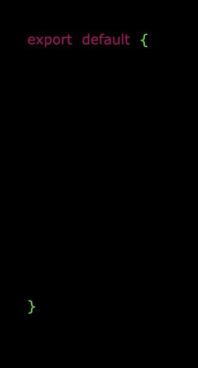
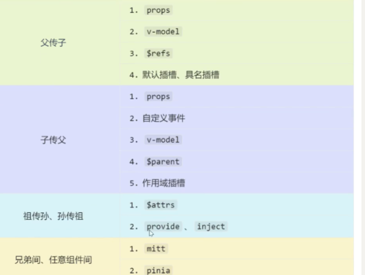

# Vue3 笔记

**适用人群**：有 Vue2 基础，想快速掌握 Vue3 核心特性的开发者

**参考资源**：[Vue3 官方文档](https://cn.vuejs.org/)

---

## 一、Vue3 简介

Vue (读音 /vjuː/，类似于 view) 是一款用于构建用户界面的 **渐进式 JavaScript 框架**。

相比 Vue2，Vue3 的核心优势：

| 特性 | 说明 |
|------|------|
| **性能提升** | 打包大小减少 41%，初次渲染快 55%，内存占用减少 54% |
| **源码升级** | 使用 TypeScript 重构，自带更好的类型推导 |
| **Composition API** | 拥抱组合式 API，让逻辑复用变得极其简单 |

---

## 二、创建 Vue3 工程

### 方式一：基于 vue-cli（已废弃）

基于 Webpack，目前已处于维护模式，**不再推荐用于新项目**。

```bash
npm install -g @vue/cli
vue create my-project
```

### 方式二：基于 vite（推荐） ⭐⭐⭐

```bash
# 执行创建命令
npm create vue@latest

# 按提示选择配置（TS、Vue Router、Pinia 等）
```

**为什么推荐 Vite？**

| 构建工具 | 启动原理 | 启动速度 |
|----------|----------|----------|
| Webpack | 先抓取整个应用依赖并构建 | 较慢 |
| Vite | 利用浏览器原生 ES Modules，按需实时编译 | 秒开 |

---

## 三、Vue3 核心语法

### 3.1 Options API vs Composition API

#### Options API 的弊端

数据、方法、计算属性分散在 `data`、`methods`、`computed` 中。新增或修改需求需要多处修改，不利于维护和复用。

<p align='center'>
    
</p>

#### Composition API 的优势

用函数的方式组织代码，让相关功能的代码有序地组织在一起。

<p align='center'>
    
</p>

---

### 3.2 setup 配置项 ⭐⭐⭐

#### setup 概述

`setup` 是 Vue3 新增的配置项，值是一个函数，是 **Composition API 的舞台**。组件中的数据、方法、计算属性、监视等均配置在 setup 中。

**特点**：
- `setup` 返回的对象内容可直接在模板中使用
- `setup` 中访问 `this` 是 `undefined`
- `setup` 在 `beforeCreate` 之前调用，领先所有钩子

#### setup 返回值

| 返回类型 | 说明 |
|----------|------|
| **对象** | 属性、方法可直接在模板使用（重点关注） |
| **函数** | 自定义渲染内容 |

```vue
setup() {
  return () => '你好啊！'
}
```

#### setup 与 Options API 的关系

1. Vue2 配置（`data`、`methods`...）**可以访问** setup 中的属性、方法
2. setup 中**不能访问** Vue2 配置（`data`、`methods`...）
3. 如果冲突，setup 优先

#### setup 语法糖 ⭐⭐⭐

```vue
<script setup lang="ts">
  console.log(this) // undefined

  // 数据（注意：此时不是响应式数据）
  let name = '张三'
  let age = 18

  // 方法
  function changeName() {
    name = '李四' // 页面不会变化，因为不是响应式
  }
</script>
```

**配置组件名称**：使用 `defineOptions`

```vue
<script setup lang="ts">
defineOptions({
  name: 'PersonComponent'
})
</script>
```

---

### 3.3 响应式数据

#### ref ⭐⭐

`ref` 可创建基本类型和对象类型的响应式数据。

```ts
import { ref } from 'vue'

// 基本类型
let count = ref(0)

// 对象类型
interface Person {
  id: string
  name: string
  age: number
}
let person = ref<Person>({
  id: '1',
  name: '张三',
  age: 18
})
```

**注意事项**：
- `ref` 返回 `RefImpl` 对象，JS 操作需要 `.value`
- 若 `ref` 接收对象类型，内部实际调用了 `reactive`

#### reactive ⭐⭐

`reactive` 只能创建对象类型的响应式数据，返回 `Proxy` 实例。

```ts
import { reactive } from 'vue'

let person = reactive({
  id: '1',
  name: '张三',
  age: 18
})
```

#### ref vs reactive 对比

| 对比项 | ref | reactive |
|--------|-----|----------|
| 适用类型 | 基本类型 + 对象类型 | 仅对象类型 |
| JS 操作 | 需要 `.value` | 直接访问 |
| 深层响应式 | 自动开启 | 自动开启 |

**使用原则**：

1. 基本类型响应式数据 → **必须用 `ref`**
2. 层级不深的对象 → `ref` 或 `reactive` 均可
3. 层级较深的对象 → **推荐 `reactive`**

#### toRefs 与 toRef

直接从响应式对象解构会丢失响应式，解决方法：

```ts
import { toRef, toRefs } from 'vue'

// 单个转换
let price = toRef(car, 'price')

// 批量转换
let { a, b } = toRefs(car)
```

---

### 3.4 computed 计算属性 ⭐⭐⭐

根据已有数据计算出新数据，本质是 `ComputedRefImpl` 响应式数据。

**特点**：只读，依赖变化时自动重新计算，未变化时使用缓存值。

```vue
<script setup lang="ts">
import { computed, ref } from 'vue'

let firstName = ref('zhang')
let lastName = ref('san')

// 只读写法
let fullName = computed(() => firstName.value + ' ' + lastName.value)

// 可读写法
let fullName2 = computed({
  get() {
    return firstName.value + ' ' + lastName.value
  },
  set(value) {
    const [first, last] = value.split(' ')
    firstName.value = first
    lastName.value = last
  }
})
</script>
```

---

### 3.5 watch 监听器 ⭐⭐⭐

`watch` 监听数据变化并执行回调，可监听以下四种数据：

1. `ref` 定义的基本类型数据
2. `ref` 定义的对象类型数据
3. `reactive` 定义的对象类型数据
4. 函数返回的值（getter）
5. 以上类型的数组（多源监听）

#### 情况一：监听 ref 基本类型

```ts
import { ref, watch } from 'vue'

let count = ref(0)

// 直接写数据名，监听 value 值变化
watch(count, (newValue, oldValue) => {
  console.log(newValue, oldValue)
})
```

#### 情况二：监听 ref 对象类型

直接写数据名监听的是**地址值**，想监听内部数据需开启深度监视。

```ts
let person = ref({ name: '张三', age: 18 })

// 监听地址值
watch(person, (newValue, oldValue) => {
  console.log(newValue, oldValue)
}, { deep: true })
```

#### 情况三：监听 reactive 对象类型

默认开启深度监视。

```ts
let person = reactive({ name: '张三', age: 18 })

watch(person, (newValue, oldValue) => {
  console.log(newValue, oldValue)
})
```

#### 情况四：监听对象中的特定属性

**推荐写成函数形式**：

```ts
// 监听基本类型属性
watch(() => person.name, (newValue, oldValue) => {
  console.log(newValue, oldValue)
})

// 监听对象类型属性
watch(() => person.car, (newValue, oldValue) => {
  console.log(newValue, oldValue)
}, { deep: true })
```

#### 情况五：监听多个数据源

```ts
watch([() => person.name, () => person.car], (newValue, oldValue) => {
  console.log(newValue, oldValue)
}, { deep: true })
```

---

### 3.6 watchEffect ⭐⭐

**官方定义**：立即运行一个函数，同时响应式追踪其依赖，并在依赖更改时重新执行。

**对比 watch**：
- `watch`：需显式指定监听数据
- `watchEffect`：自动追踪依赖，用到什么数据就监听什么

```ts
import { watchEffect } from 'vue'

const stopWatch = watchEffect(() => {
  if (temp.value >= 50 || height.value >= 20) {
    console.log('联系服务器')
  }
  // 取消监视
  if (temp.value === 100) {
    stopWatch()
  }
})
```

---

### 3.7 标签的 ref 属性

用于获取 DOM 节点或组件实例。

| 使用场景 | 获取内容 |
|----------|----------|
| 普通 DOM 标签 | DOM 节点 |
| 组件标签 | 组件实例对象 |

```vue
<template>
  <h2 ref="title2">前端</h2>
  <button @click="showLog">打印内容</button>
</template>

<script setup lang="ts">
import { ref } from 'vue'

let title2 = ref()

function showLog() {
  console.log(title2.value) // DOM 节点
}
</script>
```

---

### 3.8 props 父传子

父组件通过属性传递数据，子组件通过声明接收。

#### 基础用法

```vue
<script setup lang="ts">
// 数组写法
const props = defineProps(['list', 'title'])

// TypeScript 写法
interface Props {
  list: Person[]
  title?: string // 可选
}
defineProps<Props>()
</script>
```

#### 带默认值

```vue
<script setup lang="ts">
interface Props {
  list?: Person[]
}

const props = withDefaults(defineProps<Props>(), {
  list: () => [{ id: '1', name: '张三', age: 18 }]
})
</script>
```

---

## 四、Vue3 生命周期 ⭐⭐⭐

在 Composition API 中，`setup` 在 `beforeCreate` 之前调用。

### Vue2 vs Vue3 生命周期对比

| 阶段 | Vue2 | Vue3 (Composition API) | 说明 |
|------|------|------------------------|------|
| 创建 | `beforeCreate`、`created` | `setup()` | 移除这两个钩子，逻辑放 setup |
| 挂载 | `beforeMount`、`mounted` | `onBeforeMount`、`onMounted` | 加 on 前缀 |
| 更新 | `beforeUpdate`、`updated` | `onBeforeUpdate`、`onUpdated` | 加 on 前缀 |
| 卸载 | `beforeDestroy`、`destroyed` | `onBeforeUnmount`、`onUnmounted` | Destroy 改为 Unmount |

### 使用示例

```vue
<script setup lang="ts">
import { onBeforeMount, onMounted, onBeforeUnmount, onUnmounted } from 'vue'

onBeforeMount(() => console.log('onBeforeMount'))
onMounted(() => console.log('onMounted'))
onBeforeUnmount(() => console.log('onBeforeUnmount'))
onUnmounted(() => console.log('onUnmounted'))
</script>
```

---

## 五、Vue3 自定义 Hooks ⭐⭐⭐

自定义 hook 本质是一个函数，将 Composition API 提取封装，设计理念类似 Vue2 的 mixin。

**规范的 Hook 结构**：响应式数据 + 操作方法 + 生命周期钩子

```ts
// src/hooks/useMousePosition.ts
import { ref, onMounted, onUnmounted } from 'vue'

export function useMousePosition() {
  const x = ref(0)
  const y = ref(0)

  const update = (e: MouseEvent) => {
    x.value = e.pageX
    y.value = e.pageY
  }

  onMounted(() => window.addEventListener('mousemove', update))
  onUnmounted(() => window.removeEventListener('mousemove', update))

  return { x, y }
}
```

**使用方式**：

```vue
<script setup lang="ts">
import { useMousePosition } from '@/hooks/useMousePosition'

const { x, y } = useMousePosition()
</script>
```

---

## 六、Vue3 Router ⭐⭐⭐

### 6.1 Router 基础

| 特性 | Vue Router 3.x (Vue 2) | Vue Router 4.x (Vue 3) |
|------|------------------------|------------------------|
| 创建实例 | `new VueRouter({})` | `createRouter({})` |
| 模式设置 | `mode: 'history'` | `history: createWebHistory()` |
| 组件访问 | `this.$router` / `this.$route` | `useRouter()` / `useRoute()` |
| 基础路径 | `base` 属性 | `createWebHistory('/base')` |

### 6.2 初始化 Router

```ts
// src/router/index.ts
import { createRouter, createWebHistory } from 'vue-router'

const router = createRouter({
  history: createWebHistory(),
  routes: [
    { path: '/', component: () => import('@/views/Home.vue') }
  ]
})

export default router
```

### 6.3 在 setup 中使用 Router

```vue
<script setup lang="ts">
import { useRouter, useRoute } from 'vue-router'

const router = useRouter() // 路由器实例
const route = useRoute()   // 当前路由信息

console.log(route.params.id)
</script>
```

### 6.4 RouterLink 与 RouterView

Vue3 推荐使用大驼峰 `<RouterLink>` / `<RouterView>`：

```vue
<template>
  <RouterLink to="/home">首页</RouterLink>
  <RouterView />
</template>
```

**custom 模式**（自定义渲染）：

```vue
<RouterLink to="/home" custom v-slot="{ navigate }">
  <button @click="navigate">回到首页</button>
</RouterLink>
```

---

### 6.5 嵌套路由

子路由 path 不加 `/`：

```ts
const routes = [
  {
    name: 'test1',
    path: '/test1',
    component: () => import('@/views/test1.vue'),
    children: [
      {
        name: 'test11',
        path: 'test11', // 不加 /
        component: () => import('@/views/test11.vue')
      }
    ]
  }
]
```

---

### 6.6 路由守卫 ⭐⭐⭐

路由守卫用于路由跳转前后拦截（登录检查、权限校验等）。

Vue3 淡化了 `next()`，直接返回 `true` 或不返回即放行。

#### 全局前置守卫

```ts
// router/index.ts
router.beforeEach((to, from) => {
  const isAuthenticated = !!localStorage.getItem('token')

  if (to.meta.requiresAuth && !isAuthenticated) {
    return { name: 'Login' }
  }
  return true // 放行
})
```

#### 独享守卫

```ts
const routes = [
  {
    path: '/admin',
    component: AdminPage,
    beforeEnter: (to, from) => {
      if (!isAdmin()) return '/404'
    }
  }
]
```

#### 组件内守卫

```vue
<script setup lang="ts">
import { onBeforeRouteLeave, onBeforeRouteUpdate } from 'vue-router'

// 离开前确认
onBeforeRouteLeave((to, from) => {
  const answer = window.confirm('未保存，确定离开？')
  if (!answer) return false
})

// 路由参数变化时（组件复用）
onBeforeRouteUpdate((to, from) => {
  console.log('文章 ID 变了：', to.params.id)
})
</script>
```

---

### 6.7 路由传参

| 方式 | URL 样式 | 刷新是否丢失 | 获取方式 |
|------|----------|--------------|----------|
| Query | `/test?id=1` | 不丢失 | `route.query` |
| Params | `/test/:id` | 不丢失（需占位） | `route.params` |

**接收参数**：

```vue
<script setup lang="ts">
import { useRoute } from 'vue-router'
const route = useRoute()
console.log(route.params.id)
</script>
```

**props 配置**：

```ts
{
  path: '/user/:id',
  component: User,
  // 方式一：将 params 作为 props
  props: true,
  // 方式二：函数写法（可处理 query）
  props: (route) => ({ id: route.params.id, name: route.query.name })
}
```

---

### 6.8 编程式路由

| 方法 | 行为 | 适用场景 |
|------|------|----------|
| `router.push(loc)` | 添加新记录 | 普通跳转 |
| `router.replace(loc)` | 替换当前记录 | 登录页、重定向 |
| `router.go(n)` | 跳转 n 步 | 返回上一页 `go(-1)` |
| `router.back()` | 相当于 `go(-1)` | 后退按钮 |
| `router.forward()` | 相当于 `go(1)` | 前进按钮 |

---

### 6.9 避坑指南

| 问题 | Vue Router 3 | Vue Router 4 |
|------|--------------|--------------|
| 404 匹配 | `path: '*'` | `path: '/:pathMatch(.*)*'` |
| router-view 传值 | `props: true` | 使用插槽模式 |
| 守卫放行 | 必须调用 `next()` | 返回 `true` 或路由地址 |

```vue
<!-- router-view 插槽模式 -->
<RouterView v-slot="{ Component }">
  <transition name="fade">
    <component :is="Component" />
  </transition>
</RouterView>
```

---

## 七、Vue3 Pinia 状态管理 ⭐⭐⭐

Pinia 已取代 Vuex 成为 Vue3 官方推荐的状态管理工具。

### 7.1 标准目录结构

```
src/
  store/
    index.ts       # 创建大仓库
    userStore.ts   # 用户状态
    cartStore.ts   # 购物车状态
```

### 7.2 安装与初始化

```ts
// main.ts
import { createApp } from 'vue'
import { createPinia } from 'pinia'
import App from './App.vue'
import router from '@/router'

const app = createApp(App)
const pinia = createPinia()

app.use(router)
app.use(pinia)
app.mount('#app')
```

### 7.3 定义 Store

使用 `defineStore`，需要唯一 `id`，第二个参数可以是对象（选项式）或函数（组合式）。

#### 选项式写法

```ts
// store/userStore.ts
import { defineStore } from 'pinia'

export const useUserStore = defineStore('userStore', {
  state: () => ({
    userName: 'liutianba7',
    password: '123456',
    age: 19
  }),

  getters: {
    bigAge: (state) => state.age * 10
  },

  actions: {
    incrementAge() {
      this.age += 1
    }
  }
})
```

#### 组合式写法

```ts
export const useUserStore = defineStore('userStore', () => {
  const userName = ref('liutianba7')
  const password = ref('123456')
  const age = ref(19)

  const bigAge = computed(() => age.value * 10)

  function incrementAge() {
    age.value += 1
  }

  return { userName, password, age, bigAge, incrementAge }
})
```

### 7.4 使用 Store

```ts
const userStore = useUserStore()
console.log(userStore.userName)
```

### 7.5 修改数据的方式

```ts
const userStore = useUserStore()

// 方式一：直接修改
userStore.userName += '~'

// 方式二：批量修改 $patch（性能更优）
userStore.$patch((state) => {
  state.userName += '~'
  state.age += 1
})

// 方式三：通过 actions
userStore.incrementAge()

// 方式四：重置 $reset（仅选项式写法支持）
userStore.$reset()
```

### 7.6 storeToRefs ⭐⭐⭐

直接解构 store 会**丢失响应式**！

```ts
// ❌ 错误：失去响应式
const { userName, age } = userStore

// ✅ 正确：使用 storeToRefs
import { storeToRefs } from 'pinia'
const { userName, age } = storeToRefs(userStore)
```

**规则**：
- State 和 Getters → 必须用 `storeToRefs`
- Actions → 直接解构（函数不需要响应式）

### 7.7 $subscribe 监听状态变化

```ts
userStore.$subscribe((mutation, state) => {
  console.log('数据变了！', mutation.type)
  // 同步到本地存储
  localStorage.setItem('user_info', JSON.stringify(state))
})
```

---

## 八、Vue3 组件通信 ⭐⭐⭐

<p align='center'>
    
</p>

### 8.1 props（父传子）

父组件传递数据，子组件通过 `defineProps` 接收。

```vue
<script setup lang="ts">
interface Props {
  title: string
  count?: number
}
const props = defineProps<Props>()
</script>
```

**技巧**：父组件传递函数可实现子传父。

---

### 8.2 自定义事件（子传父）

子组件通过 `defineEmits` 定义事件并触发。

**子组件**：

```vue
<script setup lang="ts">
const emit = defineEmits(['update-count'])

function handleClick() {
  emit('update-count', 100)
}
</script>

<template>
  <button @click="handleClick">传值给父组件</button>
</template>
```

**父组件**：

```vue
<template>
  <Child @update-count="handleUpdate" />
</template>

<script setup lang="ts">
function handleUpdate(val: number) {
  console.log('收到：', val) // 100
}
</script>
```

---

### 8.3 mitt（全局事件总线）

Vue3 移除了 `$on/$off`，官方不再推荐全局事件总线，但可用 **mitt** 替代。

**安装**：

```bash
npm i mitt
```

**初始化**：

```ts
// src/utils/bus.ts
import mitt from 'mitt'
const bus = mitt()
export default bus
```

**订阅者（接收数据）**：

```vue
<script setup lang="ts">
import bus from '@/utils/bus'
import { onMounted, onUnmounted } from 'vue'

onMounted(() => {
  bus.on('send-msg', (data) => {
    console.log('收到：', data)
  })
})

onUnmounted(() => {
  bus.off('send-msg') // 必须解绑
})
</script>
```

**发布者（发送数据）**：

```vue
<script setup lang="ts">
import bus from '@/utils/bus'

function trigger() {
  bus.emit('send-msg', { text: '问候', code: 200 })
}
</script>
```

---

### 8.4 v-model（双向绑定）

组件上使用 `v-model`，本质是 `modelValue` 属性 + `update:modelValue` 事件。

**传统写法**：

```vue
<!-- 父组件 -->
<MyInput v-model="username" />

<!-- 子组件 -->
<script setup lang="ts">
const props = defineProps(['modelValue'])
const emit = defineEmits(['update:modelValue'])
</script>

<template>
  <input
    :value="props.modelValue"
    @input="emit('update:modelValue', $event.target.value)"
  />
</template>
```

**Vue 3.4+ 推荐写法**：使用 `defineModel`

```vue
<script setup lang="ts">
const model = defineModel()

function change() {
  model.value = '新值'
}
</script>

<template>
  <input v-model="model" />
</template>
```

**绑定多个 v-model**：

```vue
<!-- 父组件 -->
<Child v-model:title="pageTitle" v-model:content="pageContent" />

<!-- 子组件 -->
<script setup lang="ts">
const title = defineModel('title')
const content = defineModel('content')
</script>
```

---

### 8.5 $attrs（透传属性）

`$attrs` 包含父组件传递但未被 `props/emits` 声明的属性和事件。

```vue
<template>
  <GrandChild v-bind="$attrs" />
</template>

<script setup lang="ts">
import { useAttrs } from 'vue'
const attrs = useAttrs()
console.log(attrs)
</script>
```

---

### 8.6 $refs 和 $parent

| 方式 | 方向 | 说明 |
|------|------|------|
| `$refs` | 父 → 子 | 父组件获取子组件实例 |
| `$parent` | 子 → 父 | 子组件获取父组件实例 |

**关键**：子组件需通过 `defineExpose` 暴露属性。

```vue
<!-- 子组件 -->
<script setup lang="ts">
function sayHi() { console.log('Hi') }
const secret = '隐私数据'

defineExpose({ sayHi, secret })
</script>
```

---

### 8.7 provide/inject（祖孙通信）

祖先通过 `provide` 提供数据，后代通过 `inject` 接收，无需中间人。

**祖先组件**：

```vue
<script setup lang="ts">
import { ref, provide } from 'vue'

const themeColor = ref('skyblue')
provide('theme', themeColor)

// 提供修改方法
function changeTheme(color: string) {
  themeColor.value = color
}
provide('updateTheme', changeTheme)
</script>
```

**后代组件**：

```vue
<script setup lang="ts">
import { inject } from 'vue'

const theme = inject('theme', 'gray') // 默认值 gray
const updateTheme = inject('updateTheme')
</script>

<template>
  <h1 :style="{ color: theme }">后代组件</h1>
  <button @click="updateTheme('pink')">换肤</button>
</template>
```

---

### 8.8 Pinia（任意组件通信）

通过 Pinia 状态管理，任意组件可共享数据。详见第七章。

---

## 九、Vue3 插槽

插槽：子组件预留位置，父组件决定显示内容。

### 9.1 默认插槽

子组件用 `<slot>` 占位，父组件传入内容替换。

```vue
<!-- 子组件 -->
<template>
  <div class="box">
    <h3>标题</h3>
    <slot>默认文字</slot>
  </div>
</template>

<!-- 父组件 -->
<Child>
  <p>自定义内容</p>
</Child>
```

### 9.2 具名插槽

多个插槽需"对号入座"。

```vue
<!-- 子组件 -->
<template>
  <header><slot name="header"></slot></header>
  <main><slot></slot></main>
  <footer><slot name="footer"></slot></footer>
</template>

<!-- 父组件 -->
<Child>
  <template #header><h1>头部</h1></template>
  <p>中间内容</p>
  <template #footer><p>底部</p></template>
</Child>
```

### 9.3 作用域插槽 ⭐⭐⭐

数据在子组件，但渲染方式由父组件决定。

**子组件**：把数据绑定到 slot。

```vue
<script setup lang="ts">
const games = ['王者荣耀', '英雄联盟', '黑神话：悟空']
</script>

<template>
  <ul>
    <li v-for="game in games" :key="game">
      <slot name="gameSlot" :game="game"></slot>
    </li>
  </ul>
</template>
```

**父组件**：通过 `#名字="slotProps"` 接收数据。

```vue
<List>
  <template #gameSlot="{ game }">
    <span style="color: red;">🔥 {{ game }}</span>
  </template>
</List>
```

---

## 十、Vue3 其他特性

### 10.1 Teleport（传送门） ⭐⭐

将组件渲染到指定 DOM 位置，不受父组件层级限制。

```vue
<template>
  <Teleport to="body">
    <div class="modal">弹窗内容</div>
  </Teleport>
</template>
```

**常见用途**：模态框、通知、全局提示。

---

### 10.2 Suspense（异步组件加载） ⭐⭐

处理异步组件加载状态，提供加载中 UI。

```vue
<template>
  <Suspense>
    <!-- 异步组件 -->
    <template #default>
      <AsyncComponent />
    </template>
    <!-- 加载中显示 -->
    <template #fallback>
      <div>加载中...</div>
    </template>
  </Suspense>
</template>
```

---

### 10.3 Fragment（多根节点）

Vue3 组件可以有多个根节点，不再强制单一根元素。

```vue
<template>
  <h1>标题</h1>
  <p>内容</p>
</template>
```

---

### 10.4 异步组件

```vue
<script setup lang="ts">
import { defineAsyncComponent } from 'vue'

const AsyncComp = defineAsyncComponent(() =>
  import('@/components/HeavyComponent.vue')
)
</script>
```

---

### 10.5 shallowRef / shallowReactive

减少大型不可变结构的响应性开销，只对顶层响应式。

| API | 说明 |
|-----|------|
| `shallowRef` | 只有 `.value` 是响应式，内部对象非响应式 |
| `shallowReactive` | 只有顶层属性响应式，深层属性非响应式 |

```ts
import { shallowRef, shallowReactive } from 'vue'

const state = shallowRef({ a: 1, b: { c: 2 } })
// state.value.a = 2 // 不触发更新（非响应式）
// state.value = { a: 2, b: { c: 2 } } // 触发更新

const obj = shallowReactive({ a: 1, b: { c: 2 } })
// obj.a = 2 // 触发更新
// obj.b.c = 3 // 不触发更新（深层非响应式）
```

---

## 十一、Vue3 学习路线

| 阶段 | 内容 | 重要程度 |
|------|------|----------|
| 入门 | 创建工程、setup 语法糖 | ⭐⭐⭐ |
| 核心 | ref、reactive、computed、watch | ⭐⭐⭐ |
| 进阶 | 自定义 hooks、组件通信 | ⭐⭐⭐ |
| 生态 | Router、Pinia | ⭐⭐⭐ |
| 补充 | Teleport、Suspense、异步组件 | ⭐⭐ |

---


