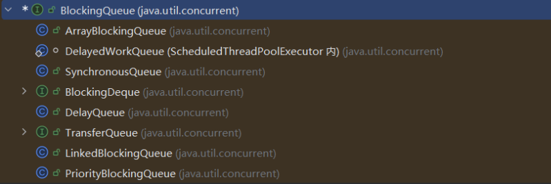

# Java 集合
## 一、集合概述

#### 1. 集合概述
Java 集合，也叫作容器，主要是由两大接口派生而来：一个是 `Collection`接口，主要用于存放单一元素；另一个是 `Map` 接口，主要用于存放键值对。对于`Collection` 接口，下面又有三个主要的子接口：`List`、`Set` 、 `Queue`。
<p align='center'>
    
</p>

#### 2. List，Set，Queue，Map四者的区别

- List：存储的元素是有序的，可重复的，其子类ArrrayList实际上本质就是一个在内存连续的数组，我们可以通过下标在O(1)的时间获取元素，而LinkedList本质就是一个链表，它在需要频繁的增删操作有很大优势。
- Set：存储的元素是不可重复的
- Queue：按特定的排队规则来确定先后顺序，存储的元素是有序的、可重复的。
- Map：存储键值对数据，Key 是不可重复的，而 Value 则无所谓，在查询时主要通过 Key 去直接查到 Value。

#### 3. 集合框架底层数据结构总结
##### 3.1 List
- `ArrayList`：`Object[]` 数组。详细可以查看：[ArrayList 源码分析](/java/collection/arraylist-source-code.html)。
- `Vector`：`Object[]` 数组。
- `LinkedList`：双向链表(JDK1.6 之前为循环链表，JDK1.7 取消了循环)。详细可以查看：[LinkedList 源码分析](/java/collection/linkedlist-source-code.html)。

##### 3.2 Set

- `HashSet`(无序，唯一): 基于 `HashMap` 实现的，底层采用 `HashMap` 来保存元素。
- `LinkedHashSet`: `LinkedHashSet` 是 `HashSet` 的子类，并且其内部是通过 `LinkedHashMap` 来实现的。
- `TreeSet`(有序，唯一): 红黑树(自平衡的排序二叉树)。

##### 3.3 Queue

- `PriorityQueue`: `Object[]` 数组来实现小顶堆。详细可以查看：[PriorityQueue 源码分析](/java/collection/priorityqueue-source-code.html)。
- `DelayQueue`:`PriorityQueue`。详细可以查看：[DelayQueue 源码分析](/java/collection/delayqueue-source-code.html)。
- `ArrayDeque`: 可扩容动态双向数组。

#### 3.4 Map
- `HashMap`：JDK1.8 之前 `HashMap` 由数组+链表组成的，数组是 `HashMap` 的主体，链表则是主要为了解决哈希冲突而存在的（“拉链法”解决冲突）。JDK1.8 以后在解决哈希冲突时有了较大的变化，当链表长度大于阈值（默认为 8）（将链表转换成红黑树前会判断，如果当前数组的长度小于 64，那么会选择先进行数组扩容（默认0.75），而不是转换为红黑树）时，将链表转化为红黑树，以减少搜索时间。详细可以查看：[HashMap 源码分析](/java/collection/hashmap-source-code.html)。
- `LinkedHashMap`：`LinkedHashMap` 通过在普通的 `HashMap` 基础上，额外维护了一条**双向链表**来实现有序。它继承了 `HashMap` 的位桶数组+链表/红黑树，但每个节点（Entry）都增加了 `before` 和 `after` 两个指针。默认维持的是插入顺序，还支持访问顺序，也就是每当一个元素被get（）或者put（）的时候，它就会被放到双向链表的尾部。
- `Hashtable`：数组+链表组成的，数组是 `Hashtable` 的主体，链表则是主要为了解决哈希冲突而存在的。
- `TreeMap`：红黑树（自平衡的排序二叉树）。


#### 4. 如何选择集合

选择集合，要更具存储的元素以及需求来权衡，如果不是键值对，就在 collection 下选择，如果查询、修改频繁，我们就去选择 ArrayList，但如果增加、删除频繁，我们就选择 LinkedList，如果不需要排序且元素没有重复存储的需求，我们就去选择HashSet，但如果需要排序，且综合性能要求高，我们就用TreeSet。对于 Map 系列同理，如果我们不需要排序，则考虑 HashMap，需要排序则使用TreeMap，如果只需要维持插入顺序则选择 LinkedHashMap。

#### 5. 为什么要使用集合 

1. **长度可变（动态扩容）**： 数组在创建时必须指定长度，且不可改变；集合（如 `ArrayList`）支持**动态扩容**，能根据数据量自动调整空间，避免了空间浪费或溢出。
2. **数据结构多样化**： 集合框架直接封装了**链表、栈、队列、哈希表、红黑树**等复杂算法，开发者无需手写这些逻辑，做到了开箱即用。
3. **功能丰富（高效率）**： 提供了内置的排序、搜索、洗牌（shuffle）等工具类（如 `Collections`），极大提高了开发效率。
4. **强类型安全**： 配合**泛型**使用，可以在编译期检查数据类型，避免了频繁的类型强制转换带来的 `ClassCastException`。

## 二、List
#### 1. Array 和 ArrayList

ArrayList 是动态数组，比起 Array更加灵活
- `ArrayList`会根据实际存储的元素动态地扩容或缩容，而 `Array` 被创建之后就不能改变它的长度了。
- `ArrayList` 允许你使用泛型来确保类型安全，`Array` 则不可以。
- `ArrayList` 中只能存储对象。对于基本类型数据，需要使用其对应的包装类（如 Integer、Double 等）。`Array` 可以直接存储基本类型数据，也可以存储对象。
- `ArrayList` 支持插入、删除、遍历等常见操作，并且提供了丰富的 API 操作方法，比如 `add()`、`remove()`等。`Array` 只是一个固定长度的数组，只能按照下标访问其中的元素，不具备动态添加、删除元素的能力。
- `ArrayList`创建时不需要指定大小，而`Array`创建时必须指定大小。


#### 2. ArrayList 和 Vector 的区别
- `ArrayList` 是 `List` 的主要实现类，底层使用 `Object[]`存储，适用于频繁的查找工作，线程不安全 。
- `Vector` 是 `List` 的古老实现类，底层使用`Object[]` 存储，线程安全。


#### 3. ArrayList 可以添加 null 值吗？
`ArrayList` 中可以存储任何类型的对象，包括 `null` 值。不过，不建议向`ArrayList` 中添加 `null` 值， `null` 值无意义，会让代码难以维护比如忘记做判空处理就会导致空指针异常。


#### 4. ArrayList 的插入和删除元素的时间复杂度


插入：O(n)
最坏情况：头插，需要移动 n 个元素，O(n)
最好情况，在尾部插入，不需要移动任何元素，O(1)
插入指定位置：需要把在该位置之后的所有元素都向后移动一个位置，由于可能在任何位置，所以加权计算后平均移动 n / 2 个元素。

删除同理：O(n)

查询：如果是根据下标查询，那就是O(1)

修改：和查询同理
#### 5. LinkedList 插入和删除元素的时间复杂度

插入 | 删除：O(n)
如果是头插 | 尾插：直接进行指针的操作即可，O（1）
指定位置：需要找到指定位置，平时找 n / 2 次，所以是 O(n)

但由于LinkedList不需要移动元素，所以即使时间复杂度一样，但插入和删除的效率 LinkedList 还是高于 ArrayList 的。

#### 6. LinkedList 为什么不能实现 RandomAccess 接口？

`RandomAccess` 是一个标记接口，用来表明实现该接口的类支持随机访问（即可以通过索引快速访问元素）。由于 `LinkedList` 底层数据结构是链表，内存地址不连续，只能通过指针来定位，不支持随机快速访问，所以不能实现 `RandomAccess` 接口。

#### 7. ArrayList 和 LinkedList 的区别

- 底层数据结构不同：一个是数组，一个是双向链表
- 一个支持随机访问，一个不支持随机访问
- 数据在内存中是连续的，而链表不是连续的。


#### 8. RandomAccess 接口⭐️

``` java
public interface RandomAccess {  
	
}
```

查看源码我们发现实际上 `RandomAccess` 接口中什么都没有定义。所以，在我看来 `RandomAccess` 接口不过是一个标识罢了。标识什么？ 标识实现这个接口的类具有随机访问功能。

允许通用算法根据列表是“随机访问”还是“顺序访问”来调整行为，从而提供最佳性能。
在 `binarySearch()` 方法中，它要判断传入的 list 是否 `RandomAccess` 的实例，如果是，调用`indexedBinarySearch()`方法，如果不是，那么调用`iteratorBinarySearch()`方法

- 在 **ArrayList** 中，**下标访问更快**，因为它省去了迭代器对象的创建和方法调用开销，直接利用数组的内存偏移量寻址。
- 在 **LinkedList** 中，**迭代器更快**，因为它避免了每次查询都从头开始寻找节点的重复劳动。
#### 9. Iterator 本质

迭代器的本质是**对集合遍历逻辑的封装**。它通过一种“黑盒”方式，让你无需关心底层是数组还是链表。

- **内部状态**：迭代器内部维护了一个**游标（cursor）**。
- **执行逻辑**：每次调用 `next()`，它都会根据底层结构的逻辑（数组则是下标自增，链表则是通过 `next` 指针寻找后继节点）来获取下一个元素。
- **设计模式**：它是设计模式中“迭代器模式”的典型实现，目的是**解耦**容器的实现与遍历行为。


#### 10. ArrayList 的扩容机制⭐⭐⭐

详见笔主的这篇文章: [ArrayList 扩容机制分析](https://javaguide.cn/java/collection/arraylist-source-code.html#arraylist-%E6%89%A9%E5%AE%B9%E6%9C%BA%E5%88%B6%E5%88%86%E6%9E%90)。

首先是三种初始化方法
 1. 默认构造方式：容量为10，实际上是一个空数组
 2. 指定容量：本质就是创建了一个大小为 initCapacity 的 Object[]
 3. 直接传一个 Collection 实现类，事实就是把这个集合转为 Object[] 数组

扩容实际就是当 size == elementData.length，就会调用 grow方法，grow底层调重载的 grow(int mincacity) 方法，如下：

可以分析：如果是默认初始化方式且是第一次添加原则，则本质就是将elementData扩容为一个长度为10的 Object 数组。如果不是第一次，则会调用 ArraysSupport.newLength 去获取新的数组大小，然后再去产生一个该大小的数组。

``` java
private Object[] grow(int minCapacity) {  
    int oldCapacity = elementData.length;  
    if (oldCapacity > 0 || elementData != DEFAULTCAPACITY_EMPTY_ELEMENTDATA) {  
        int newCapacity = ArraysSupport.newLength(oldCapacity,  
                minCapacity - oldCapacity, /* minimum growth */  
                oldCapacity >> 1           /* preferred growth */);  
        return elementData = Arrays.copyOf(elementData, newCapacity);  
    } else {  
        return elementData = new Object[Math.max(DEFAULT_CAPACITY, minCapacity)];  
    }  
}
```

**下面是获取新长度的方法源码：**

首先，扩容大小是在：0.5倍的旧容量大小和 minGrowth 里选大的那个，一般都会是0.5倍的旧容量大小，也就是扩容1.5倍。

确定了扩容后的大小后，还得判断，如果当前大小已经大于了容器的最大容量，则调用hugeLength，否则直接返回扩容后的大小即可。

``` java
public static int newLength(int oldLength, int minGrowth, int prefGrowth) {  
    // preconditions not checked because of inlining  
    // assert oldLength >= 0    // assert minGrowth > 0  
    int prefLength = oldLength + Math.max(minGrowth, prefGrowth); // might overflow  
    if (0 < prefLength && prefLength <= SOFT_MAX_ARRAY_LENGTH) {  
        return prefLength;  
    } else {  
        // put code cold in a separate method  
        return hugeLength(oldLength, minGrowth);  
    }  
}
```

而 hugeLength 方法则很简单，也就是如果 oldCapacity + minGrowth > 最大容量大小了，则直接抛异常，因为已经存不下了，否则直接返回最大容量。

**总结：**
扩容时机：如果是add方法，那么就是在 size == elementData.length 的时候扩容。而如果是 addAll 方法，则在当前元素个数 + 添加的集合的元素个数 > 当前容量的时候扩容 numNew > (elementData = this.elementData).length - (s = size)

扩容方法：grow(int minCapacity)，每次扩容后的大小是：
$$
newCapacity = oldCapacity + max(0.5 * oldCapacity, minGrowth)
$$
如果 $newCapacity < 最大容量$ ，则直接返回，否则调用 hugeLength（）方法。

hugeLength（）: oldCapacity + minGrowth
如果 oldCapacity + minGrowth < 最大容量，则直接返回，否则说明此时已经存不下了，抛出异常。


#### 11. 集合中的 fail-fast 和 fail-safe 是什么？

`fail-fast`（快速失败）和 `fail-safe`（安全失败）是Java集合框架在处理并发修改问题时，两种截然不同的设计哲学和容错策略。

##### 1. fail-fast
	fail-fast 的思想即针对可能发生的异常进行提前表明故障并停止运行，通过尽早的发现和停止错误，降低故障系统级联的风险。fail-fast 机制通过维护一个变量 modCount，从而能够在遍历过程中提前的发现非法修改并立刻抛出异常，防止程序在错误的状态下继续运行。
	
	原理：每次迭代之前，都会把当前的 modCount 赋给 expectedModCount，在迭代过程中，每次调用 `next()` 或 `remove()`，迭代器都会检查：`if (modCount != expectedModCount)`。如果不相同，就说明在迭代过程中有其他线程修改了当前集合，直接抛出异常：ConcurrentModificationException

##### 2. fail-safe

**核心思想**：迭代时不是直接在原集合上遍历，而是基于原集合的**快照（Snapshot）**，因此不受并发修改的影响。

**实现原理**：以 `CopyOnWriteArrayList` 为例，当发生写操作时，它会复制出一个新数组进行修改，修改完成后再将引用指向新数组。迭代器读取的是旧数组的快照。

**代表容器**：`CopyOnWriteArrayList`、`ConcurrentHashMap`（1.8后采用弱一致性迭代器）。

| **特性**       | **Fail-Fast**                          | **Fail-Safe**                  |
| -------------- | -------------------------------------- | ------------------------------ |
| **异常抛出**   | 抛出 `ConcurrentModificationException` | 不抛出异常                     |
| **原理**       | 检测 `modCount` 计数器                 | 复制快照 (Copy-on-Write)       |
| **性能**       | 高（无需复制）                         | 较低（复制数组耗时耗空间）     |
| **数据一致性** | 强一致性（虽抛异常但数据没乱）         | **弱一致性**（可能读到旧数据） |

## 三、Set

#### 1. Comparable 和 Comparator 的区别

`Comparable` 接口和 `Comparator` 接口都是 Java 中用于排序的接口，
- `Comparable` 接口实际上是出自`java.lang`包 它有一个 `compareTo(Object obj)`方法用来排序
- `Comparator`接口实际上是出自 `java.util` 包它有一个`compare(Object obj1, Object obj2)`方法用来排序

Comparable 是“内部定义”，由类自身实现 `compareTo` 方法，确定默认的排序规则；而 Comparator 是“外部策略”，通过创建一个独立的比较器传入排序方法，无需修改原类代码即可实现多种灵活的排序需求。

#### 2. 无序性和不可重复性的含义是什么

- **无序性** 指**存储顺序不等于添加顺序**。 数据在底层并不是按照你 `add()` 的先后顺序依次排列的。以 `HashSet` 为例，它根据元素的 **Hash 值**计算存储位置，所以你遍历出的顺序通常与你存入的顺序不一致。
- **不可重复性** 指**同一个集合中不能包含两个“相等”的元素**。 这种相等是通过 `equals()` 方法和 `hashCode()` 方法共同判定的。当你尝试存入重复元素时，新元素会覆盖旧元素或直接被拒绝存入，从而保证集合内元素的**唯一性**。

#### 3. 比较 HashSet、LinkedHashSet 和 TreeSet 三者的异同

**相同点**： 三者均实现 `Set` 接口，具备**元素唯一性**，且都是**线程不安全**的。

**不同点（核心差异点）**：

1. **HashSet (最常用)**：底层是 **HashMap**。它不保证任何顺序，性能最高，适用于只需要去重、不关心顺序的场景。
2. **LinkedHashSet (有序去重)**：它是 `HashSet` 的子类，底层是 **HashMap + 双向链表**。它通过链表维护了**插入顺序**，适用于需要去重但又希望按插入先后顺序遍历的场景。
3. **TreeSet (排序去重)**：底层是 **红黑树 (TreeMap)**。它能确保元素处于**排序状态**（自然排序或自定义 `Comparator`），适用于需要按大小、字母等特定规则排序的场景。

- **性能对比**：`HashSet` 性能 > `LinkedHashSet` > `TreeSet`（因为树的维护成本高）。
- **Null 值**：`HashSet` 和 `LinkedHashSet` 允许一个 `null`；而 `TreeSet` 如果使用自然排序，**不允许存入 `null`**（会抛出 `NullPointerException`，因为要进行比较）。

## 四、Qqeue

#### 1. Queue 和 Deque 的区别

queue：单端队列，对头出，队尾入，遵守 FIFO 原则，
deque：双端队列，队首队尾都允许插入元素以及出队。


#### 2. ArrayDeque 和 LinkedList 的区别

`ArrayDeque` 和 `LinkedList` 都实现了 `Deque` 接口，两者都具有队列的功能，但两者有什么区别呢？

- `ArrayDeque` 是基于可变长的数组和双指针来实现，而 `LinkedList` 则通过链表来实现。
- `ArrayDeque` 不支持存储 `NULL` 数据，但 `LinkedList` 支持。
- `ArrayDeque` 是在 JDK1.6 才被引入的，而`LinkedList` 早在 JDK1.2 时就已经存在。
- `ArrayDeque` 插入时可能存在扩容过程, 不过均摊后的插入操作依然为 O(1)。虽然 `LinkedList` 不需要扩容，但是每次插入数据时均需要申请新的堆空间，均摊性能相比更慢。

从性能的角度上，选用 `ArrayDeque` 来实现队列要比 `LinkedList` 更好。此外，`ArrayDeque` 也可以用于实现栈。


#### 3. PriorityQueue

`PriorityQueue` 是在 JDK1.5 中被引入的, 其与 `Queue` 的区别在于元素出队顺序是与优先级相关的，即总是优先级最高的元素先出队。

这里列举其相关的一些要点：

- `PriorityQueue` 利用了二叉堆的数据结构来实现的，底层使用可变长的数组来存储数据
- `PriorityQueue` 通过堆元素的上浮和下沉，实现了在 O(logn) 的时间复杂度内插入元素和删除堆顶元素。
- `PriorityQueue` 是非线程安全的，且不支持存储 `NULL` 和 `non-comparable` 的对象。
- `PriorityQueue` 默认是小顶堆，但可以接收一个 `Comparator` 作为构造参数，从而来自定义元素优先级的先后。


#### 4. BlockingQueue

`BlockingQueue` （阻塞队列）是一个接口，继承自 `Queue`。`BlockingQueue`阻塞的原因是其支持当队列没有元素时一直阻塞，直到有元素；还支持如果队列已满，一直等到队列可以放入新元素时再放入。

``` java
public interface BlockingQueue<E> extends Queue<E> 
{ 
	// ... 
}
```

- **抛出异常**：`add(e)`, `remove()`（队列满/空时报错）
- **返回特殊值**：`offer(e)`, `poll()`（队列满/空时返回 false/null）
- **一直阻塞**：**`put(e)`**, **`take()`**（**这是最常用的阻塞核心方法**）
- **超时退出**：`offer(e, time, unit)`, `poll(time, unit)`（等一会儿，不等了就走）

``` java
public static void main(String[] args) throws InterruptedException {  
    ArrayBlockingQueue<Integer> arrayBlockingQueue = new ArrayBlockingQueue<>(10);  
    // 消费者线程  
    Thread consumer = new Thread(() -> {  
        while (true){  
            try {  
                System.out.println(arrayBlockingQueue.take());  
            } catch (InterruptedException e) {  
                e.printStackTrace();  
            }  
        }  
    });  
  
    consumer.start();  
    for (int i = 0; i < 10; i++){  
        arrayBlockingQueue.put(i);  
    }  
    arrayBlockingQueue.put(11);  
}
```
#### 5. BlockingQueue 有哪些实现类

<p align='center'>
    
</p>

- `ArrayBlockingQueue`：使用数组实现的有界阻塞队列。在创建时需要指定容量大小，并支持公平和非公平两种方式的锁访问机制。
- `LinkedBlockingQueue`：使用单向链表实现的可选有界阻塞队列。在创建时可以指定容量大小，如果不指定则默认为`Integer.MAX_VALUE`。和`ArrayBlockingQueue`不同的是， 它仅支持非公平的锁访问机制。
- `PriorityBlockingQueue`：支持优先级排序的无界阻塞队列。元素必须实现`Comparable`接口或者在构造函数中传入`Comparator`对象，并且不能插入 null 元素。
- `SynchronousQueue`：同步队列，是一种不存储元素的阻塞队列。每个插入操作都必须等待对应的删除操作，反之删除操作也必须等待插入操作。因此，`SynchronousQueue`通常用于线程之间的直接传递数据。
- `DelayQueue`：延迟队列，其中的元素只有到了其指定的延迟时间，才能够从队列中出队。

| **实现类**                | **内部结构** | **是否有界** | **线程安全策略**                     | **特色场景**                               |
| ------------------------- | ------------ | ------------ | ------------------------------------ | ------------------------------------------ |
| **ArrayBlockingQueue**    | 数组         | **强制有界** | 单锁（生产消费竞争同一把锁）         | 内存占用低，适用于负载稳定的场景           |
| **LinkedBlockingQueue**   | 链表         | 可选有界     | **双锁**（生产消费分离，并发度更高） | 吞吐量高于 Array，ExecutorService 默认常用 |
| **PriorityBlockingQueue** | 二叉堆       | 无界         | 单锁                                 | 需要按优先级处理任务（如 VIP 优先）        |
| **DelayQueue**            | 堆           | 无界         | 单锁                                 | 缓存失效、定时任务调度                     |
| **SynchronousQueue**      | 无           | **零容量**   | CAS / 信号量                         | 线程池 `CachedThreadPool` 的核心实现       |
| **LinkedTransferQueue**   | 链表         | 无界         | CAS                                  | 高性能数据交换                             |

#### 6. BlockingQueue 有什么作用

简单来说，`BlockingQueue` 是为了解决生产者与消费者之间步调不一致**的问题。

如果没有 `BlockingQueue`，生产者可能会把内存撑爆，或者消费者在没东西处理时一直循环消耗 CPU。`BlockingQueue` 通过阻塞自动平衡了这两者的速度：

- **队列满了**：生产者尝试放入元素时会被**挂起（休息）**，直到消费者取走一个。
- **队列空了**：消费者尝试取元素时会被**挂起（休息）**，直到生产者放入一个。

##### A. 线程池（最经典的应用）

Java 的 `ThreadPoolExecutor` 核心就是 `BlockingQueue`。

- 当你提交的任务超过了核心线程数，任务就会被放入阻塞队列。
- 工作线程执行完任务后，会去队列里 `take()` 任务。如果队列空了，工作线程就地阻塞，等待新任务到来，而不是白白消耗 CPU。
##### B. 解耦（Decoupling）

生产者不需要知道消费者的存在。生产者只管往队列里扔东西，消费者只管从队列里拿。哪怕消费者宕机了，数据也会先存在队列里（如果是持久化或足够大的话）。

##### C. 流量削峰

当瞬间涌入大量请求时，队列可以起到缓冲池的作用。请求先排队，系统按照自己的节奏慢慢处理，防止后端服务被瞬间的高并发冲垮。
#### 7. Array

`ArrayBlockingQueue` 和 `LinkedBlockingQueue` 是 Java 并发包中常用的两种阻塞队列实现，它们都是线程安全的。不过，不过它们之间也存在下面这些区别：

- 底层实现：`ArrayBlockingQueue` 基于数组实现，而 `LinkedBlockingQueue` 基于链表实现。
- 是否有界：`ArrayBlockingQueue` 是有界队列，必须在创建时指定容量大小。`LinkedBlockingQueue` 创建时可以不指定容量大小，默认是`Integer.MAX_VALUE`，也就是无界的。但也可以指定队列大小，从而成为有界的。
- 锁是否分离： `ArrayBlockingQueue`中的锁是没有分离的，即生产和消费用的是同一个锁；`LinkedBlockingQueue`中的锁是分离的，即生产用的是`putLock`，消费是`takeLock`，这样可以防止生产者和消费者线程之间的锁争夺。
- 内存占用：`ArrayBlockingQueue` 需要提前分配数组内存，而 `LinkedBlockingQueue` 则是动态分配链表节点内存。这意味着，`ArrayBlockingQueue` 在创建时就会占用一定的内存空间，且往往申请的内存比实际所用的内存更大，而`LinkedBlockingQueue` 则是根据元素的增加而逐渐占用内存空间。


## 五、Map

#### 1. HashMap 和 HashTable 的区别

-  Hashmap 线程不安全，而 HashTable 线程安全
-  Hashmap 支持 null 作为键，而 HashTable 不支持 null 作为键，也不支持 null 作为值
- 初始容量个每次扩容的大小不同：① 创建时如果不指定容量初始值，`Hashtable` 默认的初始大小为 11，之后每次扩充，容量变为原来的 2n+1。`HashMap` 默认的初始化大小为 16。之后每次扩充，容量变为原来的 2 倍。② 创建时如果给定了容量初始值，那么 `Hashtable` 会直接使用你给定的大小，而 `HashMap` 会将其扩充为 2 的幂次方大小（`HashMap` 中的`tableSizeFor()`方法保证，下面给出了源代码）。也就是说 `HashMap` 总是使用 2 的幂作为哈希表的大小,后面会介绍到为什么是 2 的幂次方。
- 底层数据有区别：数据 + 链表 + 红黑树
- 哈希函数的实现：`HashMap` 对哈希值进行了高位和低位的混合扰动处理以减少冲突，而 `Hashtable` 直接使用键的 `hashCode()` 值。

``` java
    public HashMap(int initialCapacity, float loadFactor) {
        if (initialCapacity < 0)
            throw new IllegalArgumentException("Illegal initial capacity: " +
                                               initialCapacity);
        if (initialCapacity > MAXIMUM_CAPACITY)
            initialCapacity = MAXIMUM_CAPACITY;
        if (loadFactor <= 0 || Float.isNaN(loadFactor))
            throw new IllegalArgumentException("Illegal load factor: " +
                                               loadFactor);
        this.loadFactor = loadFactor;
        this.threshold = tableSizeFor(initialCapacity);
    }
     public HashMap(int initialCapacity) {
        this(initialCapacity, DEFAULT_LOAD_FACTOR);
    }
```


这段代码是 `HashMap` 源码中非常经典的一个位运算算法。它的核心作用是：**给定任意一个正整数 `cap`，寻找大于或等于 `cap` 的最小的 2 的幂次（Power of Two）。**

```
/**
 * Returns a power of two size for the given target capacity.
 */
static final int tableSizeFor(int cap) {
    // 1. 减1：处理 cap 已经是 2 的幂的情况
    int n = cap - 1;

    // 2. 下面这些操作是将最高位 1 之后的低位全部涂黑（变成 1）
    n |= n >>> 1;  // 保证有 2 个连续的 1
    n |= n >>> 2;  // 保证有 4 个连续的 1
    n |= n >>> 4;  // 保证有 8 个连续的 1
    n |= n >>> 8;  // 保证有 16 个连续的 1
    n |= n >>> 16; // 保证有 32 个连续的 1

    // 3. 最后 n 变成了一个形如 00...0111...1 的数
    // 4. 返回时加 1，它就变成了 100...000，即最小的 2 的幂
    return (n < 0) ? 1 : (n >= MAXIMUM_CAPACITY) ? MAXIMUM_CAPACITY : n + 1;
}
```

#### 2. 为什么 haspMap 底层数据必须是 $2^n$ 呢⭐️⭐️⭐️

`HashMap` 的底层数组长度必须是 $2^n$。这样在计算下标时，可以使用位运算 `(n - 1) & hash` 来代替取模运算 `%`，从而极大地提高性能。

在计算机底层，**取模运算（%）** 是一个非常昂贵的操作，它涉及到除法。而**按位与运算（&）** 只需要直接操作二进制位，速度比取模快了好几倍。

当你用一个 `hash` 值去 `& (n - 1)` 时，由于 `n-1` 的高位全是 0，低位全是 1，这个操作的效果就是：**只保留 `hash` 值的低位，抹掉高位。** 这和取模的结果在数学上是完全一致的。
``` java
public static void main(String[] args) {  
    System.out.println(90 % 16);  
    System.out.println(90 & (16 - 1));  
}
```

- 位运算效率更高：位运算(&)比取余运算(%)更高效。当长度为 2 的幂次方时，`hash % length` 等价于 `hash & (length - 1)`。
- 可以更好地保证哈希值的均匀分布：扩容之后，在旧数组元素 hash 值比较均匀的情况下，新数组元素也会被分配的比较均匀，最好的情况是会有一半在新数组的前半部分，一半在新数组后半部分。
- 扩容机制变得简单和高效：扩容后只需检查哈希值高位的变化来决定元素的新位置，要么位置不变（高位为 0），要么就是移动到新位置（高位为 1，原索引位置+原容量）。

#### 补充：为什么**1.8 扩容时不需要重新计算 Hash？**⭐️

因为 hashmap 的扩容实际就是容量加倍，而又因为容量是 $2^n$， 因此新的桶下表只看原来的hash值在新增的那一个高位是不是1，不是1，则位置不变，是1，则新下表为原来的位置 + 扩容前的数组长度）

``` java
n = 16 扩容后 n = 32
那么，新下标就是看hash值的第五位是1还是0，是1，则新下标就是 16 + 旧下表，是0，则下标不变。
```
#### 3. HashMap 和 HashSet 的区别

如果你看过 `HashSet` 源码的话就应该知道：`HashSet` 底层就是基于 `HashMap` 实现的。（`HashSet` 的源码非常非常少，因为除了 `clone()`、`writeObject()`、`readObject()`是 `HashSet` 自己不得不实现之外，其他方法都是直接调用 `HashMap` 中的方法。


#### 4. HashMap 和 TreeMap 的区别

`TreeMap` 和`HashMap` 都继承自`AbstractMap` ，但是需要注意的是`TreeMap`它还实现了`NavigableMap`接口和`SortedMap` 接口。

<p align='center'>
    
</p>

| **特性**                  | **HashMap**                          | **TreeMap**                                                |
| ------------------------- | ------------------------------------ | ---------------------------------------------------------- |
| **底层数据结构**          | **哈希表**（数组 + 链表 + 红黑树）   | **红黑树**（自平衡二叉搜索树）                             |
| **元素顺序**              | **无序**（插入顺序和遍历顺序不一致） | **有序**（默认按 Key 的升序排列）                          |
| **性能 (平均时间复杂度)** | 插入、查询、删除均为 **$O(1)$**      | 插入、查询、删除均为 **$O(\log n)$**                       |
| **接口实现**              | 继承 `AbstractMap`                   | 继承 `AbstractMap`，多实现了 `NavigableMap` 和 `SortedMap` |
| **Null 值支持**           | 允许 **1 个 null 键**，多个 null 值  | **不允许 null 键**（因为要比较大小），允许 null 值         |

“HashMap 底层基于哈希表实现，主打高性能，其插入和查询的平均复杂度为 $O(1)$，但它是无序的；而 TreeMap 底层基于红黑树实现，虽然 $O(\log n)$ 的性能略逊一筹，但它实现了 `NavigableMap` 接口，能够根据键（Key）的自然顺序或自定义比较器进行排序，并支持高效的范围查找和边界搜索。”
#### 5. TreeMap 的优势⭐️⭐️⭐️

- **定向搜索**: `ceilingEntry()`, `floorEntry()`, `higherEntry()`和 `lowerEntry()` 等方法可以用于定位大于等于、小于等于、严格大于、严格小于给定键的最接近的键值对。
- **子集操作**: `subMap()`, `headMap()`和 `tailMap()` 方法可以高效地创建原集合的子集视图，而无需复制整个集合。
- **逆序视图**:`descendingMap()` 方法返回一个逆序的 `NavigableMap` 视图，使得可以反向迭代整个 `TreeMap`。
- **边界操作**: `firstEntry()`, `lastEntry()`, `pollFirstEntry()`和 `pollLastEntry()` 等方法可以方便地访问和移除元素。

#### 6.  HashSet 如何检查重复

“HashSet 通过计算对象的 `hashCode` 定位数组下标。如果位置冲突，先比对 `hashCode` 是否一致，若一致再调用 `equals()` 做最终确认。这种双重检查机制极大地提高了查找效率，将检查重复的时间复杂度从 $O(n)$ 降到了平均 $O(1)$。”


#### 7. HashSet 如果元素存在，会覆盖吗？
“对于 `HashSet` 来说，如果添加重复元素，`add` 方法会返回 `false`，且**底层的 Key（即对象本身）不会被覆盖**，依然保留第一次添加时的那个对象；虽然底层 `HashMap` 会覆盖对应的 Value，但由于 `HashSet` 的所有 Value 都是同一个静态常量 `PRESENT`，所以覆盖了也没有实质影响。”


#### 8. HashMap 的底层实现⭐️

JDK1.8 之前 `HashMap` 底层是 **数组和链表** 结合在一起使用也就是 **链表散列**。HashMap 通过 key 的 `hashcode` 经过扰动函数处理过后得到 hash 值，然后通过 `(n - 1) & hash` 判断当前元素存放的位置（这里的 n 指的是数组的长度），如果当前位置存在元素的话，就判断该元素与要存入的元素的 hash 值以及 key 是否相同，如果相同的话，直接覆盖，不相同就通过拉链法解决冲突。

##### 8.1 put 方法的底层原理⭐️

- **算 Hash** 找下标。
- **没冲突** 直接塞。
- **有冲突** 看 Key。
- **是树** 走树逻辑，**是链表** 遍历找位置。
- **链表过长** 转红黑树。
- **Key 重复** 换 Value。
- **塞完** 检查要不要扩容。

``` java
final V putVal(int hash, K key, V value, boolean onlyIfAbsent,  
               boolean evict) {  
    Node<K,V>[] tab; Node<K,V> p; int n, i;  
    if ((tab = table) == null || (n = tab.length) == 0)  
        n = (tab = resize()).length;  
    if ((p = tab[i = (n - 1) & hash]) == null)  
        tab[i] = newNode(hash, key, value, null);  
    else {  
        Node<K,V> e; K k;  
        if (p.hash == hash &&  
            ((k = p.key) == key || (key != null && key.equals(k))))  
            e = p;  
        else if (p instanceof TreeNode)  
            e = ((TreeNode<K,V>)p).putTreeVal(this, tab, hash, key, value);  
        else {  
            for (int binCount = 0; ; ++binCount) {  
                if ((e = p.next) == null) {  
                    p.next = newNode(hash, key, value, null);  
                    if (binCount >= TREEIFY_THRESHOLD - 1) // -1 for 1st  
                        treeifyBin(tab, hash);  
                    break;  
                }  
                if (e.hash == hash &&  
                    ((k = e.key) == key || (key != null && key.equals(k))))  
                    break;  
                p = e;  
            }  
        }  
        if (e != null) { // existing mapping for key  
            V oldValue = e.value;  
            if (!onlyIfAbsent || oldValue == null)  
                e.value = value;  
            afterNodeAccess(e);  
            return oldValue;  
        }  
    }  
    ++modCount;  
    if (++size > threshold)  
        resize();  
    afterNodeInsertion(evict);  
    return null;  
}
```


##### 8.2  hash 源码⭐️

jkd 1.8 之后 的 hash方法：“扰动函数”的作用就是：把高 16 位的特征，“混合”到低 16 位中。因为：`HashMap` 的初始容量通常很小（比如 16），那么 `n - 1` 就是 15（二进制：`0000...1111`）。当进行 `&` 运算时，**只有哈希值的最后 4 位参与了运算**。**问题来了**：如果有很多 Key 的 `hashCode` 虽然不同，但如果它们**仅仅是高位不同，低位全部相同**，那么它们计算出的数组下标就会完全一样，导致严重的哈希冲突。


``` java
    static final int hash(Object key) {
      int h;
      // key.hashCode()：返回散列值也就是hashcode
      // ^：按位异或
      // >>>:无符号右移，忽略符号位，空位都以0补齐
      return (key == null) ? 0 : (h = key.hashCode()) ^ (h >>> 16);
  }
```

“JDK 1.8 的 `hash` 方法通过 `(h ^ h >>> 16)` 将哈希值的高 16 位与低 16 位进行异或运算。这样做是为了在数组长度较小时，让高位信息也能参与到下标寻址的运算中。这大大降低了哈希碰撞的概率，使得数据在散列表中分布得更加均匀，从而维持了 `HashMap` 接近 $O(1)$ 的查找性能。”


##### 8.3 底层数据结构

JDK 1.8 之前：就是一个简单的 数组+ 链表的结构。但是，如果哈希冲突严重，链表可能会比较长，极端情况下查询效率会退化为 O(n)

JDK 1.8 之后，为了解决这个问题，底层数据结构变为了数组 + 链表 + 红黑树的结构。相比于之前的版本， JDK1.8 之后在解决哈希冲突时有了较大的变化，当链表长度大于阈值（默认为 8）（将链表转换成红黑树前会判断，如果当前数组的长度小于 64，那么会选择先进行数组扩容，而不是转换为红黑树）时，将链表转化为红黑树。

这样做的目的是减少搜索时间：链表的查询效率为 O(n)（n 是链表的长度），红黑树是一种自平衡二叉搜索树，其查询效率为 O(log n)。当链表较短时，O(n) 和 O(log n) 的性能差异不明显。但当链表变长时，查询性能会显著下降。

##### 8.4 扩容⭐️
达到 capacity * 0.75 factor 进行扩容，每次两倍。
#### 9. 为什么 HashMap 优先扩容而非直接转为红黑树

因为数组扩容才是更加根本的减少哈希冲突的方法，因此，当数组容量不算大时，会优先选择扩容，在java中，只有长度 > 64，才会将链表转为红黑树。

另一方面，过早引入红黑树反而会降低哈希表的效率，因为红黑树的结构比较复杂，常数比较大。

#### 10. 为什么选择阈值 8 和 64

- 泊松分布表明，链表长度达到 8 的概率极低（小于千万分之一）。在绝大多数情况下，链表长度都不会超过 8。阈值设置为 8，可以保证性能和空间效率的平衡。
- 数组长度阈值 64 同样是经过实践验证的经验值。在小数组中扩容成本低，优先扩容可以避免过早引入红黑树。数组大小达到 64 时，冲突概率较高，此时红黑树的性能优势开始显现。


用极小的概率换取极高的搜索性能。：
**空间成本**：红黑树的节点（`TreeNode`）占用的空间大约是普通链表节点（`Node`）的 **2 倍**。如果一上来就用树，会浪费大量内存。
时间成本：当 $n=8$ 时，$\log_2(8) = 3$。虽然 3 比 8 小，但考虑到红黑树旋转保持平衡的开销，在 $n$ 比较小时，两者的查找速度差异并不大。

**泊松分布（Poisson Distribution）**： 根据源码注释中的计算，在哈希值分布均匀的情况下，桶中元素达到 8 个的概率只有 **0.00000006**。


#### 11. HashMap 多线程操作导致死循环问题

JDK1.7 及之前版本的 `HashMap` 在多线程环境下扩容操作可能存在死循环问题，这是由于当一个桶位中有多个元素需要进行扩容时，多个线程同时对链表进行操作，头插法可能会导致链表中的节点指向错误的位置，从而形成一个环形链表，进而使得查询元素的操作陷入死循环无法结束。

<p align='center'>
    
</p>

为了解决这个问题，JDK1.8 版本的 HashMap 采用了尾插法而不是头插法来避免链表倒置，使得插入的节点永远都是放在链表的末尾，避免了链表中的环形结构。但是还是不建议在多线程下使用 `HashMap`，因为多线程下使用 `HashMap` 还是会存在数据覆盖的问题。并发环境下，推荐使用 `ConcurrentHashMap` 。

- **保持顺序**：扩容搬迁时，原链表里的 `A -> B`，搬到新数组后依然保持 `A -> B` 的相对顺序。
- **物理隔离**：它不是一个一个挪，而是先在原位置分好“高位链表”和“低位链表”，然后整体挂载到新的桶位上。既然顺序没乱，也就失去了形成“环”的基础条件。

总结：

“JDK 1.7 的死循环根源在于**多线程竞争下的头插法**，导致链表节点在搬迁时产生了环。1.8 虽然通过**尾插法**和**高低位迁移**解决了环的问题，但由于 `put` 等操作没有任何同步锁保护，依然存在**多线程并发修改导致的数据覆盖**风险。因此，在并发环境下，我们必须使用 `ConcurrentHashMap` 或者 `Collections.synchronizedMap()`。”

#### 12 HashMap 为什么线程不安全⭐️
1. 在 jdk 1.7 之前，由于是头插法，所以在并发扩容是可能会导致链表成环
2. 并发新增元素会导致数据丢失。
#### 13. HashMap 的常见遍历方式⭐️
1. 迭代器（Iterator）方式遍历
``` java
// 1. 迭代器遍历：entry set  
Iterator<Map.Entry<String, String> > iterator = map.entrySet().iterator();  
while (iterator.hasNext()) {  
    Map.Entry<String, String> entry = iterator.next();  
    System.out.println(entry.getKey() + ":" + entry.getValue());  
}


// 2. 迭代器遍历：key set  
Iterator<String> iterator1 = map.keySet().iterator();  
while (iterator1.hasNext()) {  
    String key = iterator1.next();  
    System.out.println(key + ":" + map.get(key));  
}
```

2.  For Each 方式遍历    
``` java
// 1. entry
for(var entry : map.entrySet()){  
    System.out.println(entry.getKey() + ":" + entry.getValue());  
}
// 2. key
for(var key : map.keySet()){  
    System.out.println(key + ":" + map.get(key));  
}
```

3. Lambda 表达式遍历（JDK 1.8+）
``` java
map.forEach((k, v) -> System.out.println(k + ":" + v));
```

4. Streams API 遍历（JDK 1.8+）
``` java
// 串行流
map.entrySet().stream().forEach(entry -> {  
    System.out.println(entry.getKey() + entry.getValue());  
});

// 并行流
map.entrySet().parallelStream().forEach(entry -> {  
    System.out.println(entry.getKey() + entry.getValue());  
});
```

<p align='center'>
    
</p>

其中 Units 为 ns/op 意思是执行完成时间（单位为纳秒），而 Score 列为平均执行时间， `±` 符号表示误差。从以上结果可以看出，两个 `entrySet` 的性能相近，并且执行速度最快，接下来是 `stream` ，然后是两个 `keySet`，性能最差的是 `KeySet` 。

#### 14. CoucurrentHashMap

| **特性**     | **JDK 1.7**                      | **JDK 1.8**                         |
| ------------ | -------------------------------- | ----------------------------------- |
| **锁的实现** | `Segment` (继承 `ReentrantLock`) | node + **CAS** + **`synchronized`** |
| **锁的粒度** | 分段锁（默认 16 个 Segment）     | **节点锁**（锁住每个桶的头节点）    |
| **数据结构** | 数组 + 链表                      | 数组 + 链表 + **红黑树**            |
| **查询性能** | 链表 $O(n)$                      | 红黑树 $O(\log n)$                  |

“`ConcurrentHashMap` 在 1.7 采用 **Segment 分段锁**来实现并发，并发度受限于分段数；而在 1.8 则抛弃了分段锁，改用 **CAS + 数组头节点上的 synchronized**，配合红黑树，实现了更细粒度的锁定和更高的并发性能，同时支持多线程协助扩容，是目前 Java 并发环境下最高效的散列表实现。”

分段锁： 将数据分成一段一段的（Segment），每一段都配一把锁。当一个线程占用其中一把锁时，这一段内的数据都被锁住，但其他段的数据依然可以被其他线程访问。

节点锁：抛弃段的概念，直接给数组里的**每一个桶（Bucket）的头节点**加锁。

#### 15. JDK 1.7 和 JDK 1.8 的 ConcurrentHashMap 实现有什么不同？

- **线程安全实现方式**：JDK 1.7 采用 `Segment` 分段锁来保证安全， `Segment` 是继承自 `ReentrantLock`。JDK1.8 放弃了 `Segment` 分段锁的设计，采用 `Node + CAS + synchronized` 保证线程安全，锁粒度更细，`synchronized` 只锁定当前链表或红黑二叉树的首节点。
- **Hash 碰撞解决方法** : JDK 1.7 采用拉链法，JDK1.8 采用拉链法结合红黑树（链表长度超过一定阈值时，将链表转换为红黑树）。
- **并发度**：JDK 1.7 最大并发度是 Segment 的个数，默认是 16。JDK 1.8 最大并发度是 Node 数组的大小，并发度更大。

#### 16. node + cas + synchronized

“在 JDK 1.8 中，`ConcurrentHashMap` 结合了这三者的优势：**Node** 的 `volatile` 字段保证了多线程间的内存可见性，使读取操作无需加锁；**CAS** 实现了在特定位置为空时的无锁原子化插入，极大地提升了并发性能；而 **synchronized** 则提供了细粒度的互斥保护，仅在发生哈希冲突时锁定单个桶的头节点

#### 17. ConcurrentHashMap 为什么 key 和 value 不能为 null？

“`ConcurrentHashMap` 不允许 Key 和 Value 为 `null`，主要是为了**消除在并发环境下的二义性**。如果允许 `null` 值，当 `get(key)` 返回 `null` 时，我们无法在不加锁的情况下通过 `containsKey` 确认这个 `null` 的真实含义，因为在两次操作之间，其他线程可能已经修改了 Map。


#### 18. Colletions 工具类

排序：
``` java
// 排序
void reverse(List list)//反转
void shuffle(List list)//随机排序
void sort(List list)//按自然排序的升序排序
void sort(List list, Comparator c)//定制排序，由Comparator控制排序逻辑
void swap(List list, int i , int j)//交换两个索引位置的元素
void rotate(List list, int distance)//旋转。当distance为正数时，将list后distance个元素整体移到前面。当distance为负数时，将 list的前distance个元素整体移到后面
```

查找 | 替换
``` java
int binarySearch(List list, Object key)//对List进行二分查找，返回索引，注意List必须是有序的
int max(Collection coll)//根据元素的自然顺序，返回最大的元素。 类比int min(Collection coll)
int max(Collection coll, Comparator c)//根据定制排序，返回最大元素，排序规则由Comparatator类控制。类比int min(Collection coll, Comparator c)
void fill(List list, Object obj)//用指定的元素代替指定list中的所有元素
int frequency(Collection c, Object o)//统计元素出现次数
int indexOfSubList(List list, List target)//统计target在list中第一次出现的索引，找不到则返回-1，类比int lastIndexOfSubList(List source, list target)
boolean replaceAll(List list, Object oldVal, Object newVal)//用新元素替换旧元素
```

[集合使用注意事项](https://javaguide.cn/java/collection/java-collection-precautions-for-use.html)