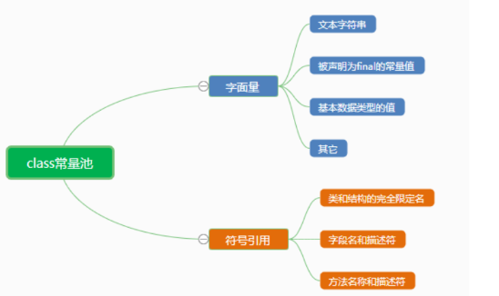
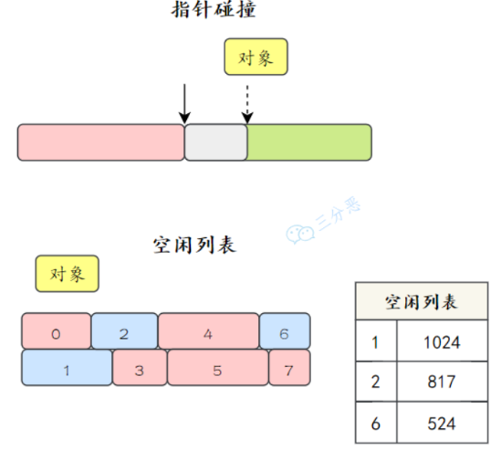
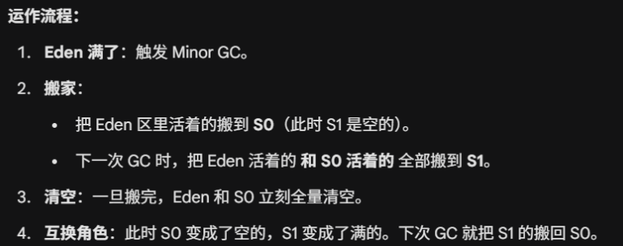
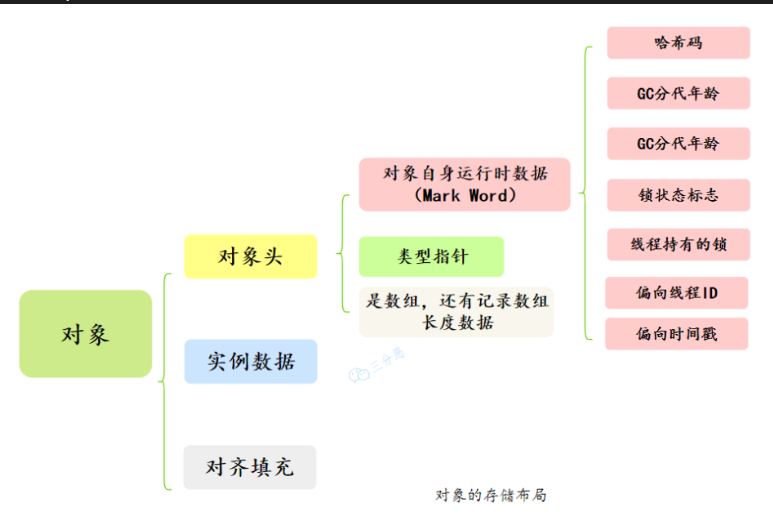

# JVM

### JVM 基础

#### 1. 什么是 JVM 呢？

JVM 就是 java 虚拟机，它是 Java 实现跨平台的基石。程序在运行前，需要被 java 编译器编译为字节码文件，之后 JVM 会逐行解释这些字节码文件并执行。

#### 2.执行 Hello World 到底干了什么？⭐️⭐️

1）操作系统会创建一个 JVM 进程，JVM 进程启动起来后，会先初始化运行环境，包括创建类加载器、初始化内存空间、启动垃圾回收线程等等。

2）类加载器将 `HelloWorld.class` 加载到内存，进行**验证、准备、解析**，完成类的初始化。

3）JVM 找到 `main` 方法，启动主线程执行引擎。

4）在执行过程中，`JVM`会逐行解释字节码文件为机器码并执行，此外 `JVM` 内部有一个“热点计数器"，对于 `hot code`，`JIT` 编译器会直接把这段代码编译为本地机器码并缓存到 `Code Cache` 中，下次执行直接从缓存拿到机器码并执行，不再需要重新解释。

#### 3. JVM 的特性有哪些？

（1）JVM 可以自动管理内存，通过垃圾回收器回收不再使用的对象并释放内存空间。

（2）JVM 包含一个即时编译器 JIT，它可以在运行时将热点代码缓存到 codeCache 中，下次执行的时候不用再一行一行的解释，而是直接执行缓存后的机器码，执行效率会大幅提高。

（3）任何可以通过 Java 编译的语言，比如说 Groovy、Kotlin、Scala 等，都可以在 JVM 上运行。

#### 4. 学习 JVM 的好处

- 从“黑盒”到“透明”：理解运行本质

- 从“被动”到“主动”：学习`JVM`能够帮助我们更好的进行性能调优与`Debug`

- 掌握 JVM 的类加载机制可以帮助我们排查类加载冲突或异常。

#### 5. JVM 的组织结构⭐️

JVM 大致可以划分为三个部分：类加载器、运行时数据区和执行引擎。

 1）类加载器：负责把外部（文件系统|网络等）的字节码文件加载到内存中。

 2）运行时数据区：在 `java` 程序运行过程中，存放数据的地方，`JVM`将这片区域划分为了五块区域：堆、方法区、虚拟机栈、本地方法栈、程序计数器。

 3）执行引擎，也是 JVM 的心脏，负责执行字节码。它包括一个解释器、即时编译器 JIT 和垃圾回收器。

### 内存管理

#### 1. 能说一下 `JVM` 的内存区域吗？⭐️

按照 Java 虚拟机规范，JVM 的内存区域可以细分为`程序计数器`、`虚拟机栈`、`本地方法栈`、`堆`和`方法区`。

#### 2. 分别介绍一下 `JVM` 五个区域

1.`程序计数器 (Program Counter Register)`:可以看作是当前线程所执行的字节码的**行号指示器**。该区域没有规定任何 `OutOfMemoryError` 情况的区域。

 2.`虚拟机栈 (Java Virtual Machine Stack)`:描述的是 **Java 方法执行**的内存模型。每个方法执行时都会创建一个“栈帧”，存放**局部变量表**、操作数栈、动态链接、方法出口等。

 3.`本地方法栈 (Native Method Stack)`:与虚拟机栈非常相似，区别在于它是为虚拟机使用到的 **Native 方法**（通常是 C/C++ 编写的底层代码）服务的。

 4.`堆 (Heap)`:这是 JVM 内存中最大的一块，**几乎所有的对象实例以及数组**都在这里分配内存。

 5.`方法区`:用于存储已被虚拟机加载的**类信息、常量、静态变量**、即时编译器编译后的代码缓存等数据。在 JDK 8 之前，很多人称之为“永久代”；JDK 8 之后，取消了永久代，取而代之的是使用本地内存的**元空间（Metaspace）**。**运行时常量池**：它是方法区的一部分，存放编译期生成的各种字面量和符号引用。

#### 3. 常量池

<p align='center'>
    
</p>

java 文件被编译为 class文件，class 文件除了包含类的版本，字段，方法，接口的等描述信息外，还有一项就是 Constant Pool，用于存放编译器生成的各类字面量和符号引用。

（1）字面量就是我们所说的常量，如字符串，被声明为 final 的变量，基本数据类型的值。

 （2）在编译码我们无法知道引用目标的内存地址，所以用到了符号引用，符号引用是一组符号来描述所引用的目标，符合可以是任意类型的字面量，只要使用时能无歧义即可。

#### 4. 运行时常量池

当类加载到内存中，JVM 就会将当前类的 `class` 常量池中的内容存放到运行时常量池，只不过，在运行时常量池里，符号引用会被替换为直接引用。（分为静态和动态解析）

#### 12. 字符串常量池⭐️⭐️

为了提升性能和减少内存消耗。因为字符串在 Java 中使用频率极高，JVM 专门开辟了一块区域来缓存字符串。

- **Java 6 及之前**：位于 PermGen（永久代）中。
- **Java 7/8 及之后**：移动到了 **Java Heap（堆）** 中。这样做是为了防止永久代内存不足，同时也更方便垃圾回收（GC）。

在 JDK 1.7 及之后，字符串常量池存的是“字符串对象的引用”和“字符串的内容”。本质上是一个 HashTable，K 是字符串内容得到的Hash值，Value 则是当前字符串的引用。

当我们声明了一个字符串变量：

```java
String a = "abc"
```

此时，不会直接去堆区创建一个内容为 "abc" 的对象，而是先去字符串常量池里面找有问有内容为 ”abc" 的对象，如果有，则直接返回，没有，才去堆区创建一个 “abc" 对象，然后把这个对象的引用放到字符串常量池里面。
 注意，如果是通过 `new` 关键字声明字符串，则一定会在堆区创建一个对象

```java
String a = new ("abc")
```

#### 5. 一个什么都没用的空方法，包括入参，那么局部变量表有没有变量？⭐️⭐️

分情况，对于静态方法，由于不需要访问实例对象 this，因此，局部变量表为空。
 对于非静态方式，即使是一个完全空的方法，局部变量表中也会有一个用于存储 this 引用的变量。this 引用指向当前实例对象，在方法调用时被隐式传入。

#### 6. native 方法是什么？⭐️⭐️

native 方法其实就是被 native 关键字修饰的方法，我们通常叫它为本地方法，它的作用实际就是用来调用非 java 语言编写的方法，主要是 C/ C++

为什么会存在 native 方法呢？这就不得不提到 java 的局限性了，由于 JVM 的存在，java 方法天然的与本机硬件隔离，如果需要直接控制显卡、读取内存地址，必须借助 c/c++。

- **`Object.hashCode()`**：为了保证性能和唯一性，哈希值通常是根据对象的内存地址计算的。
- **`System.arraycopy()`**：数组复制是一个高频操作，用 C 写的底层实现比 Java 循环快得多。
- **`Thread.start()`**：启动一个线程需要向操作系统申请资源，Java 必须调用操作系统的内核指令。

实现 `native` 方法的技术统称为 **JNI (Java Native Interface)**，即 Java 本地接口。

#### 7. 堆和栈的区别？⭐️

堆属于线程共享的内存区域，几乎所有 new 出来的对象都会堆上分配，生命周期不由单个方法调用所决定，可以在方法调用结束后继续存在，直到不再被任何变量引用，最后被垃圾收集器回收。

栈属于线程私有的内存区域，主要存储局部变量、方法参数、对象引用等，通常随着方法调用的结束而自动释放，不需要垃圾收集器处理。

#### 8. 介绍一下方法区

方法区并不真实存在，属于 Java 虚拟机规范中的一个逻辑概念，用于存储已被 JVM 加载的类信息、常量、静态变量、即时编译器编译后的代码缓存、**编译后的方法字节码**等。
 在 java 8 之前，方法区的实现称为永久代 PermGen，但在 Java 8 及之后的版本中，已经被元空间 Metaspace 所替代。

#### 9. 变量存在堆栈的什么位置呢？

局部变量会存在当前方法栈帧中的局部变量表中，当方法执行完毕，栈帧被回收，所以局部变量也会被释放。

```java
public void method() {
    int localVar = 100;  // 局部变量，存储在栈帧中的局部变量表里
}
```

静态变量会存在方法区中，在 Java 7 中是永久带，在 Java8 及以后 是元空间。

```java
public class StaticVarDemo {
    public static int staticVar = 100;  // 静态变量，存储在方法区中
}
```

#### 10. 说一下 JDK 1.6、1.7、1.8 内存区域的变化?

“JDK 1.6 时代方法区还在 JVM 内的‘永久代’里；1.7 开始把字符串和静态变量‘遣散’到堆中；1.8 则干脆把永久代‘拆迁’了，将剩下的类元信息搬到了物理内存里的‘元空间’，彻底解决了永久代容易内存溢出的历史包袱。”

结论先行：在 JDK 1.8 之后，字符串常量池以及静态变量依然留在“堆（Heap）”中，并没有随类元信息一起搬到“元空间（Metaspace）”。

虽然元空间是方法区的实现，但并不是方法区所有的东西都在元空间。1.8 依然延续了 1.7 的做法，将**静态变量**和**字符串常量池**放在**堆**中，只有类常量池、运行时常量池放在了**元空间**。

#### 11. 为什么要用元空间代替永久代？

1）主要是解决永久代的 OOM 问题

#### 13. 通过 new 关键创建字符串分析⭐️⭐️

1.`String str = new String("a" + "b")`

检查 ”ab“ 是否在常量池中，不存在，则创建一个池化对象。之后 new 关键字也会在堆区创建一个新对象，所以一共创建两个对象。

2.`String str = new String("a" + "b") + new String("c" + "d")`

先创建 StringBuilder 对象，然后左半部分是 2个，右半部分是2个，最后凭借得到 ”abcd"，再去常量池中检查存在不存在，不存在还得创建池化对象，然后返回这个池化对象的地址，所以一共是6个对象。

#### 13. JVM 类加载过程⭐️⭐️⭐️

类加载的全过程可以概括为：**加载 $\rightarrow$ 链接（验证、准备、解析） $\rightarrow$ 初始化**。

（1）加载就是根据类的**全限定名**（比如 `com.test.User`）找到对应的 `.class` 文件，以二进制流读入到内存中。

```
通过一个类的全限定名获取该类的二进制流。
将该二进制流中的静态存储结构转化为方法去运行时数据结构。 
在内存中生成该类的Class对象，作为该类的数据访问入口。
```

（2）链接又可以分为三个阶段，分别为：

- 验证：安检。检查加载的字节码是否符合 JVM 规范。
- 准备：为**类变量**（`static` 修饰的变量）分配内存并设置**初始值**。
- 解析：把常量池内的**符号引用**（名字字符串）替换为**直接引用**（内存物理指针）。解析动作并不一定在初始化动作完成之前，也有可能在初始化之后。

（3）初始化：执行类构造器 `<clinit>()` 方法。这个方法是编译器自动收集所有 **类变量（static）的赋值动作** 和 **静态代码块（static {}）** 中的语句合并而成的。

#### 补充：什么是类加载器，类加载器有哪些？⭐️⭐️

类加载器就是把类文件加载到虚拟机中，也就是说通过一个类的全限定名来获取描述该类的二进制字节流。

从 JVM 的视角来看，主要有以下四类加载器，它们各自负责加载不同路径下的类：

① 启动类加载器 (Bootstrap ClassLoader)：负责加载 Java 的**核心库**。`JAVA_HOME/lib` 目录下的 jar 包（如 `rt.jar`、`resources.jar`）。这就是为什么你不用导入就能直接使用 `java.lang.Object` 或 `String`。

② 扩展类加载器 (Extension ClassLoader)：由 Java 编写，派生自 `java.lang.ClassLoader`。负责加载 Java 的**扩展库**。

③ 应用程序类加载器 (Application ClassLoader) | 系统类加载器：负责加载**用户类路径 (ClassPath)** 上的所有类库。可以通过 ClassLoader.getSystemClassLoader()来获取它

④ 自定义类加载器 (Custom ClassLoader)：由开发者自己定义。通过继承 java.lang.ClassLoader类的方式实现

#### 补充：双亲委派模型 (Parent Delegation Model)

当一个类加载器收到加载请求时，它不会自己先加载，而是把这个请求**委派给父类加载器**。每一层都如此，直到顶层的“启动类加载器”。只有当父加载器反馈无法完成这个加载任务时，子加载器才会尝试自己去加载。

**为什么要这么设计？**

1. **安全性**：防止核心 API 被篡改。如果有人写了个假 `java.lang.String`，通过委派机制，JVM 最终还是会找到顶层原装的 `String`，而不会加载山寨版。
2. **避免重复加载**：确保同一个类在程序中只被加载一次。**委派机制** 确保了 `java.lang.String` 永远由最顶层的加载器加载，保证了它在整个程序生命周期中的**唯一性**。

**双亲委派是如何保证安全的？**

“它通过‘向上委派’的机制，保证了 Java 核心库（如 `java.lang` 包）永远由顶层的 **Bootstrap ClassLoader** 优先加载。

这样一来，即使有人恶意编写了同名的核心类（如 `String`），请求也会被传到顶层，加载器会优先加载 JDK 自带的正版类，从而屏蔽掉山寨类。这确保了核心 API 不会被篡改，也避免了程序中出现多套同名类导致的类型混乱。”

**如何破坏双亲委派模型？**

继承 `ClassLoader` 类，重写 `loadClass()` 方法（如果不破坏，通常只重写 `findClass()`）。 **典型案例：** **Tomcat** 破坏了双亲委派，因为它需要让两个不同的 Web 应用能够加载各自版本的同一个类（比如应用 A 用 Spring 4，应用 B 用 Spring 5），如果按委派逻辑，它们会被视为同一个类，导致冲突。

**为什么要破坏双亲委派模型呢?**

在 Java 中，双亲委派虽然安全，但它太“死板”了——**父加载器无法看见子加载器加载的类**。

比如: JDBC 的核心接口（如 `Driver`）是由核心库加载器（Bootstrap）加载的。但具体的数据库驱动实现类（如 MySQL 驱动）是由应用类加载器（App）加载的。根据双亲委派模型，父加载器无法访问子加载器加载的类。这就导致核心库里的 `DriverManager` 无法直接实例化各厂商提供的驱动。

为了打破这个僵局，Java 引入了“线程上下文类加载器”。它就像一个**后门**：

1. `DriverManager` 在执行时，不去向上委派，而是直接从当前线程抓取 `Thread.currentThread().getContextClassLoader()`。
2. 这个上下文加载器默认就是 **App ClassLoader**。
3. 这样，顶层的 `DriverManager` 就能通过这个“后门”直接调用底层的驱动类了。

一个 Tomcat 运行两个 Web 应用（A 和 B），A 用 Spring 4，B 用 Spring 5。**如果不破坏**：根据双亲委派，父加载器加载了 Spring 4 之后，应用 B 就再也加载不了 Spring 5 了（因为类名一样，父类说我加载过了）。

Tomcat 自定义了 `WebAppClassLoader`，它**先尝试自己加载**，加载不到再委派给父类。这完全颠倒了双亲委派的顺序，从而实现了**应用间的类库隔离**。

#### 补充：什么时候会使用到加载器？

除非不得不加载，否则 JVM 绝不主动加载类。

根据 Java 虚拟机规范，只有在对类进行**主动引用**时，才会触发类加载（包括加载、链接、初始化）。

1）使用 `new` 关键字实例化对象时，第一步就是检查当前类有没有加载完成，没有则进行类加载过程。

2）访问类或接口的静态成员时，会触发类加载。

3）使用反射调用类时，当你执行 `Class.forName("com.test.User")` 或 `ClassLoader.loadClass(...)` 时，会显式触发加载。

4）Java 规定：初始化一个类时，如果其父类还没初始化，必须**先触发父类的初始化**。

5）JVM 启动时，必须先加载并初始化包含 `main()` 方法的那个主类。

**什么是“被动引用”（不触发初始化）**

- **通过数组定义引用类**： `User[] users = new User[10];` *这只会触发数组类（JVM 自动生成的类）的加载，并不会初始化 `User` 类。*
- **引用常量（final static）**： `public static final String NAME = "Gemini";` *常量在编译阶段就存入了调用类的常量池，调用它不需要加载定义它的类。*
- **通过子类引用父类的静态字段**： `Child.parentStaticField;` *只有真正定义这个字段的类（父类）会被初始化，子类不会。*

#### 14. 对象创建过程⭐️⭐️⭐️

（1）`类加载检查`：先查当前类是否完成了加载，如果没有完成加载，会先将当前类加载到内存中。

（2）`分配内存空间`：给当前对象分配内存空间，根据当前 JVM 的情况有不同的分配算法：如果内存整齐就用“指针碰撞”，如果不整齐就用“空闲列表”。

（3）`对象属性初始化`：会给当前对象的属性赋为默认值，例如：int 的默认值为0，boolean 的默认值为 false

（4）`设置对象头`：里面包含了对象是哪个类的实例、对象的哈希码、对象的 GC 分代年龄等信息。

（5）`执行init方法`：JVM 会执行构造方法 `<init>` 完成赋值操作，将成员变量赋值为预期的值，比如 `int age = 18`，这样一个对象就创建完成了。

#### 15. 对象的销毁过程了解吗？⭐️

在 Java 中，对象的销毁不像 C++ 那样需要手动 `delete`，它是由 **垃圾回收机制（GC）** 驱动的。整个销毁过程可以分为以下三个核心阶段：

1）首先，根据可达性算法去判断哪些对象不可达，这些不可达的对象会被标记为了回收。

2）如果当前对象不可达，但它重写了 `finalize（）`方法，那么它会被放到一个 叫`F-Queue` 的队列中，JVM 会启动一个低优先级的线程去执行这些对象的 `finalize()` 方法。如果在方法里，对象重新把自己赋值给了一个类变量或成员变量，那它就**“复活”**了，逃脱回收。

3）一旦对象确定没救了（第二次标记：没有重写 `finalize方法` | 该方法已经执行完了），GC 就会根据不同的算法把内存回收。

#### 16. 堆内存的分配方式⭐️⭐️

在堆中为对象分配内存时，主要使用两种策略：指针碰撞和空闲列表。指针碰撞适用于管理简单、碎片化较少的内存区域，如年轻代；而空闲列表适用于内存碎片化较严重或对象大小差异较大的场景如老年代。

##### 什么是指针碰撞

```
假设堆内存是一个连续的空间，分为两个部分，一部分是已经被使用的内存，另一部分是未被使用的内存。
在分配内存时，Java 虚拟机会维护一个指针，指向下一个可用的内存地址，当需要为新对象分配内存时，指针只需向空闲空间的方向移动一段距离，这段距离的大小等于对象的大小。
```

##### 什么是空闲列表

```
堆内存是碎片化的（不规整）。已用内存和空闲内存相互交错，没有明显的界限。JVM 必须维护一张列表，记录哪些内存块是可用的，以及它们的大小。
当需要分配内存时，JVM 会从列表中找到一块足够大的空间划分给对象实例，并更新列表上的记录。
```

<p align='center'>
    
</p>

#### to17. 堆内存的分区

##### 堆内存分区规则

为了更高效地管理内存（主要是为了方便垃圾回收），JVM 把堆分成了两大块：

- **年轻代 (Young Generation)**：存放新创建的对象。
- **老年代 (Old Generation)**：存放熬过多轮 GC、大命不死的长寿对象。

而**年轻代**内部，又被细分为三个小区：

- **Eden 区**：名字取自“伊甸园”，意味着生命的起点。**几乎所有新 new 出来的对象都产生在这里。**
- **Survivor From 区**（也叫 S0）：幸存者区。
- **Survivor To 区**（也叫 S1）：幸存者区。

**Eden : S0 : S1 = 8 : 1 : 1** 也就是说，年轻代中 80% 的地方是用来让对象“出生”的，剩下的 20% 分成两半，轮流当“临时避难所”。

##### 为什么有两个幸存者区

简单直接的回答是：为了解决“内存碎片”问题，让内存分配永远保持高效。

如果只有一个幸存者区，那么会导致内存碎片问题，导致大对象放不进去！

有了两个区（S0 和 S1），JVM 就可以玩转 **“标记-复制”算法**。它的核心逻辑是：**永远有一块 Survivor 区是完全空着的。**

<p align='center'>
    
</p>

- **零碎片**：因为是整体移动，搬过去的对象在新的区里是紧挨着排列的，内存绝对规整。
- **分配极快**：因为内存规整，下次分地盘只需要“指针碰撞”，不需要查表。
- **分代晋升**：对象每在两个 Survivor 区之间搬家一次，它的“年龄”就加 1。当年龄达到一定程度（默认 15 岁），它就会被晋升到**老年代**。

#### 17. 内存分配时，会有竞争现象吗？

堆内存是所有线程共享的区域。想象一下，如果几百个线程同时执行 `new` 操作，它们都要去操作那个指向空闲空间的**指针**。如果没有同步机制，两个对象就会分到同一块内存，直接发生“内存踩踏”，导致数据崩溃。

##### 解决方式

*第一道防线：TLAB（Thread Local Allocation Buffer）*

**原理**：既然大家都抢公共堆（Eden 区），那我就提前给每个线程在 Eden 区里分配一块**私有的“自留地”**。每个线程启动或 TLAB 用完时，会去公共区域申请一小块内存。申请到之后，这个线程再 `new` 对象，就直接在自己的这块地盘里分，不需要跟别人抢。只有在 TLAB 空间用光，需要去公共区域申请**新的 TLAB** 时，才会发生抢占。

*第二道防线：CAS + 失败重试*

如果 TLAB 关了，或者对象太大（单块 TLAB 装不下），线程就必须去公共堆空间直接分配。JVM 采用 **CAS (Compare And Swap)** 指令。

线程尝试把空闲指针从 A 位置挪到 B 位置。果挪的时候发现指针已经被别人偷偷改成了 C，说明抢占失败。抢占失败的线程不会挂起，而是立即进行**自旋（循环重试）**，直到成功划到地盘为止。

#### 18.⭐️对象的内存布局

对象的内存布局是由 Java 虚拟机规范定义的，但具体的实现细节各有不同，如 HotSpot 和 OpenJ9 就不一样。

在 HotSpot 中，对象在内存中包括三部分：对象头、实例数据和对齐填充。
<p align='center'>
    
</p>

（1）对象头由两到三部分组成：

- **Mark Word (标记字段)**：存储对象自身的**运行时数据**。
- 类型指针：对象指向它在方法区中 **Class 对象** 的指针。通过它，JVM 才知道这个对象是哪个类的实例。
- 数组长度：如果是数组对象，还需要这个字段

（2）实例数据：实例数据是对象实际的字段值，也就是成员变量的值（包括从父类继承下来的），按照字段在类中声明的顺序存储。

（3）这部分没有任何实际含义，它仅仅起到**占位符**的作用。HotSpot 虚拟机的自动内存管理系统要求**对象起始地址必须是 8 字节的整数倍**。如果对象头 + 实例数据加起来刚好是 14 字节，那么对齐填充就会补上 2 字节，凑成 16 字节。

##### 类型指针会被压缩吗？

会，在 64 位的 HotSpot 虚拟机中，**类型指针（Klass Pointer）默认是被压缩的。**
 如果不压缩，在 64 位系统上，一个指针占 **8 字节**。压缩后，只需 **4 字节**。

为什么要压缩？
 64 位指针虽然寻址空间极大，但会导致对象头变大，缓存行（Cache Line）能装下的对象变少，从而降低 CPU 缓存命中率，白白浪费内存。

对象头是对象存储在内存中的元信息，包含了Mark Word、类型指针等信息。主要用来辅助 JVM 管理对象：比如 Mark Word 实现锁竞争和垃圾回收的分代管理，通过类型指针实现方法调用时的类信息定位。”

##### 对象填充了解吗

由于 JVM 的内存模型要求对象的起始地址是 8 字节对齐（64 位 JVM 中），因此对象的总大小必须是 8 字节的倍数。

##### 为什么要对象一定对其8字节呢？

64位 CPU 一次读 8 字节最爽，对齐了能**减少寻址次数**
 其次，防止对象跨越 **Cache Line (64字节)**，避免 CPU 为了读一个对象加载两次缓
 存，影响整体性能。

#### 19. new Object() 对象的内存大小是多少呢？

一个对象的内存大小由三部分决定：

首先是对象头，在64位 JVM 上，对象头大小通常是固定的，也就是 8 + 4 = 12 字节。

而实例数据的大小取决于有哪些成员变量、这些成员变量的类型，对于 new Object 来说，默认没有成员变量，所以此时实例数据大小位 0 字节。

考虑到 JVM 的规范：对象首地址与 8 字节对齐，所以我们需要进行对其填充，当前是12字节，对齐填充到 16 字节。

#### 20. 如何判断一个对象可以被回收了？⭐️

- 引用计数法（Reference Counting）：

  - **原理**：每个对象有一个计数器，被引用加 1，失效减 1。计数为 0 即可回收。
  - **缺点**：**无法解决循环引用问题**（A 引用 B，B 引用 A，但没别人用它们），Java **不使用**此方法。

- 可达性分析算法（Reachability Analysis）：

  - **原理**：从一系列称为 **“GC Roots”** 的根对象开始向下搜索，搜索过的路径称为引用链。如果一个对象到 GC Roots 没有任何引用链相连，则证明此对象不可用。
  - **Java 使用此方法**。

在java中可以作为GC Roots的对象有以下几种：虚拟机栈中引用的对象、方法区类静态属性引用的对象、方法区常量池引用的对象、本地方法栈JNI引用的对象。

#### 21. Java 垃圾回收的方法有哪些？⭐️

##### 1. 标记-清除算法 (Mark-Sweep)

- **过程**：先标记出所有需要回收的对象，标记完成后统一回收。
- **缺点**：**碎片化严重**。清理后内存空间不连续，导致后续大对象无法找到足够的连续空间。

##### 2. 标记-复制算法 (Copying)

- **过程**：将内存分为大小相等的两块，每次只使用其中一块。当这一块用完了，就将还活着的对象复制到另一块上，然后把已使用过的内存空间一次清理掉。
- **优点**：解决碎片问题，效率高。
- **缺点**：**内存利用率低**（只有 50%）。JVM 的 **年轻代（Eden/Survivor）** 主要采用改良后的复制算法。

##### 3. 标记-整理算法 (Mark-Compact)

**过程**：标记过程与“标记-清除”一样，但后续不是直接清理，而是让所有存活的对象都向一端移动，然后直接清理掉端边界以外的内存。

- **优点**：不会产生碎片，内存利用率高。
- **应用**：常用于 **老年代**（因为老年代对象存活率高，移动代价相对较小）。

##### 4. 分代收集算法 (Generational Collection)

- **核心思想**：这不是一种新算法，而是**按对象生命周期分配算法**

- 划分：

  - **年轻代**：对象死得快，用 **标记-复制** 算法。
  - **老年代**：对象活得久，用 **标记-清除** 或 **标记-整理** 算法。

#### 22 什么情况下会产生 StackOverFlowError

在 Java 中，**StackOverflowError** 发生在**虚拟机栈（JVM Stack）** 空间耗尽时。每个线程都有自己独立的栈，用来存储栈帧（Stack Frame），每调用一个方法就会压入一个栈帧，方法执行完后再弹出。

1. 无限递归（最常见原因）
2. 递归调用层级过深
3. 方法间循环调用
4. 局部变量占用空间过大
5. 栈内存设置过小 `-Xss` 设置的栈内存容量过小（例如只设置了 64KB），

#### 23. 什么情况下会导致 OutOfMemory

在 Java 中，**OutOfMemoryError (OOM)** 表示 JVM 已经没有足够的内存空间来分配给新对象，且垃圾回收器（GC）也无法通过回收腾出更多空间。

与栈溢出不同，OOM 通常发生在 **堆（Heap）** 或 **方法区（元空间）**。

1. 堆溢出 (Java heap space) —— 最常见：创建了大量对象，且这些对象由于被强引用（如存放在静态集合中）无法被 GC 回收。
2. 元空间/方法区溢出 (Metaspace / PermGen space)：加载了太多的 **Class（类信息）**，超出了元空间的上限。
3. GC 效率过低引起 (GC overhead limit exceeded)
4. 线程创建太多，超出元空间的上限（线程占的是本地内存） (Unable to create new native thread)
5. 直接内存溢出 (Direct buffer memory)

#### 24. 如何排查这这两个问题

##### 排查 StackOverflowError (SOE)

**看日志（最直接）：** 检查控制台或日志文件中的异常堆栈。你会看到同一个方法名在不断重复出现，这通常就是递归逻辑出错的地方。

##### 排查 OutOfMemoryError (OOM)

OOM 的原因比较复杂，通常遵循 **“先看报错、后导快照、再看对象”** 的流程。

1.看报错类型

- **`Java heap space`**：堆内存泄漏或分配不足。

- **`Metaspace`**：加载的类太多，检查是否有频繁生成动态代理类的逻辑。

- **`Unable to create new native thread`**：系统线程数限制或内存无法再划给线程栈。

  2.生成堆转储文件 (Heap Dump)：

- **参数自动导出**：建议在启动命令中加上： `-XX:+HeapDumpOnOutOfMemoryError -XX:HeapDumpPath=/data/logs/` *当 OOM 发生时，JVM 会自动保存现场。*

- **手动导出**：如果程序还没挂但内存很高，使用命令： `jmap -dump:format=b,file=heap.hprof <pid>`

  3.使用分析工具

拿到 `.hprof` 文件后，使用以下工具：

- **MAT (Memory Analyzer Tool)**：**最强大**。它能自动生成“泄漏报告”，直接指出哪个类占用了绝大部分内存（Dominator Tree）。

- **JProfiler / VisualVM**：图形化界面，适合查看对象实例的数量和引用关系。

  4.结合代码定位

- **大对象**：检查是否有 `List` 存储了过量的数据（如一次性查询数据库所有记录）。

- **内存泄漏**：检查静态集合（`static Map`）是否只增不减；检查 `ThreadLocal` 是否没有执行 `remove()`。

#### 25. Minor GC和Major GC⭐️

当 **Eden 区** 空间不足时，虚拟机会发起一次 Minor GC。

- **标记**：标记 Eden 区和当前使用的 Survivor (S0) 区中的存活对象。
- **复制**：将存活对象复制到另一个空的 Survivor (S1) 区。
- **晋升**：如果对象的年龄（躲过 GC 的次数）达到阈值（默认 15），则进入老年代。
- **清空**：直接清理掉 Eden 和原 Survivor 区。

Major GC / Full GC (老年代 GC)：1）**老年代空间不足**。2）**方法区（元空间）空间不足**。3）**Minor GC 晋升失败**：年轻代对象要进老年代，但老年代放不下（Promotion Failed）。4）**显式调用**：代码中手动调用了 `System.gc()`（建议不要手动调用）。