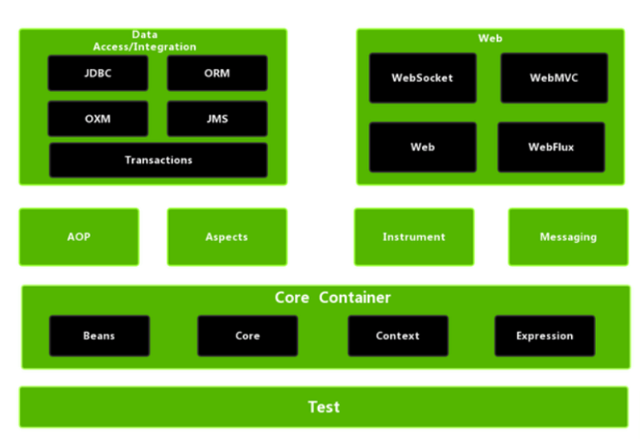

## Spring

### **Spring 中常用注解总结**

#### 依赖注入

**`Component`**：通用的组件定义注解。

**`@Autowired`**：**核心！** 自动按**类型（Type）注入依赖。

**`@Qualifier`**：当同一个接口有多个实现类时，配合 `@Autowired` 使用，按**名称（Name）**指定具体注入哪个。

**`@Resource`**（来自 JSR-250）：默认按**名称**注入，名称找不到再按类型。

**`Value`**：用于注入配置文件（`application.properties`）中的值。支持 SpEL 表达式，如 `@Value("${user.name}")`。

**`@Scope`**：设置 Bean 的作用域（`singleton` 单例、`prototype` 多例）。


####  Spring MVC 与 Web **开发**

**`@RequestMapping`**：映射 URL 到控制器类或方法。**快捷方式**：`@GetMapping`、`@PostMapping`、`@PutMapping`、`@DeleteMapping`。

**`@RestController`**：`@Controller` + `@ResponseBody` 的组合。表示返回的是 JSON/XML 数据而非页面。

**`@RequestBody`**：获取请求体中的内容（通常是 JSON），并将其转为 Java 对象。

**`@RequestParam`**：获取 URL 查询参数（如 `?id=1`）。

**`@PathVariable`**：获取 URL 路径中的变量（如 `/user/{id}`）。

**`@ResponseBody`**：将方法的返回结果直接写入 HTTP 响应体中。


#### 配置与扫描 (Configuration)

**`@Configuration`**：声明当前类是一个配置类（相当于一个 XML 文件）。

**`@Bean`**：在配置类的方法上使用，将方法的返回值交给 Spring 容器管理。

**`@ComponentScan`**：`@ComponentScan` 的作用是告诉 Spring：“去哪些包下寻找标注了 `@Component`（及其派生注解如 `@Service`, `@Controller` 等）的类，并把它们注册为 Bean。”在普通的 Spring 项目中，你需要手动指定 `basePackages`。但在 Spring Boot 中，你通常看不到这个注解，因为它被封装在了 `@SpringBootApplication` 里面。如果你不指定路径，Spring Boot 会默认扫描**启动类（Main Class）所在的包及其子包**。

**`@Import`**：快速导入其他的配置类。


#### AOP 与 事务管理 (AOP & Transaction)

**`@Aspect`**：声明该类是一个切面类。

**`@Before` / `@After` / `@Around`**：定义通知（Advice），在目标方法执行前、后或环绕执行。

**`@Pointcut`**：定义切入点表达式。

**`@Transactional`**：**最常用！** 声明式事务管理。可以标注在类或方法上，保证操作的原子性。

#### Spring Boot 特有注解

**`@SpringBootApplication`**：复合注解，包含 `@SpringBootConfiguration`、`@EnableAutoConfiguration` 和 `@ComponentScan`。

**`@EnableAutoConfiguration`**：开启 Spring Boot 的自动配置机制。

**`@Conditional` 系列**：条件装配。

- `@ConditionalOnProperty`：当配置文件中存在某属性时才加载。
- `@ConditionalOnClass`：当类路径存在某类时才加载。
- `@ConditionalOnMissingBean`：当容器中没有某 Bean 时才加载（常用于默认配置）。

`@ConfigurationProperties` (属性映射)：将配置文件中以某个“前缀”开头的属性，自动映射绑定到 Java Bean 的字段上。

**`@EnableConfigurationProperties`**：告诉 Spring 容器，“去把指定的 `@ConfigurationProperties` 类注册成 Bean 并执行绑定”。


### **Spring 基础**
#### 1. 什么是 Spring | 谈谈你对 Spring 的理解！⭐️

Spring 是一个以 IoC 和 AOP 为核心的轻量级框架,它通过 IoC 实现了对象的解耦，通过 AOP 实现了业务逻辑与系统服务的解耦。

它最大的魅力在于‘不重复造轮子’，它提供了一个强大的容器，能无缝集成各类主流中间件，通过声明式开发极大提高了我们的开发效率。一句话总结：Spring 让复杂的 Java 开发变得优雅且简单。


#### Spring 的核心设计思想

- **非侵入式设计**：业务代码不需要继承 Spring 的类或接口，代码可以脱离框架运行，极大降低了系统对框架的耦合度。
- **声明式编程**：例如使用 `@Transactional` 就能管理事务，而不需要手写繁琐的开启、提交、回滚逻辑。
- **POJO 驱动**：倡导使用普通的 Java 对象来构建应用，而不是复杂重量级的组件（如当年的 EJB）。这点 fastapi 真得学, 一会 sqlalchemy,  一会 pydantic, 烦人啊 ! 
- **一致性编程模型**：无论你是操作 JDBC、Redis 还是发送 MQ，Spring 都提供了高度统一的模板（如 `JdbcTemplate`, `RedisTemplate`）。

#### 2. Spring 包含哪些模块

“Spring 框架通过模块化设计实现了对开发全生命周期的覆盖。核心层（Core）利用 IoC 和 DI 负责 Bean 的创建与生命周期管理；**AOP 模块**通过面向切面编程实现了通用逻辑（如日志、权限）的解耦抽取；**Web 模块**提供了成熟的 MVC 架构来高效处理 HTTP 请求；而 **Data 模块**则极大简化了数据库交互并提供了强大的声明式事务支持。”

<p align='center'>
    
</p>

##### Core Container

Spring 框架的核心模块，也可以说是基础模块，主要提供 IoC 、依赖注入功能的支持。Spring 其他所有的功能基本都需要依赖于该模块

- spring-core：Spring 框架基本的核心工具类。
- spring-beans：提供对 bean 的创建、配置和管理等功能的支持。
- spring-context：提供对象生命周期管理、国际化、事件传播、资源加载等功能的支持。
- spring-expression：提供对表达式语言（Spring Expression Language） SpEL 的支持，只依赖于 core 模块，不依赖于其他模块，可以单独使用。


##### AOP
- **spring-aspects**：该模块为与 AspectJ 的集成提供支持。
- **spring-aop**：提供了面向切面的编程实现。
- **spring-instrument**：提供了为 JVM 添加代理（agent）的功能。 具体来讲，它为 Tomcat 提供了一个织入代理，能够为 Tomcat 传递类文 件，就像这些文件是被类加载器加载的一样。没有理解也没关系，这个模块的使用场景非常有限。

##### 数据访问与集成 (Data Access / Integration)

- **spring-jdbc**：封装了枯燥的 JDBC 操作，自动处理资源释放。
- **spring-tx**：**声明式事务管理**的核心，支持编程式和声明式事务。
- **spring-orm**：集成 ORM 框架（如 Hibernate, JPA, MyBatis）。
- **spring-oxm**：支持对象与 XML 的映射。


##### Web 模块

- **spring-web**：提供基础的 Web 功能，如文件上传、HTTP 客户端等。
- **spring-webmvc (Spring MVC)**：包含 Spring 的 Model-View-Controller 实现，用于构建 Web 应用程序或 REST 服务。
- **spring-websocket**：提供了对 [webSecket](https://www.cnblogs.com/chyingp/p/websocket-deep-in.html) 的支持，WebSocket 可以让客户端和服务端进行双向通信。


##### Messaging

**spring-messaging** 是从 Spring4.0 开始新加入的一个模块，主要职责是为 Spring 框架集成一些基础的报文传送应用。

##### Spring-test

Spring 团队提倡测试驱动开发（TDD）。有了控制反转 (IoC)的帮助，单元测试和集成测试变得更简单。

#### 3. Spring,Spring MVC,Spring Boot 之间什么关系?⭐️

1、spring 是一个企业级的 java 开发框架，有很多模块构成。Spring-Mvc 就是它的一个模块。
2、Spring-Mvc 是 Spring 中一个很重要的框架，主要赋予 Spring 快速构建 MVC 架构的 Web 程序的能力。
3、使用 Spring 进行开发各种配置过于麻烦比如开启某些 Spring 特性时，需要用 XML 或 Java 进行显式配置。于是，Spring Boot 诞生了！它通过“约定优于配置”的理念，解决了 Spring 配置过于麻烦的痛点，实现了**自动配置**和**开箱即用**。


#### 4. Spring 框架中用到了哪些设计模式呢？⭐️

- 工厂设计模式 ：`Spring` 使用工厂模式通过 `BeanFactory`、`ApplicationContext` 创建 `bean` 对象。
- 代理设计模式：`Spring AOP` 功能的实现。
- 单例设计模式：`Spring` 中的 Bean 默认都是单例的。
- 模板方法模式 : `Spring` 中 `jdbcTemplate`、`hibernateTemplate` 等以 Template 结尾的对数据库操作的类，它们就使用到了模板模式。**模板方法模式（Template Method Pattern）** 就是在一个方法中定义一个算法的**骨架**，而将一些步骤的**具体实现**延迟到子类中。
- 适配器模式：`HandlerAdapter` 帮助 `DispathcerServlet` 适配不同类型的 `handler`
- 观察者模式：`Spring` 事件驱动模型就是观察者模式很经典的一个应用。
- 策略模式：`Spring` 在很多地方都提供了多种算法实现，让用户根据配置选择。例如 `Resource` 接口就是一个典型的抽象策略类，Spring 提供了 `FileSystemResource`、`UrlResource`、`ClassPathResource` 等多种实现策略。
- 责任链模式：**拦截器 (Interceptor)** 和 **过滤器 (Filter)**。

### **Spring Ioc**

#### **1.⭐️什么是 Spri**ng Ioc

`Ioc` 即控制反转/反转控制。它是一种思想不是一个技术实现。描述的是：Java 开发领域对象的创建以及管理的问题。例如：现有类 A 依赖于 类 B

**传统的开发方式** ：往往是在类 A 中手动通过 new 关键字来 new 一个 B 的对象出来

**使用 IoC 思想的开发方式** ：不通过 new 关键字来创建对象，而是通过 IoC 容器(Spring 框架) 来帮助我们实例化对象。我们需要哪个对象，直接从 IoC 容器里面去取即可。
因此，我们失去了对对象操作的一些权力（创建、管理对象），但是也得到了很多的好处（不需要考虑对象的创建、管理等一系列事情）

#### 2. 为什么叫控制反转

- **控制** ：指的是对象创建（实例化、管理）的权力
- **反转** ：控制权交给外部环境（IoC 容器）


#### 3.  `Ioc`解决了什么问题⭐️

- 解决对象间高度耦合的问题（核心）
- 解决资源零散、难以复用的问题
- 解决生命周期管理复杂的难题


#### 4. 什么是 `Spring Bean`

简单来说，Bean 代指的就是那些被 IoC 容器所管理的对象。我们需要告诉 IoC 容器帮助我们管理哪些对象，这个是通过配置元数据来定义的。配置元数据可以是 XML 文件、注解或者 Java 配置类。

``` xml
<!-- Constructor-arg with 'value' attribute -->
<bean id="..." class="...">
   <constructor-arg value="..."/>
</bean>
```

#### 5. 将一个类声明为 `Bean` 的注解有哪些？⭐️

- `@Component`：通用的注解，可标注任意类为 `Spring` 组件。如果一个 Bean 不知道属于哪个层，可以使用`@Component` 注解标注。
- `@Repository` : 对应持久层即 Dao 层，主要用于数据库相关操作。
- `@Mapper`：`@Mapper` 注解就是告诉 MyBatis：“这个接口你需要帮我生成代理实现类”。
- `@Service` : 对应服务层，主要涉及一些复杂的逻辑，需要用到 Dao 层。
- `@Controller` : 对应 Spring MVC 控制层，主要用于接受用户请求并调用 `Service` 层返回数据给前端页面。
- `@Configuration`：配置类，主要用来做一些配置。

#### 6. 为什么要分这么多注解？

- **代码可读性**：看到注解，一眼就能看出这个类是干什么的（是调数据库的还是处理请求的）。
- **功能增强**：比如 `@Repository` 会开启异常转换，`@Controller` 会被 Spring MVC 的扫描器特殊对待。


#### 7. `@Component` 和 `@Bean` 的区别是什么

- `@Component` 注解作用于类，而`@Bean`注解作用于方法。
- `@Component` 自动扫描。只要类上带了它，Spring 扫描到路径就会自动实例化。而`@Bean` 方法必须手动 `new` 出对象并返回。该注解的作用可以理解为通知 `Ioc`容器，我手动创建了某个对象（哪怕是别人的代码），请把它收进容器。”
- `@Bean` 注解比 `@Component` 注解的自定义性更强，而且很多地方我们只能通过 `@Bean` 注解来注册 bean。比如当我们引用第三方库中的类需要装配到 `Spring`容器时，则只能通过 `@Bean`来实现。


#### 8. 注入 Bean 的注解有哪些？

Spring 内置的 `@Autowired` 以及 JDK 内置的 `@Resource` 和 `@Inject` 都可以用于注入 Bean。

#### 9. @Autowired 和 @Resource 的区别是什么？⭐️⭐️

`@Autowired` 是 Spring 内置的注解，默认注入逻辑为**先按类型（byType）匹配，若存在多个同类型 Bean，则再尝试按名称（byName）筛选**。

当一个接口存在多个实现类时：

- 若属性名与某个 Bean 的名称一致，则注入该 Bean；
- 若属性名与所有 Bean 名称都不匹配，会抛出 `NoUniqueBeanDefinitionException`，此时需要通过 `@Qualifier` 显式指定要注入的 Bean 名称。

`@Resource` 源自 **JSR-250** 规范（标准 Java 规范），在 JDK 6 到 JDK 10 中，它确实存在于 JDK 提供的包中。不过，从 JDK 11 开始，它不再默认存在于 JDK 内部，你需要引入额外的依赖 `javax.annotation-api`才能使用。Spring 对 `@Resource` 的处理逻辑如下：

1. 先按照名称匹配（默认名称是要注入的变量的名称，也可以指定名称）
2. 如果没找到，则再去按照类型匹配
	1. 找到一个 Bean：注入成功
	2. 找到 0 个：抛出异常 (`NoSuchBeanDefinitionException`)。
	3. 找到 > 1 `Bean`：抛出异常 (`NoUniqueBeanDefinitionException`)。


- `@Autowired` 是 Spring 提供的注解，`@Resource` 是 JDK 提供的注解。
- `Autowired` 默认的注入方式为`byType`（根据类型进行匹配），`@Resource`默认注入方式为 `byName`（根据名称进行匹配）。
- 当一个接口存在多个实现类的情况下，`@Autowired` 和`@Resource`都需要通过名称才能正确匹配到对应的 Bean。`Autowired` 可以通过 `@Qualifier` 注解来显式指定名称，`@Resource`可以通过 `name` 属性来显式指定名称。
- `@Autowired` 支持在构造函数、方法、字段和参数上使用。`@Resource` 主要用于字段和方法上的注入，不支持在构造函数或参数上使用。

#### 10. 当使用 @AutoWired注入时候有多个匹配的 Bean，如何解决⭐️⭐️

在 Spring 的底层逻辑中，**“包扫描到的 `@Component`” 和 “配置类里的 `@Bean`” 如果重名，不属于“冲突（Overriding）”，而属于“细化（Refining）”**。

使用 @Qualifier 明确指定注入的依赖的名称

``` java
@Autowired
@Qualifier("userServiceImpl1") // 明确指定注入名为 userServiceImpl1 的 Bean
private UserService userService;
```

使用 @primary : 当通过 byType 在容器中找到多个 Bean，之后，会优先通过 byName 进行匹配，如果没找到，那么此时优先注入那个被 @primary 标注的 Bean。

``` java
@Component
@Primary  // 设置为默认最高优先级
public class UserServiceImpl1 implements UserService { ... }
```

使用 @Resource 注解来注入, 本质还是明确的指定了要注入依赖的名称

``` java
// 想要根据 Bean 的 ID 直接“点名”获取。
@Resource(name = "userServiceImpl2") // 直接通过名字定位 private UserService userService;
```


#### 11. 什么是依赖注入（DI）⭐️

依赖注入**是实现**控制反转（IoC）的一种具体手段。

“依赖注入就是把 IOC 容器里的 Bean，注入到**需要使用它的那个类（组件）的成员变量中**。”

“依赖注入是将对象之间的依赖关系，交给容器在运行期自动维护。也就是把 Bean 注入到**依赖它的目标对象中**。”

#### 12. 注入 Bean 的方式有哪些？

- 构造函数注入：通过类的构造函数来注入依赖项。
- Setter 注入：通过类的 Setter 方法来注入依赖项。
- Field（字段） 注入：直接在类的字段上使用注解（如 `@Autowired` 或 `@Resource`）来注入依赖项。

``` java
@Service
public class UserService {

    private final UserRepository userRepository;

    public UserService(UserRepository userRepository) {
        this.userRepository = userRepository;
    }

    //...
}
```

``` java
@Service
public class UserService {

    private UserRepository userRepository;

    // 在 Spring 4.3 及以后的版本，特定情况下 @Autowired 可以省略不写
    @Autowired
    public void setUserRepository(UserRepository userRepository) {
        this.userRepository = userRepository;
    }
    //...
}
```

``` java
@Service
public class UserService {

    @Autowired
    private UserRepository userRepository;

    //...
}
```


#### 13. 构造函数注入有什么好处？⭐️⭐️

官方推荐构造函数注入，因为这种注入方式优点很多：
1. 依赖完整性：确保所有必需依赖在对象创建时就被注入，避免了空指针异常的风险。
2. 不可变性：可以使用 `final` 关键字，确保依赖在对象生命周期内不被篡改。
3. 完全脱离 IOC 容器测试：在编写单元测试时，可以直接 `new` 出来并传入 Mock 对象，不需要启动 Spring 容器。


#### 14. @Autowired 的问题 ⭐️

1. **隐藏依赖**：看构造函数看不出这个类到底依赖了谁。
2. **违背单一职责**：因为字段注入太方便了，会导致一个类里注入几十个对象而不自知。
3. 不反射很难手动注入依赖。

#### 15. Bean 的作用域有哪些？⭐️

- **singleton** : IoC 容器中只有唯一的 bean 实例。Spring 中的 bean 默认都是单例的，是对单例设计模式的应用。
- **prototype** : 每次获取都会创建一个新的 bean 实例。也就是说，连续 `getBean()` 两次，得到的是不同的 Bean 实例。
- **request** （仅 Web 应用可用）: 每一次 HTTP 请求都会产生一个新的 bean（请求 bean），该 bean 仅在当前 HTTP request 内有效。
- **session** （仅 Web 应用可用） : 每一次来自新 session 的 HTTP 请求都会产生一个新的 bean（会话 bean），该 bean 仅在当前 HTTP session 内有效。
- **websocket** （仅 Web 应用可用）：每一次 WebSocket 会话产生一个新的 bean。

配置 `Bean` 的作用域
``` java
<bean id="..." class="..." scope="singleton"></bean>
```

``` java
@Bean
@Scope(value = ConfigurableBeanFactory.SCOPE_PROTOTYPE)
public Person personPrototype() {
    return new Person();
}
```

#### 16. Bean 是线程安全的吗？⭐️

Spring 框架中的 Bean 是否线程安全，取决于其作用域和状态。

prototype 作用域下，每次获取都会创建一个新的 bean 实例，不存在资源竞争问题，所以不存在线程安全问题。singleton 作用域下，IoC 容器中只有唯一的 bean 实例，可能会存在资源竞争问题（取决于 Bean 是否有状态）。如果这个 bean 是有状态的话，那就存在线程安全问题（有状态 Bean 是指包含可变的成员变量的对象）。

#### 17. Bean 的生命周期了解吗⭐️⭐️⭐️

Spring Bean的生命周期可以概括为**四大阶段**：**实例化 → 属性赋值 → 初始化 → 销毁**。但细节远不止这些，我们通过代码一步步拆解：

1、在实例化阶段，Ioc 容器会根据当前 Bean 的 BeanDefination，从而通过 java 反射 API 来创建 Bean 的实例。

2、Bean 属性赋值与依赖注入：为当前 Bean 的属性和相关依赖进行赋值，例如通过 @Autowired、@Resource 等注解注入依赖， @Value 注入值。

3、Bean 的初始化：这一步是Bean的“成人礼”，Spring提供了多种扩展点，具体如下：

（1）各种 Aware 接口回调：Spring 会检查 Bean 是否实现了一系列以 `Aware` 结尾的接口，并注入容器资源:

- **BeanNameAware**: 传入 Bean 的 ID。
- **BeanFactoryAware**: 传入当前的 Bean 工厂。
- **ApplicationContextAware**: 传入 Spring 上下文（最常用，让你能在代码里手动获取其他 Bean）。

（2）BeanPostProcessor 前置处理 (`postProcessBeforeInitialization`)：

（3）执行 `@PostConstruct` 注解标注的初始化方法

（4）如果 Bean 实现了`InitializingBean`接口，执行`afterPropertiesSet()`方法。

（5）如果 Bean 在定义中包含 `init-method` 属性，执行指定的方法。

（6）BeanPostProcessor 后置处理（`postProcessAfterInitialization`）:这是初始化最后一步。**Spring AOP（动态代理）通常就是在这里发生的**。Spring 会判断这个 Bean 是否需要切面增强，如果需要，就返回一个代理对象（Proxy）来替换原始对象。

和销毁阶段一样，排除后置处理器的前置与后置方法，还是按照注解 > 接口 > 配置的优先级来执行的

<p align='center'>
    
</p>

4、Bean 的销毁阶段：销毁并不是说要立马把 Bean 给销毁掉，而是把 Bean 的销毁方法先记录下来，将来需要销毁 Bean 或者销毁容器的时候，就调用这些方法去释放 Bean 所持有的资源。

先执行 `@PreDestory` 标注的方法，之后再去执行接口：`DisposableBean` 提供的 `destory` 方法，最后执行 `@Bean` 指定的 `destroyMethod`.


#### 18. 为什么在销毁阶段提供了三个拓展点呢？

**`DisposableBean`**：Spring 早期提供的机制。现在不推荐使用，因为你的代码会和 Spring 框架的 API 强耦合。

**`@PreDestroy`**：最推荐。它是 Java 标准（Jakarta EE），代码侵入性小，不依赖 Spring 的接口。

**`destroy-method`**：适合**第三方库的类**。当你无法修改别人源码（无法加注解或实现接口）时，可以在配置类里通过这种方式指定销毁逻辑。

### **Spring Aop**

#### 1. 什么是 `Aop`，你对他的理解？⭐

`AOP` 实际上就是一种`横向抽取`机制，把散落在各个业务方法中的非业务代码（日志、事务、限流）给拎出来，放到一个地方统一管理。这样就实现了业务与非业务代码的解耦，同时非业务代码能够轻易的复用到其他地方，如果非业务代码的逻辑需要修改，也只需要修改一个地方。

Spring AOP 就是基于动态代理的，如果要代理的对象，实现了某个接口，那么 Spring AOP 会使用 **JDK Proxy**，去创建代理对象，而对于没有实现接口的对象，就无法使用 JDK Proxy 去进行代理了，这时候 Spring AOP 会使用 **Cglib** 生成一个被代理对象的子类来作为代理

#### 2. `AOP` 的核心概念⭐️

| **术语**               | **重新定义的含义**                                           | **避坑提醒**                                                 |
| ---------------------- | ------------------------------------------------------------ | ------------------------------------------------------------ |
| **目标对象 (Target)**  | 被通知 \| 被代理原始对象                                     | 它是“毛坯房”，没有任何增强逻辑。                             |
| **代理对象 (Proxy)**   | Spring 织入通知后生成的“代理”                                | 调用者拿到的是它。如果是 JDK 代理，它只拥有接口方法。        |
| **连接点 (JoinPoint)** | 目标对象的所属类中，定义的所有方法均为连接点                 | **重点：** 虽然定义上说“所有方法”，但实际上 `private`、`static`、`final` 方法是无法被代理拦截的。 |
| **切入点 (Pointcut)**  | **被选中的连接点**。即你通过表达式（如 `execution`）明确指定要增强的方法。 | 连接点是“候选人”，切入点是“当选者”。                         |
| **通知 (Advice)**      | **要在切入点执行的增强逻辑**（前置、后置、环绕等）。         | 解决“做什么”和“什么时候做”的问题。                           |
| **切面 (Aspect)**      | **切入点 (Pointcut) + 通知 (Advice)** 的结合体。             | 它是一个模块化的横切关注点（比如日志切面、事务切面）。       |
| **织入 (Weaving)**     | 将切面应用到目标对象并创建代理对象的过程。                   | Spring AOP 在**运行时**通过动态代理完成织入。                |

**织入的动作就是：** Spring 容器启动时，发现某个类下边的某些方法符合切入点条件，于是它利用**动态代理技术**（JDK 或 CGLIB），把切面的逻辑“插”到业务代码的指定位置，并且产生一个**代理对象（Proxy）**。


#### 3. Spring AOP 和 AspectJ AOP 有什么区别⭐️

| **维度**     | **Spring AOP**                             | **AspectJ AOP**                                |
| ------------ | ------------------------------------------ | ---------------------------------------------- |
| **实现机制** | **动态代理**：基于 JDK Proxy 或 CGLIB      | **静态织入**：通过修改字节码实现               |
| **织入时机** | **运行时 (Runtime)**                       | **编译期、编译后或类加载期**                   |
| **功能强度** | **较弱**：仅支持方法级别的拦截             | **强大**：支持字段、构造函数、私有方法等       |
| **性能**     | **稍逊**：每次调用需经过代理和拦截器链     | **极高**：增强代码直接“缝”入字节码，无代理开销 |
| **易用性**   | **简单**：与 Spring 容器无缝集成，开箱即用 | **复杂**：需要专门的编译器（ajc）或 Agent 代理 |

在大多数 Spring 业务开发中，我们使用的是 **“基于 AspectJ 注解风格的 Spring AOP”**。也就是说，我们用了 AspectJ 的 `@Aspect`、`@Before` 等注解来方便定义切面，但底层运行时的实现仍然是 Spring AOP 的**动态代理**。


#### 4. AOP 常见的通知类型有哪些？⭐
<p align='center'>
    
</p>

总结：`Before`、`After`、`AfterReturing`、`AfterThrowing` 这四种通知类型都是感知通知，也就是在特定时机，比如目标方法即将要被代理对象调用了，Spring 会通知一下，然后触发 `@Before` 通知，但它无法影响本次方法的执行。但 `Around` 能够拿到本次方法的控制权，它可以修改目标方法的入参，返回值等等。

#### 5. 多个切面的执行顺序如何控制⭐⭐

使用 `@Order` 注解或实现 `Ordered` 接口。**数值越小，优先级越高，逻辑越靠外层。**

1、通常使用`@Order` 注解直接定义切面顺序

``` java
// 值越小优先级越高
@Order(3)
@Component
@Aspect
public class LoggingAspect implements Ordered
    
       ┌──────────────────────────────────────────┐
       │  [Order(1)] 日志切面 (最外层)               │
       │  ┌────────────────────────────────────┐  │
       │  │  [Order(2)] 缓存切面                │  │
       │  │  ┌──────────────────────────────┐  │  │
       │  │  │      真正的业务方法 (Target)    │  │  │
       │  │  └──────────────────────────────┘  │  │
       │  │         缓存切面逻辑结束            │  │
       │  └────────────────────────────────────┘  │
       │          日志切面逻辑结束                  │
       └──────────────────────────────────────────┘
```

**2、实现`Ordered` 接口重写 `getOrder` 方法。**

``` java
@Component
@Aspect
public class LoggingAspect implements Ordered {

    // ....

    @Override
    public int getOrder() {
        // 返回值越小优先级越高
        return 1;
    }
}
```

### **Spring Mvc**

#### 0. 什么是 `Servlet `

**Servlet**（Server Applet）是 Java 提供的一种**标准和接口**，专门用于处理来自客户端的 HTTP 请求并生成响应。

#### 1. 说说自己对于 Spring MVC 了解?

MVC 是一种设计模式，Spring MVC 是一款很优秀的 MVC 框架。Spring MVC 可以帮助我们进行更简洁的 Web 层的开发，并且它天生与 Spring 框架集成。Spring MVC 下我们一般把后端项目分为 Service 层（处理业务）、Dao 层（数据库操作）、Entity 层（实体类）、Controller 层(控制层，返回数据给前台页面)。

Spring MVC 实际上是对 **Servlet** 的一种封装。它通过一个 **DispatcherServlet** 统一处理所有请求，避免了传统 Servlet 开发中需要写大量重复 `doGet/doPost` 的麻烦，让开发者能专注于业务逻辑的编写。

#### 2. Spring MVC 的核心组件有哪些？⭐️


- **`DispatcherServlet`**：**核心的中央处理器**，负责接受、分发请求，并给予客户端响应。
- **`HandlerMapping`**：**处理器映射器**，根据 URL 去匹配查找能处理的 `Handler` ，并会将请求涉及到的拦截器和 `Handler` 一起封装。
- **`HandlerAdapter`**：**处理器适配器**，根据 `HandlerMapping` 找到的 `Handler` ，适配执行对应的 `Handler`；
- **`Handler`**：**请求处理器**，处理实际请求的处理器。
- **`ViewResolver`**：**视图解析器**，根据 `Handler` 返回的逻辑视图 / 视图，解析并渲染真正的视图，并传递给 `DispatcherServlet` 响应客户端

#### 3. ⭐️SpringMVC 工作原理了解吗?
<p align='center'>
    
</p>

1.  客户端（浏览器）发送请求 `DispatcherServlet`拦截请求. 
2. `DispatcherServlet` 根据请求消息调用 `HandlerMapping`  会根据本次请求的 `url` 找到对应的 `handler`，并会将请求涉及到的拦截器和 `Handler` 一起封装返回。
3. `DispatcherServlet` 调用 `HandlerAdapter`适配器执行 `Handler` 。
4. `Handler` 完成对用户请求的处理后，会返回一个 `ModelAndView` 对象给`DispatcherServlet`，`ModelAndView` 顾名思义，包含了数据模型以及相应的视图的信息。`Model` 是返回的数据对象，`View` 是个逻辑上的 `View`
5. `DispatcherServlet`将`ModelAndView`传给`ViewReslover`视图解析器
6. `ViewReslover`解析后返回具体`View`
7. `DispaterServlet` 把返回的 `Model` 传给 `View`（视图渲染）
8. `DispaterServlet` 会将视图响应给客户端

Spring MVC 还有一个重要的隐形组件叫 **异常解析器**。当 Controller 报错时，它会拦截异常，并决定是跳转到一个错误页面，还是返回一个包含错误信息的 JSON 格式。

但这一流程是传统开发模式（JSP，Thymeleaf 等）的工作原理。然而现在主流的开发方式是前后端分离，这种情况下 Spring MVC 的 `View` 概念发生了一些变化，由于 `View` 通常由前端框架（Vue, React 等）来处理，后端不再负责渲染页面，而是只负责提供数据。


#### 4. 为什么找到了合适的处理器，还需要通过 HandlerAdapter 执行这些处理器呢？

Spring MVC 是一个极其灵活且高扩展性的框架，它支持多种完全不同风格的“处理器（Handler）”写法。

- **注解式处理器**：也就是我们最常用的 `@Controller` 加 `@RequestMapping`
- **实现接口式处理器**：实现 `org.springframework.web.servlet.mvc.Controller` 接口的类。
- **实现 Servlet 接口的类**：你甚至可以直接把一个标准的 `Servlet` 丢给 Spring MVC 当处理器。
- **HttpRequestHandler**：用于处理静态资源或特定的 HTTP 请求。

如果 `DispatcherServlet` 直接调用处理器，它就必须写一堆 `if-else` 来判断当前 Handler 是哪种类型，为了优化`DispatcherServlet`代码，Spring 引入了 **适配器模式（Adapter Pattern）**。


#### 5. 统一异常处理怎么做⭐️

推荐使用注解的方式统一异常处理，具体会使用到 `@ControllerAdvice` + `@ExceptionHandler` 这两个注解 。

**`@ControllerAdvice`**：这是一个增强型的 `@Component`。它的作用是给所有的 `Controller` 织入异常处理的横切逻辑（类似于 AOP 的切面）。

**`@ExceptionHandler`**：标注在方法上，用于声明该方法负责处理哪种类型的异常。


#### 6. Spring 内部异常(处理 404)如何处理？

首先， `@ControllerAdvice` + `@ExceptionHandler` 实现的全局异常处理只能捕获由 `controller` 抛出的异常，但是，存在一种情况，也就是还没进入 `controller`，就抛了异常，这样的异常是全局异常处理默认无法捕捉到的，那如何处理像这样的 Spring 内部错误呢？

在 Spring Boot 配置文件中开启如下配置，让 Spring 在找不到 Handler 时抛出异常，这样就能被全局处理器捕获了：

```
# 1. 告诉 DispatcherServlet：找不到映射时，请直接抛出 NoHandlerFoundException 异常
spring.mvc.throw-exception-if-no-handler-found=true

# 2. 必须关闭静态资源默认映射，否则所有的 URL 都会被静态资源处理器“拦截”尝试去查找文件 # 这样即便 URL 错了，它也只会认为“没找到文件”，而不会触发“找不到 Handler”的逻辑
spring.web.resources.add-mappings=false
```

#### 7. 简述SpringMVC中如何返回JSON数据⭐️

在 Spring MVC 中，返回 JSON 数据主要依赖于 **消息转换器（Message Converter）** 机制。目前最主流的方式是使用 Jackson 库。

（1）核心就是我们标注了：`@ResponseBody` 或 `@RestController`
（2）之后，当 Spring 看到 `@ResponseBody` 时，它会调用 **`MappingJackson2HttpMessageConverter`**（如果类路径下存在 Jackson 依赖）。该转换器会自动调用 Jackson 的 `ObjectMapper`，将 Java 对象（POJO、Map、List等）序列化为 JSON 字符串。


如果你想控制 JSON 的输出（比如日期格式、忽略某些字段），可以使用 Jackson 提供的注解：

- **`@JsonFormat(pattern = "yyyy-MM-dd")`**：格式化日期字段。
- **`@JsonIgnore`**：排除不需要返回给前端的字段（如密码）。
- **`@JsonProperty("user_name")`**：修改返回给前端的键名。


#### 8. 自定义转换器

##### 处理 Json 传参
``` java
public enum Gender {
    MALE(0, "男"),
    FEMALE(1, "女");

    @JsonValue // 序列化：将对象转 JSON 时，只输出这个 code 字段
    private final int code;
    private final String desc;

    Gender(int code, String desc) {
        this.code = code;
        this.desc = desc;
    }

    @JsonCreator // 反序列化：Jackson 收到 0 时，调用此静态方法寻找匹配的枚举
    public static Gender fromCode(int code) {
        for (Gender gender : Gender.values()) {
            if (gender.code == code) {
                return gender;
            }
        }
        return null;
    }
}
```


##### 处理 URL 传参

如果你的 `0` 是通过 **URL 参数**（Query String）传过来的（例如 `?gender=0`），Jackson 注解是不起作用的，因为这是 Spring MVC 的参数绑定流程。这时候需要自定义 `Converter`。

1. 编写转换器
``` java
public class CodeToGenderConverter implements Converter<String, Gender> {
    @Override
    public Gender convert(String source) {
        return Gender.fromCode(Integer.parseInt(source));
    }
}
```

2. 注册转换器
``` java
@Configuration
public class WebConfig implements WebMvcConfigurer {
    @Override
    public void addFormatters(FormatterRegistry registry) {
        // 将自定义转换器注册到 Spring MVC 中
        registry.addConverter(new CodeToGenderConverter());
    }
}
```


转换器工厂实现通用逻辑！
1. 第一步：定义一个通用枚举接口
```
public interface BaseEnum {
    int getCode(); // 定义统一的获取 code 的方法
}
```


2. 编写枚举类并实现接口
``` java
public enum Gender implements BaseEnum {
    MALE(0, "男"), FEMALE(1, "女");

    private final int code;
    private final String desc;

    Gender(int code, String desc) { this.code = code; }

    @Override
    public int getCode() { return code; }
}
```

3. 实现通用的 ConverterFactory
``` java
public class IntegerToEnumConverterFactory implements ConverterFactory<Integer, BaseEnum> {

    @Override
    public <T extends BaseEnum> Converter<Integer, T> getConverter(Class<T> targetType) {
        return new IntegerToEnumConverter<>(targetType);
    }

    private static class IntegerToEnumConverter<T extends BaseEnum> implements Converter<Integer, T> {
        private final Class<T> enumType;

        public IntegerToEnumConverter(Class<T> enumType) {
            this.enumType = enumType;
        }

        @Override
        public T convert(Integer source) {
            // 遍历该枚举类型的所有常量，匹配 code
            for (T constant : enumType.getEnumConstants()) {
                if (constant.getCode() == source) {
                    return constant;
                }
            }
            return null;
        }
    }
}
```

4. 注册到 SpringMvc 中
``` java
@Configuration
public class WebConfig implements WebMvcConfigurer {
    @Override
    public void addFormatters(FormatterRegistry registry) {
        // 注册工厂
        registry.addConverterFactory(new IntegerToEnumConverterFactory());
    }
}
```
### **Spring 循环依赖**

#### 1. Spring 循环依赖了解吗，怎么解决？⭐️

循环依赖指的是一组 Bean 对象之间的依赖关系形成了一个环，最简单的循环依赖：`A` 依赖 `B`，`B` 依赖 `A`。

而 `Spring` 提供的解决循环依赖的方法是三级缓存！

假设 A 依赖 B，B 依赖 A。

1. **A 挂号（实例化）**：Spring 先创建 A 的实例（反射调用构造函数）。此时 A 还是个“空壳子”，Spring 把 A 包装成一个工厂放入**三级缓存**。
   
2. **A 装装修（填充属性）**：A 发现需要 B，于是去容器找 B。
   
3. **B 挂号（实例化）**：发现没有 B，Spring 开始创建 B。同样，把 B 放入**三级缓存**。
   
4. **B 装修（填充属性）**：B 发现需要 A。它去一级、二级缓存找，没找到；去**三级缓存**找到了 A 的工厂。
   
5. **A 升级（移入二级缓存）**：B 调用 A 的工厂，拿到了 A 的引用（如果是 AOP 则是代理对象），把 A 放入**二级缓存**。此时 B 成功拿到了 A 的引用，完成了属性注入。
   
6. **B 完工（移入一级缓存）**：B 装修完成，从二级、三级缓存移除，存入**一级缓存**。
   
7. **A 完工（移入一级缓存）**：回到 A 的装修流程，由于 B 已经在一级缓存了，A 顺利拿到 B。A 装修完成，存入**一级缓存**。

#### 2. 三级缓存机制⭐️

**一级缓存（singletonObjects）**：存放最终形态的 Bean（已经实例化、属性填充、初始化），单例池，为“Spring 的单例属性”⽽⽣。一般情况我们获取 Bean 都是从这里获取的，但是并不是所有的 Bean 都在单例池里面，例如原型 Bean 就不在里面。

**二级缓存（earlySingletonObjects）**：存放过渡 Bean（半成品，尚未属性填充），也就是三级缓存中`ObjectFactory`产生的对象，与三级缓存配合使用的，可以防止 AOP 的情况下，每次调用`ObjectFactory#getObject()`都是会产生新的代理对象的。

**三级缓存（singletonFactories）**：存放`ObjectFactory`，`ObjectFactory`的`getObject()`方法（最终调用的是`getEarlyBeanReference()`方法）可以生成原始 Bean 对象或者代理对象（如果 Bean 被 AOP 切面代理）。三级缓存只会对单例 Bean 生效。


#### 3. 为什么需要三级，两级不行吗？⭐️

二级缓存确实能解决循环依赖问题：
1）A 实例化后存到二级缓存，然后给属性赋值，发现依赖 B
2）B 实例化后存到二级缓存，然后给属性赋值，发现依赖 A，去缓存查，发现能查到，直接注入，之后完成初始化，然后进行缓存转移。
3）回到 A 的属性赋值，发现一级缓存已经有了 B，直接赋值，之后进行初始化，最后做一个缓存转移即可。

但是，当 A 对象需要被代理时，此时如果只有二级缓存，那么在 B 注入 A 的时候拿到的是 A 的原始对象，但 A 经过初始化后得到的是一个代理对象，我们发现：A 对象与 B 对象里依赖的 A 对象不是一个对象。

#### 4. @Lazy 能解决构造器注入循环依赖问题吗？⭐️

`@Lazy` 用来标识类是否需要懒加载/延迟加载，可以作用在类上、方法上、构造器上、方法参数上、成员变量中。

如果一个 Bean 没有被标记为懒加载，那么它会在 Spring IoC 容器启动的过程中被创建和初始化。如果一个 Bean 被标记为懒加载，那么它不会在 Spring IoC 容器启动时立即实例化，而是在第一次被请求时才创建。这可以帮助减少应用启动时的初始化时间，也可以用来解决循环依赖问题。

- 首先 Spring 会去创建 A 的 Bean，创建时需要注入 B 的属性；
- 由于在 A 上标注了 `@Lazy` 注解，因此 Spring 会去创建一个 B 的代理对象，将这个代理对象注入到 A 中的 B 属性；
- 之后开始执行 B 的实例化、初始化，在注入 B 中的 A 属性时，此时 A 已经创建完毕了，就可以将 A 给注入进去。


#### 5. SpringBoot 允许循环依赖发生么？

在 2.6.x 之前默认默许，但在 2.6.x 之后就不再允许了。


#### 6. 为什么三级缓存没法解决构造器注入的循环依赖问题？⭐️

**三级缓存的工作时机**是在第 1 步**完成之后**、第 2 步**开始之前**。它将一个“半成品”对象（还没注入属性的对象）提前暴露出去。

**构造器注入的问题在于：** 当类 A 通过构造器注入类 B 时，意味着 A 在执行第 1 步（实例化）时，就必须拿到 B。

### Spring 事务

#### 1. 什么是事务
事务就是一组操作，这组操作要么全部执行成功，要么都不执行。
#### 2. 事务的四大特性⭐️

- **原子性**（`Atomicity`）：事务是最小的执行单位，不允许分割。事务的原子性确保动作要么全部完成，要么完全不起作用；
- **一致性**（`Consistency`）：执行事务前后，数据保持一致，例如转账业务中，无论事务是否成功，转账者和收款人的总额应该是不变的；
- **隔离性**（`Isolation`）：并发访问数据库时，一个用户的事务不被其他事务所干扰，各并发事务之间数据库是独立的；
- **持久性**（`Durability`）：一个事务被提交之后。它对数据库中数据的改变是持久的，即使数据库发生故障也不应该对其有任何影响。

#### 3. Spring 管理事务的方式？⭐️

Spring 支持两种两种方式的事务管理，分别是编程式和声明式

通过 `TransactionTemplate`或者`TransactionManager`手动管理事务，实际应用中很少使用，但是对于你理解 Spring 事务管理原理有帮助。

**编程式事务管理**

``` java
@Autowired
private TransactionTemplate transactionTemplate; // 1. 注入模板

public void testTransaction() {
    // 2. 执行 execute 方法：它内部会自动帮你开启事务
    transactionTemplate.execute(new TransactionCallbackWithoutResult() {
        @Override
        protected void doInTransactionWithoutResult(TransactionStatus status) {
            try {
                // 3. 业务代码：只需要关注这里
                // SQL 1...
                // SQL 2...
            } catch (Exception e) {
                // 4. 标记回滚：如果出错，告诉 status “这个事务完蛋了，等下记得回滚”
                status.setRollbackOnly();
            }
        }
    });
    // 5. 自动收尾：execute 方法结束时，如果没有 rollback 标记，会自动 commit
}
```

使用 `TransactionManager` 进行编程式事务管理的示例代码如下：
``` java
@Autowired
private PlatformTransactionManager transactionManager; // 1. 注入事务管理器（操作员）

public void testTransaction() {
    // 2. 开启事务：告诉管理器我要开启一个默认属性的事务，它会返回一个 status（相当于这个事务的凭证）
    TransactionStatus status = transactionManager.getTransaction(new DefaultTransactionDefinition());
    
    try {
        // 3. 业务逻辑：比如扣款、增加库存
        // -------------------------------
        // 执行 SQL...
        // -------------------------------
        
        // 4. 提交：如果没有报错，手动调用 commit
        transactionManager.commit(status);
    } catch (Exception e) {
        // 5. 回滚：如果 catch 到了异常，手动调用 rollback
        transactionManager.rollback(status);
    }
}
```

**声明式事务管理**
底层就是 AOP + TransactionTemplate 来完成事务管理的

``` java
@Transactional(propagation = Propagation.REQUIRED)
public void aMethod {
  //do something
  B b = new B();
  C c = new C();
  b.bMethod();
  c.cMethod();
}
```


#### 4. Spring 事务管理接口介绍⭐️
Spring 框架中，事务管理最重要的 3 个接口如下：

- **`PlatformTransactionManager`**：（平台）事务管理器，Spring 事务策略的核心。
- **`TransactionDefinition`**：事务定义信息(事务隔离级别、传播行为、超时、只读、回滚规则)。
- **`TransactionStatus`**：事务运行状态。

**`PlatformTransactionManager`** 会根据 **`TransactionDefinition`** 的定义比如事务超时时间、隔离级别、传播行为等来进行事务管理 ，而 **`TransactionStatus`** 接口则提供了一些方法来获取事务相应的状态比如是否新事务、是否可以回滚等等。


##### 4.1 PlatformTransactionManager

`Spring` 并不直接管理事务，而是提供了一个管理事务的抽象策略者：`PlatformTransactionManager`，它定义了一个事务管理者所具备什么功能，而具体实现是第三方去实现的，比如 JDBC 的实现类 `DataSourceTransactionManager`。

| **持久化技术**     | **对应的实现类**                   | **适用场景**                           |
| ------------------ | ---------------------------------- | -------------------------------------- |
| **JDBC / MyBatis** | **`DataSourceTransactionManager`** | 最常用。通过 `Connection` 来管理事务。 |
| **JPA**            | **`JpaTransactionManager`**        | 用于 Spring Data JPA。                 |
| **Hibernate**      | **`HibernateTransactionManager`**  | 用于老牌的 Hibernate 框架。            |

``` java
public interface PlatformTransactionManager {
    //获得事务
    TransactionStatus getTransaction(@Nullable TransactionDefinition var1) throws TransactionException;
    //提交事务
    void commit(TransactionStatus var1) throws TransactionException;
    //回滚事务
    void rollback(TransactionStatus var1) throws TransactionException;
}
```

##### 4.2 TransactionDefinition

`TransactionDefiniton`是用来描述事务属性的，事务属性包含了 5 个方面，分别是（1）隔离级别（2）传播行为（3）回滚规则（4）是否只读（5）事务超时

`TransactionDefinition` 接口中定义了 5 个方法以及一些表示事务属性的常量比如隔离级别、传播行为等等。
``` java
public interface TransactionDefinition {
    int PROPAGATION_REQUIRED = 0;
    int PROPAGATION_SUPPORTS = 1;
    int PROPAGATION_MANDATORY = 2;
    int PROPAGATION_REQUIRES_NEW = 3;
    int PROPAGATION_NOT_SUPPORTED = 4;
    int PROPAGATION_NEVER = 5;
    int PROPAGATION_NESTED = 6;
    int ISOLATION_DEFAULT = -1;
    int ISOLATION_READ_UNCOMMITTED = 1;
    int ISOLATION_READ_COMMITTED = 2;
    int ISOLATION_REPEATABLE_READ = 4;
    int ISOLATION_SERIALIZABLE = 8;
    int TIMEOUT_DEFAULT = -1;
    // 返回事务的传播行为，默认值为 REQUIRED。
    int getPropagationBehavior();
    //返回事务的隔离级别，默认值是 DEFAULT
    int getIsolationLevel();
    // 返回事务的超时时间，默认值为-1。如果超过该时间限制但事务还没有完成，则自动回滚事务。
    int getTimeout();
    // 返回是否为只读事务，默认值为 false
    boolean isReadOnly();

    @Nullable
    String getName();
}
```

##### 4.3 TransactionStatus

`TransactionStatus`接口用来记录事务的状态 该接口定义了一组方法,用来获取或判断事务的相应状态信息。

`PlatformTransactionManager.getTransaction(…)`方法返回一个 `TransactionStatus` 对象。

```
public interface TransactionStatus{
    boolean isNewTransaction(); // 是否是新的事务
    boolean hasSavepoint(); // 是否有恢复点
    void setRollbackOnly();  // 设置为只回滚
    boolean isRollbackOnly(); // 是否为只回滚
    boolean isCompleted; // 是否已完成
}
```


#### 5. 事务属性

##### 5.1 传播行为

简单来说，事务传播行为要解决的问题是：**当一个业务方法被另一个业务方法调用时，这个事务该如何运行？**（是加入老事务，还是自己开个新事务？）

*第一类为支持当前事务，也是最常用的。*

1.`PROPAGATION_REQUIRED`

如果当前存在事务，则加入该事务；如果当前没有事务，则创建一个新的事务。

2.`PROPAGATION_SUPPORTS`

如果当前有事务，就加入；如果没有，就以非事务方式执行。

3.`PROPAGATION_MANATORY`

必须在事务中运行，如果没有事务就报错。

*第二类为不支持当前事物的*

4.`REQUIRES_NEW`

无论有没有老事务，都新建一个事务。如果老事务存在，先把它挂起。

5.`NOT_SUPPORTED`

以非事务方式执行。如果老事务存在，先挂起。

6.`NEVER`

以非事务方式执行，如果有事务就报错。

*嵌套事务*

7.`NESTED`

如果当前有事务，则在嵌套事务内执行（类似于“子事务”）。如果子事务 NESTED 失败回滚，它不会导致外部主事务回滚。但如果主事务回滚，子事务一定跟着回滚。


“`REQUIRED` 是默认的一条船；`REQUIRES_NEW` 是另起炉灶开新船；`NESTED` 是大船底下拴个小救生艇。”
##### 5.2 隔离级别

- **`TransactionDefinition.ISOLATION_DEFAULT`** :使用后端数据库默认的隔离级别，MySQL 默认采用的 `REPEATABLE_READ` 隔离级别 Oracle 默认采用的 `READ_COMMITTED` 隔离级别.
- **`TransactionDefinition.ISOLATION_READ_UNCOMMITTED`** :最低的隔离级别，使用这个隔离级别很少，因为它允许读取尚未提交的数据变更，**可能会导致脏读、幻读或不可重复读**
- **`TransactionDefinition.ISOLATION_READ_COMMITTED`** : 允许读取并发事务已经提交的数据，**可以阻止脏读，但是幻读或不可重复读仍有可能发生**
- **`TransactionDefinition.ISOLATION_REPEATABLE_READ`** : 一次事务内的多次读取结果都是一致的，除非数据是被本身事务自己所修改，可以阻止脏读和不可重复读，但幻读仍有可能发生。
- **`TransactionDefinition.ISOLATION_SERIALIZABLE`** : 最高的隔离级别，完全服从 ACID 的隔离级别。所有的事务依次逐个执行，这样事务之间就完全不可能产生干扰，也就是说，**该级别可以防止脏读、不可重复读以及幻读**。但是这将严重影响程序的性能。通常情况下也不会用到该级别。


#### 6. 脏读、幻读、不可重复读

脏读：读到了其他事务修改但回滚的数据
幻读：同一个事务中，读取同一个范围（Range）的数据，发现多了或者少了几行。
不可重复读：同一个事务中，多次读取同一行记录，结果不一样。

#### 7. 事务回滚机制
这些规则定义了哪些异常会导致事务回滚而哪些不会。默认情况下，事务只有遇到运行期异常（`RuntimeException` 的子类）时才会回滚，`Error` 也会导致事务回滚，但是，在遇到检查型（Checked）异常时不会回滚。

``` java
@Transactional(rollbackFor= MyException.class)
```


#### 8. @Transactional 注解使用详解

##### 8.1  @Transactional 的常用配置参数

可以通过`@Transactional`注解来配置事务的基本属性，入传播方式，隔离级别，回滚机制，是否只读，超时时间。
``` java
@Target({ElementType.TYPE, ElementType.METHOD})
@Retention(RetentionPolicy.RUNTIME)
@Inherited
@Documented
public @interface Transactional {

  @AliasFor("transactionManager")
  String value() default "";

  @AliasFor("value")
  String transactionManager() default "";

  Propagation propagation() default Propagation.REQUIRED;

  Isolation isolation() default Isolation.DEFAULT;

  int timeout() default TransactionDefinition.TIMEOUT_DEFAULT;

  boolean readOnly() default false;

  Class<? extends Throwable>[] rollbackFor() default {};

  String[] rollbackForClassName() default {};

  Class<? extends Throwable>[] noRollbackFor() default {};

  String[] noRollbackForClassName() default {};

}
```


##### 8.2 作用范围

1. **方法**：推荐将注解使用于方法上，不过需要注意的是：**该注解只能应用到 public 方法上，否则不生效。**
2. **类**：如果这个注解使用在类上的话，表明该注解对该类中所有的 public 方法都生效。
3. **接口**：不推荐在接口上使用。
##### 8.3 @Transactional 原理

当给一个方法加上 `@Transactional` 时，Spring 在启动时不会直接返回该方法所在的原始类对象，而是会给当前类生成一个**代理对象（Proxy）**。

当外部调用该方法时，代理对象先拦截到请求，通过 `PlatformTransactionManager`（事务管理器）开启事务，并关闭数据库连接的“自动提交”。

``` java
public class DefaultAopProxyFactory implements AopProxyFactory, Serializable {

  @Override
  public AopProxy createAopProxy(AdvisedSupport config) throws AopConfigException {
    if (config.isOptimize() || config.isProxyTargetClass() || hasNoUserSuppliedProxyInterfaces(config)) {
      Class<?> targetClass = config.getTargetClass();
      if (targetClass == null) {
        throw new AopConfigException("TargetSource cannot determine target class: " +
            "Either an interface or a target is required for proxy creation.");
      }
      if (targetClass.isInterface() || Proxy.isProxyClass(targetClass)) {
        return new JdkDynamicAopProxy(config);
      }
      return new ObjenesisCglibAopProxy(config);
    }
    else {
      return new JdkDynamicAopProxy(config);
    }
  }
  .......
}
```


### Spring 事件驱动模型⭐️

观察者模式，在 Spring 中，它被具象化为 **“事件驱动模型”（Event-Driven Model）**。

观察者模式就像是 **“订阅报纸”**：报社（主题）发新报纸了，所有订报的人（观察者）都会自动收到，而报社并不需要知道订报的人具体是谁、在做什么。


Spring 将观察者模式抽象成了三个标准角色：

1. **事件 (Event)**：角色的载体。继承自 `ApplicationEvent`。

2. **事件发布者 (Publisher)**：负责把事件“广播”出去。由 `ApplicationEventPublisher` 负责。

3. **事件监听器 (Listener)**：负责“接收”并处理事件。实现 `ApplicationListener` 接口或使用 `@EventListener` 注解。

假设一个场景：用户注册成功后，我们需要发送邮件通知，还要发放积分。

1、定义一个事件

``` java
public class UserRegisteredEvent extends ApplicationEvent {
    private String username;
    public UserRegisteredEvent(Object source, String username) {
        super(source);
        this.username = username;
    }
    public String getUsername() { return username; }
}
```
2、发布事件

``` java
@Service
public class UserService {
    @Autowired
    private ApplicationEventPublisher publisher;

    public void register(String name) {
        System.out.println("用户 " + name + " 注册成功！");
        // 发布事件，UserService 不需要管后续谁处理
        publisher.publishEvent(new UserRegisteredEvent(this, name));
    }
}
```

3、编写监听器（观察者）

``` java
@Component
public class EmailListener {
    @EventListener // 使用注解方式极其简单
    public void sendEmail(UserRegisteredEvent event) {
        System.out.println("【邮件服务】给 " + event.getUsername() + " 发送欢迎邮件");
    }
}

@Component
public class ScoreListener {
    @EventListener
    public void addScore(UserRegisteredEvent event) {
        System.out.println("【积分服务】给 " + event.getUsername() + " 赠送 100 积分");
    }
}
```

如果多个监听者都听同一个事件，**谁先执行？** 默认情况下是无序的。但如果你想让“积分服务”在“邮件服务”之前执行，可以在监听器上加 **`@Order`** 注解。

## MyBatis
### MyBatis 基础

#### 什么是 MyBatis⭐️⭐️

MyBatis 是一个**半自动**的 **ORM（对象关系映射）** 框架。

- 它内部封装了 JDBC，开发时只需要专注 SQL 本身。
- **半自动**：与全自动的 Hibernate 不同，MyBatis 不会自动生成 SQL，需要手动在 XML 或注解中编写。


#### MyBatis 的工作原理（执行流程）⭐️⭐️

- **读取配置文件**：读取 `mybatis-config.xml` 和`Mapper.xml`。

- **构建会话工厂**：使用 `SqlSessionFactoryBuilder` 去创建工厂。工厂模式。它是单例的，专门用来生产 `SqlSession`。

- **创建会话**：由工厂生产 `SqlSession`,它代表了和数据库的一次连接，是非线程安全的，用完必须关掉。

- **执行器 (Executor)**：`SqlSession` 内部通过 `Executor` 接口操作数据库、它负责 **维护一级/二级缓存**、生成具体的 **Statement**（JDBC 的语句对象），并与数据库交互。

- **结果映射**（MappedStatement）：将 Java 对象（Param）转换成 SQL 参数，将 JDBC 返回的 `ResultSet` 转换成对应的 POJO。

#### #{} 和 ${} 的区别⭐️⭐️⭐️

`#{}` 是预编译处理，MyBatis 会将 SQL 中的 `#{}` 替换为 `?`，并调用 `PreparedStatement` 设置值。可以**防止 SQL 注入**。

**${}**：是**字符串替换**。直接将变量值拼接到 SQL 中。存在安全风险，通常仅用于传入数据库表名或排序字段（`ORDER BY ${column}`）。

#### 当实体类字段名和数据库列名不一致时怎么办？⭐️

1. **写别名**：在 SQL 中使用 `AS`（如 `SELECT user_name AS userName`）。
2. **使用 ResultMap**：在 XML 中定义 `<resultMap>` 手动映射。
3. **开启驼峰转换**：在配置文件中开启 `mapUnderscoreToCamelCase`。


#### 常见的动态 sql 标签有哪些？⭐️
MyBatis 的强大之处在于动态 SQL，常用标签包括：

- `<if test>`：判断逻辑。
- `<where>`：智能处理 `AND` 和 `OR`，自动剔除多余关键字。
- `<choose> <when> <otherwise>`：类似 Java 的 `switch-case`。
- `<foreach>`：用于循环遍历（如 `IN` 查询）。
- `<set>`：用于更新语句，自动处理逗号。


#### MyBatis 如何获得自动生成的键？

1）使用 `useGeneratedKeys` (推荐用于 MySQL, SQL Server)
```
<insert id="insertUser" useGeneratedKeys="true" keyProperty="id">
  insert into users (username, password) values (#{username}, #{password})
</insert>
```

``` java
@Insert("insert into users (username) values (#{username})")
@Options(useGeneratedKeys = true, keyProperty = "id")
int insertUser(User user);
```

#### MyBatis 一级缓存和二级缓存

一级缓存是SqlSession级别的缓存，默认开启。在同一个会话中执行相同 SQL 且参数相同，直接读缓存。

失效时机：如果执行了增删改（commit）或会话关闭。


二级缓存是NameSpace级别(Mapper)的缓存，多个SqlSession可以共享，使用时需要进行配置开启。

只要是属于同一个 `namespace`（即同一个 Mapper 文件）下的 SQL 执行结果，都会存放在同一个缓存空间里。

一旦触发更新，整个 Namespace 的缓存全部失效。

- 如果你在 `UserMapper` 中执行了任何一个 `<update>`、`<insert>` 或 `<delete>` 操作。
- MyBatis 会认为这个命名空间下的数据已经不再可靠。
- **结果**：该 `UserMapper` 对应的二级缓存会被**全部清空**，无论缓存的是用户 A 还是用户 B。

#### 二级缓存存在的问题⭐️

假设你在 `UserMapper` 里写了一个关联查询，关联了 `Order` 表。 如果你在 `OrderMapper` 里更新了订单数据，`OrderMapper` 的缓存会刷新，但 **`UserMapper` 的缓存并不知道 `Order` 表变了！**

你通过 `UserMapper` 查出来的关联数据依然是旧的（脏数据）。


#### 为什么 Mapper 接口没有实现类却能运行？⭐️

这是使用了 **JDK 动态代理**。 当程序调用 Mapper 接口方法时，MyBatis 会通过 `MapperProxy` 产生一个代理对象，该对象拦截方法调用，根据“接口全限定名 + 方法名”去 XML 中寻找对应的 SQL 并执行。

#### MyBatis 插件的实现原理？
插件的本质，就是MyBatis 允许对以下四个核心组件进行拦截（产生动态代理，然后在方法执行前插入自定义的逻辑）（拦截器模式）：

1. `Executor` (执行器)：负责SQL语句的执行和事务管理。
2. `ParameterHandler` (参数处理器)：参数处理器，负责将用户传递的参数转换成JDBC可识别的参数。
3. `ResultSetHandler` (结果集处理器)：负责将JDBC返回的结果集转换成用户所需的对象或集合。
4. `StatementHandler` (SQL 语句处理器) ：语句处理器，处理具体的SQL语句，包括预编译和参数设置等。
MyBatis插件的实现原理基于Java的动态代理机制。当MyBatis框架在初始化时检测到有插件配置，它会为目标对象（如Executor、StatementHandler等）创建一个代理对象。这个代理对象会包装原始对象，并在方法调用时执行自定义的拦截逻辑。

| **核心对象**           | **拦截点（拦截什么？）**                                    |
| ---------------------- | ----------------------------------------------------------- |
| **`Executor`**         | 拦截增删改查方法、事务提交、回滚、缓存维护。                |
| **`StatementHandler`** | 拦截 SQL 语句的预编译、参数设置、执行。**（分页插件常用）** |
| **`ParameterHandler`** | 拦截参数填充的过程。                                        |
| **`ResultSetHandler`** | 拦截结果集的封装处理。                                      |

``` java
@Intercepts({
    @Signature(type = StatementHandler.class, method = "prepare", args = {Connection.class, Integer.class})
})
public class MyPlugin implements Interceptor {
    @Override
    public Object intercept(Invocation invocation) throws Throwable {
        // 1. 这里做你的增强处理（比如改写 SQL 加上 limit 分页）
        System.out.println("拦截成功！准备处理 SQL...");
        // 2. 继续执行原有流程
        return invocation.proceed();
    }
}
```

#### Mybatis 如何完成MySQL的批量操作 ⭐

1、XML 中的 `<foreach>` 拼接（最推荐）

这是开发中最常用的方式。它的原理是将多条数据拼接成一条长 SQL，利用 MySQL 支持的 `INSERT INTO table (...) VALUES (...), (...), (...)` 语法。

```
<insert id="insertBatch">
    INSERT INTO t_user (username, password, age)
    VALUES
    <foreach collection="userList" item="user" separator=",">
        (#{user.username}, #{user.password}, #{user.age})
    </foreach>
</insert>
```

**SQL 长度限制**：如果 `userList` 特别大（如上万条），生成的 SQL 字符串会极长。MySQL 服务器默认 `max_allowed_packet` 是 4MB，超过会报错。

像是 update 这样原生不支持批量操作的语句，我们可以直接通过 foreach 拼接多条 sql 语句。但是要记得在数据库连接后加上参数：`&allowMultiQueries=true`
``` java
<update id="updateBatch">
    <foreach collection="list" item="item" separator=";">
        UPDATE t_user SET age = #{item.age} WHERE id = #{item.id}
    </foreach>
</update>
```

2、方式二：使用 `ExecutorType.BATCH`（性能怪兽）

它的原理不是拼接 SQL，而是利用 JDBC 的 `addBatch()` 和 `executeBatch()`，将 SQL 预编译一次，然后发送多组参数。
``` java
// 必须手动开启 BATCH 模式的 SqlSession
try (SqlSession sqlSession = sqlSessionFactory.openSession(ExecutorType.BATCH, false)) {
    UserMapper mapper = sqlSession.getMapper(UserMapper.class);
    
    for (int i = 0; i < userList.size(); i++) {
        mapper.insert(userList.get(i));
        // 每 1000 条提交一次，防止内存溢出
        if (i % 1000 == 0 || i == userList.size() - 1) {
            sqlSession.commit();
            sqlSession.clearCache();
        }
    }
}
```


### Extends
#### 1. 当面临分页 + 对多关联时候会出现什么问题

当进行关联后，行数会变幻，比如班级学生表，如果班级表关联了学生表，就会可能又一个班级对应10条记录，而 mp 就是在这个关联的结果后进行分页的，这就会导致我们原本想分页查询10个班级以及所包含学生的信息，但现在只查出了一个班级。

#### 2. 如何解决上面的问题?

1、 直接在业务层解决，也就是我们先只查班级，这样分页就没有问题，然后根据查出
来的班级再去学生表中查询学生。
这种方法实现简单，但存在多次与数据库建立连接，效率较低

2、嵌套查询：在 `resultMap` 的 `collection` 标签中设置 `select` 属性。

- **原理**：你只需要写一个查询班级的简单 SQL。MyBatis 会自动帮你处理分页，查出结果后，它会根据配置自动去查学生表。

- **优点**：代码最整洁，开发者不需要手算 `offset`，能直接完美对接 MyBatis-Plus 的 `Page` 对象。
  
- **缺点**：会产生 $1+N$ 次查询（$N$ 为每页条数），如果 $N$ 很大（如每页 1000 条），会有性能压力。

3、子查询内部分页 (SQL 手写模式)
该种实现方式不在走 mp 的分页了，而是我们自己手动分页，然后结果也不在是 mp 的Page了。

