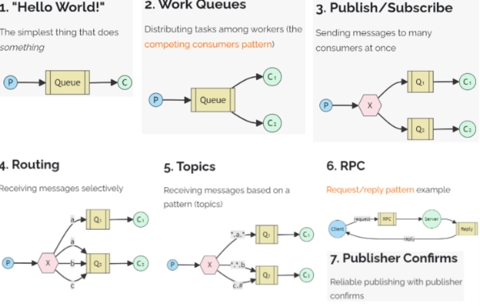

# Rabbit mq

### 基础知识

#### 1. rmq的工作模式⭐⭐

RabbitMQ提供了**多种工作模式**：简单模式，work模式 ，Publish/Subscribe发布与订阅模式，Routing路由模式，Topics主题模式等

<p align='center'>
    
</p>

##### 1. 简单模式：
使用默认的 direct exchange（空字符串 ""），消息直接通过 `routingKey = queueName` 投递到指定队列。

```java
@Autowired  
private RabbitTemplate rabbitTemplate;  
// 生产者 
@Test  
public void testSend(){  
    rabbitTemplate.convertAndSend("","queue_simple","hello world");  
}

// 消费者
@RabbitListener(queues = {"queue_simple"})  
public void testSimpleConsumer(String msg){  
    System.out.println("消费者收到消息：" + msg);  
}
```

##### 2. work 模式
工作（work）模式：一个生产者，一个队列，多个消费者，一个消息只能被一个消费者消费，消费者存在竞争关系，

```java
// 生产者
@Test  
public void testWorkerSend(){  
    rabbitTemplate.convertAndSend("","queue_worker1","hello world1");  
    rabbitTemplate.convertAndSend("","queue_worker1","hello world2");  
}
// 消费者1
@RabbitListener(queues = {"queue_worker1"})  
public void testWorkerConsumer1(String msg){  
    System.out.println("消费者1收到消息：" + msg);  
}  
// 消费者2
@RabbitListener(queues = {"queue_worker1"})  
public void testWorkerConsumer2(String msg){  
    System.out.println("消费者2收到消息：" + msg);  
}

```


##### 3. 发布订阅（广播）模式
一个生产者，多个消费者，并且有多个队列，路由器会把消息发送给所有队列。也就是一个生产者生产的数据供所有消费者使用

注：记得传构建一个广播路由以及两个队列，然后把该路由和这两个队列绑定起来，路由键设置为 "" 即可。

```java
// p
@Test  
public void testPublishAndSubscribeSend(){  
    rabbitTemplate.convertAndSend("exchange_ps","","hello world");  
}
// c1
@RabbitListener(queues = {"queue_ps1"})  
public void testPsConsumer1(String msg){  
    System.out.println("消费者1收到消息：" + msg);  
}  
// c2
@RabbitListener(queues = {"queue_ps2"})  
public void testPsConsumer2(String msg){  
    System.out.println("消费者2收到消息：" + msg);  
}
```

##### 4. 路由模式

<p align='center'>
    
</p>

使用 direct 交换机，根据精确匹配的 routing key 进行路由。

实际上就是不同消息队列订阅的路由键不同，因此根据生产者投递时传入的路由键不同，投递到的消息队列也就不同。

##### 5. topic 模式

使用 **topic 交换机**，支持 **通配符匹配 routing key**。
- `*`：匹配一个单词（如 `user.*` 匹配 `user.login`，但不匹配 `user.auth.login`）
  - `#`：匹配零个或多个单词（如 `log.#` 匹配 `log.info`、`log.error.db`）


#### 2. `rmq`的作用与使用方法 ⭐⭐⭐

1）服务解耦：还是用户注册场景下，没有 RMQ 的时候，注册成功后还需再注册代码调用短信和邮件通知服务，而有了 RMQ，只需要发送消息到 RMQ 即可，不需要调用其他服务。

2）异步调用：用户注册下，当用户注册成功，我们要发送邮件和短信通知，如果没有 rmq，用户注册成功后，还得等待系统完成邮件和短信服务才能看到响应，当但有了 RMQ 以后，就可以实现一旦注册成功，只需要将消息发送给消息队列，然后直接就可以响应用户，而邮件和短信通知都是异步进行的，这极大提高了响应速度。

3）流量削峰：秒杀活动下，数据库每秒只能处理 2000 个请求，但秒杀瞬间可能有 10 万个请求涌入。直接压到数据库，系统直接崩掉。

4）消息通信：利用 MQ 的发布/订阅模式（Pub/Sub）实现点对点或广播式通信。

``` java
spring:
  rabbitmq:
    ...
    virtual-host: /
    listener:
      simple:
        acknowledge-mode: manual
        prefetch: 1000  # 设置每次最多从消息队列服务器取回多少消息
```

rmq的用法：

1. 导入依赖
2. 可选：去设置 rabbitmqTemplate 的回退与确认回调，实现重发等等
3. 去通过 rabbitmqTemplate 发送消息
4. 通过 @RabbitListener 去声明消费者

#### 3. 交换机的类型⭐

| 类型        | 特点                     | 匹配规则                           |
| ----------- | ------------------------ | ---------------------------------- |
| **Direct**  | 精确匹配                 | `routingKey == bindingKey`         |
| **Fanout**  | 广播                     | 忽略 routing key，发给所有绑定队列 |
| **Topic**   | 模糊匹配                 | 支持 `*` 和 `#` 通配符             |
| **Headers** | 基于消息头（Header）匹配 | 不常用，性能较差                   |


#### 4. 什么是幂等性⭐⭐⭐
统一操作执行多次与一次的效果相同。在rmq中，消费者可能因网络、崩溃等原因**重复收到并消费同一条消息**。如果业务逻辑不具备幂等性，可能会导致：重复扣款，重复发券，数据重复插入等等。
而消费多条消息与消费一条消息的效果相同就叫做幂等性。


#### 5. 如何保证幂等性

数据库唯一索引
redis：setnx
#### 6. RMQ 在java中如何使用？

1、直接监听已存在的队列

```java
@Component
public class SimpleConsumer {

    // queues 参数指定要监听的队列名
    @RabbitListener(queues = "existing.queue")
    public void receiveMessage(String message) {
        System.out.println("收到消息: " + message);
    }
}
```

2、通过注解动态创建（推荐）

```java
@Component
public class DynamicConsumer {

    @RabbitListener(bindings = @QueueBinding(
            value = @Queue(value = "order.queue", durable = "true"), // 创建持久化队列
            exchange = @Exchange(value = "order.exchange", type = "topic"), // 创建Topic交换机
            key = "order.#" // 绑定路由键
    ))
    public void processOrder(String orderData) {
        System.out.println("处理订单消息: " + orderData);
    }
}
```

3、手动创建队列 + 交换机 + 它们的绑定

``` java
@Configuration
public class RabbitConfig {

    // 1. 定义队列
    @Bean
    public Queue myQueue() {
        return new Queue("manual.queue", true);
    }

    // 2. 定义交换机
    @Bean
    public DirectExchange myExchange() {
        return new DirectExchange("manual.exchange");
    }

    // 3. 定义绑定关系
    @Bean
    public Binding binding(Queue myQueue, DirectExchange myExchange) {
        return BindingBuilder.bind(myQueue).to(myExchange).with("manual.key");
    }
}
```

### 进阶知识
#### 1. 为什么消息投递可能不成功？⭐️

首先，我们要从三个角度来分析为什么消息投递可能出现问题。

首先是生产者在投递消息时可能无法传到路由器，或者传到了路由器，但是路由器无法将消息路由到消息队列中。

其次就是消息中间件可能出现异常，导致消息丢失。

最后，即使消息成功到了消息队列中，服务器也不会故障，但是还有可能因为消费者无法正常消费，然后消费者默认的确认模式还是自动确认，就也是一拿到消息就确认了，然后 rmq 就会把这条消息从消息队列删除，从而导致这次消息没有成功投递。

#### 2. 如何保证消息投递的可靠性呢？

（1）在生产者端开启确认机制和回退机制，然后设置 rabbitmqTemplate 的确认和回调函数，具体思路就是将要投递的信息另存为相关数据，然后存到redis里面，之后如果出发了确认回调（ack为false)，或者回退回调，就拿到本次消息的相关数据的id，然后去redis里面取出来信息，然后再去重发。

（2）在消息中间件开启持久化：rmq默认开启

（3）消费者需要手动确认，而不是一拿到消息就确认，而是当业务正常完成才会去向中间件发送确认 ack，然后中间件才去删除这个消息。


#### 3. 延迟消息如何实现

（1）设置队列的消息ttl + 死信队列
（2）官方插件的延迟交换机（在特定 xxx 时间后才会将消息路由到消息队列中）


#### 4. 什么是死信队列

用来存放死信消息的消息队列，和普通消息队列没什么区别。

#### 5. 消息怎么才会成为死信

- 拒绝：消费者拒接消息，basicNack()/basicReject()，并且不把消息重新放入原目标队列，requeue=false
  
- 溢出：队列中消息数量到达限制。比如队列最大只能存储10条消息，且现在已经存储了10条，此时如果再发送一条消息进来，根据先进先出原则，队列中最早的消息会变成死信
  
- 超时：消息到达超时时间未被消费

#### 6. 在生产者发送数据时，如果是自定义的对象，记得要实现序列化接口


#### 7. 什么场景下 RMQ 消息会乱序呢？

RabbitMQ 能保证消息在单个 Queue 中是先进先出（FIFO）的。导致乱序的通常是以下两种情况：

- **多消费者并行**：一个 Queue 绑定了多个 Consumer，Consumer A 处理消息 1 比较慢，Consumer B 处理消息 2 比较快，导致消息 2 先入库。
- **异常重试**：消息 1 处理失败触发 `nack` 并重回队列（requeue），此时消息 2 已经处理完，消息 1 变成了在消息 2 之后执行。
#### 8. RMQ 如何保证消息的顺序性呢？⭐️

##### **方案 A：单队列 + 单消费者（单线程）（最简单，但性能差）**

- **做法**：一个 Queue 只允许一个 Consumer 实例监听，且 Consumer 内部不开启多线程处理。  
- **适用**：吞吐量要求不高，但顺序性极强的场景。
- **缺点**：无法发挥分布式优势，消费速度受限于单台机器。
单消费者但是多线程，还是会导致消息顺序错误！

<p align='center'>
    
</p>

##### 方案 B：拆分多个队列 + 一致性 Hash（最主流）

**核心思想**：将需要保证顺序的消息（比如同一个订单的创建、支付、发货），通过 **Hash 路由**发送到同一个队列中。

- 创建多个 Queue（如 `queue_1`, `queue_2`, ...）。
- 生产者发送消息时，根据 `business_id`（如订单 ID）进行取模或 Hash，确保**同一业务 ID 的消息进入同一个 Queue**。
- 每个 Queue 只对应一个唯一的 Consumer 实例。


#### 9. 如何使用RabbitMQ解决分布式事务⭐️

在分布式系统中，保证两个服务（比如订单服务和库存服务）的数据一致性，最经典且最常用的方案就是 **基于 MQ 的可靠消息最终一致性方案**。

在 RabbitMQ 中，我们通常通过 **“本地事务表 + 确认机制”** 来实现。

- **在发送端**：利用**本地事务表**。将业务操作和‘发消息’任务放在一个数据库事务里。通过后台任务配合 RabbitMQ 的 **Confirm 机制**，确保消息一定能到达交换机。
  
- **在消费端**：开启**手动确认（Manual ACK）**。只有当下游业务处理成功后才告知 MQ 删除消息。同时，为了防止重复消费，必须配合**幂等性检查**（如数据库唯一索引或 Redis 状态位）。

#### 10. 如何解决消息队列的延时以及过期失效问题呢？⭐️
1）延时问题
**根因**：通常是消费端出了问题（宕机、逻辑卡死、处理太慢）。


2）过期失效问题
RabbitMQ 可以设置消息的过期时间（TTL）。如果消息在队列里积压超过 TTL 还没被消费，会被 **丢弃**。

解决方法：配置死信队列，然后将这些超过 TTL 的消息持久化到数据库，之后重新发送到 MQ

#### 11. 消息队列满了之后改如何处理呢？

当队列达到 `max-length`（最大长度）且内存/磁盘水位过高时，MQ 会触发**流量控制（Flow Control）**，此时生产者会被挂起（卡住）。

- **临时丢弃并记录**：如果业务允许，可以临时开启消费端，直接读取消息但不做任何业务处理（直接 ACK），同时将消息内容记录到日志中，等高峰期过后通过日志进行人工补偿。
  
- **死信队列**：确保配置了死信队列（DLX）。如果队列满了，让消息溢出到死信队列，防止主队列直接崩溃。

#### 12. 有几百万条的消息持续积压，分析该如何解决？⭐️


1）通常，消失挤压到这种程度往往说明消费者出现了问题，我们要先去找到消费者的问题并解决！

2）临时紧急扩容（核心考点）：创建10个临时队列，然后写一个分流程序，它只负责从原有的积压队列里取消息，然后不做任何业务逻辑，**直接转发**到刚才建的那 10 个临时队列里。然后让10个消费者并行的去消费，这样就能保证原来10天才能消费完这些积压得消息，现在只需要1天即可。

3）当积压消化完后，我们停止中转程序，然后把增加得服务器删除掉，恢复原来的消费模式即可。