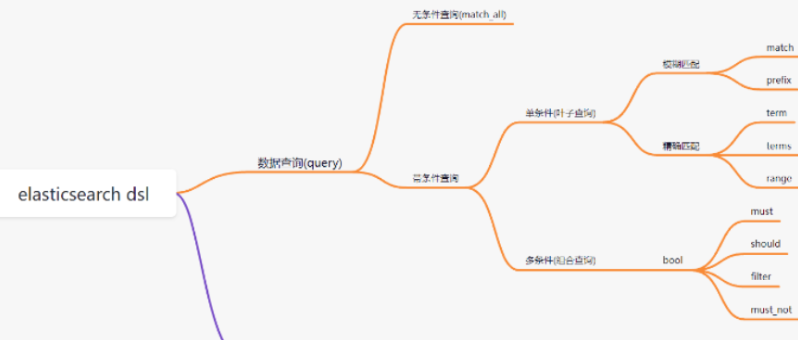
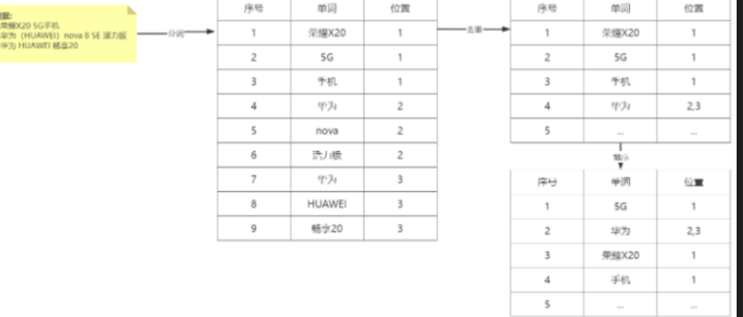

# Elasticsearch 

### 什么是 ES

Elasticsearch是一个基于Lucene的搜索引擎。它是一个天然分布式，多租户能力的全文搜索引擎。Elasticsearch是用Java开发的，根据Apache许 可条款作为开源发布。

### 为什么要使用 ES⭐️

“之所以引入 ES，主要是为了解决**关系型数据库在海量数据下的搜索性能瓶颈**

“MySQL 在做模糊查询或者查询后得到的结果数据量太大时（如 `LIKE %keyword%`）会全表扫描，索引直接失效。而 ES 使用**倒排索引**，无论数据量是千万级还是亿级，都能在毫秒级锁定关键词，并且 ES 能够根据词频（TF/IDF 或 BM25 算法）给搜索结果打分，让最匹配的结果排在前面，而数据库只能简单地判断“有没有”。

其次，“MySQL 的分库分表非常复杂。而 ES 天生分布式，支持**分片和副本**机制。增加机器就能自动负载均衡，且即便某个节点挂了，副本分片也能自动升为主分片，高靠性很高。”

“在亿级数据下做 `GROUP BY` 或 `SUM` 统计，MySQL 基本就卡死了。ES 采用**列式存储（Doc Values）**，非常适合做多维度的实时报表分析。”


### ES 基础操作有哪些呢?

ES 是 RESTful 风格的，它的操作本质就是对 **Index（索引）** 和 **Document（文档）** 进行 HTTP 动作。

| **动作**            | **HTTP 方法** | **ES 对象**         | **对应 SQL**      |
| ------------------- | ------------- | ------------------- | ----------------- |
| **创建/全量替换**   | `PUT`         | `/index/_doc/id`    | `INSERT / UPDATE` |
| **创建（自动 ID）** | `POST`        | `/index/_doc`       | `INSERT`          |
| **查询**            | `GET`         | `/index/_doc/id`    | `SELECT`          |
| **局部更新**        | `POST`        | `/index/_update/id` | `UPDATE ... SET`  |
| **删除**            | `DELETE`      | `/index/_doc/id`    | `DELETE`          |

**`PUT` 与 `POST` 的区别**：`PUT` 通常用于指定 ID 的创建，且具有**幂等性**（多次执行结果一样）；`POST` 通常用于不指定 ID 的创建或局部更新。


- 可以更新整个资源。
- 客户端需要发送完整的资源内容。
- 如果服务器上不存在该资源，则会创建一个新的资源。
- PUT 请求具有幂等性，即执行多次 PUT 请求的结果应该相同。

#### ES的DSL是什么?举个例子?

**DSL (Domain Specific Language)** 是 ES 特有的“领域特定语言”。

简单说：**它就是一套基于 JSON 格式的查询语法。** 因为 ES 功能太强（全文检索、聚合计算、地理位置查询），简单的 URL 参数根本塞不下这么多逻辑，所以得用 JSON 这种结构化的方式告诉 ES 你想要什么。

<p align='center'>
    
</p>

```
GET /orders/_search
{
  "query": {               // 1. 查询根节点
    "bool": {              // 2. 布尔组合查询
      "must": [            // 3. 必须满足（计算相关性得分）
        { "match": { "product_name": "手机" } }
      ],
      "filter": [          // 4. 过滤器（不计算得分，有缓存，性能高）
        { "range": { "price": { "gt": 5000 } } }
      ]
    }
  },
  "sort": [                // 5. 排序
    { "price": { "order": "desc" } }
  ],
  "from": 0,               // 6. 分页偏移量
  "size": 10               // 7. 每页数量
}
```

### match 和 term 的区别?⭐️


- **`match`**：模糊匹配。它会先对搜索词进行**分词**（比如把“小米手机”拆成“小米”和“手机”），然后再去匹配。
- **`term`**：精确匹配。它不会分词，直接去倒排索引里找完全一样的词，通常用于查 ID、状态、分类等。
- `terms`：也是精确匹配, 但它就像是 mysql 中的 in, 会精确匹配多个词!


### match 和 prefix 的区别⭐️

`match`：全文检索（最常用）`match` 是 ES 中处理文本的核心武器。它的关键动作是分词

- **工作逻辑**：当你搜索“华为手机”时，ES 会先用分词器把它拆成“华为”和“手机”，然后在倒排索引中去匹配这两个词。    
- **相关性算分**：它会计算文档的相关性得分（`_score`），比如包含两个词的文档比只包含一个词的得分高。
- **使用场景**：搜索文章内容、商品名称等需要理解用户意图的场景。


`prefix` 比较死板，它不分词，主要看**开头**。

- **工作逻辑**：它是直接去倒排索引中查找以指定字符**开头**的词条（Term）。比如你搜 `pre: "apple"`，它能匹配到 "apple"、"applegate"、"applesauce"。
- **性能开销**：由于 ES 需要扫描大量以该字符开头的词条，如果前缀很短（比如只搜一个字母 `a`），性能会非常差。
- **使用场景**：**搜索框自动补全（Autocomplete）**、搜索型号编码（如 `SN-2026...`）。

### filter 和 must 区别?⭐️

**must** 是“全文检索”逻辑，不仅要匹配还要计算相关性得分来**决定排名**，性能消耗大；而 **filter** 是“硬性过滤”逻辑，只判断是/否而不计算分数，且自带**缓存**机制，性能极快。

在实际业务中，我们通常把**用户输入的关键词**放进 `must`，把**业务逻辑的硬性限制**放进 `filter`。

```
{
  "query": {
    "bool": {
      "must": [
        { "match": { "title": "手机" } } // 关键词匹配，决定了哪个手机最“手机”，排在前面
      ],
      "filter": [
        { "range": { "price": { "gte": 2000, "lte": 5000 } } }, // 价格区间，硬指标，不影响排序
        { "term": { "stock": "in_stock" } } // 是否有货，硬指标，不影响排序
      ]
    }
  }
}
```


### 简单介绍介绍多条件查询 bool ⭐️⭐️⭐️

在 Elasticsearch 的 DSL 查询中，`bool` 查询是构建复杂逻辑的核心节点。它类似于 SQL 中的 `AND`、`OR` 和 `NOT` 的组合。

`bool` 查询就是把各种**单条件查询**（如 `match`, `term`, `range`）按照逻辑关系拼装起来的“框架”。 它定义了搜索的精准度（`must`）和性能优化的空间（`filter`）。

- **`must` (相当于 AND)**
  
    - **要求**：文档必须匹配其中的所有条件。
    - **算分**：会计算相关性得分（`_score`），匹配程度越高，分数越高，排名越靠前。
    
- **`should` (相当于 OR)**
  
    - **要求**：文档可以匹配其中的条件。如果 `bool` 查询中没有 `must` 或 `filter`，则至少要匹配一个 `should` 条件。
    - **算分**：会计算得分，匹配的条件越多，得分越高。
    
- **`filter` (必须匹配，但不算分)**
  
    - **要求**：文档必须匹配。
    - **算分**：**不计算得分**。
    - **性能**：ES 会对 `filter` 的结果进行**缓存**，因此执行速度极快。通常用于价格范围、日期范围、状态码等“是/否”类的硬性过滤。
    
- **`must_not` (相当于 NOT)**
  
    - **要求**：文档必须不满足其中的所有条件。
    - **算分**：不计算得分。


``` 
{
  "query": {
    "bool": {
      "must": [
        { "match": { "title": "Java" } }
      ],
      "filter": [
        { "term": { "status": "published" } },
        { "range": { "price": { "lte": 100 } } }
      ],
      "must_not": [
        { "term": { "category": "trash" } }
      ],
      "should": [
        { "match": { "description": "Spring Boot" } }
      ],
      "minimum_should_match": 1
    }
  }
}
```
### 什么是列式存储 (ES Doc Values)⭐️

数据在磁盘上是按列排布的：
- 时间列：[2023-01-01, 2023-01-01, ...]
- 城市列：[北京, 上海, ...]
- **金额列：[100, 200, ...]**

“**行式存储**（如 MySQL）是按行存放数据的。在做 `SUM` 或 `GROUP BY` 时，即使只用到一个字段，也要读取整行数据，导致大量无效的 IO 消耗。

而 ES 的 **Doc Values（列式存储）** 将同一字段的数据连续存放在一起。在统计时，ES 能够实现**按需读取**，只加载参与计算的列，极大减少了磁盘 IO。

此外，列式存储天然适合**压缩**，并且利用 **OS Cache** 实现了近乎内存级别的计算速度。这就是为什么 ES 在处理亿级数据的实时报表分析时，性能远超传统数据库的原因。”

### 为什么 ES 做聚合统计比较快?

***极高的 IO 效率**：只读需要的字段。如果你在亿级数据里只统计“金额”，ES 只需要读取那几亿个数字，而不用加载几亿个完整的文档对象。

**更好的压缩率**：同一列的数据类型通常是一样的（比如全是数字）。相同类型的数据放在一起，压缩效果极好，大大节省了磁盘空间。  

**直接映射内存**：ES 的 `Doc Values` 实际上是保存在磁盘上的，但它利用操作系统的 **文件系统缓存（OS Cache）** 映射到内存中。这使得聚合计算几乎就像在内存中操作一样快。


### ES 怎么解决中文分词⭐️

Elasticsearch（ES）自带的默认分词器（Standard Analyzer）在处理中文时非常“笨”：它会把中文**拆分成单个汉字**。

IK 分词器是目前社区最流行的开源 ES 中文分词插件。它提供了两种最常用的分词模式：
**`ik_smart`（最少切分）**：逻辑最智能，切分得比较粗，占用空间小。

**`ik_max_word`（最细切分）**：把文本穷尽各种组合进行拆解，覆盖面广，增加搜索命中率。

### ES 有什么缺点呢？⭐️ ⭐️

**非强一致性**：它是**近实时（NRT）**的，数据写入后默认有 1 秒延迟才能搜到。

**维护成本**：引入了数据同步逻辑，需要处理 MySQL 和 ES 之间的**数据一致性**问题。”

### 什么是倒排索引⭐️
倒排索引是 ES 的核心，也是 ES 搜索快的根本原因。**正排索引**：文档 ID $\rightarrow$ 内容（类似书的目录）。而倒排索引就是由内容索引到包含该内容的文档 ID 列表

| **关键词 (Term)** | **倒排列表 (Posting List)**                                  |
| ----------------- | ------------------------------------------------------------ |
| **Java**          | {docId: 1, freq: 2, pos: [0, 5]}, {docId: 3, freq: 1, pos: [10]} |
| **Python**        | {docId: 2, freq: 1, pos: [3]}, {docId: 3, freq: 1, pos: [12]} |
| **AI**            | {docId: 1, freq: 1, pos: [8]}, {docId: 2, freq: 2, pos: [1, 5]} |

<p align='center'>
    
</p>

### ES 是如何实现分布式存储的呢？⭐️⭐️⭐️

“ES 实现分布式存储主要靠 **分片和副本** 机制。
**分片（Shard）** 是为了解决单机瓶颈，它把一个大索引拆成多个小部分分布在不同机器上，实现水平扩容。主分片数在创建时确定，不可更改。

**副本（Replica）** 是主分片的备份。它有两个作用：一是**高可用**，主分片挂了副本顶上；二是**负载均衡**，副本可以分担读请求。

##### 分片（Shard）：解决“存不下”的问题

分片是 ES 存储数据的最小单元。一个索引（Index）会被水平拆分成多个分片。例如：当前有10万个文档，如果只有一个分片，那么这10万个文档都会在这台服务器中，单台服务器的磁盘和内存就爆了。但是我们可以拆为5个分片，分别存在5台机器上。

**主分片（Primary Shard）**的数量在创建索引时就得定好，**后期不能改**。因为数据的路由规则是 $hash(id) \pmod{主分片数}$，改了分片数，以前存的数据就找不到了。

##### 副本（Replica）：解决“怕丢失”的问题

副本就是主分片的“克隆体”。目的是为了提高 ES 的可靠性以及读性能
1）主分片挂了，ES 会立即把一个副本分片提升为新的主分片，系统照样跑。
2）查询请求可以在主分片查，也可以在副本分片查。副本越多，并发查询的能力越强。

副本数是可以**随时动态修改**的。
**同一份数据的主分片和副本分片绝对不会放在同一台机器上**（否则物理机一炸，主副全丢，备份就没意义了）。

### ES 的写入流程⭐️⭐️⭐️

ES 的写入可以分为 **“集群层路由”** 和 **“分片层持久化”**。

##### 集群层：确定位置

- **客户端**向集群中的某个**协调节点（Coordinating Node）**发送写入请求。
- **路由**：协调节点根据文档 ID 计算它属于哪个主分片：`shard = hash(id) % number_of_primary_shards`。
- **转发**：协调节点将请求转发到该**主分片（Primary Shard）**所在的节点。
- **同步**：主分片写入成功后，将请求并行转发给所有**副本分片（Replica Shard）**。
- **响应**：当副本分片全部写入成功后，主分片向协调节点反馈，协调节点返回“成功”给客户端。

##### 分片层：底层存储（近实时的奥秘）
数据进入分片后，经历三个阶段：

- **Write Buffer**：数据先写进内存缓存区（Index Buffer），同时记入事务日志（Translog）防止宕机。
- **Refresh（默认 1 秒）**：缓冲区的数据每秒生成一个新的 **Segment（段）** 并写入操作系统缓存。此时**数据即可被搜索到**（这就是近实时的原因）。
- **Flush（默认 30 分钟）**：将内存中的所有 Segment 真正落盘，并清空 Translog。

### ES 的查询流程⭐️⭐️⭐️

ES 的查询分为两个阶段：**Query（查询阶段）** 和 **Fetch（取回阶段）**。

##### Query 阶段：找出“哪些数据”符合条件

- 协调节点接收到搜索请求，将请求广播到索引的**每一个分片**（主分片或副本选其一）。
- 每个分片在本地执行查询，根据相关性算分，排好序。
- 每个分片只返回一个**轻量级的列表**（包含文档 ID 和分数）给协调节点。

##### Fetch 阶段：拿出“真正的数据”

- **全局排序**：协调节点收集所有分片返回的结果，进行全局排序，取出前 N 条（比如 `from=0, size=10`）。
- **拉取详情**：协调节点根据这 10 个 ID，去对应分片请求**完整的文档内容（_source 字段）**。
- **最终返回**：协调节点将数据组装好，返回给客户端。

### 为什么搜索是两阶段，写入不是？

写入时 ID 已知，可以精准定位分片；搜索时不知道哪些文档符合条件，必须“撒网式”去所有分片问一遍，然后再汇总。

### 深分页（Deep Paging）问题出在哪一阶段？⭐️⭐️

出在 **Query 阶段**。如果你查第 10000 页的 10 条数据，协调节点需要从每个分片各拿 10010 条 ID 过来，在内存里进行几十万条数据的全局排序。分片越多，内存压力越大，极易 OOM。

### 什么是深分页？

在 ES 中，**深分页**指的是请求 **“页码非常靠后”** 的查询操作。 比如一个索引有 1 亿条数据，你查询 `from=100000, size=10`（即跳过前 10 万条，取第 100001 到 100010 条）。最终只要 10 条数据，但为了保证这 10 条是全局范围内最匹配的，ES 的底层逻辑会变得非常沉重。


### 那怎么解决深度分页问题呢？⭐️

1、`search_after`（官方推荐：C端分页首选）

不使用 `from` 参数，而是通过上一页最后一条数据的**唯一排序值（Sort Values）**来定位下一页的起点。

**发送请求**： 你告诉协调节点：“我要查 10 条数据，但是**请从坐标 `[1642934400, "order_888"]` 之后开始找**。”

**分片本地自查（重点改变在这里！）**：

- **分片 A** 收到指令，它不再去数“前 1010 条”。它直接利用索引定位到 `timestamp = 1642934400` 的位置。
- 它只拿在这个坐标之后的**前 10 条**。
- **分片 B**、**分片 C** 同理，每个分片都只找坐标后的 **10 条**。

### “为什么 `search_after` 排序字段必须包含一个唯一字段（比如 ID）？”

“因为如果排序字段（比如时间戳）不唯一，有很多条数据的时间戳都是一样的，那么这个‘坐标’就会变得模糊。ES 就不知道该从哪条数据后面开始取，可能会导致**分页数据丢失或重复**。加上 `_id` 这种唯一字段，就能保证坐标是全集群唯一的，定位才精准。”