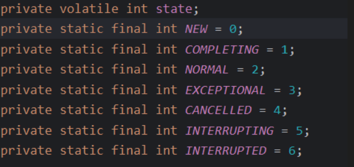
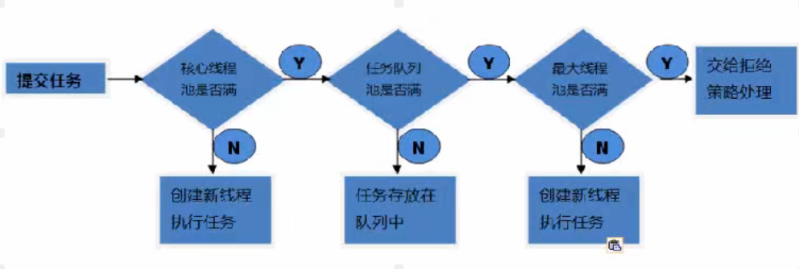
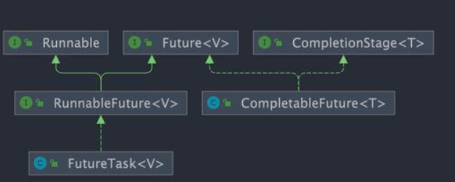

# JUC 

## 基础知识
#### 1. java 线程和操作系统线程有啥区别

JDK 1.2 之前，Java 线程是基于绿色线程（Green Threads）实现的，这是一种用户级线程（用户线程），也就是说 JVM 自己模拟了多线程的运行，而不依赖于操作系统。绿色线程和原生线程比起来在使用时有一些限制（比如绿色线程不能直接使用操作系统提供的功能如异步 I/O、只能在一个内核线程上运行无法利用多核）

- 优点：线程的切换不涉及用户态 -> 内核态的切换，创建于切换成本低！
- 不能利用多核，不能直接使用操作系统内核的一些功能：如异步 I/o

**现在的 Java 线程（JDK 1.2 至今）本质上就是操作系统的原生线程（Native Threads）。** Java 采用的是 **1:1 线程模型**，即：每一个 Java 线程（`Thread` 实例）都会对应一个操作系统的内核线程（Kernel Thread）。线程的创建、销毁、调度和切换全部交由操作系统内核负责。

- **优点**：真正支持多核并行，I/O 阻塞不会拖累整个进程。
- **代价**：上下文切换涉及到内核态与用户态的转换，开销较大。并且每个java线程都对因一个内核线程，比较重。

顺便简单总结一下用户线程和内核线程的区别和特点：用户线程创建和切换成本低，但不可以利用多核。内核态线程，创建和切换成本高，可以利用多核。

#### 2. 请简要描述线程与进程的关系,区别及优缺点

- **进程**：操作系统分配资源（内存、IO）的**最小单位**。进程间相互独立，但如果直接对进程进行上下文切换，则开销是比较大的，因此，为了提高操作系统的并发能力，又引入了线程！
- **线程**：是操作系统调度和执行的**最小单位**。同一进程内的线程共享进程的一些资源（进程的堆区、方法区），执行开销小，但相互影响（一个线程崩溃可能导致进程挂掉）。

##### 2.1 为什么程序计数器要私有

因为在多线程环境下，CPU 会不断切换线程。私有计数器是为了**记录当前线程执行到哪一行了**，确
保线程被挂起又恢复执行时，能从上次中断的地方继续运行。

##### 2.2 堆和方法区为什么是共享的？

- **堆共享**：是为了**节省空间和数据传递**。对象通常占用内存较大，共享堆区可以让多个线程访问同一个对象，减少内存开销。
- **方法区共享**：是为了**类信息复用**。所有线程执行的都是同一套类逻辑，没必要在每个线程都存一份类结构、常量池和静态变量。
##### 2.3 堆区和方法区

堆和方法区是所有线程共享的资源，其中堆是进程中最大的一块内存，主要用于存放新创建的对象 (几乎所有对象都在这里分配内存)，方法区主要用于存放已被加载的类信息、常量、静态变量、即时编译器编译后的代码等数据


#### 2. 什么是上下文切换？

上下文切换是指 **CPU 从一个线程切换到另一个线程执行的过程**。

而上下文就是一个线程运行的一些条件和状态，比如程序计数器，寄存器，栈信息等等。

- **程序计数器 (PC)**：记录代码执行到哪一行了。
- **寄存器**：存储 CPU 正在计算的中间值。
- **栈信息**：方法的调用层次、局部变量等。

在 cpu 时间片被用完 、调用一些方法主动让出 cpu（sleep(),wait())，被其他线程强制抢走 cpu，阻塞等待，线程执行完毕。


#### 3. 为什么 wait() 方法不定义在 Thread 中？

`wait()` 是让获得对象锁的线程实现等待，会自动释放当前线程占有的对象锁。每个对象（`Object`）都拥有对象锁，既然要释放当前线程占有的对象锁并让其进入 WAITING 状态，自然是要操作对应的对象（`Object`）而非当前的线程（`Thread`）。

类似的问题：**为什么 `sleep()` 方法定义在 `Thread` 中？**
因为 `sleep()` 是让当前线程暂停执行，不涉及到对象类，也不需要获得对象锁

#### 3. 可以直接调用 Thread 类的 run 方法吗？

**可以调用，但它不是多线程。** 直接调用 `run()` 只是一个线程对象的一个**普通方法调用**，而调用 `start()` 才是真正的**启动线  程**。

### 并发容器

 CopyOnWriteArrayList、CopyOnWriteArraySet、ConcurrentHashMap

1. CopyOnWriteArrayList、CopyOnWriteArraySet采用写时复制实现线程安全
2. ConcurrentHashMap采用分段锁 | （CAS + Sychronized + Node)的方式实现线程安全
## JUC 辅助类

#### 1. CountDownLatch 的计数器能重置吗？
**不能**。一旦计数器减到 0，它就失效了。如果需要循环使用计数器，应该使用 **`CyclicBarrier`**。

#### 2. 如果某个子线程执行过程中抛出异常，会导致主线程死等吗？

看情况。如果子线程报错没能调用 `countDown()`，计数器永远不会归零。所以主线程也永远不会被唤醒

我们可以通过 try-catch-finally 或者在主线程使用 await() 阻塞自己时，设置一个最大超时时间来避免无限等待。

#### 3. CountDownLatch 是基于什么实现的呢？

它是基于 AQS 的 共享锁 实现的。初始化时的 count 值就是 AQS 内部的 `state`。`await` 时线程进入等待队列，`countDown` 时通过 CAS 减少 `state`，当 `state` 为 0 时唤醒队列中的所有线程。

#### 4. CountDownLatch 和 Join 的区别？

`join` 是等“线程”，必须等线程运行结束、死掉了才算完；`CountDownLatch` 是等“计数器为0”，只要任务做完了（计数器归零），不管线程死没死，主线程都能接着干。

“所以在实际开发中，`CountDownLatch` 配合**线程池**非常方便（因为线程池里的线程是不死的），而 `join` 很难跟线程池配合。”

## Callable 接口

#### 1. `futureTask.get()` 放在哪执行？

通常放在最后。因为 `get()` 是**阻塞**的，如果计算没完成，主线程会卡在那里等。

#### 2. 多个线程启动同一个 `FutureTask` 对象，任务会执行几次？

**只会执行一次**。`FutureTask` 内部有个状态位，一旦任务执行完成或正在执行，后续的调用会直接拿结果。

<p align='center'>
    
</p>

``` java
public V get() throws InterruptedException, ExecutionException {  
    int s = state;  
    if (s <= COMPLETING)  
        s = awaitDone(false, 0L);  
    return report(s);  
}
```

#### 3. 如何实现异步不阻塞？

可以通过 `isDone()` 轮询检查，或者干脆直接学习 JDK 8 的 **`CompletableFuture`**。

“实现异步不阻塞，关键在于把‘主动索取结果’改为‘被动接收回调’。`CompletableFuture` 通过异步编排，将多个任务串成流水线。主线程只负责开启这条流水线，任务执行完会自动触发后续操作，从而彻底解放主线程，避免了阻塞死等。”

## Volatile 关键字⭐️

#### 1. Volatile 如何实现变量的可见性？（原理）⭐️

在 Java 中，如果我们将变量声明为 **`volatile`** ，这就指示 JVM，这个变量是共享且不稳定的，每次使用它都到主内存中进行读取。并且在线程的工作内存修改后，应该立即更新到主内存，而非写入缓存。

#### 2. 线程本地内存的理解

其实就是 cache 或者寄存器。

#### 3. 如何禁止指令重排序⭐️

**在 Java 中，`volatile` 关键字除了可以保证变量的可见性，还有一个重要的作用就是防止 JVM | os 的指令重排序。** 如果我们将变量声明为 **`volatile`** ，在对这个变量进行读写操作的时候，会通过插入特定的 **内存屏障** 的方式来禁止指令重排序。

#### 4. 双重检验锁方式实现案例模式⭐️

“`synchronized` 虽然保证了原子性，但无法禁止指令重排。在 DCL 中，`new` 对象并非原子操作，重排可能导致‘引用先指向地址，对象后初始化’。此时如果另一个线程在锁外进行 `null` 检查，会误判对象已就绪，从而拿到一个未初始化的半成品。加 `volatile` 就是为了通过内存屏s障禁止这种重排，确保安全。”

``` java
public class Singleton {

    private volatile static Singleton uniqueInstance;
s
    private Singleton() {
    }

    public static Singleton getUniqueInstance() {
       //先判断对象是否已经实例过，没有实例化过才进入加锁代码
        if (uniqueInstance == null) {
            //类对象加锁
            synchronized (Singleton.class) {
                if (uniqueInstance == null) {
                    uniqueInstance = new Singleton();
                }
            }
        }
        return uniqueInstance;
    }
}
```

#### 5. 为什么要进行两次双重检验呢？

第一层 `if`：避免对象创建后，每次获取实例都要进行昂贵的加锁操作。

第二层 `if`：**内层检查**是为了**原子性/安全**。防止多个线程同时通过了外层检查，在排队等待锁的过程中产生重复创建对象的行为。


#### 6. Volatile 可以实现原子性吗？

显然不能，Volatile 只是实现了共享变量的可见性，而无法保证原子性，想象：两个线程从主内存中同时拿到了副本，并且都要进行 ++ 操作，此时就会出现：这两个线程的写结果相互覆盖。

## 悲观锁和乐观锁

#### 1. 什么是悲观锁呢？

悲观锁总是悲观的认为：多个线程同时访问共享资源就会出现一些并发问题，所以每次操作共享资源的时候都会上锁，这样其他线程想拿到这个资源就会阻塞直到锁被上一个持有者释放。

像 Java 中`synchronized`和`ReentrantLock`等独占锁就是悲观锁思想的实现。
#### 2. 什么是乐观锁

乐观锁总是假设最好的情况，认为共享资源每次被访问的时候不会出现问题，无需加锁也无需等待，只是在提交修改的时候去验证对应的资源（也就是数据）是否被其它线程修改了（具体方法可以使用版本号机制或 CAS 算法）。


#### 3. 版本号机制

通过一个版本号字段来表示数据被修改的次数，因此，每次线程 A 操作共享数据时，就可以通过版本号来判断是否有其他线程修改了当前共享资源，比较典型的就是 java 集合中 modCount 字段。

#### 4. CAS 算法⭐️

CAS 的全称是 **Compare And Swap（比较与交换）** ，用于实现乐观锁，被广泛应用于各大框架中。CAS 的思想很简单，就是主内存中的值与旧值比较，如果相同，则没被其他线程修改，则可以把新值写入到主内存，否则自旋 + 重试。

如果 `V == A`，说明没有其他线程改过这个值，就把 `V` 修改为 `B`；如果 `V != A`，说明被别人改过了，修改失败，通常会开启**自旋**（不断重试直到成功）。

V：主内存值  A：预期原值 B：准备更新的新值

**底层支撑**：通过 `Unsafe` 类调用 CPU 底层的原子指令。
``` java
public final int getAndAddInt(Object o, long offset, int delta) {  
    int v;  
    do {  
        v = getIntVolatile(o, offset);  
    } while (!weakCompareAndSetInt(o, offset, v, v + delta));  
    return v;  
}
```


CAS 存在的问题： 1）ABA 问题 2）当并发竞争比较大的时候，线程不断地自旋 + 重试，会占用 cpu 资源。3）只能保证一个共享变量的原子操作。


## Synchronized 关键字

#### 1. Synchronized 是什么，有什么用⭐️

`synchronized` 是 Java 中的一个关键字，翻译成中文是同步的意思，主要解决的是多个线程之间访问资源的同步性

它的作用：被它修饰的方法或者代码块在任意时刻只能有一个线程执行。这就实现了原子性和可见性。

#### 2. 演化过程

- **早期（重量级）**：依赖操作系统的 `Mutex Lock`。线程切换需要从 **用户态** 切换到 **内核态**，代价极高，效率低下。
- **优化（Java 6+）**：引入了**锁升级**机制（偏向锁 $\rightarrow$ 轻量级锁 $\rightarrow$ 重量级锁），让锁能根据竞争情况自动“变身”，不再动不动就找操作系统。


#### 3. java 如何优化 Synchronized 锁呢？⭐️

- **自旋锁** | 适应性自旋锁：不挂起线程，让它循环（自旋）等一会儿。
- 锁消除：编译器发现代码不可能存在竞争（比如局部变量），直接把锁去掉。
- 锁粗化：如果一连串操作都在反复对同一个对象加锁解锁，编译器会把锁范围扩大到整个操作，减少开销。
- 轻量级锁：通过 cas + 自旋锁机制。线程在自己的栈帧里开辟一块空间（Lock Record），然后用 **CAS** 尝试把对象头里的 Mark Word 替换成指向自己栈中所记录的指针。
- 偏向锁：如果这把锁一直只有一个线程在用，那就干脆别加锁了，直接把锁‘送’给它。

在 Java 6 之后， `synchronized` 引入了大量的优化如自旋锁、适应性自旋锁、锁消除、锁粗化、偏向锁、轻量级锁等技术来减少锁操作的开销，这些优化让 `synchronized` 锁的效率提升了很多（JDK18 中，偏向锁已经被彻底废弃，前面已经提到过了）。

锁主要存在四种状态，依次是：无锁状态、偏向锁状态、轻量级锁状态、重量级锁状态，他们会随着竞争的激烈而逐渐升级。注意锁可以升级不可降级，这种策略是为了提高获得锁和释放锁的效率。


#### 补充：为什么偏向锁被舍弃了

偏向锁是为了优化单线程场景，但它撤销锁时需要‘停顿所有线程（STW）’，在现代高并发环境下，这种停顿带来的代价远超它节省的开销，所以被官方无情抛弃了。

#### 4. 如何使用 synchronized？

修饰实例方法：所当前对象实例

``` java
synchronized void method() {
    //业务代码
}
```

修饰静态方法：所当前类

```
synchronized static void method() { 
	//业务代码 
}
```

3. 修饰代码块
- `synchronized(object)` 表示进入同步代码块前要获得 **给定对象的锁**。
- `synchronized(类.class)` 表示进入同步代码块前要获得 **给定 Class 的锁**
```
synchronized(this) {
    //业务代码
}
```


#### 5. 构造方法可以用 `synchronized` 修饰吗？

**不可以**。语法上会报错。锁是为了保护“多个线程争抢同一个对象”，而构造方法是“一个线程在创建一个对象”，此时对象还没造好，别人抢不到，所以**没必要锁**。如果构造函数里要改**全局变量**（静态变量），此时需要同步，但建议在构造函数内部写 `synchronized(Lock.class)` 代码块，而不是锁构造函数本身。


#### 6. synchronized 的底层原理⭐️

“`synchronized` 底层是基于监视器锁（Monitor）实现的。代码块通过 `monitorenter/exit` 指令实现，方法通过 `ACC_SYNCHRONIZED` 标志实现。

其本质是：线程尝试获取对象头所关联的 Monitor 对象的持有权。如果获取成功，Monitor 的 `_Count` 加 1；如果失败，线程就会进入阻塞状态，直到锁被释放。”

所以，`wait()`、`notify()` 和 `notifyAll()` 这些方法，本质上是**对 Monitor 内部队列的操作**。因此，只有线程成为了当前 monitor 的主人，才能进行操作，而进入 `synchronized` 代码块就代表着当前线程成为了 monitor 对象的主人。

#### 7. 什么是 monitor

每个 Java 对象出生时，都会带一个“隐形锁”，也就是 Monitor 对象（由 C++ 实现）。它内部的关键字段有：

- **`_Owner`**：当前是谁占着这把锁（存的是线程 ID）。
- **`_Count`**：锁被重入了多少次（为了支持**可重入性**）。
- **`_WaitSet`**：那些调用了 `wait()` 的线程，在这儿休息。
- `_EntryList`：等待获取锁而阻塞的线程队列。

``` cpp
ObjectMonitor() {
    _header       = NULL;
    _count        = 0;     // 记录锁的重入次数
    _waiters      = 0,
    _recursions   = 0;
    _object       = NULL;
    _owner        = NULL;  // 指向持有 ObjectMonitor 对象的线程
    _WaitSet      = NULL;  // 调用 wait() 后等待的线程队列
    _EntryList    = NULL;  // 等待获取锁而阻塞的线程队列
}
```

| **特性**         | **_EntryList (阻塞队列)**          | **_WaitSet (等待队列)**                            |
| ---------------- | ---------------------------------- | -------------------------------------------------- |
| **线程状态**     | **Blocked** (被动阻塞)             | **Waiting / Timed_Waiting** (主动等待)             |
| **触发动作**     | 执行 `synchronized` 抢锁失败。     | 在同步块内，手动调用了 `obj.wait()`。              |
| **如何离开**     | 锁的持有者释放了锁（退出同步块）。 | 另一个线程调用了 `obj.notify()` 或 `notifyAll()`。 |
| **离开后的去向** | 抢到锁则进入诊室，抢不到继续待着。 | **必须先回 `_EntryList`**，重新竞争锁。            |

#### 8. 那锁存在哪里呢？

在对象的 **Mark Word**（对象头的一部分）里。**无锁/偏向锁/轻量级锁/重量级锁** 的状态，都记录在这几位（bits）上。当锁升级到 **重量级锁** 时，Mark Word 就会指向这个 **Monitor** 对象的地址。


#### 9. synchronized 和 volatile 有什么区别？

`synchronized` 关键字和 `volatile` 关键字是两个互补的存在，而不是对立的存在！

- `volatile` 关键字是线程同步的轻量级实现，所以 `volatile`性能肯定比`synchronized`关键字要好 。但是 `volatile` 关键字只能用于变量而 `synchronized` 关键字可以修饰方法以及代码块 。
- `volatile` 关键字能保证数据的可见性，但不能保证数据的原子性。`synchronized` 关键字两者都能保证。
- `volatile`关键字主要用于解决变量在多个线程之间的可见性，而 `synchronized` 关键字解决的是多个线程之间访问资源的同步性。

## ReentrantLock

#### 0. lock 的原理⭐️

1. Lock的存储结构：一个int类型状态值（用于锁的状态变更），一个双向链表（用于存储等待中的线程）
2. Lock获取锁的过程：本质上是通过CAS来获取状态值修改，如果当场没获取到，会将该线程放在线程等待链表中。
3. Lock释放锁的过程：修改状态值，调整等待链表。
4. Lock大量使用CAS+自旋。因此根据CAS特性，lock建议使用在低锁冲突的情况下。

#### 1. ReentantLock 是什么？
`ReentrantLock` 实现了 `Lock` 接口，是一个可重入且独占式的锁，和 `synchronized` 关键字类似。不过，`ReentrantLock` 更灵活、更强大，增加了轮询、超时、中断、公平锁和非公平锁等高级功能


#### 2.  ⭐️synchronized 和 ReentrantLock 有什么区别？

`synchronized` 是托管给 JVM 执行的“自动挡”锁，简单省心；`ReentrantLock` 是基于 API 实现的“手动挡”锁，功能更强、控制更细。


##### 2.1 核心区别对比

| **维度**         | **synchronized**                         | **ReentrantLock**                                  |
| ---------------- | ---------------------------------------- | -------------------------------------------------- |
| **实现层面**     | **JVM 层面**（关键字，由 C++ 实现）      | **JDK API 层面**（JUC 包下的类）                   |
| **锁的释放**     | **自动释放**（代码执行完或异常后）       | **手动释放**（必须在 `finally` 中手动 `unlock`）   |
| **灵活性**       | 较低（不可中断，不支持超时）             | **高**（可中断、支持超时、可尝试获取锁）           |
| **公平性**       | **仅支持非公平**                         | **支持公平与非公平**（默认非公平）                 |
| **等待通知机制** | 配合 `wait/notify`，**只有一个**等待队列 | 配合 `Condition`，**支持多套**等待队列（精准唤醒） |

##### 2.2 ReentrantLock 的三大高级功能

1、等待可中断`lock.lockInterruptibly()`：如果一个线程等锁等得太久了，你可以给它发个“撤退”命令`t.interrupt()`，让它停止等锁去干别的。`synchronized` 只能死等。
2、选择性通知 | 精准通知 | 分组通知：配合 Condition 可以实现远比 synchorinzed 灵活的通知。
3、支持超时 `trylock` ：线程尝试获取锁，如果拿不到，等几秒钟就走，不会导致系统因为大面积线程阻塞而瘫痪。


#### 3. 可中断锁和不可中断锁

- **可中断锁**：获取锁的过程中可以被中断，不需要一直等到获取锁之后 才能进行其他逻辑处理。`ReentrantLock` 就属于是可中断锁。前提（通过 lockInterruptibly 方法获取锁)

- **不可中断锁**：一旦线程申请了锁，就只能等到拿到锁以后才能进行其他的逻辑处理。 `synchronized` 就属于是不可中断锁。

#### 4. 如何查看死锁

1. 找到 Java 进程 ID（PID）：执行 `jps -l`。
2. 打印线程栈：执行 `jstack -l <PID>`。

``` java
import java.util.concurrent.locks.Lock;
import java.util.concurrent.locks.ReentrantLock;

public class DeadlockDemo {
    private static final Lock lock1 = new ReentrantLock();
    private static final Lock lock2 = new ReentrantLock();

    public static void main(String[] args) {
        // 线程 1：尝试获取 lock1 -> 睡眠 -> 尝试获取 lock2
        Thread t1 = new Thread(() -> {
            try {
                lock1.lock();
                System.out.println("线程 1: 已获取 lock1，正在尝试获取 lock2...");
                Thread.sleep(100); // 确保线程 2 有时间获取 lock2
                
                lock2.lock();
                System.out.println("线程 1: 成功获取 lock2！");
            } catch (InterruptedException e) {
                e.printStackTrace();
            } finally {
                lock1.unlock();
                lock2.unlock();
            }
        }, "Thread-A");

        // 线程 2：尝试获取 lock2 -> 睡眠 -> 尝试获取 lock1
        Thread t2 = new Thread(() -> {
            try {
                lock2.lock();
                System.out.println("线程 2: 已获取 lock2，正在尝试获取 lock1...");
                Thread.sleep(100); // 确保线程 1 有时间获取 lock1
                
                lock1.lock();
                System.out.println("线程 2: 成功获取 lock1！");
            } catch (InterruptedException e) {
                e.printStackTrace();
            } finally {
                lock2.unlock();
                lock1.unlock();
            }
        }, "Thread-B");

        t1.start();
        t2.start();
    }
}
```

使用 `ReentrantLock` 其实可以很容易地**破坏死锁**。你可以使用 `tryLock()` 方法：

``` java
// 尝试获取锁，如果 1 秒内拿不到，就放弃，避免死等
if (lock2.tryLock(1, TimeUnit.SECONDS)) {
    try {
        // 执行业务
    } finally {
        lock2.unlock();
    }
} else {
    System.out.println("线程 1: 拿不到 lock2，为了避免死锁，我先撤了（释放 lock1）");
}
```
## ReentrantReadWriteLock

`ReentrantReadWriteLock` 实现了 `ReadWriteLock` ，是一个可重入的读写锁，既可以保证多个线程同时读的效率，同时又可以保证有写入操作时的线程安全。
#### 1. 为什么要有读写锁

ReentrantLock 实现的互斥对于读多写少的场景太多严格了，因为他不允许读读并发。但读读并发并不回带来什么问题。因此，为了提高这种场景下的并发能力，ReentrantReadWriteLock 出现了。

#### 2. 什么是共享锁、什么是独占锁

- 共享锁就是能被多个线程同时获取的锁，读写锁中的读锁就是共享锁
- 独占锁只能被一个线程获取，Reentrantlock, sychronized 以及 读写锁中的写锁都是独占锁

#### 3. 读写锁的获取规则

当线程持有读锁时，就无法获取写锁；当写锁没有被线程占有时，那么所有线程都可以拿到读锁；如果当前写锁被占了，那么之后的线程无论是读锁，还是写锁，都无法获取。

#### 4. 锁降级机制

该机制的存在是为了解决：当写线程写完数据后想立马的去读数据，但是如果按常规的方法：释放写锁，然后去抢读锁，可能会导致：在被其他线程再次修改后才抢到了读锁，从而导致这次写操作丢失了。

而锁降级就是在持有写锁得前提下，先拿到读锁，然后再去释放写锁，这就保证了能够在写操作后第一时间去读。

#### 5. 为什么读锁不能升级为写锁呢？

这是因为读锁升级为写锁会引起线程的争夺，毕竟写锁属于是独占锁，这样的话，会影响性能。
另外，还可能会有死锁问题发生。举个例子：假设两个线程的读锁都想升级写锁，则需要对方都释放自己锁，而双方都不释放，就会产生死锁。


## ThreadLocal

`ThreadLocal` 为每个线程提供了一个专属的本地变量，让每个线程只能操作自己的数据，从而在逻辑上**绕开了**并发竞争。

#### 1. ThreadLocal 有什么用？

通常情况下，我们创建的变量可以被任何一个线程访问和修改。这在多线程环境中可能导致数据竞争和线程安全问题。那么，**如果想让每个线程都有自己的专属本地变量，该如何实现呢？**

**`ThreadLocal` 类允许每个线程绑定自己的值**，可以将其形象地比喻为一个“存放数据的盒子”。每个线程都有自己独立的盒子，用于存储私有数据，确保不同线程之间的数据互不干扰。

所以，ThreadLocal 最大的用处就是：实现线程间的数据隔离，让每个线程都有自己的专属副本，避免了加锁带来的性能损耗。

``` java
public class ThreadLocalExample {
    private static ThreadLocal<Integer> threadLocal = ThreadLocal.withInitial(() -> 0);

    public static void main(String[] args) {
        Runnable task = () -> {
            int value = threadLocal.get();
            value += 1;
            threadLocal.set(value);
            System.out.println(Thread.currentThread().getName() + " Value: " + threadLocal.get());
        };

        Thread thread1 = new Thread(task, "Thread-1");
        Thread thread2 = new Thread(task, "Thread-2");

        thread1.start(); // 输出: Thread-1 Value: 1
        thread2.start(); // 输出: Thread-2 Value: 1
    }
}
```

#### 2. ThreadLocal 原理

要理解 ThreadLocal，就要从 Thread 入手，在Thread类中，存在一个变量：threadLocals 以及 `inheritableThreadLocals`，他们都是 ThreadLocalMap 类型的变量。实际上，线程独享的数据就存在这个 Map 中，K 为这个线程的引用，而 V 是我们存入的值。
``` java
public class Thread implements Runnable {
    //......
    //与此线程有关的ThreadLocal值。由ThreadLocal类维护
    ThreadLocal.ThreadLocalMap threadLocals = null;

    //与此线程有关的InheritableThreadLocal值。由InheritableThreadLocal类维护
    ThreadLocal.ThreadLocalMap inheritableThreadLocals = null;
    //......
}
```

ThreadLocal 类的 set 方法
``` java
public void set(T value) {
    //获取当前请求的线程
    Thread t = Thread.currentThread();
    //取出 Thread 类内部的 threadLocals 变量(哈希表结构)
    ThreadLocalMap map = getMap(t);
    if (map != null)
        // 将需要存储的值放入到这个哈希表中
        map.set(this, value); // k:当前threadLocal引用 v:我们存的值
    else
        createMap(t, value);
}
ThreadLocalMap getMap(Thread t) {
    return t.threadLocals;
}
```

**每个`Thread`中都具备一个`ThreadLocalMap`，而`ThreadLocalMap`可以存储以`ThreadLocal`为 key ，Object 对象为 value 的键值对。**


#### 补充: key设置为弱引用, value呢?

“绝对不行！如果 Value 也是弱引用，那可能我刚 `set` 进去，业务还没跑完，一次 GC 就把我的数据给回收了（因为我的 Value 对象除了在 ThreadLocalMap 里，往往没有其他强引用了）。所以 **Value 必须是强引用**，而为了解决这种设计带来的副作用，我们程序员**必须手动 `remove()`**。”

#### 3. ThreadLocal 内存泄漏问题怎么发生的？⭐️

因为 ThreadLocalMap 存的 Entry, K 是弱引用，而 V 是强引用。因此，当 ThreadLocal 外部的强引用失效后，key 被回收变为 null，但 value 仍然被线程强引用这。

因此，在**线程池**环境下线程长久存活，这些 `null` 对应的 Value 无法被回收，也无法被访问，从而导致内存泄漏。

当 `ThreadLocal` 实例失去强引用后，其对应的 value 仍然存在于 `ThreadLocalMap` 中，因为 `Entry` 对象强引用了它。如果线程持续存活（例如线程池中的线程），`ThreadLocalMap` 也会一直存在，导致 key 为 `null` 的 entry 无法被垃圾回收，即会造成内存泄漏。

1. `ThreadLocal` 实例不再被强引用；
2. 线程持续存活，导致 `ThreadLocalMap` 长期存在。


- **线程（Thread）**：公司的一名**长期合同工**。
- **ThreadLocalMap**：员工随身携带的**私人储物柜**。
- **ThreadLocal 实例**：储物柜的**钥匙**。
- **Value**：放在柜子里的**贵重物品**（比如一袋金币）。


- **钥匙丢了（Key失效）**： 你定义了一个 `ThreadLocal` 变量。当一个请求处理完了，这个变量的作用域结束了，或者你把它设为 `null` 了。
  
    > 此时，储物柜的**“钥匙”**没了（Key 被回收了）。
    
- **柜子锁死（Value残留）**： 虽然钥匙没了，但员工（线程）还在！员工随身带着那个储物柜（ThreadLocalMap）。 柜子里的某个抽屉，因为没有钥匙，你再也打不开了。但是，那袋**金币（Value）**依然实打实地占用着抽屉的空间。
  
- **循环往复（泄漏堆积）**： 因为是线程池，这个员工执行完任务不回家，接着去处理下一个请求。 下一个请求又领了一把新钥匙，又往柜子里塞了一袋新金币…… **久而久之，员工身上挂满了打不开的抽屉，每个抽屉里都塞满了“幽灵金币”，内存就这样被吃光了。**


#### 4. 如何避免内存泄漏⭐️

在使用完 `ThreadLocal` 后，务必调用 `remove()` 方法。 这是最安全和最推荐的做法。 `remove()` 方法会从 `ThreadLocalMap` 中显式地移除对应的 entry，彻底解决内存泄漏的风险。 即使将 `ThreadLocal` 定义为 `static final`，也强烈建议在每次使用后调用 `remove()`。


#### 5. ⭐️如何跨线程传递 ThreadLocal 的值呢？

由于 `ThreadLocal` 的变量值存放在 `Thread` 里，而父子线程属于不同的 `Thread` 的。因此在异步场景下，父子线程的 `ThreadLocal` 值无法进行传递。

如果想要在异步场景下传递 `ThreadLocal` 值，有两种解决方案：

- `InheritableThreadLocal` ：`InheritableThreadLocal` 是 JDK1.2 提供的工具，继承自 `ThreadLocal` 。使用 `InheritableThreadLocal` 时，会在创建子线程时，令子线程继承父线程中的 `ThreadLocal` 值，但是无法支持线程池场景下的 `ThreadLocal` 值传递。
- `TransmittableThreadLocal` ： `TransmittableThreadLocal` （简称 TTL） 是阿里巴巴开源的工具类，继承并加强了`InheritableThreadLocal`类，可以在线程池的场景下支持 `ThreadLocal` 值传递。项目地址：[https://github.com/alibaba/transmittable-thread-local](https://github.com/alibaba/transmittable-thread-local)。


#### 6. inheritableThreadLocal 的原理

底层原理实际就是 Thread 类的类一个变量：inheritableThreadLocals，该变量也是一个 ThrealLocalMap 类型的 哈希表，专门用来存储需要跨线程传递的 ThreadLocal 值。

``` java
// Thread 的构造方法会调用 init() 方法
private void init(/* ... */) {
	// 1、获取父线程
    Thread parent = currentThread();
    // 2、将父线程的 inheritableThreadLocals 赋值给子线程
    if (inheritThreadLocals && parent.inheritableThreadLocals != null)
        this.inheritableThreadLocals =
        	ThreadLocal.createInheritedMap(parent.inheritableThreadLocals);
}
```

总结：专门有一个 ThreadLocalMap 来存需要跨线程传递的数据，之后创建子线程时，把父线程的 inheritthreadlocals 赋值给子线程即可。

`Thread` 类内部维护了两个 Map。普通版本的 `set` 进 A 桶，继承版本的 `set` 进 B 桶。创建子线程时，只有 B 桶的数据会被复制。它们可以共存，但只有 B 桶具备“跨线程传递”的超能力。

#### 7. TransmittableThreadLocal 原理

TTL 之所以能解决线程池的问题，是因为它把“值的拷贝”动作，从**线程创建时**推迟到了**任务执行前**。

- **设计模式**：采用装饰器模式。通过包装 `Runnable` 或 `ExecutorService`，在任务执行的前后插入逻辑。
  
- **执行时机**：它不再依赖线程的 `init` 拷贝，而是在任务**提交时捕捉**环境，**执行前注入**环境。
  
- **核心动作**：Capture（捕捉父线程快照）、Replay（在子线程回放）、Restore（执行完后还原，防止污染下次任务）。


## ThreadPool

#### 1. 什么是线程池

顾名思义，线程池就是管理一系列线程的资源池。当有任务要处理时，直接从线程池中获取线程来处理，处理完之后线程并不会立即被销毁，而是等待下一个任务。

#### 2. ⭐️为什么使用线程池

使用线程池的核心目的就是减少线程的创建于销毁的开销，从而节省资源，同时提高任务的响应速度。

其次，线程池能够更好的帮助我们去管理一系列线程。
#### 3.  如何创建线程池

**方式一：通过 `ThreadPoolExecutor` 构造函数直接创建 (推荐)**

这是最推荐的方式，因为它允许开发者明确指定线程池的核心参数，对线程池的运行行为有更精细的控制，从而避免资源耗尽的风险。

**方式二：通过 `Executors` 工具类创建 (不推荐用于生产环境)**

SingleThreadExecutor | FixedThreadPoll 的阻塞队列是无界的，再高并发，任务无法即使完成的情况下，会堆积大量任务，从而导致 oom 问题。

CachedThreadPool 会在高并发场景下创建大量线程，从而带来繁重的线程创建 + 销毁的开销，这违反了我们使用线程池的本意。

#### 4. 为什么不推荐通过 executors 创建呢？

`ecutors` 返回线程池对象的弊端如下(后文会详细介绍到)：

- `FixedThreadPool` 和 `SingleThreadExecutor`:使用的是阻塞队列 `LinkedBlockingQueue`，任务队列最大长度为 `Integer.MAX_VALUE`，可以看作是无界的，可能堆积大量的请求，从而导致 OOM。
- `CachedThreadPool`:使用的是同步队列 `SynchronousQueue`, 允许创建的线程数量为 `Integer.MAX_VALUE` ，如果任务数量过多且执行速度较慢，可能会创建大量的线程，从而导致 OOM。
- `ScheduledThreadPool` 和 `SingleThreadScheduledExecutor`:使用的无界的延迟阻塞队列`DelayedWorkQueue`，任务队列最大长度为 `Integer.MAX_VALUE`,可能堆积大量的请求，从而导致 OOM。

#### 5. ⭐️线程池七大参数
[[#线程池#2. 七大参数]]
```
public ThreadPoolExecutor(int corePoolSize,  
                          int maximumPoolSize,  
                          long keepAliveTime,  
                          TimeUnit unit,  
                          BlockingQueue<Runnable> workQueue,  
                          ThreadFactory threadFactory,  
                          RejectedExecutionHandler handler)
```

#### 6. 线程池的核心线程会被回收吗？
`ThreadPoolExecutor` 默认不会回收核心线程，即使它们已经空闲了。这是为了减少创建线程的开销，因为核心线程通常是要长期保持活跃的。但是，如果线程池是被用于周期性使用的场景，且频率不高（周期之间有明显的空闲时间），可以考虑将 `allowCoreThreadTimeOut(boolean value)` 方法的参数设置为 `true`，这样就会回收空闲（时间间隔由 `keepAliveTime` 指定）的核心线程了。


#### 7. 核心线程空闲时处于什么状态？

如果不允许被销毁，那么它一直处于 `WAITING` 态，如果允许被销毁，那么在指定时间还没得到任务，就会进入 `TERMINATED` 态。


#### 8. ⭐️线程池的拒绝策略有哪些？

- `ThreadPoolExecutor.AbortPolicy`：抛出 `RejectedExecutionException`来拒绝新任务的处理。
- `ThreadPoolExecutor.CallerRunsPolicy`：调用执行者自己的线程运行任务，也就是直接在调用`execute`方法的线程中运行(`run`)被拒绝的任务，如果执行程序已关闭，则会丢弃该任务。因此这种策略会降低对于新任务提交速度，影响程序的整体性能。如果你的应用程序可以承受此延迟并且你要求任何一个任务请求都要被执行的话，你可以选择这个策略。
- `ThreadPoolExecutor.DiscardPolicy`：不处理新任务，直接丢弃掉。
- `ThreadPoolExecutor.DiscardOldestPolicy`：此策略将丢弃最早的未处理的任务请求。


#### 9. 线程池常用的阻塞队列


不同的线程池会选用不同的阻塞队列，我们可以结合内置线程池来分析。

| **队列名称**            | **类型**     | **特点**                                                     | **关联线程池**                                               |
| ----------------------- | ------------ | ------------------------------------------------------------ | ------------------------------------------------------------ |
| **LinkedBlockingQueue** | 无界阻塞队列 | 默认容量为 `Integer.MAX_VALUE`，几乎永远不会被填满。         | `FixedThreadPool` (固定大小)、`SingleThreadExecutor` (单线程) |
| **SynchronousQueue**    | 同步队列     | **没有容量**，不存储元素。每个插入操作必须等待一个获取操作，反之亦然。 | `CachedThreadPool` (可缓存线程池)                            |
| **DelayedWorkQueue**    | 延迟队列     | 内部元素按延迟时间长短排序（堆结构），保证最先执行时间最靠前的任务。 | `ScheduledThreadPool` (定时任务线程池)                       |
| **ArrayBlockingQueue**  | 有界阻塞队列 | 底层由数组实现，容量在创建时固定，无法修改。                 | 通常用于需要限制资源消耗的自定义线程池。                     |


#### 10. ⭐️线程池的处理流程

<p align='center'>
    
</p>


当我们提交一个任务后 :

1）会先看核心线程是否已满，没满，则创建一个核心线程并执行该任务。

2）则看阻塞队列是否满了，如果没满，则将任务存放到阻塞队列中。

3）则看线程池满没满，如果没满，创建临时线程并且执行该任务，否则走拒绝策略。


#### 11. ⭐️线程池中线程异常后，销毁还是复用？

使用`execute()`时，未捕获异常导致线程终止，线程池创建新线程替代；使用`submit()`时，异常被封装在`Future`中，线程继续复用。


#### 12. ⭐️如何给线程池的线程命名

给线程池里的线程命名通常有下面两种方式：

1、**利用 guava 的 `ThreadFactoryBuilder`**
``` java
ThreadFactory threadFactory = new ThreadFactoryBuilder()
                        .setNameFormat(threadNamePrefix + "-%d")
                        .setDaemon(true).build();
ExecutorService threadPool = new ThreadPoolExecutor(corePoolSize, maximumPoolSize, keepAliveTime, TimeUnit.MINUTES, workQueue, threadFactory);
```

2、自己实现 ThreadFactory

``` java
import java.util.concurrent.ThreadFactory;
import java.util.concurrent.atomic.AtomicInteger;

/**
 * 线程工厂，它设置线程名称，有利于我们定位问题。
 */
public final class NamingThreadFactory implements ThreadFactory {

    private final AtomicInteger threadNum = new AtomicInteger();
    private final String name;

    /**
     * 创建一个带名字的线程池生产工厂
     */
    public NamingThreadFactory(String name) {
        this.name = name;
    }

    @Override
    public Thread newThread(Runnable r) {
        Thread t = new Thread(r);
        t.setName(name + " [#" + threadNum.incrementAndGet() + "]");
        return t;
    }
}
```

#### 13. 如何定义线程池的大小

- **CPU 密集型任务(N+1)：** 这种任务消耗的主要是 CPU 资源，可以将线程数设置为 N（CPU 核心数）+1。比 CPU 核心数多出来的一个线程是为了防止线程偶发的缺页中断，或者其它原因导致的任务暂停而带来的影响。一旦任务暂停，CPU 就会处于空闲状态，而在这种情况下多出来的一个线程就可以充分利用 CPU 的空闲时间。

- **I/O 密集型任务(2N)：** 这种任务应用起来，系统会用大部分的时间来处理 I/O 交互，而线程在处理 I/O 的时间段内不会占用 CPU 来处理，这时就可以将 CPU 交出给其它线程使用。因此在 I/O 密集型任务的应用中，我们可以多配置一些线程，具体的计算方法是 2N。


#### 14. ⭐️如何动态修改线程池的参数

主要通过 `ThreadPoolExecutor` 提供的几个 `set` 方法来实现。

如果需要动态调整队列深度，通常需要**自定义队列类**（参考美团的 `ResizableCapacityLinkedBlockIngQueue`），将 `capacity` 字段的 `final` 修饰符去掉，并提供 `setCapacity` 方法。


#### 15. ⭐️如何设计一个能够根据任务的优先级来执行的线程池？

`PriorityBlockingQueue` 是一个支持优先级的无界阻塞队列，可以看作是线程安全的 `PriorityQueue`，两者底层都是使用小顶堆形式的二叉堆，即值最小的元素优先出队。不过，`PriorityQueue` 不支持阻塞操作。


要想让 `PriorityBlockingQueue` 实现对任务的排序，传入其中的任务必须是具备排序能力的，方式有两种：

- 提交到线程池的任务实现 `Comparable` 接口，并重写 `compareTo` 方法来指定任务之间的优先级比较规则。
- 创建 `PriorityBlockingQueue` 时传入一个 `Comparator` 对象来指定任务之间的排序规则(推荐)。

存在的风险：

- `PriorityBlockingQueue` 是无界的，可能堆积大量的请求，从而导致 OOM。
- 可能会导致饥饿问题，即低优先级的任务长时间得不到执行。
- 由于需要对队列中的元素进行排序操作以及保证线程安全（并发控制采用的是可重入锁 `ReentrantLock`），因此会降低性能。


解决方法：

1、对于 OOM 这个问题的解决比较简单粗暴，就是继承`PriorityBlockingQueue` 并重写一下 `offer` 方法(入队)的逻辑，当插入的元素数量超过指定值就返回 false 。

2、饥饿问题这个可以通过优化设计来解决（比较麻烦），比如等待时间过长的任务会被移除并重新添加到队列中，但是优先级会被提升。

3、对于性能方面的影响，是没办法避免的，毕竟需要对任务进行排序操作。并且，对于大部分业务场景来说，这点性能影响是可以接受的。

## Future

#### 1. Future 类有什么用

当我们执行某一耗时的任务时，可以将这个耗时任务交给一个子线程去异步执行，同时我们可以干点其他事情，不用傻傻等待耗时任务执行完成。等我们的事情干完后，我们再通过 `Future` 类获取到耗时任务的执行结果。这样一来，程序的执行效率就明显提高了。

在 Java 中，`Future` 类只是一个泛型接口，位于 `java.util.concurrent` 包下，其中定义了 5 个方法，主要包括下面这 4 个功能：

- 取消任务；
- 判断任务是否被取消;
- 判断任务是否已经执行完成;
- 获取任务执行结果。
``` java
// V 代表了Future执行的任务返回值的类型
public interface Future<V> {
    // 取消任务执行
    // 成功取消返回 true，否则返回 false
    boolean cancel(boolean mayInterruptIfRunning);
    // 判断任务是否被取消
    boolean isCancelled();
    // 判断任务是否已经执行完成
    boolean isDone();
    // 获取任务执行结果
    V get() throws InterruptedException, ExecutionException;
    // 指定时间内没有返回计算结果就抛出 TimeOutException 异常
    V get(long timeout, TimeUnit unit)

        throws InterruptedException, ExecutionException, TimeoutExceptio

}
```

#### 2.FutureTask 是什么

`FutureTask` 提供了 `Future` 接口的基本实现，常用来封装 `Callable` 和 `Runnable`，具有取消任务、查看任务是否执行完成以及获取任务执行结果的方法。`ExecutorService.submit()` 方法返回的其实就是 `Future` 的实现类 `FutureTask` 

`FutureTask` 不光实现了 `Future`接口，还实现了`Runnable` 接口，因此可以作为任务直接被线程执行。


#### 3. CompletableFuture 类有什么

`Future` 在实际使用过程中存在一些局限性，比如不支持异步任务的编排组合（b任务需要等待A任务的执行结果才执行，但future无法实现）、获取计算结果的 `get()` 方法为阻塞调用。

Java 8 才被引入`CompletableFuture` 类可以解决`Future` 的这些缺陷。`CompletableFuture` 除了提供了更为好用和强大的 `Future` 特性之外，还提供了函数式编程、异步任务编排组合（可以将多个异步任务串联起来，组成一个完整的链式调用）等能力。

<p align='center'>
    
</p>

``` java
public class CompletableFuture<T> implements Future<T>, CompletionStage<T> {
}
```

`CompletionStage` 接口描述了一个异步计算的阶段。很多计算可以分成多个阶段或步骤，此时可以通过它将所有步骤组合起来，形成异步计算的流水线。


#### 4. ⭐️一个任务需要依赖另外两个任务执行完之后再执行，怎么设计？

这种任务编排场景非常适合通过`CompletableFuture`实现。这里假设要实现 T3 在 T2 和 T1 执行完后执行。

``` java
// T1
CompletableFuture<Void> futureT1 = CompletableFuture.runAsync(() -> {
    System.out.println("T1 is executing. Current time：" + DateUtil.now());
    // 模拟耗时操作
    ThreadUtil.sleep(1000);
});
// T2
CompletableFuture<Void> futureT2 = CompletableFuture.runAsync(() -> {
    System.out.println("T2 is executing. Current time：" + DateUtil.now());
    ThreadUtil.sleep(1000);
});

// 使用allOf()方法合并T1和T2的CompletableFuture，等待它们都完成
CompletableFuture<Void> bothCompleted = CompletableFuture.allOf(futureT1, futureT2);
// 当T1和T2都完成后，执行T3
bothCompleted.thenRunAsync(() -> System.out.println("T3 is executing after T1 and T2 have completed.Current time：" + DateUtil.now()));
// 等待所有任务完成，验证效果
ThreadUtil.sleep(3000);
```

#### 5. ⭐️使用 CompletableFuture，有一个任务失败，如何处理异常？

- 使用 `whenComplete` 方法可以在任务完成时触发回调函数，并正确地处理异常，而不是让异常被吞噬或丢失。
- 使用 `exceptionally` 方法可以处理异常并重新抛出，以便异常能够传播到后续阶段，而不是让异常被忽略或终止。
- 使用 `handle` 方法可以处理正常的返回结果和异常，并返回一个新的结果，而不是让异常影响正常的业务逻辑。
- 使用 `CompletableFuture.allOf` 方法可以组合多个 `CompletableFuture`，并统一处理所有任务的异常，而不是让异常处理过于冗长或重复。

#### 6. ⭐️在使用 CompletableFuture 的时候为什么要自定义线程池？

自定义线程池是为了避免由于默认线程池（`commonPool`）核心线程数过少及全局共享导致的业务间资源竞争、任务排队甚至全系统瘫痪的风险。

- **默认资源受限**：`commonPool` 的线程数通常仅为 **CPU 核心数 - 1**，无法支撑高并发的 I/O 密集型业务。
  
- **全局共享风险**：JVM 内所有未指定线程池的 `CompletableFuture` 和 `parallelStream` 均共享同一个池，任何一个业务阻塞都会导致全局异步失效。
  
- **隔离与监控**：通过自定义线程池可以实现**业务隔离**，并能通过自定义线程名（`ThreadFactory`）在排查日志和堆栈时快速定位问题。


## AQS

#### 1. AQS 是什么？

AQS 是 JDK 1.5 引入的 **Java 并发编程核心组件**，它提供了一个用于构建锁和同步器的**抽象框架（底座）**，封装了如资源的获取和释放、线程状态的管理、阻塞和唤醒等复杂的逻辑。

#### 2. ⭐️AQS 的原理是什么？

AQS（AbstractQueuedSynchronizer）的核心原理可以概括为：**用一个变量同步状态，用一个队列管理等待线程。**

AQS 内部维护了一个名为 `state` 的 `volatile int` 类型变量，代表**同步状态**（即资源是否被占用）。它可以是独占模式（ReentrantLock)：0代表空闲，1代表被占用，也可以是共享模式（Semaphore）,`state` 代表剩余可用的资源数量。对于 state 的修改，用的是 cas 这样的原子指令。

当一个线程尝试获取资源失败时（例如锁已被占用），AQS 会将该线程封装成一个 **Node 节点**，并将其加入到一个虚拟的 **CLH 双向同步队列**中。头节点（Head）通常代表当前持有资源的线程，后续节点则是正在排队等待唤醒的线程。


#### 3. AQS 中的队列从 CLH 锁队列优化为 CLH 变体队列，有什么区别？

AQS 的 CLH 变体队列是一个双向队列，会暂时获取不到锁的线程将被加入到该队列中，CLH 变体队列和原本的 CLH 锁队列的区别主要有两点：

- 由 **自旋** 优化为 **自旋 + 阻塞** ：自旋操作的性能很高，但大量的自旋操作比较占用 CPU 资源，因此在 CLH 变体队列中会先通过自旋尝试获取锁，如果失败再进行阻塞等待。
- 由 **单向队列** 优化为 **双向队列** ：在 CLH 变体队列中，会对等待的线程进行阻塞操作，当队列前边的线程释放锁之后，需要对后边的线程进行唤醒，因此增加了 `next` 指针，成为了双向队列。

#### 4. Semaphore 有什么用呢？

`synchronized` 和 `ReentrantLock` 都是一次只允许一个线程访问某个资源，而`Semaphore`(信号量)可以用来控制同时访问特定资源的线程数量。

``` java
// 初始共享资源数量
final Semaphore semaphore = new Semaphore(5);
// 获取1个许可
semaphore.acquire();
// 释放1个许可
semaphore.release();
```


- **公平模式：** 调用 `acquire()` 方法的顺序就是获取许可证的顺序，遵循 FIFO；
- **非公平模式：** 抢占式的。

#### 5. Semaphore 的原理是什么？

`Semaphore` 是共享锁的一种实现，它默认构造 AQS 的 `state` 值为 `permits`，你可以将 `permits` 的值理解为许可证的数量，只有拿到许可证的线程才能执行。

调用`semaphore.acquire()` ，线程尝试获取许可证，如果 `state >= 0` 的话，则表示可以获取成功。如果获取成功的话，使用 CAS 操作去修改 `state` 的值 `state=state-1`。如果 `state<0` 的话，则表示许可证数量不足。此时会创建一个 Node 节点加入阻塞队列，挂起当前线程。


调用`semaphore.release();` ，线程尝试释放许可证，并使用 CAS 操作去修改 `state` 的值 `state=state+1`。释放许可证成功之后，同时会唤醒同步队列中的一个线程。被唤醒的线程会重新尝试去修改 `state` 的值 `state=state-1` ，如果 `state>=0` 则获取令牌成功，否则重新进入阻塞队列，挂起线程。


#### 6. CountDownLatch 有什么用？

countDownLatch 是 juc 提供的一个同步辅助类，主要用来便捷地实现一个或一组线程等待其他一组线程执行完毕后，再去执行的同步操作。

需要注意，CountDownLatch 是一次性的，计数器的值只能在构造方法中执行一次，之后就不能再去设置值了。

``` java
  CountDownLatch countDownLatch = new CountDownLatch(5);  
    new Thread(() -> {  
        try {  
            countDownLatch.await();  
        } catch (InterruptedException e) {  
            e.printStackTrace();  
        }  
        System.out.println("关教室门");  
    }, "A").start();  
  
    new Thread(() -> {  
  
        try {  
            countDownLatch.await();  
        } catch (InterruptedException e) {  
            e.printStackTrace();  
        }  
        System.out.println("打扫教室");  
  
    },"B").start();  
  
    for (int i = 0; i < 5; i++) {  
        new Thread(() -> {  
            System.out.println(Thread.currentThread().getName() + "离开教室");  
            countDownLatch.countDown();  
        }, "C" + i).start();  
    }  
}
```
#### 7. CountDownLatch 的原理

`CountDownLatch` 是共享锁的一种实现,它默认构造 AQS 的 `state` 值为 `count`。当线程使用 `countDown()` 方法时,其实使用了`tryReleaseShared`方法以 CAS 的操作来减少 `state`,直至 `state` 为 0 。当调用 `await()` 方法的时候，如果 `state` 不为 0，那就证明任务还没有执行完毕，`await()` 方法就会一直阻塞，也就是说 `await()` 方法之后的语句不会被执行。直到`count` 个线程调用了`countDown()`使 state 值被减为 0，或者调用`await()`的线程被中断，该线程才会从阻塞中被唤醒，`await()` 方法之后的语句得到执行。


#### 8.  用过 CountDownLatch 么？什么场景下用的

首先，countDownLatch 本质就是用来实现一组或者一个线程等待另一组或者另一个线程执行完后，再去执行的同步关系的，而这样的同步关系在我们的实际业务场景中是很常见的。

比如：
1）多源数据汇总（最常见），在我之前项目：听书中，专辑详情信息的渲染需要调用其他多个微服务，比如用户微服务、声音微服务等等，那么此时主线程需要等待这些子线程执行完后才能封装最后的结果，然后返回，此时，就是一个经典的 countDownLatch 的应用场景，只不过 java 8 提供的 completableFuture 更加强大，因此一般能用 countDownLacth 实现的场景，我都会选择 CompletableFuture 。

2）多文件处理，最后需要统一处理结果并返回。

#### 9. CyclicBarrier 有什么作用？

``` java
public static void main(String[] args) {  
    CyclicBarrier cyclicBarrier = new CyclicBarrier(5, () -> {  
        System.out.println("人到齐了");  
    });  
    for (int i = 0; i < 4; i++) {  
        new Thread(() -> {  
            try {  
                System.out.println(Thread.currentThread().getName() + "开始执行");  
                cyclicBarrier.await();  
            } catch (Exception e) {  
                e.printStackTrace();  
            }  
        }, "A" + i).start();  
    }  
}
```

CyclicBarrier 主要用来实现一组线程相互等待的同步关系，也就是这一组线程会在某个点互相等待对方，直至最后一个线程来到这个点，然后再去共同执行。

#### 10. CyclicBarrier 的原理

`CyclicBarrier` 内部通过一个 `count` 变量作为计数器，`count` 的初始值为 `parties` 属性的初始化值，每当一个线程到了栅栏这里了，那么就将计数器减 1。如果 count 值为 0 了，表示这是这一代最后一个线程到达栅栏，就尝试执行我们构造方法中输入的任务`barrierAction`。
``` java
//每次拦截的线程数
private final int parties;
//计数器
private int count;
```

1、`CyclicBarrier` 默认的构造方法是 `CyclicBarrier(int parties)`，其参数表示屏障拦截的线程数量，每个线程调用 `await()` 方法告诉 `CyclicBarrier` 我已经到达了屏障，然后当前线程被阻塞。
``` java
public CyclicBarrier(int parties) {
    this(parties, null);
}

public CyclicBarrier(int parties, Runnable barrierAction) {
    if (parties <= 0) throw new IllegalArgumentException();
    this.parties = parties;
    this.count = parties;
    this.barrierCommand = barrierAction;
}
```


## 虚拟线程
#### 1. 虚拟线程是什么？

虚拟线程（Virtual Thread）是 JDK 而不是 OS 实现的轻量级线程(Lightweight Process，LWP），由 JVM 调度。许多虚拟线程共享同一个操作系统线程，虚拟线程的数量可以远大于操作系统线程的数量。

#### 2. 虚拟现场的优缺点？

**优点**
- **非常轻量级**：可以在单个线程中创建成百上千个虚拟线程而不会导致过多的线程创建和上下文切换。
- **简化异步编程**： 虚拟线程可以简化异步编程，使代码更易于理解和维护。它可以将异步代码编写得更像同步代码，避免了回调地狱（Callback Hell）。
- **减少资源开销**： 由于虚拟线程是由 JVM 实现的，它能够更高效地利用底层资源，例如 CPU 和内存。虚拟线程的上下文切换比平台线程更轻量，因此能够更好地支持高并发场景。


**缺点**
- **不适用于计算密集型任务**： 虚拟线程适用于 I/O 密集型任务，但不适用于计算密集型任务，因为密集型计算始终需要 CPU 资源作为支持。
- **与某些第三方库不兼容**： 虽然虚拟线程设计时考虑了与现有代码的兼容性，但某些依赖平台线程特性的第三方库可能不完全兼容虚拟线程。

#### 3. 如何创建虚拟线程

- 使用 `Thread.startVirtualThread()` 创建
- 使用 `Thread.ofVirtual()` 创建
- 使用 `ThreadFactory` 创建
- 使用 `Executors.newVirtualThreadPerTaskExecutor()`创建

``` java
// 1. 通过 Thread.startVirtualThread() 创建虚拟线程  
Thread.startVirtualThread(() -> {  
    System.out.println("hello vitural thread");  
});
```


``` java
// 2. 通过静态方法ofVirtual创建虚拟线程  
Thread.ofVirtual().name("v1").start(  
        () -> System.out.println("hello world")  
);
```

``` java
// 3. 通过线程工厂去创建
ThreadFactory threadFactory = Thread.ofVirtual().factory();  
threadFactory.newThread(() -> {  
    System.out.println("hello world");  
}).start();
```

``` java
// 4. 线程池  
ExecutorService executorService = Executors.newVirtualThreadPerTaskExecutor();  
executorService.submit(() -> {  
    System.out.println("hello world");  
});
```