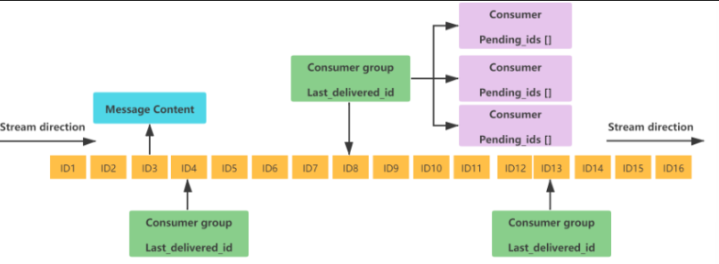
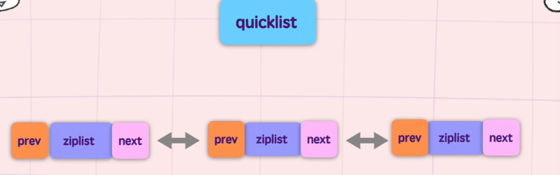

# Redis

## Redis 基础

#### 什么是Redis

[Redis](https://redis.io/) （**RE**mote **DI**ctionary **S**erver）是一个基于 C 语言开发的开源 NoSQL 数据库（BSD 许可）。与传统数据库不同的是，Redis 的数据是保存在内存中的（内存数据库，支持持久化），因此读写速度非常快，被广泛应用于分布式缓存方向。并且，Redis 存储的是 KV 键值对数据。


#### [Redis 为什么这么快？](https://javaguide.cn/database/redis/redis-questions-01.html#%E2%AD%90%EF%B8%8Fredis-%E4%B8%BA%E4%BB%80%E4%B9%88%E8%BF%99%E4%B9%88%E5%BF%AB)⭐️⭐️

Redis 快的本质原始是因为它的操作都是在内存中进行的，靠**单线程和 IO 多路复用**解决了并发性能瓶颈，再配合**深度优化的底层数据结构**和**简洁的通信协议**，把性能压榨到了极致。”


#### 除了Redis，你还知道哪些分布式缓存方案？

分布式缓存的话，比较老牌同时也是使用的比较多的还是 **Memcached** 和 **Redis**。不过，现在基本没有看过还有项目使用 **Memcached** 来做缓存，都是直接用 **Redis**。

#### Redis 和 Memcached 的区别合共同点？

*区别*

1. Memcached 只支持最基本的 KV 键值对，而 Redis 支持的数据类型很丰富。
2. Redis 支持将数据持久化到磁盘，但Memcached 不支持。
3. Memcached 是多线程、非阻塞 IO 复用的网络模型；而 Redis 使用单线程的多路 IO 复用模型（Redis 6.0 针对网络数据的读写引入了多线程）。
4. Memcached 没有原生的集群模式，需要依靠客户端来实现往集群中分片写入数据；而 Redis 自 3.0 版本起是原生支持集群模式的。

*共同点*

1. 都是基于内存的数据库，一般都用来当做缓存使用。
2. 都有过期策略。
3. 两者的性能都非常高。

#### 什么是惰性删除、什么是定期删除⭐️

简单来说，当一个 Key 设置了过期时间（TTL），到期后 Redis 并不是立刻把它从内存里删掉（因为那样太消耗 CPU 了），而是通过 **“懒汉式”** 和 **“体检式”** 两种手段结合来清理。

##### 惰性删除
当 Key 过期后，Redis 并不管它。只有当客户端**尝试访问**这个 Key 时，Redis 才会先检查它是否过期。如果过期了，就当场删除并返回空；没过期就正常返回。

优点：对 cpu 极度友好。只有在用到的时候才会处理，不会浪费额外的 CPU 时间去主动扫描。
缺点：对内存不友好。如果大量 Key 过期后从未被再次访问，它们就会一直赖在内存里，造成内存泄漏。
##### 定期删除
redis 内部有一个定时任务（默认每秒 10 次），每隔一段时间**随机抽取**一部分设置了过期时间的 Key，检查它们是否过期，并删除已过期的部分。

优点：能有效减少过期 Key 对内存的无谓占用。
缺点：会占用一部分 CPU 时间，且由于是抽样，依然可能存在没被抽到的“漏网之鱼”。

#### 为什么要用 Redis⭐️

首先，1）redis 的访问速度快 2）Redis 的并发能力更强，可以达到 10w qps，集群性能会更高 3）功能全面：Redis 除了可以用作缓存之外，还可以用于分布式锁、限流、消息队列、延时队列等场景，功能强大！

#### 为什么用 Redis 而不用本地缓存呢？

*数据一致性问题*

在分布式架构下，应用通常部署在多个服务器节点上。如果采用本地缓存，会存在数据不一致的问题，我们需要复杂的同步机制才能解决，但是如果采用 Redis， 那么所有节点共用用一个 Redis 集群，天然保证了数据的一致性

本地缓存会占用 JVM 的内存

本地缓存：占用的是 JVM 的堆内存。缓存开得越大，留给业务逻辑的内存就越少，且由于缓存过多，GC（垃圾回收）的压力会剧增，导致系统卡顿（Stop The World）。 Redis：是独立的进程，拥有自己的内存空间。你可以给 Redis 配置几十 GB 甚至上百 GB 的内存，而不会影响 Java 应用的运行。如果不够用了，还可以通过 Redis Cluster轻松横向扩展

*本地缓存会随着应用重启而丢失，但 Redis 是独立进程，不易丢失*

#### Redis 的 module 是什么？

**Redis Module（Redis 模块）** 是 Redis 4.0 版本引入的一中“拓展 | 插件”机制。它允许开发者使用 C、C++ 或 Rust 等语言编写自定义插件，直接集成到 Redis 核心中。

RedisSearch（全文搜索）
RedisJSON（原生 JSON 支持）
RedisTimeSeries（时序数据库）
....

#### 为什么 Redis 操作是原子的？⭐️⭐️⭐️

核心原因：单线程模型 + 队列化执行。

“Redis 的原子性主要依赖其**单线程执行模型**，保证了单条命令在执行时不被干扰。

但在实际开发中，复合操作（多条命令）的原子性必须由开发者维护。我们通常会优先选择 **Lua 脚本**，因为它不仅能保证多条指令执行的原子性，还能减少网络往返次数（RTT），性能比原生的 `MULTI/EXEC` 事务更好。”

当一个命令在执行时，其他所有到达的命令都会被放在一个队列里等待。因此，对于单个命令（如 `SET`、`GET`、`INCR`）来说，它在执行过程中绝不会有其他命令来“插队”修改数据。


Redis 所有的内置 API（如 `LPUSH`、`HSET`、`INCR`）在底层 C 语言实现时，都是通过单线程串行执行的。

当你需要一次性执行多个命令，并保证它们不被其他客户端的命令“插队”时，可以使用 Redis 事务。或者用 Lua 脚本来实现！

#### 多个命令在并发中也是原子性的吗？

绝对不是。每个命令单独看是原子的，但组合在一起就不是了。
<p align='center'>
    
</p>

1、使用 Redis 原子指令 `DECR`。

2、使用 Lua 脚本，将“判断+扣减”逻辑打包。

3、使用分布式锁。

#### Redis 哈希槽的概念

为了实现数据的分布式存储，Redis 集群没有使用传统的“一致性哈希”，而是引入了**哈希槽**的概念。

Redis 集群预置了 **16384** ($2^{14}$) 个哈希槽。

映射机制：当你要存储一个 Key 时，Redis 会对 Key 进行 CRC16 校验，然后对 16384 取模：

$$Slot = CRC16(key) \pmod{16384}$$
集群中的每个 Master 节点负责维护一部分槽位。

#### Redis 集群方案应该怎么做 都有哪些方案 ？

##### 主从复制（Replication）

**做法**：一个 Master，多个 Slave。数据从 Master 同步到 Slave。

**优点**：读写分离，分担读压力。

**缺点**：**不具备自动故障转移**。Master 挂了，系统就瘫痪了，需要人工干预。
#####  哨兵模式（Sentinel）

做法：在主从基础上引入“哨兵”进程。哨兵时刻盯着 Master，发现它挂了就自动从 Slave 中选出一个新 Master。
**优点**：实现了**高可用（HA）**。
**缺点**：**无法横向扩容**。所有写操作依然在 Master 上，受限于单机内存容量。


##### Redis Cluster（官方推荐分布式方案）

多主多从，利用上述的“哈希槽”将数据分布在不同节点。
缺点：批量操作（如 MSET）受限，必须保证 Key 在同一个槽（可以通过 Hash Tag 解决）。

## Redis 应用

#### 1. Redis 除了做缓存，还能做什么？

分布式锁：在多机部署的环境下，Java 原生的 `synchronized` 或 `ReentrantLock` 只能锁住当前服务器。

排行榜与计数器 (Leaderboards & Counters)：
 - **排行榜**：利用 **Zset（有序集合）**。它天然支持按分数排序，并且支持 $O(\log N)$ 级别的增删改。
 - 利用 `INCR` 系列原子命令。

消息队列 (Message Queue)：虽然 Redis 不是专业的 MQ（如 Kafka、RabbitMQ），但在中轻量级场景下非常好用。
	
- **List**：利用 `LPUSH` + `BRPOP`，实现简单的异步消息处理。
- **Pub/Sub**：发布订阅模式，类似于广播。
- **Stream**：Redis 5.0 引入，支持消费者组、消息持久化和确认机制（ACK），功能直追专业 MQ。

限流：为了保护系统不被大流量冲垮，需要控制接口的访问频率。

**复杂业务场景**：通过 Redis 以及 Redis 扩展（比如 Redisson）提供的数据结构，我们可以很方便地完成很多复杂的业务场景，比如通过 Bitmap 统计活跃用户、通过 Sorted Set 维护排行榜、通过 HyperLogLog 统计网站 UV 和 PV。

#### 2. 如何基于 Redis 实现分布式锁⭐️

SETNX + EXPIRE(存在原子性问题)

```java
setnx key value
```

原子 SET 命令 (主流手写方式)
从 Redis 2.6.12 开始，`SET` 命令支持多个参数组合，可以一次性完成“判断、加锁、设过期时间”：

``` java
SET lock_key unique_value NX PX 30000
```

Redisson (工业级标准)

① 看门狗机制 (Watch Dog) —— 解决“业务没执行完，锁过期了”
② 可重入性
③ 红锁算法 (Redlock) —— 解决“Redis 集群宕机”


#### 为什么释放锁的时候要用 lua 脚本⭐️

因为释放锁需要“先查询、再比较、再删除”三个动作是非原子的。为了保证这三步在 Redis 里是原子的（防止误删其他人的锁），必须封装在 Lua 脚本中执行。

1）**GET**：获取锁的持有者标识（UUID）。

2）**比较**：判断是不是我持有的锁。

3）**DEL**：如果是，则删除。

#### Redis 可以做消息队列吗？⭐️

当然可以，并且有多种实现方式

1、**Redis 2.0 之前，如果想要使用 Redis 来做消息队列的话，只能通过 List 来实现。**
通过 `RPUSH/BLPOP` 或者 `LPUSH/BRPOP` 即可实现简易版消息队列,但这种实现方式无法完成广播
``` bash
# 生产者生产消息
RPUSH myList msg1 msg2
(integer) 2
RPUSH myList msg3
(integer) 3
# 消费者消费消息
LPOP myList
"msg1"
```

不过，通过 `RPUSH/LPOP` 或者 `LPUSH/RPOP` 这样的方式存在性能问题，我们需要不断轮询去调用 `RPOP` 或 `LPOP` 来消费消息。当 List 为空时，大部分的轮询的请求都是无效请求，这种方式大量浪费了系统资源。
Redis 还提供了 `BLPOP`、`BRPOP` 这种阻塞式读取的命令如果 List 为空，Redis 服务端不会立刻返回结果，它会等待 List 中有新数据后再返回或者是等待最多一个超时时间后返回空。如果将超时时间设置为 0 时，即可无限等待，直到弹出消息

2、基于 Pub/Sub 的消息队列（广播）

<p align='center'>
    
</p>

pub/sub 涉及发布者（Publisher）和订阅者（Subscriber，也叫消费者）两个角色：

- 发布者通过 `PUBLISH` 投递消息给指定 channel。
- 订阅者通过`SUBSCRIBE`订阅它关心的 channel。并且，订阅者可以订阅一个或者多个 channel。
``` java
// 发布信息
publish channel1 msg1
// 订阅频道
subscribe channel1
```

pub/sub 既能单播又能广播，还支持 channel 的简单正则匹配。不过，消息丢失（客户端断开连接或者 Redis 宕机都会导致消息丢失）、消息堆积（发布者发布消息的时候不会管消费者的具体消费能力如何）等问题依然没有一个比较好的解决办法。

3.为此，Redis 5.0 新增加的一个数据结构 `Stream` 来做消息队列。`Stream` 支持：

- 发布 / 订阅模式；
- 按照消费者组进行消费（借鉴了 Kafka 消费者组的概念）；
- 消息持久化（ RDB 和 AOF）；
- ACK 机制（通过确认机制来告知已经成功处理了消息）；
- 阻塞式获取消息。

<p align='center'>
    
</p>

这是一个有序的消息链表，每个消息都有一个唯一的 ID 和对应的内容。ID 是一个时间戳和序列号的组合，用来保证消息的唯一性和递增性。内容是一个或多个键值对（类似 Hash 基本数据类型），用来存储消息的数据。

``` java
// 生产者
public void sendStreamMessage(String streamKey, Map<String, String> content) {
    // XADD 命令，* 表示自动生成消息 ID
    StreamEntryID id = jedis.xadd(streamKey, StreamEntryID.NEW_ENTRY, content);
    System.out.println("发送成功，消息ID: " + id);
}
// 消费者
public void consumeStream(String streamKey, String groupName, String consumerName) {
    // 1. 创建消费者组 (如果不存在)
    try { jedis.xgroupCreate(streamKey, groupName, StreamEntryID.LAST_ENTRY, true); } catch (Exception e) {}

    while (true) {
        // 2. 从组里读取消息
        // XREADGROUP GROUP groupName consumerName COUNT 1 STREAMS streamKey >
        List<Map.Entry<String, List<StreamEntry>>> results = 
            jedis.xreadGroup(groupName, consumerName, 1, 0, false, 
            new SimpleEntry<>(streamKey, StreamEntryID.UNRECEIVED_ENTRY));

        for (Map.Entry<String, List<StreamEntry>> entry : results) {
            for (StreamEntry message : entry.getValue()) {
                System.out.println("处理消息内容: " + message.getFields());
                
                // 3. 核心：处理完必须确认 (ACK)
                // 只有 ACK 后，这条消息才会从 Pending 列表移除
                jedis.xack(streamKey, groupName, message.getID());
            }
        }
    }
}
```

#### 如何基于 Redis 实现延时任务？⭐️

如果面试官问“Redis 怎么做延时任务”，你先答 **Zset** 的实现原理，再提 **Redisson** 的成熟方案。最后如果他问“过期监听行不行”，你一定要指出其**消息丢失**和**延迟不准**的致命缺点，这样能体现你是有实战经验的。

1、基于 Zset（最推荐，最通用）⭐

原理：利用 Zset 的 `score` 属性。我们将任务的**执行时间戳**作为 `score`。

- **生产者**：使用 `ZADD` 将任务加入 Zset，`score` 设为 `当前时间 + 延迟时间`。
- **消费者**：轮询 Zset，使用 `ZRANGEBYSCORE` 获取 `score` 小于等于 `当前时间` 的任务。
- **核心操作**：拿到任务后，必须用 `ZREM` 尝试删除任务。如果删除成功，说明抢到了任务，开始执行。

``` java
public void produce(String taskId, long delaySeconds) {
    long executeTime = System.currentTimeMillis() + (delaySeconds * 1000);
    jedis.zadd("delayed_tasks", executeTime, taskId);
}

public void consume() {
    while (true) {
        long now = System.currentTimeMillis();
        // 获取 score 在 0 到 当前时间戳 之间的第一条任务
        Set<String> tasks = jedis.zrangeByScore("delayed_tasks", 0, now, 0, 1);
        
        if (tasks.isEmpty()) {
            Thread.sleep(500); // 没任务，歇半秒
            continue;
        }

        String taskId = tasks.iterator().next();
        // 关键：利用 ZREM 的原子性判断谁抢到了任务，防止集群模式下重复消费
        if (jedis.zrem("delayed_tasks", taskId) > 0) {
            System.out.println("开始执行延时任务: " + taskId);
        }
    }
}
```


2、使用 Redisson 延时队列（最简单，生产环境首选）⭐

``` java
// 1. 获取延时队列
RBlockingQueue<String> blockingQueue = redisson.getBlockingQueue("my_queue");
RDelayedQueue<String> delayedQueue = redisson.getDelayedQueue(blockingQueue);

// 2. 发送延时任务（10秒后执行）
delayedQueue.offer("task_data", 10, TimeUnit.SECONDS);

// 3. 消费者另起一个线程消费（类似监听器）
new Thread(() -> {
    while (true) {
        try {
            // take() 是阻塞的，有任务才会醒来，不费 CPU
            String task = blockingQueue.take();
            System.out.println("执行任务: " + task);
        } catch (InterruptedException e) { }
    }
}).start();
```

3、Redis 过期监听（最不推荐，有坑）❌
开启 Redis 的 `Keyspace Notifications`，当某个 Key 过期时，Redis 会发布一个事件，应用监听这个事件。

- **不及时**：Redis 的过期删除是“惰性+定期”，如果 Key 很多，过期事件可能会推迟很久才发出来。
- **不可靠**：该模式是“发后即忘”，如果你的应用在那一秒重启了，这个过期事件就**永远丢失了**。
- **压力大**：开启监听会增加 Redis 额外负担。

## Redis 数据类型

#### Redis 的数据类型有哪些？⭐️

Redis 的数据类型可以分为 **5 种基本类型**和 **4 种特殊类型**

基本类型有：`String`,`Hash`,`List`,`Set`,`Zset`

高级类型有：`Bitmaps`,`Hyperlogs`,`Geospatial`,`Streams

#### String 的应用场景

String 是 Redis 最基础的类型，它是**二进制安全**的，意味着它不仅能存文本，还能存任何二进制数据（如图片、序列化后的对象等）。


- 做缓存：将 JSON 存入String
- 分布式锁 (Distributed Lock)
- 计数器：利用 `INCR`、`DECR` 等原子操作。
- 分布式 Session：将用户的登录信息序列化后存入 Redis，并设置过期时间。
- 限流：以用户 IP 为 Key，结合 `INCR` 和 `EXPIRE`。

#### String 还是 Hash 存储对象更好？

	这个看情况，但还是得先说明白它两有什么区别？
	首先，String 存储对象是将整个对象看成一个 Json，优点就是读取快，一次get请求就能拿走对象的全部数据。但缺点就是对对象的属性操作不方便。如果你只想修改 age，必须把整个字符串拿出来，反序列化，改完再序列化塞回去。在高并发下容易覆盖别人的修改。
	
	而Hash则将对象的字段分开存储，优点就是灵活性高，我们可以轻松的操作对象的任意属性，其次 Hash 类型在数据较少时使用 ziplist（压缩列表） 编码，因此占用内存更小！但缺点就是结构相对 String 来说比较复杂。

- 如果对象不涉及频繁的局部属性操作，那么我们选择String即可。
- 如果需要频繁操作对象的部分字段或节省内存，**Hash** 可能是更好的选择。


#### String 底层实现是什么?⭐️

Redis 的 String 类型底层并不是简单的 C 语言字符串（以 `\0` 结尾的字符数组），而是专门设计了一种名为 **SDS（Simple Dynamic String，简单动态字符串）** 的结构。本质就是 C 语言的结构体！

- **len（长度）**：已使用的字节数。获取字符串长度的时间复杂度为 $O(1)$。
- **alloc（分配总量）**：总共分配了多少空间。
- **flags（标志）**：标记 SDS 的类型（Redis 会根据内容长度选择不同的 header 以节省空间）。
- **buf[]（字节数组）**：实际存储数据的区域，最后依然保留了 `\0` 以兼容 C 语言部分库函数。

``` c
/* Note: sdshdr5 is never used, we just access the flags byte directly.
 * However is here to document the layout of type 5 SDS strings. */
struct __attribute__ ((__packed__)) sdshdr5 {
    unsigned char flags; /* 3 lsb of type, and 5 msb of string length */
    char buf[];
};
struct __attribute__ ((__packed__)) sdshdr8 {
    uint8_t len; /* used */
    uint8_t alloc; /* excluding the header and null terminator */
    unsigned char flags; /* 3 lsb of type, 5 unused bits */
    char buf[];
};
struct __attribute__ ((__packed__)) sdshdr16 {
    uint16_t len; /* used */
    uint16_t alloc; /* excluding the header and null terminator */
    unsigned char flags; /* 3 lsb of type, 5 unused bits */
    char buf[];
};
struct __attribute__ ((__packed__)) sdshdr32 {
    uint32_t len; /* used */
    uint32_t alloc; /* excluding the header and null terminator */
    unsigned char flags; /* 3 lsb of type, 5 unused bits */
    char buf[];
};
struct __attribute__ ((__packed__)) sdshdr64 {
    uint64_t len; /* used */
    uint64_t alloc; /* excluding the header and null terminator */
    unsigned char flags; /* 3 lsb of type, 5 unused bits */
    char buf[];
};
```


1、**可以避免缓冲区溢出**：C 字符串在执行拼接操作（如 `strcat`）时，如果没分配够空间就会溢出。SDS 在修改前会检查 `len` 和 `alloc`，如果空间不够，会自动扩容。

2、常数时间获取长度：C 字符串需要遍历整个数组直到遇到 `\0` 才能知道长度（$O(N)$），而 SDS 直接读取 `len` 字段（$O(1)$）。

3、减少内存重分配次数（核心优化）：

- **空间预分配**：扩容时，Redis 会多申请一些闲置空间。下次追加内容时，可能就不需要再次申请内存了。
- **惰性空间释放**：缩短字符串时，Redis 不会立刻回收内存，而是增加闲置空间。如果后续又要增长，可以直接复用。

4、二进制安全
C 字符串通过 `\0` 判断结束，因此不能存储包含 `\0` 的图片或视频数据。SDS 根据 `len` 字段判断结束，**不限制内容格式**，支持存储任何二进制数据。

#### List 的底层结构⭐️
压缩列表（zipList）
<p align='center'>
    
</p>


快速列表（quickList）：以一个一个的`quicklistNode`为节点构成的双向链表
``` c
typedef struct quicklistNode {
    struct quicklistNode *prev;
    struct quicklistNode *next;
    unsigned char *zl; 
    unsigned int sz;
    unsigned int count : 16;     /* count of items in ziplist */
    unsigned int encoding : 2;  /* RAW==1 or LZF==2 */
    unsigned int container : 2; /* NONE==1 or ZIPLIST==2 */
    unsigned int recompress : 1; /* was this node previous compressed? */
    unsigned int attempted_compress : 1; /* node can't condense; too small */
    unsigned int extra : 10; /* more bits to steal for future usage */
} quicklistNode;
```
- **`*prev` / `*next`**：指向前一个和后一个节点的指针，构成**双向链表**。
- **`*zl`**：指向实际存储数据的指针。在旧版本中指向 `ziplist`，新版本（Redis 7.0+）通常指向 `listpack`。
- **`sz`**：表示 `zl` 指向的整个压缩列表占用的总字节数。
- **`count : 16`**：位域（Bit-field）设计，占用 16 位，表示该节点内包含的元素个数。
- **`encoding`**：表示节点是否被压缩。`1` 表示原生数据（RAW），`2` 表示使用 LZF 算法压缩后的数据。
- **`container`**：预留字段，目前固定为 `2`（表示底层使用压缩列表容器）。
- **`recompress`**：标记该节点之前是否处于压缩状态（在访问被压缩节点时会临时解压）。

<p align='center'>
    
</p>


List 的底层结构是 Quicklist（快速列表），它是由双向链表和紧凑的 Listpack（或 Ziplist）组合而成的混合结构。这样设计是综合考虑内存与性能的最佳选择。

1）如果我们只用双向链表，那么每个数据都会对应一个结点，也就是会有8字节 | 16的指针，当我们的数据是小数据时，会导致指针的大小都比本次存储的数据大，有效载荷极低。因此，我们将多个数据打包存放到了一个 listPack 中，这样能大大减少指针的数量，还能享受到ListPack带来的优势

2）如果只用`ListPack`或者`ZipList`时：当元素过多时，可能会导致频繁的内存重分配与拷贝，但如果结合双向链表，我们就可以保证每一个 ListPack 的大小都不会太大。

3）Listpack 作为一段连续的内存，在被 CPU 读取时具有更好的空间局部性。相比于散落在内存各处的链表节点，CPU 缓存能够一次性加载更多的实际数据，从而提高遍历和读取速度。

4）Quicklist 还支持对非头尾节点进行 **压缩**（LZF算法），在保证两端 $O(1)$ 性能的同时，极致压榨长列表的存储空间。


#### Zset 的底层结构？⭐️

跳表（skipList）：在链表的基础上建立了“多级索引”。通过索引跳着找，查询复杂度直接降到 **$O(\log N)$**，性能堪比红黑树，但实现起来比红黑树简单得多。

<p align='center'>
    
</p>

Zset（有序集合）的设计目标是：既要能像 Hash 一样 **$O(1)$ 查询成员分数**，又要能像 Tree 一样 **$O(\log N)$ 按分数排序或范围取值**。

Zset 根据数据规模在两种底层结构之间切换。

##### 第一阶段：紧凑型存储 —— Listpack (或 Ziplist)

当 Zset 保存的元素较少（默认 < 128 个）且每个元素较短（默认 < 64 字节）时，它使用 **Listpack** 存储。

- **存储方式**：在连续的内存空间里，将 `成员 (member)` 和 `分数 (score)` 紧挨着存放。
- **排列顺序**：按照分数 **从小到大** 存储。
- **为什么这么做？**
  
    - **极致省内存**：正如你所理解的，这时候没有指针，只有紧凑的数据。
    - **性能尚可**：因为数据量很小，即便在连续内存里进行 $O(N)$ 的遍历，也能直接装载进 CPU Cache，速度极快。


##### 第二阶段：高性能结构 —— Dict + Skiplist

Dict：它存储了 `member -> score` 的映射。当你执行 `ZSCORE` 查询某个人的步数时，Redis 直接去 Dict 里找，时间复杂度是 **$O(1)$**。

SkipList：它将所有的 `member` 按照 `score` 大小组织起来。当你执行 `ZRANGE`（取前十名）或 `ZREVRANK`（查排名）时，跳表能提供 **$O(\log N)$** 的效率。

#### 购物车信息是用 String 还是 Hash 呢？⭐️

由于购物车中的商品频繁修改和变动，购物车信息建议使用 Hash 存储。

最简单的情景：在 Redis 中，我们通常以 **用户 ID** 作为 Redis 的 `key`，以 **商品 ID** 作为 Hash 里的 `field`，以 **商品数量** 作为 `value`。

- 用户添加商品就是往 Hash 里面增加新的 field 与 value；
- 查询购物车信息就是遍历对应的 Hash；
- 更改商品数量直接修改对应的 value 值（直接 set 或者做运算皆可）；
- 删除商品就是删除 Hash 中对应的 field；
- 清空购物车直接删除对应的 key 即可。

你会发现，上面的 Hash 只存了数量。那商品的标题、图片等详情存哪？这里有两种主流做法：

1、二次查询 - 推荐
2、序列化存入 Hash（适合小规模）


#### Set 的底层结构 ⭐️

Set 的设计同样遵循 Redis “看人下菜碟”的原则：

1. **整数集合 (Intset)**：如果集合里存的全是整数，且数量较少，Redis 会使用一块**连续的内存**来存储，极其节省空间。
   
2. **哈希表 (Dict/Hashtable)**：一旦存入了字符串，或者元素数量变多，Redis 就会将其转为 **Dict**。在 Dict 中，`member` 存为 Key，而 Value 统一指向 `NULL`（就像 Java 里的 `HashSet` 底层是 `HashMap` 一样）。

#### 使用Redis实现一个排行榜怎么做呢？⭐️

实现排行榜是 Redis 非常擅长的，这主要归功于它提供的一种特殊数据结构：**Zset（Sorted Set，有序集合）**。在有序集合中，每个 Member 都会关联一个 Score，Redis 会自动的按照 Score 对 Member 进行排序

eg：实现“当天步数排行榜”，核心思路是利用 Redis 的 **Zset（有序集合）**。每一天使用一个独立的 Key，将用户 ID 作为 `member`，步数作为 `score`。
```bash
# 1. 用户 001 走了 5000 步
ZINCRBY rank:steps:20260111 5000 "user:001"

# 2. 用户 002 走了 8000 步
ZINCRBY rank:steps:20260111 8000 "user:002"

# 3. 用户 001 后来又走了 4000 步
ZINCRBY rank:steps:20260111 4000 "user:001"

# 4. 查看排行榜前三名（带分数）
ZREVRANGE rank:steps:20260111 0 2 WITHSCORES
# 结果显示：
# 1) "user:001"
# 2) "9000"
# 3) "user:002"
# 4) "8000"

# 5. 查看用户 002 的排名（返回 1 表示排在第 2 位）
ZREVRANK rank:steps:20260111 "user:002"
```

`ZREVRANK` 的作用是：**获取某个成员在有序集合（Zset）中“从高到低”的排名。**
`ZSCORE` ：查询某个成员的分数

#### Redis 的有序集合底层为什么要用跳表，而不用平衡树、红黑树或者 B+ 树？⭐️

Redis 选择跳表是因为它在保证 $O(\log N)$ 查询性能的同时，通过双向链表实现了极致的范围查询效率，且比红黑树更容易实现和维护。

##### 跳表的范围查询更简单！

Zset 经常需要执行 `ZRANGE` 或 `ZREVRANGE` 这种范围查询。

- **跳表**：在跳表中进行范围查询非常简单。只需要 $O(\log N)$ 时间找到区间的起点，然后顺着底层的**双向链表**向后遍历即可。
- **平衡树/红黑树**：虽然这些树也能做范围查询，但操作逻辑复杂得多。在找到起点后，需要通过中序遍历（In-order Traversal）来寻找后续节点，这涉及复杂的父子节点切换逻辑，效率不如跳表的链表遍历。
- **B+ 树**：B+ 树确实也很擅长范围查询，但它主要是为了**磁盘 IO** 优化的。B+ 树的一个节点（页）通常很大（如 16KB），这在内存数据库 Redis 中会造成严重的内存碎片和浪费。
##### 跳表的常数小，结构简单

- **跳表**：逻辑非常直观。插入、删除只需要修改相邻节点的指针。
- **平衡树/红黑树**：代码实现极其复杂。为了维持平衡，在插入或删除后需要进行复杂的**旋转（Rotation）**或**变色**操作。
- **Antirez 的观点**：跳表的实现比红黑树更难写错，调试也更简单。对于高性能中间件来说，代码的可维护性和稳定性至关重要。

#### Set 的应用场景是什么？

| **功能**         | **命令**               | **复杂度**      | **说明**                     |
| ---------------- | ---------------------- | --------------- | ---------------------------- |
| **添加元素**     | `SADD key member`      | $O(1)$          | 自动去重                     |
| **判断是否存在** | `SISMEMBER key member` | $O(1)$          | 极快地判断用户是否在黑名单中 |
| **求交集**       | `SINTER key1 key2`     | $O(N \times M)$ | 找共同点                     |
| **求差集**       | `SDIFF key1 key2`      | $O(N)$          | 找不同点                     |
| **随机获取**     | `SPOP key`             | $O(1)$          | 适用于不放回抽奖             |

首先，Redis 的 Set 支持自动去重，并且支持强大的集合间操作（交集、并集、差集）。

1）利用 Set 的自动去重
- **点赞 / 收藏**：记录某个帖子被哪些用户点赞 | 收藏。由于一个用户只能点赞一次，使用 `SADD` 既能记录数据，又能自动防止重复点赞。    
- **独立 IP 统计 (UV)**：统计网站每天有多少个不重复的访客 IP（注：对于海量 UV，更推荐使用 HyperLogLog 以节省空间，但对于精确去重，Set 是首选）。

2）利用 Set 提供的集合操作获取多个数据源的交集、并集、差集
- **关注列表 / 粉丝列表**：记录某个用户关注的人。
- **共同关注**：通过 `SINTER`（交集）命令，轻松找出 A 和 B 共同关注的人。
- **可能认识的人**：通过 `SDIFF`（差集）命令，找出 A 关注了但 B 没关注的人，作为推荐。

3）抽奖系统
Set 提供了随机获取元素的命令，非常适合公平抽奖。
**随机中奖**：`SRANDMEMBER`（随机返回但不删除）或 `SPOP`（随机返回并从集合中弹出）。

#### 使用 Bitmap 统计活跃用户怎么做⭐️

将用户 ID 映射为 Bitmap 中的偏移量（offset），用 0 和 1 表示用户是否活跃。

- **Key 设计**：通常按时间维度设计 Key，例如 `active:users:20260111`（统计某一天）或 `active:users:202601`（统计某个月）。
- **Offset 映射**：直接使用用户自增的整数 ID 作为偏移量。如果用户 ID 是 `10086`，就操作第 `10086` 位。
- **Value 含义**：`1` 表示活跃，`0` 表示非活跃。

（1）标记当前用户为活跃用户

```
SETBIT active:users:20260111 101 1
```

（2）查询某个用户当天是否活跃
```
GETBIT active:users:20260111 101
# 返回 1 表示活跃，0 表示不活跃
```

（3）统计当天的总活跃人数 (DAU)

```
# 使用 BITCOUNT 命令可以快速统计位图中 `1` 的个数：
BITCOUNT active:users:20260111
```

（4）统计多日连续活跃（留存/交集）

```
# 将 10号和 11号的结果做 AND 运算，存入 result:and
BITOP AND result:and active:users:20260110 active:users:20260111
# 统计结果
BITCOUNT result:and
```

（5）统计多日累计活跃
```
BITOP OR result:or active:users:20260101 active:users:20260102 ... BITCOUNT result:or
```

极度省空间：1 个位代表 1 个用户，1 亿个用户只需要 1 亿个位。$100,000,000 \text{ bits} \div 8 \div 1024 \div 1024 \approx 12 \text{ MB}$。

运算速度快：`BITCOUNT` 和 `BITOP` 都是位运算，直接由 CPU 指令支持，处理千万级数据通常在毫秒级。

#### HyperLogLog 适用场景？
pass


#### 如果我想判断一个元素是否不在海量元素集合中，用什么数据类型？

bitmap 或者 bloomFilter 都可以实现

## Redis 持久化机制⭐️

大部分原因是为了之后重用数据（比如重启机器、机器故障之后恢复数据），或者是为了做数据同步（比如 Redis 集群的主从节点通过 RDB 文件同步数据）。

- 快照（snapshotting，RDB）
- 只追加文件（append-only file, AOF）
- RDB 和 AOF 的混合持久化(Redis 4.0 新增)

#### RBD 持久化⭐️
##### 什么是 RDB 持久化

RDB 是在指定的时间间隔内，将内存中的全量数据生成一个**二进制快照**（Snapshot）保存到磁盘。恢复速度快，但会丢失最后一次快照后的数据。

#### RBD 创建快照时会阻塞主线程吗？
那要看是同步创建还是异步创建了，Redis 提供了两个命令来生成 RDB 快照文件：

- `save` : 同步保存操作，会阻塞 Redis 主线程；
- `bgsave` : fork 出一个子进程，子进程执行，不会阻塞 Redis 主线程，默认选项。
#### AOF 持久化⭐️

##### 什么是 AOF 持久化

AOF 是以**日志**的形式记录 Redis 执行过的每一条**写命令**，重启时通过重新执行这些命令来恢复数据。

可以通过 appendonly 参数来开启 AOF 持久化！

#### AOF 工作基本流程是怎么样的？⭐️

1、**命令追加 (Append)**：写命令先存入 Redis 的 **AOF 缓冲区**，避免直接 I/O 阻塞主线程。
2、**文件写入 (Write)**：将缓冲区数据调用系统 `write` 函数写入**系统内核缓冲区**，此时数据尚未落盘。
3、**文件同步 (Fsync)**：核心步骤。根据配置策略（如每秒一次）调用 `fsync`，将内核缓冲区数据**强制同步到硬盘**。
4、**文件重写（rewrite）**：随着 AOF 文件越来越大，需要定期对 AOF 文件进行重写，达到压缩的目的。
5、**重启加载 (Load)**：Redis 重启时通过执行 AOF 里的命令来**恢复数据**。

##### AOF 的持久化方式有哪些？

在 Redis 的配置文件中存在三种不同的 AOF 持久化方式（ `fsync`策略），它们分别是：
`appendfsync always`:   主线程调用 `write` 执行写操作后，会立刻调用 `fsync` 函数同步 AOF 文件（刷盘）。主线程会阻塞，直到 `fsync` 将数据完全刷到磁盘后才会返回。这种方式数据最安全，理论上不会有任何数据丢失。但因为每个写操作都会同步阻塞主线程，所以性能极差。

`appendfsync everysec`：每个写命令执行完，先写到 AOF 缓冲区；由后台线程**每隔一秒**调用一次 `fsync` 同步到磁盘。

`appendfsync no`：主线程调用 `write` 执行写操作后立即返回，让操作系统决定何时进行同步，Linux 下一般为 30 秒一次（`write`但不`fsync`，`fsync` 的时机由操作系统决定）。 这种方式性能最好，因为避免了 `fsync` 的阻塞。但数据安全性最差，宕机时丢失的数据量不可控，取决于操作系统上一次同步的时间点。


- **`write`**：只是把数据从应用内存“交”给了操作系统（进了内核缓冲区就返回了），此时如果 **Redis 挂了** 数据还在，但如果 **电脑断电了** 数据就丢了。
  
- **`fsync`**：才是真正的“落盘”指令，它会阻塞直到硬盘告诉你“我存好了”。

#### AOF 重写了解吗？

**AOF 重写（Rewrite）** 是 Redis 为了解决 AOF 文件“体积无限膨胀”问题而设计的瘦身机制。

随着运行时间增长，AOF 文件会记录大量冗余命令（例如：对同一个 Key 执行了 100 次 `INCR`，AOF 会记录 100 条指令）。重写机制会根据 **Redis 内存中的当前数据**，直接生成一份最小化的写命令集。


为了不阻塞主线程，Redis 采用 **后台子进程** 方式进行：
1. **创建子进程 (Fork)**：主进程 fork 出一个 `bgrewriteaof` 子进程。
2. **内存拷贝 (Copy-on-Write)**：子进程共享主进程的物理内存数据。由于使用了 **写时复制（COW）** 技术，主进程在重写期间依然可以处理读写。
3. **两份缓冲区**：
    - **AOF 缓冲区**：新进来的写命令继续写入旧的 AOF 文件，保证数据不丢。
    - **AOF 重写缓冲区**：重写期间新产生的写命令也会同步存入这个新增的缓冲区。    
4. **合并与替换**：子进程扫描完内存生成新 AOF 后，主进程将“重写缓冲区”的内容追加到新 AOF，最后替换掉旧的大文件。

开启 AOF 重写功能，可以调用 `BGREWRITEAOF` 命令手动执行，也可以设置下面两个配置项，让程序自动决定触发时机：

- `auto-aof-rewrite-min-size`：如果 AOF 文件大小小于该值，则不会触发 AOF 重写。默认值为 64 MB;
- `auto-aof-rewrite-percentage`：执行 AOF 重写时，当前 AOF 大小（aof_current_size）和上一次重写时 AOF 大小（aof_base_size）的比值。如果当前 AOF 文件大小增加了这个百分比值，将触发 AOF 重写。将此值设置为 0 将禁用自动 AOF 重写。默认值为 100。


#### AOF 重写会阻塞吗？

- **Fork 瞬间会阻塞**：在 fork 子进程的一刹那，主进程会由于拷贝页表而产生微小阻塞。
- **数据同步会阻塞**：在重写最后阶段，主进程将“重写缓冲区”数据写往新 AOF 时会有短暂阻塞。

#### RDB 和 AOF 的区别？

- **RDB (Redis DataBase)**：是**内存快照**，存的是某一时刻的**最终数据**二进制序列。
- **AOF (Append Only File)**：是**命令日志**，存的是每一条执行过的**写操作命令**。

RDB 比起 AOF，产生的文件更小，恢复速度更快，但是，RDB 可能丢失在最后一次备份之后的全部数据，相比来说，AOF 更加安全，理论上，如果采用 appendfsync-alaways，可以做到不丢失任何一条命令。但是 AOF 产生的文件比较大，实现高安全性带来的频繁的fsync 比较消耗性能。

因此，最好的做法实际上是：**混合持久化**。 它的做法是：在 AOF 重写时，先将当前内存数据以 **RDB 格式** 写入文件开头，再将重写期间的增量命令以 **AOF 格式** 追加。
## Redis 线程模型⭐️

对于读写命令来说，Redis 一直是单线程模型。不过，在 Redis 4.0 版本之后引入了多线程来执行一些大键值对的异步删除操作，Redis 6.0 版本之后引入了多线程来处理网络请求（提高网络 IO 读写性能）。

<p align='center'>
    
</p>

文件事件处理器（file event handler）主要是包含 4 个部分：
- 多个 socket（客户端连接）
- IO 多路复用程序（支持多个客户端连接的关键）
- 文件事件分派器（将 socket 关联到相应的事件处理器）
- 事件处理器（连接应答处理器、命令请求处理器、命令回复处理器）

#### Redis 4.0  引入了什么后台线程

Redis 4.0 增加的多线程主要是针对一些大键值对的删除操作的命令，使用这些命令就会使用主线程之外的其他线程来“异步处理”，从而减少对主线程的影响

- `UNLINK`：可以看作是 `DEL` 命令的异步版本。
- `FLUSHALL ASYNC`：用于清空所有数据库的所有键，不限于当前 `SELECT` 的数据库。
- `FLUSHDB ASYNC`：用于清空当前 `SELECT` 数据库中的所有键。

#### Redis 6.0 之后为什么引入了多线程？

随着互联网数据的爆发，Redis 的瓶颈通常不在 CPU（因为它是纯内存操作），也不在内存（可以通过集群扩展），而是在 **网络 I/O**。

- **读写开销**：当请求量达到数十万 QPS 时，从网卡读取数据到内存，以及将回复数据写回网卡的这个过程，会消耗大量的 CPU 时间。
  
- **主线程受累**：在单线程模型下，主线程不仅要执行逻辑，还要负责这些繁琐的数据拷贝工作。这意味着大厨（主线程）除了炒菜，还得亲自去大门口搬菜、洗菜，导致炒菜速度变慢。

为了解决上述问题，Redis 6.0 引入了多线程来专门处理 **网络数据的读写**，而 **执行命令** 依然保留在主线程中。

Redis6.0 的多线程默认是禁用的，只使用主线程。如需开启需要设置 IO 线程数 > 1，需要修改 redis 配置文件 `redis.conf`：

```
io-threads 4 #设置1的话只会开启主线程，官网建议4核的机器建议设置为2或3个线程，8核的建议设置为6个线程
```

开启多线程后，默认只会使用多线程进行 IO 写入 writes，即发送数据给客户端，如果需要开启多线程 IO 读取 reads，同样需要修改 redis 配置文件 `redis.conf`：

```
io-threads-do-reads yes
```
但是官网描述开启多线程读并不能有太大提升，因此一般情况下并不建议开启。

#### Redis 后台线程？4.0 增强
- 通过 `bio_close_file` 后台线程来释放 AOF / RDB 等过程中产生的临时文件资源。
- 通过 `bio_aof_fsync` 后台线程调用 `fsync` 函数将系统内核缓冲区还未同步到到磁盘的数据强制刷到磁盘（AOF 文件）。
- 通过 `bio_lazy_free` 后台线程释放大对象（已删除）占用的内存空间.


## Redis 内存管理

#### Redis 给缓存设置过期时间有什么用？

可以总结为：节约内存空间 ，或者满足业务场景（验证码到时过期，登录状态最多维持时间...）

``` bash
127.0.0.1:6379> expire key 60 # 数据在 60s 后过期
(integer) 1
127.0.0.1:6379> setex key 60 value # 数据在 60s 后过期 (setex:[set] + [ex]pire)
OK
127.0.0.1:6379> ttl key # 查看数据还有多久过期
(integer) 56
```

注意 ⚠️：Redis 中除了字符串类型有自己独有设置过期时间的命令 `setex` 外，其他方法都需要依靠 `expire` 命令来设置过期时间 。另外，`persist` 命令可以移除一个键的过期时间。

#### Redis 如何判断数据是否过期呢？⭐️

Redis 通过一个叫做过期字典（可以看作是 hash 表）来保存数据过期的时间。过期字典的键指向 Redis 数据库中的某个 key（键），过期字典的值是一个 long long 类型的整数，这个整数保存了 key 所指向的数据库键的过期时间（毫秒精度的 UNIX 时间戳）。

在查询一个 key 的时候，Redis 首先检查该 key 是否存在于过期字典中（时间复杂度为 O(1)），如果不在就直接返回，在的话需要判断一下这个 key 是否过期，过期直接删除 key 然后返回 null。

#### Redis 过期 Key 的删除策略⭐️

Redis 采用的是惰性删除 + 定期删除

#### Redis 内存淘汰策略⭐️

Redis 的内存淘汰策略只有在运行内存达到了配置的最大内存阈值时才会触发，这个阈值是通过 `redis.conf` 的 `maxmemory` 参数来定义的。64 位操作系统下，`maxmemory` 默认为 0，表示不限制内存大小。32 位操作系统下，默认的最大内存值是 3GB。

- **volatile-lru（least recently used）**：从已设置过期时间的数据集（`server.db[i].expires`）中挑选最近最少使用的数据淘汰。
- **volatile-ttl**：从已设置过期时间的数据集（`server.db[i].expires`）中挑选将要过期的数据淘汰。
- **volatile-random**：从已设置过期时间的数据集（`server.db[i].expires`）中任意选择数据淘汰。
- **allkeys-lru（least recently used）**：从数据集（`server.db[i].dict`）中移除最近最少使用的数据淘汰。
- **allkeys-random**：从数据集（`server.db[i].dict`）中任意选择数据淘汰。
- **no-eviction**（默认内存淘汰策略）：禁止驱逐数据，当内存不足以容纳新写入数据时，新写入操作会报错。

4.0 版本后增加以下两种：

- **volatile-lfu（least frequently used）**：从已设置过期时间的数据集（`server.db[i].expires`）中挑选最不经常使用的数据淘汰。
- **allkeys-lfu（least frequently used）**：从数据集（`server.db[i].dict`）中移除最不经常使用的数据淘汰。

## Redis 事务

Redis 可以通过 **`MULTI`、`EXEC`、`DISCARD` 和 `WATCH`** 等命令来实现事务（Transaction）功能。
#### 什么是 Redis 事务？⭐️

**Redis 事务提供了一种将多个命令请求打包的功能。然后，再按顺序执行打包的所有命令，并且不会被中途打断。**

#### 如何使用 Redis 事务？

1、标准流程

- **开启事务 (`MULTI`)**：告诉 Redis，后面的命令先别执行，先存到队列里。
- **命令入队**：你输入的后续命令会返回 `QUEUED`。
- **执行事务 (`EXEC`)**：让 Redis 一口气执行队列里的所有命令。

```bash
> MULTI                # 1. 开启事务
OK
> SET user:name "Jack" # 2. 命令入队
QUEUED
> INCR user:score      # 3. 命令入队
QUEUED
> EXEC                 # 4. 真正执行
1) OK                  # 返回 SET 的结果
2) (integer) 1         # 返回 INCR 的结果
```

2、DisCard 

如果你在输入了一堆命令后突然反悔了，可以使用 `DISCARD`。它会清空命令队列并退出事务状态。
``` bash
> MULTI
OK
> SET test "value"
QUEUED
> DISCARD             # 放弃，之前队列里的 SET 不会执行
OK
```

3、乐观锁机制 (`WATCH`)

这是 Redis 事务最强大的地方。`WATCH` 可以监视一个或多个 Key，如果在你执行 `EXEC` 之前，这些 Key 被**其他客户端**修改了，那么整个事务会自动失败。

4、错误情况

 情况一：入队时的语法错误（类似“编译报错”）

 情况二：执行时的逻辑错误（你说的“运行时错误”）
 - 报错的那个命令会显示错误信息。
 - **队列中其他的命令会继续执行，不受任何影响。**  
 - **已经执行成功的命令不会撤销（不回滚）。**

#### 为什么 Redis 事务不支持回滚

- **性能至上**：支持回滚需要记录命令执行前后的状态（Undo Log），这会极大地增加内存开销和处理延迟。
  
- **程序员的锅**：Redis 认为，运行时的错误通常是由于**编程错误**产生的（例如数据类型搞错了）。这种错误在生产环境中应该在开发和测试阶段就被规避，而不应该由数据库层面的回滚来补偿。
  
- **保持简单**：不回滚让 Redis 的内部实现非常轻量、高效。


#### 如何解决 Redis 事务的缺陷？

既然你已经看出了 Redis 事务在“回滚”和“逻辑判断”上的局限性，那么解决这些缺陷的最佳实践就是使用 **Lua 脚本**。


- **真正的原子性**：Redis 保证整个 Lua 脚本在执行期间，不会被其他任何命令插入。它就像一个超长的原子指令。
- **支持复杂的逻辑判断**：事务中你不能写 `if (a > b) then ...`，但在 Lua 里你可以随意编写业务逻辑。
- **减少网络开销**：事务需要多次请求（MULTI、命令1、命令2、EXEC），而 Lua 脚本是一次性发送，由 Redis 本地执行。


##### 如何处理 Lua 中的“回滚”？

虽然 Lua 脚本能解决逻辑问题，但你必须注意：**如果 Lua 脚本运行到一半由于某种原因（比如语法错或显式报错）中断，已经执行完的命令同样不会撤销。**


- **先检查，后写入**：在脚本的开头做完所有的校验（如余额是否足够、Key 是否存在）。
- **保证脚本不报错**：确保脚本内部逻辑严谨，不要出现除以 0、操作错误类型等运行时错误。
- **脚本的原子性保证**：因为 Redis 会阻塞所有其他命令直到脚本运行完，只要你的校验逻辑在写操作之前，就能保证“要么逻辑通过全部修改，要么逻辑不通过不修改”。


## Redis 性能优化

#### 可以使用批量操作减少网络传输⭐️

在 Redis 的实际应用中，**网络往返时间（RTT, Round Trip Time）** 往往比命令本身的执行时间要长得多。如果每次传出只传一条命令的话，就显得有些低效了，所以我们可以采用批量操作，从而实现一次传输传递多条命令。

1、原生批量命令 (M-commands)
**常用命令**：`MSET`、`MGET`、`HMSET`、`HMGET`、`SADD`（支持多个 member）等。

- **原子性**：这些操作在 Redis 内部是原子的，要么全成功，要么全失败。
- **极高性能**：因为是单条指令处理，效率最高。
- **局限性**：只能操作同一种数据结构（比如 `MSET` 只能存 String）。

```
mset k1 v1 k2 v2 k3 v3
```


2、Pileline 

Pipeline 是一种“异步”的打包方式，允许客户端一次性发送多条**不同类型**的命令，这些不同的命令不需要等待其他命令的回复。它也只跑了 **1 次网络往返**，但它里面装的是**不同种类**的活。


3、Lua 脚本

- **严格原子性**：整个脚本执行期间，Redis 不会处理其他任何请求。
- **减少带宽**：复杂的业务逻辑在 Redis 内部完成，不需要在客户端和服务器之间反复传输中间数据。


#### 大量 Key 集中过期问题⭐️

Redis 默认每秒进行 10 次采样检测，随机抽取一些 Key 检查是否过期。

如果在一次循环中，发现已过期 Key 的比例超过 **25%**，Redis 会认为当前过期键很多，为了尽快释放内存，它会**继续触发**采样和删除，直到比例降下来。

这个循环过程是阻塞主线程的。如果 Key 太多，主线程会一直忙于清理过期数据，导致无法处理正常的读写请求。

###### 解决方案⭐️

1. 给 key 设置随机过期时间。
2. 开启 lazy-free（惰性删除/延迟释放）。lazy-free 特性是 Redis 4.0 开始引入的，指的是让 Redis 采用异步方式延迟释放 key 使用的内存，将该操作交给单独的子线程处理，避免阻塞主线程。（lazyfree-lazy-expire yes）


#### Redis BigKey⭐️

所谓 BigKey，并不是指 Key 本身很大，而是指 **Value 占用的空间过大** 或者 **集合中的元素过多**。

- String 类型的 value 超过 1MB
- 复合类型（List、Hash、Set、Sorted Set 等）的 value 包含的元素超过 5000 个或者整个集合的内存占用超过 **10 MB**。

##### bigkey 如何产生的

- 程序设计不当，比如直接使用 String 类型存储较大的文件对应的二进制数据。
- 对于业务的数据规模考虑不周到，比如使用集合类型的时候没有考虑到数据量的快速增长。
- 未及时清理垃圾数据，比如哈希中冗余了大量的无用键值对。
##### bigkey 会带来什么问题

**主线程阻塞**：Redis 是单线程执行命令的。删除一个 100MB 的 BigKey 或对一个百万级元素的 List 执行 `HGETALL`，会耗时几秒钟。这期间，所有其他客户端的请求都会排队超时。

**网络拥塞**：每次获取大 key 产生的网络流量较大，如果一个 key 的大小是 1 MB，每秒访问量为 1000，那么每秒会产生 1000MB 的流量，这对于普通千兆网卡的服务器来说是灾难性的。

**超时引发切换**：由于主线程被 BigKey 阻塞，Redis 可能无法响应心跳检测，导致哨兵（Sentinel）误以为节点宕机，触发不必要的**主从切换**。
##### 如何发现bigkey

1、执行 `redis-cli --bigkeys`。

2、**使用 `SCAN` 命令**：配合 len + card 系列指令，可以获得 String 类型的字节数或者集合类型的元素个数，有时候，成员数量多并不代表内存占用大（比如存的都是短字符串），反之亦然。 Redis 4.0+ 提供的 `MEMORY USAGE` 命令可以计算一个 Key 在内存中**实际占用的字节数**。

| **类型**   | **查询命令** | **含义**        | **风险阈值建议** |
| ---------- | ------------ | --------------- | ---------------- |
| **String** | `STRLEN key` | 字节数          | $> 10$ KB        |
| **Hash**   | `HLEN key`   | 字段(field)数量 | $> 5000$         |
| **List**   | `LLEN key`   | 元素数量        | $> 5000$         |
| **Set**    | `SCARD key`  | 成员数量        | $> 5000$         |
| **Zset**   | `ZCARD key`  | 成员数量        | $> 5000$         |
- **`SCAN`** 获取一批 Key。
- 使用 **`TYPE`** 判断 Key 类型（可选，如果你已经知道业务前缀）。
- 使用 **`HLEN/LLEN...`** 快速判断“成员数”。
- **【关键】**：只有当“成员数”超过一定阈值（比如 1000）时，才调用 **`MEMORY USAGE`**

3、**RDB 离线分析（推荐）**：使用工具如 `redis-rdb-tools` 离线分析 RDB 快照文件，完全不影响线上业务。

##### 如何处理 BigKey

1. 异步删除：使用 **`UNLINK`** 命令替代 `DEL`。`UNLINK` 会将 Key 从全局哈希表中立即摘除（逻辑删除），然后将具体的内存回收任务交给**后台线程**（BIO 线程）慢慢处理。
2. **分割 bigkey**：将一个大的 Hash 拆分成多个小的 Hash。
3. **开启 lazy-free（惰性删除/延迟释放）**: lazy-free 特性是 Redis 4.0 开始引入的，指的是让 Redis 采用异步方式延迟释放 key 使用的内存，将该操作交给单独的子线程处理，避免阻塞主线程。

| **配置项**                     | **触发场景**              | **开启后的效果**                                           |
| ------------------------------ | ------------------------- | ---------------------------------------------------------- |
| **`lazyfree-lazy-expire`**     | **过期 Key 清理**         | Key 过期时，如果是大 Key，自动异步释放内存。               |
| **`lazyfree-lazy-eviction`**   | **内存淘汰（Maxmemory）** | 内存满了要踢人时，如果是大 Key，自动异步释放。             |
| **`lazyfree-lazy-server-del`** | **隐式删除**              | 比如执行 `SET` 覆盖一个已存在的旧大 Key 时，异步删除旧值。 |
| **`replica-lazy-flush`**       | **主从全量同步**          | 从库在加载新 RDB 前要清空旧数据，异步清空不阻塞。          |

#### Redis HotKey

在 Redis 的生产环境中，**HotKey（热 Key）** 甚至比 BigKey 更危险。BigKey 顶多是让你的 Redis 卡顿，而 HotKey 往往是直接把你的 Redis 甚至数据库“打满、打挂”。
##### 什么是 hotkey

所谓的 HotKey，是指在某个极短的时间内，**访问量极其集中**的某个或某几个 Key。如果 Redis 集群的总 QPS 是 10 万，其中 8 万都在请求同一个 `activity:sale:1001` 的 Key，那这个 Key 就是热 Key。

##### hotkey 的危害

1、**流量倾斜，单点打挂**：在 Redis 集群（Cluster）中，一个 Key 只会落在一个结点机上。由于热 Key 流量太大，会导致该机器的 CPU 或网卡直接被打满，而其他机器却在“摸鱼”。

2、**缓存击穿**：如果热 Key 因为达到流量极限或过期，大量请求会瞬间穿透 Redis 涌入数据库，导致数据库由于压力过大而崩溃。
##### 如何发现 hotkey
发现 HotKey 难在它的**时效性**（往往等你知道的时候，机器已经挂了）。

1、`redis-cli --hotkeys`。

使用该方案的前提条件是 Redis Server 的 `maxmemory-policy` 参数设置为 LFU 算法，不然就会出现如下所示的错误。
``` bash
# redis-cli -p 6379 --hotkeys

# Scanning the entire keyspace to find hot keys as well as
# average sizes per key type.  You can use -i 0.1 to sleep 0.1 sec
# per 100 SCAN commands (not usually needed).

Error: ERR An LFU maxmemory policy is not selected, access frequency not tracked. Please note that when switching between policies at runtime LRU and LFU data will take some time to adjust.
```

2、借助开源项目：京东零售的 [hotkey](https://gitee.com/jd-platform-opensource/hotkey) 这个项目不光支持 hotkey 的发现，还支持 hotkey 的处理。

3、**客户端监控**：在代码层（如 Jedis、Lettuce）进行埋点统计，将每秒访问前 10 的 Key 定期上报。
##### 如何解决 hotkey

1、利用二级缓存（本地缓存）

	这是最有效的方案。在业务应用服务器（JVM 内存）中，使用 Caffeine 或 Guava Cache 缓存一份热点数据。需要注意 Redis 和二级缓存的数据一致性

2、读写分离 / 全量副本

	如果热 Key 主要是读操作，可以增加 Slave（从节点）来负担高并发的读操作

3、Key 分散（加随机后缀）

	将一个热 Key 拆分为多个物理 Key 存储。每次访问热点key 的时候都是随机挑一个去访问的。


#### 慢查询命令

Redis 慢查询统计的是命令执行这一步骤的耗时，慢查询命令也就是那些命令执行时间较长的命令。
##### 为什么会有慢查询命令？

##### 如何找到慢查询命令？

Redis 提供了内置的 **Slow Log（慢查询日志）** 功能，它就像是一个“黑匣子”，专门记录那些运行超过预设阈值的命令。

在 `redis.conf` 文件中，我们可以使用 `slowlog-log-slower-than` 参数设置耗时命令的阈值，并使用 `slowlog-max-len` 参数设置耗时命令的最大记录条数。

```
# The following time is expressed in microseconds, so 1000000 is equivalent
# to one second. Note that a negative number disables the slow log, while
# a value of zero forces the logging of every command.
slowlog-log-slower-than 10000

# There is no limit to this length. Just be aware that it will consume memory.
# You can reclaim memory used by the slow log with SLOWLOG RESET.
slowlog-max-len 128
```

或者通过 config set 直接设置
```
# 命令执行耗时超过 10000 微妙（即10毫秒）就会被记录
CONFIG SET slowlog-log-slower-than 10000
# 只保留最近 128 条耗时命令
CONFIG SET slowlog-max-len 128
```

获取慢查询日志的内容很简单，直接使用 `SLOWLOG GET` 命令即可。`SLOWLOG GET` 命令默认返回最近 10 条的慢查询命令，你也自己可以指定返回的慢查询命令的数量 `SLOWLOG GET N`。
```
127.0.0.1:6379> SLOWLOG GET #慢日志查询
 1) 1) (integer) 5
   2) (integer) 1684326682
   3) (integer) 12000
   4) 1) "KEYS"
      2) "*"
   5) "172.17.0.1:61152"
   6) ""
  // ...
```

#### 哪些情况可能导致 Redis 阻塞？

- `O(n)` 复杂度命令执行（如 `KEYS *`、`HGETALL`、`LRANGE`、`SMEMBERS` 等），随着数据量增大导致执行时间过长。
- 执行 `SAVE` 命令生成 RDB 快照时同步阻塞主线程，而 `BGSAVE` 通过 `fork` 子进程避免阻塞。
- AOF 记录日志在主线程中进行，可能因命令执行后写日志而阻塞后续命令。
- AOF 刷盘（fsync）时后台线程同步到磁盘，磁盘压力大导致 `fsync` 阻塞，进而阻塞主线程 `write` 操作，尤其在 `appendfsync always` 或 `everysec` 配置下明显。
- AOF 重写过程中将重写缓冲区内容追加到新 AOF 文件时产生阻塞。
- 操作大 key（string > 1MB 或复合类型元素 > 5000）导致客户端超时、网络阻塞和工作线程阻塞。
- 使用 `flushdb` 或 `flushall` 清空数据库时涉及大量键值对删除和内存释放，造成主线程阻塞。
- 集群扩容缩容时数据迁移为同步操作，大 key 迁移导致两端节点长时间阻塞，可能触发故障转移
- 内存不足触发 Swap，操作系统将 Redis 内存换出到硬盘，读写性能急剧下降。
- 其他进程过度占用 CPU 导致 Redis 吞吐量下降。
- 网络问题如连接拒绝、延迟高、网卡软中断等导致 Redis 阻塞。

## Redis 生产问题
#### 1. 什么是缓存穿透⭐️

	是指查询一个不存在的数据，由于缓存无法命中，将去查询数据库，但是数据库也无此记录，并且出于容错考虑，我们没有将这次查询的null写入缓存，这将导致这个不存在的数据每次请求都要到存储层去查询，失去了缓存的意义。在流量大时，可能DB就挂掉了，要是有人利用不存在的key频繁攻击我们的应用，这就是漏洞。

- 解决1 ：空结果也进行缓存，但它的过期时间会很短，最长不超过五分钟，但是不能防止随机穿透。
- 解决2 ：使用布隆过滤器或者Redis的Bitmap来解决随机穿透问题

#### 2. 什么是缓存击穿⭐️

	是指对于一些设置了过期时间的key，如果这些key可能会在某些时间点被超高并发地访问，是一种非常“热点”的数据。这个时候，需要考虑一个问题：如果这个key在大量请求同时进 来之前正好失效，那么所有对这个key的数据查询都落到db，我们称为缓存击穿。

解决方式：分布式锁


#### 3. 什么是缓存雪崩⭐️

	是指在我们设置缓存时采用了相同的过期时间，导致缓存在某一时刻同时失效，请求全部转发到DB，DB瞬时压力过重雪崩。

- 解决1：原有的失效时间基础上增加一个随机值，比如1-5分钟随机，这样每一个缓存的过期时间的重复率就会降低，就很难引发集体失效的事件。
- 解决2：如果单节点宕机，可以采用集群部署方式防止雪崩


#### 4. 分布式锁的实现方式⭐️

1. 基于数据库实现分布式锁
2. 基于缓存
3. 基于 zookeeper


#### 5. 缓存预热如何实现？

**缓存预热（Cache Pre-warming）** 是指在系统上线或高流量到来之前，提前将可能被
频繁访问的热点数据加载到 Redis 缓存中。

- 使用定时任务，比如 xxl-job，来定时触发缓存预热的逻辑，将数据库中的热点数据查询出来并存入缓存中。
- 使用消息队列，比如 Kafka，来异步地进行缓存预热，将数据库中的热点数据的主键或者 ID 发送到消息队列中，然后由缓存服务消费消息队列中的数据，根据主键或者 ID 查询数据库并更新缓存。


#### 6. 如何保证缓存和数据库的数据一致性？⭐️

1. 先更新数据库，再更新缓存 (不推荐)
2. 先删除缓存，再更新数据库 (不推荐)
3. 延迟双删
4. 监听 bin log，canal，每次监听到，就手动删除缓存