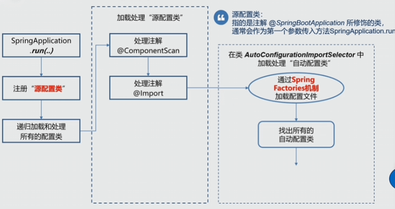

# SpringBoot | SpringCloud

#### 什么是SpringBoot，介绍一下！⭐️

Spring Boot 是 Spring 家族中的一个子项目，它极大地简化了 Spring 应用的开发和部署过程。

以前我们用 Spring 开发项目的时候，需要配置一大堆 XML 文件，包括 Bean 的定义、数据源配置、事务配置等等，非常繁琐。而且还要手动管理各种 jar 包的依赖关系，很容易出现版本冲突的问题。部署的时候还要单独搭建 Tomcat 服务器，整个过程很复杂。Spring Boot 就是为了解决这些痛点而生的。

“约定大于配置”是 Spring Boot 最核心的理念。它预设了很多默认配置，比如默认使用内嵌的 Tomcat 服务器，默认的日志框架是 Logback，默认的http消息转换器底层现实是 jackson...。

其次，自动配置也是 SpringBoot 的核心功能，SpringBoot 会根据所有注册的自动配置类去注册一系列 Bean。

Spring Boot 还提供了很多开箱即用的功能，比如 Actuator 监控、DevTools 开发工具、Spring Boot Starter 等等。Actuator 可以让我们轻松监控应用的健康状态、性能指标等；DevTools 可以加快开发效率，比如自动重启、热部署等；Spring Boot Starter 则是一些预配置好的依赖集合，让我们可以快速引入某些常用的功能。


devTools：简单来说，**Spring Boot DevTools** 是一组专门为开发者提供的本地开发辅助工具。它的核心目标只有两个字：**效率**。

#### SpringBoot 常用注解以及含义？

**`@SpringBootApplication`**：它实际上是一个复合注解，包含了：`@SpringBootConfiguration`、`@EnableAutoConfiguration`、`@ComponentScan`。其中，它标志着一个 Spring Boot 应用的入口。

`@SpringBootTest`：用于测试 Spring Boot 应用的注解，它会加载整个 Spring 上下文，适合集成测试。

**`@Conditional` 系列**：该系列注解能够实现只有在满足某些条件下，才去将当前类注册到 ioc 容器中。

`@ConfigurationProperties`：将配置文件（yml/properties）中的属性批量绑定到 Java Bean 的属性上。

#### SpringBoot 的自动装配是什么呢？⭐️

在我看来，“SpringBoot 的自动装配（Auto-Configuration）就是一种‘按需自动注 Bean’的机制。

自动配置允许 Spring 根据我们项目中引入的 **依赖（Starter）** 以及 **配置文件** 的内容，自动将原本需要手动配置的 Bean（比如数据源、事务管理器、第三方库的客户端等）注册到 IoC 容器中。

当我们在项目中引入了 `spring-boot-starter-jdbc` 时，SpringBoot 就会触发与其关联的自动配置类。它会自动帮我们注册好 `DataSource`、`JdbcTemplate` 以及事务管理器等核心组件，而不需要我们再像以前那样手写繁琐的 XML 或者 Java 配置类。

#### SpringBoot 的自动配置原理⭐️⭐️⭐️

自动装配的开关藏在启动类的 `@SpringBootApplication` 注解中。它其实是一个复合注解，其核心是 **`@EnableAutoConfiguration`**。这个注解才是开启自动装配的“总闸”。


- **`AutoConfigurationImportSelector`**：这是 Spring Boot 自动装配的“搬运工”。它实现了 `ImportSelector` 接口，负责去寻找需要加载的类。    
- **`org.springframework.boot.autoconfigure.AutoConfiguration.imports`**：这是自动装配的“名单表”（Spring Boot 2.7+ 之后取代了老的 `spring.factories`）。

1. SpringBoot 通过 @EnableAutoConfuguration 开启了自动配置的功能
2. `@EnableAutoConfuguration` 本质上就是一个简单的配置类，它的作用就是通过 `@Import` 导入了一个 `ImportSelector` 接口的实现类：`AutoConfigurationImportSelector` ，从而来完自动配置的。
3. 而 `AutoConfigurationImportSelector` 才是自动配置的核心，它通过调用 selectImports 方法，去获取当前符合条件的所有自动配置类的全限定名，然后通过反射实例化出来交给 IOC 去管理。

#### AutoConfigurationImportSelector

<p align='center'>
    
</p>

``` java
public class AutoConfigurationImportSelector implements DeferredImportSelector, BeanClassLoaderAware, ResourceLoaderAware, BeanFactoryAware, EnvironmentAware, Ordered {

}

public interface DeferredImportSelector extends ImportSelector {

}

public interface ImportSelector {
    String[] selectImports(AnnotationMetadata var1);
}
```

``` java
private static final String[] NO_IMPORTS = new String[0];

public String[] selectImports(AnnotationMetadata annotationMetadata) {
        // <1>.判断自动装配开关是否打开
        if (!this.isEnabled(annotationMetadata)) {
            return NO_IMPORTS;
        } else {
          //<2>.获取所有需要装配的bean
            AutoConfigurationMetadata autoConfigurationMetadata = AutoConfigurationMetadataLoader.loadMetadata(this.beanClassLoader);
            AutoConfigurationImportSelector.AutoConfigurationEntry autoConfigurationEntry = this.getAutoConfigurationEntry(autoConfigurationMetadata, annotationMetadata);
            return StringUtils.toStringArray(autoConfigurationEntry.getConfigurations());
        }
    }
```


#### 如何自定义一个 Starter⭐️

创建一个 MAVEN 项目：新建一个项目，通常命名规范为 `xxx-spring-boot-starter`。引入 Spring Boot 自动配置的核心依赖：

```
<dependency>  
    <groupId>org.springframework.boot</groupId>  
    <artifactId>spring-boot-autoconfigure</artifactId>  
</dependency>
```

编写配置类

``` java
/*  
 * @author liutianba7  
 * @create 2026/1/19 10:07  
*/
 
@Configuration  
@EnableConfigurationProperties(HelloProperties.class)  
public class HelloConfiguration {  
  
    @Bean  
    @ConditionalOnMissingBean(HelloService.class)  
    public HelloService helloService(HelloProperties helloProperties){  
        return new HelloService(helloProperties.getName());  
    }  
}
```

去将配置类写到：META-INF/spring 下面的：org.springframework.boot.autoconfigure.AutoConfiguration.imports

之后，其他 maven 项目就可以导入改场景启动器，然后基于自动配置机制自动将 imports 文件下写的配置类注册到 ioc 容器中


#### SpringBoot 应用启动流程精简版

1. 创建 IOC 容器
2. 加载源配置类（主类）
3. 加载并处理所有被 @Component 及其派生注解标注的类
4. 实例化所有的单例 Bean 对象 
5. 如果是 web 应该，还有启动一个 web 服务器

<p align='center'>
    
</p>

#### SPI 机制⭐️

<p align='center'>
    
</p>

**SPI（Service Provider Interface）** 本质上是一种**服务发现机制**。它的核心逻辑是：**“只定义接口，不硬编码实现类，具体实现类由外部配置文件指定。”**

#### Spring Factories⭐️

**“Spring 版的 SPI 机制”**。Spring 借鉴了 Java 原生 SPI 的思想，设计了 `SpringFactoriesLoader`。它允许第三方组件（比如 Redis、MyBatis 的 Starter）在不修改 Spring 源码的情况下，把自己注册进 Spring 容器。

在 Spring Boot 2.7 以前，这是最关键的文件。它位于 Jar 包的 **`META-INF/` 目录下**，文件名叫做 **`spring.factories`**。

从 Spring Boot 2.7 开始，官方**不再推荐**将自动配置类写在 `spring.factories` 里，而是引入了新的文件：`META-INF/spring/org.springframework.boot.autoconfigure.AutoConfiguration.imports`。


#### spring Factories 的流程

**扫描**：当 Spring 容器启动时，会调用 `SpringFactoriesLoader.loadFactoryNames()` 方法。

**定位**：它会遍历类路径下所有 Jar 包，寻找 `META-INF/spring.factories` 文件。

**读取**：将文件中定义的实现类全路径读取出来。

**实例化**：通过反射机制，将这些类实例化并交给 Spring 管理。

#### SpringBoot 的配置文件有哪些？⭐️

配置文件有 `properties`， `yaml` / `yml`。如果同一个目录下同时存在 `application.properties` 和 `application.yml`，**properties 的优先级更高**，它会覆盖 yml 中的同名配置。

在 Spring Boot 中，`application` 是应用级别的主配置，负责绝大多数业务设置。由 `Application Context` 加载，是 Spring Boot 应用的主配置入口。

而 `bootstrap` 则是一个特殊的引导配置，主要出现在 Spring Cloud 微服务架构中。它是由 `Parent Context`（父上下文）加载的，早于 `application` 配置。核心作用是让应用在启动初期去连接配置中心。

**不过需要注意的是**，Spring Boot 自 2.4 版本后重构了配置加载机制，现在官方更倾向于在 `application` 中使用 `spring.config.import` 来替代传统的 `bootstrap` 模式。如果要在新版继续使用 `bootstrap`，需要额外引入 `spring-cloud-starter-bootstrap` 依赖。”


#### SpringBoot 如何实现多环境配置？⭐️

Spring Boot 主要是通过 **Profile（环境切面）** 来实现的。

在 `src/main/resources` 下创建多个配置文件，命名规则为 `application-{profile}.yml`：
- **`application-dev.yml`**：开发环境（连接本地数据库，开启 Debug 日志）。
- **`application-test.yml`**：测试环境（连接 H2 数据库或测试服务器）。
- **`application-prod.yml`**：生产环境（连接生产库，开启安全校验）。
- **`application.yml`**：主配置文件（存放通用的、不随环境变化的配置）。

之后，我们只需要激活指定的环境即可！

1）在 `application.yml` 中设置 `spring.profiles.active=dev`。
2）启动 Jar 包时手动指定：`java -jar app.jar --spring.profiles.active=prod`。
3）JVM参数：`java -Dspring.profiles.active=prod -jar app.jar`。
4）设置系统变量 `SPRING_PROFILES_ACTIVE=prod`。

#### SpringBoot 的配置优先级⭐️

**规律一：特定环境 > 通用环境** `application-dev.yml` 的优先级永远高于 `application.yml`。
**规律二：外部文件 > 内部文件** 运维在 Jar 包外临时放的配置，会覆盖开发在 `src/main/resources` 里写的配置。
**规律三：配置互补** 优先级高低并不代表“只加载一个”。Spring Boot 会加载所有位置的配置并进行**合并**。只有当 Key 冲突时，高优先级的才会覆盖低优先级的。


#### 什么是SpringCloud

“Spring Cloud 是基于 Spring Boot 实现的一套**微服务架构的一站式解决方案**。它并不是重新发明轮子，而是通过封装一系列成熟的开源中间件，实现了分布式系统开发中的**服务注册于发现、配置管理、远程调用与负载均衡、熔断、降级与限流** 等一系列功能

- **服务注册与发现**：早期的 **Eureka**，现在的 **Nacos** 或 **Consul**。解决“怎么找到服务”的问题。
- **服务网关（Gateway）**：**Spring Cloud Gateway** 或 **Zuul**。解决“统一入口、权限校验”的问题。
- **配置中心**：**Nacos Config**、**Apollo** 或 **Spring Cloud Config**。解决“配置动态刷新、统一管理”的问题。    
- **远程调用与负载均衡**：**OpenFeign** 和 **LoadBalancer**。解决“像调本地方法一样调远程服务”的问题。
- **熔断、降级与限流**：**Sentinel**（推荐）或 **Hystrix**。解决“防止系统雪崩、高可用保障”的问题。


#### 什么是微服务架构 ⭐️

微服务就是把一个大的、复杂的单体应用，按照业务拆成一个个功能独立的小服务，每个服务维护自己的数据和逻辑，服务之间通过轻量级的通信机制（比如 gRPC）来协作。

**单体架构**：像是一个“全能巨人”。所有功能（订单、用户、库存）都在一个代码库里，共享一个数据库。代码量巨大后，编译、启动慢；一个小 Bug 崩了，全站瘫痪。

**微服务架构**：每个服务有自己的数据库（Data Sovereignty），比如订单服务用 MySQL，推荐服务用 MongoDB。并且每个微服务可以选择不同的技术栈：有的服务用 Java 稳健，有的用 Python 处理算法。

#### 微服务架构带来的问题

分布式数据一致性：以前单体应用一个 `@Transactional` 搞定，现在订单和库存是两个服务，数据一致性怎么保？（引出 Seata、TCC 等方案）。

**提升了运维复杂度**：几十个服务，怎么部署？怎么监控？（引出 K8s、Docker、Prometheus）。

网络开销：服务之间通过网络调用，会有延迟、超时和重试的问题。

#### Spring Task 是什么？

Spring Task 是 Spring 自带的轻量级任务调度工具，它可以让你在指定的时间点或者按照特定的周期执行一段代码（比如每天凌晨 3 点备份数据库、每隔 10 分钟清理一次临时文件）。

- **开启功能**：在配置类或启动类上加上 `@EnableScheduling`。
- **编写任务**：在方法上加上 `@Scheduled` 注解。

``` java
@Component
public class MyTask {
    // 每隔 5 秒执行一次
    @Scheduled(fixedRate = 5000)
    public void runTask() {
        System.out.println("执行任务...");
    }

    // 使用 Cron 表达式：每天凌晨 1 点执行
    @Scheduled(cron = "0 0 1 * * ?")
    public void cronTask() { ... }
}
```

- **单线程陷阱**：Spring Task 默认是**单线程**执行的。如果多个任务同时到点，它们会排队。在高并发场景下，需要配置 `TaskScheduler` 线程池。
  
- **不支持分布式**：Spring Task 的任务是跑在 JVM 进程里的。如果你的服务部署了 3 台机器，任务会在 3 台机器上**重复执行**。

#### Spring Cache 是什么？

好吧, 通常也不用它, 因为它自动生成的 key 不行, 我们还是自己写缓存机制, 也就是 AOP + @Redis(注解)

**1. 定义**：
Spring Cache 是 Spring 提供的缓存抽象，支持多种缓存实现（Redis, Caffeine, Ehcache）。

**2. 核心原理**：
基于 **AOP** 动态代理。通过拦截方法调用，实现缓存逻辑与业务逻辑的分离。

**3. 常用注解**：

- `@Cacheable`：查询时使用，实现“能用缓存就用缓存”。
- `@CacheEvict`：删除时使用，保证数据一致性（删完数据删缓存）。


**4. 指定缓存实现**：

```
spring:
  cache:
    type: redis  # 可选：redis, caffeine, ehcache, hazelcast, generic, none
```

Spring Boot 遵循 **“约定大于配置”**。它会按照以下顺序探测并激活缓存实现：

**Generic**：如果你手动定义了 `Cache` 类型的 Bean。

**Redis**：如果你的 `pom.xml` 里有 `spring-boot-starter-data-redis`。

**Caffeine**：如果有 `com.github.ben-manes.caffeine`。

**Simple**：如果什么都没有，默认用内存里的 `ConcurrentHashMap`。
