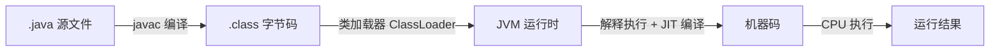

# Java 基础

> Java 核心技术基础篇，涵盖语法、OOP、核心类库、集合、泛型、异常、反射、IO、Lambda 等核心知识点，适合系统学习与快速复习。

---

## 目录

- [一、Java 语言概述](#sec1)
    - [1.1 Java 发展简史](#sec1-1)
    - [1.2 Java 核心特性](#sec1-2)
    - [1.3 JDK / JRE / JVM](#sec1-3)
    - [1.4 Java 程序运行机制](#sec1-4)
    - [1.5 跨平台原理](#sec1-5)
- [二、基本语法](#sec2)
    - [2.1 数据类型](#sec2-1)
    - [2.2 自动装箱与拆箱](#sec2-2)
    - [2.3 关键字深度解析](#sec2-3)
    - [2.4 流程控制](#sec2-4)
- [三、面向对象编程（OOP）](#sec3)
    - [3.1 三大特性](#sec3-1)
    - [3.2 类与对象、初始化顺序](#sec3-2)
    - [3.3 抽象类 vs 接口](#sec3-3)
    - [3.4 内部类](#sec3-4)
    - [3.5 访问权限控制](#sec3-5)
- [四、核心类库深度解析](#sec4)
    - [4.1 Object 类](#sec4-1)
    - [4.2 String 类](#sec4-2)
    - [4.3 String / StringBuilder / StringBuffer 对比](#sec4-3)
    - [4.4 枚举（Enum）](#sec4-4)
    - [4.5 BigDecimal](#sec4-5)
- [五、集合框架](#sec5)
    - [5.1 Collection 体系总览](#sec5-1)
    - [5.2 Map 体系总览](#sec5-2)
    - [5.3 List 实现选择](#sec5-3)
    - [5.4 Queue & Deque 实践](#sec5-4)
    - [5.5 Set 实现选择](#sec5-5)
    - [5.6 Map 实现选择](#sec5-6)
    - [5.7 Comparable vs Comparator](#sec5-7)
    - [5.8 Collections 工具类](#sec5-8)
- [六、泛型](#sec6)
    - [6.1 泛型类 / 接口 / 方法](#sec6-1)
    - [6.2 类型擦除](#sec6-2)
    - [6.3 通配符与 PECS 原则](#sec6-3)
    - [6.4 泛型数组的限制](#sec6-4)
- [七、异常机制](#sec7)
    - [7.1 异常体系结构](#sec7-1)
    - [7.2 受检异常 vs 非受检异常](#sec7-2)
    - [7.3 try-catch-finally 与 try-with-resources](#sec7-3)
    - [7.4 自定义异常](#sec7-4)
- [八、注解与反射](#sec8)
    - [8.1 注解](#sec8-1)
    - [8.2 反射核心 API](#sec8-2)
    - [8.3 动态代理](#sec8-3)
- [九、I/O 系统](#sec9)
    - [9.1 IO 分类体系](#sec9-1)
    - [9.2 核心流详解](#sec9-2)
    - [9.3 对象序列化](#sec9-3)
    - [9.4 NIO 简述](#sec9-4)
- [十、Lambda 与 Stream](#sec10)
    - [10.1 函数式接口](#sec10-1)
    - [10.2 Lambda 表达式](#sec10-2)
    - [10.3 方法引用](#sec10-3)
    - [10.4 Stream API](#sec10-4)
    - [10.5 Optional 类](#sec10-5)
- [十一、Java 新特性纵览](#sec11)
    - [11.1 Java 8](#sec11-1)
    - [11.2 Java 9 ~ 11](#sec11-2)
    - [11.3 Java 14 ~ 17 LTS](#sec11-3)
    - [11.4 Java 21 LTS](#sec11-4)

---

> 开始阅读：从 [第一章：Java 语言概述](#sec1) 开始系统学习，或点击目录跳转到任意章节。

---

## 一、Java 语言概述 {#sec1}

### 1.1 Java 发展简史 {#sec1-1}

Java 由 **James Gosling** 在 **Sun Microsystems** 主导设计，最初命名为 **Oak**，1995 年正式以 **Java** 名称发布。Java 的发展历程中几个关键里程碑：

| 版本 | 发布日期 | 里程碑特性 |
|------|----------|-----------|
| **Java 8 (LTS)** | 2014.03 | Lambda 表达式、Stream API、Optional、新的日期时间 API |
| **Java 11 (LTS)** | 2018.09 | HTTP Client 标准化、模块化（JPMS）、`var` 局部变量类型推断 |
| **Java 17 (LTS)** | 2021.09 | Sealed Class、Pattern Matching for `instanceof`、Switch 表达式 |
| **Java 21 (LTS)** | 2023.09 | 虚拟线程（Virtual Threads）、Record Pattern、Pattern Matching for Switch |
| **Java 25 (LTS)** | 2025.09 | 当前最新 LTS 版本 |

!!! tip "版本策略"

    Oracle 自 Java 9 起采用 **6 个月快速发布** 节奏，**每 2 年发布一个 LTS 版本**。当前 LTS 为 JDK 25，下一个 LTS 预计为 JDK 29（2027.09）。

    **生产环境建议使用 LTS 版本**，目前主流仍为 JDK 8 / JDK 11 / JDK 17 / JDK 21。

> **参考链接**：

> - [Java SE Support Roadmap (Oracle)](https://www.oracle.com/java/technologies/java-se-support-roadmap.html)
> - [OpenJDK 官方主页](https://openjdk.org/)
> - [Java Language Specifications (JLS)](https://docs.oracle.com/javase/specs/)
> - [Java Version History (Wikipedia)](https://en.wikipedia.org/wiki/Java_version_history)

---

### 1.2 Java 核心特性 {#sec1-2}

Java 能够二十余年占据编程语言前列，得益于以下核心特性：

!!! note "Java 的六大核心特性"

    1. **跨平台性（Write Once, Run Anywhere）** —— 编译生成字节码，由 JVM 解释执行
    2. **面向对象** —— 封装、继承、多态，纯 OOP 语言（除基本类型外一切皆对象）
    3. **自动内存管理** —— GC（垃圾回收）自动回收不再使用的对象内存
    4. **多线程支持** —— 内置 `Thread` 模型，Java 21 引入虚拟线程
    5. **安全性** —— 无指针运算、字节码校验、沙箱机制
    6. **丰富的生态** —— 庞大的开源社区（Spring、Maven、Guava 等）

---

### 1.3 JDK / JRE / JVM {#sec1-3}

三者是 Java 平台的基石，理解它们的区别至关重要：

| 组件 | 全称 | 包含关系 | 作用 |
|------|------|----------|------|
| **JVM** | Java Virtual Machine | 最内层 | 执行字节码，提供运行时环境 |
| **JRE** | Java Runtime Environment | 包含 JVM + 核心类库 | 运行 Java 程序所需的最小环境 |
| **JDK** | Java Development Kit | 包含 JRE + 开发工具 | 开发 Java 程序所需的完整工具集 |

```
┌───────────────────────────┐
│          JDK              │
│  ┌─────────────────────┐  │
│  │        JRE          │  │
│  │  ┌───────────────┐  │  │
│  │  │     JVM       │  │  │
│  │  └───────────────┘  │  │
│  │  核心类库 + 配置     │  │
│  └─────────────────────┘  │
│  javac / jar / javadoc 等  │
└───────────────────────────┘
```

!!! warning "关键点"

    - **JDK = JRE + 开发工具**（javac、jar、javadoc 等）
    - **JRE = JVM + 核心类库**
    - 运行 Java 程序只需要 JRE，但开发必须安装 JDK
    - Java 9 后引入了**模块化系统（JPMS）**，JDK 本身也被拆分为模块

> **参考链接**：

> - [JDK 官方文档 (Oracle)](https://docs.oracle.com/en/java/javase/)
> - [JVM 规范 (JVMS)](https://docs.oracle.com/javase/specs/jvms/se25/html/)

---

### 1.4 Java 程序运行机制 {#sec1-4}

一个 Java 程序从源码到执行，经历以下阶段：



#### 核心步骤解析

1. **编译（javac）**：将 `.java` 源文件编译为平台无关的 `.class` 字节码文件
2. **类加载（ClassLoader）**：JVM 启动时通过类加载器将 `.class` 文件加载到内存
3. **字节码验证**：校验字节码格式和安全性，防止恶意代码破坏 JVM
4. **执行引擎**：

   - **解释执行**：逐条翻译字节码为机器码，启动快
   - **JIT（Just-In-Time）编译**：热点代码编译为本地机器码，提升执行效率
   - **AOT（Ahead-Of-Time）编译**：Java 9+ 支持，提前编译为本地代码

!!! tip "Java 是编译型还是解释型？"

    Java 是 **"先编译后解释"** 的语言：源码先编译成字节码（编译型特征），再由 JVM 解释执行（解释型特征）。同时通过 **JIT 编译器** 在运行时对热点代码进行编译优化，兼具跨平台与高性能。

> **参考链接**：

> - [JVM 规范 - 执行引擎 (JVMS Ch.3)](https://docs.oracle.com/javase/specs/jvms/se25/html/jvms-3.html)
> - [JIT 编译器 (Oracle Docs)](https://docs.oracle.com/en/java/javase/17/vm/just-time-compiler.html)

---

### 1.5 跨平台原理 {#sec1-5}

Java 实现 **"Write Once, Run Anywhere"** 的核心在于 **JVM 屏障**：

=== "跨平台原理示意"

    ```
    源码 → 字节码（.class）→ 各平台 JVM → 各 OS
                                ├── Windows JVM → Windows
                                ├── Linux   JVM → Linux
                                └── macOS   JVM → macOS
    ```

    **关键点**：字节码是平台无关的，但 JVM 是平台相关的。不同操作系统需要安装对应版本的 JVM。

=== "不同平台对比"

    | 操作系统 | JVM 实现 | 差异点 |
    |----------|----------|--------|
    | Windows | Oracle JDK / OpenJDK | 路径分隔符 `\`，换行符 `\r\n` |
    | Linux   | OpenJDK 为主流       | 路径分隔符 `/`，换行符 `\n` |
    | macOS   | Oracle JDK / OpenJDK | 与 Linux 大部分一致 |

!!! example "一次编译，到处运行"

    ```java
    // 在任意平台编译生成 Hello.class
    public class Hello {
        public static void main(String[] args) {
            System.out.println("Hello Java!");
        }
    }
    // 将 Hello.class 复制到任何安装了 JVM 的平台均可运行
    // java Hello  → 输出: Hello Java!
    ```

> **参考链接**：


> - [Java Platform Independence (Oracle Docs)](https://docs.oracle.com/javase/tutorial/getStarted/intro/definition.html)
> - [JVM 规范 - 数据结构 (JVMS Ch.2)](https://docs.oracle.com/javase/specs/jvms/se25/html/jvms-2.html)

---

> **📚 本章参考汇总**
>
> - [Java SE Specifications (JLS + JVMS)](https://docs.oracle.com/javase/specs/)
> - [OpenJDK](https://openjdk.org/)
> - [Oracle Java SE Support Roadmap](https://www.oracle.com/java/technologies/java-se-support-roadmap.html)
> - [Java Tutorials (Oracle)](https://docs.oracle.com/javase/tutorial/)

---

## 二、基本语法 {#sec2}

### 2.1 数据类型 {#sec2-1}

Java 的数据类型分为两大类：**基本类型**（Primitive Types）和 **引用类型**（Reference Types）。

#### 2.1.1 八种基本类型

| 类型 | 关键字 | 占用空间 | 默认值 | 取值范围 |
|------|--------|---------|--------|---------|
| 字节型 | `byte` | 8 bit（1B） | `0` | `[-128, 127]` |
| 短整型 | `short` | 16 bit（2B） | `0` | `[-2^15, 2^15-1]` |
| 整型 | `int` | 32 bit（4B） | `0` | `[-2^31, 2^31-1]` |
| 长整型 | `long` | 64 bit（8B） | `0L` | `[-2^63, 2^63-1]` |
| 单精度浮点 | `float` | 32 bit（4B） | `0.0f` | ±3.4E-38 ~ ±3.4E+38 |
| 双精度浮点 | `double` | 64 bit（8B） | `0.0d` | ±1.7E-308 ~ ±1.7E+308 |
| 字符型 | `char` | 16 bit（2B） | `'\u0000'` | `[0, 65535]`（无符号） |
| 布尔型 | `boolean` | JVM 规范未明确定义 | `false` | `true` / `false` |

!!! warning "几个容易忽略的细节"

    - `long` 类型赋值须加后缀 `L`（如 `100L`），否则会被当作 `int`
    - `float` 类型赋值须加后缀 `f`（如 `3.14f`），否则小数默认是 `double`
    - `boolean` 在 JVM 中通常被编译为 `int`（`true=1`，`false=0`），但在逻辑上只有两个值
    - `char` 在 Java 中是 **无符号** 16 位 Unicode 字符，可参与算术运算

#### 2.1.2 引用类型

引用类型指向一个对象实例，包括：**类**、**接口**、**数组**、**枚举**。引用类型的变量存储的是对象的内存地址（而非对象本身）。

=== "基本类型 vs 引用类型"

    | 对比维度 | 基本类型 | 引用类型 |
    |----------|---------|---------|
    | 存储位置 | 栈内存（局部变量）或堆内存（成员变量） | 堆内存 |
    | 传递方式 | 值传递（拷贝值） | 值传递（拷贝引用地址） |
    | 默认值 | 有固定默认值（如 `0`、`false`） | `null` |
    | 能否调用方法 | 不能 | 能 |

=== "代码示例"

    ```java
    int a = 10;          // 基本类型：栈上直接存值
    String s = "hello";  // 引用类型：栈存地址，堆存对象内容

    // 值传递演示
    int x = 10;
    int y = x;   // 拷贝值
    y = 20;      // x 仍为 10

    User u1 = new User("Alice");
    User u2 = u1;        // 拷贝引用地址
    u2.setName("Bob");   // u1 的 name 也会变为 "Bob"（指向同一对象）
    ```

#### 2.1.3 类型转换

=== "自动类型转换（隐式）"

    ```java
    // 小范围 → 大范围：自动提升
    byte b = 10;
    int i = b;      // byte → int 自动转换
    long l = i;     // int → long 自动转换
    double d = l;   // long → double 自动转换

    // 算术运算中的自动提升
    short s1 = 10, s2 = 20;
    // short s3 = s1 + s2;  // ❌ 编译错误！s1 + s2 结果是 int
    int s3 = s1 + s2;       // ✅
    ```

=== "强制类型转换（显式）"

    ```java
    // 大范围 → 小范围：必须显式强转，可能丢失精度
    double d = 3.14159;
    int i = (int) d;       // i = 3（精度丢失）

    int big = 300;
    byte b = (byte) big;   // b = 44（溢出截断）
    ```

---

### 2.2 自动装箱与拆箱 {#sec2-2}

Java 为每种基本类型提供了对应的 **包装类**（Wrapper Classes），并支持自动装箱与拆箱。

#### 2.2.1 包装类对应关系

| 基本类型 | 包装类 | 基本类型 | 包装类 |
|----------|--------|----------|--------|
| `byte` | `Byte` | `short` | `Short` |
| `int` | `Integer` | `long` | `Long` |
| `float` | `Float` | `double` | `Double` |
| `char` | `Character` | `boolean` | `Boolean` |

#### 2.2.2 装箱与拆箱原理

```java
// 自动装箱：int → Integer，实际调用 Integer.valueOf(int)
Integer n = 42;

// 自动拆箱：Integer → int，实际调用 Integer.intValue()
int m = n;

// 等价于手动操作：
Integer n2 = Integer.valueOf(42);
int m2 = n2.intValue();
```

!!! tip "javap 反编译验证"

    可以通过 `javap -c` 查看字节码，证实装箱调用 `valueOf()`，拆箱调用 `xxxValue()`。

#### 2.2.3 缓存池陷阱

Java 对部分包装类提供了 **缓存机制**，常见陷阱如下：

```java
Integer a = 127;
Integer b = 127;
System.out.println(a == b);  // true（使用了缓存）

Integer c = 128;
Integer d = 128;
System.out.println(c == d);  // false（超出缓存范围，创建了新对象）

// 正确比较方式：使用 equals()
System.out.println(c.equals(d));  // true
```

!!! note "缓存范围"

    - **Integer**：默认 `[-128, 127]`，上限可通过 JVM 参数 `-XX:AutoBoxCacheMax=<size>` 调整
    - **Long**：`[-128, 127]`（不可调整）
    - **Short / Byte / Character**：各自类型的整个无符号范围
    - **Float / Double**：**没有**缓存

#### 2.2.4 空指针陷阱

```java
Integer n = null;
int m = n;  // ❌ NullPointerException！自动拆箱时调用 n.intValue()
```

!!! warning "开发建议"

    - 包装类型参与算术运算或赋值给基本类型时，务必判空
    - **POJO 类属性建议使用包装类**（默认值为 `null`，便于区分"未赋值"和"值为0"）
    - 性能敏感场景下优先使用基本类型，避免频繁装箱拆箱

---

### 2.3 关键字深度解析 {#sec2-3}

#### 2.3.1 `final`

`final` 的含义是 **"不可变"**，具体语义取决于修饰的目标：

| 修饰目标 | 含义 | 示例 |
|----------|------|------|
| **变量** | 值不可被重新赋值（对于引用类型，引用不可变，但对象内部可变） | `final int MAX = 100;` |
| **方法** | 方法不可被子类重写（Override） | `public final void doSomething() {}` |
| **类** | 类不可被继承（如 `String`、`Integer`） | `public final class String {}` |

```java
final int[] arr = {1, 2, 3};
arr[0] = 10;     // ✅ 数组元素可变
// arr = new int[]{4, 5, 6};  // ❌ 引用不可重新赋值

final User user = new User("Alice");
user.setName("Bob");   // ✅ 对象内部状态可变
// user = new User("Charlie");  // ❌ 引用不可变
```

#### 2.3.2 `static`

`static` 表示 **类级别** 的成员，属于类而非实例：

| 修饰目标 | 含义 | 访问方式 |
|----------|------|---------|
| **变量** | 类变量，所有实例共享同一份内存 | `类名.变量名` |
| **方法** | 类方法，不能访问非 `static` 成员 | `类名.方法名()` |
| **代码块** | 类加载时执行一次，常用于初始化静态资源 | 类加载自动触发 |
| **内部类** | 静态内部类，不持有外部类引用 | `new Outer.Inner()` |

```java
public class Counter {
    static int count = 0;       // 类变量
    int instanceCount = 0;      // 实例变量

    static {
        System.out.println("类加载时执行一次");
    }

    static void reset() {       // 类方法
        count = 0;
        // instanceCount = 0;   // ❌ 静态方法不能直接访问非静态成员
    }
}
```

!!! tip "static 的常见用途"

    - 工具类方法（如 `Math.max()`、`Collections.sort()`）
    - 常量定义（`public static final`）
    - 单例模式
    - 静态工厂方法

#### 2.3.3 `transient`

`transient` 用于修饰成员变量，表示该变量 **不参与序列化**。

```java
public class User implements Serializable {
    private String name;
    private transient String password;  // 序列化时忽略 password
    private static int version;         // 静态变量也不参与序列化
}
```

#### 2.3.4 `volatile`

`volatile` 保证变量的 **可见性**，禁止指令重排序。详细内容参见 [[juc#volatile 关键字]]。

---

### 2.4 流程控制 {#sec2-4}

#### 2.4.1 条件语句：if-else

```java
if (score >= 90) {
    grade = "A";
} else if (score >= 80) {
    grade = "B";
} else {
    grade = "C";
}
```

#### 2.4.2 Switch 语句

从 Java 14 起正式支持 **Switch 表达式**，代码更简洁、更安全。

=== "传统 Switch 语句"

    ```java
    // 传统写法：容易遗漏 break，导致穿透
    String result;
    switch (day) {
        case MONDAY:
        case FRIDAY:
            result = "Work day";
            break;
        case SATURDAY:
        case SUNDAY:
            result = "Weekend";
            break;
        default:
            result = "Midweek";
    }
    ```

=== "Switch 表达式（Java 14+）"

    ```java
    // ✅ 箭头语法：无需 break，自动返回
    String result = switch (day) {
        case MONDAY, FRIDAY -> "Work day";
        case SATURDAY, SUNDAY -> "Weekend";
        default -> "Midweek";
    };

    // 或使用 yield 返回复杂逻辑
    String result = switch (day) {
        case MONDAY, FRIDAY -> "Work day";
        case SATURDAY, SUNDAY -> "Weekend";
        default -> {
            int hours = getHours(day);
            yield "Midweek, work " + hours + " hours";
        }
    };
    ```

!!! tip "Switch 表达式 vs 传统 Switch"

    - 箭头 `->` 无需 `break`，`:` 需要 `break` 防止穿透
    - Switch 表达式可直接赋值给变量
    - 多值匹配：`case MONDAY, FRIDAY ->`
    - `yield` 关键字用于在代码块中返回结果

#### 2.4.3 循环语句

=== "for-each（增强型 for）"

    ```java
    // 遍历数组 / Iterable
    List<String> list = List.of("A", "B", "C");
    for (String s : list) {
        System.out.println(s);
    }

    int[] arr = {1, 2, 3};
    for (int n : arr) {
        System.out.println(n);
    }
    ```

=== "传统 for / while"

    ```java
    // for 循环
    for (int i = 0; i < 10; i++) {
        System.out.println(i);
    }

    // while 循环
    int i = 0;
    while (i < 10) {
        System.out.println(i++);
    }

    // do-while（至少执行一次）
    int j = 0;
    do {
        System.out.println(j);
    } while (j > 0);
    ```
---

## 三、面向对象编程（OOP） {#sec3}

### 3.1 三大特性 {#sec3-1}

面向对象编程的三大核心特性是 **封装、继承、多态**。

#### 封装（Encapsulation）

将数据和操作数据的方法绑定在一起，对外隐藏内部实现细节，仅暴露有限的访问接口。

```java
public class BankAccount {
    private double balance;  // 私有成员，外部不能直接访问

    public double getBalance() { return balance; }

    public void deposit(double amount) {
        if (amount > 0) balance += amount;
    }

    public void withdraw(double amount) {
        if (amount > 0 && amount <= balance) balance -= amount;
    }
}
```

!!! tip "封装的好处"

    - 控制访问权限，保护数据不被滥用
    - 降低耦合，修改内部实现不影响外部调用者
    - 提高代码的可维护性和安全性

#### 继承（Inheritance）

子类继承父类的成员变量和方法，实现代码复用，并可通过重写（Override）扩展行为。

```java
public class Animal {
    protected String name;
    public void eat() { System.out.println(name + " is eating"); }
}

public class Dog extends Animal {
    public void bark() { System.out.println(name + " is barking"); }
}
// 使用：Dog d = new Dog(); d.eat(); d.bark();
```

!!! warning "Java 继承的规则"

    - Java 是 **单继承**（一个类只能有一个直接父类）→ 通过 **接口** 实现多继承的效果
    - 所有类隐式继承 `Object`（除 `Object` 本身）
    - `final` 类不能被继承（如 `String`）
    - 子类构造器必须调用父类构造器（隐式调用 `super()` 或显式调用 `super(args)`）

#### 多态（Polymorphism）

同一操作作用于不同对象，产生不同的执行结果。多态的三个必要条件：**继承、重写、父类引用指向子类对象**。

```java
Animal a = new Dog();   // 父类引用指向子类对象
a.eat();                // 调用的是 Dog 的 eat() 方法（动态绑定）
// a.bark();            // ❌ 编译期只能调用父类声明的方法
```

##### 重载（Overload） vs 重写（Override）

| 对比维度 | 重载（Overload） | 重写（Override） |
|----------|-----------------|-----------------|
| 发生位置 | 同一个类中 | 子类与父类之间 |
| 方法名 | 相同 | 相同 |
| 参数列表 | **必须不同** | **必须相同** |
| 返回类型 | 可以不同 | 相同或是协变返回类型 |
| 访问修饰符 | 可以不同 | 不能比父类更严格 |
| 异常 | 可以不同 | 不能抛出比父类更宽泛的异常 |
| 绑定时机 | **编译期**（静态多态） | **运行期**（动态多态） |

```java
// 重载 Overload —— 编译时决定
class Calculator {
    int add(int a, int b) { return a + b; }
    double add(double a, double b) { return a + b; }  // 参数类型不同
}

// 重写 Override —— 运行时决定
class Parent {
    void hello() { System.out.println("Parent"); }
}
class Child extends Parent {
    @Override
    void hello() { System.out.println("Child"); }
}
Parent obj = new Child();
obj.hello();  // 输出: Child（动态绑定）
```

---

### 3.2 类与对象、初始化顺序 {#sec3-2}

#### 类的初始化顺序

一个类从加载到创建实例，经历以下初始化阶段：

```java
public class InitOrderDemo {
    // ① 静态变量
    static int staticVar = 1;
    // ② 静态代码块
    static { System.out.println("静态代码块"); }

    // ③ 实例变量
    int instanceVar = 2;
    // ④ 实例代码块（构造代码块）
    { System.out.println("实例代码块"); }

    // ⑤ 构造方法
    public InitOrderDemo() {
        System.out.println("构造方法");
    }
}
```

!!! note "完整的初始化顺序"

    1. **加载类**（仅一次）：父类静态变量/静态代码块 → 子类静态变量/静态代码块
    2. **创建实例**：父类实例变量/实例代码块 → 父类构造方法 → 子类实例变量/实例代码块 → 子类构造方法

#### 构造方法

```java
public class User {
    private String name;
    private int age;

    // 默认无参构造（如果未定义任何构造器，编译器自动生成）
    public User() {}

    // 有参构造
    public User(String name) {
        this.name = name;
    }

    // 链式调用：this() 调用其他构造器
    public User(String name, int age) {
        this(name);        // 必须放在第一行
        this.age = age;
    }
}
```

---

### 3.3 抽象类 vs 接口 {#sec3-3}

| 对比维度 | 抽象类 | 接口 |
|----------|--------|------|
| 关键字 | `abstract class` | `interface` |
| 是否可以实例化 | ❌ 不能 | ❌ 不能 |
| 构造方法 | ✅ 可以有 | ❌ 不能有 |
| 成员变量 | 任意 | `public static final`（常量） |
| 方法类型 | 抽象方法 + 具体方法 | 抽象方法 + default 方法 + static 方法 + private 方法 |
| 访问修饰符 | 任意 | `public`（Java 9+ 支持 `private`） |
| 继承/实现 | `extends`（单继承） | `implements`（多实现） |
| 设计目的 | 代码复用，表达 **"是什么"** | 定义契约，表达 **"能做什么"** |

=== "抽象类示例"

    ```java
    // 抽象类：表达"是什么"
    public abstract class Shape {
        protected String color;

        public Shape(String color) {
            this.color = color;
        }

        public abstract double area();      // 抽象方法
        public String getColor() {          // 具体方法
            return color;
        }
    }

    public class Circle extends Shape {
        private double radius;
        public Circle(String color, double radius) {
            super(color);
            this.radius = radius;
        }
        @Override
        public double area() {
            return Math.PI * radius * radius;
        }
    }
    ```

=== "接口示例（含 Java 8+ 特性）"

    ```java
    // 接口：表达"能做什么"
    public interface Flyable {
        // 抽象方法
        void fly();

        // Java 8: default 方法（提供默认实现）
        default void takeOff() {
            System.out.println("Taking off...");
        }

        // Java 8: static 方法（工具方法）
        static boolean isBird(String name) {
            return "sparrow".equals(name);
        }

        // Java 9: private 方法（提取公共逻辑）
        private void log(String msg) {
            System.out.println("[Flyable] " + msg);
        }
    }

    public class Bird implements Flyable {
        @Override
        public void fly() {
            System.out.println("Bird is flying");
        }
    }
    ```

!!! tip "接口 vs 抽象类 —— 如何选择？"

    优先用 **接口** 定义行为契约，用 **抽象类** 提取公共状态和代码。Java 8+ 之后接口能力大幅增强，很多以前需要抽象类的场景现在接口也能胜任。

---

### 3.4 内部类 {#sec3-4}

Java 支持四种内部类，各有不同的用途和特性：

| 类型 | 定义位置 | 持有外部类引用 | 能否有静态成员 | 典型用途 |
|------|---------|--------------|--------------|---------|
| **成员内部类** | 类内部 | 是 | 否 | 内部逻辑组件 |
| **静态内部类** | 类内部（`static`） | 否 | 是 | 辅助类如 `HashMap.Node` |
| **局部内部类** | 方法内部 | 是（需 `final`/`effectively final`） | 否 | 方法内临时逻辑 |
| **匿名内部类** | 表达式创建 | 是（需 `final`/`effectively final`） | 否 | 回调、事件监听 |

=== "成员内部类 & 静态内部类"

    ```java
    public class Outer {
        private int x = 10;
        private static int staticX = 20;

        // 成员内部类：持有 Outer.this
        class Inner {
            void show() {
                System.out.println(x);         // 可以访问外部实例变量
                System.out.println(staticX);   // 可以访问外部静态变量
            }
        }

        // 静态内部类：不持有外部引用
        static class StaticInner {
            void show() {
                // System.out.println(x);      // ❌ 不能访问外部实例变量
                System.out.println(staticX);   // 可以访问外部静态变量
            }
        }
    }

    // 创建方式
    Outer outer = new Outer();
    Outer.Inner inner = outer.new Inner();           // 成员内部类
    Outer.StaticInner sinner = new Outer.StaticInner(); // 静态内部类
    ```

=== "局部内部类 & 匿名内部类"

    ```java
    public class Outer {
        private int x = 10;

        public void doSomething() {
            int y = 20;  // effectively final（Java 8+）

            // 局部内部类
            class LocalInner {
                void print() {
                    System.out.println(x);  // 访问外部成员
                    System.out.println(y);  // 访问局部变量（不可修改）
                }
            }
            new LocalInner().print();

            // 匿名内部类
            Runnable task = new Runnable() {
                @Override
                public void run() {
                    System.out.println("Anonymous: " + x);
                }
            };
            new Thread(task).start();
        }
    }
    ```

!!! tip "匿名内部类 vs Lambda"

    匿名内部类可被 **Lambda 表达式** 替代（当实现的接口是函数式接口时），代码更简洁：

    ```java
    // 匿名内部类
    Runnable r1 = new Runnable() {
        @Override public void run() {
            System.out.println("Hello");
        }
    };
    // Lambda
    Runnable r2 = () -> System.out.println("Hello");
    ```

---

### 3.5 访问权限控制 {#sec3-5}

Java 提供四种访问权限修饰符，控制类及成员的可见范围：

| 修饰符 | 同一个类 | 同一个包 | 子类（不同包） | 所有类 |
|--------|---------|---------|---------------|-------|
| `private` | ✅ | ❌ | ❌ | ❌ |
| `default`（无修饰符） | ✅ | ✅ | ❌ | ❌ |
| `protected` | ✅ | ✅ | ✅ | ❌ |
| `public` | ✅ | ✅ | ✅ | ✅ |

```java
package com.example;

public class AccessDemo {
    private int a = 1;          // 仅本类
    int b = 2;                  // 包级私有（default）
    protected int c = 3;        // 包 + 子类
    public int d = 4;           // 全部可见

    private void methodA() {}   // 仅本类
    void methodB() {}           // 包级私有
    protected void methodC() {} // 包 + 子类
    public void methodD() {}    // 全部可见
}
```

!!! warning "访问权限的最佳实践"

    - **最小权限原则**：能用 `private` 不用 `default`，能用 `default` 不用 `protected`
    - 成员变量优先 `private`，通过 getter/setter 暴露
    - 接口中的方法默认 `public`，Java 9+ 支持 `private` 方法
    - 构造器应适当控制权限（如单例模式用 `private` 构造器）

---

## 四、核心类库深度解析 {#sec4}

### 4.1 Object 类 {#sec4-1}

`Object` 是所有类的隐式父类，其核心方法在 Java 生态中地位极高。

#### 4.1.1 `equals()` 与 `hashCode()`

这两个方法共同决定了对象在 **哈希集合**（如 `HashMap`、`HashSet`）中的行为。

=== "契约规则"

    ```
    hashCode 契约（重点）：
    ┌──────────────────────────────────────────────────┐
    │ 1. 同一个对象多次调用 hashCode()，返回值必须相等    │
    │ 2. 若 a.equals(b) == true，则 a.hashCode() == b  │
    │    .hashCode() 【必须相等】                        │
    │ 3. 若 a.equals(b) == false，则 a.hashCode() 与   │
    │    b.hashCode() 【可以不相等，但相等更好】          │
    └──────────────────────────────────────────────────┘
    ```

=== "代码示例"

    ```java
    public class User {
        private String name;
        private int age;

        @Override
        public boolean equals(Object o) {
            if (this == o) return true;
            if (o == null || getClass() != o.getClass()) return false;
            User user = (User) o;
            return age == user.age && Objects.equals(name, user.name);
        }

        @Override
        public int hashCode() {
            return Objects.hash(name, age);  // 与 equals 使用的字段保持一致
        }
    }
    ```

    !!! warning "重写 equals 必须同时重写 hashCode"

        否则在 `HashMap` 中会出现"两个逻辑相等的对象，因为哈希值不同而被放到不同的桶中"的 bug。

=== "默认实现分析"

    | 方法 | Object 默认行为 | 需要重写的场景 |
    |------|---------------|--------------|
    | `equals()` | `==` 比较（引用相等） | 需要"逻辑相等"时（如值对象） |
    | `hashCode()` | 根据内存地址生成 | 重写 `equals` 后必须重写 |
    | `toString()` | `类名@十六进制哈希` | 需要可读性强的日志输出时 |
    | `clone()` | 浅拷贝（`protected`） | 需要深拷贝或允许其他类调用时 |

=== "浅拷贝 vs 深拷贝"

    ```java
    public class Address implements Cloneable {
        private String city;
        // getter/setter 省略

        @Override
        protected Object clone() throws CloneNotSupportedException {
            return super.clone();  // 浅拷贝
        }
    }

    public class Person implements Cloneable {
        private Address address;

        // 浅拷贝：副本与原对象共享 address 引用
        @Override
        protected Object clone() throws CloneNotSupportedException {
            return super.clone();
        }

        // 深拷贝：address 也拷贝一份新的
        public Person deepClone() throws CloneNotSupportedException {
            Person cloned = (Person) super.clone();
            cloned.address = (Address) address.clone();  // 递归拷贝
            return cloned;
        }
    }
    ```
---

### 4.2 String 类 {#sec4-2}

`String` 是 Java 中使用频率最高的类，理解其设计对写出高性能代码至关重要。

#### 4.2.1 不可变性

```java
public final class String
    implements java.io.Serializable, Comparable<String>, CharSequence {
    private final char value[];  // JDK 9+ 改为 byte[]
    // 没有提供任何修改内部数组的方法
}
```

!!! note "不可变性的好处"

    - **线程安全**：无需同步即可在多线程环境共享
    - **字符串常量池**：相同字面量的字符串可复用同一对象
    - **Hash 缓存**：`String` 的 `hashCode` 可缓存（首次计算后缓存），作为 `HashMap` 的键非常高效

#### 4.2.2 字符串常量池

```java
String s1 = "hello";
String s2 = "hello";
String s3 = new String("hello");
String s4 = s3.intern();

System.out.println(s1 == s2);  // true（常量池复用）
System.out.println(s1 == s3);  // false（堆上新对象）
System.out.println(s1 == s4);  // true（intern() 返回常量池中的引用）
```

```
内存结构：
┌─────────────────────────────────────┐
│              堆内存                   │
│  ┌──────────────┐  ┌─────────────┐   │
│  │ 常量池 (串池) │  │  普通堆对象  │   │
│  │  "hello" ←── │  │  s3 → "hello"│   │
│  │  s1,s2,s4 ──→│  └─────────────┘   │
│  └──────────────┘                     │
└─────────────────────────────────────┘
```

#### 4.2.3 字符串拼接原理

```java
// 方式一：+ 运算符（编译期优化为 StringBuilder）
String s = "a" + "b" + "c";   // 编译期直接优化为 "abc"

// 方式二：变量拼接
String a = "a";
String b = "b";
String s = a + b;  // 编译为 new StringBuilder().append(a).append(b).toString()

// ❌ 循环中拼接：每次循环都 new 一个 StringBuilder
String result = "";
for (int i = 0; i < 1000; i++) {
    result += i;  // 产生大量临时 StringBuilder 对象
}
// ✅ 循环中手动使用 StringBuilder
StringBuilder sb = new StringBuilder();
for (int i = 0; i < 1000; i++) {
    sb.append(i);
}
```

---

### 4.3 String / StringBuilder / StringBuffer 对比 {#sec4-3}

| 对比维度 | `String` | `StringBuilder` | `StringBuffer` |
|----------|---------|----------------|----------------|
| **可变性** | 不可变 | 可变 | 可变 |
| **线程安全** | ✅ 线程安全（不可变） | ❌ 非线程安全 | ✅ 线程安全（方法加 `synchronized`） |
| **性能** | 拼接时差（产生新对象） | 最快 | 较慢（有同步开销） |
| **引入版本** | JDK 1.0 | JDK 1.5 | JDK 1.0 |
| **典型场景** | 字符串常量、少量拼接 | 单线程字符串操作 | 多线程字符串操作（罕见） |

```java
// String：每次修改产生新对象
String s = "a";
s = s + "b";  // 产生新的 String 对象

// StringBuilder：单线程首选
StringBuilder sb = new StringBuilder();
sb.append("a").append("b");  // 链式调用，同一对象操作
String result = sb.toString();

// StringBuffer：多线程场景（实际很少用）
StringBuffer sbf = new StringBuffer();
sbf.append("a").append("b");
```

!!! tip "日常开发建议"

    - **字符串常量 + 少量拼接**：直接用 `String` + 运算符，编译器会优化
    - **循环拼接、复杂构造**：使用 `StringBuilder`
    - **几乎不需要用 `StringBuffer`**：除非明确需要多线程共享可变的字符序列

> **参考链接**：
> 
> - [StringBuilder API (Java 25)](https://docs.oracle.com/en/java/javase/25/docs/api/java.base/java/lang/StringBuilder.html)
> - [StringBuffer API (Java 25)](https://docs.oracle.com/en/java/javase/25/docs/api/java.base/java/lang/StringBuffer.html)

---

### 4.4 枚举（Enum） {#sec4-4}

Java 的 `enum` 本质是继承了 `java.lang.Enum` 的类，比常量更安全、更强大。

```java
// 基本定义
public enum Color {
    RED, GREEN, BLUE
}

// 带字段和方法的枚举
public enum Status {
    PENDING(0, "待处理"),
    PROCESSING(1, "处理中"),
    COMPLETED(2, "已完成");

    private final int code;
    private final String desc;

    Status(int code, String desc) {
        this.code = code;
        this.desc = desc;
    }

    public int getCode() { return code; }
    public String getDesc() { return desc; }

    public static Status fromCode(int code) {
        for (Status s : values()) {
            if (s.code == code) return s;
        }
        throw new IllegalArgumentException("Unknown code: " + code);
    }
}
```

#### 枚举的隐式方法

| 方法 | 作用 |
|------|------|
| `values()` | 返回所有枚举常量数组 |
| `valueOf(String)` | 根据名称获取枚举常量 |
| `name()` | 返回枚举常量的名称字符串 |
| `ordinal()` | 返回枚举常量的顺序（从 0 开始） |

!!! warning "枚举 vs 常量"

    ```java
    // ❌ 常量方式：类型不安全，无范围约束
    public static final int STATUS_PENDING = 0;
    void process(int status) { ... }  // 传入任意 int 都行

    // ✅ 枚举方式：编译期类型检查
    void process(Status status) { ... }  // 只能传入 Status 类型的值
    ```

> **参考链接**：
> 
> - [Enum.java API (Java 25)](https://docs.oracle.com/en/java/javase/25/docs/api/java.base/java/lang/Enum.html)
> - [Oracle Tutorial - Enum Types](https://docs.oracle.com/javase/tutorial/java/javaOO/enum.html)

---

### 4.5 BigDecimal {#sec4-5}

`float` 和 `double` 使用二进制表示小数，无法精确表示某些十进制数（如 `0.1`）。**金融和货币计算必须使用 `BigDecimal`**。

#### 4.5.1 精度丢失演示

```java
// ❌ 浮点数精度丢失
double a = 0.1 + 0.2;
System.out.println(a);  // 0.30000000000000004

// ✅ BigDecimal 精确计算
BigDecimal b1 = new BigDecimal("0.1");
BigDecimal b2 = new BigDecimal("0.2");
System.out.println(b1.add(b2));  // 0.3
```

!!! danger "构造 BigDecimal 的陷阱"

    ```java
    // ❌ 不要用 double 构造
    BigDecimal x = new BigDecimal(0.1);
    System.out.println(x);  // 0.1000000000000000055511151231257827021181583404541015625

    // ✅ 用 String 构造
    BigDecimal y = new BigDecimal("0.1");
    System.out.println(y);  // 0.1

    // ✅ 或用 valueOf（内部调用了 Double.toString）
    BigDecimal z = BigDecimal.valueOf(0.1);
    System.out.println(z);  // 0.1
    ```

#### 4.5.2 常用方法

| 方法 | 说明 |
|------|------|
| `add(BigDecimal)` | 加法 |
| `subtract(BigDecimal)` | 减法 |
| `multiply(BigDecimal)` | 乘法 |
| `divide(BigDecimal, RoundingMode)` | 除法（**必须指定精度和舍入模式**） |
| `setScale(int, RoundingMode)` | 设置精度 |
| `compareTo(BigDecimal)` | 比较（**不要用 `equals`**） |

```java
BigDecimal a = new BigDecimal("10");
BigDecimal b = new BigDecimal("3");

// 除法必须指定精度和舍入模式
System.out.println(a.divide(b, 2, RoundingMode.HALF_UP));  // 3.33

// compareTo vs equals 的区别
BigDecimal d1 = new BigDecimal("2.0");
BigDecimal d2 = new BigDecimal("2.00");
System.out.println(d1.equals(d2));    // false（精度不同）
System.out.println(d1.compareTo(d2)); // 0（数值相等）
```

---

> **📚 本章参考汇总**
>
> - [java.base API (Java 25)](https://docs.oracle.com/en/java/javase/25/docs/api/java.base/java.base-summary.html)
> - [Object、String、BigDecimal 等核心类 API 文档](https://docs.oracle.com/en/java/javase/25/docs/api/java.base/java/lang/package-summary.html)

---

## 五、集合框架 {#sec5}

> 本章定位为 **集合实战选型指南**，聚焦"什么时候用什么"以及"常见坑点"，原理细节参见面试笔记。

### 5.1 Collection 体系总览 {#sec5-1}

Java 集合框架分为两大体系：**Collection**（单列集合）和 **Map**（双列集合）。

```
Collection（接口）
├── List（有序可重复）
│   ├── ArrayList      ← 日常首选
│   ├── LinkedList     ← 频繁头尾增删
│   └── Vector         ← 已过时，不建议使用
│       └── Stack      ← 已过时，用 ArrayDeque 替代
├── Set（不可重复）
│   ├── HashSet        ← 日常首选
│   ├── LinkedHashSet  ← 需要保持插入顺序
│   └── TreeSet        ← 需要排序
└── Queue / Deque（队列 / 双端队列）
    ├── ArrayDeque     ← 栈 & 队列的最佳实践
    ├── LinkedList     ← 也可作为 Queue 实现
    └── PriorityQueue  ← 优先队列（优先级堆）
```

!!! tip "一句话总结"

    - 存多个元素 → **Collection**
    - 存键值对 → **Map**
    - 要栈或队列 → **ArrayDeque**
    - 要排序的队列 → **PriorityQueue**

> **参考链接**：

> - [Collection API (Java 25)](https://docs.oracle.com/en/java/javase/25/docs/api/java.base/java/util/Collection.html)
> - [List API (Java 25)](https://docs.oracle.com/en/java/javase/25/docs/api/java.base/java/util/List.html)
> - [Set API (Java 25)](https://docs.oracle.com/en/java/javase/25/docs/api/java.base/java/util/Set.html)
> - [Queue API (Java 25)](https://docs.oracle.com/en/java/javase/25/docs/api/java.base/java/util/Queue.html)
> - [Deque API (Java 25)](https://docs.oracle.com/en/java/javase/25/docs/api/java.base/java/util/Deque.html)

---

### 5.2 Map 体系总览 {#sec5-2}

```
Map（接口）
├── HashMap            ← 日常首选
├── LinkedHashMap      ← 需要保持插入顺序 或 LRU 缓存
├── TreeMap            ← 需要按键排序
├── Hashtable          ← 已过时，不建议使用
└── ConcurrentHashMap  ← 并发场景（在 JUC 中详解）
```

> **参考链接**：

> - [Map API (Java 25)](https://docs.oracle.com/en/java/javase/25/docs/api/java.base/java/util/Map.html)
> - [HashMap API (Java 25)](https://docs.oracle.com/en/java/javase/25/docs/api/java.base/java/util/HashMap.html)

---

### 5.3 List 实现选择 {#sec5-3}

=== "选型速查"

    | 实现类 | 底层结构 | 适用场景 |
    |--------|---------|---------|
    | **ArrayList** | 动态数组（Object[]） | **日常首选**：随机访问多，尾部增删多 |
    | **LinkedList** | 双向链表 | 频繁头尾插入/删除，或需要同时作为 Queue 使用 |
    | **Vector** | 动态数组（方法加 `synchronized`） | ❌ **已过时**，并发场景用 `Collections.synchronizedList()` 或 `CopyOnWriteArrayList` |
    | **Stack** | 继承 Vector | ❌ **已过时**，栈操作请用 `ArrayDeque` |

=== "代码示例"

    ```java
    // ✅ 日常首选
    List<String> list = new ArrayList<>();

    // 头尾频繁增删时选用
    List<String> linked = new LinkedList<>();
    linked.addFirst("head");   // LinkedList 特有
    linked.addLast("tail");

    // ❌ 不要这样
    Vector<String> v = new Vector<>();       // 过时
    Stack<String> stack = new Stack<>();     // 过时
    ```

!!! warning "ArrayList 初始容量"

    如果能预估数据量，优先指定初始容量，避免频繁扩容：
    ```java
    // 已知大概有 1000 个元素
    List<String> list = new ArrayList<>(1000);
    ```

---

### 5.4 Queue & Deque 实践 {#sec5-4}

#### 核心结论

**ArrayDeque 是栈和队列的最佳实践**，无论是做栈（LIFO）还是队列（FIFO），都应该优先选择 `ArrayDeque` 而不是 `Stack` 或 `LinkedList`。

```java
// ✅ 栈（LIFO）—— 用 ArrayDeque
Deque<String> stack = new ArrayDeque<>();
stack.push("a");       // 入栈
stack.push("b");
String top = stack.pop(); // 出栈 → "b"

// ✅ 队列（FIFO）—— 用 ArrayDeque
Deque<String> queue = new ArrayDeque<>();
queue.offer("a");      // 入队
queue.offer("b");
String head = queue.poll(); // 出队 → "a"

// ❌ 不要用 Stack（过时，同步开销大）
// ❌ 不要用 LinkedList 作为栈或队列（节点开销大）
```

#### Queue / Deque 常用 API

| 操作 | 抛出异常 | 返回特殊值 | 说明 |
|------|---------|-----------|------|
| **插入** | `add(e)` | `offer(e)` | 队尾添加 |
| **移除** | `remove()` | `poll()` | 队头移除 |
| **查看** | `element()` | `peek()` | 队头查看 |

| 操作 | 抛出异常 | 返回特殊值 | 说明 |
|------|---------|-----------|------|
| **插入** | `addFirst(e)` / `addLast(e)` | `offerFirst(e)` / `offerLast(e)` | 双端插入 |
| **移除** | `removeFirst()` / `removeLast()` | `pollFirst()` / `pollLast()` | 双端移除 |
| **查看** | `getFirst()` / `getLast()` | `peekFirst()` / `peekLast()` | 双端查看 |

#### PriorityQueue（优先队列）

`PriorityQueue` 基于 **堆**（默认小顶堆）实现，元素按优先级出队。

```java
// 默认小顶堆
Queue<Integer> pq = new PriorityQueue<>();
pq.offer(5);
pq.offer(1);
pq.offer(3);
System.out.println(pq.poll());  // 1（最小优先）

// 大顶堆：通过 Comparator 定制
Queue<Integer> maxHeap = new PriorityQueue<>((a, b) -> b - a);
maxHeap.offer(5);
maxHeap.offer(1);
System.out.println(maxHeap.poll());  // 5

// 自定义对象需实现 Comparable
Queue<Task> taskQueue = new PriorityQueue<>();
// Task 类实现 Comparable<Task> 接口
```

!!! tip "PriorityQueue 注意点"

    - 不允许 `null` 元素
    - 非线程安全，并发场景用 `PriorityBlockingQueue`
    - 迭代器不保证遍历顺序
    - 插入/删除的时间复杂度：`O(log n)`

---

### 5.5 Set 实现选择 {#sec5-5}

=== "选型速查"

    | 实现类 | 底层结构 | 有序性 | 适用场景 |
    |--------|---------|-------|---------|
    | **HashSet** | HashMap（哈希表） | ❌ 无序 | **日常首选** |
    | **LinkedHashSet** | LinkedHashMap（哈希表+双向链表） | ✅ 插入顺序 | 需要保持元素的添加顺序 |
    | **TreeSet** | TreeMap（红黑树） | ✅ 排序（自然/定制） | 需要自动排序 |

=== "代码示例"

    ```java
    // ✅ 日常首选
    Set<String> set = new HashSet<>();

    // 需要保持插入顺序
    Set<String> linked = new LinkedHashSet<>();
    linked.add("C");
    linked.add("A");
    linked.add("B");
    // 遍历顺序: C → A → B（插入顺序）

    // 需要自动排序
    Set<String> sorted = new TreeSet<>();
    sorted.add("C");
    sorted.add("A");
    sorted.add("B");
    // 遍历顺序: A → B → C（字典序）
    ```

!!! warning "HashSet 的元素要求"

    放入 `HashSet` 的自定义对象必须**同时正确重写 `equals()` 和 `hashCode()`**，否则集合的去重行为会失效。详见 [4.1 Object 类](#sec4-1)。
---

### 5.6 Map 实现选择 {#sec5-6}

=== "选型速查"

    | 实现类 | 底层结构 | 有序性 | 适用场景 |
    |--------|---------|-------|---------|
    | **HashMap** | 数组+链表+红黑树 | ❌ 无序 | **日常首选** |
    | **LinkedHashMap** | HashMap + 双向链表 | ✅ 插入顺序 / 访问顺序 | 需要保持顺序，或实现 LRU 缓存 |
    | **TreeMap** | 红黑树 | ✅ 排序（按键） | 需要按键自动排序 |
    | **Hashtable** | 哈希表 + `synchronized` | ❌ 无序 | ❌ **已过时**，用 `ConcurrentHashMap` 替代 |

=== "代码示例"

    ```java
    // ✅ 日常首选
    Map<String, Integer> map = new HashMap<>();

    // 需要保持插入顺序
    Map<String, Integer> linked = new LinkedHashMap<>();

    // 需要按键排序
    Map<String, Integer> sorted = new TreeMap<>();

    // 🔥 LinkedHashMap 实现 LRU 缓存（面试常考）
    class LRUCache<K, V> extends LinkedHashMap<K, V> {
        private final int capacity;

        public LRUCache(int capacity) {
            super(capacity, 0.75f, true);  // accessOrder = true
            this.capacity = capacity;
        }

        @Override
        protected boolean removeEldestEntry(Map.Entry<K, V> eldest) {
            return size() > capacity;
        }
    }
    ```

!!! tip "Map 常见坑点"

    - `HashMap` 允许 `key` 和 `value` 为 **一个** `null`（key 只能一个 null）
    - `Hashtable` 不允许 `null`
    - `ConcurrentHashMap` 不允许 `null`
    - `TreeMap` 不允许 `null`（需要比较）

---

### 5.7 Comparable vs Comparator {#sec5-7}

| 对比维度 | `Comparable` | `Comparator` |
|----------|-------------|--------------|
| 包路径 | `java.lang.Comparable` | `java.util.Comparator` |
| 核心方法 | `compareTo(T o)` | `compare(T o1, T o2)` |
| 排序方式 | **内部排序**（类自身实现） | **外部排序**（单独定义排序规则） |
| 修改侵入性 | 需要修改原类 | 无需修改原类 |
| 灵活性 | 一个类只能有一种"自然排序" | 可定义多种排序规则 |

```java
// Comparable：定义自然排序
public class Student implements Comparable<Student> {
    private String name;
    private int score;

    @Override
    public int compareTo(Student o) {
        return this.score - o.score;  // 按分数升序
    }
}

// Comparator：定义外部排序规则
// 方式一：匿名类
Comparator<Student> byName = new Comparator<>() {
    @Override
    public int compare(Student a, Student b) {
        return a.getName().compareTo(b.getName());
    }
};

// 方式二：Lambda（Java 8+）
Comparator<Student> byNameDesc =
    (a, b) -> b.getName().compareTo(a.getName());

// 方式三：Comparator 工具方法
Comparator<Student> byScore =
    Comparator.comparingInt(Student::getScore).reversed();
```

```java
// 使用示例
List<Student> students = new ArrayList<>();
// 自然排序（按 Comparable）
Collections.sort(students);
// 外部排序（按 Comparator）
Collections.sort(students, byName);
// TreeSet/TreeMap 使用 Comparator
Set<Student> set = new TreeSet<>(byName);
```

!!! tip "comparing 链式调用（Java 8+）"

    ```java
    // 多级排序：先按分数降序，分数相同按姓名升序
    Comparator<Student> multi = Comparator
            .comparingInt(Student::getScore)
            .reversed()
            .thenComparing(Student::getName);
    ```

---

### 5.8 Collections 工具类 {#sec5-8}

`Collections` 提供了大量操作集合的静态工具方法，日常开发中高频使用。

#### 常用方法速查

| 分类 | 方法 | 说明 |
|------|------|------|
| **排序** | `sort(List)` | 排序（需实现 `Comparable`） |
| | `sort(List, Comparator)` | 按指定规则排序 |
| | `reverse(List)` | 反转 |
| | `shuffle(List)` | 打乱顺序 |
| **查找** | `binarySearch(List, key)` | 二分查找（**必须先排序**） |
| | `max(Collection)` / `min(Collection)` | 最大/最小值 |
| **不可变** | `unmodifiableList(list)` | 返回不可变视图 |
| | `unmodifiableSet(set)` | 返回不可变视图 |
| | `unmodifiableMap(map)` | 返回不可变视图 |
| **同步** | `synchronizedList(list)` | 返回线程安全包装 |
| | `synchronizedSet(set)` | 同上 |
| | `synchronizedMap(map)` | 同上 |
| **空集合** | `emptyList()` / `emptySet()` / `emptyMap()` | 返回不可变的空集合（避免 `null`） |
| **单元素** | `singletonList(e)` / `singleton(e)` / `singletonMap(k,v)` | 返回只有一个元素的不可变集合 |

```java
List<String> list = new ArrayList<>(List.of("C", "A", "B"));

// 排序
Collections.sort(list);                          // [A, B, C]
Collections.sort(list, Comparator.reverseOrder()); // [C, B, A]

// 二分查找前必须先排序
Collections.sort(list);
int index = Collections.binarySearch(list, "B"); // 1

// 不可变包装 —— 防御性编程
List<String> safe = Collections.unmodifiableList(list);
// safe.add("D");  // ❌ UnsupportedOperationException

// 返回空集合 —— 避免 NPE
public List<String> getNames() {
    return names != null ? names : Collections.emptyList();
}

// 同步包装 —— 简陋的线程安全
List<String> syncList = Collections.synchronizedList(new ArrayList<>());
```

!!! tip "不可变集合的现代写法（Java 9+）"

    ```java
    // Java 9 引入 of() 工厂方法，比 Collections.unmodifiableXxx 更简洁
    List<String> immutable = List.of("a", "b", "c");
    Set<String> immutableSet = Set.of("a", "b");
    Map<String, Integer> immutableMap = Map.of("a", 1, "b", 2);
    // 以上集合均不可变，不可增删改，且不可含 null
    ```
---

> **📚 本章参考汇总**
>
> - [java.util 集合框架总览 (Java 25)](https://docs.oracle.com/en/java/javase/25/docs/api/java.base/java/util/package-summary.html)
> - [Collection Interface (Java 25)](https://docs.oracle.com/en/java/javase/25/docs/api/java.base/java/util/Collection.html)
> - [Map Interface (Java 25)](https://docs.oracle.com/en/java/javase/25/docs/api/java.base/java/util/Map.html)
> - [Collections Utility (Java 25)](https://docs.oracle.com/en/java/javase/25/docs/api/java.base/java/util/Collections.html)

---

## 六、泛型 {#sec6}

> 泛型（Generics）是 Java 5 引入的最重要特性之一，它实现了 **参数化类型**，使代码可以在编译期进行类型检查，从而消除强制类型转换的隐患。泛型的核心价值在于：**编译期类型安全 + 运行时向后兼容**。

### 6.1 泛型类 / 接口 / 方法 {#sec6-1}

#### 6.1.1 泛型类

在类名后使用 `<T>` 声明类型参数，即可将类定义为泛型类。

```java
// 定义一个泛型类 —— 类型参数 T 在实例化时确定
public class Box<T> {
    private T value;

    public void set(T value) {
        this.value = value;
    }

    public T get() {
        return value;
    }
}

// 使用
Box<String> stringBox = new Box<>();   // Java 7+ 菱形运算符 <>
stringBox.set("Hello");
String val = stringBox.get();          // 无需强制转换

Box<Integer> intBox = new Box<>();
intBox.set(42);
Integer num = intBox.get();            // 类型安全
```

!!! tip "菱形运算符 `<>`"

    Java 7 引入了**菱形运算符（Diamond Operator）**，允许在构造器中省略类型参数，由编译器自动推断：
    ```java
    // Java 7 之前
    Box<String> box = new Box<String>();
    // Java 7+
    Box<String> box = new Box<>();
    ```

#### 6.1.2 泛型接口

接口也可以声明类型参数，实现类可以选择**保留**或**确定**泛型。

```java
// 定义一个泛型接口
public interface Pair<K, V> {
    K getKey();
    V getValue();
}

// 实现方式一：实现类仍保留泛型
public class OrderedPair<K, V> implements Pair<K, V> {
    private K key;
    private V value;

    public OrderedPair(K key, V value) {
        this.key = key;
        this.value = value;
    }

    @Override
    public K getKey() { return key; }

    @Override
    public V getValue() { return value; }
}

// 实现方式二：实现类确定具体类型
public class StringPair implements Pair<String, String> {
    @Override
    public String getKey() { return "key"; }

    @Override
    public String getValue() { return "value"; }
}
```

#### 6.1.3 泛型方法

泛型方法在 **方法返回值前** 声明类型参数，独立于类上的泛型声明。

=== "基础语法"

    ```java
    // 将数组转换为 List —— 泛型方法在返回类型前声明 <T>
    public static <T> List<T> arrayToList(T[] arr) {
        List<T> list = new ArrayList<>();
        for (T item : arr) {
            list.add(item);
        }
        return list;
    }

    // 调用 —— 编译器自动推断类型
    String[] strs = {"a", "b", "c"};
    List<String> list = arrayToList(strs);  // 推断 T 为 String
    ```

=== "有界类型参数"

    ```java
    // <T extends Number> 限定 T 必须是 Number 或其子类
    public static <T extends Number> double sumOfNumbers(List<T> list) {
        double sum = 0;
        for (T num : list) {
            sum += num.doubleValue();
        }
        return sum;
    }

    // 使用
    List<Integer> ints = List.of(1, 2, 3);
    List<Double> dbs = List.of(1.5, 2.5);
    System.out.println(sumOfNumbers(ints));  // 6.0
    System.out.println(sumOfNumbers(dbs));  // 4.0
    // List<String> strs = List.of("a", "b");
    // sumOfNumbers(strs);  // ❌ 编译错误
    ```

=== "多重边界"

    ```java
    // 多重边界用 & 连接，类必须放在第一位
    public static <T extends Comparable<T> & Serializable>
        T max(T a, T b) {
        return a.compareTo(b) > 0 ? a : b;
    }
    ```

#### 6.1.4 类型推断

Java 编译器可以根据上下文推断类型参数，无需显式指定。

```java
// 类型推断 —— 编译器推断出 T 为 String
List<String> list = Collections.emptyList();
// 等价于
List<String> list = Collections.<String>emptyList();  // 显式指定

// Java 8 目标类型推断 —— 利用目标参数类型推断
void processList(List<String> list) { }
processList(Collections.emptyList());  // 推断出 emptyList<String>()
```

!!! summary "泛型存在的意义"

    | 不用泛型 | 使用泛型 |
    |---------|---------|
    | 需要 `Object` 类型，存取都要强制转换 | 类型参数化，编译期检查 |
    | 运行时可能 `ClassCastException` | 编译器提前发现类型错误 |
    | 代码可读性差，需额外注释说明预期类型 | 代码自文档化，类型一目了然 |

> **参考链接**：
>
> - [Generic Types (Oracle Tutorial)](https://docs.oracle.com/javase/tutorial/java/generics/types.html)
> - [Generic Methods (Oracle Tutorial)](https://docs.oracle.com/javase/tutorial/java/generics/methods.html)
> - [Bounded Type Parameters (Oracle Tutorial)](https://docs.oracle.com/javase/tutorial/java/generics/bounded.html)
> - [Type Inference (Oracle Tutorial)](https://docs.oracle.com/javase/tutorial/java/generics/genTypeInference.html)

---

### 6.2 类型擦除 {#sec6-2}

类型擦除（Type Erasure）是 Java 泛型实现的核心机制：**泛型信息仅在编译期存在，运行期被移除（擦除）为原始类型或边界类型**。

#### 6.2.1 擦除规则

=== "擦除规则"

    1. 若类型参数**无边界**（`<T>`），擦除为 `Object`
    2. 若类型参数**有上界**（`<T extends Comparable>`），擦除为其左边界

    ```java
    // 源码
    public class Box<T> {
        private T value;
        public T get() { return value; }
    }

    // 擦除后 ≈ 等价于
    public class Box {                  // T → Object
        private Object value;
        public Object get() { return value; }
    }
    ```

=== "有界擦除"

    ```java
    // 源码
    public class NumberBox<T extends Number> {
        private T value;
        public double doubleValue() {
            return value.doubleValue();  // 可调用 Number 的方法
        }
    }

    // 擦除后 ≈ 等价于
    public class NumberBox {
        private Number value;           // T → Number（左边界）
        public double doubleValue() {
            return value.doubleValue();
        }
    }
    ```

#### 6.2.2 桥方法（Bridge Method）

当泛型擦除导致方法签名冲突时，编译器会**自动合成桥方法**，以维持多态。

```java
// 父类
public class Parent<T> {
    public T get() { return null; }
}

// 子类 —— 指定 T 为 String
public class Child extends Parent<String> {
    @Override
    public String get() { return "hello"; }
}

// 擦除后 Parent 中的 get() 签名变为 Object get()
// 为了保持多态，编译器在 Child 中生成桥方法：
//   public Object get() { return this.get(); }  ← 桥方法，调用 String get()
```

#### 6.2.3 擦除带来的限制

!!! warning "类型擦除的后果"

    由于运行时类型信息被擦除，以下操作**均不被允许**：

    ```java
    // ❌ 不能 instanceof 具体泛型类型
    if (list instanceof ArrayList<String>) { }  // 编译错误
    if (list instanceof ArrayList<?>) { }        // ✅ 无界通配符可以

    // ❌ 不能 new T()
    public <T> T create() {
        return new T();  // 编译错误 —— 运行时不知道 T 是什么
    }

    // ❌ 不能 new T[]
    public <T> T[] createArray(int size) {
        return new T[size];  // 编译错误
    }

    // ✅ 通过反射绕开
    public <T> T create(Class<T> clazz) throws Exception {
        return clazz.getDeclaredConstructor().newInstance();
    }
    ```

> **参考链接**：
>
> - [Type Erasure (Oracle Tutorial)](https://docs.oracle.com/javase/tutorial/java/generics/erasure.html)
> - [Bridge Methods (Oracle Tutorial)](https://docs.oracle.com/javase/tutorial/java/generics/bridgeMethods.html)
> - [Restrictions on Generics (Oracle Tutorial)](https://docs.oracle.com/javase/tutorial/java/generics/restrictions.html)

---

### 6.3 通配符与 PECS 原则 {#sec6-3}

通配符 `?` 用于表示**未知类型**，是泛型灵活性的关键。

#### 6.3.1 三种通配符

| 通配符 | 语法 | 含义 | 类比 |
|--------|------|------|------|
| **无界通配符** | `List<?>` | 任何类型的 List | 只读不写 |
| **上界通配符** | `List<? extends T>` | T 或 T 的子类 | **生产者（Producer）**—— 读取安全 |
| **下界通配符** | `List<? super T>` | T 或 T 的父类 | **消费者（Consumer）**—— 写入安全 |

=== "无界通配符 `?`"

    ```java
    // 打印任意类型的 List —— 只读不写
    public static void printList(List<?> list) {
        for (Object elem : list) {
            System.out.println(elem);
        }
        // list.add("hello");  // ❌ 编译错误：不能向 ? 添加元素（null 除外）
    }

    // 适用于不依赖类型参数的方法
    public static boolean isEmpty(List<?> list) {
        return list.size() == 0;
    }
    ```

=== "上界通配符 `? extends T`"

    ```java
    // 读取安全，写入受限 —— 上限为 Number
    public static double sum(List<? extends Number> list) {
        double sum = 0;
        for (Number num : list) {  // ✅ 以 Number 读取是安全的
            sum += num.doubleValue();
        }
        // list.add(42);           // ❌ 编译错误：不知道具体类型
        return sum;
    }

    // List<? extends Number> 可以指向：
    List<Integer> ints = List.of(1, 2, 3);
    List<Double> dbs = List.of(1.0, 2.0);
    List<Number> nums = List.of(1, 2.0, 3L);

    sum(ints);  // ✅ Integer extends Number
    sum(dbs);   // ✅ Double extends Number
    sum(nums);  // ✅ Number 自身
    ```

=== "下界通配符 `? super T`"

    ```java
    // 写入安全，读取受限 —— 下限为 Integer
    public static void addNumbers(List<? super Integer> list) {
        list.add(1);    // ✅ 可以写入 Integer 及其子类
        list.add(2);
        // Integer i = list.get(0);  // ❌ 编译错误：可能存的是 Object
        Object o = list.get(0);      // ✅ 只能用 Object 读取
    }

    // List<? super Integer> 可以指向：
    List<Integer> ints = new ArrayList<>();
    List<Number> nums = new ArrayList<>();
    List<Object> objs = new ArrayList<>();

    addNumbers(ints);  // ✅ Integer 是 Integer 的父类
    addNumbers(nums);  // ✅ Number 是 Integer 的父类
    addNumbers(objs);  // ✅ Object 是 Integer 的父类
    ```

#### 6.3.2 PECS 原则

!!! tip "PECS —— Producer Extends, Consumer Super"

    **PECS** 由 Joshua Bloch 在《Effective Java》中提出，是使用通配符的黄金法则：

    - **Producer Extends**：如果你从集合中 **读取（生产）** 数据，用 `? extends T`
    - **Consumer Super**：如果你向集合中 **写入（消费）** 数据，用 `? super T`
    - **不读不写**：既不读也不写，直接用 `?`（无界通配符）

```java
// 典型应用 —— Collections.copy()
public static <T> void copy(List<? super T> dest, List<? extends T> src) {
    // src 是生产者  → ? extends T  ← 从中读取安全
    // dest 是消费者 → ? super T    ← 向其中写入安全
    for (int i = 0; i < src.size(); i++) {
        dest.set(i, src.get(i));
    }
}
```

#### 6.3.3 实际应用场景

=== "集合拷贝"

    ```java
    // 从 src 拷贝到 dest —— src 生产，dest 消费
    List<Integer> src = List.of(1, 2, 3);
    List<Number> dest = new ArrayList<>(List.of(0, 0, 0));

    // src 是生产者 → ? extends Number
    // dest 是消费者 → ? super Integer
    Collections.copy(dest, src);  // dest → [1, 2, 3]
    ```

=== "集合填充"

    ```java
    // 用 obj 填充整个 list —— list 是消费者
    public static void fill(List<? super Object> list, Object obj) {
        for (int i = 0; i < list.size(); i++) {
            list.set(i, obj);
        }
    }
    ```

=== "比较器适配"

    ```java
    // Collections.max() 的签名
    // public static <T extends Object & Comparable<? super T>> T max(Collection<? extends T> coll)
    //
    // 含义：coll 中的元素可通过 ? extends T 安全读取
    //       Comparable 使用 ? super T 作为消费者

    // 实际例子 —— Student 实现了 Comparable<Student>
    List<Student> students = getStudents();
    Student top = Collections.max(students);  // ✅ 正常

    // 当有父子类关系时，? super T 发挥作用
    // class GraduateStudent extends Student implements Comparable<Student>
    List<GraduateStudent> grads = getGrads();
    Student best = Collections.max(grads);  // ✅ ? super T 在此生效
    ```

#### 6.3.4 通配符的局限

```java
// ❌ 通配符不能用于泛型方法的类型参数声明
public <?> void method() { }              // 编译错误
public <T> void method(T arg) { }         // ✅ 正确

// ❌ 不能捕获通配符类型 —— 无法声明 ? 类型的变量
List<?> list = new ArrayList<String>();
// ? element = list.get(0);              // 编译错误

// 通过辅助方法捕获通配符
private <T> void captureHelper(List<T> list) {
    T elem = list.get(0);  // ✅ 捕获通配符
}

// 类内部不要出现通配符字段
// class Foo { private List<?> list; }    // 不推荐
```

!!! summary "PECS 速记卡"

    ```
    ┌──────────────────────────────────────────┐
    │           PECS 原则速记卡                 │
    ├──────────────────────────────────────────┤
    │   Producer Extends → 只读（生产数据）      │
    │   Consumer Super   → 只写（消费数据）      │
    │                                        │
    │   例：copy(dest, src)                    │
    │     dest ← super（写入 dest）             │
    │     src  ← extends（从 src 读取）          │
    └──────────────────────────────────────────┘
    ```

> **参考链接**：
>
> - [Wildcards (Oracle Tutorial)](https://docs.oracle.com/javase/tutorial/java/generics/wildcards.html)
> - [Wildcard Guidelines (PECS)](https://docs.oracle.com/javase/tutorial/java/generics/wildcardGuidelines.html)
> - [Effective Java 3rd Edition, Item 31: Use bounded wildcards to increase API flexibility](https://www.oreilly.com/library/view/effective-java-3rd/9780134686097/)

---

### 6.4 泛型数组的限制 {#sec6-4}

#### 6.4.1 为什么不能创建泛型数组？

**核心原因**：数组是**协变**（Covariant）且**运行时持有元素类型信息**（Reified），而泛型是**不变**（Invariant）且**擦除**（Erasure）的。二者在类型系统上存在根本冲突。

```
// 数组：运行时检查 —— 安全
// 泛型：编译时检查 —— 运行时擦除

// 数组是协变的
Object[] arr = new String[10];  // ✅ 编译通过
arr[0] = 42;                    // ❌ ArrayStoreException（运行时检查）

// 泛型是不变的
List<Object> list = new ArrayList<String>();  // ❌ 编译错误（类型安全）

// 所以二者不能共存：
// new List<String>[10] —— 如果允许，数组的运行时类型检查会被擦除绕过
```

!!! warning "禁止创建泛型数组"

    ```java
    // ❌ 以下全都编译错误
    List<String>[] array = new List<String>[10];
    List<Integer>[] intArr = new List<Integer>[5];
    E[] elements = new E[10];  // 在泛型类内部

    // ✅ 替代方案一：使用 ArrayList 代替数组
    List<List<String>> listOfLists = new ArrayList<>();

    // ✅ 替代方案二：使用原始类型再转换（有警告）
    List<String>[] array = (List<String>[]) new ArrayList[10];  // 有警告

    // ✅ 替代方案三：通过反射创建数组（泛型方法中）
    @SuppressWarnings("unchecked")
    public static <T> T[] createArray(Class<T> clazz, int size) {
        return (T[]) Array.newInstance(clazz, size);
    }
    ```

#### 6.4.2 协变、逆变与不变

理解这三种类型关系，是掌握泛型的关键前提。

| 概念 | 英语 | 含义 | 示例 |
|------|------|------|------|
| **协变** | Covariance | `Sub` 是 `Parent` 的子类 → `Sub[]` 也是 `Parent[]` 的子类 | `String[]` 是 `Object[]` 的子类 |
| **逆变** | Contravariance | `Sub` 是 `Parent` 的子类 → `Parent<T>` 是 `Sub<T>` 的子类（反向） | 见下 |
| **不变** | Invariance | `Sub` 是 `Parent` 的子类，但 `Generic<Sub>` 与 `Generic<Parent>` 无关系 | `List<String>` 与 `List<Object>` 无关 |

```java
// 数组协变
String[] strings = new String[10];
Object[] objects = strings;     // ✅ 数组协变 —— 编译通过
objects[0] = 42;                // ❌ 运行时 ArrayStoreException

// 泛型不变
List<String> strList = new ArrayList<>();
// List<Object> objList = strList;  // ❌ 编译错误 —— 泛型不变

// 用通配符实现协变和逆变
List<? extends String> covariant  = new ArrayList<String>();  // ✅ 协变
List<? super String>   contravariant = new ArrayList<Object>();  // ✅ 逆变
```

#### 6.4.3 可变参数与泛型

Java 中可变参数本质上就是数组，当可变参数的类型是泛型时，编译器会给出警告。

```java
// 可变参数实际上是数组
@SafeVarargs  // 抑制堆污染警告
public static <T> List<T> asList(T... elements) {
    List<T> list = new ArrayList<>();
    for (T elem : elements) {
        list.add(elem);
    }
    return list;
}

// 如果不加 @SafeVarargs，调用处会有警告
List<String> list = asList("a", "b", "c");

// @SafeVarargs 的使用条件：
// 1. 方法必须是 final 或 static（Java 8 要求）
// 2. 方法体不能将数组赋值给不可信来源
```

#### 6.4.4 堆污染（Heap Pollution）

当参数化类型的变量指向了不是该类型的对象时，就发生了**堆污染**。

```java
// 堆污染示例
List<String>[] array = new List[5];  // raw type —— 有警告
array[0] = new ArrayList<String>();
array[1] = new ArrayList<Integer>(); // 编译器无法检测
// 运行时读取
String s = array[1].get(0);  // ClassCastException 😱

// 如果变量参数和泛型结合，更容易出现堆污染
public static void dangerous(List<String>... stringLists) {
    Object[] array = stringLists;                 // 可变参数本质是数组，协变
    array[0] = List.of(42);                       // 堆污染！
    String s = stringLists[0].get(0);             // 隐含的 ClassCastException
}
```

!!! summary "泛型数组限制要点"

    | 限制 | 原因 | 替代方案 |
    |------|------|---------|
    | `new T[]` 不允许 | 运行时类型擦除，无法确定 T | `ArrayList<T>` |
    | `new List<String>[10]` 不允许 | 数组协变与泛型不变冲突 | `List<List<String>>` |
    | 可变参数 + 泛型有警告 | 本质是数组 + 泛型 | 用 `@SafeVarargs` 抑制 |
    | 堆污染风险 | 数组协变绕过泛型检查 | 避免混用数组和泛型 |

> **参考链接**：
>
> - [Restrictions on Generics (Oracle Tutorial)](https://docs.oracle.com/javase/tutorial/java/generics/restrictions.html)
> - [Heap Pollution (Oracle Tutorial)](https://docs.oracle.com/javase/tutorial/java/generics/nonReifiableVarargsType.html)
> - [Java Language Specification §4.7: Reifiable Types](https://docs.oracle.com/javase/specs/jls/se25/html/jls-4.html#jls-4.7)

---

> **📚 本章参考汇总**
>
> - [Java Generics Tutorial (Oracle)](https://docs.oracle.com/javase/tutorial/java/generics/)
> - [Java Language Specification §4.5: Parameterized Types](https://docs.oracle.com/javase/specs/jls/se25/html/jls-4.html#jls-4.5)
> - [Effective Java, 3rd Edition — Item 26-33 (泛型章节)](https://www.oreilly.com/library/view/effective-java-3rd/9780134686097/)
> - [Generics in Java (Baeldung)](https://www.baeldung.com/java-generics)
> - [Wildcards in Java (Baeldung)](https://www.baeldung.com/java-generics-pecs)

---

## 七、异常机制 {#sec7}

> 异常处理是 Java 程序中不可或缺的防御机制。Java 通过一套完备的异常体系，将程序运行中的错误与异常进行统一管理，强制开发者编写健壮的容错代码。核心关键词：**未雨绸缪、优雅降级、资源安全释放**。

### 7.1 异常体系结构 {#sec7-1}

Java 的异常体系以 `Throwable` 为根，向下分为两大分支：

```
Throwable（可抛出的）
├── Error（错误）—— 不可处理，程序应退出
│   ├── OutOfMemoryError        ← 内存溢出
│   ├── StackOverflowError      ← 栈溢出
│   ├── NoClassDefFoundError    ← 类找不到
│   └── ...
└── Exception（异常）—— 可处理
    ├── RuntimeException（运行时异常）—— 非受检
    │   ├── NullPointerException          ← 空指针
    │   ├── ArrayIndexOutOfBoundsException ← 数组越界
    │   ├── IllegalArgumentException       ← 非法参数
    │   ├── ClassCastException             ← 类型转换异常
    │   ├── ArithmeticException            ← 算术异常（如除零）
    │   └── ...
    └── 其他 Exception（受检异常）
        ├── IOException                    ← IO 异常
        ├── SQLException                   ← SQL 异常
        ├── ClassNotFoundException         ← 类未找到
        ├── FileNotFoundException          ← 文件未找到
        └── ...
```

!!! note "三大类异常的区别"

    | 类别 | 英文 | 处理要求 | 典型代表 |
    |------|------|---------|---------|
    | **Error** | 错误 | ❌ 不应捕获，程序应终止 | `OutOfMemoryError`、`StackOverflowError` |
    | **Checked Exception** | 受检异常 | ✅ 必须处理（捕获或声明抛出） | `IOException`、`SQLException` |
    | **RuntimeException** | 运行时异常 | ⚠️ 不强制处理，但建议处理 | `NullPointerException`、`IndexOutOfBoundsException` |

!!! warning "核心原则"

    - **Error**：不要捕获，让程序崩溃并修复代码
    - **RuntimeException**：通常是程序 bug（如空指针、越界），修复代码而非捕获
    - **Checked Exception**：可预见的异常（如文件不存在、网络超时），必须处理

> **参考链接**：
>
> - [Throwable API (Java 25)](https://docs.oracle.com/en/java/javase/25/docs/api/java.base/java/lang/Throwable.html)
> - [Exception API (Java 25)](https://docs.oracle.com/en/java/javase/25/docs/api/java.base/java/lang/Exception.html)
> - [RuntimeException API (Java 25)](https://docs.oracle.com/en/java/javase/25/docs/api/java.base/java/lang/RuntimeException.html)

---

### 7.2 受检异常 vs 非受检异常 {#sec7-2}

#### 7.2.1 受检异常（Checked Exception）

**必须显式处理**，否则编译不通过。要么 `try-catch`，要么在方法签名上用 `throws` 声明抛出。

```java
// 方式一：try-catch 处理
public void readFile(String path) {
    try {
        FileInputStream fis = new FileInputStream(path);  // 可能抛出 FileNotFoundException
        byte[] data = fis.readAllBytes();                 // 可能抛出 IOException
    } catch (FileNotFoundException e) {
        System.err.println("文件未找到: " + path);
    } catch (IOException e) {
        System.err.println("读取文件失败: " + e.getMessage());
    }
}

// 方式二：声明抛出，交给上层处理
public void readFile(String path) throws IOException {
    FileInputStream fis = new FileInputStream(path);
    byte[] data = fis.readAllBytes();
    // 调用者必须处理 IOException
}
```

#### 7.2.2 非受检异常（Unchecked Exception）

包含 `RuntimeException` 及其子类，**编译器不强制处理**。但程序运行时如果发生且未被捕获，会导致线程终止。

```java
// 编译器不会强制你捕获 —— 但运行时可能崩溃
String s = null;
s.length();  // ❌ NullPointerException —— 程序崩溃

// 虽然不强制，但预防性处理是良好的习惯
if (s != null) {
    s.length();
}
```

#### 7.2.3 异常处理的最佳实践

=== "异常捕获的粒度"

    ```java
    // ❌ 不好的做法：捕获过于宽泛的异常，吞没错误信息
    try {
        // ... 复杂逻辑
    } catch (Exception e) {
        // 啥也不做 —— 吞没了异常！
    }

    // ❌ 不好的做法：一个 catch 包所有
    try {
        // ... 复杂逻辑
    } catch (Throwable t) {
        // 连 Error 都捕获了，这通常不应该
    }

    // ✅ 好的做法：精确捕获具体异常
    try {
        FileInputStream fis = new FileInputStream(path);
        byte[] data = fis.readAllBytes();
    } catch (FileNotFoundException e) {
        log.error("配置文件不存在，使用默认配置", e);
    } catch (IOException e) {
        log.error("读取配置文件失败", e);
    }
    ```

=== "异常丢失的陷阱"

    ```java
    // ❌ 异常丢失：finally 中抛出异常会覆盖 try 中的异常
    try {
        throw new RuntimeException("原始异常");
    } finally {
        throw new RuntimeException("finally 中的异常");  // 覆盖了上面的异常！
    }

    // ✅ Java 7+ 的 addSuppressed() 可以保留多个异常
    // ✅ 更推荐：用 try-with-resources 避免手动 close
    ```

=== "日志记录"

    ```java
    // ✅ 正确姿势：记录异常堆栈（不仅仅是 message）
    try {
        // ...
    } catch (IOException e) {
        log.error("操作失败", e);  // 传入异常对象，记录完整堆栈
        // log.error("操作失败: " + e.getMessage());  // ❌ 只记录 message，丢失堆栈
    }
    ```

!!! tip "异常处理的黄金法则"

    1. **不要吞没异常** —— 空的 `catch` 块是万恶之源
    2. **不要用异常控制流程** —— 异常的性能开销很大，正常的业务逻辑用 if-else
    3. **捕获具体类型** —— 不要笼统地 `catch (Exception e)`
    4. **尽早抛出，延迟捕获** —— 在出错的地方立即抛出，在能处理的地方捕获
    5. **记录完整堆栈** —— `log.error("msg", e)` 而不是 `log.error(e.getMessage())`

> **参考链接**：
>
> - [Unchecked Exceptions — The Controversy (Oracle Tutorial)](https://docs.oracle.com/javase/tutorial/essential/exceptions/runtime.html)
> - [Java Exception Handling (Baeldung)](https://www.baeldung.com/java-exceptions)

---

### 7.3 try-catch-finally 与 try-with-resources {#sec7-3}

#### 7.3.1 传统 try-catch-finally

`finally` 块**无论是否发生异常都会执行**，通常用于释放资源（关闭流、释放锁等）。

```java
// 传统写法：finally 释放资源
FileInputStream fis = null;
try {
    fis = new FileInputStream("test.txt");
    // 读取数据...
} catch (IOException e) {
    log.error("IO 异常", e);
} finally {
    // 无论是否异常，都会执行
    if (fis != null) {
        try {
            fis.close();  // close() 本身也可能抛出异常
        } catch (IOException e) {
            log.error("关闭流失败", e);
        }
    }
}
```

**finally 的两个特殊行为**：

```java
// 特殊情况一：finally 中 return 会覆盖 try/catch 中的 return
public static int test() {
    try {
        return 1;
    } finally {
        return 2;  // 返回值是 2，不是 1！
    }
}

// 特殊情况二：System.exit() 会阻止 finally 执行
try {
    System.exit(0);  // 直接终止 JVM，finally 不会执行
} finally {
    System.out.println("不会执行");  // ❌ 不会输出
}
```

#### 7.3.2 try-with-resources（Java 7+）

Java 7 引入了 **try-with-resources** 语句，自动关闭实现了 `AutoCloseable` 接口的资源，代码更简洁、更安全。

=== "基本用法"

    ```java
    // ✅ try-with-resources：资源自动关闭
    // 括号中的资源必须实现 AutoCloseable 或 Closeable 接口
    try (FileInputStream fis = new FileInputStream("test.txt");
         BufferedReader reader = new BufferedReader(new InputStreamReader(fis))) {

        String line = reader.readLine();
        System.out.println(line);

    } catch (IOException e) {
        log.error("读取文件失败", e);
    }
    // fis 和 reader 会自动 close()，无需手动处理
    ```

=== "多个资源的关闭顺序"

    ```java
    // 多个资源的关闭顺序与创建顺序相反（后创建的先关闭）
    try (FileOutputStream fos = new FileOutputStream("out.txt");
         BufferedOutputStream bos = new BufferedOutputStream(fos)) {

        bos.write("Hello".getBytes());
    }
    // 关闭顺序：先 bos.close()，再 fos.close()
    ```

=== "抑制异常"

    ```java
    // try-with-resources 如果 close() 也抛异常，会被抑制（suppressed）
    // 原始异常仍然保留，抑制的异常可以通过 getSuppressed() 获取
    try (CustomResource res = new CustomResource()) {
        throw new RuntimeException("原始异常");
    } catch (RuntimeException e) {
        System.out.println(e.getMessage());           // "原始异常"
        Throwable[] suppressed = e.getSuppressed();   // 获取被抑制的 close() 异常
    }
    ```

#### 7.3.3 finally vs try-with-resources 对比

| 对比维度 | try-catch-finally | try-with-resources |
|----------|------------------|-------------------|
| **代码简洁性** | 需要手动 close，嵌套 try-catch | 自动 close，一行搞定 |
| **安全性** | 容易忘记 close 或异常丢失 | 保证 close 且异常不丢失 |
| **支持接口** | 任意资源 | `AutoCloseable` / `Closeable` |
| **引入版本** | JDK 1.0 | JDK 7（Java 9+ 支持 effectively final 变量） |

!!! tip "Java 9 增强"

    Java 9 允许在 try 括号外声明资源变量（必须是 **effectively final**），使代码更灵活：

    ```java
    // Java 9+：在 try 外声明，try 内使用
    FileInputStream fis = new FileInputStream("test.txt");
    BufferedReader reader = new BufferedReader(new InputStreamReader(fis));
    try (fis; reader) {          // 直接在 try 中使用变量名
        String line = reader.readLine();
    }
    ```

> **参考链接**：
>
> - [try-with-resources (Oracle Tutorial)](https://docs.oracle.com/javase/tutorial/essential/exceptions/tryResourceClose.html)
> - [AutoCloseable API (Java 25)](https://docs.oracle.com/en/java/javase/25/docs/api/java.base/java/lang/AutoCloseable.html)
> - [The try-with-resources Statement (Baeldung)](https://www.baeldung.com/java-try-with-resources)

---

### 7.4 自定义异常 {#sec7-4}

当 JDK 提供的异常类型不足以表达业务语义时，可以自定义异常。

#### 7.4.1 自定义受检异常

```java
// 继承 Exception 即为受检异常
public class BusinessException extends Exception {

    private String errorCode;

    public BusinessException(String errorCode, String message) {
        super(message);
        this.errorCode = errorCode;
    }

    public BusinessException(String errorCode, String message, Throwable cause) {
        super(message, cause);
        this.errorCode = errorCode;
    }

    public String getErrorCode() {
        return errorCode;
    }
}

// 使用
public void transfer(String from, String to, double amount)
        throws BusinessException {
    if (amount <= 0) {
        throw new BusinessException("AMOUNT_INVALID", "转账金额必须大于 0");
    }
    if (amount > 10000) {
        throw new BusinessException("EXCEED_LIMIT", "单笔转账不能超过 10000");
    }
}
```

#### 7.4.2 自定义运行时异常

```java
// 继承 RuntimeException 即为非受检异常
public class ServiceException extends RuntimeException {

    private int code;

    public ServiceException(int code, String message) {
        super(message);
        this.code = code;
    }

    public ServiceException(int code, String message, Throwable cause) {
        super(message, cause);
        this.code = code;
    }

    public int getCode() {
        return code;
    }
}

// 使用 —— 不需要 throws 声明
public User getUserById(Long id) {
    if (id == null) {
        throw new ServiceException(400, "用户 ID 不能为空");
    }
    User user = userMapper.selectById(id);
    if (user == null) {
        throw new ServiceException(404, "用户不存在");
    }
    return user;
}
```

#### 7.4.3 自定义异常的最佳实践

=== "推荐的异常设计"

    ```java
    // ✅ 推荐：统一异常码 + 消息 + 原始异常
    public class BizException extends RuntimeException {

        private final int code;
        private final String msg;

        public BizException(int code, String msg) {
            super(msg);
            this.code = code;
            this.msg = msg;
        }

        public BizException(int code, String msg, Throwable cause) {
            super(msg, cause);
            this.code = code;
            this.msg = msg;
        }

        // 只提供 getter，不提供 setter（不可变）
        public int getCode() { return code; }
        public String getMsg() { return msg; }
    }
    ```

=== "不推荐的设计"

    ```java
    // ❌ 不推荐：每个业务都创建一个异常类
    public class UserNotFoundException extends RuntimeException { }
    public class OrderNotFoundException extends RuntimeException { }
    public class ProductNotFoundException extends RuntimeException { }
    // ... 每个异常都要定义一个新类，造成类爆炸

    // ✅ 推荐：统一的业务异常 + 错误码枚举
    public enum ErrorCode {
        USER_NOT_FOUND(1001, "用户不存在"),
        ORDER_NOT_FOUND(1002, "订单不存在"),
        PRODUCT_NOT_FOUND(1003, "商品不存在");

        private final int code;
        private final String msg;
        // 构造器、getter 省略
    }

    // 使用
    throw new BizException(ErrorCode.USER_NOT_FOUND.getCode(),
                           ErrorCode.USER_NOT_FOUND.getMsg());
    ```

!!! summary "自定义异常的设计原则"

    | 原则 | 说明 |
    |------|------|
    | **继承选择** | 希望调用者必须处理 → `Exception`（受检）；希望调用者按需处理 → `RuntimeException`（非受检） |
    | **包含异常码** | 数字或枚举，方便前端和调用方识别错误类型 |
    | **包含原始异常** | 构造函数接收 `Throwable cause`，不丢失原始堆栈 |
    | **避免类爆炸** | 用统一的异常类 + 错误码枚举，而不是每个错误一个异常类 |
    | **不可变设计** | 异常对象创建后不应修改，不提供 setter |

> **参考链接**：
>
> - [Creating Custom Exception Classes (Oracle Tutorial)](https://docs.oracle.com/javase/tutorial/essential/exceptions/creating.html)
> - [Custom Exception in Java (Baeldung)](https://www.baeldung.com/java-new-custom-exception)
> - [Effective Java 3rd Edition, Item 72: Favor the use of standard exceptions](https://www.oreilly.com/library/view/effective-java-3rd/9780134686097/)

---

> **📚 本章参考汇总**
>
> - [Java Exception Handling Tutorial (Oracle)](https://docs.oracle.com/javase/tutorial/essential/exceptions/)
> - [Throwable Class (Java 25)](https://docs.oracle.com/en/java/javase/25/docs/api/java.base/java/lang/Throwable.html)
> - [Java Exception API (Java 25)](https://docs.oracle.com/en/java/javase/25/docs/api/java.base/java/lang/Exception.html)
> - [Effective Java, 3rd Edition — Items 70-77 (异常章节)](https://www.oreilly.com/library/view/effective-java-3rd/9780134686097/)
> - [Baeldung: Java Exception Handling](https://www.baeldung.com/java-exceptions)

---

## 八、注解与反射 {#sec8}

> 注解（Annotation）和反射（Reflection）是 Java 进阶的核心特性。注解负责"标记"，反射负责"读取与执行"，二者结合构成了 Spring、MyBatis、JUnit 等主流框架的基石。**注解是写在源码上的"标签"，反射是 JVM 在运行期"读标签做事"的超能力**。

### 8.1 注解（Annotation） {#sec8-1}

#### 8.1.1 什么是注解

注解是一种 **元数据**（metadata），用于为代码附加额外的信息，本身不影响程序逻辑，但可以被编译器、工具或运行期通过反射读取。

```java
// 你可能已经见过的注解
@Override              // 告诉编译器：这是重写父类方法
@Deprecated(since = "9") // 告诉调用者：此 API 已过时
@SuppressWarnings("all") // 告诉编译器：忽略所有警告
```

!!! note "注解 vs 注释"

    | 维度 | 注释（`//` / `/* */`） | 注解（`@xxx`） |
    |------|----------------------|----------------|
    | 作用对象 | 给开发者看的 | 给编译器 / JVM / 框架看的 |
    | 是否参与编译 | ❌ 编译器丢弃 | ✅ 写入 `.class` 文件 |
    | 能否反射读取 | ❌ | ✅（`RUNTIME` 保留策略） |

#### 8.1.2 JDK 内置注解速查

| 注解 | 作用 | 引入版本 |
|------|------|---------|
| `@Override` | 标记方法是重写父类方法，编译期校验 | JDK 1.5 |
| `@Deprecated` | 标记 API 已过时，调用时编译器会发出警告 | JDK 1.5 |
| `@SuppressWarnings` | 抑制编译器警告（如 `"unchecked"`、`"deprecation"`、`"all"`） | JDK 1.5 |
| `@SafeVarargs` | 抑制可变参数 + 泛型的堆污染警告 | JDK 1.7 |
| `@FunctionalInterface` | 标记接口是函数式接口（只能有一个抽象方法） | JDK 1.8 |
| `@Native` | 标记常量引用本地代码 | JDK 1.8 |

```java
// 综合示例
@FunctionalInterface       // ✅ 函数式接口必须有且仅有一个抽象方法
public interface Converter<F, T> {
    T convert(F from);

    default void log() {}  // default 方法不影响函数式接口判定
}

@Deprecated(since = "9", forRemoval = true)  // 已过时，建议移除
public void oldMethod() { }

@SuppressWarnings({"unchecked", "deprecation"})
List list = new ArrayList();
```

#### 8.1.3 元注解（Meta-Annotation）

元注解是 **修饰注解的注解**，JDK 提供了 5 个核心元注解。

=== "`@Retention` —— 注解保留到何时"

    ```java
    @Retention(RetentionPolicy.SOURCE)  // 源码期，编译后丢弃（如 @Override）
    @Retention(RetentionPolicy.CLASS)   // class 文件期，默认值（但运行期不可见）
    @Retention(RetentionPolicy.RUNTIME) // 运行期，可通过反射读取
    ```

    | 策略 | 保留阶段 | 反射可读 | 典型代表 |
    |------|---------|---------|---------|
    | `SOURCE` | 源码期 | ❌ | `@Override` |
    | `CLASS` | class 文件期 | ❌（默认值） | Lombok 的 `@Data` |
    | `RUNTIME` | 运行期 | ✅ | Spring 的 `@Component` |

=== "`@Target` —— 注解可以贴在哪些位置"

    ```java
    @Target({ElementType.TYPE, ElementType.METHOD})
    public @interface MyAnnotation { }
    ```

    | `ElementType` | 含义 |
    |---------------|------|
    | `TYPE` | 类、接口、枚举 |
    | `FIELD` | 字段 |
    | `METHOD` | 方法 |
    | `PARAMETER` | 方法参数 |
    | `CONSTRUCTOR` | 构造器 |
    | `LOCAL_VARIABLE` | 局部变量 |
    | `ANNOTATION_TYPE` | 注解类型 |
    | `PACKAGE` | 包 |
    | `TYPE_PARAMETER` | 类型参数（Java 8+，如 `class Box<@NonNull T>`） |
    | `TYPE_USE` | 类型使用（Java 8+） |

=== "其他三个元注解"

    ```java
    @Documented   // 注解会被 Javadoc 工具收录到 API 文档中
    @Inherited    // 注解可被子类继承（仅对 @Target(ElementType.TYPE) 有效）
    @Repeatable   // Java 8+：允许同一位置重复使用同一注解
    ```

    ```java
    // @Repeatable 示例
    @Repeatable(Roles.class)  // 容器注解
    public @interface Role {
        String value();
    }

    public @interface Roles {
        Role[] value();
    }

    // 同一位置可多次使用
    @Role("admin")
    @Role("user")
    public class User { }
    ```

#### 8.1.4 自定义注解实战

=== "1. 定义注解"

    ```java
    @Retention(RetentionPolicy.RUNTIME)     // 必须 RUNTIME 才能反射读取
    @Target(ElementType.METHOD)             // 只能贴在方法上
    @Documented                              // 收录到 Javadoc
    public @interface MyCache {
        String key() default "";             // 注解属性（类似方法）
        int expireSeconds() default 60;
    }
    ```

    注解属性的本质就是**抽象方法**，支持的类型有：

    - 基本类型 / `String` / `enum` / `Class`
    - 上述类型的数组
    - 其他注解类型

=== "2. 使用注解"

    ```java
    public class UserService {

        @MyCache(key = "user:", expireSeconds = 300)
        public User getUserById(Long id) {
            // 查询数据库
            return userMapper.selectById(id);
        }
    }
    ```

=== "3. 反射解析注解"

    ```java
    // 解析方法上的 @MyCache 注解
    Method method = UserService.class.getMethod("getUserById", Long.class);
    MyCache cache = method.getAnnotation(MyCache.class);

    if (cache != null) {
        String key = cache.key();              // "user:"
        int expire = cache.expireSeconds();    // 300
        System.out.println("缓存 key: " + key + ", 过期: " + expire + "s");
    }
    ```

!!! tip "注解的两个经典使用模式"

    - **编译期处理**：Lombok 在编译时修改 AST 生成代码（`@Data` 自动生成 getter/setter）
    - **运行期反射**：Spring 在运行时扫描 `@Component`、`@Autowired` 等注解实现 IoC/DI

> **参考链接**：
>
> - [Annotation Types (Oracle Tutorial)](https://docs.oracle.com/javase/tutorial/java/annotations/basics.html)
> - [Predefined Annotation Types (Oracle Tutorial)](https://docs.oracle.com/javase/tutorial/java/annotations/predefined.html)
> - [Repeatable Annotations (Oracle Tutorial)](https://docs.oracle.com/javase/tutorial/java/annotations/repeating.html)

---

### 8.2 反射核心 API {#sec8-2}

#### 8.2.1 反射是什么

**反射（Reflection）** 允许程序在 **运行期** 动态获取类的信息（字段、方法、构造器）并操作对象实例，是 Java "超能力" 的代表。

```java
// 一句话理解反射
String s = "Hello";
// 正常写法：编译期就知道 s 是 String
// 反射写法：运行期才知道 s 是什么类型
if (s.getClass() == String.class) { ... }
```

#### 8.2.2 Class 对象的三种获取方式

```java
// 方式一：类名.class —— 编译期常量，性能最好
Class<String> c1 = String.class;

// 方式二：getClass() —— 需要有对象实例
String s = "Hello";
Class<? extends String> c2 = s.getClass();

// 方式三：Class.forName() —— 类的全限定名（最常用）
Class<?> c3 = Class.forName("java.lang.String");

// 三种方式获取的是同一个 Class 对象
System.out.println(c1 == c2);  // true
System.out.println(c1 == c3);  // true
```

!!! tip "基本类型 / void / 数组的 Class 对象"

    ```java
    Class<Integer> c1 = int.class;
    Class<Void> c2 = void.class;
    Class<int[]> c3 = int[].class;        // 数组也属于 Class
    Class<String[]> c4 = String[].class;
    // ❌ int.class == Integer.class —— false！基本类型与包装类 Class 不同
    ```

#### 8.2.3 反射三件套

```
                  java.lang.Class
                        │
        ┌───────────────┼───────────────┐
        ▼               ▼               ▼
   Constructor       Method           Field
   (构造器)         (方法)           (字段)
        │               │               │
        ▼               ▼               ▼
  newInstance()   invoke(obj, args)  get/set(obj, value)
```

=== "获取构造器并创建实例"

    ```java
    public class User {
        private String name;
        public User() { }
        public User(String name) { this.name = name; }
    }

    // 反射创建对象
    Class<User> clazz = User.class;

    // 1. 调用无参构造
    User u1 = clazz.getDeclaredConstructor().newInstance();

    // 2. 调用有参构造
    User u2 = clazz.getDeclaredConstructor(String.class).newInstance("Alice");

    // ✅ 简写：Class.newInstance()（已废弃，Java 9 起不推荐）
    //  推荐使用 clazz.getDeclaredConstructor().newInstance()
    ```

=== "获取方法并调用"

    ```java
    Method getName = User.class.getMethod("getName");  // 获取 public 方法
    String name = (String) getName.invoke(u2);
    System.out.println(name);  // "Alice"

    // 调用带参数的方法
    Method setName = User.class.getMethod("setName", String.class);
    setName.invoke(u1, "Bob");
    ```

=== "获取字段并读写"

    ```java
    Field nameField = User.class.getDeclaredField("name");
    nameField.setAccessible(true);  // ⚠️ 突破 private 限制（破坏封装）

    // 读
    String name = (String) nameField.get(u2);
    // 写
    nameField.set(u1, "Bob");
    ```

!!! warning "`getXxx` vs `getDeclaredXxx`"

    | 方法 | 范围 |
    |------|------|
    | `getMethod(String, Class...)` | **public** 方法，包含继承 |
    | `getDeclaredMethod(String, Class...)` | **所有** 方法，仅本类（不包含继承） |
    | `getField(String)` | **public** 字段，包含继承 |
    | `getDeclaredField(String)` | **所有** 字段，仅本类 |
    | `getConstructors()` | **public** 构造器 |
    | `getDeclaredConstructors()` | **所有** 构造器 |

#### 8.2.4 实战：通用对象拷贝工具

```java
// 用反射实现一个简单的 BeanUtils.copyProperties
public static void copyProperties(Object source, Object target) throws Exception {
    Class<?> sourceClass = source.getClass();
    Class<?> targetClass = target.getClass();

    for (Field sourceField : sourceClass.getDeclaredFields()) {
        String name = sourceField.getName();
        try {
            Field targetField = targetClass.getDeclaredField(name);
            if (targetField == null) continue;

            sourceField.setAccessible(true);
            targetField.setAccessible(true);

            // 类型匹配才拷贝
            if (sourceField.getType() == targetField.getType()) {
                targetField.set(target, sourceField.get(source));
            }
        } catch (NoSuchFieldException e) {
            // 目标类没有这个字段，跳过
        }
    }
}

// 使用
User src = new User("Alice", 18);
User dest = new User();
copyProperties(src, dest);  // dest 的 name="Alice", age=18
```

#### 8.2.5 反射的优缺点

| 维度          | 说明                                                  |
| ----------- | --------------------------------------------------- |
| ✅ **灵活**    | 动态创建对象、调用方法、读写字段，运行时决定行为                            |
| ✅ **解耦**    | 框架无需硬编码具体类，配置即可（如 Spring 加载 Bean）                   |
| ❌ **性能差**   | 反射调用比直接调用慢 10-100 倍（但 `setAccessible(true)` 后差距会缩小） |
| ❌ **破坏封装**  | `setAccessible(true)` 可访问 `private` 成员，违反 OOP       |
| ❌ **类型不安全** | 编译期不报错，运行期才能发现错误（如 `NoSuchMethodException`）         |
| ❌ **复杂度高**  | 代码可读性差，调试困难                                         |

!!! tip "反射的性能优化"

    1. **缓存反射对象**：把 `Class`、`Method`、`Field` 对象缓存到静态变量中，避免重复查找
    2. **`setAccessible(true)`**：关闭 Java 语言访问检查，性能可提升 4 倍以上
    3. **避免热路径反射**：性能敏感的代码不要使用反射

#### 8.2.6 反射的典型应用

| 应用 | 用途 |
|------|------|
| **Spring IoC** | 扫描 `@Component`，反射调用构造器创建 Bean |
| **Spring DI** | 读取 `@Autowired`，反射调用 setter / 字段注入 |
| **MyBatis** | 反射调用 setter 映射查询结果到 POJO |
| **Jackson / Gson** | 反射读取字段，实现 JSON ↔ Object 互转 |
| **JDBC** | `Class.forName("com.mysql.cj.jdbc.Driver")` 加载驱动 |
| **JUnit** | `@Test` 注解 + 反射调用被测试的方法 |
| **Lombok** | **编译期** 修改 AST，不使用反射（这是反例） |

> **参考链接**：
>
> - [Reflection API (Oracle Tutorial)](https://docs.oracle.com/javase/tutorial/reflect/)
> - [Class API (Java 25)](https://docs.oracle.com/en/java/javase/25/docs/api/java.base/java/lang/Class.html)
> - [Method API (Java 25)](https://docs.oracle.com/en/java/javase/25/docs/api/java.base/java/lang/reflect/Method.html)
> - [Field API (Java 25)](https://docs.oracle.com/en/java/javase/25/docs/api/java.base/java/lang/reflect/Field.html)
> - [Constructor API (Java 25)](https://docs.oracle.com/en/java/javase/25/docs/api/java.base/java/lang/reflect/Constructor.html)

---

### 8.3 动态代理 {#sec8-3}

#### 8.3.1 代理模式概念

**代理（Proxy）** 是一种设计模式：在不修改原代码的情况下，通过"中间层"为对象的方法增加额外功能（日志、事务、权限等）。

```
客户端 → 代理对象 → 真实对象
                ↓
            增强逻辑（日志 / 事务 / 权限等）
```

#### 8.3.2 静态代理 vs 动态代理

=== "静态代理"

    ```java
    // 1. 接口
    public interface UserService {
        void save(User user);
    }

    // 2. 真实对象
    public class UserServiceImpl implements UserService {
        public void save(User user) {
            System.out.println("保存用户: " + user.getName());
        }
    }

    // 3. 静态代理 —— 每个接口都要写一个代理类，类爆炸
    public class UserServiceStaticProxy implements UserService {
        private final UserService target;

        public UserServiceStaticProxy(UserService target) {
            this.target = target;
        }

        public void save(User user) {
            System.out.println("【日志】开始保存");  // 增强
            target.save(user);                          // 真实方法
            System.out.println("【日志】保存完成");
        }
    }
    ```

    **缺点**：每个接口都要写一个代理类，当接口有 100 个方法时，要写 100 行增强逻辑。

=== "动态代理（核心价值）"

    ```java
    // 动态代理：一个 InvocationHandler 处理任意接口的任意方法
    // 代码见下一节 —— 一次性解决所有代理需求
    ```

!!! summary "静态 vs 动态代理对比"

    | 维度 | 静态代理 | 动态代理 |
    |------|---------|---------|
    | **代理类数量** | 一个接口一个代理类 | 一个 InvocationHandler 处理所有接口 |
    | **代码复用** | 差 | 好 |
    | **灵活性** | 编译期固定 | 运行时动态生成 |
    | **底层原理** | 手写代理类 | 反射 + 字节码 |

#### 8.3.3 JDK 动态代理（基于接口）

JDK 自带的 `java.lang.reflect.Proxy` 类可以在运行期 **根据接口动态生成代理对象**，前提是目标对象必须实现接口。

=== "代码示例：通用日志代理"

    ```java
    // 1. 实现 InvocationHandler —— 编写增强逻辑
    public class LogInvocationHandler implements InvocationHandler {

        private final Object target;  // 被代理的真实对象

        public LogInvocationHandler(Object target) {
            this.target = target;
        }

        @Override
        public Object invoke(Object proxy, Method method, Object[] args) throws Throwable {
            // 增强逻辑：方法调用前后记录日志
            System.out.println("【日志】调用方法: " + method.getName());
            System.out.println("【日志】参数: " + Arrays.toString(args));

            // 调用真实对象的方法
            Object result = method.invoke(target, args);

            System.out.println("【日志】返回: " + result);
            return result;
        }
    }

    // 2. 创建代理对象
    UserService target = new UserServiceImpl();
    UserService proxy = (UserService) Proxy.newProxyInstance(
        target.getClass().getClassLoader(),    // 类加载器
        target.getClass().getInterfaces(),     // 被代理的接口列表
        new LogInvocationHandler(target)       // 调用处理器
    );

    // 3. 通过代理对象调用方法 —— 增强逻辑自动生效
    proxy.save(new User("Alice"));
    // 输出：
    // 【日志】调用方法: save
    // 【日志】参数: [User{name=Alice}]
    // 保存用户: Alice
    // 【日志】返回: null
    ```

    **核心 API**：

    ```java
    public static Object newProxyInstance(
        ClassLoader loader,        // 目标对象的类加载器
        Class<?>[] interfaces,     // 目标对象实现的接口列表
        InvocationHandler h        // 增强逻辑的调用处理器
    )
    ```

!!! warning "JDK 动态代理的局限"

    - **必须实现接口**：没有接口的类无法被 JDK 代理
    - 只能代理接口中声明的方法，类的特有方法不能代理
    - 解决方案：使用 **CGLIB**（基于继承的字节码增强）

#### 8.3.4 CGLIB 动态代理（基于继承）

CGLIB 通过 **生成目标类的子类** 来实现代理，因此可以代理 **没有接口的普通类**。Spring AOP 在没有接口时默认使用 CGLIB。

=== "CGLIB 核心思路（伪代码）"

    ```java
    // 1. MethodInterceptor：拦截器
    public interface MethodInterceptor {
        Object intercept(Object obj, Method method, Object[] args, MethodProxy proxy);
    }

    // 2. 创建代理（需要引入 cglib 依赖）
    Enhancer enhancer = new Enhancer();
    enhancer.setSuperclass(UserServiceImpl.class);     // 设置父类
    enhancer.setCallback(new LogMethodInterceptor());  // 设置回调
    UserServiceImpl proxy = (UserServiceImpl) enhancer.create();
    proxy.save(new User("Alice"));
    ```

!!! note "JDK 代理 vs CGLIB 代理"

    | 维度 | JDK 动态代理 | CGLIB 动态代理 |
    |------|-------------|---------------|
    | **原理** | 基于接口（生成实现类） | 基于继承（生成子类） |
    | **前提条件** | 目标对象必须实现接口 | 目标类不能是 `final` |
    | **代理对象类型** | 接口类型 | 目标类类型 |
    | **性能** | JDK 8+ 接近 CGLIB | 略慢（需生成字节码） |
    | **依赖** | JDK 自带 | 需引入 `cglib` 库（Spring 内置） |
    | **Spring 默认** | 有接口时使用 | 无接口时使用（Spring 5+ 默认 CGLIB） |

#### 8.3.5 实战：模拟 Spring AOP

```java
// 用 JDK 动态代理模拟一个简易的"事务管理"
public class TransactionalHandler implements InvocationHandler {

    private final Object target;

    public TransactionalHandler(Object target) {
        this.target = target;
    }

    @Override
    public Object invoke(Object proxy, Method method, Object[] args) throws Throwable {
        // 只对标了 @Transactional 的方法加事务
        if (method.isAnnotationPresent(Transactional.class)) {
            System.out.println("【事务】开始");
            try {
                Object result = method.invoke(target, args);
                System.out.println("【事务】提交");
                return result;
            } catch (Exception e) {
                System.out.println("【事务】回滚");
                throw e;
            }
        }
        return method.invoke(target, args);
    }
}

// 使用
OrderService orderService = (OrderService) Proxy.newProxyInstance(
    OrderServiceImpl.class.getClassLoader(),
    OrderServiceImpl.class.getInterfaces(),
    new TransactionalHandler(new OrderServiceImpl())
);

orderService.createOrder(order);  // 自动开启事务
```

> 这就是 Spring AOP 的核心思路：**注解 + 反射 + 动态代理 = 切面增强**。

#### 8.3.6 注解、反射、动态代理的关系

```
┌──────────────────────────────────────────────────────────────┐
│                    Spring AOP 实现原理                         │
├──────────────────────────────────────────────────────────────┤
│                                                              │
│   @Transactional                                              │
│   @Cacheable                  ← 注解（标记行为）              │
│       │                                                    │
│       ▼                                                    │
│   扫描类 / 方法 → 读取注解         ← 反射（获取元数据）        │
│       │                                                    │
│       ▼                                                    │
│   创建代理对象（Proxy/CGLIB）      ← 动态代理（增强逻辑）        │
│       │                                                    │
│       ▼                                                    │
│   方法执行前后插入事务 / 日志 / 权限逻辑                        │
│                                                              │
└──────────────────────────────────────────────────────────────┘
```

---

> **📚 本章参考汇总**
>
> - [Java Annotations (Oracle Tutorial)](https://docs.oracle.com/javase/tutorial/java/annotations/)
> - [Java Reflection (Oracle Tutorial)](https://docs.oracle.com/javase/tutorial/reflect/)
> - [java.lang.reflect API (Java 25)](https://docs.oracle.com/en/java/javase/25/docs/api/java.base/java/lang/reflect/package-summary.html)
> - [Java Dynamic Proxies (Baeldung)](https://www.baeldung.com/java-dynamic-proxies)
> - [Spring AOP 官方文档](https://docs.spring.io/spring-framework/reference/core/aop.html)
> - [Effective Java 3rd Edition, Item 65: Prefer interfaces to reflection](https://www.oreilly.com/library/view/effective-java-3rd/9780134686097/)

---

## 九、I/O 系统 {#sec9}

> Java I/O 是日常开发中"看起来简单、用起来踩坑"的重灾区。本章从体系出发，**按使用场景组织**核心流，每个流都配可运行的实战代码。目标：**读一遍懂概念，看一遍会写代码**。

### 9.1 IO 分类体系 {#sec9-1}

#### 9.1.1 四个维度划分

Java I/O 类库庞大，但可以从 **4 个维度** 来组织：

| 维度 | 分类 | 说明 |
|------|------|------|
| **数据单位** | 字节流 vs 字符流 | 操作 `byte` 还是 `char` |
| **流向** | 输入流 vs 输出流 | 数据从内存**读出**还是**写入** |
| **角色** | 节点流 vs 处理流 | 直连数据源 vs 包装其他流（装饰器） |
| **同步性** | BIO vs NIO vs AIO | 同步阻塞 / 同步非阻塞 / 异步非阻塞 |

#### 9.1.2 字节流 vs 字符流（核心区别）

```java
// 字节流：操作 byte（8 bit）—— 适合二进制文件（图片、视频、音频）
InputStream  fis = new FileInputStream("photo.jpg");
OutputStream fos = new FileOutputStream("copy.jpg");

// 字符流：操作 char（16 bit）—— 适合文本文件，自动处理字符编码
Reader  fr = new FileReader("config.txt");         // 字符 → Unicode（用系统默认编码）
Writer  fw = new FileWriter("config.txt");         // Unicode → 字符
```

!!! tip "字符流与字节流的关系"

    **字符流 = 字节流 + 字符编码（Charset）**。字符流内部会自动处理编码转换：
    ```
    字符流 = 字节流 + InputStreamReader/OutputStreamWriter + Charset
    ```

    ```java
    // FileReader 的等价写法
    Reader r1 = new FileReader("a.txt");
    Reader r2 = new InputStreamReader(new FileInputStream("a.txt"), StandardCharsets.UTF_8);
    // r1 和 r2 行为一致（默认 UTF-8），但 r2 可以显式指定编码
    ```

#### 9.1.3 节点流 vs 处理流（装饰器模式）

**节点流**：直连数据源（文件、网络、内存、管道）的"**老黄牛**"。

**处理流**：包装其他流，给它"**穿衣服**"加功能，是装饰器模式的经典应用。

```
            ┌──────────────┐
            │  BufferedXxx │  ← 处理流（提供缓冲区，提高性能）
            └──────┬───────┘
                   │ 包装
            ┌──────▼───────┐
            │  FileXxx     │  ← 节点流（直连文件）
            └──────┬───────┘
                   │
              📄 文件
```

```java
// 经典组合：缓冲流包装文件流（性能最佳实践）
try (BufferedInputStream bis = new BufferedInputStream(new FileInputStream("src.txt"));
     BufferedOutputStream bos = new BufferedOutputStream(new FileOutputStream("dst.txt"))) {
    byte[] buf = new byte[8192];
    int len;
    while ((len = bis.read(buf)) != -1) {
        bos.write(buf, 0, len);
    }
}
```

!!! summary "装饰器模式的核心价值"

    - **灵活组合**：可以"嵌套"任意层处理流
    - **避免类爆炸**：不需要为每种功能组合创建新类
    - **运行时决定**：根据需求动态包装

    ```
    文件流 + 缓冲流 = 性能提升
    文件流 + 数据流 = 读写基本类型
    文件流 + 对象流 = 读写对象
    ```

#### 9.1.4 BIO / NIO / AIO（同步性维度）

| 模型 | 全称 | 特点 | 适用场景 |
|------|------|------|---------|
| **BIO** | Blocking I/O | 同步阻塞，一个连接一个线程 | 连接数少、架构固定（JDK 1.0） |
| **NIO** | New I/O (Non-blocking) | 同步非阻塞，多路复用器（Selector） | 高并发、连接数多（JDK 1.4） |
| **AIO** | Asynchronous I/O | 异步非阻塞，回调通知 | 高并发长耗时操作（JDK 1.7） |

!!! note "本章只讲 BIO"

    本章聚焦于 BIO 的核心流 API，NIO 和 AIO 在 Netty / JUC 章节中展开。

#### 9.1.5 Java IO 整体体系

```
                          java.io
                            │
        ┌───────────────────┼───────────────────┐
        ▼                                       ▼
   InputStream/OutputStream                Reader/Writer
     （字节流 8-bit）                       （字符流 16-bit）
        │                                       │
   ┌────┴────┐                            ┌────┴────┐
   ▼         ▼                            ▼         ▼
  文件流    数组流                        文件流    字符数组流
 FileXxx   ByteArrayXxx                 FileXxx   CharArrayXxx
   │         │                            │         │
   └────┬────┘                            └────┬────┘
        │                                      │
   ┌────┴────────────┐                  ┌──────┴────────┐
   ▼                 ▼                  ▼               ▼
 缓冲流           转换流              缓冲流          转换流
BufferedXxx    InputStreamReader   BufferedXxx   OutputStreamWriter
   │
   ├────────────┬────────────┐
   ▼            ▼            ▼
 数据流      对象流       打印流
DataXxx   ObjectXxx   PrintXxx
```

> **参考链接**：
>
> - [java.io API (Java 25)](https://docs.oracle.com/en/java/javase/25/docs/api/java.base/java/io/package-summary.html)
> - [Basic I/O (Oracle Tutorial)](https://docs.oracle.com/javase/tutorial/essential/io/index.html)

---

### 9.2 核心流详解 {#sec9-2}

#### 9.2.1 文件流（最基础）

=== "字节文件流"

    ```java
    // 读 —— FileInputStream
    try (InputStream in = new FileInputStream("src.bin")) {
        int data;
        while ((data = in.read()) != -1) {  // 一次读一个字节
            System.out.print(data + " ");
        }
    }

    // 写 —— FileOutputStream
    try (OutputStream out = new FileOutputStream("dst.bin")) {
        out.write(65);    // 写入 'A'
        out.write(66);    // 写入 'B'
    }
    ```

=== "字符文件流"

    ```java
    // 读 —— FileReader
    try (Reader reader = new FileReader("config.txt")) {
        char[] buf = new char[1024];
        int len;
        while ((len = reader.read(buf)) != -1) {
            System.out.print(new String(buf, 0, len));
        }
    }

    // 写 —— FileWriter
    try (Writer writer = new FileWriter("output.txt")) {
        writer.write("Hello, World!\n");
        writer.write("你好，世界！");
    }
    ```

!!! warning "FileWriter 默认不是追加模式"

    ```java
    // ❌ 每次 new 都会清空原文件
    new FileWriter("a.txt").close();
    new FileWriter("a.txt").close();  // 文件被清空两次

    // ✅ 追加模式
    new FileWriter("a.txt", true);   // 第二个参数 append = true
    ```

#### 9.2.2 缓冲流（性能神器）

**没有缓冲流时，IO 是"读一个字节就发一次系统调用"，性能极差。**

=== "字节缓冲流"

    ```java
    // ✅ 推荐：始终用缓冲流包装节点流
    try (BufferedInputStream bis = new BufferedInputStream(
                new FileInputStream("src.bin"));
         BufferedOutputStream bos = new BufferedOutputStream(
                new FileOutputStream("dst.bin"))) {

        byte[] buf = new byte[8192];  // 8KB 缓冲区
        int len;
        while ((len = bis.read(buf)) != -1) {
            bos.write(buf, 0, len);
        }
    }
    // 默认缓冲区大小：8KB（8192）
    // 自定义：new BufferedInputStream(in, 64 * 1024);  // 64KB
    ```

=== "字符缓冲流的独门方法"

    ```java
    // BufferedReader 提供 readLine() 方法 —— 按行读取
    try (BufferedReader br = new BufferedReader(
                new FileReader("config.txt"));
         BufferedWriter bw = new BufferedWriter(
                new FileWriter("output.txt"))) {

        String line;
        while ((line = br.readLine()) != null) {  // ✅ 一行一行读
            System.out.println(line);
            bw.write(line);
            bw.newLine();  // ✅ 写入换行（跨平台）
        }
    }
    ```

!!! tip "为什么缓冲流能提升性能？"

    | 流类型 | 系统调用次数（1MB 文件） | 耗时 |
    |--------|------------------------|------|
    | **裸 FileInputStream** | 1,048,576 次（每次 1 字节） | ~5000ms |
    | **BufferedInputStream** | 128 次（每次 8KB） | ~50ms |

    性能差距通常在 **50-100 倍** 以上！**所以生产代码几乎一定要用缓冲流**。

#### 9.2.3 转换流（字节 ↔ 字符）

**核心作用**：解决字符编码问题（尤其是中文乱码）。

```java
// ❌ 错误示范：用 FileReader 读取 GBK 编码的文件（默认 UTF-8）会乱码
Reader r = new FileReader("gbk.txt");  // 乱码！

// ✅ 正确姿势：明确指定编码
Reader r = new InputStreamReader(
    new FileInputStream("gbk.txt"),
    Charset.forName("GBK")             // 显式指定 GBK
);

// ✅ 写到 UTF-8 文件
Writer w = new OutputStreamWriter(
    new FileOutputStream("utf8.txt"),
    StandardCharsets.UTF_8
);
```

!!! summary "编码处理黄金法则"

    - **永远不要依赖平台默认编码** —— 显式指定 `Charset`
    - **文件用什么编码存，就用什么编码读** —— 否则乱码
    - **跨平台/跨语言传输**：优先使用 **UTF-8**（事实标准）

#### 9.2.4 数据流（读写基本类型）

`DataInputStream` / `DataOutputStream` 可以直接读写 **基本类型和 String**，而不必关心字节细节。

```java
// 写入
try (DataOutputStream dos = new DataOutputStream(
        new BufferedOutputStream(new FileOutputStream("data.bin")))) {
    dos.writeInt(42);
    dos.writeDouble(3.14);
    dos.writeBoolean(true);
    dos.writeUTF("Hello");
}

// 读取 —— 必须按写入顺序读
try (DataInputStream dis = new DataInputStream(
        new BufferedInputStream(new FileInputStream("data.bin")))) {
    int i = dis.readInt();          // 42
    double d = dis.readDouble();    // 3.14
    boolean b = dis.readBoolean();  // true
    String s = dis.readUTF();       // "Hello"
}
```

> **应用场景**：网络传输二进制协议、自定义文件格式、JDK 源码 `ObjectOutputStream` 内部就用它。

#### 9.2.5 打印流（最常用输出）

```java
// System.out 本质就是 PrintStream
PrintStream out = System.out;
out.println("Hello");  // 这就是 println 的实现

// 重定向 System.out 到文件（debug 神技）
try {
    System.setOut(new PrintStream(new FileOutputStream("log.txt")));
    System.out.println("这会写到文件里");
} finally {
    System.setOut(new PrintStream(new FileOutputStream(FileDescriptor.out)));  // 恢复
}
```

**`PrintStream` vs `PrintWriter` 对比**：

| 维度 | `PrintStream` | `PrintWriter` |
|------|--------------|--------------|
| 处理单位 | 字节 | 字符 |
| 自动 flush | ✅（println 时） | ❌（需手动） |
| 异常处理 | 不抛 IOException（吞掉） | 可抛 IOException |
| 使用场景 | `System.out`、日志二进制 | HTTP 响应、文本日志 |

!!! tip "最佳实践：日志输出用 PrintWriter"

    ```java
    try (PrintWriter pw = new PrintWriter(
            new BufferedWriter(new FileWriter("app.log")))) {
        pw.println("2026-06-09 INFO: 应用启动");
        pw.printf("User %s logged in at %d%n", "Alice", System.currentTimeMillis());
    }
    ```

#### 9.2.6 综合实战：文件复制 4 种方式性能对比

```java
public class FileCopyBenchmark {

    public static void main(String[] args) throws IOException {
        String src = "large-file.bin";
        String dst = "copy.bin";

        // 方式一：单字节拷贝（最慢，演示用）
        long t1 = copyByByte(src, dst + ".1");
        System.out.println("单字节: " + t1 + "ms");

        // 方式二：字节数组拷贝
        long t2 = copyByArray(src, dst + ".2");
        System.out.println("字节数组: " + t2 + "ms");

        // 方式三：缓冲流拷贝
        long t3 = copyByBuffered(src, dst + ".3");
        System.out.println("缓冲流: " + t3 + "ms");

        // 方式四：NIO（最快）
        long t4 = copyByNIO(src, dst + ".4");
        System.out.println("NIO: " + t4 + "ms");
    }

    static long copyByByte(String src, String dst) throws IOException {
        long start = System.currentTimeMillis();
        try (InputStream in = new FileInputStream(src);
             OutputStream out = new FileOutputStream(dst)) {
            int b;
            while ((b = in.read()) != -1) out.write(b);
        }
        return System.currentTimeMillis() - start;
    }

    static long copyByArray(String src, String dst) throws IOException {
        long start = System.currentTimeMillis();
        try (InputStream in = new FileInputStream(src);
             OutputStream out = new FileOutputStream(dst)) {
            byte[] buf = new byte[8192];
            int len;
            while ((len = in.read(buf)) != -1) out.write(buf, 0, len);
        }
        return System.currentTimeMillis() - start;
    }

    static long copyByBuffered(String src, String dst) throws IOException {
        long start = System.currentTimeMillis();
        try (InputStream in = new BufferedInputStream(new FileInputStream(src));
             OutputStream out = new BufferedOutputStream(new FileOutputStream(dst))) {
            byte[] buf = new byte[8192];
            int len;
            while ((len = in.read(buf)) != -1) out.write(buf, 0, len);
        }
        return System.currentTimeMillis() - start;
    }

    static long copyByNIO(String src, String dst) throws IOException {
        long start = System.currentTimeMillis();
        try (FileChannel in = FileChannel.open(Path.of(src));
             FileChannel out = FileChannel.open(Path.of(dst), StandardOpenOption.WRITE)) {
            in.transferTo(0, in.size(), out);  // 零拷贝
        }
        return System.currentTimeMillis() - start;
    }
}
```

!!! summary "性能排序（典型结果）"

    ```
    NIO transferTo (零拷贝)    ⚡⚡⚡⚡⚡
    BufferedInputStream        ⚡⚡⚡⚡
    字节数组                   ⚡⚡
    单字节 (FileInputStream)   ⚡
    ```

    实际差距：100MB 文件，NIO 50ms，单字节可能 30 秒。

---

### 9.3 对象序列化 {#sec9-3}

#### 9.3.1 什么是序列化

**序列化（Serialization）**：把内存中的 Java 对象**转换为字节序列**（写到文件 / 网络传输）。
**反序列化（Deserialization）**：把字节序列**恢复为 Java 对象**。

```
   ┌────────┐  serialize   ┌────────┐
   │  User  │ ──────────▶  │ bytes  │  → 文件 / 网络
   │  对象   │ ◀──────────  │        │
   └────────┘  deserialize └────────┘
```

#### 9.3.2 Serializable 基础

```java
// 1. 实现 Serializable 接口（标记接口，无方法）
public class User implements Serializable {
    private static final long serialVersionUID = 1L;  // ✅ 推荐显式声明

    private String name;
    private int age;
    private transient String password;  // 不参与序列化

    // 构造器、getter/setter 省略
}

// 2. 序列化
try (ObjectOutputStream oos = new ObjectOutputStream(
        new FileOutputStream("user.dat"))) {
    User user = new User("Alice", 18, "secret");
    oos.writeObject(user);
}

// 3. 反序列化
try (ObjectInputStream ois = new ObjectInputStream(
        new FileInputStream("user.dat"))) {
    User user = (User) ois.readObject();
    System.out.println(user.getName());         // "Alice"
    System.out.println(user.getPassword());     // null （transient 字段）
}
```

#### 9.3.3 serialVersionUID 的作用

`serialVersionUID` 是类的"**版本指纹**"，用于反序列化时的**兼容性检查**。

```java
public class User implements Serializable {
    private static final long serialVersionUID = 1L;  // ← 版本号
    private String name;
    private int age;
}
```

**反序列化时**：
- 如果 UID 匹配 → 正常反序列化
- 如果 UID 不匹配 → 抛 `InvalidClassException`

!!! warning "没有 serialVersionUID 会怎样？"

    ```java
    // 没有显式声明 UID，编译器会"警告"：
    // The serializable class User does not declare a static final serialVersionUID

    // 而且每次编译都会自动生成一个新 UID（基于类结构），
    // 类结构一改，反序列化就失败！
    ```

!!! tip "最佳实践"

    - **永远显式声明 `serialVersionUID`**
    - **保持兼容**：不要修改 UID，只在改类结构时让它变化
    - **跨版本兼容**：新增字段用 `transient` 或提供默认值

#### 9.3.4 transient 关键字

`transient` 标记的字段**不参与序列化**。

```java
public class User implements Serializable {
    private String name;
    private transient String password;  // 密码不会被序列化
    private transient Logger logger;    // 日志对象通常不序列化
    private transient ThreadLocal<?> tl; // ThreadLocal 不能序列化
}
```

!!! summary "应该用 transient 的字段"

    | 字段类型 | 是否 transient | 原因 |
    |---------|--------------|------|
    | 密码、密钥、Token | ✅ 必须 | 安全 |
    | 缓存、连接（Connection、Socket） | ✅ 必须 | 不可序列化 |
    | Logger、ThreadLocal | ✅ 必须 | 不可序列化 |
    | 业务核心数据 | ❌ 不要 | 需要持久化 |

#### 9.3.5 自定义序列化（高级）

==="writeObject / readObject" 自动调用"

    ```java
    public class User implements Serializable {
        private String name;
        private transient String password;  // 默认是 null

        // 序列化时自动调用 —— 自定义序列化逻辑
        private void writeObject(ObjectOutputStream oos) throws IOException {
            oos.defaultWriteObject();       // 序列化非 transient 字段
            // 加密后写入密码
            oos.writeObject(encrypt(password));
        }

        // 反序列化时自动调用
        private void readObject(ObjectInputStream ois) throws IOException, ClassNotFoundException {
            ois.defaultReadObject();         // 读取非 transient 字段
            // 解密
            this.password = decrypt((String) ois.readObject());
        }

        private String encrypt(String s) { return "ENC(" + s + ")"; }
        private String decrypt(String s) { return s.substring(4, s.length() - 1); }
    }
    ```

==="readResolve 解决单例破"

    ```java
    public class Singleton implements Serializable {
        private static final Singleton INSTANCE = new Singleton();

        // 反序列化时如果发现 readResolve，会调用它返回真正的实例
        private Object readResolve() {
            return INSTANCE;  // 始终返回单例对象
        }
    }
    ```

#### 9.3.6 Serializable vs Externalizable

| 维度 | `Serializable` | `Externalizable` |
|------|---------------|------------------|
| **性质** | 标记接口 | 普通接口（有方法） |
| **序列化内容** | 自动序列化所有非 transient 字段 | 完全自定义 |
| **必须有无参构造** | ❌ 不需要 | ✅ 需要（反序列化用） |
| **性能** | 略慢（反射） | 略快（手动控制） |
| **使用频率** | ⭐⭐⭐⭐⭐ 99% 场景 | ⭐ 几乎不用 |

```java
// Externalizable 示例
public class User implements Externalizable {
    private String name;
    private int age;

    public User() { }  // 必须有 public 无参构造

    @Override
    public void writeExternal(ObjectOutput out) throws IOException {
        out.writeObject(name);
        out.writeInt(age);
    }

    @Override
    public void readExternal(ObjectInput in) throws IOException, ClassNotFoundException {
        this.name = (String) in.readObject();
        this.age = in.readInt();
    }
}
```

#### 9.3.7 序列化的常见坑

=== "父类未实现 Serializable"

    ```java
    // 父类没实现 Serializable
    public class Animal {
        protected int id;
    }

    // 子类实现了，但反序列化时 id 会丢失
    public class Dog extends Animal implements Serializable {
        private String name;
    }

    // 解决 1：父类也实现 Serializable
    // 解决 2：父类提供无参构造（反序列化时反射调用）
    ```

=== "静态字段不参与序列化"

    ```java
    public class Counter implements Serializable {
        public static int count = 0;  // 静态字段属于类，不属于对象
    }
    // 序列化只保存对象实例状态，不保存类变量
    ```

=== "敏感字段必须 transient"

    ```java
    // ❌ 直接序列化 password —— 写入文件后明文可见
    public class User implements Serializable {
        private String password;  // 灾难！
    }

    // ✅ 显式标记 transient + 自定义加密（见 9.3.5）
    public class User implements Serializable {
        private transient String password;
    }
    ```

=== "循环引用"

    ```java
    // Java 序列化自动处理循环引用（用句柄编号）
    public class Node implements Serializable {
        private String value;
        private Node next;  // 自引用
    }
    // ✅ 反序列化后引用关系保持完整
    ```

#### 9.3.8 实战：完整序列化 Demo

```java
// 1. 定义可序列化的用户类
public class User implements Serializable {
    private static final long serialVersionUID = 1L;

    private Long id;
    private String name;
    private transient String password;  // 敏感字段
    private List<String> roles;          // 集合也可以序列化

    public User(Long id, String name, String password, List<String> roles) {
        this.id = id;
        this.name = name;
        this.password = password;
        this.roles = roles;
    }

    // 自定义序列化：密码加密
    private void writeObject(ObjectOutputStream oos) throws IOException {
        oos.defaultWriteObject();
        oos.writeObject(encrypt(password));
    }

    private void readObject(ObjectInputStream ois) throws IOException, ClassNotFoundException {
        ois.defaultReadObject();
        this.password = decrypt((String) ois.readObject());
    }

    private String encrypt(String s) { return s == null ? null : "ENC[" + s + "]"; }
    private String decrypt(String s) { return s == null ? null : s.substring(4, s.length() - 1); }

    @Override
    public String toString() {
        return "User{id=" + id + ", name='" + name + "', password='" + password + "', roles=" + roles + "}";
    }
}

// 2. 序列化工具方法
public class SerializationUtil {
    public static void serialize(Object obj, String file) throws IOException {
        try (ObjectOutputStream oos = new ObjectOutputStream(
                new BufferedOutputStream(new FileOutputStream(file)))) {
            oos.writeObject(obj);
        }
    }

    public static <T> T deserialize(String file) throws IOException, ClassNotFoundException {
        try (ObjectInputStream ois = new ObjectInputStream(
                new BufferedInputStream(new FileInputStream(file)))) {
            return (T) ois.readObject();
        }
    }
}

// 3. 测试
public static void main(String[] args) throws Exception {
    User user = new User(1L, "Alice", "secret123", List.of("admin", "user"));
    System.out.println("原始对象: " + user);

    SerializationUtil.serialize(user, "user.dat");

    User deserialized = SerializationUtil.deserialize("user.dat");
    System.out.println("反序列化: " + deserialized);
    // 输出：
    // 原始对象:   User{id=1, name='Alice', password='secret123', roles=[admin, user]}
    // 反序列化:   User{id=1, name='Alice', password='secret123', roles=[admin, user]}
    // ✅ 密码被加密存储 + 正确解密还原
}
```

#### 9.3.9 IO 选型速查表

| 需求 | 推荐流 |
|------|--------|
| 读 / 写二进制文件 | `FileInputStream` / `FileOutputStream` |
| 读 / 写文本文件（按字节） | `FileInputStream` + `InputStreamReader` |
| 读 / 写文本文件（按字符） | `FileReader` / `FileWriter` |
| **性能优化** | + `BufferedInputStream` / `BufferedReader` |
| 处理中文编码 | `InputStreamReader(FileInputStream, "UTF-8")` |
| 读写基本类型 | `DataInputStream` / `DataOutputStream` |
| 读写对象 | `ObjectInputStream` / `ObjectOutputStream` |
| 格式化输出 | `PrintStream` / `PrintWriter` |
| 文件复制（大文件） | `BufferedInputStream` 或 NIO `FileChannel.transferTo` |

> **参考链接**：
>
> - [Object Serialization (Oracle Tutorial)](https://docs.oracle.com/javase/tutorial/jndi/objects/serial.html)
> - [Serializable API (Java 25)](https://docs.oracle.com/en/java/javase/25/docs/api/java.base/java/io/Serializable.html)
> - [ObjectOutputStream API (Java 25)](https://docs.oracle.com/en/java/javase/25/docs/api/java.base/java/io/ObjectOutputStream.html)
> - [ObjectInputStream API (Java 25)](https://docs.oracle.com/en/java/javase/25/docs/api/java.base/java/io/ObjectInputStream.html)
> - [Java Serialization (Baeldung)](https://www.baeldung.com/java-serialization)

---

> **📚 本章参考汇总**
>
> - [Java Basic I/O Tutorial (Oracle)](https://docs.oracle.com/javase/tutorial/essential/io/)
> - [java.io Package Summary (Java 25)](https://docs.oracle.com/en/java/javase/25/docs/api/java.base/java/io/package-summary.html)
> - [Java Object Serialization Specification](https://docs.oracle.com/en/java/javase/25/docs/specs/serialization/index.html)
> - [Effective Java, 3rd Edition — Items 85-90 (序列化章节)](https://www.oreilly.com/library/view/effective-java-3rd/9780134686097/)