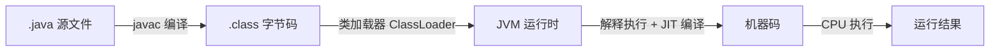

# Java 基础

> Java 核心技术基础篇，涵盖语法、OOP、核心类库、集合、泛型、异常、反射、IO、Lambda 等核心知识点，适合系统学习与快速复习。

---

## 目录

- [一、Java 语言概述](#sec1)
    - [1.1 Java 发展简史](#sec1-1)
    - [1.2 Java 核心特性](#sec1-2)
    - [1.3 JDK / JRE / JVM](#sec1-3)
    - [1.4 Java 程序运行机制](#sec1-4)
    - [1.5 跨平台原理](#sec1-5)
- [二、基本语法](#sec2)
    - [2.1 数据类型](#sec2-1)
    - [2.2 自动装箱与拆箱](#sec2-2)
    - [2.3 关键字深度解析](#sec2-3)
    - [2.4 流程控制](#sec2-4)
- [三、面向对象编程（OOP）](#sec3)
    - [3.1 三大特性](#sec3-1)
    - [3.2 类与对象、初始化顺序](#sec3-2)
    - [3.3 抽象类 vs 接口](#sec3-3)
    - [3.4 内部类](#sec3-4)
    - [3.5 访问权限控制](#sec3-5)
- [四、核心类库深度解析](#sec4)
    - [4.1 Object 类](#sec4-1)
    - [4.2 String 类](#sec4-2)
    - [4.3 String / StringBuilder / StringBuffer 对比](#sec4-3)
    - [4.4 枚举（Enum）](#sec4-4)
    - [4.5 BigDecimal](#sec4-5)
- [五、集合框架](#sec5)
    - [5.1 Collection 体系总览](#sec5-1)
    - [5.2 Map 体系总览](#sec5-2)
    - [5.3 List 实现选择](#sec5-3)
    - [5.4 Queue & Deque 实践](#sec5-4)
    - [5.5 Set 实现选择](#sec5-5)
    - [5.6 Map 实现选择](#sec5-6)
    - [5.7 Comparable vs Comparator](#sec5-7)
    - [5.8 Collections 工具类](#sec5-8)
- [六、泛型](#sec6)
    - [6.1 泛型类 / 接口 / 方法](#sec6-1)
    - [6.2 类型擦除](#sec6-2)
    - [6.3 通配符与 PECS 原则](#sec6-3)
    - [6.4 泛型数组的限制](#sec6-4)
- [七、异常机制](#sec7)
    - [7.1 异常体系结构](#sec7-1)
    - [7.2 受检异常 vs 非受检异常](#sec7-2)
    - [7.3 try-catch-finally 与 try-with-resources](#sec7-3)
    - [7.4 自定义异常](#sec7-4)
- [八、注解与反射](#sec8)
    - [8.1 注解](#sec8-1)
    - [8.2 反射核心 API](#sec8-2)
    - [8.3 动态代理](#sec8-3)
- [九、I/O 系统](#sec9)
    - [9.1 IO 分类体系](#sec9-1)
    - [9.2 核心流详解](#sec9-2)
    - [9.3 对象序列化](#sec9-3)
    - [9.4 NIO 简述](#sec9-4)
- [十、Lambda 与 Stream](#sec10)
    - [10.1 函数式接口](#sec10-1)
    - [10.2 Lambda 表达式](#sec10-2)
    - [10.3 方法引用](#sec10-3)
    - [10.4 Stream API](#sec10-4)
    - [10.5 Optional 类](#sec10-5)
- [十一、Java 新特性纵览](#sec11)
    - [11.1 Java 8](#sec11-1)
    - [11.2 Java 9 ~ 11](#sec11-2)
    - [11.3 Java 14 ~ 17 LTS](#sec11-3)
    - [11.4 Java 21 LTS](#sec11-4)

---

> 开始阅读：从 [第一章：Java 语言概述](#sec1) 开始系统学习，或点击目录跳转到任意章节。

---

## 一、Java 语言概述 {#sec1}

### 1.1 Java 发展简史 {#sec1-1}

Java 由 **James Gosling** 在 **Sun Microsystems** 主导设计，最初命名为 **Oak**，1995 年正式以 **Java** 名称发布。Java 的发展历程中几个关键里程碑：

| 版本 | 发布日期 | 里程碑特性 |
|------|----------|-----------|
| **Java 8 (LTS)** | 2014.03 | Lambda 表达式、Stream API、Optional、新的日期时间 API |
| **Java 11 (LTS)** | 2018.09 | HTTP Client 标准化、模块化（JPMS）、`var` 局部变量类型推断 |
| **Java 17 (LTS)** | 2021.09 | Sealed Class、Pattern Matching for `instanceof`、Switch 表达式 |
| **Java 21 (LTS)** | 2023.09 | 虚拟线程（Virtual Threads）、Record Pattern、Pattern Matching for Switch |
| **Java 25 (LTS)** | 2025.09 | 当前最新 LTS 版本 |

!!! tip "版本策略"

    Oracle 自 Java 9 起采用 **6 个月快速发布** 节奏，**每 2 年发布一个 LTS 版本**。当前 LTS 为 JDK 25，下一个 LTS 预计为 JDK 29（2027.09）。

    **生产环境建议使用 LTS 版本**，目前主流仍为 JDK 8 / JDK 11 / JDK 17 / JDK 21。

> **参考链接**：

> - [Java SE Support Roadmap (Oracle)](https://www.oracle.com/java/technologies/java-se-support-roadmap.html)
> - [OpenJDK 官方主页](https://openjdk.org/)
> - [Java Language Specifications (JLS)](https://docs.oracle.com/javase/specs/)
> - [Java Version History (Wikipedia)](https://en.wikipedia.org/wiki/Java_version_history)

---

### 1.2 Java 核心特性 {#sec1-2}

Java 能够二十余年占据编程语言前列，得益于以下核心特性：

!!! note "Java 的六大核心特性"

    1. **跨平台性（Write Once, Run Anywhere）** —— 编译生成字节码，由 JVM 解释执行
    2. **面向对象** —— 封装、继承、多态，纯 OOP 语言（除基本类型外一切皆对象）
    3. **自动内存管理** —— GC（垃圾回收）自动回收不再使用的对象内存
    4. **多线程支持** —— 内置 `Thread` 模型，Java 21 引入虚拟线程
    5. **安全性** —— 无指针运算、字节码校验、沙箱机制
    6. **丰富的生态** —— 庞大的开源社区（Spring、Maven、Guava 等）

---

### 1.3 JDK / JRE / JVM {#sec1-3}

三者是 Java 平台的基石，理解它们的区别至关重要：

| 组件 | 全称 | 包含关系 | 作用 |
|------|------|----------|------|
| **JVM** | Java Virtual Machine | 最内层 | 执行字节码，提供运行时环境 |
| **JRE** | Java Runtime Environment | 包含 JVM + 核心类库 | 运行 Java 程序所需的最小环境 |
| **JDK** | Java Development Kit | 包含 JRE + 开发工具 | 开发 Java 程序所需的完整工具集 |

```
┌───────────────────────────┐
│          JDK              │
│  ┌─────────────────────┐  │
│  │        JRE          │  │
│  │  ┌───────────────┐  │  │
│  │  │     JVM       │  │  │
│  │  └───────────────┘  │  │
│  │  核心类库 + 配置     │  │
│  └─────────────────────┘  │
│  javac / jar / javadoc 等  │
└───────────────────────────┘
```

!!! warning "关键点"

    - **JDK = JRE + 开发工具**（javac、jar、javadoc 等）
    - **JRE = JVM + 核心类库**
    - 运行 Java 程序只需要 JRE，但开发必须安装 JDK
    - Java 9 后引入了**模块化系统（JPMS）**，JDK 本身也被拆分为模块

> **参考链接**：

> - [JDK 官方文档 (Oracle)](https://docs.oracle.com/en/java/javase/)
> - [JVM 规范 (JVMS)](https://docs.oracle.com/javase/specs/jvms/se25/html/)

---

### 1.4 Java 程序运行机制 {#sec1-4}

一个 Java 程序从源码到执行，经历以下阶段：



#### 核心步骤解析

1. **编译（javac）**：将 `.java` 源文件编译为平台无关的 `.class` 字节码文件
2. **类加载（ClassLoader）**：JVM 启动时通过类加载器将 `.class` 文件加载到内存
3. **字节码验证**：校验字节码格式和安全性，防止恶意代码破坏 JVM
4. **执行引擎**：

   - **解释执行**：逐条翻译字节码为机器码，启动快
   - **JIT（Just-In-Time）编译**：热点代码编译为本地机器码，提升执行效率
   - **AOT（Ahead-Of-Time）编译**：Java 9+ 支持，提前编译为本地代码

!!! tip "Java 是编译型还是解释型？"

    Java 是 **"先编译后解释"** 的语言：源码先编译成字节码（编译型特征），再由 JVM 解释执行（解释型特征）。同时通过 **JIT 编译器** 在运行时对热点代码进行编译优化，兼具跨平台与高性能。

> **参考链接**：

> - [JVM 规范 - 执行引擎 (JVMS Ch.3)](https://docs.oracle.com/javase/specs/jvms/se25/html/jvms-3.html)
> - [JIT 编译器 (Oracle Docs)](https://docs.oracle.com/en/java/javase/17/vm/just-time-compiler.html)

---

### 1.5 跨平台原理 {#sec1-5}

Java 实现 **"Write Once, Run Anywhere"** 的核心在于 **JVM 屏障**：

=== "跨平台原理示意"

    ```
    源码 → 字节码（.class）→ 各平台 JVM → 各 OS
                                ├── Windows JVM → Windows
                                ├── Linux   JVM → Linux
                                └── macOS   JVM → macOS
    ```

    **关键点**：字节码是平台无关的，但 JVM 是平台相关的。不同操作系统需要安装对应版本的 JVM。

=== "不同平台对比"

    | 操作系统 | JVM 实现 | 差异点 |
    |----------|----------|--------|
    | Windows | Oracle JDK / OpenJDK | 路径分隔符 `\`，换行符 `\r\n` |
    | Linux   | OpenJDK 为主流       | 路径分隔符 `/`，换行符 `\n` |
    | macOS   | Oracle JDK / OpenJDK | 与 Linux 大部分一致 |

!!! example "一次编译，到处运行"

    ```java
    // 在任意平台编译生成 Hello.class
    public class Hello {
        public static void main(String[] args) {
            System.out.println("Hello Java!");
        }
    }
    // 将 Hello.class 复制到任何安装了 JVM 的平台均可运行
    // java Hello  → 输出: Hello Java!
    ```

> **参考链接**：


> - [Java Platform Independence (Oracle Docs)](https://docs.oracle.com/javase/tutorial/getStarted/intro/definition.html)
> - [JVM 规范 - 数据结构 (JVMS Ch.2)](https://docs.oracle.com/javase/specs/jvms/se25/html/jvms-2.html)

---

> **📚 本章参考汇总**
>
> - [Java SE Specifications (JLS + JVMS)](https://docs.oracle.com/javase/specs/)
> - [OpenJDK](https://openjdk.org/)
> - [Oracle Java SE Support Roadmap](https://www.oracle.com/java/technologies/java-se-support-roadmap.html)
> - [Java Tutorials (Oracle)](https://docs.oracle.com/javase/tutorial/)

---

## 二、基本语法 {#sec2}

### 2.1 数据类型 {#sec2-1}

Java 的数据类型分为两大类：**基本类型**（Primitive Types）和 **引用类型**（Reference Types）。

#### 2.1.1 八种基本类型

| 类型 | 关键字 | 占用空间 | 默认值 | 取值范围 |
|------|--------|---------|--------|---------|
| 字节型 | `byte` | 8 bit（1B） | `0` | `[-128, 127]` |
| 短整型 | `short` | 16 bit（2B） | `0` | `[-2^15, 2^15-1]` |
| 整型 | `int` | 32 bit（4B） | `0` | `[-2^31, 2^31-1]` |
| 长整型 | `long` | 64 bit（8B） | `0L` | `[-2^63, 2^63-1]` |
| 单精度浮点 | `float` | 32 bit（4B） | `0.0f` | ±3.4E-38 ~ ±3.4E+38 |
| 双精度浮点 | `double` | 64 bit（8B） | `0.0d` | ±1.7E-308 ~ ±1.7E+308 |
| 字符型 | `char` | 16 bit（2B） | `'\u0000'` | `[0, 65535]`（无符号） |
| 布尔型 | `boolean` | JVM 规范未明确定义 | `false` | `true` / `false` |

!!! warning "几个容易忽略的细节"

    - `long` 类型赋值须加后缀 `L`（如 `100L`），否则会被当作 `int`
    - `float` 类型赋值须加后缀 `f`（如 `3.14f`），否则小数默认是 `double`
    - `boolean` 在 JVM 中通常被编译为 `int`（`true=1`，`false=0`），但在逻辑上只有两个值
    - `char` 在 Java 中是 **无符号** 16 位 Unicode 字符，可参与算术运算

#### 2.1.2 引用类型

引用类型指向一个对象实例，包括：**类**、**接口**、**数组**、**枚举**。引用类型的变量存储的是对象的内存地址（而非对象本身）。

=== "基本类型 vs 引用类型"

    | 对比维度 | 基本类型 | 引用类型 |
    |----------|---------|---------|
    | 存储位置 | 栈内存（局部变量）或堆内存（成员变量） | 堆内存 |
    | 传递方式 | 值传递（拷贝值） | 值传递（拷贝引用地址） |
    | 默认值 | 有固定默认值（如 `0`、`false`） | `null` |
    | 能否调用方法 | 不能 | 能 |

=== "代码示例"

    ```java
    int a = 10;          // 基本类型：栈上直接存值
    String s = "hello";  // 引用类型：栈存地址，堆存对象内容

    // 值传递演示
    int x = 10;
    int y = x;   // 拷贝值
    y = 20;      // x 仍为 10

    User u1 = new User("Alice");
    User u2 = u1;        // 拷贝引用地址
    u2.setName("Bob");   // u1 的 name 也会变为 "Bob"（指向同一对象）
    ```

#### 2.1.3 类型转换

=== "自动类型转换（隐式）"

    ```java
    // 小范围 → 大范围：自动提升
    byte b = 10;
    int i = b;      // byte → int 自动转换
    long l = i;     // int → long 自动转换
    double d = l;   // long → double 自动转换

    // 算术运算中的自动提升
    short s1 = 10, s2 = 20;
    // short s3 = s1 + s2;  // ❌ 编译错误！s1 + s2 结果是 int
    int s3 = s1 + s2;       // ✅
    ```

=== "强制类型转换（显式）"

    ```java
    // 大范围 → 小范围：必须显式强转，可能丢失精度
    double d = 3.14159;
    int i = (int) d;       // i = 3（精度丢失）

    int big = 300;
    byte b = (byte) big;   // b = 44（溢出截断）
    ```

---

### 2.2 自动装箱与拆箱 {#sec2-2}

Java 为每种基本类型提供了对应的 **包装类**（Wrapper Classes），并支持自动装箱与拆箱。

#### 2.2.1 包装类对应关系

| 基本类型 | 包装类 | 基本类型 | 包装类 |
|----------|--------|----------|--------|
| `byte` | `Byte` | `short` | `Short` |
| `int` | `Integer` | `long` | `Long` |
| `float` | `Float` | `double` | `Double` |
| `char` | `Character` | `boolean` | `Boolean` |

#### 2.2.2 装箱与拆箱原理

```java
// 自动装箱：int → Integer，实际调用 Integer.valueOf(int)
Integer n = 42;

// 自动拆箱：Integer → int，实际调用 Integer.intValue()
int m = n;

// 等价于手动操作：
Integer n2 = Integer.valueOf(42);
int m2 = n2.intValue();
```

!!! tip "javap 反编译验证"

    可以通过 `javap -c` 查看字节码，证实装箱调用 `valueOf()`，拆箱调用 `xxxValue()`。

#### 2.2.3 缓存池陷阱

Java 对部分包装类提供了 **缓存机制**，常见陷阱如下：

```java
Integer a = 127;
Integer b = 127;
System.out.println(a == b);  // true（使用了缓存）

Integer c = 128;
Integer d = 128;
System.out.println(c == d);  // false（超出缓存范围，创建了新对象）

// 正确比较方式：使用 equals()
System.out.println(c.equals(d));  // true
```

!!! note "缓存范围"

    - **Integer**：默认 `[-128, 127]`，上限可通过 JVM 参数 `-XX:AutoBoxCacheMax=<size>` 调整
    - **Long**：`[-128, 127]`（不可调整）
    - **Short / Byte / Character**：各自类型的整个无符号范围
    - **Float / Double**：**没有**缓存

#### 2.2.4 空指针陷阱

```java
Integer n = null;
int m = n;  // ❌ NullPointerException！自动拆箱时调用 n.intValue()
```

!!! warning "开发建议"

    - 包装类型参与算术运算或赋值给基本类型时，务必判空
    - **POJO 类属性建议使用包装类**（默认值为 `null`，便于区分"未赋值"和"值为0"）
    - 性能敏感场景下优先使用基本类型，避免频繁装箱拆箱

---

### 2.3 关键字深度解析 {#sec2-3}

#### 2.3.1 `final`

`final` 的含义是 **"不可变"**，具体语义取决于修饰的目标：

| 修饰目标 | 含义 | 示例 |
|----------|------|------|
| **变量** | 值不可被重新赋值（对于引用类型，引用不可变，但对象内部可变） | `final int MAX = 100;` |
| **方法** | 方法不可被子类重写（Override） | `public final void doSomething() {}` |
| **类** | 类不可被继承（如 `String`、`Integer`） | `public final class String {}` |

```java
final int[] arr = {1, 2, 3};
arr[0] = 10;     // ✅ 数组元素可变
// arr = new int[]{4, 5, 6};  // ❌ 引用不可重新赋值

final User user = new User("Alice");
user.setName("Bob");   // ✅ 对象内部状态可变
// user = new User("Charlie");  // ❌ 引用不可变
```

#### 2.3.2 `static`

`static` 表示 **类级别** 的成员，属于类而非实例：

| 修饰目标 | 含义 | 访问方式 |
|----------|------|---------|
| **变量** | 类变量，所有实例共享同一份内存 | `类名.变量名` |
| **方法** | 类方法，不能访问非 `static` 成员 | `类名.方法名()` |
| **代码块** | 类加载时执行一次，常用于初始化静态资源 | 类加载自动触发 |
| **内部类** | 静态内部类，不持有外部类引用 | `new Outer.Inner()` |

```java
public class Counter {
    static int count = 0;       // 类变量
    int instanceCount = 0;      // 实例变量

    static {
        System.out.println("类加载时执行一次");
    }

    static void reset() {       // 类方法
        count = 0;
        // instanceCount = 0;   // ❌ 静态方法不能直接访问非静态成员
    }
}
```

!!! tip "static 的常见用途"

    - 工具类方法（如 `Math.max()`、`Collections.sort()`）
    - 常量定义（`public static final`）
    - 单例模式
    - 静态工厂方法

#### 2.3.3 `transient`

`transient` 用于修饰成员变量，表示该变量 **不参与序列化**。

```java
public class User implements Serializable {
    private String name;
    private transient String password;  // 序列化时忽略 password
    private static int version;         // 静态变量也不参与序列化
}
```

#### 2.3.4 `volatile`

`volatile` 保证变量的 **可见性**，禁止指令重排序。详细内容参见 [[juc#volatile 关键字]]。

---

### 2.4 流程控制 {#sec2-4}

#### 2.4.1 条件语句：if-else

```java
if (score >= 90) {
    grade = "A";
} else if (score >= 80) {
    grade = "B";
} else {
    grade = "C";
}
```

#### 2.4.2 Switch 语句

从 Java 14 起正式支持 **Switch 表达式**，代码更简洁、更安全。

=== "传统 Switch 语句"

    ```java
    // 传统写法：容易遗漏 break，导致穿透
    String result;
    switch (day) {
        case MONDAY:
        case FRIDAY:
            result = "Work day";
            break;
        case SATURDAY:
        case SUNDAY:
            result = "Weekend";
            break;
        default:
            result = "Midweek";
    }
    ```

=== "Switch 表达式（Java 14+）"

    ```java
    // ✅ 箭头语法：无需 break，自动返回
    String result = switch (day) {
        case MONDAY, FRIDAY -> "Work day";
        case SATURDAY, SUNDAY -> "Weekend";
        default -> "Midweek";
    };

    // 或使用 yield 返回复杂逻辑
    String result = switch (day) {
        case MONDAY, FRIDAY -> "Work day";
        case SATURDAY, SUNDAY -> "Weekend";
        default -> {
            int hours = getHours(day);
            yield "Midweek, work " + hours + " hours";
        }
    };
    ```

!!! tip "Switch 表达式 vs 传统 Switch"

    - 箭头 `->` 无需 `break`，`:` 需要 `break` 防止穿透
    - Switch 表达式可直接赋值给变量
    - 多值匹配：`case MONDAY, FRIDAY ->`
    - `yield` 关键字用于在代码块中返回结果

#### 2.4.3 循环语句

=== "for-each（增强型 for）"

    ```java
    // 遍历数组 / Iterable
    List<String> list = List.of("A", "B", "C");
    for (String s : list) {
        System.out.println(s);
    }

    int[] arr = {1, 2, 3};
    for (int n : arr) {
        System.out.println(n);
    }
    ```

=== "传统 for / while"

    ```java
    // for 循环
    for (int i = 0; i < 10; i++) {
        System.out.println(i);
    }

    // while 循环
    int i = 0;
    while (i < 10) {
        System.out.println(i++);
    }

    // do-while（至少执行一次）
    int j = 0;
    do {
        System.out.println(j);
    } while (j > 0);
    ```
---

## 三、面向对象编程（OOP） {#sec3}

### 3.1 三大特性 {#sec3-1}

面向对象编程的三大核心特性是 **封装、继承、多态**。

#### 封装（Encapsulation）

将数据和操作数据的方法绑定在一起，对外隐藏内部实现细节，仅暴露有限的访问接口。

```java
public class BankAccount {
    private double balance;  // 私有成员，外部不能直接访问

    public double getBalance() { return balance; }

    public void deposit(double amount) {
        if (amount > 0) balance += amount;
    }

    public void withdraw(double amount) {
        if (amount > 0 && amount <= balance) balance -= amount;
    }
}
```

!!! tip "封装的好处"

    - 控制访问权限，保护数据不被滥用
    - 降低耦合，修改内部实现不影响外部调用者
    - 提高代码的可维护性和安全性

#### 继承（Inheritance）

子类继承父类的成员变量和方法，实现代码复用，并可通过重写（Override）扩展行为。

```java
public class Animal {
    protected String name;
    public void eat() { System.out.println(name + " is eating"); }
}

public class Dog extends Animal {
    public void bark() { System.out.println(name + " is barking"); }
}
// 使用：Dog d = new Dog(); d.eat(); d.bark();
```

!!! warning "Java 继承的规则"

    - Java 是 **单继承**（一个类只能有一个直接父类）→ 通过 **接口** 实现多继承的效果
    - 所有类隐式继承 `Object`（除 `Object` 本身）
    - `final` 类不能被继承（如 `String`）
    - 子类构造器必须调用父类构造器（隐式调用 `super()` 或显式调用 `super(args)`）

#### 多态（Polymorphism）

同一操作作用于不同对象，产生不同的执行结果。多态的三个必要条件：**继承、重写、父类引用指向子类对象**。

```java
Animal a = new Dog();   // 父类引用指向子类对象
a.eat();                // 调用的是 Dog 的 eat() 方法（动态绑定）
// a.bark();            // ❌ 编译期只能调用父类声明的方法
```

##### 重载（Overload） vs 重写（Override）

| 对比维度 | 重载（Overload） | 重写（Override） |
|----------|-----------------|-----------------|
| 发生位置 | 同一个类中 | 子类与父类之间 |
| 方法名 | 相同 | 相同 |
| 参数列表 | **必须不同** | **必须相同** |
| 返回类型 | 可以不同 | 相同或是协变返回类型 |
| 访问修饰符 | 可以不同 | 不能比父类更严格 |
| 异常 | 可以不同 | 不能抛出比父类更宽泛的异常 |
| 绑定时机 | **编译期**（静态多态） | **运行期**（动态多态） |

```java
// 重载 Overload —— 编译时决定
class Calculator {
    int add(int a, int b) { return a + b; }
    double add(double a, double b) { return a + b; }  // 参数类型不同
}

// 重写 Override —— 运行时决定
class Parent {
    void hello() { System.out.println("Parent"); }
}
class Child extends Parent {
    @Override
    void hello() { System.out.println("Child"); }
}
Parent obj = new Child();
obj.hello();  // 输出: Child（动态绑定）
```

---

### 3.2 类与对象、初始化顺序 {#sec3-2}

#### 类的初始化顺序

一个类从加载到创建实例，经历以下初始化阶段：

```java
public class InitOrderDemo {
    // ① 静态变量
    static int staticVar = 1;
    // ② 静态代码块
    static { System.out.println("静态代码块"); }

    // ③ 实例变量
    int instanceVar = 2;
    // ④ 实例代码块（构造代码块）
    { System.out.println("实例代码块"); }

    // ⑤ 构造方法
    public InitOrderDemo() {
        System.out.println("构造方法");
    }
}
```

!!! note "完整的初始化顺序"

    1. **加载类**（仅一次）：父类静态变量/静态代码块 → 子类静态变量/静态代码块
    2. **创建实例**：父类实例变量/实例代码块 → 父类构造方法 → 子类实例变量/实例代码块 → 子类构造方法

#### 构造方法

```java
public class User {
    private String name;
    private int age;

    // 默认无参构造（如果未定义任何构造器，编译器自动生成）
    public User() {}

    // 有参构造
    public User(String name) {
        this.name = name;
    }

    // 链式调用：this() 调用其他构造器
    public User(String name, int age) {
        this(name);        // 必须放在第一行
        this.age = age;
    }
}
```

---

### 3.3 抽象类 vs 接口 {#sec3-3}

| 对比维度 | 抽象类 | 接口 |
|----------|--------|------|
| 关键字 | `abstract class` | `interface` |
| 是否可以实例化 | ❌ 不能 | ❌ 不能 |
| 构造方法 | ✅ 可以有 | ❌ 不能有 |
| 成员变量 | 任意 | `public static final`（常量） |
| 方法类型 | 抽象方法 + 具体方法 | 抽象方法 + default 方法 + static 方法 + private 方法 |
| 访问修饰符 | 任意 | `public`（Java 9+ 支持 `private`） |
| 继承/实现 | `extends`（单继承） | `implements`（多实现） |
| 设计目的 | 代码复用，表达 **"是什么"** | 定义契约，表达 **"能做什么"** |

=== "抽象类示例"

    ```java
    // 抽象类：表达"是什么"
    public abstract class Shape {
        protected String color;

        public Shape(String color) {
            this.color = color;
        }

        public abstract double area();      // 抽象方法
        public String getColor() {          // 具体方法
            return color;
        }
    }

    public class Circle extends Shape {
        private double radius;
        public Circle(String color, double radius) {
            super(color);
            this.radius = radius;
        }
        @Override
        public double area() {
            return Math.PI * radius * radius;
        }
    }
    ```

=== "接口示例（含 Java 8+ 特性）"

    ```java
    // 接口：表达"能做什么"
    public interface Flyable {
        // 抽象方法
        void fly();

        // Java 8: default 方法（提供默认实现）
        default void takeOff() {
            System.out.println("Taking off...");
        }

        // Java 8: static 方法（工具方法）
        static boolean isBird(String name) {
            return "sparrow".equals(name);
        }

        // Java 9: private 方法（提取公共逻辑）
        private void log(String msg) {
            System.out.println("[Flyable] " + msg);
        }
    }

    public class Bird implements Flyable {
        @Override
        public void fly() {
            System.out.println("Bird is flying");
        }
    }
    ```

!!! tip "接口 vs 抽象类 —— 如何选择？"

    优先用 **接口** 定义行为契约，用 **抽象类** 提取公共状态和代码。Java 8+ 之后接口能力大幅增强，很多以前需要抽象类的场景现在接口也能胜任。

---

### 3.4 内部类 {#sec3-4}

Java 支持四种内部类，各有不同的用途和特性：

| 类型 | 定义位置 | 持有外部类引用 | 能否有静态成员 | 典型用途 |
|------|---------|--------------|--------------|---------|
| **成员内部类** | 类内部 | 是 | 否 | 内部逻辑组件 |
| **静态内部类** | 类内部（`static`） | 否 | 是 | 辅助类如 `HashMap.Node` |
| **局部内部类** | 方法内部 | 是（需 `final`/`effectively final`） | 否 | 方法内临时逻辑 |
| **匿名内部类** | 表达式创建 | 是（需 `final`/`effectively final`） | 否 | 回调、事件监听 |

=== "成员内部类 & 静态内部类"

    ```java
    public class Outer {
        private int x = 10;
        private static int staticX = 20;

        // 成员内部类：持有 Outer.this
        class Inner {
            void show() {
                System.out.println(x);         // 可以访问外部实例变量
                System.out.println(staticX);   // 可以访问外部静态变量
            }
        }

        // 静态内部类：不持有外部引用
        static class StaticInner {
            void show() {
                // System.out.println(x);      // ❌ 不能访问外部实例变量
                System.out.println(staticX);   // 可以访问外部静态变量
            }
        }
    }

    // 创建方式
    Outer outer = new Outer();
    Outer.Inner inner = outer.new Inner();           // 成员内部类
    Outer.StaticInner sinner = new Outer.StaticInner(); // 静态内部类
    ```

=== "局部内部类 & 匿名内部类"

    ```java
    public class Outer {
        private int x = 10;

        public void doSomething() {
            int y = 20;  // effectively final（Java 8+）

            // 局部内部类
            class LocalInner {
                void print() {
                    System.out.println(x);  // 访问外部成员
                    System.out.println(y);  // 访问局部变量（不可修改）
                }
            }
            new LocalInner().print();

            // 匿名内部类
            Runnable task = new Runnable() {
                @Override
                public void run() {
                    System.out.println("Anonymous: " + x);
                }
            };
            new Thread(task).start();
        }
    }
    ```

!!! tip "匿名内部类 vs Lambda"

    匿名内部类可被 **Lambda 表达式** 替代（当实现的接口是函数式接口时），代码更简洁：

    ```java
    // 匿名内部类
    Runnable r1 = new Runnable() {
        @Override public void run() {
            System.out.println("Hello");
        }
    };
    // Lambda
    Runnable r2 = () -> System.out.println("Hello");
    ```

---

### 3.5 访问权限控制 {#sec3-5}

Java 提供四种访问权限修饰符，控制类及成员的可见范围：

| 修饰符 | 同一个类 | 同一个包 | 子类（不同包） | 所有类 |
|--------|---------|---------|---------------|-------|
| `private` | ✅ | ❌ | ❌ | ❌ |
| `default`（无修饰符） | ✅ | ✅ | ❌ | ❌ |
| `protected` | ✅ | ✅ | ✅ | ❌ |
| `public` | ✅ | ✅ | ✅ | ✅ |

```java
package com.example;

public class AccessDemo {
    private int a = 1;          // 仅本类
    int b = 2;                  // 包级私有（default）
    protected int c = 3;        // 包 + 子类
    public int d = 4;           // 全部可见

    private void methodA() {}   // 仅本类
    void methodB() {}           // 包级私有
    protected void methodC() {} // 包 + 子类
    public void methodD() {}    // 全部可见
}
```

!!! warning "访问权限的最佳实践"

    - **最小权限原则**：能用 `private` 不用 `default`，能用 `default` 不用 `protected`
    - 成员变量优先 `private`，通过 getter/setter 暴露
    - 接口中的方法默认 `public`，Java 9+ 支持 `private` 方法
    - 构造器应适当控制权限（如单例模式用 `private` 构造器）

---

## 四、核心类库深度解析 {#sec4}

### 4.1 Object 类 {#sec4-1}

`Object` 是所有类的隐式父类，其核心方法在 Java 生态中地位极高。

#### 4.1.1 `equals()` 与 `hashCode()`

这两个方法共同决定了对象在 **哈希集合**（如 `HashMap`、`HashSet`）中的行为。

=== "契约规则"

    ```
    hashCode 契约（重点）：
    ┌──────────────────────────────────────────────────┐
    │ 1. 同一个对象多次调用 hashCode()，返回值必须相等    │
    │ 2. 若 a.equals(b) == true，则 a.hashCode() == b  │
    │    .hashCode() 【必须相等】                        │
    │ 3. 若 a.equals(b) == false，则 a.hashCode() 与   │
    │    b.hashCode() 【可以不相等，但相等更好】          │
    └──────────────────────────────────────────────────┘
    ```

=== "代码示例"

    ```java
    public class User {
        private String name;
        private int age;

        @Override
        public boolean equals(Object o) {
            if (this == o) return true;
            if (o == null || getClass() != o.getClass()) return false;
            User user = (User) o;
            return age == user.age && Objects.equals(name, user.name);
        }

        @Override
        public int hashCode() {
            return Objects.hash(name, age);  // 与 equals 使用的字段保持一致
        }
    }
    ```

    !!! warning "重写 equals 必须同时重写 hashCode"

        否则在 `HashMap` 中会出现"两个逻辑相等的对象，因为哈希值不同而被放到不同的桶中"的 bug。

=== "默认实现分析"

    | 方法 | Object 默认行为 | 需要重写的场景 |
    |------|---------------|--------------|
    | `equals()` | `==` 比较（引用相等） | 需要"逻辑相等"时（如值对象） |
    | `hashCode()` | 根据内存地址生成 | 重写 `equals` 后必须重写 |
    | `toString()` | `类名@十六进制哈希` | 需要可读性强的日志输出时 |
    | `clone()` | 浅拷贝（`protected`） | 需要深拷贝或允许其他类调用时 |

=== "浅拷贝 vs 深拷贝"

    ```java
    public class Address implements Cloneable {
        private String city;
        // getter/setter 省略

        @Override
        protected Object clone() throws CloneNotSupportedException {
            return super.clone();  // 浅拷贝
        }
    }

    public class Person implements Cloneable {
        private Address address;

        // 浅拷贝：副本与原对象共享 address 引用
        @Override
        protected Object clone() throws CloneNotSupportedException {
            return super.clone();
        }

        // 深拷贝：address 也拷贝一份新的
        public Person deepClone() throws CloneNotSupportedException {
            Person cloned = (Person) super.clone();
            cloned.address = (Address) address.clone();  // 递归拷贝
            return cloned;
        }
    }
    ```
---

### 4.2 String 类 {#sec4-2}

`String` 是 Java 中使用频率最高的类，理解其设计对写出高性能代码至关重要。

#### 4.2.1 不可变性

```java
public final class String
    implements java.io.Serializable, Comparable<String>, CharSequence {
    private final char value[];  // JDK 9+ 改为 byte[]
    // 没有提供任何修改内部数组的方法
}
```

!!! note "不可变性的好处"

    - **线程安全**：无需同步即可在多线程环境共享
    - **字符串常量池**：相同字面量的字符串可复用同一对象
    - **Hash 缓存**：`String` 的 `hashCode` 可缓存（首次计算后缓存），作为 `HashMap` 的键非常高效

#### 4.2.2 字符串常量池

```java
String s1 = "hello";
String s2 = "hello";
String s3 = new String("hello");
String s4 = s3.intern();

System.out.println(s1 == s2);  // true（常量池复用）
System.out.println(s1 == s3);  // false（堆上新对象）
System.out.println(s1 == s4);  // true（intern() 返回常量池中的引用）
```

```
内存结构：
┌─────────────────────────────────────┐
│              堆内存                   │
│  ┌──────────────┐  ┌─────────────┐   │
│  │ 常量池 (串池) │  │  普通堆对象  │   │
│  │  "hello" ←── │  │  s3 → "hello"│   │
│  │  s1,s2,s4 ──→│  └─────────────┘   │
│  └──────────────┘                     │
└─────────────────────────────────────┘
```

#### 4.2.3 字符串拼接原理

```java
// 方式一：+ 运算符（编译期优化为 StringBuilder）
String s = "a" + "b" + "c";   // 编译期直接优化为 "abc"

// 方式二：变量拼接
String a = "a";
String b = "b";
String s = a + b;  // 编译为 new StringBuilder().append(a).append(b).toString()

// ❌ 循环中拼接：每次循环都 new 一个 StringBuilder
String result = "";
for (int i = 0; i < 1000; i++) {
    result += i;  // 产生大量临时 StringBuilder 对象
}
// ✅ 循环中手动使用 StringBuilder
StringBuilder sb = new StringBuilder();
for (int i = 0; i < 1000; i++) {
    sb.append(i);
}
```

---

### 4.3 String / StringBuilder / StringBuffer 对比 {#sec4-3}

| 对比维度 | `String` | `StringBuilder` | `StringBuffer` |
|----------|---------|----------------|----------------|
| **可变性** | 不可变 | 可变 | 可变 |
| **线程安全** | ✅ 线程安全（不可变） | ❌ 非线程安全 | ✅ 线程安全（方法加 `synchronized`） |
| **性能** | 拼接时差（产生新对象） | 最快 | 较慢（有同步开销） |
| **引入版本** | JDK 1.0 | JDK 1.5 | JDK 1.0 |
| **典型场景** | 字符串常量、少量拼接 | 单线程字符串操作 | 多线程字符串操作（罕见） |

```java
// String：每次修改产生新对象
String s = "a";
s = s + "b";  // 产生新的 String 对象

// StringBuilder：单线程首选
StringBuilder sb = new StringBuilder();
sb.append("a").append("b");  // 链式调用，同一对象操作
String result = sb.toString();

// StringBuffer：多线程场景（实际很少用）
StringBuffer sbf = new StringBuffer();
sbf.append("a").append("b");
```

!!! tip "日常开发建议"

    - **字符串常量 + 少量拼接**：直接用 `String` + 运算符，编译器会优化
    - **循环拼接、复杂构造**：使用 `StringBuilder`
    - **几乎不需要用 `StringBuffer`**：除非明确需要多线程共享可变的字符序列

> **参考链接**：
> 
> - [StringBuilder API (Java 25)](https://docs.oracle.com/en/java/javase/25/docs/api/java.base/java/lang/StringBuilder.html)
> - [StringBuffer API (Java 25)](https://docs.oracle.com/en/java/javase/25/docs/api/java.base/java/lang/StringBuffer.html)

---

### 4.4 枚举（Enum） {#sec4-4}

Java 的 `enum` 本质是继承了 `java.lang.Enum` 的类，比常量更安全、更强大。

```java
// 基本定义
public enum Color {
    RED, GREEN, BLUE
}

// 带字段和方法的枚举
public enum Status {
    PENDING(0, "待处理"),
    PROCESSING(1, "处理中"),
    COMPLETED(2, "已完成");

    private final int code;
    private final String desc;

    Status(int code, String desc) {
        this.code = code;
        this.desc = desc;
    }

    public int getCode() { return code; }
    public String getDesc() { return desc; }

    public static Status fromCode(int code) {
        for (Status s : values()) {
            if (s.code == code) return s;
        }
        throw new IllegalArgumentException("Unknown code: " + code);
    }
}
```

#### 枚举的隐式方法

| 方法 | 作用 |
|------|------|
| `values()` | 返回所有枚举常量数组 |
| `valueOf(String)` | 根据名称获取枚举常量 |
| `name()` | 返回枚举常量的名称字符串 |
| `ordinal()` | 返回枚举常量的顺序（从 0 开始） |

!!! warning "枚举 vs 常量"

    ```java
    // ❌ 常量方式：类型不安全，无范围约束
    public static final int STATUS_PENDING = 0;
    void process(int status) { ... }  // 传入任意 int 都行

    // ✅ 枚举方式：编译期类型检查
    void process(Status status) { ... }  // 只能传入 Status 类型的值
    ```

> **参考链接**：
> 
> - [Enum.java API (Java 25)](https://docs.oracle.com/en/java/javase/25/docs/api/java.base/java/lang/Enum.html)
> - [Oracle Tutorial - Enum Types](https://docs.oracle.com/javase/tutorial/java/javaOO/enum.html)

---

### 4.5 BigDecimal {#sec4-5}

`float` 和 `double` 使用二进制表示小数，无法精确表示某些十进制数（如 `0.1`）。**金融和货币计算必须使用 `BigDecimal`**。

#### 4.5.1 精度丢失演示

```java
// ❌ 浮点数精度丢失
double a = 0.1 + 0.2;
System.out.println(a);  // 0.30000000000000004

// ✅ BigDecimal 精确计算
BigDecimal b1 = new BigDecimal("0.1");
BigDecimal b2 = new BigDecimal("0.2");
System.out.println(b1.add(b2));  // 0.3
```

!!! danger "构造 BigDecimal 的陷阱"

    ```java
    // ❌ 不要用 double 构造
    BigDecimal x = new BigDecimal(0.1);
    System.out.println(x);  // 0.1000000000000000055511151231257827021181583404541015625

    // ✅ 用 String 构造
    BigDecimal y = new BigDecimal("0.1");
    System.out.println(y);  // 0.1

    // ✅ 或用 valueOf（内部调用了 Double.toString）
    BigDecimal z = BigDecimal.valueOf(0.1);
    System.out.println(z);  // 0.1
    ```

#### 4.5.2 常用方法

| 方法 | 说明 |
|------|------|
| `add(BigDecimal)` | 加法 |
| `subtract(BigDecimal)` | 减法 |
| `multiply(BigDecimal)` | 乘法 |
| `divide(BigDecimal, RoundingMode)` | 除法（**必须指定精度和舍入模式**） |
| `setScale(int, RoundingMode)` | 设置精度 |
| `compareTo(BigDecimal)` | 比较（**不要用 `equals`**） |

```java
BigDecimal a = new BigDecimal("10");
BigDecimal b = new BigDecimal("3");

// 除法必须指定精度和舍入模式
System.out.println(a.divide(b, 2, RoundingMode.HALF_UP));  // 3.33

// compareTo vs equals 的区别
BigDecimal d1 = new BigDecimal("2.0");
BigDecimal d2 = new BigDecimal("2.00");
System.out.println(d1.equals(d2));    // false（精度不同）
System.out.println(d1.compareTo(d2)); // 0（数值相等）
```

---

> **📚 本章参考汇总**
>
> - [java.base API (Java 25)](https://docs.oracle.com/en/java/javase/25/docs/api/java.base/java.base-summary.html)
> - [Object、String、BigDecimal 等核心类 API 文档](https://docs.oracle.com/en/java/javase/25/docs/api/java.base/java/lang/package-summary.html)

---

## 五、集合框架 {#sec5}

> 本章定位为 **集合实战选型指南**，聚焦"什么时候用什么"以及"常见坑点"，原理细节参见面试笔记。

### 5.1 Collection 体系总览 {#sec5-1}

Java 集合框架分为两大体系：**Collection**（单列集合）和 **Map**（双列集合）。

```
Collection（接口）
├── List（有序可重复）
│   ├── ArrayList      ← 日常首选
│   ├── LinkedList     ← 频繁头尾增删
│   └── Vector         ← 已过时，不建议使用
│       └── Stack      ← 已过时，用 ArrayDeque 替代
├── Set（不可重复）
│   ├── HashSet        ← 日常首选
│   ├── LinkedHashSet  ← 需要保持插入顺序
│   └── TreeSet        ← 需要排序
└── Queue / Deque（队列 / 双端队列）
    ├── ArrayDeque     ← 栈 & 队列的最佳实践
    ├── LinkedList     ← 也可作为 Queue 实现
    └── PriorityQueue  ← 优先队列（优先级堆）
```

!!! tip "一句话总结"

    - 存多个元素 → **Collection**
    - 存键值对 → **Map**
    - 要栈或队列 → **ArrayDeque**
    - 要排序的队列 → **PriorityQueue**

> **参考链接**：

> - [Collection API (Java 25)](https://docs.oracle.com/en/java/javase/25/docs/api/java.base/java/util/Collection.html)
> - [List API (Java 25)](https://docs.oracle.com/en/java/javase/25/docs/api/java.base/java/util/List.html)
> - [Set API (Java 25)](https://docs.oracle.com/en/java/javase/25/docs/api/java.base/java/util/Set.html)
> - [Queue API (Java 25)](https://docs.oracle.com/en/java/javase/25/docs/api/java.base/java/util/Queue.html)
> - [Deque API (Java 25)](https://docs.oracle.com/en/java/javase/25/docs/api/java.base/java/util/Deque.html)

---

### 5.2 Map 体系总览 {#sec5-2}

```
Map（接口）
├── HashMap            ← 日常首选
├── LinkedHashMap      ← 需要保持插入顺序 或 LRU 缓存
├── TreeMap            ← 需要按键排序
├── Hashtable          ← 已过时，不建议使用
└── ConcurrentHashMap  ← 并发场景（在 JUC 中详解）
```

> **参考链接**：

> - [Map API (Java 25)](https://docs.oracle.com/en/java/javase/25/docs/api/java.base/java/util/Map.html)
> - [HashMap API (Java 25)](https://docs.oracle.com/en/java/javase/25/docs/api/java.base/java/util/HashMap.html)

---

### 5.3 List 实现选择 {#sec5-3}

=== "选型速查"

    | 实现类 | 底层结构 | 适用场景 |
    |--------|---------|---------|
    | **ArrayList** | 动态数组（Object[]） | **日常首选**：随机访问多，尾部增删多 |
    | **LinkedList** | 双向链表 | 频繁头尾插入/删除，或需要同时作为 Queue 使用 |
    | **Vector** | 动态数组（方法加 `synchronized`） | ❌ **已过时**，并发场景用 `Collections.synchronizedList()` 或 `CopyOnWriteArrayList` |
    | **Stack** | 继承 Vector | ❌ **已过时**，栈操作请用 `ArrayDeque` |

=== "代码示例"

    ```java
    // ✅ 日常首选
    List<String> list = new ArrayList<>();

    // 头尾频繁增删时选用
    List<String> linked = new LinkedList<>();
    linked.addFirst("head");   // LinkedList 特有
    linked.addLast("tail");

    // ❌ 不要这样
    Vector<String> v = new Vector<>();       // 过时
    Stack<String> stack = new Stack<>();     // 过时
    ```

!!! warning "ArrayList 初始容量"

    如果能预估数据量，优先指定初始容量，避免频繁扩容：
    ```java
    // 已知大概有 1000 个元素
    List<String> list = new ArrayList<>(1000);
    ```

---

### 5.4 Queue & Deque 实践 {#sec5-4}

#### 核心结论

**ArrayDeque 是栈和队列的最佳实践**，无论是做栈（LIFO）还是队列（FIFO），都应该优先选择 `ArrayDeque` 而不是 `Stack` 或 `LinkedList`。

```java
// ✅ 栈（LIFO）—— 用 ArrayDeque
Deque<String> stack = new ArrayDeque<>();
stack.push("a");       // 入栈
stack.push("b");
String top = stack.pop(); // 出栈 → "b"

// ✅ 队列（FIFO）—— 用 ArrayDeque
Deque<String> queue = new ArrayDeque<>();
queue.offer("a");      // 入队
queue.offer("b");
String head = queue.poll(); // 出队 → "a"

// ❌ 不要用 Stack（过时，同步开销大）
// ❌ 不要用 LinkedList 作为栈或队列（节点开销大）
```

#### Queue / Deque 常用 API

| 操作 | 抛出异常 | 返回特殊值 | 说明 |
|------|---------|-----------|------|
| **插入** | `add(e)` | `offer(e)` | 队尾添加 |
| **移除** | `remove()` | `poll()` | 队头移除 |
| **查看** | `element()` | `peek()` | 队头查看 |

| 操作 | 抛出异常 | 返回特殊值 | 说明 |
|------|---------|-----------|------|
| **插入** | `addFirst(e)` / `addLast(e)` | `offerFirst(e)` / `offerLast(e)` | 双端插入 |
| **移除** | `removeFirst()` / `removeLast()` | `pollFirst()` / `pollLast()` | 双端移除 |
| **查看** | `getFirst()` / `getLast()` | `peekFirst()` / `peekLast()` | 双端查看 |

#### PriorityQueue（优先队列）

`PriorityQueue` 基于 **堆**（默认小顶堆）实现，元素按优先级出队。

```java
// 默认小顶堆
Queue<Integer> pq = new PriorityQueue<>();
pq.offer(5);
pq.offer(1);
pq.offer(3);
System.out.println(pq.poll());  // 1（最小优先）

// 大顶堆：通过 Comparator 定制
Queue<Integer> maxHeap = new PriorityQueue<>((a, b) -> b - a);
maxHeap.offer(5);
maxHeap.offer(1);
System.out.println(maxHeap.poll());  // 5

// 自定义对象需实现 Comparable
Queue<Task> taskQueue = new PriorityQueue<>();
// Task 类实现 Comparable<Task> 接口
```

!!! tip "PriorityQueue 注意点"

    - 不允许 `null` 元素
    - 非线程安全，并发场景用 `PriorityBlockingQueue`
    - 迭代器不保证遍历顺序
    - 插入/删除的时间复杂度：`O(log n)`

---

### 5.5 Set 实现选择 {#sec5-5}

=== "选型速查"

    | 实现类 | 底层结构 | 有序性 | 适用场景 |
    |--------|---------|-------|---------|
    | **HashSet** | HashMap（哈希表） | ❌ 无序 | **日常首选** |
    | **LinkedHashSet** | LinkedHashMap（哈希表+双向链表） | ✅ 插入顺序 | 需要保持元素的添加顺序 |
    | **TreeSet** | TreeMap（红黑树） | ✅ 排序（自然/定制） | 需要自动排序 |

=== "代码示例"

    ```java
    // ✅ 日常首选
    Set<String> set = new HashSet<>();

    // 需要保持插入顺序
    Set<String> linked = new LinkedHashSet<>();
    linked.add("C");
    linked.add("A");
    linked.add("B");
    // 遍历顺序: C → A → B（插入顺序）

    // 需要自动排序
    Set<String> sorted = new TreeSet<>();
    sorted.add("C");
    sorted.add("A");
    sorted.add("B");
    // 遍历顺序: A → B → C（字典序）
    ```

!!! warning "HashSet 的元素要求"

    放入 `HashSet` 的自定义对象必须**同时正确重写 `equals()` 和 `hashCode()`**，否则集合的去重行为会失效。详见 [4.1 Object 类](#sec4-1)。
---

### 5.6 Map 实现选择 {#sec5-6}

=== "选型速查"

    | 实现类 | 底层结构 | 有序性 | 适用场景 |
    |--------|---------|-------|---------|
    | **HashMap** | 数组+链表+红黑树 | ❌ 无序 | **日常首选** |
    | **LinkedHashMap** | HashMap + 双向链表 | ✅ 插入顺序 / 访问顺序 | 需要保持顺序，或实现 LRU 缓存 |
    | **TreeMap** | 红黑树 | ✅ 排序（按键） | 需要按键自动排序 |
    | **Hashtable** | 哈希表 + `synchronized` | ❌ 无序 | ❌ **已过时**，用 `ConcurrentHashMap` 替代 |

=== "代码示例"

    ```java
    // ✅ 日常首选
    Map<String, Integer> map = new HashMap<>();

    // 需要保持插入顺序
    Map<String, Integer> linked = new LinkedHashMap<>();

    // 需要按键排序
    Map<String, Integer> sorted = new TreeMap<>();

    // 🔥 LinkedHashMap 实现 LRU 缓存（面试常考）
    class LRUCache<K, V> extends LinkedHashMap<K, V> {
        private final int capacity;

        public LRUCache(int capacity) {
            super(capacity, 0.75f, true);  // accessOrder = true
            this.capacity = capacity;
        }

        @Override
        protected boolean removeEldestEntry(Map.Entry<K, V> eldest) {
            return size() > capacity;
        }
    }
    ```

!!! tip "Map 常见坑点"

    - `HashMap` 允许 `key` 和 `value` 为 **一个** `null`（key 只能一个 null）
    - `Hashtable` 不允许 `null`
    - `ConcurrentHashMap` 不允许 `null`
    - `TreeMap` 不允许 `null`（需要比较）

---

### 5.7 Comparable vs Comparator {#sec5-7}

| 对比维度 | `Comparable` | `Comparator` |
|----------|-------------|--------------|
| 包路径 | `java.lang.Comparable` | `java.util.Comparator` |
| 核心方法 | `compareTo(T o)` | `compare(T o1, T o2)` |
| 排序方式 | **内部排序**（类自身实现） | **外部排序**（单独定义排序规则） |
| 修改侵入性 | 需要修改原类 | 无需修改原类 |
| 灵活性 | 一个类只能有一种"自然排序" | 可定义多种排序规则 |

```java
// Comparable：定义自然排序
public class Student implements Comparable<Student> {
    private String name;
    private int score;

    @Override
    public int compareTo(Student o) {
        return this.score - o.score;  // 按分数升序
    }
}

// Comparator：定义外部排序规则
// 方式一：匿名类
Comparator<Student> byName = new Comparator<>() {
    @Override
    public int compare(Student a, Student b) {
        return a.getName().compareTo(b.getName());
    }
};

// 方式二：Lambda（Java 8+）
Comparator<Student> byNameDesc =
    (a, b) -> b.getName().compareTo(a.getName());

// 方式三：Comparator 工具方法
Comparator<Student> byScore =
    Comparator.comparingInt(Student::getScore).reversed();
```

```java
// 使用示例
List<Student> students = new ArrayList<>();
// 自然排序（按 Comparable）
Collections.sort(students);
// 外部排序（按 Comparator）
Collections.sort(students, byName);
// TreeSet/TreeMap 使用 Comparator
Set<Student> set = new TreeSet<>(byName);
```

!!! tip "comparing 链式调用（Java 8+）"

    ```java
    // 多级排序：先按分数降序，分数相同按姓名升序
    Comparator<Student> multi = Comparator
            .comparingInt(Student::getScore)
            .reversed()
            .thenComparing(Student::getName);
    ```

---

### 5.8 Collections 工具类 {#sec5-8}

`Collections` 提供了大量操作集合的静态工具方法，日常开发中高频使用。

#### 常用方法速查

| 分类 | 方法 | 说明 |
|------|------|------|
| **排序** | `sort(List)` | 排序（需实现 `Comparable`） |
| | `sort(List, Comparator)` | 按指定规则排序 |
| | `reverse(List)` | 反转 |
| | `shuffle(List)` | 打乱顺序 |
| **查找** | `binarySearch(List, key)` | 二分查找（**必须先排序**） |
| | `max(Collection)` / `min(Collection)` | 最大/最小值 |
| **不可变** | `unmodifiableList(list)` | 返回不可变视图 |
| | `unmodifiableSet(set)` | 返回不可变视图 |
| | `unmodifiableMap(map)` | 返回不可变视图 |
| **同步** | `synchronizedList(list)` | 返回线程安全包装 |
| | `synchronizedSet(set)` | 同上 |
| | `synchronizedMap(map)` | 同上 |
| **空集合** | `emptyList()` / `emptySet()` / `emptyMap()` | 返回不可变的空集合（避免 `null`） |
| **单元素** | `singletonList(e)` / `singleton(e)` / `singletonMap(k,v)` | 返回只有一个元素的不可变集合 |

```java
List<String> list = new ArrayList<>(List.of("C", "A", "B"));

// 排序
Collections.sort(list);                          // [A, B, C]
Collections.sort(list, Comparator.reverseOrder()); // [C, B, A]

// 二分查找前必须先排序
Collections.sort(list);
int index = Collections.binarySearch(list, "B"); // 1

// 不可变包装 —— 防御性编程
List<String> safe = Collections.unmodifiableList(list);
// safe.add("D");  // ❌ UnsupportedOperationException

// 返回空集合 —— 避免 NPE
public List<String> getNames() {
    return names != null ? names : Collections.emptyList();
}

// 同步包装 —— 简陋的线程安全
List<String> syncList = Collections.synchronizedList(new ArrayList<>());
```

!!! tip "不可变集合的现代写法（Java 9+）"

    ```java
    // Java 9 引入 of() 工厂方法，比 Collections.unmodifiableXxx 更简洁
    List<String> immutable = List.of("a", "b", "c");
    Set<String> immutableSet = Set.of("a", "b");
    Map<String, Integer> immutableMap = Map.of("a", 1, "b", 2);
    // 以上集合均不可变，不可增删改，且不可含 null
    ```
---

> **📚 本章参考汇总**
>
> - [java.util 集合框架总览 (Java 25)](https://docs.oracle.com/en/java/javase/25/docs/api/java.base/java/util/package-summary.html)
> - [Collection Interface (Java 25)](https://docs.oracle.com/en/java/javase/25/docs/api/java.base/java/util/Collection.html)
> - [Map Interface (Java 25)](https://docs.oracle.com/en/java/javase/25/docs/api/java.base/java/util/Map.html)
> - [Collections Utility (Java 25)](https://docs.oracle.com/en/java/javase/25/docs/api/java.base/java/util/Collections.html)