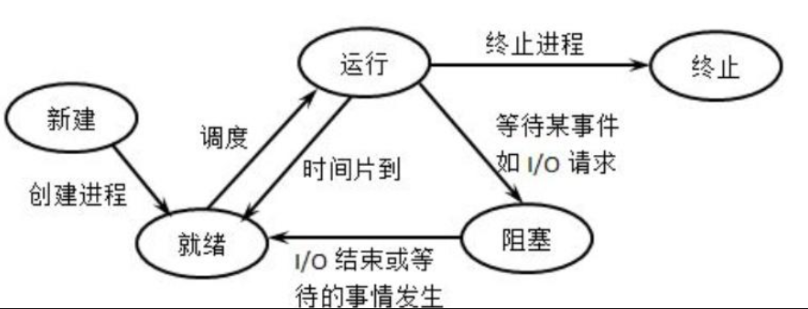
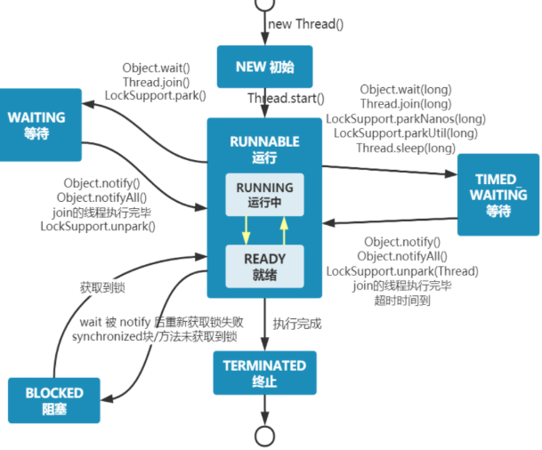
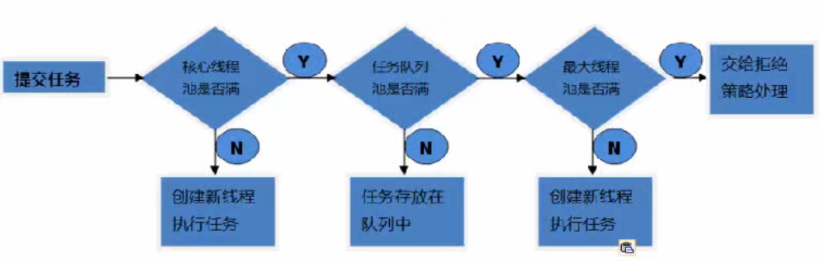

# JUC

### JUC 基础

#### 0、操作系统是什么，它的功能

##### 0.1 概念

操作系统就是计算机中最基本的系统软件，它负责管理计算机的硬件和软件资源，并合理的组织计算机**工作流程**。

##### 0.2 功能

（1）处理机管理：进程的创建、终止、同步、调度等。

（2）内存管理：内存地址的分配和回收、地址映射、内存保护、内存扩充（交换，覆盖，虚拟存储技术）。

（3）文件管理：文件的存储空间管理、对文件本身的管理，目录管理，文件共享、文件保护

等等。

（4）设备管理：设备的分配、缓存的管理、虚拟设备（Spoling）

（5）提供用户接口：GUI，联机的，脱机的，系统调用。

##### 0.3 特性

（1）并发：操作系统能让多个程序“同时运行”在一个处理器上（通过切换）

（2）共享：多个程序可以共同使用**计算机系统中的资源**，如 CPU、内存、磁盘、I/O 设备等。

（3）虚拟：将物理资源抽象成多个或者更大的**逻辑资源**，为每个用户/程序提供“独占”资源的假象。

虚拟内存：使程序可以使用比物理内存更大的地址空间。

虚拟 CPU：每个进程都感觉自己独占一个处理器。

（4）异步：程序的执行是**不可预知**的，系统通过**调度机制**决定哪个进程/线程何时运行。

#### 1. 什么是进程，什么是线程

进程的定义有很多，比如（1）进程就是程序的一次执行实体，是操作系统分配和管理资源的基本单位。亦或者（2）进程就是并发执行的程序在执行过程中分配和管理资源的基本单位。

线程就是一个轻量级的进程，当引入线程后， 操作系统调度的单位就不再是进程，而是线程了。同一个进程下可以产生多个线程，这些线程共享该进程的**堆**和**方法区**资源，但每个线程有自己的**程序计数器**、**虚拟机栈**和**本地方法栈**，寄存器等等。

#### 2. 并发和并行

**并发（Concurrency）**：并发指的是多个任务在同一个时间段内交替执行。在并发场景下，多个任务可以同时存在，但实际上每个任务只能以一种交替的方式执行，即任务之间可能会进行快速的切换或分时执行。这种交替执行的方式可以通过操作系统的时间片轮转或线程调度算法来实现。

**并行（Parallelism）**：并行指的是多个任务在同一时刻同时执行。在并行场景下，多个任务可以同时进行，每个任务拥有自己的处理单元（例如CPU核心），从而实现真正的并行执行。并行可以通过硬件支持和多线程编程技术来实现。

#### 3. 同步和异步

同步：并发执行的程序共同完成一些工作，是一个进程等待其他进程完成某些功能 | 返回某些数据后再去执行的等待关系。

异步：多个进程（或线程）之间的执行顺序是**相互独立、互不干扰**的。调用者发送一个请求后，**无需等待结果返回**，可以直接继续执行后续操作。当任务处理完成后，通常通过“回调”或“通知”机制来反馈结果。

互斥：是若干进程对需要互斥访问资源的竞争关系，也就是一个进程等待另一个占有互斥资源的进程释放该资源的等待关系。

#### 4. 线程的状态

传统进程 | 线程的状态通常是 5 种（新建、就绪、运行、阻塞、死亡），如下图：
 也就是，新建的进程得到除cpu以外的所有资源，就会进入到就绪态，之后得到cpu后，就会进入运行态，如果执行完毕，则直接进入终止态，如果因为时间片用完，则重写进入就绪态，如果是因为等待某事件，则进入阻塞态，直到该事件发生后，在进入就绪态。

<p align='center'>
    
</p>

而 Java 将线程的状态划分为了 6 态，分别为：

1. NEW： 初始状态，线程被创建出来但没有被调用 `start()` 。

2. RUNNABLE： 运行状态，线程被调用了 `start()`等待运行的状态。

3. BLOCKED：阻塞状态，需要等待锁释放。

4. WAITING：等待状态，表示该线程需要等待其他线程做出一些特定动作（通知或中断）。

5. TIME_WAITING：超时等待状态，可以在指定的时间后自行返回而不是像 WAITING 那样一直等待。

6. TERMINATED：终止状态，表示该线程已经运行完毕。（可以是正常执行完毕，也可能是出现异常，直接终止）

<p align='center'>
    
</p>


**补充**
 **操作系统**：严格区分 **Ready (就绪)** 和 **Running (运行)**。只有抢到了 CPU 时间片的才叫 Running。
 **Java**：统一叫 **RUNNABLE**。是因为现在的操作系统分时复用 CPU 非常快（每秒切换成千上万次），线程在“就绪”和“运行”之间切换得太频繁了。对于 JVM 来说，区分这两个状态意义不大，所以干脆合并。

#### 5. wait 和 sleep 的区别

- **释放锁资源**：`sleep()` 抱紧锁不放（只是让出 CPU），而 `wait()` 会**释放锁**（给别人机会用锁）。


- **所属类**：`sleep()` 是 `Thread` 类的静态方法；`wait()` 是 `Object` 类的方法。


- **使用环境**：`wait()` 必须在 `synchronized` 代码块或方法中使用，否则会抛出 `IllegalMonitorStateException`；`sleep()` 可以在任何地方使用。


- **唤醒方式**：`sleep()` 时间到自动苏醒；`wait()` 需要别人调用 `notify()` 或 `notifyAll()`。

#### 6. 创建线程的方式

继承 Thread 类：Java 是单继承。如果你继承了 `Thread`，就不能继承其他类了，**扩展性差**。

```java
class MyThread extends Thread{  
    @Override  
    public void run() {  
        System.out.println(Thread.currentThread().getName() + ":hello world");  
    }  
}  
public class initThread {  
    public static void main(String[] args) {  
        new MyThread().start();  
    }  
}
```

实现 runnable 接口：解耦。线程任务（Runnable）和线程运行（Thread）分离；**避免了单继承限制**。

```java
new Thread(() -> System.out.println(Thread.currentThread().getName() + ":hello world")).start();
```

实现 callable 接口：可以有**返回值**，且能**抛出异常**

```java

// 通过 callable 创建线程
FutureTask< String> task = new FutureTask<>(new Callable<String>() {
    @Override
    public String call() throws Exception {
        Thread.sleep(3000);
        return "callable";
    }
});
Thread t2 = new Thread(task);
```

线程池

```java
public static void main(String[] args) {
        ThreadPoolExecutor executor = new ThreadPoolExecutor(
                3,                                              // corePoolSize: 核心线程数，即使空闲也不会被回收（除非设置allowCoreThreadTimeOut）
                10,                                             // maximumPoolSize: 最大线程数，当队列满时会创建新线程直到达到此值
                100,                                            // keepAliveTime: 非核心线程空闲后的存活时间
                TimeUnit.MINUTES,                               // unit: 存活时间单位，这里为分钟
                new LinkedBlockingQueue<Runnable>(10),          // workQueue: 工作队列，容量为10，用于存放待执行的任务
                new NamedThreadFactory("my-pool"),               // threadFactory: 线程工厂，用于自定义线程名称、守护线程等属性
                new ThreadPoolExecutor.DiscardOldestPolicy()    // handler: 拒绝策略，丢弃队列中最老的任务，然后重新提交新任务
        );
    }

     /**
     * 自定义线程工厂，用于给线程设置名称
     */
    static class NamedThreadFactory implements ThreadFactory {
        private final AtomicInteger threadNumber = new AtomicInteger(1);
        private final String namePrefix;

        NamedThreadFactory(String namePrefix) {
            this.namePrefix = namePrefix;
        }

        @Override
        public Thread newThread(Runnable r) {
            Thread t = new Thread(r, namePrefix + "-thread-" + threadNumber.getAndIncrement());
            t.setDaemon(false);     // 设置为非守护线程
            t.setPriority(Thread.NORM_PRIORITY);  // 设置默认优先级
            return t;
        }
    }
```

一般来说，创建线程有很多种方式，例如继承`Thread`类、实现`Runnable`接口、实现`Callable`接口、使用线程池、使用`CompletableFuture`类等等。

不过，这些方式其实并没有真正创建出线程。准确点来说，这些都属于是在 Java 代码中使用多线程的方法。

严格来说，Java 就只有一种方式可以创建线程，那就是通过`new Thread().start()`创建。不管是哪种方式，最终还是依赖于`new Thread().start()`。

#### 7. Synchronized

Synchronized 锁的是什么？ 锁的是类对象 | 实例对象。也就是即使该类下有多个方法都被 synchronized 修饰，同时多个线程并发的调用该类的实例的不同的方法，他们抢的也是同一把锁。

如果是静态同步方法，此时锁的是类这个对象，也就是 class 的一个对象。

#### 8. 八锁问题

pass

总结：只有两种锁 phone.class 锁，实例对象锁

### Lock 锁

相比同步锁，JUC包中的Lock锁的功能更加强大，他是一个接口，提供了各种各样的锁（公平锁，非公平锁，共享锁，独占锁……），所以使用起来很灵活。

**这里主要有三个实现：**ReentrantLock、ReentrantReadWriteLock.ReadLock、ReentrantReadWriteLock.WriteLock

#### 1.  Reentrantlock

`ReentrantLock`是可重入的互斥锁，虽然具有与`synchronized`相同功能，但是会比`synchronized`有更多的方法，因此更加灵活。

#### 2. 锁的可重入性

**可重入锁（Reentrant Lock）**指的是：如果一个线程已经获得了某个锁，那么它**再次**请求这个相同的锁时，可以直接进入，而不会被自己阻塞。

实现原理：

- **计数器（Count）**：初始为 0。当线程第一次获得锁时变为 1，再次进入时自增（1, 2, 3...）。
- **持有者线程引用（Owner）**：记录当前是哪个线程拿着锁。

#### 3. 公平锁与非公平锁

公平锁：严格按照“**先来后到**”的顺序。多个线程竞争锁时，会进入一个等待队列，先排队的线程先拿到锁。

非公平锁 (Non-fair Lock)：**允许插队**。当锁释放时，正好来申请锁的线程会尝试直接抢锁。如果抢到了，就直接执行；抢不到，再乖乖去排队。

| **特性**         | **公平锁**               | **非公平锁**                              |
| ---------------- | ------------------------ | ----------------------------------------- |
| **性能**         | **较低**                 | **较高** (吞吐量大)                       |
| **线程切换开销** | 大（频繁唤醒、挂起线程） | 小（可能直接利用当前 CPU 时间片）         |
| **饥饿问题**     | 不存在（每个人都有机会） | **可能存在**（某些排队线程一直被插队）    |
| **默认选择**     | 需要显式设置             | **Java 默认选择** (`new ReentrantLock()`) |

1、减少线程唤醒切换的开销

2、非公平锁能更充分地利用 CPU：可能在唤醒排队线程的这段“漫长时间”里，插队的线程已经把活儿干完并释放锁了，大大提升了系统整体的**吞吐量**。

#### 4. 死锁

概念：产生死锁的一组进程中的每个进程都在等待该组进程中其他进程所拥有的资源，使得所有的进程再无外力的干扰下都无法向下推进。（专业定义就是：形成的资源分配图（无环）无法化简完全）。

#### 5. 死锁的必要条件

互斥性、不可剥夺、请求和保持、循环等待。

#### 6. 死锁的解决方式

（1）死锁的预防：破坏死锁产生的三个（互斥性一般无法破坏）条件之一即可。 

- 破坏不可剥夺条件：或者如果所请求的资源无法满足，那么之前具有的也会释放。

- 破坏请求和保持条件：必须一次性将所需要的资源全部分给它，如果无法全部分配就一个也不给。 

- 破坏循环等待条件：给资源编号，顺序资源分配法。在过程中，只要申请了资源编号为Ri的资源，以后的申请就只能申请资源编号大于Ri的。 

（2）死锁的避免：安全性检查算法。先看能不能给他，再假设给他，看是否存在一条安全性序列，不存在的话就不安全。（不安全的状态有可能会导致死锁，安全状态不会的）。

（3）死锁的检测与解除：构造资源分配表，看是否能够化简完全（即看是否存在环路）。

而在java代码中，解决死锁的方案有：

有限等待

```java
lock.tryLock() // 不传参，抢不到锁，直接走，一点都不等
lock.tryLock(waitTime, timeUnit) // 在 waitTime 内没抢到锁，直接走人。
```

#### 7. Synchronize 和 ReentrantLock 的区别

- 它们都是可重入锁

- Synchronized 的加锁解锁无需自己管理，ReentrantLock 加锁解锁需要我们手动管理，灵活！

- synchronized 不可响应中断，一个线程获取不到锁就一直等着；`ReentrantLock可以响应中断`（tryLock方法：获取不到锁则返回false）。

- synchronized不具备设置公平锁的特点，`ReentrantLock可以成为公平锁`。

#### 8.ReentrantReadWriteLock

普通的 `ReentrantLock` 或 `synchronized` 是**完全互斥**的。如果 100 个线程同时读取一个数据，它们也必须排队，这在读取操作耗时较长时非常浪费性能。 读写锁允许多个线程同时读取，只有在有人要修改（写）时，才进行排队。

- **读锁（Shared Lock）**：共享锁。如果没有线程持有写锁，多个线程可以同时获取读锁。
- **写锁（Exclusive Lock）**：独占锁。只要有人持有读锁或写锁，写线程必须等待；一旦写锁被持有，其他任何读/写请求都必须排队。
- **公平性选择**：支持公平和非公平模式。
- **可重入性**：读线程可以再次获取读锁，写线程可以再次获取写锁（甚至可以降级为读锁）。

#### 9. 读写锁的写降级

- **锁降级流程**：持有写锁 -> 获取读锁 -> 释放写锁 -> 最后释放读锁。 
- **目的**：为了保证数据可见性。如果你先释放写锁再抢读锁，中间可能被别的写线程插队修改了数据。通过降级，你可以确保在释放写锁后，自己依然持有读锁，看到的还是刚才写入的最新数据。

如果拿着写锁去读，就会导致并发读失效。

### 线程间通信

#### 1. 通信方法回顾

- **`wait()`**：让当前线程释放锁，进入 **等待队列（Waiting Pool）**，并挂起。    
- **`notify()`**：从等待队列中**随机**唤醒一个线程，使其进入锁池竞争锁。
- **`notifyAll()`**：唤醒等待队列中**所有**线程，让它们都去竞争锁。

**必须在 `synchronized` 块内调用**： 执行这三个方法前，线程必须先持有该对象的锁。否则会抛出 `IllegalMonitorStateException`。

#### 2. 虚假唤醒

简单来说，就是**线程在没有被 `notify()` 或 `notifyAll()` 显式通知的情况下，或者在不满足执行条件的情况下，无故从 `wait()` 状态中醒来。**

防范虚假唤醒的唯一准则：永远使用 `while` 循环而非 `if` 来检查等待条件。

```java
synchronized (lock) {
    // 1. 必须用 while，防止线程被意外唤醒后条件仍不满足（虚假唤醒）
    while (条件不满足) {
        lock.wait(); 
    }
    // 2. 条件满足，执行业务逻辑
    doSomething();
    // 3. 唤醒其他线程
    lock.notifyAll();
}
```

#### 3. Condition

在 Java 的 `java.util.concurrent.locks` 包中，`Condition` 对象通常是配合 `ReentrantLock` 使用的。

```java
Lock lock = new ReentrantLock();
// 创建两个不同的等待空间
Condition notFull  = lock.newCondition(); 
Condition notEmpty = lock.newCondition(); 

public void put(Object x) {
    lock.lock();
    try {
        while (count == items.length) {
            notFull.await(); // 队列满了，生产者去 notFull 队列歇着
        }
        // 生产逻辑...
        notEmpty.signal(); // 生产完了，【只叫醒】在 notEmpty 队列等的消费者
    } finally {
        lock.unlock();
    }
}

public void take() {
    lock.lock();
    try {
        while (count == 0) {
            notEmpty.await(); // 队列空了，消费者去 notEmpty 队列歇着
        }
        // 消费逻辑...
        notFull.signal(); // 消费完了，【只叫醒】在 notFull 队列等的生产者
    } finally {
        lock.unlock();
    }
}
```

- 对应关系：

  - `wait()` 对应 `await()`
  - `notify()` 对应 `signal()`
  - `notifyAll()` 对应 `signalAll()`
  
- **虚假唤醒**： `Condition` 同样存在虚假唤醒问题，所以 **依然必须使用 `while` 循环** 包裹 `await()`。

- **底层原理**： 每个 `Condition` 对象内部其实都维护了一个自己的 **等待队列**（单向链表）。当你调用 `await()` 时，线程会被封装成 Node 节点放入该队列并释放锁；当调用 `signal()` 时，会将节点从 Condition 队列转移到 AQS 的同步队列（双向链表）中去重新竞争锁。

### 并发容器类

#### 1. 线程不安全的集合

ArrayList、HashMap、HashSet... ，对于这些线程不安全的集合，java 采用的机制是 fast-fail，通过变量 modCount，确实再出现并发读写的情况下抛出异常 ：`java.util.ConcurrentModificationException`

#### 2. CopyWriteArrayList

通过读写分离思想实现了集合的安全的并发读写。在写数据时，会将底层数组拷贝一份，然后在这个数据上进行写操作，之后再将引用指向该数组。适用于读多写少常见，

1. 数组拷贝频繁
2. 读线程存在数据不一致问题，可能读不到新数据

#### 3. CopyOnWriteArraySet

底层就是一个 `CopyWriteArrayList`,因此在写元素时，为了保证不重复，需要遍历底层数据，效率非常低，适用于读多写少的场景。

#### 4. ConcurrentHashMap

##### 4.1 jdk 1.7 分段锁机制

- **数据结构**：`Segment` 数组 + `HashEntry` 数组 + 链表。

- **锁的原理**：每一个 `Segment` 元素都是一把 `ReentrantLock`。默认有 16 个 Segment。

- 执行流程：

  1. 对 Key 进行第一次 Hash，定位到它是哪个 **Segment**。
  2. 锁定这个 Segment（由于它是锁，其他线程访问这个 Segment 的数据会被阻塞）。
  3. 对 Key 进行第二次 Hash，定位到具体的 **HashEntry** 数组下标。
  4. 在链表中进行操作。
  
- 缺陷：

  - **粒度不够细**：虽然比全表加锁好，但一个 Segment 下面管着很多哈希桶，一旦锁定，整个区域都动不了。
- **性能损耗**：两次 Hash 的计算成本较高。

##### 4.2 jdk 1.8之后

在 1.8 中，逻辑变成了：**“无锁优先，局部锁桶”**。

- **数据结构**：`Node` 数组 + 链表 + 红黑树。这和普通的 `HashMap` 结构一样。
- **锁的原理**：抛弃了 Segment，直接在 **Node 数组的头节点**上加锁。
- **核心组件**：
  - **CAS (Compare And Swap)**：用于处理“槽位为空”时的插入。
  - **synchronized**：用于处理“槽位有值（碰撞）”时的插入或更新。
  - **volatile**：保证 Node 数组和内部变量的可见性。

put 的流程：

- **第一步：计算位置**。计算 Key 的哈希值，找到对应的桶（数组下标）。
- 第二步：CAS 写入（无锁）。

  - 如果这个位置是**空的**，直接尝试用 **CAS** 把新节点放进去。
- 如果成功，流程结束。**全程没加锁**，效率极高。
- **第三步：检测扩容**。如果发现节点状态是 `MOVED`，说明 Map 正在扩容，当前线程会去**帮忙扩容**（这也是 1.8 性能高的原因）。
- 第四步：synchronized 锁桶。

  - 如果位置**不为空**且没有在扩容，说明发生了哈希碰撞。
  - 此时，线程会用 `synchronized` **只锁住这个桶的头节点**。
  - 锁住后，遍历链表（或红黑树），进行覆盖或追加操作。
- **第五步：树化**。如果链表长度超过 8 且数组长度超过 64，转为红黑树。

### JUC 强大的辅助类

#### 1. CountDownLatch

`CountDownLatch` 是 JUC 包中一个极其常用的同步辅助类，它的作用是：**允许一个或多个线程，等待其他线程完成操作后再继续执行。**

##### 1.1 核心原理

- **初始化**：在创建 `CountDownLatch` 时，必须指定一个初始计数值 `N`。
- **减法操作**：每当一个任务执行完成后，调用 `countDown()` 方法，计数器减 1。
- **阻塞等待**：主控线程调用 `await()` 方法。如果计数器不为 0，主控线程会一直阻塞；当计数器减到 **0** 时，`await()` 方法返回，主控线程恢复运行

##### 1.2 常用方法

| **方法**                                 | **描述**                                             |
| ---------------------------------------- | ---------------------------------------------------- |
| **`new CountDownLatch(int count)`**      | 构造函数，初始化计数器的值（不可重置）。             |
| **`await()`**                            | 阻塞当前线程，直到计数器为 0 或线程被中断。          |
| **`await(long timeout, TimeUnit unit)`** | 阻塞当前线程，但设置了最长等待时间，超时后自动醒来。 |
| **`countDown()`**                        | 计数器减 1。该方法**不会阻塞**调用线程。             |
| **`getCount()`**                         | 获取当前计数器的剩余值。                             |

#### 2. CyclicBarrier

它是一个**多线程执行的集合点**。当一组线程到达这个点（屏障）时会被阻塞，直到最后一个线程也到达，屏障才会开启，所有线程再次同步出发。

##### 2.1  关键特性

关键特性：

- **可循环使用（Cyclic）**：这是它和 `CountDownLatch` 最大的区别。当所有线程出发后，屏障会自动重置，可以接着等下一波线程。
- 支持回调：当线程都来了以后，可以执行一个预定义任务。

##### 2.2 常用方法

- **`new CyclicBarrier(int parties, Runnable barrierAction)`**：初始化线程齐的数量和线程齐后的动作。再细一点：parties 规定了这个障碍会在多少线程来这里后才会打开，而 burrierAction 就像线程起了以后要执行的一个任务。
- **`await()`**：线程告诉屏障“我到了”，然后原地坐下等其他人。

##### 2.3 区别

| **特性**     | **CountDownLatch**        | **CyclicBarrier**                  |
| ------------ | ------------------------- | ---------------------------------- |
| **角色**     | 一个线程等一组线程        | 一组线程互相等待                   |
| **复用性**   | 一次性，减到 0 就废了     | **可循环使用**，满员即重置         |
| **动作**     | 主线程通过 `await()` 等待 | 所有子线程都通过 `await()` 互等    |
| **底层实现** | 基于 AQS 共享锁           | 基于 **ReentrantLock + Condition** |

“CountDownLatch 是单向的减法（减到 0 结束）；而 CyclicBarrier 像是景区的观光车，必须坐满 10 个人才发车，发完一辆，原地重置再等下 10 个人。

#### 3. Semaphore

它用来**控制同时访问特定资源的线程数量**。它维护了一组“许可证”（Permits），线程想干活得先拿证，干完活得还证；证发完了，剩下的线程就得排队等。

##### 3.1  特性

- **限流器**：它是最简单的限流工具，防止过大的并发压垮核心资源。
- **资源共享**：不同于锁（一次只能一个），信号量可以允许多个线程同时进入。
- **支持伸缩**：你可以在运行期间动态地增加或减少许可证（资源）的数量。

##### 3.2 常用方法

- **`new Semaphore(int permits)`**：设置初始资源数。
- **`acquire()`**：抢资源。如果没位子了，线程就阻塞直到有人走。
- **`release()`**：释放资源并且唤醒排队的人。

##### 3.3 典型场景

- **数据库连接池**：数据库只允许 20 个并发连接，那就设 20 个信号量，谁拿到了谁连。
- **秒杀限流**：核心处理逻辑只允许同时 100 个请求进入，剩下的外面等着。

##### 3.4 总结

- **CountDownLatch**：一个裁判等一群人，**做减法**，不能重置。
- **CyclicBarrier**：一群人互等，**人齐才动**，可以循环。
- **Semaphore**：控制访问特定资源的并发数，**抢车位**，有借有还。

### Callable 接口

#### 1. 为什么有 Callable 接口

`Runnable` 是“干活不回话”（无返回值、不能抛异常）；`Callable` 是“干活且复命”（有返回值、能抛出受检异常）。

#### 2. 使用方法

`Thread` 类的构造函数只接受 `Runnable`，不直接接受 `Callable`。所以需要一个“中间人”——**`FutureTask`**。

- **原理**：`FutureTask` 实现了 `RunnableFuture` 接口（既是 `Runnable` 也是 `Future`）。
- **逻辑**：把 `Callable` 丢给 `FutureTask`，再把 `FutureTask` 丢给 `Thread`。

```java
public class CallableDemo {
    public static void main(String[] args) throws ExecutionException, InterruptedException {
        // 1. 创建 Callable 任务
        Callable<Integer> callable = () -> {
            System.out.println(Thread.currentThread().getName() + " 正在计算...");
            Thread.sleep(2000);
            return 1024; // 返回结果
        };

        // 2. 用 FutureTask 包装（中间人）
        FutureTask<Integer> futureTask = new FutureTask<>(callable);

        // 3. 丢给 Thread 执行
        new Thread(futureTask, "计算线程").start();

        // 4. 获取结果（注意：get 方法是阻塞的！）
        System.out.println("等待计算结果...");
        Integer result = futureTask.get(); 
        System.out.println("最终结果是：" + result);
    }
}
```

#### 3. cancel 方法

在并发编程中，取消一个正在执行的任务和开启它一样重要。`futureTask.cancel(boolean mayInterruptIfRunning)` 是核心方法。

- `false`：温和取消。
- 如果任务还没开始，就永远不再执行。
  - 如果任务**已经开始**，则允许它运行完，只是 `get()` 时会抛出异常。

- `true`：强力中断。
- 如果任务正在运行，会直接给执行线程发一个 **`interrupt()`** 中断信号。

### BlockingQueue

`BlockingQueue` 是 Java 并发编程中最重要的组件之一，它是**生产者-消费者模型**的核心。

#### 1. 核心逻辑

它是一个支持两个附加操作的队列：

- **出队阻塞**：当队列为空时，从队列中获取元素的线程会等待，直到队列中有数据。
- **入队阻塞**：当队列满时，试图放入元素的线程会等待，直到队列有空位。

#### 2. 常用方法

| **方法类型** | **抛出异常** | **返回特殊值** | **阻塞等待（最常用）** | **超时退出**           |
| ------------ | ------------ | -------------- | ---------------------- | ---------------------- |
| **插入**     | `add(e)`     | `offer(e)`     | **`put(e)`**           | `offer(e, time, unit)` |
| **移除**     | `remove()`   | `poll()`       | **`take()`**           | `poll(time, unit)`     |
| **检查**     | `element()`  | `peek()`       | 不可用                 | 不可用                 |

注意，Queue接口提供了新的remove方法，该方法直接删除并返回队头元素。而BlockingQueue又提供了poll方法，也就是如果元素不存在，也不会报错，而是返回特殊值 null。

### 线程池

#### 1. 概念

线程池的目的就是：“通过重用线程降低资源消耗（减少线程创建和销毁的次数）、提高响应速度（任务到达即执行）、提高线程的可管理性（避免无限创建导致 OOM）。

#### 2. 七大参数

```java
public ThreadPoolExecutor(int corePoolSize,  
                          int maximumPoolSize,  
                          long keepAliveTime,  
                          TimeUnit unit,  
                          BlockingQueue<Runnable> workQueue,  
                          ThreadFactory threadFactory,  
                          RejectedExecutionHandler handler)
```

- `corePoolSize`：线程池中的常驻核心线程数。即使线程处于空闲状态，也不会被销毁，除非设置了 `allowCoreThreadTimeOut`。当有新任务提交时，如果当前线程数少于核心线程数，
- `maximumPoolSize`：线程池能够容纳同时执行的最大线程数。当队列满了且核心线程都在忙时，线程池会继续创建线程直到达到这个值。
- `keepAliveTime`：非核心线程（临时工）闲置时的存活时长。
- `unit`：`keepAliveTime` 参数的时间单位（如 `TimeUnit.SECONDS`）。
- `workQueue`：用于保存等待执行任务的阻塞队列（`BlockingQueue`）。
- `threadFactory`：用于创建新线程的工厂。
- `handler`：当线程池和队列都达到饱和状态时，对新任务的处理方案

#### 3. 工作原理

注意点一：默认情况下，线程池是**懒加载**的。即使你定义了 `corePoolSize = 10`，刚 `new` 出来时，池子里一个线程都没有。我们可以通过手动预热：

- `prestartCoreThread()`：启动一个核心线程。
- `prestartAllCoreThreads()`：启动所有核心线程。

首先，我们手动的给七大参数赋值，得到一个合理的线程池，之后，当有任务提交时：

<p align='center'>
    
</p>

#### 4. 拒绝策略

- **`AbortPolicy`**（默认）：直接抛出 `RejectedExecutionException` 运行时异常。
- **`CallerRunsPolicy`**：“调用者运行”机制，将任务退回给调用者（例如主线程）自己执行。
- **`DiscardOldestPolicy`**：抛弃队列中等待最久（队头）的任务，然后尝试重新提交当前任务。
- **`DiscardPolicy`**：直接丢弃任务，不予处理也不抛出异常。
- 自定义处理类：实现`RejectedExecutionHandler`接口，重写 rejectExecution 方法

#### 5. 创建方式

**A. ❌ 不推荐：使用 `Executors` 工具类创建** 工厂，虽然写起来简单，但存在严重的资源耗尽（OOM）风险：

- **`newFixedThreadPool` / `newSingleThreadExecutor`**：
  - **风险点**：允许的请求队列（`LinkedBlockingQueue`）长度为 2^{31}-1，如果任务处理慢，队列会无限堆积，最终撑爆内存（OOM）。
- **`newCachedThreadPool`**：
  - **风险点**：允许创建的线程数量为 2^{31}-1，如果瞬时流量极大，会开启无数线程，耗尽 CPU 和内存资源导致 OOM。

B. **✅ 推荐：手动 `new ThreadPoolExecutor`** 这是《阿里巴巴 Java 开发手册》强制要求的做法。

#### 6. 线程关闭的方式

shutdown（）：线程池状态变为 `SHUTDOWN`。之后就不再接受新任务了，但会保证现在的任务 + 阻塞队列里的执行完之后再去关闭

shutdownNow()：线程池状态变为 `STOP`。尝试中断现在正在执行的任务 + 清空等待队列中还没开始的任务 + 返回在任务队列中还没开始的任务列表。

两个判断状态的方法：

- `isShutdown()`：只要调用了上面的关闭方法，就返回 `true`。
- `isTerminated()`：只有当所有任务都执行完毕，线程池彻底关闭后，才返回 `true`。

#### 7. 核心线程数 + 最大线程数如何设置

最大线程数：这要看当前任务的类型了，如果是 cpu 密集型，那么最好设置为 cpu 核心数 + 1，如果是 IO 密集型，则设置为两倍 | 三倍的 cpu 核心数。

核心线程数：最佳实践，和最大线程数相同就可以了。

### CompletableFuture 的用法

#### 1. 创建异步任务

##### 1.1 supplyAsync

supplyAsync 能够创建带有返回值的异步任务。

```java
// 1. 创建一个带有返回值的CompletableFuture  
CompletableFuture<Integer> task1 = CompletableFuture.supplyAsync(() -> {  
    System.out.println("任务1开始执行");  
    int i = 10 / 2;  
    System.out.println("任务1执行完毕");  
    return i;  
});
```

##### 1.2 runAsync

runAsync 是创建没有返回值的异步任务。

```java
// 2. 创建没有返回值的异步任务  
CompletableFuture<Void> future = CompletableFuture.runAsync(() -> {  
    System.out.println("hello world");  
});  
System.out.println(future.get());
```

##### 1.3 获取任务的结果

- **`get()`**：**死等结果**。如果任务没完就一直阻塞，且强制你处理 `InterruptedException`（中断）和 `ExecutionException`（执行异常）。
- **`get(long timeout, TimeUnit unit)`**：**限时等结果**。超时还没返回就抛出 `TimeoutException`。在生产环境最常用，防止一个接口卡死导致全局崩溃。
- **`join()`**：**更优雅的 get**。逻辑和 `get()` 一样，但它抛出的是 `unchecked` 异常，这意味着你写 Lambda 表达式时不需要写繁琐的 `try-catch`。
- **`getNow(T valueIfAbsent)`**：**等不起就不等**。调用时如果任务完了就拿结果，没完就直接返回你传入的“兜底值” `valueIfAbsent`。

#### 2. 异步回调处理

##### 2.1 thenApply 以及 thenApplyAsync

thenapply 表示某个任务执行完毕后执行的动作，也就是回调方法，会将之前任务的执行结果传入到当前回调方法中，有返回值。它两的区别在于：谁来执行这个回调函数，如果是 thenApply，则倾向于让前置任务的那个线程来完成当前回调函数，而 thenApplyAsync 则相当于重新将当前回调任务丢给线程池，然后分配线程去执行。

##### 2.2 thenAccept 和 thenAcceptAsync

thenapply 表示某个任务执行完毕后执行的动作，也就是回调方法，但是本身没有返回值。

##### 2.3 thenRun 和 thenRunAsync

无入参，无返回值的回调函数。

##### 2.4 whenComplete 和 whenCompleteAsync

回调方法，该回调方法会接收前置方法的返回值和抛出的异常。没有返回值。

##### 2.5 handle 和 handleAsync

回调方法，该回调方法会接收前置方法的返回值和抛出的异常。有返回值

#### 3. 多任务组合处理

##### 3.1 thenCombine、thenAccpetboth、runAfterBoth

这三个方法都是将两个 `CompletableFuture` 组合起来处理，**只有当两个任务都正常完成时**，才进行下一阶段任务。

区别就是：

- thenCombine 会将这两个任务的返回值作为当前任务的入参，且当且任务有返回值。
- thenAcceptBoth 会将这两个任务的返回值作为当前任务的入参，但本身没返回值
- runAfterBoth 就是没有入参，也没有返回值

##### 3.2 applyToEither、acceptEither、runAfterEither

这些方法也是将两个 Cf 组合起来处理，但是于 thenCombine.. 不同，他们是只有要一个任务正常执行了，就会进行下阶段任务。

区别：

- `applyToEither` 会把哪个正常执行的任务的返回值当作当前任务的入参，同时有返回值
- `acceptEither` 同理，但无返回值
- `runAfterEither` 既无入参，也无出参

##### 3.3 allof / anyof

`allOf` : 多个任务都执行完成后才会继续下一阶段，无参数，所以正常执行，返回null，否则返回异常

`anyOf`：在多个任务中，只要有一个异步任务完成，就会执行下一阶段，并且返回值是跑的最快的任务的结果。

### 底层原理

#### 1. JMM

##### 1.1 JMM 概念与架构

JMM 是 Java 并发编程的**底层基石**。它不是真实存在的物理内存，而是一组**规范**，定义了程序中各个变量（实例字段、静态字段和构成数组对象的元素）的访问方式。

499x416

- **主内存 (Main Memory)**：所有变量都存储在主内存中，是所有线程共享的区域。
- **工作内存 (Working Memory)**：每个线程都有自己的工作内存（类似于 CPU 高速缓存）。线程对共享变量的所有操作（读取、赋值）都必须在工作内存中进行，不能直接读写主内存中的变量。

##### 1.2 Jmm 内存模型的三大特性

- **可见性 (Visibility)**：当一个线程修改了共享变量的值，其他线程能够立即得知这个修改。(`volatile`、`synchronized`、`final` 可保证)
- **原子性 (Atomicity)**：一个或多个操作，要么全部执行且执行过程不被中断，要么全部不执行。(`synchronized`、`Atomic` 原子类可保证)
- **有序性 (Ordering)**：程序执行的顺序按照代码的先后顺序执行。为了性能，编译器和处理器会对指令进行**重排序**，JMM 通过 `happens-before` 原则来约束这种行为。

#### 2. Volatile 关键字

`volatile` 是 Java 虚拟机提供的**最轻量级**的同步机制。在 JVM 底层，它主要通过 **内存屏障（Memory Barrier）** 来保证 JMM 模型中的两个核心特性。

##### 2.1 保证两大核心特性

- 保证可见性 (Visibility)
  - **原理**：当一个线程修改了 `volatile` 修饰的变量，它会立即被刷回主内存；同时，其他线程工作内存中该变量的缓存行会失效，被迫重新从主内存读取。
  - **效果**：确保了“一个线程修改，其他线程立即可见”。
- 禁止指令重排序 (Ordering)
  - **原理**：编译器在生成字节码时，会在 `volatile` 变量的读写操作前后插入**内存屏障**。
  - **效果**：防止编译器和处理器为了优化性能而打乱代码的执行顺序

##### 2.2 Volatile 不能保证原子性

```
volatile int count = 0; // 多个线程执行 count ++
```

`count++` 实际上包含三个步骤：读取、加一、写回。即使变量是 `volatile` 的，如果两个线程同时读取了旧值，依然会覆盖彼此的修改。

#### 3. 原子类

原子类位于 `java.util.concurrent.atomic` 包下。它的核心作用是：**在不使用 `synchronized`（锁）的情况下，保证单个变量操作的原子性。**

##### 3.1 底层原理

CAS：如果 `V == A`，说明没有其他线程改过这个值，就把 `V` 修改为 `B`；如果 `V != A`，说明被别人改过了，修改失败，通常会开启**自旋**（不断重试直到成功）。

V：主内存值  A：预期原值 B：准备更新的新值

**底层支撑**：通过 `Unsafe` 类调用 CPU 底层的原子指令。

##### 3.2 原子类

- 基本类型的原子类：`AtomicInteger`、`AtomicLong`、`AtomicBoolean`。
- 数据类型的原子类：`AtomicIntegerArray`、`AtomicLongArray`。保证数组中每个元素的原子操作。
- 引用类型的原子类：`AtomicReference<V>`

##### 3.3 缺点

- ABA 问题：

  - **现象**：线程 1 读取值为 A，此时线程 2 把值改为 B 又改回 A。线程 1 检查发现还是 A，以为没变过，其实中间变过了。
  - **解决**：使用 `AtomicStampedReference`。它不仅比较值，还比较**版本号（Stamp）**
  
- 循环时间长，开销大：

  - 如果高并发下很多线程竞争同一个变量，CAS 一直失败并自旋，会给 CPU 带来巨大压力。

- 只能保证一个共享变量的原子操作：

  - 对多个变量组合的原子性，还是得用 `synchronized`。

##### 3.4 优点

轻量级 + 性能高！

1、**无锁化**：CAS 是一种**乐观锁**的实现。它不需要像 `synchronized` 那样去请求内核态的锁，避免了线程在“阻塞”和“唤醒”状态之间切换

2、线程不会被挂起（非阻塞）

#### 4.  AQS

`AbstractQueuedSynchronizer` (抽象队列同步器) **简称AQS**，是整个java.util.concurrent包的核心。AQS框架提供了一套通用的机制来管理同步状态（synchronization state）、阻塞/唤醒线程、管理等待队列。

##### 4.1 底层

底层就是双端队列 + 状态值

##### 4.2 AQS 定义的资源共享方式

独占：只有一个线程能执行。共享：多个线程可同时执行。