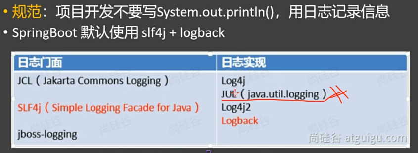
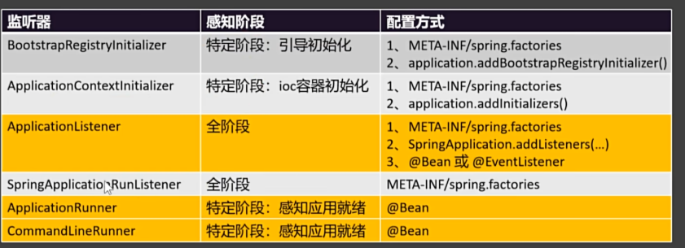

## Springboot 基础
### 1. Spring Boot的概念、功能

简单来说，Spring Boot 能让你**快速创建、配置和运行 Spring 应用**，无需手动添加大量 XML 配置或繁琐的依赖管理。以前用 Spring 写 Web 项目，要配 `web.xml`、Dispatcher Serverlet、Spring 容器……一大堆配置。 

现在用 Spring Boot，你只需要：

1. 加个 `spring-boot-starter-web` 依赖，
2. 写个 `@SpringBootApplication` 注解的主类，
3. 运行 `main` 方法 —— 项目就跑起来了！

### 2. 场景启动器

Starters are a set of convenient dependency descriptors that you can include in your application. You get a one-stop shop for all the Spring and related technologies that you need without having to hunt through sample code and copy-paste loads of dependency descriptors. For example, if you want to get started using Spring and JPA for database access, include the `spring-boot-starter-data-jpa` dependency in your project.

启动器是一组方便的依赖项描述符，您可以将其包含在应用程序中。您可以在一个地方获取所有需要的 Spring 及相关技术，而无需在示例代码中搜寻并复制粘贴大量的依赖项描述符。例如，如果您想开始使用 Spring 和 JPA 进行数据库访问，请在项目中包含 `spring-boot-starter-data-jpa` 依赖项。

The starters contain a lot of the dependencies that you need to get a project up and running quickly and with a consistent, supported set of managed transitive dependencies.

这些启动器包含大量您需要的依赖项，能让您快速启动项目，并且拥有一套一致且受支持的受管传递依赖项。

### 3.  自动配置
#### 3.1 概念

Spring Boot 自动配置是指：在 Spring 容器启动时，基于项目中添加的依赖（Classpath 里的 Jar 包）和配置，自动将需要的 Bean 对象装配进 IOC 容器，从而实现“约定大于配置”，免去手动编写大量繁琐 XML 或 Java 配置文件的过程。

#### 3.2 核心流程

1. 创建项目
2. 选择场景启动器
3. 场景启动器一导入，就从META-INF/spring.org.springframework.boot.autoconfigure .AutoConfiguration.imports下面导入一堆自动配置类到spring容器中。
4. 这些 xxxAutoConfiguration 基于 @Conditional 注解有导入了一堆的组件
5. 之后业务就可以使用这些组件了

#### 3.3 DataSourceAutoConfiguration 的导入流程

	6. 在使用之前，自动配置类把组件配置到容器中，要做两件事
	
		6.1把属性类和配置文件进行绑定
		6.2：把组件要用到的所有属性，也就是这个属性类放到容器中

### 4. 常用基本功能

#### 1. 属性绑定 @ConfigurationProperties
```java
@Data
@Component
@ConfigurationProperties(prefix = "dog")
public class DogProperties {
    private String name;    private String age;
    private String sex;
}

// 配置文件
dog:
  age: 18
  name: 旺财
  sex: 雄性
```
#### 2. yaml语法

	1.  yaml语法都是 key : value
	2.  一个对象就是多个 key : value, 也可以用: {name: 小咪, age: 18}  表示
	3.  数据可以用[i1, i2, i3]表示,也可以用 - i1, -i2 表示
	
	注:如果同时存在.properties与.yaml,优先使用.properties下的配置

```yaml
person:  
  name: 李四  
  age: 18  
  birthday: 2019/01/01 00:00:00  
  like: true  
  child:  
    name: 张三  
    age: 10  
    birthday: 2018/01/01 00:00:00  
  dogs:  
    - name: 旺财  
      age: 18  
    - name: 旺财2  
      age: 18  
  cats:  
    cat1:  
      {name: 小咪, age: 18}  
    cat2:  
      {name: 小咪2, age: 18}
```
#### 3. 自定义banner

通过修改 spring.banner.location=classpath:banner.txt 去自定义bannner

#### 4. 启动 SpringApplication 的其他方法

第一种就是先把 SpringApplication 对象实例化出来,然后调用它的run方法,这样的好处是可以做一些配置.

```java
public static void main(String[] args) {  
  
       // 1. 创建SpringApplication对象  
       SpringApplication app = new SpringApplication(SpringbootDemoApplication.class);  
  
       // 2. 配置  
       app.setBannerMode(Banner.Mode.OFF);  
  
       // 3. 启动SpringApplication对象  
       app.run(args);  
   }
```

第二种方法就是通过 SpringApplicationBuilder 来链式启动 Spring 应用.

```java
builder.sources(SpringbootDemoApplication.class)  
        .bannerMode(Banner.Mode.OFF)  
        .run(args);
```

#### 5. 日志

日志系统描述:

<p align='center'>
    
</p>


##### 5.1 日志的级别

从低到高,越打印,越粗糙.日志的默认级别(info),只会打印日志级别及其以上的日志.

All --> Trace --> DEBUG --> INFO --> WARN --> ERROR --> OFF

```
logging.level.root=debug
logging.level.xx包的全类名=xx级别
```

##### 5.2 日志的使用方式

首先，先导入日志的场景启动器

``` java
<dependency>  
    <groupId>org.springframework.boot</groupId>  
    <artifactId>spring-boot-starter-logging</artifactId>  
</dependency>
```

方法1 : 直接通过日志工厂获得一个工厂类

```java
@SpringBootTest  
public class LoggingTest {  
  
    // 获得一个日志  
    Logger logger = LoggerFactory.getLogger(LoggingTest.class);  
  
    @Test  
    public void test01(){  
        logger.trace("trace...");  
        logger.debug("debug...");  
        logger.info("info...");  
        logger.warn("warn...");  
        logger.error("error...");  
    }  
}
```

方法2 : lombok的 @Slf4j 注解会自动注册并注入一个日志类,名字为log,我们直接调log就可以.

```java
@Slf4j  
@SpringBootTest  
public class LoggingTest {  
  
    @Test  
    public void test01(){  
        log.trace("trace...");  
        log.debug("debug...");  
        log.info("info...");  
        log.warn("warn...");  
        log.error("error...");  
    }  
}
```

##### 5.3 日志分组

日志分组能够更加细粒度的控制不同包,不同类的日志级别,也就是对每一组统一来控制级别

```java
logging.group.group1=全类名1,全类名2,...
```

##### 5.4 日志输出到文件

<p align="center">
    
</p>

##### 5.5 日志归档与滚动切割

Spring Boot 项目中通过 `application.yml` 或 `application.properties` 配置 Logback 的日志滚动策略，实现日志文件的自动切割与归档。

| 配置项                                                 | 说明                                   | 推荐值/示例                                   |
| ------------------------------------------------------ | -------------------------------------- | --------------------------------------------- |
| `logging.logback.rollingpolicy.clean-history-on-start` | 是否在应用启动时清理旧的日志归档文件   | `false`（建议设为 `false`，避免误删历史日志） |
| `logging.logback.rollingpolicy.file-name-pattern`      | 归档日志文件的命名格式                 | `app-%d{yyyy-MM-dd}.log`（按天切割）          |
| `logging.logback.rollingpolicy.max-file-size`          | 单个日志文件的最大大小，超过则触发滚动 | `2MB`（可根据项目日志量调整）                 |
| `logging.logback.rollingpolicy.max-history`            | 保留归档日志文件的最大天数（或数量）   | `7`（保留最近7天的日志）                      |

配置演示:

```yaml
logging:
  logback:
    rollingpolicy:
      # 是否在应用启动时删除旧的归档日志
      clean-history-on-start: false
      
      # 归档日志文件名格式：按日期切割
      file-name-pattern: app-%d{yyyy-MM-dd}.log
      
      # 每个日志文件最大 2MB，超过则创建新文件
      max-file-size: 2MB
      
      # 最多保留 7 天的历史日志文件
      max-history: 7
```


##### 5.6 引入日志框架自己的配置文件

``` 
<?xml version="1.0" encoding="UTF-8"?>  
<configuration>  
  
    <contextName>logback</contextName>  
  
    <!-- 日志的输出目录 -->  
    <property name="log.path" value="D://work//tingshu_work//logs" />  
  
    <!--控制台日志格式：彩色日志-->  
    <!-- magenta:洋红 -->  
    <!-- boldMagenta:粗红-->  
    <!-- cyan:青色 -->  
    <!-- white:白色 -->  
    <!-- magenta:洋红 -->  
    <property name="CONSOLE_LOG_PATTERN"  
              value="%yellow(%date{yyyy-MM-dd HH:mm:ss}) %highlight([%-5level]) %green(%logger) %msg%n"/>  
  
    <!--文件日志格式-->  
    <property name="FILE_LOG_PATTERN"  
              value="%date{yyyy-MM-dd HH:mm:ss} [%-5level] %thread %file:%line %logger %msg%n" />  
  
    <!--编码-->  
    <property name="ENCODING" value="UTF-8" />  
  
    <!-- 控制台日志 -->  
    <appender name="CONSOLE" class="ch.qos.logback.core.ConsoleAppender">  
        <!-- 临界值过滤器 -->  
        <filter class="ch.qos.logback.classic.filter.ThresholdFilter">  
            <level>INFO</level>  
        </filter>        <encoder>            <pattern>${CONSOLE_LOG_PATTERN}</pattern>  
            <charset>${ENCODING}</charset>  
        </encoder>    </appender>  
    <!-- 文件日志 -->  
    <appender name="FILE" class="ch.qos.logback.core.FileAppender">  
        <file>${log.path}//log.log</file>  
        <append>true</append>  
        <encoder>            <pattern>%date{yyyy-MM-dd HH:mm:ss} %msg%n</pattern>  
            <charset>${ENCODING}</charset>  
        </encoder>    </appender>  
    <!-- logstash日志 -->  
<!--    <appender name="LOGSTASH" class="net.logstash.logback.appender.LogstashTcpSocketAppender">-->  
<!--        &lt;!&ndash; logstash ip和暴露的端口，logback就是通过这个地址把日志发送给logstash &ndash;&gt;-->  
<!--        <destination>139.198.127.41:8044</destination>-->  
<!--        <encoder charset="UTF-8" class="net.logstash.logback.encoder.LogstashEncoder" />-->  
<!--    </appender>-->  
  
    <!-- 开发环境 -->  
    <springProfile name="dev">  
        <!-- com.atguigu日志记录器：业务程序INFO级别  -->  
        <logger name="com.atguigu" level="INFO" />  
        <!-- 根日志记录器：INFO级别  -->  
        <root level="INFO">  
            <appender-ref ref="CONSOLE" />  
<!--            <appender-ref ref="FILE" />-->  
        </root>  
    </springProfile>  
</configuration>
```


##### 5.7 总结

在我们使用日志时,步骤可以总结为下:
1. 如果不需要切换底层日志框架logback,就可以直接去写配置文件了,包括日志级别
2. 记录日志:在合适的时间,合适的级别记录日志就可以了 --> log.info|log.debug

## Spring Boot 的进阶使用

### 1. Profiles 环境隔离

为项目设立多个环境（如开发 `dev`、测试 `test`、生产 `prod`），实现不同环境下配置的快速切换。

实现流程:

1. 定义不同环境：创建特定于环境的配置文件，命名格式为 application-{profile}.properties 或 application-{profile}.yml。
    - application-dev.yml(开发环境)
    - application-test.yml(测试环境)
    - application-prod.yml(生产环境
   
2. 指定环境特定的配置：在 application-{profile}.yml 文件中，配置该环境下特有的属性（如数据库连接、日志级别、服务地址等）。可以在这些文件中定义或覆盖在主配置文件中声明的Bean。

3. 激活指定环境：在主配置文件 application.yml (或 application.properties) 中，通过 spring.profiles.active 属性来激活某个环境。

```yaml
spring:
    profiles:
        active: dev # 激活开发环境配置
```
也可以通过命令行参数、环境变量等方式激活，例如：

- 命令行：java -jar myapp.jar --spring.profiles.active=prod    

- 环境变量：SPRING_PROFILES_ACTIVE=prod


### 2. 单元测试

#### 2.1 一些常用的方法

✅ 提示：优先使用 `@DisplayName` 提升测试可读性；合理使用 `@Tag` 实现测试分组。

| 注解                 | 说明                            |
| -------------------- | ------------------------------- |
| `@Test`              | 标记为测试方法                  |
| `@ParameterizedTest` | 支持参数化测试                  |
| `@RepeatedTest`      | 方法可重复执行指定次数          |
| `@DisplayName`       | 设置测试类或方法的展示名称      |
| `@BeforeEach`        | 每个测试前执行（如初始化）      |
| `@AfterEach`         | 每个测试后执行（如清理资源）    |
| `@BeforeAll`         | 所有测试前执行一次（需 static） |
| `@AfterAll`          | 所有测试后执行一次（需 static） |
| `@Tag`               | 为测试打标签，用于分类筛选      |
| `@Disabled`          | 跳过该测试（类似 @Ignore）      |
| `@Timeout`           | 设置超时时间，超过则失败        |
| `@ExtendWith`        | 引入扩展类，支持自定义行为      |

#### 2.2 断言机制

断言用于验证测试结果是否符合预期，是单元测试的核心。

##### 1. 常用断言方法（`org.junit.jupiter.api.Assertions`）

| 方法                                                  | 说明                                       |
| ----------------------------------------------------- | ------------------------------------------ |
| `assertEquals(expected, actual)`                      | 检查两值是否相等                           |
| `assertNotEquals(unexpected, actual)`                 | 检查两值是否不相等                         |
| `assertTrue(condition)`                               | 检查条件是否为真                           |
| `assertFalse(condition)`                              | 检查条件是否为假                           |
| `assertNull(object)`                                  | 检查对象是否为 null                        |
| `assertNotNull(object)`                               | 检查对象是否不为 null                      |
| `assertArrayEquals(expectedArray, actualArray)`       | 检查数组是否相等                           |
| `assertThrows(Exception.class, () -> { ... })`        | 验证是否抛出指定异常                       |
| `assertTimeout(Duration.ofSeconds(1), () -> { ... })` | 验证代码块是否在规定时间内执行             |
| `assertAll("group", () -> { ... })`                   | 分组断言，可执行多个断言并收集所有失败信息 |

##### 2. 高级特性

- **消息延迟加载**：
  `assertEquals(expected, actual, () -> "自定义错误信息")`  
  只有断言失败时才会生成消息，提升性能。

- **分组断言（Grouped Assertions）**：  
```java
  assertAll("用户信息校验",
      () -> assertEquals("Tom", user.getName()),
      () -> assertEquals(25, user.getAge()),
      () -> assertNotNull(user.getId())
```


### 3. Actuator

通过导入 `spring-boot-starter-actuator` 场景启动器，可以轻松监控和管理 Spring Boot 应用的运行状态。

#### 3.1 功能

- 提供生产级的**监控端点**（endpoints），用于观测应用健康、指标、环境等信息。
- 支持与外部系统集成（如 Prometheus、Grafana、Zipkin 等）。

#### 3.2 使用步骤

1. **添加依赖**（Maven）
```xml
   <dependency>
       <groupId>org.springframework.boot</groupId>
       <artifactId>spring-boot-starter-actuator</artifactId>
   </dependency>

```
2. **访问内置端点**：http://localhost:8080/actuator/{endpoint}
3. **启用与暴露端点**
``` yaml
management:
  endpoints:
    web:
      exposure:
        include: '*'  # 暴露所有端点（生产慎用）
        # include: health,info  # 推荐：仅暴露必要端点
  endpoint:
    health:
      show-details: always  # 显示健康详情
```

4. **自定义 `info` 端点**
``` yaml
info:
  app:
    name: MyApp
    version: 1.0.0
    author: Alice
```

### 4. 生命周期 -- 监听器感知生命周期

<p align='center'>
    
</p>


``` java
@Slf4j  
public class MyListener implements SpringApplicationRunListener {  
    @Override  
    public void starting(ConfigurableBootstrapContext bootstrapContext) {  
        log.info("starting");  
    }  
  
    @Override  
    public void environmentPrepared(ConfigurableBootstrapContext bootstrapContext, ConfigurableEnvironment environment) {  
        log.info("environmentPrepared");  
    }  
  
    @Override  
    public void contextPrepared(ConfigurableApplicationContext context) {  
        log.info("contextPrepared");  
    }  
  
    @Override  
    public void contextLoaded(ConfigurableApplicationContext context) {  
        log.info("contextLoaded");  
    }  
  
    @Override  
    public void started(ConfigurableApplicationContext context, Duration timeTaken) {  
        log.info("started");  
    }  
  
    @Override  
    public void ready(ConfigurableApplicationContext context, Duration timeTaken) {  
        log.info("ready");  
    }  
  
    @Override  
    public void failed(ConfigurableApplicationContext context, Throwable exception) {  
        log.info("failed");  
    }  
}
```


#### 4.1 生命周期-事件

Spring Boot 提供了完整的生命周期管理机制，通过监听器（Listener）可以感知应用启动和关闭的关键阶段。

1) 如果项目启动前做事： BootstrapRegistryInitializer和ApplicationContextInitializer
2) 如果想要在项目启动完成后做事：ApplicationRunner和CommandLineRunner
3) 如果要干涉生命周期做事：SpringApplicationRunListener
4) 如果想要用事件机制：ApplicationListener

<p align='center'>
    
</p>


什么是基于事件驱动开发：事件驱动开发（Event-Driven Development） 是一种编程范式，其核心思想是：系统的行为由事件的产生和响应来驱动。当某个特定事件发生时，系统会自动触发预先注册的监听器或处理器进行处理。

事件驱动开发的流程：
1. 自定义事件：继承 ApplicationEvent，携带响应得业务数据
2. 根据特定业务发布事件 publisher.publishEvent()
3. 系统中预先定义的事件监听器(@EventListener)就会监听事件，然后对这个事件做出响应 
4. 之后，就可以自己设定是同步还是异步处理（@Async,同时记得开启异步处理)

实现方式：注解形式

``` java
@Component
public class MyEventMonitor {
    @EventListener
    public void handleReady(ApplicationReadyEvent event) {
        System.out.println("✅ 应用启动完成！");
    }

    @EventListener
    public void handleStart(ApplicationStartedEvent event) {
        System.out.println("🚀 应用已启动，正在执行 Runner...");
    }
}
```

实现方式：接口形式
```java
@Component
public class MyEventListener implements ApplicationListener<ApplicationReadyEvent> {
    @Override
    public void onApplicationEvent(ApplicationReadyEvent event) {
        System.out.println("应用已就绪，开始处理请求...");
    }
}
```


代码演示：传统开发方式--同步阻塞开发

``` java
@Slf4j  
@RestController  
public class UserController {  
    // 传统开发方式  
    // 注入一堆service,然后去调方法  
    @Autowired  
    UserPointsService userPointsService;  
  
    @Autowired  
    CouponService couponService;  
    @GetMapping("/login")  
    public void afterLogin(String username){  
        //1. 登录成功  
        log.info("登录成功");  
  
        //2. 给用户发送优惠券  
        couponService.sendCoupon(username);  
  
        //3. 给用户发积分  
        userPointsService.addUserPoints(username);  
    }  
}
```

代码演示：事件驱动开发方式 (回头看, 有了 rmq, 根本用不上这个, 再不济, redis 也能搞这些)
``` java
// 事件驱动开发方式
----------------------------------userController--------------------------------
@Autowired  
ApplicationEventPublisher applicationEventPublisher;  
  
@GetMapping("/login")  
public void afterLogin(String username){  
    // 1. 登录成功  
    log.info("登录成功");  
  
    // 2. 发送登录成功事件  
    applicationEventPublisher.publishEvent(new UserLoginSuccessEvent(this, username));  
}


---------------------------------CouponService--------------------------------
@Slf4j  
@Service  
@EnableAsync  
public class CouponService {  
  
    @Async  
    @EventListener(UserLoginSuccessEvent.class)  
    public void listener(UserLoginSuccessEvent event){  
        sendCoupon(event.getUsername());  
  
    }  
    public void sendCoupon(String userName){  
        log.info("给用户{}发送优惠券",userName);  
    }  
}

 -----------------------------------UserPointsService------------------------------
@Slf4j  
@Service  
@EnableAsync  
public class UserPointsService {  
  
    @Async  
    @EventListener(UserLoginSuccessEvent.class)  
    void listener(UserLoginSuccessEvent event){  
        addUserPoints(event.getUsername());  
    }  
  
    // 添加积分  
    public void addUserPoints(String username){  
     log.info("用户：{} 添加积分", username);  
    }  
}

```
