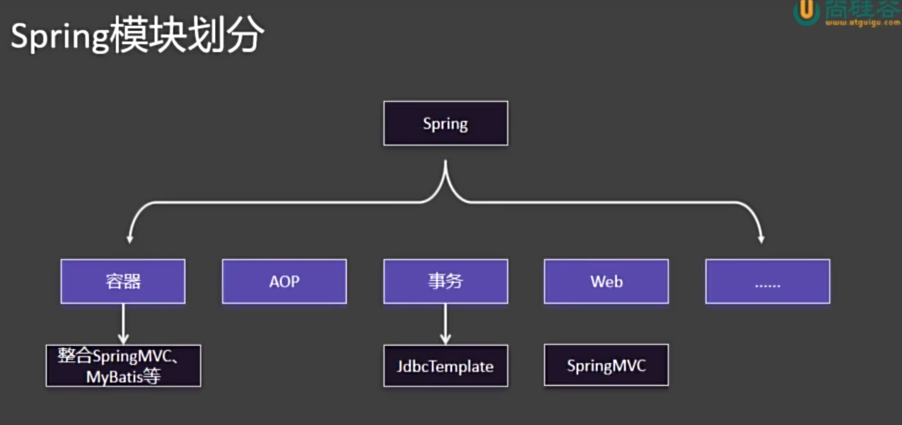
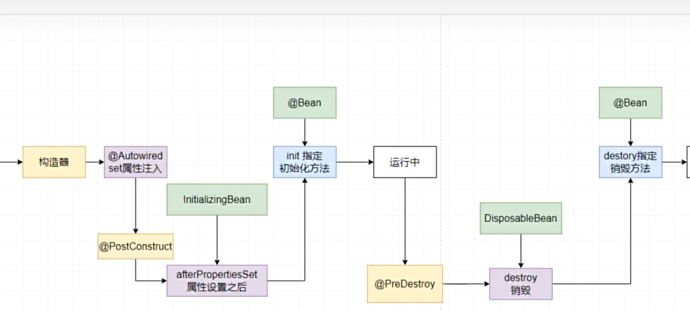
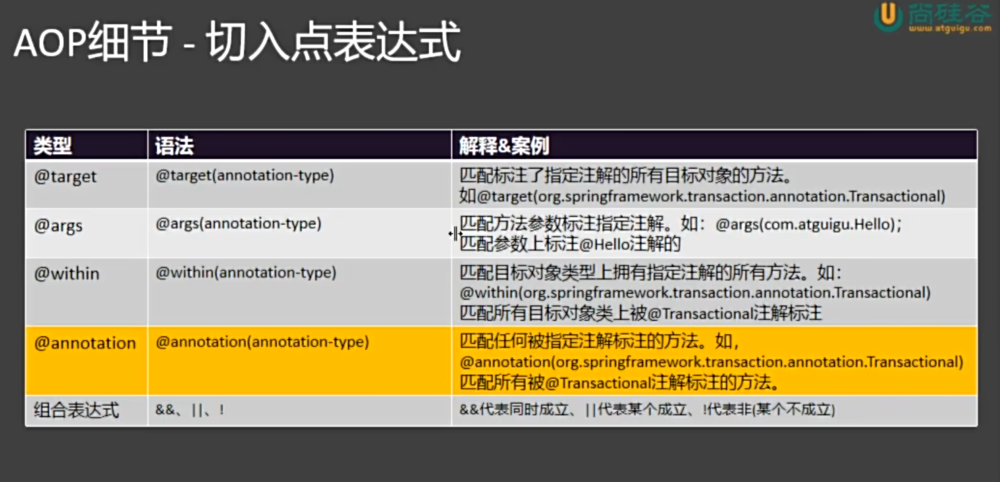
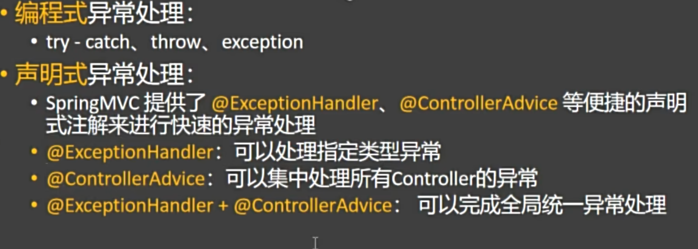
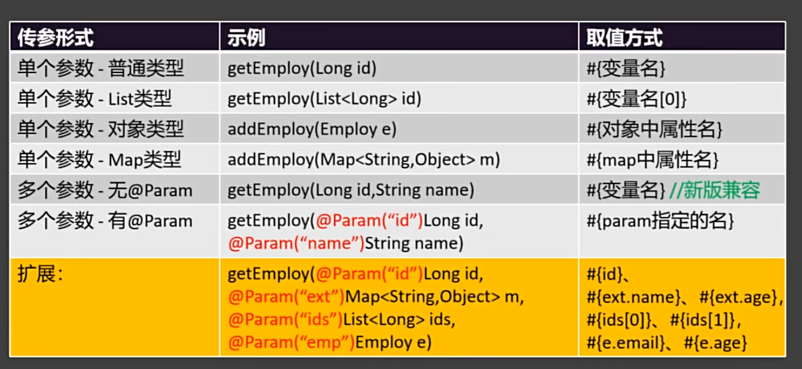

Spring ：企业级一站式框架

 


## 一、Container

### 1. 组件和容器

​	组件：具有一定功能的对象，组件的三大特性：(名字、类型)、对象、作用域，组件的名字是全局唯一的。在Spring中，组件的创建时机是容器启动过程中，单实例特性：每次获取直接拿就完事了。

​	容器：管理组件（创建、获取、保存、销毁）

### 2. IOC 控制反转

​	IOC 是一种**设计思想**，不是具体的技术。它的核心理念是：**将对象的创建和依赖管理交给外部容器控制，而不是由对象自己控制**。

传统方式下，一个对象主动去创建它所依赖的对象； **而在 IOC 模式下，对象被动地接收依赖对象**（**由容器提供**）。

​	“控制” 指的是对象依赖的创建与管理。“反转”指的是这种控制权从程序员手中**反转**给了外部容器（如 Spring 容器）。

### 3. DI 依赖注入

​	DI 是实现 IOC 的**具体手段**。 即：容器在运行时将对象所依赖的实例“注入”进去。

### 4. 注册组件的不同方法

#### 4.1 @Bean

##### 1. 概念

​	`@Bean` 是 Spring 中的一种 **显式注册 Bean** 的方式，用于告诉 IOC 容器：“我要手动定义并注册一个组件（Bean）到容器中进行管理。”  换句话说，使用 **`@Bean` 标注的方法**会由 **Spring 调用**，**其返回对象会被加入到 IOC 容器中**，并由容器统一管理生命周期和依赖关系。

##### 2. 主要作用

​	1）**注册 Bean 到容器**：通过 `@Bean` 标注的方法返回的对象，会自动成为 Spring 管理的 Bean。

​	2）**代替 XML 配置**：在注解驱动的配置类中，用 `@Bean` 方法代替 `<bean>` 标签进行配置。

​	3）**自定义第三方类的注入**：当某个类不是由我们自己编写（例如外部库中的工具类），无法直接加上 `@Component` 注解时，就可以通过 `@Bean` 手动注册。

##### 3. 获得组件的方法


```java
// 按照组件名称获取组件对象
Student ltb = (Student) ioc.getBean("LiuTianBa");
System.out.println("ltb  " + ltb);

// 按照组件类型获取组件对象
Dog dog = ioc.getBean(Dog.class);
System.out.println("bean = " + dog);

// 按照名字加类型，就不需要强转了
```


#### 4.2 @Conguration注解

​	`	@Configuration` 是 Spring 中的一个注解，用于标记一个类为**配置类**。它告诉 Spring 容器：这个类包含一个或多个 `@Bean` 注解的方法，这些方法将返回需要被 Spring 容器管理的对象（即 Bean）。Spring 会处理**这个类**，执行其 **`@Bean` 方法**，并将返回的对象注册到 IoC 容器中，**以便后续依赖注入和使用**。

​	相当于传统的 XML 配置文件（如 `applicationContext.xml`），只不过现在用 Java 类来编写配置，类型安全、易于调试和重构。


#### 4.3 MVC分层注解

​	用 @Bean 手动注册组件太麻烦，所以 Spring 提供了一些特殊类的快速注册。注：分层注解能起作用的前提是：这些类必须在主程序所在的包及其子包的程序下。如果非要放到外部包，在主程序上加个**ComponentScan**实现批量扫描。（但最好还是老老实实的在主程序所在包下面玩）    

##### 1. @Controller

​	用于标记**控制层（Controller）**的类，表示该类是 Spring MVC 中的控制器组件，负责处理 HTTP 请求。被此注解标记的类会被 Spring 容器自动扫描并注册为 Bean。

##### 2. @Service

​	用于标记**业务逻辑层（Service）**的类，表示该类是服务组件，通常包含核心业务逻辑。它是一种特殊的 @Component，语义更明确，便于分层管理。

##### 3. @Repository

​	用于标记**数据访问层（DAO/Repository）**的类，表示该类负责与数据库进行交互。该注解还具有自动翻译数据库异常的能力（如将 SQLException 转为 Spring 的数据访问异常），使数据层异常处理更统一。


#### 4.4  注册第三方组件

​	有两个方法，一是直接用@Bean注解去手动的new一个对象并返回，二是@Import注解去注册第三方类对象。


#### 4.5 @Scope

​	`@Scope` 是 Spring 中的一个注解，用于指定由 `@Component` 或 `@Bean` 等注解创建的 **Bean 实例**在 Spring 容器中的**作用域**（即生命周期和可见范围）。具体而言，它是用来控制一个 Bean 是单例的、每次请求都新建的，还是与 Web 中的请求、会话等绑定的。

##### 常见取值

- **singleton**（默认）：在整个 Spring 容器中，该 Bean 只有一个共享的实例。
- **prototype**：每次请求该 Bean 时（如注入或调用 `getBean()`），都会创建一个新的实例。
- **request**：每个 HTTP 请求创建一个实例，仅适用于 Web 应用。
- **session**：每个 HTTP Session 创建一个实例，仅适用于 Web 应用。
- **application**：每个 ServletContext 生命周期内创建一个实例，仅适用于 Web 应用。


#### 4.6 @Lazy

​	它指示 Spring 容器在启动时**不立即创建**被标记的 **Bean**，而是等到该 Bean 第一次被实际使用（如注入、调用 `getBean()`）时才进行初始化。

​	 默认情况下，Spring 容器在启动时会预初始化所有 singleton 作用域的 Bean。`@Lazy` 可用于类上（配合 `@Component` 等）或方法上（配合 `@Bean`）。

​	prototype作用域的 Bean 本身就是懒加载的，每次使用都会新建。懒加载的 Bean 在第一次使用时会有初始化开销，可能影响响应时间。 


#### 4.7 FactoryBean接口

​	`FactoryBean` 是 Spring 提供的一个接口，用于**自定义复杂对象的创建过程**。

​	当某个 Bean 的实例化过程比较复杂（例如需要动态代理、组合多个对象、读取配置生成等），无法通过简单的构造函数或工厂方法完成时，可以通过实现 `FactoryBean` 接口来精确控制 Bean 的创建逻辑。

```
- 实现 `FactoryBean` 的类本身也是一个 Bean，会被 Spring 容器管理。
- 从容器中获取该 Bean 时，默认返回的是 `getObject()` 方法的返回值，而不是 `FactoryBean` 实例本身。
- 若想获取 `FactoryBean` 本身，需在 Bean 名称前加 `&`，如 `context.getBean("&myFactoryBean")`。
```


#### 4.8 @Conditional 条件注册

​	`@Conditional` 是 Spring 中的一个注解，用于实现**条件化注册 Bean**。它可以根据指定的条件来决定是否将某个 Bean 注册到 Spring 容器中。只有当条件满足时，对应的组件（**类或方法**）才会被加载和实例化。

##### 1. 核心机制

- `@Conditional` 接收一个或多个 **`Condition` 接口的实现类**。
- Spring 在解析配置时会先检查这些条件的 `matches()` 方法返回值。
- 如果返回 `true`，则注册 Bean；否则跳过。

##### 2. 衍生注解

- `@ConditionalOnClass`：当类路径中存在指定类时才注册。
- `@ConditionalOnMissingBean`：当容器中不存在指定类型的 Bean 时才注册。
- `@ConditionalOnProperty`：当配置文件中存在特定属性且值符合条件时注册。
- `@ConditionalOnWebApplication`：当应用是 Web 环境时注册。
- `@ConditionalOnExpression`：根据 SpEL 表达式结果决定是否注册。

 

### 5. 注入组件的各种方式

#### 1.  @Autowired

​	`@Autowired` 是 Spring 提供的注解，用于自动装配 Bean。它可以标记在字段、构造函数、Setter 方法或普通方法上，Spring 容器会自动从 IoC 容器中查找匹配的 Bean 并注入。

​	**装配流程：**

​	1）先按类型找，找到了就注入

​	2）若按类型没找到或者找到了多个，就按组件的名字来找（就是把当前的对象名看作是组件名，然后去ioc容器找）

​	3）若未找到匹配的 Bean，默认会抛出异常

```
匹配规则
- 默认按**类型**（byType）进行匹配。
- 如果同一类型存在多个 Bean，则结合 `@Qualifier` 注解按名称（byName）区分。
- 若未找到匹配的 Bean，默认会抛出异常；可设置 `required = false` 允许为 null。
```

```java
# 可以自动装配很多
@ToString
@Controller
public class UserController {

    // 自动注入演示
    @Autowired
    UserService userService;


    @Autowired(required = false)
    Person bill;

    @Autowired
    List<Person> arr;

    @Autowired
    Map<String, Person> map;

    @Autowired
    ConfigurableApplicationContext ioc;
}
	
```

​	小拓展：@Qualifier("beanname") 可以指定要注入的组件名称（新版本直接用变量名就可以了） @Primary 就是把某个 @Bean 标记的方法返回的组件标为一个特殊的Bean（默认组件），以后主动注入时如果有多个该类型的组件，就用这个特殊的来注入。

​	特别的，当我们开启了默认组件后，在想用其他的，就得靠@Qualifier了，此时该属性名不能实现组件的切换了。

#### 2. @Resource 

​	`@Resource` 是 JSR-250 规范提供的注解，用于实现依赖注入。它并非 Spring 特有，但被 Spring 容器支持。

​	**装配流程：**

​	1）默认按**名称**（byName）进行匹配。即使用字段名或方法名作为 Bean 的名称去查找。

​	2）如果找不到对应名称的 Bean，则退回到按**类型**（byType）匹配。

​	3）可通过 `name` 属性显式指定要注入的 Bean 名称：`@Resource(name = "userService")`。

​	**与 @Autowired 的区别**

​	1）`@Resource` 是 Java 标准注解，`@Autowired` 是 Spring 特有。

​	2）`@Resource` 优先按名称注入，`@Autowired` 默认按类型注入。

​	3）`@Resource` 不支持 `required = false` 语法。

#### 3. 构造器注入（无注解）

​	**概念：**在 Spring 配置类或组件中，通过构造函数的参数来接收依赖对象的注入方式。当类中只有一个构造函数时，Spring 会自动将其参数作为依赖进行注入，无需添加 `@Autowired` 注解。

​	**作用**：实现依赖的强制注入，确保对象创建时所需的所有依赖都已提供，从而保证对象的完整性与不可变性。

​	**特点：**

​	1）**无需注解**：Spring 4.3+ 版本开始，若类中只有一个构造函数，可省略 `@Autowired`。

​	2）**推荐使用**：构造器注入是 Spring 官方推荐的依赖注入方式，有利于实现不可变对象，便于单元测试。

​	3）**依赖明确**：所有必需的依赖都在构造函数中声明，代码可读性强。

#### 4. Setter 方法注入

​	通过类的 `setter` 方法将依赖对象注入到 Bean 中。通常配合 `@Autowired` 注解使用，Spring 容器在实例化对象后，会自动调用对应的 setter 方法完成依赖注入。

#### 5. AwareXXX 感知接口

​	Aware 接口是 Spring 提供的一系列以 `Aware` 结尾的接口，用于让 Bean **感知**并获取 **Spring 容器或其内部组件的底层资源**。

​	作用：当一个 Bean 实现了某个 `Aware` 接口后，Spring 容器会在初始化该 Bean 时，自动调用其提供的回调方法，将对应的运行时**对象注入进去**，从而让 Bean 能够访问**容器的内部服务**。

```java
// 常见 Aware 接口
- `ApplicationContextAware`：获取 `ApplicationContext` 容器本身。
- `BeanFactoryAware`：获取 `BeanFactory` 工厂实例。
- `BeanNameAware`：获取当前 Bean 在容器中的名称。
- `EnvironmentAware`：获取 `Environment` 对象，用于读取配置环境（如 profile、properties）。
- `ResourceLoaderAware`：获取 `ResourceLoader`，用于加载资源文件。
- `ApplicationEventPublisherAware`：获取事件发布器，用于发布自定义事件。
```


#### 6. @Value

​	`@Value` 是 Spring 提供的一个注解，用于将**外部值**注入到 Bean 的字段(非组件的字段，组件可以通过Autowired自动注入)或方法参数中。

​	作用：实现配置属性、字面量、SpEL 表达式的注入，使代码可以动态获取配置信息，而不必硬编码。		

​	注入方式：

​	1）直接@Value(字面量)

​	2）从配置文件中获取数据：@Value("${key}")

```java
@Value("${app.name}")
private String appName;
```

​	3）**SpEL（Spring Expression Language）表达式**

```java
@Value("#{systemProperties['user.home']}")
private String userHome;

@Value("#{T(java.lang.Math).random() * 100}")
private double randomValue;
```

​	综合演示：

```java
public class Cat {
    @Value("Tom")
    private String name;
    @Value("12")
    private Integer age;
    @Value("${cat.color}")
    private String color;
    @Value("#{T(java.util.UUID).randomUUID().toString()}")
    private String id;
    
}
```

#### 7. @PropertySource

​	`@PropertySource` 是 Spring 提供的一个注解，用于将外部的 **properties 配置文件**加载到 Spring 的 `Environment` 抽象中。

```
@PropertySource("classpath:app.properties")
```

​	补充知识：类路径找资源方式

​	classpath: 代表自己当前项目的类路径（java以及resources)

​	classpath*: 从所有包的类路径下面找

​	在Spring中，提供了资源获取工具类：ResouceUtils 来获取文

#### 8. @Profile

​	实际也是 @Conditional 的一种，场景：当我们有多个数据源，也就是开发、测试、生成这三套，如果我们用 @Primary 或者@Qualifier，则需要修改代码，但用 @Profile 可以输入一个环境表示，从而根据不同的环境表示来注册组件。

​	具体使用：

​	1）先定义环境表示，默认是 ”default“ ：自定义方法就是去资源文件下面定义。 spring.profiles.active=生产环境

​	2）使用 @Profile 来实现条件注册 

### 6. 组件生命周期

​	Spring 容器中每个 Bean 都有其完整的生命周期，从创建、初始化、使用到销毁。Spring 提供了多种机制让开发者可以在特定生命周期阶段插入自定义逻辑。

​	第一种：通过 @Bean 注解去指定 init 以及 destory。

​	第二种：去实现 InitializingBean  以及 DisposableBean 


​	具体生命周期如下：

​	1、**实例化（Instantiation）** ：Spring 容器根据配置或注解创建 Bean 的实例（通过构造函数或工厂方法）。

​	2、**属性赋值（Populate Properties）**：容器将配置中定义的**属性值或依赖对象**注入到 Bean 中（如通过 `@Autowired`、`@Value` 等）。

​	3、**初始化（Initialization）**

```
   - 补充: 调用后置处理器的前置操作
   - 调用 `@PostConstruct` 注解的方法。
   - 调用 `InitializingBean` 的 `afterPropertiesSet()` 方法。
   - 调用自定义的初始化方法（通过 `@Bean(initMethod = "init")` 指定）。
   - 应用 BeanPostProcessor 的 `postProcessBeforeInitialization` 和 `postProcessAfterInitialization`。
```

​	4、**使用（In Use）**：Bean 已准备好，可以被其他组件使用或对外提供服务。

​	5、**销毁（Destruction）**：

```
   - 调用 `@PreDestroy` 注解的方法。
   - 调用 `DisposableBean` 的 `destroy()` 方法。
   - 调用自定义的销毁方法（通过 `@Bean(destroyMethod = "cleanup")` 指定）。
   - 仅适用于 singleton 作用域的 Bean，在容器关闭时执行。
```

<p align="center">    </p>

### 7. BeanPostProcessor

​	之前 Bean 的生命周期其实只是在人家初始化完，或者销毁前让你做点其他的，而不能影响这个过程。

​	而 BeanPostProcessor 能够在生命周期过程中正在的修改这个 Bean。

## 二、AOP ⭐

​	概念：**Aspect Oriented Programming（AOP）**是 Spring 框架的重要特性之一，它允许开发者将**横切关注点**（如日志、事务、安全、缓存等）与**核心业务逻辑**分离。

​	本质：AOP 的底层实现原理确实是**代理模式**。Spring 在运行时为目标对象创建一个代理对象，当调用目标方法时，实际执行的是代理对象的方法。代理对象可以在目标方法执行的**前后**，甚至**环绕**执行自定义逻辑，从而实现功能增强。


#### 1. AOP 编码实现

​	1）导入 AOP 依赖 

```
<dependency>
    <groupId>org.springframework.boot</groupId>
    <artifactId>spring-boot-starter-aop</artifactId>
</dependency>
```

​	2）编写切面 Aspect 注：记得用 @Aspect 来标注切面类 

​	3）编写通知方式

​	4）指明这些通知方法何时何地运行（切入点表达式） 注：可以将这些表达式抽离出来

```
    // 切入点表达式抽离
    @Pointcut("execution(* person.liutianba.spring02Aop.calculator.MathCal.*(..))")
    void pointCut(){}

    @Before("pointCut()")
    public void logStart(JoinPoint joinPoint){
        System.out.println("【切面 - 日志】开始... 方法名:" + joinPoint.getSignature().getName() + "参数为：" + Arrays.asList(joinPoint.getArgs()).toString());
    }
```

​	5）测试AOP动态织入

```java
@Aspect  // 切面类
@Component
public class LogAspect {

    /**
     * 告诉 Spring，以下通知方法何时何地运行
     * 何时：
     * @Before,
     * @After(不管正常异常，都运行),
     * @AfterReturning(正常返回结果),
     * @AfterThrowing(出现异常),
     * @Around
     *
     * 何地：切入点表达式
     *   execution(方法的全签名)
     *      全写法 ：public int 全类名.方法名(参数列表) throws 异常
     *      省略写法：int 方法名(参数列表) int *(int, int)
     *      * 表示任意长度字符串
     *
     */

    @Before("execution(int *(int,int))")
    public void logStart(){
        System.out.println("【切面 - 日志】开始...");
    }
    @After("execution(int *(int,int))")
    public void logEnd(){
        System.out.println("【切面 - 日志】结束...");
    }

    @AfterThrowing("execution(int*(int, int))")
    public void logException(){
        System.out.println("【切面 - 日志】异常...");
    }


    @AfterReturning(pointcut = "execution(int *(int, int))", returning = "result")
    public void logReturn(Object result){
        System.out.println("【切面 - 日志】结果：" + result);
    }
}
```

#### 2. AOP 切入点表示式写法

​	切入点（Pointcut）用于定义 **哪些方法需要被 AOP 增强**。它是通过一个表达式来匹配类和方法的，只有匹配成功的方法才会执行通知（Advice）。



##### 1. excution(方法签名)

​	切入某个接口下的所有方法：execution(***** person.liutianba.spring02Aop.calculator.MathCal**. ***(..))

​	注：只要有了切面类再切入，那么这个类的实例在容器中就不再是原本的类型了，而是CGLIB产生的一个代理对象。	

```
 /**
     * 告诉 Spring，以下通知方法何时何地运行
     * 何时：
     * @Before,
     * @After(不管正常异常，都运行),
     * @AfterReturning(正常返回结果),
     * @AfterThrowing(出现异常),
     * @Around
     *
     * 何地：切入点表达式
     *   execution(方法的全签名)
     *      全写法 ：public int 全类名.方法名(参数列表) throws 异常
     *      省略写法：int 方法名(参数列表) int *(int, int)
     *      *：表示任意长度字符串
     *		..：
     *		 1）参数位置：表示多个参数，任意类型
     *		 2）类型位置：表示多个层级	
     
	 *	 @annotation(com.spzx.common.security.annotation.RequiresLogin) || "  
        + "@annotation(com.spzx.common.security.annotation.RequiresPermissions)
	 *	
	 *	
	 *	
*/	
```

##### 2. args

​	匹配那些参数列表一直的所有方法

##### 3. @args

​	匹配参数列表有特定注解的方法

#### 3. 获取 AOP 的连接点的信息

​	直接传一个连接点，然后通过它获得信息。

​	一般就是通过getSignature（）获得方法签名，然后通过方法签名就可以获得该方法的详细信息。

```java
@Before("execution(* person.liutianba.spring02Aop.calculator.MathCal.*(..))")
public void logStart(JoinPoint joinPoint){
    System.out.println("【切面 - 日志】开始... 方法名:" + joinPoint.getSignature().getName());
}
```

#### 4. 多切面执行执行顺序

​	我的理解：单个切面实际就是把目标方法做了个代理，当有其他切面时，它会把代理后的方法看成是一个要代理的目标方法，然后去代理，所以，多个切面的执行顺序是由谁先代理，谁后代理决定的。

​	注：默认代理顺序是按类名自然排序的，但也可以通过 @Order 注解手动指定。`@Order` 值越小，优先级越高，在代理链中位于外层。

​	

#### 5. 环绕通知 @Around 重点！！！

​	`@Before`、`@After` 等通知属于“感知型”增强，只能在方法执行前后执行额外逻辑，**无法控制目标方法的执行流程**（如跳过方法、修改参数、改变返回值）。而 `@Around` 是最强大的通知类型，它**完全包裹目标方法**，可以：

- 控制是否执行目标方法
- 修改方法参数
- 修改返回值
- 捕获并处理异常 (这里建议抛出异常，如果不抛出的话，出了异常别人都感知不到)
- 短路返回（不调用目标方法）

##### 5.1 固定写法

```python
@Aspect
@Component
public class LogAspect {

    @Around("execution(* com.example.service.*.*(..))")
    public Object around(ProceedingJoinPoint joinPoint) throws Throwable {
        // 获取方法签名
        Signature signature = joinPoint.getSignature();
        String methodName = signature.getName();
        
        // 获取方法参数
        Object[] args = joinPoint.getArgs();

        System.out.println("【环绕前置】方法 " + methodName + " 开始执行，参数：" + Arrays.toString(args));

        Object result = null;
        try {
            // -----------------------------
            // 核心：决定是否继续执行目标方法
            // 可在此处修改参数
            // args[0] = "modifiedArg";
            result = joinPoint.proceed(args); // 执行目标方法（可传入修改后的参数）
            // -----------------------------

            System.out.println("【环绕返回】方法 " + methodName + " 执行成功，返回值：" + result);
            return result; // 可在此处修改返回值
        } catch (Exception e) {
            System.out.println("【环绕异常】方法 " + methodName + " 执行出错：" + e.getMessage());
            throw e; // 可以处理或包装异常
        } finally {
            System.out.println("【环绕后置】方法 " + methodName + " 执行结束");
        }
    }
}
```

#### 6. AOP 的应用场景

pass(懒得写了)

## 三、事务⭐

​	Spring 中的事务是对**数据库事务**的抽象和管理机制，其核心目标是：**让开发者无需手动管理 commit 和 rollback，就能确保一组数据库操作具备 ACID 特性**。

#### 1、Spring 连接数据库的方法

​	1）导入依赖：数据库驱动、spring-boot-starter- data-jdbc

​	2）配置数据库连接信息：在 xxx.properties 中的 spring.datasource

​	3）可以直接使用 DataSource、 JDBCTemplate

#### 2、开启事务管理

​	1）在启动类上加一个注解：@EnableTransactionManagement 指明开启事务管理

​	2）之后在需要事务管理的方法上添加一个 @Transactional 即可进行事务管理

#### 3、事务管理的原理

​	Spring 的事务管理是基于 **AOP（面向切面编程） + 拦截器模式** 实现的，其核心原理是通过代理机制，在目标方法执行前后自动控制数据库事务的开启、提交或回滚。

##### 3.1 动态代理

当一个方法被 `@Transactional` 注解标记时：

- Spring 容器会为该 Bean 创建一个**代理对象**（Proxy）。
- 原始对象的方法调用会被代理拦截。
- **代理在方法执行前开启事务**，执行后根据结果决定**提交或回滚**。

##### 3.2 关键组件

| 组件 | 作用 |
|------|------|
| `PlatformTransactionManager` | 事务管理器接口，负责实际的事务操作（如 `DataSourceTransactionManager`）。 |
| `@Transactional` | 声明式事务注解，定义**事务属性**（传播行为、隔离级别等）。 |
| `TransactionInterceptor` | 事务拦截器，AOP 的通知逻辑，真正执行“开启 → 执行 → 提交/回滚”的流程。 |
| `TransactionSynchronizationManager` | 绑定当前线程与事务资源（如 Connection），保证同一个事务中使用同一个数据库连接。 |

##### 3.3 执行流程

```text
1. 调用 @Transactional 方法
        ↓
2. 代理拦截（TransactionInterceptor）
        ↓
3. 获取事务管理器（PlatformTransactionManager）
        ↓
4. 开启事务（doBegin） → 获取 Connection 并绑定到当前线程
        ↓
5. 执行业务方法（所有 DAO 操作共享同一 Connection）
        ↓
6. 方法正常结束 → 提交事务
        ↓
7. 异常抛出 → 回滚事务（默认 RuntimeException 和 Error）
        ↓
8. 清理资源（解绑 Connection）
```

#### 4、@Transactional 

​	`@Transactional` 是 Spring 框架提供的**声明式事务管理注解**，开发者只需在方法或类上添加该注解，即可自动获得事务支持，无需手动编写 `commit` 和 `rollback` 代码。

##### 4.1 该注解的属性

​	timeout：当事务超过这个事件后，就会回滚。

​	readOnly：只读优化（优化操作，就不需要开启一堆事务管理相关的东西了）

​	rollbackFor：Defines zero (0) or more exception types, which must be subclasses of Throwable, indicating which exception types must cause a transaction rollback.

​	注：运行时异常都回滚，而编译时异常不回滚。而rollbackFor就是用来指定那些异常需要回滚

​	下面，重点属性单独介绍

##### 4.2 隔离级别 isolation

​	**隔离性（Isolation）** 是事务 ACID 特性中的 "I"，它控制的是：**多个事务并发执行时，彼此之间的可见性和影响程度**。如果完全不隔离 → 数据混乱。如果完全隔离 → 性能极差，几乎串行执行。所以，数据库提供了 **不同的隔离级别**，在**数据一致性**和**并发性能**之间做权衡。

​	**一些并发问题介绍：**

| 问题 | 定义 | 示例 |
|------|------|------|
| **脏读（Dirty Read）** | 一个事务读取了另一个事务**尚未提交**的数据。 | 事务 A 修改了数据但未提交，事务 B 读到了这个修改；如果 A 回滚，B 读到的就是“脏”数据。 |
| **不可重复读（Non-repeatable Read）** | **在同一个事务中**，**两次读取同一行数据，结果不同**。 | 事务 A 第一次读 id=1 的记录为 name='张三'；事务 B 将其改为 '李四' 并提交；A 再次读取，变成了 '李四'。 |
| **幻读（Phantom Read）** | **在同一个事务中**，**两次执行相同查询，返回的行数不同**（出现了“幻影”行）。 | 事务 A 查询 `age > 18` 有 3 条记录；事务 B 插入一条 `age=20` 的记录并提交；A 再次查询，变成 4 条。 |

​	**隔离级别：**

| 隔离级别 | 脏读 | 不可重复读 | 幻读 | 说明 |
|--------|------|------------|------|------|
| **READ UNCOMMITTED**（读未提交） | ✅ 允许 | ✅ 允许 | ✅ 允许 | 最低级别，性能最好，但数据最不安全。 |
| **READ COMMITTED**（读已提交） | ❌ 禁止 | ✅ 允许 | ✅ 允许 | 大多数数据库默认级别（如 Oracle、SQL Server）。只能读已提交的数据。 |
| **REPEATABLE READ**（可重复读） | ❌ 禁止 | ❌ 禁止 | ✅ 允许（部分数据库不允许） | **MySQL 默认级别**。保证事务内多次读取同一数据结果一致。 |
| **SERIALIZABLE**（串行化） | ❌ 禁止 | ❌ 禁止 | ❌ 禁止 | 最高级别，事务串行执行，避免所有并发问题，但性能最差。 |

---

##### 4.3 传播行为 propagation

​	**传播行为（Propagation Behavior）** 是指：当一个事务方法被另一个事务方法调用时，**事务该如何进行传播或处理**。换句话说：  "我已经在一个事务里了，现在又调用了另一个标有 `@Transactional` 的方法，那这个新方法是加入当前事务？新建一个事务？还是不使用事务？”

​	这就是 **事务的传播行为** 要解决的问题。

```
类比理解

想象你正在做一顿饭（外层事务），过程中需要洗菜、切菜、炒菜。

- 如果“洗菜”也是一个独立的任务（内层方法），但它必须和做饭在同一个流程中完成 → 那它就**加入当前事务**。
- 如果“接个电话”是一个操作，它不影响做饭 → 它可以**不参与事务**。
- 如果“尝一口咸淡”失败了，你想回滚整个做饭过程 → 那它就和外层事务**绑定在一起**。
- 如果“烧一壶水”是另一个独立任务，即使它失败也不影响做饭 → 它应该**开启一个新事务**。

这就是不同传播行为的现实映射。


Spring 中的 7 种传播行为

| 传播行为 | 含义 |
|--------|------|
| `REQUIRED`（默认） | 如果当前有事务，就加入；没有就新建一个。 |
| `REQUIRES_NEW` | 无论当前是否有事务，都**挂起当前事务，新建一个新事务**。 |
| `SUPPORTS` | 支持当前事务，但如果当前没有事务，也不创建新事务（以非事务方式运行）。 |
| `NOT_SUPPORTED` | 不支持事务，**以非事务方式执行**，如果当前有事务则将其挂起。 |
| `MANDATORY` | 必须在事务中运行，如果当前没有事务，则抛出异常。 |
| `NEVER` | 不能在事务中运行，如果当前有事务，则抛出异常。 |
| `NESTED` | 如果当前有事务，则在嵌套事务中执行；否则新建一个事务。（类似 `REQUIRED`，但可独立回滚） 
```

## 四、SpringMvc⭐⭐

### 1. RequestMapping

​	路径映射：负责映射方法与请求路径。

​	路径位置通配符：*匹配任意多字符  ** 匹配任意多层路径  ？匹配单个字符  如果有多个方法都能匹配上请求路径，则按着精确度来处理，也就是越精确，越优先。

##### 请求限定：

​	1）method

​	2）params

​	3）headers

​	4）consumes

​	5）produces

### 2. SpringMvc 中的请求处理	

#### 1、接收普通请求参数（`?key=value`）

​	适用于 GET 请求的查询参数 或 POST 请求的表单数据。直接绑定或者用 @RequestParam 注解

#### 2、接受路径变量（RESTful 风格）

```java
@GetMapping("/user/{id}")
public String getUserById(@PathVariable Long id) {
    System.out.println("用户ID：" + id);
    return "user";
}				
```

#### 3、接收请求体（JSON/XML）数据

```java
@PostMapping("/user")
public String createUser(@RequestBody User user) {
    System.out.println("创建用户：" + user.getName());
    return "created";
}
```

- 客户端设置 `Content-Type: application/json`
- 后端有 Jackson/Gson 等 JSON 转换器（Spring Boot 默认集成）

#### 4、接收文件上传

```java
@PostMapping("/upload")
public String uploadFile(@RequestPart("file") MultipartFile file,
                         @RequestParam String description) {
    System.out.println("文件名：" + file.getOriginalFilename());
    System.out.println("描述：" + description);
    return "uploaded";
}
```

#### 5、自动绑定对象（表单或 JSON）

```java
public class User {
    private String name;
    private int age;
    // getter/setter
}

@PostMapping("/user/form")
public String createUserForm(User user) {
    System.out.println("用户：" + user.getName());
    return "success";
}
```

- 表单提交 → 使用 `User user`
- JSON 提交 → 必须加 `@RequestBody`

#### 6、接收请求头（Header）信息

```java
@GetMapping("/info")
public String getInfo(@RequestHeader("User-Agent") String userAgent,
                      @RequestHeader("Authorization") String token) {
    System.out.println("浏览器：" + userAgent);
    System.out.println("Token：" + token);
    return "info";
}
```

#### 7. 接收 Cookies

```java
@GetMapping("/cookie")
public String getCookie(@CookieValue("JSESSIONID") String sessionId) {
    System.out.println("Session ID：" + sessionId);
    return "cookie";
}
```

#### 8、获取整个http请求

```java
	/**
     *
     * @param httpEntity 它的泛型就是要把 http 请求体转为这个泛型
     * @return
     */
    @PostMapping("/test03")
    public String test03(HttpEntity<User> httpEntity){
        // 获得请求头
        httpEntity.getHeaders().forEach((n, v) -> System.out.println(n + ":" + v));
        // 获得请求参数
        System.out.println("user = " +  httpEntity.getBody());
        return "ok_test03";
    }
```

### 3. SpringMvc 中的响应处理

##### 1. 返回json

​	注解 @ResponseBody 能够将方法的返回值自动的封装为json，现在都用组合注解 @RestController

##### 2. 文件下载（返回的数据是让浏览器下载的）

<p align="center">
  
</p>


```java
  @RequestMapping("/test03")
    public ResponseEntity<byte[]> download() throws Exception{
        FileInputStream fileInputStream = new FileInputStream("E:\\school_work\\glories\\头像\\2.jpg");
        
        byte[] alls = fileInputStream.readAllBytes();
        
        return ResponseEntity.ok().contentType(MediaType.APPLICATION_OCTET_STREAM).contentLength(alls.length)
                .header("Content-Disposition", "attachment;filename=2.jpg")
                .body(alls);
    }
```

问题1：文件名如果是中文会乱码

问题2：文件太大会出现oom

```java
@RequestMapping("/test03")
    public ResponseEntity<InputStreamResource> download() throws Exception{

        FileInputStream fileInputStream = new FileInputStream("E:\\school_work\\glories\\头像\\2.jpg");
        // 一口气读会异常
//        byte[] alls = fileInputStream.readAllBytes();
        InputStreamResource resource = new InputStreamResource(fileInputStream)
        // 解决中文乱码：把中文转码成utf-8
        String name = URLEncoder.encode("哈哈.jpg", "utf-8");
		
        return ResponseEntity.ok().contentType(MediaType.APPLICATION_OCTET_STREAM).contentLength(fileInputStream.available())
                .header("Content-Disposition", "attachment;filename="+ name)
                .body(resource);
    }
```

## 五、Spring Mvc 的最佳实践！！！⭐⭐⭐

### 1. RESTful风格⭐⭐⭐

​	REST 就是把任何web请求看作是对资源的操作，对同一资源的不同操作，他们的请求路径是一样的，具体是通过不同的动作来区分不同处理方法的。

### 2. 拦截器⭐⭐

##### 1. 概念

​	**拦截器（Interceptor）** 是 Spring MVC 提供的一种机制，用于在 **请求处理的前后** 对请求进行**预处理或后处理**，而无需修改每个控制器的代码。它类似于 Servlet 中的 **Filter（过滤器）**，但更贴近 Spring MVC 的执行流程，主要用于：

- 权限校验（如登录检查）
- 日志记录
- 性能监控（统计请求耗时）
- 请求参数预处理
- 防止重复提交
- 编码设置等

##### 2. 执行时机（与请求生命周期的关系）

​	请求 → preHandle() → (目标方法 execute) → postHandle() → (视图渲染) → afterCompletion()

##### 3. 三个核心方法

| 方法 | 触发时机 | 返回值含义 |
|------|----------|-----------|
| `boolean preHandle(HttpServletRequest, HttpServletResponse, Object handler)` | **控制器方法执行前** | `true`：放行，继续执行；`false`：中断，不再执行后续操作 |
| `void postHandle(HttpServletRequest, HttpServletResponse, Object handler, ModelAndView modelAndView)` | **控制器方法执行后，视图渲染前** | 通常用于修改 Model 或 View |
| `void afterCompletion(HttpServletRequest, HttpServletResponse, Object handler, Exception ex)` | **整个请求完成之后**（视图渲染完毕） | 用于资源清理、异常处理等 |

> ⚠️ 注意：
> - `postHandle` 和 `afterCompletion` 只有在 `preHandle` 返回 `true` 时才会执行。
> - 如果 `preHandle` 返回 `false`，则后续都不会执行。

---

##### 4. 实现方式

​	Spring MVC 中实现拦截器有两种主要方式：第二种过时了，就不记录了。

✅ 方式一：实现 `HandlerInterceptor` 接口（推荐），

```java
import org.springframework.web.servlet.HandlerInterceptor;
import javax.servlet.http.HttpServletRequest;
import javax.servlet.http.HttpServletResponse;

public class LoginInterceptor implements HandlerInterceptor {

    @Override
    public boolean preHandle(HttpServletRequest request, HttpServletResponse response, Object handler) throws Exception {
        // 模拟登录检查
        Object user = request.getSession().getAttribute("user");
        if (user == null) {
            response.sendRedirect("/login"); // 未登录，跳转到登录页
            return false; // 中断请求
        }
        return true; // 放行
    }

    @Override
    public void postHandle(HttpServletRequest request, HttpServletResponse response, Object handler, ModelAndView modelAndView) throws Exception {
        // 可以修改 modelAndView，比如添加公共数据
        System.out.println("postHandle: 控制器执行完毕");
    }

    @Override
    public void afterCompletion(HttpServletRequest request, HttpServletResponse response, Object handler, Exception ex) throws Exception {
        // 请求结束，可用于清理资源
        System.out.println("afterCompletion: 请求已完成");
    }
}
```

​	当写完自定义的拦截器后，要把它注册到 Spring MVC 的拦截器链中。（通过 **WebMvcConfigurer**）

```java
@Configuration
public class WebConfig implements WebMvcConfigurer {

    @Override
    public void addInterceptors(InterceptorRegistry registry) {
        registry.addInterceptor(new LoginInterceptor())
                .addPathPatterns("/admin/**")        // 拦截哪些路径
                .excludePathPatterns("/login", "/css/**", "/js/**"); // 放行哪些路径
    }
}	
```

##### 5. Interceptor 的执行顺序

​	preHandle顺序执行，postHandle, afterCompletation 倒序执行，有一个拦截器不放行，所有 postHandle 都不能执行， 那些放行的拦截器的 afterCompletation 可以执行。

##### 6. Interceptor 与 Fliter 的区别

​	 `Interceptor`（拦截器）和 `Filter`（过滤器）都用于对请求进行预处理，但 `Filter` 是 Servlet 规范的一部分，作用于整个 Web 请求生命周期，能拦截所有请求（包括静态资源），且不依赖 Spring 容器；而 `Interceptor` 是 Spring MVC 提供的机制，只拦截控制器（Controller）相关的请求，可以方便地注入 Spring Bean，执行时机更精细（如 preHandle、postHandle），更适合在业务逻辑层进行权限校验、日志记录等操作

### 3. 异常处理⭐⭐⭐

​	异常处理分为两类：**编程式**（如 `try-catch`）和 **声明式**。在 Spring 中，推荐使用 **声明式异常处理**，因为它更简洁、可维护性强，能实现全局统一处理。

<p align='center'>
    
</p>

#### 1. 实现方式

Spring MVC 提供了两个核心注解来实现声明式异常处理：

##### 方式一：`@ExceptionHandler` —— 处理单个 Controller 的异常

适用于某个控制器内部的异常处理。

```java
@RestController
public class UserController {

    @GetMapping("/user/{id}")
    public User getUser(@PathVariable Long id) {
        if (id == -1) {
            throw new UserNotFoundException("用户不存在");
        }
        return userService.findById(id);
    }

    // 使用 @ExceptionHandler 处理该 Controller 内部抛出的异常
    @ExceptionHandler(UserNotFoundException.class)
    public ResponseEntity<String> handleUserNotFound(UserNotFoundException ex) {
        return ResponseEntity.status(HttpStatus.NOT_FOUND).body("用户未找到：" + ex.getMessage());
    }
}
```

- 只作用于当前 Controller
- 可以处理特定类型的异常
- 不影响其他 Controller

#####  方式二：`@ControllerAdvice` —— 全局异常处理

用于集中处理 **所有 Controller** 的异常，是实现“全局统一异常处理”的最佳方式。

```java
@ControllerAdvice
@ResponseBody
public class GlobalExceptionHandler {

    @ExceptionHandler(UserNotFoundException.class)
    public ResponseEntity<String> handleUserNotFound(UserNotFoundException ex) {
        return ResponseEntity.status(HttpStatus.NOT_FOUND).body("用户未找到：" + ex.getMessage());
    }

    @ExceptionHandler(Exception.class)
    public ResponseEntity<String> handleGenericException(Exception ex) {
        return ResponseEntity.status(HttpStatus.INTERNAL_SERVER_ERROR).body("服务器内部错误：" + ex.getMessage());
    }
}
```

- 使用 `@ControllerAdvice` 注解标记类
- 所有 Controller 都会自动应用该异常处理器
- 可以处理任意类型异常（如 `Exception.class`）
- 支持返回 JSON、视图页面等


#### 2. 项目中最佳实践

​	在实际项目开发中，异常种类繁多，无法穷尽所有情况。因此，后端应聚焦于**核心业务逻辑的正确实现**，当遇到非法状态、数据校验失败、资源不存在等异常情况时，**无需手动处理每一个异常**，而是通过**主动抛出有意义的异常**，提前终止当前业务流程。

​	这些异常由全局异常处理器（如 `@ControllerAdvice` + `@ExceptionHandler`）统一捕获，转换为标准的错误响应格式（如 JSON 错误码、消息提示），返回给前端。这样既保证了代码的简洁性和可维护性，又能让前端清晰感知到异常类型和原因，进而做出相应的用户提示或重试操作。

​	

##### 实现方式:

​	1）先自定义一个**业务异常类**，属性有code，mes

​	2）再去用枚举类列出系统中所有可能的业务错误

​	3）当出现业务错误时，直接抛出业务异常即可

​	4）之后就可以交给全局异常处理器或者是本类下的异常处理器处理了


### 4. 数据校验⭐⭐⭐

<p align='center'>
	 
</p>

<p align='center'>
    
</p>


​	1) 导入场景启动器

```java
<dependency>
    <groupId>org.springframework.boot</groupId>
    <artifactId>spring-boot-starter-validation</artifactId>
</dependency>
```

​	 2）编写校验注解 @NotNull, @Max, @Min, @Email ...

​	 3）告诉 spring MVC 开启校验 @valid 

```java
 public R add(@RequestBody @Valid Employee employee, BindingResult bindingResult)
```

​	 4）获得校验结果：BindResult

```java
 public R add(@RequestBody @Valid Employee employee, BindingResult bindingResult){
        if (!bindingResult.hasErrors()){
            return R.success();
        }
        HashMap<String, String> errorMap = new HashMap<>();
        bindingResult.getFieldErrors().forEach(fieldError -> {
            errorMap.put(fieldError.getField(), fieldError.getDefaultMessage());
        });

        return R.error(500, "校验失败", errorMap);
    }
```

##### 1. BindResult

​	它是用来去获得校验结果的。可以获得校验的字段以及校验的结果。

##### 2. 全局异常处理校验失败

```java
 // 处理校验异常
    @ExceptionHandler(MethodArgumentNotValidException.class)
    public R handleMethodArgumentNotValidException(MethodArgumentNotValidException e) {
        // 获得校验结果
        BindingResult bindingResult = e.getBindingResult();
        List<FieldError> fieldErrors = bindingResult.getFieldErrors();
        HashMap<String, String>data = new HashMap<>();
        fieldErrors.forEach(fieldError -> {
            data.put(fieldError.getField(), fieldError.getDefaultMessage());
        });

        return R.error(500, "校验失败", data);
    }
```

##### 3. 自定义校验器

​	1）正则表达式

```java
@Pattern(regexp="^男|女&" , message = "性别只能是男或女")
```

​	2）自定义注解（写一个自定义注解，然后绑定一个自定义校验器）

```java
==========================================================================================
1：自定义校验注解（抄源码即可）
@Documented
@Constraint(
        validatedBy = {GenderValidator.class}
)
@Target({ElementType.FIELD})
@Retention(RetentionPolicy.RUNTIME)

public @interface Gender {
    String message() default "{jakarta.validation.constraints.Email.message}";
    Class<?>[] groups() default {};
    Class<? extends Payload>[] payload() default {};


}
===================================================================================
2：自定义校验器（实现ConstraintValidator接口）
public class GenderValidator implements ConstraintValidator<Gender, String> {
    /**
     *
     * @param s 前端传来的属性
     * @param constraintValidatorContext 校验上下文
     * @return
     */
    @Override
    public boolean isValid(String s, ConstraintValidatorContext constraintValidatorContext) {
        return s.equals("男") || s.equals("女");
    }
}
===================================================================================
3：应用自己的校验器
@Constraint(
        validatedBy = {GenderValidator.class}
)
```

##### 4 错误信息提示（国际化，其实没啥用）

​	国际化是通过配置文件来完成的

​	1）配置提示信息的编码方式以及位置（默认是messages）

```properties
spring.messages.encoding=UTF-8
spring.messages.basename=i18n/messages_en_US
```

​	2）直接在不同国家的配置文件下写就完事了

```
# messages_en_US.properties下
gender.message=gender is allowed only for male or female
# messages_zh_CH.properties下
gender.message=性别只能为男或女
# messages
默认环境
```

### 5. 各种o的分层模型

​	在传统的 Java Web 开发中，很多开发者习惯于使用同一个 POJO 类（如 `User`）既作为数据库实体，又作为接口返回给前端的数据对象。这种做法虽然简单，但存在严重的安全隐患和设计缺陷。例如，数据库实体中通常包含敏感字段，如用户密码、手机号、身份证号等，如果直接将这个对象序列化为 JSON 返回给前端，就可能导致敏感信息泄露。即使你在字段上加了 `@JsonIgnore`，这种方式也属于“打补丁式”编程，难以维护，且容易遗漏。

​	更合理的设计是采用分层模型，将不同的职责分离。具体来说，应该为不同场景定义不同的 Java Bean：使用 `Entity` 类与数据库表映射，用于持久层操作；使用 `DTO`（Data Transfer Object）类专门用于向前端返回数据；使用 `VO` 或 `Form` 类接收前端传来的请求参数。这样，每个类只承担单一职责，系统更加清晰、安全、可维护。

​	特别是在数据脱敏场景下，这种分层设计的优势尤为明显。比如，用户手机号 `13812345678` 在返回前端时应显示为 `138****5678`，身份证号也应部分隐藏。如果使用统一的 POJO，你需要在每个 Controller 中手动处理脱敏逻辑，代码重复且容易出错。而通过 `DTO` 类，你可以在其静态方法或构造函数中统一完成脱敏转换，例如提供一个 `fromEntity()` 方法，将 `UserEntity` 转换为已脱敏的 `UserDTO`，从而确保所有接口返回的数据都经过统一处理。

​	此外，使用 DTO 还能有效解耦数据库结构与接口协议。当数据库表结构发生变化时（如字段重命名、拆分），只需调整 Entity 到 DTO 的映射逻辑，而无需修改对外接口，避免影响前端代码。同样，前端需求变化时，也可以灵活调整 DTO 字段，而不必改动数据库设计。这种松耦合结构大大提升了系统的可扩展性和团队协作效率。

​	为了进一步简化 DTO 与 Entity 之间的转换，可以引入 MapStruct 等映射框架。它通过注解在编译期生成高效的映射代码，避免了手动编写大量 setter 和 getter 的繁琐工作，同时保持高性能。相比反射工具（如 BeanUtils），MapStruct 更安全、更快速。

​	总之，避免将数据库实体类直接暴露给前端，是构建安全、健壮 Web 应用的基本原则。通过引入 DTO 模式，不仅能实现敏感数据的自动脱敏，还能提升代码的可读性、可维护性和可扩展性。这是一种从“能用”到“好用”的工程思维升级，也是企业级开发中的最佳实践。

### 6. 日期处理⭐

##### 1. `@JsonFormat` 的作用

​	当我们把 Java 对象转换成 JSON 字符串（比如接口返回给前端）时，日期字段默认可能以时间戳（如 `1672531200000`）的形式输出，或者格式不统一（如 `"2023-01-01T00:00:00"`），前端难以直接展示。同样，前端传来的日期字符串也可能因为格式不匹配导致解析失败。

​	`@JsonFormat` 就是用来**指定某个字段在转成 JSON 或从 JSON 解析时所使用的日期格式**，确保前后端对日期的理解一致。

##### 2. 基本用法

```java
import com.fasterxml.jackson.annotation.JsonFormat;
import java.util.Date;

public class User {
    
    private String name;
    
    @JsonFormat(pattern = "yyyy-MM-dd HH:mm:ss", timezone = "GMT+8")
    private Date createTime;

    // getter 和 setter
}
```

##### 3. 全局配置

​	如果不使用全局配置，那么每一个日期字段都需要去写 @JsonFormat，太麻烦了，尤其是采用 JavaBean 分层架构。此时，就可以用配置文件来实现全局配置。

```
# 日期处理配置
spring.jackson.date-format=yyyy-MM-dd HH:mm:ss
spring.jackson.time-zone=GMT+8
```

### 7. 接口文档

<p align='center'>
    
</p

### 8. DispathcerServlet

​	 **`DispatcherServlet`** 是 Spring MVC 框架的核心组件，可以把它理解为整个 Web 请求处理流程的“**总指挥”或“前端控制器**”。当你的浏览器发起一个 HTTP 请求（比如访问 `/user/list`），这个请求首先到达的就是 `DispatcherServlet`。

##### 1. 九大组件

```java
 @Nullable
    private MultipartResolver multipartResolver;
    @Nullable
    private LocaleResolver localeResolver;
    /** @deprecated */
    @Deprecated
    @Nullable
    private ThemeResolver themeResolver;
    @Nullable
    private List<HandlerMapping> handlerMappings; // 存放请求路径和处理器的映射关系
    @Nullable
    private List<HandlerAdapter> handlerAdapters;  // 处理器的一些反射增强
    @Nullable
    private List<HandlerExceptionResolver> handlerExceptionResolvers;  // 异常处理解析器
    @Nullable
    private RequestToViewNameTranslator viewNameTranslator;
    @Nullable
    private FlashMapManager flashMapManager;
    @Nullable
    private List<ViewResolver> viewResolvers;
```


##### 2. 运行流程

<p align='center'>
    
</p>


1.  客户端（浏览器）发送请求 `DispatcherServlet`拦截请求. 
2.  `DispatcherServlet` 根据请求消息调用 `HandlerMapping`  会根据本次请求的 `url` 找到对应的 `handler`，并会将请求涉及到的拦截器和 `Handler` 一起封装返回。
3.  `DispatcherServlet` 调用 `HandlerAdapter`适配器执行 `Handler` 。
4.  `Handler` 完成对用户请求的处理后，会返回一个 `ModelAndView` 对象给`DispatcherServlet`，`ModelAndView` 顾名思义，包含了数据模型以及相应的视图的信息。`Model` 是返回的数据对象，`View` 是个逻辑上的 `View`
5.  `DispatcherServlet`将`ModelAndView`传给`ViewReslover`视图解析器
6.  `ViewReslover`解析后返回具体`View`
7.  `DispaterServlet` 把返回的 `Model` 传给 `View`（视图渲染）
8.  `DispaterServlet` 会将视图响应给客户端


## 六、Mybatis⭐

​	**持久层框架** 是用于简化数据库操作、**管理数据持久化**的软件框架。它的核心作用是 **让 Java 对象与数据库中的记录之间进行方便、高效、安全的转换和操作**，而不需要开发者手动编写大量重复的 JDBC 代码。

#### 1. mybatis的使用方法

​	1）导入mybatis依赖

​	2）配置数据源信息

​	3）写一个 javaBean，也就是 PO（ **Persist Object**）

​	4）写持久层接口，也就是Mapper层（注意标 @Mapper）

​	5）去写 Mapper 层方法对应的 xml 配置文件，去映射这些接口怎么执行，执行那些sql。

​	6）注意数据库字段名下划线一般在 Po 种要写成驼峰式。

​	7）最后，在配置文件中告诉 Mybatis xml 文件的位置。

#### 2. 参数处理

##### 1. #{} 与 ${} 的区别

​	在 MyBatis 中，`#{} ` 和 `${}` 都可以用于传递参数，但它们的底层机制和使用场景有着本质区别。

​	1）首先，`#{}` 是 MyBatis 中的**预编译占位符**，相当于 JDBC 中的 `?`。在执行 SQL 语句时，MyBatis 会先将 `#{}` 替换为一个问号占位符，然后通过 `PreparedStatement` 逐个设置参数值。这种方式能够有效防止 SQL 注入，因为参数值不会直接拼接到 SQL 字符串中，而是由数据库在执行阶段安全地绑定。此外，`#{}` 还能自动根据参数类型添加合适的引号，例如当传入字符串时会自动加上单引号，非常适合用于插入、更新或查询时的条件参数赋值。

​	2）与之相对，`${}` 则是 MyBatis 的**字符串拼接方式**，它在 SQL 语句解析阶段就会被直接替换为实际的参数内容，相当于直接将变量值插入到 SQL 字符串中。这意味着如果参数值来自用户输入，可能会造成 **SQL 注入风险**。因此，`${}` 一般不用于值的传递，而是用于那些不能使用 `#{}` 的场景，比如动态指定表名、列名、排序字段或关键字等位置。需要注意的是，`${}` 不会自动加引号，若拼接的是字符串类型参数，必须手动添加单引号，否则会导致 SQL 语法错误。

​	

##### 2. 参数取值方法

​	最佳实践：即使只有一个参数，也用 Param 直接参数名

<p align='center'>
    
</p>

##### 3. 返回值

​	在 MyBatis 中，每一个 Mapper 接口的方法都需要在对应的 XML 映射文件中明确指定查询结果的封装类型，即通过 `resultType` 或 `resultMap` 属性来定义返回值类型。虽然 MyBatis 内置了一些常用类型的别名（如 `int`、`string`、`map`、`list` 等），但在实际开发中仍建议使用**完整限定类名**（即全类名），这样能避免命名冲突，也让 XML 文件更直观、可维护。

**1）指定返回类型**

​	每一个 Mapper 层接口对应的 XML 语句块中，都必须指明查询结果要封装成的 Java 类型。通常使用 `resultType` 属性指定类型名称，例如：

```xml
<select id="findUserById" resultType="com.example.pojo.User">
    SELECT * FROM user WHERE id = #{id}
</select>
```

2）**集合类型的返回值**

​	当方法的返回值是集合类型（例如 `List` 或 `Set`或`Map`），在 MyBatis 的配置中只需指定集合中**元素的类型**即可。MyBatis 会自动将查询结果的多行记录封装为集合。例如：

```xml
 // 将结果封装为 Map (集合，set,list同理)
    @MapKey("id")
    Map<Integer, Emp> getMap();
  
<select id="getMap" resultType="person.liutianba.mybatis.bean.Emp">
        select * from t_emp
</select>
```

**3）复杂返回结果的映射**

​	如果查询结果中字段名与实体类属性名不完全对应，或需要多表联合查询时，则可使用 `resultMap` 进行更灵活的映射配置，通过 `<result>` 和 `<association>` 等标签自定义字段与属性之间的对应关系。

```xml
<resultMap id="rme" type="person.liutianba.mybatis.bean.Emp">
        <!--主键映射用id-->
        <id column="id" property="id"></id>
        <!--普通属性映射用 result-->
        <result column="age" property="age"></result>
        <result column="emp_name" property="empName"></result>
        <result column="emp_salary" property="empSalary"></result>
    </resultMap>

    <select id="getEmpById" resultMap="rme">
        select * from t_emp where id = #{id}
    </select>
```

​	下面是多表查询的一些语法

<p align='center'>
    
</p>

​	一对一关系封装：

```xml
<resultMap id="orderWithCustomer" type="person.liutianba.mybatis.bean.Order">
        <id property="id" column="id"/>
        <result property="address" column="address"/>
        <result property="amount" column="amount"/>
        <result property="customerId" column="customer_id"/>
        <association property="customer" javaType="person.liutianba.mybatis.bean.Customer">
            <id property="id" column="c_id"/> 
            <result property="customerName" column="customer_name"/>
            <result property="phone" column="phone"/>
        </association>
    </resultMap>
```

<p align='center'>
    
</p>

​	一对多关系封装：（collection）

```xml
 <!--演示collection-->
    <resultMap id="CustomerWithOrdersRM" type="person.liutianba.mybatis.bean.Customer">
        <id column="c_id" property="id"></id>
        <result column="customer_name" property="customerName"></result>
        <result column="phone" property="phone"></result>
        <collection property="orders" ofType="person.liutianba.mybatis.bean.Order">
            <id column="id" property="id"></id>
            <result column="address" property="address"></result>
            <result column="amount" property="amount"></result>
            <result column="c_id" property="customerId"></result>
        </collection>
    </resultMap>
```

#### 3. 分步查询

​	在需要链表查询的场景下，不仅可以按常规写法，也可以写分布查询，如下面的场景：查询具体订单以及它对应的客户的信息：

​	1）查询订单

​	2）根据客户id查询id

```xml
<resultMap id="CustomerWithOrdersStepRM" type="person.liutianba.mybatis.bean.Customer">
        <id column="id" property="id"></id>
        <result column="customer_name" property="customerName"></result>
        <result column="phone" property="phone"></result>
        <collection property="orders" select="getOrdersByCustomerId" column="id"></collection>
    </resultMap>


    <select id="getOrdersByCustomerId" resultType="person.liutianba.mybatis.bean.Order">
        select * from t_orders
        where customer_id=#{id}
    </select>

    <select id="getCustomerByIdWithOrders" resultMap="CustomerWithOrdersStepRM">
        SELECT *
        FROM t_customer
        WHERE id=#{id}
    </select>
```

​	在分页查询的情况下，我们可以开启延期加载，也就是如果没用到需要调用其他查询方法才能查到的数据，就不发这个查询。

```
mybatis.configuration.lazy-loading-enabled=true
mybatis.configuration.aggressive-lazy-loading=false
```

#### 4. 动态sql

##### 4.1 if 标签

用于判断某个条件是否成立，决定是否拼接某段 SQL。

```xml
<if test="条件表达式">
    SQL 片段
</if>
```

##### 4.2 `<where>` 标签

自动处理 `WHERE` 关键字，并智能去除多余的 `AND` 或 `OR`。

```xml
<select id="findEmp" parameterType="EmpPO" resultType="EmpPO">
    SELECT * FROM t_emp
    <where>
        <if test="id != null">
            AND id = #{id}
        </if>
        <if test="empName != null and empName != ''">
            AND emp_name = #{empName}
        </if>
        <if test="age != null">
            AND age >= #{age}
        </if>
    </where>
</select>
```

##### 4.3 `<set>`标签

用于 UPDATE 语句中，自动处理 SET 关键字，并去除最后一个多余的逗号。

```xml
<update id="updateEmp" parameterType="EmpPO">
    UPDATE t_emp
    <set>
        <if test="empName != null and empName != ''">
            emp_name = #{empName},
        </if>
        <if test="age != null">
            age = #{age},
        </if>
        <if test="empSalary != null">
            emp_salary = #{empSalary}
        </if>
    </set>
    WHERE id = #{id}
</update>
```

##### 4.4 `<trim>` 实现 `<where>` 的功能

`<trim>` 是更灵活的标签，可以自定义前后缀处理。当<trim>标签不为空，就会在这个sql片段前添加一个前缀 prefix 以及后缀 suffix, 同时如果这个sql片段以指定的前缀开始，就覆盖为空串。

```xml
<trim prefix="前缀" prefixOverrides="要去除的前缀字符串"
      suffix="后缀" suffixOverrides="要去除的后缀字符串">
    SQL 片段
</trim>


<select id="findEmp" parameterType="EmpPO" resultType="EmpPO">
    SELECT * FROM t_emp
    <trim prefix="WHERE" prefixOverrides="AND |OR ">
        <if test="id != null">
            AND id = #{id}
        </if>
        <if test="empName != null and empName != ''">
            AND emp_name = #{empName}
        </if>
        <if test="age != null">
            AND age >= #{age}
        </if>
    </trim>
</select>
```

- `prefix="WHERE"`：如果有内容，加 `WHERE` 前缀
- `prefixOverrides="AND |OR "`：去除第一个多余的 `AND` 或 `OR`
- 效果和 `<where>` 完全一样，但更灵活

##### 4.5 `<trim>` 实现 `<set>` 的功能

```xml 
<update id="updateEmp" parameterType="EmpPO">
    UPDATE t_emp
    <trim prefix="SET" suffixOverrides=",">
        <if test="empName != null and empName != ''">
            emp_name = #{empName},
        </if>
        <if test="age != null">
            age = #{age},
        </if>
        <if test="empSalary != null">
            emp_salary = #{empSalary},
        </if>
    </trim>
    WHERE id = #{id}
</update>
```

##### 4.6 `<choose>` `<when>` `<otherwise>`

​	当需要**从多个条件中选择一个**来拼接 SQL 时使用。它保证**只执行第一个匹配的条件**，其余忽略，常用于“搜索优先级”或“单选条件”。

```xml
<choose>
    <when test="条件1">
        SQL 片段1
    </when>
    <when test="条件2">
        SQL 片段2
    </when>
    <otherwise>
        默认 SQL 片段（可选）
    </otherwise>
</choose>
```


##### 5. foreach 标签

<p align='center'>
    
</p>


######  1. foreach实现批量查询 

​	原生语法：where xxx in()

```xml
 <select id="getEmpByIds" resultType="person.liutianba.mybatis.bean.Emp">
        select * from t_emp where id in
           <if test="ids != null">
               <foreach collection="ids" item="id" open="(" close=")" separator=",">
                   #{id}
               </foreach>
           </if>
    </select>
```

###### 2.）foreach实现批量插入 

​	原生语法：values (), (), 

```xml
<insert id="addEmps">
        insert into t_emp (emp_name, age, emp_salary)
        values 
        <foreach collection="list" item="emp" separator=",">
            (#{emp.empName}, #{emp.age}, #{emp.empSalary})
        </foreach>
    </insert>
```

###### 3. foreach实现批量修改

​	没有原生语法，所以需要在一个sql请求发送多个sql，注：需要在数据库连接时开始批处理。

```xml
spring.datasource.url=jdbc:mysql://localhost:3306/mybatis-example?allowMultiQueries=true
```

##### 6. sql 标签

​	负责把常用的sql片段切出来，然后做一个复用。需要配合 include 标签来使用。

#### 5. 特殊字符的转义

<p align='center'>
    
</p

#### 6. Mybatis 的缓存机制

​	MyBatis 提供了两级缓存机制：**一级缓存** 和 **二级缓存**，用于提升数据库查询性能，避免重复执行相同的 SQL。

##### 1. 一级缓存机制 （同一事务共享）

​	1）第一次执行 `select` 时，查询数据库，结果放入一级缓存

​	2）后续执行**相同 SQL 和参数**时，直接从缓存中取数据，不再查询数据库

​	3）如果执行了 `insert`、`update`、`delete` 或 `sqlSession.clearCache()`，缓存会被清空

##### 2. 二级缓存机制 （所有事务共享）

​	1）**作用范围**：`Mapper` 级别（命名空间级别）

​	2）**生命周期**：跨 `SqlSession`，甚至跨事务共享

​	3）**默认关闭**：必须手动配置才能启用

1. 第一个 `SqlSession` 查询数据后，结果不仅存入一级缓存，还写入**二级缓存**
2. 第二个 `SqlSession` 执行相同查询时，**先查二级缓存**，命中则直接返回
3. 当任意 `SqlSession` 执行 `commit()` 时，二级缓存才会更新（未提交不更新）

```
// 第一个会话
SqlSession session1 = sqlSessionFactory.openSession();
UserMapper mapper1 = session1.getMapper(UserMapper.class);
User user1 = mapper1.findById(1);  // 查数据库 → 存入一级 + 二级缓存
session1.close(); // 二级缓存此时已更新（因为 commit）

// 第二个会话
SqlSession session2 = sqlSessionFactory.openSession();
UserMapper mapper2 = session2.getMapper(UserMapper.class);
User user2 = mapper2.findById(1);  // 直接从二级缓存读取！不查数据库
session2.close();
```

#### 7. Mybatis的四大对象以及拦截器（先了解）

<p align="center">    </p>


#### 8. 分页插件

<p align='center'>
    
</p>

使用步骤：

​	1）引入依赖：PageHelper

```java
<dependency>
    <groupId>com.github.pagehelper</groupId>
    <artifactId>pagehelper-spring-boot-starter</artifactId>
    <version>最新版本</version>
</dependency>
```

​	2）注册 PageHelper 插件，可以在注册过程中配置一些属性

```java
@Configuration
public class PageHelperConfig {
    /*
     * 配置分页插件
     */

    @Bean
    public PageInterceptor pageHelper() {
        // 1. 创建插件对象
        PageInterceptor pageHelper = new PageInterceptor();

        // 2. 配置插件对象

        return pageHelper;
    }
}
```

​	3）在需要分页的方法之前开始分页

```java
// 开启分页
PageHelper.startPage(pageNum, pageSize);
```

​	4）用 PageInfo 去包装分页查询结果，里面有前端要用到的很多数据，比如页面大小，是否是最后一页等等。

```java
// 包装结果
PageInfo<Emp> pageInfo = new PageInfo<>(list);
```

## 七、Mybatis plus⭐⭐

​	[MyBatis-Plus](https://github.com/baomidou/mybatis-plus) 是一个 [MyBatis](https://www.mybatis.org/mybatis-3/) 的增强工具，在 MyBatis 的基础上只做增强不做改变，为简化开发、提高效率而生。

##### 7.1 框架概述

MyBatis-Plus（简称 MP）是一个MyBatis 的增强工具，在 MyBatis 的基础上只做增强不做改变，为简化开发、提高效率而生。其突出的特性如下：

- **无侵入**：只做增强不做改变，引入它不会对现有工程产生影响，如丝般顺滑
- **强大的 CRUD 操作**：内置通用 Mapper、通用 Service，提供了大量的通用的CRUD方法，因此可以省去大量手写sql的语句的工作。
- **条件构造器**：提供了强大的条件构造器，可以构造各种复杂的查询条件，以应对各种复杂查询。
- **内置分页插件**：配置好插件之后，写分页等同于普通 List 查询，无需关注分页逻辑。

下面通过一个简单案例快速熟悉MyBatis Plus的基本使用

##### 7.2 数据库准备

首先在数据库中准备一张表，为后序的学习做准备。

1. **创建数据库**

   在MySQL中创建一个数据库`hello_mp`

   ```sql
   CREATE DATABASE hello_mp CHARACTER SET utf8mb4 COLLATE utf8mb4_general_ci;
   ```

2. **创建表**

   在`hello-mp`库中创建一个表`user`

   ```sql
   DROP TABLE IF EXISTS user;
   CREATE TABLE user
   (
       id BIGINT(20) NOT NULL AUTO_INCREMENT COMMENT '主键ID',
       name VARCHAR(30) NULL DEFAULT NULL COMMENT '姓名',
       age INT(11) NULL DEFAULT NULL COMMENT '年龄',
       email VARCHAR(50) NULL DEFAULT NULL COMMENT '邮箱',
       PRIMARY KEY (id)
   );
   ```

3. **插入数据**

   ```bash
   INSERT INTO user (id, name, age, email) VALUES
   (1, 'Jone', 18, 'test1@baomidou.com'),
   (2, 'Jack', 20, 'test2@baomidou.com'),
   (3, 'Tom', 28, 'test3@baomidou.com'),
   (4, 'Sandy', 21, 'test4@baomidou.com'),
   (5, 'Billie', 24, 'test5@baomidou.com');
   ```

##### 7.3 与SpringBoot集成

Mybatis Plus与SpringBoot的集成十分简单，具体操作如下

1. **引入Maven 依赖**

   提前创建好一个SpringBoot项目，然后在项目中引入MyBatis Plus依赖

   ```xml
    <dependency>
               <groupId>com.baomidou</groupId>
               <artifactId>mybatis-plus-spring-boot3-starter</artifactId>
               <version>3.5.6</version>
   </dependency>
   ```

   本案例完整的`pom.xml`文件如下

   ```xml
   <?xml version="1.0" encoding="UTF-8"?>
   <project xmlns="http://maven.apache.org/POM/4.0.0"
            xmlns:xsi="http://www.w3.org/2001/XMLSchema-instance"
            xsi:schemaLocation="http://maven.apache.org/POM/4.0.0 http://maven.apache.org/xsd/maven-4.0.0.xsd">
       <modelVersion>4.0.0</modelVersion>
   
       <groupId>person.liutianba</groupId>
       <artifactId>springboot_03_mybatis-plus</artifactId>
       <version>1.0-SNAPSHOT</version>
   
       <parent>
           <groupId>org.springframework.boot</groupId>
           <artifactId>spring-boot-starter-parent</artifactId>
           <version>3.5.7</version>
       </parent>
   
       <dependencies>
           <dependency>
               <groupId>org.springframework.boot</groupId>
               <artifactId>spring-boot-starter-web</artifactId>
           </dependency>
   
           <dependency>
               <groupId>com.baomidou</groupId>
               <artifactId>mybatis-plus-spring-boot3-starter</artifactId>
               <version>3.5.6</version>
           </dependency>
   
           <dependency>
               <groupId>org.springframework.boot</groupId>
               <artifactId>spring-boot-starter-test</artifactId>
           </dependency>
   
           <dependency>
               <groupId>com.mysql</groupId>
               <artifactId>mysql-connector-j</artifactId>
           </dependency>
   
           <dependency>
               <groupId>org.projectlombok</groupId>
               <artifactId>lombok</artifactId>
           </dependency>
   
       </dependencies>
   
       <properties>
           <maven.compiler.source>17</maven.compiler.source>
           <maven.compiler.target>17</maven.compiler.target>
           <project.build.sourceEncoding>UTF-8</project.build.sourceEncoding>
       </properties>
   
   </project>
   ```

2. **配置`application.yml`文件**

   配置数据库相关内容如下

   ```yml
   spring:
     datasource:
       driver-class-name: com.mysql.cj.jdbc.Driver
       username: root
       password: liuqiang
       url: jdbc:mysql://192.168.10.101:3306/hello_mp?useUnicode=true&characterEncoding=utf-8&serverTimezone=GMT%2b8
   ```

##### 7.4 创建实体类

创建与`user`表相对应的实体类，如下

```java
@Data
@TableName("user")
public class User {

    @TableId(value = "id", type = IdType.AUTO)
    private Long id;

    @TableField("name")
    private String name;

    @TableField("age")
    private Integer age;

    @TableField("email")
    private String email;
}
```

**知识点**：

实体类中的三个注解的含义如下

- `@TableName`：表名注解，用于标识实体类所对应的表
  - `value`：用于声明表名

- `@TableId`：主键注解，用于标识主键字段
  - `value`：用于声明主键的字段名
  - `type`：用于声明主键的生成策略，常用的策略有`AUTO`、`ASSIGN_UUID`、`INPUT`等等

- `@TableField`：普通字段注解，用于标识属性所对应的表字段
  - `value`：用于声明普通字段的字段名

##### 7.5 通用Mapper

通用Mapper提供了通用的CRUD方法，使用它可以省去大量编写简单重复的SQL语句的工作，具体用法如下

1. **创建Mapper接口**

   创建`UserMapper`接口，并继承由Mybatis Plus提供的`BaseMapper<T>`接口，如下

   ```java
   public interface UserMapper extends BaseMapper<User> {
   }
   ```

   **知识点**：

   若Mapper接口过多，可不用逐一配置`@Mapper`注解，而使用`@MapperScan`注解指定包扫描路径进行统一管理，例如

   ```java
   @SpringBootApplication
   @MapperScan("com.atguigu.hellomp.mapper")
   public class HelloMpApplication {
   
       public static void main(String[] args) {
           SpringApplication.run(HelloMpApplication.class, args);
       }
   }
   ```

2. **测试通用Mapper**

   创建`userMapperTest`测试类型，内容如下

   ```java
   @SpringBootTest
   class UserMapperTest {
   
       @Autowired
       private UserMapper userMapper;
   
       @Test
       public void testSelectList() {
           List<User> users = userMapper.selectList(null);
           users.forEach(System.out::println);
       }
   
       @Test
       public void testSelectById() {
           User user = userMapper.selectById(1);
           System.out.println(user);
       }
   
       @Test
       public void testInsert() {
           User user = new User();
           user.setName("zhangsan");
           user.setAge(11);
           user.setEmail("test@test.com");
           userMapper.insert(user);
       }
   
       @Test
       public void testUpdateById() {
           User user = userMapper.selectById(1);
           user.setName("xiaoming");
           userMapper.updateById(user);
       }
       
       @Test
       public void testDeleteById() {
           userMapper.deleteById(1);
       }
   }
   ```

##### 7.6 通用Service

通用Service进一步封装了通用Mapper的CRUD方法，并提供了例如`saveOrUpdate`、`saveBatch`等高级方法。

1. **创建Service接口**

   创建`UserService`，内容如下

   ```java
   public interface UserService extends IService<User> {
   }
   ```

2. **创建Service实现类**

   创建`UserServiceImpl`，内容如下

   ```java
   @Service
   public class UserServiceImpl extends ServiceImpl<UserMapper, User> implements UserService {
   }
   ```

3. **测试通用Service**

   创建`UserServiceImplTest`测试类，内容如下

   ```java
   @SpringBootTest
   class UserServiceImplTest {
   
   
       @Autowired
       private UserService userService;
   
       @Test
       public void testSaveOrUpdate() {
           User user1 = userService.getById(2);
           user1.setName("xiaohu");
   
           User user2 = new User();
           user2.setName("lisi");
           user2.setAge(27);
           user2.setEmail("lisi@email.com");
           userService.saveOrUpdate(user1);
           userService.saveOrUpdate(user2);
       }
   
   
       @Test
       public void testSaveBatch() {
           User user1 = new User();
           user1.setName("dongdong");
           user1.setAge(49);
           user1.setEmail("dongdong@email.com");
   
           User user2 = new User();
           user2.setName("nannan");
           user2.setAge(29);
           user2.setEmail("nannan@email.com");
   
           List<User> users = List.of(user1, user2);
           userService.saveBatch(users);
       }
   }
   ```

##### 7.7 条件构造器

MyBatis-Plus 提供了一套强大的条件构造器（Wrapper），用于构建复杂的数据库查询条件。Wrapper 类允许开发者以链式调用的方式构造查询条件，无需编写繁琐的 SQL 语句，从而提高开发效率并减少 SQL 注入的风险。

在 MyBatis-Plus 中，Wrapper 类是构建查询和更新条件的核心工具。以下是主要的 Wrapper 类及其功能：

- **AbstractWrapper**：这是一个抽象基类，提供了所有 Wrapper 类共有的方法和属性。它定义了条件构造的基本逻辑，包括字段（column）、值（value）、操作符（condition）等。所有的 QueryWrapper、UpdateWrapper、LambdaQueryWrapper 和 LambdaUpdateWrapper 都继承自 AbstractWrapper。
- **QueryWrapper**：专门用于构造查询条件，支持基本的等于、不等于、大于、小于等各种常见操作。它允许你以链式调用的方式添加多个查询条件，并且可以组合使用 `and` 和 `or` 逻辑。
- **UpdateWrapper**：用于构造更新条件，可以在更新数据时指定条件。与 QueryWrapper 类似，它也支持链式调用和逻辑组合。使用 UpdateWrapper 可以在不创建实体对象的情况下，直接设置更新字段和条件。
- **LambdaQueryWrapper**：这是一个基于 Lambda 表达式的查询条件构造器，它通过 Lambda 表达式来引用实体类的属性，从而避免了硬编码字段名。这种方式提高了代码的可读性和可维护性，尤其是在字段名可能发生变化的情况下。
- **LambdaUpdateWrapper**：类似于 LambdaQueryWrapper，LambdaUpdateWrapper 是基于 Lambda 表达式的更新条件构造器。它允许你使用 Lambda 表达式来指定更新字段和条件，同样避免了硬编码字段名的问题。

1. 创建`WrapperTest`测试类，内容如下

   ```java
   @SpringBootTest
   public class WrapperTest {
   
       @Autowired
       private UserService userService;
   
       @Test
       public void testQueryWrapper() {
   
           //查询name=Tom的所有用户
           QueryWrapper<User> queryWrapper1 = new QueryWrapper<>();
           queryWrapper1.eq("name", "Tom");
   
           //查询邮箱域名为baomidou.com的所有用户
           QueryWrapper<User> queryWrapper2 = new QueryWrapper<>();
           queryWrapper2.like("email", "baomidou.com");
   
           //查询所有用户信息并按照age字段降序排序
           QueryWrapper<User> queryWrapper3 = new QueryWrapper<>();
           queryWrapper3.orderByDesc("age");
           
           //查询age介于[20,30]的所有用户
           QueryWrapper<User> queryWrapper4 = new QueryWrapper<>();
           queryWrapper4.between("age", 20, 30);
           
           //查询age小于20或大于30的用户
           QueryWrapper<User> queryWrapper5 = new QueryWrapper<>();
           queryWrapper5.lt("age", 20).or().gt("age", 30);
   
           //邮箱域名为baomidou.com且年龄小于30或大于40且的用户
           QueryWrapper<User> queryWrapper6 = new QueryWrapper<>();
           queryWrapper6.like("email", "baomidou.com").and(wrapper -> wrapper.lt("age", 30).or().gt("age", 40));
           
           List<User> list = userService.list(queryWrapper6);
           list.forEach(System.out::println);
       }
   
       @Test
       public void testUpdateWrapper() {
   
           //将name=Tom的用户的email改为Tom@baobidou.com
           UpdateWrapper<User> updateWrapper = new UpdateWrapper<>();
           updateWrapper.eq("name", "Tom");
           updateWrapper.set("email", "Tom@baobidou.com");
   
           userService.update(updateWrapper);
       }
   }
   ```

2. 创建`LambdaWrapperTest`测试类，内容如下

   上述的`QueryWrapper`和`UpdateWrapper`均有一个`Lambda`版本，也就是`LambdaQueryWrapper`和`LambdaUpdateWrapper`，`Lambda`版本的优势在于，可以省去字段名的硬编码，具体案例如下：

   ```java
   @SpringBootTest
   public class LambdaWrapperTest {
   
       @Autowired
       private UserService userService;
   
       @Test
       public void testLambdaQueryWrapper() {
           //查询name=Tom的所有用户
           LambdaQueryWrapper<User> lambdaQueryWrapper = new LambdaQueryWrapper<>();
           lambdaQueryWrapper.eq(User::getName, "Tom");
   
           List<User> list = userService.list(lambdaQueryWrapper);
           list.forEach(System.out::println);
   
       }
   
       @Test
       public void testLambdaUpdateWrapper() {
           //将name=Tom的用户的邮箱改为Tom@tom.com
           LambdaUpdateWrapper<User> lambdaUpdateWrapper = new LambdaUpdateWrapper<>();
           lambdaUpdateWrapper.eq(User::getName, "Tom");
           lambdaUpdateWrapper.set(User::getEmail, "Tom@Tom.com");
   
           userService.update(lambdaUpdateWrapper);
       }
   }
   ```

##### 7.8 逻辑删除

逻辑删除，可以方便地实现对数据库记录的逻辑删除而不是物理删除。逻辑删除是指通过更改记录的状态或添加标记字段来模拟删除操作，从而保留了删除前的数据，便于后续的数据分析和恢复。

- 物理删除：真实删除，将对应数据从数据库中删除，之后查询不到此条被删除的数据
- 逻辑删除：假删除，将对应数据中代表是否被删除字段的状态修改为“被删除状态”，之后在数据库中仍旧能看到此条数据记录

1. 数据库和实体类添加逻辑删除字段 

   1. 表添加逻辑删除字段

      可以是一个布尔类型、整数类型或枚举类型。

      ``` sql
      ALTER TABLE USER ADD deleted INT DEFAULT 0 ;  # int 类型 1 逻辑删除 0 未逻辑删除
      ```

   2. 实体类添加属性

      ```java
      @Data
      public class User {
      
         // @TableId
          private Integer id;
          private String name;
          private Integer age;
          private String email;
          
          @TableLogic
          //逻辑删除字段 int mybatis-plus下,默认 逻辑删除值为1 未逻辑删除 0 
          private Integer deleted;
      }
      ```

2.指定逻辑删除字段和属性值 

1. 单一指定

   ``` java
   @Data
   public class User {
   
      // @TableId
       private Integer id;
       private String name;
       private Integer age;
       private String email;
        @TableLogic
       //逻辑删除字段 int mybatis-plus下,默认 逻辑删除值为1 未逻辑删除 0
       private Integer deleted;
   }
   ```

2. 全局配置

   ``` yaml
   mybatis-plus:
     global-config:
       db-config:
         logic-delete-field: deleted #列名
         logic-delete-value: 1 # 逻辑已删除值(默认为 1)
         logic-not-delete-value: 0 # 逻辑未删除值(默认为 0)
   ```


3.演示逻辑删除操作

删除代码:

```Java
//逻辑删除
@Test
public void testQuick5(){
    //逻辑删除
    userMapper.deleteById(5);
}

```

执行效果:

JDBC Connection [com.alibaba.druid.proxy.jdbc.ConnectionProxyImpl@5871a482] will not be managed by Spring

==> Preparing: UPDATE user SET deleted=1 WHERE id=? AND deleted=0 ==> Parameters: 5(Integer) <==    Updates: 1 4. 测试查询数据

```Java
@Test
public void testQuick6(){
    //正常查询.默认查询非逻辑删除数据
    userMapper.selectList(null);
}

//SELECT id,name,age,email,deleted FROM user WHERE deleted=0
```

##### 7.9 分页插件

分页查询是一个很常见的需求，故Mybatis-Plus提供了一个分页插件，使用它可以十分方便的完成分页查询。下面介绍Mybatis-Plus分页插件的用法，详细信息可参考[官方文档](https://baomidou.com/pages/97710a/)。

- 配置分页插件

  创建`com.atguigu.hellomp.config.MPConfiguration`配置类，增加如下内容

  ```java
  @Configuration
  public class MPConfiguration {
  
      @Bean
      public MybatisPlusInterceptor mybatisPlusInterceptor() {
          MybatisPlusInterceptor interceptor = new MybatisPlusInterceptor();
          interceptor.addInnerInterceptor(new PaginationInnerInterceptor(DbType.MYSQL));
          return interceptor;
      }
  }
  ```

- 分页插件使用说明

  构造分页对象, 分页对象包含了分页的各项信息，其核心属性如下：


    | 属性名  | 类型 | 默认值    | 描述                   |
    | ------- | ---- | --------- | ---------------------- |
    | records | List | emptyList | 查询数据列表           |
    | total   | Long | 0         | 查询列表总记录数       |
    | size    | Long | 10        | 每页显示条数，默认`10` |
    | current | Long | 1         | 当前页                 |
    
    分页对象既作为分页查询的参数，也作为分页查询的返回结果，当作为查询参数时，通常只需提供`current`和`size`属性，如下
    
    ```java
    IPage<T> page = new Page<>(current, size);
    ```
    
    注：`IPage`为分页接口，`Page`为`IPage`接口的一个实现类。


  - 分页查询

    Mybatis Plus的`BaseMapper`和`ServiceImpl`均提供了常用的分页查询的方法，例如：

    - `BaseMapper`的分页查询：

      ```java
      IPage<T> selectPage(IPage<T> page,Wrapper<T> queryWrapper);
      ```

    - `ServiceImpl`的分页查询：

      ```java
      // 无条件分页查询
      IPage<T> page(IPage<T> page);
      // 条件分页查询
      IPage<T> page(IPage<T> page, Wrapper<T> queryWrapper);
      ```

    - 自定义Mapper

      对于自定义SQL，也可以十分方便的完成分页查询，如下

      `Mapper`接口：

      ```java
      IPage<UserVo> selectPageVo(IPage<?> page, Integer state);
      ```

      `Mapper.xml`：

      ```java
      <select id="selectPageVo" resultType="xxx.xxx.xxx.UserVo">
          SELECT id,name FROM user WHERE state=#{state}
      </select>
      ```

      **注意**：`Mapper.xml`中的SQL只需实现查询`list`的逻辑即可，无需关注分页的逻辑。

- 案例实操

  分页查询案例如下：

  创建`PageTest`测试类，内容如下

  ```java
  @SpringBootTest
  public class PageTest {
  
      @Autowired
      private UserService userService;
  
      @Autowired
      private UserMapper userMapper;
  
      //通用Service分页查询
      @Test
      public void testPageService() {
          Page<User> page = new Page<>(2, 3);
          Page<User> userPage = userService.page(page);
          userPage.getRecords().forEach(System.out::println);
      }
  
      //通用Mapper分页查询
      @Test
      public void testPageMapper() {
          IPage<User> page = new Page<>(2, 3);
          IPage<User> userPage = userMapper.selectPage(page, null);
          userPage.getRecords().forEach(System.out::println);
      }
  
      //自定义SQL分页查询
      @Test
      public void testCustomMapper() {
          IPage<User> page = new Page<>(2, 3);
          IPage<User> userPage = userMapper.selectUserPage(page);
          userPage.getRecords().forEach(System.out::println);
      }
  }
  ```

  在UserMapper中声明分页查询方法如下

  ```java
  IPage<User> selectUserPage(IPage<User> page);
  ```

  创建`resources/mapper/UserMapper.xml`文件，内容如下

  ```xml
  <?xml version="1.0" encoding="UTF-8"?>
  <!DOCTYPE mapper
          PUBLIC "-//mybatis.org//DTD Mapper 3.0//EN"
          "http://mybatis.org/dtd/mybatis-3-mapper.dtd">
  <mapper namespace="com.atguigu.hellomp.mapper.UserMapper">
      <select id="selectUserPage" resultType="com.atguigu.hellomp.entity.User">
          select *
          from user
      </select>
  </mapper>
  ```

  **注意**：

  Mybatis-Plus中`Mapper.xml`文件路径默认为：`classpath*:/mapper/**/*.xml`，可在`application.yml`中配置以下参数进行修改

     ```yml
  mybatis-plus:
    mapper-locations: classpath*:/mapper/**/*.xml
     ```

##### 7.10 MyBatisX插件

MyBatis Plus提供了一个IDEA插件——`MybatisX`,使用它可根据数据库快速生成`Entity`、`Mapper`、`Mapper.xml`、`Service`、`ServiceImpl`等代码，使用户更专注于业务
