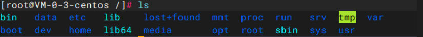
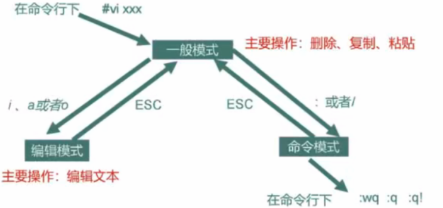
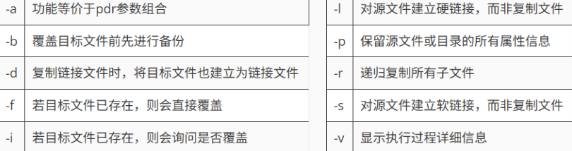
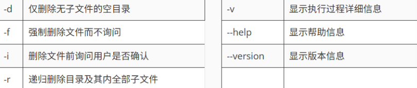
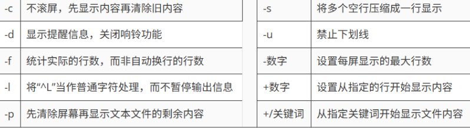
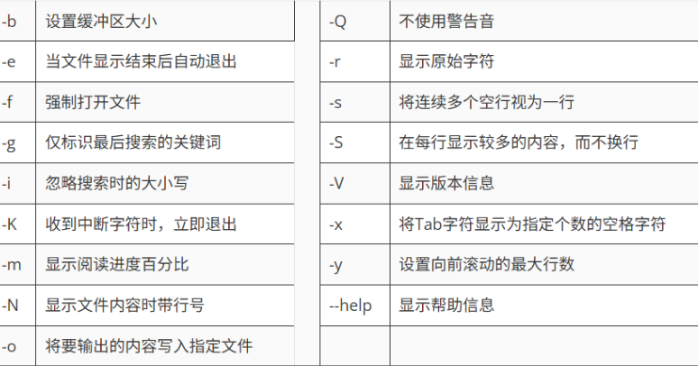
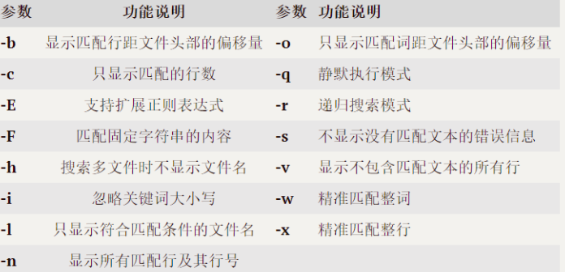
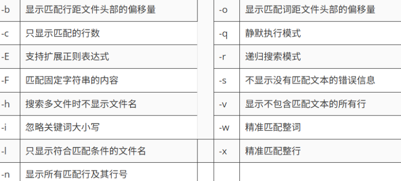

> 常用工具：[Linux 命令搜索](https://wangchujiang.com/linux-command/) | [菜鸟教程 - Linux](https://www.runoob.com/linux/) | [Linux 工具快查](https://linuxtools-rst.readthedocs.io/)

## 一、Linux 目录结构 ⭐⭐⭐

Linux 的文件系统是**一棵从根 `/` 开始的倒挂树**，没有 Windows 那种"盘符"概念——所有的设备、外接存储、进程信息统统挂在这棵树的某个节点下。理解顶层目录各自"装什么"是搞清一切文件路径的前提。

<p align='center'>
    
</p>

| 目录 | 全称 / 语义 | 装什么 |
|------|-------------|--------|
| `/bin` | binary | 系统级可执行命令（`ls`、`cp`、`mv` 等） |
| `/sbin` | super binary | **超级用户**（root）才能用的命令 |
| `/etc` | et cetera | **系统配置文件**（网络、用户、服务） |
| `/home` | | 普通用户的家目录，每人一个子文件夹 |
| `/root` | | root 用户的家目录（**不是 `/`**） |
| `/var` | variable | **可变数据**：日志、数据库文件、缓存 |
| `/tmp` | temporary | 临时文件，可随时清理 |
| `/dev` | device | 设备文件（键盘、磁盘、打印机） |
| `/boot` | | 启动系统需要的内核和引导文件 |
| `/opt` | optional | 第三方软件（MySQL、Tomcat 等） |
| `/usr` | user | 系统级共享资源（软件、文档、库） |
| `/lib` | library | 启动和运行所需的库文件 |
| `/mnt` | mount | 手动挂载外部设备（U 盘、光盘）的位置 |

!!! tip "怎么记"
    分成三组就好理解：**给命令住的**（`bin`、`sbin`、`usr`、`lib`）、**给数据住的**（`home`、`root`、`var`、`tmp`、`opt`）、**给系统住的**（`etc`、`boot`、`dev`、`mnt`）。

---

## 二、Vim 编辑器 ⭐⭐⭐

### 2.1 三种模式

Vim 是 Linux 上事实上的默认编辑器，一切都围绕**三种模式**运转：

- **一般模式（Normal）**：`vim 文件名` 打开后默认所处的模式，光标移动、复制、删除都在这里
- **编辑模式（Insert）**：真正能敲字符插入内容的模式，通过 `i / a / o` 进入，`Esc` 返回
- **命令模式（Command-line）**：以 `:` 或 `/` 开头，用于保存、退出、查找、替换

<p align='center'> 
    
</p>

!!! info "为什么这么设计"
    Vim 的核心哲学是"**光标停留的时间远长于打字的时间**"——所以把最常用的移动、复制、删除操作直接绑定成一般模式下的单键快捷键，而不是 Ctrl 组合键。刚开始别扭，一旦顺手效率极高。

### 2.2 一般模式：光标、删除、复制

=== "光标移动"

    ```shell
    n + G      # 移动到第 n 行
    G          # 移动到最后一行
    gg         # 移动到第一行
    0          # 行首
    $          # 行尾
    w          # 下一个单词
    b          # 上一个单词
    ```

=== "删除"

    ```shell
    dd         # 删除当前行
    ndd        # 删除 n 行（如 3dd 删 3 行）
    dw         # 删除一个单词
    x          # 删除光标所在字符
    X          # 删除光标前一个字符
    ```

=== "复制粘贴"

    ```shell
    yy         # 复制当前行
    nyy        # 复制 n 行
    yw         # 复制一个单词
    p          # 粘贴到光标之后
    P          # 粘贴到光标之前
    u          # 撤销
    ```

### 2.3 进入编辑模式的 6 种方式

| 按键 | 功能 |
|:-----|:-----|
| `i` | 在当前光标**前**插入 |
| `a` | 在当前光标**后**插入 |
| `o` | 在当前行的**下一行**插入新行 |
| `I` | 在当前行的**行首**插入 |
| `A` | 在当前行的**行尾**插入 |
| `O` | 在当前行的**上一行**插入新行 |

### 2.4 命令模式：退出、查找、替换

=== "退出"

    ```
    :q         # 退出（无修改）
    :wq        # 保存并退出
    :q!        # 强制退出不保存
    :x         # 保存并退出（同 :wq）
    ```

=== "查找与替换"

    ```
    /word              # 向下查找 word（按 n 跳下一个）
    ?word              # 向上查找
    :%s/old/new/g      # 全局替换 old 为 new
    :%s/old/new/gc     # 全局替换但每次询问确认
    ```

=== "显示设置"

    ```
    :set nu            # 显示行号
    :set nonu          # 取消行号
    :set paste         # 粘贴外部内容前设置（避免自动缩进错乱）
    ```

---

## 三、Linux 核心命令

### 3.1 关机与重启

```shell
reboot        # 重启
shutdown -h now       # 立即关机
shutdown -h +10       # 10 分钟后关机
shutdown -r 20:30     # 20:30 重启
```

!!! warning "生产环境别乱用 shutdown"
    远程 SSH 到服务器时一旦 shutdown 就断连了。重要机器执行前先看好机器编号、和团队打招呼——**没有回头路**。

### 3.2 服务管理 systemctl ⭐⭐⭐

`systemctl` 是 systemd 提供的服务管理入口。理解一点：**"临时操作"和"永久操作"是两个正交维度**——`start` 只是这一次启起来，`enable` 才是让它开机自启。

=== "临时操作（本次会话）"

    ```shell
    systemctl start xxx        # 启动服务
    systemctl restart xxx      # 重启服务
    systemctl stop xxx         # 停止服务
    systemctl status xxx       # 查看状态
    ```

=== "永久操作（开机自启）"

    ```shell
    systemctl enable xxx           # 设置开机自启
    systemctl disable xxx          # 关闭开机自启
    systemctl is-enabled xxx       # 查看是否已设开机自启
    systemctl list-unit-files      # 列出所有已知服务
    ```

<!-- 配图建议
主题：systemctl 的四种状态转换
概念：服务的"启动状态"（active/inactive）与"启用状态"（enabled/disabled）是两个独立维度，共四种组合
类型：状态转换图（2x2 矩阵）
建议路径：assets/imgs/linux/basic/systemctl_states.png
-->
<p align='center'>
    
</p>

### 3.3 文件与目录 ⭐⭐⭐

#### 1. pwd / ls / cd

**pwd**（print working directory）打印当前所在目录：

```shell
pwd           # 显示当前逻辑路径
pwd -L        # 显示逻辑路径（默认）
pwd -P        # 显示真实物理路径（穿透软链接）
```

**ls**（list）列出目录内容，是最高频的命令之一：

```shell
ls              # 当前目录内容
ls -a           # 显示所有文件（含隐藏文件，以 . 开头的）
ls -l           # 详细列表（权限、大小、时间）
ls -lh          # 大小用人类可读单位（K/M/G）
ls -t           # 按修改时间排序
ls -S           # 按文件大小排序
ll              # 通常是 ls -l 的别名
```

**cd**（change directory）切换目录：

```shell
cd /path/to/dir   # 切换到指定目录
cd ~              # 切换到当前用户家目录（等价于 cd）
cd -              # 切换到上一次的目录
cd ..             # 上一级目录
cd ../..          # 上两级目录
cd -L             # 切到软链接指向的位置
cd -P             # 切到软链接的真实位置
```

#### 2. mkdir / rmdir / touch

**mkdir**（make directory）建目录：

```shell
mkdir dirname                # 创建单个目录
mkdir -p a/b/c/d             # 递归创建多级目录（重要！）
mkdir -m 755 dirname         # 创建目录时指定权限
mkdir -v dirname             # 显示执行详情
```

!!! tip "`-p` 参数为什么这么好用"
    默认情况下 `mkdir a/b/c` 如果中间的 `a`、`b` 不存在会直接报错。加 `-p` 后不管缺哪一层都会自动补齐，且已存在也不会报错——这在写脚本时几乎必加。

**rmdir** 只能删除**空目录**，非空目录必须用 `rm -r`。所以 `rmdir` 了解即可，实际几乎不用。

**touch** 有两种用途：文件不存在则创建空文件，已存在则更新时间戳。

```shell
touch newfile.txt       # 创建空文件
touch a.txt b.txt       # 一次创建多个
```

创建带内容的文件还有两种常见方式：

```shell
vim test.txt                    # vim 会自动创建，:wq 保存
echo "hello" > test.txt         # 覆写创建
echo "hello" >> test.txt        # 追加（文件不存在也会创建）
```

#### 3. cp / mv / rm

**cp**（copy）复制文件或目录：

```shell
cp source.txt target.txt        # 复制文件
cp -r sourceDir/ targetDir/     # 递归复制目录（**必加 -r**）
cp -f source target             # 强制覆盖不询问
cp -p source target             # 保留原文件的权限、时间戳
```

<p align='center'>
    
</p>

**mv**（move）移动或改名：

```shell
mv oldname.txt newname.txt      # 同目录 = 改名
mv file.txt /tmp/               # 跨目录 = 移动
mv -i source target             # 覆盖前询问
```

一句话：`cp` 复制后文件数会变多，`mv` 移动后文件数不变。**同目录下的 `mv` 就是改名**。

**rm**（remove）删除，一次可删多个文件，加 `-r` 递归删目录。

!!! danger "rm -rf 是核弹按钮"
    `rm -rf /*` 会瞬间清空整个系统且**无法恢复**。执行任何 `rm -rf` 之前一定：

    1. 确认当前工作目录（`pwd`）
    2. 确认要删的是什么（`ls` 一遍）
    3. **绝不要**在 root 下无脑复制粘贴网上抄来的 `rm` 命令

<p align='center'>
    
</p>

#### 4. 查看文件内容

Linux 提供了一堆看文件的命令，看起来重复，其实每个都有独特场景：

| 命令 | 场景 | 特点 |
|------|------|------|
| `cat` | 内容少的**小文件** | 一次性全部输出，滚屏就看不清了 |
| `more` | 内容多的**大文件** | 分页显示，只能**向下**翻 |
| `less` | 内容多的**大文件** | 分页 + 可**双向翻页** + 支持 `/查找` |
| `head` | 看文件**开头** | 默认前 10 行 |
| `tail` | 看文件**结尾** | 默认后 10 行，`-f` 可实时追踪 |

**cat**：

```shell
cat file.txt        # 输出全部内容
cat -n file.txt     # 带行号
```

**more**：

```shell
more file.txt
# 交互式按键：
#   空格   向下翻一页
#   回车   向下翻一行
#   =      显示当前行号
#   :f     显示文件名和行号
#   q      退出
```

<p align='center'>
    
</p>

**less** —— 比 `more` 强大得多：

```shell
less file.txt
# 交互式按键：
#   空格 / PageDown   向下翻页
#   b / PageUp        向上翻页
#   /keyword          向下查找
#   ?keyword          向上查找
#   n / N             跳到下一个 / 上一个匹配
#   q                 退出
```

<p align='center'>
    
</p>

**head / tail**：

```shell
head file.txt              # 前 10 行
head -n 5 file.txt         # 前 5 行
head -c 100 file.txt       # 前 100 字节

tail file.txt              # 后 10 行
tail -n 5 file.txt         # 后 5 行
tail -f app.log            # 实时追踪日志新增内容（Ctrl+C 退出）⭐
tail -F app.log            # 类似 -f，但文件被 rotate 也能跟上
```

!!! tip "`tail -f` 是运维排障神器"
    看服务实时日志几乎必用。若配合 `grep`：`tail -f app.log | grep ERROR` 可实时过滤错误。

**echo** —— 输出字符串或变量到终端，最常用来**结合重定向写文件**：

```shell
echo "hello"                # 输出到终端
echo $HOME                  # 输出变量值
echo "line1" > file.txt     # 覆写文件
echo "line2" >> file.txt    # 追加到文件末尾
```

#### 5. ln 软链接与硬链接

**ln**（link）建立**链接文件**——但 Linux 里有两种链接，行为完全不同：

- **软链接**（symbolic link）：类似 Windows 快捷方式，存的是原文件的**路径**。原文件被删或移动，软链接就失效
- **硬链接**（hard link）：存的是原文件的 **inode**（可以理解成文件在磁盘上的"身份证号"）。原文件被删，硬链接依然指向真实数据

<!-- 配图建议
主题：软链接 vs 硬链接
概念：软链接保存的是"路径字符串"，指向的是文件名；硬链接保存的是 inode，直接指向磁盘上的数据块——所以原文件删掉，软链接失效但硬链接仍然可用
类型：对比图 / 数据结构图
建议路径：assets/imgs/linux/basic/soft_vs_hard_link.png
-->
<p align='center'>
    
</p>

```shell
# 创建软链接（-s = symbolic）
ln -s /opt/jdk-17/bin/java /usr/local/bin/java

# 创建硬链接（不加 -s）
ln original.txt backup.txt
```

日常用得最多的是 `ln -s`，做命令的"别名式"入口很方便。

### 3.4 用户与权限 ⭐⭐⭐

#### 1. 用户管理

```shell
# 新增用户（会自动创建同名家目录 /home/用户名）
useradd zhangsan
useradd -g dev zhangsan        # 指定所属组（组必须已存在）

# 删除用户
userdel zhangsan               # 保留家目录
userdel -r zhangsan            # 连家目录一起删

# 设置密码
passwd zhangsan                # root 可为任何人改
passwd                         # 普通用户改自己的

# 修改用户属性
usermod -g newgroup zhangsan   # 修改主组
usermod -aG sudo zhangsan      # 追加到 sudo 组（-a 表示 append）
```

!!! warning "`-a` 参数别忘"
    `usermod -G group1 zhangsan` 会**替换**用户的附加组，只留下 `group1`。要**追加**必须加 `-a`：`usermod -aG group1 zhangsan`。这是新手常见踩坑点。

#### 2. 查看用户与组

```shell
id zhangsan                    # 看用户 ID、组 ID
cat /etc/passwd                # 所有用户
cat /etc/group                 # 所有组
cat /etc/sudoers               # sudo 权限配置
```

#### 3. 组管理

```shell
groupadd dev                   # 新建组
groupdel dev                   # 删除组
cat /etc/group                 # 查看所有组
```

#### 4. sudo 授权

给某个用户 sudo 权限的标准做法：

```
# 编辑 /etc/sudoers（用 visudo 而不是 vim，能做语法检查）
sudo visudo

# 加入一行：
zhangsan  ALL=(ALL)  NOPASSWD:ALL
```

之后 `zhangsan` 就能用 `sudo 命令` 以 root 权限执行操作了，`NOPASSWD:ALL` 表示免密码。

#### 5. 用户切换

```shell
su - zhangsan          # 切换到 zhangsan（加 - 会加载对方的环境变量）
exit                   # 退出当前用户回到上层
logout                 # 退出登录 shell
```

#### 6. 权限模型 ⭐⭐⭐

Linux 文件权限用 **10 位字符**表示：

- **第 1 位**：文件类型（`-` 普通文件、`d` 目录、`l` 软链接）
- **第 2-4 位**：**所有者**（owner / user）的权限
- **第 5-7 位**：**所属组**（group）的权限
- **第 8-10 位**：**其他人**（other）的权限

每组三位分别是 `rwx`（读 read / 写 write / 执行 execute）。

<p align='center'>
    
</p>

**数字表示法**——权限也可以用数字：`r=4`、`w=2`、`x=1`，把三个权限的数字相加就是这一组的权限值。

| 权限 | 二进制 | 数字 | 含义 |
|------|--------|------|------|
| `---` | 000 | 0 | 无 |
| `--x` | 001 | 1 | 只能执行 |
| `-w-` | 010 | 2 | 只能写 |
| `r--` | 100 | 4 | 只能读 |
| `r-x` | 101 | 5 | 读+执行 |
| `rw-` | 110 | 6 | 读+写 |
| `rwx` | 111 | 7 | 全部 |

所以 `chmod 755 file` 就是**所有者 rwx、组 r-x、其他人 r-x**——最常见的可执行文件权限。

#### 7. chmod / chown

**chmod**（change mode）修改权限：

```shell
# 数字法
chmod 755 script.sh
chmod -R 644 dir/              # 递归修改目录下所有

# 符号法（u=owner, g=group, o=other, a=all）
chmod u+x script.sh            # 给所有者加执行权限
chmod g-w file.txt             # 组去掉写权限
chmod a+r file.txt             # 所有人加读权限
chmod u=rwx,g=rx,o=r file.txt  # 精确设置
```

**chown**（change owner）修改所有者/组：

```shell
chown zhangsan file.txt              # 改所有者
chown zhangsan:dev file.txt          # 同时改所有者和组
chown -R zhangsan:dev /var/www/      # 递归修改
```

### 3.5 查询：find 与 grep

两个都叫"查"，但方向不同：

- **`find`**：**按条件找文件**（文件名、大小、类型、修改时间）
- **`grep`**：**在文件内容里找文本**（配合正则）

**find**：

```shell
find / -name "*.log"              # 全盘找 .log 文件
find /var -type f -size +100M     # /var 下大于 100M 的文件
find . -mtime -7                  # 当前目录下 7 天内修改过的
find / -name "core.*" -delete     # 找到并直接删（危险！先不带 -delete 确认）
```

<p align='center'>
    
</p>

!!! warning "`find /` 在高负载服务器上要慎用"
    从根目录全盘搜索会消耗大量 IO，繁忙的生产机器上会拖慢业务。已知大致路径时尽量缩小搜索起点。

**grep**：

```shell
grep "ERROR" app.log              # 在文件里搜含 ERROR 的行
grep -i "error" app.log           # 忽略大小写
grep -n "error" app.log           # 显示行号
grep -r "TODO" ./                 # 递归搜目录
grep -v "DEBUG" app.log           # 反选：不含 DEBUG 的行
grep -A 3 "error" app.log         # 匹配行 + 后 3 行上下文
```

<p align='center'>
    
</p>

`grep` 常配合管道使用，比如实时过滤日志错误：

```shell
tail -f app.log | grep --color ERROR
```

### 3.6 压缩与解压

Linux 下三种主流压缩方案，各有分工：

| 工具 | 后缀 | 场景 | 备注 |
|------|------|------|------|
| **gzip** | `.gz` | 单个文件压缩 | 压缩后**原文件消失**，只能压文件不能压目录 |
| **zip** | `.zip` | 跨平台通用 | 可压目录，Windows 原生支持 |
| **tar** | `.tar` / `.tar.gz` | Linux 归档标准 | 可打包目录，配合 `-z` 加 gzip 压缩 |

**gzip**：

```shell
gzip file.txt           # 压缩，得到 file.txt.gz（原文件消失）
gunzip file.txt.gz      # 解压
gzip -k file.txt        # 压缩但**保留**原文件
```

**zip**：

```shell
zip archive.zip file.txt              # 压缩单文件
zip -r archive.zip dir/               # 递归压缩目录
unzip archive.zip                     # 解压到当前目录
unzip archive.zip -d /tmp/            # 解压到指定目录
```

**tar** —— 最常用，参数记住 `czvf` / `xzvf` 就够：

```shell
# 打包（不压缩）
tar -cvf archive.tar dir/

# 打包 + gzip 压缩
tar -czvf archive.tar.gz dir/

# 解包
tar -xvf archive.tar
tar -xvf archive.tar -C /target/     # 解到指定目录

# 解压 + 解包
tar -xzvf archive.tar.gz
tar -xzvf archive.tar.gz -C /target/
```

参数速记：

| 参数 | 含义 |
|------|------|
| `-c` | create，打包 |
| `-x` | extract，解包 |
| `-v` | verbose，显示过程 |
| `-f` | file，指定操作的文件（必须放最后） |
| `-z` | 通过 gzip 压缩/解压 |
| `-j` | 通过 bzip2 压缩/解压 |

---

## 四、软件安装（非 Docker） ⭐⭐⭐

Linux 的软件安装大体两条路：**包管理器**（推荐）和**手动解压二进制/源码编译**。而包管理器又因发行版不同分为两大阵营——**RPM 系**（CentOS / RHEL / Rocky）用 `yum` / `dnf`，**Debian 系**（Debian / Ubuntu）用 `apt`。

### 4.1 包管理器基础：yum vs apt

| 场景 | RPM 系（CentOS / Rocky） | Debian 系（Ubuntu / Debian） |
|------|---------------------------|-------------------------------|
| **包格式** | `.rpm` | `.deb` |
| **底层工具** | `rpm` | `dpkg` |
| **前端工具** | `yum` / `dnf`（新版推荐 dnf） | `apt` / `apt-get` |
| **搜索软件** | `yum search 关键字` | `apt search 关键字` |
| **安装** | `yum install xxx` | `apt install xxx` |
| **卸载** | `yum remove xxx` | `apt remove xxx` |
| **更新缓存** | `yum makecache` | `apt update` |
| **升级软件** | `yum update xxx` | `apt upgrade xxx` |
| **列出已装** | `rpm -qa` | `dpkg -l` |
| **查所属包** | `rpm -qf 文件路径` | `dpkg -S 文件路径` |

!!! tip "记忆窍门"
    `apt update` 只是更新**软件源索引**（"哪些新版本可以装"），不会真的升级软件；`apt upgrade` 才是执行升级。这和 `yum` 的行为不同——`yum` 每次执行命令都会自动 makecache，感受不到 update 这一步。

#### 直接使用底层工具

有时候拿到的是本地 `.rpm` 或 `.deb` 包（比如从官网下载），需要底层工具直接安装：

=== "CentOS / Rocky（.rpm）"

    ```shell
    # 查询
    rpm -qa | grep 关键字      # 已装的软件里搜
    rpm -ql 软件名             # 查软件装到了哪些位置
    rpm -qf /usr/bin/vim       # 查某个文件属于哪个包

    # 安装本地 rpm 包
    rpm -ivh xxx.rpm           # i=install, v=verbose, h=进度条
    rpm -ivh --nodeps xxx.rpm  # 强制安装（忽略依赖，但可能装完跑不起来）

    # 卸载
    rpm -e 软件名               # 卸载（有依赖会失败）
    rpm -e --nodeps 软件名      # 强制卸载
    ```

=== "Ubuntu / Debian（.deb）"

    ```shell
    # 查询
    dpkg -l | grep 关键字       # 已装的软件里搜
    dpkg -L 软件名              # 查软件装到了哪些位置
    dpkg -S /usr/bin/vim        # 查某个文件属于哪个包

    # 安装本地 deb 包（**推荐 apt install 本地文件**，会自动处理依赖）
    sudo apt install ./xxx.deb  # 推荐
    sudo dpkg -i xxx.deb        # 底层安装，若缺依赖会报错
    sudo apt install -f         # 若 dpkg 缺依赖，用这条自动补齐

    # 卸载
    sudo apt remove 软件名       # 卸载但保留配置文件
    sudo apt purge 软件名        # 卸载并删除配置文件
    ```

### 4.2 切换软件源（换镜像加速）

国内访问官方源慢是常态，换成阿里、清华、中科大的镜像能快很多。

=== "CentOS 7（阿里源）"

    !!! warning "CentOS 7 已停止维护"
        CentOS 7 官方源自 2024 年 7 月起下线，必须切换到镜像源才能继续使用 `yum`。

    ```shell
    # 备份原源
    mv /etc/yum.repos.d/CentOS-Base.repo /etc/yum.repos.d/CentOS-Base.repo.bak

    # 下载阿里源
    wget -O /etc/yum.repos.d/CentOS-Base.repo \
        http://mirrors.aliyun.com/repo/Centos-7.repo

    # 清缓存并重建
    yum clean all && yum makecache
    ```

=== "Ubuntu 22.04（清华源）"

    Ubuntu 22.04+ 的源配置在 `/etc/apt/sources.list.d/ubuntu.sources`（新格式）：

    ```shell
    # 备份
    sudo cp /etc/apt/sources.list.d/ubuntu.sources \
           /etc/apt/sources.list.d/ubuntu.sources.bak

    # sed 一键替换为清华源
    sudo sed -i 's@//.*archive.ubuntu.com@//mirrors.tuna.tsinghua.edu.cn@g' \
        /etc/apt/sources.list.d/ubuntu.sources

    # 更新缓存
    sudo apt update
    ```

    Ubuntu 20.04 及更早版本源在 `/etc/apt/sources.list`，命令类似。

### 4.3 安装 JDK + Tomcat

JDK 和 Tomcat 都是"下载 tar 包 → 解压 → 配环境变量"的模式，两个发行版流程完全一样。

**步骤 1：下载 tar 包**

从 [Oracle](https://www.oracle.com/java/technologies/downloads/) 或 [OpenJDK](https://jdk.java.net/) 下载 `.tar.gz`，上传到服务器 `/opt` 下。

**步骤 2：解压**

```shell
cd /opt
tar -zxvf jdk-17_linux-x64_bin.tar.gz
```

**步骤 3：配置环境变量**

推荐**不改 `/etc/profile`**，而是在 `/etc/profile.d/` 下新建一个 `.sh`——这样系统更新时不会被覆盖，且可插拔：

```shell
sudo vim /etc/profile.d/my_env.sh
```

写入：

```shell
# JAVA_HOME
export JAVA_HOME=/opt/jdk-17.0.12
export PATH=$PATH:$JAVA_HOME/bin
```

**步骤 4：让环境变量生效**

```shell
source /etc/profile.d/my_env.sh
java -version              # 验证
```

**Tomcat 类似**：官网下 `apache-tomcat-10.x.tar.gz`，解压到 `/opt` 即可，`bin/startup.sh` 启动。

!!! warning "端口没开访问不了"
    - 云服务器要在**控制台安全组**放行端口
    - 本机防火墙也要放行：`firewall-cmd --add-port=8080/tcp --permanent && firewall-cmd --reload`（CentOS）或 `ufw allow 8080`（Ubuntu）

### 4.4 安装 MySQL

#### CentOS 系：RPM Bundle

**1）下载**：去 [MySQL 官网](https://dev.mysql.com/downloads/mysql/) 选 `Linux - Generic - RPM Bundle`，得到一个 `.tar` 包（**不是 `.tar.gz`**，里面装了所有需要的 rpm）。

先看系统版本决定下哪个：

```shell
cat /etc/redhat-release          # 查看 CentOS 版本
```

**2）解包 + 按顺序安装 rpm**：

```shell
tar -xvf mysql-8.0.30-1.el7.x86_64.rpm-bundle.tar

# 按依赖顺序安装
rpm -ivh mysql-community-common-*.rpm
rpm -ivh mysql-community-client-plugins-*.rpm
rpm -ivh mysql-community-libs-*.rpm
rpm -ivh mysql-community-icu-data-files-*.rpm
rpm -ivh mysql-community-client-*.rpm
rpm -ivh mysql-community-server-*.rpm
```

**3）验证**：

```shell
mysqladmin --version
```

#### Ubuntu 系：apt 直接装

Ubuntu 上简单太多：

```shell
sudo apt update
sudo apt install -y mysql-server
sudo systemctl start mysql
sudo systemctl enable mysql

# 交互式初始化（设 root 密码、移除匿名用户等）
sudo mysql_secure_installation
```

#### 通用：服务管理与密码初始化

```shell
# 初始化数据目录（CentOS 需要，Ubuntu apt 装完已自动完成）
mysqld --initialize --user=root

# 启动服务
systemctl start mysqld       # CentOS
systemctl start mysql        # Ubuntu

# 找初始密码（首次启动后 log 里会打印）
grep "temporary password" /var/log/mysqld.log
```

!!! warning "遇到权限错误"
    启动时若报 `Permission denied` 之类错误，一般是数据目录权限问题：

    ```shell
    sudo chown -R mysql:mysql /var/lib/mysql
    sudo chmod -R 750 /var/lib/mysql
    ```

#### 重置密码与开放远程访问

```sql
-- 登录后执行
ALTER USER 'root'@'localhost' IDENTIFIED BY '你的新密码';

-- 允许 root 从任意主机连接（开发环境用，生产禁止！）
USE mysql;
UPDATE user SET host='%' WHERE user='root';
FLUSH PRIVILEGES;         -- 修改底层表必须刷新才生效
```

!!! danger "生产环境别开 `%`"
    `host='%'` 意味着任意 IP 都能来连接你的 MySQL。生产库应严格限制到 App 服务器的 IP，且用非 root 账号。

### 4.5 安装 Nginx

#### 1）安装

=== "CentOS：配 yum 源后安装"

    ```shell
    sudo vim /etc/yum.repos.d/nginx.repo
    ```

    写入：

    ```ini
    [nginx-stable]
    name=nginx stable repo
    baseurl=http://nginx.org/packages/centos/$releasever/$basearch/
    gpgcheck=1
    enabled=1
    gpgkey=https://nginx.org/keys/nginx_signing.key
    module_hotfixes=true
    ```

    ```shell
    sudo yum install -y nginx
    ```

=== "Ubuntu：apt 一步到位"

    ```shell
    sudo apt update
    sudo apt install -y nginx
    ```

#### 2）启动与自启

```shell
sudo systemctl start nginx
sudo systemctl status nginx
sudo systemctl enable nginx     # 开机自启
```

访问 `http://服务器IP`，看到欢迎页就成功了。

#### 3）核心目录

| 路径 | 用途 |
|------|------|
| `/etc/nginx/` | 配置文件根目录 |
| `/etc/nginx/nginx.conf` | 主配置文件（全局配置） |
| `/etc/nginx/conf.d/` | 子配置目录，主配置会 include 这里所有 `.conf` |
| `/var/log/nginx/access.log` | 访问日志 |
| `/var/log/nginx/error.log` | 错误日志 |
| `/usr/share/nginx/html/` | 默认静态资源目录 |

#### 4）虚拟主机（server 块）

Nginx 一个进程可以监听多个"虚拟主机"，收到请求后**根据 `server_name` 和 `listen` 端口**决定给哪个 server 处理。

```nginx
server {
    listen 8080;
    server_name 115.190.231.171;

    location /hello-nginx {
        root /usr/share/nginx/html/;
        index index.html;
    }
}
```

改完配置后：

```shell
nginx -t              # 语法检查（**每次改完必做**）
nginx -s reload       # 平滑重载配置，无需重启
```

#### 5）反向代理

Nginx 最常见的用途——把外部请求转发给内部应用服务器：

```nginx
server {
    listen 8080;
    server_name 115.190.231.171;

    location / {
        proxy_pass http://www.atguigu.com;
    }
}
```

<!-- 配图建议
主题：Nginx 反向代理请求流向
概念：客户端 → Nginx（对外的 8080 端口）→ 后端应用服务器（内网），Nginx 作为流量入口和统一反向代理
类型：数据流图 / 时序图
建议路径：assets/imgs/linux/basic/nginx_reverse_proxy.png
-->
<p align='center'>
    
</p>

#### 6）SELinux 与访问被拒

CentOS 默认开启 **SELinux**（Security-Enhanced Linux），有时候 Nginx 反向代理返回 502，日志里没啥错，八成是 SELinux 拦下了。

```shell
sudo setenforce 0        # 临时把 SELinux 切到 Permissive 模式
```

!!! info "SELinux 三种模式"
    - **Enforcing**：强制执行策略，拦截并记录违规
    - **Permissive**：只记录，不拦截（排障用）
    - **Disabled**：完全关闭
    
    `setenforce 0` 只是**临时**切到 Permissive，重启后恢复。永久禁用需要改 `/etc/selinux/config`——但生产环境**不建议禁用**，最好写正确的 SELinux 策略。Ubuntu 默认不启用 SELinux（用 AppArmor 替代），所以这个问题主要出在 CentOS。

### 4.6 安装 MinIO

MinIO 是兼容 S3 协议的对象存储。安装方式官方推荐直接下载二进制或 rpm。

**1）下载并安装**

```shell
# 下载 rpm
wget https://dl.min.io/server/minio/release/linux-amd64/archive/minio-20241029160148.0.0-1.x86_64.rpm -O minio.rpm

# CentOS
sudo dnf install minio.rpm
# 或
sudo rpm -ivh minio.rpm

# Ubuntu（用 apt install 本地文件，能自动处理依赖）
sudo apt install ./minio.rpm     # 若报错，可先转成 deb 或直接下二进制
```

Ubuntu 更推荐直接下二进制：

```shell
wget https://dl.min.io/server/minio/release/linux-amd64/minio
chmod +x minio
sudo mv minio /usr/local/bin/
```

**2）前台启动测试**

```shell
mkdir ~/minio
minio server ~/minio --console-address :9001
```

默认账号密码 `minioadmin` / `minioadmin`。浏览器访问 `http://IP:9001` 即可。

**3）配置为 systemd 服务（后台运行）**

```shell
sudo vim /etc/systemd/system/minio.service
```

写入：

```ini
[Unit]
Description=MinIO
Documentation=https://min.io/docs/minio/linux/index.html
Wants=network-online.target
After=network-online.target
AssertFileIsExecutable=/usr/local/bin/minio

[Service]
WorkingDirectory=/usr/local
EnvironmentFile=-/etc/default/minio
ExecStart=/usr/local/bin/minio server $MINIO_OPTS $MINIO_VOLUMES
Restart=always
LimitNOFILE=65536
TasksMax=infinity
TimeoutStopSec=infinity
SendSIGKILL=no

[Install]
WantedBy=multi-user.target
```

**4）配置环境变量文件**

```shell
sudo vim /etc/default/minio
```

写入：

```ini
MINIO_ROOT_USER=minioadmin
MINIO_ROOT_PASSWORD=你的强密码
MINIO_VOLUMES=/root/minio/data
MINIO_OPTS="--console-address :9001"
```

```shell
mkdir -p /root/minio/data
chmod -R 755 /root/minio/data

sudo systemctl daemon-reload
sudo systemctl start minio
sudo systemctl enable minio
```

| 配置项 | 说明 |
|--------|------|
| `EnvironmentFile` | 环境变量文件路径 |
| `ExecStart` | 服务启动命令 |
| `MINIO_OPTS` | 启动选项（如控制台端口） |
| `MINIO_VOLUMES` | **必填**，数据存储目录 |
| `Restart=always` | 崩溃后自动重启 |

**5）设置桶的公读策略**

有时候希望某个桶里的对象可以匿名读取（如公开图床），在 MinIO 控制台或 API 里设置策略：

```json
{
  "Statement": [{
    "Action": "s3:GetObject",
    "Effect": "Allow",
    "Principal": "*",
    "Resource": "arn:aws:s3:::test/*"
  }],
  "Version": "2012-10-17"
}
```

!!! warning "公读策略要谨慎"
    `Principal: "*"` 意味着**互联网上任何人**都能匿名 GET 这个桶里的对象。只在明确要做公开静态资源时才开，且路径下不要放敏感文件。

---

## 五、其他常用命令

### 5.1 端口与进程

```shell
# 查看端口是否被占用
ss -tuln | grep :8080           # 现代推荐
netstat -anp | grep :8080       # 老命令，可能要额外装 net-tools

# 查看端口上跑的具体是哪个进程
lsof -i:8080

# 按进程名找 PID
pgrep -f nginx
ps aux | grep nginx

# 杀进程
kill PID                        # 优雅退出（发 SIGTERM）
kill -9 PID                     # 强制杀死（SIGKILL，最后手段）
```

### 5.2 系统资源

```shell
df -h              # 磁盘使用情况（人类可读）
du -sh /var/log    # 某目录占多少空间
free -h            # 内存使用情况
top                # 实时资源监控（q 退出）
htop               # 更好用的 top（需 apt/yum 装）
uptime             # 系统运行时长和负载
```

### 5.3 网络诊断

```shell
ping baidu.com                  # 网络连通性
curl -I https://baidu.com       # 只看响应头
wget https://xxx.tar.gz         # 下载文件
ip addr                         # 查看网卡和 IP（现代命令）
ifconfig                        # 老命令（Ubuntu 需装 net-tools）
```

---

## 附录

??? note "常用命令速查（一页纸）"

    ```shell
    # 目录导航
    pwd, cd, ls, ll, tree

    # 文件操作
    touch, mkdir -p, cp -r, mv, rm -rf

    # 查看文件
    cat, less, head, tail -f, echo >

    # 查找
    find / -name, grep -rn "keyword"

    # 权限
    chmod 755, chown user:group, sudo

    # 用户
    useradd, passwd, usermod -aG, su -

    # 服务
    systemctl start|stop|restart|status|enable

    # 压缩
    tar -czvf, tar -xzvf, unzip, zip -r

    # 网络与端口
    ss -tuln, lsof -i:port, ping, curl -I

    # 资源
    df -h, du -sh, free -h, top, htop
    ```
