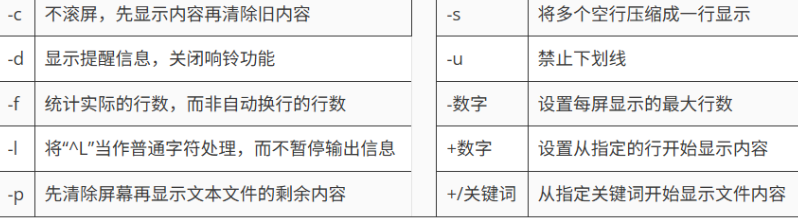
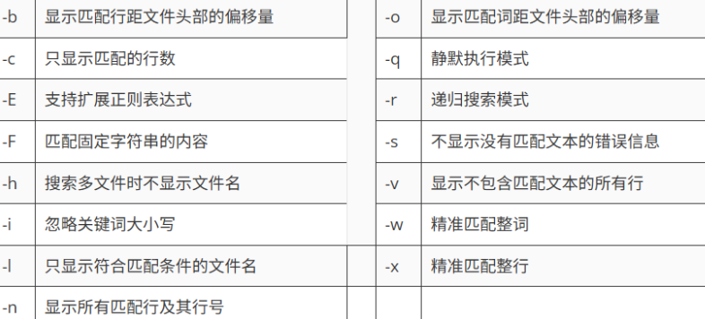

### **Linux 的文件目录**

<p align='center'>
    
</p>

``` java
a.  bin可执行系统命令文件夹
b.  sbin 超级用户(root)可执行命令文件夹
c.  etc 系统配置文件夹位置,网络配置,用户配置等
d.  home 存放用户的主目录,每个用户都有一个对应的文件夹
e.  root 是超级用户(root)的主目录
f.  var 存放可变文件夹,例如:日志文件,数据库文件等
g.  tmp 存放临时文件位置,可以清理
h.  dev 存放设备文件,用户系统访问设备文件,例如: 键盘,打印机等等
i.  boot 启动系统所需要的文件
j.  opt 用于存放第三方引用,例如mysql和tomcat服务器软件等等
k.  usr 存放系统可共享的资源,文档,软件等等
l.  lib 系统启动需要的运行库文件
m.  mnt 用于临时加载/挂载外部设备和系统文件 例如: 光盘,usb驱动等
```

### **Vim 编辑文件**

#### 1. vim 的三重模式

首先，用 vim 命令打开一个文件，它的模式默认是一般模式，通过 i / a / o 可以进入到编辑模式，当编辑完毕后，按 esc 可以返回一般模式，然后，再通过 : / / 从一般模式到了命令模式，来进行退出（:q)，退出并保存（:wq)，强制推出（:q!)等操作。

<p align='center'> 
    
</p>

#### 2. vim相关命令

查看当前目录文件

``` shell
ls
ls -a 
```

光标移动

``` shell
n + G // 移动到 n 行
G // 移动到最后一行
gg // 移动到页头
```

删除一行、word、字母

```shell
dd // 删除一行 
dnd //删除n行
dw // 删除一个word
x / X // 方向不同的删除字母
```

复制与粘贴

```shell
yy
yny
yw
p
```

进入编辑模式的方式


| **按键** | **功能**                     |
| :------- | :--------------------------- |
| `i`      | 在当前光标前插入             |
| `a`      | 在当前光标后插入             |
| `o`      | 在当前光标行的下一行插入新行 |
| `I`      | 在当前光标所在行的行首插入   |
| `A`      | 在当前光标所在行的行尾插入   |
| `O`      | 在当前光标行的上一行插入新   |

#### 3. 命令模式下的一些指令

进入命令模式 

```
:
/
```

一些退出操作

```
q
wq
q!
```

查找

```
/word
```

显示行号

```
set nu
set nonu
```

全局替换！

```
%s/old/new/g
```

### **Linux 核心命令**

| 平台名称           | 核心特点                   | 在线地址                                            |
| :----------------- | :------------------------- | :-------------------------------------------------- |
| **Linux 命令搜索** | 🔍 案例最全，支持关键词秒搜 | [点击访问](https://wangchujiang.com/linux-command/) |
| **菜鸟教程**       | 📂 按功能分类，适合系统学习 | [点击访问](https://www.runoob.com/linux/)           |
| **Linux 工具快查** | 🛠️ 侧重于开发实战与排查技巧 | [点击访问](https://linuxtools-rst.readthedocs.io/)  |

#### 1. 开启、关闭服务器

```shell
roboot -h now
shutdown -h now
```

#### 2. 服务管理命令
```shell
// 临时设置
systemctl start xxx
systemctl restart xxx
systemctl stop  xxx
systemclt status xxx

// 永久设置
systemctl enable xxx
systemctl disable xxx
systemctl is-enabled xxx
systemctl list-unit-files
```

#### 3. 文件相关命令

##### 1. pwd -[LP]

pwd：打印当前所在的工作完整路径 print working directory

```shell
pwd // 显示当前逻辑地址
pwd -L // 逻辑地址
pwd -P // 物理地址
```

##### 2. ls[-a -l -s -S -t ...]  | ll 

ls：ls命令来自英文单词list的缩写，中文译为“列出”，其功能是显示目录中的文件及其属性信息，是最常使用的Linux命令之‍一。 默认不添加任何参数的情况下，ls命令会列出当前工作目录中的文件信息，常与cd或pwd命令搭配使用，十分方便。带上参数后，我们可以做更多的事情。作为最基础、最频繁使用的命令，有必要仔细了解其常用功‍能。  

```
ls [-a -l] [值：文件夹名]
参数：-a 显示所有文件，包含隐藏文件 -l 详细罗列信息 -t 按创建时间排序 -S 按文件大小排序
```

##### 3. cd -[PL]

cd命令来自英文词组change directory的缩写，其功能是更改当前所处的工作目录，路径可以是绝对路径，也可以是相对路径，若省略不写则会跳转至当前使用者的家目‍录。 

``` shell
cd 参数 目录名  
—L : 切换到软连接的位置
-P ：切换到真正所在的位置
~  ：切换到当前用户的家目录 等于 cd
- ：切换到上一次所在目录
.. ：切换到上一级目录
```

##### 4. mkdir -[mpvz] 目录名

mkdir命令来自英文词组make directories的缩写，其功能是创建目录文件。该命令的使用简单，但需要注意，若要创建的目标目录已经存在，则会提示已存在而不继续创建，不覆盖已有文件。若目录不存在，但具有嵌套的依赖关系时，例如/Dir1/Dir2/Dir3/Dir4/Dir5，要想一次性创建则需要加入-p参数，进行递归操‍作。  

``` shell
-m 创建目录的同时设置权限   
-v 显示执行过程详细信息 
-p 递归创建多级目录 
-z 设置目录安全上下文  
```

##### 5. rmdir

了解：只能删除空文件夹，所以了解即可，参数与mkdir差不多，  -v -p...

##### 6. touch

touch命令的功能是创建空文件与修改时间戳。如果文件不存在，则会创建一个空内容的文本文件；如果文件已经存在，则会对文件的Atime（访问时间）和Ctime（修改时间）进行修改操作，管理员可以完成此项工作，而普通用户只能管理主机的文‍件。  

```shell
touch 参数 文件名  
vim test.txt // vim会自动创建文件，编辑完:wq就可以保存
echo "xxxxxx" >> xxx // 回直接创建一个文件并写入"xxxxxx"
// todo
```


##### 7. cp

cp命令来自英文单词copy的缩写，中文译为“复制”，其功能是复制文件或目录。cp命令能够将一个或多个文件或目录复制到指定位置，亦常用于文件的备份工作。-r参数用于递归操作，复制目录时若忘记添加则会直接报错；-f参数则用于当目标文件已存在时会直接覆盖而不再询问。这两个参数尤为常用。  

```
cp 参数 源文件名 目标文件名
```
<p align='center'>
    
</p>


##### 8. rm

rm命令来自英文单词remove的缩写，中文译为“消除”，其功能是删除文件或目录，一次可以删除多个文件，或递归删除目录及其内的所有子文件。 rm也是一个很危险的命令，使用的时候要特别当心，尤其对于新手更要格外注意。例如，执行rm -rf /*命令会清空系统中所有的文件，甚至无法恢复回来。所以我们在执行之前一定要再次确认在在哪个目录中、到底要删除什么文件，考虑好后再敲击Enter键，要时刻保持清醒的头‍脑。  

<p align='center'>
    
</p>

##### 9. mv

mv命令来自英文单词move的缩写，中文译为“移动”，其功能与英文含义相同，能够对文件进行剪切和重命名操作。这是一个被高频使用的文件管理命令，我们需要留意它与复制命令的区别。cp命令是用于文件的复制操作，文件个数是增加的，而mv则为剪切操作，也就是对文件进行移动（搬家）操作，文件位置发生变化，但总个数并无增‍加。 在同一个目录内对文件进行剪切的操作，实际上应理解成重命名操作，例如下面的第一个示例所‍示。   

```
mv 参数 源文件名 目标文件名  
```

##### 10. 查看文件内容

**cat**

cat命令来自英文词组concatenate files and print的缩写，其功能是在终端设备上显示文件内容。在Linux系统中有很多用于查看文件内容的命令，例如more、tail、head等，每个命令都有各自的特点。cat命令适合查看内容较少的纯文本文件。 对于内容较多的文件，使用cat命令查看后会在屏幕上快速滚屏，用户往往看不清所显示的具体内容，只好按Ctrl+C组合键中断命令执行，所以对于大文件，干脆用more命令‍显示吧。  

```
cat 参数 文件名 查看一屏幕显示的非动态文本（小文本）
-n 显示行号
```

**more**

more命令的功能是分页显示文本文件的内容。如果文本文件中的内容较多较长，使用cat命令读取后则很难看清，这时使用more命令进行分页查看就比较合适了，该命令可以把文本内容一页一页地显示在终端界面上，用户每按一次Enter键即向下一行，每按一次空格键即向下一页，直至看完为止。  

```
more 参数 文件名
一些命令:
= 输出当前行数
:f 输出文件名以及行数
```
<p align='center'>
    
</p>

**less**

less命令的功能是分页显示文件内容。Less命令分页显示的功能与more命令很相像，但more命令只能从前向后浏览文件内容，而less命令不仅能从前向后浏览（按PageDown键），还可以从后向前浏览（按PageUp键），更加灵‍活。  

```
less 参数 文件
空格翻页 上 下 进行翻页 q退出 /查找关键字
```
<p align='center'>
    
</p>

**head**

head命令的功能是显示文件开头的内容，默认为前10行。  

```
head 参数 文件名  
-c 设置显示头部内容的字符数   
-v 显示文件名的头信息 
-n 设置显示行数 
--help 显示帮助信息 
-q 不显示文件名的头信息   
```

**tail**

tail命令的功能是查看文件尾部内容，例如默认会在终端界面上显示指定文件的末尾10行，如果指定了多个文件，则会在显示的每个文件内容前面加上文件名来加以区分。高阶玩法的-f参数的作用是持续显示文件的尾部最新内容，类似于机场候机厅的大屏幕，总会把最新的消息显示出来 

注:只有 echo 追加才会被识别

```
tail 参数 文件名
-c 设置显示文件尾部的字符数   
--pid 当指定PID进程结束时，自动退出命令 
-f 持续显示文件尾部最新内容 
--retry 当文件无权限访问时，依然尝试打开 
-n 设置显示文件尾部的行数 
```

**echo**

echo命令的功能是在终端设备上输出指定字符串或变量提取后的值，能够给用户一些简单的提醒信息，亦可以将输出的指定字符串内容同管道符一起传递给后续命令作为标准输入信息进行二次处理，还可以同输出重定向符一起操作，将信息直接写入文件。如需提取变量值，需在变量名称前加入$符号，变量名称一般均为大写形‍式。  

```
echo 参数 字符串或$变量名  

配合重定向符
> 覆写
>> 追加
```

ln

ln命令来自英文单词link的缩写，中文译为“链接”，其功能是为某个文件在另外一个位置建立同步的链接。Linux系统中的链接文件有两种形式，一种是硬链接，另一种是软链接。软链接相当于Windows系统中的快捷方式文件，原始文件被移动或删除后，软链接文件也将无法使用；硬链接则是将文件的inode属性块进行了复制，因此把原始文件移动或删除后，硬链接文件依然可以使用。  

```
创建软连接（快捷方式）
ln -s 原文件或者文件夹 软连接名
对软连接的所有操作，相当于源文件的动作，软连接名要和源文件一致
```

#### 4. 用户以及权限命令

添加一个用户

```
useradd 用户名
-g 指定组(改组必须存在)

userdel username
-f 强制删除
-r 连相关数据也删除
```

为用户设置密码

```
passwd 用户名
```

修改用户一些属性

```
usermod 参数 用户名
-g 修改用户所在组
// 修改用户所属组
usermod -g 组名 用户名
```

查看用户是否存在以及相关信息

```
id username
cat /etc/passwd
cat /etc/group
cat /etc/sudoers
```

组相关命令

```
// 添加一个组
groupadd 组名
// 删除组
groupdel 组名
//查看组
cat /etc/group
```

赋予权限

```
1. 去 /etc/sudoers 配置文件中配置权限 账号 ALL=(ALL) NOPASSWD:ALL
2. 之后对应用户使用命令时前面 + sudo
```

用户的切换

```
su username
exit
logout 
```


#### 5. 文件权限命令

文件权限通过10位来表示,第一位是类型(-, l, d),后9位分为三组,分别代表 所有者, 所在组, 其他人的权限, 如图所示. 后面分别是文件所有者和所在组.

<p align='center'>
    
</p>


权限修改命令

chmod命令来自英文词组change mode的缩写，其功能是改变文件或目录权限的命令。默认只有文件的所有者和管理员可以设置文件权限，普通用户只能管理自己文件的权限属性。 设置权限时可以使用数字法，亦可使用字母表达式，对于目录文件，建议加入-R参数进行递归操作，这意味着不仅对于目录本身，而且也对目录内的子文件/目录进行新权限的设定。

```
chmod 参数值 [u+r, g+w, o+x] 文件/目录名
身份表示: u g o a
数字法 r 4 w 2 x 1
-R 递归处理
-v 显示执行过程
-f 修改失败后不提示信息
```

修改所有者/组

chown命令来自英文词组change owner的缩写，其功能是改变文件或目录的用户和用户组信息。管理员可以改变一切文件的所属信息，而普通用户只能改变自己文件的所属信息.

```
chown 参数 所属主:所属组 文件名  
```

#### 6. 查询文件
##### 6.1 find

find命令的功能是根据给定的路径和条件查找相关文件或目录，其参数灵活方便，且支持正则表达式，结合管道符后能够实现更加复杂的功能，是Linux系统运维人员必须掌握的命令之一。 

find命令通常进行的是从根目录（/）开始的全盘搜索，有别于whereis、which、locate等有条件或部分文件的搜索。对于服务器负载较高的情况，建议不要在高峰时期使用find命令的模糊搜索，这会相对消耗较多的系统资源。  

<p align='center'>
    
</p>


##### 6.2 grep

grep命令来自英文词组global search regular expression and print out the line的缩写，意思是用于全面搜索的正则表达式，并将结果输出。人们通常会将grep命令与正则表达式搭配使用，参数作为搜索过程中的补充或对输出结果的筛选，命令模式十分灵‍活。  

```
grep 参数(可以是一个字符串) 文件名
```


<p align='center'>
    
</p>


#### 7. 文件解压缩

##### 7.1 gzip

只能压缩文件，压缩文件的后缀名 原名.gz   压缩以后原文件消失，解压以后gz压缩包也消失

``` shell
压缩文件： gzip 文件名
解压文件： gunzip 文件名.gz
```

##### 7.2 zip

```
压缩文件: zip 压缩文件名.zip 文件名
压缩文件夹: zip -r 压缩文件夹名.zip 文件夹
解压文件/文件贾 unzip 压缩文件名.zip -d /解压的位置
```

##### 7.3 tar

tar命令的功能是压缩和解压缩文件，能够制作出Linux系统中常见的tar、tar.gz、tar.bz2等格式的压缩包文件。对于RHEL 7、CentOS 7版本及以后的系统，解压缩时不添加格式参数（如z或j），系统也能自动进行分析并解压。把要传输的文件先压缩再传输，能够很好地提高工作效率，方便分享。  

```
归纳文件
tar -cvf xxx.tar 要归纳的文件或者文件夹
-f 指定操作的文件
-z 解压缩
-c 归纳
-x 解纳
打包： tar -cvf xxx.tar 文件或者文件夹
打包+压缩：tar -czvf xxx.tar.gz 文件或者文件夹
解包： tar -xvf xxx.tar -C /解到指定的文件夹
解压+解包：tar -zxvf xxx.tar.gz -C /解到指定的文件夹
```

### **Linux 下一些应用的安装（非 docker)**
#### 1. 安装 JDK 与 Tomcat

注：所有端口都注意一下开没开放（云服务器），然后防火墙要记得关

##### JDK
1、先去官网下一个 jdk 的tar.gz 版本

2、上传到服务器，然后 tar -zxvf 就可以解压 + 解纳（opt）

3、配环境变量：vim /etc/profile.d/my_env.sh（在profile.d下面新建你的环境变量文件.sh）

```
#JAVA_HOME
JAVA_HOME=/opt/jdk-17.0.12
PATH=$PATH:$JAVA_HOME/bin
export PATH JAVA_HOME
```

4、source /etc/profile.d/my_env.s

##### Tomcat

直接去官网找到对应版本：tomcat 10.x 然后下载解压即可

#### 2. 安装mysql

1) 先去官网上下载和你的 linux 匹配的版本，最好是xxx.tar，RPM Bundle 是一个打包好的 .tar.gz 文件，包含了所有必要的 RPM 包（服务器、客户端、库等）。
```
通过命令：cat /etc/redhat-release 查看版本
```

2) 然后，把 .tar 解纳了，就到的若干个.rpm

3) 之后，按顺序通过 rpm -ivh xxx.rpm 来安装，顺序为：
```
   1）mysql-community-common-8.0.30-1.el7.x86_64.rpm
   2）mysql-community-client-plugins-8.0.30-1.el7.x86_64.rpm
   3）mysql-community-libs-8.0.30-1.el7.x86_64.rpm
   4）mysql-community-icu-data-files-8.0.30-1.el7.x86_64.rpm
   5）mysql-community-icu-data-files-8.0.30-1.el7.x86_64.rpm
   6）mysql-community-server-8.0.30-1.el7.x86_64.rpm
```
4) 安装完毕后，就可以通过 mysqladmin --version 检查是否安装成功

##### 2.1 与 mysql 服务相关的命令

启动服务

```
#初始化服务
mysqld --initialize --user=root

# 启动服务
systemclt start mysqld

# 遇到的错误（权限不足，创建不了文件）
解决：
chown -R mysql:mysql /var/lib/mysql
chmod -R 777 /var/lib/mysql
```

找初始化密码以及重置密码

```
# 找初始化密码
cat /var/log/mysqld.log
grep "temporary password" \var\log\mysqld.log
# 重置密码
ALTER USER 'root'@'localhost' IDENTIFIED BY 'liuqiang';
```

去配置哪些主机可以连接当前mysql

```
# 修改表
update user set host='%' where user='root';
# 修改完mysql底层表，记得更新 
FLUSH PRIVILEGES;
```

#### 3. 安装 nginx
##### 1 安装过程
配置Nginx yum存储库

``` java
创建/etc/yum.repos.d/nginx.repo文件
sudo vim /etc/yum.repos.d/nginx.repo

增加以下内容：

[nginx-stable]
name=nginx stable repo
baseurl=http://nginx.org/packages/centos/$releasever/$basearch/
gpgcheck=1
enabled=1
gpgkey=https://nginx.org/keys/nginx_signing.key
module_hotfixes=true

[nginx-mainline]
name=nginx mainline repo
baseurl=http://nginx.org/packages/mainline/centos/$releasever/$basearch/
gpgcheck=1
enabled=0
gpgkey=https://nginx.org/keys/nginx_signing.key
module_hotfixes=true
```

在线安装Nginx

``` java
sudo yum install nginx
```

启动Nginx

``` java
执行以下命令启动Nginx
sudo systemctl start nginx

执行以下命令查看Nginx运行状态
sudo systemctl status nginx

执行以下命令设置开机自启
sudo systemctl enable nginx
```

访问Nginx服务默认首页: 访问`http://192.168.10.101`，能访问到如下页面，则证明Nginx运行正常。

##### 2 核心目录以及文件

1. **配置文件相关**
   
    - `/etc/nginx/`：主要的Nginx配置文件目录。
    - `/etc/nginx/nginx.conf`：Nginx的主配置文件，包含全局配置信息。
    - `/etc/nginx/conf.d/`：这个目录通常包含一些附加的配置文件，默认情况下主配置文件`/etc/nginx/nginx.conf`会引入该目录的所有文件。
    
2. **日志相关**
   - `/var/log/nginx/`：Nginx的日志文件目录，包括访问日志和错误日志。
    - `/var/log/nginx/access.log`：访问日志，记录所有进入服务器的请求。
    - `/var/log/nginx/error.log`：错误日志，记录服务器处理过程中的错误信息。
   
3. **静态资源**
	 - /usr/share/nginx/html ->静态资源

##### 3 虚拟主机的配置

由于Nginx中可存在多个虚拟主机的配置，故接收到一个请求后，Nginx首先要确定请求交给哪个虚拟主机进行处理。这很显然是根据`server_name`和`listen`进行判断的。例如上述的请求路径[http://115.190.231.171/hello-nginx](http://115.190.231.171:8080/hello-nginx)，就会匹配到以下的虚拟主机

``` java
server{
    listen 8080;
    server_name 115.190.231.171;
    location /hello-nginx{
        root /usr/share/nginx/html/;
        index index.html;
    }
}

#其他命令
nginx -t 
nginx -s reload
```

##### 4 反向代理
``` java
server{
	listen 8080;
	server_name 115.190.231.171;
	location / {
		 proxy_pass http://www.atguigu.com;
	}
	
}
```
##### 5 安全模式
``` java
sudo setenforce 0 是一个用于管理 SELinux（Security-Enhanced Linux）策略的命令。

解释：
sudo: 这个命令用于以超级用户权限（root 权限）执行后续的命令。它要求用户输入密码，以确认有权限执行高权限的操作。

setenforce: 这是一个用于动态设置 SELinux 模式的命令。SELinux 有三种工作模式：Enforcing（强制）、Permissive（宽容）、Disabled（禁用）。setenforce 命令允许你切换 Enforcing 和 Permissive 模式。

Enforcing 模式：SELinux 会强制执行所有的安全策略，对不符合策略的操作进行阻止，并记录事件。
Permissive 模式：SELinux 会允许所有操作，但会记录违反安全策略的事件，不会阻止任何操作。
0: 这个数字表示将 SELinux 切换到 Permissive 模式。在这个模式下，SELinux 不会阻止任何操作，只会记录潜在的违规行为。

综上：
sudo setenforce 0 命令的作用是将 SELinux 的模式设置为 Permissive。这意味着 SELinux 会停止强制执行安全策略，只会记录任何违反策略的操作，而不会真正阻止它们。通常，管理员会在排查 SELinux 相关问题时使用这个命令，以便不被策略限制影响系统的正常操作。

注意：
这个命令仅会在当前会话中生效。如果需要永久禁用 SELinux 或更改配置，需要修改 SELinux 配置文件（通常是 /etc/selinux/config）。
在某些生产环境中，将 SELinux 设置为 Permissive 可能会带来安全隐患，因为它不再强制执行安全策略。
```


#### 4. 安装 [minio](https://min.io/docs/minio/linux/developers/java/API.html)
还是去官网下载 minio 的 rpm 包

```
wget https://dl.min.io/server/minio/release/linux-amd64/archive/minio-20241029160148.0.0-1.x86_64.rpm -O minio.rpm
```

然后直接安装

```
dnf|yum install minio.rpm

rpm -ivh xxx.rpm
```

之后就可以启动 minio 服务器了

```
mkdir ~/minio
minio server ~/minio --console-address :9001

// 后台启动
nohup minio server ./minioPath/data > ./minioPath/minio.log 2>&1 &
RootUser: minioadmin
RootPass: minioadmin
```

配置 minio 的数据存放位置以及后台启动

```
// 1. 编写MinIO服务配置文件
vim /etc/systemd/system/minio.service

// 2. 内容如下，具体可参考MinIO[官方文档]

(https://min.io/docs/minio/linux/operations/install-deploy-manage/deploy-minio-single-node-single-drive.html#create-the-systemd-service-file)。

[Unit]
Description=MinIO
Documentation=https://min.io/docs/minio/linux/index.html
Wants=network-online.target
After=network-online.target
AssertFileIsExecutable=/usr/local/bin/minio

[Service]
WorkingDirectory=/usr/local
ProtectProc=invisible
EnvironmentFile=-/etc/default/minio
ExecStartPre=/bin/bash -c "if [ -z \"${MINIO_VOLUMES}\" ]; then echo \"Variable MINIO_VOLUMES not set in /etc/default/minio\"; exit 1; fi"
ExecStart=/usr/local/bin/minio server $MINIO_OPTS $MINIO_VOLUMES
Restart=always
LimitNOFILE=65536
TasksMax=infinity
TimeoutStopSec=infinity
SendSIGKILL=no

[Install]
WantedBy=multi-user.target

// 3. 编写 EnvironmentFile 文件
vim /etc/default/minio

MINIO_ROOT_USER=minioadmin
MINIO_ROOT_PASSWORD=minioadmin
MINIO_VOLUMES=/root/minio/data
MINIO_OPTS="--console-address :9001"


mkdir /data
chmod -R 777 /root/minio/data
```


| **配置项**        | **说明**     | **备注**               |
| ----------------- | ------------ | ---------------------- |
| `EnvironmentFile` | 配置文件路径 | 用于定义环境变量       |
| `ExecStart`       | 服务启动命令 | 核心启动脚本           |
| `MINIO_OPTS`      | 启动选项参数 | 可选，引用于环境文件   |
| `MINIO_VOLUMES`   | 数据存储路径 | **必填**，指定存储位置 |
| `Restart`         | 自动重启策略 | 保证服务高可用         |


自定义桶规则

```
{
  "Statement" : [ {
    "Action" : "s3:GetObject",
    "Effect" : "Allow",
    "Principal" : "*",
    "Resource" : "arn:aws:s3:::test/*"
  } ],
  "Version" : "2012-10-17"
}
```

minio通用模板

``` java
@Test  
void testMinioClient() throws Exception {  
    // 检查并创建桶  
    boolean exists = minioClient.bucketExists(  
            BucketExistsArgs.builder().bucket(BUCKET_NAME).build()  
    );  
  
    if (!exists) {  
        minioClient.makeBucket(  
                MakeBucketArgs.builder().bucket(BUCKET_NAME).build()  
        );  
  
        String policy = """  
            {              "Statement": [{                "Action": "s3:GetObject",                "Effect": "Allow",                "Principal": "*",                "Resource": "arn:aws:s3:::%s/*"              }],              "Version": "2012-10-17"            }            """.formatted(BUCKET_NAME);  
  
        minioClient.setBucketPolicy(  
                SetBucketPolicyArgs.builder()  
                        .bucket(BUCKET_NAME)  
                        .config(policy)  
                        .build()  
        );  
    }  
  
    // 上传文件（从测试资源目录）  
    URL resource = getClass().getClassLoader().getResource("test-file.txt");  
    if (resource == null) {  
        throw new IllegalStateException("Test file 'test-file.txt' not found in resources!");  
    }  
    Path filePath = Paths.get(resource.toURI());  
    long fileSize = Files.size(filePath);  
  
    try (InputStream inputStream = Files.newInputStream(filePath)) {  
        minioClient.putObject(  
                PutObjectArgs.builder()  
                        .bucket(BUCKET_NAME)  
                        .object("remote-file.txt")  
                        // 输入流、文件大小、分片大小，默认分片大小（5MB) 
                        .stream(inputStream, fileSize, -1)  
                        .contentType("text/plain")  
                        .build()  
        );  
    }  
}
```
#### x1. 软件包管理

```java
1. 查询
rpm -qa | grep 关键字 查看安装了某个软件 [查询安装了哪些软件 grep 筛选]
rpm -ql 软件名 查看软件安装的文件夹 [软件安装的位置]

2. 卸载
rpm -e 软件名 卸载软件,如果要卸载的软件其他软件依赖,卸载失败 [如果有别的软件依赖我,我就卸载失败]
rpm -e --nodeps 软件名 强制卸载 [不关别的软件是否依赖我,我都强制卸载]

3. 安装（yum）
rpm -ivh --nodeps 软件包.rpm [--nodeps 强制安装,就算环境不足安装成功,运行不起来! ]
```
####  x2. 切换第三方源

``` java
centos7停止官方维护,切换数据源为阿里源方可使用
wget -O /etc/yum.repos.d/CentOS-Base.repo http://mirrors.aliyun.com/repo/Centos-7.repo
yum -y install 软件名
```


### **其他命令总结**

查看端口号是否被占用

```
ss -tuln | grep "port"
```

查看端口具体应用信息

```
lsof -i:port;
```