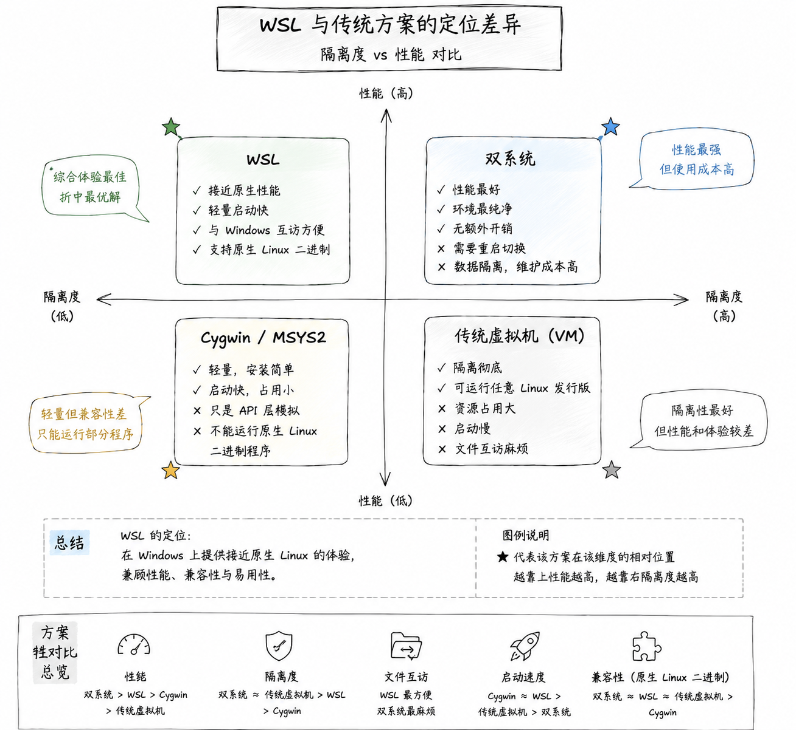
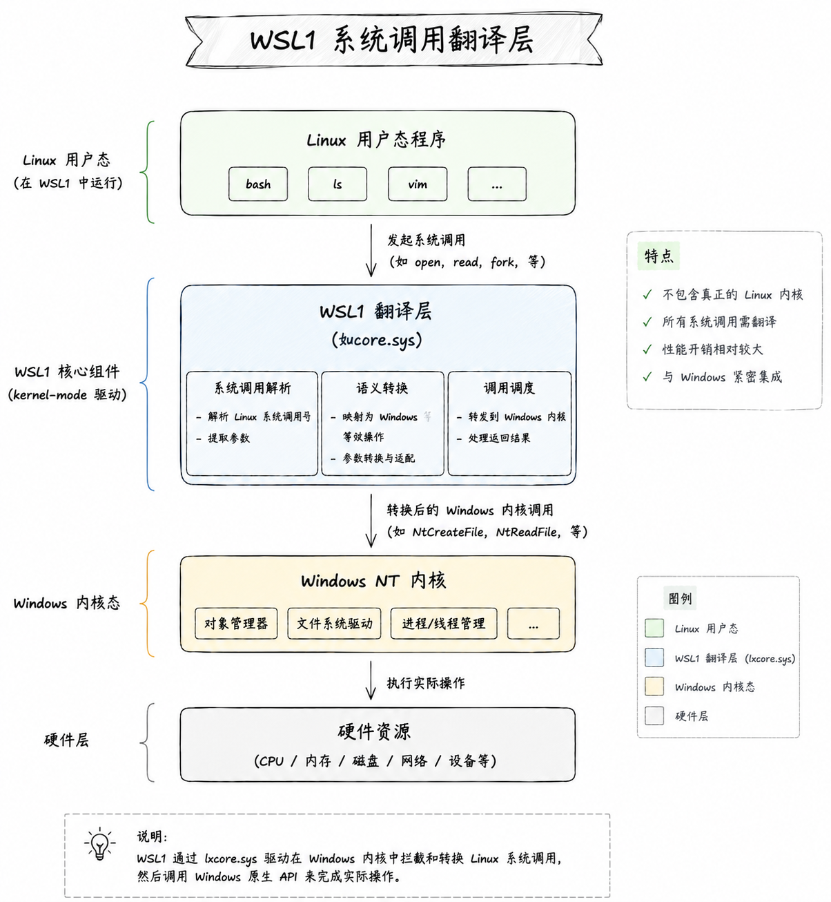
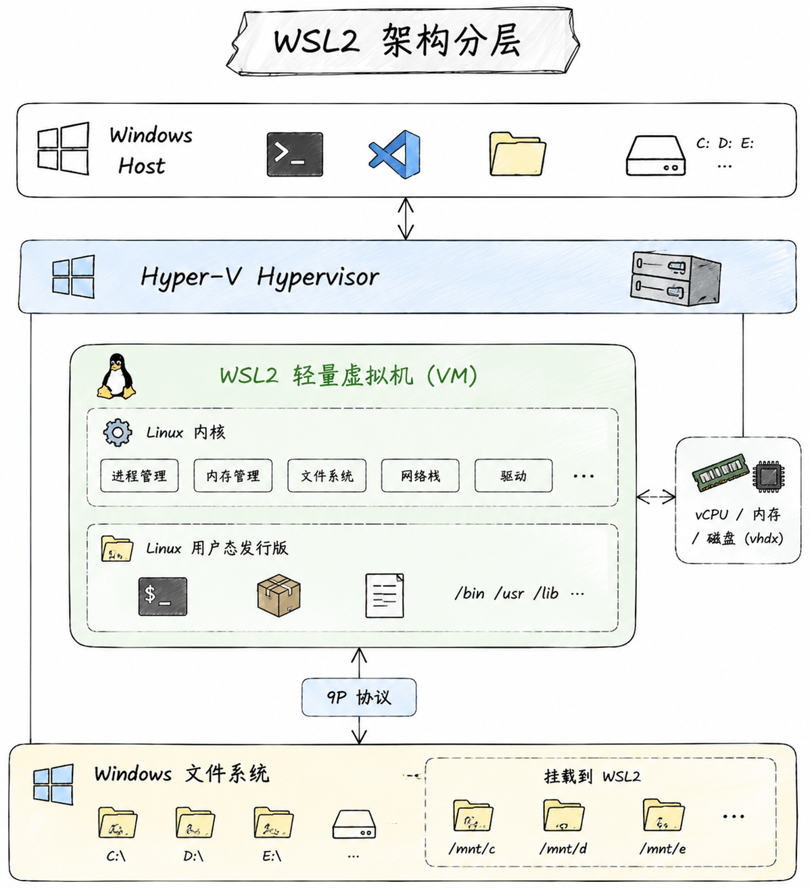
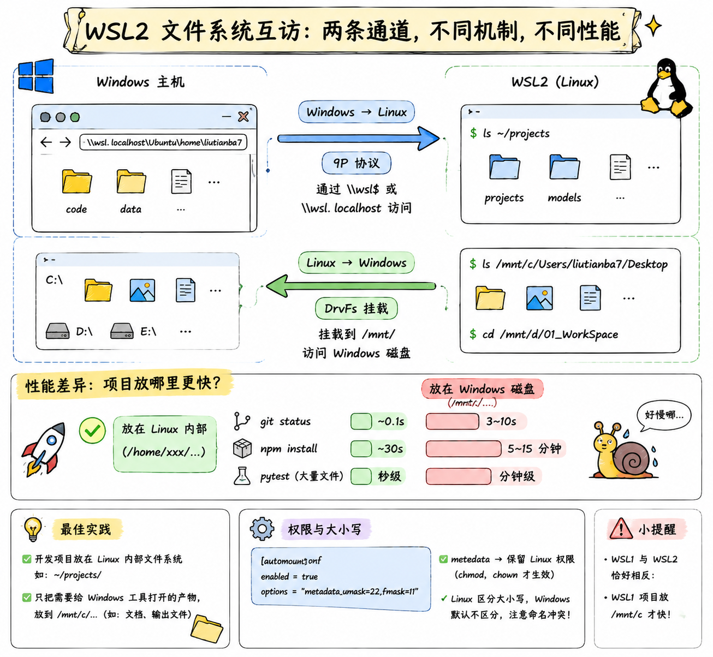
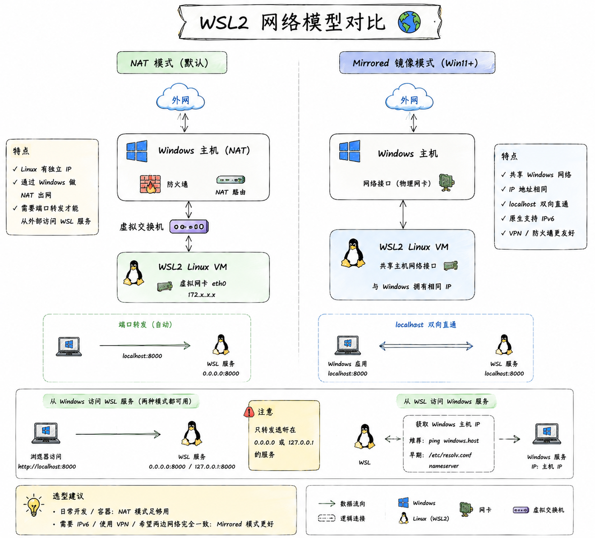

## WSL 概述 ⭐⭐⭐

> 官方文档：[Microsoft Learn - WSL](https://learn.microsoft.com/en-us/windows/wsl/) | [WSL GitHub](https://github.com/microsoft/WSL)

**WSL**（Windows Subsystem for Linux，适用于 Linux 的 Windows 子系统）是微软为 Windows 提供的一层官方兼容能力，让用户可以**在 Windows 上直接运行原生的 Linux 命令行工具、二进制程序甚至完整的 Linux 发行版**，不需要装双系统、也不需要传统意义上的虚拟机。

### 一、为什么需要 WSL

对开发者来说，"我用 Windows 但想用 Linux 干活"是一个非常常见的需求：Linux 有更完整的开发生态、更接近生产环境、更好用的包管理。以前解决这个矛盾有三条路，但每一条都不完美：

| 方案 | 优点 | 痛点 |
|------|------|------|
| **双系统** | 性能最好，环境干净 | 切换要重启，两个系统数据隔离，痛苦 |
| **传统虚拟机**（VMware/VirtualBox） | 隔离彻底 | 资源占用大、启动慢、和宿主机文件互访麻烦 |
| **Cygwin / MSYS2** | 轻量 | 只是 API 层模拟，跑不了原生 Linux 二进制 |

WSL 的出现，本质是把这三条路的优点合起来：**像装了个软件一样轻，像双系统一样能跑原生 Linux 程序，像虚拟机一样和 Windows 双向互访文件**。说白了，WSL 让 Windows 变成了一台"顺带能跑 Linux"的机器。

<p align='center'>
	
</p>

---

## 二、WSL1 vs WSL2 架构 ⭐⭐⭐

WSL 目前有两个版本，且**共存于同一台机器上**——不同发行版可以用不同版本。理解两者的架构差异，是搞清楚 WSL 一切行为的钥匙。

### 2.1 WSL1：系统调用翻译层

WSL1 的做法很聪明也很"取巧"：它不启动任何 Linux 内核，而是**把 Linux 的系统调用实时翻译成 Windows NT 内核的系统调用**。

打个比方：Linux 程序说"我要 `open()` 一个文件"，WSL1 拦住这个请求，把它翻译成 Windows 的 `NtCreateFile`，交给 Windows 内核去执行。翻译层跑在 Windows 内核里（`lxcore.sys`、`lxss.sys` 两个驱动），Linux 程序自己完全没意识到底下不是 Linux。

<p align=''center>
	
</p>


这种设计的**优点**是极其轻量——没有虚拟机、没有独立内核，启动几乎瞬时，和 Windows 文件系统完全共用。但**缺点**也很明显：

- 只翻译了一部分系统调用，很多 Linux 内核特性（比如 `io_uring`、eBPF、真正的 cgroup）根本没法支持
- 文件系统性能反而拉胯——虽然直接访问 NTFS，但 Linux 大量小文件操作（比如 `git status`、`npm install`）频繁调用系统调用，翻译开销叠加起来非常慢
- 无法运行需要真实 Linux 内核的软件（比如 Docker）

### 2.2 WSL2：轻量级 Linux 虚拟机

WSL2 换了完全不同的思路：**跑一个真正的 Linux 内核**——微软自己维护了一个精简版的 Linux 内核（[github.com/microsoft/WSL2-Linux-Kernel](https://github.com/microsoft/WSL2-Linux-Kernel)），运行在一台**基于 Hyper-V 的轻量级实用工具虚拟机**（Lightweight Utility VM）里。

这里的"轻量"和你印象里的 VMware 虚拟机不是一个概念：

- **秒级启动**（不是分钟级）
- **动态内存**：需要多少用多少，不用会归还给 Windows
- **和 Windows 共享网络栈（默认）**、共享 GPU（可选）
- 只在你第一次运行 `wsl` 命令时才启动虚拟机，没在用时几乎零开销

<p align='ceneter'>
	
</p>

WSL2 里的每个发行版（Ubuntu、Debian 等）**并不是各自一台虚拟机**——所有发行版共享同一个 Linux 内核实例，只是有各自独立的用户态文件系统（ext4 格式的 `.vhdx` 虚拟磁盘）。

### 2.3 两者对比与选择 ⭐⭐⭐

| 维度 | WSL1 | WSL2 |
|------|------|------|
| **本质** | 系统调用翻译 | 真实 Linux 内核 + 轻量 VM |
| **启动速度** | 极快（瞬时） | 秒级 |
| **文件系统兼容性** | 100%（就是 NTFS） | ext4，需通过 `\\wsl$` 互访 |
| **访问 Windows 文件性能** | **快** | 慢（跨系统边界，走 9P 协议） |
| **访问 Linux 文件性能** | 慢（翻译开销） | **快**（原生 ext4） |
| **完整系统调用支持** | 部分 | 完整 |
| **能跑 Docker** | ❌ | ✅ |
| **systemd 支持** | ❌ | ✅（需配置） |
| **GPU 加速** | ❌ | ✅ |
| **内存占用** | 极低 | 动态分配 |
| **网络** | 共用 Windows | 独立 IP（NAT/Mirrored） |

!!! tip "怎么选"
    **99% 的场景选 WSL2**。只有当你的项目文件**必须**放在 Windows 目录（比如需要和 Windows 上的其他工具协作），且频繁读写这些文件时，WSL1 才有优势。新装的 WSL 默认就是 WSL2，无需操心。

---

## 三、安装与初始化

### 3.1 前置要求

- Windows 10 版本 2004（Build 19041）以上，或 Windows 11（推荐）
- **BIOS 中开启虚拟化**（Intel VT-x / AMD-V），一般新机器默认开
- 用管理员权限运行 PowerShell 或 Windows Terminal

!!! warning "如何确认虚拟化已开启"
    在任务管理器 → 性能 → CPU 面板右下角，看"虚拟化"是否为"已启用"。若显示"已禁用"，需要进 BIOS 打开对应选项（Intel 一般叫 `VT-x` 或 `Intel Virtualization Technology`，AMD 叫 `SVM Mode`）。

### 3.2 一行命令装完

现代 WSL 的安装已经简化到一条命令：

```powershell
# 默认安装 WSL2 + Ubuntu 最新 LTS
wsl --install
```

装完重启，会自动弹出 Ubuntu 让你设置用户名和密码。整个过程包括了：

1. 启用 `Virtual Machine Platform` 和 `Windows Subsystem for Linux` 两个可选组件
2. 下载最新版 Linux 内核
3. 设置 WSL2 为默认版本
4. 安装 Ubuntu 发行版

### 3.3 指定发行版安装

```powershell
# 查看在线可选的发行版
wsl --list --online

# 指定发行版安装（不加则默认 Ubuntu）
wsl --install -d Debian
wsl --install -d Ubuntu-22.04
```

常见发行版选择建议：

| 发行版 | 适合场景 |
|--------|----------|
| **Ubuntu**（默认）| 通用开发、AI/ML 生态最全、教程最多 |
| **Debian** | 想要更精简、更接近服务器环境 |
| **Arch / Kali** | 特定用途（渗透测试、滚动更新爱好者） |

### 3.4 首次启动后的必做操作

进入 Linux 后先做这几件事：

=== "1. 系统更新"

    ```bash
    # Ubuntu / Debian
    sudo apt update && sudo apt upgrade -y
    ```

=== "2. 换国内软件源（可选）"

    Ubuntu 22.04+ 的源配置在 `/etc/apt/sources.list.d/ubuntu.sources`（新格式），改用清华源：

    ```bash
    sudo sed -i 's@//.*archive.ubuntu.com@//mirrors.tuna.tsinghua.edu.cn@g' \
        /etc/apt/sources.list.d/ubuntu.sources
    sudo apt update
    ```

=== "3. 常用工具"

    ```bash
    sudo apt install -y build-essential git curl wget vim htop
    ```

---

## 四、日常命令 ⭐⭐

WSL 的入口命令就是 `wsl`，跑在 Windows 侧（PowerShell / CMD / Terminal 里）。

### 4.1 主命令速查

| 命令 | 作用 |
|------|------|
| `wsl` | 进入默认发行版的默认用户 shell |
| `wsl -d <发行版名>` | 进入指定发行版 |
| `wsl -u <用户名>` | 以指定用户身份进入 |
| `wsl -e <命令>` 或 `wsl -- <命令>` | 在 Linux 里执行一条命令，执行完退出 |
| `wsl --list` / `wsl -l -v` | 列出所有发行版及版本、状态 |
| `wsl --set-default <发行版>` | 设为默认发行版 |
| `wsl --set-version <发行版> 2` | 把某个发行版从 WSL1 转成 WSL2 |
| `wsl --terminate <发行版>` | 关闭指定发行版（保留其他运行中的） |
| `wsl --shutdown` | 关闭所有发行版和虚拟机（**最强力**） |
| `wsl --update` | 更新 WSL 内核 |
| `wsl --version` | 查看 WSL 各组件版本 |

### 4.2 发行版备份、迁移、克隆

WSL 提供了 `export` / `import` 组合，可以把整个发行版做成 tar 包，非常方便备份或迁移。

```powershell
# 导出：把 Ubuntu 完整打包成 tar
wsl --export Ubuntu D:\backup\ubuntu.tar

# 卸载原发行版
wsl --unregister Ubuntu

# 导入：把 tar 恢复到新位置（可以顺便把虚拟磁盘挪到 D 盘）
wsl --import Ubuntu D:\WSL\Ubuntu D:\backup\ubuntu.tar
```

!!! tip "为什么要 import 到 D 盘"
    默认发行版数据存在 `C:\Users\<你>\AppData\Local\Packages\...`，日子久了 C 盘会被吃满。用 `--export` + `--unregister` + `--import` 的组合技把它挪到 D 盘，是老 WSL 用户人手一份的技能。

### 4.3 关闭：terminate vs shutdown

新手常混淆这两个命令：

- `wsl --terminate <发行版>`：只关闭指定的那一个发行版，其他发行版和虚拟机本身继续跑
- `wsl --shutdown`：**关掉整个 WSL 虚拟机**，所有发行版一起终止

当 WSL 卡死、内存吃满、`.wslconfig` 改动想生效——都是 `wsl --shutdown` 一把梭。

### 4.4 从 Windows 直接调 Linux 命令

WSL 有个非常爽的能力：在 PowerShell 里可以直接跑 Linux 命令，把 Linux 工具当 Windows 命令用。

```powershell
# 用 Linux 的 grep 搜 Windows 文件
wsl grep -r "TODO" .

# 用 Linux 的 curl 下载
wsl curl -O https://example.com/file.tar.gz

# 反过来，在 Linux 里也能直接跑 Windows 的 exe
# 在 bash 里：
explorer.exe .        # 打开当前目录的资源管理器
notepad.exe file.txt  # 用记事本打开
code .                # 启动 VSCode（VSCode 装在 Windows 侧）
```

这种"双向调用"是 WSL 最舒服的体验之一——两个系统像糖水一样融在一起。

---

## 五、文件系统互访 ⭐⭐⭐

WSL 两个方向的文件互访机制不一样，性能特性也天差地别，理解清楚能避免 90% 的"WSL 好慢啊"的抱怨。

### 5.1 Windows → Linux：`\\wsl$` 或 `\\wsl.localhost`

在 Windows 资源管理器地址栏或任意命令里输入：

```
\\wsl$\Ubuntu\home\liutianba7
```

或 Windows 11 推荐的新写法：

```
\\wsl.localhost\Ubuntu\home\liutianba7
```

就能直接访问 WSL2 里的文件。这条路径实际走的是**9P 协议**——WSL 内置了一个 9P 文件服务器，Windows 侧作为客户端连接过去。

### 5.2 Linux → Windows：`/mnt/c/...`

在 Linux 里，Windows 的每个盘符会被挂载到 `/mnt/` 下：

```bash
ls /mnt/c/Users/liutianba7/Desktop
cd /mnt/d/01_WorkSpace
```

底层用的是 **DrvFs** —— 一个专为跨系统访问优化的挂载类型，能处理 Windows 权限和大小写差异。

<p align='center'>
	
</p>
### 5.3 性能陷阱：不要把项目放 `/mnt/c` ⭐⭐⭐

**这是 WSL2 最重要的一条实践，没有之一。**

WSL2 里访问 `/mnt/c/...` 的文件，每次读写都要跨越"Linux VM ↔ Windows 主机"的边界。对少量文件影响不大，但如果项目里有几万个小文件（比如 `node_modules`、Python 虚拟环境），性能会差到什么程度？

| 操作 | 项目在 `/home/user/proj`（Linux 内） | 项目在 `/mnt/c/proj`（Windows 内） |
|------|--------------------------------------|--------------------------------------|
| `git status` | ~0.1 秒 | 3-10 秒 |
| `npm install` | 30 秒 | 5-15 分钟 |
| `pytest`（数千文件） | 秒级 | 分钟级 |

!!! danger "铁律"
    **开发项目一定放 Linux 文件系统里（`/home/user/...`）**，只把需要给 Windows 工具打开的产物放到 `/mnt/c/...`。

    反过来在 WSL1 里恰好相反——WSL1 天生就是 NTFS，项目放 `/mnt/c` 才性能最好。所以"项目该放哪"取决于你用的是 WSL1 还是 WSL2。

### 5.4 权限映射与大小写敏感

Linux 文件系统区分大小写，Windows NTFS 默认不区分，交叉访问时容易出问题。可以通过 `/etc/wsl.conf` 调整挂载行为：

```ini
[automount]
enabled = true
options = "metadata,umask=22,fmask=11"
```

`metadata` 参数让 DrvFs 记录 Linux 风格的权限位（`chmod`、`chown` 才生效），是几乎必开的选项。

---

## 六、网络模型

WSL2 的网络模型经历过一次比较大的变化，一定要区分清楚。

<p align='center'>
	
</p>

### 6.1 默认 NAT 模式

WSL2 默认走 **NAT 模式**：Linux VM 有自己的一张虚拟网卡，独立 IP（一般是 `172.x.x.x` 网段），通过 Windows 主机做 NAT 出去。


### 6.2 从 Windows 访问 WSL 服务

**好消息**：WSL2 自带 `localhost 转发`——你在 Linux 里跑一个 `python -m http.server 8000`，在 Windows 浏览器打开 `http://localhost:8000` 就能访问，微软自动帮你做了 NAT 转发。

**坏消息**：这个转发只处理监听 `0.0.0.0` 或 `127.0.0.1` 的服务。如果你的服务只绑 IPv6 或某个特定 IP，可能就通不了。

### 6.3 从 WSL 访问 Windows 服务

从 Linux 访问 Windows 上的服务，需要用 Windows 主机的 IP，不是 `localhost`：

```bash
# 从 /etc/resolv.conf 取 Windows 主机 IP（早期做法）
cat /etc/resolv.conf | grep nameserver

# 新版 WSL 提供了固定的主机名
ping windows.host  # WSL 会自动解析
```

### 6.4 Mirrored 镜像网络模式（Win11 新特性）

Windows 11 + WSL 0.0.10 起，支持一种叫 **Mirrored（镜像）** 的新网络模式：Linux VM **共享 Windows 的网络接口**，两边看到的 IP 一模一样，`localhost` 双向可达，且原生支持 IPv6。

开启方式，在 `.wslconfig` 里：

```ini
[wsl2]
networkingMode=mirrored
```

!!! tip "什么时候用 mirrored"
    - 需要 IPv6
    - 用 VPN，NAT 模式会把 Linux 隔离在 VPN 外
    - 想让 Windows 和 Linux 完全共享一套网络视图

    但 mirrored 模式还比较新，某些容器编排或防火墙场景可能有奇怪问题。日常够用就先留 NAT。

---

## 七、配置文件

WSL 有两套配置文件，作用范围和归属完全不同，别搞混：

| 文件           | 位置                                  | 作用范围                  | 生效方式                 |
| ------------ | ----------------------------------- | --------------------- | -------------------- |
| `.wslconfig` | Windows 侧：`C:\Users\<你>\.wslconfig` | **全局**，所有发行版共享（虚拟机层面） | `wsl --shutdown` 后重启 |
| `wsl.conf`   | Linux 侧：`/etc/wsl.conf`             | **单个发行版**，每个发行版有自己的一份 | 该发行版重启后生效            |

### 7.1 `.wslconfig` —— 管虚拟机

```ini
# C:\Users\liutianba7\.wslconfig

[wsl2]
# 最大内存（避免 WSL 吃满物理内存）
memory=8GB
# 最多 CPU 核数
processors=8
# swap 大小
swap=4GB
# 网络模式：NAT（默认）或 mirrored
networkingMode=mirrored
# 自动同步时钟
localhostForwarding=true

[experimental]
# 空闲时自动回收内存给 Windows
autoMemoryReclaim=gradual
# 稀疏虚拟磁盘（vhdx 会自动收缩，非常香）
sparseVhd=true
```

!!! tip "内存不加限制会怎样"
    默认 WSL2 可以吃到你物理内存的 50%（Win11）或 80%（Win10）。跑大项目时经常把 Windows 挤到只剩 2G，卡死浏览器。**建议手动设 `memory` 上限**，别信"动态回收"，实际回收得很懒。

### 7.2 `/etc/wsl.conf` —— 管单个发行版

```ini
# /etc/wsl.conf（在 Linux 里 sudo vim 编辑）

[boot]
# 启用 systemd（Ubuntu 22.04+ 默认已开）
systemd=true
# 开机执行的命令
command="service docker start"

[user]
# 默认登录用户
default=liutianba7

[automount]
# Windows 盘挂载配置
enabled=true
root=/mnt/
options="metadata,umask=22,fmask=11"

[network]
# 自定义主机名
hostname=my-wsl
# 生成 /etc/resolv.conf
generateResolvConf=true
```

!!! warning "改完记得重启对应发行版"
    改 `.wslconfig` 要 `wsl --shutdown` 全部重启；改 `wsl.conf` 只需 `wsl --terminate <发行版名>` 然后重新进就行。

---

## 八、进阶集成

### 8.1 VSCode Remote-WSL ⭐⭐⭐

WSL 最杀手级的使用姿势，没有之一。装一个 VSCode 插件叫 **WSL**（前身 Remote-WSL），然后：

```bash
# 在 WSL 里，进到项目目录
cd ~/projects/my-app
code .
```

VSCode 会自动启动 Windows 侧的界面，但**语言服务、终端、调试、Git 全都在 Linux 侧运行**。UI 归 Windows，内核归 Linux，两全其美。

!!! tip "为什么这个方案这么香"
    - 项目文件在 Linux 里，`git status` 快得飞起
    - 用的是 Linux 的 Python / Node / gcc，环境和生产一致
    - Windows 侧看到的是熟悉的 VSCode UI，不需要装 X Server 转发图形界面

### 8.2 Docker Desktop + WSL2

Docker Desktop for Windows 从 2020 年起改用 WSL2 做后端——本质上 Docker 引擎跑在一个叫 `docker-desktop` 的隐藏 WSL 发行版里。

安装 Docker Desktop 后，在设置里勾选 "Use the WSL 2 based engine"，再勾选 "Enable integration with my default WSL distro"，就能在 Ubuntu 里直接用 `docker` 命令，容器实际跑在 WSL2 虚拟机中。

好处：

- 不需要在 Windows 上装 Hyper-V 完整版
- 容器和 WSL 的 Linux 发行版共享内核
- 性能远好于旧版基于 Hyper-V VM 的 Docker Desktop

### 8.3 GPU 直通（CUDA in WSL）

WSL2 支持 **GPU 半虚拟化**——NVIDIA 显卡驱动装在 Windows 侧，Linux 侧通过 `libdxcore` 就能访问 GPU，跑 CUDA、PyTorch、TensorFlow 都可以。

配置流程（大方向）：

1. 装 Windows 版 NVIDIA 驱动（**不要**在 WSL 里再装 Linux 版驱动）
2. 在 WSL 里装 CUDA Toolkit（选 Linux WSL-Ubuntu 版本，不是通用 Linux 版）
3. 装 `nvidia-container-toolkit` 就能在容器里用 GPU

```bash
# 验证
nvidia-smi
```

看到 GPU 信息就成了。这条路线对搞 AI 的人来说是 WSL2 最重要的能力之一。

!!! warning "别踩这个坑"
    **千万不要**在 WSL 的 Ubuntu 里再装 Linux 版 NVIDIA 驱动（`apt install nvidia-driver-xxx`），会直接搞坏 GPU 直通。WSL 用的是 Windows 侧驱动的 `libdxcore` 中转。

### 8.4 systemd 与 WSLg

- **systemd**：Ubuntu 22.04 起默认开启，可以正常 `systemctl start/stop` 服务了。老版本需要在 `wsl.conf` 里手动 `systemd=true`
- **WSLg**（WSL GUI）：Windows 11 自带，可以在 WSL 里直接跑图形应用（比如 `gedit`、`firefox`），窗口会像原生 Windows 应用一样出现。底层用 Wayland + RDP 转发实现

```bash
# 装个 GIMP 试试
sudo apt install gimp
gimp  # 直接弹窗，就像 Windows 应用
```

---

## 九、常见踩坑

!!! warning "1. 虚拟磁盘越用越大，删文件不缩"
    WSL2 的虚拟磁盘（`.vhdx`）默认**只涨不缩**——你在 Linux 里删了 10G 文件，Windows 上的 vhdx 依然占 10G。

    **解决方案**：`.wslconfig` 里开启 `sparseVhd=true`（新装的默认开），或手动压缩：

    ```powershell
    wsl --shutdown
    diskpart
    # 进 diskpart 后：
    # select vdisk file="C:\path\to\ext4.vhdx"
    # compact vdisk
    ```

!!! warning "2. DNS 抽风、apt 装不了东西"
    WSL 默认会生成 `/etc/resolv.conf`，某些网络（尤其是公司 VPN）下会拿到坏的 DNS。

    **临时解决**：手动写 `/etc/resolv.conf`：

    ```bash
    sudo rm /etc/resolv.conf
    echo "nameserver 8.8.8.8" | sudo tee /etc/resolv.conf
    ```

    **永久解决**：在 `/etc/wsl.conf` 加：

    ```ini
    [network]
    generateResolvConf=false
    ```

!!! warning "3. 时间不同步（笔记本合盖后常见）"
    电脑休眠一段时间后，WSL 里的时钟可能不动了。用：

    ```bash
    sudo hwclock -s  # 从硬件时钟同步
    ```

!!! warning "4. WSL 吃内存不释放"
    Linux 内核的 page cache 策略会尽量占满可用内存，导致 Windows 侧看到 `vmmem` 进程占用几个 G。

    **解决**：`.wslconfig` 里限制 `memory=8GB`，并开 `autoMemoryReclaim=gradual`。极端情况 `wsl --shutdown` 一把梭。

!!! warning "5. 代理问题"
    Windows 上开了代理（Clash 之类），WSL 里默认走不了。因为 WSL2 是独立 IP，`127.0.0.1:7890` 指向的是 Linux VM 自己，不是 Windows。

    **NAT 模式解决方案**：让代理软件监听 `0.0.0.0`，然后在 WSL 里：

    ```bash
    # 拿到 Windows 主机 IP
    host_ip=$(ip route show | grep -i default | awk '{print $3}')
    export http_proxy="http://$host_ip:7890"
    export https_proxy="http://$host_ip:7890"
    ```

    **Mirrored 模式**下直接 `127.0.0.1:7890` 就行，是切换 mirrored 的重要理由之一。

---

## 附录

??? note "常用命令速查卡"

    ```bash
    # === 发行版管理（Windows 侧执行）===
    wsl -l -v                              # 列出所有发行版
    wsl --install                          # 装 WSL + 默认 Ubuntu
    wsl --install -d Debian                # 装指定发行版
    wsl --set-default Ubuntu               # 设默认
    wsl --set-version Ubuntu 2             # 转 WSL2
    wsl --unregister Ubuntu                # 卸载（数据全删）

    # === 备份迁移 ===
    wsl --export Ubuntu D:\backup.tar
    wsl --import Ubuntu D:\WSL\Ubuntu D:\backup.tar

    # === 生命周期 ===
    wsl                                    # 进默认发行版
    wsl -d Debian                          # 进指定发行版
    wsl -u root                            # 以 root 进入
    wsl -- ls -la ~                        # 单条命令
    wsl --terminate Ubuntu                 # 停指定发行版
    wsl --shutdown                         # 停全部（改配置后必用）

    # === 维护 ===
    wsl --update                           # 更新内核
    wsl --version                          # 查版本
    wsl --status                           # 查状态

    # === Linux 侧调 Windows（bash 里执行）===
    explorer.exe .                         # 资源管理器打开当前目录
    code .                                 # 启动 VSCode
    cmd.exe /c echo %USERNAME%             # 跑 cmd 命令
    ```

??? note "推荐 .wslconfig 模板"

    ```ini
    [wsl2]
    memory=8GB
    processors=8
    swap=4GB
    networkingMode=mirrored
    localhostForwarding=true

    [experimental]
    autoMemoryReclaim=gradual
    sparseVhd=true
    dnsTunneling=true
    firewall=true
    autoProxy=true
    ```
