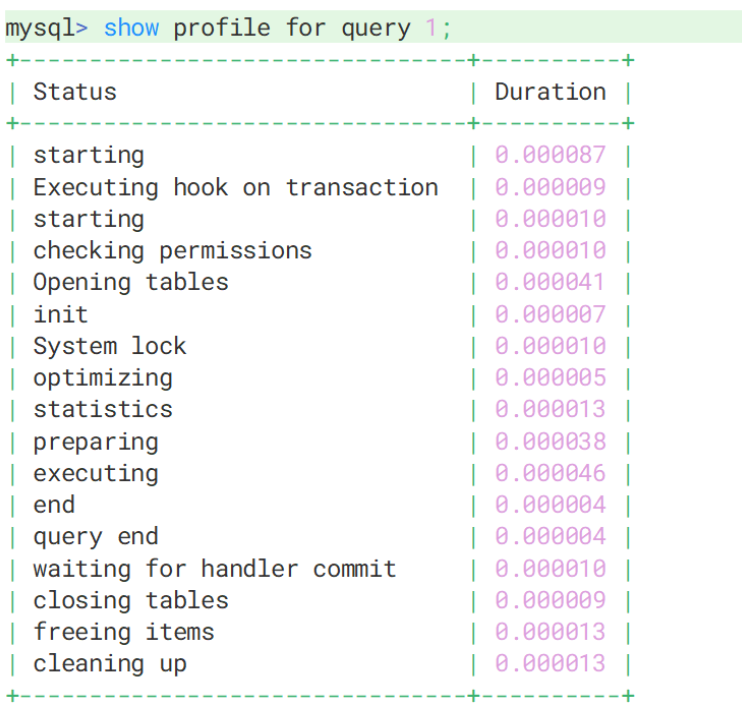
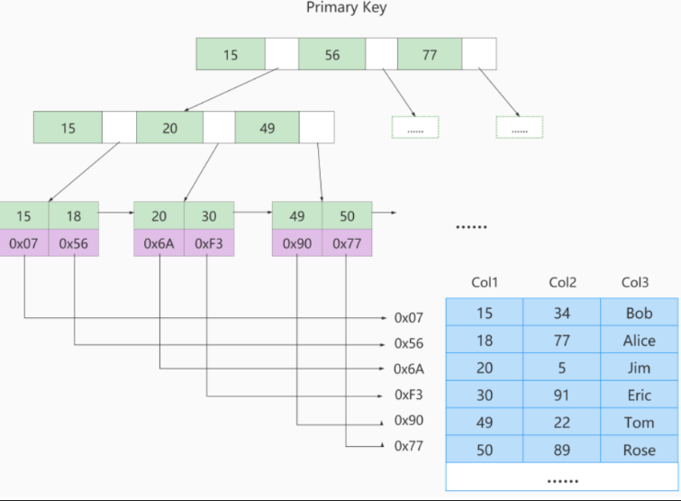

# mysql 高级

## 一、Linux 下的安装与使用

#### 1. docker 下的安装

1、拉取镜像

``` java
// 远程拉取
docker pull mysql:8.0.30
// 本地加载镜像
docker load -i xxx.tar
```

2、运行

``` java
// 创建一个容器
docker run -di --name=mysql -p 3306:3306 -v mysql_data:/var/lib/mysql -v mysql_conf:/etc/mysql -e MYSQL_ROOT_PASSWORD=liuqiang mysql:8.0.30

// 之后，进入该容器，记得设置编码格式，否则中文可能乱码
docker exec -it -e LANG=C.UTF-8 mysql bash
```


#### 2. 字符集

`MySQL 8版本之前`，默认字符集为 latin1（ISO-8859-1） ，不支持中文，使用前必须设置字符集为utf8（utf8mb3）或utf8mb4。从MySQL 8开始，数据库的默认字符集为 utf8mb4 ，从而避免中文乱码的问题。

``` sql
SHOW VARIABLES LIKE '%char%';
```

utf8 字符集表示一个字符需要使用1～4个字节，但是我们常用的一些字符使用1～3个字节就可以表示了。而字符集表示一个字符所用的最大字节长度，在某些方面会影响系统的存储和性能，所以设计MySQL的设计者偷偷的定义了两个概念：

utf8mb3 ：阉割过的 utf8 字符集，只使用1～3个字节表示字符。（无法存储emoji表情）

**utf8mb4** ：正宗的 utf8 字符集，使用1～4个字节表示字符。

注：mysql 5.7 中的 uft8 是 utf8mb3 字符集，MySQL8.0中的utf8是utf8mb4字符集


#### 3. 大小写规范

 - windows：在Windows操作系统下安装MySQL，全部不区分大小写
 - linux：
   - 数据库名、表名、表的别名、变量名`严格区分大小写`；
    - 列名与列的别名`不区分大小写`。
    - 关键字、函数名称`不区分大小写`；、

设置大小写规则（了解即可）

``` sql
1、停止MySQL服务 
2、删除数据目录，即删除 /var/lib/mysql 目录 
3、在MySQL配置文件（/etc/my.cnf ）的 [mysqld] 中添加 lower_case_table_names=1 
4、初始化数据目录 mysqld --initialize --user=mysql
5、启动MySQL服务 systemctl start mysqld
```

#### 4. sql_mode

1. 宽松模式：执行错误的SQL或插入不规范的数据，也会被接受，并且不报错。
2. 执行错误的SQL或插入不规范的数据，会报错。MySQL5.7版本开始就将sql_mode默认值设置为了严格模式。

``` sql
# 1. 查看 sql_mode
SHOW VARIABLES LIKE 'sql_mode'; --session级别
-- 或者
SELECT @@session.sql_mode;   #查询当前会话sql_mode
SELECT @@global.sql_mode;    #查询全局sql_mode


# 2. 设置sql_mode
SET GLOBAL sql_mode = 'mode1,model2,...'; --全局，要重新启动客户端生效，重启MySQL服务后失效
SET SESSION sql_mode = 'mode1,model2,...'; --当前会话生效效，关闭当前会话就不生效了。可以省略SESSION关键字

# 也可以通过配置文件去永久设置
[mysqld]
sql-mode = "mode1,model2,..."

docker restart mysql
```

规则常用指：

- `ONLY_FULL_GROUP_BY：`对于GROUP BY聚合操作，SELECT子句中只能包含函数和 GROUP BY 中出现的字段。
- STRICT_TRANS_TABLES：

  - 对于支持事务的表，如果发现某个值缺失或非法，MySQL将抛出错误，语句会停止运行并回滚。
  - 对于不支持事务的表，不做限制，提高性能。

- NO_ZERO_IN_DATE：不允许`日期`和`月份`为零。
- NO_ZERO_DATE：MySQL数据库不允许插入零日期，插入零日期会抛出错误而不是警告。
- ERROR_FOR_DIVISION_BY_ZERO：在INSERT或UPDATE过程中，如果数据被零除，则产生错误而非警告。如果未给出该模式，那么数据被零除时MySQL返回NULL。
- NO_ENGINE_SUBSTITUTION：如果需要的存储引擎被禁用或不存在，那么抛出错误。不设置此值时，用默认的存储引擎替代。


## 二、Mysql 的逻辑架构

<p align='center'>
    
</p>

### 2.1 Connectors 连接器（客户端）

MySQL服务器之外的客户端程序，与具体的语言相关，例如Java中的JDBC，图形用户界面Navicat/SQLyog等。`本质上都是在TCP连接上通过MySQL协议和MySQL服务器进行通信。`


### 2.2 Mysql Server

#### 1. 连接层

- 客户端访问 MySQL 服务器前，做的`第一件事就是建立 TCP 连接`。

- 经过三次握手建立连接成功后， MySQL 服务器对 TCP 传输过来的账号密码做`身份认证、权限获取`。

  - 用户名或密码不对`，会收到一个`Access denied for user`错误，客户端程序结束执行`
  - `用户名密码认证通过`，会从权限表`查出账号拥有的权限`与连接关联，之后的权限判断逻辑，都将依赖于此时读到的权限

- TCP 连接收到请求后，必须要分配给一个线程专门与这个客户端的交互。所以还会有个线程池，去走后面的流程。每一个连接从线程池中获取线程，省去了创建和销毁线程的开销。

#### 2. 服务层

**Management Serveices & Utilities： 系统管理和控制工具**

**SQL Interface：SQL接口：**

- 接收用户的SQL命令，并且返回用户需要查询的结果。`比如SELECT ... FROM就是调用SQL Interface
- MySQL支持DML（数据操作语言）、DDL（数据定义语言）、存储过程、视图、触发器、自定义函数等多种SQL语言接口
- 在MySQL5.7以前（存在查询缓存部分）优先从查询缓存中获取数据（SQL作为Key）命中查询缓存直接返回，未命中则继续执行后续组件。

**Parser：解析器**
在SQL命令传递到解析器的时候会被解析器验证和解析。解析器中SQL 语句进行`词法分析、语法分析、语义分析`，并为其创建`语法树`。

- 词法分析：将整个语句拆分成一个个字段
- 语法分析：将词法分析拆分出的字段，按照MySQl语法规则，生成解析树
- 语义分析：`检查解析树是否合法/用户是否有操作权限`，比如查看表是否存在，列是否存在

``` sql
select  username,ismale from userinfo where age>20 and level>5 and 1=1;
```

<p align='center'>
    
</p>

**Optimizer：查询优化器：**

- SQL语句在语法解析后、查询前会使用查询优化器对查询进行优化，`确定SQL语句的执行路径，生成一个执行计划`。

**Caches & Buffers： 查询缓存组件：**

- MySQL内部维持着一些Cache和Buffer，比如Query Cache用来缓存一条SELECT语句的执行结果，如果能够在其中找到对应的查询结果，那么就不必再进行查询解析、查询优化和执行的整个过程了，直接将结果反馈给客户端。

#### 3. 引擎层

存储引擎层（ Storage Engines），`负责MySQL中数据的存储和提取，对物理服务器级别维护的底层数据执行操作，服务器通过API与存储引擎进行通信`。不同的存储引擎具有的功能不同，管理的表有不同的存储结构，采用的存取算法也不同，这样我们可以根据自己的实际需要进行选取。例如MyISAM引擎和InnoDB引擎。


#### 4. 存储层

所有的数据、数据库、表的定义、表的每一行的内容、索引，都是存在`文件系统` 上，以文件的方式存在，并完成与存储引擎的交互。

### 2.3 sql 的执行流程

利用`SHOW profiles` 可以查看SQL的执行流程。使用前需要先开启该功能：

1、开启 profiling

``` sql
show variables like '%prifiling%';
set profiling = 1;
```

2、查询最近执行的sql

```sql
show profiles;
```

3、查询具体sql的执行流程

```sql
show profile; // 查询最后一次执行的sql的执行过程
show profile for query query_id;
```

<p align='center'>
    
</p>

### 2.4 存储引擎

1、查看mysql提供了什么引擎

```sql
show engines;

show variables like "default_storeage_engine"
```

2、设置存储引擎（了解）

```sql
set DEFAULT_STORAGE_ENGINE=MyISAM;

# 或者修改配置文件
vim /etc/my.cnf 
在[mysqld]节点下新增一行：
default-storage-engine=MyISAM 
重启MySQL：systemctl restart mysqld

# 在建表的时候去设置存储引擎
CREATE TABLE 表名( 建表语句 ) ENGINE = 存储引擎名称;
ALTER TABLE 表名 ENGINE = 存储引擎名称;
```

#### 1. 不同存储引擎的介绍

<p align='center'>
    
</p>

1、InnoDB (最常用)

- **定位：** 事务安全型存储引擎，是 MySQL **默认** 的存储引擎。
- **核心特性：** 支持 **ACID** 特性的事务（如 `COMMIT`、`ROLLBACK`），支持 **行级锁**（提升并发性能），以及 **外键** 约束。
- **简述：** 适合需要高并发、高可靠性、频繁更新和数据一致性的应用场景（如电商交易、金融系统）。

2、MyISAM

- **定位：** 非事务安全型存储引擎。
- **核心特性：** 支持 **表级锁**（并发性能较差），**不支持事务和外键**。在数据读操作为主的场景下性能很好。
- **简述：** 适合对事务要求不高、以**读取和查询为主**、并发写入较少的应用（如早期博客、网站计数器）。

3、Memory

- **定位：** 基于内存的存储引擎。
- **核心特性：** 数据直接存储在 **内存** 中，速度极快，使用 **表级锁**。但数据库服务重启后，**数据会丢失**。
- **简述：** 适合用于存储**临时数据**、高速缓存、会话信息或数据分析中的中间结果。

#### 2. MyISAM 与 InnoDB 的区别

| **对比项**     | **MyISAM**                                               | **InnoDB**                                                   |
| -------------- | -------------------------------------------------------- | ------------------------------------------------------------ |
| 外键           | 不支持                                                   | 支持                                                         |
| 事务           | 不支持                                                   | 支持                                                         |
| 行表锁         | 表锁，即使操作一条记录也会锁住整个表，不适合高并发的操作 | 行锁，操作时只锁某一行，不对其它行有影响，适合高并发的操作   |
| 缓存           | 只缓存索引，不缓存真实数据                               | 不仅缓存索引还要缓存真实数据，对内存要求较高，而且内存大小对性能有决定性的影响。支持聚簇索引 |
| 关注点         | 并发查询，节省资源、消耗少、简单业务                     | 并发写、事务、更大更复杂的资源操作                           |
| 默认使用       | N                                                        | Y                                                            |
| 自带系统表使用 | Y                                                        | N                                                            |


## 三、SQL 预热

pass


## 四、MySQL 索引

### 1. 索引基础

#### 1.1 什么是索引

MySQL官方对索引的定义为：**索引（Index）是帮助MySQL高效获取数据的数据结构。** **索引的本质：**索引是数据结构。你可以简单理解为`“排好序的快速查找数据结构”`。这些数据结构以某种方式指向数据， 可以在这些数据结构的基础上实现高级查找算法 。

自己的话的总结：索引实际就是 mysql 将磁盘上的数据组织成某种数据结构，比如（b树，b+树等等），然后就可以减少每次查询数据的 io 次数，提高查询效率。

#### 1.2 索引的优缺点

优点：

 - `提高数据检索的效率，降低数据库的IO成本`
 - `保证表中每条记录的唯一性` 

缺点：

 - `创建索引和维护索引要耗费时间`
 - `索引是存储在磁盘上的，因此需要占用磁盘空间`

#### 1.3 索引分类

- 从功能逻辑上划分，索引主要有 4 种，分别是`普通索引、唯一索引、主键索引、全文索引`。
- 按照作用字段个数划分，索引可以分为`单列索引和联合索引`。
- 按照物理实现方式划分 ，索引可以分为 2 种，分别是`聚簇索引和非聚簇索引`。

### 2. b树以及b+树

#### 2.1 b 树

b树是一种**多路平衡查找树**。

<p align='center'>
    
</p>

**核心特点**：

1. **节点存储数据：** 索引的键（Key）和**数据记录本身或指向数据记录的指针**都存储在**所有节点**（包括非叶子节点和叶子节点）中。
2. **查找：** 从根节点开始，通过比较键值可以找到目标数据。数据可能在**任何一层节点**被找到。
3. **结构：** 所有叶子节点处于同一层，保持平衡。

**优缺点**（相对于数据库索引）

1. **优点：** 查找任何数据平均只需较少的比较次数（因为数据在树中分布得更广）。
2. **范围查询效率低：** 如果需要查找一个范围的数据，找到第一个值后，必须**重新从根节点开始遍历**查找下一个值，不能直接进行顺序访问。
3. **磁盘 I/O 次数多：** 由于非叶子节点也存储了数据指针，会占用更多的空间，导致**每个磁盘块能存储的索引键数量减少**，树的高度可能会更高一些（虽然不多），进而可能增加磁盘 I/O。


#### 2.2 b+树

B+ 树是对 B 树的改进，是 **MySQL InnoDB 存储引擎** 中索引的**标准实现**。

**核心特点**：

1. **非叶子节点只存键：** **非叶子节点**（中间节点）**只存储索引的键值**，不存储数据记录或指针。
2. **叶子节点存数据：** **所有的数据记录**或指向数据记录的指针都存储在**叶子节点**中。
3. **叶子节点链表：** **所有叶子节点构成一个有序的双向链表**。

**优缺点**（相对于数据库索引）

1. **优点：** **范围查询高效：** 这是 B+ 树最大的优势。因为叶子节点构成了一个有序链表，一旦找到范围的起始点，就可以沿着链表**顺序遍历**，直到范围结束，避免了重复的树遍历，极大地提高了范围查询的效率。
2. **磁盘 I/O 优化：** 非叶子节点只存储键值，使得**一个磁盘块可以存储更多的索引键**。这**降低了树的高度**，从而**减少了磁盘 I/O 次数**（因为查询数据主要依赖磁盘 I/O 性能）。
3. **查询性能稳定：** 所有查询（无论是等值查询还是范围查询）都必须**遍历到叶子节点**才能获取数据，查询路径长度固定，性能更加稳定。

| **特性**       | **B 树 (B-Tree)**                    | **B+ 树 (B+ Tree)**                          |
| -------------- | ------------------------------------ | -------------------------------------------- |
| **数据存储**   | 键和数据**存储在所有节点**。         | 键存储在所有节点，**数据只存储在叶子节点**。 |
| **查询路径**   | 数据可能在中间节点或叶子节点被找到。 | 必须**遍历到叶子节点**才能找到数据。         |
| **范围查询**   | 效率低，需要多次从根节点遍历。       | **效率高**，通过叶子节点的链表实现顺序遍历。 |
| **磁盘 I/O**   | 相对较高（每个节点存储的键较少）。   | 相对较低（每个节点存储的键较多，树更矮）。   |
| **MySQL 采用** | 较少用于主流索引。                   | **InnoDB 引擎索引的标准实现。**              |

#### 2.3 b树和b+树的区别

1、他们两最大的区别就是 b树的非叶子节点可以存放数据，但b+树的非叶子节点只存放索引, 这一特性直接使b+树的高度小于b树，从而平均 io 次数是b+树更少，所以 mysql 选择 b+树 作为索引的底层数据结构

2、b+ 树的查询性能更稳定，因为所有的数据都得到叶子节点才能找到。

### 3. InnoDB中的索引

实际就是 B+树，非叶子节点只存放索引，叶子节点只存放数据，并且叶子节点组织成了双向链表。

<p align='center'>
    
</p>

#### 3.1 聚簇索引（主键索引）

**聚簇索引（Clustered Index）** 是指数据行（记录）与索引结构**存储在一起**的一种索引。在 InnoDB 存储引擎中，**主键索引**就是聚簇索引。

- **数据与索引一体：** B+ 树的叶子节点存储了**完整的用户数据记录**（所有列的值）。
- **物理存储顺序：** 表中的数据是**按照主键的顺序**在物理磁盘上存储的。这意味着，只要查询到主键索引的叶子节点，就能立即获取到所有的数据。
- **唯一性：** **每张表只能有一个**聚簇索引，因为它决定了数据行的物理存储顺序。
- **无主键时的处理：** 如果用户创建表时没有定义主键：
  - InnoDB 会首先尝试选择一个**非空的唯一索引**作为聚簇索引。
  - 如果找不到这样的索引，InnoDB 会**自动创建一个隐藏的、6 字节的、自增的聚簇索引**（称为 Row ID）。

#### 3.2 非聚簇索引

**非聚簇索引（Non-Clustered Index）**，也称为**二级索引（Secondary Index）** 或辅助索引，是指索引的叶子节点**不存储完整的用户数据**。(主键以及索引列）

- **索引与数据分离：** B+ 树的叶子节点存储的不是完整数据行，而是**索引键值**和指向**对应主键值**（或记录地址，MyISAM 引擎中）的指针。
- **数量：** **一张表可以有多个**非聚簇索引。
- **回表操作：** 通过非聚簇索引查找数据时，需要分两步：
  - **第一步：** 通过二级索引找到对应的**主键值**。
  - **第二步：** 根据这个主键值，**再去聚簇索引中查找**（即“回表”）完整的行数据。

#### 3.3 区别

| **特性**     | **聚簇索引 (主键索引)**          | **非聚簇索引 (二级索引)**                                    |
| ------------ | -------------------------------- | ------------------------------------------------------------ |
| **存储内容** | 叶子节点存储**完整的行数据**。   | 叶子节点存储**索引键值 + 主键值**。                          |
| **数量限制** | **每表只能有一个**。             | **每表可以有多个**。                                         |
| **数据顺序** | 决定了**数据行的物理存储顺序**。 | 不决定数据行的物理存储顺序。                                 |
| **数据获取** | **一次查找**即可获取所有数据。   | 需要**两次查找（回表）**才能获取完整数据（除非发生索引覆盖）。 |
| **I/O 效率** | 定位数据速度最快。               | 涉及“回表”操作时，可能比聚簇索引多一次 I/O。                 |
| **作用**     | 提高基于主键的查询效率。         | 提高基于非主键字段的查询效率。                               |

#### 3.4 联合索引

**联合索引**（或复合索引）是在表上的**多个列**上创建的索引。例如，在 `(col1, col2, col3)` 三个列上创建一个联合索引。

联合索引最大的特点和使用约束是**最左前缀原则（Leftmost Prefix Rule）**：

- **生效：** 查询必须从索引的**最左边**的列开始匹配，索引才能发挥作用。
- **示例：** 如果在 `(A, B, C)` 上创建了联合索引：
  - `WHERE A = 1`：索引**完全生效**。
  - `WHERE A = 1 AND B = 2`：索引**完全生效**。
  - `WHERE A = 1 AND B = 2 AND C = 3`：索引**完全生效**。
  - `WHERE B = 2` 或 `WHERE C = 3`：索引**失效**，因为没有使用最左边的 `A` 列。

  - `WHERE A = 1 AND C = 3`：索引对 `A` 生效，对 `C` **部分失效**。

#### 3.5 覆盖索引

**覆盖索引**是指一个查询所需要获取的**所有数据列**，都**已经包含在索引的 B+ 树节点中**，而**不需要**再进行回表（Look Up）操作去查询主键索引的数据。

#### 3.6 MyISAM中的索引（非聚簇索引）

MyISAM引擎使用 B+Tree 作为索引结构，`叶子节点的data域存放的是数据记录的地址` 

<p align='center'>
    
</p>


### 4. 索引操作

#### 4.1 创建索引

1、随表一起创建

```
CREATE TABLE customer (
    
  id INT UNSIGNED AUTO_INCREMENT,
  customer_no VARCHAR(200),
  customer_name VARCHAR(200),
    
  PRIMARY KEY(id), -- 主键索引：列设定为主键后会自动建立索引，唯一且不能为空。
  UNIQUE INDEX uk_no (customer_no), -- 唯一索引：索引列值必须唯一，允许有NULL值，且NULL可能会出现多次。
  KEY idx_name (customer_name), -- 普通索引：既不是主键，列值也不需要唯一，单纯的为了提高查询速度而创建。
  KEY idx_no_name (customer_no,customer_name) -- 复合索引：即一个索引包含多个列。
);
```

2、单独创建索引

``` sql
# 主键索引
alter table t_name add primary key 索引名(索引列)

# 普通索引
create [unique] index 索引名 on t_name(索引列) 
```

#### 4.2 查看索引

``` sql
show index from t_name;
```


#### 4.3 删除索引

``` sql
DROP INDEX idx_name ON customer; -- 删除单值、唯一、复合索引

ALTER TABLE customer MODIFY id INT UNSIGNED, DROP PRIMARY KEY; -- 删除主键索引(有主键自增)
ALTER TABLE customer1 DROP PRIMARY KEY;  -- 删除主键索引(没有主键自增)
```

### 5. 索引的使用场景

应该创建索引的场景：

1. 频繁在 where、group by, order by 关键字后出现的字段
2. 区分度高的某些列
3. DISTINCT字段需要创建索引
4. 使用频繁的列，放到联合索引的左侧
5. 多表JOIN时，对连接字段(优先被驱动表关联字段)创建索引

不应该创建索引的场景：

1. WHERE 、GROUP BY 、ORDER BY 里用不到的字段不创建索引
2. 表的数据记录太少
3. 有大量重复数据的列上
4. 避免对经常增删改的表创建索引
5. 不要定义冗余或重复的索引

## 五、索引优化

### 1. 数据库的优化方案

1. 对sql进行优化（当关联查询太多）
2. 建立索引
3. 分库分表（当一个数据库的数据太多:2GB，或者一张表的数据量太多:500BMB）
4. 配置服务器的参数（缓冲、线程池大小等等）

### 2. explain（性能分析）

查看SQL执行计划：使用EXPLAIN关键字可以`模拟优化器执行SQL查询语句`，从而知道MySQL是如何处理你的SQL语句的。`分析你的查询语句或是表结构的性能瓶颈`。

用法：

``` sql
explain sql;
```

#### 2.1 重要性能字段介绍

##### 1. id

在一个完整的查询语句中，每个SELECT关键字，都对应一个唯一的id。同时通过id也可以知道操作表的顺序。

**小结：**

- id如果相同，可以认为是一组，`从上往下顺序执行`
- 在所有组中，`id值越大，越先执行`
- 关注点：每个id号码，表示一趟独立的查询, `一个sql的查询趟数越少越好`

##### 2. table

单表：显示这一行的数据是关于哪张表的
多表：关联查询中，显示在执行计划第一行的是驱动表，第二行是被驱动表

##### 3. type ☆

```
system > const > eq_ref > ref > fulltext > ref_or_null > index_merge > unique_subquery > index_subquery > range > index > ALL

但是常见的就下面这些：
system > const > eq_ref > ref > range > index > ALL
```


- ALL：全表扫描。Full Table Scan，将遍历全表以找到匹配的行

- index：全索引扫描。当使用`覆盖索引（using index)`，但需要扫描`全部的索引记录`时

- range：只检索给定范围的行，使用一个索引来选择行。key 列显示使用了哪个索引，一般就是在你的where语句中出现了between、<、>、in等的查询。这种范围扫描索引扫描比全表扫描要好，因为它只需要开始于索引的某一点，而结束于另一点，不用扫描全部索引。

- ref：通过普通二级索引列与常量进行等值匹配时

- eq_ref：连接查询时通过`主键`或不允许NULL值的`唯一二级索引`列与非常量进行等值匹配。

- const：根据`主键`或者`唯一二级索引`列与`常数`进行匹配时。单表查询。

``` sql
-- 对于 order 表的每一行，根据 user_id 去 user 表查
-- 因为 user.id 是主键，所以 type 是 eq_ref
SELECT * FROM order o JOIN user u ON o.user_id = u.id;
```

- system：MyISAM引擎中，当表中只有一条记录时。`（这是所有type的值中性能最高的场景）`

##### 4. possible_keys 和 key

- `possible_keys`表示执行查询时`可能用到的索引`，一个或多个。 查询涉及到的字段上若存在索引，则该索引将被列出，但不一定被查询实际使用。
- `keys`表示`实际使用的索引`。如果为NULL，则没有使用索引。

##### 5. key_len

表示索引使用的字节数，根据这个值可以判断索引的使用情况，`检查是否充分利用了索引，针对联合索引值越大越好。`

**如何计算：**

1. 先看索引上字段的类型+长度。比如：int=4 ; varchar(20) =20 ; char(20) =20
2. 如果是varchar或者char这种字符串字段，视字符集要乘不同的值，比如utf8要乘 3(MySQL5.7)，如果是utf8mb4要乘4，GBK要乘2
3. varchar这种动态字符串要加2个字节
4. 允许为空的字段要加1个字节

##### 6. ref

显示与key中的索引进行比较的列或常量。

##### 7. rows

MySQL认为它执行查询时实际查找到的行数（预估值）。`值越小越好。`

##### 8. filtered

`filtered` 代表“数据有效率”。它显示了在读取到的行数中，有多少百分比是真正符合查询条件的。 **核心逻辑：** 该值**越高越好**。数值越高，说明索引过滤越精准；数值越低，说明数据库读了太多“废品”数据，浪费了 CPU 性能。

##### 9. Extra ☆

包含不适合在其他列中显示但十分重要的额外信息。通过这些额外信息来`理解MySQL到底将如何执行当前的查询语句`。MySQL提供的额外信息有好几十个，这里只挑比较重要的介绍。

1、Using where：使用了where，但在where上有字段没有创建索引。也可以理解为如果数据从引擎层被返回到server层进行过滤，那么就是Using where。（性能低表现）

2、Using filesort：如果排序操作无法使用到索引，只能在内存中（记录较少时）或者磁盘中（记录较多时）进行排序（filesort），如下所示：

3、**Using index：**`使用了覆盖索引`，表示直接访问索引就足够获取到所需要的数据，不需要通过索引回表(性能好的表现)

4、Using index condition：叫作 `Index Condition Pushdown Optimization （索引下推优化）` (性能好的表现)

自己的话：索引下推优化就是在某些特定场景下，能够在存储引擎层提前利用联合索引的其他索引列去做where的过滤操作，从而减少了回表查询的次数。

例如：当前联合主键为（name,age)，当前我们的sql为 select * from user where name like  '张%' and age = 30;

如果没有索引下推优化，那么执行的流程就是利用 name 索引列查出姓名以张开的所有记录的id，然后去回表查完整的记录，然后返回给服务端，服务端再去根据 age = 30 去过滤，也就是说，无论年龄是不是30，存储引擎都会回表查出来然后返回给服务器。

而索引下推优化就是指在存储引擎层就利用联合索引的age列去做了一个过滤，也就是age!=30的不再需要去回表查询了。

因此，索引下推优化能够减少回表次数！


5、`Using join buffer`：在连接查询时，当`被驱动表（t2）不能有效的利用索引时`，MySQL会提前申请一块内存空间（join buffer）存储驱动表的数据，来加快查询速度 (MySQL会尽可能优化->最好建立索引)


### 3. 单表索引优化

1、不遵循联合索引的最左前缀原则

2、对索引列进行了某些计算

3、当类型转换时，也会导致索引失效

4、左模糊查询、不等于也会导致索引失效

5、索引中范围条件右边的列失效

```
小口诀：
全值匹配我最爱，最左前缀要遵守（查询条件尽可能完全匹配符合索引列）； 
带头大哥（复合索引第一列）不能死，中间兄弟不能断（复合索引后边列可能用不到）； 
索引列上少计算，范围之后全失效（范围查询列后面索引列值无序）； 
like百分写最右，覆盖索引不写 * ；
(减少回表次数) 不等空值还有or（肯能会引起索引缩小，or,in 可以用union替代），索引失效要少用； 
var引号不能丢（类型转换），sql高级也不难；

关联查询两表中列类型，表编码不一致都会造成索引失效。
```

在复合索引中，范围查询会“中断”最左前缀原则，使得该列之后的索引列无法用于快速查找或排序优化，但可能仍可用于覆盖索引。

### 4.  关联查询优化

对于关联查询的优化，需要注意的如下：

1.  `在驱动表上创建索引作用不大，也就是从 all -> index`
2.  `尽量让小表驱动大表`

因此，对于关联查询的优化，也就是：

1.  `在被驱动表检索即可，这样就可以让被驱动表从all -> ref`

在内连接的情况下，优化器会自动选择小表（两张表都有索引的情况下，否则选没有索引的表作为驱动表）做驱动表。

所以，不管是什么连接，都要尽量让小表驱动大表，大表的关联字段上有索引！如果需求不需要驱动表的所有数据，也可以在驱动表的过滤字段上建立索引。如果是在没有过滤条件，记得加分页。


### 5. 子查询优化

下面sql是一个子查询，存在问题：

q：子查询的过滤字段 dept.ceo 上没有索引，所以是全表查询 all

所以如果能改成关联查询，就改成关联查询，如果非要用子查询，记得给子查询去进行优化。

``` sql
-- 不推荐
-- 查询员工，这些员工的id没在（掌门人id列表中）
-- 【查询不是CEO的员工】
SELECT * FROM t_emp emp WHERE emp.id NOT IN 
(SELECT dept.ceo FROM t_dept dept WHERE dept.ceo IS NOT NULL);

-- 推荐
-- 按照集合查询
SELECT emp.* FROM t_emp emp 
LEFT JOIN t_dept dept ON emp.id = dept.ceo WHERE dept.id IS NULL;
```


### 6. 排序优化

如果想在排序时候用到索引，那必须要有过滤条件，不然就算排序字段是索引字段，也会是 all，所以，排序也要加 过滤条件或者limit。

``` sql
-- 没有使用索引：
EXPLAIN SELECT * FROM emp ORDER BY age,deptid;

-- 使用了索引：order by想使用索引，必须有过滤条件，索引才能生效，limit也可以看作是过滤条件
EXPLAIN SELECT * FROM emp ORDER BY age,deptid LIMIT 10; 
```

注意点：

1、无 where|limit 过滤、不索引(错误的，即使，即使没有where， limit，order by 后跟着索引列，也可以是性能从 all ->index)

```sql
explain select * from t_emp ORDER BY name;
type = all
即使name有索引，也会全表遍历，因为查询优化器会认为本次就算走索引，回表的代价也很大，因为当前name索引不包含所有字段。

explain select 'name' from t_emp ORDER BY name;
type = index
这个sql就会走索引
```

2、索引字段顺序错、不索引

3、排序字段方向反、不索引

`所有的排序都是在条件过滤之后才执行的，所以，如果条件过滤掉大部分数据的话，剩下几百几千条数据进行排序其实并不是很消耗性能，即使索引优化了排序，但实际提升性能很有限。 相对的 `empno<101000` 这个条件，如果没有用到索引的话，要对几万条的数据进行扫描，这是非常消耗性能的，所以索引放在这个字段上性价比最高，是最优选择。`


**总结**：在使用排序时，经历让排序字段以及过滤字段用上索引，然后注意排序字段尽量不要方向不同，如果方向不同索引就失效了，那就得使用文件排序了。

当【范围条件】和【group by 或者 order by】的字段出现二选一时，优先观察条件字段的过滤数量，如果过滤的数据足够多，而需要排序的数据并不多时，优先把索引放在范围字段上。反之，亦然。

也可以将选择权交给MySQL：索引同时存在，mysql自动选择最优的方案：（对于这个例子，mysql选择idx_age_empno），但是，随着数据量的变化，选择的索引也会随之变化的。

### 7. 单路排序和双路排序

**双路排序（慢）**

`MySQL 4.1之前是使用双路排序，`字面意思就是`两次扫描磁盘`，最终得到数据。

- 首先，根据行指针`从磁盘`取`排序字段`，在buffer进行排序。
- 再按照排序字段的顺序`从磁盘`取`其他字段`。

`取一批数据，要对磁盘进行两次扫描。`众所周知，IO是很耗时的，所以在mysql4.1之后，出现了第二种改进的算法，就是单路排序。


**单路排序（快）**

- 从磁盘读取查询需要的`所有字段`，按照order by列在buffer对它们进行排序。
- 然后扫描排序后的列表进行输出。

它的效率更快一些，因为`只读取一次磁盘`，避免了第二次读取数据。`并且把随机IO变成了顺序IO`。但是它会`使用更多的空间`， 因为它把每一行都保存在内存中了。


**结论及引申出的问题**

- 单路比多路要多占用更多内存空间

- 因为单路是把所有字段都取出，所以有可能取出的数据的总大小超出了`sort_buffer_size=256k`的容量，导致每次只能取`sort_buffer_size`容量大小的数据，进行排序（创建tmp文件，多路合并），排完再取sort_buffer容量大小，再排……从而多次I/O。

- `单路本来想省一次I/O操作，反而导致了大量的I/O操作，反而得不偿失。`

**优化策略**
MySQL根据`max_length_for_sort_data(返回的列的总长度)`变量来确定使用哪种算法，默认值是4096字节，如果需要返回的列的总长度大于max_length_for_sort_data，使用双路排序算法，否则使用单路排序算法。

``` sql
SHOW VARIABLES LIKE '%max_length_for_sort_data%'; --默认4K
```

1、如果数据总量很小（单路一次就可以读取所有数据），单条记录大小很大（大于4K，默认会使用双路排序），此时，可以增加max_length_for_sort_data的值，增加sort_buffer_size的值，让服务器默认使用单路排序。

2、如果数据总量很大（单路很多次IO才可以），单条记录大小很小（小于4K，默认会使用单路排序），此时，可以减小max_length_for_sort_data的值，让服务器默认使用双路排序。

### 8、分组优化

`group by 使用索引的原则几乎跟order by一致`。但是group by 即使没有过滤条件用到索引，也可以直接使用索引（Order By 必须有过滤条件才能使用上索引）

 包含了order by、group by、distinct这些查询的语句，where条件过滤出来的结果集请保持在1000行以内，否则SQL会很慢。

### 9、覆盖索引优化

- 禁止使用select *，禁止查询与业务无关字段
- 尽量利用覆盖索引


## 六、慢查询日志

#### 6.1 开启慢查询日志

默认情况下，MySQL数据库没有开启慢查询日志，需要我们手动来设置这个参数。当然，如果不是调优需要的话，一般不建议启动该参数，因为开启慢查询日志会或多或少带来一定的性能影响。

```
SET GLOBAL slow_query_log=1; 
```

然后我们再来查看下慢查询日志是否开启，以及慢查询日志文件的位置：

```
SHOW VARIABLES LIKE '%slow_query_log%'; 
```

修改long_query_time阈值

``` sql
SHOW VARIABLES LIKE '%long_query_time%'; -- 查看值：默认10秒
SET GLOBAL long_query_time=0.1; -- 设置一个比较短的时间，便于测试
```

- **需要重新登录客户端**使上面的设置生效
- 假如运行时间正好等于long_query_time的情况，并不会被记录下来。
- 也就是说，在mysql源码里是判断大于long_query_time，而非大于等于。

#### 6.2 日志分析工具

**执行耗时sql：**

```
SELECT * from emp;
SELECT * FROM emp;
SELECT * FROM emp WHERE deptid > 1;
```

**查询慢查询记录数：**

```
SHOW GLOBAL STATUS LIKE '%Slow_queries%'; 
```

**查询日志：**

```
vim /var/lib/mysql/xxxx-slow.log
```


**mysqldumpslow：**

``` sql
-- 查看mysqldumpslow的帮助信息
mysqldumpslow --help

-- 工作常用参考
-- 1.得到返回记录集最多的10个SQL
mysqldumpslow -s r -t 10 /var/lib/mysql/atguigu-slow.log
-- 2.得到访问次数最多的10个SQL
mysqldumpslow -s c -t 10 /var/lib/mysql/atguigu-slow.log
-- 3.得到按照时间排序的前10条里面含有左连接的查询语句
mysqldumpslow -s t -t 10 -g "left join" /var/lib/mysql/atguigu-slow.log
-- 4.另外建议在使用这些命令时结合 | 和more 使用 ，否则语句过多有可能出现爆屏情况
mysqldumpslow -s r -t 10 /var/lib/mysql/atguigu-slow.log | more
```

- -a: 不将数字抽象成N，字符串抽象成S
- -s: 是表示按照何种方式排序；
  - c: sql语句的访问次数
  - l: 锁定时间
  - r: 返回数据记录集的总数量
  - t: 查询时间
  - al:平均锁定时间
  - ar:平均返回记录数
  - at:平均查询时间
- -t: 即为返回前面多少条的数据；
- -g: 后边搭配一个正则匹配模式，大小写不敏感的；


## 七、View 视图

#### 7.1 概念

**视图（View）** 是 MySQL 中一种**虚拟表**。它本身**不存储实际数据**，而是基于一个或多个真实表（或其它视图）的 **SELECT 查询语句** 定义出来的逻辑结构。

- 视图看起来像一张表（有列名、可以被 SELECT），但它的数据是**动态从底层表中实时计算出来的**。
- 创建视图时，只是保存了查询的定义（SQL 语句），**不会复制或物理存储数据**（除非是“物化视图”，但 MySQL 原生不支持物化视图）。
- 当你查询视图时，MySQL 会**自动执行其背后的 SELECT 语句**，并返回结果。

#### 7.2 作用

1、简化复杂查询

2、提高安全性（权限控制）

- 可以只给用户授予**视图的访问权限**，而不给底层表权限。
- 隐藏敏感字段（如工资、身份证号）

3、提供逻辑数据独立性：即使底层表结构变更（如拆表、改字段名），只要视图定义更新，上层应用**无需修改代码**。


缺点：

1、每次查询视图底层都是执行对应的sql，复杂视图可能很慢

2、视图不能建立索引，因为本身无物理数据

3、部分视图不可更新

4、当多层视图嵌套后，sql执行计划难以分析

#### 7.3 语法

1、创建视图

``` sql
CREATE [or replace] VIEW view_name 
AS SELECT column_name(s) FROM table_name WHERE condition;
```

2、删除视图

```
drop view view_name
```

3、使用
使用的时候就把它当成是一个虚拟表就可以了，可以直接查询，也可以和其他表进行关联


## 八、MVCC

mysql 中实现可重复读的底层实现就是mvcc

#### 8.1 概念

MVCC(Mutil-Version Concurrency Control)，多版本并发控制。是一种并发控制的方法，一般在数据库管理系统中，实现对数据库的并发访问。用于支持**读已提交(RC）**和**可重复读(RR）**隔离级别的实现。

MVCC主要是用来解决【**读-写**】冲突的**无锁并发控制**，可以解决以下问题：

1）在并发读写数据时，可以做到在读操作时不用阻塞写操作，写操作不用阻塞读操作，提高数据库并发读写的性能

2）可以解决脏读，幻读，不可重复读等事务隔离问题，但不能解决【写-写】引起的更新丢失问题


#### 8.2 隐式字段


| 隐式字段    | 描述                                                         | 是否必须存在 |
| ----------- | ------------------------------------------------------------ | ------------ |
| DB_TRX_ID   | 事物Id，也叫事物版本号，占用6byte的标识，**事务开启之前，从数据库获得一个自增长的事务ID，用其判断事务的执行顺序** | 是           |
| DB_ROLL_PTR | 占用7byte，**回滚指针，指向这条记录的上一个版本的undo log记录** | 是           |
| DB_ROW_ID   | 隐含的自增ID（隐藏主键），如果表中没有主键和非NULL唯一键时，则会生成一个**单调递增的行ID作为聚簇索引** | 否           |


#### 8.3 undo日志

**一种用于撤销回退的日志，在事务开始之前，会先记录存放到 Undo 日志文件里，备份起来，当事务回滚时或者数据库崩溃时用于回滚事务**。

**undo日志的主要作用是事务回滚和实现MVCC快照读**

1、事务回滚：当执行下面的事务时

``` sql
BEGIN;
UPDATE t_emp SET age = 30 WHERE id = 1;
-- 此时 age 原值是 25
ROLLBACK;
```

MySQL 能把 `age` 从 30 改回 25，靠的就是 Undo Log 中保存的旧值（25）

2、实现 mvcc：当一个事务正在修改某行数据时，另一个事务执行：

```
SELECT * FROM t_emp WHERE id = 1;  -- 普通 SELECT（快照读）
```

它**不会被阻塞**，而是通过 Undo Log 找到该行的**历史版本**（比如 age=25），从而实现“读不阻塞写，写不阻塞读”。

#### 8.4 版本链

当事务对某一行数据进行改动时，会产生一条Undo日志，多个事务同时操作一条记录时，就会产生多个版本的Undo日志，这些日志通过回滚指针（DB_ROLL_PTR）连成一个链表，称为版本链。


#### 8.5 快照读和当前读

**快照读【Consistent Read】**
也叫普通读，读取的是记录数据的可见版本，不加锁，不加锁的普通select语句都是快照读。快照读的执行方式是生成 ReadView，直接利用 MVCC 机制来进行读取，并不会对记录进行加锁。


``` sql 
select * from table;
```

**当前读【Locking Read】**
也称锁定读，读取的是记录数据的最新版本，并且需要先获取对应记录的锁。如下语句：

``` sql
SELECT * FROM student lock in share mode; # 共享 锁
SELECT * FROM student FOR UPDATE; # 排他锁
INSERT INTO student values ...  # 排他锁
DELETE FROM student WHERE ...  # 排他锁
UPDATE student SET ...  # 排他锁
```

#### 8.6 读视图【Read View】

**Read View提供了某一时刻事务系统的快照，主要是用来做`可见性`判断, 里面保存了【对本事务不可见的其他活跃事务】**。

人话：读视图就是用来控制其他事务对当前事务的可见性的，可见性指的就是由其他事务创建、修改的记录能不能被该事务查到。也就是记录的那些版本不能被该事务查询，那些版本能被该事务查询。

可见 = 当前事务能“看到”这行数据的这个版本。

当事务开始执行时，InnoDB 会为该事务创建一个 ReadView，这个 ReadView 会记录 4 个重要的信息：

- **creator_trx_id**：当前read view创建者的事务ID
- **m_ids**：当前系统中所有的活跃事务的 id，活跃事务指的是当前系统中开启了事务，但还**没有提交的事务**;

- **m_low_limit_id**：表示在生成ReadView时，当前系统中活跃的读写事务中最小的事务id，即m_ids中的最小值。

- **m_up_limit_id**：当前系统中事务的 id 值最大的那个事务 id +1，也就是系统中下一个要生成的事务 id。

总结：小于下界的事务意味着这些事务已经提交了，所以对当前事务可见，而大于等于上界的事务表示还未开始，所以不可见，中间的事务就看是否在 m_ids中，也就是是否活跃。


#### 8.7 不同隔离级别MVCC实现原理

##### 1. 读视图可见性判断规则

1、如果小于m_low_limit_id，表示这个版本是已提交的事务或者是当前事务自己生成的，这个数据是可见的；
2、如果大于m_up_limit_id，表示这个版本是由将来启动的事务生成的，是肯定不可见的；
3、如果在m_low_limit_id和 m_up_limit_id之间，那就包括两种情况
（1）若 row trx_id在数组中，表示这个版本是由还没提交的事务生成的，不可见；
（2）若 row trx_id不在数组中，表示这个版本是已经提交了的事务生成的，可见。

**而在实际的使用过程中，Read View在不同的隔离级别下是得工作方式是不一样**。


##### 2. 读已提交 mvcc 原理

每次查询之前都会创建一个新的读视图

##### 3. 可重复读 mvcc原理

同一个事务下，只会在事务开始前创建一个读视图，之后的所有查询会复用这个读视图，因此在该事务下，无论其他事务做了什么改变，所查询的数据都与最开始的一致。


#### 8.8 其他日志

Redo Log日志：记录数据修改的正向操作，用于在系统奔溃或者正常关闭时回复数据，事务提交后，先记录 Redo log，定时将Redo Log 数据刷入磁盘。

慢查询日志：用于记录超过最大忍耐时间 “query_log_time”，也就是在我们看来耗时较久的时间

##### bin log

MySQL 的 **二进制日志（Binary Log，简称 binlog）** 用于记录所有对数据库的更改操作（如 `INSERT`、`UPDATE`、`DELETE` 等），主要用于 **主从复制（Replication）** 和 **数据恢复（Point-in-Time Recovery）**。  

statement 模式：记录的是 **原始的 SQL 语句本身**。
优点

- 日志量下、节省磁盘和网络带宽
- 对于批量操作效率高
  缺点
- 非确定函数如 now， rand， uuid， user()等在主从上执行结果可能不同，导致主从数据不一致

row 模式：记录的是 **每一行数据的实际变化**，而不是 SQL 语句。

- **数据一致性高**：完全避免非确定性函数问题，主从数据严格一致。
- 更安全，适合复杂业务逻辑或使用触发器、存储过程的场景。

- 日志体积大（尤其批量更新/删除时），占用更多磁盘和网络资源。
- 对于大表的全表更新，binlog 可能非常庞大。

mixed 模式：

- 默认使用 **STATEMENT** 格式记录；
- 当 MySQL 检测到 SQL 语句**可能引起主从不一致**（如包含 `NOW()`、`RAND()` 等非确定性函数）时，**自动切换为 ROW 模式**记录该语句。

```
SHOW VARIABLES LIKE 'binlog_format';
```


``` sql
-- 仅对当前会话生效
SET SESSION binlog_format = 'ROW';

-- 全局生效（需 SUPER 权限）
SET GLOBAL binlog_format = 'ROW';
```

## 九、分库分表

阿里巴巴Java开发手册：【推荐】单表行数超过 500 万行或者单表容量超过 2GB，才推荐进行分库分表。

说明：如果预计三年后的数据量根本达不到这个级别，`请不要在创建表时就分库分表`。

### 00 CAP定理

cap定理：CAP 定理（CAP theorem）又被称作布鲁尔定理（Brewer's theorem），是加州大学伯克利分校的计算机科学家埃里克·布鲁尔（Eric Brewer）在 2000 年的 ACM PODC 上提出的一个猜想。`对于设计分布式系统的架构师来说，CAP 是必须掌握的理论。`

在一个`分布式系统中`，当涉及读写操作时，只能保证一致性（Consistence）、可用性（Availability）、分区容错性（Partition Tolerance）三者中的两个，另外一个必须被牺牲。

- C 一致性（Consistency）：对某个指定的客户端来说，读操作保证能够返回最新的写操作结果

- A 可用性（Availability）：非故障的节点在合理的时间内返回合理的响应`（不是错误和超时的响应）`

- P 分区容忍性（Partition Tolerance）：当出现网络分区后`（可能是丢包，也可能是连接中断，还可能是拥塞）`，系统能够继续“履行职责”

一般只能满足 cp 或者 ap

### 01 高性能架构模式

互联网业务兴起之后，海量用户加上海量数据的特点，单个数据库服务器已经难以满足业务需要，必须考虑数据库集群的方式来提升性能。高性能数据库集群的`第一种方式是“读写分离”`，`第二种方式是“数据库分片”`。

#### 1. 读写分离架构

读写分离原理：读写分离的基本原理是将数据库读写操作分散到不同的节点上，下面是其基本架构图：

<p align='center'>
    
</p>


读写分离的基本实现：

- `主库负责处理事务性的增删改操作，从库负责处理查询操作`，能够有效的避免由数据更新导致的行锁，使得整个系统的查询性能得到极大的改善。

- 读写分离是`根据 SQL 语义的分析`，`将读操作和写操作分别路由至主库与从库`。

- 通过`一主多从`的配置方式，可以将查询请求均匀的分散到多个数据副本，能够进一步的提升系统的处理能力。

- 使用`多主多从`的方式，不但能够提升系统的吞吐量，还能够提升系统的可用性，可以达到在任何一个数据库宕机，甚至磁盘物理损坏的情况下仍然不影响系统的正常运行。

#### 2. 数据库分片架构

首先，读写分离架构确实缓解了单个节点的读写压力，但是该架构无法缓解数据库的存储压力。

而数据库的分片架构则能极大的缓解数据库的存储压力，该架构主要分为垂直分片和水平分片。

##### 2.1 垂直分片

`按照业务拆分的方式称为垂直分片，又称为纵向拆分`，它的核心理念是专库专用。 在拆分之前，一个数据库由多个数据表构成，每个表对应着不同的业务。而拆分之后，则是按照业务将表进行归类，分布到不同的数据库中，从而将压力分散至不同的数据库。

对于表来说，也可以进行垂直分片，也就是把一张大表垂直分为若干小表。

##### 2.2 水平分片

垂直分片即便能在一定程度上缓解存储压力，但是如果单个业务设计的数据就是很多，那么单有垂直分片还是不治本的，此时我们也无法继续垂直分了，因为当前数据库已经是专库专业了。

此时，我们可以考虑将数据库按照某种规则水平拆分为若干相同的数据库，之后涉及读写操作的时候，按照该规则进行即可，例如将一个数据库水平分片为3个数据库，此时我们可以用 id % 3 去路由到不同的数据库中，如果涉及到跨库，那么我们可以将这个sql拆分为多个sql执行即可。

当然，当表打到一定程度后，我们也可以将表水平分片为多个表。


### 02 解决方案

#### 1. 程序代码封装

程序代码封装指在代码中抽象一个`数据访问层（或中间层封装）`，实现读写操作分离和数据库服务器连接的管理。


#### 2. 中间件封装

中间件封装指的是`独立一套系统出来`，实现读写操作分离和数据库服务器连接的管理。对于业务服务器来说，访问中间件和访问数据库没有区别，在业务服务器看来，中间件就是一个数据库服务器。

Apache ShardingSphere

- 程序代码封装：ShardingSphere-JDBC
- 中间件封装：ShardingSphere-Proxy、


### 03 mysql 主从同步

#### 1. 主从同步原理

<p align='center'>
    
</p>

slave会从master读取binlog（数据或者是sql命令或者是混合存放）来进行数据同步

**具体步骤：**

- `step1：`master将数据改变记录到`二进制日志（binary log）`中。
- `step2：` 当slave上执行 `start slave` 命令之后，slave会创建一个 `IO 线程`用来连接master，请求master中的binlog。
- `step3：`当slave连接master时，master会创建一个 `log dump 线程`，用于发送 binlog 的内容。在读取 binlog 的内容的操作中，会对主节点上的 binlog 加锁，当读取完成并发送给从服务器后解锁。
- `step4：`IO 线程接收主节点 binlog dump 进程发来的更新之后，保存到 `中继日志（relay log）` 中。
- `step5：`slave的`SQL线程`，读取relay log日志，并解析成具体操作，从而实现主从操作一致，最终数据一致。

注意点：binary log 中存放的可以是命令，也可以是执行命令后得到的数据，也可以混合存放，这取决于sql语句中有没有函数，如果有就存放执行后的数据，因为有些函数例如 now（）在主机上和从机上执行得到的结果会不同


#### 2. 一主多从配置

#####  2.1 准备主服务器

在docker容器创建并启动主服务器

``` sql
docker run -d \
-p 3307:3306 \
-v /root/mysql/master/conf:/etc/mysql/conf.d \
-v /root/mysql/master/data:/var/lib/mysql \
-e MYSQL_ROOT_PASSWORD=liuqiang \
--name atguigu-mysql-master \
mysql:8.0.30
```

默认情况下MySQL的binlog日志是自动开启的，可以通过如下配置定义一些可选配置

```
vim /root/mysql/master/conf/my.cnf

[mysqld]
# 服务器唯一id，默认值1
server-id=1
# 设置日志格式，默认值ROW
binlog_format=STATEMENT
# 二进制日志名，默认binlog
# log-bin=binlog
# 设置需要复制的数据库，默认复制全部数据库
#binlog-do-db=mytestdb1
#binlog-do-db=mytestdb2
# 设置不需要复制的数据库
#binlog-ignore-db=mytestdb3
#binlog-ignore-db=mytestdb4
```

重启容器

```
docker restart xxx
```

进入主服务器，然后创建从机用户并分配权限

``` shell
#进入容器：env LANG=C.UTF-8 避免容器中显示中文乱码
docker exec -it atguigu-mysql-master env LANG=C.UTF-8 /bin/bash
#进入容器内的mysql命令行
mysql -uroot -p
#修改默认密码插件
ALTER USER 'root'@'%' IDENTIFIED WITH mysql_native_password BY '123456';

-- 创建slave用户
CREATE USER 'atguigu_slave'@'%';
-- 设置密码
ALTER USER 'atguigu_slave'@'%' IDENTIFIED WITH mysql_native_password BY 'liuqiang';
-- 授予复制权限
GRANT REPLICATION SLAVE ON *.* TO 'atguigu_slave'@'%';
-- 刷新权限
FLUSH PRIVILEGES;
```

查看主机的状态

```
show master status;
```

<p align='center'>
    
</p>

file 是 binlog 文件的名称，而position则是偏移量，也就是从机应该从1107这个位置开始读取。

##### 2.2 准备两台从机

创建并运行文件，然后写配置文件

``` shell
docker run -d \
-p 3308:3306 \
-v /root/mysql/slave1/conf:/etc/mysql/conf.d \
-v /root/mysql/slave1/data:/var/lib/mysql \
-e MYSQL_ROOT_PASSWORD=liuqiang \
--name atguigu-mysql-slave1 \
mysql:8.0.30

vim /root/mysql/slave1/conf/my.cnf

[mysqld]
# 服务器唯一id，每台服务器的id必须不同，如果配置其他从机，注意修改id
server-id=2
# 中继日志名，默认xxxxxxxxxxxx-relay-bin
#relay-log=relay-bin


docker run -d \
-p 3309:3306 \
-v /root/mysql/slave2/conf:/etc/mysql/conf.d \
-v /root/mysql/slave2/data:/var/lib/mysql \
-e MYSQL_ROOT_PASSWORD=liuqiang \
--name atguigu-mysql-slave2 \
mysql:8.0.30

vim /root/mysql/slave2/conf/my.cnf

[mysqld]
# 服务器唯一id，每台服务器的id必须不同，如果配置其他从机，注意修改id
server-id=3
# 中继日志名，默认xxxxxxxxxxxx-relay-bin
#relay-log=relay-bin

docker restart xxx
```

进入容器

```
#进入容器：
docker exec -it atguigu-mysql-slave1 env LANG=C.UTF-8 /bin/bash
#进入容器内的mysql命令行
mysql -uroot -p
#修改默认密码插件(不需要)
ALTER USER 'root'@'%' IDENTIFIED WITH mysql_native_password BY 'liuqiang';
```

去与主机绑定

``` sql
CHANGE MASTER TO MASTER_HOST='119.91.193.23', 
MASTER_USER='slave',MASTER_PASSWORD='liuqiang', MASTER_PORT=3307,
MASTER_LOG_FILE='binlog.000004',MASTER_LOG_POS=445; 
```

查看从机状态

```sql
START SLAVE;
-- 查看状态（不需要分号）
SHOW SLAVE STATUS\G
```


##### 2.3 常见问题

当主机设置的用户验证插件是 caching_sha2_password，那么从机的连接会失败，因此该插件不允许非加密的连接，此时改为 mysql_native_password 即可。


``` sql
ALTER USER 'slave'@'%' IDENTIFIED WITH mysql_native_password BY 'your_password';
FLUSH PRIVILEGES;
```

从机复制是从特定位置开始的，所以在主机执行的命令一定要安全，因为可能存在主机的数据库和表从机根本没感知到，也就是没复制到，如果此时直接删除会导致从机报错。


从机与主机的解绑

```
stop slave; // 只是去停止 bin log 的io

reset slave all; // 清除本次主从连接的全部信息

-- 在主机上执行。功能说明：删除所有的binlog日志文件，并将日志索引文件清空，重新开始所有新的日志文件。
-- 用于第一次进行搭建主从库时，进行主库binlog初始化工作；
reset master;
```


### 04 shardingSphere-JDBC

springboot 集成 shardingSphere 配置

<p align='center'>
    
</p>

#### 1. [读写分离配置](https://shardingsphere.apache.org/document/current/cn/user-manual/shardingsphere-jdbc/yaml-config/rules/readwrite-splitting/)

[官网地址：](https://shardingsphere.apache.org/index_zh.html) [文档地址](https://shardingsphere.apache.org/document/5.4.0/cn/overview/)

**导入依赖**

```
<parent>
    <!-- 版本对应： https://start.spring.io/actuator/info -->
    <groupId>org.springframework.boot</groupId>
    <artifactId>spring-boot-starter-parent</artifactId>
    <version>3.0.5</version>
</parent>


<dependencies>
    <dependency>
        <groupId>org.springframework.boot</groupId>
        <artifactId>spring-boot-starter</artifactId>
    </dependency>

    <dependency>
        <groupId>org.springframework.boot</groupId>
        <artifactId>spring-boot-starter-test</artifactId>
        <scope>test</scope>
    </dependency>

    <dependency>
        <groupId>org.apache.shardingsphere</groupId>
        <artifactId>shardingsphere-jdbc-core</artifactId>
        <version>5.4.0</version>
    </dependency>

    <!--兼容jdk17和spring boot3-->
    <dependency>
        <groupId>org.yaml</groupId>
        <artifactId>snakeyaml</artifactId>
        <version>1.33</version>
    </dependency>
    <dependency>
        <groupId>org.glassfish.jaxb</groupId>
        <artifactId>jaxb-runtime</artifactId>
        <version>2.3.8</version>
    </dependency>
... 
</dependencies>
```

**配置 application.yaml**

``` yaml
# 配置 DataSource Driver
spring:
	datasource:
		driver-class-name :org.apache.shardingsphere.driver.ShardingSphereDriver
	url: jdbc:shardingsphere:classpath:shardingsphere.yaml
```

**配置 shardingsphere.yaml**

``` java
模式配置
mode:
  type: Standalone
  repository:
    type: JDBC
    
    
数据源配置

dataSources: # 数据源配置，可配置多个 <data-source-name> 
<data_source_name>: # 数据源名称 
dataSourceClassName: # 数据源完整类名
driverClassName: # 数据库驱动类名，以数据库连接池自身配置为准
standardJdbcUrl: # 数据库 URL 连接，以数据库连接池自身配置为准 
username: # 数据库用户名，以数据库连接池自身配置为准
 assword: # 数据库密码，以数据库连接池自身配置为准 
 # ... 数据库连接池的其它属性

dataSources:
  write_ds:
    dataSourceClassName: com.zaxxer.hikari.HikariDataSource
    driverClassName: com.mysql.cj.jdbc.Driver
    jdbcUrl: jdbc:mysql://192.168.200.10:3306/db_user
    username: root
    password: 123456
  read_ds_0:
    dataSourceClassName: com.zaxxer.hikari.HikariDataSource
    driverClassName: com.mysql.cj.jdbc.Driver
    jdbcUrl: jdbc:mysql://192.168.200.10:3307/db_user
    username: root
    password: 123456
  read_ds_1:
    dataSourceClassName: com.zaxxer.hikari.HikariDataSource
    driverClassName: com.mysql.cj.jdbc.Driver
    jdbcUrl: jdbc:mysql://192.168.200.10:3308/db_user
    username: root
    password: 123456
    

```

**读写分离配置**

<p align='center'>
    
</p>

```
// 读写分离 YAML 配置方式可读性高，通过 YAML 格式，能够快速地理解读写分片规则之间的依赖关系，ShardingSphere 会根据 YAML 配置，自动完成 ShardingSphereDataSource 对象的创建，减少用户不必要的编码工作。
rules:
  - !READWRITE_SPLITTING
    dataSourceGroups:
      readwrite_ds:
        writeDataSourceName: write_ds
        readDataSourceNames:
          - read_ds_0
          - read_ds_1
        transactionalReadQueryStrategy: PRIMARY # 事务内读请求的路由策略，可选值：PRIMARY（路由至主库）、FIXED（同一事务内路由至固定数据源）、DYNAMIC（同一事务内路由至非固定数据源）。默认值：DYNAMIC
        loadBalancerName: random
   
        
```

**负载均衡算法配置**

```
 loadBalancers:
      random:
        type: RANDOM
      round_robin:
	    type: ROUND_ROBIN
	  weight:
		type: WEIGHT
		props:
		 - read_ls_0: 1
		 - read_ds_1: 2
	 
```

**输出sql**

```
props:
  sql-show: true
```


#### 2. 数据库分片架构配置

[数据分片配置](https://shardingsphere.apache.org/document/current/cn/user-manual/shardingsphere-jdbc/yaml-config/rules/sharding/)

##### 2.1 数据库垂直分片配置

1. 先去 application.yaml 配置 驱动以及url，也就是集成shardingSphere

2. 去写shardingSphere的配置文件,先配置数据源列表

```
// 数据源列表
dataSources:
  ds_0:
    dataSourceClassName: com.zaxxer.hikari.HikariDataSource
    driverClassName: com.mysql.cj.jdbc.Driver
    jdbcUrl: jdbc:mysql://192.168.200.10:3306/db_user
    username: root
    password: 123456

   ds_1:
	   ...
... 
```


3.  配置数据库的垂直分片

```
rules:
  - !SHARDING
    tables:
      t_user:
        actualDataNodes: user_ds.t_user
      t_order:
        actualDataNodes: order_ds.t_order
props:
  sql-show: false
```


##### 2.2 数据库的水平分片  

注：在数据库的水平分片架构下，主键id就不能用mysql自带的自增了，因为这样会导致id重复。因为无论数据库怎么水平分片，逻辑上它就是一个数据库，表也是同理。

因此，现在的主键要用mybatis-plus的 assign-id

**配置数据源列**

```
datasources:
	order_ds_1：
		dataSourceClassName: xxx
		driverClassName: xxx
		jdbcUrl: 
		username: xxx
		password: xxx
	order_ds_2:
		...
```

**配置水平分片**的规则：操作哪个数据库以及数据库里的哪张表

```
rules:
  - !SHARDING
    tables:
	  t_order:
	    // 笨方法，一个一个写，可以映射多个数据节点
		actualDataNodes: order_ds_1.t_order0, ...   
		// 行表达式
		actualDataNodes: order_ds_${0..1}.t_order_${0..1}
		databaseStrategy:
			standard: # 用于单分片键的标准分片场景
				shardingColumn: user_id # 分片列名称 (根据业务要求来选)
				shardingAlgorithmName: aaa # 分片算法名称
		tableStrategy:
			standard:
				shardingColumn: id
				shardingAlgorithmName: bbb # 分片算法名称
				
				
				
	shardingAlgorithms:
		aaa:
			type: INLINE
			props:
				algorithm-expression: order_ds_${user_id % 2}
				
		bbb:
			type: INLINE
			props:
				algorithm-expression: t_order_${id % 2}
```

``` java
# 分片算法配置 
shardingAlgorithms: 
	<sharding_algorithm_name> (+): # 分片算法名称 
		type: # 分片算法类型 
		props: # 分片算法属性配置 # ...
```

#### 3. 行表达式

在配置中使用 `${ expression }` 或 `$->{ expression }` 标识 Groovy 表达式即可。 Groovy 表达式使用的是 Groovy 的语法，Groovy 能够支持的所有操作，行表达式均能够支持。 `${begin..end}` 表示范围区间； `${[unit1, unit2, unit_x]}` 表示枚举值。 行表达式中如果出现连续多个 `${ expression }` 或 `$->{ expression }` 表达式，整个表达式最终的结果将会根据每个子表达式的结果进行笛卡尔组合。

基础语法：

```
${} 
$->{}
```

范围展开

```
${0..1} // 表示从 0 到 1 的整数序列（包含两端）。
```

表达式计算：

```
$->{order_id % 2
```

#### 4. 雪花算法 


#### 5. 跨分片查询

这正是 **分库分表架构中的核心痛点：如何高效查询非分片键字段？**

如果只提供 `order_id`（表分片键），但没有 `user_id`（库分片键），ShardingSphere **无法定位具体库**，于是：它会向所有数据库（ds_0, ds_1）都发送这条 SQL！这就是所谓的 **“跨分片查询”** 或 **“广播查询”**。

**总结**：

在 ShardingSphere 中：

- **如果查询条件未包含分库键（Database Sharding Key）**，则无法确定目标数据位于哪个数据库，ShardingSphere 会向**所有配置的数据源**广播该 SQL 请求；

- **如果查询条件未包含分表键（Table Sharding Key）**，则无法确定目标数据位于哪张物理表，ShardingSphere 会在**已定位的数据库内**，向该逻辑表对应的所有**实际分表**（actualDataNodes）并行执行查询。

- 当**既无分库键也无分表键**时，ShardingSphere 会执行 **“全库全表扫描”**（即：所有库 + 每个库中的所有分表）。

- 只有当查询条件**同时包含分库键和分表键**时，才能实现**单库单表**的精准路由，达到最优性能。

