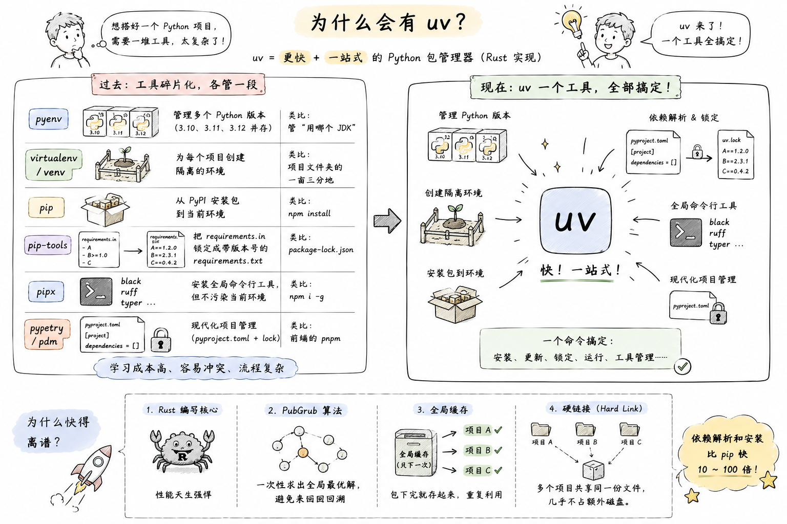
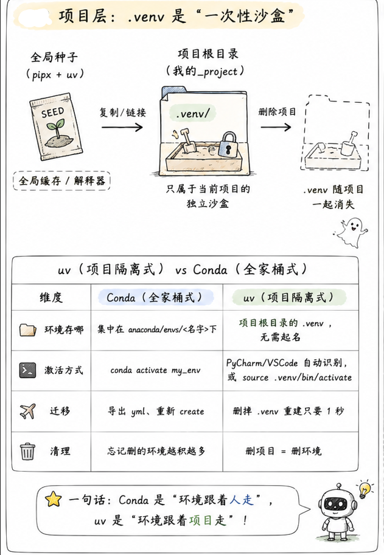
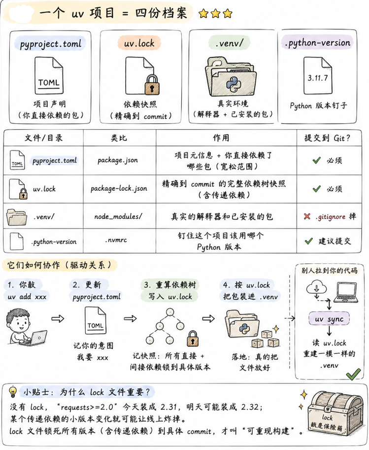
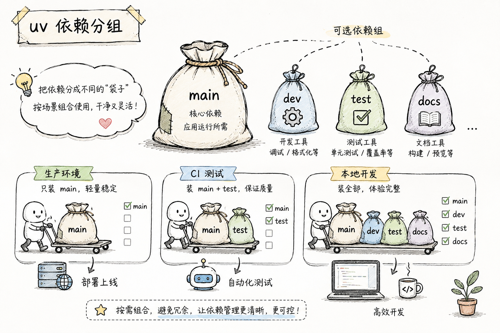

# uv 深入理解 —— 一个工具取代一整个生态

> 官方文档：[uv Documentation](https://docs.astral.sh/uv/) | [uv GitHub](https://github.com/astral-sh/uv)

## 一、为什么会有 uv？

要理解 uv，得先看清楚它到底在解决什么问题。**uv 不是"更快的 pip"这么简单**，它是要一个工具把整个 Python 包管理生态给收编了。

### 1.1 Python 包管理的"百年孤独"⭐⭐⭐

一个成熟的 Python 项目，往往同时依赖下面这一堆工具，各管一段：

<p align='center'>
    
</p>
### 1.2 uv 是什么

**uv** 是 [Astral](https://astral.sh/)（也就是 ruff 的作者）团队用 **Rust** 写的下一代 Python 包管理器。核心目标只有两条：

1. **快**——依赖解析和安装比 pip 快 10–100 倍（Rust + 并行 + 全局硬链接缓存）
2. **一站式**——上面表格里那六个工具的活，`uv` 全干了


---

## 二、心智模型：uv 的两级架构 ⭐⭐⭐

### 2.1 全局层：Python 解释器"种子仓库"

uv 会在**用户目录下**维护一个 Python 解释器仓库（Windows 上默认在 `C:\Users\<你>\AppData\Roaming\uv\python\`，可以用 `UV_PYTHON_INSTALL_DIR` 改）。

```bash
uv python install 3.11   # 下载一个 3.11 的解释器进仓库
uv python install 3.12   # 再下一个 3.12
uv python list --only-installed   # 看仓库里有啥
```

这些解释器是**只读**的、**共享**的、**纯净**的——你可以理解为 uv 帮你囤了一堆"Python 种子"。**任何项目要用哪个版本，都从这里取。**

### 2.2 项目层：`.venv` 是"一次性沙盒"

每个项目根目录下的 `.venv` 文件夹，就是这个项目的**独立沙盒**：

<p align='center'>
	
</p>

一句话：**Conda 是"环境跟着人走"，uv 是"环境跟着项目走"**。后者更符合现代软件工程直觉——就像 `node_modules`、`target/`、`vendor/` 一样，环境就应该躺在项目里，跟着项目一起被 `.gitignore`。

### 2.3 一个 uv 项目 = 四份档案 ⭐⭐⭐

`uv init` 之后，项目里会多出这四个东西，缺一不可：

<p align='center'>
    
</p>
---

## 三、依赖管理：`uv add` vs `uv pip install` ⭐⭐⭐

这是 uv 最容易踩坑的地方，也是**很多人用 uv 但没用对**的核心。

### 3.1 两种模式：项目模式 vs pip 兼容模式

uv 内置了两套**平行**的依赖管理命令：

=== "项目模式（推荐）"
    ```bash
    uv add requests
    uv remove requests
    uv sync
    ```
    走的是 `pyproject.toml` + `uv.lock`，是 uv 的**原生哲学**。

=== "pip 兼容模式（应急）"
    ```bash
    uv pip install requests
    uv pip uninstall requests
    uv pip list
    ```
    模拟 pip 行为，**只操作 `.venv`**，不碰 `pyproject.toml`、不写 `uv.lock`。

**它们的关键差异**：

| 维度 | `uv add`（项目模式） | `uv pip install`（pip 兼容） |
| --- | --- | --- |
| 记录到 `pyproject.toml` | ✅ 自动 | ❌ 不管 |
| 更新 `uv.lock` | ✅ 自动 | ❌ 不管 |
| 卸载时清理传递依赖 | ✅ 干净 | ❌ 会留孤儿 |
| 团队协作 | `uv sync` 即完全一致 | 需 `pip freeze` 手动导出 |
| 适用场景 | 项目开发（99% 用它） | 迁移旧项目、临时试玩 |

### 3.2 一个坑：`uv pip uninstall` 会留孤儿 ⭐⭐

比如你装 `flask`，实际会带进来 `Werkzeug`、`Jinja2`、`click`、`itsdangerous`、`blinker` 五个传递依赖。

- 如果你当初用 `uv add flask`：`uv remove flask` 会**顺带把这五个孤儿一起清掉**（前提是没有别的包依赖它们）
- 如果你当初用 `uv pip install flask`：`uv pip uninstall flask` **只删 flask 本体**，剩下五个继续占位置

!!! warning "结论"
    **只要是在做项目**（有 `pyproject.toml`），一律用 `uv add` / `uv remove`，别用 `uv pip install`。后者只在两个场景下用：
    
    1. 从老项目的 `requirements.txt` 迁移过来时，先装上再慢慢改造
    2. 临时试玩一下某个包，不想污染 `pyproject.toml`

### 3.3 依赖分组（dependency groups）⭐⭐⭐

**先讲概念**：一个项目的依赖，其实**不是铁板一块**。

拿一个 Web 项目举例，你实际会用到这些包：

- `flask`、`sqlalchemy`、`requests` —— **上线跑生产**必须的
- `pytest`、`pytest-cov` —— 只有**跑测试**才需要
- `ruff`、`black`、`mypy` —— 只有**写代码时**才需要
- `mkdocs`、`mkdocs-material` —— 只有**构建文档站**才需要

问题来了：把这些包**一股脑塞进一个大袋子**行不行？技术上行，但很难受——

- **上线部署时**：Docker 镜像里塞进一堆 `pytest`、`mkdocs`，镜像白白胖 200MB，构建慢、拉起慢、攻击面还变大
- **CI 里跑测试**：明明只需要 test 相关的包，却要等所有依赖装完
- **构建文档的 CI job**：明明只需要 mkdocs，却要装整个项目的运行时依赖

**依赖分组**就是给这些包分门别类装进不同袋子，用哪个装哪个。
<p align='center'>
    
</p>
#### 1. 分组在 `pyproject.toml` 里长这样

```toml
[project]
name = "myapp"
dependencies = [        # ← 主袋子（main / project dependencies）
    "flask>=2.0",
    "sqlalchemy",
]

[dependency-groups]     # ← 分组袋子，各自独立
dev = [                 # 便利组：本地开发常用工具
    "ruff",
    "black",
    "mypy",
]
test = [                # 跑测试才需要
    "pytest",
    "pytest-cov",
]
docs = [                # 建文档才需要
    "mkdocs",
    "mkdocs-material",
]
```

`[project.dependencies]` 是**主袋子**，跟着你项目发布出去；`[dependency-groups]` 下每个组都是**可选袋子**，**只在本地/CI 需要时才装**，不会打进最终发布的 wheel/sdist。

!!! info "这是 PEP 735 的标准"
    `[dependency-groups]` 不是 uv 自造的，是 [PEP 735](https://peps.python.org/pep-0735/) 的标准写法，poetry / pdm 也在往这上面靠。写在这里的东西是**跨工具通用**的。

#### 2. 怎么把包加到某个组

```bash
uv add ruff --dev              # 加到 dev 组（--dev 是 --group dev 的语法糖）
uv add pytest --group test     # 加到 test 组
uv add mkdocs --group docs     # 加到 docs 组

uv add flask                   # 不带 --group → 进主袋子
```

#### 3. `uv sync` 到底装哪些组 ⭐⭐

这是最容易踩坑的地方。**默认行为**：

```bash
uv sync                        # 装：主依赖 + dev 组（dev 组默认启用！）
```

对，`dev` 组**默认是开着的**——因为它假设你正在本地开发。想要"纯生产环境"的效果，得显式关掉：

```bash
uv sync --no-dev               # 装：只装主依赖（生产环境用这个）
```

对于**非 dev 的其它组**（比如 test、docs），默认**不装**，要显式打开：

```bash
uv sync --group test           # 装：主依赖 + dev + test
uv sync --group docs           # 装：主依赖 + dev + docs
uv sync --all-groups           # 装：主依赖 + 所有组（本地开发全套）
```

想"只装某一组、连主依赖都不要"：

```bash
uv sync --only-group docs      # 只装 docs 组（构建文档的 CI job 用）
```

#### 4. 场景速查

不同场景怎么组合，一张表说完：

| 场景 | 命令 | 装了什么 |
| --- | --- | --- |
| 本地开发 | `uv sync --all-groups` | 主 + dev + test + docs（全套） |
| CI 跑测试 | `uv sync --group test` | 主 + dev + test |
| CI 建文档 | `uv sync --only-group docs` | 只 docs |
| 生产部署 | `uv sync --no-dev` | 只主依赖 |
| Docker 镜像 | `uv sync --no-dev --frozen` | 只主依赖，且不许改 lock |

!!! tip "命名约定"
    - `dev` 是一个"便利名"，uv 对它有特殊待遇（默认启用、`--dev` 简写、`--no-dev` 关闭）
    - 其它组的名字**你随便起**：`test`、`docs`、`lint`、`bench`、`typing`……只要有意义即可
    - 一个包**可以同时属于多个组**（比如 `mypy` 可以既在 `dev` 也在 `typing`），uv 会去重

---

## 四、常用操作速查

### 4.1 项目

```bash
# 新建项目（会顺带创建 .venv、pyproject.toml、uv.lock、.python-version）
uv init myproject
cd myproject

# 已有项目改造成 uv 项目
uv init

# 依赖
uv add requests              # 加依赖
uv add "flask>=2.0"          # 带版本约束
uv add --dev pytest          # 开发依赖
uv remove requests           # 移除
uv sync                      # 按 lock 装齐所有依赖
uv lock                      # 只更新 lock 文件，不装
```

### 4.2 虚拟环境

```bash
uv venv                      # 在当前目录创建 .venv
uv venv --python 3.12        # 指定 Python 版本
uv venv myenv                # 起自定义名字（不推荐）

# 删除：直接删 .venv 文件夹即可

# 激活（大多数 IDE 会自动激活，无需手动）
source .venv/bin/activate    # Linux / macOS
.venv\Scripts\activate       # Windows
```

### 4.3 Python 版本管理

```bash
uv python list                     # 看有哪些版本可下
uv python list --only-installed    # 看本机已装的
uv python install 3.11             # 装一个到全局种子仓库
uv python uninstall 3.13           # 卸掉一个
uv python pin 3.11                 # 把当前项目钉到 3.11（写入 .python-version）
uv python find 3.11                # 查它装在哪
```

### 4.4 运行脚本 / 模块

```bash
uv run script.py                        # 用项目环境跑（自动 sync 一遍）
uv run python main.py
uv run pytest
uv run -m http.server 8000              # 跑模块

uv run --with requests script.py        # 临时加个 requests 跑（不入 pyproject）
```

### 4.5 全局工具（替代 pipx）

给命令行工具（如 ruff、black、httpie）安装到**全局隔离环境**，不污染任何项目：

```bash
uv tool install ruff             # 全局装
uv tool list                     # 看装了哪些
uv tool uninstall ruff           # 卸

uv tool run ruff check .         # 跑一次不装
uvx ruff check .                 # 上一条的简写（最常用）
```

!!! tip "uvx 是什么"
    `uvx foo` = `uv tool run foo`，语义类似 `npx foo`。**一次性用一下某个 CLI 工具但不想装**，就用它。

---

## 五、进阶配置

### 5.1 修改存储位置

uv 有两块占空间的东西，通过**环境变量**永久改路径：

| 环境变量 | 内容 | 默认位置（Windows） |
| --- | --- | --- |
| `UV_PYTHON_INSTALL_DIR` | Python 解释器本体 | `C:\Users\<你>\AppData\Roaming\uv\python` |
| `UV_CACHE_DIR` | 所有包的全局缓存（供 `.venv` 硬链接） | `C:\Users\<你>\AppData\Local\uv\cache` |

C 盘紧张的话，把这俩挪到 D 盘。

### 5.2 国内镜像源

在项目的 `pyproject.toml` 里加：

```toml
[[tool.uv.index]]
url = "https://pypi.tuna.tsinghua.edu.cn/simple"
default = true
```

或者环境变量 `UV_INDEX_URL=https://pypi.tuna.tsinghua.edu.cn/simple` 一劳永逸。

---

## 六、迁移与协作

### 6.1 从 `requirements.txt` 迁移

=== "保守派：先跑起来再改造"
    ```bash
    uv venv
    uv pip install -r requirements.txt   # 先用 pip 兼容模式装上
    # 之后慢慢把依赖用 uv add 加回来，最后删掉 requirements.txt
    ```

=== "激进派：一步到位"
    ```bash
    uv init
    # 把 requirements.txt 里每一行 pkg 名字拎出来 uv add
    # 也可以一次性：
    uv add $(cat requirements.txt)
    ```

### 6.2 团队协作流程

```bash
# --- 开发者 A ---
uv add pandas              # pyproject.toml + uv.lock 都自动更新
git commit -am "add pandas"
git push

# --- 开发者 B ---
git pull
uv sync                    # 按 uv.lock 装出和 A 完全一致的环境
```

!!! warning "生产环境部署"
    CI / Docker 里一定用 `uv sync --frozen`——它会**拒绝更新 lock 文件**，如果 `pyproject.toml` 和 `uv.lock` 不一致就直接报错。这样能防止部署时被"意外升级"。

---

## 七、什么时候不用 uv？

uv 强归强，也不是万能钥匙：

- **纯数据科学 / 需要 conda 生态**：像 `cudatoolkit`、`mkl` 这类 Anaconda 独家打包的二进制，PyPI 上要么没有要么麻烦，还是老实用 conda / mamba
- **要跨语言依赖**（比如 Python 项目里同时要 R、Julia）：conda 依然更省心
- **公司内网 + 没配好私服**：uv 的镜像 / 私服配置比 pip 稍微多一步，如果只是零星几个包，pip 更快

其它 99% 场景，从今天起就切 uv 吧。

---

## 附录：命令速查表

| 目的 | 命令 |
| --- | --- |
| 新建项目 | `uv init myproj` |
| 加依赖 | `uv add requests` |
| 加开发依赖 | `uv add --dev pytest` |
| 移除依赖 | `uv remove requests` |
| 装齐所有依赖 | `uv sync` |
| 只更新 lock | `uv lock` |
| 跑脚本 | `uv run script.py` |
| 装 Python 版本 | `uv python install 3.12` |
| 钉版本 | `uv python pin 3.12` |
| 装全局 CLI 工具 | `uv tool install ruff` |
| 一次性跑 CLI 工具 | `uvx ruff check .` |
| pip 兼容装包 | `uv pip install foo` |
| 生产环境部署 | `uv sync --frozen` |
