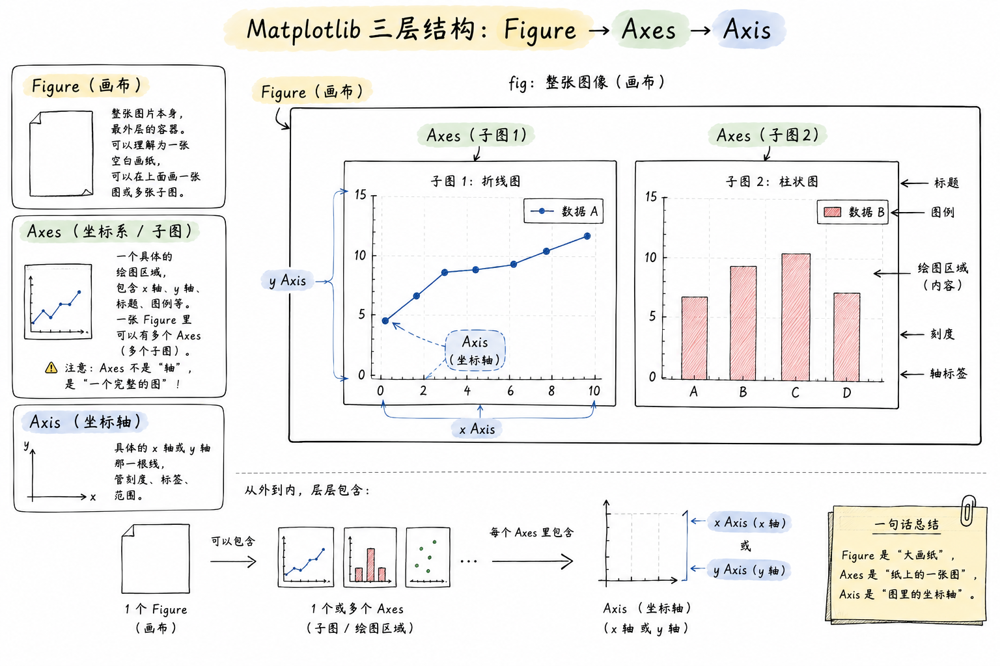
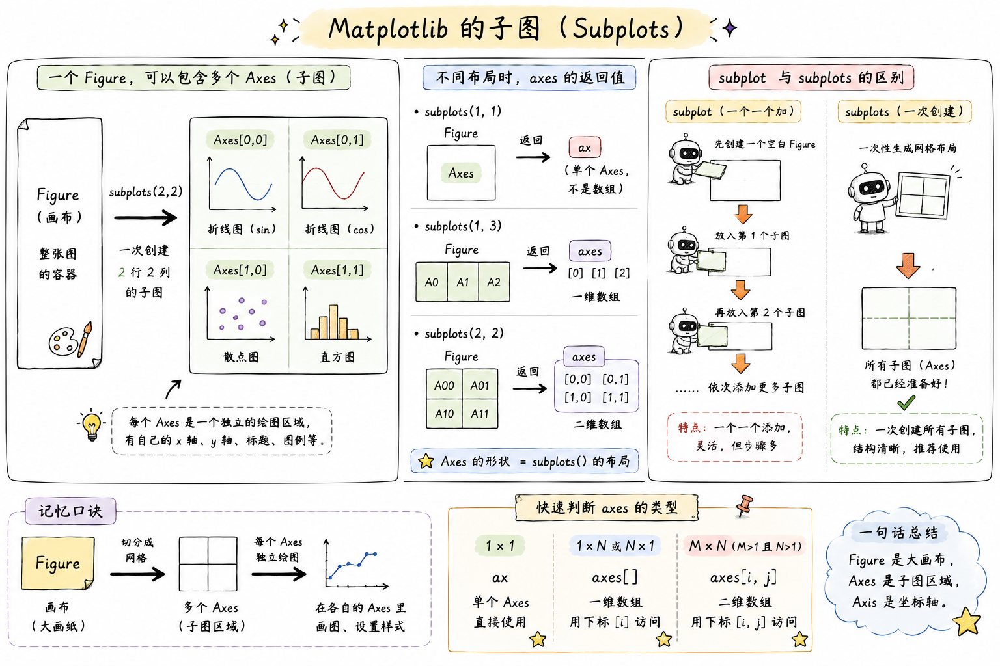

# Matplotlib - 数据可视化基础

> 官方文档：[Matplotlib Docs](https://matplotlib.org/stable/index.html) | [Pyplot Tutorial](https://matplotlib.org/stable/tutorials/pyplot.html)

## 一、简介

**Matplotlib** 是 Python 最基础、最经典的 2D 绘图库，几乎所有数据可视化库（Seaborn、Pandas 的 `.plot()`）底层都在调用它。它的目标是让绘图这件事既能"一行代码画个图"应付快速探索，也能"逐个像素调整"做出发表级图表。

一句话：**NumPy 是算数据的，Pandas 是理数据的，Matplotlib 是把数据画出来的。**

### 1.1 安装与导入

```bash
pip install matplotlib
```

```python
import matplotlib.pyplot as plt
import numpy as np
```

约定俗成把 `matplotlib.pyplot` 起别名 `plt`，几乎所有教程和代码都这么写。

### 1.2 中文与负号显示

Matplotlib 默认字体不支持中文，中文会显示成方框；同时启用中文字体后，坐标轴的负号也会显示异常。开头统一加两行即可：

```python
plt.rcParams['font.sans-serif'] = ['SimHei']   # 用黑体显示中文
plt.rcParams['axes.unicode_minus'] = False     # 正常显示负号
```

!!! tip "字体按系统换"
    Windows 用 `SimHei`（黑体）或 `Microsoft YaHei`（微软雅黑）；macOS 用 `Arial Unicode MS` 或 `PingFang SC`；Linux 需要自己安装中文字体（如 `WenQuanYi Zen Hei`）。

---

## 二、核心概念 ⭐⭐⭐

要把 Matplotlib 用明白，最关键的不是记 API，而是先建立**三层结构**的心智模型：`Figure` → `Axes` → `Axis`。三个词长得像但完全不是一回事，很多新手在这里被绕晕。

### 2.1 三层结构

一张图从外到内分三层：

- **Figure（画布）**：整张图片本身，是最外层的容器。可以理解为一张空白画纸，你在上面能画一张图、也能画多张子图。
- **Axes（坐标系 / 子图）**：一个具体的**绘图区域**，包含 x 轴、y 轴、标题、图例等。**一张 Figure 里可以有多个 Axes**（即多个子图）。**注意：Axes 不是"轴"，是"一个完整的图"**——这是最容易搞混的点。
- **Axis（坐标轴）**：具体的 x 轴或 y 轴那一根线，管刻度、标签、范围。

<p align='center'>
    
</p>

说白了：你在 Figure 这张大画纸上，划分出一个或多个 Axes（每个 Axes 是一张独立的图），每个 Axes 里有 Axis（坐标轴）和你画的曲线/柱子/点。

### 2.2 两种编程接口 ⭐⭐⭐

Matplotlib 有两套写法，很多教程混着用，导致新手一会儿 `plt.xxx` 一会儿 `ax.xxx`，越看越乱。

=== "pyplot 接口（状态机风格）"

    直接用 `plt.` 打头，"当前操作总是作用在当前那张图上"。写起来短，适合快速探索。
    
    ```python
    plt.figure(figsize=(8, 4))
    plt.plot([1, 2, 3], [4, 5, 6])
    plt.title('快速画个图')
    plt.xlabel('x')
    plt.ylabel('y')
    plt.show()
    ```

=== "面向对象接口（推荐）"

    显式拿到 `fig` 和 `ax`，之后所有操作都在具体的 `ax` 上。稍微啰嗦一点，但**画多子图、复杂图必须用这个**——你分得清操作的是哪个子图。
    
    ```python
    fig, ax = plt.subplots(figsize=(8, 4))
    ax.plot([1, 2, 3], [4, 5, 6])
    ax.set_title('规范画图')
    ax.set_xlabel('x')
    ax.set_ylabel('y')
    plt.show()
    ```

**建议**：单图快速看结果用 pyplot，正式代码、多子图统一用面向对象接口。本笔记后面**优先用面向对象写法**。

| 目的 | pyplot 写法 | 面向对象写法 |
|------|-------------|-------------|
| 创建画布 | `plt.figure()` | `fig, ax = plt.subplots()` |
| 设置标题 | `plt.title('x')` | `ax.set_title('x')` |
| 设置 x 轴标签 | `plt.xlabel('x')` | `ax.set_xlabel('x')` |
| 设置轴范围 | `plt.xlim(0, 10)` | `ax.set_xlim(0, 10)` |
| 显示图例 | `plt.legend()` | `ax.legend()` |

规律：`plt.xxx()` 对应 `ax.set_xxx()` 或 `ax.xxx()`。

---

## 三、基础绘图 ⭐⭐⭐

### 3.1 折线图 plot

最常用，画连续变化趋势。

```python
x = np.linspace(0, 2 * np.pi, 100)
y = np.sin(x)

fig, ax = plt.subplots()
ax.plot(x, y)
ax.set_title('sin(x)')
plt.show()
```

**一图多线** + 常用参数：

```python
fig, ax = plt.subplots()
ax.plot(x, np.sin(x), color='red',   linestyle='-',  linewidth=2, label='sin')
ax.plot(x, np.cos(x), color='blue',  linestyle='--', linewidth=2, label='cos')
ax.legend()   # 显示图例（必须先指定 label 才有内容）
plt.show()
```

常用参数速查：

| 参数 | 简写 | 说明 | 常用取值 |
|------|------|------|----------|
| `color` | `c` | 线条颜色 | `'red'`、`'#FF0000'`、`'r'` |
| `linestyle` | `ls` | 线型 | `'-'` 实线、`'--'` 虚线、`':'` 点线、`'-.'` 点划线 |
| `linewidth` | `lw` | 线宽 | 数字，默认 1.5 |
| `marker` | — | 数据点标记 | `'o'` 圆点、`'s'` 方块、`'^'` 三角、`'*'` 星号 |
| `label` | — | 图例文本 | 字符串，配合 `ax.legend()` 使用 |
| `alpha` | — | 透明度 | 0-1，0 全透明 1 不透明 |

!!! tip "格式字符串简写"
    `ax.plot(x, y, 'r--o')` 等价于 `color='red', linestyle='--', marker='o'`。字符顺序不限，颜色+线型+标记的组合。

### 3.2 散点图 scatter

看两个变量的分布关系。

```python
x = np.random.randn(200)
y = np.random.randn(200)

fig, ax = plt.subplots()
ax.scatter(x, y, s=30, c='steelblue', alpha=0.6, edgecolors='white')
ax.set_title('随机散点')
plt.show()
```

- `s`：点的大小（可传数组，让每个点大小不同）
- `c`：颜色（可传数组，配合 `cmap` 做颜色映射）
- `alpha`：透明度，点多时开小一点避免糊成一团

### 3.3 柱状图 bar / barh

看分类数据的数值对比。

```python
categories = ['苹果', '香蕉', '橘子', '葡萄']
values = [23, 45, 17, 35]

fig, ax = plt.subplots()
ax.bar(categories, values, color=['#e74c3c', '#f1c40f', '#e67e22', '#8e44ad'])
ax.set_ylabel('销量')
ax.set_title('水果销量')
plt.show()
```

- `ax.bar()` 垂直柱状图
- `ax.barh()` 水平柱状图（类目多、名字长时更好看）

### 3.4 直方图 hist

看**一组数据的分布**——注意和柱状图区分：柱状图是分类对比，直方图是数值分箱。

```python
data = np.random.randn(1000)

fig, ax = plt.subplots()
ax.hist(data, bins=30, color='steelblue', edgecolor='white')
ax.set_title('标准正态分布')
plt.show()
```

- `bins`：分几个桶，越大越细
- `density=True`：y 轴从"频数"变成"频率密度"

### 3.5 饼图 pie

饼图用得少（数据一多就没法看），常用于展示占比结构。

```python
sizes = [30, 25, 20, 15, 10]
labels = ['A', 'B', 'C', 'D', 'E']

fig, ax = plt.subplots()
ax.pie(sizes, labels=labels, autopct='%1.1f%%', startangle=90)
ax.axis('equal')   # 让饼图是正圆
plt.show()
```

- `autopct='%1.1f%%'` 显示百分比
- `startangle` 从哪个角度开始画（90 表示 12 点方向）

---

## 四、图形定制

### 4.1 标题、标签、图例

```python
fig, ax = plt.subplots()
ax.plot(x, y, label='sin(x)')

ax.set_title('三角函数', fontsize=14, fontweight='bold')
ax.set_xlabel('弧度', fontsize=12)
ax.set_ylabel('值', fontsize=12)
ax.legend(loc='upper right')   # loc 控制图例位置
```

`legend` 的 `loc` 常用值：`'best'`（自动）、`'upper right'`、`'lower left'`、`'center'` 等。

### 4.2 坐标轴范围与刻度

```python
ax.set_xlim(0, 10)              # x 轴范围
ax.set_ylim(-1.5, 1.5)          # y 轴范围

ax.set_xticks([0, 2, 4, 6, 8])  # 手动指定刻度位置
ax.set_xticklabels(['零', '二', '四', '六', '八'])  # 手动指定刻度文本

ax.tick_params(axis='x', rotation=45)  # x 轴刻度旋转 45 度
```

### 4.3 网格与背景

```python
ax.grid(True, linestyle='--', alpha=0.5)  # 显示虚线网格
ax.set_facecolor('#f5f5f5')                # 子图背景色
```

### 4.4 添加文本与注释

```python
ax.text(0.5, 0.9, '这是文本', transform=ax.transAxes)  # 相对坐标 (0-1)
ax.annotate('最大值',
            xy=(np.pi/2, 1),           # 指向哪个点
            xytext=(np.pi/2 + 1, 1.2), # 文字放哪
            arrowprops=dict(arrowstyle='->'))
```

`transform=ax.transAxes` 用的是"相对子图"的坐标（左下 0,0，右上 1,1），不受数据范围影响，放标题、水印很方便。

---

## 五、子图 ⭐⭐

一张 Figure 里放多个 Axes，是 Matplotlib 的常规操作。

### 5.1 subplots 快速创建网格

`plt.subplots(nrows, ncols)` 一次创建 m×n 个子图，返回 Figure 和 Axes 数组。

```python
fig, axes = plt.subplots(2, 2, figsize=(10, 8))
# axes 是 2x2 的 ndarray

axes[0, 0].plot(x, np.sin(x))
axes[0, 0].set_title('sin')

axes[0, 1].plot(x, np.cos(x))
axes[0, 1].set_title('cos')

axes[1, 0].scatter(np.random.randn(50), np.random.randn(50))
axes[1, 0].set_title('散点')

axes[1, 1].hist(np.random.randn(1000), bins=30)
axes[1, 1].set_title('直方图')

fig.tight_layout()   # 自动调整子图间距，避免标题重叠
plt.show()
```

<p align='center'>
    
</p>
!!! tip "只有一行/一列时"
    - `plt.subplots(1, 3)` 返回的 `axes` 是**一维数组**，用 `axes[0]`、`axes[1]`、`axes[2]`
    - `plt.subplots(2, 3)` 返回**二维数组**，用 `axes[0, 0]` 这种下标
    - `plt.subplots(1, 1)` 返回**单个 Axes**（不是数组），直接 `ax.xxx`

### 5.2 subplot（pyplot 风格）

单个添加子图，编号从 1 开始：

```python
plt.figure(figsize=(10, 4))

plt.subplot(1, 2, 1)   # 1 行 2 列的第 1 个
plt.plot(x, np.sin(x))
plt.title('sin')

plt.subplot(1, 2, 2)   # 1 行 2 列的第 2 个
plt.plot(x, np.cos(x))
plt.title('cos')

plt.tight_layout()
plt.show()
```

`plt.subplot(121)` 是 `plt.subplot(1, 2, 1)` 的简写。

---

## 六、保存与显示

### 6.1 保存图片

```python
fig.savefig('output.png', dpi=300, bbox_inches='tight')
```

- `dpi`：分辨率，屏幕看 100 够用，打印/PPT 建议 300
- `bbox_inches='tight'`：自动裁掉白边（**强烈建议加上**，不然图周围留一大圈空白）
- 支持后缀：`.png`、`.jpg`、`.pdf`、`.svg`（矢量图，放大不糊）

!!! warning "先 savefig 再 show"
    `plt.show()` 在某些后端下会**清空当前图**，之后再 `savefig` 就是空白。稳妥的顺序：**先 `savefig` 再 `show`**。

### 6.2 显示

```python
plt.show()
```

在 Jupyter Notebook 里不需要调用 `plt.show()`，图会自动嵌在单元格下方（前提是加了 `%matplotlib inline`，新版 Jupyter 默认已开启）。

---

## 七、和 Pandas 联动

Pandas 的 DataFrame / Series 有 `.plot()` 方法，底层就是调 Matplotlib，日常探索性分析用它一句就够了：

```python
import pandas as pd

df = pd.DataFrame({
    'A': np.random.randn(100).cumsum(),
    'B': np.random.randn(100).cumsum()
})

df.plot(figsize=(8, 4), title='累积和')
plt.show()
```

- `df.plot(kind='bar')` 柱状图
- `df.plot(kind='hist')` 直方图
- `df.plot(kind='scatter', x='A', y='B')` 散点图
- `df['A'].plot.box()` 箱线图

想进一步定制，可以拿到 `ax` 再改：

```python
ax = df.plot()
ax.set_ylabel('值')
ax.grid(True)
plt.show()
```

---

## 八、常用速查

??? note "颜色的几种写法"

    ```python
    'red'           # 英文名
    'r'             # 单字母简写：r/g/b/c/m/y/k/w
    '#FF5733'       # 十六进制
    (0.1, 0.2, 0.5) # RGB 元组（0-1）
    'C0'、'C1'      # 使用主题第 N 个颜色（Matplotlib 默认调色板）
    ```

??? note "常用 marker 一览"

    | marker | 形状 | marker | 形状 |
    |--------|------|--------|------|
    | `'.'` | 小点 | `'o'` | 圆圈 |
    | `'v'` | 下三角 | `'^'` | 上三角 |
    | `'s'` | 正方形 | `'D'` | 菱形 |
    | `'*'` | 星形 | `'+'` | 加号 |
    | `'x'` | 叉号 | `'p'` | 五边形 |

??? note "内置样式表"

    Matplotlib 自带几种预设风格，一行切换：
    
    ```python
    plt.style.use('ggplot')       # 类 R 的 ggplot 风格
    plt.style.use('seaborn-v0_8') # seaborn 风格
    plt.style.use('dark_background')  # 暗色主题
    print(plt.style.available)    # 查看全部可选风格
    ```

---

## 九、一个完整例子

把上面的概念串一下：

```python
import matplotlib.pyplot as plt
import numpy as np

plt.rcParams['font.sans-serif'] = ['SimHei']
plt.rcParams['axes.unicode_minus'] = False

x = np.linspace(0, 2 * np.pi, 100)

fig, axes = plt.subplots(1, 2, figsize=(12, 4))

# 左图：折线
axes[0].plot(x, np.sin(x), 'r-',  label='sin', linewidth=2)
axes[0].plot(x, np.cos(x), 'b--', label='cos', linewidth=2)
axes[0].set_title('三角函数')
axes[0].set_xlabel('x')
axes[0].set_ylabel('y')
axes[0].legend()
axes[0].grid(True, alpha=0.3)

# 右图：直方图
data = np.random.randn(1000)
axes[1].hist(data, bins=30, color='steelblue', edgecolor='white')
axes[1].set_title('标准正态分布')
axes[1].set_xlabel('值')
axes[1].set_ylabel('频数')

fig.suptitle('Matplotlib 示例', fontsize=16, fontweight='bold')
fig.tight_layout()
fig.savefig('demo.png', dpi=150, bbox_inches='tight')
plt.show()
```

到这里，日常数据探索需要的绘图能力基本都齐了。想画更漂亮的图，可以看 [Seaborn](https://seaborn.pydata.org/) —— 它是 Matplotlib 的高级封装，默认样式好看很多，但底层还是这套 Figure/Axes 的概念。
