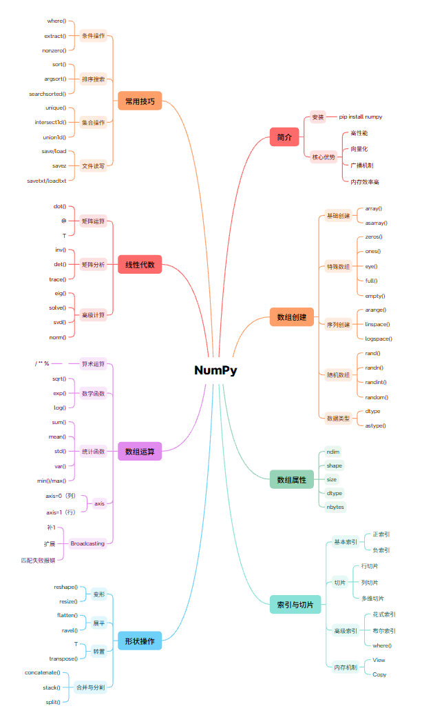

# NumPy - 数值计算基础

<p align='center'>
	
</p>

## 一、简介

NumPy（Numerical Python）是 Python 科学计算的基础库，提供高性能的多维数组对象和数学函数。

### 1.1 安装与导入

```bash
pip install numpy
```

```python
import numpy as np
```

### 1.2 核心优势

- **高性能**：底层 C 实现，比 Python 列表快 10-100 倍
- **向量化操作**：避免显式循环
- **广播机制**：不同形状数组间的运算
- **内存效率**：连续内存存储

---

## 二、数组创建

### 2.1 从列表创建

```python
# 一维数组
arr = np.array([1, 2, 3, 4, 5])

# 二维数组
arr = np.array([[1, 2, 3], [4, 5, 6]])

# 指定数据类型
arr = np.array([1, 2, 3], dtype=np.float32)
arr = np.array([1, 2, 3], dtype=np.int64)
```

### 2.2 内置函数创建

```python
# 全零数组
np.zeros(5)                    # [0., 0., 0., 0., 0.]
np.zeros((3, 4))               # 3x4 全零矩阵

# 全一数组
np.ones(5)
np.ones((2, 3))

# 单位数组（主对角线为 1）
np.eye(3)                      # 3x3 单位矩阵
np.identity(3)

# 空数组（未初始化）
np.empty((2, 3))

# 指定值填充
np.full((2, 3), 7)             # 2x3 全为 7
np.full_like(arr, 5)           # 与 arr 同形状

# 对角数组
np.diag([1, 2, 3])
```

### 2.3 序列创建

```python
# arange（类似 range）
np.arange(10)                  # [0, 1, 2, ..., 9]
np.arange(0, 10, 2)            # [0, 2, 4, 6, 8]
np.arange(0, 1, 0.1)           # 支持浮点步长

# linspace（等间距）
np.linspace(0, 1, 5)           # [0., 0.25, 0.5, 0.75, 1.]
np.linspace(0, 10, 11, endpoint=True)

# logspace（对数间距）
np.logspace(0, 2, 5)           # 10^0 到 10^2，5 个点

# 随机数组
np.random.rand(3, 4)           # [0, 1) 均匀分布
np.random.randn(3, 4)          # 标准正态分布
np.random.randint(0, 10, (3, 4))  # 整数
np.random.random((3, 4))       # [0, 1) 随机浮点数
```

### 2.4 array() 与 asarray()

`array()` 和 `asarray()` 都可以将输入数据转换为 ndarray，关键区别在于**是否复制内存**。

=== "`np.array()` — 总是复制"

    ```python
    data = [1, 2, 3]
    arr1 = np.array(data)       # 从 list 创建，会复制
    arr2 = np.array(arr1)       # 从 ndarray 创建，也会复制
    print(arr1 is arr2)         # False，不同对象
    ```

=== "`np.asarray()` — 避免不必要复制"

    ```python
    data = [1, 2, 3]
    arr1 = np.asarray(data)     # 从 list 创建，会复制
    arr2 = np.asarray(arr1)     # 已是 ndarray，不复制！返回同一对象
    print(arr1 is arr2)         # True，同一对象
    ```

> 参考：[NumPy 官方文档 - Array creation](https://numpy.org/doc/stable/reference/routines.array-creation.html)

### 2.5 数据类型与转换

| 类型代码                 | 说明               |
| -------------------- | ---------------- |
| `bool` / `?`         | 布尔类型             |
| `int8` / `i1`        | 有符号 8 位整型（1 字节）  |
| `int32` / `i4`       | 有符号 32 位整型（4 字节） |
| `int64` / `i8`       | 有符号 64 位整型（8 字节） |
| `float32` / `f4`     | 单精度浮点            |
| `float64` / `f8`     | 双精度浮点（默认）        |
| `complex64` / `c8`   | 复数（两个 32 位浮点）    |
| `complex128` / `c16` | 复数（两个 64 位浮点）    |

```python
# 创建时指定类型
arr = np.array([1, 2, 3], dtype=np.float64)     # [1. 2. 3.]

# astype() 类型转换
arr = np.array([1.2, 2.5, 4.8])
arr.astype(np.int64)         # [1, 2, 4]  截断取整
arr.astype("i8")             # 支持类型代码字符串
```

> 参考：[NumPy 官方文档 - Data types](https://numpy.org/doc/stable/user/basics.types.html)

---

## 三、数组属性

```python
arr = np.array([[1, 2, 3], [4, 5, 6]])

arr.ndim          # 维度数：2
arr.shape         # 形状：(2, 3)
arr.size          # 元素总数：6
arr.dtype         # 数据类型：int32
arr.itemsize      # 每个元素字节数：4
arr.nbytes        # 总字节数：24
```

---

## 四、数组索引与切片

### 4.1 基本索引

```python
arr = np.array([[1, 2, 3], [4, 5, 6], [7, 8, 9]])

# 一维索引
arr[0]           # [1, 2, 3]
arr[0, 1]        # 2
arr[0][1]        # 2

# 负索引
arr[-1]          # [7, 8, 9]
arr[-1, -1]      # 9
```

### 4.2 切片

```python
arr = np.array([[1, 2, 3, 4], [5, 6, 7, 8], [9, 10, 11, 12]])

# 行切片
arr[0:2]         # 前两行
arr[:2]          # 前两行
arr[1:]          # 第二行及以后

# 列切片
arr[:, 0:2]      # 前两列
arr[:, ::2]      # 奇数列

# 组合切片
arr[0:2, 1:3]    # 第 0-1 行，第 1-2 列
arr[::2, ::2]    # 隔行隔列
```

### 4.3 花式索引

```python
arr = np.array([10, 20, 30, 40, 50])

# 数组索引
arr[[0, 2, 4]]        # [10, 30, 50]

# 二维花式索引
arr2d = np.array([[1, 2, 3], [4, 5, 6], [7, 8, 9]])
arr2d[[0, 2]]         # 第 0 行和第 2 行
arr2d[[0, 2], [1, 2]] # (0,1) 和 (2,2) -> [2, 9]

# 布尔索引
arr = np.array([1, 2, 3, 4, 5, 6])
arr[arr > 3]          # [4, 5, 6]
arr[arr % 2 == 0]     # [2, 4, 6]
arr[(arr > 2) & (arr < 5)]  # [3, 4]

# 条件赋值
arr[arr > 3] = 0      # 大于 3 的置零
np.where(arr > 3, 1, 0)  # 大于 3 返回 1，否则返回 0
```

### 4.4 视图（View）与副本（Copy）

视图与原数组共享内存，修改视图会影响原数组；副本拥有独立内存，互不影响。

=== "视图（View）"

    切片操作返回的是**视图**，修改视图会影响原数组。

    ```python
    arr = np.array([[1, 2, 3], [4, 5, 6]])
    view = arr[:, :2]        # 切片返回视图
    view[0, 0] = 99
    print(arr)               # [[99, 2, 3], [4, 5, 6]] 原数组被修改
    ```

=== "副本（Copy）"

    显式调用 `.copy()` 得到**副本**，修改副本不会影响原数组。

    ```python
    arr = np.array([[1, 2, 3], [4, 5, 6]])
    copy = arr[:, :2].copy() # 调用 copy() 得到副本
    copy[0, 0] = 99
    print(arr)               # [[1, 2, 3], [4, 5, 6]] 原数组不变
    ```

**常见操作返回视图还是副本：**

| 操作 | 返回类型 |
|------|---------|
| `arr[:]` 切片 | 视图 |
| `.reshape()` | 视图 |
| `.T` / `.transpose()` | 视图 |
| `.ravel()` | 尽量返回视图 |
| `.flatten()` | 副本 |
| `.astype()` | 副本 |
| `.copy()` | 副本 |

---

## 五、数组形状操作

### 5.1 重塑

```python
arr = np.arange(12)

# reshape
arr.reshape(3, 4)      # 3x4
arr.reshape(2, 6)      # 2x6
arr.reshape(3, -1)      # 自动计算列数
arr.reshape(-1, 4)      # 自动计算行数

# 原地修改
arr.resize(3, 4)

# 展平
arr = np.array([[1, 2], [3, 4]])
arr.flatten()          # [1, 2, 3, 4]，返回副本
arr.ravel()            # [1, 2, 3, 4]，返回视图（可能）
```

### 5.2 转置

```python
arr = np.array([[1, 2, 3], [4, 5, 6]])

arr.T                  # 转置
arr.transpose()        # 转置
np.transpose(arr)

# 多维转置
arr3d = np.arange(24).reshape(2, 3, 4)
arr3d.transpose(1, 0, 2)  # 交换第 0 和第 1 维
```

### 5.3 合并与分割

```python
# 合并
a = np.array([1, 2, 3])
b = np.array([4, 5, 6])

np.concatenate([a, b])           # [1, 2, 3, 4, 5, 6]
np.vstack([a, b])                # 垂直堆叠
np.hstack([a, b])                # 水平堆叠
np.stack([a, b], axis=0)         # 新增维度堆叠

# 分割
arr = np.arange(12).reshape(3, 4)
np.split(arr, 3)                  # 分成 3 份
np.split(arr, [1, 3], axis=1)     # 在第 1、3 列分割
np.vsplit(arr, 3)                 # 垂直分割
np.hsplit(arr, 2)                 # 水平分割
```

---

## 六、数组运算

### 6.1 算术运算

```python
a = np.array([1, 2, 3])
b = np.array([4, 5, 6])

# 基本运算（逐元素）
a + b          # [5, 7, 9]
a - b          # [-3, -3, -3]
a * b          # [4, 10, 18]
a / b          # [0.25, 0.4, 0.5]
a ** 2         # [1, 4, 9]
a % 2          # [1, 0, 1]

# 比较运算（返回布尔数组）
a > 1          # [False, True, True]
a == b         # [False, False, False]

# 数学函数
np.add(a, b)
np.subtract(a, b)
np.multiply(a, b)
np.divide(a, b)
np.power(a, 2)
np.sqrt(a)
np.exp(a)
np.log(a)
np.log10(a)
```

### 6.2 统计函数

```python
arr = np.array([[1, 2, 3], [4, 5, 6]])

# 基本统计
arr.sum()              # 21
arr.mean()             # 3.5
arr.std()              # 标准差
arr.var()              # 方差
arr.min()              # 1
arr.max()              # 6
arr.argmin()           # 最小值索引
arr.argmax()           # 最大值索引

# 按轴统计
arr.sum(axis=0)        # 列求和：[5, 7, 9]
arr.sum(axis=1)        # 行求和：[6, 15]
arr.mean(axis=0)       # 列均值
arr.mean(axis=1)       # 行均值

# 累积运算
arr.cumsum()           # 累积和
arr.cumprod()          # 累积乘积
```

!!! tip "axis 参数理解"
    `axis` 指定统计计算沿哪个轴进行：

    - **`axis=0`**：沿垂直方向（跨行计算），对**列**做统计 → 结果中行的维度消失
    - **`axis=1`**：沿水平方向（跨列计算），对**行**做统计 → 结果中列的维度消失

    可以这样记忆：**`axis=0` 压扁行，`axis=1` 压扁列**。

### 6.3 广播机制

广播（Broadcasting）允许不同形状的数组之间进行元素级运算，是 NumPy 的核心机制之一。

!!! tip "广播三规则"
    1. **维度补 1**：维度数不同时，小维度数组的形状在最左边补 1
    2. **沿 1 扩展**：维度不匹配时，沿大小为 1 的维度复制扩展
    3. **报错条件**：维度不匹配且没有任何维度为 1，抛出 `ValueError`

```python
# 数组与标量
arr = np.array([1, 2, 3])
arr + 10               # [11, 12, 13]

# 不同形状数组
a = np.array([[1, 2, 3], [4, 5, 6]])  # (2, 3)
b = np.array([10, 20, 30])            # (3,)
a + b                  # 广播加法

c = np.array([[10], [20]])            # (2, 1)
a + c                  # 广播加法
```

> 参考：[NumPy 官方文档 - Broadcasting](https://numpy.org/doc/stable/user/basics.broadcasting.html)

---

## 七、线性代数

```python
import numpy as np

A = np.array([[1, 2], [3, 4]])
B = np.array([[5, 6], [7, 8]])

# 矩阵乘法
np.dot(A, B)           # 或 A @ B
A @ B                  # Python 3.5+ 推荐写法

# 矩阵运算
A.T                    # 转置
np.linalg.inv(A)      # 逆矩阵
np.linalg.det(A)       # 行列式
np.trace(A)            # 迹

# 特征值和特征向量
eigenvalues, eigenvectors = np.linalg.eig(A)

# 解线性方程组 Ax = b
b = np.array([1, 2])
x = np.linalg.solve(A, b)

# 奇异值分解
U, S, Vt = np.linalg.svd(A)

# 范数
np.linalg.norm(A)              # Frobenius 范数
np.linalg.norm(A, ord=2)        # 2-范数
np.linalg.norm(A, axis=0)       # 按列
```

---

## 八、常用技巧

### 8.1 布尔操作

```python
arr = np.array([1, 2, 3, 4, 5, 6])

# 条件筛选
np.where(arr > 3, arr, 0)        # [0, 0, 0, 4, 5, 6]
np.where(arr > 3, 1, -1)         # [-1, -1, -1, 1, 1, 1]

# 提取元素
np.extract(arr > 3, arr)         # [4, 5, 6]

# 非零元素
np.nonzero(arr > 3)              # 返回索引

# 布尔统计
(arr > 3).sum()                   # True 的数量
(arr > 3).any()                  # 是否有 True
(arr > 3).all()                  # 是否全为 True
```

### 8.2 排序与搜索

```python
arr = np.array([3, 1, 4, 1, 5, 9, 2, 6])

# 排序
np.sort(arr)                     # [1, 1, 2, 3, 4, 5, 6, 9]
arr.sort()                       # 原地排序

# 排序索引
np.argsort(arr)                  # 排序后的索引

# 搜索
np.searchsorted(np.sort(arr), 4) # 插入位置

# 唯一值
np.unique(arr)                   # [1, 2, 3, 4, 5, 6, 9]
np.unique(arr, return_counts=True)  # 返回计数

# 集合操作
a = np.array([1, 2, 3])
b = np.array([2, 3, 4])
np.intersect1d(a, b)             # 交集
np.union1d(a, b)                 # 并集
np.setdiff1d(a, b)               # 差集
```

### 8.3 文件读写

```python
# 二进制格式
arr = np.arange(10)
np.save('arr.npy', arr)          # 保存
np.load('arr.npy')               # 加载

# 多个数组
np.savez('arr.npz', a=arr, b=arr*2)
data = np.load('arr.npz')
data['a']

# 文本格式
np.savetxt('arr.txt', arr, delimiter=',')
np.loadtxt('arr.txt', delimiter=',')
np.genfromtxt('arr.txt', delimiter=',')  # 处理缺失值
```