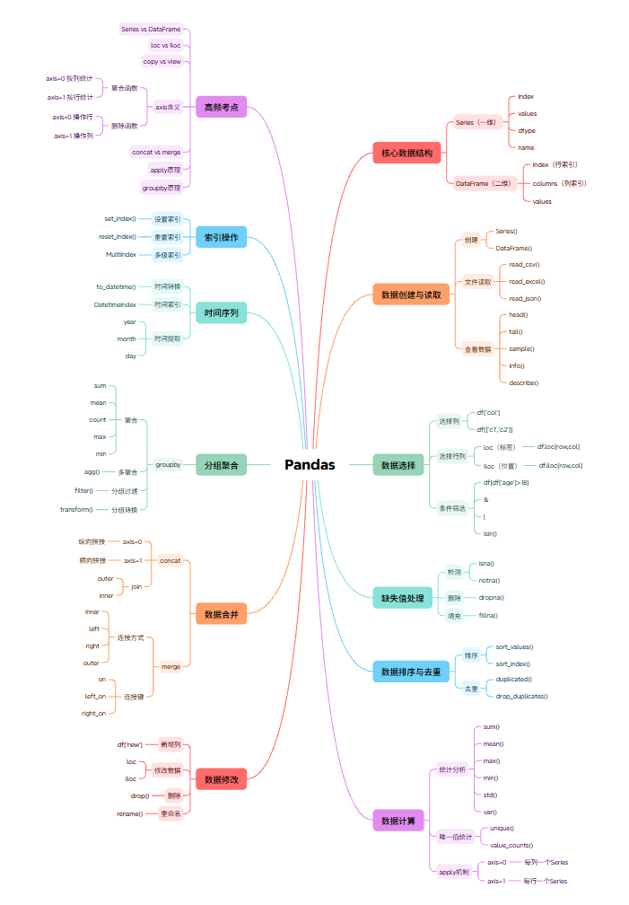

# Pandas - 数据处理与分析

<p align='center'>
	
</p>
## 一、简介

Pandas 是基于 NumPy 构建的 Python 数据分析库，提供了 **Series**（一维）和 **DataFrame**（二维）两种核心数据结构。它兼具 NumPy 高性能数组计算能力以及电子表格和关系数据库（如 SQL）灵活的数据处理功能。

!!! tip "命名由来"
    Pandas 这个名字源于 **Pan**el **Da**ta（面板数据，计量经济学中多维结构化数据集的术语）和 **P**ython **D**ata **A**nalysis（Python 数据分析）。

### 1.1 安装

```bash
pip install pandas
# 可选依赖
pip install openpyxl     # Excel 支持
pip install missingno    # 缺失值可视化
pip install pyarrow      # Feather/Parquet 支持
```

### 1.2 导入约定

```python
import pandas as pd
import numpy as np
```

### 1.3 Pandas 与 Python 类型对照

| Pandas 类型 | Python 类型 | 说明 |
|-------------|-------------|------|
| `object` | `string` | 字符串类型 |
| `int64` | `int` | 整型 |
| `float64` | `float` | 浮点型 |
| `datetime64[ns]` | `datetime` | 日期时间类型 |
| `bool` | `bool` | 布尔类型 |
| `category` | — | 分类类型 |

## 二、核心数据结构

### 2.1 Series（一维）

Series 是一个一维的标签化数组对象，可以存储任何数据类型，并通过标签（索引）访问元素。

#### 创建 Series

```python
s = pd.Series([4, 7, -5, 3]) # 通过数组
# 0    4
# 1    7
# 2   -5
# 3    3
# dtype: int64
```

```python
s = pd.Series([4, 7, -5, 3], index=['a', 'b', 'c', 'd']) # 指定标签
```

```python
# 指定 series 的名称，可以通过 s.name 获取
s = pd.Series([4, 7, -5, 3], index=['a', 'b', 'c', 'd'], name='my_series')
```

```python
# 通过字典创建，字典的键就是元素对于的标签
s = pd.Series({'a': 4, 'b': 7, 'c': -5, 'd': 3})
```

```python
# 先创建，然后通过 index 选择特定的元素。
s = pd.Series({'a': 4, 'b': 7, 'c': -5, 'd': 3}, index=['a', 'c'], name='filtered')
```

#### 常用属性

| 属性                     | 说明             |
| ---------------------- | -------------- |
| `s.index`              | 索引对象           |
| `s.values`             | 值数组（NumPy 数组）  |
| `s.dtype` / `s.dtypes` | 元素类型           |
| `s.ndim`               | 维度（Series 为 1） |
| `s.shape`              | 形状             |
| `s.size`               | 元素个数           |
| `s.name`               | Series 的名称     |

#### 索引与访问

| 方法 | 说明 |
|------|------|
| `s.loc['a']` | 显式索引，按标签索引 |
| `s.loc['a':'c']` | 显式切片（**包含结束标签**） |
| `s.iloc[0]` | 隐式索引，按位置索引 |
| `s.iloc[0:3]` | 隐式切片（不包含结束位置） |
| `s.at['a']` | 使用标签访问单个元素（比 `loc` 快） |
| `s.iat[3]` | 使用位置访问单个元素（比 `iloc` 快） |

```python
s = pd.Series([11, 22, 33, 44, 55], index=['a', 'b', 'c', 'd', 'e'])
s.loc['c']       # 33
s.loc['b':'d']   # b 22, c 33, d 44（注意包含结束标签）
s.iloc[0]        # 11
s.iloc[0:3]      # 11, 22, 33
s.at['a']        # 11（快速访问）
s.iat[3]         # 44（快速访问）
```

#### 常用方法

| 方法                        | 说明                  |
| ------------------------- | ------------------- |
| `s.head(n)`               | 查看前 n 行（默认 5）       |
| `s.tail(n)`               | 查看后 n 行（默认 5）       |
| `s.describe()`            | 常见统计信息              |
| `s.value_counts()`        | 每个元素的频数统计           |
| `s.count()`               | 非缺失值元素个数            |
| `s.isin([1,2])`           | 元素是否在参数集合中          |
| `s.isna()` / `s.isnull()` | 是否为缺失值              |
| `s.unique()`              | 去重后的数组（返回 NumPy 数组） |
| `s.nunique()`             | 去重后非缺失值元素个数         |
| `s.drop_duplicates()`     | 去重                  |
| `s.sample()`              | 随机采样                |
| `s.replace(22, 'haha')`   | 用指定值替代              |
| `s.sort_index()`          | 按索引排序               |
| `s.sort_values()`         | 按值排序                |
| `s.to_frame()`            | 转换为 DataFrame       |
| `s.equals(other)`         | 判断两个 Series 是否相同    |
| `s.keys()`                | 返回索引对象              |
| `s.items()`               | 获取（索引，值）对           |

#### 统计方法

```python
s.sum()       # 求和
s.mean()      # 平均值
s.min()       # 最小值
s.max()       # 最大值
s.var()       # 方差
s.std()       # 标准差
s.median()    # 中位数
s.mode()      # 众数（可能返回多个值）
s.quantile(0.5)  # 指定位置的分位数
```

!!! note "`quantile()` 插值方法"
    `quantile(q, interpolation='linear')` 的 `interpolation` 参数控制分位数位置不在数据点上时的插值方式，可选 `'linear'`（线性插值，默认）、`'lower'`、`'higher'`、`'midpoint'`、`'nearest'`。

#### 相关性分析

```python
s1 = pd.Series([1, 2, 3])
s2 = pd.Series([3, 2, 1])

s1.corr(s2)   # 相关系数（默认皮尔逊），结果 = -1（完全负相关）
s1.cov(s2)    # 协方差
```

#### 布尔索引

```python
s = pd.Series({'a': -1.2, 'b': 3.5, 'c': 6.8, 'd': 2.9})
bools = s > s.mean()  # 大于平均值的标记为 True
s[bools]
# b    3.5
# c    6.8
```

#### 运算规则

```python
s = pd.Series({'a': 1.2, 'b': 3.5, 'c': 6.8})
s * 10
# a    12.0
# b    35.0
# c    68.0
```

```python
s1 = pd.Series([1, 1, 1, 1])
s2 = pd.Series([2, 2, 2, 2], index=[1, 2, 3, 4])
s1 + s2
# 0    NaN    ← 索引 0 在 s2 中没有
# 1    3.0
# 2    3.0
# 3    3.0
# 4    NaN    ← 索引 4 在 s1 中没有
```

!!! warning "自动对齐"
    Series 之间的运算是**按标签索引自动对齐**的，没有匹配上的索引会用 `NaN` 填充。

---

### 2.2 DataFrame（二维）

DataFrame 是一个表格型的数据结构，含有一组有序的列，每列可以是不同的值类型（数值、字符串、布尔值），既有行索引也有列索引。

#### 创建 DataFrame

```python
# 通过字典创建，字典的键是列名，值是列数据
df = pd.DataFrame({
    'id': [101, 102, 103],
    'name': ['张三', '李四', '王五'],
    'age': [20, 30, 40]
})
```

```python
# 通过字典创建，并指定列顺序和行索引
df = pd.DataFrame(
    data={'age': [20, 30, 40], 'name': ['张三', '李四', '王五']},
    columns=['name', 'age'],         # 指定列顺序
    index=[101, 102, 103]            # 自定义行索引
)
```

```python
# 通过嵌套列表创建，columns 参数指定列名
df = pd.DataFrame([
    ['Alice', 25, 'Beijing'],
    ['Bob', 30, 'Shanghai']
], columns=['name', 'age', 'city'])
```

#### 常用属性

| 属性 | 说明 |
|------|------|
| `df.index` | 行索引 |
| `df.columns` | 列标签 |
| `df.values` | 值数组（NumPy 二维数组） |
| `df.dtypes` | 各列数据类型 |
| `df.ndim` | 维度（DataFrame 为 2） |
| `df.shape` | 形状（行数，列数） |
| `df.size` | 元素总数 |
| `df.T` | 行列转置 |
| `df.empty` | 是否为空 |

#### 索引与访问

| 方法                           | 说明            |
| ---------------------------- | ------------- |
| `df.loc['a']`                | 按行标签索引        |
| `df.loc['a':'c', 'name']`    | 按行列标签切片       |
| `df.loc[:, ['name', 'age']]` | 所有行，指定列       |
| `df.iloc[0]`                 | 按行位置索引        |
| `df.iloc[0:3, 0:2]`          | 按行列位置切片       |
| `df.at['a', 'name']`         | 按行列标签快速访问单个元素 |
| `df.iat[0, 1]`               | 按行列位置快速访问单个元素 |

```python
df = pd.DataFrame(
    {'id': [101, 102, 103], 'name': ['张三', '李四', '王五'], 'age': [20, 30, 40]},
    index=['a', 'b', 'c']
)

df.loc['a':'b']                  # 前两行（包含结束标签）
df.loc[:, ['id', 'name']]        # 所有行的 id 和 name 列
df.iloc[0:2, :]                  # 前两行所有列
df.iloc[0:3, 2]                  # 前三行的第 3 列（age）
df.at['a', 'name']               # '张三'
df.iat[0, 1]                     # '张三'
```

#### 常用方法

| 方法 | 说明 |
|------|------|
| `df.head(n)` | 查看前 n 行（默认 5） |
| `df.tail(n)` | 查看后 n 行（默认 5） |
| `df.describe()` | 常见统计信息 |
| `df.info()` | 基本信息（列名、非空数、类型） |
| `df.isin([1,2])` | 元素是否在参数集合中 |
| `df.isna()` / `df.isnull()` | 是否为缺失值 |
| `df.count()` | 每列非空元素个数 |
| `df.value_counts()` | 每行唯一组合的频数 |
| `df.drop_duplicates()` | 去重 |
| `df.sample()` | 随机采样 |
| `df.replace(20, 'haha')` | 用指定值替代 |
| `df.equals(other)` | 判断两个 DataFrame 是否相同 |
| `df.nlargest(n, 'col')` | 返回某列最大的 n 行 |
| `df.nsmallest(n, 'col')` | 返回某列最小的 n 行 |

#### 累积与差分

```python
df = pd.DataFrame({'A': [2, 5, 3, 7, 4], 'B': [1, 6, 2, 8, 3]})

df.cummax(axis='index')   # 按列方向累计最大值
df.cummax(axis='columns') # 按行方向累计最大值
df.cummin()               # 累计最小值
df.cumsum()               # 累计和
df.cumprod()              # 累计积
df.diff()                 # 一阶差分（当前值 - 前一个值）
```

#### DataFrame 的更改操作

```python
df = pd.DataFrame({'age': [20, 30, 40], 'name': ['张三', '李四', '王五'], 'id': [101, 102, 103]})
df.set_index('id', inplace=True)     # 将 id 列设为行索引
df.reset_index(inplace=True)         # 重置为默认索引
```

```python
df = pd.DataFrame({'age': [20, 30], 'name': ['张三', '李四']})

# rename 方法
df.rename(index={0: 'a', 1: 'b'}, columns={'age': '年龄', 'name': '姓名'}, inplace=True)

# 直接覆盖
df.index = ['Ⅰ', 'Ⅱ']
df.columns = ['年齡', '名稱']
```

```python
# 添加列
df['phone'] = ['13333333333', '14444444444']

# 删除列
df.drop('phone', axis=1, inplace=True)
del df['phone']

# 插入列（指定位置）
df.insert(loc=0, column='phone', value=['133', '144'])
```

#### 布尔索引

```python
df = pd.DataFrame(
    {'age': [20, 30, 40, 10], 'name': ['张三', '李四', '王五', '赵六']},
    index=[101, 104, 103, 102]
)
df[df['age'] > 25]
#      name  age
# 104   李四   30
# 103   王五   40
```

#### DataFrame 运算规则

```python
df = pd.DataFrame({'age': [20, 30, 40], 'name': ['张三', '李四', '王五']})
df * 2
#      name  age
# 0  张三张三   40
# 1  李四李四   60
# 2  王五王五   80
# 注意：字符串也会被重复
```

```python
df1 = pd.DataFrame({'age': [10, 20, 30], 'name': ['张三', '李四', '王五']}, index=[1, 2, 3])
df2 = pd.DataFrame({'age': [10, 20, 30], 'name': ['张三', '李四', '田七']}, index=[2, 3, 4])
df1 + df2
#      name   age
# 1    NaN   NaN     ← 索引 1 只在 df1
# 2  张三李四  30.0
# 3  王五李四  50.0
# 4    NaN   NaN     ← 索引 4 只在 df2
# 注意：字符串拼接，缺失 NaN
```

!!! warning "自动对齐"
    DataFrame 运算同样按**标签索引自动对齐**，对齐不上的位置用 `NaN` 填充。

---

## 三、数据读取与写入

### 3.1 读取数据

```python
df = pd.read_csv('data.csv')
df = pd.read_csv('data.csv', encoding='utf-8')
df = pd.read_csv('data.csv', sep='\t')              # TSV
df = pd.read_csv('data.csv', header=None)            # 无表头
df = pd.read_csv('data.csv', nrows=100)              # 只读前 100 行
df = pd.read_csv('data.csv', index_col='id')         # 指定行索引列
df = pd.read_csv('data.csv', parse_dates=['date'])   # 自动解析日期
```

```python
df = pd.read_excel('data.xlsx')
df = pd.read_excel('data.xlsx', sheet_name='Sheet2')
```

```python
df = pd.read_json('data.json')
df = pd.read_json('data.json', orient='records')

df = pd.read_html('https://example.com/table.html')  # HTML 表格（返回 list）
df = pd.read_parquet('data.parquet')
df = pd.read_feather('data.feather')
df = pd.read_pickle('data.pkl')

import sqlite3
conn = sqlite3.connect('database.db')
df = pd.read_sql('SELECT * FROM table', conn)
```

### 3.2 写入数据

```python
df.to_csv('output.csv', index=False)
df.to_csv('output.csv', encoding='utf-8-sig')   # Excel 兼容中文
df.to_csv('output.tsv', sep='\t')               # 自定义分隔符
```

```python
df.to_excel('output.xlsx', index=False)

# 多个 sheet
with pd.ExcelWriter('output.xlsx') as writer:
    df1.to_excel(writer, sheet_name='Sheet1')
    df2.to_excel(writer, sheet_name='Sheet2')
```

```python
df.to_json('output.json', orient='records', force_ascii=False)
df.to_pickle('data.pkl')           # Python 专用序列化
df.to_clipboard()                  # 保存到剪贴板
df.to_dict()                       # 转换为字典
df.to_hdf('data.h5', key='df')     # HDF5 格式
df.to_html('data.html')            # HTML 格式
df.to_feather('data.feather')      # Feather 格式（跨语言）

# 写入数据库
df.to_sql('table_name', conn, if_exists='replace', index=False)
```

---

## 四、数据选择与过滤

### 4.1 选择列

```python
# 单列（返回 Series）
df['name']
df.name                          # 简写（列名需为有效标识符）

# 多列（返回 DataFrame）
df[['name', 'age']]

# 选择特定类型列
df.select_dtypes(include='number')
df.select_dtypes(exclude='object')
```

### 4.2 选择行

```python
df.loc[0]                          # 第一行
df.loc[0:2]                        # 前 3 行（loc 包含结束位置）
df.loc[0, 'name']                  # 特定单元格
df.loc[0:2, ['name', 'age']]       # 特定行列
```

```python
df.iloc[0]                         # 第一行
df.iloc[0:3]                       # 前 3 行
df.iloc[0, 0]                      # 第一行第一列
df.iloc[0:3, 0:2]                  # 前 3 行前 2 列
```

```python
df[df['age'] > 25]
df[(df['age'] > 25) & (df['city'] == 'Beijing')]
df[df['name'].isin(['Alice', 'Bob'])]

# query 语法（更简洁）
df.query('age > 25')
df.query('age > 25 and city == "Beijing"')
```

!!! tip "`loc` vs `iloc` 切片行为"
    `df.loc[0:2]` **包含**结束标签 2；`df.iloc[0:2]` **不包含**结束位置 2（标准 Python 切片行为）。

### 4.3 索引操作

```python
# 设置索引
df.set_index('id', inplace=True)

# 重置索引
df.reset_index(inplace=True)
df.reset_index(drop=True)          # 丢弃原索引，不添加为新列

# 修改索引名
df.index.name = 'idx'

# 修改列名
df.rename(columns={'old': 'new'}, inplace=True)
df.columns = ['col1', 'col2', 'col3']
```

---

## 五、数据清洗

### 5.1 缺失值处理

#### 缺失值类型

Pandas 中的缺失值有三种表示方式：

```python
import numpy as np
s = pd.Series([1, np.nan, None, pd.NA])
# 0       1
# 1     NaN
# 2    None
# 3    <NA>
s.isnull().all()   # True，它们都被视为缺失值
```

| 类型 | 说明 |
|------|------|
| `np.nan` | NumPy 浮点 NaN，**任何值与自身比较都为 False** |
| `None` | Python 空对象，会被自动转换为 `np.nan` |
| `pd.NA` | Pandas 内置缺失值标记，语义更丰富 |

#### 加载数据时处理缺失值

```python
# keep_default_na：默认将空白值视为 NaN
df = pd.read_csv('data.csv', keep_default_na=False)

# na_values：将指定值视为缺失值
df = pd.read_csv('data.csv', na_values=['N/A', 'NULL', 'Unknown'])
```

#### 检查缺失值

```python
df.isnull().sum()              # 每列缺失数量
df.isnull().any()              # 每列是否有缺失
df.isnull().sum().sum()        # 总缺失数量

# missingno 可视化缺失值（需安装）
import missingno as msno
msno.bar(df)                   # 条形图展示每列缺失数量
msno.heatmap(df)               # 热力图展示缺失相关性
msno.matrix(df)                # 矩阵图展示缺失分布
```

#### 剔除缺失值

```python
df.dropna()                    # 删除含缺失值的行
df.dropna(axis=1)              # 删除含缺失值的列
df.dropna(how='all')           # 只删除全为 NaN 的行
df.dropna(thresh=2)            # 保留至少有 2 个非空值的行
df.dropna(subset=['age'])      # 只考虑 age 列
```

#### 填充缺失值

```python
df.fillna(0)
df.fillna({'age': 0, 'name': 'Unknown'})    # 不同列不同值
```

```python
# 用该列均值填充
df['age'] = df['age'].fillna(df['age'].mean())

# 对所有数值列用均值填充
df.fillna(df.mean(numeric_only=True))
```

```python
df.fillna(method='ffill')       # 前向填充（用上一个有效值）
df.fillna(method='bfill')       # 后向填充（用下一个有效值）
df.ffill()                      # 等价前向填充
df.bfill()                      # 等价后向填充
```

```python
# 线性插值
df.interpolate()

# 方法参数
df.interpolate(method='linear')        # 线性插值（默认）
df.interpolate(method='time')          # 时间序列插值
df.interpolate(method='polynomial', order=2)  # 多项式插值
```

### 5.2 重复值处理

```python
# 检查重复
df.duplicated().sum()              # 重复行数
df.duplicated(subset=['name'])     # 特定列重复

# 删除重复
df.drop_duplicates()
df.drop_duplicates(subset=['name'])
df.drop_duplicates(keep='last')    # 保留最后一个重复值
df.drop_duplicates(keep=False)     # 删除所有重复值
```

### 5.3 数据类型转换

```python
# 查看数据类型
df.dtypes

# 转换类型
df['age'] = df['age'].astype(int)
df['date'] = pd.to_datetime(df['date'])
df['price'] = pd.to_numeric(df['price'], errors='coerce')

# 分类类型（节省内存）
df['city'] = df['city'].astype('category')
```

### 5.4 字符串处理

```python
# 通过 .str 访问器
df['name'].str.lower()
df['name'].str.upper()
df['name'].str.strip()
df['name'].str.replace('a', 'b')
df['name'].str.contains('li', case=False)
df['name'].str.startswith('A')
df['name'].str.split(' ')

# 正则表达式
df['text'].str.extract(r'(\d+)')
df['text'].str.findall(r'\d+')
```

---

## 六、apply 函数与向量化

### 6.1 Series.apply

```python
s = pd.Series([10, 20, 30])
s.apply(lambda x: x * 20)
```

```python
def func(item, p1):
    return item * p1
s.apply(func, p1=3)   # 多余参数通过关键字传入
```

### 6.2 DataFrame.apply

```python
df = pd.DataFrame({'a': [10, 20, 30], 'b': [40, 50, 60]})
df.apply(lambda col: col.sum())
# a     60
# b    150
```

```python
df.apply(lambda row: row['a'] / row['b'], axis=1)
# 0    0.25
# 1    0.40
# 2    0.50
```

### 6.3 向量化函数

当函数无法直接接受 Series 时（例如 `if y == 0` 这种标量比较），可以通过 `np.vectorize` 向量化：

```python
def f(x, y):
    if y == 0:
        return np.nan
    return x / y

f_vec = np.vectorize(f)
f_vec(df['a'], df['b'])   # [0.25  nan  0.5]
```

```python
@np.vectorize
def f(x, y):
    if y == 0:
        return np.nan
    return x / y

f(df['a'], df['b'])        # [0.25  nan  0.5]
```

---

## 七、数据分析与聚合

### 7.1 基本统计

```python
df.mean()                   # 每列均值
df.median()                 # 每列中位数
df.std()                    # 每列标准差
df.var()                    # 每列方差
df.sum()                    # 每列求和
df.count()                  # 每列非空值计数
df.min()                    # 每列最小值
df.max()                    # 每列最大值

df.quantile(0.25)           # 分位数
df.quantile([0.25, 0.5, 0.75])

df.corr()                   # 相关系数矩阵
df.cov()                    # 协方差矩阵
```

### 7.2 分组聚合进阶

#### DataFrameGroupBy 对象

```python
grouped = df.groupby('department_id')
type(grouped)
# <pandas.core.groupby.generic.DataFrameGroupBy>

grouped.groups              # 查看分组结果（字典，键→索引列表）
grouped.get_group(50)       # 获取指定组
```

!!! tip "惰性求值"
    GroupBy 对象**直到调用累计函数才开始计算**，可以将其视为 DataFrame 的集合。

#### 按组迭代

```python
for dept_id, group in df.groupby('department_id'):
    print(f'部门 {dept_id}，数据量 {group.shape}')
```

#### 多字段分组

```python
# 复合索引
result = df.groupby(['department_id', 'job_id'])[['salary']].mean()
print(result.index)  # MultiIndex

# 重置索引
result = df.groupby(['department_id', 'job_id'], as_index=False)[['salary']].mean()
```

#### `agg()` 多统计值

```python
df.groupby('department_id')['salary'].agg(['min', 'median', 'max'])
```

```python
df.groupby('department_id').agg({
    'job_id': 'nunique',
    'commission_pct': 'mean'
})
```

```python
df.groupby('department_id').agg(
    job_id=('job_id', 'nunique'),
    avg_commission=('commission_pct', 'mean')
)
```

```python
def first_letter(x):
    return {i[0] for i in x}

df.groupby('department_id')['last_name'].agg(first_letter)
```

#### `cut()` 分箱

```python
# 等宽分箱（3 个区间）
pd.cut(df['salary'], 3)

# 自定义分箱边界
pd.cut(df['salary'], [0, 10000, 20000])

# 加上标签
pd.cut(df['salary'], 3, labels=['low', 'medium', 'high'])
```

### 7.3 分组转换（transform）

`transform()` 返回与原始数据**形状相同**的结果（聚合返回的是缩减结果）：

```python
# 每个数据减去该组的均值
df.groupby('department_id')['salary'].transform(lambda x: x - x.mean())

# 用组均值填充缺失值
df.groupby('department_id')['salary'].transform(
    lambda x: x.fillna(x.mean())
)
```

### 7.4 分组过滤（filter）

`filter()` 根据分组属性丢弃整组数据：

```python
# 只保留 commission_pct 全都不为空的分组
df.groupby('department_id').filter(
    lambda x: x['commission_pct'].notnull().all()
)

# 只保留员工数超过 5 的部门
df.groupby('department_id').filter(
    lambda x: len(x) > 5
)
```

### 7.5 数据透视表

`pivot_table()` 是 Excel 透视表的 Python 实现。

#### 参数说明

| 参数 | 说明 |
|------|------|
| `values` | 待聚合的列 |
| `index` | 透视表行索引 |
| `columns` | 透视表列索引（可选） |
| `aggfunc` | 聚合函数（默认 `mean`） |
| `fill_value` | 替换缺失值 |
| `margins` | 是否添加汇总行/列（总计） |
| `dropna` | 是否排除含缺失值的行列 |

```python
pd.pivot_table(df, values='age', index='city', columns='gender', aggfunc='mean')
```

```python
pd.pivot_table(df,
    values=['age', 'salary'],
    index='city',
    columns='gender',
    aggfunc={'age': 'mean', 'salary': 'sum'})
```

```python
pd.pivot_table(df,
    values='age',
    index='city',
    columns='gender',
    aggfunc='mean',
    margins=True)           # 添加 Total 行和列
```

```python
pd.crosstab(df['city'], df['gender'])
```

---

## 八、数据变换

### 8.1 排序

```python
# 按值排序
df.sort_values('age')
df.sort_values(['city', 'age'], ascending=[True, False])

# 按索引排序
df.sort_index()
df.sort_index(axis=1)          # 按列名排序

# 取前 N 最大/最小值
df.nlargest(10, 'salary')
df.nsmallest(3, 'age')
```

### 8.2 数据映射

```python
df['gender'] = df['gender'].map({'M': 'Male', 'F': 'Female'})
```

```python
df['age'].apply(lambda x: x + 1)
df.apply(pd.to_numeric, errors='coerce')
```

```python
df.applymap(str)   # 所有元素转为字符串（已弃用，推荐用 map)
```

### 8.3 合并数据

```
# 函数签名
pd.concat(objs, axis=0, join='outer', ignore_index=False)

```

| 参数             | 说明                                       |
| -------------- | ---------------------------------------- |
| `objs`         | 要拼接的 DataFrame 列表                        |
| `axis`         | 0 → 垂直拼接（行增加）1 → 水平拼接（列增加）               |
| `join`         | 控制列对齐方式，默认 `'outer'`（取并集），`'inner'`（取交集） |
| `ignore_index` | 是否重置行索引，默认 False（保持原索引）                  |

```python
pd.concat([df1, df2])                  # 垂直拼接
pd.concat([df1, df2], axis=1)          # 水平拼接
pd.concat([df1, df2], ignore_index=True)
pd.concat([df1, df2], join='inner')    # 只保留共有列
```

```python
pd.merge(df1, df2, on='id')                           # inner join
pd.merge(df1, df2, on='id', how='left')               # left join
pd.merge(df1, df2, on='id', how='right')              # right join
pd.merge(df1, df2, on='id', how='outer')              # full outer join

# 不同列名
pd.merge(df1, df2, left_on='employee', right_on='name')

# 处理重名列
pd.merge(df1, df2, on='id', suffixes=('_left', '_right'))
```

```python
df1.join(df2, lsuffix='_left', rsuffix='_right')
```

#### 连接类型对比

| 参数 `how` | 说明 |
|------------|------|
| `'inner'` （默认） | 取两个表的**交集**键 |
| `'outer'` | 取两个表的**并集**键，缺失用 NaN 填充 |
| `'left'` | 以左表键为准 |
| `'right'` | 以右表键为准 |

---

## 九、时间序列

时间序列（Time Series）是指按时间顺序排列的数据点序列，例如股票每日收盘价、某地区逐日气温、网站每小时的访问量等。Pandas 对时间序列处理提供了非常完善的支持，核心围绕三种时间类型展开。

### 9.1 Python datetime 基础

Python 标准库 `datetime` 提供了最基础的日期时间处理能力，它是 Pandas 时间功能的底层基石。

```python
from datetime import datetime

# 创建指定日期时间
dt = datetime(year=2000, month=1, day=1)
dt_now = datetime.now()

# 提取日期各部分
dt.year       # 2000
dt.month      # 1
dt.day        # 1
dt.weekday()  # 5（星期六，0=星期一）
dt.strftime('%A')   # 'Saturday'（格式化为星期全名）
```

`datetime` 的局限性：无法直接处理批量的日期数据（比如一整个日期列），也无法进行时间频率的转换和重采样，这些正是 Pandas 要解决的问题。

### 9.2 Pandas 三种时间类型

处理时间序列数据时，我们会遇到三类基本的时间概念，Pandas 为每一类都提供了专门的数据类型：

| 概念           | 生活中的例子             | Pandas 类型   | 对应的索引            |
| ------------ | ------------------ | ----------- | ---------------- |
| **时间点（时刻）**  | "2024年3月15日 14:30" | `Timestamp` | `DatetimeIndex`  |
| **时间周期（时段）** | "2024年3月"、"2024Q1" | `Period`    | `PeriodIndex`    |
| **时间差（时长）**  | "3天5小时"、"持续了2天"    | `Timedelta` | `TimedeltaIndex` |

#### 时间点（Timestamp）

`Timestamp` 是 Pandas 中最常用的时间类型，可以把它看作是 Python `datetime` 的增强版——它底层基于 NumPy 的 `datetime64`，性能更高，且与 Pandas 的 DataFrame/Series 无缝集成。

```python
# 创建单个时间戳
pd.Timestamp('2015-01-01 09:08:07')
# Timestamp('2015-01-01 09:08:07')

# 提取各属性（与 datetime 一致）
t = pd.Timestamp('2015-01-01 09:08:07.123456')
t.year          # 2015
t.month         # 1
t.day           # 1
t.hour          # 9
t.minute        # 8
t.second        # 7
t.microsecond   # 123456
```

#### 时间周期（Period）

`Period` 表示的是一段连续的**时间区间**（时段），而不是某个瞬间。例如 "2024年1月" 代表从 1月1日 到 1月31日 整个时间段，"2024Q1" 代表第一季度。

```python
# 创建月度周期
p = pd.Period('2024-01', freq='M')
# Period('2024-01', 'M')

# 季度周期
q = pd.Period('2024Q1', freq='Q')
# Period('2024Q1', 'Q')
```

#### 时间差（Timedelta）

`Timedelta` 表示两个时间点之间的差值（持续时间），底层基于 NumPy 的 `timedelta64`。

```python
# 两个时间戳相减得到时间差
pd.Timestamp('2024-03-15') - pd.Timestamp('2024-03-10')
# Timedelta('5 days')
```

这三个类型之间的关系可以这样理解：

> **时间点 + 时间差 = 新的时间点**（12:00 + 2小时 = 14:00）
> **时间点 - 时间点 = 时间差**（14:00 - 12:00 = 2小时）
> **时间点.to_period() = 时间周期**（2024-03-15 → 2024-03）

### 9.3 日期转换

实际数据中的日期通常是字符串格式（如 `'2024-01-15'`），需要先转换为 Pandas 的日期类型才能进行时间序列操作。

#### `to_datetime()` — 万能日期解析器

```python
# 单个字符串 → Timestamp
pd.to_datetime('2015-01-01')
# Timestamp('2015-01-01 00:00:00')

# 多种日期格式混合解析
pd.to_datetime(['4th of July, 2015', '2015-Jul-06', '07-07-2015'], format='mixed')
# DatetimeIndex(['2015-07-04', '2015-07-06', '2015-07-07'])
```

#### 读取数据时解析日期

```python
# 方式一：加载时通过 parse_dates 参数指定日期列
df = pd.read_csv('data/weather.csv', parse_dates=['date'])

# 方式二：加载后手动转换
df['date'] = pd.to_datetime(df['date'])

# 查看转换后的数据类型（注意与 Python str 的区别）
df['date'].dtype
# dtype('<M8[ns]')  即 datetime64[ns]
```

#### 提取日期各组成部分 — `dt` 访问器

对于 Series 中的日期数据，需要通过 `.dt` 这个"访问器"才能获取年、月、日等属性（类似字符串的 `.str` 访问器）：

```python
df['date'] = pd.to_datetime(df['date'])

# .dt 访问器：对 Series 中的每个日期提取属性
df['year']    = df['date'].dt.year       # 年份
df['month']   = df['date'].dt.month      # 月份（1-12）
df['day']     = df['date'].dt.day        # 日期（1-31）
df['quarter'] = df['date'].dt.quarter    # 季度（1-4）
df['week']    = df['date'].dt.isocalendar().week  # 第几周
df['weekday'] = df['date'].dt.day_name() # 星期名（Monday, Tuesday...）
df['month_end'] = df['date'].dt.is_month_end  # 是否月末
df['year_end']  = df['date'].dt.is_year_end   # 是否年末
```

#### 时间点 → 时间周期 — `to_period()`

有时我们不需要精确到某一天，而是想知道数据落在哪个时间段（哪个月、哪个季度），这时可以用 `to_period()` 进行"降精度"转换：

```python
# 将时间点转换为所属的时间周期
df['date'].dt.to_period('M')    # 2024-01（属于1月）
df['date'].dt.to_period('Q')    # 2024Q1（属于第一季度）
df['date'].dt.to_period('Y')    # 2024   （属于2024年）
```

应用场景：按月份分组聚合时，将日期列转为 Period 后作为分组键。

#### 时间差计算

两个时间点相减，结果是一个 `Timedelta` 序列：

```python
# 计算每个日期距离基准日期的天数
delta = pd.to_datetime(df['date']) - pd.Timestamp('2012-01-01')
# 0       0 days
# 1       1 days
# 2       2 days
# dtype: timedelta64[ns]
```

### 9.4 时间索引

时间序列分析中最常见的操作就是把日期列设为行索引。一旦索引是 `DatetimeIndex`，就可以直接使用"日期字符串"进行切片，非常直观。

#### 将日期设为索引

```python
df = pd.read_csv('data/weather.csv', parse_dates=['date'])
df.set_index('date', inplace=True)
df.info()
# DatetimeIndex: 1461 entries, 2012-01-01 to 2015-12-31
```

#### 时间索引切片

设为索引后，就可以用各种"人类可读"的日期字符串来选取数据：

```python
# 按年选取
df.loc['2013']                    # 2013 年全部 365 条数据

# 按年月选取（起止范围）
df.loc['2013-01':'2013-06']       # 2013 年 1~6 月

# 按具体日期选取
df.loc['2013-01-01':'2013-01-07'] # 2013 年第一周

# 按时间段筛选（仅对 DatetimeIndex 有效）
# df.between_time('09:00', '11:00')  # 9:00~11:00 之间的数据
# df.at_time('03:33')                # 正好 3:33 的数据
```

### 9.5 生成时间序列 `date_range()`

手动录入一整个日期序列很麻烦，`date_range()` 可以按指定频率自动生成：

```python
# 方式一：指定起止日期（默认按天生成）
pd.date_range('2015-07-03', '2015-07-10')
# DatetimeIndex(['2015-07-03', ..., '2015-07-10'], freq='D')

# 方式二：指定开始日期和持续天数
pd.date_range('2015-07-03', periods=5)
# DatetimeIndex(['2015-07-03', ..., '2015-07-07'], freq='D')

# 方式三：通过 freq 指定间隔频率
pd.date_range('2015-07-03', periods=5, freq='h')        # 每小时
pd.date_range('2015-07-03', periods=3, freq='2h30min')  # 每 2.5 小时
pd.date_range('2015-07-03', periods=4, freq='ME')        # 每月末
pd.date_range('2015-07-03', periods=4, freq='QE')        # 每季度末
```

### 9.6 时间频率代码

`freq` 参数使用特定的代码来表示时间频率，这是 Pandas 时间序列的核心概念：

| 代码 | 说明 | 代码 | 说明 |
|------|------|------|------|
| `D` | 每日（含周末） | `B` | 仅工作日 |
| `W` | 每周 | `h` | 每小时 |
| `ME` / `M` | 月末 | `BME` | 月末工作日 |
| `MS` | 月初 | `BMS` | 月初工作日 |
| `QE` / `Q` | 季末 | `BQE` | 季末工作日 |
| `QS` | 季初 | `BQS` | 季初工作日 |
| `YE` / `Y` | 年末 | `BYE` | 年末工作日 |
| `YS` | 年初 | `BYS` | 年初工作日 |

频率代码前面可以加数字表示倍数，例如 `2h`（每2小时）、`3D`（每3天）。

#### 偏移量（锚点偏移）

有些业务场景中，财年可能不是1月结束，或者一周从周三开始。这时可以在频率代码后加上月份/星期缩写来**改变锚点**：

```python
# 以1月为季度末（适合财年从2月开始的情况）
pd.date_range('2015-07-03', periods=4, freq='QE-JAN')
# 2015-07-31, 2015-10-31, 2016-01-31, 2016-04-30

# 以6月为年末（适合财年从7月开始的情况）
pd.date_range('2015-07-03', periods=4, freq='YE-JUN')
# 2016-06-30, 2017-06-30, ...

# 以周三为一周开始
pd.date_range('2015-07-03', periods=4, freq='W-WED')
# 2015-07-08, 2015-07-15, ...（每个周三）
```

### 9.7 重新采样 `resample()`

`resample()` 是时间序列分析中最常用的操作之一。它做的事情和 `groupby()` 类似——将数据按**时间周期**分组，然后进行聚合。

#### 为什么需要 resample？

假设你有一份**逐日**的天气数据，但你想看**每月**的平均温度。这时就需要把"日频"数据变为"月频"数据，这就是**降采样**。反之，如果你有**季度**数据但想填充到**月**，就是**升采样**。

```python
# 先确保日期是索引
df = pd.read_csv('data/weather.csv', parse_dates=['date'])
df.set_index('date', inplace=True)

# ===== 降采样：高频 → 低频（数据量减少） =====
df.resample('YE').mean()         # 按年计算均值（365条→1条）
df.resample('QE').max()          # 按季度取最大值（90条→1条）
df.resample('ME').sum()          # 按月求和
df.resample('W').min()           # 按周取最小值

# 多个聚合函数一起用
df.resample('YE')[['temp_max', 'temp_min']].agg(['mean', 'max', 'min'])

# ===== 升采样：低频 → 高频（数据量增加） =====
# 升采样会产生缺失值，需要填充
df.resample('D').ffill()         # 按天填充（用前一个值填充）
df.resample('h').interpolate()   # 按小时填充（线性插值）
```

### 9.8 滚动窗口

滚动窗口计算（Rolling Window）是时间序列分析中常用的平滑方法。它会在数据上"滑动"一个固定大小的窗口，对每个窗口内的数据计算统计值。

```python
# 7 天移动平均（最常用的平滑方法，可以消除短期波动）
df['temp_ma7'] = df['temp_max'].rolling(window=7).mean()

# 14 天滚动标准差（衡量波动性）
df['temp_std14'] = df['temp_max'].rolling(window=14).std()

# 30 天滚动最大值
df['temp_max30'] = df['temp_max'].rolling(window=30).max()
```

### 9.9 时间偏移

`shift()` 可以将整列数据向前或向后移动，常用于计算**环比变化**、**前一天数据**等场景。

```python
# shift：整体移动数据
df['前一天温度'] = df['temp_max'].shift(1)   # 向后移1行
df['后一天温度'] = df['temp_max'].shift(-1)  # 向前移1行

# diff：一阶差分（当天 - 前一天），等价于 df - df.shift(1)
df['温度变化'] = df['temp_max'].diff()

# pct_change：百分比变化（常用于金融数据）
df['收益率'] = df['temp_max'].pct_change()
```

---

## 十、数据分析案例

### 10.1 天气数据分析

使用 weather 数据集，包含字段：`date`、`precipitation`、`temp_max`、`temp_min`、`wind`、`weather`。

```python
import pandas as pd

df = pd.read_csv('data/weather.csv', parse_dates=['date'])

# 查看数据概况
df.info()
df.describe()

# 按月统计平均最高/最低温度
monthly_temp = (
    df.set_index('date')
    .resample('ME')[['temp_max', 'temp_min']]
    .mean()
)
monthly_temp.plot()

# 找到每年最高温日期
df['year'] = df['date'].dt.year
df.sort_values(['year', 'temp_max'], ascending=[True, False]) \
  .drop_duplicates('year')[['date', 'temp_max']]

# 统计不同天气状况
df['weather'].value_counts()
```

### 10.2 员工数据分析

```python
df = pd.read_csv('data/employees.csv')

# 薪资最高/最低的员工
df.loc[df['salary'] == df['salary'].min()]
df.loc[df['salary'] == df['salary'].max()]

# 薪资最高的 10 名员工
df.nlargest(10, 'salary')

# 每个部门的员工数
df.groupby('department_id')['employee_id'].count().rename('员工数')

# 每个部门的平均薪资
df.groupby('department_id')['salary'].mean().nlargest(5)

# 薪资分布
df['salary'].describe()

# 按部门统计工种种类数和佣金比例平均值
df.groupby('department_id').agg({
    'job_id': 'nunique',
    'commission_pct': 'mean'
}).rename(columns={'job_id': '工种数', 'commission_pct': '佣金比例'})
```

### 10.3 睡眠质量透视分析

```python
df = pd.read_csv('data/sleep.csv')

# 将睡眠时长分箱
sleep_bins = pd.cut(df['sleep_duration'], [0, 5, 6, 7, 8, 9, 10, 11, 12])
stress_bins = pd.cut(df['stress_level'], 4)

# 透视表：不同睡眠时长和压力等级下的平均睡眠质量
pivot = pd.pivot_table(
    df,
    values='sleep_quality',
    index=[sleep_bins, stress_bins],
    columns='occupation',
    aggfunc='mean'
)
print(pivot)
```

---

## 参考资料

- [Pandas 官方文档](https://pandas.pydata.org/docs/)
- [Pandas API 参考](https://pandas.pydata.org/docs/reference/index.html)
- [Pandas 10分钟入门](https://pandas.pydata.org/docs/user_guide/10min.html)
- [Pandas Cookbook](https://pandas.pydata.org/docs/user_guide/cookbook.html)
