## RL 基本概念

强化学习（`reinforcement learning`）讨论的问题是智能体（`agent`）怎么在复杂、不确定的环境（`environment`）中**最大化**它能获得的**奖励**。

>一个智能体，在不断试错中，学习怎样做才能获得更多奖励。

<p align='center' style='zoom:50%'>
	
</p>


如上图，强化学习由两部分组成：**智能体**和**环境**。

- 🤖 **智能体（Agent）**：负责思考和行动，比如机器人、自动驾驶汽车、LLM
- 🌍 **环境（Environment）**：智能体所处的世界，比如游戏、真实道路、数学题、**用户**。

强化学习的过程就是智能体和环境不断交互的过程：Agent 根据当前状态选择动作，Environment 执行动作并返回新状态和奖励，Agent 利用奖励不断调整自己的策略，最终学会在各种状态下做出能够获得长期最大累计奖励的决策。

下图是一个 RL 经典的场景——**倒立摆**，在这个环境中，推车就是 **Agent**，它的输入 State 由推车位置、速度、木杆角度、木杆角速度构成，它能够执行的动作是**向左推**和**向右推**。

<p align='center' style='zoom:50%'>
	
</p>

 **策略**：本质上是一个函数，输入当前状态，输出的实际上是当前采取行动的概率分布，之后和 llm 一样，采取特定的采样策略采样即可：

$$
π(a∣s)=p(a_t​=a∣s_t​=s)
$$

通常，这个 $\pi$ 由于很复杂，所以通常用神经网络来拟合，这也就是深度强化学习。

**轨迹**：**轨迹**（Trajectory）是指智能体在一个完整的回合（Episode）中与环境进行交互的完整记录序列，记作  $τ$ （读作"掏"）。而一个**回合**就是当前环境状态 $S_0$、推车采取动作 $A_0$ ，然后获得奖励 $R_0$，然后转移到下一时间步，直到出发结束条件位置。

$$
\tau = (S_0, A_0, R_0, S_1, A_1, R_1, S_2, A_2, R_2, \dots)
$$

## RL 马尔可夫决策过程 

### 一、为什么需要 MDP

RL 第一节画的是**流程图**——智能体选动作、环境给奖励、再选动作……这个图形象但不严谨。要精确地谈"价值函数"、"最优策略"，必须先把"环境"**形式化**成一个数学对象。

**MDP（Markov Decision Process，马尔可夫决策过程**）就是 RL 的数学底座——所有价值函数、Q-learning、PPO 都站在它上面。一句话：**没有 MDP 这个形式化框架，价值函数根本无从定义**——后面会看到，Bellman 方程里那个 $p(s', r \mid s, a)$ 就是 MDP 五元组里的 $P$。

---

### 二、什么是 MDP

**MDP** 是一个**五元组** $(S, A, P, R, \gamma)$，用来完整描述"环境"：

<p align='center' style='zoom:50%'>
    
</p>

**一句话**：**MDP 是"环境说明书"**——把"游戏规则"完整写在一张纸上。RL 算法的任务，就是在这个说明书上求解最优策略。

---

### 三、马尔可夫性质 ⭐⭐⭐

MDP 最核心、最容易被忽略的假设——**马尔可夫性质（Markov Property）**：

$$
p(s_{t+1} \mid s_t, a_t, s_{t-1}, a_{t-1}, \dots) = p(s_{t+1} \mid s_t, a_t)
$$

读法：**下一状态只取决于"当前" $(s_t, a_t)$，跟"历史"无关**。

#### 3.1 直觉：现在足够决定未来

- **正例（满足马尔可夫）**：围棋——给定当前棋盘布局，棋局怎么发展跟之前怎么下的无关；倒立摆——给定当前 $(位置, 速度, 角度, 角速度)$，下一时刻的物理状态由牛顿力学唯一决定
- **反例（不严格满足）**：自动驾驶——只看"当前车速"判断安全不够，需要"过去 5 秒的速度变化"；扑克牌——需要记住出牌历史

为什么是"反例"：因为只给"当前状态"无法预测未来——马尔可夫性质不成立。

!!! tip "现实世界怎么办"
    现实问题**严格来说几乎都不满足马尔可夫性**。处理办法是**把状态定义得"足够丰富"**——把历史信息塞进状态里。比如把"过去 5 帧画面"打包成当前状态。

    如果实在塞不下（比如智能体只能看到部分信息），那就要用 **POMDP（Partially Observable MDP，部分可观察 MDP）**——那是更复杂的扩展，这里不展开。

#### 3.2 为什么必须有这个假设

简短回答：**没有它，"状态转移概率 $p$"这个概念都不存在**。

- 想象一下：如果 $s_{t+1}$ 还跟 $s_{t-1}$ 有关，那"在 $(s_t, a_t)$ 之后到 $s_{t+1}$"的**概率**就没法定义——因为答案取决于"再往前看多少"
- 没有 $p$，**价值函数的定义就不唯一**——同一个 $s$ 因为历史不同可能价值不同，那 $V(s)$ 没法写成只以 $s$ 为条件的函数

所以马尔可夫性质是**整个价值函数理论的承重墙**。这一点在 Sutton 教科书里讲得很重，但很多人学 RL 时直接跳过去了。

---

### 四、状态转移概率 P ⭐⭐⭐

**$P$ 是 MDP 最核心的数学对象**——它编码了"环境动力学"，是 RL 算法试图理解（或绕过）的对象。

#### 4.1 标准形式

$$
p(s', r \mid s, a) = \Pr\{S_{t+1} = s', R_{t+1} = r \mid S_t = s, A_t = a\}
$$

- 输入：当前 $(s, a)$
- 输出：下一时刻 $(s', r)$ 的**联合**概率

#### 4.2 为什么 $p$ 联合写 $(s', r)$ 而不是只写 $s'$

奖励 $R_{t+1}$ 通常跟 $s'$ 强相关（比如到达终点 $s'$ 一定拿 +1）。强行拆成"先 $p(s'|s,a)$ 再 $p(r|s,a,s')$"反而**人为割裂了两者的耦合**。联合写数学上更简洁，也是教科书的标准做法。

#### 4.3 几个有用的派生量

$$
p(s' \mid s, a) = \sum_{r} p(s', r \mid s, a)
$$

（仅状态转移本身，把 $r$ 求和掉）

$$
r(s, a) = \mathbb{E}[R_{t+1} \mid s, a] = \sum_{s', r} r \cdot p(s', r \mid s, a)
$$

（期望奖励——经常作为 MDP 的"简化奖励"使用）

> 后续价值函数章节中所有 $p(s', r \mid s, a)$ 都指这个量。

---

### 五、奖励函数 R

**$R$ 告诉智能体"什么算好、什么算坏"**。常见形式：

- $R(s, a, s')$：在 $s$ 做 $a$ 到 $s'$，拿多少分
- $R(s, a)$：在 $s$ 做 $a$（不考虑结果）
- $R(s)$：仅看状态

在五元组定义里，$R$ 通常通过 $p(s', r \mid s, a)$ 中的 $r$ 体现——拿到哪个 $r$ 是概率事件。

#### 5.1 奖励设计是 RL 的艺术

奖励函数设计错了，智能体会"钻空子"——这就是著名的 **reward hacking**。

经典反例：海岸赛艇游戏（CoastRunners），奖励 = "撞到目标"得分。结果智能体学会**在原地反复撞同一个目标刷分**，不跑完赛道。OpenAI 专门写过一篇博文 [Faulty Reward Functions in the Wild](https://openai.com/index/faulty-reward-functions/) 总结这类问题。

!!! warning "一个工程经验"
    > **奖励函数宁简勿巧**。复杂的奖励 shaping 经常引发意想不到的 exploit 行为，调试成本远高于想象中"加点引导"的好处。

---

### 六、策略 π（5 行回顾）

智能体在 MDP 上**怎么动**完全由策略 $\pi$ 决定。第一节已经讲过，这里做个对齐：

- **确定性策略**：$a = \pi(s)$——状态确定、动作确定
- **随机性策略**：$\pi(a \mid s)$——状态确定、动作是概率分布
- 复杂环境（围棋、LunarLander）下 $\pi$ 通常用神经网络拟合——这就是深度强化学习

> 注：策略的完整定义见 [[07_Reinforcement_Learning#RL 基本概念]]。

---

### 七、MDP 框架下的轨迹

把五元组装起来，一条完整轨迹是：

$$
\tau = (S_0, A_0, R_0, S_1, A_1, R_1, S_2, A_2, R_2, \dots)
$$

每一步的产生机制：

| 元素 | 来源 |
|------|------|
| $S_0$ | 环境初始化 |
| $A_t$ | 智能体按 $\pi(a \mid s)$ 采样 |
| $S_{t+1}, R_{t+1}$ | 环境按 $p(s', r \mid s, a)$ 采样 |

**一条轨迹的联合概率**可以写成：

$$
p(\tau) = p(s_0) \prod_{t=0}^{T-1} \pi(a_t \mid s_t) \cdot p(s_{t+1}, r_{t+1} \mid s_t, a_t)
$$

> 第一项 $p(s_0)$ 来自环境，后两项乘积**正好就是"智能体 × 环境"**——这就是 RL 的全部故事。

---

### 八、MDP 的求解目标

给一个 MDP $(S, A, P, R, \gamma)$，**RL 的任务**是求**最优策略** $\pi^*$，使得：

$$
\pi^* = \arg\max_\pi \mathbb{E}_\tau \left[ \sum_{t=0}^{\infty} \gamma^t R_t \right]
$$

但这里有个根本问题：**怎么评估"策略有多好"？** 总不能跑一万次看平均奖励——既不高效也不通用。

这就是**价值函数**登场的理由：**用数学的方式直接评估一个策略**。下一节就讲这个。

---

### 九、MDP 和 RL 的关系

最后澄清一个常见的混淆：

| 维度 | MDP | RL |
|------|-----|-----|
| 本质 | **问题的数学模型** | **求解 MDP 的方法学** |
| 假设 | $P$ 和 $R$ **已知** | $P$ 和 $R$ **未知**（或部分未知） |
| 求解 | 规划算法（值迭代、策略迭代） | 通过与环境交互"试错"学习 |
| 经典工具 | 动态规划 | Q-learning、Policy Gradient |

**两个范式**：

- **Model-based RL**：先学/已知 $P$ 和 $R$，再用规划算法求最优。样本效率高，但建模不准会引入误差
- **Model-free RL**：不管 $P$、$R$ 是什么，直接学策略/价值（Q-learning、PPO、REINFORCE）。简单粗暴，但样本效率低

!!! note "一句话总结"
    > **MDP 告诉你"环境长什么样"，RL 告诉你"在不知道环境长什么样的情况下怎么玩"**。
    > 所有价值函数、Q-learning、PPO 都是"在 MDP 框架下、Model-free 地逼近最优策略"。

---

## RL 价值函数 ⭐⭐⭐

### 一、为什么需要价值函数

价值函数要回答的核心问题是：**给定一个策略，怎么算它"有多好"？**

更具体一点：智能体站在状态 $s$，每一步拿到的奖励 $R_t$ 只是"眼前的蝇头小利"，**它不能直接告诉智能体"在状态 $s$ 我该不该行动"、"在状态 $s$ 该做哪个动作 $a$"**。

于是需要一个东西来**算账**——把"未来能拿到的总奖励"做一个期望估计，**压缩成一个数字**，写在状态/动作头上。这个东西就是**价值函数（Value Function）**。

<p align='center' style='zoom:100%'>
	
</p>
---

### 二、状态价值函数 V_π(s) 

**状态价值函数**（`state-value function`）$V_\pi(s)$ 定义为：在策略 $\pi$ 下，从状态 $s$ 出发所能获得的**期望回报**（expected return）。

<p align='center' style='zoom:100%'>
	
</p>

$$
V_\pi(s) = \mathbb{E}_\pi\left[ G_t \mid s_t = s \right] = \mathbb{E}_\pi\left[ \sum_{k=0}^{\infty} \gamma^k R_{t+k} \mid s_t = s \right]
$$

其中：

- $G_t$ 叫**回报（return）**，是带折扣的累计奖励
- $\gamma \in [0, 1)$ 是**折扣因子（discount factor）**，衡量"现在 vs 未来"的权重
- $\mathbb{E}_\pi[\cdot]$ 表示"在策略 $\pi$ 下求期望"

#### 2.1 为什么需要折扣因子 $\gamma$
<p align='center' style='zoom:100%'>
	
</p>
三个作用：

1. **数学上**：保证无穷时间步下的累计奖励有限（几何级数收敛）
2. **直观上**：眼前的奖励 $R_{t+1}$ 比 $R_{t+100}$ 更有"实感"——迟到 100 步的奖励打个折
3. **避免循环**：如果所有奖励都是正数，没有 $\gamma$ 智能体可能"原地打转"刷奖励

$\gamma$ 越接近 1 → 越"有远见"；越接近 0 → 越"短视"。

#### 2.2 直觉：状态也是分"贵贱"的

<p align='center' style='zoom:100%'>
	
</p>

以迷宫游戏为例：

- 终点格 = +1（值 1.0）
- 起点格 ≈ +0.6（要走 4 步才能到终点，每步折扣 0.9）
- 离悬崖越近 ≈ +0.1（随时可能掉下去）
- 悬崖格 ≈ -1（掉下去就 game over）

$V_\pi(s)$ 实质上是**在告诉智能体"站在这个格子，长期来看能拿多少分"**——它是状态空间的"评分卡"。

---

### 三、动作价值函数 Q_π(s,a) 

**动作价值函数**（`action-value function`）$Q_\pi(s, a)$ 定义为：在状态 $s$ 采取动作 $a$ **之后**再按策略 $\pi$ 走，能获得的期望累计回报。

$$
Q_\pi(s, a) = \mathbb{E}_\pi\left[ \sum_{k=0}^{\infty} \gamma^k R_{t+k} \mid s_t = s,\; a_t = a \right]
$$

对比一下：
<p align='center' style='zoom:100%'>
	
</p>


直觉：以围棋为例，$V_\pi(s)$ 告诉你"这个局面值多少"；$Q_\pi(s, a)$ 告诉你"这个局面**下这一手**值多少"——前者是状态评分，后者是动作评分。

!!! tip "为什么 Q 比 V 更重要"
    在很多场景下，**智能体做决策时只能依赖 Q**：因为它没有"环境模型"，不知道 $a$ 之后会到哪个 $s'$。这就是著名的**Model-Free** 设置，也是 Q-learning 这类算法的立足点。

---

### 四、贝尔曼方程（Bellman Equation） 

价值函数最关键的性质是**递归**：当前状态的价值，可以**用下一状态的价值表示**。这个递推关系就是 **Bellman 方程**，是几乎所有 RL 算法的根。

#### 4.1 V 形式的贝尔曼方程

把 $G_t$ 拆成"第一步奖励 + 之后的折扣"：

$$
V_\pi(s) = \sum_a \pi(a \mid s) \sum_{s', r} p(s', r \mid s, a) \left[ r + \gamma V_\pi(s') \right]
$$

读法：$V_\pi(s)$ = 在状态 $s$ 用策略 $\pi$ 选动作 $a$ → 进入 $s'$ 拿立即奖励 $r$ → 加上折扣后的下一状态价值。
#### 4.2 Q 形式的贝尔曼方程

$$
Q_\pi(s, a) = \sum_{s', r} p(s', r \mid s, a) \left[ r + \gamma \sum_{a'} \pi(a' \mid s') Q_\pi(s', a') \right]
$$

#### 4.3 备份图（Backup Diagram）

<p align='center' style='zoom:100%'>
	
</p>

之所以叫"备份图"（backup diagram）：每个圆点（状态）的价值，是**从下一时间步往回"备份"**——综合所有可能的 $(a, s', r)$ 加权求和得到。这张图能解释几乎所有 DP 类和 TD 类算法的"信息流向"。

!!! note "一句话总结 Bellman 方程"
    > **当前价值 = 即时奖励的期望 + 折扣后下一状态价值的期望**。
    > 本质是把"无穷级数求和"用"递推"代替，复杂度直接从 $O(T)$ 降到 $O(1)$ 一步。

---

### 五、V 和 Q 的关系 

<p align='center' style='zoom:100%'>
	
</p>

两个价值函数之间可以互相换算，**记住这两条式子就够用**：

$$
Q_\pi(s, a) = \mathbb{E}\left[ R_{t+1} + \gamma V_\pi(s_{t+1}) \mid s_t = s, a_t = a \right]
$$

$$
V_\pi(s) = \sum_a \pi(a \mid s) \, Q_\pi(s, a)
$$

读法：

- **Q → V**：状态价值是"在状态 $s$ 按策略 $\pi$ 选动作"的期望 Q 值
- **V → Q**：动作价值是"做完动作拿到的奖励 + 折扣后下一状态的价值"

!!! tip "速记法"
    状态不挑动作 → 用 $V$；状态挑了动作 → 用 $Q$。挑不挑动作，**差一条 $\pi(a|s)$**。

---

### 六、最优价值函数 V* 和 Q* 

智能体的终极问题不是"在某个固定策略下值多少"，而是"**最优情况下**能值多少"。

<p align='center' style='zoom:80%'>
	
</p>

#### 6.1 定义

$$
V^*(s) = \max_\pi V_\pi(s)
$$

$$
Q^*(s, a) = \max_\pi Q_\pi(s, a)
$$

- $V^*(s)$：在状态 $s$ 永远做最优决策，能拿到的最大期望回报
- $Q^*(s, a)$：在状态 $s$ 做动作 $a$、之后永远做最优决策，能拿到的最大期望回报

#### 6.2 最优贝尔曼方程（Bellman Optimality Equation）

$$
V^*(s) = \max_a \sum_{s', r} p(s', r \mid s, a) \left[ r + \gamma V^*(s') \right]
$$

$$
Q^*(s, a) = \sum_{s', r} p(s', r \mid s, a) \left[ r + \gamma \max_{a'} Q^*(s', a') \right]
$$

唯一区别是把求和换成了 $\max$。这两条式子是**所有 value-based 算法的理论基础**——DQN、Double DQN、Dueling DQN 都在试图逼近这个 $\max$。

#### 6.3 Q* 与最优策略

知道 $Q^*$ 之后，**最优策略一句话就能写出来**：

$$
\pi^*(a \mid s) = \begin{cases} 1, & a = \arg\max_a Q^*(s, a) \\ 0, & \text{otherwise} \end{cases}
$$

这就是为什么 Q-learning 这类算法的目标那么明确：**只要学出 $Q^*$，策略自动出来**。

---

### 七、优势函数 A(s,a) 

**优势函数**（`advantage function`）衡量的是"在状态 $s$ 下，**做动作 $a$ 比平均好多少**"：

$$
A_\pi(s, a) = Q_\pi(s, a) - V_\pi(s)
$$

- $A > 0$：这个动作比平均水平好，应该鼓励
- $A < 0$：这个动作比平均水平差，应该抑制
- $A = 0$：和平均水平一样

<p align='center' style='zoom:60%'>
	
</p>

#### 为什么 PPO/A2C 这些算法都离不开 A

在策略梯度中：

$$
\nabla J(\theta) = \mathbb{E}\left[ \nabla \log \pi_\theta(a|s) \cdot \underbrace{A_\pi(s, a)}_{\text{决定方向}} \right]
$$

- 用 $R_t$（原始奖励）：方差大、噪声多
- 用 $Q$（动作价值）：包含 baseline，方差大
- 用 $A$（优势）：**扣掉了 baseline**，方差最小

!!! tip "Baseline 的本质"
    把 V 当 baseline 减掉，并不会改变梯度的期望（数学上是无偏的），但能**大幅降低方差**。这是 RL 中最重要的方差缩减技巧之一。

---

### 八、价值函数到底有什么用 

最后盘一下，价值函数在 RL 体系里扮演的三个角色：

<p align='center' style='zoom:60%'>
	
</p>

!!! note "扩展阅读"
    - [Sutton & Barto,《Reinforcement Learning: An Introduction》](https://incompleteideas.net/book/the-book.html) 第 3 章（必读神书）
    - [Spinning Up — Key Concepts in RL](https://spinningup.openai.com/en/latest/spinningup/rl_intro.html)（OpenAI 的 RL 入门）
    - [[Reinforcement Learning]] 中其他章节（MDP、策略梯度等）

## RL 策略梯度法 ⭐⭐⭐

### 原始策略梯度法

>**原始梯度策略法**尽管无法保证我们的优化目标 $J(\theta)$ 在每次更新后稳定上升，但是它的出现也解决了几个核心问题：**优化目标是什么**，**优化目标的梯度**怎么去计算等，又因为**优化目标的梯度**是一个期望，**这个期望**怎么去近似的得到
#### 一、问题的设定：策略是一个神经网络

在 RL 里，我们唯一能"动"的就是**策略**。环境动力学 $P$、奖励函数 $R$，都不是我们能改的。剩下能改的，就是 $\pi$。

<p align='center'>
    
</p>

现代做法：**把策略建模成一个神经网络** $\pi_\theta(a|s)$，$\theta$ 是网络的所有权重。倒立摆例子：

- 输入 $s$：4 维（推车位置、速度、木杆角度、角速度）
- 输出：2 个动作的概率，softmax 归一化（比如 [0.7, 0.3]）

**这里要分清两个角色**：

- $\pi_\theta(a|s)$：**随机性策略**——给状态，输出"采到每个动作的概率"
- 真正执行的动作 $\sim \pi_\theta$：从分布里**采样**出来（贪心 argmax 不是 RL 的玩法）

一句话：**策略网络不直接给动作，而是给动作的概率分布；真正跑游戏时按分布采样**。

---

#### 二、目标函数 J(θ) ⭐⭐⭐

策略网络 $\pi_\theta$ 有了，那"策略好不好"怎么衡量？

**目标函数** $J(\theta)$ 给出答案：

$$
J(\theta) = \mathbb{E}_{\tau \sim \pi_\theta}\left[ G(\tau) \right]
$$

其中：

- $\tau = (S_0, A_0, R_0, S_1, A_1, R_1, \dots)$：一条轨迹
- $G(\tau) = \sum_{t=0}^{T} \gamma^t R_t$：整条轨迹的带折扣的累计回报
- 下标 $\tau \sim \pi_\theta$：轨迹是用当前策略**采出来**的

**读法**：$J(\theta)$ = 在策略 $\pi_\theta$ 下采样很多条轨迹，每条算一个 $G(\tau)$，求平均——这就是这个策略"平均能拿多少分"。

> **两个常被忽略的细节**：
> 
> 1. **$J(\theta)$ 是关于 $\theta$ 的函数**——一旦 $\theta$ 变了，整个轨迹分布就变了
> 2. 我们的目标：**$\arg\max_\theta J(\theta)$**——找一组参数让平均回报最大

---

#### 三、策略梯度定理 ⭐⭐⭐

目标有了：$\max_\theta J(\theta)$。最自然的办法——**梯度上升**。

##### 3.1 难点：J(θ) 没法直接求导

直接对 $J(\theta) = \mathbb{E}_{\tau \sim \pi_\theta}[G(\tau)]$ 求 $\nabla_\theta$ 会卡住： 

$$
\nabla_\theta J(\theta) = \nabla_\theta \sum_\tau \Pr(\tau; \theta) \cdot G(\tau)
$$

这里 $\Pr(\tau; \theta)$ 是轨迹出现的概率（前面 MDP 章节讲过，$p(\tau) = p(s_0) \prod \pi_\theta \cdot p$），它**通过策略间接依赖 $\theta$**。直接对求和里的概率求导数学上能写，但实践上没法高效算。

**最朴素的想法**：让"出现过的、回报高的轨迹"的概率上升。但怎么"上升"——这是 log 技巧登场的地方。

##### 3.2 log 梯度技巧：一行讲透

对一个概率分布 $p_\theta(x)$：

$$
\nabla_\theta \log p_\theta(x) = \frac{\nabla_\theta p_\theta(x)}{p_\theta(x)}
$$

##### 3.3 定理陈述

把 log 技巧套到轨迹上，经过几步推导（见下方折叠框），得到**策略梯度定理**：

$$
\nabla_\theta J(\theta) = \mathbb{E}_{\tau \sim \pi_\theta}\left[ \sum_{t=0}^{T} G(\tau) \cdot \nabla_\theta \log \pi_\theta(A_t \mid S_t) \right]
$$


??? note "推导细节（点击展开）" 

	$$
	\begin{align*} \nabla_\theta J(\theta) &= \nabla_\theta \mathbb{E}_{\tau \sim \pi_\theta}[G(\tau)] \\ &= \nabla_\theta \sum_{\tau} \Pr(\tau|\theta)G(\tau) & (\text{展开期望值}) \\ &= \sum_{\tau} \nabla_\theta (\Pr(\tau|\theta)G(\tau)) & (\text{将 } \nabla_\theta \text{ 移动到 } \sum \text{ 中}) \\ &= \sum_{\tau} \{ G(\tau)\nabla_\theta \Pr(\tau|\theta) + \Pr(\tau|\theta)\nabla_\theta G(\tau) \} & (\text{积的微分}) \\ &= \sum_{\tau} G(\tau)\nabla_\theta \Pr(\tau|\theta) & (\nabla_\theta G(\tau) \text{ 永远为 } 0) \\ &= \sum_{\tau} G(\tau)\Pr(\tau|\theta) \frac{\nabla_\theta \Pr(\tau|\theta)}{\Pr(\tau|\theta)} & (\text{乘以 } \frac{\Pr(\tau|\theta)}{\Pr(\tau|\theta)}) \\ &= \sum_{\tau} G(\tau)\Pr(\tau|\theta) \nabla_\theta \log \Pr(\tau|\theta) & (\text{log 梯度技巧}) \\ &= \mathbb{E}_{\tau \sim \pi_\theta}[G(\tau) \nabla_\theta \log \Pr(\tau|\theta)] \end{align*}
	$$

##### 3.4 直觉：让好的动作概率上升

公式 $\nabla_\theta J = \mathbb{E}[G(\tau) \cdot \nabla_\theta \log \pi_\theta(a|s)]$ 看似抽象，翻译成人话：

<p align='center'>
    
</p>

- **$G(\tau) > 0$（好轨迹）**：$\nabla_\theta \log \pi(a|s)$ 沿"让 $\pi(a|s)$ 变大"的方向走——**这条轨迹里出现过的动作概率会上升**
- **$G(\tau) < 0$（差轨迹）**：方向反转——**这些动作概率会下降**
- **$G(\tau) = 0$（普通）**：梯度为零，不更新

> **一句话**：策略梯度的本质——**让"产生过高回报的动作"概率上升，让"产生过低回报的动作"概率下降**。$G(\tau)$ 既是放大器也是惩罚器。
 
---

#### 四、蒙特卡洛近似：采一条轨迹 ⭐⭐

策略梯度定理是个**期望**——这个期望大部分情况下没法直接算。怎么办？
 
**大数定律**：采 $n$ 条轨迹，把每条轨迹的项加起来取平均。

$$
\nabla_\theta J(\theta) \approx \frac{1}{n} \sum_{i=1}^{n} \sum_{t=0}^{T} G(\tau^{(i)}) \cdot \nabla_\theta \log \pi_\theta(A_t^{(i)} \mid S_t^{(i)})
$$

**最朴素版本：$n=1$**——采一条轨迹就更新一次：

$$
\nabla_\theta J(\theta) \approx \sum_{t=0}^{T} G(\tau) \cdot \nabla_\theta \log \pi_\theta(A_t \mid S_t)
$$

<p align='center'>
    
</p>

这就是**原始策略梯度法**的全部数学——**采一条轨迹、算出 $G(\tau)$、对 $\log \pi$ 加权求和、更新参数**。

> **为什么这里用 $G(\tau)$ 而不是 $G_t$**：朴素版偷了个懒——**所有时间步共用同一个 $G(\tau)$**。理论上更精细的做法是用 $G_t = \sum_{k \geq t} \gamma^{k-t} R_k$（"从这个动作之后能拿多少分"），但那是下一节 REINFORCE 的事。这一节先接受这个简化。

---

#### 五、代码实现（PyTorch 版本）

理论落地到代码就 4 块：

##### 5.1 策略网络

```python
# 策略神经网络的定义  
class Policy(nn.Module):  
    def __init__(self):  
        super().__init__()  
        self.l1 = nn.Linear(4, 128) # 推车环境中，状态是一个四维向量  
        self.l2 = nn.Linear(128, 2) # 输出两个动作，左转和右转  
  
    # x是一个带batch的张量: [batch_size, dim]  
    def forward(self, x):  
        x = F.relu(self.l1(x))  
        x = F.softmax(self.l2(x), dim=-1)
        return x
```

##### 5.2 定义 Agent

```python
class Agent:  
    def __init__(self):  
        self.gamma = 0.9 # 折扣因子  
        self.lr = 0.0002 # 学习率  
        self.action_size = 2 # 动作空间  
  
        self.pi = Policy(self.action_size) # 当前 Agent 的大脑：策略网络  
        self.optimizer = torch.optim.Adam(self.pi.parameters(), lr=self.lr)  
  
    # 输入环境状态，输出动作  
  
    def get_action(self, state):  
        # state 是一个一维张量，所以传入 pi 之前，添加批次维度  
        probs = self.pi(state.unsqueeze(0)).squeeze(0)  # [action_size, ]  
        # 根据动作的概率创建一个概率分布  
        m =  Categorical(probs)  
  
        # 采样得到概率分布 𝜋𝜃(𝑎𝑡|𝑠𝑡)  
        action = m.sample()  
        
        # 返回一个元组（动作，动作概率分布）  
        return action, probs
        
    
    # 采集一条轨迹的详细数据  
	# 采集一条轨迹的详细数据  
	def collect_trajectory(self, env):  
	    state, _ = env.reset()    
	    states, actions, rewards = [], [], []    
	    done = False  
	  
	    while not done:  
	        action, _ = self.get_action(state)        
	        next_state, reward, terminated, truncated, _ = env.step(action.item())        
	        done = terminated or truncated  
	  
	        states.append(state) # s_t  
	        actions.append(action) # a_t  
	        rewards.append(reward) # r_t  
	        state = next_state # s_{t+1}  
	  
	    return states, actions, rewards
```

##### 5.3 更新策略

```python
class Agent:
	#...（接5.2代码）
	# 更新策略  
	def update(self, trajectory):  
	    states, actions, rewards = trajectory  
	  
	    # 逆序计算 G(r)    
	    G = 0  
	    for r in rewards[::-1]:  
	        G = r + self.gamma * G  
	  
	    # 计算策略网络的损失函数  
	    loss = 0  
	    for s, a in zip(states, actions):  
	        probs = self.pi(torch.tensor(s).unsqueeze(0)).squeeze(0)  
	        log_probs = torch.log(probs[a])  
	        loss += -log_probs * G  
	        # 下面是并行版本，也就是多了批次信息  
	        # states = torch.tensor(states)  
	        # actions = torch.tensor(actions).view(-1, 1)        
	        # log_probs = torch.log(self.pi(states).gather(1, actions))        
	        # loss = -torch.sum(log_probs) * G  
	        
	    # 优化策略网络  
	    self.optimizer.zero_grad()  
	    loss.backward()  
	    self.optimizer.step()
		
```

##### 5.4 训练循环

```python
# 训练 agent
import gymnasium as gym
  
env = gym.make('CartPole-v0')  
agent = Agent()  
return_list = []  
episode_list = []  
  
for i_episode in range(1000):  
    # 采集一条轨迹  
    trajectory = agent.collect_trajectory(env)  
    reward_list = trajectory[2]  
    return_list.append(sum(reward_list))  
    episode_list.append(i_episode)  
    # 更新策略  
    agent.update(trajectory)  
  
    if i_episode % 100 == 0:  
        print("回合:{}, 总奖励:{:.1f}".format(i_episode, sum(reward_list)))
```

!!! tip "代码与公式的对应"
    - `policy(s)`：$\pi_\theta(\cdot|s)$
    - `probs[0, a]`：$\pi_\theta(A_t \mid S_t)$
    - `loss = -log_prob * G`：恰好是 $-G(\tau) \log \pi_\theta(A_t|S_t)$，对 `loss` 做梯度下降 = 对 $J$ 做梯度上升

---
#### 六、原始梯度策略法的局限

原始策略梯度**能跑通**——倒立摆 1000-3000 个 episode 就能学会平衡。但是它无法保证我们的优化目标 $J(\theta)$ 稳定上升，主要有 3 个明显问题：

!!! warning "G(τ) 噪声极大"
    $G(\tau)$ 来自**整条轨迹**的实际回报——它把"运气"也算进去了。同时我们只用了一条轨迹的 $G(\tau)$ 去近似期望值，所以误差就是会很大。

    **例子**：同样一个"向左推"，第一次正好避开了悬崖拿了 +200，第二次运气差掉进悬崖拿了 -50。两次更新的方向**完全相反**——但策略可能根本没变。

    直觉上：**$G(\tau)$ 的大波动会让更新方向抖得很厉害**，训练曲线剧烈震荡。

!!! warning "所有时间步共用同一个 G(τ)"
    朴素版里，整条轨迹所有 $t$ 用的都是同一个 $G(\tau)$——但**动作的好坏应该用"它之后的回报"来评价，不是整条轨迹的回报**。

    一个在 $t=199$ 的动作好不好，跟 $t=0$ 的动作好不好是两件事——但朴素版把它们的"分数"标成同一个 $G(\tau)$。

!!! warning "G(τ) 太大太小都会崩"
    - $G(\tau) = +1000$：梯度步长 $\alpha \cdot G \cdot \nabla\log\pi$ 巨大，参数可能飞出合理范围
    - $G(\tau) = -1000$：反方向一步飞出去
    - 极端情况：策略崩溃——**刚学会的策略被一次极端奖励彻底打乱**

!!! note "三个问题的共同根源"
    三个问题其实是一回事——**$G(\tau)$ 本身方差太大**。

    下一节我们要做的核心改动只有一件：**给 $G(\tau)$ 减方差**。最经典的做法就是**加 baseline**——把 $G(\tau)$ 减去一个跟状态有关、跟动作无关的"基线分数"。数学上无偏、方差大降。带着这个钩子，进入 REINFORCE 和带基线的 REINFORCE。

### REINFORCE

在原始策略梯度法里，整条轨迹所有 $t$ 用的都是同一个 $G(\tau)$——但**动作的好坏应该用"它之后的回报"来评价，不是整条轨迹的回报**。REINFORCE 就是把原始策略梯度法里的 $G(\tau)$ 换成了 $G(t)$:

$$
\nabla_\theta J(\theta) = \mathbb{E}_{\tau \sim \pi_\theta}\left[ \sum_{t=0}^{T} G(t) \cdot \nabla_\theta \log \pi_\theta(A_t \mid S_t) \right]
$$

其中，$G(t)$ 为：

$$
G_t = R_t + \gamma R_{t+1} + \cdots + \gamma^{T-1} R_T
$$

代码实现上，与原始策略梯度法变化不大，只在计算损失的时候，将 $G(\tau)$ 换成了 $G(t)$

``` python
class Agent:
	... 
	# 更新策略  
	def update(self, trajectory): 
	 
	    states, actions, rewards = trajectory    
	    loss, G = 0, 0  
	    for s, a, r, in zip(states[::-1], actions[::-1], rewards[::-1]):  
	        G = r + self.gamma * G # 逆序计算 G(t)  
	        log_prob = torch.log(self.pi(torch.tensor(s).unsqueeze(0))).squeeze(0)[a]  
	  
	        loss += -log_prob * G # 当前时间步的损失贡献  
	  
	  
	    # 优化策略网络  
	    self.optimizer.zero_grad()  
	    loss.backward()  
	    self.optimizer.step()
```

### 带基线的策略梯度法

REINFORCE 把 $G(\tau)$ 换成了 $G_t$，但仍然有一个大问题：**$G_t$ 的方差很大**。一次采样的 $G_t$ 是"真实动作值 + 随机噪声"——噪声大，更新方向就抖。**Baseline** 就是来降方差的。

#### 一、核心直觉：减去"这个状态的平均分" ⭐⭐

**Baseline 的做法**：给每个状态 $s_t$ 设一个基准分 $b(s_t)$，用它去减 $G_t$：

$$
\nabla J \approx \sum_t \big(G_t - b(s_t)\big) \cdot \nabla\log\pi_\theta(a_t|s_t)
$$

- $G_t - b(s_t) > 0$：这个动作**比 $s_t$ 下的平均表现好** → 上调概率
- $G_t - b(s_t) < 0$：比平均差 → 下调概率

<p align='center'>
    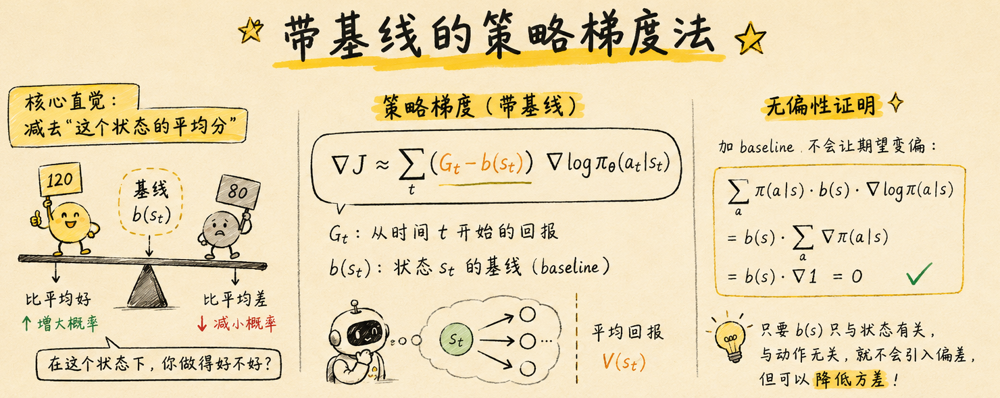
</p>
---

#### 二、无偏性证明（一行数学）⭐⭐

加 baseline 不会让期望变偏，因为：

$$
\sum_a \pi(a|s) \cdot b(s) \cdot \nabla\log\pi(a|s) = b(s) \cdot \underbrace{\sum_a \nabla\pi(a|s)}_{= \nabla 1 = 0} = 0
$$

**结论**：任何只跟状态 $s$ 有关、跟动作 $a$ 无关的函数 $b(s)$，作为 baseline 加到梯度公式里，期望值完全不受影响，但方差可以降低。

---

#### 三、最优 baseline = V(s) ⭐⭐

理论分析表明，能使方差降到最低的 baseline 正是**状态价值函数** $V^\pi(s)$。

$$
b(s) = V^\pi(s)
$$

此时：

$$
G_t - V(s_t) \approx A(s_t, a_t)
$$

<p align='center'>
    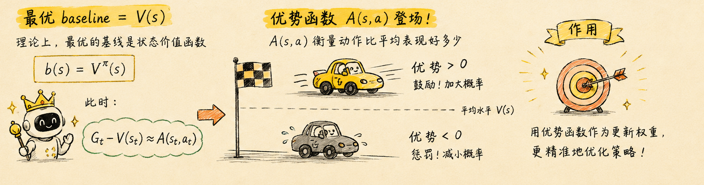
</p>

**这是 $A(s,a)$（优势函数）第一次在实际算法里登场**——前面价值函数章节定义过它，现在它的作用清楚了：**作为策略梯度更新的权重**，告诉策略每个动作"比平均好多少"。
 
---

#### 四、代码改动

与 REINFORCE 只在 `update` 方法里多了一步——减去 baseline：

```python
def update(self, trajectory):
    states, actions, rewards = trajectory
    loss, G = 0, 0

    # 估计 baseline：这条轨迹中 G_t 的均值近似 V(s)
    returns = []
    for r in rewards[::-1]:
        G = r + self.gamma * G
        returns.insert(0, G)
    baseline = np.mean(returns)  # 简单 baselines

    for s, a, r, G in zip(states, actions, returns):
        # log_prob = ...
        loss += -log_prob * (G - baseline)  # 减去 baseline！

    self.optimizer.zero_grad()
    loss.backward()
    self.optimizer.step()
```

修改只有一处：`loss += -log_prob * G` → `loss += -log_prob * (G - baseline)`。

!!! info "更精细的做法"
    上面用轨迹内 $G_t$ 的均值当 baseline，零成本但粗糙。更好的方案是**用一个独立的神经网络 $V_\phi(s)$ 来学 baseline**，每步都能输出一个"状态分数"。这正是下一节 Actor-Critic 的核心思想——**$V_\phi(s)$ 就是 Critic**。

---

### Actor-Critic

#### 一、核心思想：两个网络各司其职 ⭐⭐

前面带 baseline 的 REINFORCE 已经引入了 $V(s)$，但那个 $V(s)$ 要么用轨迹内均值近似，要么独立训练但仅在 episode 结束后才更新。Actor-Critic 的最大改进是：**让 $V(s)$ 变成一个可每步更新的神经网络，与策略网络交替训练**。

名称本身就是架构的答案：

- **Actor（演员）** = 策略网络 $\pi_\theta(a|s)$，负责"演"——根据当前状态输出动作
- **Critic（评论家）** = 价值网络 $V_w(s)$，负责"评"——给 Actor 的每个动作打分

两者的关系：**Actor 演一出戏，Critic 打分；Actor 根据分数调整演技，Critic 也同步提升自己的评判水平**。

从带 baseline 的 REINFORCE 到 Actor-Critic，公式层面的变化只有一处——baseline 不再是用完就扔的临时值，而是**一个可学可更新的神经网络**：

$$
\nabla J \approx \sum_t \big(G_t - V_w(s_t)\big) \cdot \nabla_{\theta}\log\pi_\theta(a_t|s_t)
$$

但 $G_t$ 仍然是 MC 回报——要跑完一个完整的 episode 才能算。Actor-Critic 真正的进化在下一步。

---

#### 二、从 MC 到 TD：走一步就能更新 ⭐⭐

$$
\begin{aligned}
\text{MC版：}&\quad G_t = R_t + \gamma R_{t+1} + \gamma^2 R_{t+2} + \dots &\text{需要完整 episode} \\
\text{TD版：}&\quad G_t \approx R_t + \gamma V_w(s_{t+1}) &\text{走一步就能算}
\end{aligned}
$$

用 $V_w(s_{t+1})$ 替代后续所有 $R$ 的累计，本质是**用网络对未来的预估去替换多步采样的随机累加**——方差更低，代价是有偏（因为 $V_w$ 还不够准）。

代入梯度公式：

$$
\nabla J \approx \sum_t \big(R_t + \gamma V_w(s_{t+1}) - V_w(s_t)\big) \cdot \nabla_{\theta}\log\pi_\theta(a_t|s_t)
$$

括号里的 $R_t + \gamma V_w(s_{t+1}) - V_w(s_t)$ 就是 **TD error（时序差分误差）**，记作 $\delta_t$。这个 $\delta_t$ 同时服务两个网络：

- **对 Critic**：$\delta_t$ 是监督信号——Critic 通过最小化 $\delta_t^2$ 来更新 $w$，让 $V_w$ 越来越准
- **对 Actor**：$\delta_t$ 取代 $G_t - V(s_t)$ 作为梯度权重，指导策略更新

---

#### 三、交替更新流程

每一时间步 $t$ 的循环：

<p align='center'>
    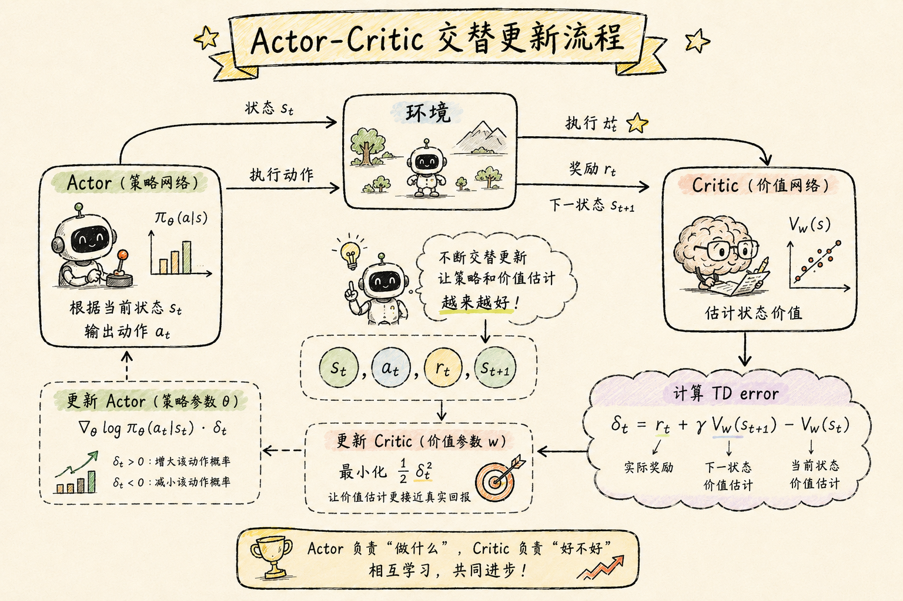
</p>

#### 四、代码实现

##### 4.1 策略与价值网络

``` python
class PolicyNet(nn.Module):  
    def __init__(self, action_size):  
        super().__init__()  
        self.fc1 = nn.Linear(4, 128)  
        self.fc2 = nn.Linear(128, action_size)  
  
    def forward(self, x):  
        x = f.relu(self.fc1(x))  
        x = f.softmax(self.fc2(x), dim=-1)  
        return x  
  
  
# 预测的是状态价值，所以输出是一个标量  
class ValueNet(nn.Module):  
    def __init__(self):  
        super().__init__()  
        self.fc1 = nn.Linear(4, 128)  
        self.fc2 = nn.Linear(128, 1)  
  
    def forward(self, x):  
        x = f.relu(self.fc1(x))  
        x = self.fc2(x)  
        return x
```

##### 4.2 Agent

``` python
# 智能体  
class Agent:  
    def __init__(self):  
        self.action_size = 2  # 动作空间  
        self.gamma = 0.9  # 折扣因子  
        self.lr_pi = 0.0002  
        self.lr_v = 0.0005  
        self.pi = PolicyNet(self.action_size)  
        self.v = ValueNet()  
  
        self.optimizer_pi = torch.optim.Adam(self.pi.parameters(), lr=self.lr_pi)  
        self.optimizer_v = torch.optim.Adam(self.v.parameters(), lr=self.lr_v)  
  
    def get_action(self, state):  
        # 得到动作概率分布  
        probs = self.pi(torch.tensor(state).unsqueeze(0)).squeeze(0)  
        m = Categorical(probs)  
        action = m.sample().item()  # 当前动作，记得要 item 取出标量  
        return action, probs  
  
    def update(  
            self,  
            state,  
            action_prob,  
            reward,  
            next_state,  
            done  
    ):  
        state = torch.tensor(state).unsqueeze(0)  # 加上批次维度  
        next_state = torch.tensor(next_state).unsqueeze(0)  
  
        # target TD误差
        # 1 - done，也就是如果当前是最后一步了，后面这一项就是0  
        target = reward + self.gamma * self.v(next_state) * (1 - done)  
        target = target.detach()  
        v = self.v(state)  
        # 状态价值网络的损失  
        loss_fn = torch.nn.MSELoss()  
        loss_v = loss_fn(v, target)  
  
        # 策略网络损失  
        delta = target - v  
        loss_pi = -torch.log(action_prob) * delta.detach().item()  
  
        # 更新策略网络  
        self.optimizer_pi.zero_grad()  
        loss_pi.backward()  
        self.optimizer_pi.step()  
        # 更新状态价值网络  
        self.optimizer_v.zero_grad()  
        loss_v.backward()  
        self.optimizer_v.step()
```

##### 4.3 训练过程

``` python
import gymnasium as gym  
  
env = gym.make("CartPole-v1")  
agent = Agent()  
  
return_list = []  
episode_list = []  
  
for episode in range(2000):  
    state, _ = env.reset()  
    done = False  
  
    total_reward = 0  
  
    while not done:  
        action, action_prob = agent.get_action(state)  
        next_state, reward, terminated, truncated, _ = env.step(action)  
        agent.update(state, action_prob[action], reward, next_state, terminated)  
        done = terminated or truncated  
  
        state = next_state  
        total_reward += reward  
  
    return_list.append(total_reward)  
    episode_list.append(episode)  
  
    if episode % 100 == 0:  
        print(f"Episode: {episode}, Reward: {total_reward}")  
  
import matplotlib.pyplot as plt  
  
plt.plot(episode_list, return_list)  
plt.title = "CartPole-v1"  
plt.xlabel("Episode")  
plt.ylabel("Return")  
plt.show()
```

效果如下：
<p align='center'>
	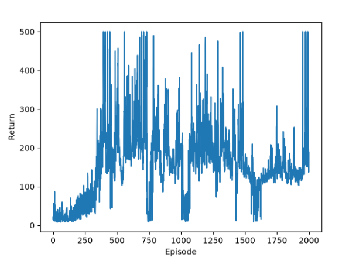

</p>

#### 五、多步 TD 误差 ⭐

Actor-Critic 用 1 步 TD error $\delta_t = R_t + \gamma V_w(s_{t+1}) - V_w(s_t)$，但 1 步太短——$V_w$ 不准时，单步信号噪声大。

**多步 TD** 走中间路线：往前走 $n$ 步再用 $V_w$ 做 bootstrap。

$$
G_t^{(n)} = R_t + \gamma R_{t+1} + \dots + \gamma^{n-1} R_{t+n-1} + \gamma^n V_w(s_{t+n})
$$

$$
\delta_t^{(n)} = G_t^{(n)} - V_w(s_t)
$$

**递推公式**：

$$
A_t^2 = \delta_{t} + \gamma\delta_{t + 1}
$$


三种方法的对比：

| 方法 | 公式 | 方差 | 偏差 |
|------|------|------|------|
| 1 步 TD | $R_t + \gamma V_w(s_{t+1})$ | 低 | 高 |
| $n$ 步 TD | $\sum_{k=0}^{n-1} \gamma^k R_{t+k} + \gamma^n V_w(s_{t+n})$ | 中 | 中 |
| MC | $G_t = \sum_{k=0}^{T-t} \gamma^k R_{t+k}$ | 高 | 无 |

$n$ 是超参数——步数越多，方差越接近 MC、偏差越接近 MC。实践中 $n$ 取 3-5 或者用 **Generalized Advantage Estimation (GAE)**——把所有步长加权平均，一步到位。

!!! tip "实践惯例"
    A2C 默认用 5 步 TD；PPO 用 GAE 比单步效果好得多。

### 广义优势估计（GAE）

多步 TD 的 $n$ 是个硬编码——不同时刻最优步长不一样。GAE 换了一种思路：**不选一个 $n$，而是把所有 $n$ 步优势估计按指数衰减加权平均**。

#### 一、从 1 步 TD error 到 GAE ⭐

先回顾 1 步 TD error：

$$
\delta_t = R_t + \gamma V(s_{t+1}) - V(s_t)
$$

多步展开后，不同步数的优势估计：

$$
\begin{aligned}
A_t^{(1)} &= \delta_t \\
A_t^{(2)} &= \delta_t + \gamma \delta_{t+1} \\
A_t^{(3)} &= \delta_t + \gamma \delta_{t+1} + \gamma^2 \delta_{t+2} \\
&\ \vdots \\
A_t^{(k)} &= \sum_{l=0}^{k-1} \gamma^l \delta_{t+l}
\end{aligned}
$$

GAE 将它们指数加权平均：

$$
A_t^{\text{GAE}} = (1-\lambda) \sum_{k=1}^{\infty} \lambda^{k-1} A_t^{(k)}
$$

化简后得到核心公式：

$$
A_t^{\text{GAE}} = \sum_{l=0}^{\infty} (\gamma \lambda)^l \, \delta_{t+l}
$$

其中 $\lambda \in [0,1]$ 是额外引入的衰减系数：

- $\lambda = 0$：$A_t^{\text{GAE}} = \delta_t$ —— **退化为 1 步 TD**
- $\lambda = 1$：$A_t^{\text{GAE}} = \sum_{l=0}^{\infty} \gamma^l \delta_{t+l} = G_t - V(s_t)$ —— **退化为 MC**
- $0 < \lambda < 1$：中间地带，走多远看 $\lambda$ 多大

---

#### 二、递推实现 ⭐⭐

核心公式是无穷级数，但实际实现用递推——算出所有 $\delta_t$ 后逆序滚动：

$$
A_t^{\text{GAE}} = \delta_t + \gamma \lambda \cdot A_{t+1}^{\text{GAE}}
$$

实现步骤：

```python
# 1. 前向：对每个 t 算 1 步 TD error
td_errors = []
for t in range(T):
    delta = rewards[t] + gamma * V(states[t+1]) - V(states[t])
    td_errors.append(delta)

# 2. 逆序：从最后一个时间步往前递推 GAE
gae = 0
advantages = []
for delta in td_errors[::-1]:
    gae = delta + gamma * lam * gae   # A_t^GAE = δ_t + γλ · A_{t+1}^GAE
    advantages.insert(0, gae)          # 插入到最前面，保持时间顺序
```

#### 三、GAE 下的策略梯度

$$
\nabla_\theta J(\theta) = \mathbb{E}\left[ \sum_t A_t^{\text{GAE}} \, \nabla_\theta \log \pi_\theta(a_t|s_t) \right]
$$

与 Actor-Critic 的唯一区别：梯度权重从 $\delta_t$ 换成了 $A_t^{\text{GAE}}$。

!!! tip "实践惯例"
    PPO 几乎标配 GAE，$\lambda$ 常用 0.95-0.99。相比单步 TD，GAE 让训练曲线更平滑、收敛更快。

### 策略梯度法总结

本章学到的所有策略梯度方法，共享一个统一的数学形式：

$$
\nabla_\theta J(\theta) = \mathbb{E}_{\tau \sim \pi_\theta}\left[ \sum_{t=0}^{T} \Phi_t \, \nabla_\theta \log \pi_\theta(A_t|S_t) \right]
$$

区别只在于权重 $\Phi_t$：

| # | 方法 | $\Phi_t$ |
|---|------|----------|
| 1 | **最简单的策略梯度法** | $G(\tau)$（整条轨迹的回报，所有 $t$ 共用） |
| 2 | **REINFORCE** | $G_t$（时刻 $t$ 之后的回报） |
| 3 | **带 baseline 的 REINFORCE** | $G_t - b(S_t)$（减去状态基线） |
| 4 | **Actor-Critic** | $\delta_t = R_t + \gamma V(S_{t+1}) - V(S_t)$（1 步 TD error） |
| 5 | **广义优势估计（GAE）** | $A_t^{\text{GAE}}$（多步 TD 的指数加权平均） |

$\Phi_t$ 也叫**优势函数（Advantage Function）**，文献中常记作 $A(s,a)$——它衡量的是在状态 $s$ 下采取动作 $a$，比起"这个状态的平均表现"好多少。

!!! info "延续与展望"
    从 (1) → (5)，每一步都在改进 $\Phi_t$——降低方差、减少偏差、引入可学习参数。强化学习中的很多"花活"本质上都是围绕 **如何设计更好的 $\Phi_t$** 展开的。比如 GRPO（Group Relative Policy Optimization）使用的组相对优势，就是对 $\Phi_t$ 的另一种设计。

### 策略梯度法存在的问题

策略梯度法的更新公式很简单：$\theta \leftarrow \theta + \alpha \nabla_\theta J(\theta)$。

但学习率 $\alpha$ 极其难调。步子迈太大，策略直接崩溃；迈太小，学不动。

#### 1. 核心矛盾：训练数据依赖策略

为什么深度学习中这个问题没那么严重？因为**数据集是固定的**——不管参数怎么变，训练数据不变。

强化学习不同：每一轮采样的轨迹**完全依赖当前策略**。策略变了 → 采到的数据变了 → 梯度变了。这造成了正反馈的恶性循环：

- 一步走错 → 策略变差 → 采到的数据变差 → 梯度更歪 → 策略进一步恶化
- 从悬崖掉下去后，需要很长时间才能爬回来

#### 2. 地形敏感：学习率无法适配所有区域

学习率无法适配所有区域，尤其是**强化学习目标函数本身就是极度的凹凸**，所以这个地方看着比较平坦，但可能前面就是悬崖，学习率稍微大点，直接跌入悬崖，之后再想回来，可就难了（原因可以用1解释）
<p align='center'>
    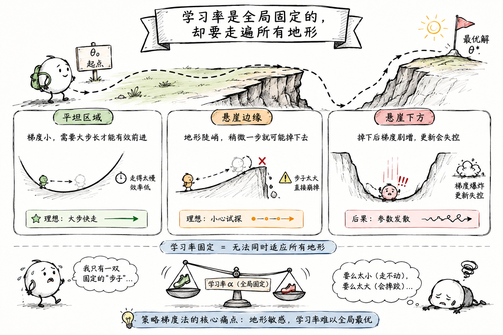
</p>

- 平坦区域：应该大步快走（但学习率固定，走太慢）
- 悬崖边缘：稍微一步就崩（但学习率固定，步子太大）
- 掉下悬崖后：梯度剧增，当前学习率引发爆炸式更新

#### 3. 本质问题：新策略可能比旧策略差

$$
J(\theta_{\text{new}}) - J(\theta_{\text{old}}) \geq 0 \quad (\text{想要这个，但做不到})
$$

策略梯度法完全无法保证新策略优于旧策略。PPO 的核心目标正是解决这个问题——**让每一步更新都"安全"**。


## RL PPO ⭐⭐⭐

### 一、PPO 概述

PPO（**Proximal Policy Optimization，近端策略优化**）是目前强化学习中最经典、最稳定的策略梯度算法之一，由 OpenAI 于 2017 年提出。它最大的目标只有一句话：

>让策略每次更新时，不要变化得太大。

这是 PPO 名字中 **Proximal（近端）** 的含义——**每一步都离旧策略不要太远**。

### 二、PPO 替代目标函数

PPO 的核心思想很朴素：**每一步更新都离旧策略 $\pi_{\theta_{\text{old}}}$ 不要太远**。但怎么在数学上实现这个"不要太远"？

#### 1. 重要性采样比率

定义新旧策略在动作 $a_t$ 上的比率：

$$
r_t(\theta) = \frac{\pi_\theta(a_t|s_t)}{\pi_{\theta_{\text{old}}}(a_t|s_t)}
$$

- $r_t(\theta) > 1$：新策略让这个动作**更可能出现**
- $r_t(\theta) < 1$：新策略让这个动作**更不可能出现**
- $r_t(\theta) \approx 1$：新旧策略在这个动作上差不多

传统策略梯度可以改写成一个"替代目标"（surrogate objective）：

$$
J^{\text{CPI}}(\theta) = \mathbb{E}\left[ r_t(\theta) \cdot A_t \right]
$$

CPI 代表 Conservative Policy Iteration。这个公式通过重要性采样，**用旧策略采到的数据来评估新策略**——但如果 $\theta$ 离 $\theta_{\text{old}}$ 太远，这个估计就不准了。

#### 2. Clip：给比率上枷锁 ⭐⭐⭐

PPO 的改进简单而巧妙——**把 $r_t(\theta)$ 限制在 $[1-\varepsilon, 1+\varepsilon]$ 之间**：

$$
J^{\text{CLIP}}(\theta) = \mathbb{E}\left[ \min\left( r_t(\theta) \cdot A_t,\; \text{clip}(r_t(\theta),\, 1-\varepsilon,\, 1+\varepsilon) \cdot A_t \right) \right]
$$

**PPO 的替代目标函数 $\,J^{\text{CLIP}}$ 的本质**：用重要性采样比率 $r_t(\theta)$ 衡量新旧策略差异，再用 $\varepsilon$ 裁剪给差异加上限——让策略更新既高效又安全。

!!! tip "$\varepsilon$ 的实践选值"
    PPO 原文和多数实现中 $\varepsilon = 0.2$。太小更新太保守，太大失去做"Proximal"的意义。

| 编号  |               $r_t(\theta)$ 的范围               | $A_t$ |     $\min$ 函数的结果     | 是否裁剪 | 目标函数符号 | 梯度  |
| :-: | :-------------------------------------------: | :---: | :------------------: | :--: | :----: | :-: |
|  1  | $r_t(\theta)\in[1-\varepsilon,1+\varepsilon]$ |   +   |   $r_t(\theta)A_t$   |  否   |   +    |  ✓  |
|  2  | $r_t(\theta)\in[1-\varepsilon,1+\varepsilon]$ |   -   |   $r_t(\theta)A_t$   |  否   |   -    |  ✓  |
|  3  |          $r_t(\theta)<1-\varepsilon$          |   +   |   $r_t(\theta)A_t$   |  否   |   +    |  ✓  |
|  4  |          $r_t(\theta)<1-\varepsilon$          |   -   | $(1-\varepsilon)A_t$ |  是   |   -    |  0  |
|  5  |          $r_t(\theta)>1+\varepsilon$          |   +   | $(1+\varepsilon)A_t$ |  是   |   +    |  0  |
|  6  |          $r_t(\theta)>1+\varepsilon$          |   -   |   $r_t(\theta)A_t$   |  否   |   -    |  ✓  |
下面是不同情况对应的解释：

|情况|r范围|A|发生什么|是否clip|梯度|
|---|---|---|---|---|---|
|1|正常范围|+|好动作，小幅提高|否|✅|
|2|正常范围|-|坏动作，小幅降低|否|✅|
|3|低于下界|+|好动作被降低太多，需要拉回|否|✅|
|4|低于下界|-|坏动作已经降低足够|是|❌|
|5|高于上界|+|好动作提高过头|是|❌|
|6|高于上界|-|坏动作提高过头，需要惩罚|否|✅|

<p align='center'>
    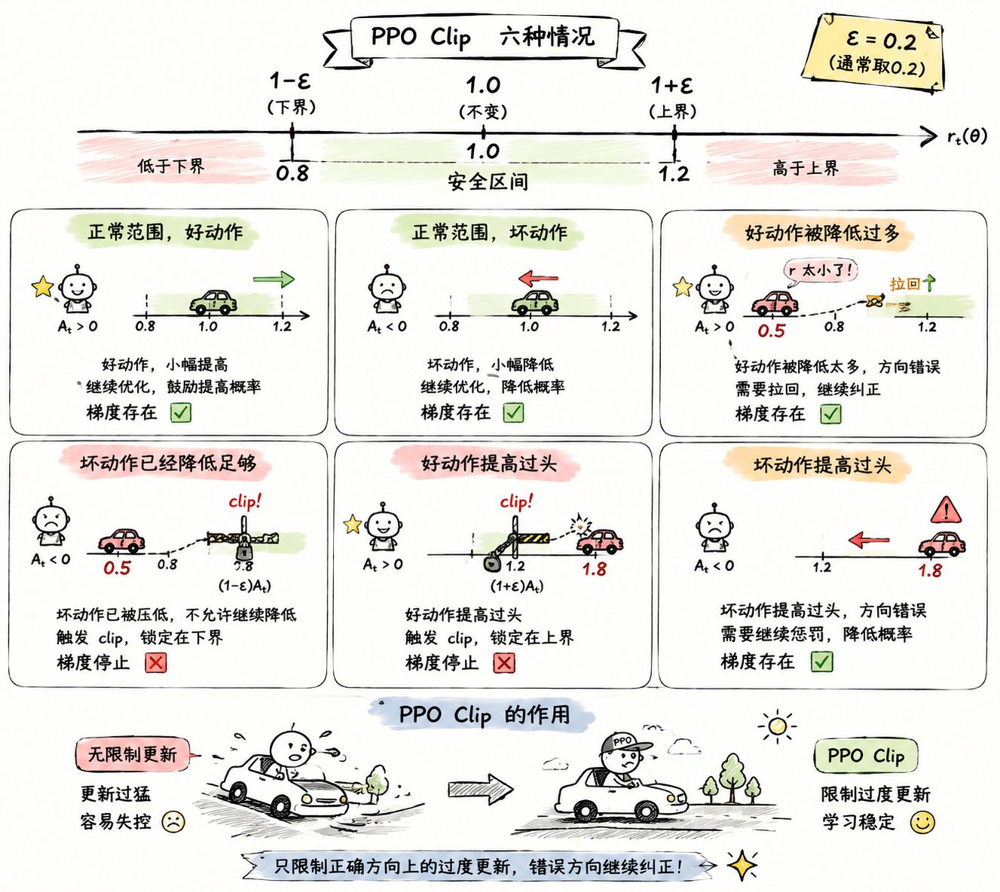
</p>

### 三、PPO 代码实现
#### 1. 带裁剪的 PPO 算法伪代码

> 下图中，重要性采样比例 $r(\theta)$ 用 $p(\theta)$ 表示
<p align='center'>
    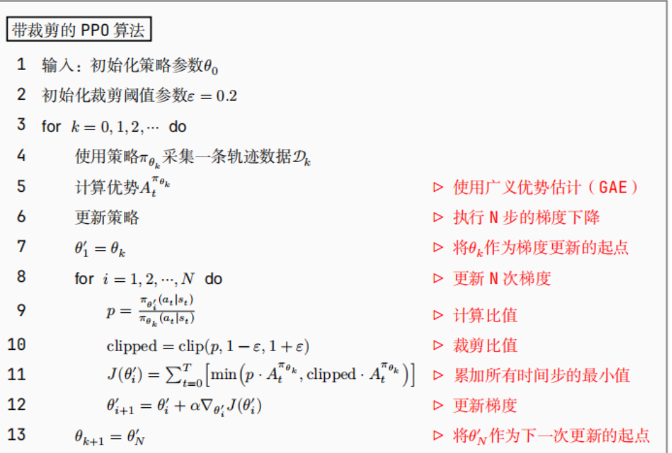
</p>

- 一条轨迹更新了 N 次梯度
- N 次循环，$r(\theta)$ 的分母一直不变，这就是为什么 PPO 更新稳定的原因之一

#### 2. 网络结构的定义

与 Actor-Critic 架构一样（本质上 PPO 采用的就是 Actor-Critic 架构），只不过换了优化目标。具体可参考：[[#四、代码实现]]

#### 3. PPO 下的 Agent

``` python
# Agent  
class Agent():  
    def __init__(self):  
        self.lr_pi = 0.0002  
        self.lr_v = 0.0005  
        self.gamma = 0.9  
        self.action_size = 2  
  
        self.pi = PolicyNet(self.action_size)  
        self.v = ValueNet()  
  
        self.optimizer_pi = torch.optim.Adam(self.pi.parameters(), lr=self.lr_pi)  
        self.optimizer_v = torch.optim.Adam(self.v.parameters(), lr=self.lr_v)  
  
    # 默认不带batch  
    def get_action(self, state):  
        probs = self.pi(torch.tensor(state).unsqueeze(0)).squeeze()  
        m = Categorical(probs)  
        action = m.sample().item()  
        # 返回动作和动作概率  
        return action, probs  
  
    def collect_trajectory(self, env):  
        state = env.reset() # s_0  
        done = False  
        states, next_states, actions, rewards, action_probs, dones = [], [], [], [], [], []  
  
        while not done:  
            action, probs = self.get_action(state)  
            next_state, reward, terminated, truncated, _ = env.step(action)  
            done = terminated or truncated  
            states.append(state) # s_t  
            next_states.append(next_state) # s_t+1  
            actions.append(action) # a_t  
            rewards.append(reward) # r_t  
            action_probs.append(probs[action]) # pi(a_t|s_t)  
            dones.append(done) # done_t  
            # 状态转移  
            state = next_state  
  
        return states, next_states, actions, rewards, action_probs, dones
```

重点看 `collect_trajectory`，为了后续 `update` 的计算，我们收集了一条轨迹的详细信息：

$$
\text{一条轨迹的详细信息}
=
\left\{
\begin{array}{ll}
\text{states}: & [s_0,s_1,\dots,s_{T-1}] \\[6pt]

\text{next\_states}: & [s_1,s_2,\dots,s_T] \\[6pt]

\text{actions}: & [a_0,a_1,\dots,a_{T-1}] \\[6pt]

\text{action\_probs}: &
[\pi_{\theta_{\mathrm{old}}}(a_0|s_0),
\pi_{\theta_{\mathrm{old}}}(a_1|s_1),
\dots,
\pi_{\theta_{\mathrm{old}}}(a_{T-1}|s_{T-1})]
\\[6pt]

\text{rewards}: & [R_0,R_1,\dots,R_{T-1}] \\[6pt]

\text{dones}: & [\mathrm{False},\mathrm{False},\dots,\mathrm{True}]
\end{array}
\right.
$$

#### 4. PPO 的实现

有了旧轨迹的详细信息，就可以实现 PPO 算法了

``` python
def Agent():
	...
	# ppo 的实现  
	def update(self, trajectory):  
	    states, next_states, actions, rewards, action_probs, dones = trajectory  
	    # [s0, s1, s2, ..., s_t-1] 形状变为 (batch_size, state_dim)   
	    states = torch.tensor(states)  
	    new_states = torch.tensor(next_states)  
	    
	    # 将动作、奖励、终止标志转换为 Tensor 并增加一个维度，方便后续批量计算 
	    actions = torch.tensor(actions).view(-1, 1)  
	    rewards = torch.tensor(rewards).view(-1, 1)  
	    dones = torch.tensor(dones, dtype=torch.float32).view(-1, 1)  
	  
	    # 1. 计算 A（优势函数）A_t = r_t + y * V(s_t+1) - V(s_t)  
	    # 为什么需要detach?（脱离计算图，不去计算梯度）  
		“”“
		因为 V(s_t) 在这里仅仅作为一个“基准线(Baseline)”来计算优势 A_t。
		如果不 detach，计算 A_t 时会保留 V(s_t) 的计算图，导致后续策略网络(Policy)的梯度错误地回传到价值网络(Value)中，破坏两个网络的独立更新。
		”“”
		
	    V = self.v(states).detach()  
	    
	    # 2. 计算 TD Target (时序差分目标值) 
	    # 公式：TD_target = r_t + gamma * V(s_{t+1}) * (1 - done) 
	    # 如果 done=True，(1 - done) 为 0，截断后续奖励 
	    td_target = rewards + self.gamma * self.v(new_states) * (1 - dones)  
	    # 3. 计算 delta（单步td误差）  
	    delta = td_target - V  
	  
	    # 4. 计算每一步的 GAE    
	    “”“
	     AE 的递推公式包含一个从后往前的累加循环。PyTorch 的 Tensor 在 GPU 上进行这种带有强数据依赖的循环计算效率极低。因此，先将其转移到 CPU 并转为 NumPy 数组进行快速计算，算完后再转回 Tensor。
	    ”“”
	    gae = self.compute_gae(self.gamma, delta.cpu())
	  
	  
	    # 5. 计算 r(theta) 的分母部分  
	    old_probs = torch.tensor(action_probs).view(-1, 1)  
	    
	    # 虽然公式是相除，但是为了避免除零，这里用相减，所以求了一个 log 对数,然后再求指数，保证计算的稳定性  
	    old_log_probs = torch.log(old_probs).detach()  
	  
	    # 更新策略网络 + 价值网络  
	    # 对同一条轨迹进行多次 (Epoch) 梯度下降，提高样本利用率
	    for _ in range(10):  
	        
	        # 新策略采取的动作概率  
	        log_probs = torch.log(self.pi(states).gather(1, actions))  
	        
	        # 计算重要性采样比率 (Ratio)
	        ratio = torch.exp(log_probs - old_log_probs)  
			
			# 计算 PPO 的截断代理目标函数 (Clipped Surrogate Objective)
	        surr1 = ratio * gae  
	        surr2 = torch.clamp(ratio, 1 - self.epsilon, 1 + self.epsilon) * gae  
	        
	        # 策略网络的损失：每一步的贡献 min(surr1, surr2)        
	        pi_loss = -torch.mean(torch.min(surr1, surr2))  
	  
	        # 价值神经网络的损失计算  
	        mse_loss = torch.nn.MSELoss()  
	        
	        # 重点解释这个损失的计算  
	        # ==================== 价值网络损失计算 ==================== 
	        # 【重点解释 v_loss 的计算】： 
	        # 我们的目标是让价值网络 V(s) 逼近真实的累积回报。 
	        # 在 PPO 中，GAE + V_old(s) 就是带有低方差估计的真实回报 (TD Target)。 
	        # 因此，价值网络的 Loss 就是让当前的 V_new(s) 去拟合这个 TD Target。
	        v_loss = mse_loss(self.v(states), gae + V)  
	  
	        self.optimizer_pi.zero_grad()  
	        self.optimizer_v.zero_grad()  
	  
	        pi_loss.backward()  
	        v_loss.backward()  
	  
	        self.optimizer_pi.step()  
	        self.optimizer_v.step()  
  
```

#### 5. 递推计算 GAE

在 GAE 章节下，我们给出了 $A_{t}^{GAE}$ 的递推公式：

$$
A_t^{\text{GAE}} = \delta_t + \gamma \lambda \cdot A_{t+1}^{\text{GAE}}
$$

``` python
class Agent:
	...
	def compute_gae(self, gamma, delta):  
	    delta = delta.cpu().detach().numpy()  
	    gae_list = []  
	    cur_gae = 0 # 当前时间步的GAE  
	    lba = 0.95  
	  
	    for d in delta[::-1]:  
	        cur_gae = cur_gae * gamma * lba + d  
	        gae_list.append(cur_gae)  
	  
	    return torch.tensor(gae_list[::-1]).view(-1, 1)
```

#### 6. 训练过程

``` python
def train(env, agent:Agent):  
  
    return_list, episode_list = [], []  
    for i in range(1000):  
        # 获取轨迹  
        trajectory = agent.collect_trajectory(env)  
  
        agent.update(trajectory)  
  
        # 统计信息  
        episode_return = sum(trajectory[3])  
        return_list.append(episode_return)  
        episode_list.append(i)  
  
        if i % 10 == 0:  
            print(f"episode: {i}, return: {episode_return}")  
  
  
    return return_list, episode_list

def main():  
    import gymnasium as gym  
    import matplotlib.pyplot as plt  
    env = gym.make("CartPole-v1")  # 500 步结束的倒立摆游戏
  
    agent = Agent()  
    return_list, episode_list = train(env, agent)  
  
    plt.plot(episode_list, return_list)  
    plt.title("PPO")  
    plt.show()
```

效果如下（倒立摆v1，也就是500步才算成功，比较难稳定,可能是因为我的训练回合数比较小，但是v0，通过ppo，几乎能够稳定完成游戏）

**v1 版本（500步结束游戏）：**

<p align='center' style='zoom:60%'>
    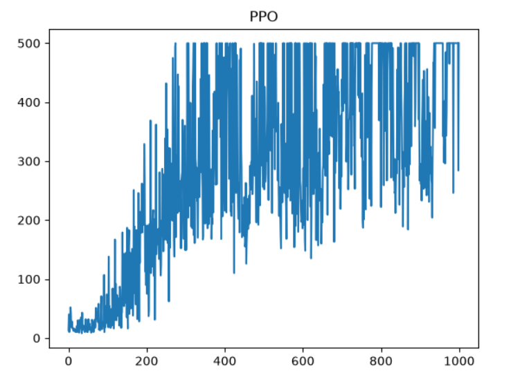
</p>

**v0版本（200步结束游戏）：**
<p align='center' style='zoom:70%'>
    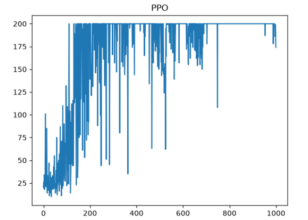
</p>

### 四、PPO 背后的数学

>  这一部分知识，我只能说路漫漫啊
#### KL 散度

**KL 散度**（Kullback-Leibler Divergence, KLD）是衡量两个概率分布之间差异程度的指标，在信息论中又称**相对熵**（Relative Entropy）。它的核心思想很直接：如果用分布 $q$ 去近似真实分布 $p$，会损失多少信息？KL 散度量化了这个"损失"。

PPO 之所以依赖 KL 散度，是因为它需要在策略更新的每一步约束"新策略不能离旧策略太远"——KL 散度恰好提供了这种衡量手段。

> 参考：[Wikipedia - Kullback-Leibler divergence](https://en.wikipedia.org/wiki/Kullback%E2%80%93Leibler_divergence)

##### 1. 数学定义

给定两个概率分布 $p(x)$ 和 $q(x)$，KL 散度有两种形式，取决于随机变量的类型：

!!! info "定义 1 — 连续型随机变量"
    当 $x$ 为连续型随机变量时：
    $$
    D_{KL}(p \parallel q) = \int p(x) \log \frac{p(x)}{q(x)} \, dx
    $$

!!! info "定义 2 — 离散型随机变量"
    当 $x$ 为离散型随机变量时，求和代替积分：
    $$
    D_{KL}(p \parallel q) = \sum_{x} p(x) \log \frac{p(x)}{q(x)}
    $$

两种形式的本质是一样的：用 $p$ 作为权重，对 $p$ 与 $q$ 的比值取对数后求期望（或求和）。

$$
D_{KL}(p \parallel q) = \mathbb{E}_{p(x)} \left[ \log \frac{p(x)}{q(x)} \right]
$$

##### 2. 核心性质

| 性质 | 含义 | 数学表达 |
|------|------|----------|
| **非负性** | KL 散度永远 $\ge 0$，不可能为负 | $D_{KL}(p \parallel q) \ge 0$ |
| **同一性** | 两个分布完全相同时，KL 散度为 0 | $D_{KL}(p \parallel q) = 0 \iff p = q$ |
| **非对称性** | $D_{KL}(p \parallel q) \neq D_{KL}(q \parallel p)$，方向不可交换 | 不是距离度量 |

!!! tip "非对称性意味着什么？"
    KL 散度不是"距离"（distance），因为它不满足对称性和三角不等式。$D_{KL}(p \parallel q)$ 衡量的是"用 $q$ 近似 $p$ 时的信息损失"，方向反过来意义完全不同。在 PPO 中使用的通常是前向 KL $D_{KL}(\pi_{\text{old}} \parallel \pi_{\text{new}})$，即用新策略近似旧策略的损失。

##### 3. 直观理解：抛硬币的例子

<p align='center'>
    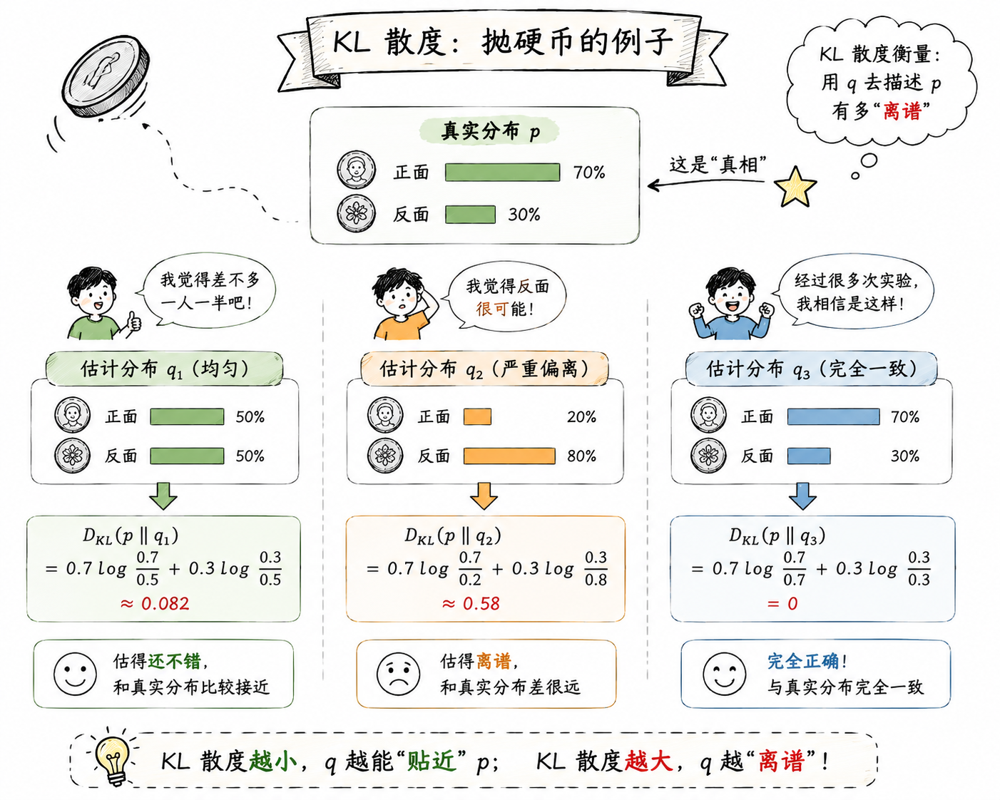
</p>

##### 4. 为什么 PPO 需要 KL 散度 ⭐⭐⭐

PPO 的优化核心是：**每步更新新策略 $\pi_{\text{new}}$ 时，不能离旧策略 $\pi_{\text{old}}$ 太远**。如果一步更新过大，策略可能突然崩坏，导致训练不稳定。

KL 散度在这里扮演了"**信任域约束**"的角色：

$$
\max_{\theta} \, \mathbb{E} \left[ \frac{\pi_{\theta}(a|s)}{\pi_{\theta_{\text{old}}}(a|s)} A^{\pi_{\theta_{\text{old}}}}(s,a) \right] \quad \text{s.t.} \quad D_{KL}(\pi_{\theta_{\text{old}}} \parallel \pi_{\theta}) \le \delta
$$

意思是：在保证新旧策略的 KL 散度不超过某个阈值 $\delta$ 的前提下，最大化期望回报。这比 TRPO 做精确约束计算量更小，比普通 Policy Gradient 更稳定。

!!! warning "KL 散度不是 PPO 的唯一约束手段"
    PPO 实际实现中通常使用 **clipped surrogate objective**（截断替代目标）来近似 KL 约束的效果，而不是真正每次计算 KL 散度。但在 PPO-kl 变体或 TRPO 中，KL 散度是显式约束。不论哪种形式，背后的"不要离旧策略太远"这个思想都来自 KL 散度。


## RL GRPO ⭐⭐⭐

> 官方论文：[DeepSeekMath: Pushing the Limits of Mathematical Reasoning in Open Language Models (arXiv:2402.03300)](https://arxiv.org/abs/2402.03300) | [DeepSeek-R1 技术报告 (arXiv:2501.12948)](https://arxiv.org/abs/2501.12948)

---

### 一、GRPO 概览 

#### 1.1 是什么

**GRPO**（Group Relative Policy Optimization，组相对策略优化）是 PPO 的一个变体，核心差异是——**去掉 Value Model（Critic），改用组内相对奖励来算 Advantage**。

??? 为什么要去掉 Critic？
	当策略模型已经很大（7B+ 级别）时，再维持一个同等规模的 Value Model，训练的内存和算力几乎翻倍。PPO 的 GAE 虽然能有效降方差，但代价是庞大的 Critic 参数。GRPO 的做法更直接：对同一个 prompt 采样 $G$ 条回复，把组内得分最高的定义为"好的方向"、最低的定义为"坏的方向"，以此驱动优化——不需要额外训一个值函数去估计绝对好坏

> DeepSeekMath 最早用它做数学推理 RL，后来 DeepSeek-R1 / R1-Zero 大规模沿用了这一框架。

#### 1.2 完整目标函数（一次性看清全貌）

GRPO 对每个 prompt $q$，先从旧策略 $\pi_{\theta_{\rm old}}$ 采样一组 $G$ 条输出 $\{o_1, o_2, \ldots, o_G\}$，然后优化目标：

$$
J_{\rm GRPO}(\theta) = \frac{1}{G} \sum_{i=1}^{G} \frac{1}{|o_i|} \sum_{t=1}^{|o_i|} \Big[ \min\big( r_{i,t}(\theta) \hat{A}_{i,t},\; \text{clip}(r_{i,t}(\theta), 1-\epsilon, 1+\epsilon) \hat{A}_{i,t} \big) - \beta \; D_{\rm KL}[\pi_\theta \parallel \pi_{\rm ref}] \Big]
$$

> 好像现在工程上，一般不加后面 那个 KL 散度

其中 $r_{i,t}(\theta) = \dfrac{\pi_\theta}{\pi_{\theta_{\rm old}}}$ 是概率比（importance sampling ratio），和 PPO 一模一样。

#### 1.3 一句话理解 GRPO

> **对同一个问题，采一组回答 → 组内比好坏 → 推好答、拉差答。** 本质是靠组内相对排序来近似"策略梯度应该往哪个方向走"，不再依赖一个单独的值函数。

这个 "组内相对" 的思路和 Reward Model 的训练方式天然一致——RM 也是给你同一 prompt 的多条回复做 pairwise 排序。GRPO 直接把这个对比信号用作 Advantage，逻辑上是自洽的。

---

### 二、GRPO vs PPO  

GRPO 和 PPO 的根本差异只有两点，其他结构（on-policy、importance sampling ratio、clipped surrogate）都一样。

#### 2.1 差异一：不需要 Value Network

PPO 是 Actor-Critic 架构，除了 Policy 还维护一个 **Value Model** $V_\phi(s)$ 用来估计状态价值。GRPO 直接**砍掉了 Value Model**——认为对每个 prompt 采样一组回复，组内的相对排序已经能提供足够的梯度信号。

这是 GRPO 省显存、省算力的根源：Value Model 和 Policy 通常是同规模的大网络，去掉它训练开销几乎减半。

#### 2.2 差异二：Advantage 计算方式不同

PPO 用 **GAE**（Generalized Advantage Estimation），基于 Value Model 输出的 $V(s)$ 和 TD residual 算 Advantage，公式复杂，需要至少一个完整 trajectory 的 value 估计。

GRPO 直接用**组内 reward 归一化**作为 Advantage：
$$
\hat{A}_i = \frac{r_i - \mu_{\{r\}}}{\sigma_{\{r\}}}
$$
没有 Value Model，也就没有 TD learning、没有 bootstrap——Advantage 完全来自同一 prompt 下的回复相互比较，简单直接。

---

### 三、GRPO 组相对优势 

#### 3.1 为什么要 Advantage

策略梯度的核心公式是：

$$
\nabla J = \mathbb{E} \big[ \nabla \log \pi(a|s) \cdot A(s,a) \big]
$$

$A(s,a)$ 表示"在状态 $s$ 下采取动作 $a$，比平均好多少"。PPO 用 Value Model 估计这个"平均"（baseline = $V(s)$），GRPO 则用**组内均值**来替代。

#### 3.2 GRPO 的 Advantage 计算

对同一个 prompt $q$ 的 $G$ 条回复 $\{o_1, \ldots, o_G\}$，每条通过 RM 或验证器得到一个 reward $r_i$：

$$
\hat{A}_i = \frac{r_i - \mu_{\{r\}}}{\sigma_{\{r\}}}
$$

其中 $\mu_{\{r\}} = \frac{1}{G}\sum r_j$，$\sigma_{\{r\}} = \sqrt{\frac{1}{G}\sum (r_j - \mu)^2}$。

如果支持 Process Supervision（过程奖励），每个 token 位置可以独立算一个相对 advantage；否则整条回复共享同一个最终 reward 归一化后的值作为所有 token 的 $\hat{A}$。

#### 3.3 直觉解释

本质上，GRPO 用**组内比较**取代了 Value Model 对"绝对价值"的估计。好处是：

- **不需要训一个和 Policy 一样大的网络**，省显存省算力
- **和 RM 训练方式同构**——RM 也是做 pairwise 比较，组内归一化等价于把 pairwise 比较推广到 group-wise 标准化
- **方差控制好**：同一 prompt 的采样天然共享上下文，组内 reward 的分布比全局 RM 分数更稳定

<p align='center'>
    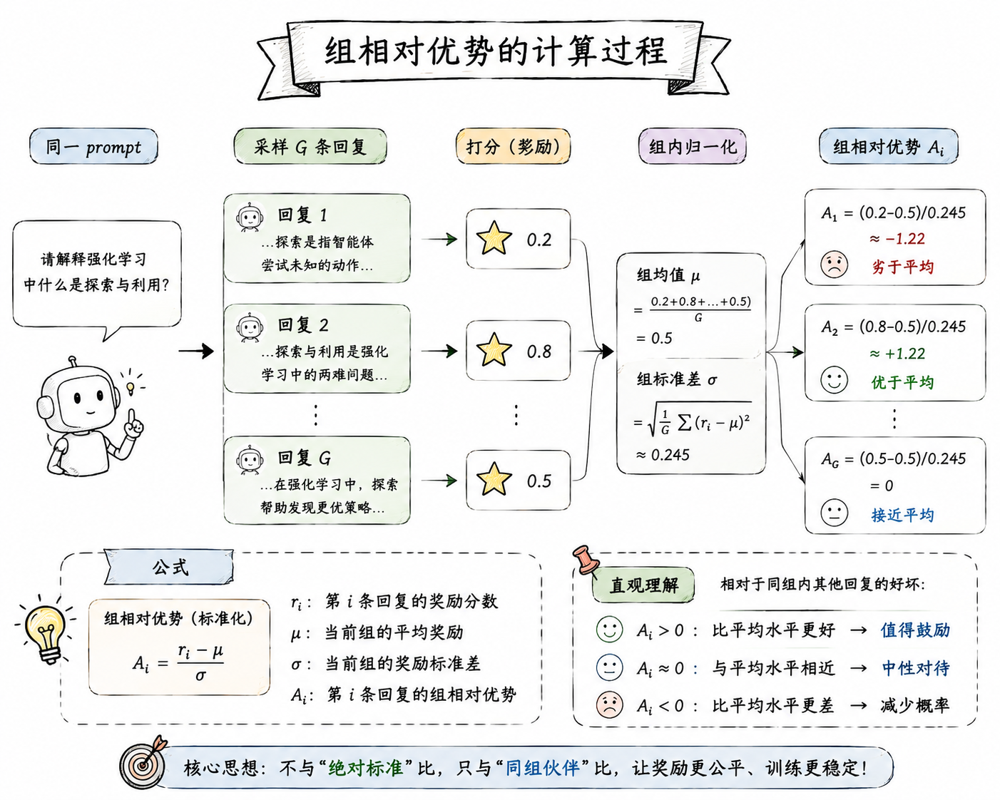
</p>

!!! warning "一个隐患"
    如果 reward 噪声大、或者组的采样不够多样（$G$ 条回复质量相近），归一化后 $\hat{A}$ 会趋于 0，梯度信号很弱。实践上 $G$ 通常取 8–64，太小的 group 会让 advantage 的信噪比下降。


### 四、GRPO 代码实现

#### 1. GRPO 网络结构

GRPO 不在需要价值网络来计算优势函数了，所以只有策略网络，策略网络与之前一致，这里不给了。

#### 2、GRPO 下的 Agent

在 GRPO 下，Agent 需要收集完整的轨迹信息，然后还需要算出一组轨迹的组相对优势，同时还要：输入一组轨迹，更新策略网络！

``` python
class Agent():  
    def __init__(self):  
        self.action_size = 2  
        self.lr = 0.02  
        self.pi = PolicyNet(self.action_size)  
        self.optimizer = torch.optim.Adam(self.pi.parameters(), lr=self.lr)  
  
	# 没变化
    def get_action(self, state):  
        # 获取动作概率分布  
        probs = self.pi(torch.tensor(state).unsqueeze(0)).squeeze()  
        # 采样  
        m = Categorical(probs)  
        action = m.sample().item()  
  
        return action, probs  
	# 比起 PPO，收集的信息少了不少，因为 GRPO 不在需要计算 TD ERROR 了，也不在需要价值网络了，只需要收集 si, ai, log(pi(ai | si)), total_reward(当前这条轨迹的回报)
    def collect_trajectory(self, env):  
        state, _ = env.reset()  
        done = False  
        states, actions, rewards, action_probs = [], [], [], []  
  
        while not done:  
            action, probs = self.get_action(state)  
            next_state, reward, terminated, truncated, _ = env.step(action)  
            done = terminated or truncated  
  
            states.append(state)  
            actions.append(action)  
            rewards.append(reward)  
            log_prob = torch.log(probs[action])  
            action_probs.append(log_prob.item())  
  
            state = next_state  
  
        # 归一化奖励  
        episode_reward = sum(rewards)  / 200.0  
        return states, action_probs, actions, episode_reward  
    
    # 输入一组轨迹，输出这组轨迹每个轨迹的组相对优势  
    def calc_advantage_with_grpo(self, trajectories):  
  
        # 1. 拿到这组里面每条轨迹的奖励 r_i        
        rewards = [t[3] for t in trajectories]  
        
        # 2. 计算均值和标准差  
        mean_reward = sum(rewards) / len(rewards)  
        std_reward = np.std(rewards)  
  
        # 3. 计算组内每条轨迹的组相对优势  
        advantage = [(r - mean_reward) / (std_reward + 1e-6) for r in rewards]  
  
        return advantage    
```

#### 3. GRPO 实现

重点介绍 GRPO 的实现，也就是 `Agent` 下的 `Update` 方法:
```python
class Agent:
	...
	def update(self, trajectories):  
		# 1. 计算这组里面每条轨迹的组相对优势 Ai，之后每个时间步用到的优势函数都是它
        advantages = self.calc_advantage_with_grpo(trajectories)  
		
		# 当前组要更新多少次策略网络，提高样本利用率
        for step in range(3):  
            loss = 0.0  
            # 2. 计算当前组的损失
            for traj, advantage in zip(trajectories, advantages):  
                
                states, log_old_prob, actions, _ = traj  
                
                # 获取动作概率分布  
                states = torch.tensor(states)  
                actions = torch.tensor(actions).view(-1, 1)  
                # 这里是重点，要保证 log_log_prob 和 new_log_prob 维度一致，防止 pytorch 自动广播，导致计算错误！（因为我一开始就错了，半天不收敛）
                log_old_prob = torch.tensor(log_old_prob).view(-1, 1)  
                # actions 维度是 (t_len, 1)，所以 new_probs 的维度也是：(t_len, 1)  
                new_probs = self.pi(states).gather(1, actions)  
                log_new_probs = torch.log(new_probs)  
				# 2.1 计算重要新采样比率
                ratio = torch.exp(log_new_probs - log_old_prob) # (t_len,1)  
			    # 2.2 批量计算当前轨迹下所有时间步的损失，然后求平均值
                traj_loss = -torch.mean(  
                    torch.min(ratio * advantage, torch.clamp(ratio, 1 - 0.2, 1 + 0.2) * advantage)  
                )  
				# 2.3 加上这个轨迹的损失
                loss += traj_loss  
		  
			# 用当前组所有轨迹损失平均值来作为最终的损失
            loss = loss / len(trajectories)  
            self.optimizer.zero_grad()  
            loss.backward()  
            self.optimizer.step()  
  
        return None
```

#### 4. GRPO 训练过程

``` python
def train(agent, env):  
    G = 10  
    per_reward_list = []  
    # 训练10论  
    for i in range(100):  
        trajectories, rewards = [], []  
  
        for _ in range(G):  
            states, log_old_prob, actions, reward = agent.collect_trajectory(env)  
            trajectories.append((states, log_old_prob, actions, reward))  
            rewards.append(reward * 200.0)  
  
        agent.update(trajectories)  
  
        avg_reward = sum(rewards) / len(rewards)  
        per_reward_list.append(avg_reward)  
        print("trial_num:", i, "avg_reward:", avg_reward)  
  
    import matplotlib.pyplot as plt  
    plt.plot(np.arange(len(per_reward_list)), per_reward_list)  
    plt.title("GRPO")  
    plt.xlabel("episode")  
    plt.ylabel("reward")  
    plt.show()

  
def main():  
    import gymnasium as gym  
    env = gym.make("CartPole-v0")  
    agent = Agent()  
    train(agent, env)
```

效果图如下：

<p align='center' style='zoom:70%'>
    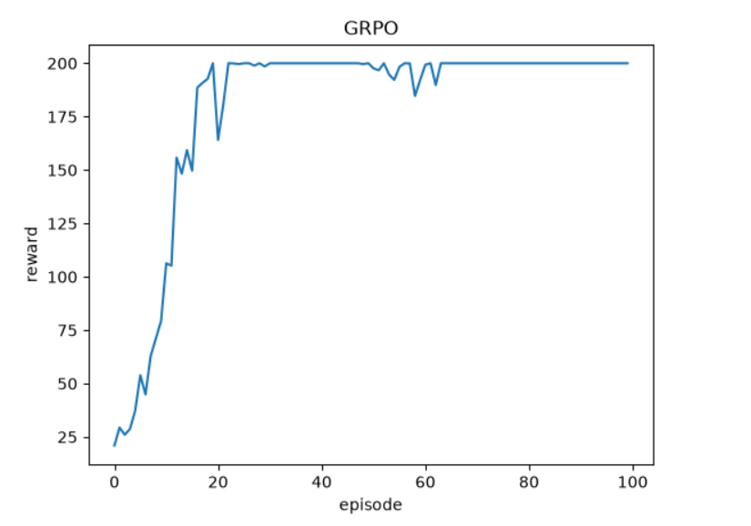
</p>

## RL 原理总结 🚀🚀

终于学完了强化学习理论部分，说到底，核心就是两个算法——**PPO** 和 **GRPO**。只不过为了理解这俩，得先把策略梯度法原本的样子吃透。

策略梯度的骨架是这一个公式：

$$
\nabla J(\theta) = \mathbb{E} \big[ \phi \cdot \nabla_\theta \log \pi_\theta(a_t | s_t) \big]
$$

回顾整个章节，所有改进都能落到这个公式的**左右两侧**：

**左侧 $\phi$（优势函数）的演进**——核心问题是"怎么估这个动作比平均好多少"：

> **原始策略梯度** → **REINFORCE** → **BASELINE** → **Actor-Critic** → **GAE**

每一步都是对 $\phi$ 的更精确估计：从整条轨迹回报（原始策略梯度）→ 累计回报 $G_t$（REINFORCE）→ 减去 baseline 降方差 → 引入 $V(s)$ 做 bootstrap → 用 GAE 在偏差和方差之间取折中。这一路改进只改了 $\phi$ 是什么，没动梯度怎么算。

**右侧 $\nabla_\theta \log \pi_\theta$（更新机制）的演进**——核心问题是"更新的步子多大才不崩"：

> **PPO** → **GRPO**

PPO 引入了 clipped surrogate objective，把概率比 $r_t(\theta)$ 限制在 $[1-\epsilon, 1+\epsilon]$ 内，防止单步更新过大。GRPO 在 PPO 的基础上，进一步把左侧的 $\phi$ 从 GAE（依赖 Value Model）简化成了组内 reward 归一化——于是连 Value Model 都省了。

所以整章的知识链路就是一条线：

<p align='center'>
    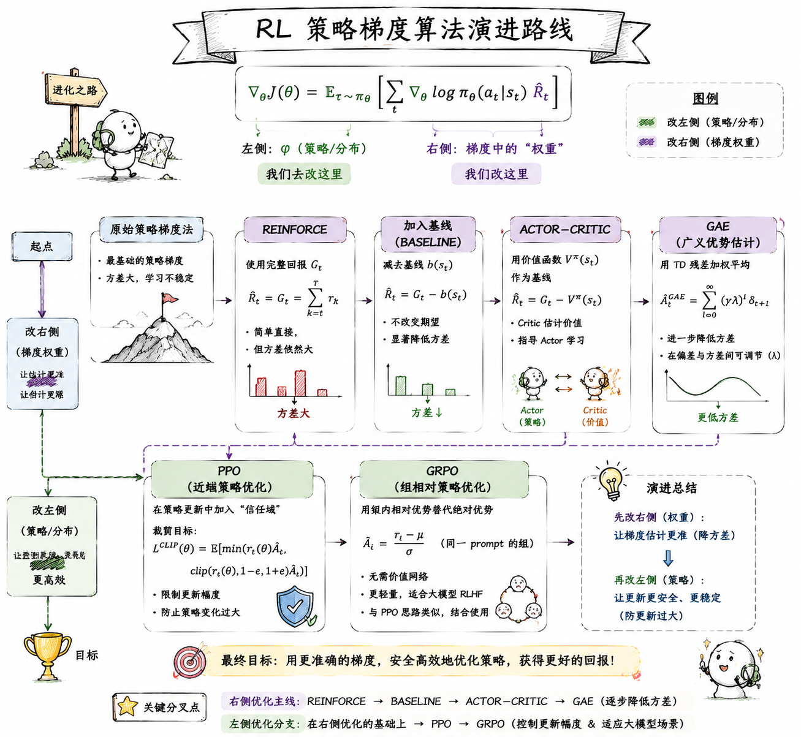
</p>

## RLHF

> 核心论文：[InstructGPT (OpenAI, 2022)](https://arxiv.org/abs/2203.02155) | [DeepSeek-R1 (2025)](https://arxiv.org/abs/2501.12948)

### RLHF 概述

**RLHF**（Reinforcement Learning from Human Feedback）就是用 RL 去做 LLM 对齐——语言模型不能只学"下一个 token 最可能是什么"，还得学"**人类觉得什么回答好**"。

Base LM 的预训练目标决定了它天然不关心**有用性、诚实性、安全性**。SFT 能教"好的回答长什么样"，但学不会"不该答什么"。RLHF 的思路是：**不直接教，让模型试，然后告诉它好坏**——RL 框架正好干这个。

### RLHF 过程 ⭐⭐⭐

<p align='center'>
    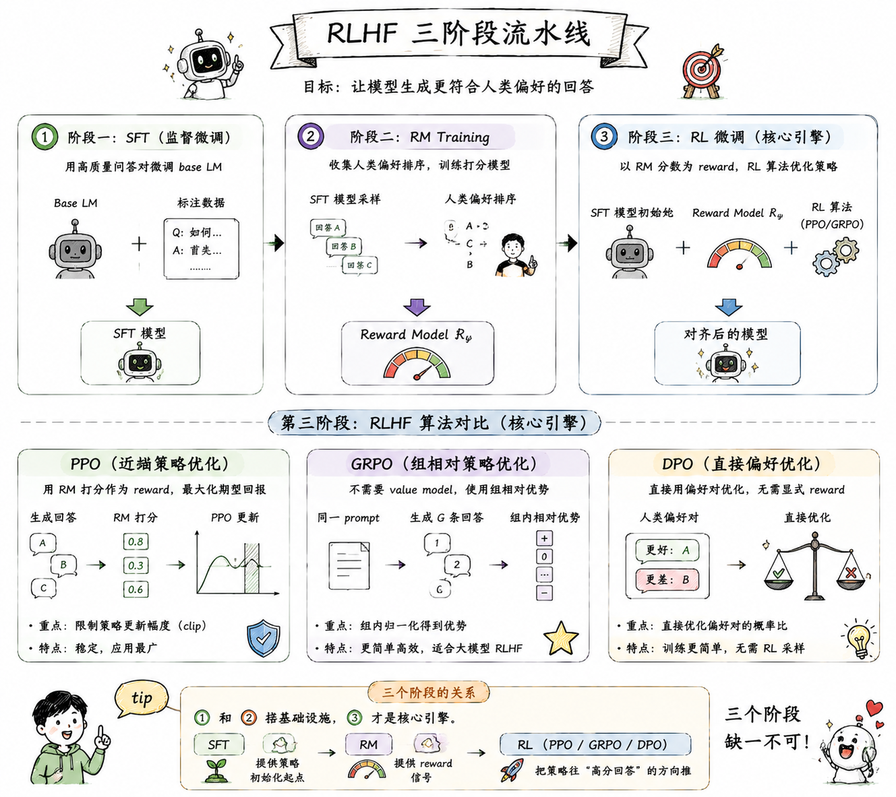
</p>

!!! tip "三个阶段的关系"
    ① 和 ② 搭基础设施，③ 才是核心引擎。SFT 提供策略初始化起点，RM 提供 reward 信号，PPO/GRPO 把策略往"高分回答"方向推。三个阶段缺一不可。

第三阶段是整套流程的引擎。当前主流的 RLHF 算法有三个，核心差异在于"怎么用偏好数据驱动策略更新"：

### RLHF 核心算法

#### 1. PPO 

PPO 的 clipped surrogate objective，**用 GAE 算 Advantage + clipping 防步子太大**：

$$
J_{\text{PPO}}(\theta) = \mathbb{E} \left[ \min \big( r_t(\theta) \hat{A}_t,\; \text{clip}(r_t(\theta), 1-\epsilon, 1+\epsilon) \hat{A}_t \big) \right]
$$

需要 RM 提供 reward，需要 Value Model 算 GAE。经典 Actor-Critic 架构。

#### 2. GRPO 

GRPO 去掉了 Value Model，**用组内 reward 归一化替代 GAE**：

$$
J_{\text{GRPO}}(\theta) = \frac{1}{G} \sum_{i=1}^{G} \frac{1}{|o_i|} \sum_{t=1}^{|o_i|} \Big[ \min\big( r_{i,t}(\theta) \hat{A}_{i,t},\; \text{clip}(r_{i,t}(\theta), 1-\epsilon, 1+\epsilon) \hat{A}_{i,t} \big) - \beta \, D_{\text{KL}}[\pi_\theta \parallel \pi_{\text{ref}}] \Big]
$$

$$
\hat{A}_i = \frac{r_i - \mu_{\{r\}}}{\sigma_{\{r\}}}
$$

需要 RM 或可验证 reward，不需要 Value Model。省显存。

#### 3. DPO 

DPO（Direct Preference Optimization）更激进——**跳过 Reward Model 和 RL 训练，直接用偏好数据优化策略**：

$$
\mathcal{L}_{\text{DPO}}(\pi_\theta; \pi_{\text{ref}}) = -\mathbb{E}_{(x, y_w, y_l) \sim \mathcal{D}} \left[ \log \sigma \left( \beta \left( \log \frac{\pi_\theta(y_w|x)}{\pi_\theta(y_l|x)} - \log \frac{\pi_{\text{ref}}(y_w|x)}{\pi_{\text{ref}}(y_l|x)} \right) \right) \right]
$$

其中 $y_w$ 是人类偏好的回答，$y_l$ 是人类不喜欢的回答。

把 LLM 映射到 RL 框架里，三者共享同一张映射表：

| RL 概念 | LLM 场景 |
|---------|---------|
| Policy $\pi_\theta(a\|s)$ | LLM（生成 token 的概率分布） |
| State $s$ | 已生成的 token 序列 |
| Action $a$ | 下一个 token |
| Reward $r$ | RM 对完整回复的打分（PPO/GRPO）/ 隐式奖励（DPO） |

只不过 DPO 不需要 RM，它的 reward 被隐式编码在 $\beta \log \frac{\pi_\theta(y|x)}{\pi_{\text{ref}}(y|x)}$ 里。

### RLHF Instruct Gpt

>InstructGPT 的训练流程遵循标准的三个步骤，先去做微调，然后定义或者说是训练一个奖励模型，之后就是通过 RL 去对齐 LLM。
#### 1. $R_{t}$ 的计算

整个训练流程，最难的就是对于 LLM 来说，如何去得到即时奖励 $R_t$ 呢？

PPO 的目标函数我们已经很熟悉了，优势 $A$ 如果使用 1 步 TD 误差的话是 $\delta_{t} = R_t + \gamma V(S_{t+1}) - V(S_t)$。使用 GAE 的话，本质上也是计算 $\delta_{t}$

在倒立摆环境中，$R_t$ 很简单——木杆不倒下就是 $+1$。但 LLM 里，策略每输出一个 token 就是一个动作，**每个 token 该给多少即时奖励？** 奖励模型（RM）是对**整条完整回复**打分的，不是逐 token 打的。

<p align='center'>
    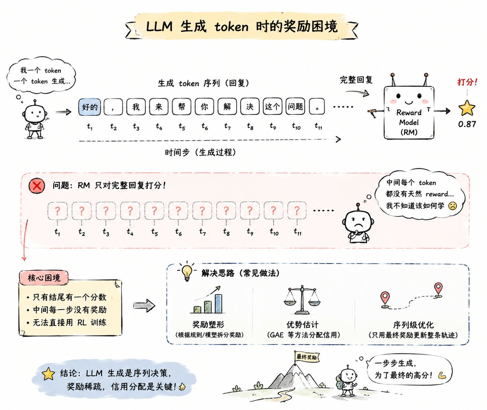
</p>

InstructGPT 的解法很精妙——奖励分两部分：**KL 惩罚（每步都有） + RM 得分（只加在最后）**。

**中间 token（$t < T$）**：句子没写完，RM 无法打分，只有 KL 惩罚：

$$
R_t = -\beta \log \frac{\pi_\theta(y_t|x, y_{<t})}{\pi_{\text{ref}}(y_t|x, y_{<t})}
$$

**最后一个 token（$t = T$，即 `<eos>`）**：RM 看完了整句话，给出总分：

$$
R_T = \text{RM得分} - \beta \log \frac{\pi_\theta(y_T|x, y_{<T})}{\pi_{\text{ref}}(y_T|x, y_{<T})}
$$

##### 为什么需要 KL 惩罚

- **防止 Reward Hacking**：没有 KL 约束，RL 模型会钻 RM 的漏洞，生成"看起来高分但实际上没法读"的乱码
- **保持语言流畅性**：$\pi_{\text{ref}}$（SFT 模型）已经能说"人话"，KL 惩罚把 RL 模型锚定在 $\pi_{\text{ref}}$ 附近，防止跑偏

##### 中间 token 没有 RM 分数，梯度怎么传回去？

RM 的得分只在最后一步出现，属于**稀疏奖励**。PPO 靠它的 Critic + GAE 把信号沿着时间轴往前传：

1. Critic（Value Model）会预测每个 token 位置的 $V(S_t)$，学到"虽然当前只有微小的 KL 惩罚，但顺着这个方向走，最后能拿到高分"
2. 通过 GAE，最后一步的巨大奖励会沿时间轴向前传播，让前面的 token 也获得梯度

举个例子——假设 `你好` 是 prompt，模型生成 `你好呀<eos>`（4 个 token），$\beta = 0.1$，RM 打分 $1.0$：

| Token   | $R_t$                                       | 说明         |
| ------- | ------------------------------------------- | ---------- |
| 你       | $-0.1 \times \text{KL}(你)$                  | 只有 KL      |
| 好       | $-0.1 \times \text{KL}(好)$                  | 只有 KL      |
| 呀       | $-0.1 \times \text{KL}(呀)$                  | 只有 KL      |
| `<eos>` | $-0.1 \times \text{KL}(\text{<eos>}) + 1.0$ | KL + RM 大奖 |

GAE 会把 $\text{token}_4$ 的 $+1.0$ 向前分摊给 token 1-3，告诉它们："你们铺垫得很好，导致最后结局很棒。"

!!! tip "稀疏 vs 稠密"
    RM 得分是**稀疏奖励**——只在结局出现一次。KL 惩罚是**稠密奖励**——每步都有，时刻约束模型不要乱说。两者配合，GAE 把稀疏的 RM 信号"抹匀"给每一步。


#### 2. 微调 gpt2 

代码如下，还是比较简单的，更多细节，参考 [gpt2文档](https://huggingface.co/docs/transformers/main/en/model_doc/gpt2?usage=Pipeline#transformers.GPT2DoubleHeadsModel)和 [DataCollator](https://huggingface.co/docs/transformers/v5.13.1/en/main_classes/data_collator?spm=5176.28103460.0.0.96a02988PtsLPa#transformers.DataCollatorForLanguageModeling)

``` python
import torch  
from torch.utils.data import DataLoader  
from datasets import load_dataset  
from transformers import (  
    AutoModelForCausalLM,  
    AutoTokenizer,  
    DataCollatorForLanguageModeling,  
    pipeline,  
    set_seed  
)  
  
from transformers import AutoTokenizer, AutoModelForCausalLM  
  
# 加载模型和tokenizer， 同时为这个模型的分词器打一个补丁  
model = AutoModelForCausalLM.from_pretrained("uer/gpt2-chinese-cluecorpussmall")  
tokenizer = AutoTokenizer.from_pretrained("uer/gpt2-chinese-cluecorpussmall")  
  
# 注意，这个模型词表里面没有 eos，所以用 pad 代替  
tokenizer.eos_token = tokenizer.pad_token  
  
# print(tokenizer.eos_token, tokenizer.pad_token)  
  
ds = load_dataset('csv', data_files='./data/online_shopping_10_cats.csv')  
# print(ds.column_names)  
ds = ds['train']  
ds = ds.filter(lambda x: x['review'] is not None and 10 <=len(x['review']) <= 1024)  
ds = ds.select(range(6400))  
  
def tokenize(batch):  
    return tokenizer(batch['review'])  
  
  
map_kwargs = {  
    'batched': True,  
    'batch_size': 512,  
    'remove_columns': ['review', 'label', 'cat']  
}  
  
train_ds = ds.map(tokenize, **map_kwargs)  
train_ds.set_format(type='torch')  
print(train_ds.info)  
  
# 由于不用 trainer，所以需要自己处理输入输出数据(trainer底层也是这样做的）  
data_collator = DataCollatorForLanguageModeling(  
    tokenizer=tokenizer,  
    mlm=False  
)  
train_dataloader = DataLoader(  
    train_ds,  
    batch_size=4,  
    collate_fn=data_collator  
)  
optimizer = torch.optim.AdamW(model.parameters(), lr=5e-5)  
  
num_epochs = 1  
device = torch.device('cuda' if torch.cuda.is_available() else 'cpu')  
model.to(device)  
  
# 训练主流程  
for epoch in range(num_epochs):  
    model.train()  
    for step, batch in enumerate(train_dataloader):  
        batch = batch.to(device)  
        outputs = model(**batch)  
        loss = outputs.loss  
  
        optimizer.zero_grad()  
        loss.backward()  
        optimizer.step()  
  
        if step % 100 == 0:  
            print(f'epoch: {epoch}, step: {step}, loss: {loss.item()}')  
  
model.save_pretrained('./models/gpt2-sft')  
tokenizer.save_pretrained('./models/gpt2-sft')
```

#### 3. 奖励模型的训练

``` python
import torch   
from torch import nn  
from torch.utils.data import DataLoader  
  
from datasets import load_dataset  
from transformers import (  
    AutoTokenizer,  
    AutoModelForCausalLM,  
    DataCollatorWithPadding  
)  
  
# ================================  
# 1. 加载基础语言模型  
# ================================  
model_path = "uer/gpt2-chinese-cluecorpussmall"  
tokenizer = AutoTokenizer.from_pretrained(model_path)  
  
# GPT2 默认没有 pad_token，使用 eos_token 作为 padding 
tokentokenizer.eos_token = tokenizer.pad_token  
  
# 使用句尾 eos 作为整个文本的 reward 位置  
REWARD_TOKEN_ID = tokenizer.eos_token_id  
  
# ================================  
# 2. 加载情感数据集  
# ================================  
dataset = load_dataset(  
    "csv",  
    data_files="./data/online_shopping_10_cats.csv"  
)  
train_dataset = dataset["train"]  
  
# 清洗数据：过滤掉空文本或超过 1024 长度的文本  
train_dataset = train_dataset.filter(  
    lambda x: (  
            x["review"] is not None  
            and 0 < len(x["review"]) < 1024  
    )  
)  
  
  
# ================================  
# 3. 数据 Tokenize
# ================================  
def tokenize(batch: dict) -> dict:  
    """  
    将原始文本转换为模型输入，并附加 Reward 相关标签。  
  
    输出字段:  
        input_ids: 词元序列  
        attention_mask: 注意力掩码  
        score: 原始情感标签 (1=正面, 0=负面)  
        score_index: reward 所在 token 的位置  
    """    
    outputs = tokenizer(batch["review"])  
    batch_size = len(outputs["input_ids"])  
  
    # 初始化 reward 和位置信息  
    outputs["score"] = [0.0] * batch_size  
    outputs["score_index"] = [0] * batch_size  
  
    for i in range(batch_size):  
        # 在句尾添加 eos token 作为 reward token        
        outputs["input_ids"][i].append(REWARD_TOKEN_ID)  
        outputs["attention_mask"][i].append(1)  
  
        # 使用数据标签作为真实 reward        
        outputs["score"][i] = float(batch["label"][i])  
  
        # reward 来自最后一个 token        
        outputs["score_index"][i] = len(outputs["input_ids"][i]) - 1  
  
    return outputs  
  
  
tokenized_dataset = train_dataset.map(  
    tokenize,  
    batched=True,  
    batch_size=512,  
    remove_columns=["cat", "label", "review"]  
)  
  
# 转为 PyTorch Tensor 格式  
tokenized_dataset.set_format(type="torch")  
  
  
# ================================  
# 4. 定义 Reward Model
# ================================  
class RewardModel(nn.Module):  
    def __init__(self, model_name: str):  
        super().__init__()  
  
        # 基础 LLM        
        self.llm = AutoModelForCausalLM.from_pretrained(model_name)  
  
        # Reward Head: hidden_size -> 1 (标量 reward)        
        self.reward_head = nn.Linear(self.llm.config.hidden_size, 1)  
  
    def forward(self, input_ids: torch.Tensor, attention_mask: torch.Tensor) -> torch.Tensor:  
        """  
        前向传播，返回每个 token 对应的 reward。  
        """        
        outputs = self.llm(  
            input_ids=input_ids,  
            attention_mask=attention_mask,  
            output_hidden_states=True  
        )  
  
        # 提取最后一层 Transformer 隐藏状态: [batch, seq_len, hidden]  
        hidden_states = outputs.hidden_states[-1]  
  
        # 通过线性层映射并压缩维度  
        reward = self.reward_head(hidden_states).squeeze(-1)  
  
        # 映射到 0~1 之间  
        return torch.sigmoid(reward)  
  
  
model = RewardModel(model_path)  
  
# ================================  
# 5. DataLoader  
# ================================  
collator = DataCollatorWithPadding(tokenizer)  
  
train_loader = DataLoader(  
    tokenized_dataset,  
    batch_size=16,  
    shuffle=True,  
    collate_fn=collator  
)  
  
# ================================  
# 6. Reward Model 训练  
# ================================  
device = "cuda" if torch.cuda.is_available() else "cpu"  
model.to(device)  
  
optimizer = torch.optim.AdamW(model.parameters(), lr=1e-4)  
criterion = nn.BCELoss()  # 二分类损失  
  
epochs = 1  
for epoch in range(epochs):  
    model.train()  
    for batch in train_loader:  
        batch = {k: v.to(device) for k, v in batch.items()}  
  
        # 前向传播  
        scores = model(  
            input_ids=batch["input_ids"],  
            attention_mask=batch["attention_mask"]  
        )  # shape: [batch_size, seq_len]  
  
        # 提取 reward token 位置的预测分数  
        batch_index = torch.arange(scores.shape[0], device=device)  
        reward = scores[batch_index, batch["score_index"]]  
  
        # 计算损失  
        target = batch["score"]  
        loss = criterion(reward, target)  
  
        # 反向传播与优化  
        optimizer.zero_grad()  
        loss.backward()  
        optimizer.step()  
  
        print(f"Epoch: {epoch + 1}, Loss: {loss.item():.4f}")  
  
# 保存 Reward Model
torch.save(model.state_dict(), "reward_model.pt")
```


#### 4. 构造 PPO 的初始状态

#### 5. 演员评论家模型