## RL 基本概念

强化学习（`reinforcement learning`）讨论的问题是智能体（`agent`）怎么在复杂、不确定的环境（`environment`）中**最大化**它能获得的**奖励**。

>一个智能体，在不断试错中，学习怎样做才能获得更多奖励。

<p align='center' style='zoom:50%'>
	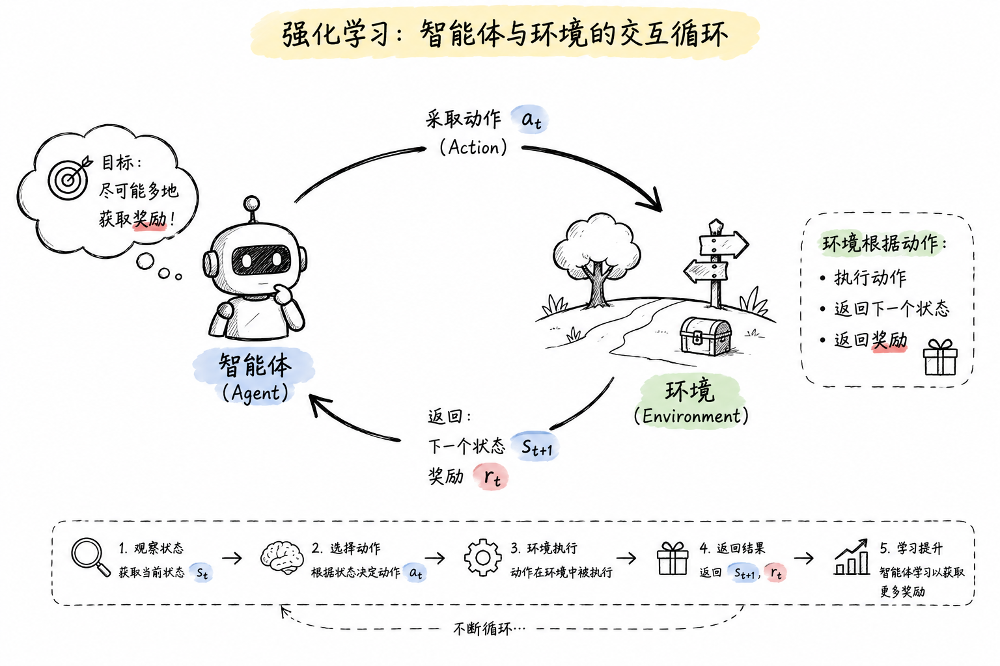
</p>


如上图，强化学习由两部分组成：**智能体**和**环境**。

- 🤖 **智能体（Agent）**：负责思考和行动，比如机器人、自动驾驶汽车、LLM
- 🌍 **环境（Environment）**：智能体所处的世界，比如游戏、真实道路、数学题、**用户**。

强化学习的过程就是智能体和环境不断交互的过程：Agent 根据当前状态选择动作，Environment 执行动作并返回新状态和奖励，Agent 利用奖励不断调整自己的策略，最终学会在各种状态下做出能够获得长期最大累计奖励的决策。

下图是一个 RL 经典的场景——**倒立摆**，在这个环境中，推车就是 **Agent**，它的输入 State 由推车位置、速度、木杆角度、木杆角速度构成，它能够执行的动作是**向左推**和**向右推**。

<p align='center' style='zoom:50%'>
	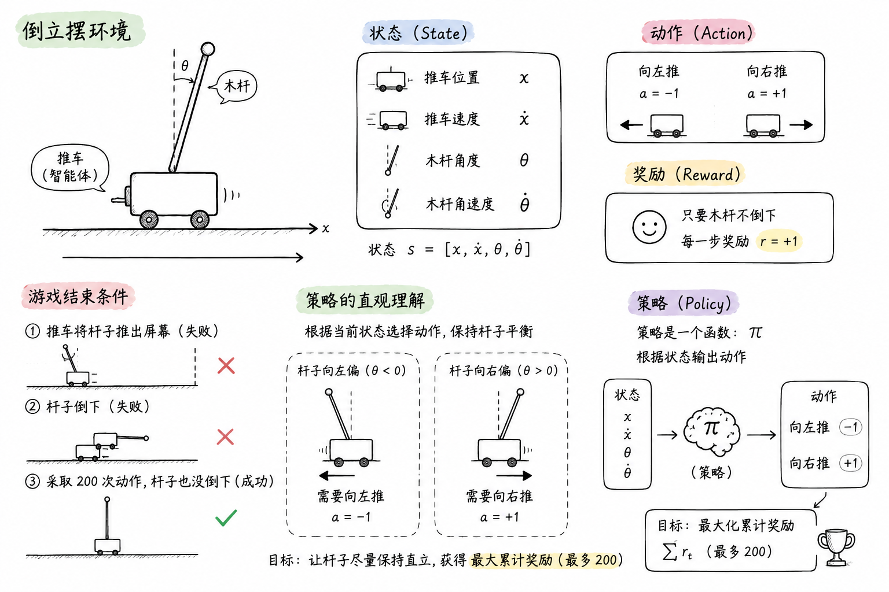
</p>

 **策略**：本质上是一个函数，输入当前状态，输出的实际上是当前采取行动的概率分布，之后和 llm 一样，采取特定的采样策略采样即可：

$$
π(a∣s)=p(a_t​=a∣s_t​=s)
$$

通常，这个 $\pi$ 由于很复杂，所以通常用神经网络来拟合，这也就是深度强化学习。

**轨迹**：**轨迹**（Trajectory）是指智能体在一个完整的回合（Episode）中与环境进行交互的完整记录序列，记作  $τ$ （读作"掏"）。而一个**回合**就是当前环境状态 $S_0$、推车采取动作 $A_0$ ，然后获得奖励 $R_0$，然后转移到下一时间步，直到出发结束条件位置。

$$
\tau = (S_0, A_0, R_0, S_1, A_1, R_1, S_2, A_2, R_2, \dots)
$$

## RL 马尔可夫决策过程 

### 一、为什么需要 MDP

RL 第一节画的是**流程图**——智能体选动作、环境给奖励、再选动作……这个图形象但不严谨。要精确地谈"价值函数"、"最优策略"，必须先把"环境"**形式化**成一个数学对象。

**MDP（Markov Decision Process，马尔可夫决策过程**）就是 RL 的数学底座——所有价值函数、Q-learning、PPO 都站在它上面。一句话：**没有 MDP 这个形式化框架，价值函数根本无从定义**——后面会看到，Bellman 方程里那个 $p(s', r \mid s, a)$ 就是 MDP 五元组里的 $P$。

---

### 二、什么是 MDP

**MDP** 是一个**五元组** $(S, A, P, R, \gamma)$，用来完整描述"环境"：

<p align='center' style='zoom:50%'>
    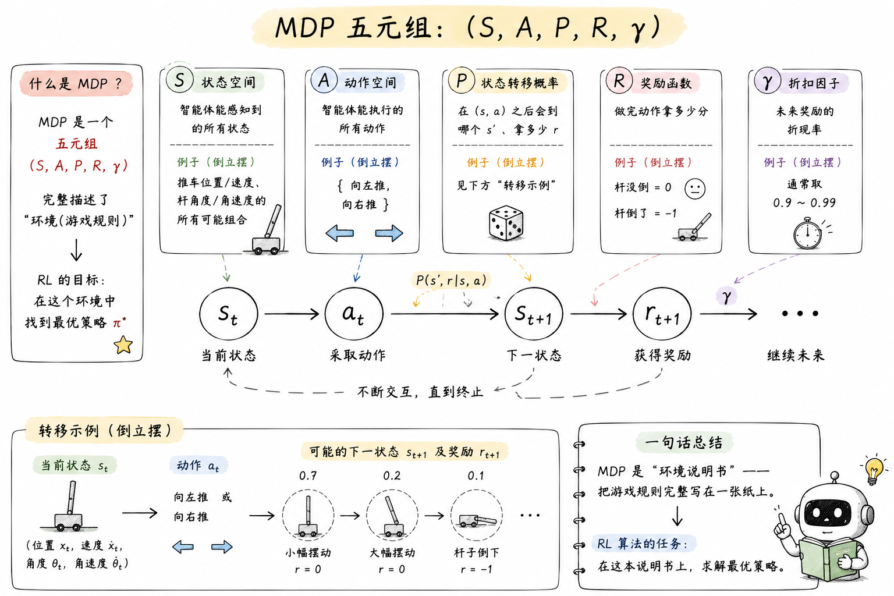
</p>

**一句话**：**MDP 是"环境说明书"**——把"游戏规则"完整写在一张纸上。RL 算法的任务，就是在这个说明书上求解最优策略。

---

### 三、马尔可夫性质 ⭐⭐⭐

MDP 最核心、最容易被忽略的假设——**马尔可夫性质（Markov Property）**：

$$
p(s_{t+1} \mid s_t, a_t, s_{t-1}, a_{t-1}, \dots) = p(s_{t+1} \mid s_t, a_t)
$$

读法：**下一状态只取决于"当前" $(s_t, a_t)$，跟"历史"无关**。

#### 3.1 直觉：现在足够决定未来

- **正例（满足马尔可夫）**：围棋——给定当前棋盘布局，棋局怎么发展跟之前怎么下的无关；倒立摆——给定当前 $(位置, 速度, 角度, 角速度)$，下一时刻的物理状态由牛顿力学唯一决定
- **反例（不严格满足）**：自动驾驶——只看"当前车速"判断安全不够，需要"过去 5 秒的速度变化"；扑克牌——需要记住出牌历史

为什么是"反例"：因为只给"当前状态"无法预测未来——马尔可夫性质不成立。

!!! tip "现实世界怎么办"
    现实问题**严格来说几乎都不满足马尔可夫性**。处理办法是**把状态定义得"足够丰富"**——把历史信息塞进状态里。比如把"过去 5 帧画面"打包成当前状态。

    如果实在塞不下（比如智能体只能看到部分信息），那就要用 **POMDP（Partially Observable MDP，部分可观察 MDP）**——那是更复杂的扩展，这里不展开。

#### 3.2 为什么必须有这个假设

简短回答：**没有它，"状态转移概率 $p$"这个概念都不存在**。

- 想象一下：如果 $s_{t+1}$ 还跟 $s_{t-1}$ 有关，那"在 $(s_t, a_t)$ 之后到 $s_{t+1}$"的**概率**就没法定义——因为答案取决于"再往前看多少"
- 没有 $p$，**价值函数的定义就不唯一**——同一个 $s$ 因为历史不同可能价值不同，那 $V(s)$ 没法写成只以 $s$ 为条件的函数

所以马尔可夫性质是**整个价值函数理论的承重墙**。这一点在 Sutton 教科书里讲得很重，但很多人学 RL 时直接跳过去了。

---

### 四、状态转移概率 P ⭐⭐⭐

**$P$ 是 MDP 最核心的数学对象**——它编码了"环境动力学"，是 RL 算法试图理解（或绕过）的对象。

#### 4.1 标准形式

$$
p(s', r \mid s, a) = \Pr\{S_{t+1} = s', R_{t+1} = r \mid S_t = s, A_t = a\}
$$

- 输入：当前 $(s, a)$
- 输出：下一时刻 $(s', r)$ 的**联合**概率

#### 4.2 为什么 $p$ 联合写 $(s', r)$ 而不是只写 $s'$

奖励 $R_{t+1}$ 通常跟 $s'$ 强相关（比如到达终点 $s'$ 一定拿 +1）。强行拆成"先 $p(s'|s,a)$ 再 $p(r|s,a,s')$"反而**人为割裂了两者的耦合**。联合写数学上更简洁，也是教科书的标准做法。

#### 4.3 几个有用的派生量

$$
p(s' \mid s, a) = \sum_{r} p(s', r \mid s, a)
$$

（仅状态转移本身，把 $r$ 求和掉）

$$
r(s, a) = \mathbb{E}[R_{t+1} \mid s, a] = \sum_{s', r} r \cdot p(s', r \mid s, a)
$$

（期望奖励——经常作为 MDP 的"简化奖励"使用）

> 后续价值函数章节中所有 $p(s', r \mid s, a)$ 都指这个量。

---

### 五、奖励函数 R

**$R$ 告诉智能体"什么算好、什么算坏"**。常见形式：

- $R(s, a, s')$：在 $s$ 做 $a$ 到 $s'$，拿多少分
- $R(s, a)$：在 $s$ 做 $a$（不考虑结果）
- $R(s)$：仅看状态

在五元组定义里，$R$ 通常通过 $p(s', r \mid s, a)$ 中的 $r$ 体现——拿到哪个 $r$ 是概率事件。

#### 5.1 奖励设计是 RL 的艺术

奖励函数设计错了，智能体会"钻空子"——这就是著名的 **reward hacking**。

经典反例：海岸赛艇游戏（CoastRunners），奖励 = "撞到目标"得分。结果智能体学会**在原地反复撞同一个目标刷分**，不跑完赛道。OpenAI 专门写过一篇博文 [Faulty Reward Functions in the Wild](https://openai.com/index/faulty-reward-functions/) 总结这类问题。

!!! warning "一个工程经验"
    > **奖励函数宁简勿巧**。复杂的奖励 shaping 经常引发意想不到的 exploit 行为，调试成本远高于想象中"加点引导"的好处。

---

### 六、策略 π（5 行回顾）

智能体在 MDP 上**怎么动**完全由策略 $\pi$ 决定。第一节已经讲过，这里做个对齐：

- **确定性策略**：$a = \pi(s)$——状态确定、动作确定
- **随机性策略**：$\pi(a \mid s)$——状态确定、动作是概率分布
- 复杂环境（围棋、LunarLander）下 $\pi$ 通常用神经网络拟合——这就是深度强化学习

> 注：策略的完整定义见 [[07_Reinforcement_Learning#RL 基本概念]]。

---

### 七、MDP 框架下的轨迹

把五元组装起来，一条完整轨迹是：

$$
\tau = (S_0, A_0, R_0, S_1, A_1, R_1, S_2, A_2, R_2, \dots)
$$

每一步的产生机制：

| 元素 | 来源 |
|------|------|
| $S_0$ | 环境初始化 |
| $A_t$ | 智能体按 $\pi(a \mid s)$ 采样 |
| $S_{t+1}, R_{t+1}$ | 环境按 $p(s', r \mid s, a)$ 采样 |

**一条轨迹的联合概率**可以写成：

$$
p(\tau) = p(s_0) \prod_{t=0}^{T-1} \pi(a_t \mid s_t) \cdot p(s_{t+1}, r_{t+1} \mid s_t, a_t)
$$

> 第一项 $p(s_0)$ 来自环境，后两项乘积**正好就是"智能体 × 环境"**——这就是 RL 的全部故事。

---

### 八、MDP 的求解目标

给一个 MDP $(S, A, P, R, \gamma)$，**RL 的任务**是求**最优策略** $\pi^*$，使得：

$$
\pi^* = \arg\max_\pi \mathbb{E}_\tau \left[ \sum_{t=0}^{\infty} \gamma^t R_t \right]
$$

但这里有个根本问题：**怎么评估"策略有多好"？** 总不能跑一万次看平均奖励——既不高效也不通用。

这就是**价值函数**登场的理由：**用数学的方式直接评估一个策略**。下一节就讲这个。

---

### 九、MDP 和 RL 的关系

最后澄清一个常见的混淆：

| 维度 | MDP | RL |
|------|-----|-----|
| 本质 | **问题的数学模型** | **求解 MDP 的方法学** |
| 假设 | $P$ 和 $R$ **已知** | $P$ 和 $R$ **未知**（或部分未知） |
| 求解 | 规划算法（值迭代、策略迭代） | 通过与环境交互"试错"学习 |
| 经典工具 | 动态规划 | Q-learning、Policy Gradient |

**两个范式**：

- **Model-based RL**：先学/已知 $P$ 和 $R$，再用规划算法求最优。样本效率高，但建模不准会引入误差
- **Model-free RL**：不管 $P$、$R$ 是什么，直接学策略/价值（Q-learning、PPO、REINFORCE）。简单粗暴，但样本效率低

!!! note "一句话总结"
    > **MDP 告诉你"环境长什么样"，RL 告诉你"在不知道环境长什么样的情况下怎么玩"**。
    > 所有价值函数、Q-learning、PPO 都是"在 MDP 框架下、Model-free 地逼近最优策略"。

---

## RL 价值函数 ⭐⭐⭐

### 一、为什么需要价值函数

价值函数要回答的核心问题是：**给定一个策略，怎么算它"有多好"？**

更具体一点：智能体站在状态 $s$，每一步拿到的奖励 $R_t$ 只是"眼前的蝇头小利"，**它不能直接告诉智能体"在状态 $s$ 我该不该行动"、"在状态 $s$ 该做哪个动作 $a$"**。

于是需要一个东西来**算账**——把"未来能拿到的总奖励"做一个期望估计，**压缩成一个数字**，写在状态/动作头上。这个东西就是**价值函数（Value Function）**。

<p align='center' style='zoom:100%'>
	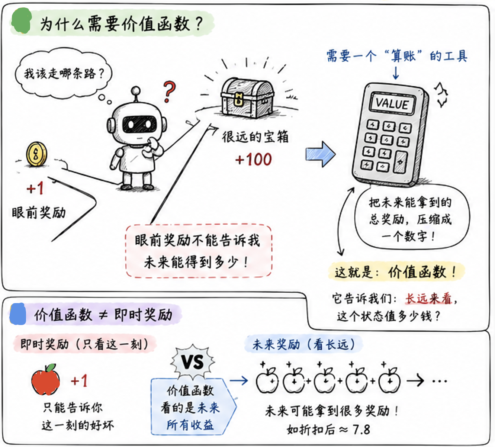
</p>
---

### 二、状态价值函数 V_π(s) 

**状态价值函数**（`state-value function`）$V_\pi(s)$ 定义为：在策略 $\pi$ 下，从状态 $s$ 出发所能获得的**期望回报**（expected return）。

<p align='center' style='zoom:100%'>
	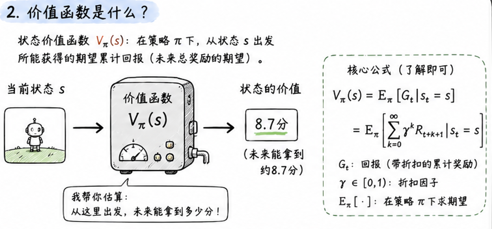
</p>

$$
V_\pi(s) = \mathbb{E}_\pi\left[ G_t \mid s_t = s \right] = \mathbb{E}_\pi\left[ \sum_{k=0}^{\infty} \gamma^k R_{t+k} \mid s_t = s \right]
$$

其中：

- $G_t$ 叫**回报（return）**，是带折扣的累计奖励
- $\gamma \in [0, 1)$ 是**折扣因子（discount factor）**，衡量"现在 vs 未来"的权重
- $\mathbb{E}_\pi[\cdot]$ 表示"在策略 $\pi$ 下求期望"

#### 2.1 为什么需要折扣因子 $\gamma$
<p align='center' style='zoom:100%'>
	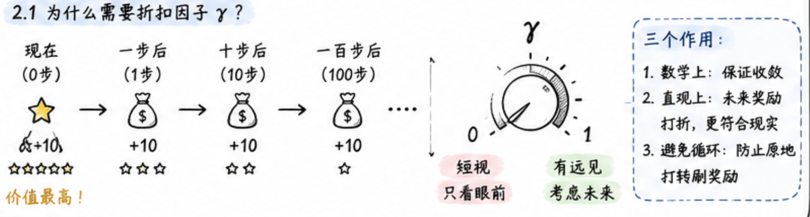
</p>
三个作用：

1. **数学上**：保证无穷时间步下的累计奖励有限（几何级数收敛）
2. **直观上**：眼前的奖励 $R_{t+1}$ 比 $R_{t+100}$ 更有"实感"——迟到 100 步的奖励打个折
3. **避免循环**：如果所有奖励都是正数，没有 $\gamma$ 智能体可能"原地打转"刷奖励

$\gamma$ 越接近 1 → 越"有远见"；越接近 0 → 越"短视"。

#### 2.2 直觉：状态也是分"贵贱"的

<p align='center' style='zoom:100%'>
	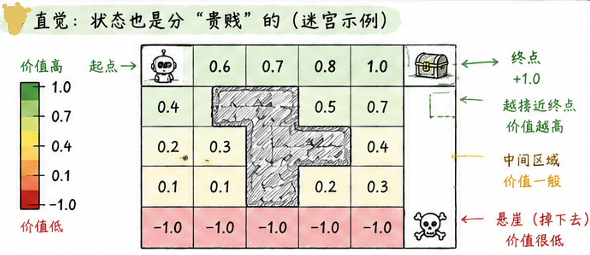
</p>

以迷宫游戏为例：

- 终点格 = +1（值 1.0）
- 起点格 ≈ +0.6（要走 4 步才能到终点，每步折扣 0.9）
- 离悬崖越近 ≈ +0.1（随时可能掉下去）
- 悬崖格 ≈ -1（掉下去就 game over）

$V_\pi(s)$ 实质上是**在告诉智能体"站在这个格子，长期来看能拿多少分"**——它是状态空间的"评分卡"。

---

### 三、动作价值函数 Q_π(s,a) 

**动作价值函数**（`action-value function`）$Q_\pi(s, a)$ 定义为：在状态 $s$ 采取动作 $a$ **之后**再按策略 $\pi$ 走，能获得的期望累计回报。

$$
Q_\pi(s, a) = \mathbb{E}_\pi\left[ \sum_{k=0}^{\infty} \gamma^k R_{t+k} \mid s_t = s,\; a_t = a \right]
$$

对比一下：
<p align='center' style='zoom:100%'>
	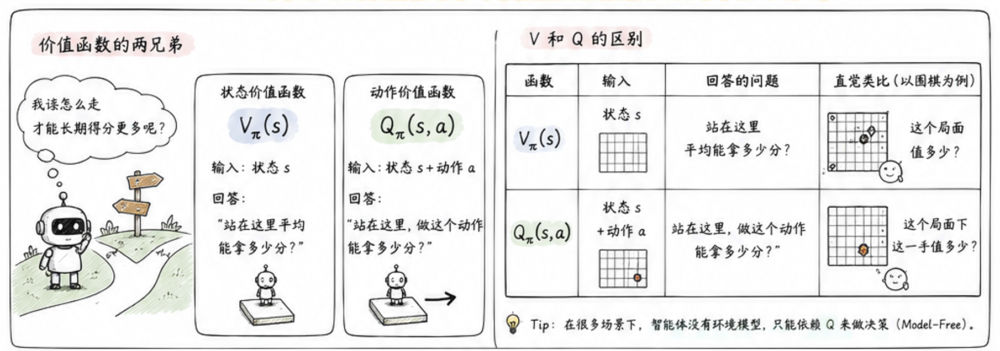
</p>


直觉：以围棋为例，$V_\pi(s)$ 告诉你"这个局面值多少"；$Q_\pi(s, a)$ 告诉你"这个局面**下这一手**值多少"——前者是状态评分，后者是动作评分。

!!! tip "为什么 Q 比 V 更重要"
    在很多场景下，**智能体做决策时只能依赖 Q**：因为它没有"环境模型"，不知道 $a$ 之后会到哪个 $s'$。这就是著名的**Model-Free** 设置，也是 Q-learning 这类算法的立足点。

---

### 四、贝尔曼方程（Bellman Equation） 

价值函数最关键的性质是**递归**：当前状态的价值，可以**用下一状态的价值表示**。这个递推关系就是 **Bellman 方程**，是几乎所有 RL 算法的根。

#### 4.1 V 形式的贝尔曼方程

把 $G_t$ 拆成"第一步奖励 + 之后的折扣"：

$$
V_\pi(s) = \sum_a \pi(a \mid s) \sum_{s', r} p(s', r \mid s, a) \left[ r + \gamma V_\pi(s') \right]
$$

读法：$V_\pi(s)$ = 在状态 $s$ 用策略 $\pi$ 选动作 $a$ → 进入 $s'$ 拿立即奖励 $r$ → 加上折扣后的下一状态价值。
#### 4.2 Q 形式的贝尔曼方程

$$
Q_\pi(s, a) = \sum_{s', r} p(s', r \mid s, a) \left[ r + \gamma \sum_{a'} \pi(a' \mid s') Q_\pi(s', a') \right]
$$

#### 4.3 备份图（Backup Diagram）

<p align='center' style='zoom:100%'>
	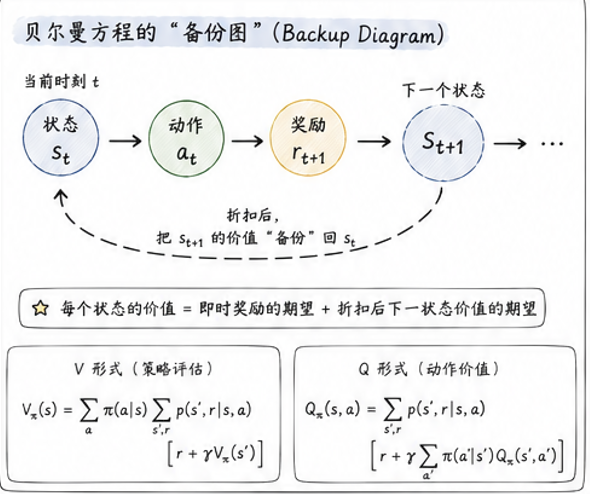
</p>

之所以叫"备份图"（backup diagram）：每个圆点（状态）的价值，是**从下一时间步往回"备份"**——综合所有可能的 $(a, s', r)$ 加权求和得到。这张图能解释几乎所有 DP 类和 TD 类算法的"信息流向"。

!!! note "一句话总结 Bellman 方程"
    > **当前价值 = 即时奖励的期望 + 折扣后下一状态价值的期望**。
    > 本质是把"无穷级数求和"用"递推"代替，复杂度直接从 $O(T)$ 降到 $O(1)$ 一步。

---

### 五、V 和 Q 的关系 

<p align='center' style='zoom:100%'>
	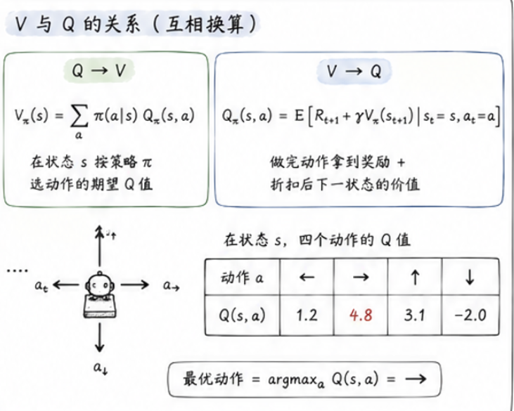
</p>

两个价值函数之间可以互相换算，**记住这两条式子就够用**：

$$
Q_\pi(s, a) = \mathbb{E}\left[ R_{t+1} + \gamma V_\pi(s_{t+1}) \mid s_t = s, a_t = a \right]
$$

$$
V_\pi(s) = \sum_a \pi(a \mid s) \, Q_\pi(s, a)
$$

读法：

- **Q → V**：状态价值是"在状态 $s$ 按策略 $\pi$ 选动作"的期望 Q 值
- **V → Q**：动作价值是"做完动作拿到的奖励 + 折扣后下一状态的价值"

!!! tip "速记法"
    状态不挑动作 → 用 $V$；状态挑了动作 → 用 $Q$。挑不挑动作，**差一条 $\pi(a|s)$**。

---

### 六、最优价值函数 V* 和 Q* 

智能体的终极问题不是"在某个固定策略下值多少"，而是"**最优情况下**能值多少"。

<p align='center' style='zoom:80%'>
	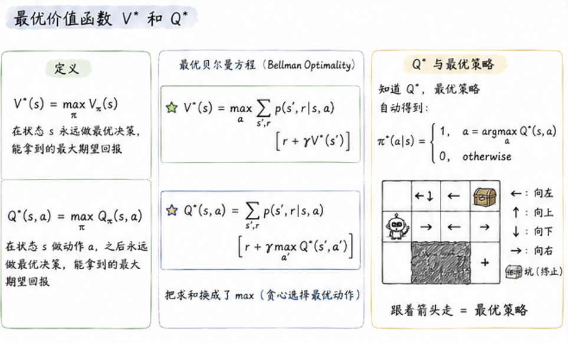
</p>

#### 6.1 定义

$$
V^*(s) = \max_\pi V_\pi(s)
$$

$$
Q^*(s, a) = \max_\pi Q_\pi(s, a)
$$

- $V^*(s)$：在状态 $s$ 永远做最优决策，能拿到的最大期望回报
- $Q^*(s, a)$：在状态 $s$ 做动作 $a$、之后永远做最优决策，能拿到的最大期望回报

#### 6.2 最优贝尔曼方程（Bellman Optimality Equation）

$$
V^*(s) = \max_a \sum_{s', r} p(s', r \mid s, a) \left[ r + \gamma V^*(s') \right]
$$

$$
Q^*(s, a) = \sum_{s', r} p(s', r \mid s, a) \left[ r + \gamma \max_{a'} Q^*(s', a') \right]
$$

唯一区别是把求和换成了 $\max$。这两条式子是**所有 value-based 算法的理论基础**——DQN、Double DQN、Dueling DQN 都在试图逼近这个 $\max$。

#### 6.3 Q* 与最优策略

知道 $Q^*$ 之后，**最优策略一句话就能写出来**：

$$
\pi^*(a \mid s) = \begin{cases} 1, & a = \arg\max_a Q^*(s, a) \\ 0, & \text{otherwise} \end{cases}
$$

这就是为什么 Q-learning 这类算法的目标那么明确：**只要学出 $Q^*$，策略自动出来**。

---

### 七、优势函数 A(s,a) 

**优势函数**（`advantage function`）衡量的是"在状态 $s$ 下，**做动作 $a$ 比平均好多少**"：

$$
A_\pi(s, a) = Q_\pi(s, a) - V_\pi(s)
$$

- $A > 0$：这个动作比平均水平好，应该鼓励
- $A < 0$：这个动作比平均水平差，应该抑制
- $A = 0$：和平均水平一样

<p align='center' style='zoom:60%'>
	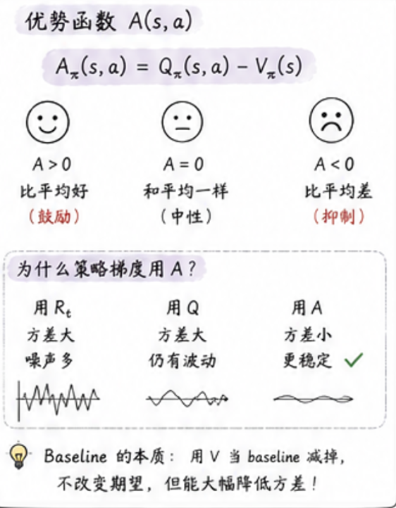
</p>

#### 为什么 PPO/A2C 这些算法都离不开 A

在策略梯度中：

$$
\nabla J(\theta) = \mathbb{E}\left[ \nabla \log \pi_\theta(a|s) \cdot \underbrace{A_\pi(s, a)}_{\text{决定方向}} \right]
$$

- 用 $R_t$（原始奖励）：方差大、噪声多
- 用 $Q$（动作价值）：包含 baseline，方差大
- 用 $A$（优势）：**扣掉了 baseline**，方差最小

!!! tip "Baseline 的本质"
    把 V 当 baseline 减掉，并不会改变梯度的期望（数学上是无偏的），但能**大幅降低方差**。这是 RL 中最重要的方差缩减技巧之一。

---

### 八、价值函数到底有什么用 

最后盘一下，价值函数在 RL 体系里扮演的三个角色：

<p align='center' style='zoom:60%'>
	
</p>

!!! note "扩展阅读"
    - [Sutton & Barto,《Reinforcement Learning: An Introduction》](https://incompleteideas.net/book/the-book.html) 第 3 章（必读神书）
    - [Spinning Up — Key Concepts in RL](https://spinningup.openai.com/en/latest/spinningup/rl_intro.html)（OpenAI 的 RL 入门）
    - [[Reinforcement Learning]] 中其他章节（MDP、策略梯度等）

## RL 策略梯度法

### 原始策略梯度法

>**原始梯度策略法**尽管无法保证我们的优化目标 $J(\theta)$ 在每次更新后稳定上升，但是它的出现也解决了几个核心问题：**优化目标是什么**，**优化目标的梯度**怎么去计算等，又因为**优化目标的梯度**是一个期望，**这个期望**怎么去近似的得到
#### 一、问题的设定：策略是一个神经网络

在 RL 里，我们唯一能"动"的就是**策略**。环境动力学 $P$、奖励函数 $R$，都不是我们能改的。剩下能改的，就是 $\pi$。

<p align='center'>
    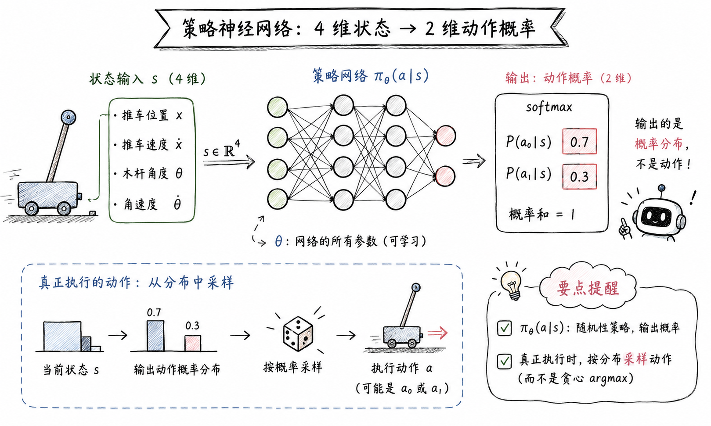
</p>

现代做法：**把策略建模成一个神经网络** $\pi_\theta(a|s)$，$\theta$ 是网络的所有权重。倒立摆例子：

- 输入 $s$：4 维（推车位置、速度、木杆角度、角速度）
- 输出：2 个动作的概率，softmax 归一化（比如 [0.7, 0.3]）

**这里要分清两个角色**：

- $\pi_\theta(a|s)$：**随机性策略**——给状态，输出"采到每个动作的概率"
- 真正执行的动作 $\sim \pi_\theta$：从分布里**采样**出来（贪心 argmax 不是 RL 的玩法）

一句话：**策略网络不直接给动作，而是给动作的概率分布；真正跑游戏时按分布采样**。

---

#### 二、目标函数 J(θ) ⭐⭐⭐

策略网络 $\pi_\theta$ 有了，那"策略好不好"怎么衡量？

**目标函数** $J(\theta)$ 给出答案：

$$
J(\theta) = \mathbb{E}_{\tau \sim \pi_\theta}\left[ G(\tau) \right]
$$

其中：

- $\tau = (S_0, A_0, R_0, S_1, A_1, R_1, \dots)$：一条轨迹
- $G(\tau) = \sum_{t=0}^{T} \gamma^t R_t$：整条轨迹的带折扣的累计回报
- 下标 $\tau \sim \pi_\theta$：轨迹是用当前策略**采出来**的

**读法**：$J(\theta)$ = 在策略 $\pi_\theta$ 下采样很多条轨迹，每条算一个 $G(\tau)$，求平均——这就是这个策略"平均能拿多少分"。

> **两个常被忽略的细节**：
> 
> 1. **$J(\theta)$ 是关于 $\theta$ 的函数**——一旦 $\theta$ 变了，整个轨迹分布就变了
> 2. 我们的目标：**$\arg\max_\theta J(\theta)$**——找一组参数让平均回报最大

---

#### 三、策略梯度定理 ⭐⭐⭐

目标有了：$\max_\theta J(\theta)$。最自然的办法——**梯度上升**。

##### 3.1 难点：J(θ) 没法直接求导

直接对 $J(\theta) = \mathbb{E}_{\tau \sim \pi_\theta}[G(\tau)]$ 求 $\nabla_\theta$ 会卡住： 

$$
\nabla_\theta J(\theta) = \nabla_\theta \sum_\tau \Pr(\tau; \theta) \cdot G(\tau)
$$

这里 $\Pr(\tau; \theta)$ 是轨迹出现的概率（前面 MDP 章节讲过，$p(\tau) = p(s_0) \prod \pi_\theta \cdot p$），它**通过策略间接依赖 $\theta$**。直接对求和里的概率求导数学上能写，但实践上没法高效算。

**最朴素的想法**：让"出现过的、回报高的轨迹"的概率上升。但怎么"上升"——这是 log 技巧登场的地方。

##### 3.2 log 梯度技巧：一行讲透

对一个概率分布 $p_\theta(x)$：

$$
\nabla_\theta \log p_\theta(x) = \frac{\nabla_\theta p_\theta(x)}{p_\theta(x)}
$$

##### 3.3 定理陈述

把 log 技巧套到轨迹上，经过几步推导（见下方折叠框），得到**策略梯度定理**：

$$
\nabla_\theta J(\theta) = \mathbb{E}_{\tau \sim \pi_\theta}\left[ \sum_{t=0}^{T} G(\tau) \cdot \nabla_\theta \log \pi_\theta(A_t \mid S_t) \right]
$$


??? note "推导细节（点击展开）" 

	$$
	\begin{align*} \nabla_\theta J(\theta) &= \nabla_\theta \mathbb{E}_{\tau \sim \pi_\theta}[G(\tau)] \\ &= \nabla_\theta \sum_{\tau} \Pr(\tau|\theta)G(\tau) & (\text{展开期望值}) \\ &= \sum_{\tau} \nabla_\theta (\Pr(\tau|\theta)G(\tau)) & (\text{将 } \nabla_\theta \text{ 移动到 } \sum \text{ 中}) \\ &= \sum_{\tau} \{ G(\tau)\nabla_\theta \Pr(\tau|\theta) + \Pr(\tau|\theta)\nabla_\theta G(\tau) \} & (\text{积的微分}) \\ &= \sum_{\tau} G(\tau)\nabla_\theta \Pr(\tau|\theta) & (\nabla_\theta G(\tau) \text{ 永远为 } 0) \\ &= \sum_{\tau} G(\tau)\Pr(\tau|\theta) \frac{\nabla_\theta \Pr(\tau|\theta)}{\Pr(\tau|\theta)} & (\text{乘以 } \frac{\Pr(\tau|\theta)}{\Pr(\tau|\theta)}) \\ &= \sum_{\tau} G(\tau)\Pr(\tau|\theta) \nabla_\theta \log \Pr(\tau|\theta) & (\text{log 梯度技巧}) \\ &= \mathbb{E}_{\tau \sim \pi_\theta}[G(\tau) \nabla_\theta \log \Pr(\tau|\theta)] \end{align*}
	$$

##### 3.4 直觉：让好的动作概率上升

公式 $\nabla_\theta J = \mathbb{E}[G(\tau) \cdot \nabla_\theta \log \pi_\theta(a|s)]$ 看似抽象，翻译成人话：

<p align='center'>
    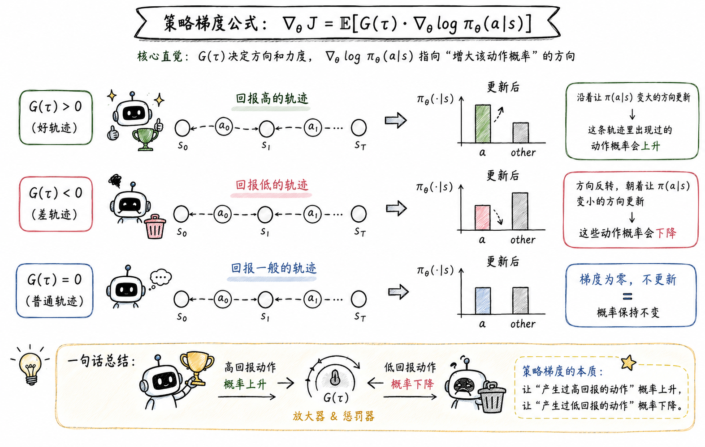
</p>

- **$G(\tau) > 0$（好轨迹）**：$\nabla_\theta \log \pi(a|s)$ 沿"让 $\pi(a|s)$ 变大"的方向走——**这条轨迹里出现过的动作概率会上升**
- **$G(\tau) < 0$（差轨迹）**：方向反转——**这些动作概率会下降**
- **$G(\tau) = 0$（普通）**：梯度为零，不更新

> **一句话**：策略梯度的本质——**让"产生过高回报的动作"概率上升，让"产生过低回报的动作"概率下降**。$G(\tau)$ 既是放大器也是惩罚器。
 
---

#### 四、蒙特卡洛近似：采一条轨迹 ⭐⭐

策略梯度定理是个**期望**——这个期望大部分情况下没法直接算。怎么办？
 
**大数定律**：采 $n$ 条轨迹，把每条轨迹的项加起来取平均。

$$
\nabla_\theta J(\theta) \approx \frac{1}{n} \sum_{i=1}^{n} \sum_{t=0}^{T} G(\tau^{(i)}) \cdot \nabla_\theta \log \pi_\theta(A_t^{(i)} \mid S_t^{(i)})
$$

**最朴素版本：$n=1$**——采一条轨迹就更新一次：

$$
\nabla_\theta J(\theta) \approx \sum_{t=0}^{T} G(\tau) \cdot \nabla_\theta \log \pi_\theta(A_t \mid S_t)
$$

<p align='center'>
    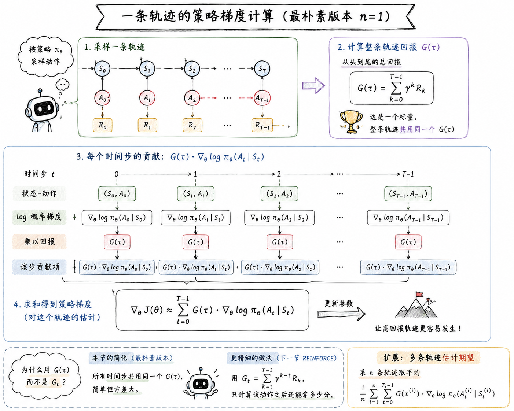
</p>

这就是**原始策略梯度法**的全部数学——**采一条轨迹、算出 $G(\tau)$、对 $\log \pi$ 加权求和、更新参数**。

> **为什么这里用 $G(\tau)$ 而不是 $G_t$**：朴素版偷了个懒——**所有时间步共用同一个 $G(\tau)$**。理论上更精细的做法是用 $G_t = \sum_{k \geq t} \gamma^{k-t} R_k$（"从这个动作之后能拿多少分"），但那是下一节 REINFORCE 的事。这一节先接受这个简化。

---

#### 五、代码实现（PyTorch 版本）

理论落地到代码就 4 块：

##### 5.1 策略网络

```python
# 策略神经网络的定义  
class Policy(nn.Module):  
    def __init__(self):  
        super().__init__()  
        self.l1 = nn.Linear(4, 128) # 推车环境中，状态是一个四维向量  
        self.l2 = nn.Linear(128, 2) # 输出两个动作，左转和右转  
  
    # x是一个带batch的张量: [batch_size, dim]  
    def forward(self, x):  
        x = F.relu(self.l1(x))  
        x = F.softmax(self.l2(x), dim=-1)
        return x
```

##### 5.2 定义 Agent

```python
class Agent:  
    def __init__(self):  
        self.gamma = 0.9 # 折扣因子  
        self.lr = 0.0002 # 学习率  
        self.action_size = 2 # 动作空间  
  
        self.pi = Policy(self.action_size) # 当前 Agent 的大脑：策略网络  
        self.optimizer = torch.optim.Adam(self.pi.parameters(), lr=self.lr)  
  
    # 输入环境状态，输出动作  
  
    def get_action(self, state):  
        # state 是一个一维张量，所以传入 pi 之前，添加批次维度  
        probs = self.pi(state.unsqueeze(0)).squeeze(0)  # [action_size, ]  
        # 根据动作的概率创建一个概率分布  
        m =  Categorical(probs)  
  
        # 采样得到概率分布 𝜋𝜃(𝑎𝑡|𝑠𝑡)  
        action = m.sample()  
        
        # 返回一个元组（动作，动作概率分布）  
        return action, probs
        
    
    # 采集一条轨迹的详细数据  
	def collect_trajectory(self, env):  
	    state = env.reset()  
	    states, actions, rewards = [], [], []  
	    done = False  
	  
	    while not done:  
	        action, _ = self.get_action(state)  
	        next_state, reward, done, _ = env.step(action)  
	  
	        states.append(state) # s_t  
	        actions.append(action) # a_t  
	        rewards.append(reward) # r_t  
	        state = next_state # s_{t+1}  
	  
	        rewards.append(reward)  
	  
		return states, actions, rewards
```

##### 5.3 更新策略

```python
class Agent:
	#...（接5.2代码）
	# 更新策略  
	def update(self, trajectory):  
	    states, actions, rewards = trajectory  
	  
	    # 逆序计算 G(r)    
	    G = 0  
	    for r in rewards[::-1]:  
	        G = r + self.gamma * G  
	  
	    # 计算策略网络的损失函数  
	    loss = 0  
	    for s, a in zip(states, actions):  
	        probs = self.pi(torch.tensor(s).unsqueeze(0)).squeeze(0)  
	        log_probs = torch.log(probs[a])  
	        loss += -log_probs * G  
	        # 下面是并行版本，也就是多了批次信息  
	        # states = torch.tensor(states)  
	        # actions = torch.tensor(actions).view(-1, 1)        
	        # log_probs = torch.log(self.pi(states).gather(1, actions))        
	        # loss = -torch.sum(log_probs) * G  
	        
	    # 优化策略网络  
	    self.optimizer.zero_grad()  
	    loss.backward()  
	    self.optimizer.step()
		
```

##### 5.4 训练循环

```python
import gym  
  
env = gym.make('CartPole-v0')  
agent = Agent()  
return_list = []  
episode_list = []  
  
for i_episode in range(1000):  
    # 采集一条轨迹  
    trajectory = agent.collect_trajectory(env)  
    reward_list = trajectory[2]  
    return_list.append(sum(reward_list))  
    episode_list.append(i_episode)  
    # 更新策略  
    agent.update(trajectory)  
  
    if i_episode % 100 == 0:  
        print("回合:{}, 总奖励:{:.1f}".format(i_episode, sum(reward_list)))
```

!!! tip "代码与公式的对应"
    - `policy(s)`：$\pi_\theta(\cdot|s)$
    - `probs[0, a]`：$\pi_\theta(A_t \mid S_t)$
    - `loss = -log_prob * G`：恰好是 $-G(\tau) \log \pi_\theta(A_t|S_t)$，对 `loss` 做梯度下降 = 对 $J$ 做梯度上升

---
#### 六、原始梯度策略法的局限

原始策略梯度**能跑通**——倒立摆 1000-3000 个 episode 就能学会平衡。但是它无法保证我们的优化目标 $J(\theta)$ 稳定上升，主要有 3 个明显问题：

!!! warning "G(τ) 噪声极大"
    $G(\tau)$ 来自**整条轨迹**的实际回报——它把"运气"也算进去了。

    **例子**：同样一个"向左推"，第一次正好避开了悬崖拿了 +200，第二次运气差掉进悬崖拿了 -50。两次更新的方向**完全相反**——但策略可能根本没变。

    直觉上：**$G(\tau)$ 的大波动会让更新方向抖得很厉害**，训练曲线剧烈震荡。

!!! warning "所有时间步共用同一个 G(τ)"
    朴素版里，整条轨迹所有 $t$ 用的都是同一个 $G(\tau)$——但**动作的好坏应该用"它之后的回报"来评价，不是整条轨迹的回报**。

    一个在 $t=199$ 的动作好不好，跟 $t=0$ 的动作好不好是两件事——但朴素版把它们的"分数"标成同一个 $G(\tau)$。

!!! warning "G(τ) 太大太小都会崩"
    - $G(\tau) = +1000$：梯度步长 $\alpha \cdot G \cdot \nabla\log\pi$ 巨大，参数可能飞出合理范围
    - $G(\tau) = -1000$：反方向一步飞出去
    - 极端情况：策略崩溃——**刚学会的策略被一次极端奖励彻底打乱**

!!! note "三个问题的共同根源"
    三个问题其实是一回事——**$G(\tau)$ 本身方差太大**。

    下一节我们要做的核心改动只有一件：**给 $G(\tau)$ 减方差**。最经典的做法就是**加 baseline**——把 $G(\tau)$ 减去一个跟状态有关、跟动作无关的"基线分数"。数学上无偏、方差大降。带着这个钩子，进入 REINFORCE 和带基线的 REINFORCE。

 
