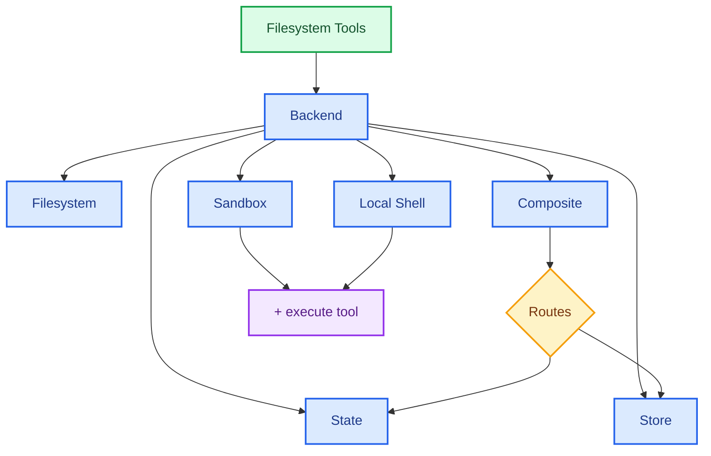

# DeepAgents 

> 基于 LangChain + LangGraph 的 Agent Harness 框架

## DeepAgents 简介

### DeepAgents 是什么？

`deepagents` 是一个 **Agent Harness**（智能体框架），用于构建能够处理复杂、多步骤任务的 AI Agent。它基于 LangChain 核心构建，使用 LangGraph 运行时提供持久化执行、流式输出、人机协同等功能。内置了任务规划、用于上下文管理的文件系统、子代理生成和长期记忆能力

如 [官方定义](https://docs.langchain.com/oss/python/deepagents/overview) 所述：构建 LLM 驱动的智能体和应用最简单的方式——内置任务规划、用于上下文管理的文件系统、子代理生成和长期记忆能力。你可以用 DeepAgents 处理任何任务，包括复杂的多步任务。

```python
from deepagents import create_deep_agent

def get_weather(city: str) -> str:
    """Get weather for a given city."""
    return f"It's always sunny in {city}!"

agent = create_deep_agent(
    tools=[get_weather],
    system_prompt="You are a helpful assistant",
)

# 运行 Agent
agent.invoke(
    {"messages": [{"role": "user", "content": "what is the weather in sf"}]}
)
```

DeepAgents 本质上是一个增强的工具调用循环（tool calling loop），但内置了规划、文件系统、子代理等能力。关于 Framework、Runtime 和 Harness 的分层关系，详见 [LangChain 官方概念文档](https://docs.langchain.com/oss/python/concepts/products)。

### 安装

=== "pip"

    ```bash
    pip install -qU deepagents
    ```

=== "uv"

    ```bash
    uv add deepagents
    ```

### 核心特性

| 特性       | 说明                               |
| -------- | -------------------------------- |
| 规划与任务分解  | 内置 `write_todos` 工具，自动拆解复杂任务     |
| 上下文管理    | 文件系统工具 + 自动摘要，防止上下文溢出            |
| Shell 执行 | 沙箱环境下运行 shell 命令                 |
| 可插拔文件系统  | 支持内存/本地磁盘/LangGraph Store/沙箱等后端  |
| 子代理生成    | 内置 `task` 工具，生成专用子代理隔离上下文        |
| 长期记忆     | 跨会话持久化记忆（LangGraph Memory Store） |
| 人机协同     | 敏感操作需人工审批（human-in-the-loop）     |
| Skills   | 可复用的专业技能扩展                       |
| 模型无关     | 支持任意支持 tool calling 的模型          |

### 何时使用 DeepAgents

当你的 Agent 需要以下能力时，选择 DeepAgents：

- 处理**复杂多步任务**，需要规划和分解
- 管理**大量上下文**，需要文件系统工具
- 需要**子代理**分工协作
- 需要**跨会话持久化记忆**
- 需要**人机协同审批**流程

> 构建简单 Agent 时，建议使用 LangChain 的 [`create_agent`](https://docs.langchain.com/oss/python/langchain/agents) 或自定义 [LangGraph](https://docs.langchain.com/oss/python/langgraph/overview) 工作流。

### 框架、运行时、Harness 的关系

> 详细内容可参考 [Frameworks, runtimes, and harnesses](https://docs.langchain.com/oss/python/concepts/products)。

LangChain 生态提供三个不同层级的工具，各司其职：

```
LangChain（框架：抽象 + 集成）
  └── LangGraph（运行时：持久化、流式、状态机）
        └── DeepAgents（Harness：内置工具 + 预设提示 + 子代理）
```

| 维度       | 框架（LangChain）                          | 运行时（LangGraph）   | Harness（DeepAgents）    |
| -------- | -------------------------------------- | ---------------- | ---------------------- |
| **核心价值** | 抽象、集成                                  | 持久化执行、流式、人机协同    | 预设工具、预设提示、子代理          |
| **适用场景** | 快速上手、标准化开发                             | 低层控制、长时间有状态工作流   | 自主性强的 Agent、复杂非确定性任务   |
| **同类产品** | Vercel AI SDK、CrewAI、OpenAI Agents SDK | Temporal、Inngest | Claude Agent SDK、Manus |

---

## DeepAgents 快速开始

以下示例构建一个具备网络搜索能力的研究助手 Agent，使用 Tavily 搜索引擎和 DashScope（通义千问）模型。完整示例可参考 [官方 Quickstart](https://docs.langchain.com/oss/python/deepagents/quickstart)。

#### 安装依赖

=== "pip"

    ```bash
    pip install -qU deepagents tavily-python python-dotenv langchain langchain-openai
    ```

=== "uv"

    ```bash
    uv add deepagents tavily-python python-dotenv langchain langchain-openai
    ```

#### 配置环境变量

创建 `.env` 文件或在代码中设置以下环境变量：

```
TAVILY_API_KEY=your_tavily_api_key
DASHSCOPE_API_KEY=your_dashscope_api_key
BASE_URL=your_base_url  # 可选
```

```python
import os
from typing import Literal

from dotenv import load_dotenv
from langchain.chat_models import init_chat_model
from tavily import TavilyClient
from deepagents import create_deep_agent

load_dotenv()
tavily_client = TavilyClient(api_key=os.getenv("TAVILY_API_KEY"))
```

#### 定义工具

自定义一个网络搜索工具，支持指定结果数量、主题类型和是否包含原始内容：

```python
def internet_search(
    query: str,
    max_results: int = 5,
    topic: Literal["general", "news", "finance"] = "general",
    include_raw_content: bool = False,
):
    """Run a web search"""
    return tavily_client.search(
        query,
        max_results=max_results,
        include_raw_content=include_raw_content,
        topic=topic,
    )
```

#### 创建 Agent

定义研究指令并创建 Agent：

```python
research_instructions = """You are an expert researcher.
When asked a question, use the internet_search tool to find relevant information.
Always cite your sources and provide comprehensive answers."""

agent = create_deep_agent(
    model=init_chat_model(
        model='openai:qwen3.5-flash',
        api_key=os.getenv('DASHSCOPE_API_KEY'),
        base_url=os.getenv("BASE_URL")
    ),
    tools=[internet_search],
    system_prompt=research_instructions,
)
```

#### 运行 Agent

```python
result = agent.invoke({
    "messages": [{"role": "user", "content": "LangChain 是什么，它下的 DeepAgents 又是什么?"}]
})
print(result["messages"][-1].content)
```

实际开发中推荐使用 `agent.stream()` 替代 `invoke` 以获得实时反馈。

---

## DeepAgents 流式输出

> 本节内容基于 [Deep Agents Streaming](https://docs.langchain.com/oss/python/deepagents/quickstart#streaming) 与 [LangGraph Streaming](https://docs.langchain.com/oss/python/langgraph/streaming) 官方文档整理。

DeepAgents 底层基于 LangGraph 运行时，因此**流式输出 API 与 LangGraph 完全一致**（`agent.stream()` / `agent.astream()`）。

### 理解 v1 vs v2 的返回结构

LangGraph 的流式 API 支持 `version="v1"` 和 `version="v2"` 两种返回格式，**v2 是推荐版本**。它们的核心差异在于返回结构的统一性：

| 版本     | 调用方式       | 返回值类型                    | 返回结构                                    |
| ------ | ---------- | ------------------------ | --------------------------------------- |
| **v1** | `stream()` | `dict`                   | `{node_name: state_update}`             |
| **v1** | `invoke()` | `dict`                   | `{"messages": [...]}`                   |
| **v2** | `stream()` | `StreamPart` (dict-like) | `{"type": ..., "ns": ..., "data": ...}` |
| **v2** | `invoke()` | `GraphOutput`            | `{value: state, interrupts: (...)}`     |

**v2 相比 v1 的核心变化：**

- **流式返回**：从裸字典变为 `{"type", "ns", "data"}` 三层统一包装，通过 `type` 字段区分事件类型
- **非流式返回**：从裸 `dict` 变为 `GraphOutput` 对象，新增 `interrupts` 属性支持人机协同中断检查
- **命名空间（`ns`）**：v2 新增了子图命名空间字段，根图为空元组 `()`

### 常用模式速查

#### Updates 模式（最常用）

观察每个节点完成后的状态变更：

```python
for chunk in agent.stream(
    {"messages": [{"role": "user", "content": "介绍一下 Python 的 async/await"}]},
    stream_mode="updates",
    version="v2",
):
    for node_name, state in chunk["data"].items():
        print(f"Node `{node_name}` updated: {state}")
```

#### Messages 模式（Token 级流式）

实时展示 LLM 生成的每个 token，最适合用户交互场景：

```python
for chunk in agent.stream(inputs, stream_mode="messages", version="v2"):
    if chunk["type"] == "messages":
        msg, metadata = chunk["data"]
        if msg.content:
            print(msg.content, end="", flush=True)
```

#### Custom 模式

在自定义工具或中间件中发送自定义数据：

```python
from langgraph.config import get_stream_writer

def my_tool(query: str):
    writer = get_stream_writer()
    writer({"status": "searching...", "query": query})
    # ... 执行搜索
    return results

# 消费自定义数据
for chunk in agent.stream(inputs, stream_mode="custom", version="v2"):
    if chunk["type"] == "custom":
        print(f"进度: {chunk['data']['status']}")
```

#### 多模式组合

同时监听多种事件类型：

```python
for chunk in agent.stream(
    inputs,
    stream_mode=["updates", "messages"],
    version="v2",
):
    if chunk["type"] == "updates":
        for node, state in chunk["data"].items():
            print(f"节点 {node} 完成")
    elif chunk["type"] == "messages":
        msg, _ = chunk["data"]
        if msg.content:
            print(msg.content, end="", flush=True)
```

### Stream Modes 速查

| 模式 | 说明 |
|------|------|
| `values` | 每步后的**完整 State** |
| `updates` | 每步后的 **State 更新**（仅变化的字段） |
| `messages` | LLM **token 级别流式输出** |
| `custom` | **自定义数据**流式输出 |
| `debug` | 最全信息 |

> 子图流式、按 tags/node 过滤等进阶用法，详见 [LangGraph 流式输出](LangGraph.md#streaming) 或 [LangGraph Streaming 官方文档](https://docs.langchain.com/oss/python/langgraph/streaming)。

---


## DeepAgents 创建 Agent

> 本节整理自 [Customize Deep Agents](https://docs.langchain.com/oss/python/deepagents/customization) 官方文档。

`create_deep_agent` 是 DeepAgents 的核心工厂函数，返回一个编译好的 `CompiledStateGraph`（即 LangGraph 图）。它把模型、工具、系统提示词、中间件、子代理等配置统一组装成一个可运行的 Agent。

### 模型配置

> 完整配置说明见 [Model Configuration](https://docs.langchain.com/oss/python/deepagents/customization#model) 与 [Supported Models](https://docs.langchain.com/oss/python/deepagents/models)。

DeepAgents 支持三种方式传入模型，从简到繁：

=== "字符串快捷"

    适合快速测试，直接传 `provider:model` 格式的字符串。
    底层会自动调用 `init_chat_model()` 完成初始化。

    ```python
    from deepagents import create_deep_agent

    agent = create_deep_agent(model="openai:gpt-5")
    agent = create_deep_agent(model="anthropic:claude-sonnet-4-6")
    ```

=== "init_chat_model"

    推荐使用。可以精细控制 `temperature`、`max_retries`、`timeout` 等参数，
    同时保持跨提供商的统一接口。

    ```python
    from langchain.chat_models import init_chat_model
    from deepagents import create_deep_agent

    model = init_chat_model(
        model="openai:gpt-5",
        temperature=0.7,
        max_retries=6,   # 默认 6 次重试
        timeout=120,     # 请求超时时间
    )
    agent = create_deep_agent(model=model)
    ```

=== "模型类"

    适合需要使用特定提供商专属参数的场景，
    比如 OpenAI 的 `seed` 参数、Anthropic 的 `betas` 等。

    ```python
    from langchain_openai import ChatOpenAI
    from deepagents import create_deep_agent

    model = ChatOpenAI(model="gpt-5", temperature=0.7, seed=42)
    agent = create_deep_agent(model=model)
    ```

!!! tip "连接韧性"
    LangChain 聊天模型默认启用**指数退避重试**（网络错误、429、5xx），最多重试 **6 次**。
    不稳定网络可调高 `max_retries=10~15`，配合 checkpointer 保证进度不丢失。

### 自定义工具

> 详见 [Tools](https://docs.langchain.com/oss/python/deepagents/customization#tools) 官方文档。

在 DeepAgents 中，你只需将自定义工具传入 `tools` 参数，
**内置工具会自动合并**，无需手动注册。

```python
from deepagents import create_deep_agent

def get_weather(city: str) -> str:
    """获取指定城市的天气信息。"""
    return f"{city} 今天晴天，25°C"

agent = create_deep_agent(
    tools=[get_weather],
)
```


!!! warning "注意"
	工具一定要有类型注解和 docstring，这是 agent 理解工具的途径。

### 系统提示词

DeepAgents 自带一份详细的内置系统提示词，包含规划、文件系统、子代理的使用说明。
当你传入自定义 `system_prompt` 时，它会被**追加**到内置提示词之后。

```python
from deepagents import create_deep_agent

research_prompt = """\
你是一位资深研究员。你的任务是进行深入研究，\
并撰写一份结构完整的报告。\
"""

agent = create_deep_agent(
    system_prompt=research_prompt,
)
```

!!! tip "提示词设计建议"
    自定义提示词只需定义 Agent 的"角色"和"输出规范"，
    不需要重复写如何使用工具——内置提示词已经包含了。

### 中间件（Middleware）

> 详见 [Middleware](https://docs.langchain.com/oss/python/deepagents/customization#middleware) 官方文档。

中间件是 DeepAgents 的**扩展机制**，类似于 Web 框架的中间件概念。
每个中间件可以注入工具、拦截工具调用、修改系统提示词，或实现自定义钩子。

#### 默认中间件

`create_deep_agent` 默认包含 6 个中间件：

| 中间件 | 功能 |
|--------|------|
| `TodoListMiddleware` | 注入 `write_todos` 工具，管理任务列表 |
| `FilesystemMiddleware` | 注入文件系统工具（read/write/edit/list） |
| `SubAgentMiddleware` | 注入 `task` 工具，管理子代理生命周期 |
| `SummarizationMiddleware` | 上下文过长时自动摘要压缩 |
| `AnthropicPromptCachingMiddleware` | Anthropic 模型 Prompt 缓存优化 |
| `PatchToolCallsMiddleware` | 自动修复被中断的工具调用历史 |

当启用 memory、skills 或 human-in-the-loop 时，还会自动注入对应的中间件。

#### 自定义中间件

通过 `@wrap_tool_call` 装饰器可以实现**工具调用拦截**，
类似于 AOP（面向切面编程），在工具执行前后注入自定义逻辑：

```python
from langchain.tools import tool
from langchain.agents.middleware import wrap_tool_call
from deepagents import create_deep_agent

call_count = [0]

@wrap_tool_call
def log_tool_calls(request, handler):
    """拦截并记录每次工具调用。"""
    call_count[0] += 1
    tool_name = request.name if hasattr(request, 'name') else str(request)
    print(f"[中间件] 调用 #{call_count[0]}: {tool_name}")

    result = handler(request)  # 执行工具

    print(f"[中间件] 调用 #{call_count[0]} 完成")
    return result

agent = create_deep_agent(
    tools=[get_weather],
    middleware=[log_tool_calls],
)
```


!!! warning "并发安全"
    不要在中间件中使用 `self.counter += 1` 这种原地 mutation，
    子代理和并行工具会引发竞态条件。
    需要跨调用追踪状态时，使用 **graph state** 代替。

### 子代理（Subagents）

[Subagents](https://docs.langchain.com/oss/python/deepagents/customization#subagents)是DeepAgents 处理**上下文隔离**和**专业分工**的核心机制。

当一个任务涉及多个领域（研究 + 数据分析 + 可视化）时，
把所有工具和上下文塞给一个 Agent 会导致上下文膨胀、注意力分散。
子代理让每个 Agent 只关注自己擅长的事：

```python
from deepagents import create_deep_agent

research_subagent = {
    "name": "research-agent",
    "description": "用于深度研究问题",             # 主代理根据描述决定何时委派
    "system_prompt": "你是一位资深研究员",
    "tools": [internet_search],
    # "model": "openai:gpt-5",  # 可选：覆盖主代理模型
}

agent = create_deep_agent(
    model="claude-sonnet-4-6",
    subagents=[research_subagent],
)
```

```
主 Agent（协调者）
  ├── research-agent：深度研究
  └── analysis-agent：数据分析
```

!!! tip "与内置 task 工具的关系"
    自定义子代理会注册到内置 `task` 工具中，主代理自行判断何时委派。
    不传 `subagents` 时，`task` 工具仍可用（LLM 会即时生成子代理）。

#### 使用 CompiledSubAgent

对于更复杂的场景，可以使用 `CompiledSubAgent` 包装自定义 LangGraph 图或 `create_agent` 生成的图作为子代理：

```python
from deepagents import create_deep_agent, CompiledSubAgent
from langchain.agents import create_agent

# 用 create_agent 创建一个自定义图
custom_graph = create_agent(
    model=your_model,
    tools=specialized_tools,
    prompt="You are a specialized agent for data analysis..."
)

# 包装为 CompiledSubAgent
custom_subagent = CompiledSubAgent(
    name="data-analyzer",
    description="Specialized agent for complex data analysis tasks",
    runnable=custom_graph
)

agent = create_deep_agent(
    model="claude-sonnet-4-6",
    subagents=[custom_subagent],
)
```

这种方式适合以下场景：

- 子代理需要**自定义图结构**（非简单的工具调用循环）
- 使用 `create_agent` 快速构建子代理
- 完全自定义的 LangGraph 图作为子代理

> 注意：自定义 LangGraph 图必须包含 `"messages"` 状态键。

### 后端（Backends）

> 详见 [Backends 完整官方文档](https://docs.langchain.com/oss/python/deepagents/backends)。

后端（Backend）决定了 Agent 的**虚拟文件系统**存储在哪里。
DeepAgents 的文件系统工具（`ls`、`read_file`、`write_file`、`edit_file`、`glob`、`grep`）都通过后端实现，
Skills 和 Memory 也需要将文件预先放入后端。

#### 后端总览

| 后端 | 持久化 | 适用场景 |
|------|--------|----------|
| `StateBackend` | 否（单线程内临时） | 默认，开发测试 |
| `FilesystemBackend` | 本地磁盘 | 本地开发、CI |
| `LocalShellBackend` | 本地磁盘 + Shell | 本地编码助手 |
| `StoreBackend` | 是（跨线程持久化） | 生产部署 |
| `CompositeBackend` | 混合路由 | 多后端组合 |
| 沙箱（Modal/Daytona/Deno） | 隔离环境 | 不可信代码执行 |



!!! tip "后端选择建议"
    - 只需要临时存储？ → `StateBackend`（默认，无需配置）
    - 需要本地磁盘持久化？ → `FilesystemBackend(root_dir="...", virtual_mode=True)`
    - 需要跨线程持久化？ → `StoreBackend(namespace=...)`
    - 需要混合策略？ → `CompositeBackend(...)`
    - 需要执行 Shell 命令？ → `LocalShellBackend`（本地）或沙箱（生产）

#### 内置后端详解

##### StateBackend（默认）

最简后端，将文件存储在 LangGraph Agent State 中（仅限当前线程）：

```python
# 默认即为 StateBackend，无需配置
agent = create_deep_agent()

# 等价于
from deepagents.backends import StateBackend
agent = create_deep_agent(backend=StateBackend())
```

- 通过检查点（checkpointer）在**同一线程的多轮对话中**持久化
- 子代理写入的文件在执行完毕后仍保留在 state 中，可供主代理和其他子代理访问
- **适合**：Agent 的临时工作区、大型工具输出自动清理后按需读取

##### FilesystemBackend（本地磁盘）

读写本地磁盘真实文件，**必须配置 `root_dir`**：

```python
from deepagents.backends import FilesystemBackend

agent = create_deep_agent(
    backend=FilesystemBackend(root_dir=".", virtual_mode=True)
)
```

!!! warning "安全警告"
    `FilesystemBackend` 赋予 Agent 直接的文件系统读写权限。
    
    - **适用场景**：本地开发 CLI、CI/CD 流水线
    - **不适用场景**：Web 服务器、HTTP API（应改用 `StateBackend`、`StoreBackend` 或沙箱）
    - **安全风险**：Agent 可读取 `.env`、API 密钥等敏感文件
    - **务必**设置 `virtual_mode=True`：阻止 `..`、`~` 和 `root_dir` 外的绝对路径
    - `virtual_mode=False` 即使设置了 `root_dir` 也**不提供任何安全保障**

##### LocalShellBackend（本地 Shell）

`FilesystemBackend` + `execute` 工具，Agent 可直接在你的机器上执行 Shell 命令：

```python
from deepagents.backends import LocalShellBackend

agent = create_deep_agent(
    backend=LocalShellBackend(
        root_dir=".",
        env={"PATH": "/usr/bin:/bin"}  # 可选：限制环境变量
    )
)
```

!!! danger "极高安全风险"
    此后端赋予 Agent **任意 Shell 命令执行权限** + 文件系统读写。
    
    - 命令以你的用户权限直接运行，**无沙箱隔离**
    - 文件修改和命令执行**不可撤销**
    - **仅限**：本地开发环境、你信任 Agent 的场景
    - **强烈建议**：配合 [HITL 中间件](#人机协同human-in-the-loop) 审批敏感操作
    - `virtual_mode=True` 在 Shell 访问下**无效**，命令可访问系统任意路径

##### StoreBackend（跨线程持久化）

基于 LangGraph `BaseStore` 的持久化后端，**支持跨线程持久存储**：

```python
from langgraph.store.memory import InMemoryStore
from deepagents.backends import StoreBackend

agent = create_deep_agent(
    backend=StoreBackend(
        namespace=lambda rt: (rt.server_info.user.identity,),
    ),
    store=InMemoryStore(),  # 本地开发用；部署到 LangSmith 时省略
)
```

- **适合**：已配置 LangGraph Store 的部署（Redis、Postgres 等），或通过 [LangSmith 部署](https://docs.langchain.com/langsmith/deployment)（平台自动提供 Store）

**命名空间工厂（namespace）** — 控制数据隔离粒度，`deepagents>=0.5.2` 接收 LangGraph `Runtime` 对象：

=== "Per-user"

    每个用户独立存储（多用户部署推荐）：

    ```python
    StoreBackend(namespace=lambda rt: (rt.server_info.user.identity,))
    ```

=== "Per-assistant"

    同一助手的所有用户共享存储：

    ```python
    StoreBackend(namespace=lambda rt: (rt.server_info.assistant_id,))
    ```

=== "Per-thread"

    按会话隔离：

    ```python
    StoreBackend(namespace=lambda rt: (rt.execution_info.thread_id,))
    ```

!!! warning "namespace 参数"
    `deepagents>=0.5.0` 起 `namespace` 为**必填参数**。
    不提供时使用 `assistant_id` 作为默认值，所有用户共享同一存储。
    多用户部署必须显式设置 namespace 工厂。

##### CompositeBackend（路由组合）

根据路径前缀将文件操作路由到不同后端：

```python
from deepagents import create_deep_agent
from deepagents.backends import CompositeBackend, StateBackend, StoreBackend
from langgraph.store.memory import InMemoryStore

agent = create_deep_agent(
    backend=CompositeBackend(
        default=StateBackend(),
        routes={
            "/memories/": StoreBackend(
                namespace=lambda rt: (rt.server_info.user.identity,),
            ),
        },
    ),
    store=InMemoryStore(),  # store 传给 create_deep_agent，而非 backend
)
```

路由规则：

- `/workspace/plan.md` → `StateBackend`（临时）
- `/memories/agent.md` → `StoreBackend`（持久化）
- `ls`、`glob`、`grep` 会聚合所有后端结果并保留原始路径前缀
- **更长前缀优先**（如 `/memories/projects/` 优先于 `/memories/`）

#### 权限系统（Permissions）

通过 `FilesystemPermission` 声明式控制 Agent 能读写哪些路径，规则在后端调用之前评估：

```python
from deepagents import create_deep_agent, FilesystemPermission
from deepagents.backends import CompositeBackend, StateBackend, StoreBackend

agent = create_deep_agent(
    backend=CompositeBackend(
        default=StateBackend(),
        routes={"/memories/": StoreBackend(namespace=lambda rt: (rt.server_info.user.identity,))},
    ),
    permissions=[
        FilesystemPermission(
            operations=["write"],  # 限制写操作
            paths=["/policies/**"],
            mode="deny",           # 拒绝匹配的路径
        ),
    ],
)
```

- 支持 `read`、`write`、`edit`、`delete` 等操作粒度
- 支持 `allow` / `deny` 两种模式
- 支持 `**` 通配符匹配子目录
- 子代理可配置独立的权限规则

> 完整选项（规则排序、子代理权限、CompositeBackend 交互）见 [Permissions 官方文档](https://docs.langchain.com/oss/python/deepagents/permissions)。

#### 沙箱后端

沙箱提供隔离的文件系统 + `execute` 工具，**完全不影响本地机器**。
适合让 Agent 执行不可信代码的场景。

| 沙箱 | 特点 | 安装 |
|------|------|------|
| **Modal** | 云端沙箱，无需本地部署 | `pip install langchain-modal` |
| **Daytona** | 隔离开发环境 | `pip install langchain-daytona` |
| **Deno** | 轻量级运行时隔离 | `pip install langchain-deno` |
| **本地 VFS** | 本地虚拟文件系统 | 内置 |

```python
# Modal 沙箱示例
import modal
from langchain_modal import ModalSandbox

app = modal.App.lookup("your-app")
sandbox = modal.Sandbox.create(app=app)

agent = create_deep_agent(
    backend=ModalSandbox(sandbox=sandbox),
)
```

> 各沙箱的详细配置见 [Sandboxes 官方文档](https://docs.langchain.com/oss/python/deepagents/sandboxes)。

#### 迁移指南

!!! note "Factory 模式已废弃"
    旧版通过工厂函数传递后端的方式已标记为废弃，会输出警告。
    现在后端内部通过 LangGraph 的 `get_config()` / `get_store()` / `get_runtime()` 自动解析上下文，
    **直接传实例即可**。

| 旧版（废弃） | 新版（推荐） |
|------|------|
| `backend=lambda rt: StateBackend(rt)` | `backend=StateBackend()` |
| `backend=lambda rt: StoreBackend(rt)` | `backend=StoreBackend(namespace=...)` |
| `backend=lambda rt: CompositeBackend(default=StateBackend(rt), ...)` | `backend=CompositeBackend(default=StateBackend(), ...)` |

**BackendContext → Runtime 迁移（`deepagents>=0.5.2`）：**

```python
# 旧版（v0.7 移除）
StoreBackend(namespace=lambda ctx: (ctx.runtime.context.user_id,))  # [!code --]
# 新版
StoreBackend(namespace=lambda rt: (rt.server_info.user.identity,))  # [!code ++]
```

### 人机协同（Human-in-the-loop）

> 详见 [Deep Agents Human-in-the-loop](https://docs.langchain.com/oss/python/deepagents/human-in-the-loop) 与 [LangChain HITL 中间件](https://docs.langchain.com/oss/python/langchain/human-in-the-loop) 官方文档。

HITL（Human-in-the-loop）中间件让你可以在 Agent 的工具调用中加入人工审批。
当模型提议执行可能敏感的操作（写文件、执行 SQL）时，中间件会暂停执行并等待人工决策。

#### 执行生命周期

```
Agent 调用模型生成响应
  → 中间件 after_model hook 检测工具调用
    → 匹配 interrupt_on 策略
      → 需要审批 → 发起 interrupt，图状态持久化，暂停等待
      → 不需要  → 直接执行工具
人工决策（approve / edit / reject）
  → Command(resume=...) 恢复执行
```

!!! tip "Checkpointer 是必须的"
    人机协同依赖 LangGraph 的持久化层来保存中断时的图状态。
    没有 checkpointer，暂停后状态会丢失，无法恢复。

#### 配置方式

**方式一：interrupt_on 字典**（`create_deep_agent` 专用，推荐）

`interrupt_on` 参数接收一个字典，映射工具名到中断配置：

```python
from langchain.tools import tool
from langgraph.checkpoint.memory import MemorySaver
from deepagents import create_deep_agent

@tool
def delete_file(path: str) -> str:
    """删除文件。"""
    return f"已删除 {path}"

@tool
def read_file(path: str) -> str:
    """读取文件。"""
    return f"文件内容: {path}"

@tool
def send_email(to: str, subject: str, body: str) -> str:
    """发送邮件。"""
    return f"已发送邮件给 {to}"

checkpointer = MemorySaver()

agent = create_deep_agent(
    model="claude-sonnet-4-6",
    tools=[delete_file, read_file, send_email],
    interrupt_on={
        "delete_file": True,   # 默认：approve / edit / reject
        "read_file": False,    # 不需要中断
        "send_email": {"allowed_decisions": ["approve", "reject"]},
    },
    checkpointer=checkpointer,
)
```

**方式二：HumanInTheLoopMiddleware 中间件**（通用方式）

适用于 `create_agent` 或需要更细粒度控制的场景：

```python
from langchain.agents import create_agent
from langchain.agents.middleware import HumanInTheLoopMiddleware
from langgraph.checkpoint.memory import InMemorySaver

agent = create_agent(
    model="gpt-4.1",
    tools=[write_file_tool, execute_sql_tool, read_data_tool],
    middleware=[
        HumanInTheLoopMiddleware(
            interrupt_on={
                "write_file": True,
                "execute_sql": {"allowed_decisions": ["approve", "reject"]},
            },
            description_prefix="工具执行待审批",  # 中断消息前缀
        ),
    ],
    checkpointer=InMemorySaver(),
)
```

#### 决策类型

| 决策 | 说明 | 使用场景 |
|------|------|----------|
| `approve` | 按 Agent 原始参数执行 | 发送邮件草稿 |
| `edit` | 修改工具参数后执行 | 修改邮件收件人 |
| `reject` | 拒绝并返回反馈消息 | 拒绝草稿并说明如何重写 |

按风险级别分级配置：

```python
interrupt_on = {
    # 高风险：完整控制权（批准 / 编辑 / 拒绝）
    "delete_file": {"allowed_decisions": ["approve", "edit", "reject"]},
    "send_email": {"allowed_decisions": ["approve", "edit", "reject"]},

    # 中风险：不允许编辑，只能批准或拒绝
    "write_file": {"allowed_decisions": ["approve", "reject"]},

    # 必须批准（不允许拒绝）
    "critical_operation": {"allowed_decisions": ["approve"]},

    # 低风险：不需要中断
    "read_file": False,
}
```

!!! warning "保守编辑"
    当使用 `edit` 修改工具参数时，建议保守修改。
    大幅改动原始参数可能导致模型重新评估其策略，意外地多次执行工具或采取未预期的行为。

#### 处理中断

调用 Agent 后检查 `result.interrupts`，确认是否被中断：

```python
from langgraph.types import Command

config = {"configurable": {"thread_id": "my-thread"}}

# 首次调用
result = agent.invoke(
    {"messages": [{"role": "user", "content": "删除 temp.txt 文件"}]},
    config=config,
    version="v2",
)

# 检查是否被中断
if result.interrupts:
    interrupt_value = result.interrupts[0].value
    action_requests = interrupt_value["action_requests"]
    review_configs = interrupt_value["review_configs"]

    # 查看待审批的操作
    for action in action_requests:
        print(f"工具: {action['name']}, 参数: {action['args']}")

    # 做出决策
    decisions = [{"type": "approve"}]

    # 恢复执行（必须使用相同的 config！）
    result = agent.invoke(
        Command(resume={"decisions": decisions}),
        config=config,
        version="v2",
    )

print(result.value["messages"][-1].content)
```

#### 决策的三种形式

**✅ approve — 批准执行**

```python
decisions = [{"type": "approve"}]
```

**✏️ edit — 编辑后执行**

```python
decisions = [{
    "type": "edit",
    "edited_action": {
        "name": "send_email",  # 必须包含工具名
        "args": {"to": "team@company.com", "subject": "...", "body": "..."}
    }
}]
```

**❌ reject — 拒绝并反馈**

```python
decisions = [{
    "type": "reject",
    "message": "不应该删除生产环境的文件，请先备份",
}]
```

`message` 会作为 ToolMessage 回传进对话历史，帮助 Agent 理解拒绝原因及下一步该做什么。

#### 批量中断

当 Agent 一次调用多个需要审批的工具时，所有中断会**合并为一个**：

```python
result = agent.invoke(
    {"messages": [{"role": "user", "content": "删除 temp.txt 并发送邮件给管理员"}]},
    config=config,
    version="v2",
)

if result.interrupts:
    action_requests = result.interrupts[0].value["action_requests"]

    # 两个工具都需要审批
    assert len(action_requests) == 2

    # 按顺序提供决策
    decisions = [
        {"type": "approve"},   # 第一个工具：delete_file
        {"type": "reject", "message": "先不要发送邮件"},  # 第二个工具：send_email
    ]

    result = agent.invoke(
        Command(resume={"decisions": decisions}),
        config=config,
        version="v2",
    )
```

!!! tip "决策顺序必须匹配"
    `decisions` 列表必须与 `action_requests` 顺序一一对应。

#### 流式 + 人机协同

将 `stream()` 与 HITL 结合，可以实时观察 Agent 进度并在中断时即时响应：

```python
for chunk in agent.stream(
    {"messages": [{"role": "user", "content": "删除旧记录"}]},
    config=config,
    stream_mode=["updates", "messages"],
    version="v2",
):
    if chunk["type"] == "messages":
        token, _ = chunk["data"]
        if token.content:
            print(token.content, end="", flush=True)
    elif chunk["type"] == "updates":
        # 检测中断
        if "__interrupt__" in chunk["data"]:
            print(f"\n\n中断: {chunk['data']['__interrupt__']}")

# 恢复 + 流式
for chunk in agent.stream(
    Command(resume={"decisions": [{"type": "approve"}]}),
    config=config,
    stream_mode=["updates", "messages"],
    version="v2",
):
    if chunk["type"] == "messages":
        token, _ = chunk["data"]
        if token.content:
            print(token.content, end="", flush=True)
```

#### 子代理中断

每个子代理可拥有独立的 `interrupt_on` 配置，覆盖主代理的设置：

```python
agent = create_deep_agent(
    tools=[delete_file, read_file],
    interrupt_on={
        "delete_file": True,
        "read_file": False,
    },
    subagents=[{
        "name": "file-manager",
        "description": "管理文件操作",
        "system_prompt": "你是一个文件管理助手",
        "tools": [delete_file, read_file],
        "interrupt_on": {
            "delete_file": True,
            "read_file": True,  # 子代理中读取也需要审批
        }
    }],
    checkpointer=checkpointer,
)
```

#### 工具内中断（interrupt 原语）

子代理的工具可以直接调用 `interrupt()` 函数暂停执行：

```python
from langgraph.types import interrupt

def request_approval(action_description: str) -> str:
    """请求人工审批。"""
    approval = interrupt({
        "type": "approval_request",
        "action": action_description,
        "message": f"请审批或拒绝: {action_description}",
    })

    if approval.get("approved"):
        return f"操作 '{action_description}' 已批准"
    else:
        return f"操作 '{action_description}' 被拒绝"
```

恢复时传递自定义的审批信息：

```python
result = agent.invoke(
    Command(resume={"approved": True}),
    config=config,
    version="v2",
)
```


### 技能（Skills）

> 详见 [Skills](https://docs.langchain.com/oss/python/deepagents/customization#skills) 官方文档。

Skills 是 DeepAgents 的**按需加载能力包**。
与 Tools 不同，Skills 不是 Python 函数，而是包含使用说明、参考信息和模板的**文件集合**（通常是 `SKILL.md`）。

关键区别在于**加载时机**：

- Tools 始终在上下文中（占用 Token）
- Skills 只在 Agent 判断需要时才加载（**渐进式披露**，节省 Token）

```python
from deepagents import create_deep_agent

agent = create_deep_agent(
    skills=["/skills/"],  # 指定技能目录路径
)
```

一个典型的 Skill 结构：
```
/skills/langgraph-docs/
├── SKILL.md          # 使用说明 + 触发条件
├── reference.md      # 参考文档
└── templates/        # 模板文件
```

!!! tip "Skills vs Tools"
    | 对比 | Tools | Skills |
    |------|-------|--------|
    | 内容 | 低层操作（文件读写、规划） | 高层指导 + 参考信息 + 模板 |
    | 加载时机 | 始终可用 | Agent 判断需要时才加载 |
    | 形式 | Python 函数 | SKILL.md 文件 + 资源 |
    | 适用场景 | 具体操作 | 复杂流程指导 |

### 记忆（Memory）

> 详见 [Memory](https://docs.langchain.com/oss/python/deepagents/customization#memory) 官方文档。

通过 `AGENTS.md` 文件（遵循 [agents.md](https://agents.md/) 规范）为 Agent 提供额外上下文。
这些文件会在 Agent 启动时自动加载，作为"长期记忆"：

```python
from deepagents import create_deep_agent

agent = create_deep_agent(
    memory=["/AGENTS.md"],  # 指定记忆文件路径
)
```

与 Checkpointer 的区别：Checkpointer 保存的是**对话进度**，
Memory 保存的是**背景知识**。前者让 Agent 断点续跑，后者让 Agent 记住你是谁。

### 结构化输出

> 详见 [Structured Output](https://docs.langchain.com/oss/python/deepagents/customization#structured-output) 与 [Response Format](https://docs.langchain.com/oss/python/langchain/structured-output#response-format)。

当你的下游系统需要**固定格式**的数据时（API 响应、数据库写入等），
`response_format` 可以让 Agent 输出符合 Pydantic 模型的结构化数据：

```python
from pydantic import BaseModel, Field
from deepagents import create_deep_agent

class WeatherReport(BaseModel):
    """结构化的天气报告。"""
    location: str = Field(description="城市名称")
    temperature: float = Field(description="当前温度（°C）")
    condition: str = Field(description="天气状况")
    forecast: str = Field(description="未来 24 小时预报")

agent = create_deep_agent(
    response_format=WeatherReport,
)

result = agent.invoke({
    "messages": [{"role": "user", "content": "北京天气如何？"}]
})

print(result["structured_response"])
# location='北京' temperature=25.0 condition='晴' forecast='未来24小时持续晴朗'
```

结构化数据会存入结果的 `"structured_response"` 字段，
同时正常对话内容仍在 `"messages"` 中。

---


## DeepAgents 内置工具
        
`create_deep_agent` 除了接收自定义工具外，还会**自动注入内置工具**，这些工具是 DeepAgents 区别于普通 Agent 的核心能力。

### 任务规划（write_todos）

DeepAgents 内置 `write_todos` 工具，Agent 会自动将复杂任务拆解为可追踪的子任务列表：

```python
# Agent 收到复杂问题后，会先调用 write_todos 拆解任务
# 示例流程：
# 1. Research topic A
# 2. Research topic B
# 3. Synthesize findings
# 4. Write final report
```

!!! tip "自动规划"
    不需要手动调用，LLM 会根据问题复杂度自动决定是否使用 `write_todos`。
    用户可实时看到任务列表和完成进度。

### 文件系统

文件系统用于管理 Agent 的上下文，防止长任务中上下文窗口溢出。
Agent 通过 `read_file`、`write_file`、`edit_file`、`ls` 等工具操作虚拟文件系统。

> **文件系统的后端配置详见上方 [后端（Backends）](#后端backends) 章节**，支持 `StateBackend`（默认）、`FilesystemBackend`（本地磁盘）、`StoreBackend`（跨线程持久化）、`CompositeBackend`（路由组合）以及沙箱后端。

!!! tip "自动摘要"
    当上下文过长时，Agent 会自动将中间内容摘要后写入文件，释放上下文空间。

### Shell 执行

Agent 可以在沙箱环境下执行 Shell 命令，适用于数据分析、文件操作、脚本执行等场景：

```python
agent = create_deep_agent(
    model=init_chat_model("gpt-4o"),
    # 启用 shell 执行（默认开启）
)

# Agent 可以执行类似命令：
# ls -la /data
# python analyze.py --input results.csv
# curl https://api.example.com/data
```

!!! warning "安全注意"
    Shell 执行默认在沙箱环境中，但仍建议在生产环境配置 `SandboxFileSystem` 隔离风险。

### 子代理（task 工具）

内置 `task` 工具允许 Agent 生成专用子代理，每个子代理拥有独立的上下文和工具集：

```python
# Agent 内部调用 task 工具的示意流程：
# 1. 主 Agent 分析任务，决定需要子代理
# 2. 调用 task(
#      description="分析这份数据集",
#      system_prompt="你是一个数据分析专家...",
#      tools=[load_dataset, run_analysis]
#    )
# 3. 子代理独立执行，返回结果
# 4. 主 Agent 汇总所有子代理结果
```

```
主 Agent（协调者）
  ├── 子代理 A：数据分析专家
  ├── 子代理 B：可视化专家
  └── 子代理 C：报告撰写专家
```

!!! tip "与 LangGraph Subgraph 的区别"
    DeepAgents 的 `task` 是**运行时动态生成**的子代理，无需预先定义图结构。
    LangGraph Subgraph 需要**编译时预定义**图节点和边。

### 长期记忆

通过 LangGraph Memory Store 实现跨会话持久化记忆：

```python
from langgraph.store.memory import InMemoryStore
from deepagents import create_deep_agent

store = InMemoryStore()

agent = create_deep_agent(
    model=init_chat_model("gpt-4o"),
    store=store,  # 挂载记忆存储
)

# 多次调用保持记忆
agent.invoke({"messages": [...]}, config={"configurable": {"thread_id": "1"}})
agent.invoke({"messages": [...]}, config={"configurable": {"thread_id": "1"}})  # 记住上次内容
```

!!! note "Checkpointer vs Store"
    | 组件 | 作用 | 绑定 |
    |------|------|------|
    | **Checkpointer** | 线程内进度保存 | `thread_id` |
    | **Store** | 跨线程长期记忆 | `user_id` |
    详见 [LangGraph](LangGraph.md)「Memory Store」部分。

### 内置工具总览

| 工具 | 触发方式 | 作用 |
|------|----------|------|
| `write_todos` | 自动 | 任务拆解与进度追踪 |
| 文件系统 | 自动 | 上下文管理、文件读写 |
| Shell 执行 | 自动 | 沙箱命令执行 |
| `task` | 自动 | 动态生成子代理 |
| 记忆检索 | 自动 | 跨会话信息回忆 |

!!! tip "不需要手动注册"
    以上工具由 `create_deep_agent` **自动注入**，无需手动添加到 `tools` 列表。
    只需传入自定义工具，内置工具会自动加上。

---
