## LLM 概述

**LLM**（`Large Language Model`，大语言模型）是指在**海量无标注文本数据**上进行预训练得到的大型语言模型。通过学习大规模语料中的语言规律，模型能够理解、生成和推理自然语言文本。典型代表包括 `GPT` 系列、`DeepSeek`系列、`Qwen` 系列等。

大体现在三个方面：

- 一是**参数量大**，模型通常拥有数十亿到上万亿个参数
- 二是**预训练数据量大**，涵盖多语言、多领域的庞大语料
- 三是**能力强大**，具备跨任务的泛化与生成能力，能够在问答、摘要、翻译、编程等多种场景下展现出类似人类的语言理解和表达水平


## LLM 发展历程

> 下面用 GPT 系列来讲述 LLM 发展的历程。
### GPT 1

**GPT-1**（Generative Pre-trained Transformer-1）是 OpenAI 于 2018 年 6 月 发布的首个生成式预训练语言模型，其研究成果发表于论文《[Improving Language Understanding by Generative Pre-Training](https://cdn.openai.com/research-covers/language-unsupervised/language_understanding_paper.pdf)》。

GPT-1 系统化地验证并推广了“**预训练（Pre-training）+ 微调（Fine-tuning）**”的训练范式：模型先在大规模无标注语料上进行语言建模预训练，再利用少量有监督数据在特定任务上微调。该方法显著提升了模型的迁移能力，使单一预训练模型能够适配多种自然语言任务。

#### 1. 模型架构

GPT-1 的架构属于 **Decoder-only**，本质上就是 **Transform** 的 **Decoder** 堆叠而成，每个 **Decoder** 由 **Masked Multi Self Attention** 层、**FNN** 这两个核心子层组成，并通过 **LayerNorm** 与残差连接保持稳定的梯度传播。

<p align='center' style='zoom:60%'>
	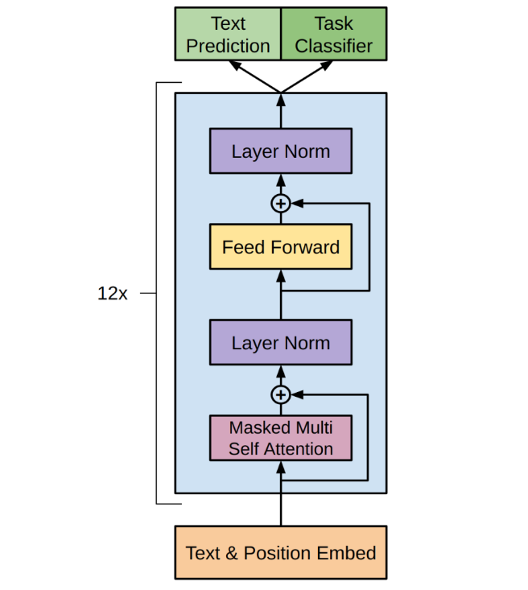
</p>


GPT-1 的架构创新主要可以概括为三点：

- **Decoder-only 结构**：从 Encoder-Decoder 架构简化为Decoder-only 结构，以适配自回归生成任务。
- **可学习位置嵌入**：使用可学习位置嵌入，取代正弦位置编码，使模型能够在训练过程中自适应地学习词序关系。
- **权重共享机制**：输入嵌入层与输出词表权重共享，减少参数量并提升训练稳定性。


#### 2. 模型参数

| **参数项**                    | **数值** |
| -------------------------- | ------ |
| **模型层数（Layers）**           | 12     |
| **隐藏维度（Hidden Size）**      | 768    |
| **注意力头数（Attention Heads）** | 12     |
| **前馈层维度（FFN Size）**        | 3072   |
| **参数总量**                   | 1.17 亿 |


#### 3. 模型训练

GPT-1 的训练采用了“**预训练（Pre-training） + 微调（Fine-tuning）**”的两阶段范式。

预训练阶段就是在海量的未标注的文本语料上以 “Next-Token Prediction” 为目标，去训练模型，从而让模型学会通用的语言建模能力、了解广泛的世界知识、具备初步的推理能力。

<p align='center' style='zoom:60%'>
	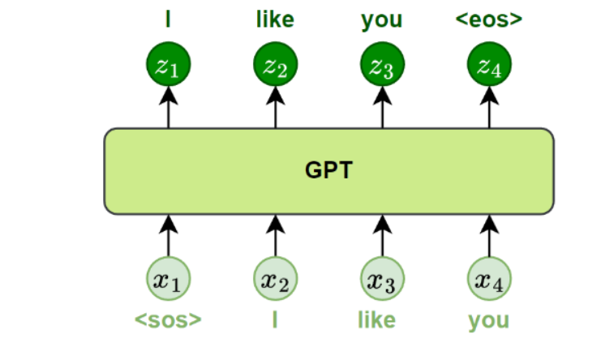
</p>

在**微调阶段（Fine-tuning）**，通过在模型顶部加入轻量的**任务分类层**（Task Classifier），并在少量标注数据上进行**有监督训练**，模型能够快速适应不同任务场景。结果表明，微调后的 GPT-1 在多个 NLP 任务上显著优于从零训练的传统模型，验证了“预训练—微调”范式的有效性与通用性。


### GPT 2

GPT-2是 OpenAI 于 2019 年发布的第二代生成式预训练语言模型，相关研究发表于论文《[Language Models are Unsupervised Multitask Learners](https://cdn.openai.com/better-language-models/language_models_are_unsupervised_multitask_learners.pdf)》。GPT-2 延续了GPT-1的 Transformer Decoder-only 架构，但参数规模提升了10倍。
#### 1.  模型架构

GPT-2 延续了 GPT-1 的 **Transformer Decoder-only** 架构。只不过是堆叠的解码器更多了。同时，相比于 GPT-1，GPT-2采用了 Pre-LayerNorm 来缓解梯度传播不稳定的问题。具体原理在之后的 Pre-Norm 和 Post-Norm 的讲解会介绍。


<p align='center' >
	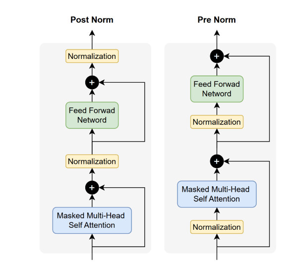
</p>

#### 2. 模型参数

| **参数项**                    | **数值** |
| -------------------------- | ------ |
| **模型层数（Layers）**           | 48     |
| **隐藏维度（Hidden Size）**      | 1600   |
| **注意力头数（Attention Heads）** | 25     |
| **前馈层维度（FFN Size）**        | 6400   |
| **参数总量**                   | 15.42亿 |

#### 3. 模型训练

GPT-2 的训练仍采用 **自回归语言建模（Autoregressive Language Modeling）** 目标，即在给定前文的条件下预测下一个词（Next Token Prediction），以学习文本的语法与语义规律。  

模型使用了 OpenAI 构建的 **WebText** 数据集，规模约 **40GB**，包含约 **800 万篇网页内容**，涵盖新闻、小说、科技、娱乐、社交等多个领域，为模型提供了更广泛的语言风格与知识来源。


### GPT 3

GPT-3是 OpenAI 于 2020 年 5 月发布的第三代生成式预训练语言模型，研究成果发表于论文《[Language Models are Few-Shot Learners](https://arxiv.org/pdf/2005.14165)》。

GPT-3 的核心创新在于首次系统提出并验证了“**上下文学习（In-Context Learning）**” 的概念：模型在使用阶段无需额外训练，仅依靠输入文本中的任务描述及少量示例即可理解并完成任。


#### 1.  模型架构

GPT-3 延续了 **Transformer Decoder-only** 架构，但参数规模较 GPT-2 提升约百倍，达到了1750亿。

架构方面，与 GPT-2 相比，GPT-3 的主要区别在于在各个 **Transformer Block** 中交替使用**稠密注意力**（Dense Attention）和**局部带状稀疏注意力**（Locally Banded Sparse Attention）模式。

<p align='center' style='zoom:70%'>
	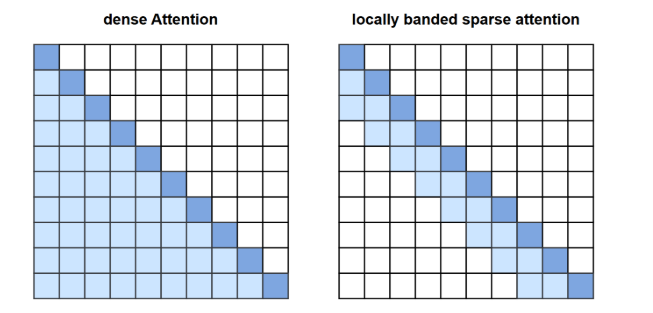
</p>

#### 2. 模型参数

| **参数项**                    | **数值** |
| -------------------------- | ------ |
| **模型层数（Layers）**           | 96     |
| **隐藏维度（Hidden Size）**      | 12288  |
| **注意力头数（Attention Heads）** | 96     |
| **前馈层维度（FFN Size）**        | 49152  |
| **参数总量**                   | 1750 亿 |


#### 3. 模型训练

GPT-3 依旧采用 自回归语言建模（Autoregressive Language Modeling） 方式进行训练。训练数据约 570GB，包含约3000亿token，覆盖新闻、百科、文学与学术等领域。

模型在数千块 **NVIDIA V100 GPU** 上进行分布式并行训练，耗时数周完成。


### InstructGPT

InstructGPT 是 OpenAI 于 2022 年初推出的生成式预训练语言模型，是 GPT-3 的改进版本，也是后续 ChatGPT 的直接前身。其研究成果发表于论文《[Training language models to follow instructions with human feedback](https://arxiv.org/pdf/2203.02155)》。

GPT-3 再文本生成方面取得了巨大的成功，但是 GPT-3 在很多时候，无法给出很好的回答，这是因为 GPT-3 在训练过程中的目的是 “next token prediction”，所以，GPT-3 可能无法很好的理解人类指令的含义。

InstructGPT 在 GPT-3 基础上引入**指令对齐训练**，从而使模型能够更准确地理解并执行人类指令。

#### 1. 模型架构

InstructGPT延续了GPT-3的架构。只是新增了额外的训练阶段

#### 2. 模型训练

InstructGPT 的训练以 GPT-3 的预训练语言模型为基础，进一步采用了**三阶段训练范式**，具体步骤如下图所示：

<p align='center' style='zoom:70%'>
	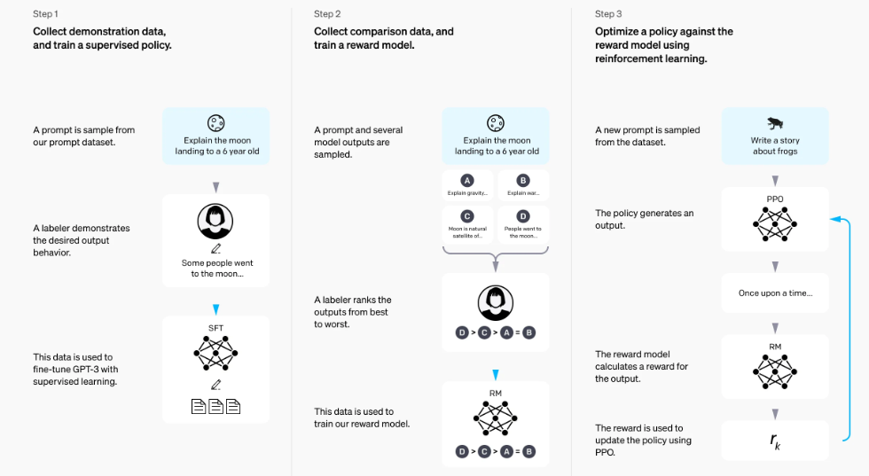
</p>

**1、监督微调**（Supervised Fine-tuning, SFT）

在第一阶段，OpenAI 收集了由人工标注者撰写的高质量 “**指令-回答**” 样本，组成训练数据集。这些样本覆盖常见的用户指令及对应的理想响应，具有较高的语言质量。

在训练过程中，模型在这些“指令-回答”对上进行监督微调，训练目标仍为“给定前文预测下一个词”。
<p align='center' style='zoom:70%'>
	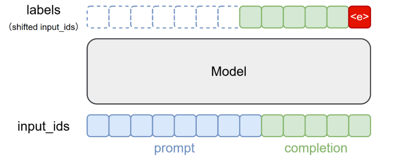
</p>

2、**奖励模型（Reward Model, RM）**

第二阶段构建奖励模型，用于后续强化学习过程中的反馈评估器，具体过程如下：

（1）使用经过 SFT 微调后的模型，针对同一条指令生成多个候选回答

（2）工标注者根据回答的质量、相关性、礼貌性、有用性等维度，对这些回答进行排序

（3）利用排序结果训练一个奖励模型，使其能够为任意给定回答输出一个偏好评分


3、**强化学习（Reinforcement Learning from Human Feedback, RLHF）**

这一阶段的核心目标是：**通过人类偏好引导模型输出更加符合人类意图的回答**。它以第二阶段训练好的**奖励模型**为评分工具，使用**强化学习算法**（PPO），对第一步经过SFT微调的语言模型进行进一步优化。


##### 3. 模型能力

InstructGPT 相较于原始的 GPT-3，在多个维度上表现出更优的能力，主要体现在以下几个方面：

- **指令理解能力增强**
- **输出质量更贴合人类偏好**
- **无关、虚假或有害内容减**


### ChatGpt

ChatGPT 是 OpenAI 于 2022 年 11 月发布的一种具备对话能力的大型语言模型。它支持连续的自然语言交互，能够回答后续问题、承认错误、质疑用户前提、拒绝不当请求，在用户体验与安全性方面取得显著改进。


#### 1. 模型架构

ChatGPT 是与 InstructGPT 同一技术路线下的兄弟模型，架构设计与 InstructGPT 类似，但具体细节未公开。

#### 2. 模型训练

ChatGPT 的训练方法采用与 InstructGPT 相同的人类反馈强化学习（RLHF）策略，其核心区别在于**数据集的设计与处理方式。**

为了更好的处理多轮对话这样的场景，ChatGPT 使用了**特别构建的对话格式数据集**。至于训练的目标，还是 "next token prediction“，如下图：

<p align='center' style='zoom:70%'>
	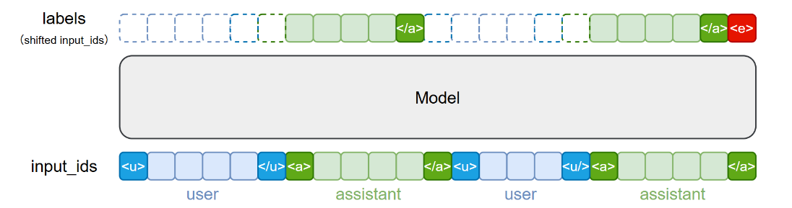
</p>

## LLM 架构

### LLM 基础架构

大型语言模型（LLM）大多基于 **Transformer** 架构构建，其中最常见的是 **Decoder-only** 架构。这一架构最早由 GPT 系列采用，并逐渐成为当前大多数主流模型的标准设计。LLM 的核心能力——理解语言、建模上下文、生成文本，都源于 Transformer 的模块化结构与高度可扩展性。

从整体上看，一个典型的 LLM 可以分为 **输入层**、**Transformer Block** 堆叠层和 **输出层** 三个部分：

<p align='center' style='zoom:70%'>
	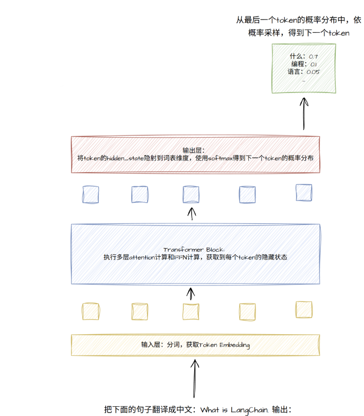
</p>


### LLM 架构演进


模型真正的演进主要体现在内部组件层面，包括**注意力机制**、**前馈网络**、**归一化**与**残差结构**以及**位置编码**等模块的持续改进。

#### 位置编码

由于 Transformer 的自注意力机制（Self-Attention）并不包含序列顺序信息，模型无法仅依靠注意力计算来判断 token 在序列中的相对位置。因此，需要向输入中显式加入位置编码（Position Encoding），以补充序列的位置信息。

##### 正余弦位置编码

**1）概述**

正余弦位置编码（Sinusoidal Positional Encoding）是原始 [Transformer](https://arxiv.org/abs/1706.03762) 中采用的位置编码方式，它通过一组预定义的正弦与余弦函数为每个序列位置生成唯一向量：

$$
\begin{aligned}
PE(pos, 2i) &= \sin\left(\frac{pos}{10000^{2i/d}}\right) \\[4pt]
PE(pos, 2i+1) &= \cos\left(\frac{pos}{10000^{2i/d}}\right)
\end{aligned}
$$

其中：

- $pos$：Token 的绝对位置
- $i$：维度对的索引
- $d$：总维度

**2）特点**

!!! tip "特点"

    - **无需训练**：编码由固定函数生成，不引入任何可学习参数，使用简单，不会随训练发生漂移。
    - **隐含相对位置信息**：正余弦位置编码的结构使其能够携带 token 之间的相对位置信息。

    下面对 **隐含相对位置信息** 这一特性做详细解释。

    正余弦位置编码的各维度是按频率成对排列的，每一对由同一频率对应的正弦值和余弦值组成。从位置 $m$ 和位置 $n$ 的位置编码中，任意选取一对频率为 $\omega$ 的维度进行观察：

    $$
    \begin{aligned}
    PE_{\omega}(m) &= \begin{pmatrix} \sin(\omega m) & \cos(\omega m) \end{pmatrix} \\[4pt]
    PE_{\omega}(n) &= \begin{pmatrix} \sin(\omega n) & \cos(\omega n) \end{pmatrix}
    \end{aligned}
    $$

    在 Transformer 中，注意力权重由 $q$ 向量与 $k$ 向量的内积决定：

    $$
    AttentionScore_{m,n} = q_m k_n^{\mathsf{T}}
    $$

    考察这两组位置编码分量的内积：

    $$
    PE_{\omega}(m) PE_{\omega}(n)^{\mathsf{T}} = \sin(\omega m)\sin(\omega n) + \cos(\omega m)\cos(\omega n)
    $$

    利用三角恒等式可得：

    $$
    PE_{\omega}(m) PE_{\omega}(n)^{\mathsf{T}} = \cos\bigl(\omega (m - n)\bigr)
    $$

    这一结果直接反映了位置 $m$ 与位置 $n$ 之间的相对位置关系，且其他频率的维度也具备相同的形式。因此，在采用正余弦位置编码的情况下，两个 token 的注意力评分中会包含相对位置信息。

**3）缺陷**

!!! warning "缺陷"

    尽管正余弦位置编码具有良好的数学结构，其向量间的内积可直接反映相对位置关系，但在实际的 Transformer 注意力计算中，这种优势并不能完全有效发挥。

    注意力计算中，评分为 $score(m,n) = q_m k_n^{\mathsf{T}}$，其中：

    $$
    \begin{aligned}
    q_m &= (e_m + PE_m) W_Q \\
    k_n &= (e_n + PE_n) W_K
    \end{aligned}
    $$

    代入并令 $A = W_Q W_K^{\mathsf{T}}$，展开可得：

    $$
    score(m,n) = e_m A e_n^{\mathsf{T}} + e_m A PE_n^{\mathsf{T}} + PE_m A e_n^{\mathsf{T}} + PE_m A PE_n^{\mathsf{T}}
    $$

    其中，仅有最后一项 $PE_m A PE_n^{\mathsf{T}}$ 明确体现了位置编码之间的相互作用，是唯一直接与相对位置相关的部分。但由于矩阵 $A = W_Q W_K^{\mathsf{T}}$ 是可学习参数，会在训练中不断变化，原本正余弦编码所具备的几何结构难以稳定保持。模型必须通过额外的学习来重新塑造或校正这种相对位置信息，而这种重建过程往往并不可靠，导致正余弦位置编码在理论上的优势无法在实践中完全体现。

##### 可学习位置编码

**1）概述**

可学习位置编码（Learned Positional Embedding）是另一种常见的位置编码方式，曾广泛应用于早期的 Transformer 预训练模型（如 [BERT](https://arxiv.org/abs/1810.04805)、GPT-1/2 等）中。在这种方法中，模型为序列中的每个位置分配一个独立的可训练向量，这些向量在训练过程中与模型的其他参数一同更新，使模型能够从实际任务数据中自动学习位置表示。

**2）特点**

!!! tip "特点"

    - **灵活性高**：位置向量完全由数据驱动学习，不受固定数学函数约束，能够更贴合训练语料的分布特点。
    - **训练方式简单**：其优化方式与词向量一致，实现成本低，不需要额外的结构设计，便于直接集成到 Transformer 中。

**3）缺陷**

!!! warning "缺陷"

    - **缺乏长度外推能力**：可学习位置编码只在训练过的位置范围内定义，超出最大序列长度的位置没有对应的嵌入，导致模型无法在推理阶段处理更长的输入序列。
    - **参数量随序列长度线性增长**：位置向量数量与最大序列长度成正比，当需要支持长上下文时，参数开销迅速增大。

##### 旋转位置编码 ⭐⭐⭐

**1）概述**

**旋转位置编码**（Rotary Position Embedding，**RoPE**）由国内研究者苏剑林在 [RoFormer](https://arxiv.org/abs/2104.09864) 论文中提出。与传统将**位置编码与词向量相加**的方式不同，RoPE 直接作用于 $q$ 和 $k$ 向量本身，使注意力计算能够更好地体现 token 之间的相对位置关系。在实践中，RoPE 表现稳定，尤其适用于长序列建模，因此已成为当前 LLM 普遍采用的位置编码方案。


**2）原理**


RoPE 的设计目标是让注意力得分能够直接体现 token 之间的相对位置差，可表示为：

$$
score(m,n) = func(q_m,\; k_n,\; m-n)
$$

即注意力评分仅依赖于第 $m$ 个位置的 query 向量 $q_m$、第 $n$ 个位置的 key 向量 $k_n$，以及两者之间的相对位置差 $m-n$。

为实现这一目标，RoPE 将 $q$ 和 $k$ 向量按维度**两两分组**，把每一对**相邻维度**视为一个**二维子向量**，并对每个**二维子向量施加与位置及维度相关的旋转**，如下图所示：

<p align='center' >
	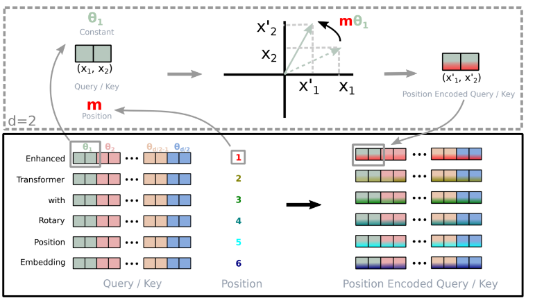
</p>


位置 $m$ 的 token，其 $q$ 和 $k$ 向量的第 $i$ 对二维子向量会旋转 $m \cdot \theta_i$ 的角度，$\theta_i$ 的定义如下：

$$
\theta_i = 10000^{-2i/d}
$$

其中 $d$ 表示 $q$ 和 $k$ 向量的维度。

下面以位置 $m$ 对位置 $n$ 的注意力评分为例，说明 RoPE 是如何实现其设计目标的。

位置 $m$ 的 $q$ 向量中的第 $i$ 对二维子向量 $q_{m,i}$ 需要旋转 $m\theta_i$ 度，其旋转由如下二维旋转矩阵实现：

$$
R(m\theta_i) = \begin{pmatrix}
\cos(m\theta_i) & \sin(m\theta_i) \\[4pt]
-\sin(m\theta_i) & \cos(m\theta_i)
\end{pmatrix}
$$

旋转后的子向量为：

$$
q_{m,i}' = q_{m,i} \, R(m\theta_i)
$$

位置 $n$ 的 $k$ 向量中的第 $i$ 对二维子向量 $k_{n,i}$ 需要旋转 $n\theta_i$ 度，其旋转矩阵为：

$$
R(n\theta_i) = \begin{pmatrix}
\cos(n\theta_i) & \sin(n\theta_i) \\[4pt]
-\sin(n\theta_i) & \cos(n\theta_i)
\end{pmatrix}
$$

旋转后的子向量为：

$$
k_{n,i}' = k_{n,i} \, R(n\theta_i)
$$

位置 $m$ 对位置 $n$ 的注意力评分中，第 $i$ 对二维子向量的贡献为：

$$
\begin{aligned}
q_{m,i}' (k_{n,i}')^{\mathsf{T}}
&= \bigl(q_{m,i} R(m\theta_i)\bigr) \bigl(k_{n,i} R(n\theta_i)\bigr)^{\mathsf{T}} \\
&= q_{m,i} \, R(m\theta_i) \, R(n\theta_i)^{\mathsf{T}} \, k_{n,i}^{\mathsf{T}}
\end{aligned}
$$

二维旋转矩阵满足如下重要性质：

$$
R(m\theta_i) \, R(n\theta_i)^{\mathsf{T}} = R\bigl((m-n)\theta_i\bigr)
$$

（该性质可通过旋转矩阵的代数运算推导：由于旋转矩阵是正交矩阵，满足 $R(\alpha)^{\mathsf{T}} = R(-\alpha)$，从而 $R(m\theta) R(n\theta)^{\mathsf{T}} = R(m\theta) R(-n\theta) = R((m-n)\theta)$。）

代入上式可得：

$$
q_{m,i}' (k_{n,i}')^{\mathsf{T}} = q_{m,i} \, R\bigl((m-n)\theta_i\bigr) \, k_{n,i}^{\mathsf{T}}
$$

可以看到，第 $i$ 对二维子向量的注意力贡献仅依赖 $q_{m,i}$、$k_{n,i}$ 和 $(m-n)$。对所有二维子向量求和后，即可得到完整的注意力得分满足：

$$
score(m,n) = func(q_m,\; k_n,\; m-n)
$$

这说明 RoPE 在数学结构上保证了注意力机制能够自然表达 token 之间的相对位置信息，从而实现其设计目标。

**3）特点**

!!! tip "特点"

    - **显式编码相对位置信息**：旋转后注意力得分天然依赖 $m-n$，直接表达相对位置关系。
    - **零参数且训练稳定**：无需学习位置向量，结构固定，不随训练破坏几何性质。
    - **更容易外推**：数学结构不依赖训练长度，可在推理中处理更长序列。（注意：若推理文本长度与训练文本长度之间存在较大差距，仍会存在外推问题。）


4）实现

``` python

# 1. 先计算 rope 用到的 sin,cos 值
def compute_rope_params(head_dim, theta_base=10_000, context_length=4096, dtype=torch.float32):  
    """预计算 RoPE 所需的 cos 和 sin 值"""  
    assert head_dim % 2 == 0, "Embedding dimension must be even"  
  
    # 计算逆频率：theta_base^(-2i/d)，用于控制不同维度的旋转速度  
    inv_freq = 1.0 / (theta_base ** (torch.arange(0, head_dim, 2, dtype=dtype).float() / head_dim)) 
  
    # 生成位置序列：[0, 1, 2, ..., context_length-1]  
    positions = torch.arange(context_length, dtype=dtype)  
  
    # 计算每个位置、每个维度的旋转角度：position * inv_freq  
    # 形状：(context_length, head_dim // 2)  
    angles = positions.unsqueeze(1) * inv_freq.unsqueeze(0)  
  
    # 将角度复制一份，使其维度扩展到 head_dim    
	angles = torch.cat([angles, angles], dim=1)  # Shape: (context_length, head_dim)  
  
    # 预计算并返回余弦和正弦值  
    cos = torch.cos(angles)  
    sin = torch.sin(angles)  
    return cos, sin
    
# 2. 对输入张量应用旋转位置编码（x与旋转矩阵做乘法）
def apply_rope(x, cos, sin, offset=0):  
    """  
    对输入张量应用旋转位置编码。  
    注意：此处的旋转配对方式是“前后半部分配对”（如 0与4配对，1与5配对），  
    而不是常见的相邻配对（0与1，2与3）。  
    """    
    batch_size, num_heads, seq_len, head_dim = x.shape  
    assert head_dim % 2 == 0, "Head dimension must be even"  
  
    # 将输入在最后一维上对半切开  
    x1 = x[..., : head_dim // 2]  # 前半部分  
    x2 = x[..., head_dim // 2:]  # 后半部分  
  
    # 截取当前序列对应的 cos/sin，并扩展维度以匹配输入形状  
    cos = cos[offset:offset + seq_len, :].unsqueeze(0).unsqueeze(0)  # (1, 1, seq_len, head_dim)  
    sin = sin[offset:offset + seq_len, :].unsqueeze(0).unsqueeze(0)  # (1, 1, seq_len, head_dim)  
	# 推导：
	# [a, b] * 旋转矩阵 -> [a * cos - b * sin, b * cos + a * sin]
	# 上面的计算等价于：[a, b] * cos + [-b, a] * sin
	
    # 构造旋转矩阵所需的负半部分：[-x2, x1]  
    rotated = torch.cat((-x2, x1), dim=-1)   # 这步就是在算[-b, a]
  
    # 执行旋转公式：x * cos + rotate(x) * sin  
    x_rotated = (x * cos) + (rotated * sin)  
  
    # 恢复到原始数据类型并返回  
    return x_rotated.to(dtype=x.dtype)
```

#### Attention

注意力机制（Attention）是 Transformer 中最核心的模块，用于刻画序列中不同位置之间的依赖关系，决定模型在生成下一个 token 时应如何利用上下文。其能力直接影响模型的语义理解、长程依赖建模与文本生成质量。

随着模型规模不断扩大、推理序列越来越长，传统的多头注意力逐渐暴露出工程瓶颈。为解决这些问题，业界提出了一系列改进结构，在保持模型能力的同时显著提升了推理效率。

##### 1. MHA（Multi-Head Attention）

**概述**

MHA 是 [Transformer](https://arxiv.org/abs/1706.03762) 最初采用的注意力机制。其通过将输入分别映射为多组 Query、Key、Value，并在多个注意力头上并行计算注意力分布，使模型能够从不同子空间捕捉序列关系，从而提升表达能力。

**KV Cache**

在自回归生成过程中，模型需逐 token 生成输出。每生成一个新 token，都要与所有历史 token 进行注意力计算。如果每一步都从头计算历史序列的 Key 和 Value，将造成巨大的重复计算开销。

KV Cache 正是为解决这一问题而引入的核心优化：在**推理阶段**将历史 token 的 **Key 和 Value** 缓存下来，供后续步骤直接使用。生成下一个 token 时，只需计算当前 token 的 Q、K、V，再与缓存的 K/V 做一次注意力匹配即可，大幅减少了不必要的计算量。

> **类比**：KV Cache 相当于记笔记而不是每次都重新查资料——把算过的结果存下来，避免重复劳动。

**MHA 的瓶颈**

!!! warning "MHA 的瓶颈"

    KV Cache 虽减少了重复计算，但需持续保存过往 token 的 Key 和 Value。序列越长、层数越多，缓存量不断累积。在 MHA 中，**每个注意力头都独立生成并存储一组 K/V**，使得缓存规模在原有基础上进一步放大——这正是 MHA 在大模型推理中的主要瓶颈。

##### 2. MQA（Multi-Query Attention）

**概述**

MQA（Multi-Query Attention，多查询注意力）由 Google 在 2019 年论文 [Fast Transformer Decoding: One Write-Head is All You Need](https://arxiv.org/abs/1911.02150) 中提出，旨在减少推理阶段 KV Cache 的存储与内存带宽开销。

**核心思想**

让多个注意力头**共享同一套 Key 和 Value**，而不是像 MHA 那样为每个头分别维护独立的 K/V。

!!! tip "核心优势"

    - **KV Cache 大幅缩减**：所有头共享一套 K/V，缓存量级从 $H$ 套降为 $1$ 套（$H$ 为注意力头数）。
    - **内存带宽压力骤降**：只需加载一份 K/V，显著减少显存读取瓶颈。
    - **推理速度显著提升**：上述优化直接加速解码过程，实测可在几乎不损失精度的情况下使解码速度提升数倍。

!!! warning "代价"

    共享机制会略微削弱注意力头的表达能力，精度略逊于传统 MHA。但在实际应用中，这种损失非常小，整体收益远大于代价。

##### 3. GQA（Group-Query Attention）

**概述**

GQA（Group-Query Attention，分组查询注意力）由 Google 在论文 [GQA: Training Generalized Multi-Query Transformer Layers](https://arxiv.org/abs/2305.13245) 中提出，是在 MQA 基础上的进一步改进方案，旨在弥补 MQA 因所有头共享同一套 K/V 而造成的表达能力下降。

**核心思想**

将注意力头划分为多个组（Group），**每组内部的多个 Query 共享同一套 Key 和 Value**，而不同组之间则使用独立的 K/V。

!!! tip "优势"

    - **相比 MHA**：不再为每个头维护独立 K/V，KV Cache 存储需求大幅降低。
    - **相比 MQA**：不是所有头共享唯一 K/V，而是分组共享，注意力头间保持更高的多样性和表达能力。

GQA 在 **推理效率** 和 **表达能力** 之间实现了更优平衡，因此被当前主流大模型广泛采用（如 Llama 2/3、Mistral、Gemma 等），在长序列推理和高并发场景中表现出色。

---

**小结对比**

| 方案 | K/V 共享方式 | KV Cache 量级 | 表达能力 | 典型模型 |
|------|-------------|--------------|---------|---------|
| MHA | 每头独立 | $H$ 套 | 最高 | Transformer 原始版 |
| MQA | 所有头共享 | $1$ 套 | 略降 | PaLM |
| GQA | 分组内共享 | $G$ 套 | 接近 MHA | Llama 2/3, Mistral |

#### Feed Forward Network

前馈网络（Feed-Forward Network, FFN）是 Transformer Block 中继注意力之后的第二大核心组件，用于对每个 token 的表示进行独立的非线性变换。其典型的「升维 → 激活 → 降维」结构，使模型能够在每个位置上学习高维特征，是 Transformer 表达能力的重要来源。

FFN 的演进主要集中在 **激活函数** 和 **整体结构** 两个方向。

##### 1. 激活函数演进

激活函数为 FFN 引入非线性，是提升模型表达能力与稳定性的关键模块。随着模型规模不断扩大，激活函数从简单的线性截断逐步演进到平滑非线性，再到具备门控能力的结构化形式。

**1）ReLU**

ReLU（Rectified Linear Unit）是深度学习早期广泛应用的激活函数：

$$
\text{ReLU}(x) = \max(0, x)
$$

!!! tip "优势"
    - 正区间梯度恒为 1，有效缓解梯度消失问题
    - 计算极简，只需一次比较操作

!!! warning "缺陷"
    - 负区间梯度恒为零，引发 **"死亡神经元"** 现象——神经元一旦进入负区间可能永久失活
    - 非线性较弱，在深层 Transformer 中难以提供足够的梯度平滑性与稳定性

由于上述缺陷，ReLU 在现代大型语言模型中已基本退出主流。

**2）GELU**

GELU（Gaussian Error Linear Unit）由 [Hendrycks & Gimpel, 2016](https://arxiv.org/abs/1606.08415) 提出，是早期 Transformer 预训练模型（BERT、GPT-2/3 等）广泛采用的激活函数。

核心思想是不再硬性截断，而是通过随输入大小平滑变化的缩放系数来柔性控制激活强度：

$$
\text{GELU}(x) = x \cdot \Phi(x)
$$

其中 $\Phi(x)$ 表示标准正态分布的累积分布函数。

- $x$ 越大，$\Phi(x) \to 1$，输出趋近于 $x$
- $x$ 越小，$\Phi(x) \to 0$，输出逐渐衰减为 $0$
- 在 $x \approx 0$ 附近平滑过渡

!!! tip "相比 ReLU 的优势"
    - 全域连续可导，深层网络中梯度传播更稳定
    - 不会出现「神经元死亡」问题

**3）SiLU / Swish**

SiLU（Sigmoid Linear Unit）使用 sigmoid 函数对线性输入进行加权，得到柔和的非线性变换：

$$
\text{SiLU}(x) = x \cdot \sigma(x)
$$

[Swish](https://arxiv.org/abs/1710.05941) 可视为 SiLU 的一般化形式：

$$
\text{Swish}(x) = x \cdot \sigma(\beta x)
$$

当 $\beta = 1$ 时，Swish 与 SiLU 完全等价。虽然原论文提出让 $\beta$ 可学习，但实际收益有限，主流实现通常固定 $\beta = 1$。因此在工程实践中 Swish 与 SiLU 往往混用。

!!! tip "特点"

    得益于连续可导的结构，SiLU 在深层网络训练中具有良好的优化稳定性，与 GELU 经验性能相近。

**4）GLU 及其变体**

GLU（Gated Linear Unit）及其变体是当前 LLM 中最主流的 FFN 结构。与 ReLU、GELU 等单路激活不同，GLU 类结构采用 **「主分支 × 门控分支」** 的双分支设计，通过门控机制对信息流进行更加细致的筛选：

<p align='center'>
	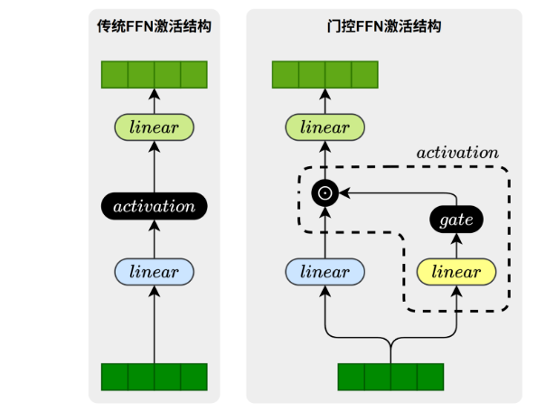
</p>


$$
\text{FFN}_{GLU}(x) = \bigl(\text{gate}(x W_{\text{gate}}) \odot x W_{\text{up}}\bigr) W_{\text{down}}
$$

其中 $\odot$ 表示逐元素相乘。门控分支所用的激活函数不同，形成了多种 GLU 变体：

| 变体 | 门控函数 | 典型应用 |
|------|---------|---------|
| GLU | $\sigma(x)$（Sigmoid） | 早期门控实验 |
| GEGLU | $\text{GELU}(x)$ | T5 |
| **SwiGLU** | $\text{SiLU}(x)$ | **Llama, Qwen, DeepSeek, Mistral** |

!!! tip "SwiGLU — 当前主流选择"

    在众多变体中，**SwiGLU**（使用 SiLU 作为门控函数）在性能与训练稳定性方面表现最优，已成为当前主流 LLM（Llama 2/3、Qwen、DeepSeek、Mistral 等）的默认 FFN 结构。

##### 2. MoE（Mixture of Experts）

**概述**

MoE（Mixture of Experts，混合专家模型）是在 FFN 基础上的一种结构扩展。其核心思想是：使用**多个并行的 FFN 专家**替代单一 FFN 层，并通过 **Router（路由器）** 根据输入 Token 的特征选择少量最合适的专家参与计算。不同类型的输入由擅长处理该类模式的专家负责，显著增强模型的表达能力。

<p align='center'>
	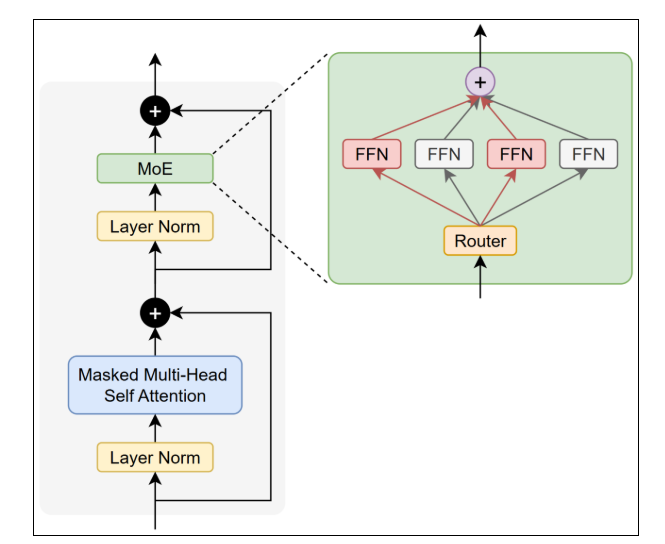
</p>

MoE 已成为当前主流大语言模型（如 Mixtral 8x7B、DeepSeek-V2、Qwen2-MoE 等）广泛采用的关键结构。

**工作流程**
<p align='center'>
	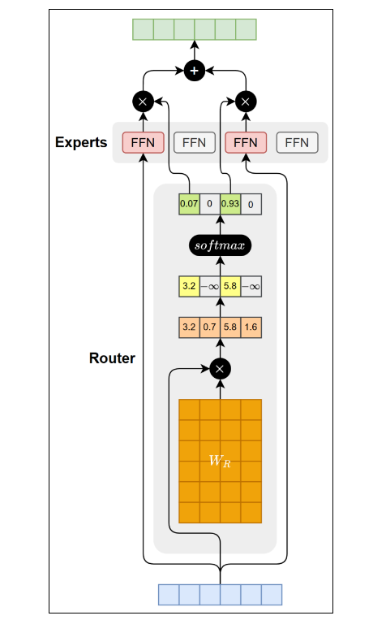
</p>

1. **路由得分计算**：Router 接收 Token 的隐藏表示，通过线性映射为所有专家生成一组得分。
2. **选择 Top-k 专家**：选取得分最高的 $k$ 个专家（通常 $k=2$），其余专家本次不参与计算。
3. **计算路由权重**：对被选中的专家得分执行 softmax，得到归一化权重，表示各专家的贡献比例。
4. **专家执行前向计算**：被激活的专家分别对输入 Token 进行独立 FFN 计算，生成各自的输出。
5. **加权合并输出**：将所有激活专家的输出按路由权重加权求和，得到 Token 在 MoE 层的最终表示。

!!! tip "核心优势"

    - **高容量、低计算**：稀疏激活机制使每次前向传播仅有 $k$ 个专家参与计算。在不增加实际计算量的前提下，大幅提升模型总参数量（模型容量），实现「高容量、低计算」的效率结构。
    - **专家分工，增强泛化**：Router 动态分配机制促使专家自动形成功能分化，每个专家专注于学习特定模式或数据子集，显著增强模型的表达能力和泛化性能。
    - **天然适合分布式扩展**：专家模块相互独立，可轻松分布到大规模计算集群的不同设备上并行运行，极大提升模型的可扩展性。


#### 残差连接与归一化

残差连接（Residual Connection）与归一化（Normalization）是 Transformer 稳定训练的两大基础机制。残差连接为**深层网络提供恒等映射的梯度捷径**，防止梯度消失；归一化则控制**激活值的分布范围**，防止数值不稳定。二者协同作用，使 Transformer 能够堆叠数十甚至上百层。

随着模型深度与规模增加，归一化方式及其放置位置经历了持续的优化演进。

##### 1. RMSNorm

**概述**

RMSNorm（Root Mean Square Normalization）是对传统 LayerNorm 的一种简化变体，由 [Zhang & Sennrich, 2019](https://arxiv.org/abs/1910.07467) 提出。它去除了均值标准化操作，仅基于输入特征的均方根（RMS）进行缩放，在保持归一化效果的同时降低计算复杂度。

**核心公式**

$$
\text{RMSNorm}(x) = \frac{x}{\text{RMS}(x)} \cdot \gamma
$$

其中：

$$
\text{RMS}(x) = \sqrt{\frac{1}{d} \sum_{i=1}^{d} x_i^2 + \epsilon}
$$

- $x \in \mathbb{R}^d$：输入向量
- $\gamma$：可学习的缩放参数
- $\epsilon$：防止除零的微小常数

!!! tip "为什么可以去掉均值？"

    实践表明，均值项在深层 Transformer 中对稳定性贡献有限，去除均值不仅不会影响模型性能，反而能带来更稳定、更高效的归一化形式。目前，**RMSNorm 已成为主流 LLM 中最常用的归一化方式**（如 Llama、Qwen、DeepSeek 等均采用 RMSNorm）。

##### 2. 归一化放置位置

归一化层的放置位置会显著影响训练稳定性与梯度传播效率。随着架构演进，主要形成了 **Post Norm** 和 **Pre Norm** 两种方案。

**1）Post Norm**

Post Norm 是原始 [Transformer](https://arxiv.org/abs/1706.03762) 采用的归一化方式，在子层计算完成并与残差相加**之后**进行归一化：

$$
y = \text{Norm}\bigl(x + F(x)\bigr)
$$

!!! warning "核心问题：削弱恒等梯度路径"

    标准残差结构 $y = x + F(x)$ 的反向传播为：

    $$
    \frac{\partial y}{\partial x} = 1 + \frac{\partial F(x)}{\partial x}
    $$

    其中的 **"1"** 是一条不改变梯度方向和大小的恒等映射路径，为深层网络提供了稳定的「直通」梯度通道。

    而在 Post Norm 中，反向传播变为：

    $$
    \frac{\partial y}{\partial x} = \frac{\partial \,\text{Norm}(z)}{\partial z} \cdot \left(1 + \frac{\partial F(x)}{\partial x}\right), \quad z = x + F(x)
    $$

    归一化操作对输入进行缩放，梯度回流时也被相应扰动，原本应保持恒等的梯度路径不再为 1。在深层 Transformer 中，这种扰动会层层累积，使训练更加不稳定。因此，**Post Norm 在现代大规模模型中已基本不再使用**。

**2）Pre Norm**

Pre Norm 是当前大多数大语言模型采用的主流方式。在进入子层之前先对输入进行归一化，再执行子模块计算并与残差相加：

$$
y = x + F\bigl(\text{Norm}(x)\bigr)
$$

!!! tip "保留恒等梯度路径"

    Pre Norm 的设计充分保留了残差连接的关键特性：

    $$
    \frac{\partial y}{\partial x} = 1 + \frac{\partial F(\text{Norm}(x))}{\partial x}
    $$

    归一化位于 $F$ 内部，不影响残差路径上的梯度回传。正因如此，**Pre Norm 已成为现代 LLM 的事实标准**（GPT-3、Llama 系列、Qwen 等均采用此方案）。

---

**小结对比**

| 方案 | 结构 | 恒等梯度路径 | 训练稳定性 | 典型模型 |
|------|------|-------------|-----------|---------|
| Post Norm | $y = \text{Norm}(x + F(x))$ | 被扰动 ❌ | 不稳定 | 原始 Transformer |
| Pre Norm | $y = x + F(\text{Norm}(x))$ | 完整保留 ✅ | 稳定 | GPT-3, Llama, Qwen |

### LLM 源码分析（Qwen3）

`Qwen3` 是现代LLM的代表，通过学习其结构，有助于了解GQA，RoPE以及RMSNorm等改进结构是如何在现代LLM架构中使用的。

#### 整体模型结构

<p align='center'>
	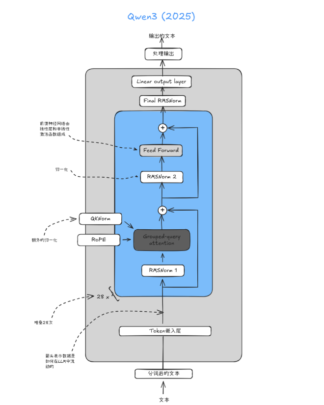
</p>

``` python
class Qwen3Model(nn.Module):  
    def __init__(self, cfg):  
        super().__init__()  
  
        # 输入层：token_embedding  
        self.tok_emb = nn.Embedding(cfg["vocab_size"], cfg["emb_dim"], dtype=cfg["dtype"])  
  
        # transformer block  
        self.trf_blocks = nn.ModuleList(  
            [TransformerBlock(cfg) for _ in range(cfg["n_layers"])]  
        )  
        self.final_norm = RMSNorm(cfg["emb_dim"])  
        self.out_head = nn.Linear(cfg["emb_dim"], cfg["vocab_size"], bias=False, dtype=cfg["dtype"])  
  
        # 没有传入head_dim时，默认使用emb_dim // n_heads作为head_dim  
        if cfg["head_dim"] is None:  
            head_dim = cfg["emb_dim"] // cfg["n_heads"]  
        else:  
            head_dim = cfg["head_dim"]  
        # 获取到每个位置的每组向量的旋转的余弦值和正弦值  
        cos, sin = compute_rope_params(  
            head_dim=head_dim,  
            theta_base=cfg["rope_base"],  
            context_length=cfg["context_length"]  
        )  
        self.register_buffer("cos", cos, persistent=False)  
        self.register_buffer("sin", sin, persistent=False)  
        self.cfg = cfg  
        self.current_pos = 0  # 追踪KV Cache 当前位置的索引  
  
    def forward(self, in_idx, cache=None):  
        # 前向传播  
  
        # 输入层：获取到token_embedding  
        tok_embeds = self.tok_emb(in_idx)  
        x = tok_embeds  
  
        num_tokens = x.shape[1]  
        if cache is not None:  
            pos_start = self.current_pos  
            pos_end = pos_start + num_tokens  
            self.current_pos = pos_end  
            mask = torch.triu(  
                torch.ones(pos_end, pos_end, device=x.device, dtype=torch.bool), diagonal=1  
            )[pos_start:pos_end, :pos_end]  
        else:  
            pos_start = 0  
            mask = torch.triu(  
                torch.ones(num_tokens, num_tokens, device=x.device, dtype=torch.bool), diagonal=1  
            )  
  
        mask = mask[None, None, :, :]  
  
        for i, block in enumerate(self.trf_blocks):  
            blk_cache = cache.get(i) if cache else None  
            x, new_blk_cache = block(x, mask, self.cos, self.sin,  
                                     start_pos=pos_start,  
                                     cache=blk_cache)  
            if cache is not None:  
                cache.update(i, new_blk_cache)  
  
        # 输出前先进行层归一化  
        x = self.final_norm(x)  
        # 输出层  
        logits = self.out_head(x.to(self.cfg["dtype"]))  
        return logits  
  
    def reset_kv_cache(self):  
        self.current_pos = 0
```

#### Transformer Block 

``` python
class TransformerBlock(nn.Module):  
    def __init__(self, cfg):  
        super().__init__()  
        # GQA (Grouped Query Attention) 注意力层，支持多查询分组以降低显存和计算开销  
        self.att = GroupedQueryAttention(  
            d_in=cfg["emb_dim"],  
            num_heads=cfg["n_heads"],  
            head_dim=cfg["head_dim"],  
            num_kv_groups=cfg["n_kv_groups"],  # KV头数分组数量，通常小于Query头数  
            qk_norm=cfg["qk_norm"],            # 是否对Q和K进行归一化  
            dtype=cfg["dtype"]  
        )  
        # 前馈神经网络层 (FFN)        
        self.ff = FeedForward(cfg)  
        # 注意力子层前的 RMSNorm 归一化  
        self.norm1 = RMSNorm(cfg["emb_dim"], eps=1e-6)  
        # FFN子层前的 RMSNorm 归一化  
        self.norm2 = RMSNorm(cfg["emb_dim"], eps=1e-6)  
  
    def forward(self, x, mask, cos, sin, start_pos=0, cache=None):  
        # 保存原始输入，用于后续的残差连接 (Pre-Norm 架构)  
        shortcut = x  
        x = self.norm1(x)  # 对输入进行归一化  
        # 执行 GQA 注意力计算，传入 RoPE 参数、起始位置和 KV 缓存  
        x, next_cache = self.att(x, mask, cos, sin, start_pos=start_pos, cache=cache)  
        x = x + shortcut  # 残差连接：将注意力输出与原始输入相加  
  
        # 保存注意力残差后的结果，用于 FFN 的残差连接  
        shortcut = x  
        x = self.norm2(x)  # 对输入进行归一化  
        x = self.ff(x)     # 执行前馈神经网络计算  
        x = x + shortcut   # 残差连接：将 FFN 输出与上一层输出相加  
  
        # 返回当前层的隐藏状态以及更新后的 KV 缓存  
        return x, next_cache  
  
  
class FeedForward(nn.Module):  
    def __init__(self, cfg):  
        super().__init__()  
        # 使用 SwiGLU 激活函数的 FFN 结构，包含三个线性层且均不使用偏置  
        self.fc1 = nn.Linear(cfg["emb_dim"], cfg["hidden_dim"], dtype=cfg["dtype"], bias=False)  
        self.fc2 = nn.Linear(cfg["emb_dim"], cfg["hidden_dim"], dtype=cfg["dtype"], bias=False)  
        self.fc3 = nn.Linear(cfg["hidden_dim"], cfg["emb_dim"], dtype=cfg["dtype"], bias=False)  
  
    def forward(self, x):  
        x_fc1 = self.fc1(x)  # 第一个线性变换  
        x_fc2 = self.fc2(x)  # 第二个线性变换（作为门控机制）  
        # SwiGLU 激活：SiLU(fc1(x)) 与 fc2(x) 逐元素相乘  
        x = nn.functional.silu(x_fc1) * x_fc2  
        return self.fc3(x)   # 降维投影回原始嵌入维度  
  
  
class RMSNorm(nn.Module):  
    def __init__(self, emb_dim, eps=1e-6, bias=False, qwen3_compatible=True):  
        super().__init__()  
        self.eps = eps  
        self.qwen3_compatible = qwen3_compatible  # 是否开启 Qwen3 兼容模式（强制转 float32 防止精度溢出）  
        self.scale = nn.Parameter(torch.ones(emb_dim))  # 可学习的缩放参数  
        # 如果指定了 bias，则创建可学习的平移参数（标准 RMSNorm 通常不包含 shift）  
        self.shift = nn.Parameter(torch.zeros(emb_dim)) if bias else None  
  
    def forward(self, x):  
        input_dtype = x.dtype  # 记录原始数据类型，以便最后恢复  
        # Qwen3 兼容模式：在 float32 下计算方差，避免低精度（如 fp16/bf16）导致的数值不稳定  
        if self.qwen3_compatible:  
            x = x.to(torch.float32)  
        # 计算每个 token 向量在最后一个维度上的均方差  
        variance = x.pow(2).mean(dim=-1, keepdim=True)  
        # 执行 RMS 归一化：x / sqrt(variance + eps)  
        norm_x = x * torch.rsqrt(variance + self.eps)  
        norm_x = norm_x * self.scale  # 应用可学习的缩放  
        if self.shift is not None:  
            norm_x = norm_x + self.shift  # 应用可学习的平移（可选）  
        return norm_x.to(input_dtype)  # 恢复到原始数据类型
```

#### GQA 层结构

``` python
class GroupedQueryAttention(nn.Module):  
    def __init__(  
            self, d_in, num_heads, num_kv_groups, head_dim=None, qk_norm=False, dtype=None  
    ):  
        super().__init__()  
        # 确保 Query 的头数可以被 KV 的分组数整除  
        assert num_heads % num_kv_groups == 0, "num_heads must be divisible by num_kv_groups"  
  
        self.num_heads = num_heads  # Query 的总头数  
        self.num_kv_groups = num_kv_groups  # Key/Value 的分组数  
        # 每个 KV 组需要被多少个 Query 头共享（例如：32个Query头，4个KV组，则 group_size=8）  
        self.group_size = num_heads // num_kv_groups  
  
        # 如果未指定 head_dim，则默认通过总维度除以头数来计算  
        if head_dim is None:  
            assert d_in % num_heads == 0, "`d_in` must be divisible by `num_heads` if `head_dim` is not set"  
            head_dim = d_in // num_heads  
  
        self.head_dim = head_dim  
        self.d_out = num_heads * head_dim  # 输出总维度  
  
        # Query 层：输出维度为全量的 num_heads * head_dim        self.W_query = nn.Linear(d_in, self.d_out, bias=False, dtype=dtype)  
  
        # Key 和 Value 层：输出维度仅为 num_kv_groups * head_dim，大幅减少参数量和显存占用  
        self.W_key = nn.Linear(d_in, num_kv_groups * head_dim, bias=False, dtype=dtype)  
        self.W_value = nn.Linear(d_in, num_kv_groups * head_dim, bias=False, dtype=dtype)  
  
        # 注意力输出后的线性投影层  
        self.out_proj = nn.Linear(self.d_out, d_in, bias=False, dtype=dtype)  
  
        # 可选的 QK 归一化（有助于训练稳定性，防止注意力分数过大）  
        if qk_norm:  
            self.q_norm = RMSNorm(head_dim, eps=1e-6)  
            self.k_norm = RMSNorm(head_dim, eps=1e-6)  
        else:  
            self.q_norm = self.k_norm = None  
  
    def forward(self, x, mask, cos, sin, start_pos=0, cache=None):  
        b, num_tokens, _ = x.shape  
  
        # 1. 线性投影获取 Q, K, V        queries = self.W_query(x)  # (b, num_tokens, num_heads * head_dim)  
        keys = self.W_key(x)  # (b, num_tokens, num_kv_groups * head_dim)  
        values = self.W_value(x)  # (b, num_tokens, num_kv_groups * head_dim)  
  
        # 2. 重塑形状并调整维度顺序，方便后续矩阵乘法  
        # Queries: (b, num_heads, num_tokens, head_dim)  
        queries = queries.view(b, num_tokens, self.num_heads, self.head_dim).transpose(1, 2)  
        # Keys/Values: (b, num_kv_groups, num_tokens, head_dim)  
        keys_new = keys.view(b, num_tokens, self.num_kv_groups, self.head_dim).transpose(1, 2)  
        values_new = values.view(b, num_tokens, self.num_kv_groups, self.head_dim).transpose(1, 2)  
  
        # 3. 对 Q 和 K 进行额外的 RMSNorm 归一化  
        if self.q_norm:  
            queries = self.q_norm(queries)  
        if self.k_norm:  
            keys_new = self.k_norm(keys_new)  
  
        # 4. 应用旋转位置编码 (RoPE)        queries = apply_rope(queries, cos, sin, offset=start_pos)  
        keys_new = apply_rope(keys_new, cos, sin, offset=start_pos)  
  
        # 5. KV Cache 处理：如果有缓存，则将当前步的 KV 拼接到历史 KV 上  
        if cache is not None:  
            prev_k, prev_v = cache  
            keys = torch.cat([prev_k, keys_new], dim=2)  
            values = torch.cat([prev_v, values_new], dim=2)  
        else:  
            start_pos = 0  # 无缓存时重置位置  
            keys, values = keys_new, values_new  
        next_cache = (keys, values)  # 保存更新后的 KV 缓存  
  
        # 6. GQA 核心：将 KV 在头维度上重复，使其与 Query 的头数对齐  
        keys = keys.repeat_interleave(self.group_size, dim=1)  
        values = values.repeat_interleave(self.group_size, dim=1)  
  
        # 7. 计算注意力得分并应用因果掩码  
        attn_scores = queries @ keys.transpose(2, 3)  # (b, num_heads, num_tokens, total_kv_len)  
        attn_scores = attn_scores.masked_fill(mask, -torch.inf)  
        attn_weights = torch.softmax(attn_scores / self.head_dim ** 0.5, dim=-1)  
  
        # 8. 加权聚合 Value，重塑形状并投影回原始维度  
        context = (attn_weights @ values).transpose(1, 2).reshape(b, num_tokens, self.d_out)  
        return self.out_proj(context), next_cache
```


#### KV cache 分析

下面基于上述 Qwen3 简
化代码，逐层剖析 KV Cache 的实现细节。

##### 1. 数据结构

KV Cache 是一个**字典**，以层索引为键，值为对应层的 K/V 张量元组：

```
cache = {
    0: (keys_layer0, values_layer0),   # shape: (b, n_kv_groups, total_len, head_dim)
    1: (keys_layer1, values_layer1),
    ...
    L: (keys_layerL, values_layerL),
}
```

每一层的 K/V 形状为 `(batch_size, num_kv_groups, total_seq_len, head_dim)`。由于采用 **GQA**，缓存的是分组数 `num_kv_groups` 而非头数 `num_heads`，这是 KV Cache 内存缩减的关键。

##### 2. 位置追踪机制

在 `Qwen3Model` 中通过 `self.current_pos` 追踪当前生成到的位置：

```python
# 初始化为 0
self.current_pos = 0

def forward(self, in_idx, cache=None):
    num_tokens = x.shape[1]
    if cache is not None:
        pos_start = self.current_pos
        pos_end = pos_start + num_tokens
        self.current_pos = pos_end    # 推进位置
```

- **首次调用**（`cache=None`）：`pos_start=0`，从输入序列起始位置计算
- **后续解码**（`cache` 非空）：根据已缓存 token 数量确定当前步的起始位置

##### 3. 因果掩码构建

```python
if cache is not None:
    mask = torch.triu(
        torch.ones(pos_end, pos_end, dtype=torch.bool), diagonal=1
    )[pos_start:pos_end, :pos_end]
```

??? note "为何这种切片能正确处理掩码？"

    解码阶段 `pos_start > 0`，掩码切片 `[pos_start:pos_end, :pos_end]` 的语义为：

    - **行**（query 侧）：取当前步的 token（`pos_start` 到 `pos_end`）
    - **列**（key 侧）：取全部历史 token（`0` 到 `pos_end`）

    这样，每个新 token 都能看到所有过去的 token（包括缓存的），同时看不到未来的 token，完美适配自回归生成。

##### 4. 逐层传递与更新

每层 Transformer Block 从字典中取出自己的缓存，处理后更新回去：

```python
for i, block in enumerate(self.trf_blocks):
    blk_cache = cache.get(i) if cache else None          # 取出第 i 层的缓存
    x, new_blk_cache = block(x, mask, cos, sin,
                             start_pos=pos_start,
                             cache=blk_cache)
    if cache is not None:
        cache.update(i, new_blk_cache)                   # 更新第 i 层的缓存
```

每一层的 cache 生命周期**完全独立**。这符合 Transformer 各层并行存储的实际情况——第 0 层和第 1 层的 K/V 互不影响。

##### 5. 核心操作：拼接新 K/V

在 `GroupedQueryAttention.forward()` 中，第 999-1007 行完成 KV Cache 的最核心操作：

```python
# 5. KV Cache 处理：如果有缓存，则将当前步的 KV 拼接到历史 KV 上
if cache is not None:
    prev_k, prev_v = cache
    keys = torch.cat([prev_k, keys_new], dim=2)     # 沿 token 维度拼接
    values = torch.cat([prev_v, values_new], dim=2)
else:
    start_pos = 0
    keys, values = keys_new, values_new

next_cache = (keys, values)  # 保存更新后的 KV 缓存
```

图示如下：

```
                        dim=2 (token 维度)
                         ◄──── 拼接 ────►
┌────────────────────┐  ┌────────────────────┐  ┌────────────────────────────┐
│  prev_k (cached)   │  │  keys_new (当前步)  │  │    keys (更新后缓存)       │
│  shape: (b, G, t)  │  │  shape: (b, G, 1)  │  │  shape: (b, G, t+1)       │
└────────────────────┘  └────────────────────┘  └────────────────────────────┘
```

!!! tip "为何沿 dim=2 拼接？"

    K/V 张量的维度布局为 `(batch, num_kv_groups, seq_len, head_dim)`，**dim=2 对应序列长度维度**。每次生成一个新 token，该 token 的 K/V 向量沿序列维度拼接到历史缓存后面，序列长度随之增加 1。

##### 6. GQA 优化：重复 KV

拼接完成后，对 KV 执行 `repeat_interleave`，将 `num_kv_groups` 份 KV 扩展到 `num_heads` 份：

```python
keys = keys.repeat_interleave(self.group_size, dim=1)
values = values.repeat_interleave(self.group_size, dim=1)
```

**这意味着 KV Cache 实际存储的是 G 套（分组数），而非 H 套（头数）**。在前向计算时再通过 repeat 扩展到 H 套，等价于 MHA 的效果，但内存占用仅为 MHA 的 $G/H$。

##### 7. 生命周期管理

```python
def reset_kv_cache(self):
    self.current_pos = 0
```

- **重置时机**：每次开启新一轮生成前调用 `reset_kv_cache()`
- **外部调用方**（推理主循环）负责维护 cache 字典的生命周期——在 `reset_kv_cache()` 后将 cache 置为 `None` 或重新创建空字典
- **内存释放**：Python 的 GC 会在 cache 字典不再被引用时自动回收

##### 8. 完整数据流总结

```
┌─────────────────────────────────────────────────────────────────┐
│                     KV Cache 完整数据流                            │
├─────────────────────────────────────────────────────────────────┤
│                                                                  │
│  初始状态: cache = {} (空字典), current_pos = 0                   │
│                                                                  │
│  第 1 步 (Prefill - 处理输入 prompt):                              │
│    forward(prompt_ids, cache=None)                               │
│    ├─ 各层生成全部 prompt token 的 K/V                            │
│    ├─ cache 被填充为: {layer0: (K0,V0), layer1: (K1,V1), ...}     │
│    └─ current_pos = prompt_len                                   │
│                                                                  │
│  第 2 步 (Decode - 生成第 1 个 token):                            │
│    forward(token_id, cache=cache)                                │
│    ├─ pos_start = prompt_len, pos_end = prompt_len + 1           │
│    ├─ 各层生成当前 token 的 keys_new / values_new                │
│    ├─ torch.cat → 拼接到历史缓存后                               │
│    └─ current_pos = prompt_len + 1                               │
│                                                                  │
│  第 3 步 (Decode - 生成第 2 个 token):                            │
│    forward(token_id, cache=cache)                                │
│    ├─ pos_start = prompt_len + 1, pos_end = prompt_len + 2      │
│    ├─ 同上: 计算 → 拼接 → 更新缓存                               │
│    └─ current_pos = prompt_len + 2                               │
│                                                                  │
│  如此循环，直至生成结束                                           │
│                                                                  │
│  结束: reset_kv_cache() → current_pos = 0                        │
└─────────────────────────────────────────────────────────────────┘
```


## LLM 微调

微调指在一个已经**预训练好**，或者已有通用能力的大模型基础上，继续用特定数据训练它的参数，让它**适配**某个任务、风格、领域或偏好。微调是将通用大语言模型（Large Language Model, LLM）适配至特定任务的关键技术手段。可以说，微调能够：

- 提高模型在特定任务上的专业能力
- 塑造模型的风格
- 注入特定的领域知识（但这个通常用 Rag 去做，且效果比较好、更加灵活）

### 微调整体流程

大模型微调的完整流程可以分为四个主要环节：

<p align='center' style='zoom:60%'>
	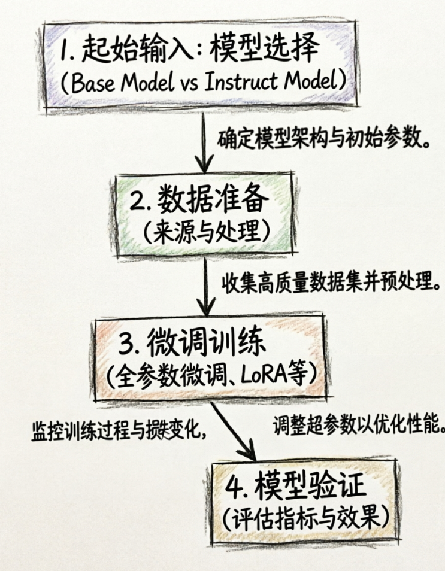
</p>

#### 模型选择

在进行监督微调（SFT）时，模型选择主要考虑两个问题：**选择 Base Model 还是 Instruct Model**，以及**选择多大规模的模型**。

???+ tip "选型建议"
    对于绝大多数应用场景，**通常建议优先选择 Instruct Model 作为微调起点**：
    
    - ✅ Instruct Model 已经在 Base Model 基础上经过指令微调、偏好对齐等后训练
    - ✅ 具备较好的指令理解和对话能力
    - ✅ 可以降低数据准备和训练难度
    - ✅ 更适合客服问答、内容生成、结构化输出、多轮对话等常见任务

    **Base Model** 则更适合高度定制化场景：
    
    - 任务形式非常特殊
    - 团队拥有大量高质量领域数据
    - 希望从基础模型状态开始进行深度适配

**模型规模选择**：

参数量越大的模型通常能力越强，但显存占用、训练成本和推理成本也更高。因此**模型并不是越大越好**，应根据任务复杂度、硬件资源、响应速度和部署成本综合选择。


#### 数据准备 ⭐⭐⭐

数据准备是微调流程中的基础环节，也是非常重要的一个环节，主要目标是根据任务需求构建高质量训练数据。

- **数据来源**：公共数据源（**[Hugging Face Hub](https://huggingface.co/datasets)** 、**[ModelScope](https://www.modelscope.cn/datasets)等）+ 私有数据源（企业内部文档、客户反馈、业务数据库等）
- **数据处理**：原始数据通常需要经过筛选、清洗、结构化、标注和格式转换等处理，形成适合模型学习的训练样本

#### 微调训练

训练阶段是模型真正根据任务数据进行调整的环节，流程和正常训练模型一致，但是由于大语言模型规模较大，训练阶段往往遇到显存占用高、训练速度慢、训练成本高等工程问题，因此需要根据硬件条件和任务需求，选择合适的训练方式和优化方案（如全参数微调、LoRA、QLoRA等）。

#### 模型验证

在模型完成微调后，需要通过验证环节评估模型是否真正学到了目标任务能力。

- **验证维度**：训练损失下降、验证集指标、样例推理结果、实际任务效果
- **评估重点**：泛化能力、稳定性、可用性
- **价值**：发现过拟合、指令跟随能力不足、回答质量不稳定等问题，为后续优化提供依据


---


### 微调数据准备

在微调大语言模型时，**数据是决定模型性能与适用性的关键因素**。模型表现很大程度上取决于其训练数据的质量。

#### 数据来源

根据数据的来源与可访问性，通常可分为两大类：

##### 公共数据源

公共数据集易于获取，通常是绝佳的起点，常用的数据共享平台：

**[Hugging Face Hub](https://huggingface.co/datasets)** :   托管了数千个数据集，可以通过 `datasets` 库轻松访问，可根据任务类型、语言以及数据集许可证进行筛选。

**[ModelScope](https://www.modelscope.cn/datasets)** :   阿里巴巴旗下的模型开放平台，提供了一系列高质量的开源模型与数据集，覆盖多个领域，包括自然语言处理、计算机视觉和多模态任务。

##### 私有数据源

私有数据源是指企业或组织内部拥有的数据集，这些数据可能受到版权保护或隐私限制，仅限于内部使用。

!!! note "数据预处理"
    私有数据通常并非专为模型微调而准备，因此在使用前往往需要经过**清洗、结构化和标注**等预处理步骤。

    可以借助自动化工具提升效率，例如 [Easy Dataset](https://github.com/hiyouga/EasyDataset) 等开源方案。

#### 数据集格式

在大型语言模型的监督微调中，数据集的构建格式至关重要，常见格式可分为两类：**指令式**与**对话式**。

##### 指令式格式

指令式数据集用于训练模型执行明确的单轮任务，如翻译、摘要或问答。其典型格式源自斯坦福大学的 [Alpaca 项目](https://github.com/tatsu-lab/stanford_alpaca)，结构简洁、易于使用。

每条样本包含三个字段：

| 字段 | 说明 |
|------|------|
| `instruction` | 描述模型需要执行的任务 |
| `input` | 任务所需的上下文或附加信息 |
| `output` | 模型应生成的正确回答 |

示例：

```json
{
  "instruction": "将以下英文翻译成中文",
  "input": "Large language models are transforming AI.",
  "output": "大语言模型正在改变人工智能。"
}
```

训练时，这些字段通常会通过提示模板组合成结构统一的输入字符串：

```
### 指令：
{instruction}

### 输入：
{input}

### 回复：
{output}
```

##### 对话式格式

对话式数据集用于训练模型进行多轮对话，例如聊天机器人、虚拟助手等。目前广泛采用的格式主要有 **ShareGPT 格式** 和 **OpenAI 格式**。

###### ShareGPT 格式

ShareGPT 格式源于用户在社区中分享的与 ChatGPT 的真实对话记录，常用于保存多轮对话数据集。

每条数据样本由一个名为 `conversations` 的列表构成，列表中的每个元素代表一次发言，包含两个关键字段：

- `from`：标识发言者的角色，通常为 `"human"`（用户）或 `"gpt"`（模型助手）
- `value`：该轮对话的具体文本内容

示例：

```json
{
  "conversations": [
    {
      "from": "human",
      "value": "你能解释一下什么是机器学习吗？"
    },
    {
      "from": "gpt",
      "value": "机器学习是人工智能的一个分支，它允许计算机系统通过数据和经验自动改进其性能。"
    },
    {
      "from": "human",
      "value": "它主要有哪些类型？"
    },
    {
      "from": "gpt",
      "value": "主要类型包括监督学习、无监督学习、半监督学习和强化学习等。"
    }
  ]
}
```

###### OpenAI 格式

OpenAI 格式是 OpenAI 官方在其 API 微调功能中推广的一种通用消息列表格式，兼具灵活性与表达力，可同时支持单轮和多轮对话。

每个训练样本是一个包含 `messages` 字段的字典，其中 `messages` 是一个有序列表，每条消息包含：

- `role`：发言者角色，常见值：`system`、`user`、`assistant`
- `content`：消息的具体文本内容

示例：

```json
{
  "messages": [
    {
      "role": "system",
      "content": "你是一名专业的营养师。你的回答应基于科学知识，提供务实、健康的建议，并避免提供任何医疗诊断。"
    },
    {
      "role": "user",
      "content": "我最近感觉下午很疲惫，有什么健康的零食推荐吗？"
    },
    {
      "role": "assistant",
      "content": "下午感到疲惫是常见的现象，选择正确的零食可以帮助稳定能量水平。以下是一些推荐：\n1. 一把坚果和干果：提供健康的脂肪、蛋白质和天然糖分，能快速补充能量。\n2. 希腊酸奶：富含蛋白质，能提供持久的饱腹感。\n3. 一个苹果或一根香蕉：富含维生素和膳食纤维，是方便的天然能量来源。\n请记得结合充足的水分摄入，因为脱水也会导致疲劳。"
    }
  ]
}
```

!!! tip "Chat Template 标准化"
    在实际训练中，无论采用哪种原始格式，通常都会通过 Chat Template（例如 ChatML）将多轮消息组织成结构统一的字符串，确保模型能够正确解析对话结构并学习交互模式。

#### Chat Template

**Chat Template（聊天模板）** 是将结构化的多轮对话消息（如 OpenAI 格式的 `messages` 列表）转换为模型能理解的**单一格式化字符串**的转换规则。模型在训练和推理时看到的不是 JSON，而是经过 Chat Template 渲染后的文本。每个模型会有自己的 Chat Template，**Qwen** 系列的Chat Template将每条消息按以下模板组织：

<p align='center' style='zoom:60%'>
	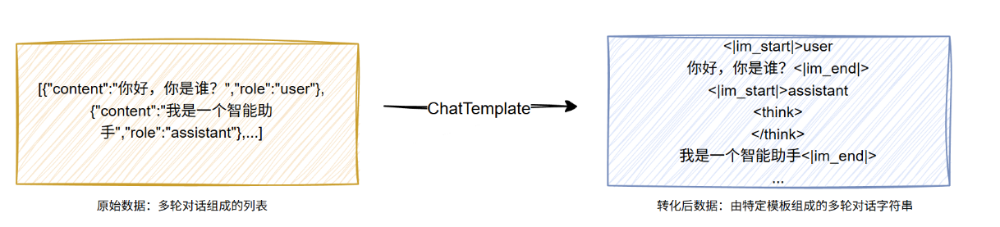
</p>

```
<|im_start|>role
content<|im_end|>
```

支持的 `role` 包括：`system`、`user`、`assistant`。

**示例**

将上述 OpenAI 格式的多轮对话通过 ChatML 渲染后，得到如下字符串：

```
<|im_start|>system
你是一名专业的营养师。你的回答应基于科学知识，提供务实、健康的建议，并避免提供任何医疗诊断。<|im_end|>
<|im_start|>user
我最近感觉下午很疲惫，有什么健康的零食推荐吗？<|im_end|>
<|im_start|>assistant
下午感到疲惫是常见的现象，选择正确的零食可以帮助稳定能量水平。以下是一些推荐：
1. 一把坚果和干果：提供健康的脂肪、蛋白质和天然糖分，能快速补充能量。
2. 希腊酸奶：富含蛋白质，能提供持久的饱腹感。
3. 一个苹果或一根香蕉：富含维生素和膳食纤维，是方便的天然能量来源。
请记得结合充足的水分摄入，因为脱水也会导致疲劳。<|im_end|>
```

得到上面的输入字符串，就可以进行分词、得到 input_ids，然后去训练模型了。

<p align='center' style='zoom:60%'>
	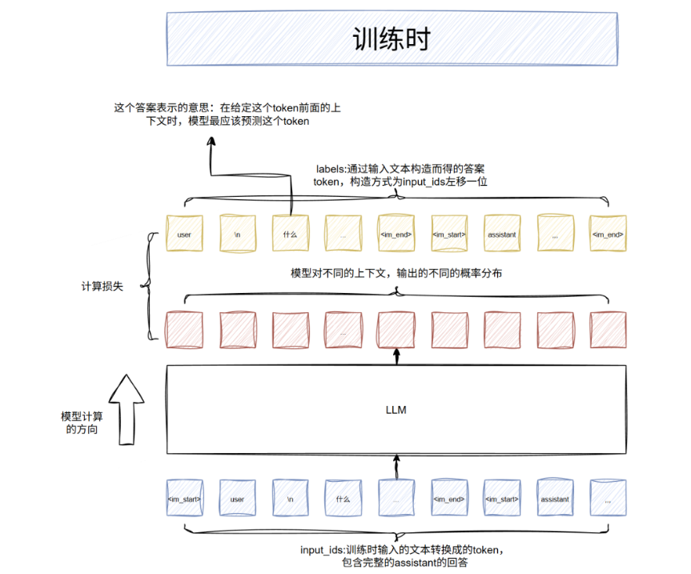
</p>

之后，再推理阶段，使用相同的 Chat Template 得到 input_ids，从 assistant 标签开始预测下一个 token 即可。此时，如果不开启 thinking 模式，那么在 assistant 后面，直接跟上 \<think> 标签对即可。

<p align='center' style='zoom:60%'>
	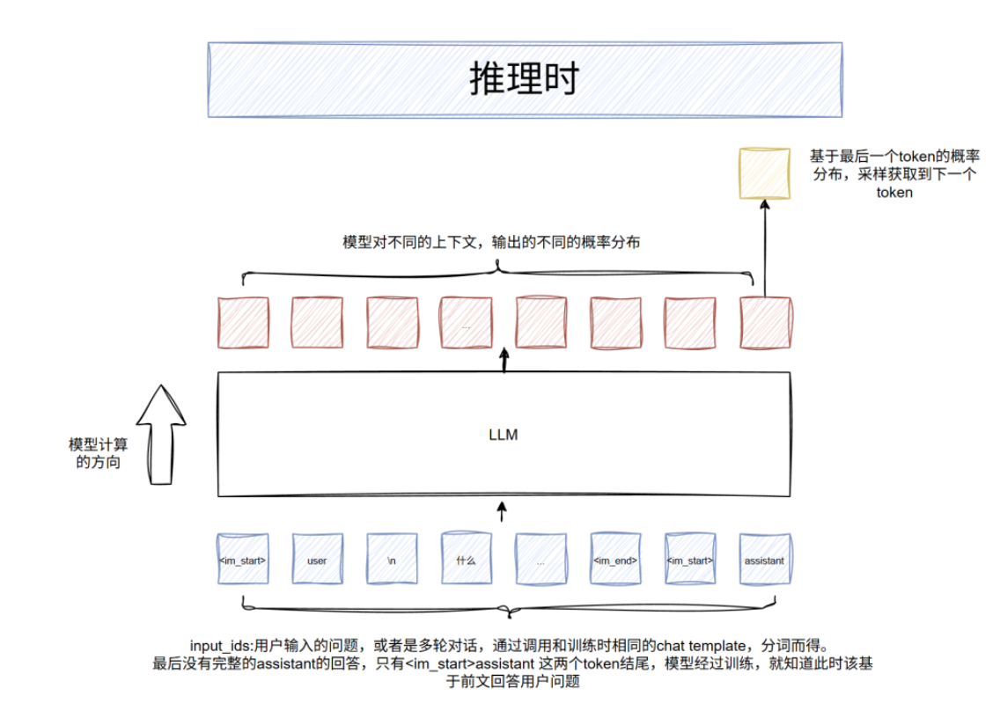
</p>

下面是 Hugging Face 提供的 `apply_chat_template` API 用法：

**函数签名**

```python
tokenizer.apply_chat_template(
    conversation: list[dict],
    tokenize: bool = True,
    add_generation_prompt: bool = False,
    continue_final_message: bool = False,
    **kwargs
) -> Union[str, list[int]]
```

**参数说明**

| 参数 | 类型 | 默认值 | 说明 |
|------|------|-------|------|
| `conversation` | `list[dict]` | 必填 | 多轮对话列表，格式为 `[{"role": ..., "content": ...}, ...]` |
| `tokenize` | `bool` | `True` | 是否返回 token IDs。`True` → 返回 `list[int]`；`False` → 返回格式化后的字符串 |
| `add_generation_prompt` | `bool` | `False` | 是否在末尾追加 `assistant` 角色前缀，用于推理时让模型开始生成回复 |
| `continue_final_message` | `bool` | `False` | 是否继续最后一条消息（用于补全场景） |
| `enable_thinking` | `bool` | `True` | （Qwen 等模型专用）是否启用思考过程标记 |

**代码示例**

```python
# 1. 训练阶段：格式化对话，返回字符串
message_list = [
    {'role': 'user', 'content': '你好'},
    {'role': 'assistant', 'content': '你好，我是Qwen。'},
]
res = tokenizer.apply_chat_template(message_list, tokenize=False)
print(res)
# 输出: <|im_start|>user\n你好<|im_end|>\n<|im_start|>assistant\n你好，我是Qwen。<|im_end|>

# 2. 推理阶段：加上 generation_prompt，让模型继续生成
message_list2 = [
    {'role': 'system', 'content': '你是一个翻译助手，实现幽默的中文 -> 英文翻译'},
    {'role': 'user', 'content': '翻译：你好'},
]
res2 = tokenizer.apply_chat_template(
    message_list2,
    tokenize=False,
    add_generation_prompt=True       # 追加 assistant 前缀，模型从此处开始生成
)
print(res2)

# 输出: <|im_start|>system\n...<|im_end|>\n<|im_start|>user\n...<|im_end|>\n<|im_start|>assistant\n

# 3. 关闭思考模式（Qwen 等模型专用）
res3 = tokenizer.apply_chat_template(
    message_list2,
    tokenize=False,
    add_generation_prompt=True,
    enable_thinking=False            # 不生成 <think> 标签对，直接输出回答
)
```


#### 构造 Assistant Answer 掩码

在SFT阶段，我们希望模型能够基于用户的问题（或者历史多轮对话），进行回答，所以不应该对用户输入 `prompt` 部分的 `token` 计算损失，只能对 `assistant` 回答部分，计算损失。**这是SFT和预训练过程中一个最本质的区别**。

<p align='center' >
	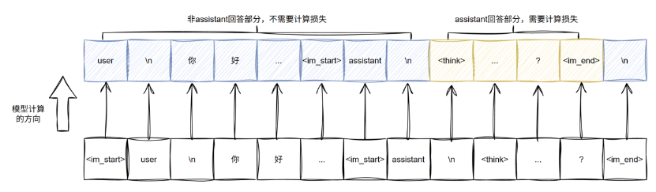
</p>

### 微调手写实现
#### SFT

本节以一个具体例子，讲解SFT的基本实现过程。该例子的具体目标为：将 [Qwen3-0.6B-Base](https://huggingface.co/Qwen/Qwen3-0.6B-Base) 模型，微调成一个遵循人类指令，能进行多轮对话的模型。
##### 1. 数据与模型准备

``` python
# 先去下载 modelscope 依赖
uv add modelscope

# 下载数据集到本地
modelscope download --dataset HuggingFaceH4/ultrachat_200k --local_dir ./data/**ultrachat_200k**

# 下在模型到本地
modelscope download --model Qwen/Qwen3-0.6B-Base --local_dir ./model/Qwen3-0.6B-Base
```

##### 2. 处理数据集

先加载本地的数据集，得到 `dataset` 对象（本质是一个列式存储）。

``` python
# 处理数据集  
from datasets import load_dataset  
def get_data():  
    # 如果是本地数据集，串本地路径就行  
    ds = load_dataset('../data/ultrachat_200k')  
    print(ds)  
    train_ds = ds['train_sft']  
    test_ds = ds['test_sft']  
    return train_ds, test_ds  
  
train_ds, test_ds = get_data()

# 查看数据集有那些列（最合理的方式是看 hugging face 上的样子）
print(train_ds.column_names)
```

之后，要将每一条数据的 messages 通过模型特定的 chat_template 去转换成字符串，然后通过这个字符串就可以得到 input_ids、attention_mask

``` python
# 为了方便演示，只要 train_ds 的一部分数据
train_ds = train_ds.select(range(1000)) # select 得到的才是 dataset 对象⭐，不要直接切片，切片得到的是一个字典

# 对原始数据逐行运用 apply_chat_template

def apply_chat_template(batch):    
    # 如果 tokenize=True，则返回的是一个列表，列表中的每个元素是一个字典，字典的 key 是 input_ids, attention_mask    
    res = [  
        tokenizer.apply_chat_template(  
            msgs,  
            tokenize=True,  
            truncation=True,  
            max_length=2500  
        ) for msgs in batch["messages"]  
    ]  
    return {'input_ids':[r['input_ids'] for r in res], 'attention_mask':[r['attention_mask'] for r in res], }  
    
# 注意，这里开了批处理，所以 apply_chat_template 接收的是一批数据，在写处理逻辑的时候注意
train_ds.map(apply_chat_template, batched=True)
```

这样，每行数据就会得到拼接后字符串对应的 input_ids 和 attention_mask，这里 attention_mask 全一，是因为我们没有填充token。

在 SFT 阶段，与预训练最大的不同就是计算损失的时候，不要计算用户输入的提示词对应的输出位置的损失，所以，我们需要对 answer 做一个掩码，让提示词对应部分的输出不计算损失！

##### 3.  SFT 的损失函数

监督微调模型的**本质**是：在给定的一个特定 `prompt` 作为输入的前提下，让模型输出的结果，更接近于训练数据的结果。

<p align='center' >
	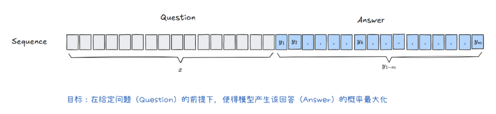
</p>
模型在给定特定问题的前提下，输出的回答的概率计算公式如下所示，`SFT` 的训练目标就是使得该概率最大化（也即最大似然估计思想）：

$$
\pi_\theta(y \mid x) = \prod_{k=1}^{m} P_\theta(y_k \mid x, y<k)
$$

但是，一般多个数累乘的话，在真正实现中，会存在许多问题，所以，通过对数，把累乘问题转换为累加问题，同时，训练模型一般都是最小化一个损失函数，所以，给这个概念前再加上一个负号即可：

$$
Loss = -\frac{1}{m} \sum_{k=1}^{m} \log P_\theta(y_k \mid x, y_{<k})
$$

``` python
def compute_loss(output_logits, labels, assistant_answer_mask):  
    """  
    计算当前批次的平均损失  
    :param output_logits:(batch_size, seq_len, vocab_size)    
    :param labels: (batch_size, seq_len)    
    :param assistant_answer_mask: (batch_size, seq_len)  
    
    :return: 损失值  
    """    
    # 1. 计算概率分布 size = (batch_size, seq_len, vocab_size)    
    log_probs = torch.log_softmax(output_logits, dim=-1)  
  
    # 2. 从 log_probs 中取出每个答案对应的那个概率  
    # res.shape = (batch_size, seq_len, 1)  
    res = torch.gather(log_probs, dim=-1, index=labels.unsqueeze(-1))  
    
    # 3. 对数前加符号  
    res = res * -1  
  
    # 4. 计算损失  
    # res.size = (batch_size, 1)  
    res = res * (assistant_answer_mask.unsqueeze(-1))  
    loss = res.sum() / assistant_answer_mask.sum()  
  
    return loss
```

##### 4. 微调训练

微调的训练过程和传统模型的训练也没什么区别！

首先，手写了一个 cosine decay 调度器，理解了 pytorch 官方实现的调度器是如何做到的，Cosine Decay（余弦退火）的核心思想，是利用余弦函数的数学特性，为模型训练提供一种**“先慢、后快、再慢”**的平滑学习率衰减曲线。

``` python
def cosine_decay(current_step, total_step, warmup_ratio, min_lr, max_lr):  
    """带 warmup 的 cosine decay 学习率"""  
    warmup_steps = total_step * warmup_ratio  
    if current_step < warmup_steps:  
        return max_lr * current_step / max(warmup_steps, 1)  
  
    decay_steps = total_step - warmup_steps  
    progress = (current_step - warmup_steps) / max(decay_steps, 1)  
    cosine = (1.0 + math.cos(math.pi * progress)) / 2.0  
    return min_lr + (max_lr - min_lr) * cosine
```

训练过程如下：
``` python
def train(model, tokenizer, train_data, config: SFTConfig, args):  
    """  
    train_data: 已经被 apply_chat_template 处理过的 Dataset（含 input_ids 列）  
    """    
    if len(train_data) == 0:  
        raise ValueError("train_data 为空，请检查 --num_samples / --data_path")  
  
    # datasets.Dataset 切片返回的是子 Dataset，迭代行为不可靠；  
    # 提前转成 list[dict]，让 train_data[a:b] 返回 list of dict    
    if not isinstance(train_data, list):  
        train_data = list(train_data)  
  
    # Qwen3-Base 没有显式 pad_token，兜底用 eos    
    
    if tokenizer.pad_token is None:  
        tokenizer.pad_token = tokenizer.eos_token  
  
    model.to(config.device)  
    model.train()  
  
    optimizer = torch.optim.AdamW(model.parameters(), lr=config.max_lr)  
  
    # 缓存一次，避免每个 step 都重 encode    e
    
    os_token_id = tokenizer.convert_tokens_to_ids("<|im_end|>")  
  
    total_step = (len(train_data) + config.batch_size - 1) // config.batch_size  
    
    if args.max_steps > 0:  
        total_step = min(total_step, args.max_steps)  
    print(f"Total training steps: {total_step}")  
  
    loss_history: "deque[float]" = deque(maxlen=config.logging_step)  
    
    for step in range(total_step):  
        batch_data = train_data[  
                     step * config.batch_size: (step + 1) * config.batch_size  
                     ]  
        if not batch_data:  
            continue  
  
        # 当前 step 的 lr（每 step 只算一次）  
        cur_lr = cosine_decay(  
            step, total_step, config.warmup_ratio, config.min_lr, config.max_lr  
        )  
        for pg in optimizer.param_groups:  
            pg["lr"] = cur_lr  
  
        # 1) padding：torch.stack 直接拼接等长 1D tensor        
        
        max_len = max(len(x["input_ids"]) for x in batch_data)  
        seqs = [  
            nn.functional.pad(  
                torch.tensor(data["input_ids"], dtype=torch.long),  
                (0, max_len - len(data["input_ids"])),  
                value=tokenizer.pad_token_id,  
            )  
            for data in batch_data  
        ]  
        padded_seqs = torch.stack(seqs, dim=0).to(config.device)  
  
        # 2) input / labels  
        input_ids = padded_seqs[:, :-1]  
        labels = padded_seqs[:, 1:]  
  
        # 3) mask：padding 是 train loop 里手动 pad 的，apply_chat_template 返回的  
        #    attention_mask 仍是全 1，不能复用，必须按 pad_token_id 重新算  
        assistant_answer_mask = create_answer_mask(input_ids, eos_token_id)  
        padding_mask = torch.where(input_ids == tokenizer.pad_token_id, 0, 1)  
        final_mask = padding_mask * assistant_answer_mask  
  
        if not final_mask.any():  
            print(f"step {step}: 当前 batch 没有 assistant 回复，跳过")  
            continue  
  
        # 4) forward  
        outputs: CausalLMOutputWithPast = model(input_ids)  
        output_logits = outputs.logits  
  
        # 5) loss  
        loss = compute_loss(output_logits, labels, final_mask)  
        # 懒 .item()：只在 log 窗口取一次值，避免每 step CUDA sync        
        
        loss_history.append(loss.detach())  
  
        if (step + 1) % config.logging_step == 0 or step + 1 == total_step:  
            avg_loss = sum(t.item() for t in loss_history) / len(loss_history)  
            print(  
                f"step: {step + 1}/{total_step}, loss: {avg_loss:.4f}, lr: {cur_lr:.2e}"  
            )  
  
        # 6) backward  
        loss.backward()  
        optimizer.step()  
        optimizer.zero_grad()  
  
    # 保存  
    model.save_pretrained(config.save_dir)  
    tokenizer.save_pretrained(config.save_dir)  
    print(f"模型已保存到 {config.save_dir}")
```

脚本入口：

``` python
# ============================================================  
# 8. 入口  
# ============================================================  
def main():  
    args = parse_args()  
  
    print(f"Loading model from {args.model_path}")  
    model = AutoModelForCausalLM.from_pretrained(args.model_path)  
    tokenizer = AutoTokenizer.from_pretrained(args.model_path)  
    print(f"Model class: {type(model).__name__}")  
  
    # 加载并预处理数据  
    print("Loading & preprocessing dataset ...")  
    train_ds, _ = load_raw_data(args.data_path)  
    train_ds = train_ds.select(range(min(args.num_samples, len(train_ds))))  
    train_ds = train_ds.map(  
        lambda batch: apply_chat_template(batch, tokenizer, args.max_length),  
        batched=True,  
        remove_columns=["prompt", "prompt_id", "messages"],  
        # num_proc=min(4, os.cpu_count() or 1),  
    )  
    print(train_ds[0])  
  
    device = torch.device("cuda" if torch.cuda.is_available() else "cpu")  
    print(f"Using device: {device}")  
  
    config = SFTConfig(  
        device=device,  
        batch_size=args.batch_size,  
        warmup_ratio=args.warmup_ratio,  
        logging_step=args.logging_step,  
        save_dir=args.save_dir,  
        max_lr=args.max_lr,  
        min_lr=args.min_lr,  
    )  
  
    train(model, tokenizer, train_ds, config, args)  
  
  
if __name__ == "__main__":  
    main()
```

##### 5. 模型推理

模型推理分为两个阶段：`prefill` 和 `decode`，但是 `transformer` 提供了 `generate` 方法，非常简单就可以实现模型的推理：

``` python
res = model.generate(  
	input_ids=input_ids, # 输入 token ids: Tensor(batch_size, seq_len)  
	  
	max_new_tokens=500, # 最多生成的新 token 数  
	do_sample=True, # 是否采样（False = 贪心解码）  
	  
	temperature=0.9, # 控制随机性（>1 更随机，<1 更稳定）  
	top_p=0.9, # nucleus sampling（保留累计概率0.9的token）  
	  
	eos_token_id=151645, # 结束符 token id  
	  
	return_dict_in_generate=True, # ⭐返回结构化输出（关键）  
	output_scores=True, # ⭐返回每一步 logits  
	output_attentions=True, # 可选：返回注意力  
	output_hidden_states=True # 可选：返回隐藏状态  
)
```

该方法的返回值默认是一个 `torch.Tensor`，维度为 `[batch_size, seq_len]`，其中 `seq_len` 包含了原始输入和模型的输出，如果设置参数 `return_dict_in_generate` 为 True，则返回一个字典。

``` python
# 类型
GenerateOutput (ModelOutput子类)

# 结构
{  
	sequences: Tensor,  
	# shape: (batch_size, seq_len)  
	# 内容：输入 + 生成后的完整 token 序列  
	  
	scores: Tuple[Tensor],  
	# length = generated_steps  
	# 每一步：  
	# shape: (batch_size, vocab_size)  
	# 内容：每一步 logits / 概率分布  
	  
	attentions: Optional,  
	# shape（典型）:  
	# (layers, batch_size, heads, seq_len, seq_len)  
	# 内容：attention 权重  
	  
	hidden_states: Optional  
	# shape:  
	# (layers, batch_size, seq_len, hidden_size)  
	# 内容：每层隐藏表示  
}
```

#### DPO

DPO（Direct Preference Optimization）出自 2023 年论文《[Direct Preference Optimization: Your Language Model is Secretly a Reward Model](https://arxiv.org/pdf/2305.18290)》。它的思想是直接利用“**优答优于差答**”的偏好数据训练模型，无需单独训练奖励模型，也不用强化学习。相比 SFT 只学习标准答案，DPO更强调答案之间的相对偏好。

如下图所示，DPO 的**核心思想**可以概括为：让策略模型对更好的回复的相比概率，比更差回复更高。
<p>
	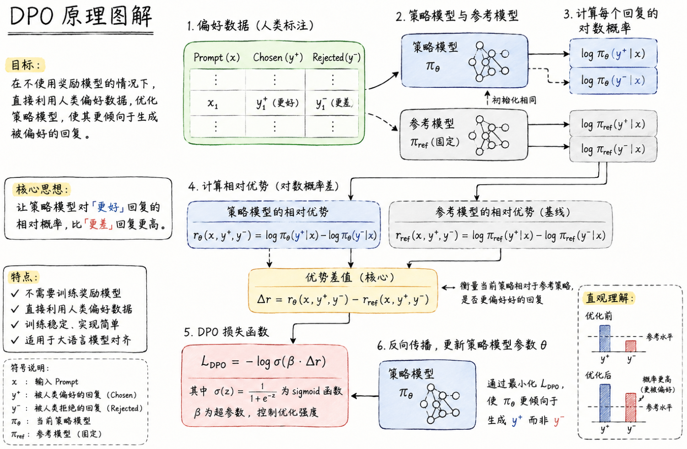
</p>

##### 1. 数据与模型准备

DPO 的每条样本包含输入 Prompt，还有一对回答，分别为更加符合人类偏好的 chosen answer，另一个是相对较差的 rejected answer.

本案例选用：[HuggingFaceH4/ultrafeedback_binarized](https://huggingface.co/datasets/HuggingFaceH4/ultrafeedback_binarized)数据集：

```shell
modelscope download --dataset HuggingFaceH4/ultrafeedback_binarized --local_dir ./data/ultrafeedback_binarized
```


##### 2. 损失函数介绍与实现

DPO 的损失函数定义如下：

$$
\mathcal{L}_{DPO}(\pi_\theta; \pi_{ref}) = -\mathbb{E}_{(x, y_w, y_l) \sim \mathcal{D}} \left[ \log \sigma \left( \beta \log \frac{\pi_\theta(y_w|x)}{\pi_{ref}(y_w|x)} - \beta \log \frac{\pi_\theta(y_l|x)}{\pi_{ref}(y_l|x)} \right) \right] 
$$
- $π_\theta$​ 是当前正在训练的策略模型。
- $π_{ref}$​ 是参考模型（通常是 SFT 后的初始模型，权重冻结）。
- $y_w$​ 是 chosen（优选/人类偏好的回答）。
- $y_l$​ 是 rejected（拒绝/人类不偏好的回答）。
- $β$ 是控制偏离参考模型程度的温度参数，也可以叫做偏好强度
- $σ$ 是 Sigmoid 函数。

``` python
def compute_loss(chosen_loss, reject_loss, reference_chosen_loss, reference_reject_loss):  
    """  
    基于 DPO 的损失函数。（这里的概率都经过了log函数）  
    """   
    # 定义优化强度β（初始值0.1）  
    beta = 0.1  
  
    r_theta = chosen_loss - reject_loss  
    r_ref = reference_chosen_loss - reference_reject_loss  
    r = r_theta - r_ref  
  
    loss = -torch.log_softmax(r, dim=-1)  
    return torch.mean(loss)  
  
  
def compute_log_probs(output_logits, labels, assistant_answer_mask):  
    """  
    计算 log    
    :param output_logits: batch_size, seq_len, vocab_size    
    :param labels: batch_size, seq_len    
    :param assistant_answer_mask: batch_size, seq_len    
    :return:    
    """    
    # 1. log_probs batch_size, seq_len, vocal_size    
    
    log_probs = torch.log_softmax(output_logits, dim=-1)  
  
    # 2. gather batch_size, seq_len, 1  
    gathered = torch.gather(log_probs, dim=-1, index=labels.unsqueeze(-1))  
    answer_log_probs = gathered.squeeze(-1)  
  
    # 3. 得到每个样本的 -log_yi    
    answer_log_probs = answer_log_probs * -1  
  
    # 4. 把不需要计算损失的位置设置为0 batch_size, seq_len  
    masked_answer_log_probs = answer_log_probs * assistant_answer_mask  
    # 5. 计算每个样本的损失  
    return torch.sum(masked_answer_log_probs, dim=-1) / assistant_answer_mask.sum(dim=-1)
```

##### 3. 训练流程

``` python
def train(tokenizer:PreTrainedTokenizerFast, config: DPOConfig, args):  
    # 1. 加载模型（策略模型和参考模型）  
    pai_model = AutoModelForCausalLM.from_pretrained(config.model_path, torch_dtype=torch.bfloat16)  
    ref_model = AutoModelForCausalLM.from_pretrained(config.model_path, torch_dtype=torch.bfloat16)  
  
    pai_model.to(config.device)  
    ref_model.to(config.device)  
  
    pai_model.train()  
    ref_model.eval()  
  
  
    # 开启 gradient checkpointing：不存中间激活，反向时重算，节省 ~3.6GB    pai_model.gradient_checkpointing_enable()  
    # checkpointing + use_cache 会冲突，关掉  
    pai_model.config.use_cache = False  
  
    optimizer = torch.optim.AdamW(pai_model.parameters(), lr=config.max_lr)  
  
    # 缓存一次，避免每个 step 都重 encode    eos_token_id = tokenizer.convert_tokens_to_ids("<|im_end|>")  
  
    # 2. 加载数据集  
    chosen_train_ds, reference_train_ds = get_train_data(config)  
  
    # 2.1 对数据集的 messages 进行 apply_chat_template，得到数据集[{"input_ids": []}, ] 每条样本只有input_ids  
    chosen_train_ds = chosen_train_ds.map(  
        lambda x: apply_chat_template(x, tokenizer, config.max_len),  
        batched=True,  
        batch_size=32,  
        remove_columns=['messages'],  
        load_from_cache_file=False,  
    )  
  
    reference_train_ds = reference_train_ds.map(  
        lambda x: apply_chat_template(x, tokenizer, config.max_len),  
        batched=True,  
        batch_size=32,  
        remove_columns=['messages'],  
        load_from_cache_file=False,  
    )  
  
    total_step = (len(chosen_train_ds) + config.batch_size - 1) // config.batch_size  
  
    if args.max_steps > 0:  
        total_step = min(total_step, args.max_steps)  
    print(f"Total training steps: {total_step}")  
  
    loss_history: "deque[float]" = deque(maxlen=config.logging_step)  
  
    for step in range(total_step):  
        # 分别构造批次数据  
        # 注意：数据集只剩一列时，ds[a:b] 切片迭代会返回列名字符串而不是 dict，  
        # 必须用 .select(range(...)) 才能正常返回 list[dict]（也不是，是因为我之前得到的 batch_rejected_data 不是 list，是个字典，所以在：rejected_max_ken = max(len(x["input_ids"]) for x in batch_rejected_data)  时候会有问题
        a, b = step * config.batch_size, (step + 1) * config.batch_size  
        batch_chosen_data = list(chosen_train_ds.select(range(a, b)))  
        batch_rejected_data = list(reference_train_ds.select(range(a, b)))  
        if not batch_rejected_data or not batch_rejected_data:  
            continue  
  
        # 当前 step 的 lr（每 step 只算一次）  
        cur_lr = cosine_decay(  
            step, total_step, config.warmup_ratio, config.min_lr, config.max_lr  
        )  
        for pg in optimizer.param_groups:  
            pg["lr"] = cur_lr  
  
        # 1) 对 chosen, rejected 分别padding：torch.stack 直接拼接等长 1D tensor        
        batch_max_len = max(len(x["input_ids"]) for x in batch_chosen_data['messages'])  
        chosen_seqs = [  
            nn.functional.pad(  
                torch.tensor(data["input_ids"], dtype=torch.long),  
                (0, batch_max_len - len(data["input_ids"])),  
                value=tokenizer.pad_token_id,  
            )  
            for data in batch_chosen_data  
        ]  
        chosen_padded_seqs = torch.stack(chosen_seqs, dim=0).to(config.device)  
  
        rejected_max_ken = max(len(x["input_ids"]) for x in batch_rejected_data)  
        rejected_seqs = [  
            nn.functional.pad(  
                torch.tensor(data["input_ids"], dtype=torch.long),  
                (0, rejected_max_ken - len(data["input_ids"])),  
                value=tokenizer.pad_token_id,  
            )  
            for data in batch_rejected_data  
        ]  
        rejected_padded_seqs = torch.stack(rejected_seqs, dim=0).to(config.device)  
  
        # 2) 构造输入输出：input / labels  
        chosen_input_ids = chosen_padded_seqs[:, :-1]  
        chosen_labels = chosen_padded_seqs[:, 1:]  
  
        rejected_input_ids = rejected_padded_seqs[:, :-1]  
        rejected_labels = rejected_padded_seqs[:, 1:]  
  
        # 3) mask：padding 是 train loop 里手动 pad 的，apply_chat_template 返回的  
        #    attention_mask 仍是全 1，不能复用，必须按 pad_token_id 重新算  
        chosen_assistant_answer_mask = create_answer_mask(chosen_input_ids, eos_token_id)  
        chosen_padding_mask = torch.where(chosen_input_ids == tokenizer.pad_token_id, 0, 1)  
        chosen_final_mask = chosen_padding_mask * chosen_assistant_answer_mask  
  
        rejected_assistant_answer_mask = create_answer_mask(rejected_input_ids, eos_token_id)  
        rejected_padding_mask = torch.where(rejected_input_ids == tokenizer.pad_token_id, 0, 1)  
        rejected_final_mask = rejected_padding_mask * rejected_assistant_answer_mask  
  
        if not chosen_final_mask.any() or not rejected_final_mask.any():  
            print(f"step {step}: 当前 batch 没有 assistant 回复，跳过")  
            continue  
  
        # 4) forward（bf16 autocast，省一半 logits/激活显存）  
        with torch.autocast(device_type=config.device.type, dtype=torch.bfloat16):  
  
            # 走四次前向传播  
            # 分别为策略模型（2次）  
            chosen_output_logits: torch.Tensor = pai_model(chosen_input_ids).logits  
            rejected_output_logits: torch.Tensor = pai_model(rejected_input_ids).logits  
  
            # 参考模型（2次）：不要跟踪梯度  
            with torch.no_grad():  
                ref_chosen_output_logits: torch.Tensor = ref_model(chosen_input_ids).logits  
                ref_rejected_output_logits: torch.Tensor = ref_model(rejected_input_ids).logits  
  
            # 计算参考模型、策略模型的对数概率  
            chosen_output_log = compute_log_probs(chosen_output_logits, chosen_labels, chosen_final_mask)  
            rejected_output_log = compute_log_probs(rejected_output_logits, rejected_labels, rejected_final_mask)  
  
            ref_chosen_output_log = compute_log_probs(ref_chosen_output_logits, chosen_labels, chosen_final_mask)  
            ref_rejected_output_log = compute_log_probs(ref_rejected_output_logits, rejected_labels, rejected_final_mask)  
  
  
            # 5) 计算策略模型和参考模型之间的 DPO loss            
            
            loss = compute_loss(chosen_output_log, rejected_output_log, ref_chosen_output_log, ref_rejected_output_log)  
  
        # 懒 .item()：只在 log 窗口取一次值，避免每 step CUDA sync        loss_history.append(loss.detach())  
  
        if (step + 1) % config.logging_step == 0 or step + 1 == total_step:  
            avg_loss = sum(t.item() for t in loss_history) / len(loss_history)  
            print(  
                f"step: {step + 1}/{total_step}, loss: {avg_loss:.4f}, lr: {cur_lr:.2e}"  
            )  
  
        # 6) backward  
        loss.backward()  
        optimizer.step()  
        optimizer.zero_grad()  
  
    # 保存  
    pai_model.save_pretrained(config.save_dir)  
    tokenizer.save_pretrained(config.save_dir)  
    print(f"模型已保存到 {config.save_dir}")
```

### 微调中的工程问题

在整个微调过程中，往往会遇到**资源占用高**、**训练速度慢**等工程问题。其中，训练速度慢很多时候与显存和计算资源受限有关，例如无法使用更大的 batch size、无法提高并行度，或者不得不采用更保守的训练配置。本节主要介绍这些问题的具体解决方案。

#### 显存消耗构成

再对 LLM 进行微调过程中，显存的消耗主要由以下五部分组成：**模型参数**、**梯度**、**优化器状态**、**激活值状态**以及**其他运行时开销**。

##### 1. 模型参数

模型参数指网络中所有可训练权重（如**注意力投影矩阵**、**前馈网络权重**等）。在训练过程中，这些参数需常驻显存，用于前向传播与反向传播计算。参数所占显存与模型总参数量和存储精度直接相关。

$$
\text{VRAM}_{\text{params}} = N_{\text{params}} \times B_{\text{param\_dtype}}
$$

其中：

- $N_{\text{params}}$：模型总参数数量（例如 7B = $7 \times 10^9$）
- $B_{\text{param\_dtype}}$：每个参数所占字节数（FP16 为 2 字节，FP32 为 4 字节）

**示例**：7B 模型在 FP16 精度下，参数约占 $7 \times 2 = 14$ GB 显存。

##### 2. 梯度

在反向传播过程中，每个可训练参数都会计算对应的梯度。**梯度张量的形状与参数一致**，通常以与参数相同的精度存储，因此其显存占用通常与模型参数相当。

$$
\text{VRAM}_{\text{grads}} = N_{\text{params}} \times B_{\text{param\_dtype}}
$$

##### 3. 优化器状态

现代优化器（如 [AdamW](https://arxiv.org/abs/1711.05101)）为每个可训练参数维护额外的状态变量（一阶矩 $m$ 和二阶矩 $v$），通常以 FP32 精度存储。显存占用往往是模型参数的数倍，是微调中显存消耗的主要来源。

$$
\text{VRAM}_{\text{optimizer}} = 2 \times N_{\text{params}} \times 4 = 8 N_{\text{params}} \; \text{(bytes)}
$$

**AdamW 计算公式回顾**

$$
\begin{aligned}
m_t &= \beta_1 m_{t-1} + (1 - \beta_1) g_t \\

v_t &= \beta_2 v_{t-1} + (1 - \beta_2) g_t^2 \\

\hat{m}_t &= \frac{m_t}{1 - \beta_1^t}, \quad \hat{v}_t = \frac{v_t}{1 - \beta_2^t} \\
\theta_{t+1} &= \theta_t - \eta \cdot \frac{\hat{m}_t}{\sqrt{\hat{v}_t} + \epsilon} - \eta \cdot \lambda \cdot \theta_t
\end{aligned}
$$

> AdamW 相比 Adam 多了 $\eta \cdot \lambda \cdot \theta_t$ 权重衰减项（解耦后的 weight decay），因此需要额外存储两份状态 $m, v$。

**示例**：7B 模型使用 AdamW 优化器，优化器状态约占 $2 \times 7 \times 4 = 56$ GB，远超参数本身（14 GB）。

!!! tip "这是为什么优化器状态成为主要显存瓶颈"

    在混合精度训练中，参数和梯度可以用 FP16 存储（约 14 GB + 14 GB），但 AdamW 的 $m$ 和 $v$ 必须以 **FP32 存储以保证数值稳定性**（约 56 GB）。这也正是各种显存优化技术（[DeepSpeed ZeRO](https://www.deepspeed.ai/tutorials/zero/)、FSDP、QLoRA）的主要优化对象。

##### 4. 激活值

激活值是前向传播中**各层输出的中间结果**，需在反向传播时用于梯度计算。其显存占用与模型深度、隐藏层维度、输入序列长度、批次大小呈正相关。

$$
\text{VRAM}_{\text{activations}} \approx b \times s \times h \times l \times B_{\text{act\_dtype}} \times k
$$

其中：

- $b$：批次大小
- $s$：序列长度
- $h$：隐藏维度
- $l$：模型层数
- $B_{\text{act\_dtype}}$：激活精度字节数（通常为 2，FP16）
- $k$：补偿因子（经验值，通常在 $10 \sim 30$ 之间）

!!! warning "激活值难以精确预估"

    上述公式只是粗略估算，因为激活值还受到 **网络结构**（是否使用 GQA、MoE、是否使用 FlashAttention 等）和 **梯度检查点（Gradient Checkpointing）** 策略影响。

##### 5. 其他运行时开销

包括但不限于：

- **CUDA 内核临时内存**：算子计算过程中的临时缓冲区
- **分布式训练通信缓冲区**：NCCL 等通信库的临时分配
- **框架开销**：PyTorch 自身的数据结构、CUDA 上下文等
- **分词器、DataLoader 等辅助资源**

这部分通常占比相对较小，但在大规模分布式训练中不可忽视。

---

**总显存估算示例（7B 模型，混合精度 + AdamW）**

| 组成部分 | 公式 | 显存占用 |
|---------|------|---------|
| 模型参数 | $7B \times 2$ | 14 GB |
| 梯度 | $7B \times 2$ | 14 GB |
| 优化器状态 | $2 \times 7B \times 4$ | **56 GB** |
| 激活值 | 取决于 $b, s, h, l$ | 不定 |
| 其他开销 | - | 2 ~ 5 GB |
| **合计（不含激活值）** | - | **约 90 GB** |

> 这也是为什么 7B 模型的完整微调（Full Fine-Tuning）通常需要 2~4 张 80GB 的 A100/H100 显卡——若想用更少显存微调，就需要借助 LoRA、QLoRA、ZeRO 等技术来分摊或压缩上述各项显存开销。


#### 单GPU训练优化

##### 梯度累计

**核心**：把大 batch 拆成多个 micro-batch 分别算梯度，累加后再更新参数。**显存不变，等效 batch size 变大**。

> 例：`batch_size=4, gradient_accumulation=3` 等价于单步 `batch_size=12`

**作用**：在不增加显存的前提下，避免因 batch 过小导致更新不稳定。

##### CPU 卸载

**核心**：在非计算阶段，将**激活值 / 优化器状态**从 GPU 显存卸载到 CPU 内存，需要时再回传。


##### 梯度检查点

**核心**：前向时**只保存少量检查点**；反向时需要某段中间激活，**重新执行该段前向**来恢复。是典型的时间换空间的概念。

##### 混合精度训练

**核心**：使用 FP16/BF16 加速计算，保留 FP32 副本保证稳定性。

| 类型 | 构成 | 数值范围 | 硬件 |
|------|------|---------|------|
| **FP16** | 1 符号 + 5 指数 + 10 尾数 | 小，易溢出/下溢 | 所有 GPU |
| **FP32** | 1 符号 + 8 指数 + 23 尾数 | 大 | 所有 GPU |
| **BF16** | 1 符号 + 8 指数 + 7 尾数 | 几乎等同 FP32 | Ampere 及以上 |

在混合精度训练中，模型权重实际上维护了两份副本：

- **主权重 (Master Weights)**：FP32 存储，用于参数更新，保证精度
- **工作权重 (Working Weights)**：FP16/BF16 存储，用于前向/反向的矩阵乘法


### 多GPU训练与分布式优化

##### 数据并行

**数据并行**（Data Parallelism）的核心思想是在**多张 GPU 上各放置一份完整的模型副本**，并让不同 GPU 并行处理不同的数据子集。这样做的主要目的，是提升训练吞吐量，从而加快**整体训练速度**。

整体流程如下图所示，大体可以概括为：

1. **每个 GPU 独立处理本地数据子集**，完成前向计算、反向传播并得到本地梯度。
2. **跨 GPU 进行梯度汇总**，将所有梯度进行平均，使每个 GPU 获得相同的全局梯度。
3. **各 GPU 使用相同的全局梯度独立更新参数**，从而保证所有模型副本继续保持一致。

<p align='center'>
	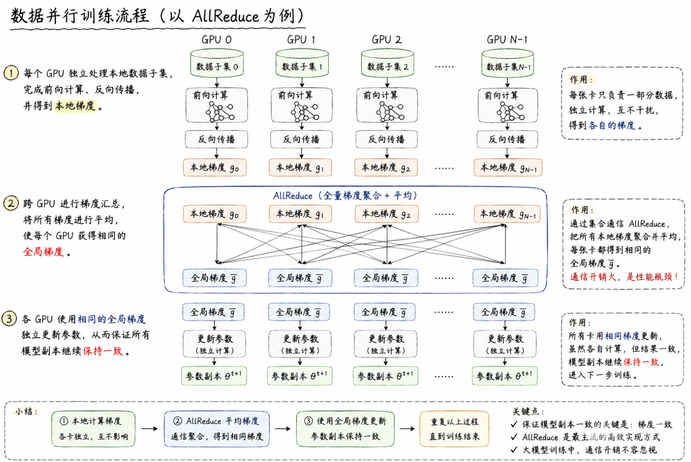
</p>

#### 流水线并行

流水线并行的核心思想是将大语言模型按层纵向切分，把不同层分配到多个设备上，每个设备负责一个模型分段。其目标是降低单设备的显存占用，使超大规模模型能够在有限硬件资源下完成训练。

但是，流水线会存在 "气泡问题"，为了解决这个问题，可以引入**微批次（Micro-batches）** + **流水线调度策略**：每个设备处理完一个微批次后立即切换到下一个，使各阶段紧密衔接、减少空闲时间。
<p align='center'>
	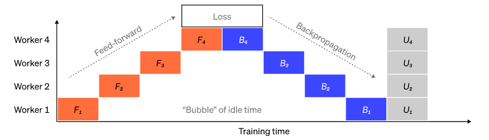
</p>
!!! warning "气泡问题"

    设备在等待上下游计算时处于空闲状态，造成**计算资源浪费**。


#### 张量并行

张量并行的做法是将**模型单层内部的张量计算拆分到多个设备上并行执行**，每个设备仅持有部分权重和中间结果。其目标仍是突破单设备显存和计算能力的限制，使超大模型的单层也能在多设备上协同完成。
<p align='center' style='zoom:60%'>
	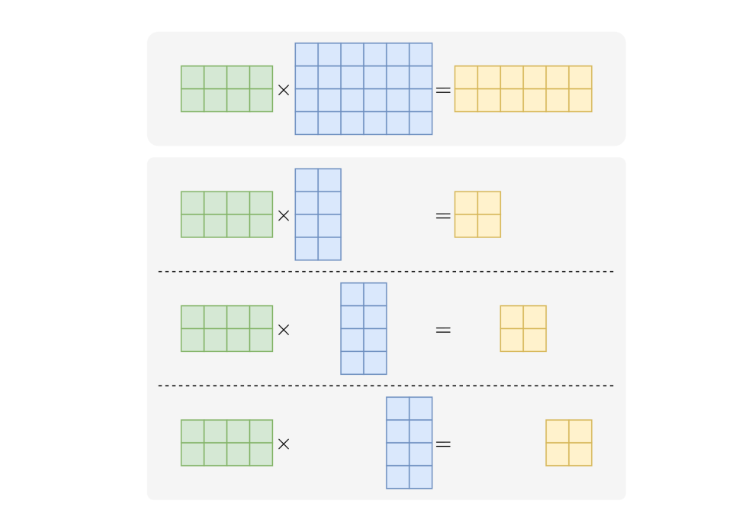
</p>


!!! tip "为什么切分有效？"

    矩阵乘法可分解为多个独立/可累加的点积，因此权重可以沿输出维度切分，**激活广播到所有设备**，各设备用本地分片权重独立计算。

#### 专家并行

**核心**：将 MoE 模型中**不同的 Expert 分配到不同设备**，每个设备仅存储和计算部分专家。

!!! tip "天然适合并行化"

    每个 Expert 本质是独立的 FFN，**无共享参数、无依赖关系**，可直接切分到不同设备并行运行。

#### ZeRO

##### 概述

[ZeRO](https://www.deepspeed.ai/tutorials/zero/)（Zero Redundancy Optimizer）是微软提出的**对数据并行的深度增强**。在标准数据并行中，每个设备都保存完整的模型状态，导致**跨设备的冗余存储**，并严重限制了可训练模型的规模。

ZeRO 的核心思想是：**分片存储、按需加载**。它不再让每块 GPU 都完整保存一整套模型状态，而是将模型状态切分成多个分片，分布式地存储在不同的 GPU 上；在执行某一层的前向或反向传播时，再通过高效的集体通信，按需、临时地从其他设备拉取当前计算所需的分片参数，并在用完后立即释放。

<p align='center' style='zoom:70%'>
	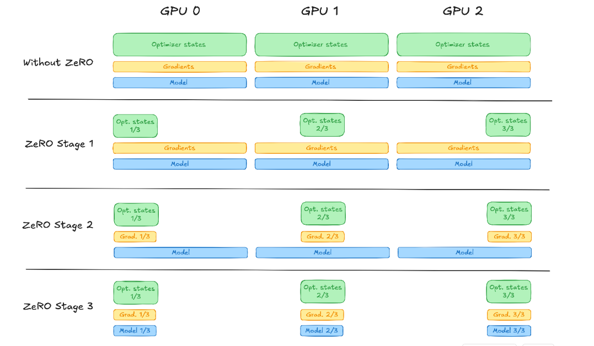
</p>
##### 分片策略

ZeRO 将模型状态分片划分为**三个递进阶段**：

| 阶段         | 分片内容              | 显存节省  | 通信开销  |
| ---------- | ----------------- | ----- | ----- |
| **ZeRO-1** | 优化器状态             | 小     | 低     |
| **ZeRO-2** | 优化器状态 + 梯度        | 中     | 中     |
| **ZeRO-3** | 优化器状态 + 梯度 + 模型参数 | **大** | **高** |

!!! tip "选择策略"

    阶段越高 → 单卡显存占用越低，但通信成本上升。需在**显存节省**与**通信开销**之间权衡。

##### 实现细节

具体实现可参考 [DeepSpeed 官方博客](https://www.deepspeed.ai/tutorials/zero/)。

### 参数高效微调 ⭐⭐⭐

**参数高效微调**（Parameter-Efficient Fine-tuning, PEFT）是一系列微调方法，其核心思想是仅更新少量参数或引入少量可训练模块，在显著降低资源消耗的同时，高效适配目标任务。目前，最先进的PEFT方法已经能实现与全参微调相当的性能。

#### Lora

**LoRA** 由微软研究院于 2021 年提出，因其训练成本低、适配能力强、推理无额外开销等优势，已成为当前大语言模型监督微调（SFT）中最广泛使用的技术。

##### Lora 原理

在传统的全参数微调中，模型中的某个**参数矩阵** $W_0 \in \mathbb{R}^{d \times k}$ 会在训练过程中被更新为：

$$W = W_0 + \Delta W$$
LoRA 观察到：$\Delta W$ 往往具有**低秩结构**，也就是说它的有效自由度远低于其表面维度。基于这一关键现象，LoRA 将 $\Delta W$ 近似分解为两个低秩矩阵的乘积：

$$
\Delta W \approx AB,\quad A \in \mathbb{R}^{d \times r},\; B \in \mathbb{R}^{r \times k}
$$
其中 $r \ll \min(d, k)$，通常取 4、8 或 16 等远小于原始维度的数值。

这样，微调后的权重矩阵可写为：

$$W = W_0 + AB$$

在训练过程中，LoRA **完全冻结原始权重 $W_0$，仅对新增的低秩矩阵 $A$ 和 $B$ 进行优化**。这大幅减少了需要更新的参数量，同时也避免了对大规模模型权重的直接修改，使微调过程更加轻量、高效。

在推理阶段，低秩增量 $AB$ 可以**无缝合并回原始权重 $W_0$ 中**，不会引入额外的计算复杂度，因此 LoRA 的高效性不仅体现在训练中，也体现在推理过程中。

<p align='center' style='zoom:70%'>
	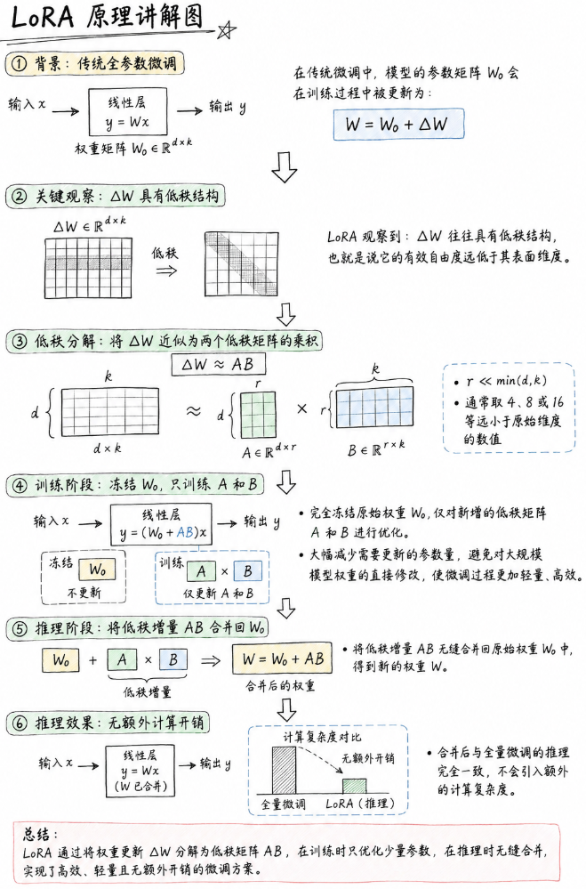
</p>

**参数压缩示例**：

对 $d = k = 4096$ 的权重矩阵：
- 全参数更新需要约 16M 个参数
- 采用 LoRA（$r = 8$）时，仅需：$4096 \times 8 + 8 \times 4096 = 65,536$ 个参数
- 仅占原始权重的约 **0.4%**

##### Lora 插入位置

LoRA 通常插入模型中的线性层。在主流 Decoder-only 模型中，最常用的是对注意力层的 q_proj 和 v_proj 插入 LoRA，原因如下：

- Query 和 Value 对任务语义最敏感；
- 仅插这两处即可接近全参微调性能；
- 参数和显存开销最小。

##### Lora 工程问题

在工程中实现中，通常会额外加入两个关键组件：

- 为了控制 LoRA 增量在训练初期的影响力，并在不同秩 $r$ 下保持数值稳定性，通常会在增量上加入缩放系数，使前向计算变为：

$$
W = W_0 + \frac{a}{r}AB
$$
- **LoRA Dropout**：为提升泛化能力，减轻小数据集上的过拟合，通常会对LoRA Layer的输入进行dropout

#### QLora

[QLoRA](https://arxiv.org/abs/2305.14314)（Quantized Low-Rank Adaptation）是 LoRA 的**量化增强版本**，由华盛顿大学和微软研究院于 2023 年提出。QLoRA 在 LoRA 的基础上引入 **4-bit 量化技术**，在几乎不损失性能的前提下，将大语言模型微调的硬件门槛大幅降低，使得数十亿参数级别的模型可在单张消费级 GPU（如 RTX 3090/4090）上完成高效微调。

<p align='center'>
	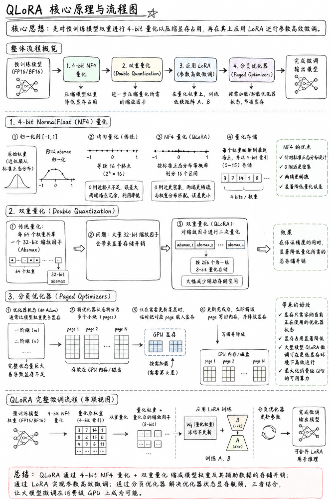
</p>

下面，分别介绍 QLora 的核心技术：

（1）**4-bit NormalFloat（NF4）量化** ：量化是一种同通过降低数值精度来压缩模型、节省显存的技术，具体的量化流程如下图所示：

<p align='center'>
	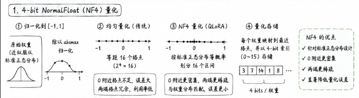
</p>

（2）**双重量化（Double Quantization）**：在权重量化过程中，为了保证精度，通常的做法是让每 64 个权重共享一个 32-bit 的缩放因子（Absmax）。虽然这种方法能有效控制量化误差，但这些大量的缩放因子自身也会带来显著的存储开销。

<p align='center'>
	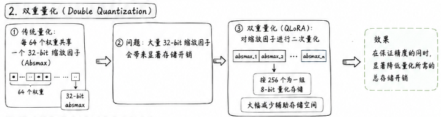
</p>

（3）分页优化器（Paged Optimizers）：在微调过程中，优化器状态（如 Adam 的一阶矩、二阶矩）往往比模型权重本身更占显存。即使使用 LoRA 或 QLoRA，大量优化器状态仍可能导致显存不足，尤其是在消费级 GPU 上。为解决这一瓶颈，QLoRA 使用了 **分页优化器（Paged Optimizer）** 技术，使优化器状态能够按需加载、按需卸载，从而更加高效地利用显存。

<p align='center'>
	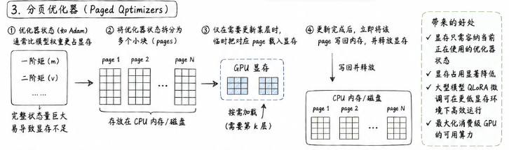
</p>

### 基于库的微调实现 ⭐⭐⭐

<p align='center'>
	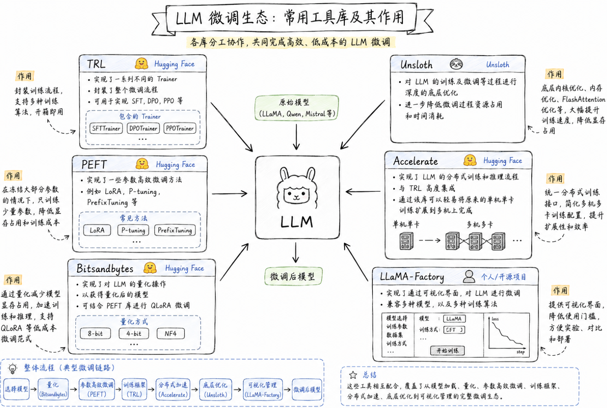
</p>

#### [TRL](https://huggingface.co/docs/trl/quickstart)

##### TRL 概述

从**整个 Hugging Face 微调生态**来看，**TRL（Transformers Reinforcement Learning）** 可以理解为：

> 一个专门用于 LLM 对齐（Alignment）和微调（Fine-tuning）的 Trainer 库。

它最大的价值不是提供模型，而是**提供各种训练算法对应的 Trainer**，把 `SFT`、`DPO`、`PPO`、`GRPO` 等训练流程封装起来，让开发者可以用统一的方式完成不同类型的微调。

##### TRL 数据格式的要求

具体可参考官方文档：[TRL下的数据格式](https://huggingface.co/docs/trl/dataset_formats)，其中，数据格式主要分为两个方面，分别为 `format` 和 `Type`，前者描述的是数据的结构方式，通常分为 *standard* 和 _conversational_ 。后者与其**设计用途**相关，例如 _prompt-only_ 或者 _preference_。至于某个 Trainer 改使用什么格式的数据集，可以参考 [which-dataset-type-to-use](https://huggingface.co/docs/trl/v1.7.1/en/dataset_formats#which-dataset-type-to-use)

<p align='center'>
	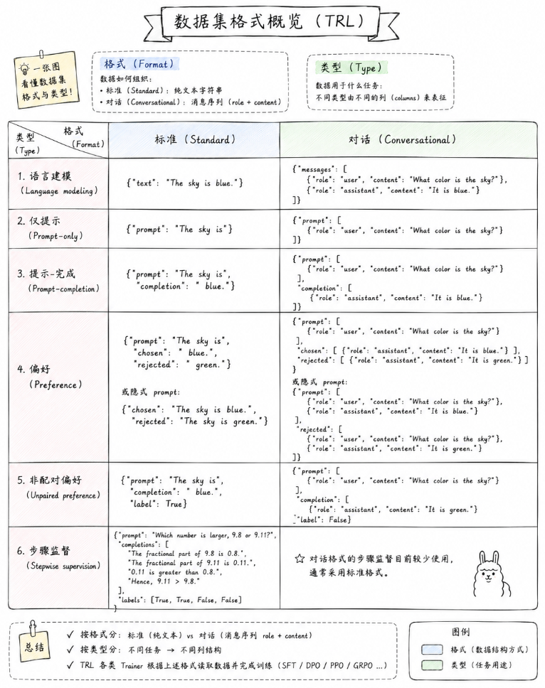
</p>

##### TRL 使用方式

首先，本章节先介绍一些重要的对象、api，然后给出一个通过 TRL 对模型进行微调的代码实操。

先介绍 SFTConfig 配置对象（它的参数），然后是 `SFTTrainer`，最后是完整的训练流程。

###### SFTConfig 

`SFTConfig` 继承自 `transformers.TrainingArguments`，在它之上扩展了 SFT 场景特有字段。完整字段可参考 TRL 官方文档：[SFTTrainer](https://huggingface.co/docs/trl/sft_trainer) 与 [TrainingArguments](https://huggingface.co/docs/transformers/main_classes/trainer#transformers.TrainingArguments)。

!!! note "核心公式"

    - **有效 batch size**：`EBS = per_device_train_batch_size × gradient_accumulation_steps × world_size`
    - **max_steps 推导**：`max_steps = ⌈len(train_dataset) × num_train_epochs / EBS⌉`

**训练规模相关**

```python
SFTConfig(
    num_train_epochs: float = 3.0,                # 训练总轮数
    per_device_train_batch_size: int = 8,        # 单卡单步样本数
    gradient_accumulation_steps: int = 1,        # 梯度累积步数
    max_steps: int = -1,                         # 最大优化步数；-1 表示由 epoch 决定
)
```

 **训练可视化相关**

```python
SFTConfig(
    logging_strategy: str = "steps",             # "no" | "epoch" | "steps"
    logging_steps: int = 500,                    # 间隔多少步打一次日志
    report_to: str = "none",                     # "none" | "tensorboard" | "wandb" | "all"
    logging_dir: str = None,                     # tensorboard 日志输出目录
)
```

**学习率相关**

```python
SFTConfig(
    learning_rate: float = 5e-5,                 # 全参 1e-5~5e-5，LoRA 1e-4~3e-4
    lr_scheduler_type: str = "linear",           # "cosine" | "linear" | "constant_with_warmup" | ...
    warmup_ratio: float = 0.0,                   # 预热步数占比，常用 0.03~0.1
)
```

!!! tip "学习率与 EBS 的关系：线性缩放法则"

    `lr ∝ EBS`。batch size 扩大 k 倍，learning rate 也应同比增加 k 倍；LoRA / QLoRA 经验上打 8 折。

**优化器策略相关**：默认 `adamw_torch`（PyTorch 版 AdamW）。

```python
SFTConfig(
    optim: str = "adamw_torch",                  # "adamw_torch" | "adamw_8bit" | "sgd" | ...
    weight_decay: float = 0.0,
    adam_beta1: float = 0.9,
    adam_beta2: float = 0.999,
    adam_epsilon: float = 1e-8,
)
```

**评估与保存相关**

```python
SFTConfig(
    output_dir: str,                             # 必填，checkpoint 与日志输出目录
    eval_strategy: str = "no",                   # "no" | "epoch" | "steps"
    eval_steps: int = 500,                       # 间隔多少步评估一次
    save_strategy: str = "steps",                # "no" | "epoch" | "steps"
    save_steps: int = 500,                       # 间隔多少步保存一次
    save_total_limit: int = 2,                   # 最多保留几个 checkpoint
    metric_for_best_model: str = "loss",         # 用于挑最优的指标名
    greater_is_better: bool = False,             # 上面那个指标越大越好还是越小越好
    load_best_model_at_end: bool = False,        # 训练结束是否加载最优 checkpoint
)
```

!!! warning "`eval_strategy` 与 `save_strategy` 要保持一致"

    否则 `load_best_model_at_end` 可能会因找不到匹配指标而报错。

 **优化相关**

```python
SFTConfig(
    bf16: bool = False,                          # bfloat16 混合精度（推荐 Ampere+ 开启）
    gradient_checkpointing: bool = False,        # 梯度检查点，用时间换显存
    max_length: int = 1024,                      # 单条样本最大 token 数（超出会截断）
    use_liger_kernel: bool = False,              # [Liger-Kernel](https://github.com/linkedin/Liger-Kernel) 加速
    model_init_kwargs: dict = None,              # 透传给 from_pretrained 的额外参数
    # model_init_kwargs={"torch_dtype": torch.bfloat16, "attn_implementation": "flash_attention_2"}
)
```

!!! tip "OOM 排查顺序"

    1. 减小 `per_device_train_batch_size`（8 → 4 → 2 → 1）
    2. 开启 `gradient_checkpointing=True`
    3. 开启 `bf16=True` 或加载 Liger-Kernel

**其他 SFT 专用参数**

```python
SFTConfig(
    assistant_only_loss: bool = False,            # 只计算 assistant 回复部分的损失
    chat_template_path: str = None,              # 自定义 chat template 的 jinja 文件路径
)
```

!!! danger "assistant_only_loss：SFT 训练中最重要的一个开关"

    默认会对整条输入（system + user + assistant）都算 loss，模型会"作弊"背诵固定 prompt。开启后只对 assistant 部分算 loss，能避免 loss 虚低、与推理目标对齐。在 trl 0.20.0+ 中是首选写法，取代了旧版 `DataCollatorForCompletionOnlyLM`。

> 关于 SFT 中"**怎么算 Loss**"的原理细节，可以回看前面 `### 2. SFT 的损失函数` 一节；关于 chat template 的设计与不计算输入 token 损失的图解，回看 `### 3. Chat Template 与 SFT`。


###### SFTTrainer

`SFTTrainer` 继承自 `transformers.Trainer`，在它的基础上接管了 SFT 场景的**数据打包、模板应用、损失计算**等流程。详细字段可参考 TRL 官方文档：[SFTTrainer](https://huggingface.co/docs/trl/sft_trainer)。

```python
SFTTrainer(
    model: str | PreTrainedModel,            # 模型路径或已加载的模型对象
    args: SFTConfig = None,                 # 训练配置，对应 SFTConfig
    train_dataset: Dataset = None,           # 训练集
    eval_dataset: Dataset | dict = None,     # 验证集；没有就传 None
    processing_class: PreTrainedTokenizer = None,  # tokenizer（旧版字段为 tokenizer）
    data_collator: DataCollator = None,      # 自定义 collator；不传则按 packing/assistant_only_loss 自动构造
    peft_config: PeftConfig = None,          # 传 LoRA/QLoRA 配置时启用参数高效微调
)
```

全参微调：

```python
from trl import SFTConfig, SFTTrainer

trainer = SFTTrainer(
	model="Qwen/Qwen2.5-7B",
	args=SFTConfig(output_dir="./sft", num_train_epochs=3),
	train_dataset=train_ds,
	processing_class=tokenizer,
)
trainer.train()
```

LoRA 微调：

```python
from peft import LoraConfig
from trl import SFTConfig, SFTTrainer

trainer = SFTTrainer(
	model="Qwen/Qwen2.5-7B",
	args=SFTConfig(output_dir="./sft-lora", num_train_epochs=3),
	train_dataset=train_ds,
	processing_class=tokenizer,
	peft_config=LoraConfig(r=16, lora_alpha=32, target_modules="all-linear"),
)
trainer.train()
```

**常用 API**：

```python
# 启动 / 恢复训练
trainer.train(resume_from_checkpoint: str | bool = None)   # 传 checkpoint 路径可断点续训

# 评估与预测
trainer.evaluate(eval_dataset: Dataset = None, ignore_keys: list = None, metric_key_prefix: str = "eval") -> dict
trainer.predict(test_dataset: Dataset, ignore_keys: list = None, metric_key_prefix: str = "test") -> PredictionOutput

# 保存与发布
trainer.save_model(output_dir: str = None)                # 不传则保存到 args.output_dir
trainer.save_state(output_dir: str = None)                # 保存优化器、scheduler、scaler 等状态
trainer.push_to_hub(commit_message: str = "End of training", blocking: bool = True)  # 推到 HuggingFace Hub

# 日志
trainer.log(metrics: dict, step: int = None)              # 写入日志（控制台 + report_to 后端）

# 内部 hook（一般重写以注入自定义优化器 / scheduler）
trainer.create_optimizer() -> torch.optim.Optimizer
trainer.create_scheduler(num_training_steps: int, optimizer: torch.optim.Optimizer = None) -> LambdaLR
```

!!! tip "典型调用顺序"

    ```python
    trainer.train()                          # 训练
    trainer.evaluate()                       # 训练完跑一次评估
    trainer.save_model()                    # 保存最终模型到 output_dir
    trainer.save_state()                    # 顺手把训练状态也存了，便于复现
    ```

##### TRL 实践

``` python
from datasets import load_dataset, Dataset  
from transformers import AutoModelForCausalLM, AutoTokenizer  
from trl.trainer.sft_trainer import SFTConfig, SFTTrainer  
  
# 1. 加载模型和tokenizer  
model = AutoModelForCausalLM.from_pretrained('Qwen/Qwen3-0.6B')  
tokenizer = AutoTokenizer.from_pretrained('Qwen/Qwen3-0.6B')  
  
# 2. 加载数据集  
ds = load_dataset(  
    'json',  
    data_files={  
        'train': 'data/keywords_data_train.jsonl',  
        'test': 'data/keywords_data_test.jsonl'  
    }  
)  
  
train_ds, test_ds = ds['train'], ds['test']  
print(train_ds.info)  
  
def convert_data(batch:dict):  
    # 遍历每一个数据  
    temp = [] # 对这批处理完后，返回的是一个字典{messages:[{messages:[]},{}, {}]}  
    # print(f'{batch=}')    
    for conversation in batch['conversation']:  
        
        messages = []  
        for turn in conversation:  
            messages.append({  
                'role': 'user',  
                'content': turn['human']  
            })  
            messages.append({  
                'role': 'assistant',  
                'content': turn['assistant']  
            })  
  
        temp.append(messages)  
  
    return {'messages': temp}  
    

train_ds = train_ds.map(convert_data, batched=True, remove_columns=train_ds.column_names)  
test_ds = test_ds.map(convert_data, batched=True, remove_columns=test_ds.column_names)  

  
# 3. 构造 sft 配置对象  
config = SFTConfig(  
    # 训练规模相关  
    num_train_epochs=3,  
    per_device_train_batch_size=12,  
    gradient_accumulation_steps=1,  
    max_steps=-1,  
  
    # 训练可视化相关  
    logging_strategy='steps',  
    logging_steps=10,  
    report_to='tensorboard',  
  
    # 训练优化相关  
    bf16=True,  
    gradient_checkpointing=True,  
    max_length=1500,  
    # activation_offloading=  
  
    # 模型保存和评估相关  
    save_strategy='steps',  
    save_steps=100,  
    output_dir='./model/QWen3-0.6B-TRF',  
    eval_strategy='steps',  
    eval_steps=100,  
    metric_for_best_model='eval_loss',  
    greater_is_better=False,  
    load_best_model_at_end=True,  
  
    # 学习率相关  
    learning_rate=1e-5,  
    lr_scheduler_type='cosine',  
  
    # 对话式模型特有的，也就是不去计算用户输入，系统提示词对应输出的损失
    assistant_only_loss=True,  
    
    # 使用其他 chat_template    
    # chat_template_path = '' #传一个本地路径就行  
    )
  

trainer = SFTTrainer(  
    model=model,  
    processing_class=tokenizer,  
    args=config,  
    train_dataset=train_ds,  
    eval_dataset=test_ds,  
)  
  
print(trainer.model)  
  
trainer.train()  
trainer.save_model(output_dir='model/QWen3-0.6B-TRF') %%
```

#### PEFT

##### PEFT 概述

**PEFT** 是 Hugging Face 官方维护的**参数高效微调库**。它用于在不完整微调整个大模型参数的情况下，仅训练少量**新增参数**，从而降低显存、计算和存储成本。PEFT 与 **Transformers**、**Accelerate** 等库集成，提供了更便捷的方式来加载、训练大型模型，并将其用于推理。

<p align='center'>
	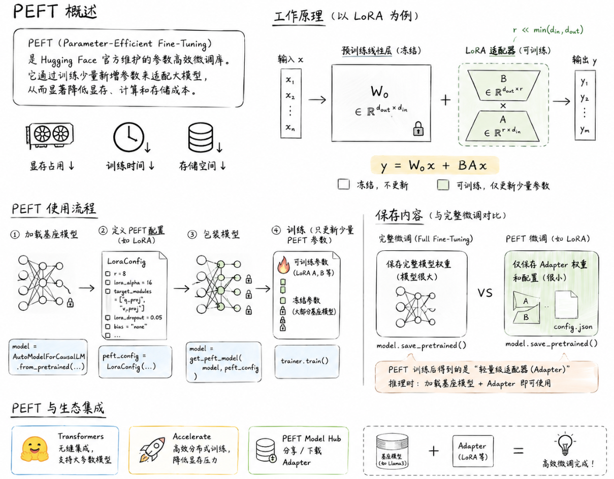
</p>

##### PEFT 使用方法

在使用 PEFT 时，通常会先定义一个 **PeftConfig**，例如 LoraConfig，然后通过 **get_peft_model**(model, peft_config) 将原始模型包装为 PeftModel。与原始模型相比，PeftModel 的主要变化包括：

- 冻结基座模型的大部分或全部参数，避免完整微调整个模型
- 根据配置添加可训练的 PEFT 参数，例如 LoRA 会在指定线性层中引入低秩矩阵 A、B；
- 调用 model.save_pretrained() 时，默认主要保存 adapter 权重和配置文件，而不是保存完整的基座模型权重。

具体使用方式可以参考[peft_integration](https://huggingface.co/docs/trl/v1.7.1/en/peft_integration)，总的来说，有三种方式去使用 PEFT，分别为：

1. Using CLI Flags (Simplest)：启用 PEFT 最简单的方法是在命令行界面中使用 `--use_peft` 标志。这种方法非常适合快速实验和标准配置

``` python
python trl/scripts/sft.py \
    --model_name_or_path Qwen/Qwen2-0.5B \
    --dataset_name trl-lib/Capybara \
    --use_peft \
    --lora_r 32 \
    --lora_alpha 16 \
    --lora_dropout 0.05 \
    --output_dir Qwen2-0.5B-SFT-LoRA
```

2. Passing peft_config to Trainer (Recommended)：为了获得更精细的控制，可以直接将 PEFT 配置传递给训练器。这是大多数使用场景的推荐方法

``` python
peft_config = LoraConfig(
    r=32,
    lora_alpha=16,
    lora_dropout=0.05,
    bias="none",
    task_type="CAUSAL_LM",
    target_modules=["q_proj", "v_proj", "k_proj", "o_proj"],
)

trainer = SFTTrainer(
    model=model,
    args=training_args,
    train_dataset=dataset,
    peft_config=peft_config,  # Pass config here
)
```
 
3. Applying PEFT to Model Directly (Advanced)：为了获得最大的灵活性，您可以在将模型传递给训练器之前，先对模型应用 PEFT

``` python
from peft import LoraConfig, get_peft_model
from transformers import AutoModelForCausalLM
from trl import SFTConfig, SFTTrainer

# Load base model
model = AutoModelForCausalLM.from_pretrained("Qwen/Qwen2-0.5B")

# Apply PEFT configuration
peft_config = LoraConfig(
    r=32,
    lora_alpha=16,
    lora_dropout=0.05,
    bias="none",
    task_type="CAUSAL_LM",
)
model = get_peft_model(model, peft_config)

# Pass PEFT-wrapped model to trainer
trainer = SFTTrainer(
    model=model,  # Already has PEFT applied
    args=training_args,
    train_dataset=dataset,
    # Note: no peft_config needed here
)	
```


##### [PEFT 学习率选择](https://huggingface.co/docs/trl/v1.7.1/en/peft_integration?trainer-type=sft#learning-rate-considerations)

使用 LoRa 或其他 PEFT 方法时，通常需要使用比完全微调**更高的学习率** （大约 10 倍）。这是因为 PEFT 方法只训练一小部分参数，因此需要更大的学习率才能实现类似的参数更新。

具体选择可参考：[learning-rate-considerations](https://huggingface.co/docs/trl/v1.7.1/en/peft_integration?trainer-type=sft#learning-rate-considerations)

##### [PEFT 模型的保存与加载](https://huggingface.co/docs/trl/v1.7.1/en/peft_integration?trainer-type=sft#saving-and-loading-peft-models)

保存模型与全参微调一致，只不过此时只保存适配器的权重，而不是完整的模型

``` python
# Save the adapters
trainer.save_model("path/to/adapters")

# Or manually
model.save_pretrained("path/to/adapters")
```

加载模型是有区别的，我们需要先加载这个被微调的模型，然后再去通过 PEFT 提供的方法 `PeftModel.from_pretrained` 去加载适配器权重，至于适配器权重是否要更新到当前模型，这是可选的，不更新，无非就是推理的时候多一步运算。

``` python
from transformers import AutoModelForCausalLM
from peft import PeftModel

# Load base model
base_model = AutoModelForCausalLM.from_pretrained("Qwen/Qwen2-0.5B")

# Load PEFT adapters
model = PeftModel.from_pretrained(base_model, "path/to/adapters")

# Optionally merge adapters into base model for faster inference
model = model.merge_and_unload()
```

