## NLP 概述

自然语言处理（Natural Language Processing, NLP），是人工智能领域的一个重要分支。自然语言，指人类日常使用的语言（如中文、英文），NLP 的目标是让计算机“理解”或“使用”这些语言。

## NLP 文本表示

### 什么是文本预处理？

文本预处理就是在预料输送给模型之前所作的一系列工作，目的是让这些语料满足 LLM 的输入要求。比如，只有将一个一个 token 转换为 embedding，模型才能理解以及对这个 token 做后续的计算。

### 文本处理的流程 ⭐⭐⭐

 <p>
	 
 </p>

### 文本处理的基本方式

#### 1. 分词 ⭐⭐⭐

**分词**（Tokenization）是将原始文本切分为若干具有独立语义的**最小单元**（即token）的过程，是所有 NLP 任务的起点。

##### 英文分词

英文的分词方式可分为**词级**（Word-Level）分词、**字符级**（Character-Level）分词和**子词级**（Subword-Level）分词。不同方式各有优劣，适用于不同场景。

??? note "三种分词方式对比"

    | 方式     | 词表规模     | OOV 问题  | 语义保留 | 序列长度 | 典型代表              |
    | ------ | -------- | ------- | ---- | ---- | ----------------- |
    | 词级分词   | 很大（10万+）  | 严重      | 强    | 短    | 传统 NLP 工具         |
    | 字符级分词  | 极小（\~256） | 几乎无     | 弱    | 长    | 字符级 CNN/RNN       |
    | 子词级分词  | 适中（3万\~5万） | 极少      | 中等   | 中    | BERT、GPT 等现代大模型 |

!!! note "参考教程"

    BPE 的详细训练与分词过程可参考 Hugging Face 官方课程：[Byte-Pair Encoding tokenization](https://huggingface.co/learn/nlp-course/en/chapter6/5)。

##### 中文分词

中文分词也分为三种，但是这里就不重复介绍了，只需要知道中文的 “字符” 就是汉字，然后现在主要有两种路线，第一种就是词级分词，代表工具包括 [**jieba**](https://github.com/fxsjy/jieba)**、**[**HanLP**](https://github.com/hankcs/HanLP)等，这些工具广泛应用于传统 NLP 任务中。另一种是基于**子词建模算法**（如BPE）的方式，代表工具包括 [**Hugging** **Face** **Tokenizer**](https://github.com/huggingface/tokenizers)**、**[**SentencePiece**](https://github.com/google/sentencepiece)**、**[**tiktoken**](https://github.com/openai/tiktoken)等，常用于大规模预训练语言模型中。

**jieba** 是 Python 实现的中文分词库，主要有三种分词模式：

| 模式 | 说明 | 函数 |
|------|------|------|
| **精确模式** | 试图将句子最精确地切开，适合文本分析 | `jieba.cut(lcut_all=False)` |
| **全模式** | 把句子中所有的可以成词的词语都扫描出来，速度快，但会有歧义 | `jieba.cut(cut_all=True)` |
| **搜索引擎模式** | 在精确模式基础上，对长词再次切分，提高召回率 | `jieba.cut_for_search()` |

下面主要演示 **jieba** 分词器的用法。
 
!!! note "官方项目"
    具体用法详见 [jieba GitHub](https://github.com/fxsjy/jieba)，主要的操作就是分词、加载用户的自定义词典、通过 TF-IDF 算法来提取关键字等。

=== "精确模式"

    ```python
    import jieba
    
    text = '我爱学习，我爱敲代码'
    
    # 精确模式：cut_all=False (默认)
    words = jieba.cut(text, cut_all=False)
    print('/ '.join(words))
    ```
    
    输出：
    ```
    我/ 爱/ 学习/ ，/ 我/ 爱/ 敲/ 代码
    ```
    
    ??? note "说明"
        精确模式会**尽量精确地切开句子**，保留最合理的分词结果，避免歧义，适合大多数场景。

=== "全模式"

    ```python
    import jieba
    
    text = '我爱学习，我爱敲代码'
    
    # 全模式：cut_all=True
    words = jieba.cut(text, cut_all=True)
    print('/ '.join(words))
    ```
    
    输出：
    ```
    我/ 爱/ 学习/ ，/ 我/ 爱/ 敲/ 代码
    ```
    
    ??? note "说明"
        全模式会**把所有可能成词的片段都切分出来**，速度快，但可能产生冗余和歧义。

=== "搜索引擎模式"

    ```python
    import jieba
    
    text = '我爱学习自然语言处理'
    
    # 搜索引擎模式：基于精确模式，对长词再次切分
    words = jieba.cut_for_search(text)
    print('/ '.join(words))
    ```
    
    输出：
    ```
    我/ 爱/ 学习/ 自然/ 语言/ 处理/ 自然语言/ 自然语言处理
    ```
    
    ??? note "说明"
        搜索引擎模式适合构建搜索引擎倒排索引，会对长词进一步切分，提高召回率。


####  2. 命名实体识别 - NER

人名、地名、机构名等专业名词统称为命名实体，NER(Named Entity Recongnition) 则是在一段文本中识别出可能存在的命名实体，这个任务是 AI 解决 NLP 领域的重要基础。
 
#### 3. 词性标注 - POS

词性标注则是标出一段文本中每个词汇的词性，词性是对语言文本的另一个角度的理解，也是 AI 解决 NLP 高阶任务的基础。

``` python
from jieba import posseg
# res 是一个生成器
res = posseg.cut("小明硕士毕业于中国科学院计算所，后在日本京都大学深造
# item 是 jieba 自定义的 class，它有 word, flag 这两个属性
for item in res:  
    print(type(item), item.word, item.flag, sep=" ")
    
# 输出
<class 'jieba.posseg.pair'> 小明 nr
<class 'jieba.posseg.pair'> 硕士 n
<class 'jieba.posseg.pair'> 毕业 n
<class 'jieba.posseg.pair'> 于 p
<class 'jieba.posseg.pair'> 中国科学院 nt
<class 'jieba.posseg.pair'> 计算所 n
<class 'jieba.posseg.pair'> ， x
<class 'jieba.posseg.pair'> 后在 t
<class 'jieba.posseg.pair'> 日本京都大学 nt
<class 'jieba.posseg.pair'> 深造 v
```

### 文本表示 ⭐⭐⭐

将一段文本使用张量的形式表示，这个过程就叫做文本张量表示，词表示成词向量，一句话就构成了一个词向量矩阵。做这个转换是因为计算机无法直接理解人类自然语言，所以要把文本转为计算机可以理解和计算的形式，也就是张量。
#### 1. one-hot

**One-Hot 编码** 是最基础的离散表示方法：

- 词汇表大小就是向量维度
- 每个词对应一个向量，**仅在该词索引位置为 1，其余位置全为 0**
- 优点：简单直观，实现容易
- 缺点：**维度灾难**（词汇表大时维度极高），并且完全丢弃了词与词之间的联系，无法表示词间语义相关性。

<p align='center' style="zoom: 80%;">
	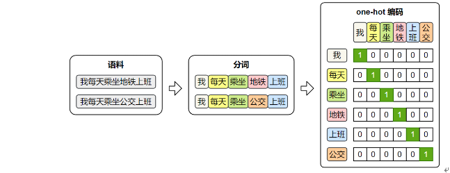
</p>


```python
"""
演示独热编码的生成 + 使用
"""
# 词汇表
words = ['周杰伦', '陈奕迅', '王力宏', '吴亦凡', '刘德华']
label = [0, 1, 2, 3, 4]
dic = dict(zip(words, label))

def one_hot(word) -> list:
    """
    生成独热编码
    :param word:
    :return:
    """
    if word not in dic:
        print('没有该词')
        raise ValueError
    res = [0] * len(dic)
    res[dic[word]] = 1
    return res

# 测试
print(one_hot('周杰伦'))   # [1, 0, 0, 0, 0]
print(one_hot('陈奕迅'))  # [0, 1, 0, 0, 0]
```

#### 2. word2vec

**Word2Vec** 是 Google 提出的**词嵌入模型**，核心思想：

- 通过**浅层神经网络**在大规模语料上训练，将词映射为**低维稠密向量**
- 能够**捕捉词语义相似度**：语义相近的词在向量空间中距离更近

<p align='center' style="zoom: 80%;">
	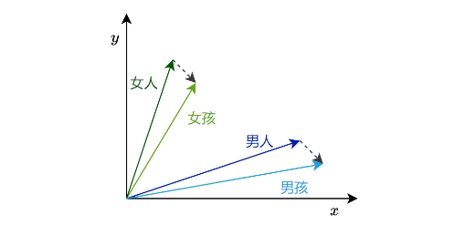
</p>

支持两种训练模式：

  **CBOW**：根据上下文预测中心词，适合小规模语料，如下图，神经网络的输入是当前词的上文和下文，目标输出是中心词。
<p align='center' style="zoom: 80%;">
	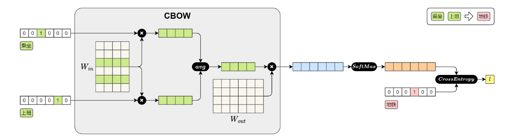
</p>


**Skip-gram**：根据中心词预测上下文，适合大规模语料
<p align='center' style="zoom: 80%;">
	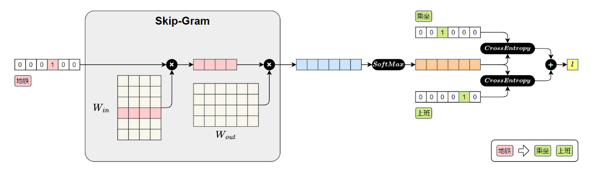
</p>

Word2Vec 的出现让词表示进入了 embedding 时代，是 NLP 里程碑式的工作。

下面是通过 FastText 去训练词向量的过程，具体用法参考[官方文档](https://fasttext.cc/docs/en/support.html)。

=== "安装"

    ```bash
    # 推荐使用 uv 安装预编译的 wheel 包
    # Python 3.12 可用，Python 3.14 会兼容性报错
    uv add fasttext-wheel

    # 或使用 pip
    pip install fasttext-wheel
    ```

=== "训练词向量"

    ```python
    import fasttext

    # 训练无监督词向量
    # input: 训练语料，每行一句话
    # dim: 词向量维度
    # ws: 上下文窗口大小
    # minCount: 词频低于此值的词会被过滤
    # epoch: 训练轮数
    model = fasttext.train_unsupervised(
        input='corpus.txt',
        model='skipgram',  # 可选 'cbow'
        dim=100,
        ws=5,
        minCount=5,
        epoch=5
    )

    # 保存模型
    model.save_model("word2vec.bin")
    ```

    ??? note "语料格式"
        `corpus.txt` 每行是一个句子，词语已经预先分好词（空格分隔）：
        ```
        我 爱 学习 自然 语言 处理
        今天 天气 真 好
        ```

=== "加载 & 使用"

    ```python
    import fasttext

    # 加载预训练模型
    model = fasttext.load_model("word2vec.bin")

    # 获取单个词的词向量
    vec = model.get_word_vector("自然语言")
    print(vec.shape)  # (100,)
    ```

=== "最近邻查询"

    ```python
    # 获取与输入词语义最相近的 N 个词
    words = model.get_nearest_neighbors("人工智能", k=10)

    for similarity, word in words:
        print(f"{word}: {similarity:.4f}")
    ```

    输出示例：
    ```
    机器学习: 0.8765
    深度学习: 0.8234
    大数据: 0.7891
    ```

=== "参数说明"

    | 参数 | 说明 | 默认值 |
    |------|------|--------|
    | `model` | 训练模式 `cbow` 或 `skipgram` | `skipgram` |
    | `dim` | 词向量维度 | `100` |
    | `ws` | 上下文窗口大小 | `5` |
    | `minCount` | 最小词频阈值 | `5` |
    | `epoch` | 训练轮数 | `5` |
    | `lr` | 学习率 | `0.05` |
    | `thread` | 线程数 | `cpu 核心数` |


第二种方式就是通过 [Gensim](https://radimrehurek.com/gensim/) 库来完成。Gensim 提供了两种使用词向量的方式：加载**预训练词向量**，或者**自行训练**。

可使用 `KeyedVectors.load_word2vec_format()` 加载第三方训练好的词向量文件（如腾讯、微博、Google 等公开词向量）。

=== "加载词向量"

    ```python
    from gensim.models import KeyedVectors

    model_path = 'sgns.weibo.word.bz2'
    model = KeyedVectors.load_word2vec_format(model_path)
    ```

    ??? note "示例词向量文件"

        上述代码使用的 `sgns.weibo.word.bz2` 词向量文件包含 **195,202** 个词，每个词向量 **300** 维。文件可从 [Tencent AI Lab Embedding Corpus](https://ai.tencent.com/ailab/nlp/en/embedding.html) 下载，也可直接从课程资料获取。

=== "查询词向量"

    ```python
    # 查看词向量维度
    print(model.vector_size)

    # 查看某个词的向量
    print(model['地铁'])

    # 计算两个向量的相似度
    similarity = model.similarity('地铁', '公交')
    print('地铁 vs 公交 相似度：', similarity)
    ```

    !!! info "余弦相似度"

        `model.similarity` 计算的是两个词向量的**余弦相似度**：

$$\text{similarity}(w_1, w_2) = \cos(\theta) = \frac{w_1 \cdot w_2}{\|w_1\| \cdot \|w_2\|}$$

        返回值介于 `[-1, 1]`：

        - 接近 1：高度相似，语义接近；
        - 接近 0：无明显相关；
        - 接近 -1：方向完全相反，极度不相似。

=== "找最相似的词"

    ```python
    # 找相似的词
    model.similar_by_word('男孩')
    
    # 找出与 "上班" 最相似的 5 个词
    similar_words = model.most_similar(positive=["上班"], topn=5)
    print(similar_words)

    # 语义加减：爸爸 - 男性 + 女性 ≈ 妈妈
    result = model.most_similar(positive=["爸爸", "女性"], negative=["男性"], topn=3)
    print(result)
    ```

**自行训练词向量**

??? tip "准备语料"

    Word2Vec 的训练语料需要是**已分词**的文本序列，每个句子是一个 token 列表：

    ```python
    sentences = [
        ['我', '每天', '乘坐', '地铁', '上班'],
        ['我', '每天', '乘坐', '公交', '上班']
    ]
    ```

=== "训练模型"

    ```python
    from gensim.models import Word2Vec

    model = Word2Vec(
        sentences,           # 已分词的句子序列
        vector_size=100,     # 词向量维度
        window=5,            # 上下文窗口大小
        min_count=2,         # 最小词频（低于此值的词会被忽略）
        sg=1,                # 1: Skip-Gram，0: CBOW
        workers=4            # 并行训练线程数
    )
    ```

=== "保存与加载"

    ```python
    # 保存词向量
    model.wv.save_word2vec_format('my_vectors.kv')

    # 加载词向量
    from gensim.models import KeyedVectors
    my_model = KeyedVectors.load_word2vec_format('my_vectors.kv')
    ```

!!! note "官方文档"

    Gensim Word2Vec 详细参数与 API 请参考：[Gensim Word2Vec 官方文档](https://radimrehurek.com/gensim/models/word2vec.html)。


#### 3. word Embedding

**Word Embedding（词嵌入）** 是更通用的概念：

- 将离散的词映射为**低维稠密向量**的过程都可称为词嵌入
- 在现代深度学习中，通常指神经网络的 **Embedding 层**，它是一个可训练的参数矩阵
- 预训练词嵌入（Word2Vec/GloVe）可以直接拿来使用，也可以在下游任务中微调

```python
import torch
import torch.nn as nn

# 词汇表大小 1000，嵌入维度 128
embedding = nn.Embedding(num_embeddings=1000, embedding_dim=128)

# 输入：两个句子，每个句子 5 个词的索引
x = torch.randint(0, 1000, (2, 5))  # [batch_size, seq_len]

# 输出：[batch_size, seq_len, embedding_dim]
output = embedding(x)
print(output.shape)  # torch.Size([2, 5, 128])
```

!!! note "区别"
    - `one-hot`：人工编码，稀疏向量，无法训练
    - `word2vec`：特定的词嵌入训练方法，得到静态词向量
    - `word embedding`：通用概念，指任何将词转为向量的方法，包括可训练的嵌入层

### 文本的数据分析

文本数据分析能够帮助我们理解数据语料，快速检查出语料可能存在的问题，它也能一定程度上指导我们的超参数选择。例如，关于标签 Y，分类问题查看标签是否均匀；关于数据 X，查看有没有脏数据，整体数据长度分布等等。

### 文本特征处理 ⭐⭐⭐

	为语料添加具有普适性的文本特征，让模型的处理更加高效。常用的方法：

=== "n-gram 特征"

    **核心思想**：把连续的 `n` 个词/字符当作一个特征单元，从而捕捉局部上下文信息。

    - `n=1` → unigram（一元语法，单个词）
    - `n=2` → bigram（二元语法，连续两个词）
    - `n=3` → trigram（三元语法，连续三个词）

    **作用**：增加特征维度，引入上下文信息，提升模型表现；一般取 2-3 足够。

    **缺点**：随着 n 增大，特征空间维度爆炸，特征矩阵极度稀疏。

    **手动实现 ngram 提取也很简单：**

    ```python
    import jieba

    def get_ngram(words: list, n:int) -> list:
        """
        手动提取 n-gram
        :param words: 分词后的词语列表
        :param n: n 值
        :return: n-gram 列表
        """
        res = []
        for i in range(len(words) - n + 1):
            res.append(' '.join(words[i:i+n]))
        return res

    # 分词示例
    text = '我爱学习自然语言处理'
    words = list(jieba.cut(text))
    print(f"分词结果: {words}")

    # 提取二元语法 (bigram)
    print(f"bigram: {get_ngram(words, 2)}")

    # 提取三元语法 (trigram)
    print(f"trigram: {get_ngram(words, 3)}")
    ```

    输出：
    ```
    分词结果: ['我', '爱', '学习', '自然语言', '处理']
    bigram: ['我 爱', '爱 学习', '学习 自然语言', '自然语言 处理']
    trigram: ['我 爱 学习', '爱 学习 自然语言', '学习 自然语言 处理']
    ```

    也可以使用 nltk 现成工具：
    ```python
    from nltk.util import ngrams
    bigrams = list(ngrams(words, 2))
    print(f"bigram: {['_'.join(bg) for bg in bigrams]}")
    ```

=== "规范文本长度"

    **为什么需要？** 深度学习模型训练时，要求一个批次（batch）内所有样本**长度一致**，因此需要统一规范。

    **做法**：
    - 超过目标长度的句子 → **截断**
    - 不足目标长度的句子 → **填充**（通常用 0 填充）
 
    ```python
    import jieba

    def standardize_length(words, max_len, pad_token=0):
        """
        规范文本长度：截断 + 填充
        :param words: 分词后的词索引列表
        :param max_len: 目标长度
        :param pad_token: 填充标记
        :return: 长度统一的列表
        """
        if len(words) >= max_len:
            # 截断
            return words[:max_len]
        else:
            # 填充
            return words + [pad_token] * (max_len - len(words))

    # 示例
    text = '我爱学习自然语言处理'
    words = list(jieba.cut(text))
    word2idx = {word: i+1 for i, word in enumerate(words)}  # 0 留作填充
    indices = [word2idx[w] for w in words]

    print(f"原始长度: {len(indices)}, indices: {indices}")

    # 测试不同 max_len
    print(f"max_len=10: {standardize_length(indices, 10)}")
    print(f"max_len=3:  {standardize_length(indices, 3)}")
    ```

    输出：
    ```
    原始长度: 5, indices: [1, 2, 3, 4, 5]
    max_len=10: [1, 2, 3, 4, 5, 0, 0, 0, 0, 0]
    max_len=3:  [1, 2, 3] 
    ```

    ??? tip "PyTorch 批量填充 - 自定义实现"

        对**多个变长序列**批量填充，手动实现也很简单：

        ```python
        from torch import Tensor
        import torch

        def sequence_pad_by_custom(sequences: list[Tensor]):
            """
            通过自定义实现批量文本长度规范
            :param sequences: 多个张量组成的列表，每个张量长度不同
            :return: 填充后的张量 [batch_size, max_len]
            """
            max_len = max([len(seq) for seq in sequences])
            return torch.stack([
                torch.cat([seq, torch.zeros(max_len - len(seq))]) for seq in sequences
            ])

        # 测试
        seq1 = torch.tensor([1, 2, 3])
        seq2 = torch.tensor([4, 5])
        seq3 = torch.tensor([6])
        print(sequence_pad_by_custom([seq1, seq2, seq3]))
        ```

        输出：
        ```
        tensor([[1., 2., 3.],
                [4., 5., 0.],
                [6., 0., 0.]])
        ```

        PyTorch 也内置工具：
        ```python
        from torch.nn.utils.rnn import pad_sequence
        # 可直接对变长序列批量填充
        # 默认补零在后侧，设置 batch_first=True 输出 [batch, seq_len]
        padded = pad_sequence([seq1, seq2, seq3], batch_first=True)
        ```

### 文本数据增强方式

**文本数据增强** 是通过对已有文本进行变换，生成更多相似的训练样本，解决数据不足问题，提升模型泛化能力。常用方法：

=== "回译增强法"

    **核心思想**：将原文翻译为另一种语言（如英文），再翻译回原语言（中文），利用不同翻译的表述差异得到新样本，**保留原意同时增加句式多样性**。

    优点：实现简单，不依赖人工，语义一致性高。

    ```python
    import requests

    token = 'Bearer ' + 'your_token'

    def translate(text, source, dest):
        url = 'https://xxx/translation/language/translate'
        headers = {
            "Content-Type": "application/json",
	        "Authorization": token
        }
        body = {
            'text': text,
            'sourceLang': source,
            'targetLang': dest,
            'type': '2',
        }
        res = requests.post(url, headers=headers, json=body)
        return res.json()['data']['translatedText']

    def back_translate(text: str, mid_lang: str = 'en') -> str:
        """
        回译增强：中文 -> 中间语言 -> 中文
        :param text: 输入中文文本
        :param mid_lang: 中间语言
        :return: 回译后的文本
        """
        # 中 -> 中间语言
        intermediate = translate(text, 'zh', mid_lang)
        # 中间语言 -> 中
        result = translate(intermediate, mid_lang, 'zh')
        return result

    # 测试
    if __name__ == '__main__':
        text = "我爱学习自然语言处理"
        print(f"原文：{text}")
        print(f"回译：{back_translate(text)}")
    ```

    输出示例：
    ```
    原文：我爱学习自然语言处理
    回译：我热爱学习自然语言处理
    ```

    ??? tip "多步回译"
        也可通过多语言中转多次翻译，进一步增强多样性：
        ```python
        if __name__ == '__main__':
            text = '我是一个男孩'
            # 中文 -> 英文 -> 阿拉伯语 -> 中文
            progress = [('zh', 'en'), ('en', 'ar'), ('ar', 'zh')]
            for source, dest in progress:
                text = translate(text, source, dest)
                print(f'source: {source}, dest: {dest}, text: {text}')
        ```

=== "同义词替换"

    随机替换句子中的非停用词为同义词，增加数据多样性。

    ```python
    import jieba
    import synonyms
    import random

    def synonym_replace(text: str, n: int = 1) -> str:
        """同义词替换增强"""
        words = list(jieba.cut(text))
        new_words = words.copy()
        random_replace_count = 0

        for _ in range(n):
            random_word = words[random.randint(0, len(words)-1)]
            synonyms_list = synonyms.nearby(random_word)[0]
            if len(synonyms_list) > 0:
                idx = random.randint(0, len(synonyms_list)-1)
                new_word = synonyms_list[idx]
                new_words = [new_word if w == random_word else w for w in new_words]
                random_replace_count += 1

        return ''.join(new_words)
    ```

=== "随机扰动法"

    - **随机插入**：在随机位置插入一个同义词
    - **随机交换**：随机交换两个词的位置
    - **随机删除**：随机删除一个词

    适合数据量足够时，轻微扰动增加模型鲁棒性。

=== "生成式增强"

    使用大语言模型（如 GPT、LLaMA）对原文进行改写、转述，生成多个不同表述的样本，是当前效果最好的数据增强方式之一。


## NLP 传统序列模型 ⭐⭐

在自然语言中，词语的顺序对于理解句子的含义至关重要。虽然词向量能够表示词语的语义，但它本身并不包含词语之间的顺序信息，而这样的序列数据需要专门的网络结构来处理。

序列数据就是元素之间存在先后顺序或者时间依赖关系的数据，比如自然语言文本，股票每天的收盘价、音频与视频。

### RNN

#### 1. 概述

**循环神经网络 (Recurrent Neural Networks, RNN)** 是一种专门用于处理**序列数据**的神经网络。与传统的前馈神经网络不同，RNN 具有“记忆”能力，能够通过循环连接保存先前步骤的信息，从而捕捉数据在时间维度上的依赖关系。

<p align='center' >
	
</p>

循环体现在：上一时间步隐藏层的输出作为下一时间步隐藏层的输入。
#### 2. RNN 结构

RNN 的核心特征是其**隐状态 (Hidden State)** 的循环传递。在每一个时间步 $t$，网络接收当前的输入 $x_t$ 和上一个时间步的隐状态 $h_{t-1}$，计算出当前的隐状态 $h_t$。其基本数学表达式为： 

$$h_t = \sigma(W_{ih}x_t + b_{ih} + W_{hh}h_{t-1} + b_{hh})$$

其中 $\sigma$ 通常为 $tanh$ 或 $ReLU$ 激活函数。

!!! info "梯度消失与梯度爆炸"

    由于 RNN 在时间链条上共享参数，当序列过长时，反向传播会导致梯度呈指数级衰减或增长，这被称为**梯度消失**或**梯度爆炸**问题。为了解决这一痛点，后来演化出了 LSTM 和 GRU 结构。参考：[循环层原理的说明](https://pytorch.org/docs/stable/nn.html#recurrent-layers)

在深入维度之前，需明确 PyTorch 中 `nn.RNN` 的关键初始化参数，这些参数直接决定了张量（Tensor）的形状。

#### 3. 输入结构

在 PyTorch 中，RNN 的输入数据通常是一个三维张量。根据 `batch_first` 参数的不同，维度的顺序会有所区别： 

**Tensor 形状**: 

- 若 `batch_first=False` (默认): `(Sequence Length, Batch Size, Input Size)` 
- 若 `batch_first=True`: `(Batch Size, Sequence Length, Input Size)` 

初始隐状态 $h_0$： 形状为 `(num_layers * num_directions, batch_size, hidden_size)`。若不提供，则默认为全 0。

#### 4. 输出结构

RNN 的输出包含两部分，分别对应“所有时间步的记录”和“最后一个时间步的状态”： 

- **output**: 包含序列中**每个时间步**产生的隐状态 $h_t$。 在单层 RNN 中，维度为 `(sequence_len, batch_size, hidden_size)`，多层的话，前面加一个RNN层维度即可。

-  **h_n**: 包含序列**最后一个时间步**的隐状态。维度为`（1，batch_size, hidden_size）`，多层的话，特别注意，如果是双向RNN 的话，此时不能给 hidden_size * 2，因为我们 h_n 代表的是最后一个时刻的状态，由于正向和反向的“终点”完全不同，它们的状态**不能直接拼接**，必须作为独立的隐藏状态层保存。维度为：`(num_layers * 2, Batch, Hidden)`。

#### 5. PyTorch API

在 PyTorch 中，通过 `torch.nn.RNN` 模块可以快速构建循环层。

=== "函数签名"

    ```python
    torch.nn.RNN(
        input_size,
        hidden_size,
        num_layers=1,
        nonlinearity="tanh",
        bias=True,
        batch_first=False,
        dropout=0.0,
        bidirectional=False,
        device=None,
        dtype=None,
    )
    ```

=== "基础调用"

    ```python
    import torch
    import torch.nn as nn

    # 参数说明：input_size=10, hidden_size=20, num_layers=1
    rnn = nn.RNN(10, 20, 1, batch_first=True)

    # 构造输入数据：(batch_size=3, seq_len=5, input_size=10)
    input_data = torch.randn(3, 5, 10)

    # 前向传播
    output, hn = rnn(input_data)

    print(output.shape) # torch.Size([3, 5, 20])
    print(hn.shape) # torch.Size([1, 3, 20])
    ```

=== "多层 & 双向"

    ```python
    import torch
    import torch.nn as nn

    # bidirectional=True 开启双向 RNN
    # num_layers=2 堆叠两层 RNN
    rnn = nn.RNN(10, 20, num_layers=2, batch_first=True, bidirectional=True)
    input_data = torch.randn(3, 5, 10)、
    output, hn = rnn(input_data)

    # 输出维度会因为双向而翻倍 (20 * 2)
    print(output.shape) # torch.Size([3, 5, 40])

    # hn 维度：(2层 * 2个方向, 3, 20)
    print(hn.shape) # torch.Size([4, 3, 20])
    ```


!!! tip "官方文档引用"
	详细的参数列表（如 `nonlinearity`, `dropout` 等）请参考：[PyTorch nn.RNN 官方文档](https://pytorch.org/docs/stable/generated/torch.nn.RNN.html)

#### 6. RNN 的训练过程

RNN 的训练遵循 **BPTT (Backpropagation Through Time，随时间反向传播)** 算法。

 **前向传播 (Forward Pass)**：

* 按照时间步 $t_1, t_2, \dots, t_n$ 依次输入数据。
* 每个时刻计算隐状态 $h_t$ 并产生输出 $y_t$。
* **核心点**：在训练阶段，我们通常拥有完整的真实序列。

 **计算损失 (Loss Calculation)**：
 
 将每个时刻的预测值 $y_t$ 与真实标签（Ground Truth）进行对比，计算总损失 $Loss = \sum L_t$。

 **反向传播 (BPTT)**：
 
* 误差不仅在每一层之间传播，还要**跨越时间步**向后传播。
* **参数共享**：由于 RNN 在所有时间步使用相同的 $W_{ih}$ 和 $W_{hh}$，梯度会在所有时间步上累加，最后统一更新参数。
 
!!! info "Teacher Forcing 技巧"

	在训练文本生成模型（如翻译）时，为了防止前一步预测错导致后面步步错，通常会使用 **Teacher Forcing**：即无论模型上一步输出什么，下一步的输入都强制使用真实的标签。
	
---

#### 7. RNN 总结

RNN 是一类专门用于处理**序列数据**的神经网络，核心特点是**参数共享**和**循环连接**，使得网络能够保留历史信息并对序列进行建模。

**优点**：

  - 能够捕捉序列数据中的**时间依赖关系**
  - 输入长度可变，理论上可以处理任意长度的序列
  - 相比全连接网络，参数更少，计算更高效

**缺点**：

  - 由于循环结构，**无法并行计算**，训练速度较慢
  - 长序列上容易出现**梯度消失**或**梯度爆炸**
  - 实际中很难真正保留远距离依赖信息

为了解决传统 RNN 的缺陷，研究者提出了 LSTM 和 GRU 等改进结构，通过门控机制更好地控制信息流动，有效缓解了长序列梯度消失问题，成为 NLP 任务中更常用的基础模块。


### LSTM

#### 1. 概述

LSTM（Long Short-Term Memory）也称**长短期记忆网络**，是传统 RNN 的改进版本。传统 RNN 在面对长序列数据时，容易出现梯度消失或梯度爆炸问题，无法有效保留远距离的依赖信息。

LSTM 通过引入**门控机制**和**细胞状态 (Cell State)**，能够更好地控制信息流动，**有效缓解长序列梯度消失问题**，能够捕捉长距离语义依赖，是目前 NLP 任务中广泛使用的循环结构。

#### 2. LSTM 结构

LSTM 的核心是**细胞状态 (Cell State)** \( C_t \)，它像一条传送带贯穿整个时间链条，承载着历史信息(本质上，就是贯穿整个时间链路的一个长期记忆）。LSTM 通过**三个门控结构**来控制细胞状态的信息流动：

<p align = 'center'>
	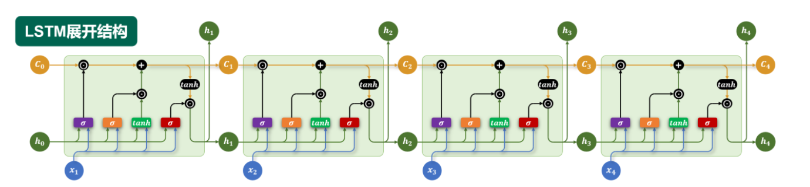
</p>

1. **遗忘门** \( f_t \)：决定从细胞状态中丢弃哪些信息
2. **输入门** \( i_t \)：决定哪些新信息要存入细胞状态
3. **输出门** \( o_t \)：决定基于细胞状态输出什么

<p align = 'center' style='zoom:70%'>
	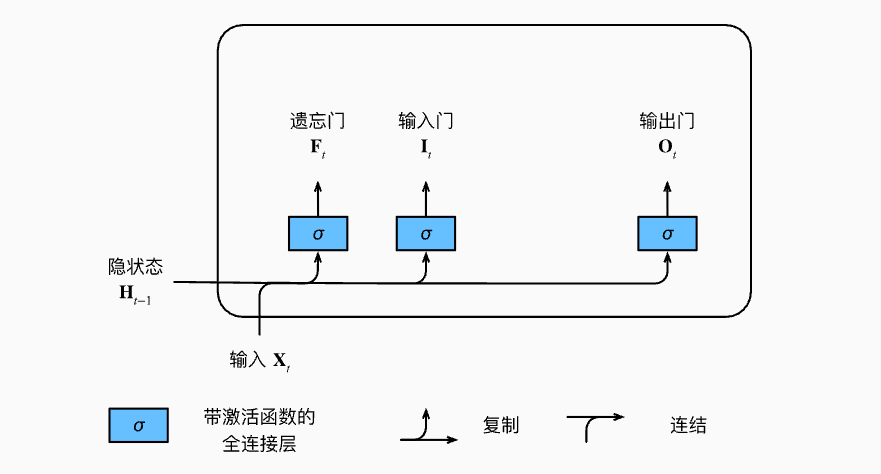
</p>

##### 遗忘门 (Forget Gate)

决定从上一时刻的细胞状态 $( C_{t-1})$ 中**保留多少信息**：

$$f_t = \sigma(W_{f} \cdot [h_{t-1}, x_t] + b_f)$$

- 输出范围 \( [0, 1] \)，1 表示"完全保留"，0 表示"完全丢弃"

##### 输入门 (Input Gate)

分为两步：

（1）决定哪些新信息要更新到细胞状态

$$i_t = \sigma(W_{i} \cdot [h_{t-1}, x_t] + b_i)$$

（2）生成候选细胞状态 $\tilde{C}_t$

$$\tilde{C}_t = tanh(W_{C} \cdot [h_{t-1}, x_t] + b_{C})$$

##### 更新细胞状态

更新细胞状态 $C_t$：

$$C_t = f_t \odot C_{t-1} + i_t \odot \tilde{C}_t$$


- $f_t \odot C_{t-1}$：遗忘不需要的信息
- $i_t \odot \tilde{C}_t$：添加新候选信息

##### 输出门 (Output Gate)
决定当前时刻的隐状态输出 \( h_t \)：

$$o_t = \sigma(W_{o} \cdot [h_{t-1}, x_t] + b_o)$$

$$h_t = o_t \odot tanh(C_t)$$

!!! info "核心思想"
    LSTM 通过门控机制实现了**选择性记忆**：重要信息长期保存，不重要信息及时遗忘，从而解决传统 RNN 在长序列上梯度消失的问题。

#### 3. 输入结构

在 PyTorch 中，LSTM 的输入数据形状和 RNN 一致：

**Tensor 形状**:

- 若 `batch_first=False` (默认): `(Sequence Length, Batch Size, Input Size)`
- 若 `batch_first=True`: `(Batch Size, Sequence Length, Input Size)`

初始状态：

- 初始隐状态 \( h_0 \)：形状 `(num_layers * num_directions, batch_size, hidden_size)`
- 初始细胞状态 \( c_0 \)：形状和 \( h_0 \) 相同
- 若不提供，则默认为全 0

#### 4. 输出结构

LSTM 的输出包含三部分：

**output**: 包含序列中**每个时间步**的隐状态 \( h_t \)。

  - 维度：若 `batch_first=True` → `(batch_size, sequence_len, hidden_size * num_directions)`

**h_n**: 序列**最后一个时间步**的隐状态。

  - 维度：`(num_layers * num_directions, batch_size, hidden_size)`

 **c_n**: 序列**最后一个时间步**的细胞状态。
 
  - 维度：和 `h_n` 相同 → `(num_layers * num_directions, batch_size, hidden_size)`

!!! note "双向 LSTM 维度说明"
    和 RNN 一样，如果是双向 LSTM，`h_n` 和 `c_n` 中正向和反向分别保存，维度直接翻倍，而不是在 `hidden_size` 维度拼接。output 才是在 `hidden_size` 维度拼接。

#### 6. PyTorch API

在 PyTorch 中，通过 `torch.nn.LSTM` 模块可以快速构建 LSTM 层。

=== "函数签名"

	``` python
	torch.nn.LSTM(  
	    input_size,          # 输入特征的维度  
	    hidden_size,         # 隐藏层的维度  
	    num_layers=1,        # LSTM 堆叠的层数  
	    bias=True,           # 是否使用偏置项  
	    batch_first=False,   # 输入数据是否以 batch_size 为第一维度  
	    dropout=0,           # 层与层之间的 Dropout 概率  
	    bidirectional=False, # 是否使用双向 LSTM    
	    proj_size=0,         # 隐藏状态的投影维度（用于降维）  
	    device=None,         # 指定计算设备（如 'cpu', 'cuda'）  
	    dtype=None           # 指定数据类型（如 torch.float32）  
	)
	
	```


=== "基础调用"

	```python
	import torch
	import torch.nn as nn
	
	# 参数说明：input_size=10, hidden_size=20, num_layers=1
	lstm = nn.LSTM(input_size=10, hidden_size=20)
	
	# 构造输入数据：(seq_len=5, batch_size=3, input_size=10)
	x = torch.randn(5, 3, 10)  
	# 构造初始隐状态 + 细胞状态
	h0, c0 = torch.randn(1, 3, 20), torch.randn(1, 3, 20)
	
	# 前向传播
	output, (hn, cn) = lstm(input_data)
	
	print(output.shape)  # torch.Size([5, 3, 20])
	print(hn.shape)      # torch.Size([1, 3, 20])
	print(cn.shape)      # torch.Size([1, 3, 20])
	```

=== "多层 & 双向"

	```python
	import torch
	import torch.nn as nn
	
	# bidirectional=True 开启双向 LSTM
	# num_layers=2 堆叠两层 LSTM
	lstm = nn.LSTM(10, 20, num_layers=2, bidirectional=True)  
	input_data = torch.randn(5, 3, 10)
	output, (hn, cn) = lstm(input_data)
	
	# output 维度：hidden_size 因为双向翻倍 (20 * 2)
	print(output.shape)  # torch.Size([5, 3, 40])
	
	# hn 维度：(2层 * 2个方向, 3, 20)
	print(hn.shape)      # torch.Size([4, 3, 20])
	print(cn.shape)      # torch.Size([4, 3, 20])
	```

!!! tip "官方文档引用"
	详细的参数列表请参考：[PyTorch nn.LSTM 官方文档](https://pytorch.org/docs/stable/generated/torch.nn.LSTM.html)

#### 7. LSTM 总结

 **核心改进**：相比传统 RNN，LSTM 引入**细胞状态**和**三门控结构**，能够有效保留长距离依赖，缓解梯度消失问题

- **优点**：

  - 能够捕捉长序列中的依赖关系
  - 相比传统 RNN，梯度更稳定，不容易消失
  - 在 NLP 各类任务（序列标注、文本分类、机器翻译）中表现稳定

- **缺点**：

  - 计算复杂度比 RNN 更高
  - 仍然是循环结构，**无法并行计算**，训练速度比 Transformer 慢

LSTM 是 RNN 家族最成功的变体，在 Transformer 出现之前，是 NLP 任务的主流选择，至今仍是很多场景下的坚实 baseline。

### GRU

#### 1. 概述

GRU（Gated Recurrent Unit）是 LSTM 的**简化改进版本**，由 Cho 等人在 2014 年提出。它将 LSTM 中的**遗忘门**和**输入门**合并为一个**更新门**，同时合并了细胞状态和隐状态，整体结构更简单，参数更少，训练速度更快，在很多任务上效果和 LSTM 相当。

<p align = 'center'>
	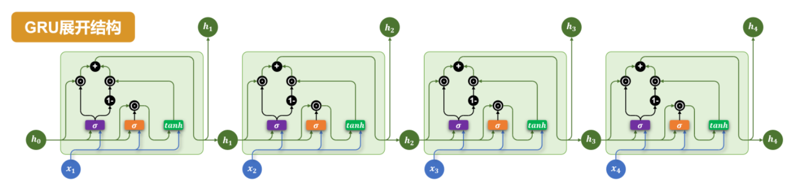
</p>

#### 2. GRU 结构

GRU 只有两个门控结构：**更新门** $z_t$ 和 **重置门** $r_t$，只维护一个隐状态 $h_t$，没有单独的细胞状态。

<p align = 'center' style='zoom:60%'>
	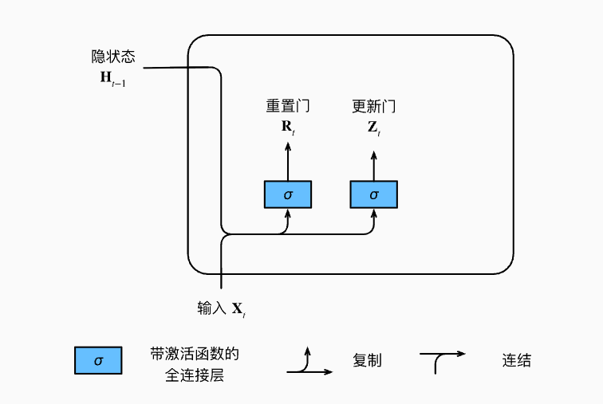
</p>

##### 更新门 (Update Gate)

决定**保留多少历史信息**以及**融入多少新信息**：

$$z_t = \sigma(W_{z} \cdot [h_{t-1}, x_t] + b_z)$$

- 输出范围 \([0, 1]\)，越接近 1 表示越遗忘历史消息，融入越多的新消息
- 相当于 LSTM 中 **遗忘门 + 输入门** 的结合

##### 重置门 (Reset Gate)

控制**历史隐状态 $h_{t-1}$ 有多少信息会被用于计算当前候选隐状态 $\tilde{h}_t$**：

$$r_t = \sigma(W_{r} \cdot [h_{t-1}, x_t] + b_r)$$

- 输出范围 \([0, 1]\)
- \(r_t\) 越接近 0 → 越少历史信息会被保留，更多地忽略历史，相当于"重置"了历史状态
- \(r_t\) 越接近 1 → 越多历史信息会被保留

##### 候选隐状态

计算当前时刻的候选隐状态 $\tilde{h}_t$：

$$\tilde{h}_t = tanh(W_{h} \cdot [r_t \odot h_{t-1}, x_t] + b_h)$$

- $r_t \odot h_{t-1}$ 按重置门决定保留多少历史信息
- 然后和当前输入 $x_t$ 结合，经过 $tanh$ 激活得到候选隐状态

##### 最终隐状态

组合历史信息和候选信息，得到最终隐状态：

$$h_t = (1 - z_t) \odot h_{t-1} + z_t \odot \tilde{h}_t$$

- $(1 - z_t) \odot h_{t-1}$：对历史隐状态按更新门加权
- $z_t \odot \tilde{h}_t$：对候选隐状态按更新门加权

!!! info "GRU vs LSTM"
    - GRU：**只有 2 个门**，参数更少，训练更快，没有单独的细胞状态
    - LSTM：**有 3 个门**，维护单独的细胞状态，参数更多
    - 实验表明两者效果接近，GRU 训练更快，因此现在越来越多人使用 GRU

#### 3. 输入结构

在 PyTorch 中，GRU 的输入数据形状和 RNN/LSTM 一致：

**Tensor 形状**:

- 若 `batch_first=False` (默认): `(Sequence Length, Batch Size, Input Size)`
- 若 `batch_first=True`: `(Batch Size, Sequence Length, Input Size)`

初始状态：

- 初始隐状态 \( h_0 \)：形状 `(num_layers * num_directions, batch_size, hidden_size)`
- GRU 没有单独的细胞状态，只需要提供 \( h_0 \)
- 若不提供，则默认为全 0

#### 4. 输出结构

GRU 的输出包含两部分（比 LSTM 少了细胞状态）：

**output**: 包含序列中**每个时间步**的隐状态 \( h_t \)。

  - 维度：若 `batch_first=True` → `(batch_size, sequence_len, hidden_size * num_directions)`

**h_n**: 序列**最后一个时间步**的隐状态。

  - 维度：`(num_layers * num_directions, batch_size, hidden_size)`

!!! note "双向 GRU 维度说明"
    和 RNN/LSTM 保持一致：如果是双向 GRU，`h_n` 中正向和反向分别保存，维度直接翻倍，output 在 `hidden_size` 维度拼接。

#### 5. PyTorch API

在 PyTorch 中，通过 `torch.nn.GRU` 模块可以快速构建 GRU 层。

=== "基础调用"

	```python
	import torch
	import torch.nn as nn
	
	# 参数说明：input_size=10, hidden_size=20, num_layers=1
	gru = nn.GRU(10, 20, 1, batch_first=True)
	
	# 构造输入数据：(seq_len=5, batch_size=3, input_size=10)
	input_data = torch.randn(3, 5, 10)
	
	# 前向传播，h0 默认为全 0
	output, hn = gru(input_data)
	
	print(output.shape)  # torch.Size([5, 3, 20])
	print(hn.shape)     # torch.Size([1, 3, 20])
	```

=== "多层 & 双向"

	```python
	import torch
	import torch.nn as nn
	
	# bidirectional=True 开启双向 GRU
	# num_layers=2 堆叠两层 GRU
	gru = nn.GRU(10, 20, num_layers=2, bidirectional=True)
	input_data = torch.randn(5, 3, 10)
	output, hn = gru(input_data)
	
	# output 维度：hidden_size 因为双向翻倍 (20 * 2)
	print(output.shape)  # torch.Size([5, 3, 40])
	
	# hn 维度：(2层 * 2个方向, 3, 20)
	print(hn.shape)     # torch.Size([4, 3, 20])
	```

!!! tip "官方文档引用"
	详细的参数列表请参考：[PyTorch nn.GRU 官方文档](https://pytorch.org/docs/stable/generated/torch.nn.GRU.html)

#### 6. GRU 总结

 **核心改进**：GRU 是 LSTM 的简化版，将遗忘门和输入门合并为更新门，去掉了单独的细胞状态，参数更少

**优点**：

  - 结构比 LSTM 简单，参数更少，训练速度更快
  - 效果和 LSTM 相当，大多数任务表现接近
  - 缓解了传统 RNN 的梯度消失问题

 **缺点**：

  - 仍然是循环结构，**无法并行计算**，训练速度比 Transformer 慢
  - 对超长序列依赖的捕捉能力略逊于 LSTM

在实际工程中，如果追求速度和轻量化，GRU 是很好的选择；如果追求效果，LSTM 仍然是更稳妥的选择。两者都是 RNN 家族非常成功的设计。


## NLP Seq2Seq 模型

### Seq2Seq 概述

传统的自然语言处理任务（如文本分类、序列标注）以​​静态输出​​为主，其目标是预测固定类别或标签。然而，现实中的许多应用需要模型​​动态生成新的序列​​，例如：

- **机器翻译**：输入中文句子，输出对应的英文翻译
- **文本摘要**​​：输入长篇文章，生成简短的摘要

这些任务的共同特性就是输入和输出均为序列，同时输入输出的长度是动态的，不相同的，为了解决这类问题，研究者提出了**Seq2Seq模型**。

### Seq2Seq 结构

Seq2Seq 模型由一个编码器（Encoder）和一个解码器（Decoder）构成。编码器负责提取输入序列的语义信息，并将其压缩为一个固定长度的上下文向量（Context Vector）；解码器则基于该向量，逐步生成目标序列。

<p align='center'>
	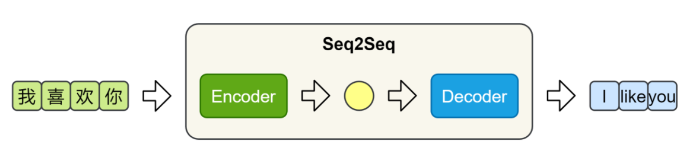
</p>

#### 编码器

编码器主要由一个循环神经网络（RNN/LSTM/GRU）构成，其任务是将输入序列的语义信息提取并压缩为一个上下文向量。

<p align='center'>
	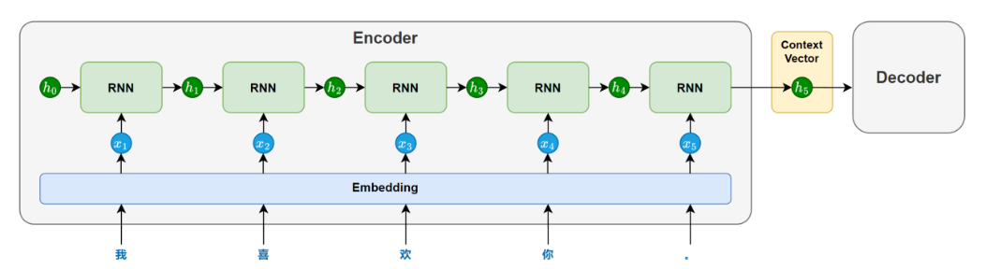
</p>

为增强编码器的理解能力，循环网络也可以采用双向结构（结合前文与后文信息）或多层结构（提取更深的语义特征）。

#### 解码器

解码器主要也由一个循环神经网络（RNN / LSTM / GRU）构成，其任务是基于编码器传递的上下文向量，逐步生成目标序列。

<p align='center'>
	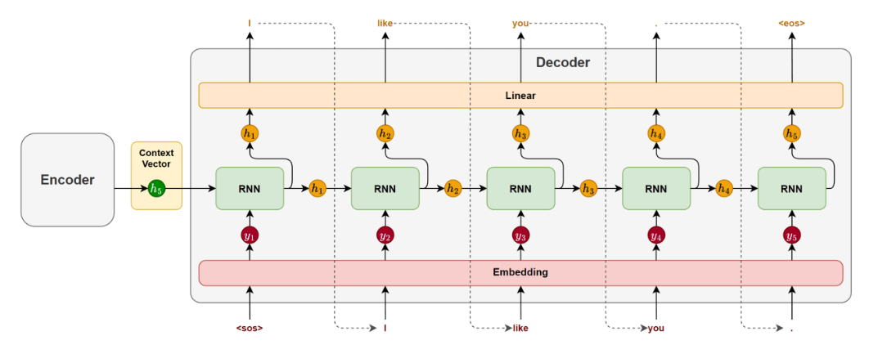
</p>

在生成开始时，循环神经网络以上下文向量作为初始隐藏状态，并接收一个特殊的起始标记 \<sos>（start of sentence）作为第一个时间步的输入，用于预测第一个 token。

之后，在每一个时间步，模型都会根据前一时刻的隐藏状态和上一步生成的 token，预测当前的输出。这种“将前一步的输出作为下一步输入”的方式被称为自回归生成（Autoregressive Generation），它确保了生成结果的连贯性。

生成过程会持续进行，直到模型生成了一个特殊的结束标记 \<eos>（end of sentence），表示句子生成完成。

### Seq2Seq 局限性

Seq2Seq 的"压缩-解压"架构虽然简洁，但有两个硬伤：

!!! failure "信息瓶颈：定长向量装不下长句"

	Encoder 必须把整个源句压缩进一个**固定长度的上下文向量**。句子一长，信息就挤不下——前面的内容被稀释甚至遗忘，语义表达不完整。

!!! failure "一刀切：解码器缺乏动态感知"

    解码器从头到尾都盯着同一个上下文向量，但生成不同位置的目标词时，依赖的源句信息是不一样的。比如生成主语靠句首，生成谓语靠句中——固定向量做不到"各取所需"，生成的准确性自然受限。


## NLP 注意力机制

### 注意力机制概述

在注意力机制被提出之前，经典的 **Encoder-Decoder（编码-解码）** 结构（也叫 seq2seq）工作流程是：

1.  **Encoder**：将整个输入序列编码为一个**固定维度的上下文向量** `C`
2.  **Decoder**：根据这个上下文向量 `C`，逐字生成输出序列

这种方式存在一个明显缺陷：

> **无论输入序列多长，Encoder 都要把所有信息压缩进一个固定长度的向量**。当输入序列很长时，这个向量无法完整保存全部信息，前面的信息会被稀释或遗忘，导致翻译等任务效果下降。

<p align="center">
  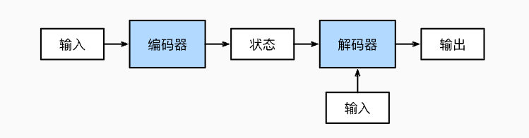
</p>

注意力机制的核心改进：**让 Decoder 在每一步生成时，都能"回头看"一眼 Encoder 对输入序列的所有隐状态，通过注意力权重动态关注和当前输出最相关的输入部分**，而不是只依赖一个压缩好的固定向量。

这样，即使输入很长，每一步输出都能精准定位到自己需要关注的输入部分，大大缓解了长序列信息遗忘的问题。

### 注意力机制工作原理

注意力机制的本质就是**显示的建模目标位置与原序列所有位置之间的依赖关系的**。我们以机器翻译任务为例，输入是中文序列，输出是英文序列，详细介绍注意力机制在 Decoder 中是如何工作的：

符号说明

- 输入序列（源语言）：$x_1, x_2, \dots, x_{T_x}$
- Encoder 输出的所有隐状态：$h_1, h_2, \dots, h_{T_x}$（每个 $h_i$ 对应输入的一个词）
- Decoder 当前时刻的隐状态：$s_{t}$（当前时间步的隐藏状态）

> **注意：** 注意力机制主要分为两大流派，本笔记及配图基于 **Luong Attention (2015)** 的实现逻辑编写。
> 
> - **Bahdanau Attention (Additive)：** “先看后动”。使用**上一时刻**的状态 $s_{t−1}$​ 计算注意力，得到上下文 $c_t$​ 后再更新当前状态。
> - **Luong Attention (Multiplicative)：** “先动后看”（本笔记采用）。RNN 先根据输入更新出**当前时刻**的原始状态 $s_t$​ ，再用这个 $s_t$​ 去计算注意力并融合。
> 
> **两者的核心区别在于计算注意力分数时使用的是 $s_{t−1}$​ 还是 $s_t$​ 。** 请阅读时留意这一差异，以免与部分经典教材混淆。

##### 第一步：计算注意力分数 $e_{t,i}$

<p align='center'>
	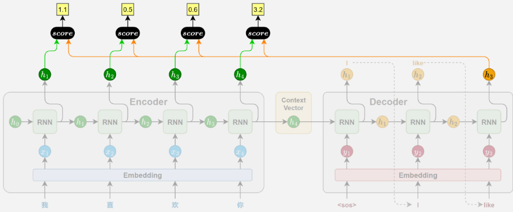
</p>

对于 Decoder 当前要输出第 $t$ 个词，我们需要计算 Decoder 隐状态 $s_{t}$ 对每个输入隐状态 $h_i$ 的注意力分数，表示它们的相关性：

$$
e_{t,i} = align(s_{t}, h_i)
$$

`align` 是对齐函数，常用的计算方式有几种：

| 计算方式   | 公式                                  | 说明                |
| ------ | ----------------------------------- | ----------------- |
| 点积     | $e = s_{t} \cdot h_i$               | 最简单直接             |
| 拼接+MLP | $e = v^T \text{tanh}(W[s_{t}; h_i]$ | 原始论文 Bahdanau 注意力 |
| 乘性     | $e = s_{t-1}^T W h_i$               | 比拼接更高效            |

##### 第二步：softmax 归一化得到注意力权重 $\alpha_{t,i}$

<p align='center'>
	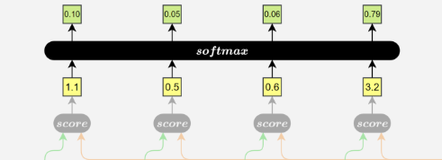
</p>
$$
α_{t,i} = softmax(e_{t,i}) = \frac{exp(e_{t,i})}{\sum_{k=1}^{T_x} exp(e_{t,k})}
$$

所有 $\alpha_{t,i}$ 加起来等于 1，表示对各个输入位置的关注程度分布。

##### 第三步：加权求和得到上下文向量 $c_t$

<p align='center'>
	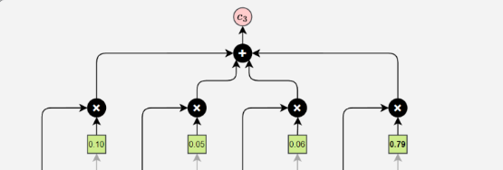 
</p>
上下文向量 $c_t$ 是所有输入隐状态的加权和，权重就是上面得到的注意力分数：

$$
c_t = \sum_{i=1}^{T_x} α_{t,i} \cdot h_i
$$

这个 $c_t$ 就包含了当前输出位置 $t$ 最需要关注的输入信息。

##### 第四步：结合上下文向量预测输出


<p align='center' style='zoom:50%'>
	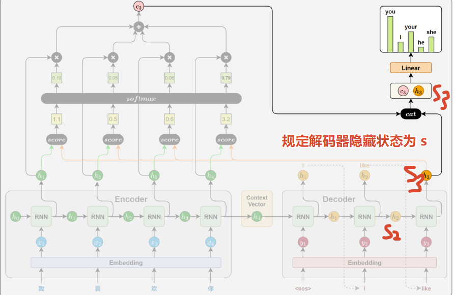
</p>

将刚刚计算出的上下文向量 $c_t$​ 与 Decoder **当前时间步的隐状态 $st​$** 进行融合（通常是拼接后通过一个全连接层），得到用于预测的中间状态 $\tilde{s}_t$：

$$
\tilde{s}_t = tanh(W[s_{t}; c_t])
$$

$$
P(y_t | y_1, ..., y_{t-1}, x) = softmax(V \tilde{s}_t)
$$

##### Decoder 总结

所以，概括下来，Decoder 每一时间步的核心逻辑就是：先更新自己的状态 $s_t$ → 拿着状态去查源句子的重点 $c_t$ → 把自己的状态与查到的重点信息结合起来 $\tilde{s}_t$ → 预测下一个词

##### 和自注意力的区别

| 对比维度 | Encoder-Decoder 注意力 | 自注意力 |
|---------|------------------------|----------|
| Q 来源 | Decoder 隐状态 | 输入序列本身 |
| KV 来源 | Encoder 所有隐状态 | 输入序列本身 |
| 作用 | 建立输入输出的对齐 | 建立输入序列内部依赖 |
| 名称 | 交叉注意力（Cross Attention）| 自注意力（Self Attention）|

在 Transformer 中，两种注意力都用到了：

- Encoder 内部用**自注意力**
- Decoder 的中间层用**交叉注意力**（Q 来自 Decoder，KV 来自 Encoder）

### 注意力评分函数

注意力评分函数有多种实现方式。但本质上都是用于衡量解码器当前隐藏状态与编码器各时间步隐藏状态之间的相关性，并据此分配注意力权重。

根据 Q 和 K 的相似度计算方式不同，常见有三种评分函数（Luong et al., 2015）：

=== "Dot：点积评分"

    $score(s_t, h_i) = s_t^T · h_i$

    - 直接对 Decoder 隐状态 $s_t$ 和 Encoder 隐状态 $h_i$ 做**点积**
    - **最简单，无需额外参数**，计算最快
    - 要求 $s_t$ 和 $h_i$ **维度相同**，否则无法点积
    - 在维度较高时点积容易偏大，softmax 后梯度容易消失（所以 Transformer 才加了缩放）

=== "General：通用点积评分"
    $score(s_t, h_i) = s_t^T · W_a · h_i$

    - 在点积中间插入了一个**可学习的权重矩阵** $W_a$
    - $W_a$ 可以学习 Q 和 K 之间更复杂的映射关系，**即使维度不同也能适配**
    - 比 Dot 灵活，比 Concat 快速，是**效率和表现之间的折中选择**

=== "Concat：拼接评分"
    $score(s_t, h_i) = v_a^T · tanh(W_a · [s_t; h_i])$

    - 先把 $s_t$ 和 $h_i$ **拼接**，过线性层 + tanh 非线性，再用向量 $v_a$ 投影为标量
    - 就是经典**加性注意力**（Bahdanau 注意力），参数最多，但表达能力最强
    - 不要求 $s_t$ 和 $h_i$ 维度一致

### 注意力机制代码 ⭐⭐⭐

下面给出几种常见注意力机制的完整 PyTorch 手动实现：

=== "Bahdanau 批量版"
    **Bahdanau 加法注意力** 批量版本，支持 batch 数据，Query 和每个 Key 分别拼接计算分数。

    ```python
    import torch
    import torch.nn as nn
    import torch.nn.functional as F

    class BahdanauAttention(nn.Module):
        def __init__(self, q_dim, k_dim, v_dim, out_dim):
            """
            初始化 Bahdanau 加法注意力
            :param q_dim: Query 向量维度
            :param k_dim: Key 向量维度
            :param v_dim: Value 向量维度
            :param out_dim: 输出向量维度
            """
            super().__init__()
            # 计算注意力分数：q + k 拼接 → 线性层 → 得到分数
            self.attn_score = nn.Linear(q_dim + k_dim, 1)
            # 融合原始 query 和 注意力加权后的 value → 投影到输出
            self.attn_combine = nn.Linear(q_dim + v_dim, out_dim)

        def forward(self, q, k, v):
            """
            前向传播
            :param q: Query (batch, 1, q_dim) - 当前 Decoder 隐状态
            :param k: Key (batch, seq_len, k_dim) - Encoder 所有时刻输出
            :param v: Value (batch, seq_len, v_dim) - Encoder 所有时刻输出
            :return: (output, attention_weights)
            """
            batch_size = q.size(0)
            seq_len = k.size(1)

            # 1. Query 扩展维度，让每个 Key 都能拼一次 Query
            # (batch, 1, q_dim) → (batch, seq_len, q_dim)
            q_expanded = q.expand(batch_size, seq_len, -1)

            # 2. 拼接 Query 和 Key → 计算注意力分数
            # (batch, seq_len, q_dim + k_dim)
            qk_cat = torch.cat((q_expanded, k), dim=-1)
            # 线性层计算分数 → (batch, seq_len, 1) → (batch, seq_len)
            attn_scores = self.attn_score(qk_cat).squeeze(-1)

            # 3. softmax 归一化得到注意力权重 [0, 1]
            attn_weights = F.softmax(attn_scores, dim=-1)  # (batch, seq_len)

            # 4. 加权求和得到上下文向量
            # (batch, 1, seq_len) @ (batch, seq_len, v_dim) = (batch, 1, v_dim)
            context = torch.bmm(attn_weights.unsqueeze(1), v)

            # 5. 拼接原始 Query 和上下文 → 投影到输出
            # (batch, 1, q_dim + v_dim)
            combined = torch.cat((q, context), dim=-1)
            output = torch.tanh(self.attn_combine(combined))  # (batch, 1, out_dim)

            return output, attn_weights
    ```

    **维度变化流程：**

    | 步骤 | 输入维度 | 输出维度 |
    |------|---------|---------|
    | 输入 q | `(batch, 1, q_dim)` | - |
    | 输入 k/v | `(batch, seq_len, k_dim)` / `(batch, seq_len, v_dim)` | - |
    | q 扩展 | `(batch, 1, q_dim)` → `(batch, seq_len, q_dim)` | - |
    | 拼接 q+k | - → `(batch, seq_len, q_dim+k_dim)` | - |
    | 计算分数 | `(batch, seq_len, q_dim+k_dim)` → `(batch, seq_len)` | 每个位置一个分数 |
    | softmax | `(batch, seq_len)` → `(batch, seq_len)` | 归一化为概率 |
    | 加权求和 | `(batch, 1, seq_len) @ (batch, seq_len, v_dim)` → `(batch, 1, v_dim)` | 上下文向量 |
    | 拼接+输出 | `cat(q, context)` → 线性 → `(batch, 1, out_dim)` | 最终输出 |

=== "自定义简化版 (单 Query)"
    针对 **单个 Query + 单个 Key** 场景（RNN Decoder 单步解码）的简洁实现，Query 和 Key 拼接后直接输出所有 Value 位置的分数。

    ```python
    import torch
    import torch.nn as nn
    import torch.nn.functional as F

    class MyAttention(nn.Module):
        def __init__(self, q_size, k_size, v_len, v_size, out_size):
            """
            初始化自定义注意力
            :param q_size: 查询张量 q 的维度
            :param k_size: 键张量 k 的维度
            :param v_len: 值张量 v 的序列长度
            :param v_size: 值张量 v 的维度
            :param out_size: 输出张量维度
            """
            super().__init__()
            self.q_size = q_size
            self.k_size = k_size
            self.v_len = v_len
            self.v_size = v_size
            self.out_size = out_size

            # 1. q + k 拼接 → 直接输出 v_len 个位置的注意力分数
            self.attn = nn.Linear(self.q_size + self.k_size, self.v_len)
            # 2. 融合 q 和 加权后的 context → 投影到输出
            self.attn_combine = nn.Linear(self.q_size + self.v_size, self.out_size)

        def forward(self, q, k, v):
            """
            前向传播
            :param q: 查询张量 (1, 1, q_size) -> batch=1, seq_len=1
            :param k: 键向量 (1, 1, k_size) -> batch=1, seq_len=1
            :param v: 值向量 (1, v_len, v_size) -> Encoder 所有输出
            :return: (output, attention_weights)
            """
            # 1. q 和 k 拼接 → (1, q_size + k_size)
            qk_cat = torch.cat((q[0], k[0]), dim=-1)

            # 2. 线性层直接输出 v_len 个分数 → (1, v_len)
            attn_scores = self.attn(qk_cat)

            # 3. softmax 归一化得到注意力权重 → (1, v_len)
            attn_weights = F.softmax(attn_scores, dim=-1)

            # 4. 扩展维度 → (1, 1, v_len)，然后 bmm 加权求和
            # (1, 1, v_len) @ (1, v_len, v_size) = (1, 1, v_size)
            attn_weights = attn_weights.unsqueeze(0)
            context = torch.bmm(attn_weights, v)

            # 5. 融合原始 q 和上下文 → 投影输出
            # (1, 1, q_size + v_size) → (1, 1, out_size)
            out_cat = torch.cat((q, context), dim=-1)
            output = self.attn_combine(out_cat)

            return output, attn_weights.squeeze(0)
    ```

    **核心思路：**
    
    - 因为 q 和 k 都只有一个（当前 Decoder 步），直接拼接一次即可
    - 线性层输出维度就是 `v_len`，每个输出对应 value 序列一个位置的分数
    - 相比批量版代码更简洁，适合单步解码场景

    **维度变化：**

    | 步骤 | 维度变化 |
    |------|----------|
    | q + k 拼接 | `(1, 1, q_size) + (1, 1, k_size)` → `(1, q_size+k_size)` |
    | 计算分数 | `(1, q_size+k_size)` → `(1, v_len)` |
    | softmax | 维度不变，归一化概率 |
    | 加权求和 | `(1, 1, v_len) @ (1, v_len, v_size)` → `(1, 1, v_size)` |
    | 拼接输出 | `cat(q, context)` → `(1, 1, q_size+v_size)` → 线性 → `(1, 1, out_size)` |

=== "缩放点积自注意力"
    **缩放点积自注意力** 是 Transformer 使用的标准实现，相比加法注意力可以一次性矩阵乘法完成计算，效率更高。

    ```python
    import torch
    import torch.nn as nn
    import torch.nn.functional as F

    class ScaledDotProductSelfAttention(nn.Module):
        def __init__(self, embed_dim):
            """
            初始化缩放点积自注意力
            :param embed_dim: 输入输出嵌入维度
            """
            super().__init__()
            self.embed_dim = embed_dim
            # Q、K、V 三个投影矩阵
            self.W_q = nn.Linear(embed_dim, embed_dim)
            self.W_k = nn.Linear(embed_dim, embed_dim)
            self.W_v = nn.Linear(embed_dim, embed_dim)

        def forward(self, x, mask=None):
            """
            前向传播
            :param x: 输入序列 (batch_size, seq_len, embed_dim)
            :param mask: 可选掩码，True 表示需要 mask 掉该位置
            :return: (output, attention_weights)
            """
            batch_size, seq_len, _ = x.shape

            # 1. 对每个 token 投影得到 Q、K、V
            q = self.W_q(x)  # (batch, seq_len, embed_dim)
            k = self.W_k(x)  # (batch, seq_len, embed_dim)
            v = self.W_v(x)  # (batch, seq_len, embed_dim)

            # 2. 计算注意力分数: (Q @ K^T) / sqrt(d_k)
            # (batch, seq_len, embed_dim) @ (batch, embed_dim, seq_len) = (batch, seq_len, seq_len)
            scores = torch.bmm(q, k.transpose(1, 2)) / torch.sqrt(torch.tensor(self.embed_dim))

            # 3. 如果有掩码，把对应位置设为 -inf
            if mask is not None:
                # mask shape: (batch, seq_len), True = 需要 mask
                scores = scores.masked_fill(mask.unsqueeze(1), -float('inf'))

            # 4. softmax 归一化得到注意力权重
            attn_weights = F.softmax(scores, dim=-1)  # (batch, seq_len, seq_len)

            # 5. 加权求和得到输出
            # (batch, seq_len, seq_len) @ (batch, seq_len, embed_dim) = (batch, seq_len, embed_dim)
            output = torch.bmm(attn_weights, v)

            return output, attn_weights
    ```

    **使用示例：**
    ```python
    # batch_size=2, seq_len=5, embed_dim=128
    batch_size, seq_len, embed_dim = 2, 5, 128
    x = torch.randn(batch_size, seq_len, embed_dim)

    self_attn = ScaledDotProductSelfAttention(embed_dim)
    output, attn = self_attn(x)

    print(f"输入形状: {x.shape}")        # torch.Size([2, 5, 128])
    print(f"输出形状: {output.shape}")   # torch.Size([2, 5, 128])
    print(f"注意力权重形状: {attn.shape}") # torch.Size([2, 5, 5])
    ```

=== "掩码自注意力 (Decoder)"
    **掩码自注意力** 用在 Transformer Decoder 中，保证每个位置只能看到它前面的位置，不能看到未来信息。在缩放点积自注意力基础上加上下三角掩码即可：

    ```python
    class MaskedScaledDotProductSelfAttention(nn.Module):
        def __init__(self, embed_dim):
            super().__init__()
            self.embed_dim = embed_dim
            self.W_q = nn.Linear(embed_dim, embed_dim)
            self.W_k = nn.Linear(embed_dim, embed_dim)
            self.W_v = nn.Linear(embed_dim, embed_dim)

        def forward(self, x):
            batch_size, seq_len, embed_dim = x.shape

            q = self.W_q(x)
            k = self.W_k(x)
            v = self.W_v(x)

            scores = torch.bmm(q, k.transpose(1, 2)) / torch.sqrt(torch.tensor(self.embed_dim))

            # === 生成下三角掩码 ===
            # 只保留当前位置及之前的位置，未来位置 mask 掉
            mask = torch.tril(torch.ones(seq_len, seq_len, device=x.device)).bool()
            scores = scores.masked_fill(~mask, -float('inf'))

            attn_weights = F.softmax(scores, dim=-1)
            output = torch.bmm(attn_weights, v)

            return output, attn_weights
    ```

**两种注意力对比：**

| 对比维度 | Bahdanau 加法注意力 | 缩放点积注意力 |
|----------|-------------------|----------------|
| **适用场景** | 传统 RNN Encoder-Decoder | Transformer |
| **计算方式** | 每个 Key 拼接 Query → 线性层算分数 | Q 点积 K^T → 直接算分数 |
| **复杂度** | 逐位置计算 | 矩阵乘法一次性完成 |
| **效率** | 较慢 | 更快，支持全并行 |
| **使用地方** | 传统 NMT 解码器 | 现代Transformer 编码器/解码器 |


## NLP Transformer ⭐⭐⭐🚀

### 1. Transformer 概述

Transformer 是 Google 在 2017 年论文 [Attention Is All You Need](https://arxiv.org/abs/1706.03762) 中提出的完全基于**自注意力机制**的序列建模框架，彻底抛弃了传统 RNN/LSTM 的循环结构，实现了全并行计算，成为了现代大语言模型的基础架构。

!!! quote "论文核心观点"
    > 循环神经网络（RNN、LSTM）固有的顺序计算特性阻碍了训练过程中的并行化，限制了模型能处理的序列长度。**注意力机制**可以实现并行计算，同时能更好地建模长距离依赖。

### 2. Transformer 整体架构

**Transformer** 的整体结构延续了 Seq2Seq 模型中 “编码器-解码器” 的设计理念，其中，编码器（Encoder）负责对输入序列进行理解和表示，而解码器（Decoder）则根据编码器的输出逐步生成目标序列。
 <p>
  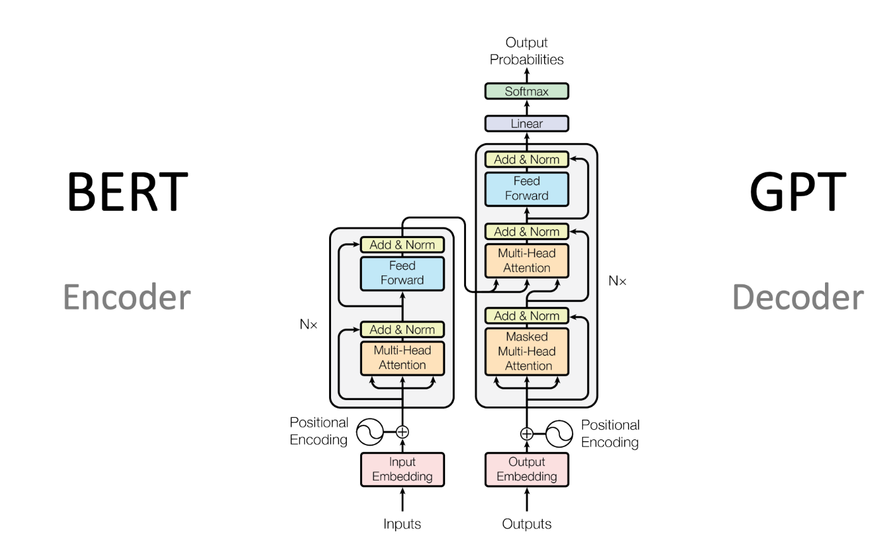
 </p>

与基于 RNN 的 Seq2Seq 模型一样，**Transformer** 的解码器采用自回归方式生成目标序列。不同之处在于，每一步的输入是此前已生成的全部词，模型会输出一个与输入长度相同的序列，但我们只取最后一个位置的结果作为当前预测。这个过程不断重复，直到生成结束标记 `eos`。

<p align='center' style='zoom:50%'>
	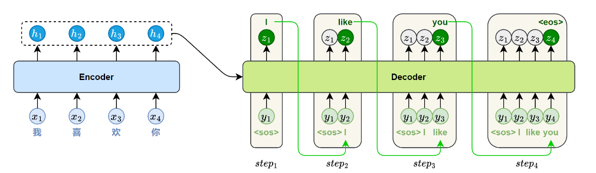
</p>

此外，Transformer 的编码器和解码器模块分别由多个结构相同的层堆叠而成。通过层层堆叠，模型能够逐步提取**更深层次的语义特征**，从而增强对复杂语言现象的建模能力。标准的 Transformer 模型通常包含 6个编码器层和 6 个解码器层。

<p align='center' style='zoom:50%'>
	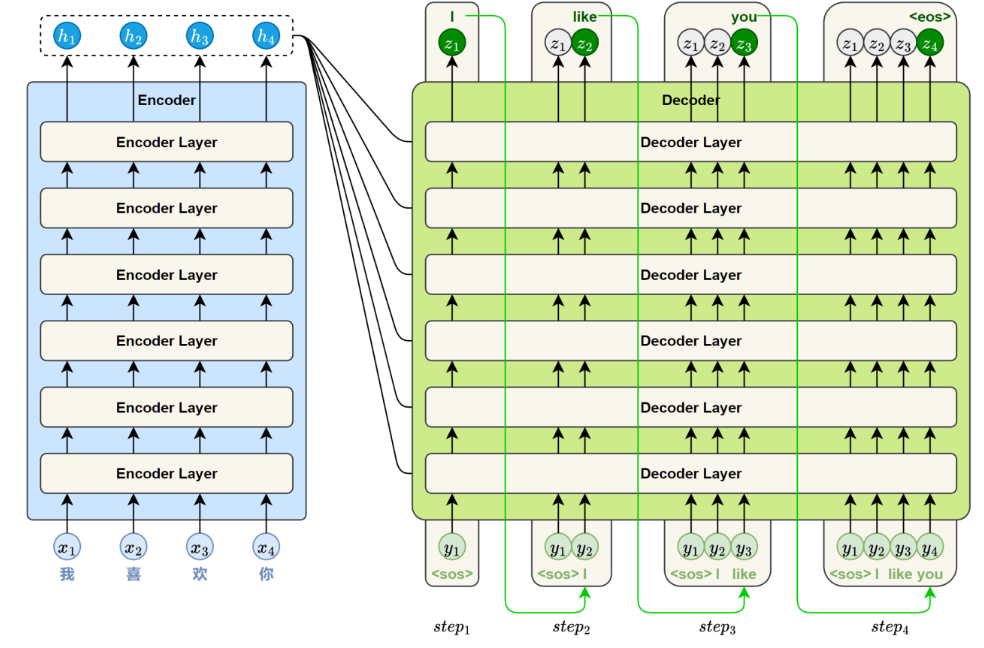
</p>

#### 编码器

Transformer 的编码器用于**理解输入序列的语义信息**，并生成每个token的**上下文表示**，为解码器生成目标序列提供基础。

<p align='center'>
	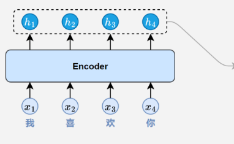
</p>

一个编码器有多个编码器层构成，这样层层堆叠的结构能够荣编码器捕捉到更深层次的语义特征。每个编码器层的结构如下：

-  self-attention用于捕捉序列中位置之间的依赖关系
-  feed-forward 用于对每个位置的表示进行非线性变换，从而提升模型的表达能力
<p align='center'>
	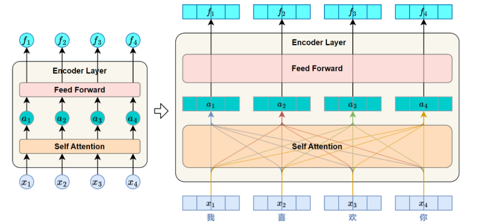
</p>
对于 **self-attention** 层的详解，放到了第三节介绍，下面介绍一下 feed-forward 层。 **feed-forward** 通过对每个位置的表示进行**逐位置**、**非线性**的特征变换，进一步提升模型对复杂语义的建模能力。

<p align='center' style='zoom:60%'>
	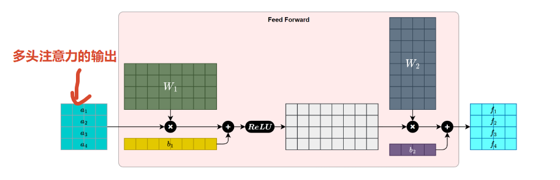
</p>

最后，无论是注意力层的输出，还是前馈神经层的输出，都要经过**残差连接与层归一化**层处理，这两者是深层神经网络中常用的结构，用于缓解模型训练中的梯度消失、收敛困难等问题。

<p align='center' style='zoom:70%'>
	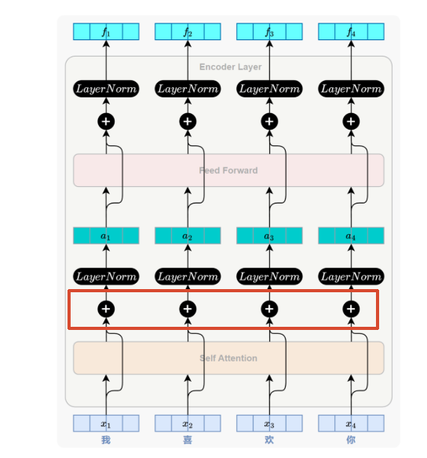
</p>
  
残差连接如上图所示，就是将子层的输入直接与其输出相加，形成一条跨越子层的 “捷径”：

$$
y = x + subLayer(x)
$$

残差连接确保反向传播时，梯度至少有一条稳定通路可回传，是深层网络可稳定训练的关键结构。

同时，每次做完残差连接以后，张量还需要经过一个 LayerNorm 层，它的作用主要是用来规范输入序列中每个 token 的特征分布，从而提升模型训练的稳定性，加速模型收敛的速度。与 BatchNorm 不同，它是对每个 token 做规范，而 BatchNorm 是沿着 Batch 维度对数据做标准化（也就是跨样本）。至于具体的过程，和 BatchNorm 一摸一样。具体可参考 [[深度学习#5.3.1 Batch Normalization（批量标准化）]]

<p align='center'>
	
</p>

最后，还要介绍一下**位置编码**，这是因为 `Transformer` 是完全基于自注意力机制的序列建模框架，所以，它并不会像 `RNN` 那样按时间步（序列的顺序去处理数据），所以，`Transformer` 丢失了原始序列每个 `token` 的位置信息。为了解决这个问题，`Transformer` 引入了一个机制：**位置编码**

<p align='center' style='zoom:80%'>
	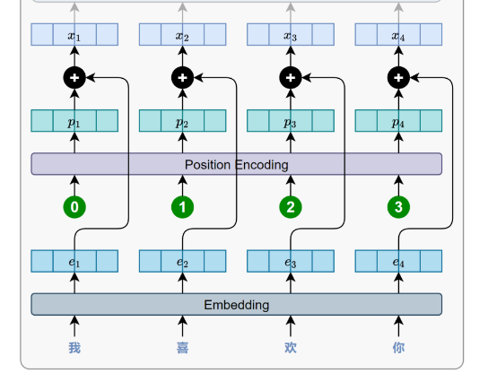
</p>
#### 解码器

Transformer 解码器的主要功能是：根据编码器的输出，逐步生成目标序列中的每一个词。其生成方式采用自回归机制（autoregressive）：每一步的输入由此前已生成的所有词组成，模型将输出一个与当前输入长度相同的序列表示。我们只取最后一个位置的输出，作为当前步的预测结果。这一过程会不断重复，直到生成特殊的结束标记 `eos`，表示序列生成完成。
<p align='center'>
	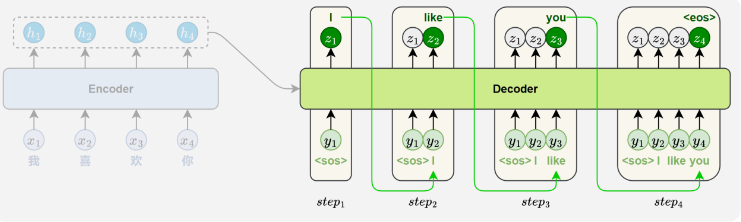
</p>

解码器也由多个解码器子层堆叠而成，如下图：
<p align='center' style='zoom:60%'>
	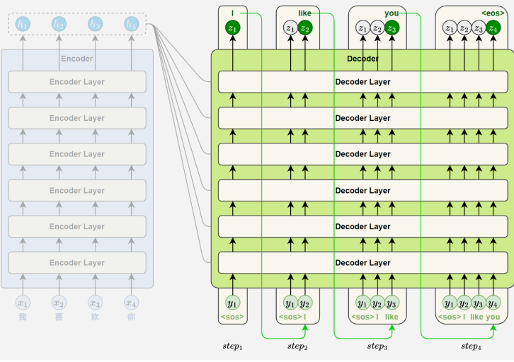
</p>

每个`Decoder Layer`都包含三个子层，分别是`Masked`自注意力子层、编码器-解码器注意力子层（`Encoder-Decoder Attention`）和前馈神经网络子层（`Feed-Forward Network`）

<p align='center'>
	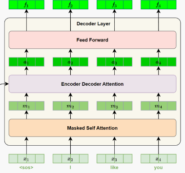
</p>
重点介绍**掩码注意力层**，它的作用是**建模当前位置与前文词之间的依赖关系**，为了在训练时模拟逐词生成的过程，引入遮盖机制（Mask），限制每个位置只能关注它前面的词。

Mask 机制的实现非常简单：只需将注意力得分矩阵中**当前位置对其后续位置的评分设置为 −∞**，如下图所示，这样，在后续通过 softmax 运算后，当前位置后面的位置的权重会趋近与 0，等价于当前位置几乎不去依赖未来信息。
<p align='center'>
	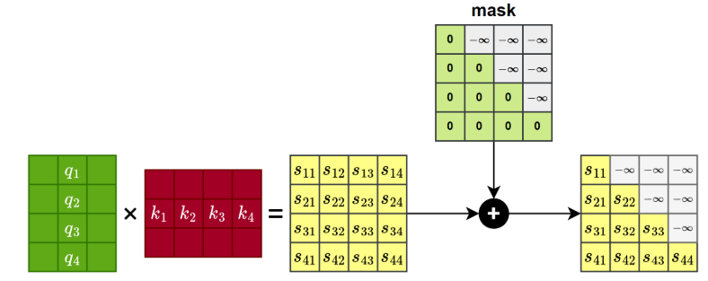
</p>

**编码器-解码器注意力层** 则主要用来建模当前解码位置（目标序列）与原序列中各位置之间的依赖关系，本质上就是一个交叉注意力机制，和 Seq2Seq 中的注意力机制一样。
### 3. self attention

#### 概述

**自注意力（Self-Attention）**，也称为内部注意力（Intra-Attention），是 Transformer 模型的核心组件，由 Google 在 *Attention Is All You Need* 论文中提出。

!!! info "核心思想"
    自注意力允许一个序列内部的每个 token **"关注"** 序列中其他所有 token，并通过计算注意力权重，为当前 token 生成一个融合了上下文信息的新表示。简单来说，就是让模型在处理每个词时，都会考虑这句话中其他词对它的影响。

相较于传统的 RNN/LSTM 序列模型，自注意力带来了两个关键优势：

1.  **支持全并行计算**：所有位置可以同时计算，无需按时间步递归，大幅加快训练速度
2.  **更好捕捉长距离依赖**：直接建立任意两个 token 之间的连接，解决长序列梯度消失问题

一句话总结：**自注意力（Self-Attention）能够让序列中每个位置动态关注序列中其他位置的信息，通过学习注意力权重加权聚合上下文，从而更好地捕捉长距离依赖，避免传统循环神经网络在长序列上的梯度消失和信息遗忘问题，同时支持全并行计算，模型更灵活高效。**

#### 2. 直观理解

我们用一个例子来理解自注意力：

> The animal didn't cross the street because it was too tired.

句子中 "it" 指代的是什么？人类一看就知道指代的是 "The animal"，而不是 "street"。自注意力机制就是让模型在计算每个词的表示时，能够自动捕捉到这种长距离依赖关系，将相关词的语义信息融入当前词。

#### 3. QKV 计算过程

自注意力的核心是通过 **Query（查询）、Key（键）、Value（值）** 三个投影来计算注意力权重，过程如下：
##### 第一步：对每个 token 生成 Q, K, V

对于输入序列中每个 token 的 embedding `x_i`，通过三个可训练的权重矩阵 $W_q$, $W_k$, $W_v$ 分别投影得到：$q_i$,$k_i$,$v_i$

<p align='center' style='zoom:70%'>
	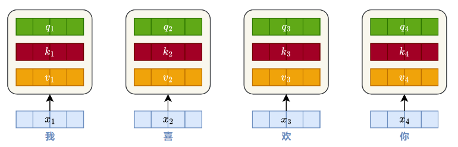
</p>

- **Query（查询向量）**：表示**当前位置的需求**，是触发注意力计算的**需求向量** —— "我当前这个位置要查找什么信息"
- **Key（键向量）**：表示每个位置作为被关注对象的索引（关键字），用来和 Query 计算**相似度** —— "我当前这个位置有什么信息可以提供"
- **Value（值向量）**：表示每个位置实际包含的内容，是最终要获取的实际信息 —— "我当前这个位置具体提供的信息是什么"

在这个过程中，Q 和 K 比较相关性，然后再从 V 中提取你关心的内容。

!!! tip "Q 来源确实很灵活"
    Q 的来源取决于你要在哪里做注意力：

    | 场景 | Q 来源 | 说明 |
    |------|--------|------|
    | **自注意力** | QKV 都来自同一个序列的每个位置 | 每个 token 自己去查自己序列里的其他 token |
    | **Encoder-Decoder 交叉注意力** | Q 来自 **Decoder 当前隐状态** \( s_{t-1} \) | 因为Decoder要根据当前已经解码的内容，去Encoder输入里找相关信息 |
    | **也可以是词向量** | Q 就是当前要输出词的词向量 | 本质上还是用当前位置信息去表达"需求"，一样的道理 |

    核心永远是：**Query = 当前位置的需求**，我想要找什么 → 去和各个位置的 Key 比相似度。

##### 第二步：计算注意力分数

为了得到当前位置 `i` 对序列中所有位置 `j` 的注意力分数，我们计算 Query $q_i$ 和所有 Key $k_j$ 的点积，但是为了防止点积过大，通常注意力分数要进行缩放：

<p align='center' style='zoom:60%'>
	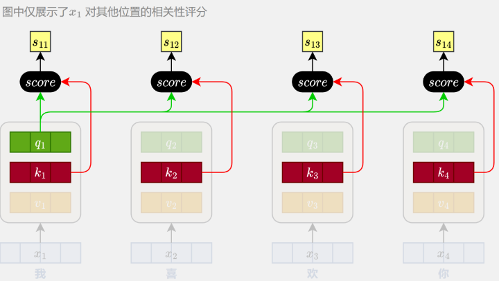
</p>

$$scores = \frac{qk^T}{\sqrt d_k}$$

##### 第三步：通过 softmax 得到注意力权重


$$\alpha = \text{softmax}(\text{scores})$$


经过 softmax 后，所有分数归一化为 $Σ α_{i,j} = 1$，这就是最终的注意力权重。

##### 第四步：加权求和得到输出

最终输出 $z_i$ 是所有 $V$ 的加权和，权重就是上面得到的注意力分数：


$$z_i = Σ_j (α_{i,j} · v_j)$$


这样，$z_i$ 就融合了整个序列中所有其他 token 对当前 token $i$ 的上下文信息。

#### 4. 矩阵形式的整体计算

把整个序列的 Q, K, V 堆叠成矩阵，我们可以用一次矩阵乘法完成整个自注意力计算：


$$Attention(Q, K, V) = \frac{softmax((QK^T)}{\sqrt{d_k}} V$$


这正是自注意力能够**并行计算**的原因：所有输出可以通过一次矩阵乘法得到，无需逐个时间步计算。

#### 5. PyTorch 手动实现

自注意力的实现非常直观，下面是纯 PyTorch 手动实现：

```python
import torch
import torch.nn as nn
import torch.nn.functional as F

class SelfAttention(nn.Module):
    def __init__(self, embed_dim):
        super().__init__()
        self.embed_dim = embed_dim
        # 定义 Q, K, V 投影矩阵
        self.W_q = nn.Linear(embed_dim, embed_dim)
        self.W_k = nn.Linear(embed_dim, embed_dim)
        self.W_v = nn.Linear(embed_dim, embed_dim)

    def forward(self, x):
        """
        Args:
            x: 输入张量 shape: (batch_size, seq_len, embed_dim)
        Returns:
            output: 自注意力输出 shape: (batch_size, seq_len, embed_dim)
            attn_weights: 注意力权重 shape: (batch_size, seq_len, seq_len)
        """
        batch_size, seq_len, embed_dim = x.shape

        # 1. 计算 Q, K, V
        q = self.W_q(x)  # (batch, seq_len, embed_dim)
        k = self.W_k(x)  # (batch, seq_len, embed_dim)
        v = self.W_v(x)  # (batch, seq_len, embed_dim)

        # 2. 计算点积分数，并缩放
        # (batch, seq_len, seq_len)
        scores = torch.bmm(q, k.transpose(1, 2)) / torch.sqrt(torch.tensor(embed_dim))

        # 3. softmax 得到注意力权重
        attn_weights = F.softmax(scores, dim=-1)  # (batch, seq_len, seq_len)

        # 4. 加权求和得到输出
        output = torch.bmm(attn_weights, v)  # (batch, seq_len, embed_dim)

        return output, attn_weights
```

使用示例：

```python
# 测试：batch_size=2, seq_len=5, embed_dim=128
batch_size, seq_len, embed_dim = 2, 5, 128
x = torch.randn(batch_size, seq_len, embed_dim)

self_attn = SelfAttention(embed_dim)
output, attn = self_attn(x)

print(f"输入形状: {x.shape}")        # torch.Size([2, 5, 128])
print(f"输出形状: {output.shape}")   # torch.Size([2, 5, 128])
print(f"注意力权重形状: {attn.shape}") # torch.Size([2, 5, 5])
```

#### 6. 掩码自注意力 (Masked Self-Attention)

在解码器（Decoder）中，为了保证每个位置只能看到它前面的位置，不能看到未来的信息，需要使用**掩码自注意力**。

实现方式很简单：在 softmax 之前，把未来位置的分数设为 `-∞`，这样 softmax 后对应的注意力权重就是 0，不会参与计算。

```python
def forward(self, x):
    batch_size, seq_len, embed_dim = x.shape
    q = self.W_q(x)
    k = self.W_k(x)
    v = self.W_v(x)

    scores = torch.bmm(q, k.transpose(1, 2)) / torch.sqrt(torch.tensor(embed_dim))

    # === 添加掩码 ===
    # 生成下三角掩码：只保留当前位置及之前的位置
    mask = torch.tril(torch.ones(seq_len, seq_len, device=x.device)).bool()
    scores = scores.masked_fill(~mask, -float('inf'))

    attn_weights = F.softmax(scores, dim=-1)
    output = torch.bmm(attn_weights, v)

    return output, attn_weights
```

!!! tip "为什么叫'自'注意力？"
    传统注意力机制通常是"源-目标"注意力（Encoder-Decoder Attention）：Query 来自目标序列，Key 和 Value 来自源序列。
    而自注意力中，**Query、Key、Value 都来自同一个序列**，所以叫"自"注意力。

!!! note "Scaled Dot-Product 为什么要缩放？"
    如果 `d_k` 很大，Q 和 K 的点积的方差会变大，导致点积结果绝对值很大，这会让 softmax 函数进入饱和区，梯度变得极小，训练不稳定。
    除以 `sqrt(d_k)` 可以让点积的方差保持为 1，训练更稳定。

#### 7. 多头注意力机制

自然语言本身具有高度的语义复杂性，一个句子往往同时包含多种类型的语义关系。为此，Transformer 引入了**多头注意力机制（Multi-Head Attention）**。其核心思想是通过多组独立的 Query、Key、Value 投影，让不同注意力头分别专注于不同的语义关系，最后将各头的输出拼接融合。

<p align='center' style='zoom:50%'>
	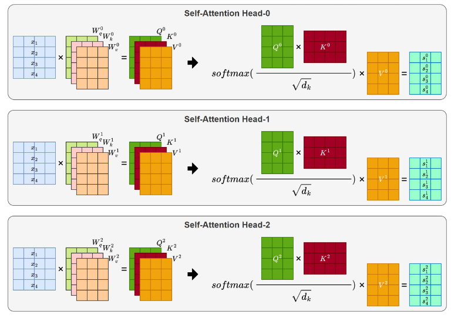
</p>

``` python
import torch  
import torch.nn as nn  
import torch.nn.functional as F  
  
  
class MultiHeadSelfAttention(nn.Module):  
    def __init__(self, dim, num_heads):  
        super().__init__()  
        assert dim % num_heads == 0, "dim 必须能被 num_heads 整除"  
  
        self.dim = dim  
        self.num_heads = num_heads  
        self.head_dim = dim // num_heads  # 每个头的维度  
  
        # 1. 定义 Q, K, V 投影矩阵 (这里我们直接投影到整个 dim，稍后在 forward 中拆分)  
        self.W_q = nn.Linear(dim, dim, bias=False)  
        self.W_k = nn.Linear(dim, dim, bias=False)  
        self.W_v = nn.Linear(dim, dim, bias=False)  
  
        # 2. 定义最终的输出投影矩阵  
        self.out_proj = nn.Linear(dim, dim, bias=False)  
  
    def forward(self, x):  
        """  
        Args:            
	        x: 输入张量 shape: (batch_size, seq_len, dim)        
        Returns:            
	        output: 多头注意力输出 shape: (batch_size, seq_len, dim)            
	        attn_weights: 注意力权重 shape: (batch_size, num_heads, seq_len, seq_len)        
	    """        
        
        batch_size, seq_len, dim = x.shape  
  
        # 1. 线性投影得到 Q, K, V        
        q = self.W_q(x)  # (batch, seq_len, dim)  
        k = self.W_k(x)  # (batch, seq_len, dim)  
        v = self.W_v(x)  # (batch, seq_len, dim)  
  
        # 2. 拆分多头 (Reshape 并转置)  
        # 将 (batch, seq_len, dim) 变为 (batch, num_heads, seq_len, head_dim)        
        q = q.view(batch_size, seq_len, self.num_heads, self.head_dim).transpose(1, 2)  
        k = k.view(batch_size, seq_len, self.num_heads, self.head_dim).transpose(1, 2)  
        v = v.view(batch_size, seq_len, self.num_heads, self.head_dim).transpose(1, 2)  
  
        # 3. 计算缩放点积注意力分数   
        # (batch, num_heads, seq_len, seq_len)  
        scores = torch.matmul(q, k.transpose(-2, -1)) / torch.sqrt(torch.tensor(self.head_dim, dtype=torch.float32))  
  
        # 4. Softmax 得到注意力权重  
        attn_weights = F.softmax(scores, dim=-1)  # (batch, num_heads, seq_len, seq_len)  
  
        # 5. 加权求和  
        # (batch, num_heads, seq_len, head_dim)  
        context = torch.matmul(attn_weights, v)  
  
        # 6. 拼接多头 (Concat)        
        # 转置回 (batch, seq_len, num_heads, head_dim)，然后合并最后两维  
        context = context.transpose(1, 2).contiguous().view(batch_size, seq_len, dim)  
  
        # 7. 最终线性投影  
        output = self.out_proj(context)  
  
        return output, attn_weights
```

#### 参考文档

- 原始论文：[Attention Is All You Need](https://arxiv.org/abs/1706.03762)
- 经典注意力论文：[Neural Machine Translation by Jointly Learning to Align and Translate](https://arxiv.org/abs/1409.0473) (Bahdanau et al.)
- PyTorch 官方文档：[nn.MultiheadAttention](https://pytorch.org/docs/stable/generated/torch.nn.MultiheadAttention.html)

### 4. Transformer 训练与推理机制

`Transformer` 的训练与推理都基于**自回归生成机制**（`Autoregressive Generation`）：模型逐步生成目标序列中的每一个词。然而，在实现方式上，训练与推理存在明显区别。

#### 训练阶段

训练时，`Transformer` 将目标序列整体输入解码器，并在每个位置同时进行预测。为防止模型“看到”后面的词，破坏因果顺序，解码器在自注意力子层中引入了遮盖机制，限制每个位置只能关注它前面的词。

<p align='center'>
	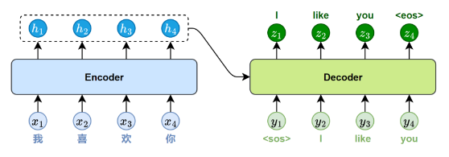
</p>

这种机制让模型在结构上模拟逐词生成，但在实现上能充分利用并行计算，大幅提升训练效率。

#### 推理阶段

推理时，每一步都要重新输入整个**已生成序列**，模型需要基于**全量前文**重新计算注意力分布，决定**下一个词的输出**。整个过程必须顺序执行，无法并行。

<p align='center' style='zoom:80%'>
	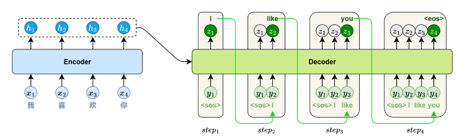
</p>

模型会基于**完整前文重新计算注意力分布**，生成当前步的输出。由于每一步的输入依赖前一步结果，整个过程必须**顺序执行，无法并行**。
### 5. Transformer 实现

#### Pytorch Api

PyTorch 提供了对 [Transformer](#transformer-layers) 的官方实现，该模块封装了完整的编码器-解码器结构。其中：

- `nn.Transformer`：封装了完整的 `Transformer` 架构，由编码器和解码器组成
- `nn.TransformerEncoder`：实现了 `Transformer` 编码器结构，由多个编码器层的堆叠而成
- `nn.TransformerDecoder`：实现了 `Transformer` 编码器结构，由多个编码器层的堆叠而成
- `nn.TransformerEncoderLayer`：实现了单个编码器层结构
- `nn.TransformerDecoderLayer`：实现了单个解码器结构

具体使用方法如下：

=== "编码器组件"

    **nn.TransformerEncoderLayer**：单个编码器层的函数签名：

    ```python
    encoder_layer = nn.TransformerEncoderLayer(
        d_model=512,           # 输入/输出特征维度
        nhead=8,               # 多头注意力头数
        dim_feedforward=2048,  # FFN 隐藏层维度
        dropout=0.1,           # Dropout 概率
        activation='relu',     # FFN 激活函数（也支持 'gelu'）
        batch_first=True,      # ⭐ 输入形状: (batch, seq_len, d_model)
        norm_first=False,      # False = Post-LN, True = Pre-LN（GPT 用的 Pre-LN）
    )
    ```

    **nn.TransformerEncoder**：堆叠多个编码器层：

    ```python
    encoder = nn.TransformerEncoder(
        encoder_layer,  # 编码器层实例
        num_layers=6,   # 堆叠 6 层
    )
    ```

    **使用示例：**

    ```python
    import torch
    import torch.nn as nn

    # 参数
    d_model = 512
    nhead = 8
    seq_len = 10
    batch_size = 2

    # 构建编码器（6 层堆叠）
    encoder_layer = nn.TransformerEncoderLayer(d_model, nhead, batch_first=True)
    encoder = nn.TransformerEncoder(encoder_layer, num_layers=6)

    # 输入: (batch, seq_len, d_model)
    x = torch.randn(batch_size, seq_len, d_model)

    # 前向传播
    memory = encoder(x)
    # memory: (batch, seq_len, d_model) ← 输出和输入形状一致
    print(f"编码器输出: {memory.shape}")  # torch.Size([2, 10, 512])
    ```

=== "解码器组件"

    解码器比编码器多了**交叉注意力**和**掩码自注意力**：

    **nn.TransformerDecoderLayer**：

    ```python
    decoder_layer = nn.TransformerDecoderLayer(
        d_model=512,           # 输入/输出特征维度
        nhead=8,               # 多头注意力头数
        dim_feedforward=2048,  # FFN 隐藏层维度
        dropout=0.1,
        batch_first=True,
    )
    ```

    **nn.TransformerDecoder**：

    ```python
    decoder = nn.TransformerDecoder(
        decoder_layer,
        num_layers=6,
    )
    ```

    **使用示例（结合 Encoder）：**

    ```python
    # 沿用上面的 encoder 和 memory

    # 构建解码器
    decoder_layer = nn.TransformerDecoderLayer(d_model, nhead, batch_first=True)
    decoder = nn.TransformerDecoder(decoder_layer, num_layers=6)

    # Decoder 输入: (batch, tgt_seq_len, d_model)
    tgt = torch.randn(batch_size, 8, d_model)  # tgt_len=8

    # ⭐ 生成下三角因果掩码：防止看到未来词
    tgt_mask = nn.Transformer.generate_square_subsequent_mask(tgt.size(1))

    # 解码器前向: 需要 tgt, memory + tgt_mask
    output = decoder(tgt, memory, tgt_mask=tgt_mask)
    # output: (batch, tgt_len, d_model)
    print(f"解码器输出: {output.shape}")  # torch.Size([2, 8, 512])
    ```

    !!! tip "Decode 的三个输入"
        - `tgt`：目标序列（Decoder 的输入）
        - `memory`：Encoder 输出的编码结果
        - `tgt_mask`：因果掩码，确保自注意力只能看到当前位置及之前的位置
        - `memory_mask`：可选，交叉注意力的掩码（通常不需要）

=== "完整 Transformer 示例"

    **nn.Transformer** 直接封装了编码器 + 解码器：

    ```python
    transformer = nn.Transformer(
        d_model=512,
        nhead=8,
        num_encoder_layers=6,
        num_decoder_layers=6,
        dim_feedforward=2048,
        dropout=0.1,
        activation='relu',
        custom_encoder=None,
        custom_decoder=None,
        layer_norm_eps=1e-05,
        batch_first=False,
        norm_first=False,
        bias=True,
        device=None,
        dtype=None,
    )
    ```

    **完整的前向传播流程：**

    ```python
    import torch  
	import torch.nn as nn  
  
	# 超参数  
	d_model = 512  
	nhead = 8  
	src_vocab_size = 10000  
	tgt_vocab_size = 10000  
	batch_size = 2  
	src_len = 10  
	tgt_len = 8  
	PAD_IDX = 0  # ⭐ 假设 <pad> 的 token id 是 0  
	
	# 1. 构建 Transformertransformer = nn.Transformer(  
	    d_model=d_model,  
	    nhead=nhead,  
	    num_encoder_layers=6,  
	    num_decoder_layers=6,  
	    batch_first=True,  
	)  
	  
	# 2. 词嵌入层  
	src_embed = nn.Embedding(src_vocab_size, d_model, padding_idx=PAD_IDX)  
	tgt_embed = nn.Embedding(tgt_vocab_size, d_model, padding_idx=PAD_IDX)  
	  
	# 3. 模拟数据（这里假设末尾是 PAD）  
	src = torch.randint(1, src_vocab_size, (batch_size, src_len))  
	tgt = torch.randint(1, tgt_vocab_size, (batch_size, tgt_len))  
	# 手动把最后两个词设为 PADsrc[:, -2:] = PAD_IDX    
	tgt[:, -1:] = PAD_IDX    
	  
	# 4. Embedding  
	src_emb = src_embed(src)    
	tgt_emb = tgt_embed(tgt)    
	  
	# 5. ⭐ 生成掩码  
	# 5.1 因果掩码（防止 Decoder 偷看未来）  
	tgt_mask = nn.Transformer.generate_square_subsequent_mask(tgt_len)  
	  
	# 5.2 填充掩码（过滤掉 PAD 位置）  
	# 逻辑：找到序列中等于 PAD_IDX 的位置，作为 padding_mask
	src_padding_mask = (src == PAD_IDX)  # shape: (batch_size, src_len)  
	tgt_padding_mask = (tgt == PAD_IDX)  # shape: (batch_size, tgt_len)  
	  
	# 6. 前向传播  
	output = transformer(  
	    src_emb,  
	    tgt_emb,  
	    src_mask=None,                # Encoder 不需要因果掩码  
	    tgt_mask=tgt_mask,            # Decoder 需要因果掩码  
	    src_key_padding_mask=src_padding_mask,  # ⭐ 传入源序列填充掩码  
	    tgt_key_padding_mask=tgt_padding_mask,  # ⭐ 传入目标序列填充掩码  
	)  
	  
	print(f"最终输出: {output.shape}")
    ```

    !!! warning "batch_first 这个坑"
        `nn.Transformer` 的 `batch_first` 默认是 `False`（和历史遗留有关），输入形状要求 `(seq_len, batch, d_model)`。**建议始终显式设置 `batch_first=True`**，否则 shape 全乱。


#### Pytorch 手撕

下面手写一个简化版 Transformer，把之前讲的所有组件串起来：

```python
import torch
import torch.nn as nn
import torch.nn.functional as F
import math


class PositionalEncoding(nn.Module):
    """正弦余弦位置编码"""
    def __init__(self, d_model, max_len=5000, dropout=0.1):
        super().__init__()
        self.dropout = nn.Dropout(dropout)

        # 生成位置编码矩阵 (max_len, d_model)
        pe = torch.zeros(max_len, d_model)
        position = torch.arange(0, max_len, dtype=torch.float).unsqueeze(1)  # (max_len, 1)

        # 计算频率项: 1 / (10000^(2i/d_model))
        div_term = torch.exp(torch.arange(0, d_model, 2, dtype=torch.float) *
                             -(math.log(10000.0) / d_model))

        # 偶数维度用 sin，奇数维度用 cos
        pe[:, 0::2] = torch.sin(position * div_term)   # 偶数索引
        pe[:, 1::2] = torch.cos(position * div_term)   # 奇数索引
        pe = pe.unsqueeze(0)  # (1, max_len, d_model)

        # 注册为 buffer（不会被梯度更新）
        self.register_buffer('pe', pe)

    def forward(self, x):
        """x: (batch, seq_len, d_model)"""
        x = x + self.pe[:, :x.size(1), :]  # 叠加位置编码
        return self.dropout(x)


class MultiHeadSelfAttention(nn.Module):
    """多头自注意力（复用之前实现的版本）"""
    def __init__(self, dim, num_heads):
        super().__init__()
        assert dim % num_heads == 0
        self.dim = dim
        self.num_heads = num_heads
        self.head_dim = dim // num_heads

        self.W_q = nn.Linear(dim, dim, bias=False)
        self.W_k = nn.Linear(dim, dim, bias=False)
        self.W_v = nn.Linear(dim, dim, bias=False)
        self.out_proj = nn.Linear(dim, dim, bias=False)

    def forward(self, x):
        batch_size, seq_len, _ = x.shape

        q = self.W_q(x).view(batch_size, seq_len, self.num_heads, self.head_dim).transpose(1, 2)
        k = self.W_k(x).view(batch_size, seq_len, self.num_heads, self.head_dim).transpose(1, 2)
        v = self.W_v(x).view(batch_size, seq_len, self.num_heads, self.head_dim).transpose(1, 2)

        scores = torch.matmul(q, k.transpose(-2, -1)) / math.sqrt(self.head_dim)
        attn_weights = F.softmax(scores, dim=-1)
        context = torch.matmul(attn_weights, v)

        context = context.transpose(1, 2).contiguous().view(batch_size, seq_len, self.dim)
        return self.out_proj(context)


class FeedForward(nn.Module):
    """前馈神经网络：线性 → ReLU → Dropout → 线性"""
    def __init__(self, d_model, d_ff, dropout=0.1):
        super().__init__()
        self.linear1 = nn.Linear(d_model, d_ff)
        self.dropout = nn.Dropout(dropout)
        self.linear2 = nn.Linear(d_ff, d_model)

    def forward(self, x):
        return self.linear2(self.dropout(F.relu(self.linear1(x))))


class TransformerEncoderLayer(nn.Module):
    """单层编码器：Self-Attention → FFN（每步都有残差 + LayerNorm）"""
    def __init__(self, d_model, num_heads, d_ff, dropout=0.1):
        super().__init__()
        self.self_attn = MultiHeadSelfAttention(d_model, num_heads)
        self.feed_forward = FeedForward(d_model, d_ff, dropout)
        self.norm1 = nn.LayerNorm(d_model)
        self.norm2 = nn.LayerNorm(d_model)
        self.dropout = nn.Dropout(dropout)

    def forward(self, x):
        # Self-Attention + 残差连接 + LayerNorm
        attn_out = self.self_attn(x)
        x = self.norm1(x + self.dropout(attn_out))

        # FFN + 残差连接 + LayerNorm
        ffn_out = self.feed_forward(x)
        x = self.norm2(x + self.dropout(ffn_out))
        return x


class TransformerEncoder(nn.Module):
    """编码器：位置编码 + N 层编码器层堆叠"""
    def __init__(self, d_model, num_heads, d_ff, num_layers, max_len, dropout=0.1):
        super().__init__()
        self.pos_encoding = PositionalEncoding(d_model, max_len, dropout)
        self.layers = nn.ModuleList([
            TransformerEncoderLayer(d_model, num_heads, d_ff, dropout)
            for _ in range(num_layers)
        ])

    def forward(self, x):
        # x: (batch, seq_len, d_model) — 已经过 Embedding
        x = self.pos_encoding(x)  # 叠加位置编码
        for layer in self.layers:
            x = layer(x)
        return x  # (batch, seq_len, d_model)


# ===== 使用示例 =====
if __name__ == '__main__':
    # 参数
    d_model = 512
    num_heads = 8
    d_ff = 2048
    num_layers = 6
    max_len = 100
    batch_size = 2
    seq_len = 10

    # 构建编码器
    encoder = TransformerEncoder(d_model, num_heads, d_ff, num_layers, max_len)

    # 模拟输入（已经过 Embedding）
    x = torch.randn(batch_size, seq_len, d_model)

    # 前向传播
    output = encoder(x)
    print(f"输入: {x.shape} → 输出: {output.shape}")
    # 输入: torch.Size([2, 10, 512]) → 输出: torch.Size([2, 10, 512])
```

### 6. 核心设计思路

#### 为什么需要位置编码？

自注意力机制本身是**无序**的——它只计算加权求和，不考虑 Q/K/V 的顺序。如果不加入位置信息，模型会把 "我爱你" 和 "你爱我" 当成相同的序列。

常见位置编码方案：

| 位置编码方式 | 特点 | 使用 |
|--------------|------|------|
| **正弦余弦固定编码** | 公式计算，无需学习，可推广到更长序列 | 原始 Transformer |
| **可学习位置嵌入** | 每个位置学习一个向量，灵活 | BERT、GPT 系列 |
| **旋转位置编码 RoPE** | 为 Q/K 加入旋转角度，相对位置编码 | LLaMA、ChatGLM |
| **ALiBi** | 不编码位置，直接在注意力分数加偏置 | 可推广到超长序列 |

原始 Transformer 使用正弦余弦位置编码，公式：

$$
PE(pos, 2i) = \sin\left(\frac{pos}{10000^{2i/d_{model}}}\right)
$$

$$
PE(pos, 2i+1) = \cos\left(\frac{pos}{10000^{2i/d_{model}}}\right)
$$

其中 `pos` 是位置，`i` 是维度索引，`d_model` 是模型维度。
``` python
class PositionEncoding(nn.Module):
    """
    位置编码（Positional Encoding）。
    因为 Transformer 没有像 RNN 那样的循环结构，无法感知序列中单词的先后顺序。
    位置编码通过正弦和余弦函数生成固定的位置向量，并将其加到词向量上，从而为模型注入位置信息。
    """
    def __init__(self, d_model, max_len=500):
        """
        初始化位置编码。
        :param d_model: 模型的隐藏层维度（即词向量的维度）
        :param max_len: 支持的最大序列长度，默认 500
        """
        super().__init__()
        self.d_model = d_model
        self.max_len = max_len

        # 生成位置索引矩阵，形状为 (max_len, 1)
        pos = torch.arange(0, self.max_len, dtype=torch.float).unsqueeze(1)
        # 生成用于计算分母的偶数索引序列 (0, 2, 4, ...)，形状 (d_model/2,)
        _2i = torch.arange(0, self.d_model, step=2, dtype=torch.float)
        # 计算分母项：10000^(2i/d_model)
        div_term = torch.pow(10000, _2i / self.d_model)

        # 分别计算奇数维度的 sin 值和偶数维度的 cos 值
        # pos: (max_len, 1) / div_term: (d_model/2,) → sins: (max_len, d_model/2)
        sins = torch.sin(pos / div_term)
        coss = torch.cos(pos / div_term)

        # 初始化全零的位置编码矩阵
        pe = torch.zeros(self.max_len, self.d_model, dtype=torch.float)  # (max_len, d_model)
        # 偶数维度填 sin，奇数维度填 cos
        pe[:, 0::2] = sins
        pe[:, 1::2] = coss

        # 注册为 buffer（不会被梯度更新，随模型移动设备）
        self.register_buffer('pe', pe)

```

#### 为什么要缩放点积？

当 `d_k` 较大时，Q·K^T 的方差会变大，导致 softmax 输出进入饱和区（梯度极小）。除以 `√d_k` 可以保持方差为 1，让训练更稳定。

$$
Attention(Q,K,V) = softmax\left(\frac{QK^T}{\sqrt{d_k}}\right)V
$$

#### 为什么需要多头注意力？

**多头注意力（Multi-Head Attention）** 把 Q/K/V 投影到多个不同的子空间，每个头学习不同类型的注意力依赖：

- 某些头学习句法依赖
- 某些头学习共指关系
- 某些头学习长距离语义关联

多个头的输出最后拼接再投影，得到最终结果。


### 7. Transformer 关键创新点

1.  **完全基于注意力**：彻底摆脱 RNN，实现全并行训练，大幅提速
2.  **位置编码显式注入位置信息**：解决注意力无序问题
3.  **缩放点积注意力**：数值稳定且计算高效
4.  **多头注意力**：多子空间并行学习不同依赖
5.  **残差+LayerNorm**：让深层网络能够稳定训练

!!! note "对后续工作的影响"
    Transformer 的出现彻底改变了 NLP 领域：
    - BERT（Encoder-only）：双向语言模型，预训练+微调范式
    - GPT（Decoder-only）：自回归预训练，催生了现代大语言模型
    - T5（Encoder-Decoder）：统一所有 NLP 任务为文本到文本格式
    - 几乎所有现代大语言模型都基于 Transformer Decoder 架构


## NLP 预训练模型

### 预训练概述

**预训练**通过大规模未标注的语料上训练模型，让模型具备通用的语言建模能力、了解世界广泛的知识和初步的推理能力。在此基础上，通过**微调**让模型去适配一些领域的任务。


### 主流预训练模型讲解

预训练模型分类三类，但目前，`Decoder-only` 已经成为了绝对主流，这是因为 `Decoder-only` 将各种各样的 `nlp` 任务都统一为了一个目标：**预测一下个 token**。
<p align='center'>
	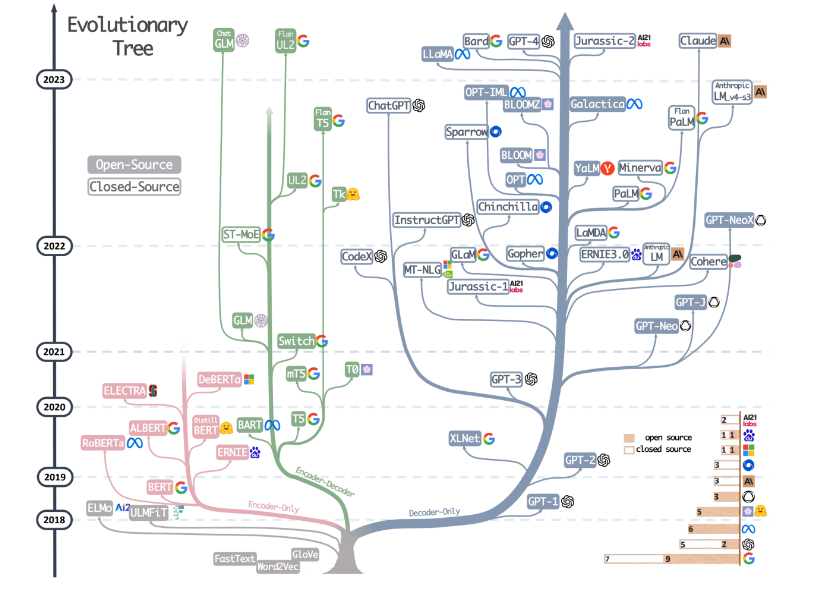
</p>

#### GPT

GPT（Generative Pre-trained Transformer）是第一个系统性提出“预训练 + 微调”范式的语言模型。

它的核心思想就是：通过大规模无监督语料进行**生成式语言建模**预训练，即训练模型根据左侧上下文预测下一个 `token`，当数据规模、训练轮次等达到一定规模时，模型就会出现**能力涌现**！这就是为什么 `Decoder-only` 为什么成为主流的原因。

##### 1. 模型结构

`GPT` 基于 `Transformer` 的解码器结构，但与标准的 `Transformer` 解码器并不完全相同，`GPT` 具体结构如下图所示：

<p align='center' style='zoom:50%'>
	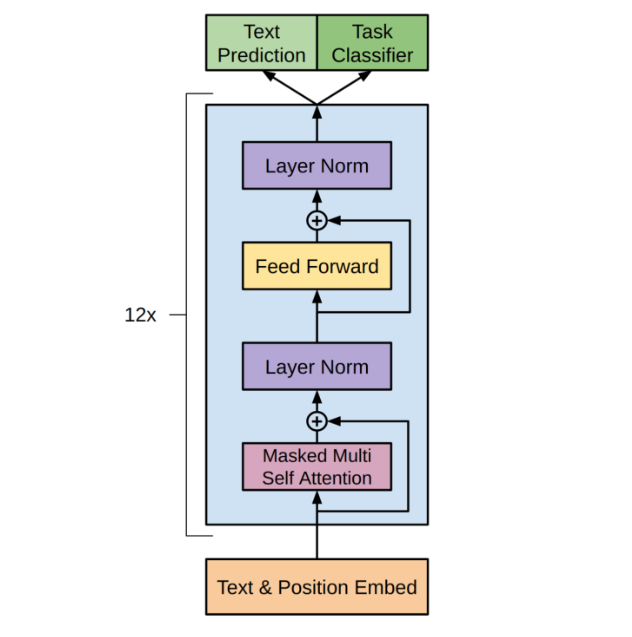
</p>

可以看到，解码器层与原始 `Transformer` 几乎一致（由于没有编码器，所以就没有了交叉注意力机制），只不过层数从 6 -> 12。同时，GPT 的位置编码不再是固定的三角函数编码，而是：每个位置对应一个可学习的向量，模型在训练过程中可以自动的优化这些向量。

最终，每个 `token` 的表示是词嵌入和位置嵌入的向量和，向量维度为 768 维度。

GPT 的输出根据使用阶段不同，有两种处理方式：
 
**Text Prediction**：预训练时用的。每个位置预测下一个词是什么，输出经过 softmax 得到词表上的概率分布。目标是学会"续写"能力，属于**自监督学习**。

**Task Classifier**：预训练完成后，在下游任务微调时使用。在 GPT 最后一层输出上接一个**线性分类头**，把序列的最终表示映射到具体的类别上（如积极/消极）。这种方式不需要模型生成完整句子，而是直接输出分类结果，微调效率和稳定性都比让模型生成文本再解析更高。

!!! tip "和现在用法的区别"
    2018 年 GPT-1 论文发布时，做分类任务的主流方式是 **Task Classifier 微调**。后来 GPT-3 发现通过精心设计的 Prompt（如"这部电影太棒了，情感是\_\_\_"），直接用 Text Prediction 的生成方式也能做分类，这就是 **In-Context Learning**。两种方式都能做分类，区别在于：

    - **Task Classifier 微调**：需要标注数据 + 额外训练，但效果稳定
    - **Text Prediction + Prompt**：无需训练，但依赖 Prompt 设计，结果不稳定

##### 2. 预训练

模型的任务是基于已观察到的前文上下文，预测当前词的位置应出现的词，从而学习自然语言的统计规律与上下文依赖关系。这种自回归语言建模方式不依赖人工标注，训练样本可以直接从原始文本中自动构建，极大地降低了构建数据的成本。

<p align='center'>
	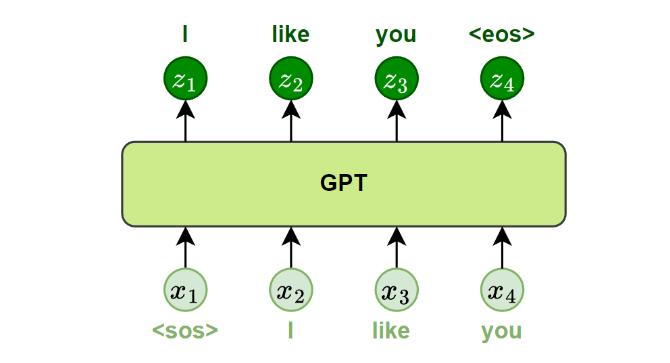
</p>

##### 3. 微调

`GPT` 的微调阶段是在预训练完成之后，使用有监督的任务数据对模型进行进一步训练，使其适应具体的下游任务。微调的**核心思路**是：在保留预训练语言建模能力的基础上，利用标注数据对整个模型进行端到端优化，从而实现知识迁移。 


在具体实现上，`GPT` 采用了两个关键措施，首先是添加了任务输出层——在预训练模型顶部引入一个线性输出层（Linear Head），用于将 GPT 的隐藏状态映射为下游任务所需的标签或输出。

其次是统一了输入设计格式，比如下图，为每个 token  序列添加了 Start 与 Extract 标签，形成了模型标注的输入格式。

![[../../assets/imgs/python/nlp/nlp38_微调阶段输入格式设计.png]]

在下游任务中，我们只提取序列的最后一个位置 Extract：

<p align='center' style='zoom:70%'>
	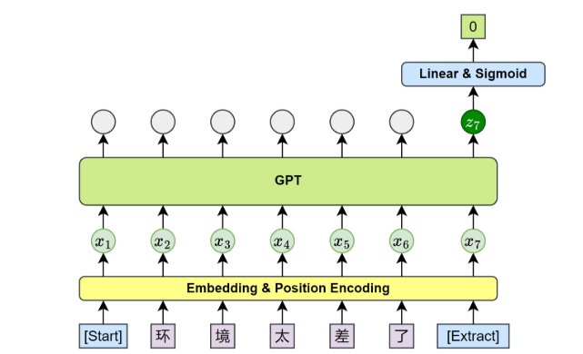
</p>

通过这种方式，GPT 在保留预训练**模型结构和参数**的基础上，仅添加极少量新参数（如线性层），便可高效完成从语言建模到多种下游任务的迁移。


#### BERT

BERT（**Bidirectional Encoder Representations from Transformers**）是由 Google 于 2018 年提出的一种语言预训练模型。其核心创新在于采用 Transformer 的**编码器**（Encoder）结构，通过**双向自注意力**机制，在建模每个 token 表示时同时整合左右两个方向的上下文信息，从而获得更准确、更丰富的语义表示。

##### 1. 模型结构

BERT 基于**标准的 Transformer 编码器**构建，其提供了两种模型规模，分别是 `BERT-base` 和`BERT-large` 。

<p align='center' style='zoom:60%'>
	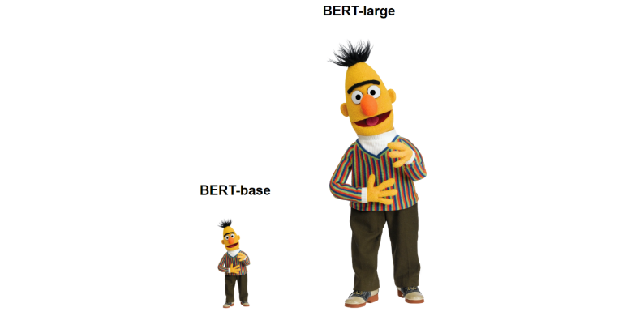
</p>
具体参数规模如下：

| **模型版本**       | **层数**<br><br>**（Layers）** | **模型维度**<br><br>**（d_model）** | **注意力头数**<br><br>**（Heads）** | **参数量** |
| -------------- | -------------------------- | ----------------------------- | ---------------------------- | ------- |
| **BERT-base**  | 12                         | 768                           | 12                           | 1.1 亿   |
| **BERT-large** | 24                         | 1024                          | 16                           | 3.4 亿   |

特别说明的是，BERT 的每个输入 token 表示由三部分嵌入相加组成，分别是：

- **Token Embedding**：词本身的语义表示
- **Position Embedding**：表示 token 在序列中的位置，为可学习向量
- **Segment Embedding**：用于区分句子对任务中的两个句子，分别用一个可学习的向量表示。

<p align='center'>
	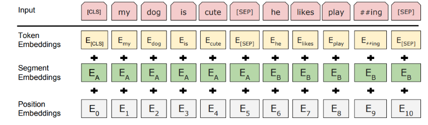
</p>
此外，BERT 输入中通常包含两个特殊符号：分别为 `CLS` 和 `SEP`，其中 `CLS` 是句首表示，其输出向量常用于下游的文本分类任务；`SEP` 则是句间分隔符，出现在每个句子末尾。

##### 2. 预训练

BERT 的预训练阶段包含两个核心任务：**掩码语言模型（Masked Language Modeling, MLM）** 和 **下一句预测（Next Sentence Prediction, NSP）**，分别用于学习词级语义和句间逻辑关系。


 **掩码语言模型（MLM）**：为实现双向语言建模，`BERT` 不采用传统的从左到右或从右到左预测方式，而是引入了掩码语言模型。在训练中，`BERT` 会随机遮盖输入序列中约 15% 的 `token`（其中 80% 被替换为 [mask]、10% 替换为随机词、10% 保持原词不变），并训练模型根据上下文预测被遮盖的词。

<p align='center' style='zoom:80%'>
	
</p>

这样的预训练机制让模型在训练时即能看到左侧上下文，也能看到右侧上下文，真正实现深度双向建模。

 **下一句预测（NSP）**：为了提升模型理解**句间关系**的能力，BERT 引入了“**下一句预测**”任务。训练时模型接收两个句子，判断第二句是否是第一句的真实后续句，其中：
 
<p align='center' style='zoom:60%'>
	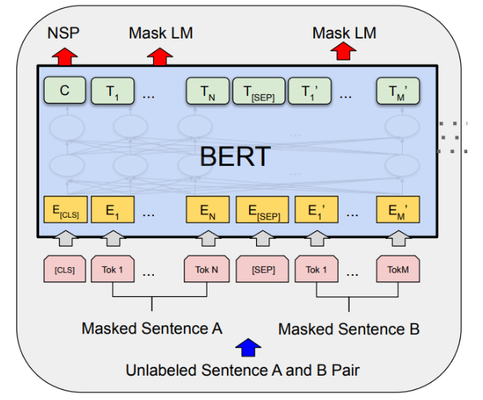
</p>

##### 3. **微调**

在预训练完成后，BERT 可通过少量微调适配多种下游任务，如文本分类、句子匹配、问答系统、序列标注等。微调时，模型主体结构保持不变，仅在顶部添加一个任务特定的输出层，并使用下游任务数据对整个模型进行训练。

#### T5

T5（`Text-to-Text Transfer Transformer`）是 Google Research 于 2020 年提出的一种统一预训练框架，它首次在完整的 Transformer 编码器-解码器结构（Encoder-Decoder）上实现了预训练语言模型。

T5 的核心思想是将所有自然语言处理任务统一表示为“**文本到文本**”的转换问题（Text-to-Text Framework），即无论输入是文本分类、问答还是翻译，模型的输入输出均是自然语言形式的字符串，如下图所示：

<p align='center' >
	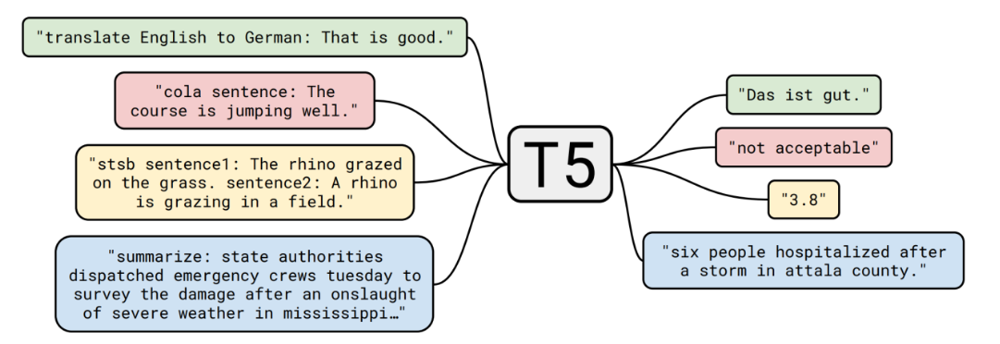
</p>

##### 模型结构

T5模型大体遵循原始的Transformer架构，此处不再赘述。
##### 预训练

T5 的预训练目标称为 **Corrupted Span Prediction（破坏跨度预测）**，过程如下：

1. **随机遮盖**：在输入文本中随机选取若干连续片段（span），每个 span 长度不定（平均约 3 个 token）
2. **替换标记**：每个被遮盖的 span 替换为一个特殊的 `<X>` 标记
3. **生成目标**：模型的 Encoder 接收被破坏的文本，Decoder 负责生成**被遮盖的 span 内容**作为输出序列

<p align='center'>
	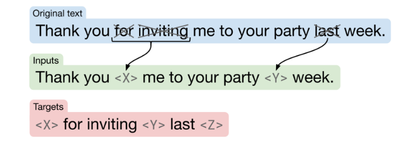
</p>

举个例子，原始文本为 "Thank you for inviting me to your party"，遮盖后：

```
# Encoder 输入（被破坏的文本）
Thank you <X> me to <Y> party.

# Decoder 要生成的输出
<X> for inviting <Y> your
```

可以看到，Decoder 生成的输出中同样使用 `<X>`、`<Y>` 等特殊标记来指示每个 span 的位置，Decoder 输出与 Encoder 输入中的特殊标记一一对应。

这种方式既保留了 Encoder 的**双向建模能力**（理解完整上下文），又为训练提供了明确的**生成式学习信号**（Decoder 需要输出遮盖的 span），使模型可以更自然地适配翻译、摘要等生成式下游任务。


##### 微调

T5 微调的核心思路是**将所有任务统一为文本到文本格式**——不管什么任务，输入都是字符串，输出也是字符串。只需要在输入前加上任务前缀（task prefix），模型就能自动适配：

| 任务类型    | 输入形式                                                                       | 目标输出                           |
| ------- | -------------------------------------------------------------------------- | ------------------------------ |
| 翻译（英→德） | `translate English to German: That is good.`                               | `Das ist gut.`                 |
| 情感分类    | `sentiment: This movie was great.`                                         | `positive`                     |
| 问答      | `question: What is the capital of France? context: France is a country...` | `Paris`                        |
| 文本摘要    | `summarize: The study found that...`                                       | 生成的摘要                          |
| 自然语言推理  | `nli: The premise is... hypothesis:...`                                    | `entailment` 或 `contradiction` |

这种统一的格式带来了两个好处：

1. **一个模型、一套参数做所有事**：分类、翻译、问答、摘要共用同一个 Encoder-Decoder 架构，不用为每个任务单独设计输出头（不像 BERT 需要为分类任务额外接 CLS 头）
2. **任务之间的知识可以迁移**：翻译任务中学到的语言能力，可以在摘要任务中复用


## NLP Hugging Face

### Hugging Face 介绍

[`Hugging Face`](https://huggingface.co/models) 是一家提供开源 AI 工具和平台的公司，致力于简化预训练模型的使用，加速机器学习项目的开发与落地。

最初以 `Transformers` 库闻名，该库极大地降低了使用 `BERT`、`GPT`、`T5` 等模型的门槛。如今，`Hugging Face` 已发展成为一个完整的 AI 开发生态系统，支持自然语言处理、计算机视觉、语音处理、多模态任务等多个领域。


### Hugging Face 构成

`Hugging Face` 的生态系统主要由两个核心部分组成：

#### Hugging Face Hub

Hugging Face提供了一个集中式的开源平台，用于托管和分享模型、数据集和应用。

<p align='center'>
	
</p>

#### Hugging Face Libraries

Hugging Face 提供了一套围绕预训练模型构建的工具库。这些组件彼此独立，又可以协同工作，覆盖了从数据处理到模型训练与推理的完整流程。


1、`Datasets` 是用于加载和处理数据集的工具库。支持从在线仓库或本地文件（如 CSV、JSON）加载文本数据，并支持清洗、编码、切分等预处理操作。处理后的数据可直接用于模型训练，是连接原始数据与模型输入的重要桥梁。

2、`Tokenizers` 是用于将文本转换为模型输入的工具。它支持文本分词、编码为 token ID，同时自动处理特殊符号、填充（padding）、attention mask 和句子对标记（token type ID）。分词器通常与模型配套使用，可通过统一接口加载。

3、`Transformers` 是 Hugging Face 最核心的库，用于**加载**、**使用**和**微调**各种预训练模型。该库统一了模型接口，支持数百种模型结构，如 BERT、GPT 等，用户可以通过一行代码 from_pretrained()直接加载公开模型，快速用于推理或训练。

### Hugging Face API

#### Quick Start

##### 0. 登录与安装

参考[官方文档](https://huggingface.co/docs/transformers/quicktour)，可以先登录，帐户可以让您在 Hugging Face [Hub](https://hf.co/docs/hub/index) （一个用于发现和构建的协作平台）上托管和访问受版本控制的模型、数据集和[空间](https://hf.co/spaces) 。

``` python
from huggingface_hub import notebook_login

notebook_login()
```


安装 `Pytorch`，然后安装最新版本的 `Transformers` 和 `Hugging Face` 生态系统中的一些其他库，以便访问数据集和视觉模型、评估训练以及优化大型模型的训练。

``` shell
uv add torch
uv add transformers datasets evaluate accelerate timm
```


参考 [Hugging Face 官方 Quick Tour](https://huggingface.co/docs/transformers/quicktour)，下面的内容是使用 `transformers` 库最核心的四个步骤：**加载 → 推理 → Pipeline → 训练**。

##### 1. 三个基类

每一个预训练模型都由以下三个基类组成，它们彼此独立、又协同工作：

| **类** | **作用** |
| :-- | :-- |
| [`PreTrainedConfig`](https://huggingface.co/docs/transformers/main_classes/configuration) | 配置文件，存储模型的所有「属性」，如注意力头数、词表大小、隐藏层维度等 |
| [`PreTrainedModel`](https://huggingface.co/docs/transformers/main_classes/model) | 模型本身（架构），由 `Config` 决定结构；预训练模型只返回**原始隐藏状态**（raw hidden states） |
| [`Preprocessor`](https://huggingface.co/docs/transformers/main_classes/preprocessor) | 预处理器类，负责把**原始输入**（文本、图片、音频、多模态）转换为模型能吃的**张量** |

!!! tip "`Model` vs `ModelHead` 的区别"
    `PreTrainedModel` 返回的是**原始隐藏状态**，并不能直接拿来用。真正的「业务输出」由具体的**任务头**完成，例如：

    - `LlamaModel` → 只输出隐藏状态
    - `LlamaForCausalLM` → 在 `LlamaModel` 之上加了语言模型头，可用于文本生成
    - `LlamaForSequenceClassification` → 在 `LlamaModel` 之上加了分类头，可用于情感分析

    这种「**骨干网络 + 任务头**」的设计，让一个预训练底座可以低成本适配到无数下游任务。


##### 2. AutoClass 自动加载

虽然可以显式使用 `LlamaModel`、`LlamaForCausalLM` 等具体类，但 `transformers` 提供了更通用的 [`AutoClass`](https://huggingface.co/docs/transformers/model_doc/auto) API：

!!! note "为什么推荐用 AutoClass"
    `AutoClass` 会根据**预训练权重的名称或路径**和**配置文件**，自动推断出该用哪种模型架构、哪个任务头，并匹配对应的机器学习框架（PyTorch / TensorFlow / JAX）。一行代码就能在数百种模型间无缝切换，不用关心底层细节。

调用 `from_pretrained()` 时，建议显式指定以下两个参数，让模型加载得更"聪明"：

!!! tip "两个关键参数"
    - **`device_map="auto"`**：使用 [Accelerate](https://huggingface.co/docs/accelerate/index) 库自动将模型权重分配到最快的设备上（多卡、CPU/GPU 混合都能处理）
    - **`dtype="auto"`**：直接以权重在磁盘上存储的数据类型（如 `float16`、`bfloat16`）初始化模型，避免**重复加载**（PyTorch 默认会把权重加载成 `float32`，浪费一倍显存）


=== "加载模型与分词器"

    ``` python
    from transformers import AutoModelForCausalLM, AutoTokenizer

    model = AutoModelForCausalLM.from_pretrained(
        "meta-llama/Llama-2-7b-hf",
        dtype="auto",
        device_map="auto",
    )
    tokenizer = AutoTokenizer.from_pretrained("meta-llama/Llama-2-7b-hf")
    ```

=== "参数说明"

    | **参数** | **作用** |
    | :-- | :-- |
    | `"meta-llama/Llama-2-7b-hf"` | Hub 上的仓库名；也可以是本地目录路径 |
    | `dtype="auto"` | 自动匹配权重的精度，避免 `float32` 重复加载 |
    | `device_map="auto"` | 自动分配到 GPU/CPU，多卡环境可拆分到多张卡 |


##### 3. 推理：分词 → 生成 → 解码

加载完成后，三步即可完成一次推理：

=== "完整代码"

    ``` python
    from transformers import AutoModelForCausalLM, AutoTokenizer

    model = AutoModelForCausalLM.from_pretrained(
        "meta-llama/Llama-2-7b-hf",
        dtype="auto",
        device_map="auto",
    )
    tokenizer = AutoTokenizer.from_pretrained("meta-llama/Llama-2-7b-hf")

    # 1) 分词：把文本转成模型能吃的 PyTorch 张量
    model_inputs = tokenizer(
        ["The secret to baking a good cake is "],
        return_tensors="pt",
    ).to(model.device)

    # 2) 生成：调用 generate() 得到 token id
    generated_ids = model.generate(**model_inputs, max_length=30)

    # 3) 解码：把 token id 转回人类可读文本
    tokenizer.batch_decode(generated_ids)[0]
    ```

=== "逐步拆解"

    ``` python
    # 1) 分词
    model_inputs = tokenizer(
        ["The secret to baking a good cake is "],
        return_tensors="pt",
    ).to(model.device)
    ```
    - `return_tensors="pt"`：返回 PyTorch 张量（`"tf"` 返回 TF，`"np"` 返回 NumPy）
    - `.to(model.device)`：把张量迁移到模型所在设备，加速推理

    ``` python
    # 2) 生成
    generated_ids = model.generate(**model_inputs, max_length=30)
    ```
    - `model.generate()` 是因果语言模型最常用的推理入口
    - `max_length` 限制生成总长度（含 prompt），更多参数见 [Generation 策略](https://huggingface.co/docs/transformers/generation_strategies)

    ``` python
    # 3) 解码
    tokenizer.batch_decode(generated_ids)[0]
    ```
    - `batch_decode` 接受**一批** token id 序列，因此返回列表；取 `[0]` 拿到第一条

输出示例：

```
<s> The secret to baking a good cake is 100% in the preparation. There are so many recipes out there,
```

!!! note "微调请跳到 Trainer"
    以上是**纯推理**的最小闭环。若要**微调**（fine-tune）模型，请直接跳到下面的 [Trainer](#trainer) 小节，不要手写训练循环——`Trainer` 已经把分布式、混合精度、梯度累积、日志等所有样板代码都封装好了。


##### 4. Pipeline：最省事的推理方式

[`Pipeline`](https://huggingface.co/docs/transformers/main_classes/pipelines) 是 `transformers` 提供的**最便捷**的推理封装，支持文本生成、图像分割、语音识别、文档问答等几十种任务。完整任务清单见 [Pipeline API 参考](https://huggingface.co/docs/transformers/main_classes/pipelines#transformers.pipeline.task)。

默认情况下，`Pipeline` 会自动下载并缓存该任务的默认预训练模型；通过 `model` 参数可指定具体模型。

=== "使用 Accelerator 自动选设备"

    ``` python
    from transformers import pipeline
    from accelerate import Accelerator

    device = Accelerator().device

    pipeline = pipeline(
        "text-generation",
        model="meta-llama/Llama-2-7b-hf",
        device=device,
    )

    pipeline("The secret to baking a good cake is ", max_length=50)
    ```

=== "手动指定 device"

    ``` python
    from transformers import pipeline

    pipeline = pipeline(
        "text-generation",
        model="meta-llama/Llama-2-7b-hf",
        device="cuda:0",   # 或 "cpu"、0、-1
    )

    pipeline("The secret to baking a good cake is ", max_length=50)
    ```

输出：

``` python
[{'generated_text': 'The secret to baking a good cake is 100% in the batter. The secret to a great cake is the icing.\nThis is why we’ve created the best buttercream frosting reci'}]
```

!!! tip "何时用 Pipeline，何时手写"
    - **快速验证 / 演示 / 脚本工具** → 优先用 `Pipeline`，几行就能跑
    - **需要精细控制（logits 处理、采样策略、beam search、自定义循环）** → 改用 `model.generate()` 手写
    - **生产环境高吞吐服务** → 考虑 [TGI](https://huggingface.co/docs/text-generation-inference) / [vLLM](https://docs.vllm.ai/) 等专用推理引擎


##### 5. Trainer：完整的训练与评估闭环

[`Trainer`](https://huggingface.co/docs/transformers/main_classes/trainer) 是 PyTorch 模型**完整的训练 + 评估循环**，把分布式、混合精度、梯度累积、日志、checkpoint 等所有样板代码都封装好了，**不用再手写训练循环**。一个最简训练任务只需要四样东西：

- 一个**模型**
- 一个**数据集**
- 一个**预处理器**（`tokenizer`）
- 一个**数据 collator**（把样本组装成 batch）

下面用 [rotten_tomatoes](https://huggingface.co/datasets/rotten_tomatoes) 数据集微调 [distilbert-base-uncased](https://huggingface.co/distilbert/distilbert-base-uncased) 做情感分类，走通完整流程。

=== "① 加载模型 / 分词器 / 数据集"

    ``` python
    from transformers import AutoModelForSequenceClassification, AutoTokenizer
    from datasets import load_dataset

    model = AutoModelForSequenceClassification.from_pretrained(
        "distilbert/distilbert-base-uncased"
    )
    tokenizer = AutoTokenizer.from_pretrained(
        "distilbert/distilbert-base-uncased"
    )
    dataset = load_dataset("rotten_tomatoes")
    ```

=== "② 数据预处理"

    ``` python
    def tokenize_dataset(dataset):
        return tokenizer(dataset["text"])

    dataset = dataset.map(tokenize_dataset, batched=True)
    ```
    `dataset.map(..., batched=True)` 会把函数**批量**应用到整个数据集，效率远高于逐条处理。

=== "③ 数据 collator（动态 padding）"

    ``` python
    from transformers import DataCollatorWithPadding

    data_collator = DataCollatorWithPadding(tokenizer=tokenizer)
    ```
    [`DataCollatorWithPadding`](https://huggingface.co/docs/transformers/main_classes/data_collator#transformers.DataCollatorWithPadding) 会在**每个 batch 内**按本批最长样本动态 padding，比全局统一 padding 节省大量计算。

=== "④ TrainingArguments + Trainer"

    ``` python
    from transformers import TrainingArguments, Trainer

    training_args = TrainingArguments(
        output_dir="distilbert-rotten-tomatoes",
        learning_rate=2e-5,
        per_device_train_batch_size=8,
        per_device_eval_batch_size=8,
        num_train_epochs=2,
        push_to_hub=True,
    )

    trainer = Trainer(
        model=model,
        args=training_args,
        train_dataset=dataset["train"],
        eval_dataset=dataset["test"],
        processing_class=tokenizer,
        data_collator=data_collator,
    )

    trainer.train()
    trainer.push_to_hub()
    ```

!!! tip "TrainingArguments 常用参数"
    [`TrainingArguments`](https://huggingface.co/docs/transformers/main_classes/trainer#transformers.TrainingArguments) 提供了几十个超参配置，常用的有：

    - `learning_rate`：学习率（BERT 系模型常用 `2e-5 ~ 5e-5`）
    - `per_device_train_batch_size`：单卡 batch size
    - `num_train_epochs`：训练轮次
    - `fp16` / `bf16`：是否启用混合精度（V100 用 `fp16`，A100/H100 优先 `bf16`）
    - `evaluation_strategy`：评估策略（`steps` / `epoch` / `no`）
    - `push_to_hub=True`：训练完自动推到 Hub
    - `torch_compile=True`：启用 `torch.compile` 加速

    不知道写什么时，**先用默认值**跑出一个 baseline，再针对性调参。

!!! note "`processing_class` 是新名字"
    在较老的 `transformers` 版本中，`Trainer` 用的是 `tokenizer=` 参数；新版本统一改名为 `processing_class=`，以便兼容分词器、图像处理器、音频处理器等所有 `Processor` 类。混用旧代码时记得改过来。

训练跑通后，调用 [`trainer.push_to_hub()`](https://huggingface.co/docs/transformers/main_classes/trainer#transformers.Trainer.push_to_hub) 即可把**模型 + 分词器**一起推送到 Hub，与社区共享。

``` python
trainer.push_to_hub()
```

至此，你已经用 `transformers` 走完了「**加载 → 推理 → Pipeline → 训练 → 上传**」的完整闭环。


#### PretrainedModel

##### AutoModel

Hugging Face 提供了 AutoModel 类来自动的加载不同架构、类型的模型，需要注意的时，默认缓存的路径在 C 盘，记得通过 `HF_HUB_CACHE` 变量来配置：

``` python
from transformers import AutoModel  
from huggingface_hub import constants

print("当前实际生效的缓存路径是:", constants.HF_HUB_CACHE)

model_name = 'google-bert/bert-base-chinese'  
model = AutoModel.from_pretrained(model_name, dtype='auto', device_map='auto')
```

模型配置文件 `config.json` 如下，`architectures`已经说明了模型的架构，所以通过 `AutoModel` 就能自动推断出！

``` json
{
  "architectures": [
    "BertForMaskedLM"
  ],
  "attention_probs_dropout_prob": 0.1,
  "directionality": "bidi",
  "hidden_act": "gelu",
  "hidden_dropout_prob": 0.1,
  "hidden_size": 768,
  "initializer_range": 0.02,
  "intermediate_size": 3072,
  "layer_norm_eps": 1e-12,
  "max_position_embeddings": 512,
  "model_type": "bert",
  "num_attention_heads": 12,
  "num_hidden_layers": 12,
  "pad_token_id": 0,
  "pooler_fc_size": 768,
  "pooler_num_attention_heads": 12,
  "pooler_num_fc_layers": 3,
  "pooler_size_per_head": 128,
  "pooler_type": "first_token_transform",
  "type_vocab_size": 2,
  "vocab_size": 21128

}
```

`from_pretrained()` 一行代码，本质上就是去 Hugging Face Hub 下载（或读取本地缓存）对应模型的配置文件和权重，然后根据配置自动构建模型对象。

此外，`from_pretrained()` 还有两个常用参数：

- `dtype="auto"`：自动选择权重的数据类型，例如 `float32`、`float16` 或 `bfloat16`，通常与模型保存时的精度保持一致。
- `device_map="auto"`：自动将模型放到合适的设备上。如果检测到 CUDA，则优先加载到 GPU；如果模型较大，还会自动进行多 GPU 分配；没有 GPU 时则加载到 CPU。


##### AutoModelForXXX

注意，`AutoModel` 返回的是**模型主体（Backbone）**，仅包含神经网络结构，不包含具体任务的输出层（如分类头、问答头、语言模型头等）。如果要完成文本分类、问答、文本生成等具体任务，应使用对应的 `AutoModelForXXX` 系列类，例如 `AutoModelForSequenceClassification`、`AutoModelForQuestionAnswering`、`AutoModelForCausalLM` 等。


##### 模型输入输出详解

对于不同结构的模型，输入输出可能是不同的，所以，需要看对应模型的 API 文档，比如[ BERT 的文档](https://huggingface.co/docs/transformers/model_doc/bert?usage=AutoModel#transformers.BertModel.forward)。下面，我们以 **BERT** 为例讲解模型的输入和输出。

先来说 [`forward`  方法](https://huggingface.co/docs/transformers/model_doc/bert?usage=AutoModel#transformers.BertModel.forward)，主要参数如下：

```python
def forward( 
	input_ids=None, 
	attention_mask=None, 
	token_type_ids=None, 
	position_ids=None, 
	inputs_embeds=None, 
	... 
	):
```

日常使用中，最常用的只有前三个参数，它们通常由 `Tokenizer` 自动生成。

``` python
inputs = tokenizer( "我爱中国", return_tensors="pt" ) 
outputs = model(**inputs)
```

然后来说模型输出结构：`BertModel` 默认返回一个 `BaseModelOutputWithPoolingAndCrossAttentions` 对象，其中最常用的输出有两个：

- `last_hidden_state`：最后一层 Transformer 对每个 Token 的输出，形状为 `(batch_size, sequence_length, hidden_size)`，是绝大多数下游任务使用的特征表示。
- `pooler_output`：`[CLS]` Token 经过 Pooler（Linear + Tanh）后的句子级表示，形状为 `(batch_size, hidden_size)`，常用于文本分类等句子级任务。

如果调用时设置：

``` python
outputs = model(
    **inputs,
    output_hidden_states=True
)
```

还会额外返回：`outputs.hidden_states`， 它是一个元组（Tuple），包含：

- Embedding 层输出；
- 每一层 Transformer Encoder 的输出。


但如果是带有任务头有的 BERT  模型，则返回的结果会根据不同的任务有变化：

``` python
model4sc = AutoModelForSequenceClassification.from_pretrained(  
    model_name,  
    dtype='auto',  
    device_map='auto',  
    num_labels=2  
)

outputs2:SequenceClassifierOutput = model4sc(input_ids)  
print(output2.logits, output2.logits.shape)
```

#### Tokenizer

##### 概述

在 Hugging Face 的 Transformers 库中，每一个预训练模型都配套绑定有一个专用的 **Tokenizer**，它负责将原始文本转换为模型可以理解的输入格式（如 `input_ids`、`attention_mask` 等），是连接原始文本与模型计算之间的关键环节。

这些 Tokenizer 通常集成了「从文本到张量」的全流程处理能力，主要包括以下几个方面：

- **子词切分（subword tokenization）**：将输入文本拆分为子词单元
- **编码映射**：将每个子词转换为对应的整数 ID，即 `input_ids`
- **添加特殊 Token**：自动插入如 `[CLS]`、`[SEP]` 等任务相关的特殊符号
- **截断与补齐（truncation & padding）**：统一输入序列长度，构造批量输入
- **生成辅助输入**：根据模型需求生成 `attention_mask`、`token_type_ids` 等附加字段

!!! warning "Tokenizer 和模型必须配套使用"
    不同模型（BERT、GPT、T5、LLaMA…）使用的分词算法（WordPiece、BPE、Unigram、SentencePiece…）和词表都不同，**加载 `bert-base-chinese` 时用的 Tokenizer 绝不能套到 `gpt2` 上**，否则 `input_ids` 对应的向量在词表里根本查不到，模型会输出乱码。下面的所有示例都统一使用 [`bert-base-chinese`](https://huggingface.co/google-bert/bert-base-chinese)，方便对比。

上一节我们用 `tokenizer()` 一行代码就跑通了文本生成推理，本节我们把这个黑盒**彻底拆开**，从最底层的「分词」开始，一步步走通 Tokenizer 的全部 API。


##### 加载 Tokenizer

在 Transformers 库中，[`AutoTokenizer`](https://huggingface.co/docs/transformers/main_classes/tokenizer#autotokenizer) 用于加载与指定模型配套的分词器。它会根据模型名称自动选择并实例化正确的分词器类型（如 `BertTokenizer`、`GPT2Tokenizer`、`T5Tokenizer` 等）。

[`AutoTokenizer`](https://huggingface.co/docs/transformers/model_doc/auto#autotokenizer) 的用法与 `AutoModel` 非常相似，**核心入口都是 `from_pretrained()`**。

###### 1）在线加载

最常见的用法是**指定 Hub 上的模型名**，库会自动下载所需文件并缓存：

``` python
from transformers import AutoTokenizer

# 加载分词器
tokenizer = AutoTokenizer.from_pretrained("google-bert/bert-base-chinese")
```

上述代码的执行流程如下：

- `AutoTokenizer` 根据模型名，从 Hugging Face Hub 下载所需资源，核心是两个文件：

    - **配置文件** `tokenizer_config.json`：记录分词器类型、特殊符号等元信息
    - **词表文件** `vocab.txt`（或 `merges.txt` / `spm.model` 等，取决于分词算法）：真正做"文本↔ID"映射的字典

- 下载的文件会自动缓存到本地，默认路径是 `~/.cache/huggingface/hub/`
- 下次再加载相同模型时**直接读缓存**，不再联网

###### 2）从本地路径加载

如果已经提前把模型文件下载到本地（断网环境、想完全离线、或者二次分发），把 `from_pretrained()` 的参数从「模型名」换成「本地目录路径」即可：

``` python
from transformers import AutoTokenizer

# 加载分词器
tokenizer = AutoTokenizer.from_pretrained("./pretrained/bert-base-chinese")
```

要求目录下必须包含完整的**词表 + 配置文件**：

``` text
./pretrained/bert-base-chinese/
├── tokenizer_config.json
├── vocab.txt
├── special_tokens_map.json
└── ...
```


##### 使用 Tokenizer

上一节「加载」拿到的是 `tokenizer` 对象，下面所有 API 都基于这个对象演示。为了让输出**可复现、可对比**，**所有示例都使用同一段中文文本** `"我爱自然语言处理"`，**同一个分词器** `bert-base-chinese`。

###### 1）分词：tokenizer.tokenize()

`tokenize()` 是**最底层**的入口，只做"切词"这一件事，**不转 ID、不加特殊符号**：

``` python
from transformers import AutoTokenizer

tokenizer = AutoTokenizer.from_pretrained("./pretrained/bert-base-chinese")
tokens = tokenizer.tokenize("我爱自然语言处理")

print(tokens)
```

输出：

``` python
['我', '爱', '自', '然', '语', '言', '处', '理']
```

可以看到，**中文 BERT 是按"字"切的**（而不是按词），这与中文 WordPiece 词表的构造方式有关。

###### 2）token → ID：tokenizer.convert_tokens_to_ids()

拿到 tokens 后，用 [`convert_tokens_to_ids`](https://huggingface.co/docs/transformers/internal/tokenization_utils#transformers.PreTrainedTokenizer.convert_tokens_to_ids) 把每个 token 映射到词表中的整数 ID：

``` python
from transformers import AutoTokenizer

tokenizer = AutoTokenizer.from_pretrained("./pretrained/bert-base-chinese")
tokens = tokenizer.tokenize("我爱自然语言处理")
ids = tokenizer.convert_tokens_to_ids(tokens)

print(ids)
```

输出：

``` python
[2769, 4263, 5632, 4197, 6427, 6241, 1905, 4415]
```

这串整数就是 `input_ids` 的"原料"。

###### 3）ID → token：tokenizer.convert_ids_to_tokens()

反向操作，用 [`convert_ids_to_tokens`](https://huggingface.co/docs/transformers/internal/tokenization_utils#transformers.PreTrainedTokenizer.convert_ids_to_tokens) 把 ID 还原成 token 字符串，常用于**调试模型输出**：

``` python
from transformers import AutoTokenizer

tokenizer = AutoTokenizer.from_pretrained("./pretrained/bert-base-chinese")
ids = [2769, 4263, 5632, 4197, 6427, 6241, 1905, 4415]
tokens = tokenizer.convert_ids_to_tokens(ids)

print(tokens)
```

输出：

``` python
['我', '爱', '自', '然', '语', '言', '处', '理']
```

与第 1 步完全一致，验证了"分词→ID"和"ID→分词"是**无损互逆**的。

###### 4）编码：tokenizer.encode()

前面两步（`tokenize` + `convert_tokens_to_ids`）合起来，等价于「分词后转 ID」；`encode()` 在此基础上**自动添加任务相关的特殊符号**（如 BERT 的 `[CLS]` 和 `[SEP]`），一步到位拿到 `input_ids`：

``` python
from transformers import AutoTokenizer

tokenizer = AutoTokenizer.from_pretrained("./pretrained/bert-base-chinese")
ids = tokenizer.encode("我爱自然语言处理")

print(ids)
```

输出：

``` python
[101, 2769, 4263, 5632, 4197, 6427, 6241, 1905, 4415, 102]
```

对比第 2 步的输出可以发现，**首尾各多了 `101` 和 `102`**，它们对应的就是：

- `101` → `[CLS]`（classification 标识，放在句首）
- `102` → `[SEP]`（separator 分隔符，放在句尾或多句之间）

!!! tip "不要特殊符号？传 `add_special_tokens=False`"
    当你做**单句续写、或者要自己手动控制特殊符号的位置**时（比如 NSP 任务需要手动插两个 `[SEP]`），可以用：

    ``` python
    ids = tokenizer.encode("我爱自然语言处理", add_special_tokens=False)
    # [2769, 4263, 5632, 4197, 6427, 6241, 1905, 4415]
    ```

###### 5）解码：tokenizer.decode()

[`decode()`](https://huggingface.co/docs/transformers/internal/tokenization_utils#transformers.PreTrainedTokenizer.decode) 是 `encode` 的逆过程，把 ID 序列还原为人类可读文本：

``` python
from transformers import AutoTokenizer

tokenizer = AutoTokenizer.from_pretrained("./pretrained/bert-base-chinese")

ids = [101, 2769, 4263, 5632, 4197, 6427, 6241, 1905, 4415, 102]

string = tokenizer.decode(ids)

print(string)
```

输出：

``` python
[CLS] 我 爱 自 然 语 言 处 理 [SEP]
```

可以清晰看到 `[CLS]` 和 `[SEP]` 被还原为可读字符串。

!!! tip "解码时跳过特殊符号"
    在**展示模型生成结果**时，特殊符号会干扰阅读，可以这样去掉：

    ``` python
    tokenizer.decode(ids, skip_special_tokens=True)
    # '我 爱 自 然 语 言 处 理'
    ```

###### 6）一站式接口：tokenizer()（最推荐）

上面 5 个 API 把分词流程**拆得很细**，便于理解原理。但实战中**最推荐用 `tokenizer()` 直接调用**——它是 Tokenizer 对象的 `__call__` 方法，内部**一次性**完成"分词 + 转 ID + 加特殊符号 + padding + truncation + 生成 attention_mask + 转换张量"等所有操作，输出模型能直接吃：

``` python
from transformers import AutoTokenizer

tokenizer = AutoTokenizer.from_pretrained("./pretrained/bert-base-chinese")
text = "我爱自然语言处理"

inputs = tokenizer(text)

print(inputs)
```

输出：

``` python
{
  'input_ids': [101, 2769, 4263, 5632, 4197, 6427, 6241, 1905, 4415, 102],
  'token_type_ids': [0, 0, 0, 0, 0, 0, 0, 0, 0, 0],
  'attention_mask': [1, 1, 1, 1, 1, 1, 1, 1, 1, 1]
}
```

返回值是一个**字典**，三个字段含义如下：

- **`input_ids`**：token 对应的整数 ID 序列，**模型的主输入**
- **`token_type_ids`**：区分"句子 A / 句子 B"的标识（单句任务全为 0，做句对任务时第一句为 0、第二句为 1）
- **`attention_mask`**：标记哪些位置是真实 token（`1`）、哪些是 padding（`0`），告诉模型**只关注真实内容**

`tokenizer()` 还提供多个常用参数控制输出：

``` python
inputs = tokenizer(
    text,
    padding=True,         # 对短句自动补 0，对齐到本 batch 最长
    truncation=True,      # 超长时自动截断
    max_length=128,       # 限制最大长度
    return_tensors="pt",  # 返回 PyTorch 张量（"tf" → TF，"np" → NumPy）
)
```

!!! tip "完整参数速查"
    [`tokenizer.__call__`](https://huggingface.co/docs/transformers/internal/tokenization_utils#transformers.PreTrainedTokenizer.__call__) 支持几十个参数，最常用的 4 个：

    | **参数** | **作用** | **典型值** |
    | :-- | :-- | :-- |
    | `padding` | 是否补齐 | `True` / `"max_length"` / `"longest"` |
    | `truncation` | 是否截断 | `True` / `False` |
    | `max_length` | 序列最大长度 | 视模型最大上下文而定（如 BERT 是 512） |
    | `return_tensors` | 返回张量类型 | `"pt"` / `"tf"` / `"np"` / `None` |

###### 7）批量处理

`tokenizer()` 支持直接传入**文本列表**，自动完成 padding + truncation + 构 batch，是模型训练和批量推理的标准入口：

``` python
from transformers import AutoTokenizer

tokenizer = AutoTokenizer.from_pretrained("./pretrained/bert-base-chinese")

texts = ["我爱自然语言处理", "我爱人工智能", "我们一起学习"]
inputs = tokenizer(
    texts,
    padding="max_length",   # 自动补齐
    truncation=True,        # 自动截断
    max_length=10,          # 统一最大长度
    return_tensors="pt",    # 返回 PyTorch 张量
)

print(inputs)
```

输出是一个**包含 3 个张量的字典**，每个张量形状为 `(batch_size, seq_len)`：

``` python
{
    'input_ids': tensor(
        [
            [ 101, 2769, 4263, 5632, 4197, 6427, 6241, 1905, 4415,  102],
            [ 101, 2769, 4263,  782, 2339, 3255, 5543,  102,    0,    0],
            [ 101, 2769,  812,  671, 6629, 2110,  739,  102,    0,    0]
        ]
    ),
    'token_type_ids': tensor(
        [
            [0, 0, 0, 0, 0, 0, 0, 0, 0, 0],
            [0, 0, 0, 0, 0, 0, 0, 0, 0, 0],
            [0, 0, 0, 0, 0, 0, 0, 0, 0, 0]
        ]
    ),
    'attention_mask': tensor(
        [
            [1, 1, 1, 1, 1, 1, 1, 1, 1, 1],
            [1, 1, 1, 1, 1, 1, 1, 1, 0, 0],
            [1, 1, 1, 1, 1, 1, 1, 1, 0, 0]
        ]
    ),
}
```

解读一下输出：

- **第 1 行**（"我爱自然语言处理"，长度 8 + 2 特殊符号 = 10）：正好填满 `max_length=10`，无需 padding
- **第 2、3 行**：真实 token 不够 10 个，**末尾补 `0`**（`[PAD]` 的 ID）凑齐长度；对应的 `attention_mask` 把补出来的位置标为 `0`，告诉模型**别关注 padding 部分**

!!! tip "API 速查表"
    把这 7 个方法按使用频率从高到低排个序：

    | **API** | **做什么** | **何时用** |
    | :-- | :-- | :-- |
    | `tokenizer(text, ...)` | 一站式：分词 + ID + 特殊符号 + padding + 张量 | **99% 的情况**，训练和推理的首选 |
    | `tokenizer.encode(text)` | 加特殊符号后转 ID 列表 | 快速拿 `input_ids` 排查 |
    | `tokenizer.decode(ids)` | ID → 文本 | 展示模型输出、debug |
    | `tokenizer.tokenize(text)` | 只切词，不转 ID | 想知道"模型怎么切的词" |
    | `convert_tokens_to_ids` | token 串 → ID 串 | 手工构造 ID 序列 |
    | `convert_ids_to_tokens` | ID 串 → token 串 | 排查模型对每个 ID 的解释 |


##### 与预训练模型配合使用

掌握上面 7 个 API 后，**"文本→模型输出"的完整流程**就呼之欲出了。下面的代码演示如何把 Tokenizer 和 `AutoModel` 串起来，做一次**特征提取**（也叫「预训练嵌入」）：

``` python
from transformers import AutoTokenizer, AutoModel
import torch

# 1. 加载模型和分词器
model_name = "bert-base-chinese"
tokenizer = AutoTokenizer.from_pretrained(model_name)
model = AutoModel.from_pretrained(model_name)

# 2. 准备批量文本
texts = ["我爱自然语言处理", "我爱人工智能", "我们一起学习"]

# 3. 编码文本为模型输入格式
encoded = tokenizer(
    texts,
    padding="max_length",
    truncation=True,
    max_length=10,
    return_tensors="pt"
)

# 4. 模型推理（不计算梯度）
with torch.no_grad():
    outputs = model(
        input_ids=encoded["input_ids"],
        attention_mask=encoded["attention_mask"],
        token_type_ids=encoded["token_type_ids"]
    )

# 5. 查看输出张量结构
print(outputs.keys())
print("last_hidden_state:", outputs.last_hidden_state.shape)
print("pooler_output:", outputs.pooler_output.shape)
```

输出：

``` python
odict_keys(['last_hidden_state', 'pooler_output'])
last_hidden_state: torch.Size([3, 10, 768])
pooler_output: torch.Size([3, 768])
```


#### Datasets

##### 概述

[`datasets`](https://huggingface.co/docs/datasets) 是 Hugging Face 提供的一个轻量级数据处理库，专为自然语言处理（以及图像、音频、多模态）任务设计，能高效支持模型训练流程中的**数据加载与预处理**。

它的主要特点包括：

- **加载方便**：支持读取本地文件（CSV、JSON、Parquet 等），也支持加载 Hub 上的在线公开数据集
- **结构清晰**：数据集的内部结构类似表格，每条样本由若干字段组成，类型由 [Apache Arrow](https://arrow.apache.org/) 统一管理
- **无缝协作**：与 `tokenizer`、`Trainer` 等 Hugging Face 模块高度集成，可直接构造模型输入
- **功能丰富**：支持批量映射（`.map()`）、字段筛选（`.filter()`）、训练/验证集划分（`.train_test_split()`）等常见操作

!!! question "为什么不用 pandas？"
    `pandas` 也是表格数据利器，但 `datasets` 在 NLP / 深度学习场景下更有优势：

    | **对比维度** | **pandas** | **datasets** |
    | :-- | :-- | :-- |
    | **数据规模** | 适合百万行以内的中小数据 | 支持**百万到十亿级**样本，靠 Arrow 内存映射，磁盘多大就能读多大 |
    | **内存占用** | 整张表全加载到内存 | 用 Arrow **零拷贝**读取，常驻内存极小 |
    | **训练集成** | 需要自己转 tensor / collator | 原生支持 `set_format` + 配合 `DataLoader` |
    | **预处理** | `apply` 逐行 / `applymap` 全表 | `.map()` **支持批处理 + 多进程加速** |
    | **Hub 集成** | 无 | 一行代码 `load_dataset("xxx")` 拉公开数据集 |

    **简单原则**：做 EDA / 特征工程 → 用 `pandas`；做模型训练数据流水线 → 用 `datasets`。

安装命令：

``` shell
pip install datasets
```

上一节我们用 `tokenizer()` 处理**单条**文本，本节把视角拉到**整个数据集**，把"加载 → 预处理 → 保存 → 喂给 DataLoader"这条流水线完整跑通。


##### 加载数据集

[`datasets`](https://huggingface.co/docs/datasets/loading) 库提供了统一的入口 [`load_dataset()`](https://huggingface.co/docs/datasets/main_classes/load_dataset#datasets.load_dataset)，既支持从本地文件加载，也支持从 Hub 加载在线开源数据集。

###### 加载本地数据

`load_dataset()` 支持多种本地文件格式（CSV、JSON、Parquet、Text、ImageFolder…），并允许一次加载一个或多个文件。**基本语法**：

```python
def load_dataset(
    path: str,                         # 数据集名称，或本地文件格式（csv、json、parquet、text 等），必填
    name: str | None = None,           # 数据集配置名称（部分数据集包含多个子版本）
    data_files: str | list | dict | None = None,
                                       # 数据文件路径，可指定单个文件、多个文件或 train/test 等划分
    split: str | None = None,          # 指定返回的数据集划分，如 "train"、"test"、"train[:10%]"
    cache_dir: str | None = None,      # 数据集缓存目录
    streaming: bool = False,           # 是否采用流式加载，适用于超大规模数据集
    **config_kwargs,                   # 其它数据集特定配置参数
)
```


**1）加载多个文件**

``` python
from datasets import load_dataset

dataset_dict = load_dataset('csv', data_files={
    'train': './data/train.csv',
    'test': './data/test.csv',
})
```

此时返回的是 **`DatasetDict`**，包含两个 `Dataset`，每个 `Dataset` 称为一个 **split**（子集）：

``` python
print(dataset_dict)
# DatasetDict({
#     train: Dataset(...),
#     test: Dataset(...)
# })
```

**2）加载单个文件**

``` python
from datasets import load_dataset

dataset_dict = load_dataset('csv', data_files='./data/dataset.csv')
```

此时返回的**也是 `DatasetDict`**，但只包含**默认命名为 `"train"`** 的一个 `Dataset`：

``` python
print(dataset_dict)
# DatasetDict({
#     train: Dataset(...)
# })
```

!!! tip "记住一个原则"
    `load_dataset()` **永远返回 `DatasetDict`**（即便只有 1 个 split），这样下游代码可以**统一**用 `dataset["train"]`、`dataset["test"]` 取数据，不会因为单/多文件而写两套逻辑。

###### 查看数据集

本节以情感分析场景的电商评论数据集 `online_shopping_10_cats.csv` 为例，演示如何查看 `datasets` 的内容。该数据集的字段是 `review`（评论文本）、`label`（0 负面 / 1 正面）、`cat`（商品类目）。

**1）获取 Dataset**

`load_dataset()` 返回的是 `DatasetDict`，可以**像字典一样**用 split 名称访问：

``` python
from datasets import load_dataset

dataset_dict = load_dataset('csv', data_files='data/raw/online_shopping_10_cats.csv')

dataset = dataset_dict["train"]
```

此时 `dataset` 就是一个 `Dataset` 对象，表示训练集。

**2）访问样本**

`Dataset` 支持**索引和切片**操作访问样本：

``` python
print(dataset[0])       # 单条样本
print(dataset[:3])      # 多条样本
```

**两种访问的返回结构不一样**，这是最容易踩的坑：

| **访问方式** | **返回类型** | **返回示例** |
| | | |
| | | |
| `dataset[0]` | `dict` | `{'review': '很喜欢的一本书', 'label': 1, 'cat': '书籍'}` |
| `dataset[:3]` | `dict`（value 是 list） | `{'review': ['很喜欢的一本书', '内容丰富', '讲解清晰'], 'label': [1, 1, 1], 'cat': ['书籍','书籍','书籍']}` |

!!! warning "索引 vs 切片：返回结构不同"
    - **整数索引** → 返回**单条**样本（dict 的 value 是标量）
    - **切片** → 返回**一批**样本（dict 的 value 是 list / Arrow Array）
    - 写自定义 collator 时要时刻注意这个差异，否则 `tokenizer()` 一次喂进去的就不是字符串而是字符串列表，行为完全不一样。

**3）访问某个字段值**

在切片的基础上，可以**再按字段名**取具体那一列：

``` python
print(dataset[0]['review'])         # 第一条样本的 review 字段
print(dataset[:3]['review'])        # 前三条样本的 review 字段列表
```

###### 加载在线数据

[Hugging Face Hub Datasets](https://huggingface.co/datasets) 上托管了**上万**个公开数据集，涵盖文本分类、问答、翻译、摘要、指令微调等几乎所有 NLP 任务。每个数据集页面都会给出现成的 `load_dataset()` 示例代码，直接复制就能用。

以 [Glint-Research/Fable-5-traces](https://huggingface.co/datasets/Glint-Research/Fable-5-traces)为例：

``` python
from datasets import load_dataset

ds = load_dataset("Glint-Research/Fable-5-traces")
```

执行时，数据集会自动从 Hub 下载，**并缓存到本地**，默认路径：

``` text
~/.cache/huggingface/datasets/
```

后续再加载同名数据集**直接走本地缓存**，不会重复下载。返回的 `DatasetDict` 结构与本地数据**完全一致**，下游代码无需任何修改。


##### 预处理数据集

加载到的原始数据往往**不能直接喂给模型**，还需要做一轮清洗和转换。`datasets` 提供了链式 API，**每一步都返回新的 `Dataset`**，原数据不会被破坏。

下面按"由轻到重"介绍 4 个最常用的预处理操作。

###### 1）删除列：.remove_columns()

当某些字段（如 `cat` 类目）对当前任务**完全没用**时，可以用 `.remove_columns()` 删掉，减少后续处理的字段数：

``` python
dataset = dataset.remove_columns(["cat"])
```

###### 2）过滤行：.filter()

用 `lambda` 表达式**按条件筛选样本**。例如下面同时过滤掉"评论为空"和"label 不合法"的样本：

``` python
dataset = dataset.filter(
    lambda x: x["review"] is not None
    and x["review"].strip() != ""
    and x["label"] in [0, 1]
)
```

`.filter()` 接受一个**对单条样本**返回 `True/False` 的函数，**返回 `True` 的样本会被保留**。

!!! tip "`.filter()` 也支持 `batched=True`"
    大数据集上，过滤函数里**只对需要的字段操作**并打开 `batched=True` 可以显著提速：

    ``` python
    dataset = dataset.filter(
        lambda x: x["label"] in [0, 1],
        batched=True,
        batch_size=1000,
        num_proc=4,   # 4 个进程并行
    )
    ```

###### 3）划分数据集：.train_test_split()

手头只有一份数据时，可以用 [`.train_test_split()`](https://huggingface.co/docs/datasets/main_classes/dataset#datasets.Dataset.train_test_split) **一次性**切成 train / test：

``` python
dataset_dict = dataset.train_test_split(test_size=0.2)

train_dataset = dataset_dict["train"]
test_dataset = dataset_dict["test"]
```

`test_size=0.2` 表示**把 20% 划给 test**，剩余 80% 留给 train；返回的又是熟悉的 `DatasetDict`。

!!! note "如果想要 train / val / test 三段切分"
    `train_test_split` 一次只能切 2 段。三段切法是**先切出 test，再对剩下的 train 部分切一次 val**：

    ``` python
    split1 = dataset.train_test_split(test_size=0.2, seed=42)
    test_dataset = split1["test"]

    split2 = split1["train"].train_test_split(test_size=0.1, seed=42)
    train_dataset = split2["train"]
    val_dataset = split2["test"]
    ```

    设置 `seed` 可以让每次切分结果**一致**，方便对比实验。

###### 4）编码数据：.map()（核心重点）

[`.map()`](https://huggingface.co/docs/datasets/main_classes/dataset#datasets.Dataset.map) 是 `datasets` 中**最核心**的预处理入口，它**把任意函数**应用到数据集中的每一条样本（或每一批样本），常用于**文本编码（配合 tokenizer）**和**字段转换**。

**基本语法**：

``` python
dataset = dataset.map(function, batched=False, remove_columns=None)
```

**关键参数**：

| **参数** | **说明** |
| :-- | :-- |
| `function` | 要应用到每条 / 每批样本上的函数 |
| `batched` | 是否按"批"处理样本；`True` 时函数每次收到一个样本**列表**而不是单条 |
| `remove_columns` | 处理完后删除的原始字段，常用于清理不再需要的列 |

**以中文 BERT 为例，完整编码流程**：

``` python
from transformers import AutoTokenizer

tokenizer = AutoTokenizer.from_pretrained("bert-base-chinese")

def tokenize(example):
    encoded = tokenizer(
        example["review"],
        padding="max_length",
        truncation=True,
        max_length=128,
    )
    example["input_ids"] = encoded["input_ids"]
    example["attention_mask"] = encoded["attention_mask"]

    return example

train_dataset = train_dataset.map(tokenize, batched=True)
test_dataset = test_dataset.map(tokenize, batched=True)
```

编码后，原始的 `Dataset` 会**新增 `input_ids` 和 `attention_mask` 字段**，可以直接喂给模型训练。

!!! tip "`batched=True` 为什么快几十倍？"
    `batched=False` 时，每条样本都要单独调一次 `tokenizer()`，Python 函数调用 + GPU 启动开销巨大；`batched=True` 时，函数一次收到一个**样本列表**，`tokenizer` 内部会**一次性把整批文本切词 + 转 ID + padding**，充分利用向量化计算。

    实测在 10 万条文本上，`batched=True` 比 `batched=False` **快 20~50 倍**。**只要函数能改造成支持批处理，就一定开 `batched=True`**。

    如果你的函数确实**只能处理单条**（比如要做很重的逐条解析），可以**配合 `num_proc` 开启多进程**：

    ``` python
    dataset = dataset.map(tokenize, batched=True, num_proc=4)
    ```


##### 保存数据集

处理完的数据建议**保存到本地**，下次训练直接读，省去重复预处理的开销。`datasets` 提供 3 种保存方式，**按使用频率排序**：

| **数据格式** | **保存方法** | **适用对象** | **推荐度** |
| | | | |
| | | | |
| **Arrow** | `save_to_disk()` | `Dataset` 或 `DatasetDict` | ⭐⭐⭐ **官方推荐** |
| **CSV** | `to_csv()` | 仅限 `Dataset` | ⭐ 通用但慢 |
| **JSON** | `to_json()` | 仅限 `Dataset` | ⭐ 通用但慢 |

###### Arrow 格式（推荐）

[Arrow](https://huggingface.co/docs/datasets/loading#save) 格式是 Hugging Face 官方推荐的数据持久化方式，**既支持单个 `Dataset` 也支持 `DatasetDict`**，且读写都是**零拷贝**、**速度极快**。

**保存**：

``` python
dataset_dict.save_to_disk("./data/processed")
```

保存后的目录结构：

``` text
processed/
├── dataset_dict.json
├── test/
│   ├── data-00000-of-00001.arrow
│   ├── dataset_info.json
│   └── state.json
└── train/
    ├── data-00000-of-00001.arrow
    ├── dataset_info.json
    └── state.json
```

每个 split（train / test）都会**单独保存一个 Arrow 文件**和元信息。

**加载**：

``` python
from datasets import load_from_disk

dataset_dict = load_from_disk("./data/processed")
```

!!! tip "什么时候选 Arrow？"
    - 数据集**只在本项目内复用**（不需要发给不装 datasets 的人）
    - 包含**大字段**（如 `input_ids`、图像二进制），CSV/JSON 序列化极慢
    - 需要**多次反复加载**（Arrow 读取比 CSV 快一个数量级）

###### CSV 和 JSON 格式

如果想把数据导出为**通用格式**（给不装 `datasets` 的同事看、用 pandas 分析、或者入仓到 BI 工具），可以用 `.to_csv()` 或 `.to_json()`。

**注意**：这两种方法**仅适用于单个 `Dataset`，不支持 `DatasetDict`**。

**保存**：

``` python
# csv
train_dataset.to_csv("./data/processed/train.csv")
# json
train_dataset.to_json("./data/processed/train.json")
```

**加载**：

``` python
from datasets import load_dataset

# 加载 CSV
dataset_dict = load_dataset("csv", data_files="./data/processed/train.csv")
# 加载 JSON
dataset_dict = load_dataset("json", data_files="./data/processed/train.json")
```

加载后**返回完整的 `DatasetDict`**，可直接用于训练 / 评估。


##### 集成 DataLoader

经过预处理的 `datasets.Dataset` 可以**直接和 PyTorch 的 `DataLoader` 配合使用**。虽然 `datasets.Dataset` **并没有**继承 `torch.utils.data.Dataset`，但因为它**实现了 `__len__()` 和 `__getitem__()` 这两个核心协议**，`DataLoader` 就能正确识别它并按 batch 迭代。

在丢给 `DataLoader` 之前，需要用 [`.set_format()`](https://huggingface.co/docs/datasets/main_classes/dataset#datasets.Dataset.set_format) **把指定字段转成 PyTorch 张量**，否则模型拿到的就是 list / Arrow array，跑不动：

``` python
train_dataset.set_format(
    type="torch",                                    # 输出为 PyTorch 张量
    columns=["input_ids", "attention_mask", "label"] # 需要转 tensor 的字段
)
```

!!! warning "`.set_format()` 的 3 个注意事项"
    1. **只改访问格式，不改底层数据**：`dataset[i]` 拿到的是 tensor，但磁盘上和内存里的原始数据**完全没动**
    2. **columns 指定的字段自动转 tensor**：访问时这些字段是 `torch.Tensor` 类型
    3. **未在 columns 中的字段访问时会被过滤掉**：`dataset[0]["review"]` 会抛 `KeyError`（或者返回 `None`，视版本而定），所以 `set_format` 后**别再去访问没列出的字段**

设置好格式后，就能像普通 PyTorch 数据集一样造 `DataLoader` 了：

``` python
from torch.utils.data import DataLoader

# 训练集 DataLoader
train_dataloader = DataLoader(train_dataset, batch_size=32, shuffle=True)
```

一个 batch 的样本长这样：

``` python
next(iter(train_dataloader)).keys()
# dict_keys(['input_ids', 'attention_mask', 'label'])
```

每个 value 都是形状为 `(batch_size, seq_len)` 的 `torch.Tensor`，**可以直接喂给 `model(**batch)`**。

!!! tip "什么时候可以跳过 `set_format`？"
    - **用 `Trainer` 训练**时**不需要**手动 `set_format`：`Trainer` 内部会自动处理（用 `processing_class=tokenizer` 推断字段类型）
    - **手写训练循环**时**必须**先 `set_format(type="torch", columns=...)`，否则 `DataLoader` 取出来的不是 tensor，模型会报错

到这里，`datasets` 库的**完整流水线**就打通了：

1. **加载** → `load_dataset()` 本地 / 在线
2. **查看** → 索引 / 切片 / 取字段
3. **预处理** → `remove_columns` / `filter` / `train_test_split` / `map`
4. **保存** → Arrow / CSV / JSON
5. **喂模型** → `set_format` + `DataLoader`（或直接 `Trainer`）

`datasets` 是 Hugging Face 生态的"**数据底座**"，配合 `tokenizer`（上一节）和 `Trainer`（上上节），就构成了从「原始文本」到「模型训练」的**完整三件套**。


