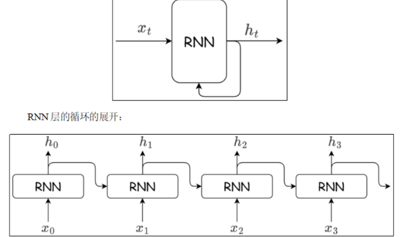

# PyTorch 笔记

> 基于带自动微分系统的深度神经网络框架

## 1. 安装与导入

=== "pip"

    ```bash
    pip install torch torchvision torchaudio
    ```

=== "uv"

    ```bash
    uv add torch torchvision torchaudio
    ```

=== "gpu"

    ```toml title="pyproject.toml"
    [project]
    name = "nlp"
    version = "0.1.0"
    requires-python = ">=3.12"
    dependencies = [
        "torch",
        "torchvision",
        "torchaudio",
    ]


    [[tool.uv.index]]
    name = "pytorch-gpu"
    url = "https://download.pytorch.org/whl/cu126"
    explicit = true  # 关键：这确保只有明确指定该索引的包才去这里找

    # 强制指定这三个包去 pytorch-gpu 索引找（这步最关键）
    [tool.uv.sources]
    torch = { index = "pytorch-gpu" }
    torchvision = { index = "pytorch-gpu" }
    torchaudio = { index = "pytorch-gpu" }
    ```

!!! tip "GPU 支持"
    如需 CUDA 支持，请参考 [PyTorch 官方安装指南](https://pytorch.org/get-started/locally/) 选择对应版本。

```python
import torch
import torch.nn as nn
import torch.optim as optim
```

---

## 2. Tensor 基础

!!! note "官方文档"
    详见 [PyTorch Tensor 文档](https://pytorch.org/docs/stable/tensors.html)

### 2.1 创建张量

#### 按内容创建

```python
torch.tensor(10.0)                    # 标量
torch.tensor([1, 2, 3])               # 一维
torch.tensor([[1, 2], [3, 4]])        # 二维
```

#### 指定形状创建

```python
torch.zeros(3, 4)                     # 全 0
torch.ones(3, 4)                      # 全 1
torch.full((3, 4), 5)                 # 指定值
torch.empty(3, 4)                     # 未初始化
torch.eye(3)                          # 单位矩阵

torch.zeros_like(t)                   # 同形状全 0
torch.ones_like(t)                    # 同形状全 1
torch.full_like(t, 5)                 # 同形状指定值
torch.empty_like(t)                   # 同形状未初始化
```

#### 按区间创建

```python
torch.arange(start, end, step)        # [start, end)，步长
torch.linspace(start, end, num)       # [start, end]，等分 num 份
```

#### 随机值创建

| 方法 | 分布 | 说明 |
|------|------|------|
| `torch.rand(size)` | U(0,1) | 均匀分布 |
| `torch.randn(size)` | N(0,1) | 标准正态 |
| `torch.randint(low, high, size)` | U(low,high) | 离散均匀 |
| `torch.normal(mean, std, size)` | N(mean,std) | 自定义正态 |

```python
torch.rand(3, 4)                     # x ~ U(0,1)
torch.randn(3, 4)                    # x ~ N(0,1)
torch.randint(0, 10, (3, 4))         # x ~ U[0,10)
torch.normal(0, 1, size=(3, 4))      # x ~ N(0,1)

# 随机种子 & 随机排列
torch.manual_seed(42)
torch.randperm(10)                   # 0~9 随机排列
```

#### 指定数据类型

```python
torch.tensor([1, 2], dtype=torch.float32)
torch.tensor([1, 2], dtype=torch.int64)
```

### 2.2 类型转换

!!! important "非原地操作"
    类型转换不会原地修改，而是返回新张量。

```python
t.type(torch.float64)                # 通用转换
t.to(torch.float64)                  # 推荐写法
t.float()                            # 快捷方法
t.long()                             # int64
t.int()                              # int32
```

### 2.3 Tensor 与 NumPy 互转

```python
# Tensor → NumPy（共享内存！）
arr = t.numpy()

# 避免共享
arr = t.numpy().copy()

# NumPy → Tensor（共享内存！）
t = torch.from_numpy(arr)

# 避免共享
t = torch.tensor(arr)                # 拷贝
```

!!! warning "内存共享"
    `numpy()` 和 `from_numpy()` 生成的结果与原始数据**共享内存**，修改一方会影响另一方。

### 2.4 提取标量

```python
t.item()                             # 单元素 Tensor → Python 标量
```

### 2.5 形状操作

| 方法 | 说明 | 示例 |
|------|------|------|
| `reshape()` | 改变形状（必要时拷贝） | `t.reshape(3, -1)` |
| `view()` | 改变形状（需连续） | `t.view(3, -1)` |
| `transpose(d1, d2)` | 交换两维度 | `t.transpose(0, 1)` |
| `permute(*dims)` | 重排所有维度 | `t.permute(2, 0, 1)` |
| `mT` | 最后两维转置 | `t.mT` |
| `unsqueeze(dim)` | 增加维度 | `t.unsqueeze(0)` |
| `squeeze(dim)` | 删除大小为 1 的维度 | `t.squeeze()` |

```python
t.reshape(3, -1)                     # -1 自动推导
t.view(3, -1)                        # 要求 t.is_contiguous()
t.permute(2, 0, 1)                   # 维度重排
t.unsqueeze(0)                       # [3,4] → [1,3,4]
t.squeeze()                          # 删除所有 size=1 的维度
t.transpose(0, 1)                    # 交换第 0、1 维
t.mT                                 # 矩阵转置（最后两维）
```

!!! tip "reshape vs view"
    - `view()` 要求张量**内存连续**，否则报错
    - `reshape()` 自动处理连续性，必要时会拷贝

### 2.6 基本运算

| 类型 | 不原地 | 原地（带 `_`） |
|------|--------|---------------|
| 加法 | `t.add(x)` / `t + x` | `t.add_(x)` |
| 减法 | `t.sub(x)` / `t - x` | `t.sub_(x)` |
| 乘法 | `t.mul(x)` / `t * x` | `t.mul_(x)` |
| 除法 | `t.div(x)` / `t / x` | `t.div_(x)` |
| 幂 | `t.pow(n)` / `t ** n` | `t.pow_(n)` |
| 开方 | `t.sqrt()` | `t.sqrt_()` |
| 对数 | `t.log()` | `t.log_()` |
| 指数 | `t.exp()` | `t.exp_()` |
| 负数 | `t.neg()` / `-t` | `t.neg_()` |

!!! tip "原地操作"
    带 `_` 的方法是**原地操作**，直接修改原张量，节省内存。等价于 `+=`、`-=` 等。

### 2.7 矩阵乘法

```python
t1 * t2                  # 哈达玛积（逐元素相乘）
t1 @ t2                  # 矩阵乘法（支持多维广播）
t1.matmul(t2)            # 同上
t1.mm(t2)                # 仅二维矩阵
```

```python
# 多维矩阵乘法示例
t1 = torch.randn(2, 2, 3, 3)
t2 = torch.randn(2, 2, 3, 10)
result = t1 @ t2         # [2, 2, 3, 10]
```

### 2.8 统计方法

```python
t.sum(dim=0)             # 求和
t.mean(dim=0)            # 均值
t.max(dim=0)             # 最大值及索引（返回 values, indices）
t.min(dim=0)             # 最小值及索引
t.argmax(dim=0)          # 最大值索引
t.argmin(dim=0)          # 最小值索引
t.std(dim=0)             # 标准差
t.unique()               # 去重
t.sort(dim=0)            # 排序（返回 values, indices）
```

### 2.9 索引操作

```python
# 简单索引
t[1, 2, 3]

# 范围索引（步长必须 > 0）
t[:, 0:2, ::2]

# 列表索引（一对一）
t[[0, 1, 2], [1, 2, 3]]

# 列表嵌套索引（支持广播，一对多）
t[[[0], [1]], [1, 2]]

# 布尔索引
t[t > 5]                 # 选择大于 5 的元素
mask = t[:, 0] > 5
t[mask]                  # 选择满足条件的行
```

### 2.10 拼接操作

```python
torch.cat([t1, t2], dim=0)     # 沿维度拼接（不增加维度）
torch.stack([t1, t2], dim=0)   # 沿新维度堆叠（增加维度）
```

```python
t1 = torch.randn(2, 3)
t2 = torch.randn(2, 3)

torch.cat([t1, t2], dim=0)     # [4, 3]
torch.stack([t1, t2], dim=0)   # [2, 2, 3]
```

!!! tip "cat vs stack"
    - `cat`：沿现有维度拼接，**不增加维度**
    - `stack`：沿新维度堆叠，**增加一个维度**

---

## 3. 自动微分 autograd

!!! note "官方文档"
    详见 [torch.autograd 文档](https://pytorch.org/docs/stable/autograd.html)

训练神经网络时，框架会根据设计好的模型构建一个**计算图**，跟踪数据通过哪些操作产生输出，并通过**反向传播算法**根据损失函数的梯度调整参数。

考虑最简单的单层神经网络，具有输入 x、参数 w、偏置 b 以及损失函数：

<p align='center'>
    
</p>

```python
import torch

# 定义输入和真实标签
x = torch.tensor([[1.0]])
y_true = torch.tensor([[2.0]])

# 初始化模型参数（requires_grad=True 表示追踪梯度）
w = torch.randn(1, 1, requires_grad=True)
b = torch.randn(1, requires_grad=True)

# 前向传播
z = x * w + b

# 计算损失
loss = torch.nn.MSELoss()
loss_value = loss(z, y_true)

# 反向传播
loss_value.backward()

# 查看梯度
print(w.grad)
print(b.grad)

# 检查叶子节点
print(x.is_leaf)         # True（用户创建）
print(z.is_leaf)         # False（计算得到）
print(loss_value.is_leaf) # False（计算得到）
```

### 3.1 关键概念

| 概念 | 说明 |
|------|------|
| `requires_grad` | 是否追踪梯度 |
| `grad_fn` | 记录如何计算此张量的函数 |
| `is_leaf` | 用户创建的张量为 True，计算得到的为 False |
| `backward()` | 从该节点反向传播计算梯度 |
| `data` | 张量的实际数据 |

!!! important "动态计算图"
    PyTorch 是**动态图**机制，在计算过程中逐步搭建计算图，每个 Tensor 存储 `grad_fn` 供自动微分使用。

### 3.2 梯度累积与清零

!!! warning "梯度累积机制"
    非叶子节点的梯度在反向传播后会被**释放**（除非设置 `retain_grad=True`）。
    叶子节点的梯度在反向传播后会**保留并累积**。通常需要使用 `optimizer.zero_grad()` 清零。

```python
optimizer.zero_grad()      # 清空梯度（每次训练前必做）
```

### 3.3 脱离计算图

有时需要将某些计算移出计算图：

```python
# 方法 1：detach（共享内存，不追踪梯度）
x = torch.rand(2, 2, requires_grad=True)
y = x.detach()

# 方法 2：上下文管理器（整个代码块不追踪）
with torch.no_grad():
    y = x * 2

# 方法 3：clone（拷贝副本，仍追踪梯度）
y = x.clone()
```

!!! tip "推理模式"
    模型推理时使用 `with torch.no_grad():` 可显著减少内存占用。

---

## 4. 神经网络搭建

!!! note "官方文档"
    详见 [torch.nn 文档](https://pytorch.org/docs/stable/nn.html)

### 4.1 自定义模型（nn.Module）

在 PyTorch 中模型就是 **Module**，各网络层、模块也是 Module。Module 是所有神经网络的基类。

定义模型需要继承 `nn.Module` 并实现两个方法：

- `__init__`：定义网络各层结构并初始化参数
- `forward`：前向传播的具体实现

```python
class MyModel(nn.Module):
    def __init__(self):
        super().__init__()
        self.linear1 = nn.Linear(3, 4)
        self.linear2 = nn.Linear(4, 4)
        self.linear3 = nn.Linear(4, 2)

        # 初始化网络参数
        nn.init.xavier_normal_(self.linear1.weight)
        nn.init.kaiming_normal_(self.linear2.weight)

    def forward(self, x):
        z1 = torch.tanh(self.linear1(x))
        z2 = torch.relu(self.linear2(z1))
        return torch.softmax(self.linear3(z2), dim=1)
```

### 4.2 Sequential 快捷构建

通过 `nn.Sequential` 将各层按顺序传入。**激活函数也当成一层**，用 `nn.ReLU` 而非 `torch.relu`。

```python
model = nn.Sequential(
    nn.Linear(3, 4),
    nn.Tanh(),
    nn.Linear(4, 4),
    nn.ReLU(),
    nn.Linear(4, 2),
    nn.Softmax(dim=1)
)
```

!!! tip "何时用 Sequential"
    简单线性堆叠用 `Sequential`；有跳跃连接或多分支时用自定义 `nn.Module`。

### 4.3 查看参数

```python
# 直接查看某层参数
print(model.linear1.weight)

# 遍历所有参数
for name, param in model.named_parameters():
    print(name, param.shape)

# 获取状态字典
d = model.state_dict()
for k, v in d.items():
    print(k, v.shape)
```

### 4.4 参数初始化

```python
import torch.nn.init as init

# 常数初始化
init.zeros_(model.linear1.weight)
init.constant_(model.linear1.weight, 0.5)
init.eye_(model.linear1.weight)

# 随机初始化
init.normal_(model.linear1.weight, mean=0, std=0.01)
init.uniform_(model.linear1.weight, -1, 1)

# Xavier 初始化（适合 Sigmoid/Tanh）
init.xavier_normal_(model.linear1.weight)
init.xavier_uniform_(model.linear1.weight)

# He 初始化（Kaiming，适合 ReLU 系列）
init.kaiming_normal_(model.linear1.weight)
init.kaiming_uniform_(model.linear1.weight)

# 批量初始化（递归应用）
def init_weights(m):
    if isinstance(m, nn.Linear):
        init.xavier_uniform_(m.weight)
        m.bias.data.fill_(0.01)

model.apply(init_weights)
```

### 4.5 设备管理

```python
# 推荐写法
device = torch.device("cuda" if torch.cuda.is_available() else "cpu")

# 创建张量时指定设备
x = torch.randn(1, 3, 224, 224, device=device)

# 模型和数据都移到同一设备
model.to(device)
x = x.to(device)
```

### 4.6 常用神经网络层

| 层 | 用途 |
|---|------|
| `nn.Linear(in, out)` | 全连接层 |
| `nn.Dropout(p)` | 随机失活（防止过拟合） |
| `nn.BatchNorm1d/2d` | 批归一化 |
| `nn.Conv2d` | 2D 卷积 |
| `nn.MaxPool2d` | 最大池化 |
| `nn.Embedding` | 词嵌入层 |

```python
# Dropout
dropout = nn.Dropout(p=0.5)
output = dropout(x)
```

---

## 5. 激活函数

```python
torch.sigmoid(x)                    # S 型函数
torch.tanh(x)                       # 双曲正切
torch.relu(x)                       # ReLU
torch.leaky_relu(x, 0.01)           # Leaky ReLU
torch.gelu(x)                       # GELU
torch.softmax(x, dim=1)             # 多分类概率
```

!!! tip "激活函数选择"
    - **隐藏层**：优先用 `ReLU` / `LeakyReLU` / `GELU`
    - **二分类输出**：`Sigmoid`
    - **多分类输出**：`Softmax`（CrossEntropyLoss 已内置，无需手动加）

---

## 6. 损失函数

!!! note "官方文档"
    详见 [Loss Functions 文档](https://pytorch.org/docs/stable/nn.html#loss-functions)

### 6.1 BCE（二元交叉熵）

二分类任务常用二元交叉熵损失函数：

$$
L = -\frac{1}{n} \sum_{i=1}^{n} \left( y_i \log \hat{y}_i + (1 - y_i) \log(1 - \hat{y}_i) \right)
$$

```python
loss = nn.BCELoss()
loss_val = loss(y_hat, target)
```

!!! tip "推荐使用 BCEWithLogitsLoss"
    `nn.BCEWithLogitsLoss()` 将 Sigmoid 和 BCE 合并，数值更稳定，输入不需要先过 Sigmoid。

### 6.2 CrossEntropyLoss（多分类交叉熵）

多分类任务常用多类交叉熵损失函数：

$$
\text{CE}(y, \hat{y}) = - \sum_{i=1}^{C} y_i \log(\hat{y}_i) \\
\mathcal{L}_{\text{CE}} = - \log(\hat{y}_c)
$$

```python
loss = nn.CrossEntropyLoss()

# target 是类别索引（Long 类型）
target = torch.tensor([1, 0, 3, 2])
output = torch.randn(4, 5)     # [batch, num_classes]
loss_val = loss(output, target)

# target 也可以是概率分布
target = torch.randn(4, 5).softmax(dim=1)
loss_val = loss(output, target)
```

!!! important "CrossEntropyLoss 细节"
    - 已内置 Softmax，**不要**在模型末尾加 `nn.Softmax()`
    - target 是类别索引（Long 类型），**不是** one-hot 编码
    - 也支持概率分布作为 target

### 6.3 回归损失

平均绝对误差（MAE / L1 Loss）：

$$
\text{MAE} = \frac{1}{n} \sum_{i=1}^{n} |y_i - \hat{y}_i|
$$

```python
l1 = nn.L1Loss()         # MAE
l2 = nn.MSELoss()        # MSE
```

### 损失函数速查

| 损失函数 | 类 | 适用场景 |
|---------|---|---------|
| 二元交叉熵 | `nn.BCELoss()` | 二分类（输入需 Sigmoid） |
| 带 Sigmoid 的二元交叉熵 | `nn.BCEWithLogitsLoss()` | 二分类（推荐，数值更稳定） |
| 多分类交叉熵 | `nn.CrossEntropyLoss()` | 多分类（内置 Softmax） |
| 均方误差 | `nn.MSELoss()` | 回归 |
| 平均绝对误差 | `nn.L1Loss()` | 回归（抗异常值） |

---

## 7. 优化器

!!! note "官方文档"
    详见 [torch.optim 文档](https://pytorch.org/docs/stable/optim.html)

### 7.1 SGD + Momentum

Momentum（动量法）会保存历史梯度并给予一定的权重，使其也参与到参数更新中：

$$
v \leftarrow \alpha v - \eta \nabla\\
W \leftarrow W + v
$$

<p align='center'>
    
</p>

```python
optimizer = optim.SGD(model.parameters(), lr=0.01, momentum=0.9)
```

### 7.2 学习率调度器

#### 等间隔衰减

```python
scheduler = optim.lr_scheduler.StepLR(optimizer, step_size=30, gamma=0.1)
```

| 参数 | 类型 | 含义 |
|------|------|------|
| `optimizer` | `Optimizer` | 要调整学习率的优化器 |
| `step_size` | `int` | 每隔多少个 epoch 下降一次 |
| `gamma` | `float` | 衰减因子：`new_lr = old_lr * gamma` |

<p align='center'>
    
</p>

#### 指定间隔衰减

```python
scheduler = optim.lr_scheduler.MultiStepLR(optimizer, milestones=[30, 60, 90], gamma=0.1)
```

<p align='center'>
    
</p>

#### 指数衰减

```python
scheduler = optim.lr_scheduler.ExponentialLR(optimizer, gamma=0.99)
```

<p align='center'>
    
</p>

!!! note "调度器调用顺序"
    新版 PyTorch 推荐：`optimizer.step()` → `scheduler.step()`，每个 epoch 调用一次。

### 7.3 自适应优化器

#### Adagrad

```python
optimizer = optim.Adagrad(model.parameters(), lr=0.01)
```

#### RMSprop

相较于 Adagrad，RMSProp 引入了**指数加权移动平均（EMA）**机制，逐步遗忘旧梯度信息：

$$
h \leftarrow ah + (1-a)\nabla^2 \\
W \leftarrow W - \eta \frac{1}{\sqrt{h}} \nabla
$$

其中 $\alpha$ 表示衰减系数，用于控制历史梯度的"遗忘速度"。

```python
optimizer = optim.RMSprop(model.parameters(), lr=0.001, alpha=0.99)
```

#### Adam

Adam 结合了 Momentum 和 RMSprop 的优点，同时维护一阶矩（均值）和二阶矩（方差）的指数移动平均：

$$
m_t = \beta_1 m_{t-1} + (1 - \beta_1) g_t \\
v_t = \beta_2 v_{t-1} + (1 - \beta_2) g_t^2 \\
\hat{m}_t = \frac{m_t}{1 - \beta_1^t}, \quad \hat{v}_t = \frac{v_t}{1 - \beta_2^t} \\
\theta_t = \theta_{t-1} - \frac{\eta}{\sqrt{\hat{v}_t} + \epsilon} \hat{m}_t
$$

```python
optimizer = optim.Adam(model.parameters(), lr=0.001, betas=(0.9, 0.999))
```

#### AdamW

AdamW 是 Adam 的改进版本，将权重衰减与梯度更新解耦：

```python
optimizer = optim.AdamW(model.parameters(), lr=0.001, weight_decay=0.01)
```

### 优化器对比

| 优化器 | 特点 | 适用场景 |
|--------|------|---------|
| SGD + Momentum | 简单稳定，泛化好 | 图像分类、传统任务 |
| Adam | 自适应学习率，收敛快 | 默认首选，NLP、GNN |
| AdamW | Adam + 权重衰减解耦 | Transformer、大模型 |
| RMSprop | 适合序列模型 | RNN、LSTM |

---

## 8. 数据加载器

!!! note "官方文档"
    详见 [torch.utils.data 文档](https://pytorch.org/docs/stable/data.html)

在 PyTorch 中，数据加载分为两步：

1.  **Dataset**：定义数据集，负责**单个样本**的获取
2.  **DataLoader**：封装 Dataset，负责按批次加载、多线程预取、打乱等

### 8.1 Dataset 基类

所有自定义数据集都需要继承 `torch.utils.data.Dataset` 抽象类，并实现两个方法：

| 方法 | 作用 |
|------|------|
| `__getitem__(self, index)` | 根据索引获取**一个样本** |
| `__len__(self)` | 返回数据集总大小 |

#### 自定义数据集示例

```python
from torch.utils.data import Dataset

class MyDataset(Dataset):
    def __init__(self, data, labels):
        """初始化数据集，一般传入数据路径或数据本身"""
        self.data = data
        self.labels = labels

    def __getitem__(self, index):
        """根据索引返回一个样本 (data, label)"""
        return self.data[index], self.labels[index]

    def __len__(self):
        """返回数据集大小"""
        return len(self.data)
```

使用示例：

```python
import torch

# 构造数据
data = torch.randn(1000, 10)   # 1000 个样本，每个 10 维
labels = torch.randint(0, 2, (1000,)) # 二分类标签

dataset = MyDataset(data, labels)
print(len(dataset))        # 1000
x, y = dataset[0]          # 获取第一个样本
print(x.shape, y)          # torch.Size([10]) tensor(0)
```

#### 处理大型数据集

如果数据集太大无法全部加载进内存，可以在 `__init__` 中只存储文件路径，在 `__getitem__` 中读取文件：

```python
from torch.utils.data import Dataset
from PIL import Image

class ImageDataset(Dataset):
    def __init__(self, image_paths, labels, transform=None):
        self.image_paths = image_paths
        self.labels = labels
        self.transform = transform

    def __getitem__(self, index):
        # 按需读取，节省内存
        img = Image.open(self.image_paths[index]).convert('RGB')
        if self.transform:
            img = self.transform(img)
        return img, self.labels[index]

    def __len__(self):
        return len(self.image_paths)
```

### 8.2 DataLoader 迭代器

`DataLoader` 将 `Dataset` 包装成可迭代对象，支持：

- 按批次（batch）加载
- 自动打乱（shuffle）
- 多进程并行加载
- 自动整理批数据形状

```python
from torch.utils.data import DataLoader

dataloader = DataLoader(
    dataset,                # 数据集
    batch_size=32,         # 批次大小
    shuffle=True,          # 每个 epoch 是否打乱
    num_workers=4,         # 加载数据的进程数
    drop_last=False,       # 丢弃最后不完整的批次
    pin_memory=False,      # 锁页内存，加快传到 GPU 的速度
)
```

| 参数 | 说明 |
|------|------|
| `batch_size` | 每个批次包含多少样本 |
| `shuffle` | 是否在每个 epoch 开始时打乱数据 |
| `num_workers` | 多少个子进程加载数据。`0` 表示主进程加载。一般设为 CPU 核心数 |
| `drop_last` | 当样本数不能被 `batch_size` 整除时，是否丢弃最后一个不完整的批次 |
| `pin_memory` | 是否将数据锁在内存中，可以加快数据传输到 GPU 的速度，GPU 训练时建议开启 |

使用方式：

```python
for epoch in range(10):
    for batch_x, batch_y in dataloader:
        # 此时 batch_x 形状: [batch_size, feature_dim]
        # 训练步骤...
        optimizer.zero_grad()
        output = model(batch_x)
        loss = criterion(output, batch_y)
        loss.backward()
        optimizer.step()
```

!!! tip "num_workers 设置建议"
    - `num_workers=0`：主进程加载，调试方便，不会卡死
    - 建议设置：`min(4, CPU核心数)`，过大反而会因为进程间通信变慢
    - Windows 下遇到多进程问题可以先设为 `0` 调试

### 8.3 常用内置数据集

PyTorch 的 `torchvision`、`torchtext` 等库提供了很多常用的公开数据集：

=== "torchvision"

    ```python
    from torchvision import datasets
    from torchvision.transforms import ToTensor

    # MNIST 手写数字
    train_data = datasets.MNIST(
        root='./data',
        train=True,
        download=True,
        transform=ToTensor()
    )

    # CIFAR-10
    train_data = datasets.CIFAR10(
        root='./data',
        train=True,
        download=True,
        transform=ToTensor()
    )
    ```

=== "ImageFolder"

    当你的数据按文件夹分类存放时，可以直接使用 `ImageFolder`：

    ```
    data/
        train/
            cat/
                img001.jpg
                img002.jpg
            dog/
                img001.jpg
                img002.jpg
        val/
            cat/
            dog/
    ```

    ```python
    from torchvision import datasets

    train_dataset = datasets.ImageFolder(root='./data/train')
    # train_dataset.classes 会自动得到类别列表 ['cat', 'dog']
    # train_dataset.imgs 会得到所有 (path, label) 列表
    ```

### 8.4 数据变换（Transform）

Transform 用于对数据进行预处理和数据增强。`torchvision.transforms` 提供了很多常用变换。

```python
from torchvision import transforms

# 组合多个变换
transform = transforms.Compose([
    transforms.Resize((224, 224)),      # 调整大小
    transforms.RandomCrop(200),         # 随机裁剪（数据增强）
    transforms.RandomHorizontalFlip(),  # 水平翻转（数据增强）
    transforms.ToTensor(),              # PIL Image → Tensor，范围 [0, 1]
    transforms.Normalize(               # 标准化
        mean=[0.485, 0.456, 0.406],
        std=[0.229, 0.224, 0.225]
    )
])
```

常用变换：

| 变换 | 作用 |
|------|------|
| `ToTensor()` | 将 `PIL Image` 或 `numpy.ndarray` 转为 `Tensor`，并自动归一化到 `[0, 1]` |
| `Normalize(mean, std)` | 标准化：`(x - mean) / std` |
| `Resize((h, w))` | 调整图像大小 |
| `CenterCrop(size)` | 中心裁剪 |
| `RandomCrop(size)` | 随机裁剪 |
| `RandomHorizontalFlip(p)` | 随机水平翻转 |
| `RandomVerticalFlip(p)` | 随机垂直翻转 |
| `RandomRotation(degrees)` | 随机旋转 |

### 8.5 完整示例

```python
import torch
from torch.utils.data import Dataset, DataLoader
from torchvision import transforms
from PIL import Image

# 1. 自定义数据集
class MyDataset(Dataset):
    def __init__(self, image_paths, labels, transform=None):
        self.image_paths = image_paths
        self.labels = labels
        self.transform = transform

    def __getitem__(self, idx):
        img = Image.open(self.image_paths[idx]).convert('RGB')
        if self.transform:
            img = self.transform(img)
        return img, self.labels[idx]

    def __len__(self):
        return len(self.image_paths)

# 2. 定义变换
transform = transforms.Compose([
    transforms.Resize((224, 224)),
    transforms.RandomHorizontalFlip(),
    transforms.ToTensor(),
    transforms.Normalize(mean=[0.485, 0.456, 0.406],
                         std=[0.229, 0.224, 0.225])
])

# 3. 创建数据集和加载器
image_paths = ['path/to/img1.jpg', 'path/to/img2.jpg']
labels = [0, 1]

dataset = MyDataset(image_paths, labels, transform=transform)
dataloader = DataLoader(dataset, batch_size=2, shuffle=True, num_workers=2)

# 4. 遍历加载
for batch_imgs, batch_labels in dataloader:
    print(batch_imgs.shape)  # [batch_size, 3, 224, 224]
    print(batch_labels)      # [0, 1]
    # 训练模型...
```

---

## 9. CNN

!!! note "官方文档"
    详见 [Convolution Layers 文档](https://pytorch.org/docs/stable/generated/torch.nn.Conv2d.html)

### 9.1 概述

卷积神经网络（CNN）常被用于图像识别、语音识别等各种场合。它在计算机视觉领域表现尤为出色，广泛应用于图像分类、目标检测、图像分割等任务。

<p align='center'>
    
</p>

### 9.2 输出尺寸计算

假设输入数据形状为 $(H, W)$，卷积核大小为 $(FH, FW)$，填充为 $P$，步幅为 $S$，则输出尺寸：

$$
OH = \left\lfloor \frac{H + 2P - FH}{S} \right\rfloor + 1
$$

$$
OW = \left\lfloor \frac{W + 2P - FW}{S} \right\rfloor + 1
$$

!!! tip "常用配置"
    - `kernel_size=3, stride=1, padding=1` → 尺寸不变
    - `kernel_size=3, stride=2, padding=1` → 尺寸减半

### 9.3 卷积层

```python
nn.Conv2d(
    in_channels=3,        # 输入通道数
    out_channels=64,      # 输出通道数
    kernel_size=3,        # 卷积核大小
    stride=1,             # 步幅
    padding=0,            # 填充
    dilation=1,           # 膨胀率（空洞卷积）
    groups=1,             # 分组卷积
    bias=True,            # 是否使用偏置
    padding_mode='zeros'  # 填充模式
)
```

### 9.4 池化层

池化层用于对特征图进行下采样，降低空间维度，减少计算量并增强特征的尺度不变性。

```python
nn.MaxPool2d(
    kernel_size=2,        # 池化窗口大小
    stride=None,          # 步幅，默认等于 kernel_size
    padding=0,            # 填充
    dilation=1,           # 膨胀率
    return_indices=False, # 是否返回最大值索引
    ceil_mode=False       # 是否向上取整
)
```

池化层输出尺寸：

$$
H_{out} = \left\lfloor \frac{H_{in} + 2p - d \times (k - 1) - 1}{s} + 1 \right\rfloor
$$

当 $d=1$ 时（大部分情况）：

$$
H_{out} = \left\lfloor \frac{H_{in} + 2p - k}{s} \right\rfloor + 1
$$

---

## 10. NLP 基础

### 10.1 词嵌入层（Embedding）

!!! note "官方文档"
    详见 [nn.Embedding 文档](https://pytorch.org/docs/stable/generated/torch.nn.Embedding.html)

将词映射到向量的技术称为**词嵌入**（Word Embedding）。相比独热编码，词嵌入能编码词之间的相似性，且维度可控。

```python
embed = nn.Embedding(num_embeddings=10000, embedding_dim=128)
indices = torch.tensor([1, 5, 100])
vectors = embed(indices)    # [3, 128]
```

```python
# 完整示例：分词 → 构建词表 → 嵌入
import jieba

text = "自然语言是由文字构成的"
words = [w for w in jieba.lcut(text) if w not in {'的', '是', '由'}]
id2word = list(set(words))
word2id = {w: i for i, w in enumerate(id2word)}

embed = nn.Embedding(len(id2word), 5)
for word, idx in word2id.items():
    vec = embed(torch.tensor(idx))
    print(f"{idx:>2}: {word:8} {vec.detach().numpy()}")
```

### 10.2 RNN

!!! note "官方文档"
    详见 [nn.RNN 文档](https://pytorch.org/docs/stable/generated/torch.nn.RNN.html)

循环神经网络（RNN）通过环路结构处理序列数据，能够学习时间依赖性。

<p align='center'>
    
</p>

当前时刻的输出 $h_t$ 由当前输入 $x_t$ 和上一时刻隐藏状态 $h_{t-1}$ 计算：

$$
h_t = \tanh(h_{t-1}W_h + x_tW_x + b)
$$

```python
rnn = nn.RNN(
    input_size=128,         # 输入特征维度
    hidden_size=256,        # 隐藏状态维度
    num_layers=2,           # 隐藏层层数
    batch_first=True,       # 输入格式 [batch, seq, feature]
)

# 调用
output, h_n = rnn(x)        # x: [batch, seq_len, input_size]
```

| 输出 | 形状 | 说明 |
|------|------|------|
| `output` | `[batch, seq, hidden]` | 每步的输出 |
| `h_n` | `[num_layers, batch, hidden]` | 最终隐藏状态 |

!!! tip "实际使用"
    推荐使用 `nn.LSTM` 或 `nn.GRU` 替代基础 RNN，它们能更好处理长序列依赖问题。

---

## 11. 训练模板

```python
def train(model, dataloader, optimizer, criterion, device):
    model.train()
    total_loss = 0
    for x, y in dataloader:
        x, y = x.to(device), y.to(device)

        optimizer.zero_grad()          # 清空梯度
        output = model(x)              # 前向传播
        loss = criterion(output, y)    # 计算损失
        loss.backward()                # 反向传播
        optimizer.step()               # 更新参数

        total_loss += loss.item()
    return total_loss / len(dataloader)

def evaluate(model, dataloader, criterion, device):
    model.eval()
    total_loss, correct, total = 0, 0, 0
    with torch.no_grad():              # 推理模式
        for x, y in dataloader:
            x, y = x.to(device), y.to(device)
            output = model(x)
            total_loss += criterion(output, y).item()
            correct += (output.argmax(1) == y).sum().item()
            total += y.size(0)
    return total_loss / len(dataloader), correct / total

# 训练循环
epochs = 100
for epoch in range(epochs):
    train_loss = train(model, train_loader, optimizer, criterion, device)
    val_loss, val_acc = evaluate(model, val_loader, criterion, device)
    scheduler.step()
    if epoch % 10 == 0:
        print(f"Epoch {epoch}: train_loss={train_loss:.4f}, val_acc={val_acc:.4f}")
```

---

## 参考资料

- [PyTorch 官方文档](https://pytorch.org/docs/stable/)
- [PyTorch Tutorials](https://pytorch.org/tutorials/)
- [torch.autograd](https://pytorch.org/docs/stable/autograd.html)
- [torch.nn](https://pytorch.org/docs/stable/nn.html)
- [torch.optim](https://pytorch.org/docs/stable/optim.html)
