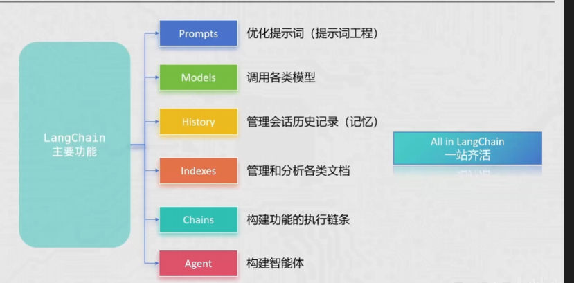
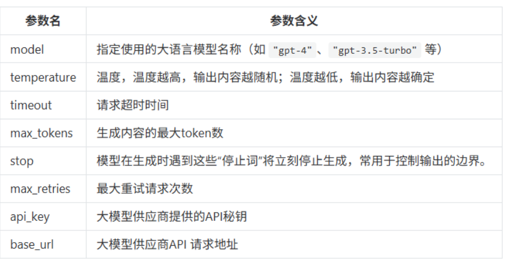
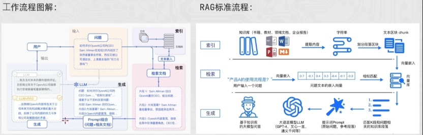
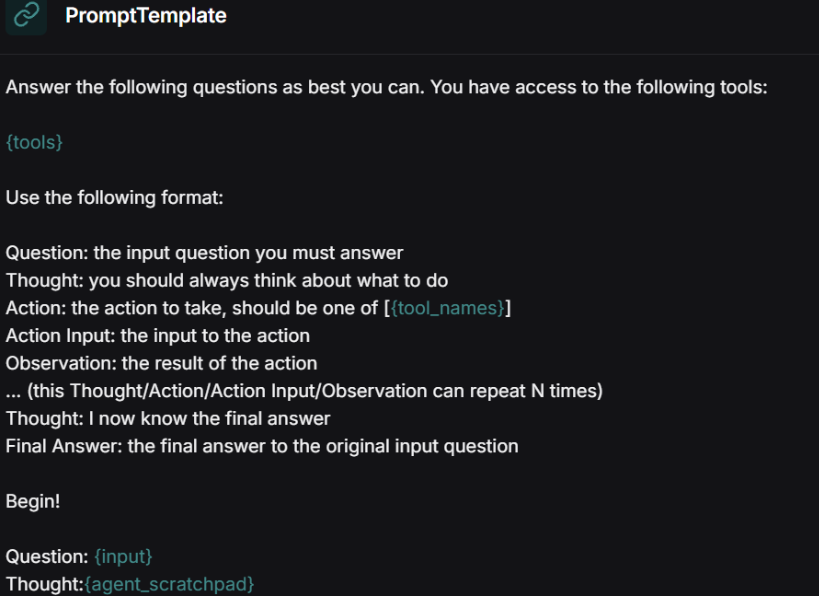

## 01 前置准备

### 远程调用 LLM

大多数主流大模型（GPT、Claude、Gemini）通过 RESTful API 提供服务。目前行业基本统一使用 **OpenAI SDK 标准**。

| 参数         | 说明               | 示例                          |
| ------------ | ------------------ | ----------------------------- |
| **Base URL** | API 接口地址       | `https://api.openai.com/v1`   |
| **API Key**  | 身份凭证（需保密） | `sk-xxx...`                   |
| **Model ID** | 模型版本           | `gpt-4o`, `claude-3-5-sonnet` |

### 环境变量的保护

推荐将敏感信息存入环境变量，通过 `os.getenv()` 读取：

```python
from openai import OpenAI
import os

client = OpenAI(
    # 从环境变量读取 API Key
    api_key=os.getenv("OPENAI_API_KEY"),
    base_url="https://dashscope.aliyuncs.com/compatible-mode/v1",
)
```

使用 `.env` 文件管理环境变量：

```python
from dotenv import load_dotenv
import os

load_dotenv()  # 加载 .env 文件
KEY = os.getenv("LLM_API_KEY")
```

### Ollama

Ollama 是目前最流行的**本地**大模型运行框架，适合数据敏感或无网络环境。

调用时只需修改 `base_url`，默认为 `http://localhost:11434/v1`：

```python
from openai import OpenAI
import os

# 灵活切换：远程 API 或本地 Ollama
client = OpenAI(
    api_key=os.getenv("LLM_API_KEY") or "ollama",
    base_url=os.getenv("LLM_BASE_URL")  # 动态加载
)
```

## 02 OpenAI 基础

**OpenAI** 是通用人工智能（AGI）研究的先驱，开发了 GPT 系列大语言模型。其 API 提供业界领先的文本生成、对话、嵌入（Embeddings）等能力。

**核心概念**：

| 概念               | 说明                                                |
| ------------------ | --------------------------------------------------- |
| **GPT**            | 基于 Transformer 的生成式预训练模型                 |
| **Token**          | 文本处理单元，计费单位（1 token ≈ 0.75 个英文单词） |
| **Context Window** | 模型最大上下文长度（GPT-4o 支持 128K tokens）       |
| **多模态**         | 支持文本、图像、音频等多种输入输出                  |

### OpenAI 调用 LLM 大模型

**1、获取客户端对象**

安装 `openai` 库并配置 API Key。推荐环境变量方式避免硬编码：

```python
from openai import OpenAI

# 默认读取 OPENAI_API_KEY 环境变量
client = OpenAI(
    api_key="your-api-key-here",      # 或手动传入
    base_url="https://api.openai.com/v1"  # 代理或中转地址
)
```

**2、调用模型**

核心接口 `chat.completions.create` 采用对话式输入，`messages` 数组定义上下文角色：

```python
response = client.chat.completions.create(
    model="gpt-4o",
    messages=[
        {"role": "system", "content": "你是一个严谨的助手。"},
        {"role": "user", "content": "解释一下量子纠缠。"}
    ],
    temperature=0.7
)
```

**参数说明**：

- **model**: 指定模型版本（如 `gpt-4o`, `gpt-3.5-turbo`）
- **messages**: 包含 `role` (system/user/assistant) 和 `content` 的消息列表
- **temperature**: 随机性控制（0 = 稳定，1 = 发散）

**三种消息角色**：

| 角色          | 作用         | 说明                                 |
| ------------- | ------------ | ------------------------------------ |
| **System**    | 设定 AI 身份 | 最高层级，定义行为准则和输出格式     |
| **User**      | 用户输入     | 驱动对话，提出问题或任务             |
| **Assistant** | AI 回复      | 模型生成的回复，多轮对话需回传给 API |

**3、处理结果**

返回的 `response` 是结构化对象，关注首位候选回复：

```python
# 获取回复文本
answer = response.choices[0].message.content

# 获取 Token 消耗统计
print(f"本次花费了 {response.usage.total_tokens} 个 Token")
```

**响应结构详解**：

```json
{
  "id": "chatcmpl-123",
  "object": "chat.completion",
  "created": 1677652288,
  "model": "gpt-4o-2024-05-13",
  "system_fingerprint": "fp_447092c6b1",
  "choices": [
    {
      "index": 0,
      "message": {
        "role": "assistant",
        "content": "你好！有什么我可以帮你的？",
        "tool_calls": null
      },
      "logprobs": null,
      "finish_reason": "stop"
    }
  ],
  "usage": {
    "prompt_tokens": 9,
    "completion_tokens": 12,
    "total_tokens": 21
  }
}
```

### OpenAI 流式输出

流式传输适合实时显示生成内容。与普通响应的区别：`message` 变为 `delta` 字段。

**流式响应结构**：

```json
{
  "id": "chatcmpl-123",
  "object": "chat.completion.chunk",
  "created": 1694268190,
  "model": "gpt-4o",
  "choices": [
    {
      "index": 0,
      "delta": {
        "content": "核心"
      },
      "finish_reason": null
    }
  ]
}
```

**代码实现**：

```python
response = client.chat.completions.create(
    model="gpt-4o",
    messages=[{"role": "user", "content": "写一首短诗"}],
    stream=True  # 开启流式
)

for chunk in response:
    content = chunk.choices[0].delta.content
    if content:
        print(content, end="", flush=True)  # 打字机效果
```

### OpenAI 历史消息

实现"记忆"的方法：将之前的 **User 提问** 和 **Assistant 回答** 按顺序放入 `messages` 列表。

```python
from openai import OpenAI
import os

client = OpenAI(
    base_url="https://dashscope.aliyuncs.com/compatible-mode/v1"
)

resp = client.chat.completions.create(
    model="qwen-plus",
    messages=[
        {"role": "system", "content": "你是一个幽默的助教，不说废话。"},
        {"role": "user", "content": "我叫小明。"},
        {"role": "assistant", "content": "你好小明！记住了，我是你的助教。"},
        {"role": "user", "content": "我叫什么名字？"}  # 根据上下文回答"小明"
    ],
    stream=True
)

for chunk in resp:
    print(chunk.choices[0].delta.content, end="", flush=True)
```

## 03 提示词工程

### 概念

提示词工程是指通过精心设计、优化和精炼输入文本（Prompt），以引导大语言模型（LLM）生成准确、高质量且符合预期结果的过程。

其底层逻辑是利用模型在预训练阶段习得的**模式匹配**能力。好的提示词本质上是在海量参数空间中，为模型勾勒出一条通往正确答案的"概率路径"。

### 常用技巧

| 序号 | 技巧           | 说明                                    |
| ---- | -------------- | --------------------------------------- |
| 1    | **详细描述**   | 提供具体、清晰的任务描述                |
| 2    | **角色设定**   | 将 LLM 设定为特定角色（如教师、面试官） |
| 3    | **使用分隔符** | 用分隔符标明输入的不同部分              |
| 4    | **指定步骤**   | 对复杂任务分步骤说明                    |
| 5    | **提供示例**   | Few-shot Learning，给出输入-输出示例    |
| 6    | **基于文档**   | 辅助大模型问答，降低模型"幻觉"          |

### Zero-shot

**概念**：直接向模型下达指令，不提供任何示例。模型仅依靠其预训练阶段习得的通用知识和指令遵循能力来完成任务。

### Few-shot

在正式指令之前，先给模型展示 1 到 5 个"输入-输出"对作为示范。这不仅定义了任务，更重要的是定义了**输出的模式（Pattern）**。

### Prompt 设计：返回 JSON

```python
import json
from openai import OpenAI

client = OpenAI(
    base_url="https://dashscope.aliyuncs.com/compatible-mode/v1"
)

example_data = [
    {
        "input": "2025年第100期，开好红球 22 21 06 01 03 11 篮球 07，一等奖中奖为2注",
        "output": {"期数": "2025100", "中奖号码": [1, 3, 6, 11, 21, 22, 7], "一等奖": "2注"}
    },
    {
        "input": "2025101期，有3注1等奖，10注2等奖，开号篮球11，中奖红球3、5、7、11、12、16。",
        "output": {"期数": "2025101", "中奖号码": [3, 5, 7, 11, 12, 16, 11], "一等奖": "3注"}
    }
]

message = [
    {"role": "system", "content": "你是一个彩票专家，需要按照下面的示例返回 JSON 字符串，不需要其他废话！"},
]

for v in example_data:
    message.append({"role": "user", "content": v["input"]})
    message.append({"role": "assistant", "content": json.dumps(v["output"], ensure_ascii=False)})

q = "第2025102期开奖结果已出。其中二等奖高达50注，一等奖仅中出1注！本期开出的蓝球为09，红球序列则是：08、12、15、20、22、31。"
message.append({"role": "user", "content": f"请按照示例返回 JSON: {q}"})

for x in message:
    print(x)

resp = client.chat.completions.create(
    model="qwen-plus",
    messages=message,
    stream=True
)

for chunk in resp:
    print(chunk.choices[0].delta.content, end="", flush=True)
```

## 04 LangChain

LanLangChain 是一个开源框架，旨在让开发者能够轻松构建由大语言模型（LLM）驱动的应用程序。它的核心理念是将复杂的 LLM 操作抽象为一个个"链"（Chains），实现模块化的开发流程。它就是一套把大模型和外部世界连接起来的工具代码。

LangChain 主要由六部分组成，分别为：model、Memory、Retrieval、Chains、Agents、CallBacks。

LangChain 一定是未来的潮流！

<p align='center'>
    
</p>

### LangChain 安装


```python
pip install langchain langchain-community langchain-ollama dashscope chromadb
```

**打印 langchain 相关信息**
```python
import langchain  
import langchain_community  
import sys  
  
print("langchainVersion:  "+langchain.__version__)  
print("langchain_communityVersion:  "+langchain_community.__version__)  
print("langchainfile:"+langchain.__file__)
```

### LangChain Models

在 LangChain 框架中，**Models** 是整个生态的核心驱动力。LangChain 并不直接拥有模型，而是提供了一套标准的接口，让你能够轻松地在不同的模型供应商（如 OpenAI, Anthropic, Google, Hugging Face）之间切换。

LangChain 将模型主要划分为两大类：**LLMs** 和 **Chat Models**。

**LLMs（大语言模型）**

这类模型通常被称为"纯文本模型"。

- **输入/输出**：接受一个 **String**（字符串），返回一个 **String**
- **特点**：它们本质上是文本补全器（Text Completion）
- **适用场景**：简单的文本生成、老版本的 GPT-3 模型

```python
from langchain_openai import OpenAI

llm = OpenAI(model_name="gpt-3.5-turbo-instruct")
response = llm.invoke("向我解释什么是量子力学")
```

**Chat Models（聊天模型）**

这是目前主流的模型类型（如 GPT-4, Claude 3）。

- **输入/输出**：接受一个 **Messages 列表**，返回一个 **BaseMessage** 对象
- **消息角色**：
    - `SystemMessage`：设置 AI 的行为（例如："你是一个翻译助手"）
    - `HumanMessage`：用户发送的内容
    - `AIMessage`：模型返回的内容

---

#### 模型的标准输入

<p align='center'>
    
</p>

以上的标准参数，也只是适用于部分的大语言模型，有些参数在特定模型中可能是无效的，这些标准化参数仅对 LangChain 官方提供集成包的模型（如 langchain-openai、langchain-anthropic）生效，在langchain-community包中的第三方模型，则不需要遵守这些标准化参数的规则。

#### 模型的输出

在 LangChain 中，调用 `chatModel` 返回的对象通常是 `AIMessage`或者 `AIMessageChunk` 类。它将原始 API 返回的 JSON 进行了标准化封装，使其在不同模型（OpenAI, Claude, Qwen 等）之间保持一致。

```json
AIMessage(
    content="...",                 # 字符串内容
    additional_kwargs={},          # 预留给特定模型的特殊参数
    response_metadata={            # 详细运行信息
        "model_name": "qwen-max",
        "finish_reason": "stop",
        "token_usage": {...}
    },
    id="...",                      # 追踪 ID
    tool_calls=[],                 # 工具调用列表
    usage_metadata={...}           # (新版本) 规范化的 Token 统计
)
```

提取数据示例：

```python
# 1. 获取回复文本
msg_text = res.content

# 2. 获取 Token 消耗（推荐使用新版通用字段 usage_metadata）
total_tokens = res.usage_metadata['total_tokens']

# 3. 判断是否为 AI 消息（在处理历史消息列表时很有用）
from langchain_core.messages import AIMessage
is_ai = isinstance(res, AIMessage)
```

#### 模型创建方式总览

LangChain 提供了**三种**创建模型的方式，各有适用场景：

| 创建方式 | 适用版本 | 特点 | 适用场景 |
|---------|---------|------|---------|
| `init_chat_model()` | 1.0+ | 统一接口，自动识别 provider | **推荐**。快速开发、频繁切换模型 |
| Provider 原生类 | 全版本 | 精细控制，访问专属参数 | 生产环境、需要高级配置 |
| OpenAI 兼容方式 | 全版本 | 第三方模型通用，配置灵活 | 使用非标准 provider 的模型 |

---

#### 方式一：init_chat_model（1.0+ 推荐）

这是 LangChain 1.0 引入的**统一创建接口**，内置了常见 provider 的识别逻辑，大幅简化了多模型切换的代码。

**智能推导（自动识别 provider）**

当模型名称符合内置规则时，`model_provider` 可以省略：

```python
from langchain.chat_models import init_chat_model
import os

# deepseek-chat → 自动识别为 deepseek provider
model = init_chat_model(
    model="deepseek-chat",
    api_key=os.getenv("DEEPSEEK_API_KEY"),
    base_url="https://api.deepseek.com"
)

# gpt-4o → 自动识别为 openai provider
model = init_chat_model(
    model="gpt-4o",
    api_key=os.getenv("OPENAI_API_KEY")
)

# claude-3-5-sonnet → 自动识别为 anthropic provider
model = init_chat_model(
    model="claude-3-5-sonnet-20241022",
    api_key=os.getenv("ANTHROPIC_API_KEY")
)
```

**显式指定 provider（通用模型或自定义）**

当使用非标准模型名，或需要通过 OpenAI 兼容接口调用其他模型时，需手动指定 `model_provider`：

```python
from langchain.chat_models import init_chat_model
import os

# 通过 OpenAI 接口调用阿里通义（百炼平台）
model = init_chat_model(
    model="qwen-max",           # 模型名
    model_provider="openai",    # 使用 OpenAI SDK 调用
    api_key=os.getenv("DASHSCOPE_API_KEY"),
    base_url="https://dashscope.aliyuncs.com/compatible-mode/v1"
)

# 通过 OpenAI 接口调用本地 Ollama
model = init_chat_model(
    model="llama3.1",
    model_provider="openai",
    api_key="ollama",  # Ollama 不验证 key，随意填写
    base_url="http://localhost:11434/v1"
)
```

**常用参数说明**

| 参数               | 类型    | 说明                                                  |
| ---------------- | ----- | --------------------------------------------------- |
| `model`          | str   | 模型名称（如 "gpt-4o", "qwen-max"）                        |
| `model_provider` | str   | 可选。provider 名称（如 "openai", "anthropic", "deepseek"） |
| `api_key`        | str   | API 密钥                                              |
| `base_url`       | str   | 可选。自定义 API 端点（代理或第三方平台）                             |
| `temperature`    | float | 随机性（0-2，默认 0.7）                                     |
| `max_tokens`     | int   | 最大生成 token 数                                        |

---

#### 方式二：Provider 原生创建（精细控制）

直接使用各 provider 提供的专用类，可以获得最完整的参数支持和类型提示。

**OpenAI 官方**

```python
from langchain_openai import ChatOpenAI

model = ChatOpenAI(
    model="gpt-4o",
    api_key=os.getenv("OPENAI_API_KEY"),
    temperature=0.7,
    max_tokens=4096
)
```

**阿里通义（原生方式）**

```python
from langchain_community.chat_models import ChatTongyi

model = ChatTongyi(  
    model='glm-4.7',  
    api_key=os.getenv("dashscope_api_key"),  
    streaming=True  
	)
```

**Anthropic Claude**

```python
from langchain_anthropic import ChatAnthropic

model = ChatAnthropic(
    model="claude-3-5-sonnet-20241022",
    api_key=os.getenv("ANTHROPIC_API_KEY")
)
```

**DeepSeek**

``` python
from langchain_deepseek import ChatDeepSeek  
from dotenv import load_dotenv  
import os  
load_dotenv()  
  
model = ChatDeepSeek(  
    model="deepseek-chat",  
    api_key=os.getenv("DEEP_SEEK_API_KEY"),  
    temperature=0.4,  
    timeout=None,  
)  
```

**质谱**

``` python
streaming_chat = ChatZhipuAI(  
    model="glm-4.7",  
    api_key= os.getenv("zhipu_api_key"),  
    streaming=True
)
```

**Ollama**

``` python

from langchain_ollama import ChatOllama  
  
model = ChatOllama(  
    model="qwen3.5:9b",
    base_uro="http://ocalhost:11434"
)  
  
for chunk in model.stream("你是谁"):  
    print(chunk.content, end="", flush=True)
```
**特点对比**

| 特性     | init_chat_model | Provider 原生    |
| ------ | --------------- | -------------- |
| 代码简洁度  | ✅ 高             | 中              |
| 多模型切换  | ✅ 方便            | 需修改 import 和类名 |
| 专属参数   | 通用参数            | ✅ 完整支持         |
| 类型提示   | 通用              | ✅ 精确           |
| IDE 补全 | 通用              | ✅ 完整           |

---

#### 方式三：OpenAI 兼容方式（第三方通用）

**核心原理**：OpenAI SDK 已成为行业标准，绝大多数第三方模型（DeepSeek、通义、智谱、本地 Ollama 等）都提供了兼容 OpenAI 的接口。

**适用场景**：

- 使用没有专用 LangChain 集成包的模型
- 通过代理/中转平台调用模型
- 本地部署的模型（Ollama、vLLM 等）

**配置要点**：

1. 使用 `ChatOpenAI` 类（或 `init_chat_model` + `model_provider="openai"`）
2. 设置 `base_url` 为第三方平台的 OpenAI 兼容端点
3. 设置 `api_key` 为第三方平台的密钥

**示例：通过 OpenAI 兼容接口调用 DeepSeek**

```python
from langchain_openai import ChatOpenAI
import os

model = ChatOpenAI(
    model="deepseek-chat",
    api_key=os.getenv("DEEPSEEK_API_KEY"),
    base_url="https://api.deepseek.com/v1"  # OpenAI 兼容端点
)

# 使用方式完全相同
response = model.invoke("你好")
print(response.content)
```

**示例：通过 OpenAI 兼容接口调用通义（与原生方式对比）**

```python
# 方式 A：原生 Provider 方式
from langchain_community.chat_models import ChatTongyi
model_native = ChatTongyi(model="qwen-max")

# 方式 B：OpenAI 兼容方式（更灵活，可自定义 base_url）
from langchain_openai import ChatOpenAI
model_compatible = ChatOpenAI(
    model="qwen-max",
    api_key=os.getenv("DASHSCOPE_API_KEY"),
    base_url="https://dashscope.aliyuncs.com/compatible-mode/v1"
)

# 两者调用方式完全一致
```

**主流平台 OpenAI 兼容端点**

| 平台        | OpenAI 兼容端点                                         |
| --------- | --------------------------------------------------- |
| DeepSeek  | `https://api.deepseek.com/v1`                       |
| 阿里通义（百炼）  | `https://dashscope.aliyuncs.com/compatible-mode/v1` |
| 智谱 AI     | `https://open.bigmodel.cn/api/paas/v4`              |
| 本地 Ollama | `http://localhost:11434/v1`                         |
| vLLM 部署   | `http://localhost:8000/v1`                          |

---

**最佳实践**：项目初期使用 `init_chat_model` 快速迭代，生产环境根据需要逐步迁移到 Provider 原生方式以获得更好的类型安全。


### LangChain 模型调用的方式

在 LangChain 中，调用模型非常简洁统一。无论底层是 OpenAI、通义还是其他模型，都使用相同的接口。

#### 调用方式概览

LangChain 为所有 Chat Model 提供了**统一的调用接口**：

| 方法          | 返回类型                            | 适用场景 | 特点                |
| ----------- | ------------------------------- | ---- | ----------------- |
| `invoke()`  | `AIMessage`                     | 单次请求 | 最常用，同步阻塞          |
| `stream()`  | `Iterator[AIMessageChunk]`      | 实时输出 | 打字机效果，逐字返回        |
| `batch()`   | `List[AIMessage]`               | 批量处理 | 内部并行，提高吞吐         |
| `ainvoke()` | `AIMessage`                     | 异步单次 | 非阻塞，需 await       |
| `astream()` | `AsyncIterator[AIMessageChunk]` | 异步流式 | 返回异步生成器，无需 await  |

**注意点** ⭐⭐⭐ 

ainvoke() - 返回协程对象，所以需要通过 await 来挂起当前协程并执行 ainvoke 返回的协程对象

astream() - 返回异步迭代器，所以我们不需要在 astream() 前去写 await，对于异常生成器，我们的处理方式是 async for 

---

#### invoke() 单次调用（最常用）

```python
# 元组形式：(role, content)
messages = [
    ("system", "你是一个幽默的助手"),
    ("human", "讲个程序员笑话")
]

response = model.invoke(messages)
print(response.content)
```

---

#### stream() 流式调用（打字机效果）

流式输出让大模型像打字机一样逐字显示，提升用户体验：

```python
# 流式输出
for chunk in model.stream("请写一篇关于人工智能的短文"):
    print(chunk.content, end="", flush=True)

# chunk 是 AIMessageChunk 对象，只包含增量内容
```

**完整示例（带前缀显示）：**

```python
import time

chunks = []
for chunk in model.stream("用Python写个快速排序"):
    content = chunk.content
    if content:
        chunks.append(content)
        print(content, end="", flush=True)
        time.sleep(0.05)  # 模拟打字效果

# 最终完整内容
full_response = "".join(chunks)
```

---

#### batch() 批量调用（提高效率）

批量处理多个输入，内部自动并行：

```python
questions = [
    "Python 的特点是什么？",
    "Java 和 Python 的区别？",
    "什么是装饰器？"
]

# 批量调用，返回列表
responses = model.batch(questions)

for i, resp in enumerate(responses):
    print(f"问题 {i+1}: {questions[i]}")
    print(f"回答: {resp.content[:100]}...\n")
```

**控制并发数：**

```python
# max_concurrency 控制最大并行数
responses = model.batch(
    questions,
    config={"max_concurrency": 3}
)
```

---

#### 异步调用

适用于 Web 服务、高并发应用：

```python
import asyncio
from langchain_openai import ChatOpenAI

model = ChatOpenAI(model="gpt-4o")

async def main():
    # 异步单次调用
    response = await model.ainvoke("你好")
    print(response.content) 

    # 异步流式调用
    print("\n流式输出：")
    async for chunk in model.astream("讲个故事"):
        print(chunk.content, end="", flush=True)

# 运行
asyncio.run(main())
```

**FastAPI 集成示例：**

```python
from fastapi import FastAPI
from langchain_openai import ChatOpenAI

app = FastAPI()
model = ChatOpenAI(model="gpt-4o")

@app.post("/chat")
async def chat(message: str):
    response = await model.ainvoke(message)
    return {"response": response.content}

@app.post("/chat/stream")
async def chat_stream(message: str):
    async def generate():
        async for chunk in model.astream(message):
            yield chunk.content
    return generate()
```

---

### LangChain ChatModels

在 LangChain 中，**ChatModels** 是 LLM 的进化版。与传统的 LLMs（纯文本进、纯文本出）不同，ChatModels 是为"对话"而生的。它们理解 **消息（Messages）** 的概念，并能够区分对话中不同的角色。

**1、核心模型对象：消息类型**

| 消息类名                              | 角色说明    | 典型用途                                      |
| --------------------------------- | ------- | ----------------------------------------- |
| `SystemMessage`                   | 系统预设    | 设定 AI 的人设、语气、遵守的规矩（例如："你是一个毒舌的影评人"）       |
| `HumanMessage`                    | 用户输入    | 用户发出的提问或指令                                |
| `AIMessage`                       | AI 回复   | 模型生成的响应。在多轮对话中，需要把之前的 AIMessage 传回给模型作为记忆 |
| `FunctionMessage` / `ToolMessage` | 插件/工具返回 | 当模型调用外部工具（如搜索、计算器）后，将结果返回给模型时使用           |

**2、基本调用演示**

使用 ChatModels 时，通常传入一个消息列表：

```python
from langchain_community.chat_models import ChatTongyi
from langchain_core.messages import HumanMessage

# 创建模型实例
llm = ChatTongyi(model="qwen-max")

# 创建消息实例
message = [
    HumanMessage(content="请将下面这句话翻译成英文：中国是一个伟大的国家")
]

res = llm.stream(input=message)

for chunk in res:
    print(chunk.content, end="", flush=True)
```

**3、message 的简写形式**（1.0+）

```python
("system | ai | human", "content")
```

```python
# 创建模型实例
llm = ChatTongyi(model="qwen-max")

# 创建消息实例
message = [
    ("system", "你是一个幽默的情感专家"),
    ("human", "如果明知道一个女孩不喜欢我，我还天天想着她，你怎么评价")
]

res = llm.stream(input=message)

for chunk in res:
    print(chunk.content, end="", flush=True)
```


### LangChain 嵌入模型

在 LangChain 中，**嵌入模型（Embedding Models）** 是连接"自然语言"与"机器计算"的桥梁。它们将文本转换为一串高维向量（通常是数百或上千维的浮点数数组）。

LangChain 提供了 `Embeddings` 类作为统一接口。无论用 OpenAI 还是本地的 Hugging Face 模型，代码结构几乎一致：

- `embed_documents`：用于向量化多条文本（通常是存入数据库前的原始文档）
- `embed_query`：用于向量化用户的问题（单条文本）

**A. OpenAI Embeddings**

```python
from langchain_openai import OpenAIEmbeddings

embeddings_model = OpenAIEmbeddings(model="text-embedding-3-small")
embeddings = embeddings_model.embed_query("什么是人工智能？")
print(len(embeddings))  # 输出维度大小，如 1536
```

**B. Hugging Face Embeddings**

```python
from langchain_huggingface import HuggingFaceEmbeddings

# 加载本地模型（首次运行会自动下载）
model_name = "sentence-transformers/all-mpnet-base-v2"
hf_embeddings = HuggingFaceEmbeddings(model_name=model_name)

res = hf_embeddings.embed_query("LangChain 很强大")
```

**C. 阿里通义千问 Embeddings**

```python
from langchain_community.embeddings import DashScopeEmbeddings

embeddings = DashScopeEmbeddings(model="text-embedding-v1")
```

### LangChain Prompt

在 LangChain 中，**Prompt**（提示词）不再仅仅是一段硬编码的字符串，而是被抽象为 **Prompt Templates（提示词模板）**。这种抽象让你可以像写代码函数一样，定义可重复使用的逻辑，并动态地注入变量。

#### 基础模板：`PromptTemplate`

这是最通用的形式，适用于纯文本模型。它使用 Python 的 `str.format` 语法。

```python
from langchain_core.prompts import PromptTemplate

# 定义模板
template = "你是一个专业的{job_title}，请为我解释什么是{concept}。"

# 创建 PromptTemplate 对象
prompt_template = PromptTemplate.from_template(template)

# 填充变量
prompt = prompt_template.format(job_title="物理学家", concept="黑洞")
print(prompt)
# 输出: 你是一个专业的物理学家，请为我解释什么是黑洞。
```

#### 聊天模板：`ChatPromptTemplate`

针对 **ChatModels**，我们需要构造包含角色的消息列表。这是目前最常用的通用方式。

```python
from langchain_core.prompts import ChatPromptTemplate

prompt = ChatPromptTemplate.from_messages([
    ("system", "你是一个翻译助手，负责将{input_language}翻译成{output_language}。"),
    ("human", "{text}"),
])

# 格式化
formatted_messages = prompt.format_messages(
    input_language="中文",
    output_language="法语",
    text="我爱学习"
)
```

在 LangChain 中，`MessagesPlaceholder` 是处理**动态对话历史**的核心组件。它就像是在提示词模板中挖了一个"插槽"，专门用来放置数量不确定的聊天记录。

```python
from langchain_core.prompts import ChatPromptTemplate, MessagesPlaceholder
from langchain_core.messages import HumanMessage, AIMessage

prompt = ChatPromptTemplate.from_messages([
    ("system", "你是一个得力的助手。"),
    # "history" 是占位符变量名，用于接收消息列表
    MessagesPlaceholder(variable_name="history"),
    ("human", "{input}"),
])

# 模拟历史记录
history_msgs = [
    HumanMessage(content="我叫小明"),
    AIMessage(content="你好小明！很高兴认识你。")
]

# 填充模板（不常用）
final_messages = prompt.format_messages(
    history=history_msgs,
    input="我刚才说我叫什么？"
)

# 常用方式
final_messages = prompt.invoke({"input": "你叫什么名字？", "history": history_msgs})
```

#### 少样本提示：Few-Shot Prompts

```python
from langchain_core.prompts import FewShotPromptTemplate

examples = [
    {"input": "开心", "output": "高兴、愉悦、欣喜"},
    {"input": "难过", "output": "悲伤、沮丧、消沉"}
]

example_prompt = PromptTemplate.from_template("输入: {input}\n输出: {output}")

few_shot_prompt = FewShotPromptTemplate(
    examples=examples,
    example_prompt=example_prompt,
    suffix="输入: {word}\n输出:",  # 真正提问的部分
    input_variables=["word"]
)

prompt = few_shot_prompt.invoke({"word": "平淡"}).to_string()
```

#### format 和 invoke 的区别

简单来说，`format` 和 `invoke` 的区别在于**返回值的类型**以及它们在 **LangChain 表达式语言（LCEL）** 中的角色。

| 特性         | .format()                          | .invoke()                                         |
| ------------ | ---------------------------------- | ------------------------------------------------- |
| **返回类型** | **String**（纯字符串）             | **PromptValue**（LangChain 对象）                 |
| **主要用途** | 快速查看填充后的文本，方便打印调试 | 作为 **Runnable** 接口的一部分，用于**链式调用**  |
| **设计逻辑** | 传统的 Python 字符串格式化增强版   | 为了兼容各种模型（LLM/ChatModel）而设计的中间格式 |
| **输出示例** | `"请解答问题..."`                  | `StringPromptValue(text="...")`                   |

`.format()`：回归原始字符串，当调用 `.format()` 时，LangChain 会直接完成变量替换，并返回一个标准的 Python 字符串。

`.invoke()`：LangChain **Runnable** 协议的标准方法。当写 `chain = prompt | llm` 时，背后调用的就是 `invoke`。如果下游是 **LLM**（通义千问 `Tongyi`），它会自动变身为 **String**。如果下游是 **ChatModel**（`ChatTongyi`），它会自动变身为 **Message List**（包含 System/Human 角色）。

```python
# 假设变量为 {"input": "男"}

# 1. 使用 format -> 得到纯文本
raw_text = few_shot_prompt.format(input="男")
print(type(raw_text))  # <class 'str'>
print(raw_text)        # 请按照...input:男, output:

# 2. 使用 invoke -> 得到封装对象
prompt_value = few_shot_prompt.invoke({"input": "男"})
print(type(prompt_value))  # <class 'langchain_core.prompt_values.StringPromptValue'>

# 如果你想看对象里的文本，得手动转：
print(prompt_value.to_string())
```

### LangChain Chain

在 LangChain 中，**Chain（链）** 是其最核心的设计模式。它通过 **LCEL（LangChain Expression Language）** 表达式，将独立的对象（如提示词、模型、输出解析器）像乐高积木一样串联起来。

#### 核心语法：管道符 `|`

LangChain 借鉴了 Unix 的管道哲学。符号 `|` 的左侧输出会自动作为右侧的输入。

```python
# 最经典的链式结构
chain = prompt | model | output_parser

# 示例：
chain = prompt_template | llm
res = chain.stream({"history": history})
```

#### 链的标准组件

| 组件              | 作用                                 | 输入 / 输出                    |
| ----------------- | ------------------------------------ | ------------------------------ |
| **Prompt**        | 模板化用户输入                       | `dict` -> `PromptValue`        |
| **LLM (Model)**   | 核心推理引擎                         | `PromptValue` -> `AIMessage`   |
| **Output Parser** | 格式化结果（如转为 JSON 或纯字符串） | `AIMessage` -> `String/Object` |

### LangChain Runnable 接口

在 LangChain 中，**Runnable** 接口是一套标准化的协议，它为所有的组件（模型、提示词、解析器、甚至是你自定义的函数）提供了统一的调用方式。

#### 1、设计理念

无论底层逻辑多么复杂，所有的 Runnable 对象都必须实现几个核心方法。这种"接口一致性"是 LCEL 能实现 `|` 串联的基础：**只要两个组件都实现了 Runnable 接口，且输入输出类型匹配，它们就能无缝对接。**

#### 2、四大核心调用方法

| 方法名称    | 执行模式 | 适用场景                                 |
| ----------- | -------- | ---------------------------------------- |
| `invoke()`  | 同步执行 | 单次请求，最基础的调用方式               |
| `ainvoke()` | 异步执行 | 高并发场景，通过 `await` 提高程序性能    |
| `batch()`   | 批量执行 | 同时处理多个输入，内部自动实现并行加速   |
| `stream()`  | 流式执行 | 实时返回数据片段，常用于构建"打字机"效果 |

#### 3、输入与输出类型

1. `Prompt`：接收 `dict`（变量），输出 `PromptValue`

2. `ChatModel`：接收 `PromptValue`（或消息列表），输出 `AIMessage`

3. `OutputParser`：接收 `AIMessage`，输出特定格式（字符串、JSON 等）

利用 `RunnableLambda`，你可以将任何普通的 Python 函数包装成 Runnable 接口，使其能够参与到管道符 `|` 的串联中。

#### 4、进阶辅助组件

1. **`RunnablePassthrough`**：透传组件。用于将原始输入不做修改地传递给下一级，常用于在 RAG 中保留用户问题。

2. **`RunnableParallel`**：并行组件。同时运行多个 Runnable，并将结果合并为一个字典输出。

3. **`RunnableConfig`**：配置对象。用于在运行期间动态传递参数（如 `callbacks`, `tags`, `configurable` 选项）。

### LangChain OutputParser

在 LangChain 中，**OutputParser（输出解析器）** 是整个链条的最后一环。它负责将模型输出的非结构化文本（`AIMessage`）转换为应用程序可以处理的结构化数据（如字符串、JSON 或 Python 对象）。

#### 核心作用

大模型的原始回复往往带有元数据、Token 消耗等信息，或者仅仅是一段松散的文本。解析器的作用是：

- **提取内容**：从 `AIMessage` 中剥离出实际的文本
- **转换格式**：将文本解析为更易用的数据结构（如 JSON、列表、甚至是 Pydantic 模型）
- **格式指引**：许多解析器还能通过 `get_format_instructions()` 方法，自动生成一段 Prompt 告诉模型应该输出什么样格式的数据

#### 常用解析器

| 解析器类型                       | 输出结果类型     | 适用场景                                       |
| -------------------------------- | ---------------- | ---------------------------------------------- |
| `StrOutputParser`                | `str`（字符串）  | 最常用。只需获取回复正文                       |
| `JsonOutputParser`               | `dict`（字典）   | 需要模型返回结构化参数或数据对象               |
| `CommaSeparatedListOutputParser` | `list`（列表）   | 将逗号分隔的文本转换为 Python 列表             |
| `PydanticOutputParser`           | `Pydantic Model` | **最强格式约束**。确保输出完全符合定义的类结构 |

#### PydanticOutputParser 实战示例

```python
from pydantic import BaseModel, Field
from langchain_core.output_parsers import PydanticOutputParser
from langchain_core.prompts import ChatPromptTemplate

# 1. 定义期望的输出结构
class Joke(BaseModel):
    setup: str = Field(description="笑话的铺垫")
    punchline: str = Field(description="笑话的笑点")

# 2. 初始化解析器
parser = PydanticOutputParser(pydantic_object=Joke)

# 3. 将解析器的指令注入 Prompt
prompt = ChatPromptTemplate.from_template(
    "讲一个冷笑话。\n{format_instructions}",
    partial_variables={"format_instructions": parser.get_format_instructions()}
)

# 4. 构建链
chain = prompt | model | parser

# 5. 调用：直接得到 Joke 对象
joke = chain.invoke({})
print(joke.setup)
```

### LangChain RunnableLambda

在构建 Chain 的过程中，标准的组件（如 Prompt, LLM）处理的是标准的输入输出。但有时你需要在中间插入一些**特定的业务逻辑**（比如格式化字符串、查询本地数据库、调用第三方 API），而这些逻辑通常只是简单的 Python 函数。

`RunnableLambda` 的作用就是把这些普通的函数包装起来，让它们拥有 `invoke`、`batch`、`stream` 等标准接口。

#### 基础用法

可以显式地使用 `RunnableLambda`，或者在大多数情况下，LangChain 会在 `|` 运算中自动帮你完成转换。

```python
from langchain_core.runnables import RunnableLambda

def add_five(x):
    return x + 5

# 包装成 Runnable
runnable_add = RunnableLambda(add_five)

# 现在它可以像模型一样被调用
print(runnable_add.invoke(10))  # 输出 15
```

#### 在 Chain 中的实战场景

在 Prompt 和 LLM 之间，或者 LLM 和最终输出之间，对数据进行微调。

```python
from langchain_core.runnables import RunnableLambda, RunnablePassthrough
from langchain_core.output_parsers import StrOutputParser

# 1. 定义一个自定义处理函数
def format_input(data):
    # 假设我们需要将用户输入转为大写
    return {"question": data["question"].upper()}

# 2. 构建链
chain = (
    RunnableLambda(format_input)
    | prompt
    | model
    | StrOutputParser()
)

# 3. 执行
chain.invoke({"question": "hello world"})
```

### LangChain Memory

在 LangChain 中，**Memory（记忆）** 模块负责在对话过程中存储和检索数据。由于大模型本身是"无状态"的（它不记得上一秒发生了什么），Memory 的存在让模型能够拥有连贯的上下文能力。

#### `RunnableWithMessageHistory`

在早期的 LangChain 中，Memory 是直接集成在 `Chain` 对象里的。但在现代的 **LCEL** 语法中，官方更推荐使用 `RunnableWithMessageHistory` 来手动管理。

```python
from langchain_core.runnables.history import RunnableWithMessageHistory
from langchain_community.chat_message_histories import ChatMessageHistory

store = {}

def get_history(session_id):
    if session_id not in store:
        store[session_id] = ChatMessageHistory()
    return store[session_id]

prompt = ChatPromptTemplate.from_messages([
    SystemMessage(content="你是一个聊天大师，你需要帮助我与女孩子聊天（你的视角是我！！而不是你，懂吗），我会提供你之前的聊天记录，不需要废话，只需要给出回答即可"),
    MessagesPlaceholder("history"),
    ("human", "{input}")
])

basic_chain = prompt | llm | str_parser

chain = RunnableWithMessageHistory(
    basic_chain,        # 基础链
    get_session_history=get_history,
    input_messages_key="input",
    history_messages_key="history"
)

config = {
    "configurable": {
        "session_id": "liutianba7"
    }
}
```

#### Memory 长期会话存储

长期会话存储可以选择将历史消息存到文件中，不同的 session 对应不同的文件，我们需要继承 `BaseChatMessageHistory`，然后按照下面的示例完成代码即可实现长期对话存储！

其实无论选择文件，还是 MySQL，或者 Redis，逻辑都是一样的：继承 `BaseChatMessageHistory` 并实现 `messages` 属性和 `add_messages` 方法，可以将对话记录"落地"到磁盘。

```python
import os
import json
from typing import Sequence
from langchain_core.chat_history import BaseChatMessageHistory
from langchain_core.messages import BaseMessage, messages_from_dict, message_to_dict

class FileMessageHistory(BaseChatMessageHistory):

    def __init__(self, session_id, storage_path):
        self.session_id = session_id
        self.storage_path = storage_path

        # 创建存储目录
        self.file_path = os.path.join(self.storage_path, self.session_id)

        # 确保文件夹存在
        os.makedirs(os.path.dirname(self.storage_path), exist_ok=True)

    def add_messages(self, messages: Sequence[BaseMessage]) -> None:
        old = list(self.messages)
        old.extend(messages)

        with open(self.file_path, "w", encoding="utf-8") as f:
            json.dump([message_to_dict(m) for m in old], f, ensure_ascii=False)

    def clear(self) -> None:
        with open(self.file_path, "w") as f:
            json.dump([], f)

    @property  # 将方法变成属性，方便后续直接 .messages 获取消息
    def messages(self) -> list[BaseMessage]:
        try:
            with open(
                self.file_path,
                "r",
                encoding="utf-8",
            ) as f:
                messages_data = json.load(f)
            return messages_from_dict(messages_data)
        except FileNotFoundError:
            return []
```

#### 存储介质的选择

Memory 不仅仅能存在内存里：`InMemoryChatMessageHistory`，LangChain 支持多种持久化后端，确保服务重启后记忆不丢失：

- **Redis**：高性能，适合高并发场景
- **MongoDB / PostgreSQL**：适合传统的数据库存储
- **Local File**：适合简单的本地测试

### LangChain Loaders

在 LangChain 的世界里，**Document Loaders（文档加载器）** 是数据处理的第一站。大模型（LLM）虽然聪明，但它默认是不认识你电脑里的 PDF、数据库里的表格或者某个网页的内容的。

Loaders 的使命就是：**把各种格式的非结构化数据，"翻译"成 LangChain 统一标准的 `Document` 对象。**

#### Document 对象

无论加载的是什么，Loaders 最终都会产出一个 `Document` 对象，它包含两个关键部分：

- `page_content`：文本内容（字符串）
- `metadata`：元数据（字典，包含来源、页码、创建日期等）

#### 常见的 Loaders 分类

根据数据源的不同，LangChain 提供了几百种内置加载器。以下是开发中最常碰到的：

**文件加载器**

| 格式         | 推荐加载器                   | 特点                              |
| ------------ | ---------------------------- | --------------------------------- |
| **PDF**      | `PyPDFLoader`                | 简单易用，支持按页拆分            |
| **Markdown** | `UnstructuredMarkdownLoader` | 能够识别标题、列表等结构          |
| **CSV**      | `CSVLoader`                  | 将每一行转化为一个独立的 Document |
| **JSON**     | `JSONLoader`                 | 需要配合 jq 语法提取特定的字段    |

**云端与网页**：直接从互联网获取最新鲜的语料。

- `WebBaseLoader`：抓取基础网页 HTML
- `UnstructuredURLLoader`：自动处理网页中的各种复杂布局
- `DirectoryLoader`：非常强大，可以一次性扫描整个文件夹，并根据后缀名自动匹配加载器

#### CSV Loader

```python
from langchain_community.document_loaders import CSVLoader

loader = CSVLoader(
    file_path="data_1/stu.csv",
    csv_args={
        "delimiter": ",",              # 分隔符
        "quotechar": '"',              # 告诉解析器识别双引号包围的内容为单个字段
        "fieldnames": ["a", "b", "c"],  # 指定字段名，注意需要在没有字段名时才需要
    },
    encoding="utf-8",
    source_column="",  # 指定元数据的来源
)

document = loader.lazy_load()
for d in document:
    print(d.metadata["source"], "\n", d.page_content)
```

#### JSON Loader

在 LangChain 中，`JSONLoader` 是一个非常强大但初学者常感到头疼的工具。与处理纯文本的 `TextLoader` 不同，JSON 是结构化的，`JSONLoader` 的核心使命是：**利用 `jq` 语法，从复杂的 JSON 树中精准切出你需要的文本块，并将其转化为 `Document` 对象。**

**安装依赖**

```python
pip install jq
```

**jq 基础语法**

| 表达式     | 功能              | 描述                                                         |
| ---------- | ----------------- | ------------------------------------------------------------ |
| `.`        | Identity          | 输出整个 JSON，不作任何修改                                  |
| `.name`    | Object Identifier | 获取键为 `name` 的值                                         |
| `.user.id` | Chained           | 嵌套获取。先找 `user`，再找 `id`                             |
| `.key?`    | Optional          | 即使 `key` 不存在也不会报错（在 LangChain 批量处理时很有用） |

- `.[]`（迭代器）：将数组里的每一个元素单独输出。这是 `JSONLoader` 最常用的语法，因为它能把数组里的每个对象变成一个独立的 `Document`
- `.[0]`：获取数组的第一个元素
- `.[1:3]`：切片，获取索引 1 到 2 的元素

**基础用法：提取所有文本**

```python
from langchain_community.document_loaders import JSONLoader

# 假设数据格式为：{"text": "这是内容"}
loader = JSONLoader(
    file_path="./data.json",
    jq_schema=".text",  # 指向 JSON 中的键
    text_content=False,  # 抽取的是否是一个字符串，默认为 true
    json_lines=True,  # 是否是 JsonLines 文件（每一行都是 JSON 文件）
)

docs = loader.load()
```

**进阶用法：处理对象列表（最常用场景）**

示例数据 `example.json`：

```json
[
  {"id": 1, "content": "第一条消息", "sender": "张三"},
  {"id": 2, "content": "第二条消息", "sender": "李四"}
]
loader = JSONLoader(
    file_path="example.json",
    jq_schema=".[]",        # 遍历数组中的每一个对象
    content_key="content",  # 指定哪个字段作为 Document 的 page_content
)

docs = loader.load()
# 结果：docs[0].page_content 将会是 "第一条消息"
```

#### TextLoader

**TextLoader** 是 LangChain 最基础的文档加载器，用于将纯文本文件（.txt）加载为 `Document` 对象。

LangChain 1.x 后 TextLoader 在 `langchain_community` 包中。

```python
from langchain_community.document_loaders import TextLoader

loader = TextLoader("file.txt", encoding="utf-8")

documents = loader.load()
print(documents[0].page_content)  # 文本内容
print(documents[0].metadata)      # 元数据
```

#### RecursiveCharacterTextSplitter

**RecursiveCharacterTextSplitter** 是 LangChain 最常用的文本分割器，按字符递归分割文本，保持段落/句子完整性。

```python
pip install langchain-text-splitters
from langchain_community.document_loaders import TextLoader
from langchain_text_splitters import RecursiveCharacterTextSplitter

loader = TextLoader("data_1/stu_text.txt", encoding="utf-8")

docs = loader.load()

splitter = RecursiveCharacterTextSplitter(
    chunk_size=100,       # 每块最大字符数
    chunk_overlap=50,     # 块之间重叠字符数
    separators=["\n\n", "\n", " ", "", "!", "？"],  # 块分隔符
    length_function=len,  # 块长度函数
)

res = splitter.split_documents(docs)

print(res, len(res))
```

| 参数            | 说明             | 默认值                    |
| --------------- | ---------------- | ------------------------- |
| `chunk_size`    | 每块最大字符数   | 1000                      |
| `chunk_overlap` | 块之间重叠字符数 | 200                       |
| `separators`    | 分割符列表       | `["\n\n", "\n", " ", ""]` |

#### PyPDFLoader

**PyPDFLoader** 是 LangChain 用于加载 PDF 文件的文档加载器，将 PDF 每一页加载为独立的 `Document` 对象。

```python
pip install pypdf
```

**基础用法**

```python
from langchain_community.document_loaders import PyPDFLoader

loader = PyPDFLoader(
    file_path="data_1/stu.pdf",   # 待处理的 PDF 文件路径
    mode="page",  # 读取模式，可选 page（按页读取）或者 single（直接加载为一个 document）
    # password="password",  # 密码
)
```

### LangChain Vector Stores

#### 基本概念

**Vector Stores** 是 LangChain 的向量存储模块，用于存储和检索文本的向量嵌入（Embeddings）。

#### 常见向量存储

| 名称       | 类型      | 特点                  |
| ---------- | --------- | --------------------- |
| `Chroma`   | 本地/内存 | 轻量，适合开发测试    |
| `FAISS`    | 本地      | Facebook 开源，速度快 |
| `Pinecone` | 云端      | 托管服务，可扩展      |
| `Milvus`   | 本地/云端 | 开源，功能强大        |
| `Qdrant`   | 本地/云端 | 高性能，支持过滤      |

#### 基本用法

**安装**

```python
pip install chromadb
pip install langchain-community
```

**创建向量存储**

```python
from langchain_community.vectorstores import Chroma
from langchain_community.embeddings import DashScopeEmbeddings

embeddings = DashScopeEmbeddings()

# 从文档创建
# vectorstore = InMemoryVectorStore(embeddings)
vectorstore = Chroma.from_documents(
    documents=texts,  # 文档列表
    embedding=embeddings,  # 嵌入模型
    persist_directory="./chroma_db"  # 持久化路径
)
```

**新增、删除、检索向量**

- `add_documents`
- `delete`
- `similarity_search`

```python
# 新增、删除、检索向量
vectorstore.add_documents(
    documents=docs,
    ids=["id" + str(i) for i in range(1, len(docs) + 1)]
)

print(vectorstore.similarity_search("john", k=2))  # 检索返回的是一个 list[Document]
vectorstore.delete(ids=["id1", "id2"])
```

**使用外部向量数据库**（以 Chroma 为例）

其实只需要在创建向量库的时候创建 Chroma 库，方法还是不变的。

```python
pip install langchain-chroma chromadb
from langchain_chroma import Chroma

vectorstore = Chroma(
    embedding_function=embeddings,
    collection_name="stu",
    persist_directory="data_1/chroma_db"
)
```

### LangChain RunnablePassthrough

`RunnablePassthrough` 是 LangChain 中一个非常实用的**"透传"组件**，属于 `langchain_core.runnables` 模块。它的核心作用是：**在不改变输入的情况下，将输入原样传递下去**，常用于构建复杂链（Chain）时的**占位、调试、并行处理或中间变量捕获**。

下边这种写法也没问题，也就是：从向量数据库查询结果并增强提示词与我们的 chain 是分离的。

```python
from langchain_core.vectorstores import InMemoryVectorStore
from langchain_community.embeddings import DashScopeEmbeddings

# 提示词模板
prompt = ChatPromptTemplate.from_messages([
    ("system", "请根据参考资料:{content}，回答问题"),
    ("human", "{question}")
])

# 创建向量存储对象
vector_store = InMemoryVectorStore(DashScopeEmbeddings())
vector_store.add_texts(texts=["减肥跑步最好", "减肥你要尽量避免吃油炸食品", "我爱你"])

# 根据搜索结果生成提示词
query = "怎么减肥"
res = vector_store.similarity_search(query, k=2)

ref = "["
for d in res:
    ref += d.page_content
ref += "]"

chain = prompt | print_prompt | llm | StrOutputParser()

print(chain.invoke({"question": query, "content": res}))
```

通过将 `vector_store` -> `retriever`，可以将检索加入到链中，如下：

但是这种方法存在一个问题，就是 `vs` 和 `prompt` 都需要用到 `input`，而它两都不会返回 `input`，所以下面这个链就加了一个 `to_prompt_dict` 来保存这个用户的 `input`，但这种方法不太优雅！

```python
# vs: VectorStoreRetriever，输入是 str，输出是 list[document]
vs = vector_store.as_retriever(search_kwargs={"k": 2})

chain = vs | to_prompt_dict | prompt | print_prompt | llm
resp = chain.stream(input=qes)
for chunk in resp:
    print(chunk.content, end="", flush=True)
```

通过 `RunnablePassthrough`，我们可以将向量检索 + 增强这一过程加入到链中。可以这样理解，当链（chain）的开头是一个字典（如 `{"a": runnable1, "b": runnable2}`）时，LangChain 会将同一个输入 `input` 并行地分发给字典中的每一个值（即每个分支）。

其中，`RunnablePassthrough()` 的作用是：**在某个分支中"原样透传"这个输入**，常用于保留原始问题、用户消息等。

因此，`RunnablePassthrough()` 不仅仅是"占位符"，更是**"输入传递器"**—— 它确保原始输入能进入最终的 prompt 或后续处理。

```python
from langchain_core.runnables import RunnablePassthrough

# 将检索入链
vs = vector_store.as_retriever(search_kwargs={"k": 2})

chain = (
    {"question": RunnablePassthrough(), "content": vs | get_ref}
    | prompt
    | print_prompt
    | llm
    | StrOutputParser()
)

resp = chain.stream(input=qes)

for chunk in resp:
    print(chunk, end="", flush=True)
```

## 05 RAG

### RAG 基础概念

**RAG（Retrieval-Augmented Generation）**，即检索增强生成。简单来说，就是给大模型配一个"实时更新的图书馆"，让它在回答问题前先翻书，以此解决模型知识过时和"胡说八道"（幻觉）的问题。

<p align='center'>
    
</p>

**RAG 的核心流程**：

1. **索引（Indexing）**：将外部文档切分、嵌入并存储到向量数据库
2. **检索（Retrieval）**：根据用户问题检索最相关的文档片段
3. **生成（Generation）**：将检索到的内容作为上下文，让 LLM 生成答案

**RAG 的优势**：

| 优势         | 说明                             |
| ------------ | -------------------------------- |
| 知识实时更新 | 无需重新训练模型，只需更新知识库 |
| 减少幻觉     | 基于真实文档生成，有据可查       |
| 可追溯性     | 可以展示答案来源，增加可信度     |
| 成本效益     | 比微调模型成本低得多             |

### RAG 实战

在构建 RAG 链时，建议采用**调试驱动开发**：每次在链中如果发现不对了，写个函数，打印当前的输入输出，快速定位问题。

**完整 RAG 示例**：

```python
from langchain_community.document_loaders import TextLoader
from langchain_text_splitters import RecursiveCharacterTextSplitter
from langchain_community.embeddings import DashScopeEmbeddings
from langchain_community.vectorstores import Chroma
from langchain_core.prompts import ChatPromptTemplate
from langchain_core.runnables import RunnablePassthrough
from langchain_core.output_parsers import StrOutputParser

# 1. 加载文档
loader = TextLoader("docs.txt", encoding="utf-8")
docs = loader.load()

# 2. 切分文档
text_splitter = RecursiveCharacterTextSplitter(
    chunk_size=500,
    chunk_overlap=50
)
splits = text_splitter.split_documents(docs)

# 3. 创建向量存储
embeddings = DashScopeEmbeddings()
vectorstore = Chroma.from_documents(
    documents=splits,
    embedding=embeddings,
    persist_directory="./chroma_db"
)

# 4. 创建检索器
retriever = vectorstore.as_retriever(search_kwargs={"k": 3})

# 5. 构建 Prompt
template = """基于以下上下文回答问题：

上下文：
{context}

问题：{question}

请基于上下文给出准确、简洁的回答。如果上下文中没有相关信息，请说明。"""

prompt = ChatPromptTemplate.from_template(template)

# 6. 构建 RAG 链
def format_docs(docs):
    return "\n\n".join([d.page_content for d in docs])

rag_chain = (
    {"context": retriever | format_docs, "question": RunnablePassthrough()}
    | prompt
    | llm
    | StrOutputParser()
)

# 7. 执行查询
response = rag_chain.invoke("什么是 RAG？")
print(response)
```

## 06 Agent

### Agent 基础概念

**Agent** 的核心定义是：使用大语言模型（LLM）作为**推理引擎**，来决定执行哪些动作以及执行的顺序。

- **Chain**：步骤是硬编码的（第一步 A，第二步 B）
- **Agent**：LLM 根据你的问题，自己判断："我应该先查搜索引擎，还是先算数学题？"

### Agent 和 LLM 的区别

虽然 Agent 依赖 LLM 作为核心大脑，但两者在能力边界和运行模式上有着本质的区别。

| 维度       | LLM（大语言模型）       | Agent（智能体）                                 |
| -------- | ---------------- | ------------------------------------------ |
| **能力边界** | 仅能生成文本，无法与外部世界交互 | 可以调用工具（搜索、数据库、API），具备"行动力"                 |
| **知识时效** | 训练数据截止后就无法获取新信息  | 通过工具实时查询，知识可以动态更新                          |
| **任务执行** | 单次响应，被动回答        | 多轮循环，主动规划并执行多步骤任务                          |
| **推理模式** | 直接生成答案           | 思考（Thought）→ 行动（Action）→ 观察（Observation）循环 |
| **记忆能力** | 仅依赖上下文窗口         | 可持久化存储对话历史、任务状态                            |

**通俗理解**：

- **LLM** 像是一个"博学但闭门不出的教授"，知识丰富但只能基于已有知识回答问题。
- **Agent** 则是给这位教授配上了"手脚和工具"——他可以上网搜索、查询数据库、调用计算器，变成一个能主动解决问题的"智能助手"。

**简单总结**：

- **LLM 是 Agent 的大脑** —— 提供推理和理解能力
- **Agent 是 LLM 的进化形态** —— 让 LLM 从"会说话"变成"会做事"

### Agent 示例

```python
from langchain_community.chat_models.tongyi import ChatTongyi
from langchain_core.output_parsers import StrOutputParser
from langchain.agents import create_agent
from langchain_core.tools import tool

@tool(description="获取明天北京的天气信息")
def get_weather():
    return "明天北京的天气是晴天，温度是23度。"

agent = create_agent(
    model=ChatTongyi(model="qwen-max"),  # 智能体的大脑
    tools=[get_weather],                  # 智能体的工具
    system_prompt="你是一个得力的助手，请精简的回答问题。"
)

# 智能体的调用：输入的是一个字典，字典必须包含一个 key 为 messages 的 value
res: dict = agent.invoke(
    {
        "messages": [
            {"role": "user", "content": "明天北京的天气如何"}
        ]
    }
)

print(res)
```

### Agent 四大组件

| 组件                 | 角色     | 说明                                                         |
| -------------------- | -------- | ------------------------------------------------------------ |
| **LLM（大脑）**      | 推理核心 | 负责解析问题、制定规划、观察结果并决定下一步                 |
| **Tools（手脚）**    | 能力边界 | Agent 可以调用的外部函数（如：Google 搜索、本地数据库查询、计算器） |
| **Planning（规划）** | 思考路径 | 将复杂任务拆解为子任务（如：Chain of Thought 思考链）        |
| **Memory（记忆）**   | 上下文   | 记录之前的对话历史和动作轨迹，防止"死循环"或"失忆"           |

### Agent 流式输出

在 LangChain 中，Agent 的流式输出（Streaming）比普通 Chain 要复杂一些。因为 Agent 不只是在"说话"，它还在"思考"和"行动"。

流式输出主要解决一个痛点：**Agent 思考过程可能很长，如果不流式显示，用户会以为程序卡死了。**

```python
agent = create_agent(
    model=ChatTongyi(model="qwen-max"),
    tools=[get_info, get_price],
    system_prompt="你是一个股票助手，你需要根据用户的指令，获取股票的信息和价格。请告知我思考过程，让我知道你为什么调用工具"
)

# 每个 chunk 是一个字典，包含 role 和 content
for chunk in agent.stream(
    {"messages": [{"role": "user", "content": "传智教育的股价是多少，同时介绍一些这支股票"}]},
    stream_mode="values"
):
    m = chunk["messages"][-1]
    print(type(m).__name__, m.content)

    try:
        if m.tool_calls:
            print(f"调用了工具{[tc['name'] for tc in m.tool_calls]}")
    except:
        pass
```

### Agent ReAct

**ReAct** 是 Agent 领域最经典、最成熟的推理模式。它的名字由 **Reason（推理）** 和 **Act（行动）** 组合而成。在 langchain 中，agent 默认遵循的就是 ReAct 框架！

ReAct 的精髓在于它强迫模型在执行动作之前先写出它的"内心独白"。这个循环通常包含以下四个步骤：

```
Thought（思考） --> Action（行动） --> Observation（观察）--> 循环往复直到结束
from langchain.agents import create_react_agent, AgentExecutor
from langchain import hub
from langchain_community.chat_models import ChatTongyi
from langchain.tools import Tool

# 1. 定义一个简单的工具
def get_word_length(word: str) -> int:
    return len(word)

tools = [
    Tool(
        name="GetWordLength",
        func=get_word_length,
        description="当你需要计算一个单词的长度时使用它"
    )
]

# 2. 选择大脑
llm = ChatTongyi(model="qwen-max")

# 3. 拉取经典的 ReAct Prompt 模板
# 这个模板里定义了具体的格式：Thought, Action, Action Input, Observation...
prompt = hub.pull("hwchase17/react")

# 4. 构造 Agent
agent = create_react_agent(llm, tools, prompt)

# 5. 构造执行器（负责跑循环）
agent_executor = AgentExecutor(agent=agent, tools=tools, verbose=True)

# 6. 运行
agent_executor.invoke({"input": "单词 'supercalifragilisticexpialidocious' 有多少个字母？"})
```

<p align='center'>
    
</p>

虽然 ReAct 很强，但它也有局限性：

- **Token 消耗**：反复的"思考-行动-观察"会消耗大量的 Token
- **死循环**：如果工具返回的信息不够清晰，模型可能会陷入反复调用同一个工具的死循环
- **规划能力有限**：对于极其复杂的长程任务，ReAct 容易"走一步看一步"而迷失全局目标

### Agent Middleware

在 LangChain 中，**Agent Middleware（智能体中间件）** 是一种**拦截器模式**，允许在 Agent 执行流程的关键节点插入自定义逻辑。

其核心思想类似于 Aop：在请求到达目标处理函数之前/之后，注入额外的处理逻辑。对于 Agent 而言，你可以在以下时机插入代码：

- Agent 开始执行前 / 执行后
- LLM 调用前 / 调用后
- 工具调用前 / 调用后

常见的应用场景包括：**日志记录**、**输入校验**、**错误重试**、**性能监控**、**权限控制**等。

```python
from langchain.agents import create_agent
from langchain_core.tools import tool
from langchain.agents.middleware import before_agent, after_agent, wrap_model_call, wrap_tool_call
@tool(description="获取某个地方的天气信息")
def get_weather(city: str) -> str:
    return f"{city}天气晴朗"

"""
1. agent 执行前   @before_agent
2. agent 执行后   @after_agent
3. model 执行前   @before_model
4. model 执行后   @after_model
5. model 被调用   @wrap_model_call
6. 工具被调用      @wrap_tool_call
"""

@before_agent
def log_before_agent(state: AgentState, runtime: Runtime) -> None:
    # agent 执行前会调用该函数并传入 state 和 runtime 两个对象
    print(f"[before agent], 附带{len(state)}条消息")

@after_agent
def log_after_agent(state: AgentState, runtime: Runtime) -> None:
    # agent 执行后会调用该函数并传入 state 和 runtime 两个对象
    print(f"[after agent], 附带{len(state)}条消息")

@wrap_model_call
def model_call_hook(
        request,
        handler
    ):
      print("[model call]")
      return handler(request)

@wrap_tool_call
def tool_call_hook(
        request:ToolCallRequest, 
        handler:Callable[[ToolCallRequest], ToolMessage | Command[Any]]
    ):
      print(f"[tool call]：{request.tool_call['name']}")
      print(f"[tool call]：{request.tool_call['args']}")
      return handler(request)

agent = create_agent(
    ...,
    ...,
    middleware=[log_before_agent, ...]  # 这里传入中间件
)
```