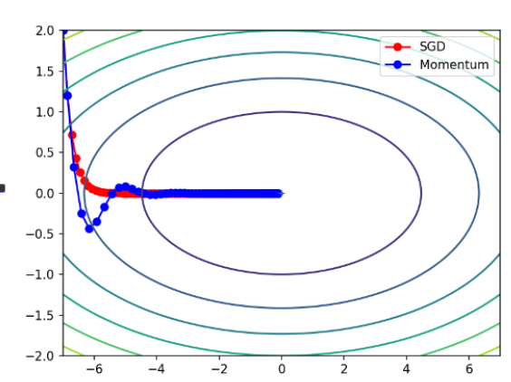
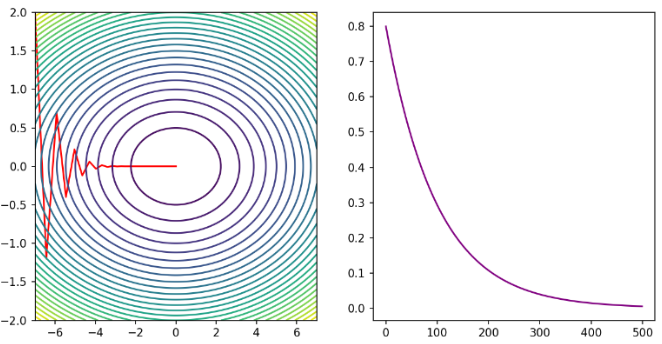

# Pytorch 

## Pytorch 基础

### 1. 什么是Pytorch

PyTorch是一个开源的Python机器学习库，基于Torch库（一个有大量机器学习算法支持的科学计算框架，有着与Numpy类似的张量（Tensor）操作，采用的编程语言是Lua），底层由C++实现，应用于人工智能领域，如计算机视觉和自然语言处理。

(1) 类似于NumPy的张量计算，能在GPU或MPS等硬件加速器上加速。

(2) 基于带自动微分系统的深度神经网络。

### 2. Tensor 的创建
##### 2.1 按内容创建

```python
# 直接创建标量
tensor1 = torch.tensor(10.0)
print(tensor1)
print(tensor1.size()) 
print(tensor1.dtype) 

# 根据list创建张量 -- 一维数组
tensor2 = torch.tensor([i for i in range(10)])
print(tensor2)
print(tensor2.size()) 
print(tensor2.dtype) 

# 根据list创建张量 -- 二维数组
tensor3 = torch.tensor(np.array([[j for j in range(10)] for i in range(5)]))
print(tensor3)
print(tensor3.size()) 
print(tensor3.dtype) 
```

##### 2.2 创建指定形状的张量

此时，调用的方法是torch.Tensor(size),torch.Tensor也可以按内容创建张量，但与torch.tensor不同，torch.Tensor默认数据类型为float32

```python
tensor = torch.Tensor(3, 2, 4)
print(tensor.size())
print(tensor.shape)
print(tensor.dtype)
```

##### 2.3 指定类型创建

可以通过torch.IntTensor()、torch.FloatTensor()、torch.DoubleTensor()等方法指定tensor的数据类型。或者是通过torch.tensor()方法指定数据类型dtype。

对于Tensor，有long, int, short, byte, double, float, half, bool

对于tensor，有int64, int32, int16, uint8（无符号）, float64, float32, float16, bool

```python
# int(32)
tensor1 = torch.tensor([0 for i in range(10)], dtype=torch.int32)
tensor2 = torch.IntTensor(10)
print(tensor1)
print(tensor2)

# long
tensor1 = torch.tensor([i for i in range(5)], dtype=torch.int64)
tensor2 = torch.LongTensor(10)
print(tensor1)
print(tensor2)

# double
tensor1 = torch.tensor([1, 2, 3], dtype=torch.float16)
tensor2 = torch.HalfTensor(3, 4)
print(tensor1)
print(tensor2) 
```

##### 2.4 按照区间创建一维张量

```python
# torch.arange(start, end, step) 前闭后开
tensor1 = torch.arange(10, 30, 2)
tensor2 = torch.arange(6)
 
# torch.linspace(start, end, num) 前闭后闭
tensor3 = torch.linspace(10, 30, 5)

# torch.logspace(start, end, steps, base=10.0, *, out=None, dtype=None, layout=torch.strided, device=None, requires_grad=False)
tensor4 = torch.logspace(10, 30, 5, base=2)
print(tensor4)
```

##### 2.5 按数值填充创建张量

```python
# torch.zeros(size)
tensor = torch.zeros(3, 4)
# torch.ones(size)
tensor = torch.ones(3, 4)   
# torch.full(size, value)
tensor = torch.full((3, 4), 5)
# torch.empty(size)
tensor_empyt = torch.empty(3, 4)
# torch.zeros_like(tensor)
tensor_zeros_like = torch.zeros_like(tensor)
# torch.ones_like(tensor)
tensor_ones_like = torch.ones_like(tensor)
# torch.full_like(size, value)
tensor_full_like = torch.full_like(tensor, 666)
# torch.empty_like(tensor)
tensor_empty_like = torch.empty_like(tensor)

# torch.eye(size) 生成单位矩阵
tensor = torch.eye(3)

		
```

##### 2.6 按随机值创建张量

1）torch.rand(size)创建在 \[0,1)上均匀分布的，指定形状的张量

2）torch.randint(low, high, size)创建在 \[low,high)上均匀分布的，指定形状的张量

3）torch.randn(size)创建标准正态分布的，指定形状的张量

4）torch.normal(mean,std,size)创建自定义正态分布的，指定形状的张量

5）torch.rand_like(input)创建在 \[0,1)上均匀分布的，与给定张量形状相同的张量

6）torch.randint_like(input, low, high)创建在 \[low,high)上均匀分布的，与给定张量形状相同的张量

7）torch.randn_like(input)创建标准正态分布的，与给定张量形状相同的张量

```python
# torch.rand(size)
tensor = torch.rand(3, 4) # x ~ U(0,1)

# torch.randn(size)
tensor = torch.randn(3, 4) # x ~ N(0,1)

# torch.randint(low, high, size) 前闭后开
tensor = torch.randint(0, 10, (10, 10)) # x ~ U(low,high) 

# torch.normal(mean, std, size) # x ~ N(mean,std)
tensor = torch.normal(*[0, 1], size=(3, 4))

# 其他就是三个与上面方法对应的like方法，注意：torch.normal没有like方法
```

##### 2.7 随机排列与随机种子

``` python
tensor = torch.randperm(10) # 先生成一个序列，再随机打乱
print(tensor)

# 查看随机数种子
print(torch.random.initial_seed())
# 设置随机数种子
torch.manual_seed(42)
```
### 3. Tensor 的转换

##### 3.1 张量的类型转换（不是原地操作，而是开辟新的内存空间）

1）Tensor.type(torch.dtype)

```python
tensor = torch.tensor([1, 2, 3, 4, 5, 6, 7, 8, 9, 10])
print(tensor.dtype)
tensor = tensor.type(torch.float32)
print(tensor.dtype)
```

2）Tensor.xxx类型().. or Tensor.to(xxx类型)

```python
tensor = torch.Tensor(3, 4) 
# 两种转换方式
tensor1 = tensor.to(torch.float64)
tensor2 = tensor.to(torch.int32)
tensor3 = tensor.short()
# 输出结果
print(tensor.dtype)
print(tensor1.dtype)
print(tensor2.dtype)
print(tensor3.dtype)
```
##### 3.2 Tensor 与 Ndarray 的转换

1）Tensor 转 Ndarray $\to$ Tensor.numpy（）注：该方法生成的 Ndarray 与 原始 Tensor 共享同一块地址空间

```python
# 设置打印方式---和numpy完全一样
np.set_printoptions(precision=6)
torch.set_printoptions(precision=6)
# tensor 转为 numpy tensor.numpy()  
tensor = torch.randn(3, 3)
arr = tensor.numpy()
print(tensor) 
arr[0, :] = -1.0
print(arr)
print(tensor)


# 避免共享同一内存空间
tensor = torch.randn(2, 3)
arr = tensor.numpy().copy()

print(tensor)
arr[0, 0] = 0
print(tensor)
```

2）torch.from_numpy(array) 将 numpy 数组转换成 Tensor

```python
arr = np.array([[j * 1.0 for j in range(5)] for i in range(3)])
# 共享内存，如果想不共享内存的话，可以用torch.tensor(array)
tensor = torch.from_numpy(arr)
tensor_t = torch.tensor(arr)
arr[:, 0] = 666.666

print(tensor_t)
print(tensor)
```
##### 3.3 Tensor 转为标量

当 Tensor 只有一个元素时，可以用 Tensor.item() 将它转为标量

```python
# 当tensor只有一个元素时，Tensor.item()可以提取改数值
print(torch.randn(1).item())  
```
##### 3.4 Tensor 转为转秩

```python
# 1.如果只对最后二维转秩，也就是对矩阵转秩，直接x.mT即可
tensor1.mT
# 2.自由的转秩两维
tensor1.transpose(dim1, dim2)
# 3.重新排列所有维度
tensor1.permute(dim1, dim1, ... , dimn)
```
### 4. Tensor 之间的运算

张量之间的大部分运算都有三个，如 +、Tensor.add()、Tensor.add_()，当然，有些运算没有重载运算符，比如 Tensor.log()、Tensor.exp()

其中、带下划线的代表原地操作，也就是节省内存，对于基本运算，等价于 x += y （不开辟新的内存，直接把结果放到 x 上）

#### 4.1 基本运算

##### 1. 四则运算

+, -, *, / 加减乘除，不改变原数据

t.add(), t.sub(), t.mul(), t.div() 加减乘除，不改变原数据

t.add_(), t.sub_(), t.mul_(), t.div_() 加减乘除，改变原数据

##### 2. -、neg()、neg_()

```python
tensor1 = torch.tensor([1, 2, 3])
print(-tensor1)
print()

print(tensor1.neg())
print(tensor1)
print()

print(tensor1.neg_())
print(tensor1)
```

##### 3. **、pow()、pow_()

```python
tensor = torch.tensor([1, 2, 3], dtype=torch.float32)
print(tensor**2)

print(tensor.pow(2))
print(tensor)

print(tensor.pow_(2))
print(tensor)
```

##### 4. sqrt()、sqrt_()

```python
print(tensor.sqrt())
print(tensor.sqrt_())
```

##### 5. 其他运算

log(), log_()

exp(), exp_()

#### 4.2 **哈达玛积 t1 \* t2 | t1.mul(t2)**

```python
# 张量的对应位置元素相乘，进行计算的张量维度相同
tensor1 = torch.tensor([[1, 3], [2, 4]])
tensor2 = torch.tensor([[2, 4], [1, 3]])
print(tensor1.mul(tensor2))
```

#### 4.3 张量乘法

mm()严格用于二维矩阵相乘。

@、matmul()支持多维张量，按最后两个维度做矩阵乘法，其他维度相同，或者至少一个张量对应维度为1，广播后进行运算。

```python
tensor1 = torch.randn(2, 2, 3, 3)
tensor2 = torch.randn(2, 2, 3, 10)
t = tensor1 @ tensor2
print(t.size())
```

### 5. Tensor 的一些统计方法

1) sum()求和

2) mean()求均值

3) max()/min()求最大/最小值及其索引

4) argmax()/argmin()求最大值/最小值的索引

5) std()求标准差

6) unique()去重

7) sort()排序

注：这写方法搞清楚维度 dim 的影响即可，非常简单。
### 6. Tensor 的索引操作

##### 6.1 简单索引

也就是直接给个坐标就完事了。

```python
# 1. 简单索引  直接给坐标
print(tensor1[1, 2, 3])
```

##### 6.2 范围索引

以三维张量举例,其他维度一样 t[st:ed:step, st:ed:step, st:ed:step]， tensor要求步长必须大于0, 而numpy则没有限制

```python
print(tensor1[:, :, 0:2])
print(tensor1[0, ::2, :]) 
```

#####  6.3 列表索引

1）各维度索引列表长度必须一致，实现一对一元素选择

```python
print(tensor1[[0, 1, 2], [1, 2, 3], [1, 2, 3]])
print(tensor1[[0, 1, 2], [0, 1, 2]])
```

2）**列表嵌套索引**：支持广播机制，内层列表可实现一对多映射关系

```python
# 列表的嵌套 : 不嵌套是一对一, 嵌套就是 一对多
print(tensor1[[[0], [1]], [1, 2]])
```

##### 6.4 布尔索引

布尔索引 : 用条件判断表达式,生成一个高维布尔数组,再把这个高维布尔数组作为索引,返回满足条件的元素

1）选择某些行

```python
# 选取符合条件的某些行:比如说首元素大于5
mask = tensor1[:, :, 0] > 5			
print(tensor1[mask])
```

2）选择某些列

```python
# 选择所有列的首元素小于3的列
mask = tensor1[:,0,:] < 3 # 当前mask是(3, 4), 而tensor1是(3, 5, 4),所以不能直接应用

# 先把 tensor1 转秩为 (3, 4, 5), 然后再应用
tensor2 = tensor1.mT
print(tensor2[mask].mT)
```

3）选择某些矩阵

```python
# 选取符合条件的矩阵
# 比如当前要选择的矩阵是(1, 2) > 5
mask = tensor1[:, 1, 2] > 5
print(mask)
print(tensor1[mask])
```

4）选择某些元素

```python
mask = tensor1 > 5
print(tensor1[mask])
```

### 7. Tensor 的形状操作

##### 7.1 维度交换

1）Tensor.transpose()交换两个维度  注意：在numpy中，transpose就是permute

```python
print(tensor.transpose(0,1).shape)
```

2）Tensor.permute

```python
tensor = torch.rand(3, 4, 5)
print(tensor.permute(2, 1, 0).shape)
```

3）Tensor.mT：直接交换矩阵的维度

##### 7.2 Tensor 的形状转换（array的Reshape)

1）Tensor.reshape(size) `reshape` 并不总是开辟额外内存，只有在必要时才会创建新的内存副本。

```python
# reshape
tensor = torch.randint(1, 10, (3, 5, 4))
print(tensor.reshape(3, -1))
```

2）Tensor.view(size) 需要内存连续。共享内存

```python
# view
tensor.is_contiguous()
tensor.view(-1, 3)
```


##### 7.3 增加或删除维度

1）Tensor.unsqueeze(dim) 增加维度

```python
# 原张量形状: torch.Size([3, 4])
tensor = torch.rand(3, 4)
t1 = tensor.unsqueeze(0)  # 形状变为: torch.Size([1, 3, 4])
print(t1.shape)
t2 = tensor.unsqueeze(1)  # 形状变为: torch.Size([3, 1, 4])
print(t2.shape)
t3 = tensor.unsqueeze(-1) # 形状变为: torch.Size([3, 4, 1])
print(t3.shape)
```

2）Tensor.squeeze(dim=None) 删除张量中大小为1的维度

说明：当指定 `dim` 参数时，只删除指定维度（如果该维度大小为1）当不指定 `dim` 参数时，删除所有大小为1的维度

```python
# 原张量形状: torch.Size([1, 3, 1, 4])
tensor = torch.rand(1, 3, 1, 4)

t1 = tensor.squeeze()      # 删除所有大小为1的维度，形状变为: torch.Size([3, 4])
print(t1.shape)
t2 = tensor.squeeze(0)     # 删除第0维，形状变为: torch.Size([3, 1, 4])
print(t2.shape)
t3 = tensor.squeeze(2)     # 删除第2维，形状变为: torch.Size([1, 3, 4])
print(t3.shape)
t4 = tensor.squeeze(-2)    # 删除倒数第2维，形状变为: torch.Size([1, 3, 4])
print(t4.shape)
```


### 8. Tensor 的拼接操作

##### 8.1 torch.cat(tensors, dim=0, *, out=None)

- 沿指定维度连接多个张量
- 除连接维度外，其他维度的大小必须相同

```python
 # torch.cat
tensor1 = torch.randint(1, 10, (2, 3, 5))
tensor2 = torch.randint(1, 10, (2, 2, 5))
t = torch.cat([tensor1, tensor2], dim=1)
t
```


##### 8.2 torch.stack(tensors, dim=0, *, out=None) 

### 9. Pytorch 的自动微分引擎：torch.autograd

训练神经网络时，框架会根据设计好的模型构建一个计算图（computational graph），来跟踪计算是哪些数据通过哪些操作组合起来产生输出，并通过反向传播算法来根据给定参数的损失函数的梯度调整参数（模型权重）。

PyTorch具有一个内置的微分引擎torch.autograd以支持计算图的梯度自动计算。

考虑最简单的单层神经网络，具有输入x、参数w、偏置b以及损失函数：

<p align='center'>
    
</p>

```python
import torch

# 定义输入数据和真实标签
x = torch.tensor([[1.0]])  # 输入数据
y_true = torch.tensor([[2.0]])  # 真实标签

# 初始化模型参数，requires_grad=True表示需要计算梯度
w = torch.randn(1, 1, requires_grad=True)  # 权重
b = torch.randn(1, requires_grad=True)  # 偏置

# 前向传播：计算 z = x * w + b
z = x * w + b
print(z)  # 输出带有grad_fn的计算结果

# 定义损失函数并计算损失值
loss = torch.nn.MSELoss()  # 均方误差损失函数
loss_value = loss(z, y_true)  # 计算预测值z与真实值y_true的损失
print(loss_value)  # 输出损失值

# 反向传播：自动计算梯度
loss_value.backward()

# 输出参数的梯度
print(w.grad)  # 权重的梯度
print(b.grad)  # 偏置的梯度

# 检查张量是否为叶子节点
print(x.is_leaf)  # True: 用户创建的张量
print(y_true.is_leaf)  # True: 用户创建的张量
print(z.is_leaf)  # False: 计算得到的中间变量
print(loss_value.is_leaf)  # False: 计算得到的中间变量
```

自动微分的关键就是记录节点的数据与运算。数据记录在张量的data属性中，计算记录在张量的grad_fn属性中。

计算图根据搭建方式可分为静态图和动态图，PyTorch是动态图机制，在计算的过程中逐步搭建计算图，同时对每个Tensor都存储grad_fn供自动微分使用。

**若设置张量参数requires_grad=True，则PyTorch会追踪所有基于该张量的操作**，并在反向传播时计算其梯度。依赖于叶子节点的节点，requires_grad默认为True。当计算到根节点后，在根节点调用backward()方法即可反向传播计算计算图中所有节点的梯度。

**非叶子节点的梯度在反向传播之后会被释放掉（除非设置参数retain_grad=True）**。而叶子节点的梯度在反向传播之后会保留（累积）。通常需要使用**optimizer.zero_grad()**清零参数的梯度。

### 10. Tensor 与计算图的分离

有时我们希望将某些计算移动到计算图之外，可以使用**Tensor.detach()**返回一个新的变量，该**变量与原变量具有相同的值**（共享内存），但丢失计算图中如何计算原变量的信息。换句话说，梯度不会在该变量处继续向下传播。

```python
# 当我们需要对计算图中的某些张量进行独立处理，同时又不希望影响原有计算图结构时，可以采用以下几种解决方案：
x = torch.rand(2, 2, requires_grad=True)
y = x.detach()
print(x)
print(y)
# 尽管 x 与 y 的 id 不同，但他们的数据是共享的。 
print(x.untyped_storage().data_ptr())
print(y.untyped_storage().data_ptr())   
```

 	如果在一个代码段中都不希望对计算图产生影响，直接用：with torch.no_grad() 上下文管理器即可。

当然，最简单粗暴的方式就是tensor.clone()，然后对副本进行操作。

## Pytorch 进阶

### 1 激活函数

```python
# 在pytorch中，能用到的激活函数几乎都被实现了，我们可以直接调用他们。

torch.sigmoid(input)
torch.tanh(input)
torch.relu(input, inplace=False)
torch.relu6(input, inplace=False)
torch.leaky_relu(input, negative_slope=0.01, inplace=False)
torch.prelu(input, weight)
torch.elu(input, alpha=1.0, inplace=False)
torch.selu(input, inplace=False)
torch.gelu(input, approximate='none')
torch.swish(input)
torch.mish(input)
torch.logsigmoid(input)
torch.softplus(input, beta=1, threshold=20)
torch.softmax(input, dim)
torch.log_softmax(input, dim)
torch.hardsigmoid(input, inplace=False)
torch.hardswish(input, inplace=False)
torch.hardtanh(input, min_val=-1.0, max_val=1.0, inplace=False)
```

### 2 一些神经网络层

##### 1. nn.Linear 类

```python
torch.nn.Linear(in_features, out_features, bias=True, device=None, dtype=None)

# 重要属性
linear.weight
linear.bias
```

##### x. nn.Dropout 类

```python
# 这是所有Dropout的父类
class _DropoutNd(Module):
    __constants__ = ["p", "inplace"]
    p: float
    inplace: bool

    def __init__(self, p: float = 0.5, inplace: bool = False) -> None:
        super().__init__()
        if p < 0 or p > 1:
            raise ValueError(
                f"dropout probability has to be between 0 and 1, but got {p}"
            )
        self.p = p
        self.inplace = inplace

    def extra_repr(self) -> str:
        return f"p={self.p}, inplace={self.inplace}"

# 实例化dropout实例
dropout = nn.Dropout(p, inplace)

# 调用forward
dropout(input)
```

### 3 参数的初始化

参数的初始化：可以把对应参数的data拿出来直接改，或者用nn.init()去修改。具体初始化方法如下：

##### 1. 常数初始化

```python
# 常数初始化
# 方法一，直接全部置为0 nn.init.zeros_(input)
nn.init.zeros_(linear1.weight)
print(linear1.weight)
# 方法二，可以置为任意常数 nn.init.constant_(input, value)
nn.init.constant_(linear1.weight,0)
print(linear1.weight)
```

##### 2. 秩初始化

```python
nn.init.eye_(linear.weight)
```

##### 3. 随机初始化

```python
# 正态分布初始化
nn.init.normal_(linear1.weight, mean=0, std=0.01)
print(linear1.weight)

# 均匀分布初始化
nn.init.uniform_(linear1.weight, -1, 1)
```

##### 4. Xavier初始（当后面的激活函数是：Sigmoid, Tanh 这类 S 型曲线）

```python
# Xavier 初始化
nn.init.xavier_normal_(linear1.weight)
print(linear1.weight)
nn.init.xavier_uniform_(linear1.weight)
print(linear1.weight)
```

##### 5. He 初始化（KaiMing 初始化，主要用到后面是Relu	这类激活函数的Linear）

```python
# KaiMing 初始化
nn.init.kaiming_normal_(linear1.weight)
print(linear1.weight)

nn.init.kaiming_uniform_(linear1.weight)
print(linear1.weight)
```

### 4 搭建神经网络

##### 1. 自定义模型

在神经网络框架中，由多个层组成的组件称之为 **模块（Module）**。

在PyTorch中模型就是一个**Module，各网络层、模块也是Module**。Module是所有神经网络的基类。

在定义一个Module时，我们需要继承torch.nn.Module并主要实现两个方法：

 	\__init__：定义网络各层的结构，并初始化参数。

forward：根据输入进行前向传播，并返回输出。计算其输出关于输入的梯度，可通过其反向传播函数进行访问（通常自动发生）。forward方法是每次调用的具体实现。

```python
class MyModel(nn.Module):
    
    def __init__(self):
        super().__init__()
        # 定义网络结构
        self.linear1 = nn.Linear(3, 4)
        self.linear2 = nn.Linear(4, 4)
        self.linear3 = nn.Linear(4, 2)

        # 初始化网络参数
        nn.init.xavier_normal_(self.linear1.weight)
        nn.init.kaiming_normal_(self.linear2.weight)
    

    def forward(self, x):
        z1 = torch.tanh(self.linear1(x))
        z2 = torch.relu(self.linear2(z1))
        return torch.softmax(self.linear3(z2), dim=1)
```

##### 2. 查看模型参数

```python
# 查看模型参数
# 最简单的方法 直接从对应的层中查看
print(net.linear1.weight)

# 第二种，调用model.parameters()获取不同层的参数，一般用net.named_parameters()，可以获得当前层的名字
for name, param in net.named_parameters():
    print(name, '\n', param.data)

# 第三种，去得到保存参数的dict
d = net.state_dict()
for k, v in d.items():
    print(k, v)
```

##### 3. 查看模型结构和参数数量

第三方库：torchsummary.summary(net, input_size, batch_size, device)

```python
# 查看模型结构与参数数量
from torchsummary import summary
summary(net, (3,), batch_size=10, device='cpu')
```


##### 4. device 的设置

不用创建一层指定一层，而是在创建模型时直接给一个 device 值就可以了，或者创建完以后用 net.to("cuda")

```python
# 在创建张量的时候指定设备
input = torch.randn(1, 3, 224, 224, device='cuda')
print(input.device)

# 通过 tensor.to 去将张量换到 cuda 上
tensor.to(device='cuda')
```


##### 5. 使用 Sequential 构建模型 非常好使！！！！

可以通过**torch.nn.Sequential**来构建模型，将**各层按顺序**传入。**注：此时把激活函数也当成了一层，所以要调nn.Tanh，而不再是传统前向传播直接 torch.xxx 函数这样去计算了。**

Sequential类使模型构造变得简单，不必自定义类就可以组合新的架构。然而并不是所有的架构都是简单的顺序架构，当需要更强的灵活性时还是需要自定义模型。

```python
# 使用sequential去创建模型
model = nn.Sequential(
    nn.Linear(3, 4),
    nn.Tanh(),
    nn.Linear(4, 4),
    nn.ReLU(),
    nn.Linear(4, 2),
    nn.Softmax(dim=1)
)
print(model)
```

`model.apply()` 是PyTorch中 `nn.Module` 类的一个重要方法，用于对模型中的**每个模块递归地应用一个函数**。

```  
# 参数初始化
def init_weights(m):
    if type(m) == nn.Linear:
        torch.nn.init.xavier_uniform_(m.weight)
        m.bias.data.fill_(0.01)
        
model.apply(init_weights) 
```

### 5 损失函数

##### 1. BCE

二分类任务常用二元交叉熵损失函数（Binary Cross-Entropy Loss）

注：这里的 input 和 target 维度一定要一样，如果是（10，3），那么就代表着有10个样本，要对每个样本做三个并行的二分类任务，也就是一个样本的 targer 如果是（1，1，0），就代表这个样本是类别0，类别1，不是类别2。


$$
L = -\frac{1}{n} \sum_{i=1}^{n} \left( y_i \log \hat{y}_i + (1 - y_i) \log(1 - \hat{y}_i) \right)
$$

```python
# pytorch代码：
loss = nn.BCELoss()
loss_val = loss(y_hat, t)
```

##### 2. 多分类任务损失函数

多分类任务常用多类交叉熵损失函数（Categorical Cross-Entropy Loss）。它是对每个类别的预测概率与真实标签之间差异的加权平均。

$$
\text{CE}(y, \hat{y}) = - \sum_{i=1}^{C} y_i \log(\hat{y}_i) \\
\mathcal{L}_{\text{CE}} = - \log(\hat{y}_c)
$$

在PyTorch中可使用torch.nn.CrossEntropyLoss 实现：(自动做了Softmax，其次，target可以是类别索引，类型必须为long，还可以是独热编码，也就是相对于的概率分布)

```python
import torch
import torch.nn as nn

# 真实值为标签
target = torch.tensor([1, 0, 3, 2, 5, 4])  # 真实值
input = torch.randn((6, 8))  # 预测值
loss = nn.CrossEntropyLoss()  # 实例化损失函数
print(loss(input, target))

# 真实值为概率
target = torch.randn(6, 8).softmax(dim=1)  # 真实值
input = torch.randn((6, 8))  # 预测值
loss = nn.CrossEntropyLoss()  # 实例化损失函数
print(loss(input, target))
```


##### 3. MAE

平均绝对误差（Mean Absolute Error，MAE），也称L1 Loss，L2 就是取了个平方项，故省略不写。

$$
\text{MAE} = \frac{1}{n} \sum_{i=1}^{n} |y_i - \hat{y}_i|
$$

```python
l1 = nn.L1Loss()
l2 = nn.MSELoss()
```

 

### 6 优化算法

##### 1. Momentum

而 Momentum（动量法）会保存历史梯度并给予一定的权重，使其也参与到参数更新中：

$$
v \leftarrow \alpha v - \eta \nabla\\
W \leftarrow W + v
$$

动量法演示如下：通过动量法去找到函数 f(x) 的最小值，效果如下图：

<p align='center'>
    
</p>

##### 2. 学习率衰减

**1）等间隔衰减** 

```python
torch.optim.lr_scheduler.StepLR(optimizer, step_size, gamma=0.1, last_epoch=-1, verbose=False)
# 用法
# 定义学习率衰减
scheduler = optim.lr_scheduler.StepLR(optimizer, step_size=step_size, gamma=gamma)
# 更新学习率
scheduler.step()
```

| 参数名          | 类型                      | 含义                                           |
| ------------ | ----------------------- | -------------------------------------------- |
| `optimizer`  | `torch.optim.Optimizer` | 要调整学习率的优化器对象（例如 `optim.SGD`、`optim.Adam` 等）。 |
| `step_size`  | `int`                   | 每隔多少个 **epoch** 下降一次学习率。                     |
| `gamma`      | `float`, 默认 `0.1`       | 学习率衰减因子（乘法因子）。即：`new_lr = old_lr * gamma`。   |
| `last_epoch` | `int`, 默认 `-1`          | 上一个 epoch 的编号（用于从中断处恢复训练时指定）。                |
| `verbose`    | `bool`, 默认 `False`      | 若为 `True`，每次更新学习率时会打印日志信息。                   |

<p align='center'>
    
</p>

2）指定间隔衰减

```python
torch.optim.lr_scheduler.MultiStepLR(optimizer, milestones, gamma)
# milestones 是一个可迭代容器，存放要在那些 epoch 衰减学习率
```

<p align='center'>
    
</p>


3）指数衰减

```python
scheduler_expo = optim.lr_scheduler.ExponentialLR(optimizer, 0.99)
```

<p align='center'>
    
</p>

##### 3. Adagrad

```python
optimizer = optim.Adagrad([X], lr=lr)
```

##### 4. RMSprop

相较于 Adagrad，RMSProp 在动态调整学习率的方式上进行了改进。在 Adagrad 中，学习率会被过去所有梯度平方的累积和所除，以此实现自适应调整。梯度平方和越大，说明该参数已经被充分学习，因而其学习率会逐渐减小。然而，这种累积方式会导致在训练后期学习率趋近于零，从而影响模型的进一步收敛。

为了解决这一问题，RMSProp 引入了**指数加权移动平均（Exponential Moving Average, EMA）\**机制，用于计算梯度平方的加权平均值，从而\**逐步遗忘旧梯度信息**，保持学习率在一个合适的动态范围内。 其核心思想可表示为：

$$
h \leftarrow ah + (1-a)\nabla^2
\\
W \leftarrow W - \eta \frac{1}{\sqrt{h}} \nabla
$$

其中，$\alpha$ 表示衰减系数，用于控制历史梯度的“遗忘速度”。

```python
optimizer = optim.RMSprop([X], lr=lr, alpha=0.2)
```


##### 5. Adam
```
pass
```

## CNN

### 1 CNN概述

卷积神经网络（Convolutional Neural Network，CNN）常被用于图像识别、语音识别等各种场合。它在计算机视觉领域表现尤为出色，广泛应用于图像分类、目标检测、图像分割等任务。

卷积神经网络的灵感来自于动物视觉皮层组织的神经连接方式，单个神经元只对有限区域内的刺激作出反应，不同神经元的感知区域相互重叠从而覆盖整个视野。

CNN中新出现了卷积层（Convolution层）和池化层（Pooling层），下图是一个CNN的结构：

<p align='center'>
    
</p>

### 2 输出维度计算公式

假设输入数据形状为 $(H, W)$，卷积核大小为 $(FH, FW)$，填充（padding）为 $P$，步幅（stride）为 $S$，输出数据形状为 $(OH, OW)$，则可得：

$$
OH = \frac{H + 2P - FH}{S} + 1
$$

$$
OW = \frac{W + 2P - FW}{S} + 1
$$

---

#### 📌 示例

例如，对于形状为 $(4, 4)$ 的输入数据，应用幅度为 1 的填充（即 $P = 1$），并使用步幅 $S = 3$，卷积核大小为 $(3, 3)$ 的卷积运算：

$$
OH = OW = \frac{4 + 2 \times 1 - 3}{3} + 1 = \frac{3}{3} + 1 = 2
$$

得到形状为 $(2, 2)$ 的输出数据。

---

#### ⚠️ 注意事项

当输出大小无法整除时，PyTorch 卷积层会自动向下取整，输出整数尺寸，舍弃无法覆盖完整卷积核的输入部分。

✅ 也就是说：实际计算中使用的是 **地板除法**（floor division），即：

$$
OH = \left\lfloor \frac{H + 2P - FH}{S} \right\rfloor + 1
$$

---

#### 💡 小贴士

| 参数       | 含义            |
| -------- | ------------- |
| $H, W$   | 输入高度、宽度       |
| $FH, FW$ | 卷积核高度、宽度      |
| $P$      | 填充大小（padding） |
| $S$      | 步幅（stride）    |
| $OH, OW$ | 输出高度、宽度       |

### 3 Pytorch 中的 CNN

#### 1、卷积层

在深度学习框架中，二维卷积层（如 PyTorch 的 `Conv2d`）的初始化函数通常定义了卷积的基本参数。以下是其标准函数签名及参数说明。

**✅ PyTorch 风格函数签名**

```python
torch.nn.Conv2d(
    in_channels,      # 输入通道数（C_in）
    out_channels,     # 输出通道数（C_out）
    kernel_size,      # 卷积核大小（FH, FW）
    stride=1,         # 步幅（S）
    padding=0,        # 填充大小（P）
    dilation=1,       # 膨胀率（空洞卷积）
    groups=1,         # 分组卷积参数
    bias=True,        # 是否使用偏置项
    padding_mode='zeros'
)
```

#### 2、池化层

池化层用于对特征图进行下采样（downsampling），降低空间维度（高度和宽度），减少计算量并增强特征的尺度不变性。常见类型有最大池化（Max Pooling）和平均池化（Average Pooling）。

```python
torch.nn.MaxPool2d(
    kernel_size,      # 池化窗口大小 (H_k, W_k)
    stride=None,      # 步幅，若为 None 则默认等于 kernel_size
    padding=0,        # 填充大小
    dilation=1,       # 膨胀率（通常用于空洞池化，较少使用）
    return_indices=False,  # 是否返回最大值索引（用于 MaxUnpool）
    ceil_mode=False   # 是否使用向上取整模式
)	
```

$$
H_{out} = \left\lfloor \frac{H_{in} + 2p - d \times (k - 1) - 1}{s} + 1 \right\rfloor
$$

$$
W_{out} = \left\lfloor \frac{W_{in} + 2p - d \times (k - 1) - 1}{s} + 1 \right\rfloor
$$


当 d = 1时，也就是大部分情况：

$$
H_{out} = \left\lfloor \frac{H_{in} + 2p - k}{s} \right\rfloor + 1
$$


## NLP 处理

### 1. 词嵌入层

#### 1.1 什么是词嵌入

然语言是由文字构成的，而语言的含义是由单词构成的。即单词是含义的最小单位。因此为了让计算机理解自然语言，首先要让它理解单词含义。

词向量是用于表示单词意义的向量，也可以看作词的特征向量。将词映射到向量的技术称为 **词嵌入**（Word Embedding）。  

还有一种使用向量表示单词意义的方式是独热向量，独热向量很容易构建，但它们通常不是一个好的选择。一个主要原因是独热向量不能准确表达不同词之间的相似度。比如使用余弦相似度 $\frac{x^{T}y}{||x||||y||}$ 来表示两个词之间的相似程度，由于任意两个不同词的独热向量之间的余弦相似度为0，所以独热向量不能编码词之间的相似性。另一个原因是随着词汇量的增大，独热向量表示的向量大小也会增大，在词汇量较大的情况下会消耗大量的存储资源与计算资源。

将词转换为词向量时：

1）首先需要对文本进行分词，再根据需要进行清洗和标准化。

2）构建词表（Vocabulary），每个词对应一个索引。

3）使用词嵌入矩阵将词索引转换为词向量。

#### 1.2 API 使用

可使用torch.nn.Embedding来初始化词嵌入矩阵：

```python
torch.nn.Embedding(num_embeddings, embedding_dim)
# num_embeddings:词的数量
# embedding_dim:词向量的维度
```

```python
text = "自然语言是由文字构成的，而语言的含义是由单词构成的。即单词是含义的最小单位。因此为了让计算机理解自然语言，首先要让它理解单词含义。"
original_words = jieba.lcut(text)
print(original_words)

# 自定义一组停用词
stopwords = {'的','，' ,'。', '是','而','由'}

# 过滤不需要的词和标点符合
words = []
for word in original_words:
    if word not in stopwords: words.append(word)
print(words)

# 构建词表
id2word = list(set(words))
print(id2word)

# 构建字典，记录wordtoid
word2id = {}
for i, word in enumerate(id2word):
    word2id[word] = i
print(word2id)

# 构建一个嵌入层
embed = nn.Embedding(len(id2word), 5)

# 前向传播，传入索引号，得到词向量
for k,v in word2id.items():
    word_emd = embed(torch.tensor(v))
    print(f"{v:>2}:{k:8}\t{word_emd.detach().numpy()}")
```


### 2. RNN

##### 2.1 RNN 介绍

文本是连续的，具有序列特性。如果其序列被重排可能就会失去原有的意义。比如“狗咬人”这段文本具有序列关系，如果文字的序列颠倒可能就会表达不同的意思。

目前我们接触的神经网络都是前馈型神经网络。前馈（feedforward）是指网络的传播方向是单向的。具体地说，将输入信号传给下一层，下一层接收到信号后传给下下一层，然后再传给下下下一层…像这样，信号仅在一个方向上传播。虽然前馈网络结构简单、易于理解，并且可以应用于许多任务中。不过，这种网络存在一个大问题，就是不能很好地处理时间序列数据。更确切地说，单纯的前馈网络无法充分学习时序数据的性质。于是，循环神经网络（Recurrent Neural Network，RNN）应运而生。

RNN层具有环路，通过环路数据可以在层内循环。向时序数据输入层中$x0,x1...xt$，相应的会输出$h0,h1...ht$

<p align='center'>
    
</p>

由图可知，各个时刻的RNN层接收传给该层的输入 $x_t$ 和前一个时刻RNN层的输出 $x_{t-1}$ 据此计算当前时刻RNN层的输出 $h_t$ ：


$$
h_t = tanh(h_{t-1}W_h + x_tW_x + b)
$$


##### 2.2 API 介绍

可使用torch.nn.RNN来初始化RNN层：

初始化 rnn 层

```python
rnn = torch.nn.RNN(input_size, hidden_size, num_layers)
# input_size:输入数据的特征数量
# hidden_size:隐藏状态的特征数量
# num_layers:隐藏层的层数，如果设置多个层，前一个隐藏层的输出作为下一个隐藏层的输入
```

调用时需要传入2个参数：

```python
调用时需要传入2个参数：
output, hn = rnn(input, hx)
# input:输入数据[seq_len序列长度, batch_size批量大小, input_size]
# hx:初始隐状态[num_layers, batch_size, hidden_size]
# output:输出数据[seq_len, batch_size, hidden_size]
# hn:隐状态[num_layers, batch_size, hidden_size]
```

 
