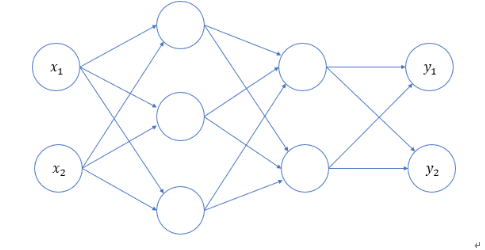
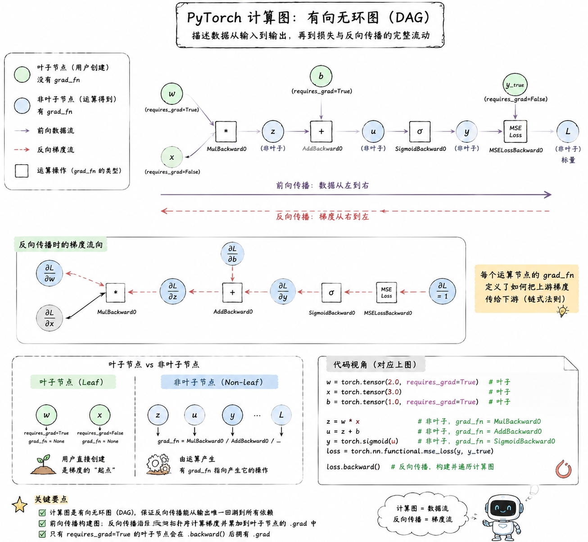
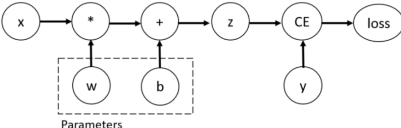
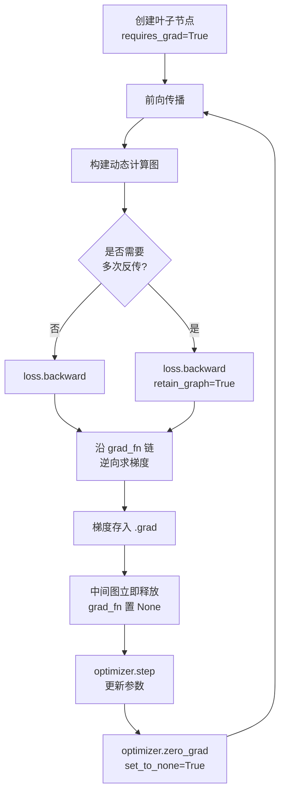
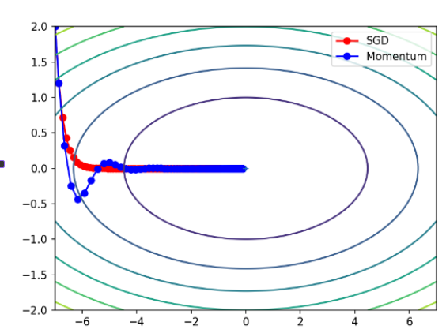
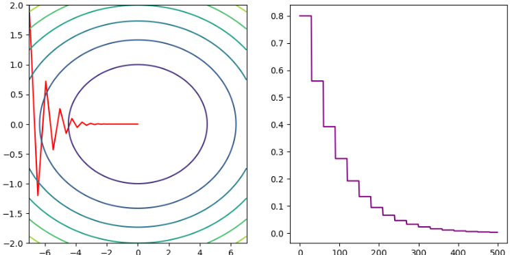
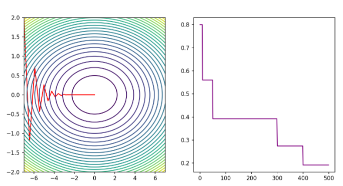
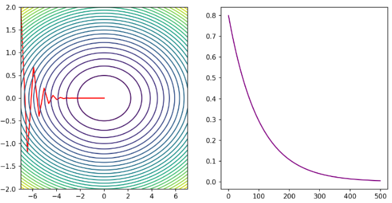
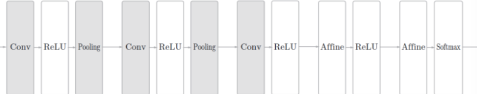

## 深度学习基础

### 1. 深度学习概述

#### 1.1 深度学习简介
深度学习作为机器学习的一个分支，专注于使用**多层神经网络（深度神经网络）**来建模和解决问题。

人脑中有很多相互连接的神经元，当大脑处理信息时，这些神经元之间通过电信号和化学物质相互作用，在大脑的不同区域之间传递信息。神经网络使用**人工神经元**模仿这种生物现象，这些人工神经元由称为**节点**的软件模块构成，使用数值计算来进行通信和传递信息。

!!! info "深度学习 vs 传统机器学习"
    深度学习能够**自动提取特征**，适合处理**非结构化数据**（图像、音频、文本等），而传统机器学习通常需要人工特征工程。

#### 1.2 深度学习的特点

- 使用多层神经网络，能够自动提取数据的多层次特征
- 适合处理非结构化数据，如图像、音频、文本等
- 依赖大量数据和计算资源，训练时间较长
- 模型复杂，通常被视为"黑箱"，解释性较差

---

### 2. 神经网络基础

#### 2.1 神经网络的构成

**人工神经网络**（Artificial Neural Network，ANN）简称**神经网络（NN）**，是一种模仿生物神经网络结构和功能的计算模型。大多数情况下人工神经网络能在外界信息的基础上改变内部结构，是一种**自适应系统**（adaptive system），通俗地讲就是具备学习功能。

人工神经网络中的神经元，一般可以对多个输入进行**加权求和**，再经过特定的**激活函数**转换后输出。

使用多个神经元就可以构建多层神经网络：

- 最左边的一列神经元都表示输入，称为**输入层**
- 最右边一列表示网络的输出，称为**输出层**
- 输入层与输出层之间的层统称为**中间层（隐藏层）**
- 相邻层的神经元相互连接（全连接），每个连接都会有一个**权重**
- 神经元中的信息逐层传递（称为**前向传播** forward），上一层神经元的输出作为下一层神经元的输入

#### 2.2 激活函数

> 激活函数是连接感知机和神经网络的桥梁。如果没有激活函数，整个神经网络等效于单层线性变换。**激活函数必须是非线性函数**，为神经网络引入非线性能力。

### 3. 神经网络的简单实现

#### 3.1 三层神经网络结构
以下图为模型，实现从输入到输出的**前向传播**：
<p align='center'>
	
</p>

#### 3.2 代码实现
使用 NumPy 实现三层神经网络的前向传播：

```python
import numpy as np
def sigmoid(x):
    return 1 / (1 + np.exp(-x))
def identity_function(x):
    return x
def init_network():
    """初始化网络参数"""
    network = {}
    network['W1'] = np.array([[0.1, 0.3, 0.5], [0.2, 0.4, 0.6]])
    network['b1'] = np.array([0.1, 0.2, 0.3])
    network['W2'] = np.array([[0.1, 0.4], [0.2, 0.5], [0.3, 0.6]])
    network['b2'] = np.array([0.1, 0.2])
    network['W3'] = np.array([[0.1, 0.3], [0.2, 0.4]])
    network['b3'] = np.array([0.1, 0.2])
    return network
def forward(network, x):
    """前向传播"""
    w1, w2, w3 = network['W1'], network['W2'], network['W3']
    b1, b2, b3 = network['b1'], network['b2'], network['b3']
    a1 = np.dot(x, w1) + b1
    z1 = sigmoid(a1)
    a2 = np.dot(z1, w2) + b2
    z2 = sigmoid(a2)
    a3 = np.dot(z2, w3) + b3
    y = identity_function(a3)
    return y
network = init_network()
x = np.array([1.0, 0.5])
y = forward(network, x)
print(y)

```

!!! tip "权重矩阵形状速查"
    对于 $N$ 个输入节点和 $M$ 个当前层节点，权重矩阵形状为 $N \times M$

## PyTorch

> 基于带自动微分系统的深度神经网络框架

### 1. 安装与导入
=== "pip"

    ```bash
    pip install torch torchvision torchaudio

    ```
=== "uv"

    ```bash
    uv add torch torchvision torchaudio

    ```
=== "gpu"

    ```toml title="pyproject.toml"
    [project]
    name = "nlp"
    version = "0.1.0"
    requires-python = ">=3.12"
    dependencies = [
        "torch",
        "torchvision",
        "torchaudio",
    ]

    [[tool.uv.index]]
    name = "pytorch-gpu"
    url = "https://download.pytorch.org/whl/cu126"
    explicit = true  # 关键：这确保只有明确指定该索引的包才去这里找

    # 强制指定这三个包去 pytorch-gpu 索引找（这步最关键）
    [tool.uv.sources]
    torch = { index = "pytorch-gpu" }
    torchvision = { index = "pytorch-gpu" }
    torchaudio = { index = "pytorch-gpu" }

    ```

!!! tip "GPU 支持"
    如需 CUDA 支持，请参考 [PyTorch 官方安装指南](https://pytorch.org/get-started/locally/) 选择对应版本，上面给出的 gpu 安装是通过 uv 安装，如果要通过 pip | conda，直接看官网给出的安装命令即可。

```python

# 验证安装是否成功
import torch
print(torch.__version__)  
print(torch.cuda.is_available())

# output
2.12.0+cu126
True

```

---

### 2. Tensor 基础

深度学习处理的数据（图像、文本、声音等）最终都要转换为数字。在 PyTorch 中，所有数据的存储与计算都依赖于 **张量（Tensor）**——NumPy 数组的升级版，既能存储多维数据，又支持 **GPU 加速**，是深度学习模型训练的基石。

!!! tip "Tensor vs NumPy"
    Tensor 在接口设计上大量借鉴了 NumPy，熟悉 NumPy 的用户可以快速上手。而 Tensor 独有的 GPU 加速和自动微分能力，使其成为深度学习场景下的首选数据结构。

!!! note "官方文档"
    详见 [PyTorch Tensor 文档](https://pytorch.org/docs/stable/tensors.html)

#### 2.1 创建张量

创建张量的方式与 NumPy 创建 ndarray 基本一致，主要分为以下几类：

##### 按内容创建

内容可以是一个标量、可以是一个 python 列表，也可以是一个 ndarray。

```python
torch.tensor(10.0)                    # 标量
torch.tensor([1, 2, 3])               # 一维
torch.tensor([[1, 2], [3, 4]])        # 二维

```

##### 指定形状创建

通过传入形状参数创建特定结构的张量，或基于已有张量创建同形状的张量。

```python

# 基本构造函数
torch.Tensor(3, 4)                   # 默认 float32，值为未初始化

# 特殊值张量
torch.zeros(3, 4)                    # 全 0
torch.ones(3, 4)                     # 全 1
torch.full((3, 4), 5)               # 指定值填充
torch.empty(3, 4)                    # 未初始化
torch.eye(3)                         # 单位矩阵

# 基于已有张量创建同形状张量
torch.zeros_like(t)                  # 同形状全 0
torch.ones_like(t)                   # 同形状全 1
torch.full_like(t, 5)               # 同形状指定值
torch.empty_like(t)                  # 同形状未初始化

```

##### 按区间创建

```python
torch.arange(start, end, step)        # [start, end)，步长
torch.linspace(start, end, num)       # [start, end]，等分 num 份
torch.logspace(start, end, num)       # [start, end]，按照对数去分 num 份

```

##### 随机值创建

| 方法 | 分布 | 说明 |
|------|------|------|
| `torch.rand(size)` | U(0,1) | 均匀分布 |
| `torch.randn(size)` | N(0,1) | 标准正态 |
| `torch.randint(low, high, size)` | U(low,high) | 离散均匀 |
| `torch.normal(mean, std, size)` | N(mean,std) | 自定义正态 |

```python
torch.rand(3, 4)                     # x ~ U(0,1)
torch.randn(3, 4)                    # x ~ N(0,1)
torch.randint(0, 10, (3, 4))         # x ~ U[0,10)
torch.normal(0, 1, size=(3, 4))      # x ~ N(0,1)

# 随机种子 & 随机排列
torch.manual_seed(42)
torch.randperm(10)                   # 0~9 随机排列

```

##### 指定数据类型

PyTorch 提供了两种指定数据类型的方式：通过 `dtype` 参数显式指定，或使用类型特定的构造函数别名。

```python

# 方式一：dtype 参数
torch.tensor([1, 2], dtype=torch.float32)
torch.tensor([1, 2], dtype=torch.int64)

# 方式二：类型构造函数
torch.FloatTensor(3, 4)              # float32
torch.DoubleTensor(3, 4)             # float64
torch.IntTensor(3, 4)                # int32
torch.LongTensor(3, 4)               # int64
torch.BoolTensor(3, 4)               # bool

```

#### 2.2 类型转换

类型转换主要有三种方式：`t.type()` 通用转换、`t.to()` 推荐写法、以及 `t.long()` / `t.int()` 等快捷方法。

!!! important "非原地操作"
    类型转换不会原地修改，而是返回新张量。

```python
nt = t.type(torch.float64)                # 通用转换
nt = t.to(torch.float64)                  # 推荐写法
t.float()                            # 快捷方法
t.long()                             # int64
t.int()                              # int32

```

#### 2.3 Tensor 与 NumPy 互转

Tensor 与 NumPy 之间可以相互转换：`.numpy()` 将 Tensor 转为 ndarray，`torch.from_numpy()` 或 `torch.tensor()` 将 ndarray 转为 Tensor，但两者内存行为不同（见下方警告）。

```python

# Tensor → NumPy（共享内存）
arr = t.numpy()

# 避免共享（拷贝）
arr = t.numpy().copy()

# NumPy → Tensor（共享内存）
t = torch.from_numpy(arr)

# 拷贝，不共享内存
t = torch.tensor(arr)

```

!!! warning "注意内存行为差异"

    - `numpy()` 和 `from_numpy()` 与原始数据**共享内存**，修改一方会影响另一方
    - `torch.tensor()` 则是**拷贝**，不共享内存，修改互不影响

#### 2.4 提取标量

```python
t.item()                             # 单元素 Tensor → Python 标量

```

#### 2.5 形状操作

Tensor 的形状操作包括重塑、维度交换、增删维度等，灵活使用可以适配不同层对输入形状的要求。

!!! important "非原地操作"
    PyTorch 中，除非方法名带 `_` 后缀（如 `add_()`），否则**所有操作均不原地修改**——包括形状操作在内，都会返回新张量。

| 方法                  | 说明          | 示例                   |
| ------------------- | ----------- | -------------------- |
| `reshape()`         | 改变形状（必要时拷贝） | `t.reshape(3, -1)`   |
| `view()`            | 改变形状（需连续）   | `t.view(3, -1)`      |
| `transpose(d1, d2)` | 交换两维度       | `t.transpose(0, 1)`  |
| `permute(*dims)`    | 重排所有维度      | `t.permute(2, 0, 1)` |
| `mT`                | 最后两维转置      | `t.mT`               |
| `unsqueeze(dim)`    | 增加维度        | `t.unsqueeze(0)`     |
| `squeeze(dim)`      | 删除大小为 1 的维度 | `t.squeeze()`        |

```python
t.reshape(3, -1)                     # -1 自动推导
t.view(3, -1)                        # 要求 t.is_contiguous()
t.permute(2, 0, 1)                   # 维度重排
t.unsqueeze(0)                       # [3,4] → [1,3,4]
t.squeeze()                          # 删除所有 size=1 的维度
t.transpose(0, 1)                    # 交换第 0、1 维
t.mT                                 # 矩阵转置（最后两维）

# 逆序所有维度（替代已弃用的 t.T）
t2 = t.permute(range(t.ndim - 1, -1, -1))

```

!!! tip "reshape vs view"

    - `view()` 要求张量**内存连续**，否则报错
    - `reshape()` 自动处理连续性，必要时会拷贝

#### 2.6 基本运算

PyTorch 支持丰富的逐元素运算，每个运算都有对应的**不原地**和**原地**两种版本。

| 类型  | 不原地                   | 原地（带 `_`）   |
| --- | --------------------- | ----------- |
| 加法  | `t.add(x)` / `t + x`  | `t.add_(x)` |
| 减法  | `t.sub(x)` / `t - x`  | `t.sub_(x)` |
| 乘法  | `t.mul(x)` / `t * x`  | `t.mul_(x)` |
| 除法  | `t.div(x)` / `t / x`  | `t.div_(x)` |
| 幂   | `t.pow(n)` / `t ** n` | `t.pow_(n)` |
| 开方  | `t.sqrt()`            | `t.sqrt_()` |
| 对数  | `t.log()`（底数 e）   | `t.log_()`  |
| 指数  | `t.exp()`             | `t.exp_()`  |
| 负数  | `t.neg()` / `-t`      | `t.neg_()`  |

!!! tip "原地操作"
    带 `_` 的方法是**原地操作**，直接修改原张量，节省内存。等价于 `+=`、`-=` 等。

!!! tip "对数与指数"

    - `t.log()` 是**自然对数**，底数为 e（约 2.718）
    - 其他底数：`torch.log2()`（底数 2）、`torch.log10()`（底数 10）
    - 换底公式：$\log_a(x) = \frac{\ln(x)}{\ln(a)}$，即 `torch.log(x) / torch.log(a)`

#### 2.7 矩阵乘法

当张量维度超过 2 维时，`@` 将**后两维视为矩阵**，**前面所有维度视为批次维度**。广播规则作用于批次维度，后两维必须满足矩阵乘法的维度要求（前者的列数 = 后者的行数）。

```python
t1 * t2                  # 哈达玛积（逐元素相乘）
t1 @ t2                  # 矩阵乘法（支持多维广播）
t1.matmul(t2)            # 同上
t1.mm(t2)                # 仅二维矩阵

```

```python

# 多维矩阵乘法示例
t1 = torch.randn(2, 2, 3, 3)       # [batch_dims..., M, K]
t2 = torch.randn(2, 2, 3, 10)      # [batch_dims..., K, N]
result = t1 @ t2                    # [batch_dims..., M, N] → [2, 2, 3, 10]

```

#### 2.8 统计方法

`dim` 参数指定沿哪个轴（axis）做归约操作——**该轴会被"压缩掉"**，与 NumPy 的 `axis` 含义完全一致。

以形状为 `[D0, D1, D2]` 的三维张量为例：

- `dim=0`：压缩第 0 轴 → 结果形状 `[D1, D2]`
- `dim=1`：压缩第 1 轴 → 结果形状 `[D0, D2]`
- `dim=2`：压缩第 2 轴 → 结果形状 `[D0, D1]`

以二维矩阵为例更直观：

- `dim=0`：跨行归约（压缩行 → 每列一个结果）
- `dim=1`：跨列归约（压缩列 → 每行一个结果）

```python
t = torch.tensor([[1, 2],
                  [3, 4]])
t.sum(dim=0)             # [4, 6]  → 列求和：1+3, 2+4
t.sum(dim=1)             # [3, 7]  → 行求和：1+2, 3+4

```

```python

# 常用统计方法（不指定 dim 则对所有元素操作）
t.sum(dim=0)             # 求和
t.mean(dim=0)            # 均值
t.max(dim=0)             # 最大值及索引（返回 values, indices）
t.min(dim=0)             # 最小值及索引
t.argmax(dim=0)          # 最大值索引
t.argmin(dim=0)          # 最小值索引
t.std(dim=0)             # 标准差
t.unique()               # 去重
t.sort(dim=0)            # 排序（返回 values, indices）

```

#### 2.9 索引操作

Tensor 继承了 NumPy 强大的索引能力，支持简单索引、切片、花式索引（列表）和布尔索引，这些都是原生 Python 列表所不具备的。

```python

# 简单索引
t[1, 2, 3]

# 范围索引（步长必须 > 0）
t[:, 0:2, ::2]

# 列表索引（一对一）
t[[0, 1, 2], [1, 2, 3]]

# 列表嵌套索引（支持广播，一对多）
t[[[0], [1]], [1, 2]]

# 布尔索引
t[t > 5]                 # 选择大于 5 的元素
mask = t[:, 0] > 5
t[mask]                  # 选择满足条件的行

```

#### 2.10 拼接操作

PyTorch 提供两种拼接方式：`cat` 沿现有维度拼接（不增维），`stack` 沿新维度堆叠（增一维）。两者都要求输入张量形状完全一致。

```python
torch.cat([t1, t2], dim=0)     # 沿维度拼接（不增加维度）
torch.stack([t1, t2], dim=0)   # 沿新维度堆叠（增加维度）

```

```python
t1 = torch.randn(2, 3)
t2 = torch.randn(2, 3)
torch.cat([t1, t2], dim=0)     # [4, 3]
torch.stack([t1, t2], dim=0)   # [2, 2, 3]

```

!!! tip "cat vs stack"

    - `cat`：沿现有维度拼接，**不增加维度**
    - `stack`：沿新维度堆叠，**增加一个维度**
    `stack` 的本质：先在指定 dim 对各张量做 `unsqueeze`，再 `cat`。例如 `torch.stack([t1, t2], dim=0)` 等价于：

    ```python
    torch.cat([t1.unsqueeze(0), t2.unsqueeze(0)], dim=0)

    ```

---


---

### 3. 神经网络搭建

!!! note "官方文档"
    详见 [torch.nn 文档](https://pytorch.org/docs/stable/nn.html)

#### 3.0 全连接层

全连接层（Fully Connected Layer，也称线性层）是神经网络的基础组件，对输入特征做线性变换：

$$
y = xW^T + b
$$

- $x$：输入特征，形状 `[N, in_features]`
- $W$：权重矩阵，形状 `[out_features, in_features]`
- $b$：偏置向量，形状 `[out_features]`
- $y$：输出特征，形状 `[N, out_features]`

在 PyTorch 中由 `nn.Linear` 实现：

```python
import torch.nn as nn
linear = nn.Linear(in_features=2, out_features=3, bias=True)

```

| 参数 | 作用 | 说明 |
|------|------|------|
| `in_features` | 输入特征维度 | 必须与上一层输出维度一致 |
| `out_features` | 输出特征维度 | 决定当前层输出形状 |
| `bias` | 是否启用偏置 | 默认 `True`，可设为 `False` 关闭 |

##### 可训练参数
`nn.Linear` 初始化后自动生成两个可训练参数：

```python
print(linear.weight.shape)    # torch.Size([3, 2]) → [out_features, in_features]
print(linear.bias.shape)      # torch.Size([3])    → [out_features]

```

!!! tip "weight 形状约定"
    PyTorch 中 `weight` 的形状为 `[out_features, in_features]`——**第一维是输出，第二维是输入**。这对应公式中的 $W$，前向传播时计算 $xW^T$（即 `x @ weight.T`）完成线性变换。

| 参数 | 形状 | 说明 |
|------|------|------|
| `weight` | `[out_features, in_features]` | 输出在前，输入在后，对应 $W^T$ |
| `bias` | `[out_features]` | 每个输出维度一个偏置 |

##### 前向传播

`nn.Linear` 的 `forward` 方法封装了 `y = xW^T + b` 的计算逻辑。两种调用方式：

=== "隐式调用（推荐）"
    PyTorch 的 `__call__` 会自动调用 `forward`，这是标准写法：

    ```python
    x = torch.tensor([[1.0, 2.0],
                      [3.0, 4.0]])
    y = linear(x)

    ```
=== "显式调用"
    也可直接调用 `forward` 方法：

    ```python
    x = torch.tensor([[1.0, 2.0],
                      [3.0, 4.0]])
    y = linear.forward(x)

    ```

!!! tip "批量维度支持"
    输入 `x` 的最后一维必须等于 `in_features`，支持任意数量的前置批量维度：

    - `[N, in_features]` → `[N, out_features]`（标准批量）
    - `[N, T, in_features]` → `[N, T, out_features]`（序列数据）
    - `[N, C, H, in_features]` → `[N, C, H, out_features]`

#### 3.1 自定义模型（nn.Module）

在 PyTorch 中模型就是 **Module**，各网络层、模块、甚至单个激活函数、损失函数也是 Module。Module 是所有神经网络的基类。

定义模型需要继承 `nn.Module` 并实现两个方法：

- `__init__`：定义网络各层结构并初始化参数
- `forward`：前向传播的具体实现

```python
class MyModel(nn.Module):
    def __init__(self):
        super().__init__()
        self.linear1 = nn.Linear(3, 4)
        self.linear2 = nn.Linear(4, 4)
        self.linear3 = nn.Linear(4, 2)

        # 初始化网络参数
        nn.init.xavier_normal_(self.linear1.weight)
        nn.init.kaiming_normal_(self.linear2.weight)
    def forward(self, x):
        z1 = torch.tanh(self.linear1(x))
        z2 = torch.relu(self.linear2(z1))
        return torch.softmax(self.linear3(z2), dim=1)

```

#### 3.2 Sequential 快捷构建

`nn.Sequential` 是一个**容器**，将各层按顺序传入，前向传播时自动依次执行。

=== "Sequential（简洁）"
    适合简单线性堆叠，代码简洁直观：

    ```python
    model = nn.Sequential(
        nn.Linear(3, 4),
        nn.Tanh(),
        nn.Linear(4, 4),
        nn.ReLU(),
        nn.Linear(4, 2),
        nn.Softmax(dim=1)
    )

    ```
=== "自定义 Module（灵活）"
    适合有跳跃连接、多分支、复杂前向逻辑的结构：

    ```python
    class MyNet(nn.Module):
        def __init__(self):
            super().__init__()
            self.net = nn.Sequential(
                nn.Linear(3, 4),
                nn.Tanh(),
                nn.Linear(4, 4),
                nn.ReLU(),
                nn.Linear(4, 2),
            )
        def forward(self, x):
            return torch.softmax(self.net(x), dim=1)

    ```

!!! tip "nn.ModuleList 与 nn.ModuleDict"
    如果层数不固定或需要动态索引，可以用 `nn.ModuleList` 或 `nn.ModuleDict`：

    ```python
    layers = nn.ModuleList([
        nn.Linear(64, 128),
        nn.ReLU(),
        nn.Linear(128, 10)
    ])
    x = layers[0](x)  # 通过索引手动调用

    ```

#### 3.3 查看参数

模型定义完成后，掌握查看参数的方法对调试和验证模型正确性至关重要。PyTorch 提供了多种查看方式：从单层参数到全局遍历，再到完整的 `state_dict` 结构，以及第三方可视化工具。
假设基于以下模型来演示：

```python
model = nn.Sequential(
    nn.Linear(3, 4),
    nn.Tanh(),
    nn.Linear(4, 4),
    nn.ReLU(),
    nn.Linear(4, 2),
    nn.Softmax(dim=1)
)

```

=== "查看单层参数"
    通过 `模型.层名.属性` 直接访问某层的权重和偏置：

    ```python

    # 第 1 个全连接层
    print("linear1 权重形状：", model[0].weight.shape)  # torch.Size([4, 3])
    print("linear1 权重：\n", model[0].weight)
    print("linear1 偏置形状：", model[0].bias.shape)    # torch.Size([4])
    print("linear1 偏置：\n", model[0].bias)

    # 第 3 个全连接层
    print("linear2 权重形状：", model[2].weight.shape)  # torch.Size([4, 4])
    print("linear2 偏置形状：", model[2].bias.shape)    # torch.Size([4])

    ```

    ???+ note "Sequential 索引"
        `nn.Sequential` 通过整数索引访问各层：`model[0]` 是第一个 `Linear`，`model[1]` 是 `Tanh`，`model[2]` 是第二个 `Linear`，以此类推。
=== "遍历全部参数"
    适合查看模型参数量、验证每层形状：

    ```python

    # 遍历所有参数（无名称）
    print("=== 遍历模型所有参数（无名称） ===")
    for param in model.parameters():
        print(param.shape)

    # 遍历所有参数（带名称，推荐）
    print("\n=== 遍历模型所有参数（带名称） ===")
    for name, param in model.named_parameters():
        print(f"参数名：{name}，形状：{param.shape}")

    ```
    输出示例：

    ```
    参数名：0.weight，形状：torch.Size([4, 3])
    参数名：0.bias，形状：torch.Size([4])
    参数名：2.weight，形状：torch.Size([4, 4])
    参数名：2.bias，形状：torch.Size([4])
    参数名：4.weight，形状：torch.Size([2, 4])
    参数名：4.bias，形状：torch.Size([2])

    ```
=== "state_dict"
    `state_dict` 是 PyTorch 模型参数的核心存储结构——一个 **`OrderedDict`**，**键是参数名、值是参数张量**，是模型保存与加载的基础。

    ```python
    print("=== 模型状态字典（state_dict） ===")
    state_dict = model.state_dict()
    for key, value in state_dict.items():
        print(f"键名：{key}，形状：{value.shape}")

    ```
    输出示例：

    ```
    键名：0.weight，形状：torch.Size([4, 3])
    键名：0.bias，形状：torch.Size([4])
    键名：2.weight，形状：torch.Size([4, 4])
    键名：2.bias，形状：torch.Size([4])
    键名：4.weight，形状：torch.Size([2, 4])
    键名：4.bias，形状：torch.Size([2])

    ```

    !!! tip "实际工作中"
        `state_dict` 最常见的用法是保存与加载模型：

        ```python

        # 保存
        torch.save(model.state_dict(), "model.pth")

        # 加载
        model.load_state_dict(torch.load("model.pth"))

        ```
=== "torchsummary（可视化结构）"
    使用第三方库 `torchsummary` 可以**直观查看模型结构、每层输出形状、参数量和计算量**，需先安装：

    ```bash
    pip install torchsummary

    ```

    ```python
    from torchsummary import summary

    # input_size 是单个样本的形状（不含 batch 维度）
    summary(model, input_size=(3,), batch_size=10, device="cpu")

    ```
    输出示例：

    ```
    ----------------------------------------------------------------
            Layer (type)               Output Shape         Param #
    ================================================================
                Linear-1                    [10, 4]              16
                  Tanh-2                    [10, 4]               0
                Linear-3                    [10, 4]              20
                  ReLU-4                    [10, 4]               0
                Linear-5                    [10, 2]              10
               Softmax-6                    [10, 2]               0
    ================================================================
    Total params: 46
    Trainable params: 46
    Non-trainable params: 0
    ----------------------------------------------------------------
    Input size (MB): 0.00
    Forward/backward pass size (MB): 0.00
    Params size (MB): 0.00
    Estimated Total Size (MB): 0.00
    ----------------------------------------------------------------

    ```

    !!! tip "多维度输入"
        对于 CNN 等模型，`input_size` 传入 `(channels, height, width)`，如 `summary(model, input_size=(3, 224, 224))`。


#### 3.4 激活函数

> 参考 [PyTorch 非线性激活函数文档](https://pytorch.org/docs/stable/nn.html#non-linear-activations)

全连接层实现的是线性变换 $y = xW^T + b$，但现实世界的数据充满非线性规律。**激活函数**在层与层之间引入非线性，使神经网络能够拟合复杂的映射关系。

PyTorch 提供了三种调用激活函数的方式：

- **全局函数**：`torch.sigmoid(x)` — 适合快速计算
- **张量方法**：`x.sigmoid()` — 面向对象风格
- **nn.Module 层**：`nn.Sigmoid()` — 适合在模型中定义可复用层
定义统一的输入张量用于后续演示：

```python
import torch
import torch.nn as nn
x = torch.tensor([0.7, -1.2, 2.5, 0, -3.1])

```

##### Sigmoid

$$
\sigma(x) = \frac{1}{1 + e^{-x}}
$$

| 项目   | 内容               |
| ---- | ---------------- |
| 输出范围 | $(0, 1)$，映射到概率区间 |
| 用途   | 二分类输出层           |
| 缺点   | 易引发梯度消失，不适合深层隐藏层 |
三种调用方式：
=== "torch 全局函数"

    ```python
    torch.sigmoid(x)

    ```
=== "张量方法"

    ```python
    x.sigmoid()

    ```
=== "nn.Module 层"

    ```python
    sigmoid = nn.Sigmoid()
    sigmoid(x)

    ```

##### Tanh

$$
\tanh(x) = \frac{e^x - e^{-x}}{e^x + e^{-x}}
$$

| 项目   | 内容                 |
| ---- | ------------------ |
| 输出范围 | $(-1, 1)$，输出均值为 0  |
| 用途   | 浅层网络隐藏层，替代 Sigmoid |
| 缺点   | 仍存在梯度消失，不适合深层网络    |
=== "torch 全局函数"

    ```python
    torch.tanh(x)

    ```
=== "张量方法"

    ```python
    x.tanh()

    ```
=== "nn.Module 层"

    ```python
    tanh = nn.Tanh()
    tanh(x)

    ```

##### ReLU

$$
\text{ReLU}(x) = \max(0, x)
$$

| 项目 | 内容 |
|------|------|
| 输出范围 | $[0, +\infty)$，负数置 0，正数保留 |
| 用途 | 隐藏层**首选**激活函数 |
| 缺点 | 神经元死亡问题（负数输入梯度恒为 0） |
=== "torch 全局函数"

    ```python
    torch.relu(x)

    ```
=== "张量方法"

    ```python
    x.relu()

    ```
=== "nn.Module 层"

    ```python
    relu = nn.ReLU()
    relu(x)

    ```

##### Softmax

$$
\text{Softmax}(x_i) = \frac{e^{x_i}}{\sum_{j=1}^{n} e^{x_j}}
$$

| 项目   | 内容                              |
| ---- | ------------------------------- |
| 输出范围 | $(0, 1)$，总和为 1                  |
| 用途   | 多分类输出层                          |
| 参数   | `dim` 指定归一化维度，通常 `dim=-1`（最后一维） |
=== "torch 全局函数"

    ```python
    torch.softmax(x, dim=0)

    ```
=== "张量方法"

    ```python
    x.softmax(dim=0)

    ```
=== "nn.Module 层"

    ```python
    softmax = nn.Softmax(dim=0)
    softmax(x)

    ```

##### 其他激活函数

```python
# LeakyReLU：负数区域引入小斜率，解决神经元死亡
nn.LeakyReLU(negative_slope=0.01)(x)

# PReLU：斜率可学习，增加少量参数
nn.PReLU()(x)

# RReLU：训练时斜率随机采样，测试时固定
nn.RReLU()(x)

# SiLU（Sigmoid Linear Unit）：平滑激活，无需手动调参
nn.SiLU()(x)

# GELU（高斯误差线性单元）：Transformer 默认激活函数
nn.GELU()(x)

# Softplus：ReLU 的平滑近似，输出无 0 值
nn.Softplus()(x)

```

!!! tip "激活函数选择"
    实际使用中**优先选择 ReLU**，效果不佳时再尝试 LeakyReLU、GELU 等变体。
    
    **隐藏层：**

    | 推荐度 | 激活函数 | 说明 |
    |--------|----------|------|
    | ⭐首选 | **ReLU** | 绝大多数隐藏层的默认选择，计算高效 |
    | ⭐备选 | **LeakyReLU / PReLU** | ReLU 效果不佳时的替代方案 |
    | ❌避免 | Sigmoid | 易导致梯度消失 |
    | ⚠️慎用 | Tanh | 仅适用于浅层网络 |
    
    **输出层：**

    | 任务类型 | 激活函数 |
    |----------|----------|
    | 二分类 | Sigmoid |
    | 多分类 | Softmax |
    | 回归 | 恒等函数（不加激活） |

#### 3.5 设备管理

##### 为什么要管理设备？

PyTorch 支持在 **CPU 和 GPU（CUDA）** 两种设备上运行，而二者的内存是隔离的：

- **CPU** 使用系统内存（RAM），`float32` 就可以跑
- **GPU** 使用显存（VRAM），适合大规模并行计算，训练速度比 CPU 快几十倍

**设备管理的本质**就是一件事：**确保张量和模型在同一个设备上**。否则会报错：

```python

# ❌ 错误：模型在 GPU，数据在 CPU
model.to("cuda")
x = torch.randn(3, 4)          # 默认 CPU
output = model(x)               # RuntimeError: Expected all tensors to be on the same device

# ✅ 正确：数据和模型都在同一设备
x = x.to("cuda")                # 移到 GPU
output = model(x)               # 正常运行

```

##### 推荐写法

最通用的做法是**先检测设备，再统一移动**：

```python

# 检测并选择设备 —— 有 GPU 就用，没有就 CPU
device = torch.device("cuda" if torch.cuda.is_available() else "cpu")

# 模型移到设备
model = MyModel().to(device)

# 数据移到设备（训练循环中）
for batch in dataloader:
    x = batch["image"].to(device)
    y = batch["label"].to(device)
    output = model(x)

```

##### 核心操作

| 操作 | 作用 | 说明 |
|------|------|------|
| `torch.device("cuda")` | 定义 GPU 设备 | 默认使用第 0 块 GPU |
| `tensor.to(device)` | 张量移到指定设备 | 返回新张量，原张量不变 |
| `model.to(device)` | 模型所有参数移到指定设备 | **原地操作**（nn.Module 特例） |
| `tensor.cpu()` | 张量移到 CPU | 等同于 `.to("cpu")` |
| `tensor.cuda()` | 张量移到 GPU | 等同于 `.to("cuda")` |

##### 一个常见的坑

**模型用了 `.to(device)` 后创建的新张量不会自动在那个设备上**——需要手动处理：

```python
model.to("cuda")

# ⚠️ 在 forward 里不要这样写
def forward(self, x):
    w = torch.zeros(5, 5)        # ❌ 默认 CPU，和 x 可能不在同一设备
    return x @ w

# ✅ 正确做法：用输入张量的设备创建
def forward(self, x):
    w = torch.zeros(5, 5, device=x.device)   # 跟随输入设备
    return x @ w

```

!!! tip "device 是设计选择"
    为什么 PyTorch 不自动帮你搬数据？因为**显式管理**让你清楚每一步的设备和开销——尤其在多 GPU 或 CPU/GPU 混合场景下，自动行为反而容易出 bug。养成 `.to(device)` 的习惯，是 PyTorch 开发的基本功。

---

### 4. 神经网络的训练

#### 4.1 损失函数

神经网络的训练目标就是找到一组权重参数使预测值尽可能接近真实值。**损失函数（Loss Function）** 就是衡量预测值与真实值之间差距的指标——损失越小，模型越好，训练就是围绕最小化损失展开的。

损失函数的选择取决于任务类型：

- **分类任务**：交叉熵损失（CrossEntropy / BCE）
- **回归任务**：均方误差（MSE）、平均绝对误差（MAE）、Smooth L1

!!! tip "参数顺序约定"
    PyTorch 所有损失函数的参数顺序都是 **先 pred（预测），后 target（真实）**：

    ```python
    loss = loss_fn(output, target)   # ✅ 先预测，再真实
    loss = loss_fn(target, output)   # ❌ 传反了不会报错，但 loss 值错误

    ```
    传反了模型也能跑（类型兼容时），但 loss 算的是错的，模型不会收敛。**先 predict，后 target** 记牢就好。

```python
import torch
import torch.nn as nn

```

=== "MAE（L1Loss）"
    **平均绝对误差**，计算预测值与真实值之差的绝对值之和的均值。对异常值不敏感（梯度恒定），适合回归任务：

    $$
    \text{MAE} = \frac{1}{n} \sum_{i=1}^{n} |y_i - \hat{y}_i|
    $$

    ```python
    output = torch.randn(5)
    target = torch.randn(5)
    loss_fn = nn.L1Loss()
    loss = loss_fn(output, target)

    ```
=== "MSE（MSELoss）"
    **均方误差**，计算预测值与真实值之差的平方的均值。对异常值敏感（平方放大误差），适合回归任务：

    $$
    \text{MSE} = \frac{1}{n} \sum_{i=1}^{n} (y_i - \hat{y}_i)^2
    $$

    ```python
    output = torch.randn(5)
    target = torch.randn(5)
    loss_fn = nn.MSELoss()
    loss = loss_fn(output, target)

    ```

    !!! tip "MAE vs MSE"

        | 特性 | MAE | MSE |
        |------|-----|-----|
        | 对异常值敏感度 | 低（梯度恒定） | **高**（平方放大） |
        | 梯度特性 | 处处为 ±1 | 越远离 0 梯度越大 |
        | 适用场景 | 异常值较多的数据 | 异常值少、追求平滑 |
=== "Smooth L1Loss"
    结合了 MAE 和 MSE 的优点——**误差小时用 MSE 平滑，误差大时用 MAE 防梯度爆炸**。常用于目标检测（如 Faster R-CNN 的回归分支）：

    $$
    \text{SmoothL1}(x) =
    \begin{cases}
    0.5 x^2, & |x| < 1 \\
    |x| - 0.5, & \text{otherwise}
    \end{cases}
    $$

    ```python
    output = torch.randn(5)
    target = torch.randn(5)
    loss_fn = nn.SmoothL1Loss()
    loss = loss_fn(output, target)

    ```
=== "BCE（二元交叉熵）"
    适用于**二分类**任务，衡量两个概率分布之间的差距。输入 $\hat{y}$ 需经过 Sigmoid 映射到 $(0, 1)$：

    ???+ note "二分类的输出形状"
        二分类**不是**输出 2 个值，而是**每个样本只输出 1 个值**——表示样本属于类别 1 的概率 $P(y=1)$。

        | 概念 | 形状 | 说明 |
        |------|------|------|
        | logits（原始输出） | `[batch, 1]` 或 `[batch]` | 任意实数 |
        | 经过 Sigmoid 后 | `[batch, 1]` 或 `[batch]` | 映射到 $(0, 1)$，即 $P(y=1)$ |
        | target | `[batch, 1]` 或 `[batch]` | 值为 0 或 1 |
        $P(y=0)$ 由 $1 - P(y=1)$ 隐式得出，不需要显式输出。这和 Softmax 多分类每个类别一个值的逻辑是一致的——**多分类才输出 C 个值，二分类只输出 1 个**。

    $$
    L = -\frac{1}{n} \sum_{i=1}^{n} \left[ y_i \log \hat{y}_i + (1 - y_i) \log(1 - \hat{y}_i) \right]
    $$

    两步做法（手动过 Sigmoid）：

    ```python
    output = torch.randn(5)                     # 原始 logits
    proba = torch.sigmoid(output)               # 转成概率
    target = torch.tensor([0., 0., 1., 1., 0.]) # 二分类标签
    loss_fn = nn.BCELoss()
    loss = loss_fn(proba, target)

    ```
    一步做法（推荐，数值更稳定）：

    ```python
    loss_fn = nn.BCEWithLogitsLoss()            # Sigmoid + BCE 合并
    loss = loss_fn(output, target)              # 直接传入 logits

    ```

    !!! tip "BCEWithLogitsLoss 推荐"
        将 Sigmoid 和 BCE 合并为一步，内部使用 log-sum-exp 技巧，**数值稳定性更高**。日常开发直接用这个就好。
=== "CrossEntropyLoss（多分类交叉熵）"
    适用于**多分类**任务。**内部已集成 Softmax**，输入是原始 logits，不需要在模型末尾加 `nn.Softmax()`：

    $$
    \text{CE} = -\log(\hat{y}_c) \quad \text{其中 } c \text{ 是正确类别的索引}
    $$

    target 为类别索引（Long 类型）：

    ```python
    output = torch.randn(8, 6)                  # [batch=8, num_classes=6]
    target = torch.tensor([1, 0, 5, 4, 2, 3, 0, 5])  # 类别索引
    loss_fn = nn.CrossEntropyLoss()
    loss = loss_fn(output, target)

    ```
    target 为概率分布（标签平滑等场景）：

    ```python
    target_onehot = torch.zeros(8, 6)
    target_onehot[torch.arange(8), target] = 1  # one-hot 编码
    loss = loss_fn(output, target_onehot)       # 概率分布作为 target

    ```

    !!! important "CrossEntropyLoss 关键细节"

        - **已内置 Softmax**，不要在模型末尾加 `nn.Softmax()`
        - target 通常是类别索引（`torch.int64` / Long 类型）
        - 也支持概率分布作为 target（标签平滑、知识蒸馏场景）

!!! tip "损失函数速查"

    | 损失函数 | 类名 | 适用场景 |
    |---------|------|---------|
    | 平均绝对误差 | `nn.L1Loss()` | 回归（抗异常值） |
    | 均方误差 | `nn.MSELoss()` | 回归（平滑优化） |
    | Smooth L1 | `nn.SmoothL1Loss()` | 回归（目标检测常用） |
    | 二元交叉熵 | `nn.BCELoss()` | 二分类（需先过 Sigmoid） |
    | 二元交叉熵（推荐） | `nn.BCEWithLogitsLoss()` | 二分类（内置 Sigmoid，数值稳定） |
    | 多分类交叉熵 | `nn.CrossEntropyLoss()` | 多分类（内置 Softmax） |

---

#### 4.2 梯度下降法

损失函数衡量了模型的好坏，训练的目标就是找到一组参数使损失函数最小化。最直接的想法是对损失函数求导，解出导数为 0 的点——但深层网络的参数动辄百万，导数方程根本无法解析求解。**梯度下降法（Gradient Descent）** 就是用迭代方式逼近最小值的核心方法。

##### 核心思想

梯度 $\nabla f$ 指向函数值增长最快的方向，因此**负梯度方向**就是下降最快的方向。沿着负梯度迈出一小步，函数值就会变小一点，反复迭代就能逼近最小值：

$$
\nabla f(x_1, x_2) = \left( \frac{\partial f}{\partial x_1}, \frac{\partial f}{\partial x_2} \right)
$$


$$
x_1' = x_1 - \eta \frac{\partial f}{\partial x_1}, \quad
x_2' = x_2 - \eta \frac{\partial f}{\partial x_2}
$$

其中 $\eta$ 是**学习率（learning rate）**，控制每次更新的步长——太大容易震荡不收敛，太小收敛过慢。

!!! warning "学习率的选择"

    - **过大**：损失函数震荡，甚至发散
    - **过小**：收敛极慢，陷入局部最优难以跳出
    - 通常从 $10^{-3}$ 到 $10^{-1}$ 开始尝试，配合学习率调度器动态调整

##### 核心概念

| 概念             | 含义     | 说明                                      |
| -------------- | ------ | --------------------------------------- |
| **SGD**        | 随机梯度下降 | 每次从训练集中随机选一个小批量（mini-batch）计算梯度，而非全量数据  |
| **Batch Size** | 每批样本数  | 例：Batch Size=32 表示每次用 32 个样本计算一次梯度并更新参数 |
| **Iteration**  | 一次迭代   | 完成一个 Batch 的前向传播 + 反向传播 + 参数更新          |
| **Epoch**      | 一个周期   | 模型**完整遍历一次**整个训练数据集                     |
**Batch Size 的权衡：**

- Batch Size=1：单个样本梯度噪声大，不稳定
- Batch Size=全体数据：梯度准确但计算量巨大，且容易收敛到尖锐极小值
- **Mini-batch（通常 16~512）**：梯度更稳定、计算高效、泛化能力更好——实际训练的标准做法

???+ example "计算示例"
    数据集 2000 个样本，训练 10 个 Epoch，Batch Size=64：

    ```
    每个 Epoch 的 Batch 数 = ceil(2000 / 64) = 32 个（最后一个 Batch 16 个样本）
    每个 Epoch 的 Iteration 数 = 32
    总 Iteration 数 = 10 × 32 = 320
    总处理样本数 = 10 × 2000 = 20000

    ```

##### SGD 求解步骤

1. **选批**：从训练数据中随机选取一个 mini-batch
2. **前向传播**：将 batch 输入模型，计算预测值和损失
3. **计算梯度**：反向传播，对每个参数求出梯度（损失下降最快的方向）
4. **更新参数**：沿负梯度方向更新参数 $w = w - \eta \nabla w$
5. **重复**：不断重复 1~4，直到达到预设的 Epoch 数或损失收敛

```python

# SGD 训练伪代码
for epoch in range(num_epochs):           # 遍历整个数据集多次
    for batch in dataloader:              # 每次一个 mini-batch
        x, y = batch                      # 取出一批数据
        output = model(x)                 # 前向传播
        loss = loss_fn(output, y)         # 计算损失
        optimizer.zero_grad()             # 清空上次梯度
        loss.backward()                   # 反向传播，计算梯度
        optimizer.step()                  # 更新参数

```

!!! tip "为什么叫随机？"
    每次选取的 mini-batch 是**随机**的，因此每次迭代的梯度都是真实梯度的一个**带噪声的估计**。这个噪声反而有助于模型跳出局部极小点，找到更好的解。

#### 4.3 数据集的创建和分批

PyTorch 提供了两个工具类来帮我们管理数据，不需要手动写批处理逻辑：

- **`Dataset`**：定义数据集，负责**单条数据**的读取
- **`DataLoader`**：封装 Dataset，自动分批次、打乱、多线程加载

##### 自定义 Dataset

必须继承 `torch.utils.data.Dataset` 并实现两个方法：

| 方法 | 作用 |
|------|------|
| `__len__()` | 返回数据集总大小 |
| `__getitem__(idx)` | 按索引返回**单条**数据 |

```python
from torch.utils.data import Dataset
class MyDataset(Dataset):
    def __init__(self, data):
        self.data = data
    def __len__(self):
        return len(self.data)
    def __getitem__(self, idx):
        return self.data[idx]

# 使用
data = [1, 2, 3, 4]
dataset = MyDataset(data)
print(dataset[0])  # 1
print(dataset[1])  # 2

```

##### 内置 TensorDataset

当数据已经是 Tensor 时，直接用 `TensorDataset` 把多个 Tensor 打包成数据集，免去自定义：

```python
from torch.utils.data import TensorDataset
x = torch.randn(2, 3)
y = torch.tensor([1, 10])
dataset = TensorDataset(x, y)
print(dataset[0])  # (tensor([...]), tensor(1))
print(dataset[1])  # (tensor([...]), tensor(10))

```

##### DataLoader 分批加载

`DataLoader` 将 Dataset 包装成可迭代对象，自动完成分 batch、打乱、多线程加载：

```python
from torch.utils.data import DataLoader
loader = DataLoader(
    dataset,
    batch_size=3,      # 每批 3 个样本
    shuffle=True,      # 每个 epoch 打乱数据
    drop_last=False,   # 是否丢弃最后一个不完整的 batch
)
for x_batch, y_batch in loader:
    print(x_batch, y_batch)

```

| DataLoader 参数 | 说明                                     |
| ------------- | -------------------------------------- |
| `batch_size`  | 每个批次包含多少样本                             |
| `shuffle`     | 每个 epoch 是否打乱数据                        |
| `drop_last`   | 样本数不能被 batch_size 整除时，是否丢弃最后不完整的 batch |
| `num_workers` | 子进程数，`0` 表示主进程加载（调试时用），一般设为 CPU 核心数    |
| `pin_memory`  | GPU 训练时建议开启，加速数据传输                     |

!!! tip "典型训练循环"

    ```python
    dataset = TensorDataset(x, y)
    loader = DataLoader(dataset, batch_size=32, shuffle=True)
    for epoch in range(10):
        for batch_x, batch_y in loader:
            output = model(batch_x)
            loss = loss_fn(output, batch_y)
            optimizer.zero_grad()
            loss.backward()
            optimizer.step()

    ```
    Dataset 负责「怎么取一条数据」，DataLoader 负责「怎么分批往外送」——各司其职。

#### 4.4 反向传播算法

**反向传播算法**（Backpropagation，简称 BP）是训练深度神经网络的核心算法。简单来说，它是一种**高效计算神经网络中所有参数梯度的方法**。

反向传播的本质就是**在动态计算图上，利用微积分中的“链式法则”从输出端向输入端逆向传递误差，从而计算出每个节点（参数）对最终损失的贡献度（梯度）**。

##### 4.4.1 链式法则

**链式法则**（Chain Rule）是微积分中用于计算复合函数导数的核心规则。反向传播之所以能高效计算梯度，其数学根基正是链式法则。

考虑一个复合函数 $y = f(g(x))$，令 $u = g(x)$，则链式法则表示为：

$$
\frac{dy}{dx} = \frac{dy}{du} \cdot \frac{du}{dx} = f'(g(x)) \cdot g'(x)
$$

推广到多层复合：若 $y = f_n(f_{n-1}(\dots f_1(x)\dots))$，则：

$$
\frac{\partial y}{dx} = \frac{\partial y}{\partial f_n} \cdot \frac{\partial f_n}{\partial f_{n-1}} \cdot \dots \cdot \frac{\partial f_2}{\partial f_1} \cdot \frac{\partial f_1}{\partial x}
$$

---

###### 神经网络视角

神经网络本质上是一个**超大规模的复合函数**。以前向传播为例：

$$
a^{(1)} = W^{(1)}x + b^{(1)}, \quad a^{(2)} = W^{(2)}\sigma(a^{(1)}) + b^{(2)}, \quad \hat{y} = \sigma(a^{(2)})
$$

损失 $\mathcal{L}$ 关于第一层权重 $W^{(1)}$ 的导数，根据链式法则拆解为：

$$
\frac{\partial \mathcal{L}}{\partial W^{(1)}} =
\frac{\partial \mathcal{L}}{\partial \hat{y}} \cdot
\frac{\partial \hat{y}}{\partial a^{(2)}} \cdot
\frac{\partial a^{(2)}}{\partial a^{(1)}} \cdot
\frac{\partial a^{(1)}}{\partial W^{(1)}}
$$

!!! tip "核心思想"
    链式法则告诉我们：**一个参数的梯度 = 从输出到该参数的路径上所有局部导数的乘积**。反向传播正是巧妙地复用了这条路径上已算出的中间结果，避免了重复计算。

???+ example "标量链式示例"
    设有函数 $y = \sin(x^2)$，令 $u = x^2$，则：

    $$
    \frac{dy}{dx} = \frac{dy}{du} \cdot \frac{du}{dx}
    = \cos(u) \cdot 2x
    = \cos(x^2) \cdot 2x
    $$
  
验证：$x = 2$ 时，$\frac{dy}{dx} = \cos(4) \times 4 \approx -0.653 \times 4 = -2.612$。

---

###### 关键洞察：模块化

链式法则带来的最大好处是**模块化**——每一层只需要关心两件事：

1. **自己的局部梯度**（forward 时算出）
2. **来自上层的梯度信号**（backward 时接收）

具体在训练过程中的三个阶段：

- **前向传播** — 每个节点计算输出 $y_k = f_k(y_{k-1})$ 并缓存局部导数 $\frac{\partial y_k}{\partial y_{k-1}}$。
- **反向传播** — 每个节点接收来自输出的累积梯度 $\frac{\partial \mathcal{L}}{\partial y_k}$，乘以本地缓存的局部导数，传递给前一层。
- **参数更新** — 参数所在节点同时将累积梯度与 $\frac{\partial y_k}{\partial w}$ 相乘，得到 $\frac{\partial \mathcal{L}}{\partial w}$。

这种「局部计算、全局传递」的范式使得无论网络多么深，每一层的实现都是独立的——这正是反向传播能够规模化的根本原因。

???+ info "与数值微分的对比"
    | 方法 | 计算复杂度 | 精确度 | 适用性 |
    |------|-----------|--------|--------|
    | 数值微分 | $O(n^2)$ | 近似（截断误差） | 梯度校验 |
    | 解析微分（链式法则 + BP） | $O(n)$ | 精确 | 实际训练 |

    链式法则让梯度计算从 $O(n^2)$ 降到了 $O(n)$，使得训练深层网络成为可能。

##### 4.4.2 计算图

计算图本质上就是一个有向无环图，用来描述数学运算的过程，图中的**节点**表示代表张量或运算操作（如加法、乘法、激活函数等）。**边**代表张量之间的数据流动和依赖关系。

在深度学习中，计算图定义了模型内部数据从输入到输出，再到损失计算和反向传播的完整流动过程。

<p align='center'>
	
</p>

PyTorch 把计算图中的节点分成两类，理解它们是理解 Autograd 的前置知识：

- **叶子节点**（Leaf Nodes）：用户直接创建的张量，没有 `grad_fn`（因为不是由任何运算产生的）。典型代表是模型的 `weight`、`bias` 以及输入数据。
- **非叶子节点**（Non-leaf Nodes）：通过运算产生的中间张量，都有一个 `grad_fn` 属性指向产生它的运算（例如 `AddBackward0`、`MulBackward0`），用于反向传播时定位上游梯度。

```python
import torch

x = torch.tensor(2.0, requires_grad=True)   # 叶子节点
w = torch.tensor(3.0, requires_grad=True)   # 叶子节点
y = w * x                                    # 非叶子节点，grad_fn=<MulBackward0>
z = y + 1                                    # 非叶子节点，grad_fn=<AddBackward0>

print(x.is_leaf, w.is_leaf)                  # True True
print(y.is_leaf, z.is_leaf)                  # False False
print(z.grad_fn)                             # <AddBackward0 object>
```

---

##### 4.4.3 动态图 vs 静态图

理解 PyTorch 的计算图，必须先将其与传统的静态图（以 TensorFlow 1.x 为代表）进行对比。

**静态图（Define-and-Run）**：先完整定义整个计算流程，再放入会话（Session）中执行。图一旦构建便固定不变，灵活性差，调试困难。

**动态图（Define-by-Run）**：PyTorch 采用「定义即执行」（Eager）模式——图是在代码运行时、随着前向传播过程**逐步、即时**构建的。这意味着：

- 可以直接使用 Python 原生的 `if/else`、`for` 等控制流来动态改变网络结构
- 每次前向传播都会生成一张**新的**计算图
- 调试时可以像普通 Python 代码一样 `print` 中间结果、使用断点

```python
# PyTorch：原生 Python 控制流自然地改变图结构
def forward(x, n):
    for i in range(n):          # 控制流直接参与图构建
        x = x * 2 + 1
    if n > 5:                   # 条件分支也不需要特殊 API
        x = x.relu()
    return x
```

!!! note "补充"
    TensorFlow 2.x 已经默认采用 Eager 模式（即动态图），并通过 `tf.function` 兼顾静态图优化。但 PyTorch 一直以动态图为第一性原则，这正是它能被学术界广泛采用的重要原因——研究阶段的「试错成本」低得多。

---

##### 4.4.4 自动微分（Autograd）

> 参考 [PyTorch Autograd 官方文档](https://pytorch.org/docs/stable/autograd.html)

训练神经网络时，框架会根据设计好的模型构建一个**计算图**，跟踪数据通过哪些操作产生输出，并通过**反向传播算法**根据损失函数的梯度调整参数。

考虑最简单的单层神经网络，具有输入 x、参数 w、偏置 b 以及损失函数：
<p align='center'>
    
</p>

```python
import torch

# 定义输入和真实标签
x = torch.tensor([[1.0]])
y_true = torch.tensor([[2.0]])

# 初始化模型参数（requires_grad=True 表示追踪梯度）
w = torch.randn(1, 1, requires_grad=True)
b = torch.randn(1, requires_grad=True)

# 前向传播
z = x * w + b

# 计算损失
loss = torch.nn.MSELoss()
loss_value = loss(z, y_true)

# 反向传播
loss_value.backward()

# 查看梯度
print(w.grad)
print(b.grad)

# 检查叶子节点
print(x.is_leaf)         # True（用户创建）
print(z.is_leaf)         # False（计算得到）
print(loss_value.is_leaf) # False（计算得到）

```

| 概念              | 说明                         |
| --------------- | -------------------------- |
| `requires_grad` | 是否追踪梯度                     |
| `grad_fn`       | 记录如何计算此张量的函数               |
| `is_leaf`       | 用户创建的张量为 True，计算得到的为 False |
| `backward()`    | 从该节点反向传播计算梯度               |
| `data`          | 张量的实际数据                    |

!!! important "动态计算图"
    PyTorch 是**动态图**机制，在计算过程中逐步搭建计算图，每个 Tensor 存储 `grad_fn` 供自动微分使用。


!!! warning "梯度累积机制"
    非叶子节点的梯度在反向传播后会被**释放**（除非设置 `retain_grad=True`）。
    叶子节点的梯度在反向传播后会**保留并累积**。通常需要使用 `optimizer.zero_grad()` 清零。

```python
optimizer.zero_grad()      # 清空梯度（每次训练前必做）
```


有时需要将某些计算移出计算图：

```python
# 方法 1：detach（共享内存，不追踪梯度）
x = torch.rand(2, 2, requires_grad=True)
y = x.detach()

# 方法 2：上下文管理器（整个代码块不追踪）
with torch.no_grad():
    y = x * 2

# 方法 3：clone（拷贝副本，仍追踪梯度）
y = x.clone()

```

!!! tip "推理模式"
    模型推理时使用 `with torch.no_grad():` 可显著减少内存占用。


下面 4 个 tab 演示 Autograd 的常见用法：

=== "标量求导（最常见）"

    ```python
    import torch

    x = torch.tensor(2.0, requires_grad=True)
    y = x ** 2 + 3 * x + 1
    y.backward()                            # y 是标量，直接调用
    print(x.grad)                           # tensor(7.)  → dy/dx = 2x+3 = 7
    ```

=== "非标量求导（需传 gradient）"

    ```python
    x = torch.tensor([1.0, 2.0, 3.0], requires_grad=True)
    y = x ** 2                               # y 是向量
    y.backward(gradient=torch.ones_like(y)) # 需要传入「上游梯度」
    print(x.grad)                           # tensor([2., 4., 6.])
    ```

    非标量反传时必须显式传入 `gradient` 参数（与 `y` 同形状），它代表「输出端的初始梯度」，默认为全 1。

=== "梯度累积（容易踩坑）"

    ```python
    x = torch.tensor(2.0, requires_grad=True)
    y1 = x ** 2
    y1.backward()                           # x.grad = 4
    y2 = x ** 3
    y2.backward()                           # x.grad = 4 + 12 = 16
    print(x.grad)                           # tensor(16.)
    ```

    !!! warning "梯度累加器"
        `.grad` 是**累加器**而非「覆盖器」——多次 `backward()` 的结果会累加。
        训练循环里**必须**在 `loss.backward()` 之前调用 `optimizer.zero_grad()`，
        否则梯度会越加越乱。

=== "保留非叶子节点梯度"

    ```python
    x = torch.tensor(2.0, requires_grad=True)
    y = x * 3
    z = y * 2

    # 显式保留非叶子节点的梯度
    y.retain_grad()
    z.retain_grad()
    z.backward()

    print(x.grad)                           # tensor(6.)
    print(y.grad, z.grad)                   # tensor(2.)  tensor(1.)
    ```

---

##### 4.4.5 计算图的生命周期

> 参考 [PyTorch Autograd - Locally disabling gradient computation](https://pytorch.org/docs/stable/autograd.html#locally-disabling-gradient-computation)

动态图在每次前向传播都会新建一张图，如果不加管理会迅速耗尽内存。PyTorch 通过一系列机制精确控制图的生命周期。

###### 默认行为：即用即弃

默认情况下，调用 `.backward()` 后，为计算梯度而构建的**中间计算图会被立即释放**（`grad_fn` 被置 `None`）。这是为了节省内存——绝大多数训练场景下，每个 batch 只需要一次反向传播。

如果尝试对**已经反向传播过**的同一张图再次调用 `.backward()`，会报错：

```
RuntimeError: Trying to backward through the graph a second time
```

###### 四种典型控制手段

=== "retain_graph=True（保留图）"

    ```python
    # 某些复杂损失（如梯度惩罚、共享编码器）需要多次反向传播
    loss1 = compute_loss_a(model, x)
    loss1.backward(retain_graph=True)        # 第一次反传，保留图

    loss2 = compute_loss_b(model, x)
    loss2.backward()                          # 第二次反传仍能成功
    ```

    !!! warning "内存代价"
        `retain_graph=True` 会把整张中间图都留在内存里，只在确实需要时使用。

=== "torch.no_grad()（推理 / 参数冻结）"

    ```python
    # 验证 / 测试阶段
    model.eval()
    with torch.no_grad():                     # 所有运算都不进计算图
        for x, y in test_loader:
            pred = model(x)
            loss = loss_fn(pred, y)
    ```

    节省显存 + 加速推理，**绝大多数情况下这是 eval 循环的标准写法**。

=== "tensor.detach()（剥离某个分支）"

    ```python
    # 切断不需要反传的分支（典型场景：冻结预训练 backbone）
    frozen_feat = pretrained_backbone(x).detach()  # 不参与梯度计算
    output = new_head(frozen_feat)                 # 只需更新 new_head
    ```

    `.detach()` 返回一个**共享数据**但**脱离计算图**的新张量，常用于迁移学习、RL 中的策略冻结等场景。

=== "requires_grad_(False)（原地关闭追踪）"

    ```python
    # 把叶子节点彻底转为不需要梯度的普通张量
    x.requires_grad_(False)                    # 原地修改
    # 等价于 x = x.detach()（但不改变对象身份）
    ```

###### 图生命周期的完整流程



---

##### 4.4.6 实战建议与常见坑

###### 调试利器：观察图结构

最直接的调试方法就是打印 `grad_fn` 和 `requires_grad`，眼见为实：

```python
x = torch.tensor(2.0, requires_grad=True)
w = torch.tensor(3.0, requires_grad=True)
y = (w * x + 1).relu()
print(y)                                  # tensor(7., grad_fn=<ReluBackward0>)
print(y.grad_fn)                          # <ReluBackward0 object at ...>
print(y.grad_fn.next_functions)           # 上游节点: (AccumulateGrad for w, AccumulateGrad for x)
```

###### 可视化工具

| 工具 | 作用 | 推荐度 |
|------|------|--------|
| `print` + `grad_fn` | 快速看单个节点 | ⭐⭐⭐ |
| [torchviz](https://github.com/szagoruyko/pytorchviz) | 画出整张计算图（DOT）| ⭐⭐⭐⭐ |
| TensorBoard `add_graph` | 交互式查看模型结构 | ⭐⭐⭐⭐⭐ |

```python
# torchviz 示例
from torchviz import make_dot
make_dot(y, params={"x": x, "w": w}).render("graph", format="png")
```

###### 常见坑一览

!!! danger "坑 1：原地操作破坏计算图"
    ```python
    x = torch.tensor(2.0, requires_grad=True)
    y = x.relu()
    y.add_(1)                              # ⚠️ 原地加法，可能破坏图
    y.backward()                           # ❌ RuntimeError
    ```

    **对策**：用 `y = y + 1` 替代 `y.add_(1)`，让 PyTorch 创建新节点。

!!! danger "坑 2：忘记 zero_grad"
    ```python
    for epoch in range(10):
        for x, y in loader:
            loss = model(x, y)
            loss.backward()                # ⚠️ 梯度累加
            optimizer.step()
            # 忘记 optimizer.zero_grad()，下次反传时梯度是叠加的
    ```

    **对策**：用 `optimizer.zero_grad(set_to_none=True)`（PyTorch 1.7+），比 `=0` 稍快且更省内存。

!!! danger "坑 3：GPU 张量直接转 numpy"
    ```python
    x = torch.tensor([1.0], device="cuda", requires_grad=True)
    x.numpy()                              # ❌ RuntimeError
    ```

    **对策**：先 `x.detach().cpu().numpy()`，再转 numpy。

!!! danger "坑 4：in-place 操作与 autograd 版本不匹配"
    有些 in-place 操作表面上能跑，但在反向传播时会触发 `one of the variables needed for gradient computation has been modified by an inplace operation`。

    **对策**：默认优先写「非原地」代码，需要极致性能时再分析是否安全。


#### 4.5 模型的训练过程

模型的训练过程其实非常固定，大体可以概括为：

- 一个 batch 一个 batch 遍历
- 前向传播，然后得到模型计算结果 output
- 用真实值与 output 计算损失
- 反向传播：loss.backward() 
- 更新参数：optimizer.step()

``` python
def train(model, dataloader, optimizer, criterion, device):
    model.train()
    total_loss = 0
    for x, y in dataloader:
        x, y = x.to(device), y.to(device)
        optimizer.zero_grad()          # 清空梯度
        output = model(x)              # 前向传播
        loss = criterion(output, y)    # 计算损失
        loss.backward()                # 反向传播
        optimizer.step()               # 更新参数
        total_loss += loss.item()
    return total_loss / len(dataloader)
    
    
def evaluate(model, dataloader, criterion, device):
    model.eval()
    total_loss, correct, total = 0, 0, 0
    with torch.no_grad():              # 推理模式
        for x, y in dataloader:
            x, y = x.to(device), y.to(device)
            output = model(x)
            total_loss += criterion(output, y).item()
            correct += (output.argmax(1) == y).sum().item()
            total += y.size(0)
    return total_loss / len(dataloader), correct / total

# 训练循环
epochs = 100
for epoch in range(epochs):
    train_loss = train(model, train_loader, optimizer, criterion, device)
    val_loss, val_acc = evaluate(model, val_loader, criterion, device)
    scheduler.step()
    if epoch % 10 == 0:
        print(f"Epoch {epoch}: train_loss={train_loss:.4f}, val_acc={val_acc:.4f}")

```

### 5. 神经网络的优化

当网络太深、容易出现梯度消失，梯度爆炸问题，其次，如何快速的让模型收敛也是一门学问，所以，本章主要介绍的一些优化方式，比如各种优化器以及其适用场景，参数的初始化方法，正则化等。

#### 5.1 更新参数的优化方式

>详见 [torch.optim 文档](https://pytorch.org/docs/stable/optim.html)

##### SGD + Momentum

Momentum（动量法）会保存历史梯度并给予一定的权重，使其也参与到参数更新中：

$$
v \leftarrow \alpha v - \eta \nabla 
$$

$$
W \leftarrow W + v
$$
<p align='center'>
    
</p>

```python
optimizer = optim.SGD(model.parameters(), lr=0.01, momentum=0.9)
```

##### 学习率调度器

（1）等间隔衰减

```python
scheduler = optim.lr_scheduler.StepLR(optimizer, step_size=30, gamma=0.1)
```

| 参数          | 类型          | 含义                             |
| ----------- | ----------- | ------------------------------ |
| `optimizer` | `Optimizer` | 要调整学习率的优化器                     |
| `step_size` | `int`       | 每隔多少个 epoch 下降一次               |
| `gamma`     | `float`     | 衰减因子：`new_lr = old_lr * gamma` |

<p align='center'>
    
</p>

（2）指定间隔衰减

```python
scheduler = optim.lr_scheduler.MultiStepLR(optimizer, milestones=[30, 60, 90], gamma=0.1)
```

<p align='center'>
    
</p>

（3）指数衰减

```python
scheduler = optim.lr_scheduler.ExponentialLR(optimizer, gamma=0.99)
```

<p align='center'>
    
</p>

!!! note "调度器调用顺序"
    新版 PyTorch 推荐：`optimizer.step()` → `scheduler.step()`，每个 epoch 调用一次。

##### 自适应优化器

**Adagrad**：自适应梯度，也就是给不同的参数不同的学习率：

```python
optimizer = optim.Adagrad(model.parameters(), lr=0.01)
```

**RMSprop**：相较于 Adagrad，RMSProp 引入了**指数加权移动平均**（EMA）机制，逐步遗忘旧梯度信息：

$$
h \leftarrow ah + (1-a)\nabla^2 
$$


$$
W \leftarrow W - \eta \frac{1}{\sqrt{h}} \nabla
$$

其中 $\alpha$ 表示衰减系数，用于控制历史梯度的"遗忘速度"。

```python
optimizer = optim.RMSprop(model.parameters(), lr=0.001, alpha=0.99)
```

**Adam**：Adam 结合了 Momentum 和 RMSprop 的优点，同时维护一阶矩（均值）和二阶矩（方差）的指数移动平均：

$$
m_t = \beta_1 m_{t-1} + (1 - \beta_1) g_t 
$$

$$
v_t = \beta_2 v_{t-1} + (1 - \beta_2) g_t^2 
$$

$$
\hat{m}_t = \frac{m_t}{1 - \beta_1^t}, \quad \hat{v}_t = \frac{v_t}{1 - \beta_2^t}
$$

$$
\theta_t = \theta_{t-1} - \frac{\eta}{\sqrt{\hat{v}_t} + \epsilon} \hat{m}_t
$$

```python
optimizer = optim.Adam(model.parameters(), lr=0.001, betas=(0.9, 0.999))
```

**AdamW**：AdamW 是 Adam 的改进版本，将权重衰减与梯度更新解耦：

```python
optimizer = optim.AdamW(model.parameters(), lr=0.001, weight_decay=0.01)
```


#### 5.2 参数初始化方式

参数初始化直接影响模型能否收敛以及收敛速度。初始化不当会导致梯度消失/爆炸，使模型无法训练。核心原则是：**让每层输出的方差保持稳定，避免信号在传播过程中被放大或缩小到零**。

```python
import torch.nn.init as init
```

=== "常数初始化"
    将参数设为固定值，**仅用于偏置或特殊调试**，不适用于权重：

    ```python
    init.zeros_(m.bias)           # 偏置通常初始化为 0
    init.constant_(m.weight, 1)   # 权重全相同 → 所有神经元对称，失去表达能力
    init.eye_(m.weight)           # 单位矩阵初始化，仅用于方阵权重

    ```

    !!! warning "常数初始化权重"
        权重全设相同值会导致**对称性**——所有神经元学到同样的特征，模型失效。
=== "随机初始化"
    用固定分布采样，小随机数打破对称性。但**简单随机初始化在深层网络中仍会导致梯度消失**：

    ```python
    init.normal_(m.weight, mean=0, std=0.01)   # 正态分布，小标准差
    init.uniform_(m.weight, -0.1, 0.1)         # 均匀分布

    ```
=== "Xavier 初始化（Glorot）"
    **适合 Tanh / Sigmoid 等饱和型激活函数。** 核心思想是让每层输出的方差等于输入的方差，反向传播时梯度的方差也保持稳定：

    ```python
    init.xavier_uniform_(m.weight)   # 均匀分布版（默认推荐）
    init.xavier_normal_(m.weight)    # 正态分布版

    ```

    !!! info "数学原理"
        方差 = $\frac{2}{fan_{in} + fan_{out}}$（均匀分布），保持信号在前向和反向传播中方差一致。
=== "He 初始化（Kaiming）"
    **适合 ReLU / PReLU / LeakyReLU 等非饱和型激活函数。** ReLU 会将一半神经元置零导致方差减半，He 初始化通过放大方差来补偿：

    ```python
    init.kaiming_uniform_(m.weight, mode='fan_in', nonlinearity='relu')  # 默认推荐
    init.kaiming_normal_(m.weight, mode='fan_in', nonlinearity='relu')
    init.kaiming_uniform_(m.weight, mode='fan_in', nonlinearity='leaky_relu')

    ```

    !!! info "数学原理"
        ReLU 版方差 = $\frac{2}{fan_{in}}$（均匀分布），比 Xavier 大一倍。
=== "批量初始化（apply 递归）"
    通过 `model.apply()` 递归地对所有层统一应用初始化策略，适合**为不同类型的层设置不同规则**：

    ```python
    def init_weights(m):
        if isinstance(m, nn.Linear):
            init.kaiming_uniform_(m.weight)
            if m.bias is not None:
                init.zeros_(m.bias)
        elif isinstance(m, nn.Conv2d):
            init.kaiming_uniform_(m.weight, mode='fan_in', nonlinearity='relu')
    model.apply(init_weights)

    ```

!!! tip "快速选择指南"

    | 激活函数 | 推荐初始化 | 原理 |
    |----------|-----------|------|
    | ReLU / LeakyReLU / PReLU | **He (Kaiming)** | 补偿 ReLU 置零导致的方差减半 |
    | Tanh / Sigmoid | **Xavier (Glorot)** | 保持前向/反向方差一致 |
    | 无激活 / Linear 输出层 | Xavier 或 He 均可 | — |
    | 偏置 bias | **常数 0** | 无特殊需求一律初始化为 0 |


#### 5.3 正则化


正则化是抑制过拟合、提升模型泛化能力的核心手段。本节介绍最常用的三种方法：**Batch Normalization（批量标准化）**、**权值衰减（L2 正则化）**、**Dropout（随机失活）**。

---

##### 5.3.1 Batch Normalization（批量标准化）

BN 最重要的目的，是**调整各层的激活值分布使其拥有适当的广度**，从而缓解"内部协变量偏移（Internal Covariate Shift）"问题。

BN 层通常放在**线性层（全连接层 / 卷积层）之后，激活函数之前**：

```
Linear / Conv2d  →  BatchNorm  →  Activation
```

- 使学习快速进行（允许更高的学习率）
- 不那么依赖初始值（对初始值不用那么神经质）
- 抑制过拟合（降低 Dropout 等的必要性）

###### 计算流程

对 mini-batch 内的数据先标准化，再做可学习的缩放与平移：

$$
\mu = \frac{1}{n}\sum_{i=1}^{n} x_i
$$

$$
\sigma^2 = \frac{1}{n}\sum_{i=1}^{n}(x_i - \mu)^2
$$

$$
\hat{x} = \frac{x - \mu}{\sqrt{\sigma^2 + \varepsilon}}
$$

$$
y = \gamma \hat{x} + \beta
$$

!!! info "参数说明"

    - $\varepsilon$：一个微小值（如 $1e-5$），防止分母为 0
    - $\gamma$：缩放系数，可通过学习调整
    - $\beta$：平移偏置，可通过学习调整

    引入 $\gamma$、$\beta$ 是关键：标准化后的分布被强制为标准正态分布会**限制网络的表达能力**，所以允许网络自己学"最合适的分布"。

###### 训练 vs 推理

- **训练时**：使用当前 batch 的均值和方差做归一化，并更新**滑动平均**统计量。
- **推理时**：使用训练阶段累积的滑动均值 / 方差，保证结果稳定。

###### PyTorch 实现

通过 `torch.nn` 下的 `_BatchNorm` 类实现 BN 层，针对不同输入形状，可调用不同子类：

=== "BatchNorm1d（一维 / 全连接）"

    适用于 `(N, C)` 或 `(N, C, L)` 形状的输入。

    ```python
    import torch
    from torch import nn

    # 形状 (5, 3)：5 个样本，每个 3 个特征
    x = torch.randint(0, 10, (5, 3)).float()
    print(x)

    # 定义 BN 层：num_features = 特征数 C
    bn = nn.BatchNorm1d(num_features=3)
    y = bn(x)
    print(y)
    ```

=== "BatchNorm2d（二维 / 图像）"

    适用于 `(N, C, H, W)` 形状的输入，**图像任务最常用**。

    ```python
    # 形状 (8, 64, 28, 28)：batch=8，64 通道，28x28 特征图
    x = torch.randn(8, 64, 28, 28)

    # num_features = 通道数 C
    bn = nn.BatchNorm2d(num_features=64)
    y = bn(x)
    print(y.shape)   # torch.Size([8, 64, 28, 28])
    ```

=== "BatchNorm3d（三维 / 视频）"

    适用于 `(N, C, D, H, W)` 形状的输入，常用于视频或体素数据。

    ```python
    # 形状 (4, 16, 8, 32, 32)：batch=4，16 通道，深度 8
    x = torch.randn(4, 16, 8, 32, 32)

    bn = nn.BatchNorm3d(num_features=16)
    y = bn(x)
    print(y.shape)   # torch.Size([4, 16, 8, 32, 32])
    ```

!!! tip "关键参数"
    - `num_features`：特征数 / 通道数 $C$
    - `eps`：默认 $1e-5$，即公式中的 $\varepsilon$
    - `momentum`：滑动平均动量，默认 $0.1$
    - `affine=True`（默认）：启用可学习的 $\gamma$ 和 $\beta$
    - `track_running_stats=True`（默认）：训练时维护滑动均值 / 方差用于推理

---

##### 5.3.2 权值衰减（Weight Decay）

通过在学习过程中对**大的权重进行"惩罚"**，可以有效抑制过拟合。这种方法被称为**权值衰减**，因为很多过拟合产生的原因就是权重参数取值过大。

###### 核心公式

一般会对损失函数加上一个权重的范数，最常见的就是 **L2 范数的平方**：

$$
L' = L + \frac{1}{2} \cdot \lambda \cdot \|W\|_2^2
$$

!!! info "符号说明"

    - $\|W\|_2$：表示权重 $W = (w_1, w_2, \ldots, w_n)$ 的 L2 范数，即 $\sqrt{w_1^2 + w_2^2 + \cdots + w_n^2}$
    - $\|W\|_2^2 = w_1^2 + w_2^2 + \cdots + w_n^2$
    - $\lambda$：控制正则化强度的超参数（越大 → 惩罚越强 → 权重越趋近 0）

###### 梯度推导

惩罚项 $\frac{1}{2} \cdot \lambda \cdot \|W\|_2^2$ 对 $W$ 求导得到 $\lambda W$。所以在求权重梯度时，需要为之前误差反向传播的结果**再加上 $\lambda W$**：

$$
\frac{\partial L'}{\partial W} = \frac{\partial L}{\partial W} + \lambda W
$$

权重的更新公式变为：

$$
W \leftarrow W - \eta \left( \frac{\partial L}{\partial W} + \lambda W \right) = (1 - \eta\lambda)W - \eta \frac{\partial L}{\partial W}
$$

可见每一步更新时，权重都会先被**乘以一个小于 1 的系数 $(1 - \eta\lambda)$**，这就是"衰减"的来源。

###### PyTorch 实现

!!! note "官方文档"
    详见 [`torch.optim`](https://pytorch.org/docs/stable/optim.html) 文档中 `weight_decay` 参数说明

在 PyTorch 的优化器中，**默认使用 L2 正则化**。正则化系数通过参数 `weight_decay` 设置（默认为 $0$，即关闭）：

```python
from torch import optim

# weight_decay=1e-2：相当于 λ = 0.01
optimizer = optim.SGD(model.parameters(), lr=0.1, weight_decay=1e-2)
```

!!! tip "常用取值参考"
    - 默认 / 轻微正则：`weight_decay=1e-4` ~ `1e-3`
    - 较强正则：`weight_decay=1e-2` ~ `1e-1`
    - 通常配合 AdamW 使用效果更佳（Adam + L2 在某些情况下效果不佳）

!!! warning "AdamW vs Adam + L2"
    在 Adam / AdamW 优化器中，PyTorch 的 `weight_decay` **并非严格等价于 L2 正则**。推荐在 AdamW 中显式设置 `weight_decay`，并使用 `AdamW` 而非 `Adam` + L2，详见 [Decoupled Weight Decay Regularization (Loshchilov & Hutter, 2019)](https://arxiv.org/abs/1711.05101)。

---

##### 5.3.3 Dropout（随机失活 / 暂退法）

Dropout 是一种**在学习过程中随机关闭神经元**的方法，是当前深度学习最常用的正则化手段之一。

###### 核心思想

- **训练时**：以概率 $p$ 随机关闭神经元（输出置 0），未被关闭的神经元的输出值以 $\frac{1}{1-p}$ 的比例进行**缩放**（Inverted Dropout），以保持期望值不变。
- **测试时**：通常**不使用 Dropout**，所有神经元保持激活状态且不进行缩放，直接用全部网络推理。

!!! info "为什么训练时要缩放？"
    训练时部分神经元被关掉，未被关闭的输出需要放大 $\frac{1}{1-p}$，才能让"训练期"和"测试期"单个神经元的**期望输出保持一致**，否则测试时激活值会偏小。

###### 隐式集成效果

Dropout 每次迭代都训练一个**结构不同的子网络**，最终推理时使用完整网络，相当于对大量子网络做了**模型集成（Ensemble）**，从而显著提升泛化能力。

###### 适用位置与场景

- 适用于**全连接层和卷积层**，对**大规模网络**效果尤其显著。
- 位置推荐：**激活函数之后，线性层（全连接层 / 卷积层）之前**（注意与 BN 的位置不同：BN 在线性层**之后**，Dropout 通常在激活函数之后）。

###### PyTorch 实现

!!! note "官方文档"
    详见 [`torch.nn.Dropout`](https://pytorch.org/docs/stable/generated/torch.nn.Dropout.html) 文档

通过 `torch.nn.Dropout(p)` 使用，参数 `p` 为**失活概率**：

```python
import torch
from torch import nn

# 构造输入
x = torch.randint(1, 10, (10,)).float()
print(x)

# 定义 Dropout 层
dropout = nn.Dropout(p=0.5)

# 训练模式下失活生效
dropout.train()
x = dropout(x)
print(x)
```

!!! warning "务必切换 model.eval()"
    推理前必须调用 `model.eval()`，PyTorch 才会自动关闭 Dropout。若忘记切换，推理结果会带有随机性，预测不稳定。

!!! tip "常用取值参考"
    - 全连接层：常用 `p=0.5`
    - 卷积层：常用 `p=0.1` ~ `0.3`（卷积层冗余度较低，不宜过大）
    - RNN：推荐使用 `nn.Dropout` 包裹整个层（变分 Dropout / Variational Dropout），效果更稳

---
### 6. 卷积神经网络 CNN

!!! note "官方文档"
    详见 [Convolution Layers 文档](https://pytorch.org/docs/stable/generated/torch.nn.Conv2d.html)

#### 6.1 概述

卷积神经网络（CNN）常被用于图像识别、语音识别等各种场合。它在计算机视觉领域表现尤为出色，广泛应用于图像分类、目标检测、图像分割等任务。
<p align='center'>
    
</p>

#### 6.2 输出尺寸计算

假设输入数据形状为 $(H, W)$，卷积核大小为 $(FH, FW)$，填充为 $P$，步幅为 $S$，则输出尺寸：

$$
OH = \left\lfloor \frac{H + 2P - FH}{S} \right\rfloor + 1
$$

$$
OW = \left\lfloor \frac{W + 2P - FW}{S} \right\rfloor + 1
$$

!!! tip "常用配置"

    - `kernel_size=3, stride=1, padding=1` → 尺寸不变
    - `kernel_size=3, stride=2, padding=1` → 尺寸减半

#### 6.3 卷积层

```python
nn.Conv2d(
    in_channels=3,        # 输入通道数
    out_channels=64,      # 输出通道数
    kernel_size=3,        # 卷积核大小
    stride=1,             # 步幅
    padding=0,            # 填充
    dilation=1,           # 膨胀率（空洞卷积）
    groups=1,             # 分组卷积
    bias=True,            # 是否使用偏置
    padding_mode='zeros'  # 填充模式
)

```

#### 6.4 池化层
池化层用于对特征图进行下采样，降低空间维度，减少计算量并增强特征的尺度不变性。

```python
nn.MaxPool2d(
    kernel_size=2,        # 池化窗口大小
    stride=None,          # 步幅，默认等于 kernel_size
    padding=0,            # 填充
    dilation=1,           # 膨胀率
    return_indices=False, # 是否返回最大值索引
    ceil_mode=False       # 是否向上取整
)

```
池化层输出尺寸：

$$
H_{out} = \left\lfloor \frac{H_{in} + 2p - d \times (k - 1) - 1}{s} + 1 \right\rfloor
$$
当 $d=1$ 时（大部分情况）：

$$
H_{out} = \left\lfloor \frac{H_{in} + 2p - k}{s} \right\rfloor + 1
$$

---

