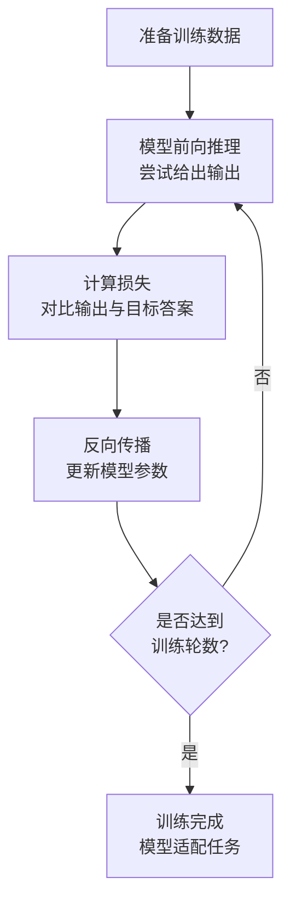

# 大模型微调技术

## 微调整体流程

大模型微调的完整流程可以分为四个主要环节：


### 模型选择

在进行监督微调（SFT）时，模型选择主要考虑两个问题：**选择 Base Model 还是 Instruct Model**，以及**选择多大规模的模型**。

???+ tip "选型建议"
    对于绝大多数应用场景，**通常建议优先选择 Instruct Model 作为微调起点**：
    
    - ✅ Instruct Model 已经在 Base Model 基础上经过指令微调、偏好对齐等后训练
    - ✅ 具备较好的指令理解和对话能力
    - ✅ 可以降低数据准备和训练难度
    - ✅ 更适合客服问答、内容生成、结构化输出、多轮对话等常见任务

    **Base Model** 则更适合高度定制化场景：
    
    - 任务形式非常特殊
    - 团队拥有大量高质量领域数据
    - 希望从基础模型状态开始进行深度适配

**模型规模选择**：

参数量越大的模型通常能力越强，但显存占用、训练成本和推理成本也更高。因此**模型并不是越大越好**，应根据任务复杂度、硬件资源、响应速度和部署成本综合选择。

常见任务选型参考：

| 任务场景 | 推荐模型类型 | 推荐参数量 |
|---------|-------------|-----------|
| 意图识别、文本分类 | Instruct Model | 1B-7B |
| 智能客服FAQ/工单辅助 | Instruct Model | 7B-14B |
| 企业知识库问答/RAG | Instruct Model | 7B-14B 起步，复杂场景 14B-32B |
| NL2SQL/自然语言转SQL | Instruct Model | 简单场景 7B-14B，复杂场景 14B-32B |
| 本地轻量部署、边缘设备 | Instruct Model | 0.5B-4B |

> 上述只作为初始选型参考，最终仍应通过任务评测确定。建议先选择 7B/8B 或 14B 级别的 Instruct Model 做基线实验，再根据效果决定是否扩大模型规模。

### 数据准备

数据准备是微调流程中的基础环节，主要目标是根据任务需求构建高质量训练数据。

- **数据来源**：公共数据源（HuggingFace、ModelScope等）+ 私有数据源（企业内部文档、客户反馈、业务数据库等）
- **数据处理**：原始数据通常需要经过筛选、清洗、结构化、标注和格式转换等处理，形成适合模型学习的训练样本

### 微调训练

训练阶段是模型真正根据任务数据进行调整的环节，流程如下：



由于大语言模型规模较大，训练阶段往往遇到显存占用高、训练速度慢、训练成本高等工程问题，因此需要根据硬件条件和任务需求，选择合适的训练方式和优化方案（如全参数微调、LoRA、QLoRA等）。

### 模型验证

在模型完成微调后，需要通过验证环节评估模型是否真正学到了目标任务能力。

- **验证维度**：训练损失下降、验证集指标、样例推理结果、实际任务效果
- **评估重点**：泛化能力、稳定性、可用性
- **价值**：发现过拟合、指令跟随能力不足、回答质量不稳定等问题，为后续优化提供依据

---

## 微调数据准备

在微调大语言模型时，**数据是决定模型性能与适用性的关键因素**。模型表现很大程度上取决于其训练数据的质量。

### 数据来源

根据数据的来源与可访问性，通常可分为两大类：

#### 公共数据源

公共数据集易于获取，通常是绝佳的起点，常用的数据共享平台：

**[Hugging Face Hub](https://huggingface.co/datasets)** :   托管了数千个数据集，可以通过 `datasets` 库轻松访问，可根据任务类型、语言以及数据集许可证进行筛选。

**[ModelScope](https://www.modelscope.cn/datasets)** :   阿里巴巴旗下的模型开放平台，提供了一系列高质量的开源模型与数据集，覆盖多个领域，包括自然语言处理、计算机视觉和多模态任务。

#### 私有数据源

私有数据源是指企业或组织内部拥有的数据集，这些数据可能受到版权保护或隐私限制，仅限于内部使用。

!!! note "数据预处理"
    私有数据通常并非专为模型微调而准备，因此在使用前往往需要经过**清洗、结构化和标注**等预处理步骤。

    可以借助自动化工具提升效率，例如 [Easy Dataset](https://github.com/hiyouga/EasyDataset) 等开源方案。

### 数据集格式

在大型语言模型的监督微调中，数据集的构建格式至关重要，常见格式可分为两类：**指令式**与**对话式**。

#### 指令式格式

指令式数据集用于训练模型执行明确的单轮任务，如翻译、摘要或问答。其典型格式源自斯坦福大学的 [Alpaca 项目](https://github.com/tatsu-lab/stanford_alpaca)，结构简洁、易于使用。

每条样本包含三个字段：

| 字段 | 说明 |
|------|------|
| `instruction` | 描述模型需要执行的任务 |
| `input` | 任务所需的上下文或附加信息 |
| `output` | 模型应生成的正确回答 |

示例：

```json
{
  "instruction": "将以下英文翻译成中文",
  "input": "Large language models are transforming AI.",
  "output": "大语言模型正在改变人工智能。"
}
```

训练时，这些字段通常会通过提示模板组合成结构统一的输入字符串：

```
### 指令：
{instruction}

### 输入：
{input}

### 回复：
{output}
```

#### 对话式格式

对话式数据集用于训练模型进行多轮对话，例如聊天机器人、虚拟助手等。目前广泛采用的格式主要有 **ShareGPT 格式** 和 **OpenAI 格式**。

##### ShareGPT 格式

ShareGPT 格式源于用户在社区中分享的与 ChatGPT 的真实对话记录，常用于保存多轮对话数据集。

每条数据样本由一个名为 `conversations` 的列表构成，列表中的每个元素代表一次发言，包含两个关键字段：

- `from`：标识发言者的角色，通常为 `"human"`（用户）或 `"gpt"`（模型助手）
- `value`：该轮对话的具体文本内容

示例：

```json
{
  "conversations": [
    {
      "from": "human",
      "value": "你能解释一下什么是机器学习吗？"
    },
    {
      "from": "gpt",
      "value": "机器学习是人工智能的一个分支，它允许计算机系统通过数据和经验自动改进其性能。"
    },
    {
      "from": "human",
      "value": "它主要有哪些类型？"
    },
    {
      "from": "gpt",
      "value": "主要类型包括监督学习、无监督学习、半监督学习和强化学习等。"
    }
  ]
}
```

##### OpenAI 格式

OpenAI 格式是 OpenAI 官方在其 API 微调功能中推广的一种通用消息列表格式，兼具灵活性与表达力，可同时支持单轮和多轮对话。

每个训练样本是一个包含 `messages` 字段的字典，其中 `messages` 是一个有序列表，每条消息包含：

- `role`：发言者角色，常见值：`system`、`user`、`assistant`
- `content`：消息的具体文本内容

示例：

```json
{
  "messages": [
    {
      "role": "system",
      "content": "你是一名专业的营养师。你的回答应基于科学知识，提供务实、健康的建议，并避免提供任何医疗诊断。"
    },
    {
      "role": "user",
      "content": "我最近感觉下午很疲惫，有什么健康的零食推荐吗？"
    },
    {
      "role": "assistant",
      "content": "下午感到疲惫是常见的现象，选择正确的零食可以帮助稳定能量水平。以下是一些推荐：\n1. 一把坚果和干果：提供健康的脂肪、蛋白质和天然糖分，能快速补充能量。\n2. 希腊酸奶：富含蛋白质，能提供持久的饱腹感。\n3. 一个苹果或一根香蕉：富含维生素和膳食纤维，是方便的天然能量来源。\n请记得结合充足的水分摄入，因为脱水也会导致疲劳。"
    }
  ]
}
```

!!! tip "Chat Template 标准化"
    在实际训练中，无论采用哪种原始格式，通常都会通过 Chat Template（例如 ChatML）将多轮消息组织成结构统一的字符串，确保模型能够正确解析对话结构并学习交互模式。

---

## 微调方法选择

根据是否更新模型全部参数，监督微调（SFT）的方法可分为两类：

- **全参数微调**（Full Fine-tuning）
- **参数高效微调**（Parameter-Efficient Fine-tuning, PEFT）

### 全参数微调

全参数微调是一种在微调过程中更新模型全部参数的方法。它能最大限度地适配目标任务，通常获得最优性能。

!!! warning "资源要求高"
    由于大语言模型参数量庞大（数十亿至数千亿），全参数微调对显存、算力和训练时间要求极高，单设备通常无法承载，必须依赖分布式训练技术才能实施。

**适用场景**：资源充足、对性能要求严苛、且拥有高质量标注数据的场景。在实际应用中，常作为参数高效微调无法满足需求时的高成本备选方案。

### 参数高效微调（PEFT）

#### 概述

参数高效微调（PEFT）的核心思想是**仅更新少量参数或引入少量可训练模块**，在显著降低资源消耗的同时，高效适配目标任务。

目前，最先进的 PEFT 方法已经能实现与全参微调相当的性能。

在众多技术路线（Prompt Tuning、Prefix Tuning、P-Tuning、Adapter、LoRA 等）中，**LoRA** 因其结构简洁、训练高效稳定，已成为当前大语言模型监督微调（SFT）的主流选择；其量化版本 **QLoRA** 进一步融合量化技术，将微调门槛降至消费级 GPU 也可运行的水平。

#### LoRA (Low-Rank Adaptation)

!!! info "官方资料"
    - 原论文：[LoRA: Low-Rank Adaptation of Large Language Models](https://arxiv.org/abs/2106.09685)
    - GitHub：[microsoft/LoRA](https://github.com/microsoft/LoRA)

**LoRA** 由微软研究院于 2021 年提出，因其训练成本低、适配能力强、推理无额外开销等优势，已成为当前大语言模型监督微调（SFT）中最广泛使用的技术。

##### 原理

在传统的全参数微调中，模型中的某个参数矩阵 $W_0 \in \mathbb{R}^{d \times k}$ 会在训练过程中被更新为：

$$W = W_0 + \Delta W$$

其中 $\Delta W$ 是微调阶段需要学习的完整增量矩阵。

LoRA 观察到：$\Delta W$ 往往具有**低秩结构**，也就是说它的有效自由度远低于其表面维度。基于这一关键现象，LoRA 将 $\Delta W$ 近似分解为两个低秩矩阵的乘积：

$$\Delta W \approx AB,\quad A \in \mathbb{R}^{d \times r},\; B \in \mathbb{R}^{r \times k}$$

其中 $r \ll \min(d, k)$，通常取 4、8 或 16 等远小于原始维度的数值。

这样，微调后的权重矩阵可写为：

$$W = W_0 + AB$$

在训练过程中，LoRA **完全冻结原始权重 $W_0$，仅对新增的低秩矩阵 $A$ 和 $B$ 进行优化**。这大幅减少了需要更新的参数量，同时也避免了对大规模模型权重的直接修改，使微调过程更加轻量、高效。

在推理阶段，低秩增量 $AB$ 可以**无缝合并回原始权重 $W_0$ 中**，不会引入额外的计算复杂度，因此 LoRA 的高效性不仅体现在训练中，也体现在推理过程中。

**参数压缩示例**：

对 $d = k = 4096$ 的权重矩阵：
- 全参数更新需要约 16M 个参数
- 采用 LoRA（$r = 8$）时，仅需：$4096 \times 8 + 8 \times 4096 = 65,536$ 个参数
- 仅占原始权重的约 **0.4%**

这种数量级的压缩使得在有限资源下微调大模型成为可能，也使得在多个任务之间共享底层模型、仅保存轻量级 LoRA 适配器成为现实。

#### QLoRA (Quantized Low-Rank Adaptation)

!!! info "官方资料"
    - 原论文：[QLoRA: Efficient Finetuning of Quantized LLMs](https://arxiv.org/abs/2305.14314)
    - GitHub：[artidoro/qlora](https://github.com/artidoro/qlora)

QLoRA 是 LoRA 的量化增强版本，由华盛顿大学和微软研究院于 2023 年提出。QLoRA 在 LoRA 的基础上引入 **4-bit 量化技术**，在几乎不损失性能的前提下，将大语言模型微调的硬件门槛大幅降低，使得数十亿参数级别的模型可在单张消费级 GPU（如 RTX 3090/4090）上完成高效微调。

##### 核心原理

QLoRA 的核心思想是：**先对预训练模型权重进行 4-bit 量化以压缩显存占用，再在其上应用 LoRA 进行参数高效微调**。

整个流程包含三个关键技术组件：

###### 1. 4-bit NormalFloat（NF4）量化

量化是一种通过降低数值精度来压缩模型、节省显存的技术。传统 4-bit 量化通常采用均匀量化：

1. 使用权重的最大绝对值（absmax）将权重归一化到区间 $[-1, 1]$
2. 将该区间均匀划分为 $2^4 = 16$ 个等距格点
3. 每个权重被映射到最近的格点，并以对应的 4-bit 索引存储

然而，大语言模型的权重分布并非均匀，而是近似服从标准正态分布（均值为 0，方差为 1）。传统均匀量化存在明显缺陷：

- 在权重密集的 0 附近，格点相对不足，导致量化误差较大
- 在权重稀疏的两端，格点又相对冗余，造成信息利用率低下

为解决这一问题，QLoRA 提出了 **4-bit NormalFloat（NF4）量化**，专为标准正态分布设计：

- 将标准正态分布按累积概率均分为 16 个等概率区间
- 每个区间选取其中位数作为该区间的量化代表值

这样得到的量化格点在 **0 附近更密集，在两端更稀疏**，与权重的实际分布高度匹配，从而显著降低量化误差。

###### 2. 双重量化（Double Quantization）

在权重量化过程中，为了保证精度，通常每 64 个权重共享一个 32-bit 的缩放因子（Absmax）。虽然这种方法能有效控制量化误差，但这些大量的缩放因子自身也会带来显著的存储开销。

为缓解这一问题，QLoRA 提出了**双重量化**：
- 不仅对模型权重量化
- 更对这些高精度的缩放因子进行二次量化
- 将缩放因子以 256 个为一组，使用 8-bit 数据类型进行二次量化

如此一来，量化所需的辅助存储空间得以大幅减少。

###### 3. 分页优化器（Paged Optimizers）

在微调过程中，优化器状态（如 Adam 的一阶矩、二阶矩）往往比模型权重本身更占显存。即使使用 LoRA 或 QLoRA，大量优化器状态仍可能导致显存不足，尤其是在消费级 GPU 上。

为解决这一瓶颈，QLoRA 使用了**分页优化器**技术，使优化器状态能够**按需加载、按需卸载**，从而更加高效地利用显存：

1. 将优化器状态拆分为多个小块（pages）
2. 仅在需要更新某层时，临时把对应 page 载入到显存
3. 更新完成后立即将该 page 写回内存，并从显存中释放

借助分页机制，显存只需容纳当前正在使用的优化器状态，显存占用随之显著降低。这一技术让大型模型的 QLoRA 微调能够在更低显存环境下高效运行，并最大化消费级 GPU 的可用算力。

---

## 微调实操 - LLaMA Factory

[LLaMA Factory](https://github.com/hiyouga/LLaMA-Factory) 是一个简单易用且高效的大型语言模型训练与微调平台。通过 LLaMA Factory，可以在无需编写任何代码的前提下，在本地完成上百种预训练模型的微调。

!!! info "官方文档"
    - [LLaMA Factory 官方文档](https://llamafactory.readthedocs.io/)
    - GitHub: [hiyouga/LLaMA-Factory](https://github.com/hiyouga/LLaMA-Factory)

### 安装 LLaMA-Factory

=== "克隆源码"
    ```bash
    git clone https://github.com/hiyouga/LLaMA-Factory.git
    cd LLaMA-Factory
    ```

=== "AutoDL 代理加速"
    ```bash
    # 开启代理加速
    source /etc/network_turbo

    # 取消代理加速
    unset http_proxy && unset https_proxy
    ```

=== "使用 UV 安装依赖"
    ```bash
    # 创建 python 3.12 环境
    uv venv --python 3.12

    # 激活环境
    source .venv/bin/activate

    # 安装依赖（使用清华源）
    uv pip install -e . -i https://pypi.tuna.tsinghua.edu.cn/simple

    # 验证安装
    llamafactory-cli version
    ```

### 启动 LLaMA-Factory

=== "前台启动"
    ```bash
    llamafactory-cli webui
    ```

=== "后台启动"
    ```bash
    nohup llamafactory-cli webui > llama_factory.log 2>&1 &
    ```

看到 `Running on local URL:  http://0.0.0.0:7860` 即启动成功。

!!! tip "远程服务器访问"
    如果使用 AutoDL 等远程服务器启动，本地访问需开启 SSH 隧道：
    ```bash
    ssh -CNg -L 7860:127.0.0.1:7860 root@connect.nmb2.seetacloud.com -p 16652
    ```
    然后浏览器打开 `http://localhost:7860/` 即可访问。

### 准备模型

在使用 LLaMA-Factory 进行微调时，可以：
1. 通过 LLaMA-Factory 在训练时自动下载模型
2. 提前下载好模型，配置本地路径直接使用

示例：通过 ModelScope 下载 Qwen3-0.6B 模型：

```bash
modelscope download --model Qwen/Qwen3-0.6B --local_dir model/Qwen3-0.6B
```

### 准备数据集

LLaMA-Factory 目前支持 **Alpaca 格式**和 **ShareGPT 格式**的数据集。我们自己整理好格式的数据需要添加到数据集信息中。

#### 1. 数据格式转换

将原始数据转换为 LLaMA-Factory 所需的 ShareGPT 格式：

```python
from datasets import load_dataset

def convert_to_qwen_format(examples):
    conversations = []
    # 遍历每个对话样本，batch 模式会自动套一层 list
    for conv_list in examples["conversation"]:
        # 重建符合 Qwen3 标准的消息结构
        for conv in conv_list:
            conversations.append([
                {"role": "user", "content": conv['human'].strip()},
                {"role": "assistant", "content": conv['assistant'].strip()}
            ])

    return {"messages": conversations}

if __name__ == '__main__':
    dataset = load_dataset("json", data_files="data/keywords_data_train.jsonl", split="train")
    # 格式化数据为 Chatgpt 格式
    dataset = dataset.map(
        convert_to_qwen_format,
        batched=True,
        remove_columns=dataset.column_names
    )
    dataset.to_json("data/keywords_data_sharegpt.jsonl", force_ascii=False)
```

#### 2. 添加数据集信息

修改 `dataset_info.json` 文件，添加数据集信息：

```json
"keywords_extract": {
  "file_name": "keywords_data_sharegpt.jsonl",
  "formatting": "sharegpt",
  "columns": {
    "messages": "messages"
  },
  "tags": {
    "role_tag": "role",
    "content_tag": "content",
    "user_tag": "user",
    "assistant_tag": "assistant"
  }
},
```

添加完成后，在 Web UI 上就可以看到数据集，选中后可以预览数据。

### 使用 LoRA 进行微调

1. **配置模型**：模型名称选择 Custom，模型路径配置本地路径
2. **配置微调方法**：选择 `lora` 即可启用 LoRA 微调
3. **配置训练轮数和最大样本数**：
    - 不设置最大样本数：每个 epoch 遍历完整训练集，理论训练样本量 $\approx$ 训练集样本数 $\times$ 训练轮数
    - 设置最大样本数：训练前先将可用训练样本限制到该数量以内，理论训练样本量 $\approx \min(训练集样本数, 最大样本数) \times 训练轮数$
4. **配置保存位置**：设置输出目录，训练过程中的检查点以及相关数据都会保存至此

### 模型权重导出

通过 LLaMA-Factory 的 WebUI 界面，可将训练好后得到的 LoRA 适配器参数和基座模型参数进行合并导出。

---

## 模型部署 - vLLM

在实际生产环境下，微调之后的模型需要经过部署才能使用。部署的本质就是将模型转换成可通过 HTTP 调用的服务。本章介绍如何使用 vLLM 对大模型进行部署以及如何在代码中调用。

!!! info "官方资料"
    - [vLLM 官方文档](https://docs.vllm.ai/en/latest/index.html)
    - GitHub: [vllm-project/vllm](https://github.com/vllm-project/vllm)

### vLLM 简介

vLLM 是一个面向大语言模型推理的高性能推理框架，专为大规模并发请求优化，底层基于 PyTorch 构建。

从各种基准测试数据来看，同等配置下，使用 vLLM 框架与 Transformer 等传统推理库相比，**吞吐量可以提高一个数量级**，这归功于以下特性：

- ✅ **高级 GPU 优化**：利用 CUDA 和 PyTorch 最大限度地提高 GPU 利用率，实现更快的推理速度
- ✅ **高级内存管理**：通过 PagedAttention 算法实现对显存的高效管理，减少内存浪费
- ✅ **批处理功能**：支持连续批处理和异步处理，提高多个并发请求的吞吐量
- ✅ **安全特性**：内置 API 密钥支持和适当的请求验证
- ✅ **易用性**：支持多种流行的大型语言模型，并兼容 OpenAI 的 API 服务器

### 安装

**环境要求**：
- OS: Linux
- Python: 3.9 -- 3.12

```bash
# 创建并激活 vllm 环境
uv venv --python 3.12
source .venv/bin/activate

# 安装 vllm（使用清华源）
uv pip install vllm -i https://pypi.tuna.tsinghua.edu.cn/simple

# 查看安装信息
uv pip show vllm
```

### 启动服务

使用 vLLM 部署微调后的模型，首先需要将原基座模型目录和微调后的模型目录都拷贝到 vLLM 工作目录下（根据实际目录结构调整）。

=== "前台启动（调试）"
    ```bash
    vllm serve /root/autodl-tmp/vllm_dir/Qwen3-0.6B-sft-lora \
      --served-model-name Qwen3-0.6B-sft-lora \
      --tokenizer /root/autodl-tmp/vllm_dir/Qwen3-0.6B \
      --max-model-len 32768
    ```

=== "后台启动（生产）"
    ```bash
    nohup vllm serve /root/autodl-tmp/vllm_dir/Qwen3-0.6B-sft-lora \
      --served-model-name Qwen3-0.6B-sft-lora \
      --tokenizer /root/autodl-tmp/vllm_dir/Qwen3-0.6B \
      --max-model-len 32K \
      > vllm.log 2>&1 &
    ```

!!! note "单位说明"
    - 小写 `k`：单位是 1000
    - 大写 `K`：单位是 1024

### 调用方式

vLLM 兼容 OpenAI API 格式，可以通过多种方式调用。

#### 1. curl 快速测试

```bash
curl http://localhost:8000/v1/chat/completions \
-H "Content-Type: application/json" \
-d '{
    "model": "Qwen3-0.6B-sft-lora",
    "messages": [
        {"role": "user", "content": "抽取出下文中的关键词：\n目的分析结节性甲状腺肿(NG)合并甲状腺微小癌(TMC)的超声声像图特点,以提高 TMC 的术前超声检出率.资料与方法回顾性分析经手术病理证实的64例 NG 合并 TMC 的超声声像图表现,并以同病例邻近癌灶且直径≤1cm 的 NG 结节作为对照.结果 TMC 与 NG 结节在形态、边界、回声强度、声晕、微小钙化、囊性变与血流分布等方面差异有统计学意义(P <0.01),回声均匀程度差异无统计学意义(P >0.05).颈部淋巴结肿大超声检出率为89.47%(17/19).结论 TMC 具有与 NG 结节不同的声像图特点,TMC 的灰阶超声特点为低回声、无声晕、有微小钙化、无囊性变等,彩色多普勒超声显示病灶内部血流信号丰富或无血流,周边少或无血流信号.在 NG 检查中重点观察≤1cm 的低回声结节,以及早发现 TMC. "}
    ]
}'
```

#### 2. OpenAI 库调用

```python
from openai import OpenAI

# 连接本地 vLLM 服务
client = OpenAI(
    base_url="http://localhost:8000/v1/",
    api_key="none"  # 占位符，可忽略
)

# 调用模型
response = client.chat.completions.create(
    model="Qwen3-0.6B-sft-lora",  # 指定模型，必须与启动 vllm 时指定的名字一致
    messages=[
        {"role": "user", "content": "抽取出下文中的关键词：\n目的分析结节性甲状腺肿(NG)合并甲状腺微小癌(TMC)的超声声像图特点,以提高 TMC 的术前超声检出率.资料与方法回顾性分析经手术病理证实的64例 NG 合并 TMC 的超声声像图表现,并以同病例邻近癌灶且直径≤1cm 的 NG 结节作为对照.结果 TMC 与 NG 结节在形态、边界、回声强度、声晕、微小钙化、囊性变与血流分布等方面差异有统计学意义(P <0.01),回声均匀程度差异无统计学意义(P >0.05).颈部淋巴结肿大超声检出率为89.47%(17/19).结论 TMC 具有与 NG 结节不同的声像图特点,TMC 的灰阶超声特点为低回声、无声晕、有微小钙化、无囊性变等,彩色多普勒超声显示病灶内部血流信号丰富或无血流,周边少或无血流信号.在 NG 检查中重点观察≤1cm 的低回声结节,以及早发现 TMC. "}
    ],
    extra_body={
        "chat_template_kwargs": {"enable_thinking": False}  # 关键参数
    }
)

print(response.choices[0].message.content)
```

#### 3. LangChain 调用

```python
from langchain_openai import ChatOpenAI
from langchain_core.messages import HumanMessage, SystemMessage

llm = ChatOpenAI(
    model="Qwen3-0.6B-sft-lora",
    base_url="http://localhost:8000/v1/",
    api_key="none",
    temperature=0
)

# 构建消息
messages = [
    HumanMessage(content="抽取出下文中的关键词：\n目的分析结节性甲状腺肿(NG)合并甲状腺微小癌(TMC)的超声声像图特点,以提高 TMC 的术前超声检出率.资料与方法回顾性分析经手术病理证实的64例 NG 合并 TMC 的超声声像图表现,并以同病例邻近癌灶且直径≤1cm 的 NG 结节作为对照.结果 TMC 与 NG 结节在形态、边界、回声强度、声晕、微小钙化、囊性变与血流分布等方面差异有统计学意义(P <0.01),回声均匀程度差异无统计学意义(P >0.05).颈部淋巴结肿大超声检出率为89.47%(17/19).结论 TMC 具有与 NG 结节不同的声像图特点,TMC 的灰阶超声特点为低回声、无声晕、有微小钙化、无囊性变等,彩色多普勒超声显示病灶内部血流信号丰富或无血流,周边少或无血流信号.在 NG 检查中重点观察≤1cm 的低回声结节,以及早发现 TMC. ")
]

# 调用模型获取响应
response = llm.invoke(messages)
print(response.content)
```

---

