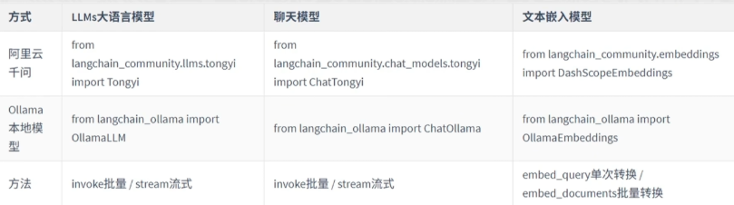
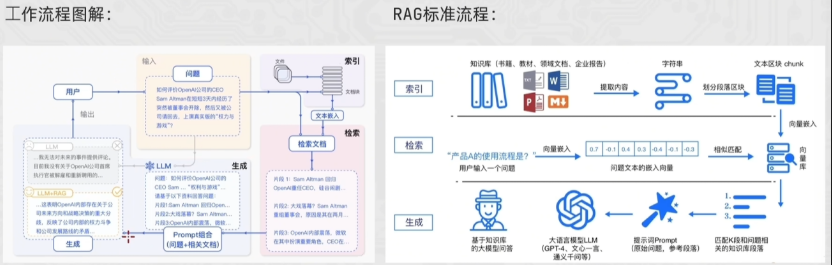

## 01 前置准备

### 远程调用 LLM

大多数主流大模型（GPT, Claude, Gemini）通过 RESTful API 提供服务。目前行业基本统一使用 **OpenAI SDK 标准**。

- **Base URL**: 接口地址（如 `https://api.openai.com/v1`）。
- **API Key**: 你的身份凭证（绝对不能外泄）。
- **Model ID**: 指定使用的模型版本（如 `gpt-4o`, `claude-3-5-sonnet`）。

### 环境变量的保护

可以存到环境变量中，通过 `os.getenv()` 获取，或者存到配置文件，都可以！

``` python
client = OpenAI(  
    # 如果没有配置环境变量，请用阿里云百炼API Key替换：api_key="sk-xxx"  
    api_key= os.getenv("OPENAI_API_KEY"),  
    base_url="https://dashscope.aliyuncs.com/compatible-mode/v1",  
)
```

``` python
from dotenv import load_dotenv
import os

load_dotenv()
KEY = os.getenv("LLM_API_KEY")
```
### Ollama

Ollama 是目前最流行的**本地**大模型运行框架，适合数据敏感或无网环境。

调用时换一下 `LLM` 的 `url` 即可，默认为`http://localhost:11434/v1`

``` python
from openai import OpenAI

# 灵活切换：远程 API 或 本地 Ollama
client = OpenAI(
    api_key = os.getenv("LLM_API_KEY") or "ollama",
    base_url = os.getenv("LLM_BASE_URL") # 动态加载
)
```


## 02 OpenAI 基础

这里给一些 openai 的介绍
### OpenAI 调用 LLM 大模型

**1、获取客户端对象**

在使用 SDK 之前，需确保已安装 `openai` 库并配置 **API Key**。推荐使用环境变量避开硬编码风险。

``` python
from openai import OpenAI

# 默认会读取环境变量 OPENAI_API_KEY
client = OpenAI(
    api_key="your-api-key-here",  # 也可手动传入
    base_url="https://api.openai.com/v1" # 代理或中转地址
)
```

**2、调用模型**

最核心的接口是 `chat.completions.create`。它采用对话式输入，通过 `messages` 数组定义上下文角色。

``` python
response = client.chat.completions.create(
    model="gpt-4o",
    messages=[
        {"role": "system", "content": "你是一个严谨的助手。"},
        {"role": "user", "content": "解释一下量子纠缠。"}
    ],
    temperature=0.7
)
```

- **model**: 指定模型（如 `gpt-4o`, `gpt-3.5-turbo`）。
- **messages**: 包含 `role` (system/user/assistant) 和 `content` 的列表。
- **temperature**: 控制随机性（0 趋向稳定，1 趋向发散）。

**System** 消息处于最高层级，用于设定 AI 的**身份、行为准则、知识边界**以及输出格式。

 **Assistant** 消息由模型生成，代表 AI 的回复。在多轮对话中，我们需要手动将之前的 Assistant 回复喂回给 API，以便模型“记住”它之前说过的话，从而维持对话的连贯性。

**User** 消息代表人类用户的输入。它是对话的驱动力，负责提出问题、下达任务或提供反馈。模型会将 User 的指令放在 System 设定的框架内进行处理。

**3、处理结果**

返回的 `response` 是一个结构化对象。通常我们关注的是首位候选回复的内容。

``` python
# 获取回复文本
answer = response.choices[0].message.content

# 获取消耗统计
print(f"本次花费了 {response.usage.total_tokens} 个 Token")
```

``` json
{
  "id": "chatcmpl-123",          // 请求唯一 ID
  "object": "chat.completion",   // 对象类型
  "created": 1677652288,         // Unix 时间戳
  "model": "gpt-4o-2024-05-13",  // 实际使用的模型版本
  
  "choices": [                   // 核心：模型生成的候选列表
    {
      "index": 0,
      "message": {               // 消息体
        "role": "assistant",
        "content": "你好！有什么我可以帮你的？",
        "tool_calls": null       // 若触发函数调用则在此处
      },
      "logprobs": null,          // 词元概率信息（默认不开启）
      "finish_reason": "stop"    // 终止状态：stop, length, tool_calls
    }
  ],

  "usage": {                     // 计费：Token 统计
    "prompt_tokens": 9,          // 用户输入消耗
    "completion_tokens": 12,     // 模型输出消耗
    "total_tokens": 21           // 总计消耗
  },

  "system_fingerprint": "fp_447092c6b1" // 运行环境指纹（用于结果复现性排查）
}
```

### OpenAI 流式输出

流式传输时，每个数据块的结构比普通响应更精简。最关键的区别是 `message` 字段变成了 `delta` 字段。

流式输出下返回的 `Json` 格式

``` json
{
  "id": "chatcmpl-123",
  "object": "chat.completion.chunk", // 对象类型变为 chunk
  "created": 1694268190,
  "model": "gpt-4o",
  "system_fingerprint": "fp_447092c6b1",
  
  "choices": [
    {
      "index": 0,
      "delta": {                // 注意：这里是 delta 而非 message
        "content": " 核心"      // 本次分片产生的文本片段
      },
      "logprobs": null,
      "finish_reason": null    // 中间分片此处通常为 null
    }
  ]
}
```

拼接输出

```python
response = client.chat.completions.create(
    model="gpt-4o",
    messages=[{"role": "user", "content": "写一首短诗"}],
    stream=True # 开启流式
)

for chunk in response:
    # 提取 delta 中的 content
    content = chunk.choices[0].delta.content
    if content:
        print(content, end="", flush=True) # 实时打字机效果
```

### OpenAI 历史消息

实现“记忆”的方法非常直白：将之前的 **User 提问** 和 **Assistant 回答** 按顺序放入 `messages` 列表。

``` python
client = OpenAI(  
    # api_key = ""  
    base_url="https://dashscope.aliyuncs.com/compatible-mode/v1"  
)  
  
resp = client.chat.completions.create(  
    model="qwen-plus",  
    messages=[  
        {"role": "system", "content": "你是一个幽默的助教。其次，你一点废话都不会说！"},  
        {"role": "user", "content": "我叫小明。"},  
        {"role": "assistant", "content": "你好小明！记住了，我是你的助教。"},  
        {"role": "user", "content": "我叫什么名字？"}  # 模型根据上下文回答“小明”  
    ],  
    stream=True  
)  
  
  
for chunk in resp:  
    print(chunk.choices[0].delta.content, end="", flush=True)
```

## 03 提示词工程

### 概念

提示词工程是指通过精心设计、优化和精炼输入文本（Prompt），以引导大语言模型（LLM）生成准确、高质量且符合预期结果的过程。

其底层逻辑是利用模型在预训练阶段习得的**模式匹配**能力。好的提示词本质上是在海量参数空间中，为模型勾勒出一条通往正确答案的“概率路径”。


### 常用技巧

1、详细的描述

2、将 LLM 设定为特定角色，如教师，面试官....

3、使用分隔符表面输入的不同部分

4、对任务指定步骤

5、提供例子，本质上为：few-show learning

6、基于文本文档，辅助大模型问答，降低模型“幻觉”


### Zero-shot

**概念**：直接向模型下达指令，不提供任何示例。模型仅依靠其预训练阶段习得的通用知识和指令遵循能力来完成任务。

### Few-shot 

在正式指令之前，先给模型展示 1 到 5 个“输入-输出”对作为示范。这不仅定义了任务，更重要的是定义了**输出的模式 (Pattern)**。

### Prompt 设计：返回 Json

``` python
client = OpenAI(  
    # api_key = ""  
    base_url="https://dashscope.aliyuncs.com/compatible-mode/v1"  
)  
  
example_data = [  
    {  
        "input": "2025年第100期， 开好红球 22 21 06 01 03 11 篮球 07，一等奖中奖为2注",  
        "output": {"期数": "2025100", "中奖号码": [1, 3, 6, 11, 21, 22, 7], "一等奖": "2注"}  
    },  
    {  
        "input": "2025101期，有3注1等奖，10注2等奖，开号篮球11，中奖红球3、5、7、11、12、16。",  
        "output": {"期数": "2025101", "中奖号码": [3, 5, 7, 11, 12, 16, 11], "一等奖": "3注"}  
    }  
]  
  
message = [  
    {"role": "system", "content": "你一个彩票专家，需要按照下面的示例返回 json 字符串, 不需要其他废话！"},  
]  
  
for v in example_data:  
    message.append({"role": "user", "content": v["input"]})  
    message.append({"role": "assistant", "content": json.dumps(v["output"], ensure_ascii=False)})  
  
q = "第2025102期开奖结果已出。其中二等奖高达50注，一等奖仅中出1注！本期开出的蓝球为09，红球序列则是：08、12、15、20、22、31。"  
message.append({"role": "user", "content": f"请按照示例返回 json: {q}"})  
  
for x in message:  
    print(x)  
  
resp = client.chat.completions.create(  
    model="qwen-plus",  
    messages=message,  
    stream=True  
)  
  
for chunk in resp:  
    print(chunk.choices[0].delta.content, end="", flush=True)
```


## 04 LangChain

LangChain 是一个开源框架，旨在让开发者能够轻松构建由大语言模型（LLM）驱动的应用程序。它的核心理念是将复杂的 LLM 操作抽象为一个个“链”（Chains），实现模块化的开发流程。

<p align='center'>
    
</p>

### Langchain 安装


``` python
pip install langchain langchain-community langchain-ollama dashscope chromadb
```

### Langchain Models

<p alige='center'>
    
</p>

在 LangChain 框架中，**Models** 是整个生态的核心驱动力。LangChain 并不直接拥有模型，而是提供了一套标准的接口，让你能够轻松地在不同的模型供应商（如 OpenAI, Anthropic, Google, Hugging Face）之间切换。

LangChain 将模型主要划分为两大类：**LLMs** 和 **Chat Models**。

**LLMs (大语言模型)**

这类模型通常被称为“纯文本模型”。

- **输入/输出**：接受一个 **String**（字符串），返回一个 **String**。
- **特点**：它们本质上是文本补全器（Text Completion）。
- **适用场景**：简单的文本生成、老版本的 GPT-3 模型。

``` python
from langchain_openai import OpenAI

llm = OpenAI(model_name="gpt-3.5-turbo-instruct")
response = llm.invoke("向我解释什么是量子力学")
```

**Chat Models (聊天模型)**

这是目前主流的模型类型（如 GPT-4, Claude 3）。

- **输入/输出**：接受一个 **Messages 列表**，返回一个 **BaseMessage** 对象。
- **消息角色**：
    - `SystemMessage`：设置 AI 的行为（例如：“你是一个翻译助手”）。
    - `HumanMessage`：用户发送的内容。
    - `AIMessage`：模型返回的内容。

``` python
from langchain_openai import ChatOpenAI
from langchain_core.messages import HumanMessage, SystemMessage

chat = ChatOpenAI(model="gpt-4")
messages = [
    SystemMessage(content="你是一个幽默的导游"),
    HumanMessage(content="故宫有什么好玩的？")
]
response = chat.invoke(messages)
```

### Langchain 调用大模型

llm model
``` python
from langchain_community.llms.tongyi import Tongyi  
  
llm = Tongyi(model="qwen-max")  
res = llm.invoke(input='你是谁啊')  
print(res)
```

chat model
``` python
from langchain_openai import ChatOpenAI
from langchain_core.messages import HumanMessage, SystemMessage

chat = ChatOpenAI(model="gpt-4")
messages = [
    SystemMessage(content="你是一个幽默的导游"),
    HumanMessage(content="故宫有什么好玩的？")
]
response = chat.invoke(messages)
```

### Langchain 返回结构


在 LangChain 中，调用模型返回的对象通常是 `AIMessage` 类。它将原始 API 返回的 JSON 进行了标准化封装，使其在不同模型（OpenAI, Claude, Qwen 等）之间保持一致。

```json
AIMessage(
    content="...",                 # 字符串内容
    additional_kwargs={},          # 预留给特定模型的特殊参数
    response_metadata={            # 详细运行信息
        "model_name": "qwen-max",
        "finish_reason": "stop",
        "token_usage": {...}
    },
    id="...",                      # 追踪 ID
    tool_calls=[],                 # 工具调用列表
    usage_metadata={...}           # (新版本) 规范化的 Token 统计
)

# 提取数据示例

# 1. 获取回复文本
msg_text = res.content

# 2. 获取 Token 消耗（推荐使用新版通用字段 usage_metadata）
total_tokens = res.usage_metadata['total_tokens']

# 3. 判断是否为 AI 消息（在处理历史消息列表时很有用）
from langchain_core.messages import AIMessage
is_ai = isinstance(res, AIMessage)

```
### Langchain 流式输出

在 LangChain 中，**流式输出（Streaming）** 是提升用户体验的核心技术。它能让大模型像“打字机”一样实时弹出文字，而不是让用户面对加载图标苦等几十秒。

LangChain 的 **LCEL（LangChain Expression Language）** 协议让流式输出变得非常标准化。


1、基础流式输出：使用 `.stream()`

几乎所有的 LangChain 模型对象（LLMs 和 ChatModels）都实现了 `.stream()` 方法。它返回一个 **迭代器（Iterator）**，每次迭代产生一个内容片段（Chunk）。

``` python
from langchain_alibabacloud.chat_models import ChatTongyi

chat = ChatTongyi(model="qwen-max")

# 使用 .stream 方法
for chunk in chat.stream("请给我写一段关于春天优美的描述"):
    # 对于 ChatModel，片段是一个消息对象，内容在 .content 中
    print(chunk.content, end="", flush=True)
```

2、在链（Chain）中使用流式输出

即使你把模型包装在 `PromptTemplate` 或 `OutputParser` 中，只要整个链是用 `|` 符号连接的，它依然支持流式传输。

``` python
from langchain_core.prompts import ChatPromptTemplate
from langchain_core.output_parsers import StrOutputParser

prompt = ChatPromptTemplate.from_template("讲一个关于 {topic} 的冷笑话")
parser = StrOutputParser()

# 构建链
chain = prompt | chat | parser

# 链式调用同样支持 .stream
for chunk in chain.stream({"topic": "程序员"}):
    print(chunk, end="", flush=True)
```

3、异步流式输出：`astream`

在构建 Web 应用（如使用 FastAPI 或 Streamlit）时，异步编程是标配。可以使用 `astream` 来避免阻塞主线程。

``` python
async def main():
    async for chunk in chat.astream("如何评价 Python 的异步编程？"):
        print(chunk.content, end="", flush=True)

asyncio.run(main())
```


### Langchain ChatModels

在 LangChain 中，**ChatModels** 是 LLM 的进化版。与传统的 LLMs（纯文本进、纯文本出）不同，ChatModels 是为“对话”而生的。它们理解 **消息（Messages）** 的概念，并能够区分对话中不同的角色。

**1、核心模型对象：消息类型**

| **消息类名**                              | **角色说明** | **典型用途**                                   |
| ------------------------------------- | -------- | ------------------------------------------ |
| **`SystemMessage`**                   | 系统预设     | 设定 AI 的人设、语气、遵守的规矩（例如：“你是一个毒舌的影评人”）。       |
| **`HumanMessage`**                    | 用户输入     | 用户发出的提问或指令。                                |
| **`AIMessage`**                       | AI 回复    | 模型生成的响应。在多轮对话中，需要把之前的 AIMessage 传回给模型作为记忆。 |
| **`FunctionMessage` / `ToolMessage`** | 插件/工具返回  | 当模型调用外部工具（如搜索、计算器）后，将结果返回给模型时使用。           |

**2、基本调用演示**

使用 ChatModels 时，通常传入一个消息列表：
``` python
from langchain_community.chat_models import ChatTongyi  
from langchain_core.messages import HumanMessage  
  
# 创建模型实例  
llm = ChatTongyi(model="qwen-max")  
  
# 创建消息实例  
message = [  
    HumanMessage(content="请将下面这句话翻译成英文：中国是一个伟大的国家")  
]  
  
res = llm.stream(input=message)  
  
for chunk in res:  
    print(chunk.content, end="", flush=True)
```

### Langchain 消息的简写形式

简写最大的好处就是支持变量注入！！

**基础语法**
``` python
("system | ai | human", "content")
```

``` python
# 创建模型实例  
llm = ChatTongyi(model="qwen-max")  
  
# 创建消息实例  
message = [  
    ('system', "你是一个幽默的情感专家"),  
    ('human', '如果明知道一个女孩不喜欢我，我还天天想着她，你怎么评价')  
]  
  
res = llm.stream(input=message)  
  
for chunk in res:  
    print(chunk.content, end="", flush=True)	
```

### Langchain 嵌入模型

在 LangChain 中，**嵌入模型（Embedding Models）** 是连接“自然语言”与“机器计算”的桥梁。它们将文本转换为一串高维向量（通常是数百或上千维的浮点数数组）。

LangChain 提供了 `Embeddings` 类作为统一接口。无论用 OpenAI 还是本地的 Hugging Face 模型，代码结构几乎一致：

- **`embed_documents`**：用于向量化多条文本（通常是存入数据库前的原始文档）。
- **`embed_query`**：用于向量化用户的问题（单条文本）


A. OpenAI Embeddings (云端闭源)

``` python
from langchain_openai import OpenAIEmbeddings

embeddings_model = OpenAIEmbeddings(model="text-embedding-3-small")
embeddings = embeddings_model.embed_query("什么是人工智能？")
print(len(embeddings))  # 输出维度大小，如 1536
```


B. Hugging Face Embeddings (本地开源)

``` python
from langchain_huggingface import HuggingFaceEmbeddings

# 加载本地模型（首次运行会自动下载）
model_name = "sentence-transformers/all-mpnet-base-v2"
hf_embeddings = HuggingFaceEmbeddings(model_name=model_name)

res = hf_embeddings.embed_query("LangChain 很强大")
```


C. 阿里通义千问 Embeddings

``` python
from langchain_community.embeddings import DashScopeEmbeddings

embeddings = DashScopeEmbeddings(model="text-embedding-v1")
```


### Langchain prompt

在 LangChain 中，**Prompt**（提示词）不再仅仅是一段硬编码的字符串，而是被抽象为 **Prompt Templates（提示词模板）**。这种抽象让你可以像写代码函数一样，定义可重复使用的逻辑，并动态地注入变量。

#### 基础模板：`PromptTemplate`

这是最通用的形式，适用于纯文本模型。它使用 Python 的 `str.format` 语法。
``` python
from langchain_core.prompts import PromptTemplate

# 定义模板
template = "你是一个专业的{job_title}，请为我解释什么是{concept}。"

# 创建 PromptTemplate 对象
prompt_template = PromptTemplate.from_template(template)

# 填充变量
prompt = prompt_template.format(job_title="物理学家", concept="黑洞")
print(prompt) 
# 输出: 你是一个专业的物理学家，请为我解释什么是黑洞。
```


#### 聊天模板：`ChatPromptTemplate`

针对 **ChatModels**，我们需要构造包含角色的消息列表。这是目前最常用的通用方式。

``` python
from langchain_core.prompts import ChatPromptTemplate

prompt = ChatPromptTemplate.from_messages([
    ("system", "你是一个翻译助手，负责将{input_language}翻译成{output_language}。"),
    ("human", "{text}"),
])

# 格式化
formatted_messages = prompt.format_messages(
    input_language="中文",
    output_language="法语",
    text="我爱学习"
)
```

在 LangChain 中，`MessagesPlaceholder` 是处理**动态对话历史**的核心组件。它就像是在提示词模板中挖了一个“插槽”，专门用来放置数量不确定的聊天记录。

``` python
from langchain_core.prompts import ChatPromptTemplate, MessagesPlaceholder

prompt = ChatPromptTemplate.from_messages([
    ("system", "你是一个得力的助手。"),
    # "history" 是占位符变量名，用于接收消息列表
    MessagesPlaceholder(variable_name="history"), 
    ("human", "{input}"),
])
# 模拟历史记录
history_msgs = [
    HumanMessage(content="我叫小明"),
    AIMessage(content="你好小明！很高兴认识你。")
]

# 填充模板（不常用）
final_messages = prompt.format_messages(
    history=history_msgs,
    input="我刚才说我叫什么？"
)
# 常用方式
final_messages = prompt.invoke({"input": "你叫什么名字？", "history": history_msgs})
```

#### 少样本提示：Few-Shot Prompts

``` python
from langchain_core.prompts import FewShotPromptTemplate

examples = [
    {"input": "开心", "output": "高兴、愉悦、欣喜"},
    {"input": "难过", "output": "悲伤、沮丧、消沉"}
]

example_prompt = PromptTemplate.from_template("输入: {input}\n输出: {output}")

few_shot_prompt = FewShotPromptTemplate(
    examples=examples,
    example_prompt=example_prompt,
    suffix="输入: {word}\n输出:", # 真正提问的部分
    input_variables=["word"]
)

prompt = few_shot_prompt.invoke({"word":"平淡"}).to_string()
```


#### format 和 invoke 的区别

简单来说，`format` 和 `invoke` 的区别在于**返回值的类型**以及它们在 **LangChain 表达式语言 (LCEL)** 中的角色。

| **特性**   | **.format()**         | **.invoke()**                      |
| -------- | --------------------- | ---------------------------------- |
| **返回类型** | **String** (纯字符串)     | **PromptValue** (LangChain 对象)     |
| **主要用途** | 快速查看填充后的文本，方便打印调试。    | 作为 **Runnable** 接口的一部分，用于**链式调用**。 |
| **设计逻辑** | 传统的 Python 字符串格式化增强版。 | 为了兼容各种模型（LLM/ChatModel）而设计的中间格式。   |
| **输出示例** | `"请解答问题..."`          | `StringPromptValue(text="...")`    |

`.format()`：回归原始字符串，当调用 `.format()` 时，LangChain 会直接完成变量替换，并返回一个标准的 Python 字符串。

`.invoke()`：LangChain **Runnable** 协议的标准方法。当写 `chain = prompt | llm` 时，背后调用的就是 `invoke`。如果下游是 **LLM**（通义千问 `Tongyi`），它会自动变身为 **String**。如果下游是 **ChatModel**（`ChatTongyi`），它会自动变身为 **Message List**（包含 System/Human 角色）。

``` python
# 假设变量为 {"input": "男"}

# 1. 使用 format -> 得到纯文本
raw_text = few_shot_prompt.format(input="男")
print(type(raw_text)) # <class 'str'>
print(raw_text)       # 请按照...input:男, output:

# 2. 使用 invoke -> 得到封装对象
prompt_value = few_shot_prompt.invoke({"input": "男"})
print(type(prompt_value)) # <class 'langchain_core.prompt_values.StringPromptValue'>

# 如果你想看对象里的文本，得手动转：
print(prompt_value.to_string())
```

### Langchain chain ⭐⭐⭐

在 LangChain 中，**Chain（链）** 是其最核心的设计模式。它通过 **LCEL (LangChain Expression Language)** 表达式，将独立的对象（如提示词、模型、输出解析器）像乐高积木一样串联起来。

#### 核心语法：管道符 `|`

LangChain 借鉴了 Unix 的管道哲学。符号 `|` 的左侧输出会自动作为右侧的输入。

``` python
# 最经典的链式结构 
chain = prompt | model | output_parser

# eg:
chain = prompt_template | llm  
res = chain.stream({"history": history})
```

#### 链的标准组件

| **组件**            | **作用**                | **输入 / 输出**                    |
| ----------------- | --------------------- | ------------------------------ |
| **Prompt**        | 模板化用户输入               | `dict` -> `PromptValue`        |
| **LLM (Model)**   | 核心推理引擎                | `PromptValue` -> `AIMessage`   |
| **Output Parser** | 格式化结果（如转为 JSON 或纯字符串） | `AIMessage` -> `String/Object` |


### Langchain Runnable 接口

在 LangChain 中，**Runnable** 接口是一套标准化的协议，它为所有的组件（模型、提示词、解析器、甚至是你自定义的函数）提供了统一的调用方式。

#### 1、设计理念

无论底层逻辑多么复杂，所有的 Runnable 对象都必须实现几个核心方法。这种“接口一致性”是 LCEL 能实现 `|` 串联的基础：**只要两个组件都实现了 Runnable 接口，且输入输出类型匹配，它们就能无缝对接。**

#### 2、四大核心调用方法

| **方法名称**        | **执行模式** | **适用场景**                 |
| --------------- | -------- | ------------------------ |
| **`invoke()`**  | 同步执行     | 单次请求，最基础的调用方式。           |
| **`ainvoke()`** | 异步执行     | 高并发场景，通过 `await` 提高程序性能。 |
| **`batch()`**   | 批量执行     | 同时处理多个输入，内部自动实现并行加速。     |
| **`stream()`**  | 流式执行     | 实时返回数据片段，常用于构建“打字机”效果。   |

#### 3、输入与输出类型

1.`Prompt`: 接收 `dict` (变量)，输出 `PromptValue`。
2.`ChatModel`: 接收 `PromptValue` (或消息列表)，输出 `AIMessage`。
3.`OutputParser`: 接收 `AIMessage`，输出特定格式（字符串、JSON 等）。

利用 `RunnableLambda`，你可以将任何普通的 Python 函数包装成 Runnable 接口，使其能够参与到管道符 `|` 的串联中。

#### 4、进阶辅助组件

1.**`RunnablePassthrough`**：透传组件。用于将原始输入不做修改地传递给下一级，常用于在 RAG 中保留用户问题。

2.**`RunnableParallel`**：并行组件。同时运行多个 Runnable，并将结果合并为一个字典输出

3.**`RunnableConfig`**：配置对象。用于在运行期间动态传递参数（如 `callbacks`, `tags`, `configurable` 选项）。


### Langchain OutputParser

在 LangChain 中，**OutputParser（输出解析器）** 是整个链条的最后一环。它负责将模型输出的非结构化文本（`AIMessage`）转换为应用程序可以处理的结构化数据（如字符串、JSON 或 Python 对象）。

#### 核心作用

大模型的原始回复往往带有元数据、Token 消耗等信息，或者仅仅是一段松散的文本。解析器的作用是：

- **提取内容**：从 `AIMessage` 中剥离出实际的文本。
- **转换格式**：将文本解析为更易用的数据结构（如 JSON、列表、甚至是 Pydantic 模型）。
- **格式指引**：许多解析器还能通过 `get_format_instructions()` 方法，自动生成一段 Prompt 告诉模型应该输出什么样格式的数据。


#### 常用解析器

| **解析器类型**                            | **输出结果类型**       | **适用场景**                   |
| ------------------------------------ | ---------------- | -------------------------- |
| **`StrOutputParser`**                | `str` (字符串)      | 最常用。只需获取回复正文。              |
| **`JsonOutputParser`**               | `dict` (字典)      | 需要模型返回结构化参数或数据对象。          |
| **`CommaSeparatedListOutputParser`** | `list` (列表)      | 将逗号分隔的文本转换为 Python 列表。     |
| **`PydanticOutputParser`**           | `Pydantic Model` | **最强格式约束**。确保输出完全符合定义的类结构。 |
#### PydanticOutputParser 实战示例

```python
# 1. 定义期望的输出结构
class Joke(BaseModel):
    setup: str = Field(description="笑话的铺垫")
    punchline: str = Field(description="笑话的笑点")

# 2. 初始化解析器
parser = PydanticOutputParser(pydantic_object=Joke)

# 3. 将解析器的指令注入 Prompt
prompt = ChatPromptTemplate.from_template(
    "讲一个冷笑话。\n{format_instructions}",
    partial_variables={"format_instructions": parser.get_format_instructions()}
)

# 4. 构建链
chain = prompt | model | parser

# 5. 调用：直接得到 Joke 对象
joke = chain.invoke({})
print(joke.setup)
```


### Langchain RunnableLambda

在构建 Chain 的过程中，标准的组件（如 Prompt, LLM）处理的是标准的输入输出。但有时你需要在中间插入一些**特定的业务逻辑**（比如格式化字符串、查询本地数据库、调用第三方 API），而这些逻辑通常只是简单的 Python 函数。

`RunnableLambda` 的作用就是把这些普通的函数包装起来，让它们拥有 `invoke`、`batch`、`stream` 等标准接口。

#### 基础用法

可以显式地使用 `RunnableLambda`，或者在大多数情况下，LangChain 会在 `|` 运算中自动帮你完成转换。

``` python
from langchain_core.runnables import RunnableLambda

def add_five(x):
    return x + 5

# 包装成 Runnable
runnable_add = RunnableLambda(add_five)

# 现在它可以像模型一样被调用
print(runnable_add.invoke(10)) # 输出 15
```

#### 在 Chain 中的实战场景

在 Prompt 和 LLM 之间，或者 LLM 和最终输出之间，对数据进行微调。

``` python
from langchain_core.runnables import RunnableLambda, RunnablePassthrough

# 1. 定义一个自定义处理函数
def format_input(data):
    # 假设我们需要将用户输入转为大写
    return {"question": data["question"].upper()}

# 2. 构建链
chain = (
    RunnableLambda(format_input) 
    | prompt 
    | model 
    | StrOutputParser()
)

# 3. 执行
chain.invoke({"question": "hello world"})
```


### Langchain Mermory 

在 LangChain 中，**Memory（记忆）** 模块负责在对话过程中存储和检索数据。由于大模型本身是“无状态”的（它不记得上一秒发生了什么），Memory 的存在让模型能够拥有连贯的上下文能力。

#### `RunnableWithMessageHistory`

在早期的 LangChain 中，Memory 是直接集成在 `Chain` 对象里的。但在现代的 **LCEL** 语法中，官方更推荐使用 `RunnableWithMessageHistory` 来手动管理。

``` python
from langchain_core.runnables.history import RunnableWithMessageHistory
from langchain_community.chat_message_histories import ChatMessageHistory

def get_history(session_id):  
    if session_id not in store:  
        store[session_id] = InMemoryChatMessageHistory()  
    return store[session_id]

prompt = ChatPromptTemplate.from_messages([  
    SystemMessage(content="你是一个聊天大师，你需要帮助我与女孩子聊天(你的视角是我！！而不是你，懂吗），我会提供你之前的聊天记录，不需要废话，只需要给出回答即可"),  
    MessagesPlaceholder("history"),  
    ("human", "{input}")  
])  
  
basic_chain = prompt | llm | str_parser  
  
chain = RunnableWithMessageHistory(  
    basic_chain,        # 基础链  
    get_session_history=get_history,  
    input_messages_key="input",  
    history_messages_key="history"  
)  
  
config = {  
    "configurable":{  
        "session_id": "liutianba7"  
    }  
}
```


#### Memory 长期会话存储

长期会话存储可以选择将历史消息存到文件中，不同的 session 对应不同的文件，我们需要继承BaseChatMessageHistory，然后按照下面的示例完成代码即可实现长期对话存储！

其实无论选择文件，还是 mysql，或者 redis，逻辑都是一样的：继承 `BaseChatMessageHistory` 并实现 `messages` 属性和 `add_messages` 方法，可以将对话记录“落地”到磁盘。

``` python
class FileMessageHistory(BaseChatMessageHistory):  
  
    def __init__(self, session_id, storage_path):  
        self.session_id = session_id  
        self.storage_path = storage_path  
  
        # 创建存储目录  
        self.file_path = os.path.join(self.storage_path, self.session_id)  
  
        # 确保文件夹存在  
        os.makedirs(os.path.dirname(self.storage_path), exist_ok=True)  
  
  
    def add_messages(self, messages: Sequence[BaseMessage]) -> None:  
        old = list(self.messages)  
        old.extend(messages)  
  
        with open (self.file_path, "w", encoding='utf-8') as f:  
            json.dump([message_to_dict(m) for m in old], f, ensure_ascii=False)  
  
    def clear(self) -> None:  
        with open (self.file_path, "w") as f:  
            json.dump([], f)  
  
  
  
    @property # 将方法变成属性，方便后续直接 .messages 获取消息  
    def messages(self) -> list[BaseMessage]:  
        try:  
            with open(  
                    self.file_path,  
                    "r",  
                    encoding="utf-8",  
            ) as f:  
                messages_data = json.load(f)  
            return messages_from_dict(messages_data)  
        except FileNotFoundError:  
            return []
```

#### 存储介质的选择

Memory 不仅能存在内存里 ：`InMemoryChatMessageHistory` ，LangChain 支持多种持久化方式，确保服务重启后记忆不丢失：

- **Redis**：高性能，适合高并发场景。
- **MongoDB / PostgreSQL**：适合传统的数据库存储。
- **Local File**：适合简单的本地测试


### Langchain loaders

在 LangChain 的世界里，**Document Loaders (文档加载器)** 是数据处理的第一站。大模型（LLM）虽然聪明，但它默认是不认识你电脑里的 PDF、数据库里的表格或者某个网页的内容的。

Loaders 的使命就是：**把各种格式的非结构化数据，“翻译”成 LangChain 统一标准的 `Document` 对象。**

#### Document 对象

无论加载的是什么，Loaders 最终都会产出一个 `Document` 对象，它包含两个关键部分：

- **`page_content`**: 文本内容（字符串）。
- **`metadata`**: 元数据（字典，包含来源、页码、创建日期等）。

#### 常见的 Loaders 分类

根据数据源的不同，LangChain 提供了几百种内置加载器。以下是开发中最常碰到的：

**文件加载器**

| **格式**       | **推荐加载器**                    | **特点**                 |
| ------------ | ---------------------------- | ---------------------- |
| **PDF**      | `PyPDFLoader`                | 简单易用，支持按页拆分。           |
| **Markdown** | `UnstructuredMarkdownLoader` | 能够识别标题、列表等结构。          |
| **CSV**      | `CSVLoader`                  | 将每一行转化为一个独立的 Document。 |
| **JSON**     | `JSONLoader`                 | 需要配合 jq 语法提取特定的字段。     |

云端与网页：直接从互联网获取最新鲜的语料。

- **`WebBaseLoader`**: 抓取基础网页 HTML。
- **`UnstructuredURLLoader`**: 自动处理网页中的各种复杂布局。
- **`DirectoryLoader`**: 非常强大，可以一次性扫描整个文件夹，并根据后缀名自动匹配加载器。

#### CSV Loader

``` python
from langchain_community.document_loaders import CSVLoader  
  
loader = CSVLoader(  
    file_path='data_1/stu.csv',  
    csv_args={  
        'delimiter': ',', # 分隔符  
        'quotechar': '"', # 告诉解析器识别双引号包围的内容为单个字段,  
        'fieldnames': ['a', 'b', 'c'], # 指定字段名，注意需要在没有字段名时才需要  
    },  
    encoding='utf-8',
    source_column='', # 指定元数据的来源 
)  
  
document = loader.lazy_load()  
for d in document:  
    print(d.metadata['source'], '\n', d.page_content)
```


#### Json Loader 

在 LangChain 中，`JSONLoader` 是一个非常强大但初学者常感到头疼的工具。与处理纯文本的 `TextLoader` 不同，JSON 是结构化的，`JSONLoader` 的核心使命是：**利用 `jq` 语法，从复杂的 JSON 树中精准切出你需要的文本块，并将其转化为 `Document` 对象。**

**安装依赖**

``` python
pip install jq
```

**jq 基础语法**

|**表达式**|**功能**|**描述**|
|---|---|---|
|**`.`**|**Identity**|输出整个 JSON，不作任何修改。|
|**`.name`**|**Object Identifier**|获取键为 `name` 的值。|
|**`.user.id`**|**Chained**|嵌套获取。先找 `user`，再找 `id`。|
|**`.key?`**|**Optional**|即使 `key` 不存在也不会报错（在 LangChain 批量处理时很有用）。|

- **`.[]` (迭代器)**：将数组里的每一个元素单独输出。这是 `JSONLoader` 最常用的语法，因为它能把数组里的每个对象变成一个独立的 `Document`。
- **`.[0]`**：获取数组的第一个元素。
- **`.[1:3]`**：切片，获取索引 1 到 2 的元素。


基础用法：提取所有文本

``` python
from langchain_community.document_loaders import JSONLoader

# 假设数据格式为：{"text": "这是内容"}
loader = JSONLoader(
    file_path='./data.json',
    jq_schema='.text', # 指向 JSON 中的键
    text_content=False, # 抽取的是否是一个字符串，默认为true
    json_lines=True, 是否是 JsonLines 文件（每一行都是Json文件）
)

docs = loader.load()
```

**进阶用法：处理对象列表（最常用场景）**

示例数据 `example.json`：
```
[
  {"id": 1, "content": "第一条消息", "sender": "张三"},
  {"id": 2, "content": "第二条消息", "sender": "李四"}
]
```

``` python
loader = JSONLoader(
    file_path='example.json',
    jq_schema='.[]',       # 遍历数组中的每一个对象
    content_key='content', # 指定哪个字段作为 Document 的 page_content
)

docs = loader.load()
# 结果：docs[0].page_content 将会是 "第一条消息"
```


#### TextLoader

**基础用法**

**TextLoader** 是 LangChain 最基础的文档加载器，用于将纯文本文件 (.txt) 加载为 `Document` 对象。

LangChain 1.x 后 TextLoader 在 `langchain_community` 包中

``` python
loader = TextLoader("file.txt", encoding="utf-8")

documents = loader.load()
print(documents[0].page_content) # 文本内容 print(documents[0].metadata) # 元数据
```

#### **RecursiveCharacterTextSplitter**

**RecursiveCharacterTextSplitter** 是 LangChain 最常用的文本分割器，按字符递归分割文本，保持段落/句子完整性。 

```
pip install langchain-text-splitters
```

``` python
from langchain_community.document_loaders import TextLoader  
from langchain_text_splitters import RecursiveCharacterTextSplitter  
  
loader = TextLoader('data_1/stu_text.txt', encoding='utf-8')  
  
docs = loader.load()  
  
splitter = RecursiveCharacterTextSplitter(  
    chunk_size=100,      # 每块最大字符数  
    chunk_overlap=50,    # 块之间重叠字符数  
    separators=["\n\n", "\n", " ", "", "!", "？"],  # 块分隔符  
    length_function=len, # 块长度函数  
)  
  
res = splitter.split_documents(docs)  
  
print(res, len(res))
```

| 参数              | 说明       | 默认值                       |
| --------------- | -------- | ------------------------- |
| `chunk_size`    | 每块最大字符数  | 1000                      |
| `chunk_overlap` | 块之间重叠字符数 | 200                       |
| `separators`    | 分割符列表    | `["\n\n", "\n", " ", ""]` |


#### PyPDFLoader

**PyPDFLoader** 是 LangChain 用于加载 PDF 文件的文档加载器，将 PDF 每一页加载为独立的 `Document` 对象。

```
pip install pypdf
```


**基础用法**
``` python
loader = PyPDFLoader(  
    file_path='data_1/stu.pdf',   # 待处理的pdf文件路径  
    mode='page', # 读取模式，可选page（按页读取）或者 single（直接加载为一个document）  
    # password='password', # 密码  
)
```


### Langchain Vector stores

**基本概念**

**Vector Stores** 是 LangChain 的向量存储模块，用于存储和检索文本的向量嵌入 (Embeddings)。

**常见向量存储**

| 名称         | 类型    | 特点              |
| ---------- | ----- | --------------- |
| `Chroma`   | 本地/内存 | 轻量，适合开发测试       |
| `FAISS`    | 本地    | Facebook 开源，速度快 |
| `Pinecone` | 云端    | 托管服务，可扩展        |
| `Milvus`   | 本地/云端 | 开源，功能强大         |
| `Qdrant`   | 本地/云端 | 高性能，支持过滤        |

**基本用法**

安装

```
pip install chromadb 
pip install langchain-community
```

创建向量存储

``` python
from langchain_community.vectorstores import Chroma  
from langchain_community.embeddings import DashScopeEmbeddings  
  
embeddings = DashScopeEmbeddings()  
  
# 从文档创建  
# vectorstore = InMemoryVectorStore(embeddings)
vectorstore = Chroma.from_documents(  
    documents=texts, # 文档列表   
    embedding=embeddings, # 嵌入模型  
    persist_directory="./chroma_db"  # 持久化路径  
)

```

新增，删除，检索向量

- add_documents
- delete
- similarity_search

``` python
# 新增，删除，检索向量  
vectorstore.add_documents(  
    documents=docs,  
    ids=["id" + str(i) for i in range(1, len(docs)+1)]  
)  
  
print(vectorstore.similarity_search("john", k=2)) # 检索返回的是一个 list[Document]  
vectorstore.delete(ids=["id1", "id2"])
```


**使用外部向量数据库**（以 Chroma 为例）

其实只需要在创建向量库的时候创建 Chroma 库，方法还是不变的

```
pip install langchain-chroma chromadb  
```

``` python
from langchain_chroma import Chroma

vectorstore = Chroma(  
    embedding_function=embeddings,  
    collection_name='stu',  
    persist_directory='data_1/chroma_db'  
)
```

### Langchain RunnablePassThrough

`RunnablePassthrough` 是 LangChain 中一个非常实用的 **“透传”组件**，属于 `langchain_core.runnables` 模块。它的核心作用是：**在不改变输入的情况下，将输入原样传递下去**，常用于构建复杂链（Chain）时的 **占位、调试、并行处理或中间变量捕获**。

下边这中写法也没问题，也就是：从向量数据库查询结果并增强提示词与我们的 chain 是分离的

``` python
# 提示词模板  
prompt = ChatPromptTemplate.from_messages([  
    ("system", "请根据参考资料:{content}，回答问题"),  
    ("human", "{question}")  
])  
# 创建向量存储对象  
vector_store = InMemoryVectorStore(DashScopeEmbeddings())  
vector_store.add_texts(texts=['减肥跑步最好', '减肥你要尽量避免吃油炸食品', '我爱你'])  
  
# 根据搜索结果生成提示词  
query = "怎么减肥"  
res = vector_store.similarity_search(query, k=2)  
  
ref = '['  
for d in res:  
    ref += d.page_content  
ref += ']'  
  
chain = prompt| print_prompt | llm | StrOutputParser()  
  
print(chain.invoke({"question": query, "content": res}))
```

通过将 vector_store --> retriver，可以将检索加入到链中，如下：
但是这种方法存在一个问题，就是 vs 和 prompt 都需要用到 input，而它两有都不会返回 input，所以下面这个链就加了一个 to_prompt_dict 来保存这个用户的 input，但这种方法不太优雅！  

``` python
# vs: VectorStoreRetriever， 输入是str，输出是m list[document]  
vs = vector_store.as_retriever(search_kwards={'k': 2})    

chain = vs | to_prompt_dict | prompt | print_prompt | llm  
resp = chain.stream(input=qes)  
for chunk in resp:  
    print(chunk.content, end="", flush=True)
```


通过 `RunnablePassThrough` ，我们可以将向量检索 + 增强这一过程加入到链中，可以这样理解，当链（chain）的开头是一个字典（如 `{"a": runnable1, "b": runnable2}`）时，LangChain 会将同一个输入 `input` 并行地分发给字典中的每一个值（即每个分支）。

其中，`RunnablePassthrough()` 的作用是：**在某个分支中“原样透传”这个输入**，常用于保留原始问题、用户消息等。

因此，`RunnablePassthrough()` 不仅仅是“占位符”，更是 **“输入传递器”** —— 它确保原始输入能进入最终的 prompt 或后续处理。  

``` python
# 将检索入链  
vs = vector_store.as_retriever(search_kwards={'k': 2})  
  
chain = (  
    {"question": RunnablePassthrough(), "content": vs | get_ref}  
    | prompt   
    | print_prompt   
    | llm   
    | StrOutputParser()  
)
  
resp = chain.stream(input=qes)  
  
for chunk in resp:  
    print(chunk, end="", flush=True)
```


## 05 RAG 

### RAG 基础概念

**RAG (Retrieval-Augmented Generation)**，即检索增强生成。简单来说，就是给大模型配一个“实时更新的图书馆”，让它在回答问题前先翻书，以此解决模型知识过时和“胡说八道”（幻觉）的问题。

<p align='center'>
    
</p>


### RAG 实战

我只说：每次在链中如果发现不对了，写个函数，看看当前的输入是什么就行啊！！！

```python

def format_prompt(docs:list):
    if not docs:
        return ["无相关参考资料"]
    ref = "["
    for d in docs:
        ref += d.page_content
        ref += " "
    ref += "]"
    return ref

def get_chain(self):
        def temp1(value):
            return value['input']
        def temp2(dic):
            return {"input": dic['input']['input'], "history": dic['input']['history'], "content": dic['content']}
        # 获取最终的执行链
        vs = self.vector_service.get_retriever()
        basic_chain = (
            {
                "input":RunnablePassthrough(),
                'content':RunnableLambda(temp1) |  vs | format_prompt
            }
            | RunnableLambda(temp2)
            | self.prompt
            | print_prompt
            | self.llm
            | StrOutputParser()
        )

        # 附加历史会话
        extend_chain = RunnableWithMessageHistory(
            basic_chain,
            get_session_history=get_history,
            history_messages_key="history",
            input_messages_key="input",

        )
        return extend_chain

resp = chain.stream({"input": "好，我刚刚给了你体重，现在提供我的身高：173cm，什么尺码比较合适"}, config=config)
```


## 06 Agent

#### Agent 基础概念

**Agent** 的核心定义是：使用大语言模型（LLM）作为**推理引擎**，来决定执行哪些动作以及执行的顺序。

- **Chain**：步骤是硬编码的（第一步 A，第二步 B）。
- **Agent**：LLM 根据你的问题，自己判断：“我应该先查搜索引擎，还是先算数学题？”

#### Agent 示例

``` python
from langchain_community.chat_models.tongyi import ChatTongyi  
from langchain_core.output_parsers import StrOutputParser  
  
from langchain.agents import create_agent  # create_agent在langchain.agents
	from langchain_core.tools import tool   # 注意：tools 在langchain_core
  
@tool(description="获取明天北京的天气信息")  
def get_weather():  
    return "明天北京的天气是晴天，温度是23度。"  
  
agent = create_agent(  
    model=ChatTongyi(model="qwen-max"), # 智能体的大脑  
    tools=[get_weather],   # 智能体的工具  
    system_prompt="你是一个得力的助手，请精简的回答问题。"  
)  
  
# 智能体的调用：输入的是一个字典，字典必须包含一个key为messages的value  
res:dict = agent.invoke(  
    {  
        "messages":[  
            {"role": "user", "content": "明天北京的天气如何"}  
        ]  
    }  
)  
  
print(res)
```
#### Agent 四大组件

| **组件**            | **角色** | **说明**                                    |
| ----------------- | ------ | ----------------------------------------- |
| **LLM (大脑)**      | 推理核心   | 负责解析问题、制定规划、观察结果并决定下一步。                   |
| **Tools (手脚)**    | 能力边界   | Agent 可以调用的外部函数（如：Google 搜索、本地数据库查询、计算器）。 |
| **Planning (规划)** | 思考路径   | 将复杂任务拆解为子任务（如：Chain of Thought 思考链）。      |
| **Memory (记忆)**   | 上下文    | 记录之前的对话历史和动作轨迹，防止“死循环”或“失忆”。              |

#### Agent 流式输出

在 LangChain 中，Agent 的流式输出（Streaming）比普通 Chain 要复杂一些。因为 Agent 不只是在“说话”，它还在“思考”和“行动”。

流式输出主要解决一个痛点：**Agent 思考过程可能很长，如果不流式显示，用户会以为程序卡死了。**

``` python
agent = create_agent(  
    model = ChatTongyi(model="qwen-max"),  
    tools = [get_info, get_price],  
    system_prompt="你是一个股票助手，你需要根据用户的指令，获取股票的信息和价格。请告知我思考过程，让我知道你为什么调用工具"  
)  
  
# 每个 chunk 是一个字典，包含 role 和 contentfor chunk in agent.stream(  
        {"messages":[{"role": "user","content": "传智教育的股价是多少，同时介绍一些这支股票"}]},  
        stream_mode='values'  
):  
    m = chunk['messages'][-1]  
    print(type(m).__name__,  m.content)  
  
    try:  
        if m.tool_calls:  
           print(f"调用了工具{[tc['name'] for tc in m.tool_calls]}")  
    except:  
        pass
```


#### Agent React

**ReAct** 是 Agent 领域最经典、最成熟的推理模式。它的名字由 **Reason（推理）** 和 **Act（行动）** 组合而成。

ReAct 的精髓在于它强迫模型在执行动作之前先写出它的“内心独白”。这个循环通常包含以下四个步骤：
```
Thought (思考) --> Action (行动) --> Action Input (行动输入) --> Observation (观察)
```

``` python
from langchain.agents import create_react_agent, AgentExecutor
from langchain import hub
from langchain_community.chat_models import ChatTongyi
from langchain.tools import Tool

# 1. 定义一个简单的工具
def get_word_length(word: str) -> int:
    return len(word)

tools = [
    Tool(
        name="GetWordLength",
        func=get_word_length,
        description="当你需要计算一个单词的长度时使用它"
    )
]

# 2. 选择大脑
llm = ChatTongyi(model="qwen-max")

# 3. 拉取经典的 ReAct Prompt 模板
# 这个模板里定义了具体的格式：Thought, Action, Action Input, Observation...
prompt = hub.pull("hwchase17/react")

# 4. 构造 Agent
agent = create_react_agent(llm, tools, prompt)

# 5. 构造执行器（负责跑循环）
agent_executor = AgentExecutor(agent=agent, tools=tools, verbose=True)

# 6. 运行
agent_executor.invoke({"input": "单词 'supercalifragilisticexpialidocious' 有多少个字母？"})
```

![[react提示词模板.png]]

虽然 ReAct 很强，但它也有局限性：

- **Token 消耗**：反复的“思考-行动-观察”会消耗大量的 Token。
- **死循环**：如果工具返回的信息不够清晰，模型可能会陷入反复调用同一个工具的死循环。
- **规划能力有限**：对于极其复杂的长程任务，ReAct 容易“走一步看一步”而迷失全局目标。


#### Agent Middleware

在 LangChain 的语境下，**Agent Middleware（智能体中间件）** 并不是一个单一的官方类名，而是一种**架构设计模式**。

它指的是在用户输入到达 Agent 之前，或者在 Agent 的决策发往 LLM/工具之前，插入的一层“拦截器”。

可以理解为 aop，也就是将横切关注点抽取出来，统一管理，之后哪里用叉到哪里就可以。只不过这里只能插到 agent 执行流程中，而我们的 aop 则很无敌。

``` python
@tool(description="获取某个地方的天气信息")  
def get_weather(city:str) -> str:  
    return f"{city}天气晴朗"  
  
  
  
"""  
1. agent 执行前   @before_agent  
2. agent 执行后   @after_agent  
3. model 执行前   @before_model
4. model 执行后   @after_model
5. model 被调用   @wrap_model_call 
6. 工具被调用      @wrap_tool_call 
"""  
  
@before_agent  
def log_before_agent(state: AgentState, runtime:Runtime) -> None:  
    # agent 执行前会调用该函数并传入 state 和 runtime 两个对象  
    print(f"[before agent], 附带{len(state)}条消息")  
  
  
@after_agent  
def log_after_agent(state: AgentState, runtime:Runtime) -> None:  
    # agent 执行后会调用该函数并传入 state 和 runtime 两个对象  
    print(f"[after agent], 附带{len(state)}条消息")  
  
@wrap_model_call  
def model_call_hook(request, handler):  
    print("[model call]")  
    return handler(request)  
  
@wrap_tool_call  
def tool_call_hook(request, handler):  
    print(f"[tool call]：{request.tool_call['name']}")  
    print(f"[tool call]：{request.tool_call['args']}")  
    return handler(request)
    
agent = create_agent(
	...
	...
	middleware=[log_before_agent, ...] # 这里传入中间件
)
```