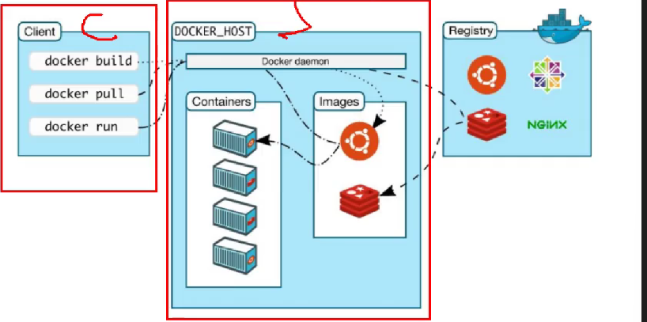
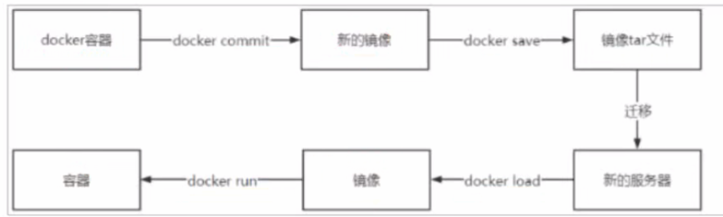

# Docker 笔记

## 目录

- [一、Docker 概述与架构](#一docker-概述与架构)
- [二、安装与配置](#二安装与配置)
- [三、核心命令速查](#三核心命令速查)
- [四、Docker 数据管理](#四docker-数据管理)
- [五、Docker 网络](#五docker-网络)
- [六、Dockerfile 与镜像构建](#六dockerfile-与镜像构建)
- [七、Docker Compose](#七docker-compose)
- [八、常用容器部署速查](#八常用容器部署速查)
- [九、常见问题与排查](#九常见问题与排查)

---

## 一、Docker 概述与架构

### 1.1 什么是 Docker

Docker 是一个开源的**容器化平台**，用于将应用及其依赖打包到轻量、可移植的容器中。

**核心特点**：

- **轻量级**：容器共享宿主机内核，启动速度快、资源占用少
- **可移植**：一次构建，随处运行（开发、测试、生产环境一致）
- **隔离性**：每个容器独立运行，互不干扰

### 1.2 Docker vs 传统虚拟机

| 对比项 | Docker 容器 | 传统虚拟机 |
|--------|-------------|------------|
| 启动时间 | 秒级 | 分钟级 |
| 资源占用 | MB 级 | GB 级 |
| 性能 | 接近原生 | 有损耗 |
| 隔离级别 | 进程级 | 操作系统级 |
| 操作系统 | 共享宿主机内核 | 独立内核 |

### 1.3 Docker 架构

<p align='center'>
    
</p>

**核心组件**：

| 组件 | 说明 |
|------|------|
| **镜像（Image）** | 只读模板，包含运行应用所需的所有内容（代码、运行时、库、配置） |
| **容器（Container）** | 镜像的运行实例，是一个隔离的进程 |
| **仓库（Registry）** | 存储和分发镜像的地方，如 Docker Hub、私有仓库 |
| **Docker Daemon** | 守护进程，负责构建、运行、分发容器 |
| **Docker Client** | 客户端，通过 CLI 或 API 与 Daemon 交互 |

**镜像与容器的关系**：类比面向对象编程，镜像 = 类，容器 = 对象实例。

---

## 二、安装与配置

### 2.1 Linux 环境（CentOS）

#### 2.1.1 前置准备

安装 GCC 环境：

```bash
yum install gcc
yum install gcc-c++
```

安装 Docker 依赖：

```bash
yum install -y yum-utils \
  device-mapper-persistent-data \
  lvm2
```

#### 2.1.2 配置镜像源

官方源（可能有问题）：

```bash
sudo yum-config-manager \
    --add-repo \
    https://download.docker.com/linux/centos/docker-ce.repo
```

清华源（国内推荐）：

```bash
sed -i 's+https://download.docker.com+https://mirrors.tuna.tsinghua.edu.cn/docker-ce+' /etc/yum.repos.d/docker-ce.repo
```

#### 2.1.3 安装 Docker

分步安装：

```bash
yum install -y docker-ce docker-ce-cli containerd.io docker-buildx-plugin docker-compose-plugin
```

一键安装（阿里云镜像）：

```bash
curl -fsSL https://github.com/tech-shrimp/docker_installer/releases/download/latest/linux.sh | bash -s docker --mirror Aliyun
```

#### 2.1.4 卸载 Docker

```bash
yum remove docker \
    docker-client \
    docker-client-latest \
    docker-common \
    docker-latest \
    docker-latest-logrotate \
    docker-logrotate \
    docker-engine
```

#### 2.1.5 配置镜像加速

创建配置目录：

```bash
sudo mkdir -p /etc/docker
```

编辑配置文件 `/etc/docker/daemon.json`：

```json
{
  "registry-mirrors": [
    "https://docker.m.daocloud.io",
    "https://docker.1panel.live",
    "https://docker.xuanyuan.me",
    "https://docker.mirrors.ustc.edu.cn",
    "https://registry.dockermirror.com",
    "https://hub-mirror.c.163.com"
  ]
}
```

> 注意：JSON 配置最后不要有逗号！阿里云镜像仓库已不对外开放，仅阿里云服务器可用。

腾讯云服务器额外配置：

```json
{
  "registry-mirrors": [
    "https://docker.m.daocloud.io",
    "https://docker.1panel.live",
    "https://docker.xuanyuan.me",
    "https://docker.mirrors.ustc.edu.cn",
    "https://registry.dockermirror.com",
    "https://hub-mirror.c.163.com",
    "https://mirror.ccs.tencentyun.com"
  ]
}
```

重载配置并重启：

```bash
sudo systemctl daemon-reload
sudo systemctl restart docker
```

#### 2.1.6 配置远程连接（可选）

用于 IDEA/其他工具远程部署镜像到 Docker。

修改 `/lib/systemd/system/docker.service`：

```bash
# 原配置
ExecStart=/usr/bin/dockerd -H fd:// --containerd=/run/containerd/containerd.sock

# 改为（添加 TCP 监听）
ExecStart=/usr/bin/dockerd -H tcp://0.0.0.0:2375 -H fd:// --containerd=/run/containerd/containerd.sock
```

> 注意：生产环境建议限制 IP 或使用 TLS 加密，2375 端口无认证有安全风险。

重启服务：

```bash
systemctl daemon-reload
systemctl restart docker
```

### 2.2 Windows 环境

[参考官方文档](https://docs.docker.com/desktop/setup/install/windows-install/)

```
"C:\Docker Desktop Installer.exe" install `
  --installation-dir="D:\02_DevStack\06_DevTools\Docker" `
  --backend=hyper-v `
  --hyper-v-default-data-root="E:\08_Docker_Data\hyper-v" `
  --windows-containers-default-data-root="E:\08_Docker_Data\images"
```

多行命令无法正常执行，改成单行即可。	

```
"C:\Docker Desktop Installer.exe" install --installation-dir="D:\02_DevStack\06_DevTools\Docker" --backend=hyper-v --hyper-v-default-data-root="E:\08_Docker_Data\hyper-v" --windows-containers-default-data-root="E:\08_Docker_Data\images"
```

靠了，不让我安装到其他地方，真没招了，还是不用命令行了。把镜像位置改一下就行。

| **参数名**                                   | **设定值**                          | **作用**                                        |
| -------------------------------------------- | ----------------------------------- | ----------------------------------------------- |
| **`--installation-dir`**                     | `D:\02_DevStack\06_DevTools\Docker` | 指定安装位置                                    |
| **`--backend`**                              | `hyper-v`                           | 强制使用 Hyper-V 后端，跳过 WSL2。              |
| **`--hyper-v-default-data-root`**            | `E:\08_Docker_Data\hyper-v`         | 存放 Docker 运行所需的虚拟机硬盘文件（.vhdx）。 |
| **`--windows-containers-default-data-root`** | `E:\08_Docker_Data\images`          | 存放 Pull 下来的各种镜像数据。                  |

---

## 三、核心命令速查

镜像由多层组成，层是公用的，下载其他镜像时可复用已下载的层。

### 3.1 镜像命令

| 命令 | 说明 | 示例 |
|------|------|------|
| `docker search` | 搜索镜像 | `docker search nginx` |
| `docker pull` | 拉取镜像 | `docker pull nginx:1.24` |
| `docker images` | 查看本地镜像 | `docker images -a` |
| `docker rmi` | 删除镜像 | `docker rmi -f nginx:1.24` |
| `docker tag` | 重命名镜像 | `docker tag nginx:1.24 mynginx:v1` |
| `docker load` | 从 tar 加载镜像 | `docker load -i nginx.tar` |
| `docker save` | 导出镜像为 tar | `docker save -o nginx.tar nginx:1.24` |

**常用组合命令**：

```bash
# 删除所有镜像
docker rmi -f $(docker images -aq)

# 查看镜像详细信息
docker inspect nginx:1.24

# 查看镜像历史（各层信息）
docker history nginx:1.24
```

### 3.2 容器命令

#### 3.2.1 创建容器参数说明

| 参数 | 说明 |
|------|------|
| `-i` | 以交互模式运行，保持 STDIN 打开 |
| `-t` | 分配伪终端，通常与 `-i` 合用为 `-it` |
| `-d` | 后台运行（守护式容器） |
| `--name` | 指定容器名称 |
| `-p` | 端口映射，格式：`宿主机端口:容器端口` |
| `-P` | 随机端口映射 |
| `-v` | 挂载目录，格式：`宿主机路径:容器路径` |
| `-e` | 设置环境变量 |
| `--restart` | 重启策略：`always`、`on-failure`、`no` |
| `--network` | 指定网络 |
| `--privileged` | 给容器扩展权限 |

#### 3.2.2 容器生命周期命令

| 命令 | 说明 | 示例 |
|------|------|------|
| `docker run` | 创建并启动容器 | `docker run -d --name web nginx` |
| `docker start` | 启动已停止的容器 | `docker start web` |
| `docker stop` | 停止容器 | `docker stop web` |
| `docker restart` | 重启容器 | `docker restart web` |
| `docker kill` | 强制停止容器 | `docker kill web` |
| `docker rm` | 删除容器 | `docker rm web` |
| `docker pause` | 暂停容器 | `docker pause web` |
| `docker unpause` | 恢复容器 | `docker unpause web` |

#### 3.2.3 容器操作命令

```bash
# 查看运行中的容器
docker ps

# 查看所有容器（包括已停止）
docker ps -a

# 仅显示容器 ID
docker ps -aq

# 进入容器（推荐 exec，退出后容器不停止）
docker exec -it web /bin/bash

# 查看容器日志
docker logs -f web     # -f 实时跟踪

# 查看容器详细信息
docker inspect web

# 查看容器内进程
docker top web

# 查看容器资源占用
docker stats web

# 容器与宿主机文件互传
docker cp /host/path web:/container/path    # 宿主机 → 容器
docker cp web:/container/path /host/path    # 容器 → 宿主机

# 修改容器配置
docker update web --restart always

# 导出容器为 tar（不含镜像信息）
docker export web > web.tar

# 从 tar 导入为镜像
docker import web.tar myimage:v1
```

#### 3.2.4 交互式 vs 守护式容器

| 类型 | 特点 | 创建命令 | 进入方式 |
|------|------|----------|----------|
| **交互式** | 有终端交互，exit 后容器停止 | `docker run -it --name c1 centos /bin/bash` | 直接进入 |
| **守护式** | 后台运行，exit 后容器继续运行 | `docker run -d --name c2 nginx` | `docker exec -it c2 /bin/bash` |

### 3.3 数据卷命令

| 命令 | 说明 | 示例 |
|------|------|------|
| `docker volume create` | 创建数据卷 | `docker volume create mydata` |
| `docker volume ls` | 查看所有数据卷 | `docker volume ls` |
| `docker volume inspect` | 查看数据卷详情 | `docker volume inspect mydata` |
| `docker volume rm` | 删除数据卷 | `docker volume rm mydata` |
| `docker volume prune` | 删除未使用的数据卷 | `docker volume prune` |

### 3.4 网络命令

| 命令 | 说明 | 示例 |
|------|------|------|
| `docker network create` | 创建网络 | `docker network create mynet` |
| `docker network ls` | 查看网络列表 | `docker network ls` |
| `docker network inspect` | 查看网络详情 | `docker network inspect mynet` |
| `docker network rm` | 删除网络 | `docker network rm mynet` |
| `docker network connect` | 连接容器到网络 | `docker network connect mynet web` |
| `docker network disconnect` | 断开容器网络 | `docker network disconnect mynet web` |

### 3.5 日志与排查命令

```bash
# 查看容器日志
docker logs container_name

# 实时跟踪日志（类似 tail -f）
docker logs -f container_name

# 查看最近 100 行日志
docker logs --tail 100 container_name

# 查看容器内运行的进程
docker top container_name

# 实时查看容器资源占用
docker stats

# 查看容器详细信息（IP、挂载、配置等）
docker inspect container_name

# 查看 Docker 系统信息
docker info

# 查看 Docker 版本
docker version
```

---

## 四、Docker 数据管理

### 4.1 数据卷（Volume）

**概念**：Docker 管理的持久化存储，数据存于 `/var/lib/docker/volumes/`，与容器生命周期解耦。

**特点**：

- Docker 自动管理，删除容器时数据卷不会自动删除
- 多个容器可共享同一数据卷
- 支持远程存储、云存储

**挂载方式**：

```bash
# 创建并挂载数据卷
docker run -d --name redis -v mydata:/data redis:7.0.15

# 注：卷名前不能有 /，否则会被当作目录挂载
```

**注意事项**：

- 数据卷未提前创建时，会自动创建
- 数据卷不为空时，内容会覆盖容器目录
- 数据卷为空时，容器目录内容会复制到数据卷

### 4.2 目录挂载（Bind Mount）

**概念**：将宿主机特定目录直接挂载到容器，开发者可控路径。

```bash
docker run -d --name redis -v /root/redis-data:/data redis:7.0.15
```

**注意事项**：

- 宿主机目录前有 `/`（绝对路径）
- 目录不存在会自动创建
- **宿主机目录为空时，会清空容器目录内容**（危险！）

**权限问题**：

如果出现 `Permission denied`，添加 `--privileged=true`：

```bash
docker run -d --privileged=true -v /host/path:/container/path nginx
```

### 4.3 数据卷 vs 目录挂载对比

| 对比项 | 数据卷（Volume） | 目录挂载（Bind Mount） |
|--------|------------------|------------------------|
| 存储位置 | Docker 管理 `/var/lib/docker/volumes/` | 用户指定任意路径 |
| Docker 管理 | 是 | 否 |
| 跨主机移植 | 容易 | 困难 |
| 性能 | 好 | 好 |
| 适用场景 | 生产环境、持久化数据 | 开发环境、配置文件 |

### 4.4 容器数据备份与迁移

<p align='center'>
    
</p>

**步骤**：

```bash
# 1. 将容器提交为镜像
docker commit redis01 myredis:v1

# 2. 导出镜像为 tar 包
docker save -o ./myredis.tar myredis:v1

# 3. 在目标机器加载镜像
docker load -i ./myredis.tar

# 4. 使用镜像启动新容器
docker run -d --name redis02 myredis:v1
```

---

## 五、Docker 网络

### 5.1 网络类型

| 类型 | 说明 | 适用场景 |
|------|------|----------|
| **bridge** | 默认网络，容器间可通过 IP 互通 | 单机多容器通信 |
| **host** | 容器直接使用宿主机网络，无隔离 | 性能要求高、无需隔离 |
| **none** | 无网络，完全隔离 | 安全要求高的容器 |
| **自定义网络** | 用户创建，容器可通过名称互访 | 微服务架构、服务发现 |

### 5.2 创建自定义网络

```bash
# 创建网络
docker network create mynet

# 指定网络启动容器
docker run -d --name web --network mynet nginx
docker run -d --name api --network mynet python-app

# 同一网络内的容器可通过名称互访
# 在 web 容器内可直接访问 http://api:8000
```

### 5.3 网络模式对比

```bash
# bridge 模式（默认）
docker run -d --name web nginx
# 容器有独立 IP，需通过 IP 或端口映射访问

# host 模式
docker run -d --name web --network host nginx
# 容器直接用宿主机端口，无需 -p 映射

# none 模式
docker run -d --name web --network none nginx
# 容器无网络
```

---

## 六、Dockerfile 与镜像构建

### 6.1 Dockerfile 概念

Dockerfile 是一个文本文件，包含一系列指令，用于自动构建 Docker 镜像。

**构建流程**：Docker 按**顺序执行**每条指令，每条指令生成一个**镜像层（Layer）**。

### 6.2 常用指令详解

| 指令 | 作用 | 示例 |
|------|------|------|
| `FROM` | 指定基础镜像（必须为第一条） | `FROM centos:7` |
| `LABEL` | 添加元数据（如维护者） | `LABEL maintainer="admin@example.com"` |
| `RUN` | 构建时执行命令，生成新层 | `RUN yum install -y vim` |
| `COPY` | 复制文件到镜像（不解压） | `COPY app.jar /app/` |
| `ADD` | 复制文件并自动解压 tar | `ADD jdk.tar.gz /usr/local/` |
| `ENV` | 设置环境变量 | `ENV JAVA_HOME=/usr/local/jdk` |
| `WORKDIR` | 设置工作目录 | `WORKDIR /app` |
| `EXPOSE` | 声明端口（仅文档作用） | `EXPOSE 8080` |
| `CMD` | 容器启动默认命令（可覆盖） | `CMD ["java", "-jar", "app.jar"]` |
| `ENTRYPOINT` | 容器主命令（不易覆盖） | `ENTRYPOINT ["java"]` |
| `VOLUME` | 声明数据卷挂载点 | `VOLUME /data` |
| `USER` | 指定运行用户 | `USER appuser` |
| `ARG` | 构建时变量（不持久化） | `ARG VERSION=1.0` |

### 6.3 关键指令对比

#### COPY vs ADD

| 对比项 | COPY | ADD |
|--------|------|-----|
| 功能 | 仅复制文件 | 复制 + 自动解压 tar + URL下载 |
| 推荐 | ✅ 推荐（语义明确） | 仅在需要解压时使用 |

#### CMD vs ENTRYPOINT

| 对比项 | CMD | ENTRYPOINT |
|--------|-----|------------|
| 用途 | 默认命令，可被 `docker run` 参数覆盖 | 主命令，不易覆盖 |
| 覆盖方式 | `docker run image new_cmd` 整体替换 | `docker run image args` 作为追加参数 |
| 组合使用 | 作为 ENTRYPOINT 的默认参数 | 固定主命令 |

**组合示例**：

```dockerfile
ENTRYPOINT ["java", "-jar"]
CMD ["app.jar"]

# 默认执行：java -jar app.jar
# docker run myimage other.jar → 执行：java -jar other.jar
```

### 6.4 Dockerfile 最佳实践

**1. 减少镜像层数**：

```dockerfile
# 不推荐：多层
RUN yum install -y vim
RUN yum install -y net-tools
RUN yum clean all

# 推荐：合并为一层
RUN yum install -y vim net-tools && yum clean all
```

**2. 使用多阶段构建**：

```dockerfile
# 第一阶段：编译
FROM maven:3.8 AS builder
WORKDIR /app
COPY pom.xml .
RUN mvn dependency:go-offline
COPY src ./src
RUN mvn package

# 第二阶段：运行（仅包含编译产物）
FROM tomcat:9
COPY --from=builder /app/target/*.war /usr/local/tomcat/webapps/
```

**3. 合理利用缓存**：

- 把不常变化的指令放前面（如依赖安装）
- 把常变化的指令放后面（如 COPY 源码）

### 6.5 构建 JDK 镜像示例

```dockerfile
# 基础镜像
FROM centos:7

# 维护者信息
LABEL maintainer="admin@example.com"

# 创建目录并添加 JDK（自动解压）
RUN mkdir -p /usr/local/java
ADD jdk-17_linux-x64_bin.tar.gz /usr/local/java/

# 设置环境变量
ENV JAVA_HOME=/usr/local/java/jdk-17.0.7
ENV PATH=$PATH:$JAVA_HOME/bin

# 验证安装
RUN java -version
```

**构建命令**：

```bash
docker build -t centos7-jdk17 .
```

参数说明：

- `-t`：指定镜像名称和标签
- `.`：构建上下文路径（Dockerfile 所在目录）

---

## 七、Docker Compose

### 7.1 概念

Docker Compose 是 Docker 官方的容器编排工具，用于**批量管理多个容器**。

**核心功能**：
- 通过 YAML 文件定义多容器应用
- 一键启动/停止所有容器
- 管理容器间的依赖、网络、数据卷

### 7.2 常用命令

| 命令 | 说明 |
|------|------|
| `docker compose up -d` | 创建并启动所有容器 |
| `docker compose down` | 停止并删除所有容器、网络 |
| `docker compose start` | 启动已存在的容器 |
| `docker compose stop` | 停止容器 |
| `docker compose restart` | 重启容器 |
| `docker compose ps` | 查看容器状态 |
| `docker compose logs` | 查看日志 |
| `docker compose config` | 验证配置文件 |

**指定配置文件**：

```bash
docker compose -f docker-compose.yml up -d
```

### 7.3 compose 文件结构

```yaml
services:
  redis:
    image: redis:7.0.10
    container_name: redis001
    ports:
      - "6399:6379"
    volumes:
      - redis-data:/data
    restart: always
    networks:
      - mynet

  mysql:
    container_name: mysql001
    image: mysql:8.0.30
    ports:
      - "3399:3306"
    volumes:
      - mysql_data:/var/lib/mysql
      - mysql_conf:/etc/mysql
    environment:
      MYSQL_ROOT_PASSWORD: 1234
    restart: always
    networks:
      - mynet

  app:
    container_name: app001
    image: myapp:v1.0
    ports:
      - "8099:8080"
    depends_on:        # 依赖关系
      - redis
      - mysql
    networks:
      - mynet

volumes:
  redis-data: {}
  mysql_data: {}
  mysql_conf: {}

networks:
  mynet:
    driver: bridge
```

### 7.4 服务配置项说明

| 配置项 | 说明 |
|--------|------|
| `image` | 使用已有镜像 |
| `build` | 从 Dockerfile 构建 |
| `container_name` | 容器名称 |
| `ports` | 端口映射 |
| `volumes` | 数据卷挂载 |
| `environment` | 环境变量 |
| `restart` | 重启策略：`always`、`on-failure`、`no` |
| `depends_on` | 依赖的服务（启动顺序） |
| `networks` | 加入的网络 |
| `command` | 覆盖默认启动命令 |

---

## 八、常用容器部署速查

### 8.1 MySQL

```bash
docker run -d --name mysql \
  -p 3306:3306 \
  -v mysql_data:/var/lib/mysql \
  -v mysql_conf:/etc/mysql \
  -e MYSQL_ROOT_PASSWORD=root123 \
  mysql:8.0.30

# 进入容器（设置编码避免中文乱码）
docker exec -it -e LANG=C.UTF-8 mysql bash
```

### 8.2 Redis

```bash
# 创建配置目录
mkdir -p /mydata/redis/conf/mydata/redis/data
touch /mydata/redis/conf/redis.conf

# 启动 Redis
docker run -d --name redis \
  -p 6379:6379 \
  -v /mydata/redis/data:/data \
  -v /mydata/redis/conf/redis.conf:/etc/redis/redis.conf \
  redis:7.0.15 \
  redis-server /etc/redis/redis.conf

# 测试连接
docker exec -it redis redis-cli
```

### 8.3 RabbitMQ

```bash
docker run -d --name rabbitmq \
  -p 5672:5672 \
  -p 15672:15672 \
  -v rabbitmq-plugin:/plugins \
  -e RABBITMQ_DEFAULT_USER=root \
  -e RABBITMQ_DEFAULT_PASS=root123 \
  rabbitmq:3.12.0-management

# 启用延迟消息插件
rabbitmq-plugins enable rabbitmq_delayed_message_exchange
```

> 端口说明：5672 为客户端连接端口，15672 为管理界面端口。

### 8.4 Nacos

```bash
docker pull nacos/nacos-server:v2.1.1

docker run -d --name nacos \
  -e MODE=standalone \
  -p 8848:8848 \
  -p 9848:9848 \
  nacos/nacos-server:v2.1.1
```

> Nacos 2.x 新增 gRPC 端口 9848，需同时映射。

### 8.5 MinIO

```bash
docker run -d --name minio \
  -p 9000:9000 \
  -p 9001:9001 \
  -e "MINIO_ROOT_USER=minioadmin" \
  -e "MINIO_ROOT_PASSWORD=minioadmin" \
  -v minio-data:/data \
  --restart=always \
  minio/minio \
  server /data --console-address ":9001"
```

> 端口说明：9000 为 API 端口，9001 为控制台端口。

### 8.6 Nginx

```bash
docker run -d --name nginx \
  -p 80:80 \
  -v nginx_conf:/etc/nginx \
  -v nginx_html:/usr/share/nginx/html \
  -v nginx_logs:/var/log/nginx \
  nginx
```

### 8.7 Elasticsearch

```bash
# 创建目录
mkdir -p /opt/elasticsearch/{config,plugins,data}
chmod -R 777 /opt/elasticsearch

# 创建配置文件
cat <<EOF > /opt/elasticsearch/config/elasticsearch.yml
xpack.security.enabled: true
xpack.license.self_generated.type: basic
xpack.security.transport.ssl.enabled: false
xpack.security.enrollment.enabled: true
http.host: 0.0.0.0
EOF

# 启动
docker network create elastic

docker run -d --name elasticsearch \
  -p 9200:9200 -p 9300:9300 \
  --net elastic \
  --restart=always \
  -e "discovery.type=single-node" \
  -e ES_JAVA_OPTS="-Xms512m -Xmx512m" \
  -v /opt/elasticsearch/config/elasticsearch.yml:/usr/share/elasticsearch/config/elasticsearch.yml \
  -v /opt/elasticsearch/data:/usr/share/elasticsearch/data \
  -v /opt/elasticsearch/plugins:/usr/share/elasticsearch/plugins \
  elasticsearch:8.5.0

# 重置密码（等待 ES 启动完成后执行）
docker exec -it elasticsearch bin/elasticsearch-reset-password -u elastic -i
docker exec -it elasticsearch bin/elasticsearch-reset-password -u kibana_system -i
```

### 8.8 MongoDB

```bash
docker pull mongo:7.0.0

mkdir -p /opt/mongo/data/db

docker run -d --name mongo \
  --restart=always \
  -p 27017:27017 \
  -v /opt/mongo/data/db:/data/db \
  mongo:7.0.0

# 连接
docker exec -it mongo mongosh
```

### 8.9 Portainer（Docker 管理界面）

```bash
docker run -d --name portainer \
  -p 19000:9000 \
  -v /var/run/docker.sock:/var/run/docker.sock \
  -v /app/portainer_data:/data \
  --restart always \
  --privileged=true \
  portainer/portainer-ce:latest

# 访问 http://<服务器IP>:19000
```

### 8.10 Sentinel

```bash
docker pull bladex/sentinel-dashboard:latest

docker run -d --name sentinel-dashboard \
  --restart=always \
  -p 8858:8858 \
  bladex/sentinel-dashboard:latest
```

### 8.11 Zipkin

```bash
docker pull openzipkin/zipkin

docker run -d --name zipkin \
  --restart=always \
  -p 9411:9411 \
  openzipkin/zipkin
```

---

## 九、常见问题与排查

### 9.1 容器启动失败

```bash
# 查看容器状态
docker ps -a

# 查看容器日志
docker logs container_name

# 查看容器详细信息
docker inspect container_name
```

**常见原因**：

- 端口冲突：宿主机端口已被占用
- 镜像不存在：检查镜像是否正确拉取
- 资源不足：内存、磁盘空间不足
- 配置错误：环境变量、挂载路径等配置问题

### 9.2 镜像拉取失败

**原因**：国内访问 Docker Hub 速度慢或被限制

**解决方案**：

- 配置国内镜像加速源
- 使用代理或 VPN
- 从本地 tar 文件加载：`docker load -i xxx.tar`

### 9.3 权限问题

**现象**：挂载目录后出现 `Permission denied`

**解决**：
```bash
# 方案一：添加特权模式
docker run --privileged=true -v /host:/container image

# 方案二：在 Dockerfile 中设置用户
USER root
```

### 9.4 容器时间与宿主机不一致

**原因**：容器默认使用 UTC 时区

**解决**：
```bash
# 挂载宿主机时区文件
docker run -v /etc/localtime:/etc/localtime:ro image

# 或设置环境变量
docker run -e TZ=Asia/Shanghai image
```

### 9.5 Docker 占用磁盘过大

```bash
# 查看 Docker 磁盘占用
docker system df

# 清理未使用的资源
docker system prune

# 仅清理镜像
docker image prune

# 仅清理容器
docker container prune

# 仅清理数据卷
docker volume prune
```

### 9.6 进入容器执行命令

```bash
# 常见容器 shell 路径
docker exec -it container /bin/bash    # CentOS/Ubuntu
docker exec -it container /bin/sh      # Alpine
docker exec -it container sh           # 精简镜像可能只有 sh
```

---

## 面试高频考点

### 1. Docker 核心概念

**镜像 vs 容器**：镜像是静态模板（类似类），容器是运行实例（类似对象）。

**Docker vs 虚拟机**：容器共享宿主机内核，启动快、资源占用少；虚拟机独立内核，隔离性强。

### 2. Dockerfile 指令

**CMD vs ENTRYPOINT**：CMD 可被覆盖，ENTRYPOINT 作为主命令不易覆盖，常组合使用。

**COPY vs ADD**：COPY 仅复制，ADD 会自动解压 tar 包。

### 3. 数据持久化

**数据卷 vs 目录挂载**：数据卷 Docker 管理、易于移植；目录挂载用户管理、适合开发环境。

### 4. 网络

**自定义网络优势**：容器可通过名称互访，适合微服务架构。

### 5. 镜像优化

**减少层数**：合并 RUN 命令，减少镜像层。

**多阶段构建**：编译与运行分离，减小最终镜像体积。