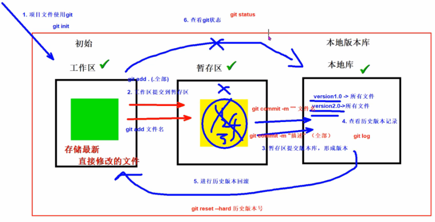
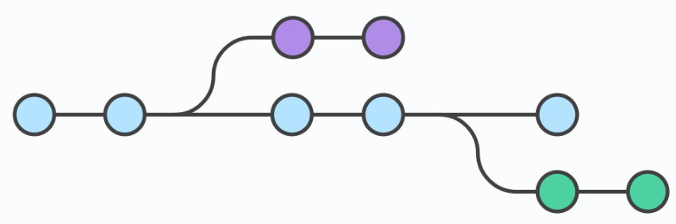
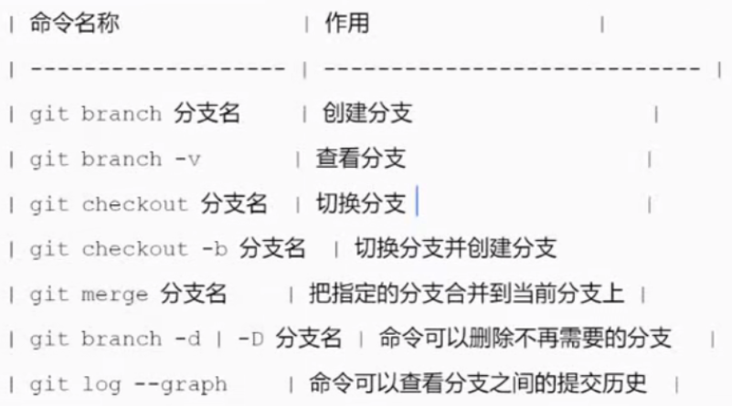

# Git 笔记

## 目录

- [一、Git 概述](#一git-概述)
- [二、Git 核心概念](#二git-核心概念)
- [三、Git 常用命令速查](#三git-常用命令速查)
- [四、Git 分支管理](#四git-分支管理)
- [五、Git 远程仓库](#五git-远程仓库)
- [六、Git 高级操作](#六git-高级操作)
- [七、Git 工作流](#七git-工作流)
- [八、Git 提交规范](#八git-提交规范)
- [九、常见问题与排查](#九常见问题与排查)
- [十、面试高频考点](#十面试高频考点)

---

## 一、Git 概述

### 1.1 什么是 Git

Git 是一个**分布式版本控制系统**，用于跟踪文件的变更历史，支持多人协作开发。

**核心特点**：

- **分布式**：每个开发者都有完整的仓库副本，离线也能工作
- **高效**：快照存储，分支切换速度快
- **安全**：SHA-1 哈希校验，保证数据完整性

### 1.2 Git vs SVN

| 对比项 | Git（分布式） | SVN（集中式） |
|--------|---------------|---------------|
| 仓库结构 | 每个开发者有完整仓库 | 仅中央服务器有完整仓库 |
| 离线工作 | 支持 | 不支持 |
| 分支操作 | 轻量、快速 | 较重、较慢 |
| 提交方式 | 先提交到本地，再推送 | 直接提交到中央服务器 |
| 性能 | 本地操作快 | 依赖网络速度 |

---

## 二、Git 核心概念

### 2.1 工作区域划分

<p align='center'>
    
</p>

| 区域 | 说明 |
|------|------|
| **工作区（Workspace）** | 正在编辑的文件所在目录，即项目根目录 |
| **暂存区（Stage/Index）** | 使用 `git add` 后文件暂存的位置，准备提交 |
| **本地仓库（Repository）** | 使用 `git commit` 后提交的位置，存储版本历史 |
| **远程仓库（Remote）** | 如 GitHub、GitLab，用于团队协作共享代码 |

**文件状态流转**：

```
工作区 → git add → 暂存区 → git commit → 本地仓库 → git push → 远程仓库
         ↑                    ↑                      ↑
     Untracked            Staged                Committed
     Modified             Unstaged              Pushed
```

### 2.2 文件状态

| 状态 | 说明 |
|------|------|
| **Untracked** | 新文件，未被 Git 管理 |
| **Tracked** | 已被 Git 管理 |
| **Staged** | 已通过 `git add` 添加到暂存区 |
| **Modified** | 已被跟踪但工作区有修改，未添加到暂存区 |
| **Committed** | 已提交到本地仓库 |

### 2.3 分支概念

<p align='center'>
    
</p>

<p align='center'>
    
</p>

**分支（Branch）**：一条独立的开发线，可以从主线上分离出来，独立开发而不影响主线。

**HEAD 指针**：指向当前所在分支的最新提交。

**分支优势**：
- 并行开发：多人同时开发不同功能
- 功能隔离：新功能开发不影响主分支
- 安全实验：失败的实验分支可随时删除

---

## 三、Git 常用命令速查

### 3.1 配置与初始化

| 命令 | 说明 | 示例 |
|------|------|------|
| `git config` | 配置用户信息 | `git config --global user.name "name"` |
| `git init` | 初始化仓库 | `git init` |
| `git clone` | 克隆远程仓库 | `git clone <url>` |

**配置用户信息**：

```bash
# 全局配置（所有仓库生效）
git config --global user.name "liutianba"
git config --global user.email "liutianba7@163.com"

# 当前仓库配置（仅当前仓库生效）
git config user.name "liutianba"
git config user.email "liutianba7@163.com"

# 查看配置
git config --list
```

**初始化仓库**：

```bash
# 在当前目录初始化
git init

# 克隆远程仓库
git clone https://github.com/user/repo.git
git clone git@github.com:user/repo.git  # SSH方式
```

### 3.2 基础操作

| 命令 | 说明 | 示例 |
|------|------|------|
| `git add` | 添加文件到暂存区 | `git add file.txt` |
| `git status` | 查看文件状态 | `git status` |
| `git commit` | 提交到本地仓库 | `git commit -m "message"` |
| `git rm` | 删除文件 | `git rm file.txt` |

**添加文件**：

```bash
# 添加单个文件
git add filename

# 添加所有修改
git add .

# 添加所有文件（包括删除）
git add -A

# 查看状态
git status
git status -s  # 精简输出
```

**提交**：

```bash
# 提交暂存区内容
git commit -m "提交说明"

# 跳过暂存区直接提交（已跟踪文件）
git commit -a -m "提交说明"

# 修改上次提交（未推送前）
git commit --amend -m "新的提交说明"
```

### 3.3 查看历史

| 命令 | 说明 | 示例 |
|------|------|------|
| `git log` | 查看提交历史 | `git log` |
| `git reflog` | 查看所有操作记录 | `git reflog` |
| `git diff` | 查看差异 | `git diff` |
| `git show` | 查看某次提交详情 | `git show <commit>` |

**查看提交历史**：

```bash
# 详细历史
git log

# 精简历史（一行显示）
git log --oneline

# 最近 n 条
git log -n 5

# 图形化显示分支
git log --oneline --graph --all

# 显示文件变更统计
git log --stat
```

**查看操作记录（包含回滚记录）**：

```bash
git reflog
git reflog -n 10  # 最近 10 条
```

> `git log` 只显示提交历史，`git reflog` 显示所有 HEAD 指针移动记录（包括回滚）。

**查看差异**：

```bash
# 工作区 vs 暂存区
git diff

# 暂存区 vs 最新提交
git diff --staged
git diff --cached  # 同上

# 工作区 vs 某次提交
git diff <commit>

# 两个提交之间
git diff <commit1> <commit2>

# 仅显示文件名
git diff --name-only
```

### 3.4 版本回退

| 命令 | 说明 | 示例 |
|------|------|------|
| `git reset` | 回退到指定版本 | `git reset --hard <commit>` |
| `git revert` | 撤销某次提交（新建提交） | `git revert <commit>` |
| `git checkout` | 撤销工作区修改 | `git checkout -- file` |

#### git reset 三种模式

| 模式 | 工作区 | 暂存区 | 提交历史 | 说明 |
|------|--------|--------|----------|------|
| `--soft` | 不变 | 不变 | 回退 | 仅回退提交，保留修改 |
| `--mixed`（默认） | 不变 | 清空 | 回退 | 回退提交和暂存区，保留工作区修改 |
| `--hard` | 清空 | 清空 | 回退 | 全部回退，修改丢失（危险） |

```bash
# 回退到上一个版本
git reset --soft HEAD^
git reset --mixed HEAD^  # 默认模式
git reset --hard HEAD^

# 回退到指定版本
git reset --hard <commit-id>

# 回退 n 个版本
git reset --hard HEAD~3
```

> 注意：`--hard` 会丢失工作区修改，谨慎使用！

#### git reset vs git revert

| 对比项 | git reset | git revert |
|--------|-----------|------------|
| 历史记录 | 删除提交历史 | 新建撤销提交，保留原历史 |
| 影响范围 | 回退多个提交 | 撤销单个提交 |
| 适用场景 | 本地未推送的提交 | 已推送的提交（不影响他人） |
| 安全性 | 可能影响他人 | 安全，适合公共分支 |

```bash
# revert 撤销某次提交
git revert <commit-id>

# revert 多次提交（从旧到新）
git revert <older-commit>..<newer-commit>
```

### 3.5 分支操作

| 命令 | 说明 | 示例 |
|------|------|------|
| `git branch` | 查看/创建分支 | `git branch` / `git branch dev` |
| `git checkout` | 切换分支 | `git checkout dev` |
| `git switch` | 切换分支（新语法） | `git switch dev` |
| `git merge` | 合并分支 | `git merge dev` |
| `git branch -d` | 删除分支 | `git branch -d dev` |

**查看分支**：

```bash
# 查看本地分支
git branch
git branch -v  # 显示最后一次提交

# 查看所有分支（含远程）
git branch -a

# 查看远程分支
git branch -r
```

**创建与切换**：

```bash
# 创建分支
git branch dev

# 切换分支
git checkout dev
git switch dev  # Git 2.23+ 新语法，更明确

# 创建并切换
git checkout -b dev
git switch -c dev  # 新语法
```

**删除分支**：

```bash
# 删除已合并的分支
git branch -d dev

# 强制删除（未合并）
git branch -D dev

# 删除远程分支
git push origin --delete dev
```

**重命名分支**：

```bash
# 重命名当前分支
git branch -m new-name

# 重命名指定分支
git branch -m old-name new-name
```

### 3.6 远程仓库操作

| 命令 | 说明 | 示例 |
|------|------|------|
| `git remote` | 管理远程仓库 | `git remote -v` |
| `git push` | 推送到远程 | `git push origin main` |
| `git pull` | 拉取远程更新 | `git pull origin main` |
| `git fetch` | 获取远程更新（不合并） | `git fetch origin` |

**关联远程仓库**：

```bash
# 添加远程仓库
git remote add origin https://github.com/user/repo.git
git remote add origin git@github.com:user/repo.git  # SSH

# 查看远程仓库
git remote -v

# 修改远程仓库地址
git remote set-url origin <new-url>

# 删除远程仓库关联
git remote remove origin
```

**推送与拉取**：

```bash
# 推送当前分支到远程
git push origin main

# 推送并建立关联
git push -u origin main

# 推送所有分支
git push origin --all

# 推送标签
git push origin --tags

# 拉取并合并（fetch + merge）
git pull origin main

# 仅获取更新（不自动合并）
git fetch origin

# 查看远程分支更新
git fetch origin
git log origin/main  # 查看远程分支日志
```

**克隆仓库**：

```bash
# 克隆仓库（默认关联 origin）
git clone https://github.com/user/repo.git

# 克隆指定分支
git clone -b dev https://github.com/user/repo.git

# 克隆到指定目录
git clone <url> my-project
```

### 3.7 暂存操作（stash）

**场景**：正在 dev 分支开发，突然需要切换到 main 修复紧急 bug，但当前修改未完成不想提交。

| 命令 | 说明 | 示例 |
|------|------|------|
| `git stash` | 暂存工作区修改 | `git stash` |
| `git stash list` | 查看暂存列表 | `git stash list` |
| `git stash pop` | 恢复并删除暂存 | `git stash pop` |
| `git stash apply` | 恢复暂存（保留记录） | `git stash apply` |
| `git stash drop` | 删除暂存记录 | `git stash drop` |

```bash
# 暂存当前修改
git stash
git stash save "暂存说明"  # 带说明

# 查看暂存列表
git stash list

# 恢复最近一次暂存
git stash pop  # 恢复并删除
git stash apply  # 恢复但保留

# 恢复指定暂存
git stash apply stash@{0}

# 删除暂存
git stash drop stash@{0}
git stash clear  # 清空所有暂存
```

### 3.8 标签操作（tag）

**标签**：用于标记重要的提交点，如版本发布（v1.0、v2.0）。

| 命令 | 说明 | 示例 |
|------|------|------|
| `git tag` | 查看标签 | `git tag` |
| `git tag <name>` | 创建轻量标签 | `git tag v1.0` |
| `git tag -a` | 创建附注标签 | `git tag -a v1.0 -m "说明"` |
| `git show <tag>` | 查看标签详情 | `git show v1.0` |
| `git push --tags` | 推送标签 | `git push origin --tags` |
| `git tag -d` | 删除本地标签 | `git tag -d v1.0` |

```bash
# 查看标签
git tag
git tag -l "v1.*"  # 匹配模式

# 创建标签
git tag v1.0  # 轻量标签（仅提交引用）
git tag -a v1.0 -m "版本1.0发布"  # 附注标签（推荐）

# 给历史提交打标签
git tag -a v0.9 <commit-id> -m "说明"

# 推送标签到远程
git push origin v1.0  # 单个标签
git push origin --tags  # 所有标签

# 删除标签
git tag -d v1.0
git push origin --delete v1.0  # 删除远程标签
```

---

## 四、Git 分支管理

### 4.1 分支合并

**合并方式**：

| 方式 | 说明 | 适用场景 |
|------|------|----------|
| `git merge` | 创建合并提交，保留分支历史 | 公共分支、团队协作 |
| `git rebase` | 变基，线性历史，无合并提交 | 个人分支、清理历史 |

**merge 合并**：

```bash
# 合并指定分支到当前分支
git merge dev

# 合并并生成合并提交（即使可快进）
git merge --no-ff dev

# 快进合并（无合并提交）
git merge dev --ff
```

**快进合并 vs 非快进合并**：

| 类型 | 说明 | 图示 |
|------|------|------|
| **快进合并（Fast-forward）** | 直接移动指针，无合并提交 | 线性历史 |
| **非快进合并（--no-ff）** | 创建合并提交，保留分支历史 | 有分支节点 |

> 推荐：公共分支使用 `--no-ff`，保留历史便于回溯。

### 4.2 冲突解决

**冲突产生原因**：合并时，同一文件同一位置有不同修改。

**解决步骤**：

```bash
# 1. 合并分支（产生冲突）
git merge dev

# 2. 查看冲突文件
git status

# 3. 手动编辑冲突文件
# 冲突标记格式：
<<<<<<< HEAD
当前分支的内容
=======
要合并分支的内容
>>>>>>> dev

# 4. 解决后添加到暂存区
git add <conflicted-file>

# 5. 提交合并结果
git commit -m "解决合并冲突"
```

**冲突标记说明**：

```
<<<<<<< HEAD
main分支的修改
=======
dev分支的修改
>>>>>>> dev
```

- `<<<<<<< HEAD` 到 `=======`：当前分支（HEAD）的内容
- `=======` 到 `>>>>>>> dev`：要合并分支的内容

**查看冲突详情**：

```bash
git diff --name-only --diff-filter=U  # 仅显示冲突文件名
git mergetool  # 使用可视化工具解决冲突
```

---

## 五、Git 远程仓库

### 5.1 SSH 配置

**优势**：免密推送/拉取代码，安全性更高。

**配置步骤**：

```bash
# 1. 生成 SSH 密钥对
ssh-keygen -t ed25519 -C "your_email@example.com"
# 或使用 RSA（兼容旧系统）
ssh-keygen -t rsa -b 4096 -C "your_email@example.com"

# 2. 启动 SSH 代理
eval "$(ssh-agent -s)"

# 3. 添加私钥到代理
ssh-add ~/.ssh/id_ed25519

# 4. 查看公钥（复制到 GitHub/GitLab）
cat ~/.ssh/id_ed25519.pub

# 5. 测试连接
ssh -T git@github.com
ssh -T git@gitee.com
```

**多仓库密钥配置**（`.ssh/config`）：

```
# GitHub
Host github.com
    HostName github.com
    User git
    IdentityFile ~/.ssh/id_ed25519_github

# Gitee
Host gitee.com
    HostName gitee.com
    User git
    IdentityFile ~/.ssh/id_ed25519_gitee
```

### 5.2 远程仓库命令

**推送拉取流程图**：

```
本地仓库 ────── git push ──────→ 远程仓库
    │                                │
    │                                │
git pull ←────────────────────── git fetch + merge
```

**fetch vs pull**：

| 命令 | 说明 |
|------|------|
| `git fetch` | 仅获取远程更新，不自动合并，可先查看再决定 |
| `git pull` | fetch + merge，自动合并到当前分支 |

```bash
# fetch 后手动合并
git fetch origin
git log origin/main  # 先查看远程更新
git merge origin/main  # 再手动合并
```

### 5.3 .gitignore 配置

**作用**：指定 Git 忽略的文件，不纳入版本管理。

**Java 项目模板**：

```gitignore
# Compiled class file
*.class

# Log file
*.log

# Package Files
*.jar
*.war
*.ear
*.zip
*.tar.gz
*.rar

# IDE Files
.idea/
*.iml
.project
.classpath
.settings/

# Build Output
target/
build/
out/

# Dependencies (Maven/Gradle)
.mvn/
!**/src/main/**/target/
!**/src/test/**/target/
```

**Python 项目模板**：

```gitignore
# Byte-compiled / optimized
__pycache__/
*.py[cod]

# Virtual Environment
venv/
.venv/
env/

# IDE
.vscode/
.idea/

# Distribution
dist/
build/
*.egg-info/

# Logs
*.log
```

**全局配置**：

```bash
# 创建全局忽略文件
git config --global core.excludesfile ~/.gitignore_global
```

**规则说明**：

| 规则 | 说明 | 示例 |
|------|------|------|
| `#` | 注释 | `# 这是注释` |
| `*` | 通配符 | `*.log` |
| `?` | 单字符 | `file?.txt` |
| `!` | 否定（不忽略） | `!important.log` |
| `/` | 目录分隔 | `build/` |
| `**` | 多级目录 | `**/node_modules/` |

---

## 六、Git 高级操作

### 6.1 git rebase（变基）

**作用**：将当前分支的提交"重新应用"到目标分支上，使历史更线性整洁。

**merge vs rebase**：

| 对比项 | git merge | git rebase |
|--------|-----------|------------|
| 历史 | 保留分支历史，有合并提交 | 线性历史，无合并提交 |
| 提交数 | 新增合并提交 | 不新增，原提交被"重写" |
| 适用 | 公共分支合并 | 个人分支整理历史 |

```bash
# 将当前分支变基到 main
git rebase main

# 交互式变基（可编辑、合并、删除提交）
git rebase -i HEAD~3
```

**交互式变基选项**：

| 选项 | 说明 |
|------|------|
| `pick` | 保留该提交 |
| `reword` | 修改提交信息 |
| `edit` | 编辑该提交 |
| `squash` | 合并到前一个提交 |
| `drop` | 删除该提交 |

> 注意：不要对已推送的公共分支执行 rebase，会改变历史影响他人。

### 6.2 git cherry-pick

**作用**：选择性将某个提交应用到当前分支。

```bash
# 应用单个提交
git cherry-pick <commit-id>

# 应用多个提交
git cherry-pick <commit1> <commit2>

# 应用提交范围
git cherry-pick <start-commit>..<end-commit>
```

**场景**：紧急 bug 在 dev 分支修复，需要单独应用到 main 分支。

### 6.3 撤销操作汇总

| 场景 | 命令 |
|------|------|
| 撤销工作区修改（未 add） | `git checkout -- <file>` 或 `git restore <file>` |
| 撤销暂存区（已 add，未 commit） | `git reset HEAD <file>` 或 `git restore --staged <file>` |
| 撤销提交（未 push） | `git reset --soft HEAD^` |
| 撤销已推送提交 | `git revert <commit>` |
| 修改上次提交信息 | `git commit --amend` |

```bash
# Git 2.23+ 新命令（推荐）
git restore <file>           # 撤销工作区修改
git restore --staged <file>  # 撤销暂存区
git restore --source=<commit> <file>  # 从指定提交恢复
```

---

## 七、Git 工作流

### 7.1 Git Flow

<p align='center'>
    
</p>

**分支结构**：

| 分支 | 说明 | 生命周期 |
|------|------|----------|
| `main` | 生产环境，仅接受 merge | 永久 |
| `develop` | 开发主分支 | 永久 |
| `feature/*` | 功能开发分支 | 临时，完成后合并到 develop |
| `release/*` | 发布准备分支 | 临时，完成后合并到 main 和 develop |
| `hotfix/*` | 紧急修复分支 | 临时，完成后合并到 main 和 develop |

**适用场景**：有明确发布周期的项目。

### 7.2 GitHub Flow

**简化流程**：

```
main ────→ 创建 feature 分支 ────→ 开发 ────→ Pull Request ────→ Code Review ────→ 合并到 main
```

**特点**：

- 只有一个长期分支 `main`
- 随时可以部署
- 通过 Pull Request 进行代码审查

**适用场景**：持续部署的项目、开源项目。

---

## 八、Git 提交规范

### 8.1 Commit Message 格式

```
<type>(<scope>): <subject>

<body>

<footer>
```

### 8.2 Type 类型

| 类型 | 说明 |
|------|------|
| `feat` | 新功能 |
| `fix` | 修复 bug |
| `docs` | 文档变更 |
| `style` | 代码格式（不影响逻辑） |
| `refactor` | 重构（既非新功能也非 bug 修复） |
| `perf` | 性能优化 |
| `test` | 增加测试 |
| `chore` | 构建过程或辅助工具变动 |
| `revert` | 回滚提交 |
| `build` | 构建系统或外部依赖变更 |
| `ci` | CI 配置文件和脚本变更 |

### 8.3 示例

```bash
# 新功能
feat(user): add login functionality

# bug 修复
fix(api): fix null pointer exception in user service

# 文档
docs: update README with installation instructions

# 重构
refactor(config): simplify config loading logic

# 简单提交（无 scope）
fix: correct file extension check
```

### 8.4 最佳实践

1. **使用祈使句**："add feature" 而非 "added feature"
2. **首字母小写**："fix bug" 而非 "Fix bug"
3. **首行不超过 50 字符**
4. **Body 解释 what 和 why，而非 how**
5. **一个提交只做一件事**

---

## 九、常见问题与排查

### 9.1 撤销最后一次提交

```bash
# 保留修改，仅撤销提交
git reset --soft HEAD^

# 撤销提交和暂存区，保留工作区
git reset --mixed HEAD^

# 撤销全部（修改丢失）
git reset --hard HEAD^
```

### 9.2 撤销已推送的提交

```bash
# 使用 revert（推荐，保留历史）
git revert <commit-id>
git push origin main

# 强制回退（危险，影响他人）
git reset --hard <commit-id>
git push origin main --force
```

> 已推送的提交建议用 `revert`，不要用 `reset --hard`。

### 9.3 合并冲突解决

```bash
# 1. 合并产生冲突
git merge dev

# 2. 查看冲突文件
git status

# 3. 手动解决冲突，删除冲突标记

# 4. 添加并提交
git add .
git commit -m "解决合并冲突"
```

### 9.4 分支开发中途切换

```bash
# 当前分支修改未完成，需要切换分支
git stash  # 暂存修改
git switch main  # 切换分支

# 处理完其他任务后回来
git switch dev
git stash pop  # 恢复修改
```

### 9.5 回退错误后的恢复

```bash
# 查看 HEAD 移动记录
git reflog

# 找到误删的提交 ID，恢复
git reset --hard <commit-id>
```

### 9.6 删除远程分支已删除的本地分支

```bash
# 远程分支已删除，本地仍显示
git fetch -p  # prune，清理无效的远程分支引用
```

### 9.7 大文件误提交处理

```bash
# 从历史中彻底删除大文件
git filter-branch --force --index-filter \
  'git rm --cached --ignore-unmatch path/to/large-file' \
  --prune-empty --tag-name-filter cat -- --all

# 强制推送（危险操作）
git push origin --force --all

# 清理本地仓库
git gc --prune=now
```

---

## 十、面试高频考点

### 1. Git 核心概念

**Q：Git 和 SVN 的区别？**

| Git | SVN |
|-----|-----|
| 分布式，每个开发者有完整仓库 | 集中式，仅服务器有完整仓库 |
| 离线可工作 | 必须联网 |
| 分支操作轻量快速 | 分支较重 |
| 提交到本地再推送 | 直接提交到服务器 |

**Q：工作区、暂存区、版本库的区别？**

- 工作区：实际文件目录
- 暂存区：`git add` 后暂存的位置（Index）
- 版本库：`git commit` 后存储的位置（`.git` 目录）

### 2. 分支与合并

**Q：git merge 和 git rebase 的区别？**

| merge | rebase |
|-------|--------|
| 保留分支历史，有合并提交 | 线性历史，无合并提交 |
| 适合公共分支 | 适合个人分支清理历史 |
| 不改变原有提交 | "重写"提交历史 |

**Q：什么是快进合并（Fast-forward）？**

当目标分支没有新提交时，直接将当前分支指针移动到目标分支，无需创建合并提交。

### 3. 版本回退

**Q：git reset 三种模式的区别？**

| --soft | --mixed（默认） | --hard |
|--------|-----------------|--------|
| 仅回退提交 | 回退提交和暂存区 | 回退全部 |
| 保留暂存区和工作区 | 保留工作区 | 清空工作区 |

**Q：git reset 和 git revert 的区别？**

| reset | revert |
|-------|--------|
| 删除提交历史 | 新建撤销提交，保留历史 |
| 适合本地未推送提交 | 适合已推送的提交 |

### 4. 其他

**Q：HEAD 是什么？**

HEAD 是一个指针，指向当前分支的最新提交。切换分支时 HEAD 指向新分支。

**Q：git stash 的作用？**

临时保存工作区修改，用于分支切换时暂存未完成的修改。

**Q：.gitignore 不生效怎么办？**

```bash
# 文件已被跟踪，需要先移除
git rm --cached <file>
git add .
git commit -m "更新 .gitignore"
```

**Q：如何撤销 git add？**

```bash
git restore --staged <file>  # 新语法
git reset HEAD <file>        # 传统语法
```