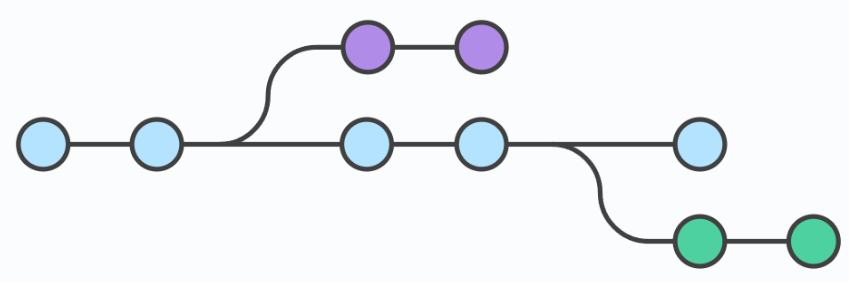

日期：2025年11月3日

#### 1. Git 的概念和作用

Git 是一个分布式版本控制系统，用于跟踪文件的变更历史，支持多人协作开发。

#### 2. git 工作流程

工作区 → 暂存区 → 本地仓库

- 工作区：正在编辑的文件所在目录。
- 暂存区：使用 git add 命令将修改加入暂存区，准备提交。
- 本地仓库：使用 git commit 将暂存区内容提交到本地版本库。

<p align='center'>
    
</p>


#### 3. git 的常用命令

配置 git 的账户与邮箱

``` git
git config -- user.name liutianba
git config -- user.email liutianba7@163.com
```

初始化仓库

```git
git init
```

将工作区的文件加入到暂存区

```
git add filename
git add . # 将工作区不再暂存区的文件全部加入到暂存区
git status # 查看文件状态（在不在缓存区）
```

查看本地仓库信息

```
git log # 查看提交记录
git reflog # 查看提交记录（精简版，可选项 -n x)
```

版本回滚

```
git reset -- hard 版本号
细节：git 回滚的头指针不会直接移回去，还是往前走，新结点是之前回滚版本的一个复制
```

#### 4. git 分支

Git 分支管理是 Git 强大功能之一，能够让多个开发人员并行工作，开发新功能、修复 bug 或进行实验，而不会影响主代码库。几乎每一种版本控制系统都以某种形式支持分支，一个分支代表一条独立的开发线。

使用分支意味着你可以从开发主线上分离开来，然后在不影响主线的同时继续工作。

<p align='center'>
    
</p>


<p align='center'>
    
</p>


创建分支

``` git
git branch 分支名
git branch -v // 查看分支
```

切换分支

```git
git checkout 分支名
git checkout -b 分支名 // 切换并创建分支
```

合并分支: 一旦某分支有了独立内容，你终究会希望将它合并回到你的主分支。 你可以使用以下命令将任何分支合并到当前分支中去：

```git
git merge 分支名 //把指定的分支合并到当前分支
```

删除分支

```git
git branch -d 分支名
```


#### 5. git 冲突

 当在合并分支时，出现同名文件同行内容不同的话，就会出现合并冲突，而解决方式就是去手动的选择要哪个分支上的内容，然后再去将当前工作区提交到本地仓库即可。

```git
git merge xxx
git add .
git commit -m "解决合并冲突"
```


#### 6. git 远程仓库

在远程仓库中，推送和拉去是以分支为单位的

##### 6.1 Ssh配置

使用 SSH 协议连接 Git 远程仓库，可实现免密推送/拉取代码，并提升安全性。流程：每次去访问远程仓库时，git 都会从指定位置带着密钥过去，而这个位置可以自己制定，在.ssh的配置文件下，这样就可以完成：不同远程仓库指定的密钥是不同的。

生成 SSH 密钥对

```
ssh-keygen -t ed25519 -C "your_email@example.com
```

启动 SSH 代理并添加私钥

```
# 启动 ssh-agent
eval "$(ssh-agent -s)" 
# 将私钥添加到 
ssh-agent ssh-add ~/.ssh/id_ed25519
```

然后就可以把公钥放到远程仓库了

##### 6.2 git 远程相关命令

关联和断开远程仓库

```
git remote add 别名 远程仓库的 ssh | https 地址
git remote -v # 查看远程仓库信息
git remote remove 别名 # 删除远程仓库
```

推送数据到远程仓库

```
git push 别名 本地分支名:远程分支名 # 没写远程分支名则在远程仓库建立一个同名的分支	
```

克隆远程仓库内容

```
git clone 远程仓库地址（1.创建远程仓库同名的一个文件夹 2.初始化仓库 3.关联远程仓库，默认名字为 origin，4.拉取现有远程仓库内容）
```

拉去远程仓库内容

```
git pull 别名 远程仓库中的分支名
```


##### 6.3 配置推送忽略文件

java日常项目模板：

``` java
# Compiled class file
*.class

# Log file
*.log

# BlueJ files
*.ctxt

# Mobile Tools for Java (J2ME)
.mtj.tmp/

# Package Files #
*.jar
*.war
*.nar
*.ear
*.zip
*.tar.gz
*.rar

# virtual machine crash logs, see http://www.java.com/en/download/help/error_hotspot.xml
hs_err_pid*

# IDE and Build Files
.classpath
.project
.settings
target
.idea
*.iml
```

全局配置：首先，在任意位置写一个xxx.ignore，然后，在git的配置文件中应用该文件即可

```
[core]
    excludesfile = **/xxx.ignore
```